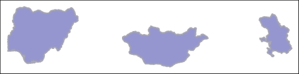
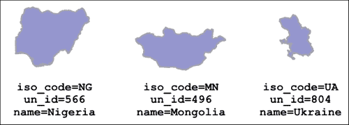
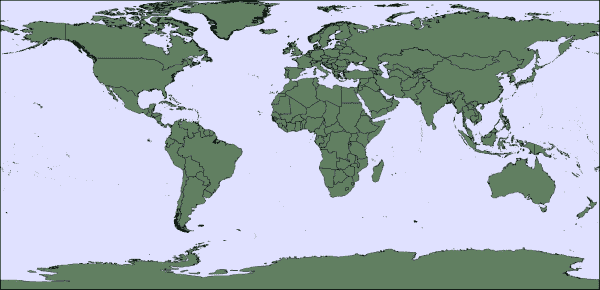
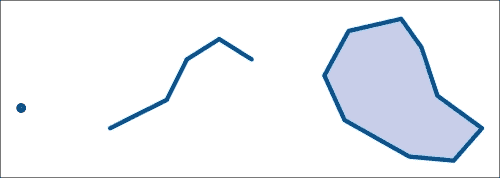
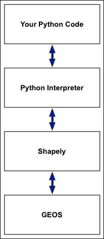
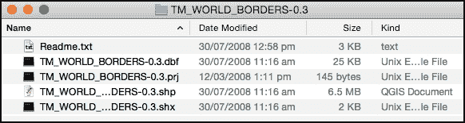
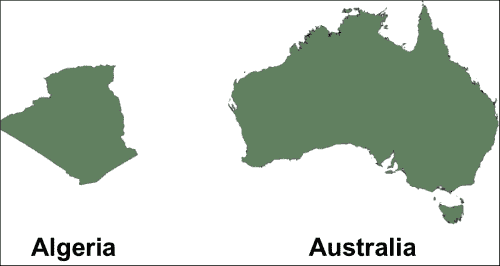
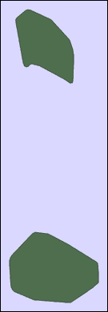

# 第一章 地理空间分析和技术

在本章的介绍中，我们将通过了解您通常将执行的任务类型来开始我们对地理空间分析的探索，然后查看空间数据以及您可以用来处理它的 Python 库。我们将通过编写一个用于分析一些地理空间数据的 Python 示例程序来结束。

随着您在本章的学习，您将：

+   熟悉地理空间分析将帮助解决的问题类型

+   了解各种类型的地理空间数据以及与位置数据相关的一些重要概念

+   设置您的计算机以使用您开始使用 Python 分析地理空间数据所需的第三方库

+   获取一些基本的地理空间数据以开始

+   学习如何使用 GDAL/OGR 库读取 shapefile 并提取每个要素的属性和几何形状

+   学习如何使用 Shapely 操作和分析地理空间数据

+   编写一个简单但完整的程序来识别邻近国家

让我们先看看通常使用地理空间分析解决的问题和任务类型。

# 关于地理空间分析

地理空间分析是读取、操作和总结地理空间数据以产生有用和有趣结果的过程。很多时候，您将回答如下问题：

+   苏萨利托和棕榈泉之间的最短驾驶距离是多少？

+   法国和比利时之间的边界总长度是多少？

+   新西兰沿海的每个国家公园的面积是多少？

这些问题的答案通常是一个或一系列数字。其他类型的地理空间分析将涉及根据现有数据计算新的地理空间数据集。例如：

+   计算从加利福尼亚州洛杉矶到新墨西哥州阿尔伯克基的 USA 66 的高程剖面。

+   展示我巴西赤道以北的部分。

+   突出显示如果海洋上升 2 米，拉罗汤加可能被淹没的区域。

在这些情况下，您将生成一组新的地理空间数据，您通常会将其显示在图表或地图上。

要执行此类分析，您需要两样东西：适当的地理空间分析工具和合适的地理空间数据。

我们很快将进行一些简单的地理空间分析。在我们这样做之前，让我们更仔细地看看地理空间数据的概念。

# 理解地理空间数据

地理空间数据是在地球表面上定位事物的数据。这是一个故意模糊的定义，它涵盖了位置和形状的概念。例如，一个车祸数据库可能包括标识每次事故发生位置的纬度和经度坐标，而一个县轮廓文件将包括每个县的定位和形状。同样，一次旅行的 GPS 记录将包括旅行者在时间上的位置，描绘出他们在旅行中走过的路径。

重要的是要认识到，地理空间数据不仅包括地理空间信息本身。例如，以下轮廓本身并不特别有用：



然而，一旦你添加了适当的**元数据**，这些轮廓就更有意义了：



因此，地理空间数据包括每个描述项的时空信息（位置和形状）和非时空信息（元数据）。

空间信息通常表示为一系列**坐标**，例如：

```py
location = (-38.136734, 176.252300)
outline = ((-61.686,17.024),(-61.738,16.989),(-61.829,16.996) ...)
```

这些数字对你来说可能没有太多意义，但一旦你将这些坐标系列绘制到地图上，数据突然变得容易理解：



地理空间数据有两种基本类型：

+   **栅格数据**：这是一种将世界划分为**单元格**并将值与每个单元格关联的地理空间数据。这与位图图像将图像划分为像素并将颜色与每个像素关联的方式非常相似；例如：

    每个单元格的值可能代表在地图上绘制栅格数据时使用的颜色——这通常是为了提供一个栅格底图，其他数据可以在其上绘制——或者它可能代表其他信息，例如海拔、湿度水平或土壤类型。

+   **矢量数据**：这是一种由一系列**特征**组成的地理空间数据。例如，包含国家的 shapefile 将有一个特征对应于每个国家。对于每个特征，地理空间数据集将有一个**几何形状**，这是与该特征关联的形状，以及任何数量的属性，包含该特征的元数据。

    一个特征的几何形状只是位于地球表面上的几何形状。这个几何形状由**点**、**线**（有时称为**线字符串**）和**多边形**或这些三种基本类型的组合构成：

    

你可能会遇到的典型栅格数据格式包括：

+   GeoTIFF 文件，基本上是带有地理参考信息的 TIFF 格式图像文件，用于在地球表面上准确定位图像。

+   美国地质调查局（USGS）的`.dem`文件，它以简单的 ASCII 数据格式存储**数字高程模型**（DEM）。

+   `.png`、`.bmp`和`.jpeg`格式的图像文件，以及相关的地理参考文件，用于在地球表面上定位图像。

对于矢量格式数据，你可能会遇到以下格式：

+   **Shapefile**：这是一种极其常见的文件格式，用于存储和共享地理空间数据。

+   **WKT（已知文本）**：这是一种基于文本的格式，常用于将几何形状从一个库或数据源转换为另一个。这也是从数据库检索特征时常用的格式。

+   **WKB（Well-Known Binary）**：这是 WKT 格式的二进制等效格式，将几何形状存储为原始二进制数据而不是文本。

+   **GML（Geometry Markup Language）**：这是一个基于 XML 的行业标准格式，通常在与其他 Web 服务通信时使用。

+   **KML（Keyhole Markup Language）**：这是由 Google 推广的另一种基于 XML 的格式。

+   **GeoJSON**：这是为存储和传输几何数据而设计的 JSON 版本。

因为你的分析只能与你要分析的数据一样好，所以获取和使用高质量的地理空间数据是至关重要的。确实，在执行地理空间分析时，一个主要挑战是获取适合工作的正确数据。幸运的是，有几个网站提供免费的高质量地理空间数据。但如果你在寻找更不为人知的数据集，你可能很难找到它。当然，你始终可以选择从头开始创建自己的数据，尽管这是一个极其耗时的工作过程。

我们将在第二章“地理空间数据”中回到地理空间数据的话题，我们将探讨什么使好的地理空间数据，以及如何获取它。

# 设置你的 Python 安装

要开始使用 Python 分析地理空间数据，我们将利用两个免费可用的第三方库：

+   **GDAL**：地理空间数据抽象库使你能够轻松以矢量和栅格格式读取和写入地理空间数据。

+   **Shapely**：正如其名所示，这是一个非常棒的库，它使你能够对几何形状执行各种计算。它还允许你操作形状，例如，通过将形状连接在一起或将它们拆分成各自的组成部分。

让我们继续安装这两个库到你的 Python 设置中，这样我们就可以立即开始使用它们了。

## 安装 GDAL

GDAL，或者更准确地说，GDAL/OGR 库，是由**开源地理空间基金会**发起的一个项目，旨在提供用于以各种格式读取和写入地理空间数据的库。从历史上看，GDAL 这个名字指的是用于读取和写入栅格格式数据的库，而 OGR 指的是用于访问矢量格式数据的库。这两个库现在已经合并，尽管名字仍然在类和函数名中使用，因此理解两者之间的区别是很重要的。

默认安装的 GDAL/OGR 允许你以 100 种不同的格式读取栅格地理空间数据，并以 71 种不同的格式写入栅格数据。对于矢量数据，GDAL/OGR 允许你以 42 种不同的格式读取数据，并以 39 种不同的格式写入。这使得 GDAL/OGR 成为访问和操作地理空间数据的一个极其有用的工具。

GDAL/OGR 是一个 C++库，具有各种绑定，允许您从其他语言访问它。在您的计算机上安装它后，您通常使用 Python 绑定通过 Python 解释器访问库。以下图解说明了这些各个部分是如何结合在一起的：


让我们继续安装 GDAL/OGR 库。GDAL（和 OGR）的主网站可以在[`gdal.org`](http://gdal.org)找到。

您如何安装它取决于您的计算机正在使用的操作系统：

+   对于 Windows 机器，您可以使用 FWTools 安装程序安装 GDAL/OGR，该安装程序可以从[`fwtools.maptools.org`](http://fwtools.maptools.org)下载。

    或者，您可以使用 OSGeo 安装程序安装 GDAL/OGR 和 Shapely，该安装程序可以在[`trac.osgeo.org/osgeo4w`](http://trac.osgeo.org/osgeo4w)找到。

+   对于 Mac OS X，您可以从[`www.kyngchaos.com/software/frameworks`](http://www.kyngchaos.com/software/frameworks)下载 GDAL 和 OGR 的完整安装程序。

+   对于 Linux，您可以从 GDAL 的主网站下载 GDAL/OGR 的源代码，并按照网站上的说明从源代码构建它。您可能还需要安装 GDAL 和 OGR 的 Python 绑定。

安装完成后，您可以通过启动 Python 解释器并输入`import osgeo.gdal`然后`import osgeo.ogr`来检查它是否正常工作。如果每次 Python 命令提示符都重新出现而没有错误消息，那么 GDAL 和 OGR 已成功安装，您就可以开始使用了：

```py
>>>import osgeo.gdal
>>>import osgeo.ogr
>>>

```

## 安装 Shapely

Shapely 是一个几何操作和分析库。它基于**几何引擎，开源**（**GEOS**）库，该库在 C++中实现了广泛的地理空间数据处理。Shapely 提供了一个 Python 接口来访问 GEOS，使得您可以直接在 Python 程序中使用这些操作。以下插图显示了您的 Python 代码、Python 解释器、Shapely 和 GEOS 库之间的关系：



Shapely 的主网站可以在[`pypi.python.org/pypi/Shapely`](http://pypi.python.org/pypi/Shapely)找到。

网站上有您所需的一切，包括如何使用库的完整文档。请注意，要安装 Shapely，您需要下载 Shapely Python 包和底层 GEOS 库。GEOS 库的网站可以在[`trac.osgeo.org/geos`](http://trac.osgeo.org/geos)找到。

您如何安装 Shapely 取决于您的计算机正在使用的操作系统：

+   对于 Windows，您应该使用 Shapely 网站上可用的预构建安装程序之一。这些安装程序包括它们自己的 GEOS 副本，因此不需要安装其他内容。

+   对于 Mac OS X，您应该使用在[`www.kyngchaos.com/software/frameworks`](http://www.kyngchaos.com/software/frameworks)可用的预构建 GEOS 框架。

    ### 小贴士

    注意，如果你从前面的网站安装了 **GDAL Complete** 软件包，那么你电脑上已经安装了 GEOS。

    一旦安装了 GEOS，你可以使用 `pip`，Python 包管理器来安装 Shapely：

    ```py
    pip install shapely

    ```

    如果你电脑上没有安装 `pip`，你可以按照 [`pip.pypa.io/en/latest/installing.html`](https://pip.pypa.io/en/latest/installing.html) 中的说明进行安装。

+   对于 Linux 机器，你可以从 GEOS 网站下载源代码并自行编译，或者安装一个包含 GEOS 的合适 RPM 或 APT 软件包。一旦完成，你可以使用 `pip install shapely` 来安装 Shapely 库本身。

安装完成后，你可以通过运行 Python 命令提示符并输入以下命令来检查 Shapely 库是否正常工作：

```py
>>> import shapely.geos
>>>

```

如果你再次得到 Python 命令提示符而没有错误，就像前面的例子一样，那么 Shapely 已经成功安装，你可以开始使用了。

# 获取一些地理空间数据

对于本章，我们将使用一个简单但仍然非常有用的地理空间数据文件，称为 **世界边界数据集**。该数据集由单个 shapefile 组成，其中 shapefile 中的每个特征代表一个国家。对于每个国家，相关的几何对象代表该国的轮廓。附加属性包含诸如国家名称、ISO 3166-1 代码、总面积、人口和联合国区域分类等元数据。

要获取世界边界数据集，请访问 [`thematicmapping.org/downloads/world_borders.php`](http://thematicmapping.org/downloads/world_borders.php)。

滚动到 **下载** 部分，并点击文件以下载。确保你下载的是完整版本而不是简化版本——你想要的文件将被称为 `TM_WORLD_BORDERS-0.3.zip`。

注意，shapefile 以 ZIP 归档的形式提供。这是因为 shapefile 由多个文件组成，如果它们存储在 ZIP 归档中，则更容易分发。下载文件后，双击 ZIP 归档以解压缩它。你将得到一个名为 `TM_WORLD_BORDERS-0.3` 的目录。在这个目录中应该包含以下文件：



以下表格解释了这些不同的文件以及它们包含的信息：

| 文件名 | 描述 |
| --- | --- |
| `Readme.txt` | 这是你的典型 README 文件，包含有关 shapefile 的有用信息。 |
| `TM_WORLD_BORDERS-0.3.shp` | 该文件包含每个特征的几何数据。 |
| `TM_WORLD_BORDERS-0.3.shx` | 这是一个 `.shp` 文件的索引，使得可以快速访问给定特征的几何形状。 |
| `TM_WORLD_BORDERS-0.3.dbf` | 这是一个数据库文件，包含每个特征的各个属性。 |
| `TM_WORLD_BORDERS-0.3.prj` | 此文件以纯文本文件的形式描述了数据使用的坐标系统和投影。 |

将此目录放置在方便的位置。我们将在整本书中广泛使用这个数据集，因此您可能希望在某个地方保留一个备份副本。

# 解锁 shapefile

最后，我们准备好开始处理一些地理空间数据。打开一个命令行或终端窗口，并将 `cd` 命令切换到您之前解压缩的 `TM_WORLD_BORDERS-0.3` 目录。然后输入 `python` 来启动您的 Python 解释器。

我们将首先加载我们之前安装的 OGR 库：

```py
>>> import osgeo.ogr

```

接下来，我们想使用 OGR 打开 `shapefile`：

```py
>>> shapefile = osgeo.ogr.Open("TM_WORLD_BORDERS-0.3.shp")

```

执行此语句后，`shapefile` 变量将包含一个 `osgeo.ogr.Datasource` 对象，它代表我们打开的地理空间数据源。OGR 数据源可以支持多个信息层，尽管 `shapefile` 只有一个层。因此，我们接下来需要从 shapefile 中提取（唯一的一个）层：

```py
>>>layer = shapefile.GetLayer(0)

```

让我们遍历 shapefile 中的各种特征，依次处理每个特征。我们可以使用以下方法：

```py
>>> for i in range(layer.GetFeatureCount()):
>>>     feature = layer.GetFeature(i)

```

`feature` 对象，`osgeo.ogr.Feature` 的一个实例，允许我们访问与特征相关的几何形状以及特征的属性。根据 `README.txt` 文件，国家的名称存储在一个名为 `NAME` 的属性中。现在让我们提取这个名称：

```py
>>>    feature_name = feature.GetField("NAME")

```

### 注意

注意，属性是大写的。Shapefile 属性是区分大小写的，因此你必须使用确切的字母大小写才能获取正确的属性。使用 `feature.getField("name")` 会生成错误。

要获取特征几何对象的引用，我们使用 `GetGeometryRef()` 方法：

```py
>>>     geometry = feature.GetGeometryRef()

```

我们可以用几何形状做很多事情，但就目前而言，让我们看看我们有什么类型的几何形状。我们可以使用 `GetGeometryName()` 方法来做到这一点：

```py
>>>>    geometry_type = geometry.GetGeometryName()

```

最后，让我们打印出我们为此特征提取的信息：

```py
>>>    print i, feature_name, geometry_type

```

这里是我们编写的完整小程序，用于解锁 shapefile 的内容：

```py
import osgeo.ogr
shapefile = osgeo.ogr.Open("TM_WORLD_BORDERS-0.3.shp")
layer = shapefile.GetLayer(0)
for i in range(layer.GetFeatureCount()):
    feature = layer.GetFeature(i)
    feature_name = feature.GetField("NAME")
    geometry = feature.GetGeometryRef()
    geometry_type = geometry.GetGeometryName()
    print i, feature_name, geometry_type
```

如果您第二次按 **Return** 键来关闭 `for` 循环，程序将运行，显示从 shapefile 中提取的每个国家的有用信息：

```py
0 Antigua and Barbuda MULTIPOLYGON
1 Algeria POLYGON
2 Azerbaijan MULTIPOLYGON
3 Albania POLYGON
4 Armenia MULTIPOLYGON
5 Angola MULTIPOLYGON
6 American Samoa MULTIPOLYGON
7 Argentina MULTIPOLYGON
8 Australia MULTIPOLYGON
9 Bahrain MULTIPOLYGON
...

```

注意，一些国家的几何形状是多边形，而其他国家的几何形状是多边形集合。正如其名称所暗示的，多边形集合只是一系列多边形。因为几何形状代表每个国家的轮廓，所以当国家的轮廓可以用单个形状表示时，使用多边形；而当轮廓有多个部分时，使用多边形集合。这种情况最常见于由多个岛屿组成的国家。例如：



如您所见，阿尔及利亚由一个多边形表示，而澳大利亚及其外围岛屿则是一个多边形。

# 分析数据

在上一节中，我们得到了一个表示每个国家轮廓的`osgeo.ogr.Geometry`对象。虽然我们可以直接对这个几何对象做很多事情，但在这个例子中，我们将轮廓复制到 Shapely 中，以便我们可以利用 Shapely 的地理空间分析功能。为此，我们必须将几何对象从 OGR 导出，并将其作为 Shapely 对象导入。为此，我们将使用 WKT 格式。仍然在 Python 解释器中，让我们获取单个特征的几何形状并将其转换为 Shapely 对象：

```py
>>> import shapely.wkt
>>> feature = layer.GetFeature(0)
>>> geometry = feature.GetGeometryRef()
>>> wkt = geometry.ExportToWkt()
>>> outline = shapely.wkt.loads(wkt)

```

因为加载了特征编号`0`，我们检索到了安提瓜和巴布达的轮廓，如果我们在地图上显示它，看起来会像以下这样：



`outline`变量以 Shapely `MultiPolygon`对象的形式保存了这个国家的轮廓。现在我们可以使用这个对象来分析几何形状。以下是一些我们可以用 Shapely 几何形状做的有用事情：

+   我们可以计算**质心**，这是几何形状中中心位置的点。

+   我们可以计算几何形状的**边界框**。这是一个定义多边形北部、南部、东部和西部边缘的矩形。

+   我们可以计算两个几何形状之间的**交集**。

+   我们可以计算两个几何形状之间的**差值**。

    ### 注意

    我们还可以计算诸如每个多边形的长度和面积等值。然而，因为 World Borders Dataset 使用所谓的*未投影坐标*，所以得到的长度和面积值将以度为单位来衡量，而不是米或英里。这意味着计算出的长度和面积可能不太有用。我们将在下一章探讨地图投影的性质，并找到一种方法来解决这个问题，这样我们就可以为多边形计算有意义的长度和面积值。但这对于我们来说现在太复杂了。

让我们显示我们特征质心的纬度和经度：

```py
>>> print outline.centroid.x, outline.centroid.y
-61.791127517 17.2801365868

```

因为 Shapely 不知道多边形位于哪个坐标系中，它使用更通用的`x`和`y`属性来表示一个点，而不是讨论经纬度值。记住，纬度对应南北方向的位置，即`y`值，而经度是东西方向的位置，即`x`值。

我们也可以显示大纲的边界框：

```py
>>> print outline.bounds
(-61.891113, 16.989719, -61.666389, 17.724998)

```

在这种情况下，返回的值是最小经纬度和最大经纬度（即`min_x`、`min_y`、`max_x`、`max_y`）。

当然，我们可以用 Shapely 做更多的事情，但这足以证明 Shapely 库正在工作，并且我们可以从 shapefile 中读取地理空间数据并将其转换为 Shapely 几何对象进行分析。

这是我们使用 Python shell 直接进行的极限——shell 对于这种快速实验来说很棒，但当你打字错误时，不得不重新输入行（或使用命令历史）会很快变得令人厌烦。对于任何更严肃的事情，您将想要编写一个 Python 程序。在本章的最后部分，我们将做 exactly that：创建一个基于我们所学知识来解决有用地理空间分析问题的 Python 程序。

# 一个识别邻国程序

对于我们的第一个真正的地理空间分析程序，我们将编写一个 Python 脚本，用于识别邻国。基本概念是提取每个国家的多边形或复合多边形，并查看哪些其他国家与每个多边形或复合多边形接触。对于每个国家，我们将显示一个与该国接壤的其他国家的列表。

让我们从创建 Python 脚本开始。创建一个名为`borderingCountries.py`的新文件，并将其放置在您之前下载的`TM_WORLD_BORDERS-0.3.shp`形状文件所在的同一目录中。然后输入以下内容到这个文件中：

```py
import osgeo.ogr
import shapely.wkt

def main():
    shapefile = osgeo.ogr.Open("TM_WORLD_BORDERS-0.3.shp")
    layer = shapefile.GetLayer(0)

    countries = {} # Maps country name to Shapely geometry.

    for i in range(layer.GetFeatureCount()):
        feature = layer.GetFeature(i)
        country = feature.GetField("NAME")
        outline = shapely.wkt.loads(feature.GetGeometryRef().ExportToWkt())

        countries[country] = outline

    print "Loaded %d countries" % len(countries)

if __name__ == "__main__":
    main()
```

到目前为止，这相当直接。我们正在使用我们之前学到的技术将形状文件的内容读入内存，并将每个国家的几何形状转换为 Shapely 对象。结果存储在`countries`字典中。最后，请注意，我们将程序逻辑放入了一个名为`main()`的函数中——这是一个好的实践，因为它允许我们使用`return`语句来处理错误。

现在运行您的程序以确保它正常工作：

```py
$ python borderingCountries.py
Loaded 246 countries

```

我们接下来的任务是识别接壤国家。我们的基本逻辑是遍历每个国家，然后找到与这个国家接壤的其他国家。以下是相关代码，您应该将其添加到`main()`函数的末尾：

```py
    for country in sorted(countries.keys()):
        outline = countries[country]

        for other_country in sorted(countries.keys()):

            if country == other_country: continue

            other_outline = countries[other_country]

            if outline.touches(other_outline):

                print "%s borders %s" % (country, other_country)
```

如您所见，我们使用`touches()`方法来检查两个国家的几何形状是否接触。

运行此程序现在将显示相邻的国家：

```py
$ python borderingCountries.py
Loaded 246 countries
Afghanistan borders Tajikistan
Afghanistan borders Uzbekistan
Albania borders Montenegro
Albania borders Serbia
Albania borders The former Yugoslav Republic of Macedonia
Algeria borders Libyan Arab Jamahiriya
Algeria borders Mali
Algeria borders Morocco
Algeria borders Niger
Algeria borders Western Sahara
Angola borders Democratic Republic of the Congo
Argentina borders Bolivia
...

```

恭喜！您已经编写了一个简单的 Python 程序来分析国家轮廓。当然，还有很多可以改进和扩展这个程序的地方。例如：

+   您可以添加命令行参数，让用户指定形状文件的名称以及用于显示国家名称的属性。

+   您可以添加错误检查来处理无效和非存在的形状文件。

+   您可以添加错误检查来处理无效的几何形状。

+   您可以使用空间数据库来加快处理过程。程序目前需要大约一分钟来完成，但使用空间数据库将大大加快这个过程。如果您处理的是大量空间数据，正确索引的数据库绝对是必不可少的，否则您的程序可能需要几周时间才能运行。

我们将在本书的后面部分讨论所有这些内容。

# 摘要

在本章中，我们通过探讨你通常需要解决的问题类型以及你将要处理的数据类型，开始了对地理空间分析的探索。我们发现并安装了两个主要的 Python 库来处理地理空间数据：GDAL/OGR 用于读取（和写入）数据，以及 Shapely 用于执行地理空间分析和操作。然后我们下载了一个包含国家数据的简单但有用的 shapefile，并学习了如何使用 OGR 库读取该 shapefile 的内容。

接着，我们看到了如何将 OGR 几何对象转换为 Shapely 几何对象，然后使用 Shapely 库来分析和操作该几何对象。最后，我们创建了一个简单的 Python 程序，结合了我们所学的一切，将国家数据加载到内存中，然后使用 Shapely 找到相互接壤的国家。

在下一章中，我们将更深入地探讨地理空间数据的话题，了解更多的地理空间数据类型和概念，以及探索一些主要的免费地理空间数据来源。我们还将学习为什么拥有良好的数据来工作很重要——以及如果你没有良好的数据会发生什么。
