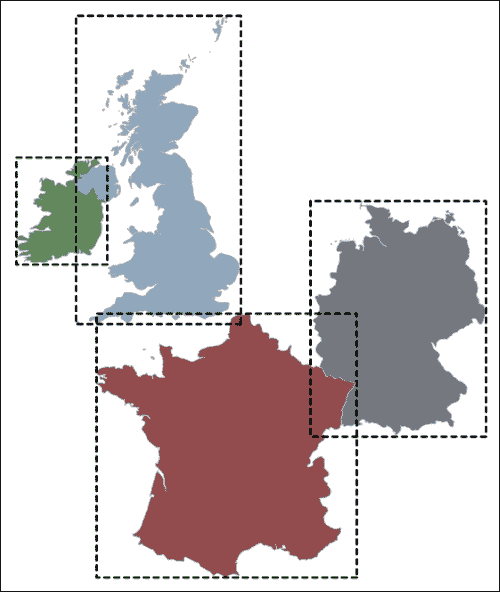
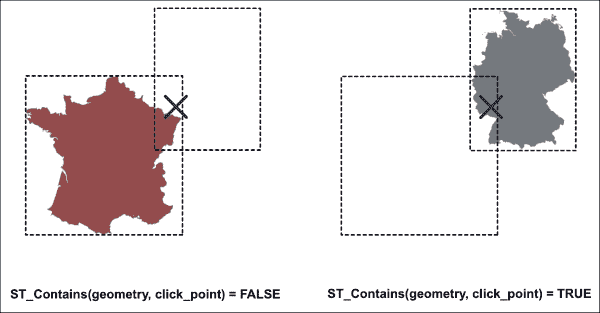
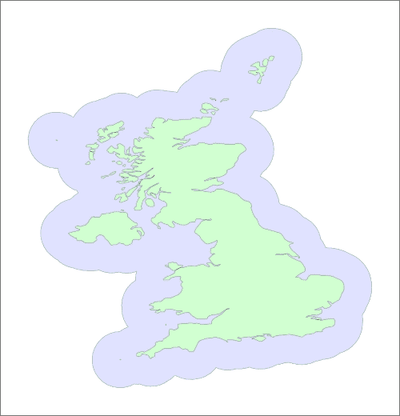

# 第三章：空间数据库

在本章中，我们将探讨如何使用数据库存储、分析和操作地理空间数据。虽然空间数据库可能相当复杂，优化空间查询的过程可能具有挑战性，但它们可以以简单直接的方式使用，而无需太多麻烦，并且是地理空间分析师工具箱的重要组成部分。

在本章中，我们将：

+   学习在使用空间数据库之前需要了解的重要概念

+   在您的计算机上安装 PostgreSQL 关系数据库系统

+   安装 PostGIS 扩展到 PostgreSQL 以支持空间数据库

+   安装`psycopg2`数据库适配器，以便您可以从 Python 程序访问 Postgres

+   学习如何使用 PostGIS 创建空间数据库

+   发现如何使用 Python 将数据导入您的空间数据库

+   学习如何使用 Python 代码查询您的空间数据库

+   看看您如何从 Python 操作您的空间数据

+   学习如何从空间数据库导出数据

让我们从查看空间数据库的概念及其工作方式开始。

# 空间数据库概念

如前一章所述，空间数据库是可以存储和查询空间数据的数据库。在空间启用数据库表的每个记录中都有一个或多个**几何字段**，这些字段将记录定位在地球表面的某个位置。几何字段（们）的使用将取决于您在数据库表中存储的信息类型。例如：

+   表示送货车辆的记录可能包括一个表示车辆当前位置的点几何形状。

+   表示道路的记录可能包括一个表示道路形状的 LineString 几何形状。

+   表示森林火灾的记录可能包括一个表示火灾影响区域的 Polygon 几何形状。

    ### 注意

    一些空间数据库允许您有多个几何字段，而其他数据库则限制每个记录只有一个。

单独来看，几何字段只是一个可以存储编码几何数据的数据库*blob*。数据通常以**已知二进制**（**WKB**）格式存储。这允许您从数据库中存储和检索几何数据。然而，单独来看，这并不非常有用——定义空间数据库的是使用存储的几何值构建**空间索引**的能力。

空间索引允许您根据记录在地球表面的位置在数据库中搜索记录。空间索引不会直接索引几何形状。相反，它为每个几何形状计算**边界框**，然后索引该边界框。以下插图显示了这是如何工作的：



空间索引的常见任务是指定包含给定点的几何形状（或几何形状）。例如，如果用户在地图上点击一个位置，你可能想知道用户点击的是哪个国家（如果有的话）。这可以通过以下空间数据库查询表示：

```py
SELECT * FROM table WHERE ST_Contains(table.geometry, click_point);

```

### 注意

`ST_Contains`函数是一个数据库查询函数的例子。此函数由 PostGIS 空间数据库提供。不同的空间数据库使用不同的名称来命名它们的查询函数；本章中列出的所有查询函数都来自 PostGIS，因为我们将在本书中使用该数据库。

要执行此查询，数据库首先使用空间索引来识别那些包含所需点的边界框的记录。此过程如下所示：


十字准线代表所需点，矩形代表边界框。正如你所见，有两个边界框包含所需点。这些边界框对应于数据库中标记为`法国`和`德国`的记录。数据库使用这些信息将每个匹配的几何形状加载到内存中，并逐一检查它们是否包含所需点：



以这种方式，数据库能够确定点击点位于德国境内。

让我们回顾这个过程，因为它是一个非常重要的概念。数据库首先使用存储在空间索引中的边界框来识别可能匹配的记录，然后加载每个可能的几何形状到内存中进行检查。这个两步过程非常高效：通过使用空间索引中的边界框，它立即排除了绝大多数不可能匹配的记录。然后，它只对少数可能的匹配进行相对耗时的加载几何形状到内存的任务，然后逐一检查这些记录。

理解执行空间查询的两步过程非常重要，因为您必须做一些事情来确保它正常工作。特别是：

+   您必须确保您想要查询的几何形状包含在空间索引中。

+   您必须仔细措辞您的查询，以便数据库实际上可以使用您设置的索引。例如，如果数据库必须将您的几何形状从一种空间参考系统转换到另一种，或者在进行查询之前对数据进行某种空间操作，那么您的空间索引将被忽略，数据库将回退到对您所有数据进行顺序扫描。这可能非常慢，可能需要数小时甚至数天才能完成单个查询。

+   例如，如果你有一个具有大边界框的极其复杂的几何形状，比如美国的一个详细轮廓，你可能会发现你的查询仍然需要很长时间才能完成。这是因为边界框覆盖了地球表面如此大的区域，它被包含在许多查询中，而轮廓的复杂性意味着查询仍然需要很长时间来处理。解决这个问题的方法之一是将一个大而复杂的几何形状分成更小的部分，这样数据库只需要处理一小部分而不是整个。

尽管存在这些潜在问题，空间数据库是存储和分析地理空间数据的绝佳工具。当然，空间数据库不仅限于使用 `ST_Contains()` 搜索记录。它们可以用于各种空间查询，如下表所示：

| 空间查询函数 | 描述 |
| --- | --- |
| `ST_Within` | 这匹配完全被给定多边形包围的几何形状的记录。 |
| `ST_Intersects` | 这匹配记录的几何形状与给定几何形状相交的记录。 |
| `ST_Crosses` | 这匹配记录的几何形状与给定的线或多边形交叉的记录。 |
| `ST_DWithin` | 这匹配位于给定位置或几何形状给定距离内的记录。 |

这些空间查询函数中有些细微之处你需要熟悉——这些在 PostGIS 文档中有详细描述。然而，这个表格应该能让你了解空间数据库的力量，并告诉你如何使用适当的空间索引的空间数据库可以是一个处理地理空间数据的强大工具，尤其是在你需要处理大量记录时。

现在你已经对空间数据库的工作原理有了些了解，让我们在你的电脑上安装一个，然后看看我们如何从你的 Python 程序中访问它。

# 安装空间数据库

在这本书中，我们将使用最受欢迎和最强大的地理空间数据库之一：PostGIS。PostGIS 是一个免费提供的 PostgreSQL 关系型数据库的扩展。为了在我们的 Python 程序中使用它，我们需要安装三个独立的软件组件：

+   The PostgreSQL database server itself

+   PostgreSQL 的 PostGIS 扩展

+   The `psycopg2` database adapter for Python

    ### 注意

    PostgreSQL 通常简称为 **Postgres**。在这本书中，我们将经常使用这个更口语化的名称。

让我们逐一了解安装这些软件组件的过程。

## 安装 PostgreSQL

PostgreSQL ([`postgresql.org`](http://postgresql.org)) 是最强大的开源关系型数据库之一。虽然它以设置和使用困难而闻名，但实际上并不太复杂，并且由于每个主要操作系统都有预构建的安装程序，设置过程现在相当直接。

让我们继续在您的计算机上安装 PostgreSQL。您如何操作取决于您正在运行的操作系统：

+   如果您的计算机运行的是 Microsoft Windows，您可以从 [`www.enterprisedb.com/products-services-training/pgdownload`](http://www.enterprisedb.com/products-services-training/pgdownload) 下载 PostgreSQL 的安装程序。选择适合您 Windows 版本（32 位或 64 位）的安装程序，并下载安装程序文件。然后只需双击下载的安装程序，并按照说明操作。

+   如果您正在运行 Mac OS X，您可以从 KyngChaos 网站下载 PostgreSQL 的有效版本，[`www.kyngchaos.com/software/postgres`](http://www.kyngchaos.com/software/postgres)。只需下载磁盘映像，打开它，然后双击 **PostgreSQL.pkg** 包文件来在您的计算机上安装 PostgreSQL。

+   如果您正在使用 Linux 机器，您可以遵循 PostgreSQL 下载页面上的说明，[`www.postgresql.org/download`](http://www.postgresql.org/download)。选择适合您使用的 Linux 发行版的链接，您将看到相应的安装说明。

安装 PostgreSQL 后，您可以通过在终端或命令行窗口中输入 `psql` 命令来检查它是否正在运行。如果一切顺利，您应该会看到 Postgres 命令行：

```py
psql (9.3.4)
Type "help" for help.

postgres=#

```

### 小贴士

如果 `psql` 命令在用户身份验证方面出现问题，您可能需要指定在连接到 Postgres 时使用的用户账户。例如：

```py
% psql –U postgres

```

许多 PostgreSQL 安装都有一个名为 `postgres` 的用户，当访问数据库时，您需要选择该用户（使用 `–U` 命令行选项）。或者，如果您正在运行 Microsoft Windows，您可能需要使用 `sudo` 切换到 root 用户，或者以管理员身份打开命令提示符。

## 安装 PostGIS

现在我们已经安装了 Postgres 本身，接下来我们需要安装 PostGIS 空间数据库扩展。PostGIS 的主要网站可以在 [`postgis.net`](http://postgis.net) 找到。您应该访问此网站，点击 **文档** 选项卡，并下载最新版本 PostGIS 的用户手册。您会发现这本手册非常有帮助，因为它详细解释了 PostGIS，包括您可以执行的各类查询。

您如何安装 PostGIS 取决于您正在运行的操作系统：

+   如果您的计算机运行的是 MS Windows，您可以从 [`download.osgeo.org/postgis/windows`](http://download.osgeo.org/postgis/windows) 下载 PostGIS 的安装程序。

+   对于 Mac OS X，从 [`kyngchaos.com/software/postgres`](http://kyngchaos.com/software/postgres) 下载并运行 PostGIS 安装程序。

    ### 注意

    注意，您还需要安装 GDAL 完整包，您应该在处理上一章时已经完成了这一步骤。

+   如果您使用的是基于 Linux 的操作系统，请遵循 PostGIS 安装页面上的说明：[`postgis.net/install`](http://postgis.net/install)。

要检查 PostGIS 是否已成功安装，请尝试在终端窗口中输入以下命令序列：

```py
% createdb test_database
% psql -d test_database -c "CREATE EXTENSION postgis;"
% dropdb test_database

```

### 小贴士

如果您需要在不同的用户账户下运行 PostgreSQL，则需要为这些命令添加 `–U postgres` 选项或使用 `sudo`。

如您可能猜到的，`createdb` 命令创建一个新的数据库。然后我们使用 `psql` 命令使用 PostGIS 扩展初始化该数据库，最后使用 `dropdb` 命令再次删除数据库。如果这一系列命令运行无误，则表示您的 PostGIS 安装（以及 Postgres 本身）已正确设置并运行。

## 安装 psycopg2

现在我们已经拥有了一个空间数据库，让我们安装 `psycopg2` 库，以便我们可以使用 Python 访问它。

### 注意事项

`psycopg2` 是一个标准的 Python 数据库适配器——也就是说，它是一个符合 PEP 249 中指定的 Python 数据库 API 的库（[`www.python.org/dev/peps/pep-0249`](https://www.python.org/dev/peps/pep-0249)）。我们将探讨如何使用 `psycopg2` 存储和查询空间数据，但如果您之前没有使用过 Python 数据库适配器，您可能想查看有关此主题的可用教程。有关此主题的一个很好的教程可以在 [`halfcooked.com/presentations/osdc2006/python_databases.html`](http://halfcooked.com/presentations/osdc2006/python_databases.html) 找到。

`psqcopg2` 的网站可以在 [`initd.org/psycopg`](http://initd.org/psycopg) 找到。通常，您安装此库的方式取决于您使用的操作系统：

+   对于 MS Windows 系统，您可以从 [`www.stickpeople.com/projects/python/win-psycopg`](http://www.stickpeople.com/projects/python/win-psycopg) 下载可双击安装的程序包。

+   如果您的计算机运行的是 Mac OS X 系统，可以在 [`www.kyngchaos.com/software/python`](http://www.kyngchaos.com/software/python) 找到可双击安装的程序包。

+   对于 Linux 机器，您需要从源代码安装 `psycopg2`。有关如何操作的说明，请参阅 [`initd.org/psycopg/docs/install.html`](http://initd.org/psycopg/docs/install.html)。

要检查是否安装成功，请启动您的 Python 解释器并输入以下命令：

```py
>>> import psycopg2
>>>

```

如果 `psycopg2` 安装正确，您应该会看到 Python 解释器提示符重新出现，且没有错误信息，如本示例所示。如果出现错误信息，您可能需要遵循 `psycopg2` 网站上的故障排除说明。

# 从 Python 访问 PostGIS

到目前为止，我们已经将一些工具和库安装到了您的计算机上。现在，是时候使用这些工具和库做一些有趣的事情了。在本章的剩余部分，我们将把世界边界数据集导入到名为 `world_borders` 的 PostGIS 数据库中，然后使用 Python 对该数据进行各种查询。我们还将了解如何使用 PostGIS 和 Python 操作该数据集。

首先，创建一个名为 `world_borders` 的新目录并将其放置在方便的位置。您将使用此目录来存储您创建的各种文件。

# 设置空间数据库

当使用 `psycopg2` 访问数据库时，我们首先必须指定我们要使用哪个数据库。这意味着在您的 Python 代码可以使用它之前，数据库必须存在。为了设置一切，我们将使用 Postgres 命令行工具。在终端或命令行窗口中输入以下内容：

```py
% createdb world_borders
```

### 提示

不要忘记包含 `-U postgres` 选项，或者如果需要以不同的用户账户访问 Postgres，请使用 `sudo`。

这创建了数据库本身。接下来，我们想要为我们的数据库启用 PostGIS 空间扩展。为此，请输入以下命令：

```py
% psql -d world_borders -c "CREATE EXTENSION postgis;"
```

现在我们已经设置了数据库本身，让我们在数据库中创建一个表来存储我们的空间数据。为此，我们将创建一个名为 `create_table.py` 的 Python 程序。请创建一个名为 `world_borders` 的目录，并在其中创建此文件，然后输入以下内容到文件中：

```py
import psycopg2
```

我们现在想要打开到数据库的连接。为此，我们必须告诉 `psycopg2` 我们要使用哪个数据库以及哪个用户账户（以及可能，哪个密码）来访问该数据库。这是通过向 `psycopg2.connect()` 函数提供关键字参数来完成的，如下所示：

```py
connection = psycopg2.connect(database="world_borders", user="...", password="...")
```

### 提示

您只需要 `user` 参数，如果您在运行 Postgres 命令行工具时需要提供 `-U` 命令行参数。您也只需要 `password`，如果该用户账户受密码保护。

一旦我们建立了数据库连接，我们接下来设置一个 `cursor` 对象，我们将使用它向数据库发出命令：

```py
cursor = connection.cursor()
```

下一步可能有点反直觉：我们不会创建数据库表，而是会删除它如果它已经存在。这样做可以让我们多次运行 `create_table.py` 脚本而不会产生任何错误。以下是相关代码：

```py
cursor.execute("DROP TABLE IF EXISTS borders")
```

`execute()` 语句告诉游标运行给定的 SQL 命令。在这种情况下，命令是 `DROP TABLE IF EXISTS`，它告诉数据库如果表已存在，则删除（删除）该表。

我们现在可以使用以下命令创建我们的数据库表：

```py
cursor.execute("CREATE TABLE borders (" +
                   "id SERIAL PRIMARY KEY," +
                   "name VARCHAR NOT NULL," +
                   "iso_code VARCHAR NOT NULL," +
                   "outline GEOGRAPHY)")
```

注意，我们将此命令拆分到多行，以便更容易阅读。除了最后一行之外，这是一个标准的 SQL 数据库表定义：我们正在创建一个表，其中每个记录都有一个由数据库自动分配的唯一`id`值，一个`name`值和一个`iso_code`值。在最后一行中，我们创建`outline`字段，并给它一个`GEOGRAPHY`类型。地理字段是 PostGIS 特有的；它们是`GEOMETRY`字段类型的一种变体，旨在与使用未投影纬度和经度坐标的空间数据一起工作。

既然我们已经创建了我们的数据库表，让我们为这些数据设置一个空间索引。正如我们所见，空间索引将大大加快对数据库的查询速度。让我们为我们的`outline`字段创建一个空间索引：

```py
cursor.execute("CREATE INDEX border_index ON borders USING GIST(outline)")
```

最后，因为 Postgres 是一个事务型数据库，我们需要*提交*我们所做的更改，以使它们永久。以下是完成此操作的必要代码：

```py
connection.commit()
```

这完成了我们的`create_table.py`程序，它应该看起来像下面这样：

```py
import psycopg2

connection = psycopg2.connect(database="world_borders", user="...", password="...")
cursor = connection.cursor()

cursor.execute("DROP TABLE IF EXISTS borders")

cursor.execute("CREATE TABLE borders (" +
                   "id SERIAL PRIMARY KEY," +
                   "name VARCHAR NOT NULL," +
                   "iso_code VARCHAR NOT NULL," +
                   "outline GEOGRAPHY)")

cursor.execute("CREATE INDEX border_index ON borders USING GIST(outline)")
connection.commit()
```

如果你运行这个程序，你的数据库表和相关的空间索引将被创建。现在，让我们将世界边界数据集的内容导入我们新创建的表中。

# 导入空间数据

复制你之前下载的`TM_WORLD_BORDERS-0.3`目录，并将其放置在你的`world_borders`目录内。然后创建另一个名为`import_data.py`的 Python 脚本。这就是你将放置将数据导入数据库的代码的地方。

我们将使用 OGR 库从 shapefile 导入数据，并使用`psycopg2`将其插入数据库。因此，我们程序的前两行应该看起来像下面这样：

```py
import osgeo.ogr
import psycopg2
```

接下来，我们需要打开到数据库的连接。执行此操作的代码与我们在`create_table.py`脚本中使用的代码相同：

```py
connection = psycopg2.connect(database="world_borders", user="...", password="...")
cursor = connection.cursor()
```

### 小贴士

不要忘记调整`psycopg2.connect()`的关键字参数，以匹配你需要连接到 PostgreSQL 的用户账户。

我们现在准备开始从 shapefile 导入数据。不过，首先我们将删除我们数据库表中的现有内容；这将使我们能够多次运行我们的`import_data.py`程序，在添加新记录之前清除现有记录，这样我们每次都是从一张白纸开始：

```py
cursor.execute("DELETE FROM borders")
```

我们现在准备从 shapefile 导入数据到数据库中。让我们先打开 shapefile，并逐个提取我们想要的信息：

```py
shapefile = osgeo.ogr.Open("TM_WORLD_BORDERS-0.3/TM_WORLD_BORDERS-0.3.shp")
layer = shapefile.GetLayer(0)

for i in range(layer.GetFeatureCount()):
    feature  = layer.GetFeature(i)
    name     = feature.GetField("NAME")
    iso_code = feature.GetField("ISO3")
    geometry = feature.GetGeometryRef()
```

这应该对你来说很熟悉，因为我们已经在上一章中使用了 OGR 来读取 shapefile 的内容。现在我们有了几何形状，我们可以将其转换为 WKT 格式，如下所示：

```py
    wkt = geometry.ExportToWkt()
```

我们现在有了将要素插入数据库所需的所有信息。以下是执行实际插入的代码：

```py
    cursor.execute("INSERT INTO borders (name, iso_code, outline) VALUES (%s, %s, ST_GeogFromText(%s))", (name, iso_code, wkt))
```

这里有很多事情在进行中，所以让我们更仔细地看看这个命令。我们在这里使用 `INSERT`，这是一个标准的 SQL 命令。`INSERT` 命令有以下基本结构：

```py
INSERT INTO table (field, field, ...) VALUES (value, value, ...);
```

如您所见，我们指定了数据库表名、字段列表以及要存储到这些字段中的值。

作为标准的 Python 数据库适配器，`psycopg2` 将自动将 Python 值（如整数、浮点数、字符串、`datetime` 对象等）转换为它们的 SQL 等价物。这就是那些 `%s` 占位符的作用所在——我们在 SQL 命令字符串的每个想要提供值的地方使用 `%s`，然后作为 `cursor.execute()` 命令的第二个参数提供实际的值。例如，考虑以下 Postgres 命令：

```py
cursor.execute("INSERT INTO users (name, age) VALUES (%s, %s)", (user_name, user_age))
```

这个命令将记录插入到 `users` 表中，将 `name` 字段设置为 `user_name` 变量的值，并将 `age` 字段设置为 `user_age` 变量的值。这种将 Python 值转换为 SQL 字面量的转换非常强大，并且是使用数据库适配器的主要好处之一。

在我们将 shapefile 的内容导入到 `borders` 表的 `INSERT` 语句中，有一个最后的复杂性：我们使用 `ST_GeogFromText()` 函数在插入到 `outline` 字段之前将我们的 WKT 格式字符串转换为地理值。我们必须这样做，因为 OGR 和 Postgres 使用不同的内部表示形式来表示几何数据。WKT 格式字符串是这些两种内部表示之间的 *通用语言*。

在我们从 shapefile 导入各种特征之后，我们必须提交我们的更改，以便它们被写入数据库：

```py
connection.commit()
```

将所有这些放在一起，这就是我们的 `import_data.py` 程序的样子：

```py
import osgeo.ogr
import psycopg2

connection = psycopg2.connect(database="world_borders", user="...", password="...")
cursor = connection.cursor()

cursor.execute("DELETE FROM borders")

shapefile = osgeo.ogr.Open("TM_WORLD_BORDERS-0.3.shp")
layer = shapefile.GetLayer(0)

for i in range(layer.GetFeatureCount()):
    feature = layer.GetFeature(i)
    name = feature.GetField("NAME")
    iso_code = feature.GetField("ISO3")
    geometry = feature.GetGeometryRef()
    wkt = geometry.ExportToWkt()

    cursor.execute("INSERT INTO borders (name, iso_code, outline) VALUES (%s, %s, ST_GeogFromText(%s))", (name, iso_code, wkt))

connection.commit()
```

当我们运行这个程序时，World Borders Dataset shapefile 中的所有记录都应导入到数据库中。请注意，这只需要几秒钟就能完成——尽管我们必须将轮廓从 OGR 几何形状转换为 WKT，然后再从 WKT 转换为 PostGIS 地理对象，但这并不需要很长时间。

如果您愿意，可以运行 `psql` 命令行客户端，并输入如 `SELECT id,name,iso_code FROM borders` 这样的命令来查看您已导入的数据。但当然，我们真正想要的是使用 Python 来查询我们的空间数据库。现在让我们这样做。

# 查询空间数据

让我们再写一个 Python 程序来对数据库内容执行各种查询。首先创建另一个名为 `query_data.py` 的 Python 文件，并将其放置在 `world_borders` 目录中。我们首先导入 `psycopg2` 库，打开到我们数据库的连接，并创建一个数据库游标：

```py
import psycopg2
connection = psycopg2.connect(database="world_borders", user="...", password="...")
cursor = connection.cursor()
```

这一切都应该来自我们之前创建的 `create_table.py` 程序。

现在让我们执行一个简单的（非空间）数据库查询，只是为了看看它是如何工作的。将以下内容添加到你的程序末尾：

```py
cursor.execute("SELECT id,name FROM borders ORDER BY name")
for row in cursor:
    print row
```

当你运行你的 `query_data.py` 程序时，你应该看到来自你的 `borders` 表的记录 ID 和相关名称的列表：

```py
(1264, 'Afghanistan')
(1237, 'Albania')
(1235, 'Algeria')
...

```

注意，你使用 `cursor.execute()` 来执行你的查询，然后遍历游标以获取匹配的行。每行的值是一个包含你请求的字段的元组。

### 注意

当然，你也可以使用 `%s` 在你的查询中包含 Python 值，例如：

```py
cursor.execute("SELECT id FROM borders WHERE name=%s", (country_name,))
```

到目前为止，我们一直在使用 PostgreSQL 的非空间方面。现在让我们针对这些数据执行一个空间查询。我们将要求数据库识别所有距离巴黎 1,000 公里的国家。使用 PostGIS 中的 `GEOGRAPHY` 数据类型，这很容易做到：

```py
lat    = 48.8567
long   = 2.3508
radius = 1000000

cursor.execute("SELECT name FROM borders WHERE ST_DWITHIN(" +
                   "ST_MakePoint(%s, %s), outline, %s)", (long, lat, radius))
for row in cursor:
    print row[0]
```

`ST_DWithin` 命令识别距离指定点 `radius` 米内的国家；运行程序应该返回一个列表，列出距离巴黎 1,000 公里的国家：

```py
San Marino
Denmark
Ireland
Austria
...
Switzerland
United Kingdom

```

这让你了解 PostGIS 的强大功能以及你可以使用 `psycopg2` 数据库适配器执行的查询类型。确保你研究 PostGIS 手册中的 *PostGIS 参考部分*，以了解你可以执行的各种类型的空间查询。

# 操作空间数据

在你的空间分析中，你不仅限于使用静态数据。你还可以在 PostGIS 数据库中直接创建新几何形状并操作现有几何形状。虽然使用我们之前使用的 `ST_GeogFromText()` 函数等函数创建全新的几何形状很容易，但你也可以使用 PostGIS 几何编辑和几何处理函数从旧几何形状派生新的地理值。

### 注意

当你使用 PostGIS 的 `GEOGRAPHY` 类型时，有一些函数可用性的限制。PostGIS 最初只支持 `GEOMETRY` 数据类型，该数据类型设计为仅与投影到平坦笛卡尔平面的空间数据一起工作。当使用 `GEOGRAPHY` 字段时，请查看 PostGIS 手册以了解哪些函数受支持。

为了了解我们如何根据现有数据计算新的空间值，让我们编写一个程序来缓冲我们的轮廓，并将它们存储到我们数据库表中的新 `GEOGRAPHY` 列中。

我们在上一章中看到了 `buffer()` 操作，我们看到了它通常可以用来修复无效的几何形状。如果你还记得，`buffer()` 操作构建了一个新的几何形状，它包括现有几何形状一定距离内的所有点。以下图像显示了英国的轮廓，以及缓冲后的相同轮廓：



让我们编写一个程序来计算这些缓冲轮廓。在你的 `world_borders` 目录中创建一个新的 Python 脚本，并将其命名为 `buffer.py`。将以下内容输入到这个文件中：

```py
import psycopg2
connection = psycopg2.connect(database="world_borders", user="...", password="...")
cursor = connection.cursor()
```

我们现在想要创建一个新的字段来存储缓冲的大纲。为此，请将以下内容添加到文件末尾：

```py
try:
    cursor.execute("ALTER TABLE borders ADD COLUMN buffered_outline GEOGRAPHY")
except psycopg2.ProgrammingError:
    connection.rollback()
```

`ALTER TABLE`命令是一个标准的 Postgres 命令，用于更改数据库表的结构；在这种情况下，我们添加一个名为`buffered_outline`的新`GEOGRAPHY`列。

### 注意

注意，我们将我们的`ALTER TABLE`命令包裹在`try...except`语句中。这是因为如果列已经存在，`psycopg2`将引发`ProgrammingError`。通过捕获这个错误，我们可以多次运行我们的`buffer.py`程序而不会失败，因为`buffered_outline`字段已经添加到表中。

由于`psycopg2`中异常的事务问题，当发生异常时，我们必须调用`connection.rollback()`。这允许程序即使在抛出异常的情况下也能继续运行。

我们下一个任务是计算缓冲的大纲。使用 PostGIS，这非常简单：

```py
cursor.execute("UPDATE borders SET buffered_outline=ST_Buffer(outline, 1000)")
```

在这个 SQL 语句中，我们将`buffered_outline`字段的值设置为`ST_Buffer()`命令的结果。`ST_Buffer()`命令接受一个地理值和一个以米为单位的距离；它返回一个包含所有在给定距离内的现有地理点的新的地理值。

我们最后的任务是提交我们对数据库所做的更改：

```py
connection.commit()
```

这实际上完成了我们的`buffer.py`程序，如果我们运行它，我们将得到存储在`buffered_outline`字段中的每个大纲的缓冲版本。然而，因为这个程序没有显示任何内容，所以无法知道它是否真的工作。为了解决这个问题，让我们添加一个最终的空问查询来计算并显示每个大纲的面积。

我们查询的基本结构将如下所示：

```py
cursor.execute("SELECT name, ST_Area(outline), ST_Area(buffered_outline) FROM borders ORDER BY name")
for name, area1, area2 in cursor:
    ...
```

`ST_Area()`函数的结果是以平方米为单位的地理面积。因为这些数字可能非常大，我们希望将它们转换为平方千米进行显示。然而，有一个小问题：当我们缓冲几何形状时，它有时可能变得无效，因为缓冲的几何形状超出了有效的纬度和经度值范围。尽管我们只缓冲了千米，但任何接近北极或南极，或接近经度-180 或+180 度极限的地理形状都将有一个无效的缓冲轮廓。当我们尝试计算这些无效轮廓的面积时，结果将是一个`NaN`（不是一个数字）值。

让我们添加一些代码来检查无效的面积并优雅地处理它们；将之前代码列表中的`...`行替换为以下内容：

```py
    if not math.isnan(area1):
        area1 = int(area1/1000000)
    else:
        area1 = "n/a"
    if not math.isnan(area2):
        area2 = int(area2/1000000)
    else:
        area2 = "n/a"
    print name, area1, area2
```

您还需要在程序顶部添加一个`import math`语句。

运行这个程序需要大约一分钟的时间来计算所有缓冲区，之后将显示计算出的面积：

```py
Afghanistan 641915 646985
Albania 28676 29647
Algeria 2317478 2324740
American Samoa 229 363
...
Zimbabwe 389856 392705
Åland Islands 817 1144

```

如您所见，缓冲区域比原始区域略大，这是您所期望的。

# 导出空间数据

我们对空间数据库的介绍几乎完成；唯一剩下要检查的是如何再次从 PostGIS 中获取空间数据，例如将其保存回 shapefile。要从 `GEOGRAPHY` 字段中提取空间值，请使用 `ST_AsText()` 函数。例如：

```py
cursor.execute("SELECT name,ST_AsText(outline) FROM borders")
for name,wkt in cursor:
    geometry = osgeo.ogr.CreateGeometryFromWkt(wkt)
    ...
```

您可以使用 OGR 几何对象将空间数据写入 shapefile，或者对它进行任何您希望执行的操作。

# 摘要

在本章中，我们探讨了空间数据库如何成为地理空间数据分析的强大工具。我们介绍了空间数据库背后的重要概念，并在您的计算机上安装了 PostgreSQL、PostGIS 和 `psycopg2`。然后，我们通过创建空间数据库、将数据导入该数据库、执行空间查询、使用 PostGIS 操作空间数据以及使用 Python 代码从空间数据库导出数据，亲自动手实践。

在下一章中，我们将探讨如何使用 Mapnik 库根据我们的地理空间数据制作出外观精美的地图。
