# 第四章 创建地图

在本章中，我们将探讨 Python 程序如何使用 Mapnik 库创建外观精美的地图。你将在计算机上安装 Mapnik，学习 Mapnik 库的基础知识，并了解如何使用它生成简单的地图。然后，我们将探索 Mapnik 的更多高级特性，并了解它如何用于产生各种复杂的视觉效果。最后，我们将创建一个有用的程序，该程序将任何形状文件的 内容以地图的形式显示出来。

# 介绍 Mapnik

如果不能可视化地理空间数据，很难理解其含义。通常，通过绘制地图来使空间数据可见——实际上，地图只不过是由空间数据创建的图像。**Mapnik** ([`mapnik.org`](http://mapnik.org)) 是一个强大的工具，可以将原始地理空间数据转换为地图图像。

Mapnik 本身是用 C++ 编写的，但它附带了一些绑定，允许你从 Python 访问它。使用 Python 代码，你可以定义组成地图的各个图层，指定包含要显示的数据的数据源，然后设置样式，以控制如何绘制各种特征。

当你刚开始使用 Mapnik 时，它可能会让你感到有些难以接近，所以让我们直接动手，立即开始。首先，让我们在你的计算机上安装 Mapnik，并使用它生成一个简单的地图，然后再深入探讨如何使用 Mapnik 库构建和样式化地图。

## 安装 Mapnik

要安装 Mapnik，请访问 Mapnik 主网站上的下载页面 ([`mapnik.org/pages/downloads.html`](http://mapnik.org/pages/downloads.html))，并选择适合你操作系统的安装程序。对于 Mac OS X 和 MS Windows，都有预构建的包可用。对于 Linux 计算机，你需要从源代码编译程序，或者使用包管理器下载、编译和安装 Mapnik 及其各种依赖项；有关如何操作的完整说明可在 Mapnik 下载页面上找到。

## Mapnik 的初体验

我们将通过编写一个简单的程序来开始对 Mapnik 的探索，该程序使用我们之前下载的世界边界数据集生成地图。将 `TM_WORLD_BORDERS-0.3` 目录的内容复制到方便的位置，然后在同一目录中创建一个新的 Python 程序。将你的新程序命名为 `mapnik_example.py`。此程序将根据世界边界数据集形状文件的内容生成一个 PNG 格式的图像文件。

将以下内容输入到你的 `mapnik_example.py` 文件中：

```py
import mapnik

map = mapnik.Map(1200, 600)
map.background = mapnik.Color("#e0e0ff")

layer = mapnik.Layer("countries")
layer.datasource = mapnik.Shapefile(file="TM_WORLD_BORDERS-0.3.shp")
layer.styles.append("country_style")
map.layers.append(layer)

fill_symbol = mapnik.PolygonSymbolizer(mapnik.Color("#60a060"))
line_symbol = mapnik.LineSymbolizer(mapnik.Color("black"), 0.5)

rule = mapnik.Rule()
rule.symbols.append(fill_symbol)
rule.symbols.append(line_symbol)

style = mapnik.Style()
style.rules.append(rule)

map.append_style("country_style", style)

map.zoom_all()
mapnik.render_to_file(map, "map.png", "png")
```

当你运行此程序时，应在同一目录中创建一个名为 `map.png` 的新文件。打开此文件将显示生成的地图：

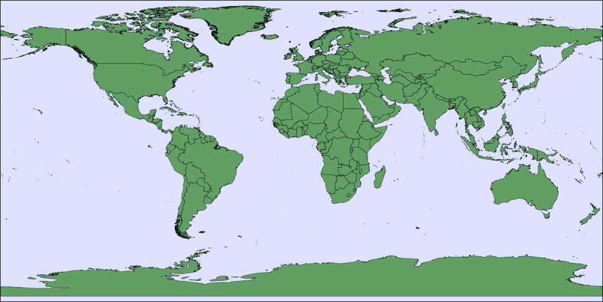

现在我们已经看到了我们的示例程序是如何工作的，让我们仔细看看它，并依次检查每个部分。让我们从程序的开始部分开始：

```py
import mapnik

map = mapnik.Map(1200, 600)
map.background = mapnik.Color("#e0e0ff")
```

在这里，我们简单地导入 Mapnik 库，然后创建并初始化一个新的 **地图** 对象。地图图像宽度为 1,200 像素，高度为 600 像素，地图背景为浅蓝色，由十六进制颜色值 `#e0e0ff` 定义。

一个地图由一个或多个 **地图层** 组成。在我们的程序中，我们只有一个地图层，我们将其设置为访问 `TM_WORLD_BORDERS` shapefile：

```py
layer = mapnik.Layer("countries")
layer.datasource = mapnik.Shapefile(file="TM_WORLD_BORDERS-0.3.shp")
layer.styles.append("country_style")
map.layers.append(layer)
```

在这个层定义中，有几个需要注意的地方：

+   每个地图层都有一个 **名称**，该名称在地图中唯一标识了层；在我们的程序中，我们称我们的地图层为 `countries`。

+   每个层都有一个 **数据源**，它告诉 Mapnik 数据应该从哪里获取。在这种情况下，我们使用 `mapnik.Shapefile` 类从 shapefile 加载数据，尽管可以使用许多不同类型的数据源。例如，您可以直接从空间数据库加载数据，甚至可以使用 Python 数据源以编程方式创建和显示要素。

+   `layer.styles.append("country_style")` 这一行告诉 Mapnik 应该使用哪个 **风格** 来绘制层的数据。Mapnik 风格通过名称引用，并且可以与每个层关联任意数量的风格。

    ### 注意

    Mapnik 层还可以与一个空间参考系统相关联。如果您没有指定空间参考系统，Mapnik 将假设数据位于标准的 EPSG 4326 空间参考系统中。

接下来，我们想要定义 `country_style` 风格，该风格将绘制我们的地图层的内容。一个风格由任意数量的 **规则** 组成，其中每个规则都有一个可选的 **过滤器**，用于标识数据源中哪些要素应该使用此规则绘制，以及一个用于将匹配的要素绘制到地图上的 **符号化器** 列表。

我们首先创建两个符号化器：一个用于用淡绿色填充每个多边形的内部，另一个用于用细黑线绘制每个多边形的轮廓：

```py
fill_symbol = mapnik.PolygonSymbolizer(mapnik.Color("#60a060"))
line_symbol = mapnik.LineSymbolizer(mapnik.Color("black"), 0.5)
```

对于填充符号，我们再次使用十六进制颜色代码来定义用于绘制多边形内部的颜色，而对于线符号，我们使用一个命名颜色。请注意，`0.5` 值定义了绘制每个多边形轮廓的宽度，单位为像素。

现在我们已经有了我们的两个符号化器，接下来我们定义一个规则，使用它们来绘制 shapefile 的内容：

```py
rule = mapnik.Rule()
rule.symbols.append(fill_symbol)
rule.symbols.append(line_symbol)
```

注意，这个规则没有过滤器；过滤器的缺失告诉 Mapnik 应该使用这两个符号化器绘制层数据源中的每个要素。

为了完成定义我们的 `country_style` 风格，我们初始化 `Style` 对象本身，将我们唯一的规则添加到风格中，然后将风格对象添加到我们的映射中：

```py
style = mapnik.Style()
style.rules.append(rule)

map.append_style("country_style", style)
```

注意，我们在将风格添加到地图对象时给出了一个名称；因为这个名称用于标识地图层使用的风格，所以当我们添加风格到地图以及引用地图层中的风格时，使用完全相同的名称是很重要的。

我们最后的任务是告诉地图要显示世界的哪个区域，以及如何将地图的可见部分**渲染**成图像文件：

```py
map.zoom_all()
mapnik.render_to_file(map, "map.png", "png")
```

在我们的示例中，我们放大以显示地图层中的所有数据，并将结果保存为名为`map.png`的 PNG 格式图像文件。

这就完成了我们使用 Mapnik 生成地图图像的示例 Python 程序。你可以使用 Mapnik 做很多更复杂的事情，但这将给你一个了解它是如何工作以及你可以用它做什么的思路。

## 构建地图

现在我们已经看到了 Mapnik 的一个示例，让我们更仔细地看看 Mapnik 库背后的某些理念。例如，考虑以下美国西海岸的地图：

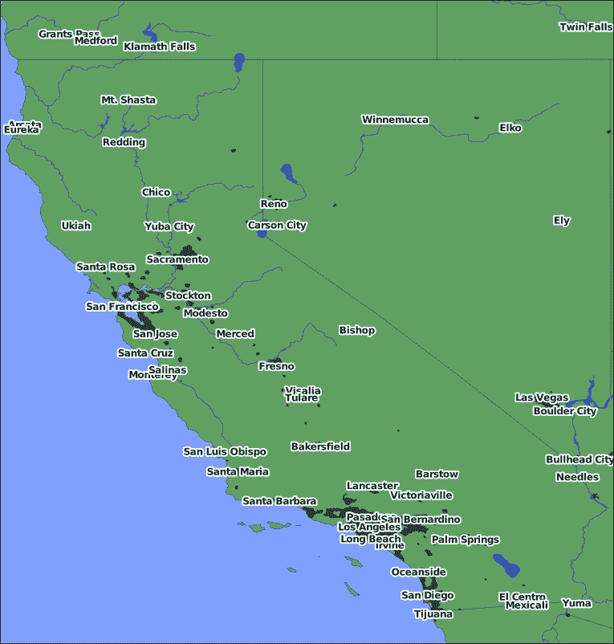

这张地图实际上由四个不同的地图层组成：

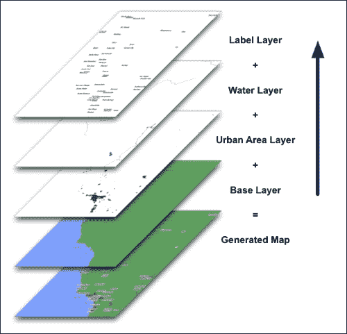

正如你所见，地图层是逐层叠加绘制的，如图表右侧的箭头所示。为了达到正确的视觉效果，层需要以*相反*的顺序添加，这样添加的每一层都会出现在地图中已有的层之前。也就是说，基础层应该首先添加，然后是城市区域层，依此类推。层添加到地图中的顺序非常重要；如果你顺序错误，某些层可能会被遮挡。

## 地图样式化

正如我们之前看到的，地图的样式是通过创建`mapnik.Style`对象并将其添加到地图中定义的，每个对象都有一个独特的名称：

```py
style = mapnik.Style()
# ...setup style
map.append_style("style_name", style)
```

我们通过将样式名称添加到层的`styles`列表中，告诉每个地图层我们希望该层使用哪些样式：

```py
layer.styles.append("style_name")
```

你可能会认为直接将样式定义添加到地图层会更简单，但通过名称引用样式的这个过程是有意为之的：它将*显示的内容*与*显示的方式*分离开来。这种方法允许你在多个地图层中使用相同的样式集，或者只需通过交换样式名称就可以完全改变地图的外观。

### 注意

定义你的地图样式有另一种方式。而不是创建自己的`mapnik.Style`对象并逐个将其添加到地图中，你可以使用 XML 格式的样式表一次性定义所有样式。虽然这非常强大，但 XML 样式表很难阅读，而且非常不符合 Python 风格。出于这些原因，我们在这本书中不会使用 XML 样式表。

在我们的示例程序中，我们创建了一个单一的`mapnik.Style`对象，它只包含一条规则。这条规则有两个符号化器与之相关联，告诉 Mapnik 如何绘制每个国家多边形的内部和外部。然而，规则可以更加复杂，包括在规则被使用之前必须满足的各种*条件*。例如，考虑以下 Python 代码片段：

```py
symbol1 = ...
symbol2 = ...
symbol3 = ...

rule1 = mapnik.Rule()
rule1.filter = mapnik.Filter("[POPULATION] < 500000")
rule1.symbols.append(symbol1)

rule2 = mapnik.Rule()
rule.filter = mapnik.Filter("[POPULATION] < 1000000")
rule2.symbols.append(symbol2)

rule3 = mapnik.Rule()
rule3.set_else(True)
rule3.symbols.append(symbol3)

style.rules.append(rule1)
style.rules.append(rule2)
style.rules.append(rule3)
```

由于样式的规则是依次评估的，因此当特征的`POPULATION`属性值小于 500,000 时，此样式将使用`symbol1`绘制特征；如果特征的`POPULATION`属性值在 500,000 到 1,000,000 之间，则使用`symbol2`绘制特征；如果特征的`POPULATION`属性值是 1,000,000 或更多，则使用`symbol3`绘制特征。

### 注意

除了具有过滤器外，规则还可以有一个最小和最大比例因子，在这个比例因子下规则将生效。例如，当地图被放大到最大时，可以使用此功能隐藏较小的特征。

由于规则中可以有多个符号，特征的绘制方式也可以变得相当复杂。例如，您可以定义一个规则，该规则使用三个不同的符号化器来绘制 LineString 几何形状作为街道：


如您所想象，结合符号化、规则、过滤器和样式将为您在选择哪些特征应在地图中显示以及如何绘制这些特征方面提供极大的灵活性。

# 学习 Mapnik

现在您已经看到了 Mapnik 能做什么，并对 Mapnik 的工作方式有了一些了解，让我们更深入地了解 Mapnik 库的其他方面。在本章的这一节中，我们将介绍数据源、符号化和地图渲染。

## 数据源

每个地图层都与一个**数据源**（`mapnik.Datasource`的子类）相关联，该数据源提供要在地图上显示的数据。各种类型的数据源通过 C++插件提供，这些插件在编译 Mapnik 时启用或禁用。要检查是否安装了特定类型的数据源，请检查相关的插件是否已安装到您的 Mapnik 副本中。您可以通过在 Python 命令提示符中输入以下内容来查看已安装的插件列表（因此，支持的源数据）：

```py
import mapnik
print list(mapnik.DatasourceCache.plugin_names())

```

Mapnik 当前支持以下数据源插件：

+   **csv**：此插件提供`mapnik.CSV`数据源，可以从文本文件或字符串中读取表格数据。默认情况下，数据以**CSV**（逗号分隔值）格式存储，尽管也支持其他类似格式。

    CSV 数据源将自动根据包含“lat”、“latitude”、“lon”、“long”和“longitude”等名称的列头识别点几何形状。如果列头命名为“geojson”或“wkt”，数据源还将检测 GeoJSON 和 WKT 格式的几何形状。有关`csv`插件的文档，请参阅[`github.com/mapnik/mapnik/wiki/CSV-Plugin`](https://github.com/mapnik/mapnik/wiki/CSV-Plugin)。

+   **gdal**: 此插件提供了 `mapnik.Gdal` 数据源。此数据源使用 GDAL 库读取栅格格式数据并将其提供给地图层。要在地图层中使用此数据源，您需要向地图层添加一个样式，该样式包含一个 `mapnik.RasterSymbolizer` 以在地图上绘制栅格数据。有关 `gdal` 插件的文档，请参阅 [`github.com/mapnik/mapnik/wiki/GDAL`](https://github.com/mapnik/mapnik/wiki/GDAL)。

+   **ogr**: 此插件实现了 `mapnik.Ogr` 数据源。此数据源使用 OGR 库读取矢量格式数据。有关 `ogr` 插件的文档，请参阅 [`github.com/mapnik/mapnik/wiki/OGR`](https://github.com/mapnik/mapnik/wiki/OGR)。

+   **osm**: `osm` 插件提供了 `mapnik.Osm` 数据源。此数据源读取 OpenStreetMap XML 格式的数据。有关 `osm` 插件的文档，请参阅 [`github.com/mapnik/mapnik/wiki/OsmPlugin`](https://github.com/mapnik/mapnik/wiki/OsmPlugin)。

+   **postgis**: 此插件提供了 `mapnik.PostGIS` 数据源。此数据源连接到 PostGIS 数据库，并从指定的数据库表中读取空间数据。在创建 PostGIS 数据源时，您使用 `host`、`dbname`、`user` 和 `password` 参数来告诉 Mapnik 如何连接到特定的 PostGIS 数据库，而 `table` 参数指定从哪个表中读取数据。

    对于特殊目的，还提供了额外的参数，例如限制显示数据的范围，或使用 SQL 子查询仅包括数据库表中的某些记录。有关 postgis 插件的完整文档，请参阅 [`github.com/mapnik/mapnik/wiki/PostGIS`](https://github.com/mapnik/mapnik/wiki/PostGIS)。

+   **python**: 此插件提供了 `mapnik.Python` 数据源。这允许您通过编写一个自定义的 Python 类来访问要显示的数据，从而实现自己的数据源。要编写自定义 Python 数据源，您通常需要创建 `mapnik.PythonDatasource` 的子类，然后在调用 mapnik.Python() 函数实例化数据源时使用您自定义类的名称作为 `factory` 参数。然后，在您的类中实现必要的函数以提供对数据的访问。有关 python 插件的文档，请参阅 [`github.com/mapnik/mapnik/wiki/Python-Plugin`](https://github.com/mapnik/mapnik/wiki/Python-Plugin)。

+   **栅格**：此插件实现了 `mapnik.Raster` 数据源，用于显示 TIFF 或 GeoTIFF 格式的栅格图像文件的内容。虽然您也可以使用 `gdal` 插件读取栅格格式数据，但在读取这些类型的文件时，`raster` 插件速度更快。要在地图层中使用此数据源，您需要向地图层添加一个样式，该样式包括一个 `RasterSymbolizer` 以在地图上绘制图像文件的内容。有关 `raster` 插件的文档，请参阅 [`github.com/mapnik/mapnik/wiki/Raster`](https://github.com/mapnik/mapnik/wiki/Raster)。

+   **形状**：此插件提供了 `mapnik.Shapefile` 数据源，允许您读取形状文件。虽然 `ogr` 数据源也能读取形状文件，但通常使用 `mapnik.Shapefile` 数据源更方便。有关 `shape` 插件的文档，请参阅 [`github.com/mapnik/mapnik/wiki/ShapeFile`](https://github.com/mapnik/mapnik/wiki/ShapeFile)。

+   **sqlite**：此插件提供了 `mapnik.SQLite` 数据源。此数据源从 SQLite 数据库读取空间数据。数据库可以是包含 WKB 格式几何数据的普通 SQLite 数据库，也可以是使用 Spatialite 数据库扩展的空间数据库。有关 `sqlite` 插件的文档，请参阅 [`github.com/mapnik/mapnik/wiki/SQLite`](https://github.com/mapnik/mapnik/wiki/SQLite)。

## 符号化器

符号化器负责在地图上绘制特征。通常使用多个符号化器来绘制单个特征——我们之前在同时使用 `PolygonSymbolizer` 绘制多边形内部和 `LineSymbolizer` 绘制多边形轮廓时看到了这一点。

Mapnik 内部有许多不同类型的符号化器可用，许多符号化器都与复杂的选项相关联。我们不会详尽地列出所有符号化器和它们的选项，而是仅查看一些更常见的符号化器类型及其使用方法。

### 点符号化

`PointSymbolizer` 类用于在点几何上绘制图像。默认情况下，每个点都显示为一个 4 x 4 像素的黑色方块：

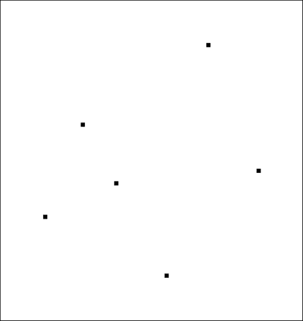

要使用不同的图像，您必须创建一个 `mapnik.PathExpression` 对象来表示所需图像文件的路径，然后在实例化时将其传递给 `PointSymbolizer` 对象：

```py
path = mapnik.PathExpression("/path/to/image.png")
point_symbol = PointSymbolizer(path)
```

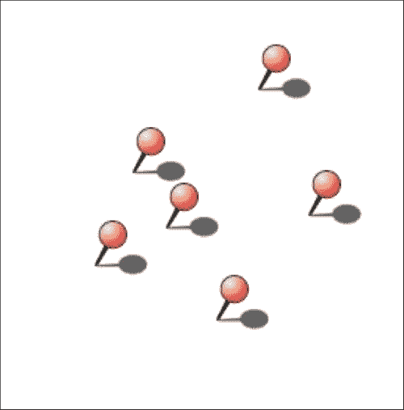

注意，`PointSymbolizer` 在期望的点周围绘制图像。要使用前面示例中显示的推针图像，您需要添加额外的透明空白区域，以便推针的尖端位于图像的中间，如下所示：

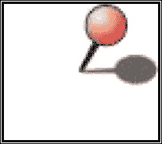

你可以通过设置符号化的 `opacity` 属性来控制绘制图像的不透明度。你还可以通过设置 `allow_overlap` 属性为 `True` 来控制是否在图像上绘制标签。最后，你可以通过将 `transform` 属性设置为包含标准 SVG 变换表达式的字符串来对图像应用 SVG 变换，例如 `point_symbol.transform = "rotate(45)"`。

PointSymbolizer 的文档可以在 [`github.com/mapnik/mapnik/wiki/PointSymbolizer`](https://github.com/mapnik/mapnik/wiki/PointSymbolizer) 找到。

### LineSymbolizer

`mapnik.LineSymbolizer` 用于绘制 LineString 几何形状和 Polygon 几何形状的轮廓。当你创建一个新的 LineSymbolizer 时，通常会使用两个参数来配置它：用于绘制线的颜色，作为一个 `mapnik.Color` 对象，以及线的宽度，以像素为单位。例如：

```py
line_symbol = mapnik.LineSymbolizer(mapnik.Color("black"), 0.5)
```

注意，你可以使用分数线宽；由于 Mapnik 使用抗锯齿，如果你在绘制很多紧密排列的线时，宽度小于 1 像素的线通常比整数宽度的线看起来更好。

除了颜色和宽度之外，你还可以通过设置 `opacity` 属性使线半透明。这应该设置为介于 0.0 和 1.0 之间的数字，其中 0.0 表示线将完全透明，1.0 表示线将完全不透明。

你还可以使用 `stroke` 属性来访问（或替换）由线符号化器使用的线对象。线对象是一个 `mapnik.Stroke` 的实例，可以用于更复杂的视觉效果。例如，你可以通过调用线的 `add_dash()` 方法来创建虚线效果：

```py
line_symbol.stroke.add_dash(5, 7)
```

这两个数字都是以像素为单位的；第一个数字是虚线段的长度，而第二个数字是虚线之间的间隙长度。

### 提示

注意，你可以通过多次调用 `add_dash()` 来创建交替的虚线模式。

你还可以通过设置 `stroke` 的 `line_cap` 属性来控制线端应该如何绘制，以及通过设置 `stroke` 的 `line_join` 属性来控制当 LineString 改变方向时，各个线段之间的连接应该如何绘制。`line_cap` 属性可以设置为以下值之一：

```py
mapnik.line_cap.BUTT_CAP
mapnik.line_cap.ROUND_CAP
mapnik.line_cap.SQUARE_CAP

```

`line_join` 属性可以设置为以下值之一：

```py
mapnik.line_join.MITER_JOIN
mapnik.line_join.ROUND_JOIN
mapnik.line_join.BEVEL_JOIN

```

`LineSymbolizer` 类的文档可以在 [`github.com/mapnik/mapnik/wiki/LineSymbolizer`](https://github.com/mapnik/mapnik/wiki/LineSymbolizer) 找到。

### PolygonSymbolizer

`mapnik.PolygonSymbolizer` 类用于用给定的颜色填充 Polygon 几何形状的内部。当你创建一个新的 PolygonSymbolizer 时，通常会传递给它一个参数：用于填充多边形的 `mapnik.Color` 对象。你也可以通过设置 `fill_opacity` 属性来改变符号化的不透明度，例如：

```py
fill_symbol.fill_opacity = 0.8
```

一次又一次，不透明度是从 0.0（完全透明）到 1.0（完全不透明）测量的。

除了 PolygonSymbolizer 属性外，还有一个你可能觉得有用的属性：`gamma`。`gamma`值可以设置为 0.0 到 1.0 之间的数字。`gamma`值控制绘制多边形边缘时使用的反走样量；默认的`gamma`值为`1.0`，多边形的边缘将完全反走样。虽然这通常是好事，但如果你尝试用相同的颜色绘制相邻的多边形，反走样会导致多边形的边缘可见，而不是将它们组合成更大的单一区域。通过稍微降低 gamma 值（例如，`fill_symbol.gamma = 0.6`），相邻多边形之间的边缘将消失。

`PolygonSymbolizer`类的文档可以在[`github.com/mapnik/mapnik/wiki/PolygonSymbolizer`](https://github.com/mapnik/mapnik/wiki/PolygonSymbolizer)找到。

### 文本符号化

`TextSymbolizer`类用于在地图上绘制文本标签。此类符号化器可用于点、LineString 和 Polygon 几何形状。以下示例显示了如何使用 TextSymbolizer：

```py
text_symbol = mapnik.TextSymbolizer(mapnik.Expresion("[label]"), "DejaVu Sans Book", 10, mapnik.Color("black"))
```

如你所见，通常将四个参数传递给 TextSymbolizer 的初始化器：

+   定义要显示的文本的`mapnik.Expression`对象。在这种情况下，要显示的文本将来自数据源中的`label`属性。

+   用于绘制文本的字体名称。要查看可用的字体，请在 Python 命令行中输入以下内容：

    ```py
    import mapnik
    for font in mapnik.FontEngine.face_names():
        print font
    ```

+   字体大小，以像素为单位。

+   用于绘制文本的颜色。

默认情况下，文本将在几何形状的中心绘制；例如：

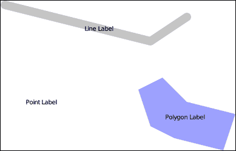

这种标签定位被称为**点** **放置**。TextSymbolizer 允许你将其更改为使用所谓的**线** **放置**，其中标签将沿着线条绘制：

```py
text_symbol.label_placement = mapnik.label_placement.LINE_PLACEMENT
```

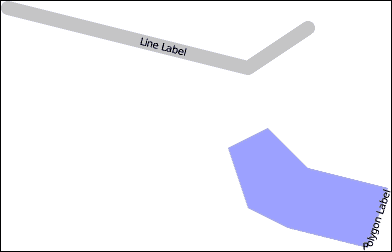

如你所见，这会导致标签沿着 LineString 几何形状的长度或多边形的周长绘制。对于点几何形状，不会绘制文本，因为点内没有线条。

TextSymbolizer 通常会只绘制一次标签，但你可以通过指定每个标签之间的像素间隔来告诉符号化器重复标签：

```py
text_symbol.label_spacing = 30
```

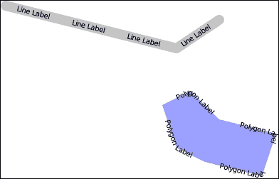

默认情况下，Mapnik 足够智能，可以阻止标签相互重叠。如果可能，它会稍微移动标签以避免重叠，如果仍然会重叠，则会完全隐藏标签。例如：

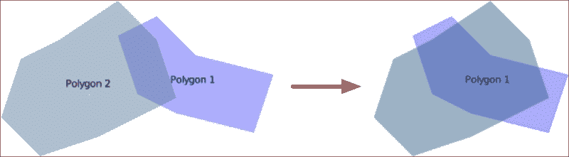

你可以通过设置`allow_overlap`属性来更改此设置：

```py
text_symbol.allow_overlap = True
```

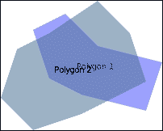

最后，你可以设置一个光环效果，在文本周围绘制较浅颜色的边框，使其即使在深色背景上也能可见。例如，

```py
text_symbol.halo_fill = mapnik.Color("white")
text_symbol.halo_radius = 1
```

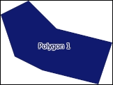

有许多其他标签选项，所有这些都在`TextSymbolizer`类的文档中详细描述。这可以在[`github.com/mapnik/mapnik/wiki/TextSymbolizer`](https://github.com/mapnik/mapnik/wiki/TextSymbolizer)找到。

### RasterSymbolizer

`RasterSymbolizer`类用于在地图上绘制栅格格式数据。这种符号化类型通常与栅格或 GDAL 数据源一起使用。要创建一个新的栅格符号化，你需要实例化一个新的`mapnik.RasterSymbolizer`对象：

```py
raster_symbol = mapnik.RasterSymbolizer()
```

栅格符号化将自动绘制地图层数据源提供的任何栅格格式数据。这通常用于绘制基图，在基图上显示矢量数据；例如：

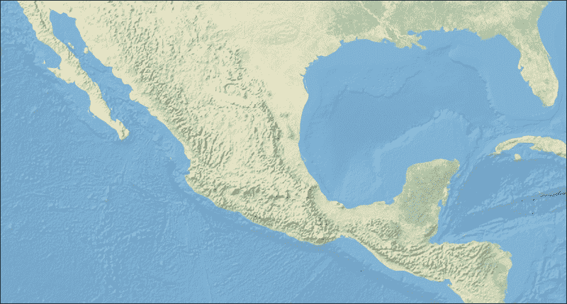

虽然有一些高级选项可以控制栅格数据的显示方式，但在大多数情况下，你可能感兴趣的唯一选项是`opacity`属性。像往常一样，这设置了显示图像的不透明度，允许你将半透明的栅格图像一层层叠加。

`RasterSymbolizer`的文档可以在[`github.com/mapnik/mapnik/wiki/RasterSymbolizer`](https://github.com/mapnik/mapnik/wiki/RasterSymbolizer)找到。

## 地图渲染

我们现在已经详细检查了生成地图的许多构建块：图层、数据源、样式、规则、过滤器以及符号化。使用你所学的知识，你应该能够构建和设计你自己的地图。但是，一旦设置了`mapnik.Map`对象，你能用它做什么呢？

在本章开头我们检查的示例程序中，我们使用了`mapnik.render_to_file()`函数将生成的地图保存到图像文件中。在渲染地图时，你首先必须设置地图的**范围**——即定义地图可见部分的矩形：

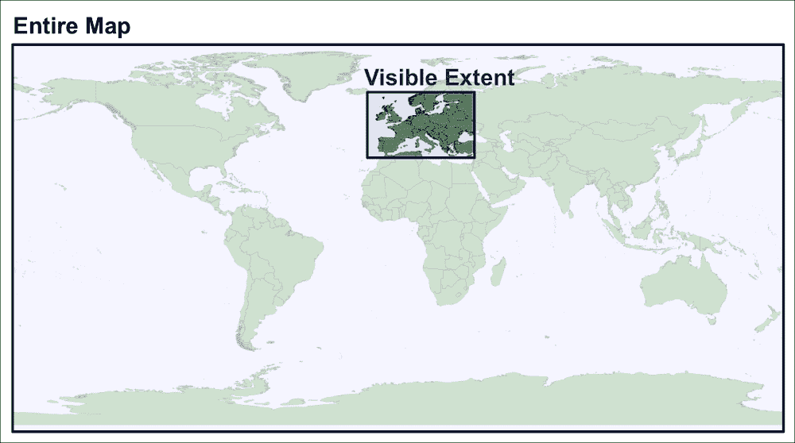

只有地图的可见范围将被包含在生成的图像中；其他所有内容都将被忽略。

在我们的示例程序中，我们使用了`map.zoom_all()`来设置地图的可见范围，包括所有地图层中的所有要素。当然，有时你可能只想显示整体地图的一部分。为此，你可以使用`map.zoomToBox()`方法设置地图的可见范围。例如：

```py
map.zoomToBox(mapnik.Box2d(-124.5, 32.0, -114.0, 43.0))
```

这四个数字分别代表最小经度、最小纬度、最大经度和最大纬度。如果你使用这些纬度和经度值执行此语句，地图的可见范围将覆盖大约美国的加利福尼亚州。

注意，你不仅限于只渲染一次地图。如果你想，你可以从单个`mapnik.Map`对象创建多个图像，改变可见范围，然后每次调用`mapnik.render_to_file()`将新可见的地图部分保存到不同的文件中。

# 一个工作示例

让我们将我们所学的所有内容结合起来，编写一个可以显示 shapefile 内容的程序。这是一个非常有用的程序，因为你可以操作或生成一些空间数据，将结果保存到 shapefile 中，然后运行此程序以显示生成的地图图像。

我们将我们的程序命名为 `shapeToMap.py`。创建此文件，并将以下 Python 代码开始输入到其中：

```py
import mapnik

LAYERS = [
    {'shapefile'  : "TM_WORLD_BORDERS-0.3.shp",
     'lineColor'  : "black",
     'lineWidth'  : 0.4,
     'fillColor'  : "#709070",
     'labelField' : "NAME",
     'labelSize'  : 12,
     'labelColor' : "black"
    }
]

BACKGROUND_COLOR = "#a0c0ff"

BOUNDS_MIN_LAT  = 35.26
BOUNDS_MAX_LAT  = 71.39
BOUNDS_MIN_LONG = -10.90
BOUNDS_MAX_LONG = 41.13

MAX_WIDTH  = 1600
MAX_HEIGHT = 800
```

注意，我们在这里定义的各种常量将被用于配置我们将要生成的地图：

+   `LAYERS`: 这是一个要在地图上显示的地图层列表。列表中的每个项目应是一个字典，包含以下条目之一或全部：

    +   `shapefile`: 目标 shapefile 的名称和路径

    +   `lineColor`: 用于绘制特征外部的十六进制颜色代码（如果有的话）

    +   `lineWidth`: 用于绘制特征外部的线条宽度，以像素为单位

    +   `fillColor`: 用于绘制特征内部的十六进制颜色代码（如果有的话）

    +   `labelField`: 如果有的话，用于标记每个特征的源文件中的属性名称

    +   `labelSize`: 标记特征时使用的字体大小，以像素为单位

    +   `labelColor`: 用于绘制标签的十六进制颜色代码

+   `BACKGROUND_COLOR`: 这是用于绘制地图背景的十六进制颜色代码。

+   `BOUNDS_MIN_LAT`, `BOUNDS_MIN_LONG`, `BOUNDS_MAX_LAT`, 和 `BOUNDS_MAX_LONG`: 这些定义了你想要生成的地图的可视范围。

+   `MAX_WIDTH` 和 `MAX_HEIGHT`: 这些指定生成的地图图像的最大尺寸。请注意，生成的图像实际上可能小于这些值，具体取决于边界矩形的纵横比。

每次你想使用此程序生成地图时，你都需要编辑这些常量以适应你的需求。

我们接下来需要计算用于地图的高度和宽度。因为可视范围可以是任何形状，我们计算实际宽度和高度尽可能大，同时匹配可视范围的纵横比。我们通过首先计算地图的宽度和高度来实现这一点，使宽度为最大允许宽度，高度为匹配可视范围纵横比所需的任何值。为此，请将以下代码添加到程序末尾：

```py
extent = mapnik.Envelope(BOUNDS_MIN_LONG, BOUNDS_MIN_LAT,  BOUNDS_MAX_LONG, BOUNDS_MAX_LAT)
aspectRatio = extent.width() / extent.height()

mapWidth = MAX_WIDTH
mapHeight = int(mapWidth / aspectRatio)
```

我们接下来查看计算出的高度是否太大，如果是，则缩小地图，使高度不超过允许的最大值：

```py
if mapHeight > MAX_HEIGHT:
    scaleFactor = float(MAX_HEIGHT) / float(mapHeight)
    mapWidth = int(mapWidth * scaleFactor)
    mapHeight = int(mapHeight * scaleFactor)
```

这确保生成的地图尽可能大，同时确保地图具有与可视范围相同的纵横比。

现在我们知道了我们的地图有多大，我们可以创建并初始化我们的 `mapnik.Map` 对象：

```py
map = mapnik.Map(mapWidth, mapHeight)
map.background = mapnik.Color(BACKGROUND_COLOR)
```

我们接下来需要定义我们各种地图样式，为每个地图层使用单个样式和规则。注意，我们使用 `LAYERS` 列表中的各种字典条目来为每个层定义地图样式：

```py
for i,src in enumerate(LAYERS):
    style = mapnik.Style()
    rule = mapnik.Rule()

    if src['fillColor'] != None:
        symbol = mapnik.PolygonSymbolizer(
                    mapnik.Color(src['fillColor']))
        rule.symbols.append(symbol)
    if src['lineColor'] != None:
        symbol = mapnik.LineSymbolizer(
                    mapnik.Color(src['lineColor']),
                    src['lineWidth'])
        rule.symbols.append(symbol)
    if src['labelField'] != None:
        symbol = mapnik.TextSymbolizer(
                     mapnik.Expression(
                            "[" + src['labelField'] + "]"),
                            "DejaVu Sans Bold",
                            src['labelSize'],
                            mapnik.Color(src['labelColor']))
        symbol.allow_overlap = True
        rule.symbols.append(symbol)

    style.rules.append(rule)

    map.append_style("style-"+str(i+1), style)
```

我们现在需要定义我们地图的各种层：

```py
for i,src in enumerate(LAYERS):
    layer = mapnik.Layer("layer-"+str(i+1))
    layer.datasource = mapnik.Shapefile(file=src['shapefile'])
    layer.styles.append("style-"+str(i+1))
    map.layers.append(layer)
```

最后，我们渲染地图图像：

```py
map.zoom_to_box(extent)
mapnik.render_to_file(map, "map.png", "png")
```

由于你已经学习了本章“学习 Mapnik”部分的各种类和方法，你应该希望能够理解所有这些代码的作用。如果有什么不清楚的地方，请返回并复习该部分的相应部分。本章节的源代码中可以下载此程序的完整副本。

使用我们之前定义的各种常数，你应该能够使用这个程序来绘制世界边界数据集的内容。只需将`TM_WORLD_BORDERS-0.3`目录放置在与`shapeToMap.py`程序相同的文件夹中，然后尝试运行程序。如果一切顺利，程序应该生成一个`map.png`图像，该图像显示西欧和中欧的世界边界数据集内容：

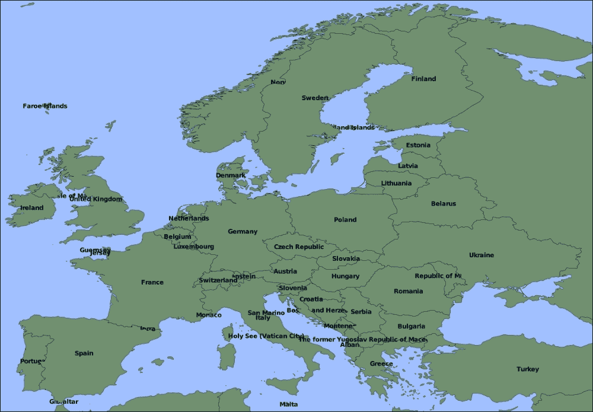

如果你仔细观察这张图片，你会注意到一些标签被其他多边形遮挡。这是因为我们告诉程序在同一地图层中绘制多边形及其标签。为了解决这个问题，将你的`LAYERS`定义替换为以下内容：

```py
LAYERS = [
    {'shapeFile'  : "TM_WORLD_BORDERS-0.3/TM_WORLD_BORDERS-0.3.shp",
     'lineColor'  : "black",
     'lineWidth'  : 0.4,
     'fillColor'  : "#709070",
     'labelField' : None,
     'labelSize'  : None,
     'labelColor' : None,
    },	
    {'shapeFile'  : "TM_WORLD_BORDERS-0.3/TM_WORLD_BORDERS-0.3.shp",
     'lineColor'  : None,
     'lineWidth'  : None,
     'fillColor'  : None,
     'labelField' : "NAME",
     'labelSize'  : 12,
     'labelColor' : "black"
    }
]
```

如你所见，我们现在正在两个独立的地图层中显示 shapefile，一个用于绘制国家多边形，另一个地图层用于在多边形前面绘制所有标签。如果你再次运行程序，你会看到标签问题已经得到解决。

这应该会让你了解`shapeToMap.py`程序有多有用。只需更改程序顶部的常数，你就可以快速查看任何 shapefile 的内容。实际上，本书中的许多插图都是使用此程序的修改版本生成的。

# 下一步

虽然`shapeToMap.py`程序被故意保持简单，以便更容易理解，但还有很多可以做的事情来改进这个程序并使其更有用。你可能喜欢通过实现以下新功能来挑战自己：

+   向每个地图层添加一个可选的`labelHalo`条目，用于在标签文本周围绘制光环。

+   向地图层添加一个`labelPlacement`条目，以便轻松控制标签放置选项。

+   向地图层添加一个`labelAllowOverlap`条目，用于控制标签是否允许重叠。

+   向地图层添加一个`filter`条目，用于构建一个`mapnik.Filter()`表达式，以限制在地图层中显示的特征集。

+   添加一个选项，根据每个特征的边界框动态计算地图的可视范围。这将允许你在事先计算边界之前生成地图。

+   添加一个调用`os.system("open map.png")`（适用于 Mac OS X）或`os.startfile("map.png")`（适用于 MS Windows）的调用，以便在生成图像后自动显示该图像。

+   添加对使用除默认 EPSG 4326 以外的投影的 shapefile 的支持。

+   从单独的模块中加载配置常量，这样你就不必每次想要更改要显示的数据时都编辑 Python 源文件。

作为本章源代码的一部分，提供了一个名为`generateMap.py`的`shapeToMap.py`的更复杂版本。`generateMap.py`程序实现了前面提到的所有建议。

# 摘要

在本章中，我们介绍了 Mapnik 地图生成库以及如何在 Python 程序中使用它来创建外观精美的地图。你安装了 Mapnik，查看了一个简单的示例，了解它如何使用，然后开始学习构建和样式化地图的过程。

我们随后对 Mapnik 进行了更详细的考察，研究了你可以用来将空间数据加载到地图层的各种数据源类型。我们还考察了可以用来显示空间特征的符号化工具，如何使用可见范围来控制要显示的地图部分，以及如何将地图渲染为图像文件。然后我们创建了一个有用的 Python 程序，名为`shapeToMap.py`，它可以用来从存储在 shapefiles 中的任何空间数据生成地图，并最终探讨了如何改进`shapeToMap.py`使其更加有用。

在下一章中，我们将探讨分析空间数据的各种工具和技术，包括如何使用 Python 解决各种有趣的地理空间问题。
