# 第五章 分析地理空间数据

在本章中，我们将探讨分析地理空间数据的过程。有时，你的地理空间分析结果可能是一或多个数字，例如，*有多少个国家位于赤道以南？* 或者 *澳大利亚海岸线的长度是多少？* 在其他时候，你的分析结果可能是一个几何对象，例如，*阿拉斯加的最北点在哪里？* 或者 *德克萨斯州中哪些部分位于新墨西哥州以东？* 在其他时候，你的分析结果可能是一个列表，例如，*哪些国家位于新几内亚 1,000 公里范围内？* 在所有这些情况下，你需要熟悉可用于计算所需结果的工具和技术。

为了帮助你学习这些工具和技术，我们将检查以下内容：

+   如何安装和使用两个强大的 Python 库来解决地理空间问题

+   如何计算和操作位置

+   如何计算 LineString 几何形状在现实世界单位中的长度

+   如何使用现实世界单位计算多边形的面积

+   如何使用包含道路的 shapefile 构建连接的 LineString 几何形状的抽象模型，然后使用该模型计算两点之间的最短路径。

让我们从查看一些你可以用于地理空间分析的 Python 库开始。

# 空间分析库

你已经有一些对分析地理空间数据有用的库：OGR 库包括比较和操作几何形状的方法，Shapely 是一个用于处理和分析几何数据的优秀库。然而，还有两个其他库你可能想熟悉：**PyProj**，这是一个用于在地球表面上计算距离和位置的强大库，以及**NetworkX**，它可以从地理空间数据中构建抽象的数学模型，然后分析这些模型以解决各种问题。

让我们更详细地研究这两个库，并将它们都安装到你的计算机上。

## PyProj

PyProj ([`pypi.python.org/pypi/pyproj`](https://pypi.python.org/pypi/pyproj)) 是一个使用 Python 处理空间参考系统的强大工具。PyProj 本身只是 PROJ.4 地图投影库的 Python 接口，该库是用 C 编写的。因此，要安装 PyProj，你通常需要安装 PROJ.4 库，然后安装或构建 PyProj 本身。

在我们深入了解安装 PyProj（和 PROJ.4）的细节之前，让我们看看这个库的功能以及它如何有用。如果你还记得 第二章 中的内容，“地理空间数据”，空间参考系统是使用坐标表示地球表面位置的一种方式。**未投影坐标**，如纬度和经度值，通过从地球中心到所需点的线条追踪，然后测量该线条在东西和南北方向上的角度，直接表示地球表面的一个位置：

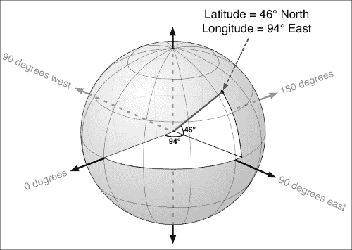

另一方面，**投影坐标**表示为二维笛卡尔平面上的位置：

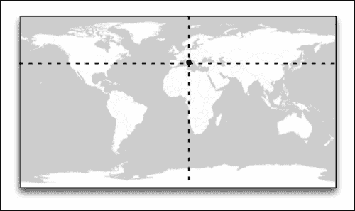

空间参考系统，也称为地图投影，是将地球表面的点转换为二维平面上的点的一种方式。PROJ.4（以及 PyProj）是处理这些投影的工具。

了解用于生成你的地理空间数据的地图投影至关重要。使用错误的投影将毁掉你所有的计算和地图可视化。地图投影也很重要，因为使用未投影坐标系统（如 EPSG 4326）中的数据进行空间计算几乎是不可能的。例如，想象一下你想计算以下多边形的面积，它代表苏格兰尼斯湖的轮廓：


这个多边形的坐标是 EPSG 4326——也就是说，它们是纬度和经度值。如果你愿意，你可以将这个多边形加载到 Shapely 中，并要求它计算面积：

```py
>>> wkt = "POLYGON ((-4.335556 57.373056,-4.676389 57.138611,-4.447778 57.324722,-4.349167 57.386944,-4.334444 57.379444,-4.335556 57.373056))"
>>> polygon = shapely.wkt.loads(wkt)
>>> print polygon.area
0.006077434151

```

然而，结果是按度数计算的面积，这是一个没有意义的数字。这是因为 Shapely 不了解空间参考系统。它天真地对待纬度和经度值作为 (x,y) 坐标，这意味着这种空间计算无法产生有用或准确的结果。

你真正想要的是以有意义的单位（如平方米或平方英里）测量的面积。这正是 PyProj 发挥作用的地方。PyProj 允许你使用任何空间参考系统进行计算和转换。PyProj 承担了所有的繁重数学运算，因此你不必亲自去做。

现在，让我们安装 PyProj 并看看它是如何工作的。你安装 PyProj（以及底层的 PROJ.4 库）的方式取决于你使用的操作系统：

+   对于 MS Windows，你可以从 [`www.lfd.uci.edu/~gohlke/pythonlibs/#pyproj`](http://www.lfd.uci.edu/~gohlke/pythonlibs/#pyproj) 安装预构建的 PyProj 版本。此安装程序包括 PROJ.4，因此你不需要单独安装它。

+   对于 Mac OS X，你需要执行以下操作：

    1.  下载并安装 PROJ.4 库。可以从 [`www.kyngchaos.com/software/frameworks`](http://www.kyngchaos.com/software/frameworks) 下载 PROJ.4 的 Mac 安装程序。

    1.  如果你电脑上还没有安装 XCode，请前往 Mac App Store 下载最新版本。XCode 是苹果的开发系统，可以免费下载。

    1.  如果你使用的是低于 10.9（Yosemite）版本的 Mac OS X，你需要单独安装命令行工具。为此，启动 XCode 并从 **XCode** 菜单中选择 **Preferences…** 命令。在 **Downloads** 选项卡中，将有一个安装命令行工具的选项；启用此选项并等待所需工具安装完成。

        ### 提示

        如果你使用的是 Mac OS X 10.9（Yosemite）或更高版本，你可以跳过此步骤。

    1.  从 [`pypi.python.org`](https://pypi.python.org) 下载 PyProj 的源代码。

    1.  使用终端，`cd` 到你下载的 PyProj 目录，并输入以下命令：

        ```py
        python setup.py build
        sudo python.setup.py install

        ```

    1.  最后，启动 Python 并尝试输入以下命令：

        ```py
        import pyproj

        ```

        Python 提示符应该会重新出现，没有任何错误信息。

+   对于 Linux，你可以使用你喜欢的包管理器安装 PROJ.4 和 PyProj，或者你可以按照 [`trac.osgeo.org/proj`](http://trac.osgeo.org/proj) 和 [`github.com/jswhit/pyproj`](https://github.com/jswhit/pyproj) 上提供的说明从源代码构建它们。

现在你已经安装了 PyProj，让我们看看这个库是如何使用的。PyProj 提供了两个主要的类：

+   **Proj**：这个类代表一个空间投影，并允许你将坐标在投影之间进行单次或批量转换

+   **Geod**：这是一个 *大地测量* *计算* 类，允许你根据使用给定空间参考系统的坐标执行各种计算

让我们看看如何使用 PyProj 来计算两点之间的距离。打开一个终端窗口，启动你的 Python 解释器，并输入以下代码：

```py
import pyproj
geod = pyproj.Geod(ellps="WGS84")
lat1 = -38.137
long1 = 176.349
lat2 = -41.286
long2 = 174.776
heading1,heading2,distance = geod.inv(long1, lat1, long2, lat2)
print int(distance)
```

这两个坐标代表新西兰罗托鲁阿和惠灵顿两座城市的地理位置：

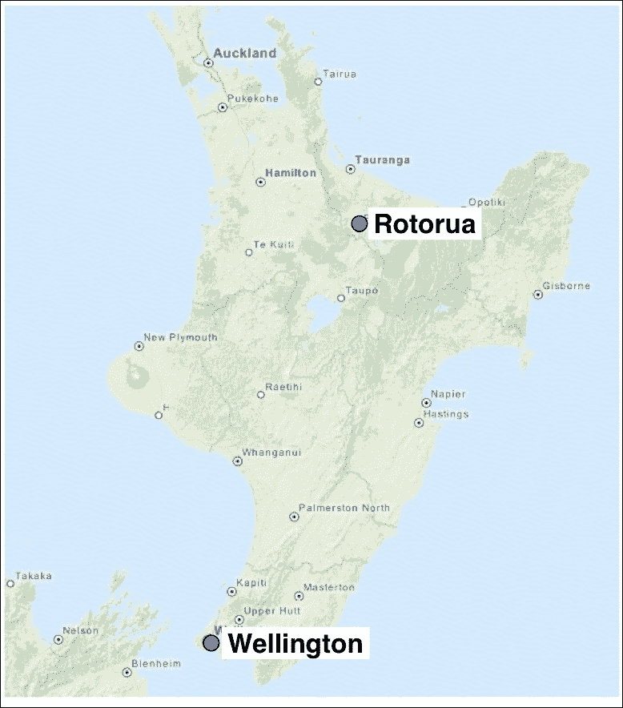

如果一切顺利，你应该会看到打印出数字 374,729，这是这两座城市之间的直线距离（大圆距离），单位是米。

### 注意

注意，我们使用 `ellps="WGS84"` 来设置 Geod 对象的空间参考系统。此值设置了用于大地测量计算器地球形状的数学模型——WGS84 是 EPSG 4326 空间参考系统使用的椭球体的名称，因此我们实际上是在告诉 PyProj 坐标是以纬度和经度测量的。

PyProj 还可以用于在坐标系之间进行转换。我们将在看到它如何与 Shapely 结合以执行精确的空间计算时简要介绍这一点。

## NetworkX

NetworkX 是一个用于定义和分析数学 **图** 的 Python 库。在数学术语中，图是由 **顶点** 通过 **边** 连接在一起的一组：

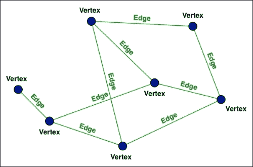

每条边通常都会分配一个值，称为**权重**，它可以用来对图进行查询。每条边可以是**有向的**——也就是说，你只能沿着一个方向跟随边——或者它可以是无向的，允许你沿着任意方向跟随边。

虽然这些图是一个有趣的数学概念，但它们在地理空间分析中也非常有用，因为你可以使用图来表示地点以及在这些地点之间移动的方式。例如，顶点可能代表城镇，而边可能代表连接这些城镇的道路。当以这种方式使用时，边通常根据道路的长度进行加权，这样较长的道路就有更大的权重，整个图可以用来计算两点之间的最短路径。

NetworkX 是一个用于处理数学图非常强大的库。更好的是，它包括读取 shapefile 并将其转换为图的能力。这允许你非常简单地转换地理空间数据为抽象图表示，然后你可以用它以各种有用的方式分析地点之间的关系。

### 注意

在 NetworkX 中，图中的顶点被称为**节点**。

让我们继续安装 NetworkX 库。NetworkX 的主网站可以在[`networkx.github.io`](https://networkx.github.io)找到，你可以直接从[`pypi.python.org/pypi/networkx`](https://pypi.python.org/pypi/networkx)下载库。

由于 NetworkX 是用纯 Python 编写的，你可以简单地下载源代码，然后输入`python setup.py install`将其安装到你的`site-packages`目录中，或者如果你更喜欢，你可以通过输入`pip install networkx`使用 pip 安装它。

对于更多详细信息，请参阅 NetworkX 的安装说明，可以在[`networkx.github.io/documentation/latest/install.html`](http://networkx.github.io/documentation/latest/install.html)找到。

一旦你安装了 NetworkX，可以通过在 Python 命令提示符中输入以下内容来检查它是否工作：

```py
import networkx

graph = networkx.Graph()
graph.add_edge("New York", "San Francisco", weight=2908)
graph.add_edge("San Francisco", "Los Angeles", weight=382)
graph.add_edge("Los Angeles", "New York", weight=2776)
graph.add_edge("San Francisco", "Portland", weight=635)

print networkx.shortest_path(graph, "New York", "Portland")
```

这个简单的程序构建了一个 NetworkX 图，其中的节点代表城市，而边代表连接这些城市的道路。对于每条边，权重代表这两个城市之间的驾驶距离（英里）。使用这个简单的图，我们然后要求 NetworkX 显示纽约和俄勒冈州波特兰之间的最短路径。

如果一切顺利，运行前面的代码将告诉你最短路径是从纽约到旧金山，然后从那里到波特兰：

```py
['New York', 'San Francisco', 'Portland']

```

显然，你可以用 NetworkX 做更多的事情，我们将在本章后面使用这个库。然而，目前来说，了解你可以使用 NetworkX 从你的空间数据中构建一个抽象图，然后使用 NetworkX 的分析函数根据你的图计算有用的信息就足够了。

# 空间分析食谱

现在我们已经拥有了一套完整的地理空间分析库，让我们看看我们如何使用它们来解决一些实际问题。我们将探讨如何计算和操作位置、长度和面积，以及如何使用 NetworkX 来计算两点之间的最短路径。

## 计算和比较坐标

如我们之前所见，PyProj 可以用来计算两个位置之间的实际距离。它还可以用来测量两点之间线的角度，并基于起点、距离和航向计算新点。

让我们使用 PyProj 来计算两点之间的距离。然后我们将用它来计算从给定点出发的一定距离和航向的位置。

首先创建一个新的 Python 程序，命名为 `coord_analysis.py`。将以下代码输入到这个程序的开始部分：

```py
import pyproj
geod = pyproj.Geod(ellps="WGS84")
```

到目前为止，这与我们之前看到的代码相同：我们只是导入 PyProj 库并基于 WGS84 椭球体创建一个大地测量计算对象。如果你还记得，这是标准 EPSG 4326 空间参考系统所使用的地球表面的数学模型。

现在我们将添加一些代码来提示用户输入所需的坐标。这完全是标准的 Python 代码，不需要任何进一步的解释：

```py
def get_coord(prompt):
    while True:	
        s = raw_input(prompt + " (lat,long): ")
        if "," not in s: continue
        s1,s2 = s.split(",", 1)
        try:	
            latitude = float(s1.strip())
        except ValueError:
            continue
        try:
            longitude = float(s2.strip())
        except ValueError:
            continue
        return latitude,longitude
lat1,long1 = get_coord("Starting coordinate")
lat2,long2 = get_coord("Ending coordinate")
```

现在我们有了两组纬度和经度值，我们可以使用 PyProj 来计算这两点之间的实际距离：

```py
heading1,heading2,distance = geod.inv(long1, lat1, long2, lat2)
```

这正是我们之前看到的相同代码。`geod.inv()` 方法接受两个坐标，并返回 *航向*（从第一个点到第二个点的线角度，从正北顺时针测量），*逆航向*（从第二个点回到第一个点的线角度，同样从正北顺时针测量），以及两点之间的 *距离*（以米为单位）。

注意，调用 `geod.inv()` 需要我们在纬度值之前提供经度值。这是因为 PyProj 与任何坐标系统一起工作，而经度代表 x（从左到右）值，而纬度代表 y（从下到上）值。在处理可能位于任何空间参考系统中的通用坐标时，x 值始终列在第一位。

现在我们已经计算了这三个数字，让我们显示它们，以便用户可以看到我们计算的结果：

```py
print "Heading = %0.2f degrees" % heading1
print "Inverse heading = %0.2f degrees" % heading2
print "Distance = %0.2f kilometers" % (distance/1000)
```

要查看结果，请保存你的程序并在终端窗口中运行它。然后输入以下坐标到你的程序中：

```py
Starting coordinate: 37.774929, -122.419416
Ending coordinate: 34.052234, -118.243685

```

这两个坐标代表旧金山和洛杉矶的位置。假设你已正确输入程序，以下结果应该会显示：

```py
Heading = 136.38 degrees
Inverse heading = -41.17 degrees
Distance = 559.04 kilometers

```

这告诉我们，如果我们直接在旧金山市中心上空的飞机上飞行 559 公里，航向为 136.38 度（从正北顺时针测量），你将最终到达洛杉矶市中心。同样，如果你在洛杉矶，航向为-41.17 度（再次从正北顺时针测量），你将最终到达旧金山：

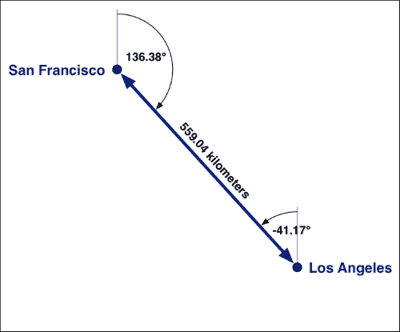

现在，让我们添加一些代码来计算从现有位置出发，一定距离和航向的点的坐标。注释掉`get_coord()`函数之后的全部内容，然后添加以下内容到程序末尾：

```py
def get_num(prompt):
    while True:
        s = raw_input(prompt + ": ")
        try:
            value = float(s)
        except ValueError:
            continue
        return value
```

这是一个简单的实用函数，用于提示用户输入数值。我们将使用这个（以及我们之前编写的`get_coord()`函数）来提示用户输入我们需要的信息。现在将以下内容添加到程序末尾：

```py
sLat,sLong = get_coord("Starting coordinate")
distance = get_num("Distance in kilometers") * 1000
heading = get_num("Heading")
```

注意，我们将以公里为单位的距离转换为以米为单位的距离——PyProj 始终以米为单位工作，因此我们必须以米为单位提供距离。

我们现在可以计算终点坐标了。使用 PyProj，这很简单：

```py
eLong,eLat,iHeading = geod.fwd(sLong, sLat, heading, distance)
```

`geod.fwd()`方法返回所需的坐标（X 值列在前面），以及反向航向。我们的最后一个任务是向用户显示这些结果：

```py
print "End point = (%0.4f,%0.4f)" % (eLat, eLong)
print "Inverse heading = %0.2f degrees" % iHeading
```

如果你运行这个程序，你可以尝试输入起点、航向和距离，程序将显示终点。例如：

```py
Starting coordinate (lat,long): 37.774929, -122.419416
Distance in kilometers: 559.04
Heading: 136.38
End point = (34.0521,-118.2440)
Inverse heading = -41.17 degrees

```

### 注意

计算出的终点坐标与之前看到的不完全相同。这是因为距离和航向只指定到小数点后两位的精度。

当然，对于我们的程序，我们注释掉了第一次计算，以便我们能够专注于第二次计算。一个明显的改进是添加一个简单的文本提示，询问用户要执行哪个计算。但你可以看到 PyProj 是如何用来计算和比较地球表面上的点的——当你使用经纬度值时，这不容易做到。

## 计算长度

现在我们知道了如何计算两点之间的距离（以米为单位），让我们应用这项技术来计算任何 LineString 几何形状的真实长度。

要计算 LineString 几何形状的总长度，我们需要将 LineString 分割成单个线段，计算每个线段的长度，然后将结果相加以获得整个 LineString 的总长度：

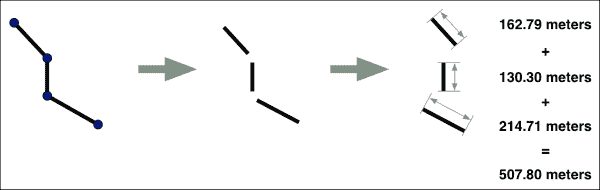

要看到这个动作，我们需要一些 LineString 几何来工作。在这个例子中，我们将使用代表加利福尼亚州主要和次要道路的 LineStrings。这些数据可以从美国人口普查局的网站[`www.census.gov/geo/maps-data/data/tiger-line.html`](https://www.census.gov/geo/maps-data/data/tiger-line.html)下载。向下滚动到标记为**2014 TIGER/Line Shapefiles**的部分，然后点击**下载**选项，然后点击**Web interface**。在下载页面，从**Select a layer type**下拉菜单中选择**Roads**，然后点击**Submit**按钮。最后，从**Primary and Secondary Roads**下拉菜单中选择**California**，然后点击**Download**按钮以下载所需数据。

生成的 shapefile 将是一个名为`tl_2014_06_prisecroads.zip`的压缩 ZIP 存档。解压这个存档，并将生成的 shapefile 放置在方便的位置。在 shapefile 所在的目录中创建一个名为`calc_lengths.py`的新文件，然后将以下代码输入到这个文件中：

```py
import osgeo.ogr
import shapely.wkt
import pyproj

geod = pyproj.Geod(ellps="WGS84")

shapefile = osgeo.ogr.Open("tl_2014_06_prisecroads.shp")
layer = shapefile.GetLayer(0)

for i in range(layer.GetFeatureCount()):
    feature = layer.GetFeature(i)
    geometry = shapely.wkt.loads(
        feature.GetGeometryRef().ExportToWkt())
```

这一切对你来说都应该非常熟悉——我们只是导入我们将要使用的各种库，创建一个新的`pyproj.Geod`对象用于我们的长度计算，然后逐个遍历 shapefile 的内容。正如你所见，我们使用`shapely.wkt.loads()`函数将特征转换为 Shapely 几何对象。

现在我们有了 Shapely 几何，我们的下一个任务是将其分割成单独的线段并计算每个线段的长度。让我们来做这件事：

```py
    tot_length = 0
    prev_long,prev_lat = geometry.coords[0]
    for cur_long,cur_lat in geometry.coords[1:]:
        heading1,heading2,distance = geod.inv(
            prev_long, prev_lat, cur_long, cur_lat)
        tot_length = tot_length + distance
        prev_long,prev_lat = cur_long,cur_lat
```

由于 Shapely 几何是 LineString，我们可以使用`geometry.coords`访问构成 LineString 的各个坐标。然后我们依次处理每一对坐标，使用我们之前学到的技术来计算两个坐标之间以米为单位的距离。我们跟踪所有坐标对的总计算长度，从而得到 LineString 几何的总长度。

### 小贴士

如果我们的道路数据是在一个保持距离的投影坐标系中，我们可以简单地要求 Shapely 通过访问`geometry.length`属性来计算每个 LineString 的总长度。然而，这对于 EPSG 4326 数据是不行的，因为结果又将是度数长度。

我们最后一个任务是处理计算出的长度。让我们简单地打印出来，包括道路的名称：

```py
    print feature.GetField("FULLNAME"), int(tot_length)
```

理论上，我们的程序现在应该可以工作了，让我们尝试运行它：

```py
$ python calc_lengths.py
N Wheeler Ridge Rd 1616
N Main St 1595
...

```

到目前为止一切顺利；正如你所见，每条道路的总长度（以米为单位）正在被计算。不幸的是，如果我们再等几秒钟，我们的程序将引发 Python 异常并停止：

```py
Traceback (most recent call last):
 File "calc_lengths.py", line 23, in <module>
 prev_long,prev_lat = geometry.coords[0]
 File "/Library/Frameworks/GEOS.framework/Versions/3/Python/2.7/shapely/geometry/base.py", line 634, in coords
 "Multi-part geometries do not provide a coordinate sequence")
NotImplementedError: Multi-part geometries do not provide a coordinate sequence

```

这里发生了什么？看起来`geometry.coords`不可用，因为几何形状不是一个普通的 LineString。实际上，如果您还记得第二章中的内容，shapefiles 在简单几何形状和这些几何形状的集合之间没有区别，因此 shapefile 中的 LineString 实际上可能是一系列 LineString 的集合。这正是本例中发生的情况——如果您使用交互式 Python 命令提示符将受影响的要素加载到内存中，您可以打印出几何类型以查看问题所在：

```py
>>> geometry = shapely.wkt.loads(feature.GetGeometryRef().ExportToWkt())
>>> print geometry.geom_type
MultiLineString

```

因此，我们用 MultiLineString 几何形状而不是 LineString 几何形状来表示道路。幸运的是，很容易将 MultiLineString 拆分并逐个处理单个 LineString。以下是添加此功能后我们整个程序的外观：

```py
import osgeo.ogr
import shapely.wkt
import pyproj

geod = pyproj.Geod(ellps="WGS84")

shapefile = osgeo.ogr.Open("tl_2014_06_prisecroads.shp")
layer = shapefile.GetLayer(0)

for i in range(layer.GetFeatureCount()):
    feature = layer.GetFeature(i)
    geometry = shapely.wkt.loads(
        feature.GetGeometryRef().ExportToWkt())

    lineStrings = []
    if geometry.geom_type == "LineString":
        lineStrings.append(geometry)
    elif geometry.geom_type == "MultiLineString":
        for lineString in geometry:
            lineStrings.append(lineString)

    tot_length = 0

    for lineString in lineStrings:
        prev_long,prev_lat = lineString.coords[0]
        for cur_long,cur_lat in lineString.coords[1:]:
            heading1,heading2,distance = geod.inv(
                prev_long, prev_lat, cur_long, cur_lat)
            tot_length = tot_length + distance
            prev_long,prev_lat = cur_long,cur_lat

    print feature.GetField("FULLNAME"), int(tot_length)
```

使用这种技术，我们可以计算任何线性几何形状（如 LineString 或 MultiLineString）的确切长度，单位为米。实际上，我们甚至可以使用相同的技巧来计算多边形几何形状的周长，通过访问多边形的外部线性环，然后将其处理成 LineString：

```py
lineString = polygon.exterior
```

## 计算面积

在第二章中，我们了解到如何使用 OGR 和世界莫勒韦德投影（EPSG 54009）来计算多边形的面积。世界莫勒韦德是一种等面积地图投影，在全球范围内具有较高的准确性，因此适用于计算平方米面积。

不使用 OGR，让我们使用 Shapely 应用相同的技巧。这样做的好处是，我们将能够访问 Shapely 的所有功能，允许我们以各种有用的方式操作和测量几何形状。为此，我们将使用一个方便的 Shapely 函数`shapely.ops.transform()`。这个函数允许您将转换函数应用于几何形状中的每个坐标。转换可以是任何您想要的内容（如果您想的话，您可以在 Python 中编写自己的转换函数），但最重要的是，您可以使用 PyProj 实现一个转换函数，将 EPSG 4326 转换为 EPSG 54009，以便您能够准确计算任何几何形状的面积。

让我们看看它是如何工作的。将您之前下载的`TM_WORLD_BORDERS-0.3` shapefile 的副本放入一个方便的目录中，并在同一目录中创建一个名为`calc_areas.py`的新文件。然后，将以下代码输入到这个新文件中：

```py
import osgeo.ogr
import shapely.wkt
import shapely.ops
import pyproj

shapefile = osgeo.ogr.Open("TM_WORLD_BORDERS-0.3.shp")
layer = shapefile.GetLayer(0)

src_proj = pyproj.Proj(proj="longlat", ellps="WGS84", datum="WGS84")
dst_proj = pyproj.Proj(proj="moll", lon_0=0, x_0=0, y_0=0, ellps="WGS84", datum="WGS84", units="m")

def latlong_to_mollweide(longitude, latitude):
    return pyproj.transform(src_proj, dst_proj,
                            longitude, latitude)

for i in range(layer.GetFeatureCount()):
    feature = layer.GetFeature(i)
    wkt = feature.getGeometryRef().ExportToWkt()
    geometry = shapely.wkt.loads(wkt)

    transformed = shapely.ops.transform(latlong_to_mollweide,
                                        geometry)
    area = int(transformed.area/1000000)

    print feature.GetField("NAME"), area
```

如您所见，我们定义了一个转换函数`latlong_to_mollweide()`，它将给定的纬度和经度值转换为莫勒韦德坐标系中的(x,y)坐标。莫勒韦德基于米，因此 Shapely 可以针对该几何形状进行计算，并以米为单位返回结果。

当你运行 `calc_areas.py` 程序时，你应该会看到一个国家列表以及与 World Borders Dataset 中相关多边形的面积，以平方公里为单位：

```py
$ python calc_areas.py
Antigua and Barbuda 546
Algeria 2326137
Azerbaijan 86014
Albania 28702
...

```

使用 `shapely.ops.transform()` 的好处是，你可以对生成的几何形状使用 Shapely 的所有计算和几何操作功能。例如，新西兰有一个专属经济区，从海岸线向外延伸 200 英里。使用 `buffer()` 方法，你可以通过将新西兰的轮廓扩展到包括海岸线 200 英里内的所有点来计算这个专属经济区的形状：

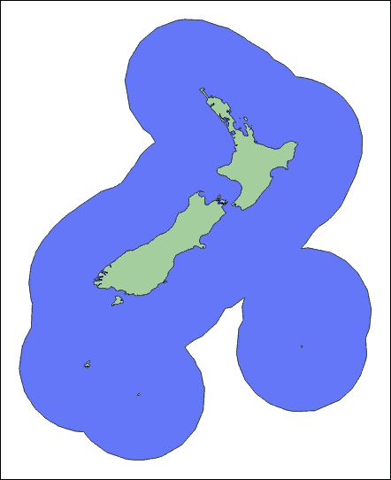

### 注意

缓冲区是一个极其强大的操作。例如，你可以使用 `buffer()` 与 `intersects()` 方法一起识别给定起始几何形状一定距离内的所有国家。例如：

```py
buffered_area = test_country['geom'].buffer(1000000)
for country in countries:
    if country['geom'].intersects(buffered_area):
        print "%s is within 1000 km of %s" % (country['name'], test_country['name'])
```

## 计算最短路径

在我们的最终示例中，我们将使用包含道路数据的 shapefile 来计算两点之间的最短路径。这是一个相当复杂的示例，使用了各种分析和操作几何数据的技术。它还使用了 NetworkX 库在道路网络的抽象表示上执行最短路径计算。

让我们从看看 NetworkX 如何将包含 LineString 几何形状的 shapefile 转换为抽象网络开始。如果你查看 `tl_2014_06_prisecroads` shapefile 的一小部分，你会看到看起来像是一系列相连的道路，例如：

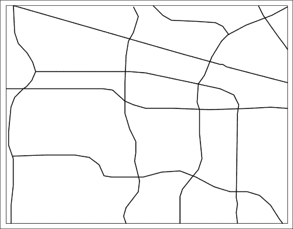

然而，道路实际上并没有在它们相交的地方停止——道路特征只是继续延伸，根据需要与其他道路重叠。在地图上，这些可能看起来像是交叉点，但实际上在两条道路相遇或交叉的地方没有真正的交叉点：

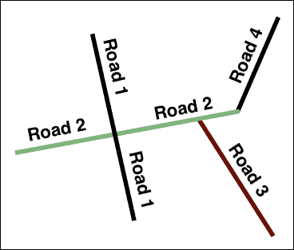

这很重要，因为 NetworkX 将 LineString 几何形状转换为抽象图的方式——NetworkX 会认为只有当两个 LineString 具有相同的起始或结束点时它们才会相交；简单的交叉并不意味着两条道路相交。在先前的例子中，**道路 2** 和 **道路 4** 将是唯一被认为是相连的道路——即使 **道路 2** 看起来与 **道路 1** 和 **道路 3** 相交，由于没有匹配的端点，这些道路将被排除在图之外。

为了允许 NetworkX 将道路 shapefile 转换为网络，我们需要在道路相交的点处分割道路：

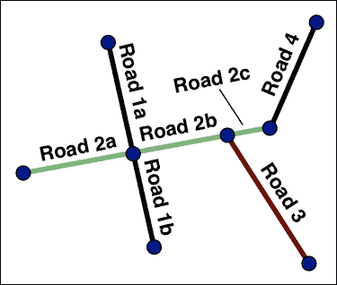

从数学的角度讲，这被称为从重叠道路网络中生成**平面图**。这个过程并不完美——它忽略了桥梁和立交桥，以及*禁止进入*标志阻止旅行者采取特定转弯的地方。然而，将道路形状文件转换为平面图是一个好的起点，如果你有一份桥梁和其他禁止进入点的列表，你总是可以排除特定的交叉口来计算。

让我们继续将我们的道路形状文件转换为平面图。为此，创建一个新的 Python 程序，命名为`split_roads.py`，并将以下代码输入到这个文件中：

```py
import os
import os.path
import shutil
import osgeo.ogr
import osgeo.osr
import shapely.wkt

SRC_SHAPEFILE = "tl_2014_06_prisecroads.shp"

all_roads = []
shapefile = osgeo.ogr.Open(SRC_SHAPEFILE)
layer = shapefile.GetLayer(0)
for i in range(layer.GetFeatureCount()):
    feature = layer.GetFeature(i)
    wkt = feature.GetGeometryRef().ExportToWkt()
    geometry = shapely.wkt.loads(wkt)
    all_roads.append(geometry)
```

除了额外的`import`语句（我们很快就会需要它们）之外，这段代码应该相当清晰：我们只是将`tl_2014_06_prisecroads.shp`形状文件中的 LineString 几何形状加载到`all_roads`列表中。

### 提示

如果你的形状文件在不同的目录中，编辑`SRC_SHAPEFILE`常量，以便程序可以找到形状文件。

我们接下来的任务是分割交叉口处的道路。幸运的是，Shapely 使这变得相当简单。将以下内容添加到程序的末尾：

```py
split_roads = []

for i in range(len(all_roads)):
    cur_road = all_roads[i]
    crossroads = []
    for j in range(len(all_roads)):
        if i == j: continue
        other_road = all_roads[j]
        if cur_road.crosses(other_road):
            crossroads.append(other_road)
    if len(crossroads) > 0:
        for other_road in crossroads:
            cur_road = cur_road.difference(other_road)
        if cur_road.geom_type == "MultiLineString":
            for split_road in cur_road.geoms:
                split_roads.append(split_road)
        elif cur_road.geom_type == "LineString":
            split_roads.append(cur_road)
    else:
        split_roads.append(cur_road)
```

正如你所见，我们通过调用 Shapely 的`crosses()`方法来识别与当前道路交叉的任何道路。然后，我们使用`difference()`方法从当前道路中移除每个交叉口；这会在其他道路与之交叉的点将道路分割开来：

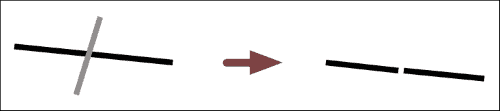

最后，我们想要将分割的道路保存回形状文件。为此，将以下代码添加到程序的末尾：

```py
driver = osgeo.ogr.GetDriverByName("ESRI Shapefile")
if os.path.exists("split_roads"):
    shutil.rmtree("split_roads")
os.mkdir("split_roads")
dstFile = driver.CreateDataSource("split_roads/split_roads.shp")

spatialReference = osgeo.osr.SpatialReference()
spatialReference.SetWellKnownGeogCS("WGS84")

layer = dstFile.CreateLayer("Layer", spatialReference)

for road in split_roads:
    wkt = shapely.wkt.dumps(road)
    linestring = osgeo.ogr.CreateGeometryFromWkt(wkt)

    feature = osgeo.ogr.Feature(layer.GetLayerDefn())
    feature.SetGeometry(linestring)

    layer.CreateFeature(feature)
    feature.Destroy()

dstFile.Destroy()
```

这段代码你应该很熟悉，因为我们已经在第二章中使用了相同的技巧，当我们查看如何将矢量数据写入形状文件时。这里唯一的新事物是我们使用`shutil.rmtree()`后跟`os.mkdir()`来删除并重新创建存储形状文件的目录；这允许我们再次运行程序，而无需每次都记得删除形状文件。

这就完成了我们的`split_roads.py`程序。将`tl_2014_06_prisecroads`形状文件中的 8,000 条道路分割开来可能需要几分钟时间，所以当你开始编写下一个程序时，只需让它运行即可。

一旦我们得到了分割道路的集合，我们就会想要另一个程序来使用它们来计算两点之间的最短路径。现在让我们开始编写这个程序。我们将把这个程序命名为`calc_shortest_path.py`。创建这个文件，并将以下代码输入到其中：

```py
import shapely.wkt
import pyproj
import networkx
```

现在，我们将编写一些实用函数，这些函数是我们进行最短路径计算所需的。首先，我们将使用我们之前看到的技巧来计算两点之间以米为单位的距离：

```py
def calc_distance(lat1, long1, lat2, long2):
    geod = pyproj.Geod(ellps="WGS84")
    heading1,heading2,distance = geod.inv(long1, lat1, long2, lat2)
    return distance
```

我们将使用这个函数来编写另一个函数，用于计算 LineString 几何形状的总长度：

```py
def calc_length(linestring):
    tot_length = 0
    prev_long,prev_lat = linestring.coords[0]
    for cur_long,cur_lat in linestring.coords[1:]:
        distance = calc_distance(prev_lat, prev_long,
                                 cur_lat, cur_long)
        tot_length = tot_length + distance
        prev_long,prev_lat = cur_long,cur_lat
    return int(tot_length)
```

接下来，我们需要复制我们之前编写的`get_coord()`函数：

```py
def get_coord(prompt):
    while True:
        s = raw_input(prompt + " (lat,long): ")
        if "," not in s: continue
        s1,s2 = s.split(",", 1)
        try:
            latitude = float(s1.strip())
        except ValueError:
            continue
        try:
            longitude = float(s2.strip())
        except ValueError:
            continue
        return latitude,longitude
```

我们还需要编写一个额外的函数：`find_closest_node`。这个函数将在 NetworkX 图中找到最接近给定纬度和经度值的节点。我们需要这个函数来识别最短路径计算中的起始和结束节点。

下面是`find_closest_node`函数的代码，你应该将其添加到程序的末尾：

```py
def find_closest_node(graph, latitude, longitude):
    closest_node = None
    min_distance = None
    for node in graph.nodes():
        distance = calc_distance(node[1], node[0],
                                 latitude, longitude)
        if closest_node == None:
            closest_node = node
            min_distance = distance
        elif distance < min_distance:
            closest_node = node
            min_distance = distance
    return closest_node
```

要找到最近的节点，我们只需遍历图中的所有节点（顶点），并计算节点与所需坐标之间的距离（以米为单位）。然后我们选择并返回距离最小的节点。

现在我们已经准备好开始编写程序的主要部分。第一步是让 NetworkX 读取`split_roads`形状文件，并从道路数据中创建一个图：

```py
graph = networkx.read_shp("split_roads/split_roads.shp")
```

这将读取形状文件并生成一个 NetworkX 图，其中每条边代表一条道路，每个节点代表道路的端点。因为 NetworkX 无法知道如何识别道路或端点，它使用纬度和经度来识别每个端点（即每个节点），以及起始和结束的纬度和经度来识别每条道路（即每条边）。因此，生成的图将包含类似于以下图示的节点和边：

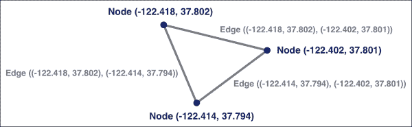

结果图将会相当大，因为我们几乎需要从我们的 shapefile 中导入 10,000 条道路。

我们接下来的任务可能看起来有些奇怪：因为没有保证每条道路都能从其他每条道路到达，我们需要将图缩减到仅包含可到达的道路集合。如果我们不这样做，我们的最短路径计算很可能会失败。为了移除不可到达的道路，我们使用`connected_component_subgraphs()`函数来识别包含最多连接道路的图的一部分，并使用这个子图进行最短路径计算。以下是必要的代码：

```py
graph = networkx.connected_component_subgraphs(graph.to_undirected()).next()
```

注意，因为`connected_component_subgraphs()`函数需要一个无向图，而`read_shp()`函数返回一个有向图，所以我们必须使用`to_undirected()`方法使图变为无向。

### 提示

如果你遇到`'list' object has no attribute 'next'`错误，你可能在使用 NetworkX 的不同版本。在这种情况下，将此行替换为`graph = networkx.connected_component_subgraphs(graph.to_undirected())[0]`。

现在我们已经有了可用的道路集合，我们的下一个任务是计算每条道路的长度。这个长度值将作为最短路径计算的基础。幸运的是，长度计算相当直接：

```py
for node1,node2 in graph.edges():
    wkt = graph[node1][node2]['Wkt']
    linestring = shapely.wkt.loads(wkt)
    length = calc_length(linestring)
    graph.edge[node1][node2]['length'] = length
```

如您所见，我们提取了每个边的原始 LineString 几何形状，以 WKT 格式表示，然后使用它来创建一个 Shapely 几何对象。然后我们使用我们的`calc_length()`函数来计算道路的总长度，并将结果值作为`length`属性存储到边中。运行此代码将计算并存储图中每条道路的长度。

完成这些后，我们终于可以计算最短路径了。我们首先要求用户输入所需起始点和终点的大致纬度和经度值：

```py
start_lat, start_long = get_coord("Starting Coordinate")
end_lat, end_long = get_coord("Ending Coordinate")
```

用户输入的值定义了两个坐标；我们需要使用这些坐标来识别起始节点和结束节点。我们可以使用我们之前编写的`find_closest_node()`函数来完成这项工作：

```py
start_node = find_closest_node(graph, start_lat, start_long)
end_node   = find_closest_node(graph, end_lat, end_long)
```

现在我们可以根据之前计算出的长度值，获取两个节点之间的最短路径：

```py
path = networkx.shortest_path(graph, start_node, end_node, "length")
```

返回的`path`值是由构成最短路径的节点组成的列表。让我们通过打印出这条路径的详细信息来完成我们的程序：

```py
tot_length = 0
prev_node = path[0]
for cur_node in path[1:]:
    edge = graph.edge[prev_node][cur_node]
    print (str(prev_node) + " -> " + str(cur_node) +
           ", length = " + str(edge['length']))
    tot_length = tot_length + edge['length']
    prev_node = cur_node
print "Total length = " + str(tot_length)
```

现在我们已经完成了程序，让我们来测试一下。运行`calc_shortest_path.py`脚本。程序将首先将道路网络加载到内存中，并计算每条道路的长度：

```py
$ python calc_shortest_path.py 
Loading road network into memory...
graph has 7976 nodes and 9709 edges
Calculating road lengths...

```

在计算长度之后，程序将提示您输入所需的起始和结束坐标。让我们输入奥克兰和圣路易斯奥比斯波这两个位于加利福尼亚州的城市坐标：

```py
Starting Coordinate (lat,long): 37.794189, -122.276469
Ending Coordinate (lat,long): 35.281107, -120.661211

```

程序接下来将计算最近的匹配节点，以及这两点之间的最短路径：

```py
start node = (-122.272515, 37.797457)
end node = (-120.66285, 35.285892)
(-122.272515, 37.797457) -> (-122.176834, 37.719054), length = 12528
(-122.176834, 37.719054) -> (-122.176734, 37.718964), length = 13
...
(-120.663604, 35.286751) -> (-120.663466, 35.286594), length = 21
(-120.663466, 35.286594) -> (-120.66285, 35.285892), length = 95
Total length = 358838

```

当然，像这样打印出每个终点的纬度和经度并不特别有用——如果我们在地图上显示最短路径，对用户来说会更好。如果您愿意，可以将计算出的路径保存到 shapefile 中，然后使用 Mapnik 将 shapefile 的内容作为地图的一部分显示出来。但您可以看到最短路径计算是如何工作的，以及将道路数据转换为 NetworkX 可以处理格式的所需条件。

# 摘要

在本章中，您学习了两个用于分析地理空间数据的新有用库。然后我们探讨了各种操作和分析空间数据的技术，包括准确计算距离、长度、位置和面积的方法。

接下来，我们探讨了如何将交叉道路转换为平面图，并将其存储为 shapefile，以便基于道路数据进行最短路径计算。最后，我们编写了一个程序来计算任意两点之间的最短路径。在我们解决这些各种问题时，我们学习了许多操作和分析地理空间数据的技术——这些技术您在编写自己的地理空间分析程序时将经常使用。

在下一章中，我们将把您所学的一切结合起来，使用 Python 实现一个完整的地理空间分析系统。
