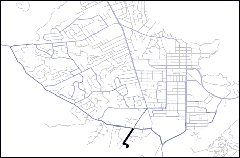
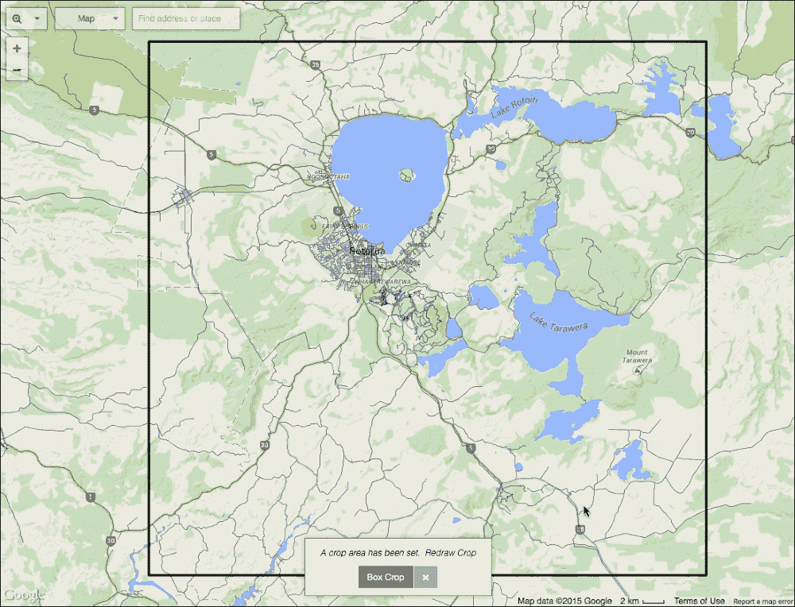
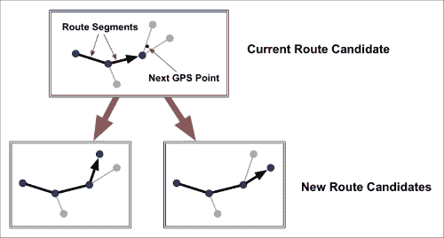
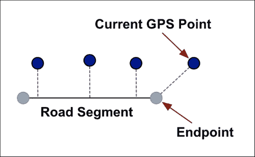
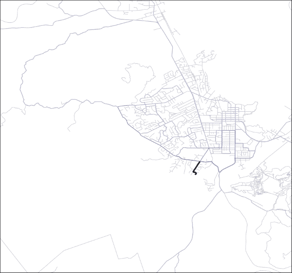

# 第六章.构建一个完整的地理空间分析系统

在本章中，我们将把在前几章中学到的技能应用到构建一套解决复杂地理空间问题的程序中。在这个过程中，我们将学习：

+   地图匹配是什么，以及它是如何工作的

+   如何使用地图匹配根据 GPS 记录生成道路热图

+   如何下载公路地图数据并将其转换为道路网络

+   如何将公路网络存储在数据库中

+   如何使用 GPS 跟踪设备生成自己的旅程记录

+   如何实现地图匹配算法，将 GPS 记录与现有的公路网络匹配，并使用结果计算每段公路被使用的频率

+   如何使用这些计算数据生成一个看起来很棒的 GPS 热图

让我们从考察地图匹配的概念开始，看看它如何有助于解决各种地理空间问题。

# 将 GPS 数据与地图匹配

GPS 记录设备在一段时间内捕捉一系列纬度和经度坐标。随着设备被某人携带从一个地方移动到另一个地方，GPS 坐标记录了人的移动。以下地图显示了典型的 GPS 记录：


GPS 设备相对便宜且非常准确，允许你记录步行、骑自行车、开车或开卡车所经历的旅程。然而，仅凭 GPS 设备本身，它所做的只是记录一系列坐标——GPS 设备不知道你在旅程中跟随了哪些道路。

**地图匹配**是将 GPS 记录与公路数据库进行匹配的过程，以确定在该旅程中使用了哪组公路。为了使地图匹配成功，你需要三样东西：

+   一个准确的旅程 GPS 记录，包括足够的 GPS 坐标以确定所走的道路。

+   一个准确的公路数据库。

+   一个合适的算法来匹配 GPS 坐标与公路数据库。

一旦你知道了哪些道路被走了，你可以用这些信息做各种用途。例如，一个逐段导航系统将使用其对公路数据库和已走的路径的了解来建议下一步要采取的转弯。

你也可以出于历史目的使用地图匹配：跟踪旅行者在旅程中采取的路线，可能为了优化未来的旅程，或者记录哪些道路被最频繁地使用。

在本章中，我们将实现一个完整的地图匹配系统，使用适当的公路数据库和一种复杂的算法来匹配 GPS 记录与这些道路。我们将使用这些信息来生成一系列历史 GPS 记录中常用公路的热图。

# GPS 热图系统的概述

我们正在实施的系统将被命名为**GPS 热图**。我们将下载一组道路数据，并将这些数据转换为有向道路段网络。然后，我们将生成或下载来自各种旅程的 GPS 记录，我们将使用这些记录来识别常行驶的道路。最后，我们将根据道路被行驶的频率生成热图，提供 GPS 设备捕获的最常行驶道路的视觉摘要。生成的输出将类似于以下内容：



### 注意

热图通常使用从蓝色到红色的颜色渐变来绘制道路，蓝色用于较少行驶的道路，红色用于最常行驶的道路。然而，在这本书的印刷版中，热图将以黑白形式出现，因此我们选择了一种单色的蓝色，以便在打印时热图仍然有意义。

为了使我们的 GPS 热图程序尽可能高效地运行，我们将使用 PostGIS 数据库来存储底层道路数据。我们将生成非相交道路段的平面图，使用这些数据来构建连接的道路段网络，并将这个网络存储在数据库中以供快速访问。然后，我们将使用地图匹配算法为每个道路段计算一个**计数**。这些计数然后成为生成 GPS 热图图像的基础，每个道路段将根据该段计算的计数选择合适的颜色。

由于我们的 GPS 热图程序由许多部分组成，我们将将其实现为一套单独的 Python 程序：

+   `init_db.py`: 这个脚本将初始化 PostGIS 数据库，为我们提供一个在加载和处理数据时存储数据的地方。

+   `import_roads.py`: 这个脚本将道路数据从 shapefile 导入到 PostGIS 数据库中。

+   `split_roads.py`: 这个脚本会将导入的道路转换为一系列非重叠的道路段，通过基于原始道路数据计算平面图来实现。

+   `calc_directed_network.py`: 这个脚本将使用道路段生成一个连接的道路段有向网络。这告诉我们各种道路段是如何连接的，以及哪些段从一个给定点出发。

+   `map_matcher.py`: 这个脚本执行实际的地图匹配过程，从 GPX 格式文件中读取原始 GPS 数据，使用这些数据来识别使用该 GPS 设备的用户所经过的道路段，并在使用时为每个道路段增加计数。

+   `generate_heatmap.py`: 这个脚本将使用计算出的计数数据生成用于显示的热图图像。

在我们可以开始实施这些各种程序之前，我们需要获取底层数据。现在让我们看看如何做这件事。

# 获取必要的数据

您的第一步是决定使用哪个 GPS 数据集。如果您愿意，您可以使用 GPS 设备捕获自己的 GPS 记录，或者您可以使用本章示例代码中提供的 GPS 记录。一旦您决定了要使用哪组 GPS 数据，您将需要下载该区域的道路数据。

让我们先决定您希望使用哪套 GPS 数据。

## 获取 GPS 数据

如果您有自己的 GPS 记录设备，您可能想出去并在您在当地地区往返时捕获自己的 GPS 记录。如果您没有自己的 GPS 记录设备，或者您不想捕获自己的 GPS 数据，本章提供的示例代码中包含了一些示例 GPS 记录。

这些示例记录是在作者位于新西兰罗托鲁阿市及其周边地区拍摄的。这些记录使用 Garmin Edge 500 自行车电脑捕获，并以`GPX`格式导出。如果您想捕获自己的 GPS 记录，请确保记录至少 20 次不同的旅程，以便您有一套良好的数据可以工作。

### 注意

并非每个 GPS 记录都是可用的。有时，GPS 数据可能过于不准确，或者可能错过您的旅程的部分，导致匹配错误。此外，地图匹配算法的限制意味着任何在道路上掉头或使用相同道路段两次的旅程都无法匹配。因此，您可能会发现一些记录不起作用。

无论您使用示例记录还是创建自己的，将生成的`GPX`格式文件放入名为`gps-data`的目录中。

## 下载道路数据

一旦您有了 GPS 记录，接下来您需要一组匹配的道路数据。如果您的 GPS 记录是在美国拍摄的，您可以使用美国人口普查局的 TIGER 数据。我们在上一章中使用了这个网站来下载加利福尼亚州的所有主要和次要道路。在这种情况下，您将想要下载您所在地区的所有道路。为此：

1.  访问[`www.census.gov/geo/maps-data/data/tiger-line.html`](https://www.census.gov/geo/maps-data/data/tiger-line.html)，滚动到标记为**2014 TIGER/Line Shapefiles**的部分，点击**下载**选项，然后点击**Web 界面**。

1.  在下载页面，从**选择图层类型**下拉菜单中选择**Roads**，然后点击**提交**按钮。

1.  从**所有道路**下拉菜单中选择您的州，然后点击**提交**。

1.  然后，您需要选择您所在的县，最后您可以点击**下载**按钮以获取所需的道路数据。

如果您不在美国，您需要找到一个合适的替代方案。OpenStreetMap ([`openstreetmap.org`](http://openstreetmap.org)) 是数据的一个可能来源，尽管您可能需要寻找您可以使用格式的道路数据。另外，[`koordinates.com`](https://koordinates.com) 网站可能也有您可以使用的数据。

如果你想要使用本章提供的示例 GPS 录音，请按照以下步骤操作：

1.  前往 [`koordinates.com`](https://koordinates.com)。

1.  点击页面右上角的 **登录** 链接。

1.  通过点击 **注册** 链接注册一个免费账户。

1.  登录后，你将看到一个以你的位置为中心的地图。将地图平移到新西兰，并放大到找到北岛中心的城市罗托瓦。

1.  点击页面左上角的搜索框，输入 `road centrelines` 并按 *Enter*。

    ### 注意

    注意新西兰拼写单词 "centrelines"；如果你输入 `centerlines`，你将找不到你要找的数据。

1.  你要查找的数据集名为 *Improved NZ Road Centrelines (August 2011)*。点击此数据集旁边的 **+** 图标，道路数据将显示在你的地图上。

1.  接下来，进一步放大以显示罗托瓦市及其周边地区，点击页面右上角的裁剪工具 ()，并拖出一个大约如下截图所示的矩形：

1.  选择完成后，点击窗口右上角的 **下载或订购** 链接。默认选项（WGS 84 地图投影和 shapefile 格式）正是你需要的，所以只需点击 **接受条款并创建下载** 按钮。

1.  大约一分钟后，道路数据将可供你下载。生成的文件将被命名为 `kx-improved-nz-road-centrelines-august-2011-SHP.zip`。解压此 ZIP 存档，将生成的目录重命名为 `roads`，并将此目录放置在方便的位置。

# 实现 GPS 热图系统

现在我们已经获得了必要的数据，我们准备开始实现我们的 GPS 热图系统。创建一个名为 `gps-heatmap` 的目录来存放程序及其相关数据文件，然后将你之前创建的两个数据目录（`gps-data` 和 `roads`）放入此目录中。

现在我们已经准备好开始编码了。让我们先实现 `init_db.py` 程序来初始化我们的 PostGIS 数据库。

## 初始化数据库

当你完成 第三章 *空间数据库* 的工作时，你应该已经安装了 Postgres。我们将使用 Postgres 创建并初始化一个数据库来存储所有处理过的道路数据。第一步是创建数据库本身，你可以在终端窗口中输入以下内容来完成：

```py
% createdb gps_heatmap

```

这将创建一个名为 `gps_heatmap` 的数据库。如果你遇到认证错误，你需要输入密码或使用 `-U postgres` 命令行选项，以便 `createdb` 命令可以运行。

现在您已经创建了数据库本身，下一步是将它转换为空间数据库，以便我们可以用它来存储几何数据。为此，请在终端窗口中输入以下命令：

```py
% psql -d gps_heatmap -c "CREATE EXTENSION postgis;"

```

### 小贴士

如果需要，不要忘记添加`-U postgres`命令行选项。

您现在已经为 Python 代码创建了一个空间数据库。我们现在将编写`init_db.py`脚本，该脚本初始化数据库中的各种表和索引。请创建主`gps-heatmap`目录中的`init_db.py`文件，并将以下代码输入到该文件中：

```py
import psycopg2

connection = psycopg2.connect(database="gps_heatmap",
                              user="postgres")
cursor = connection.cursor()

cursor.execute("DROP TABLE IF EXISTS roads")
cursor.execute("CREATE TABLE roads (" +
                   "id SERIAL PRIMARY KEY," +
                   "name VARCHAR," + 
                   "centerline GEOMETRY)")
cursor.execute("CREATE INDEX ON roads USING GIST(centerline)")

 connection.commit()
```

如您所见，我们正在使用`psycopg2`库来访问我们的 PostGIS 数据库。我们创建了一个数据库连接和一个相关的`cursor`对象。然后我们创建了`roads`数据库表，首先删除它，这样我们就可以在需要更改数据库结构时再次运行此脚本。

### 小贴士

如果需要使用不同的用户名或密码访问您计算机上的 PostGIS，请勿忘记更改`psycopg2.connect()`语句的参数。

`roads`表将存储从我们刚刚下载的 shapefile 中导入的原始道路数据。如您所见，这个表将有三组不同的字段：

+   `id`：这是数据库中这条道路的唯一 ID

+   `name`：这是道路的名称

+   `centerline`：这是一个 LineString 几何对象，表示这条道路的形状

这不是我们需要的唯一数据库表，但足以让我们开始。随着我们的进行，我们将在`init_db.py`程序中添加更多的表定义。不过，现在您应该能够运行此程序来创建`roads`表，这是我们将在下一节中导入下载的道路数据到数据库时需要的。

## 导入道路数据

我们现在已准备好将下载的 shapefile 中的道路数据导入数据库。将执行此操作的程序称为`import_roads.py`。请创建此文件，并将以下 Python 代码输入到其中：

```py
import psycopg2
from osgeo import ogr

connection = psycopg2.connect(database="gps_heatmap",
                              user="postgres")
cursor = connection.cursor()

cursor.execute("DELETE FROM roads")
```

到目前为止，我们所做的一切只是打开数据库连接并删除`roads`表中的现有内容。接下来，我们需要从我们下载的 shapefile 中导入道路数据。当然，我们如何做将取决于道路数据来自哪里。对于*Improved NZ Road Centrelines*数据，我们将使用以下代码：

```py
shapefile = ogr.Open("roads/improved-nz-road-centrelines-august-2011.shp")
layer = shapefile.GetLayer(0)

for i in range(layer.GetFeatureCount()):
    feature = layer.GetFeature(i)
    geometry = feature.GetGeometryRef()

    if feature.GetField("descr") != None:
        name = feature.GetField("descr")
    elif feature.GetField("label") != None:
        name = feature.GetField("label")
    else:
        name = None

    centerline_wkt = geometry.ExportToWkt()

    cursor.execute("INSERT INTO roads (name, centerline) " +
                   "VALUES (%s, ST_GeomFromText(%s))",
                   (name, centerline_wkt))

connection.commit()
```

如您所见，我们使用 OGR 从 shapefile 导入道路数据，并使用`descr`或`label`字段作为道路名称。这对应于*NZ Road Centrelines*数据定义的方式，有时道路名称在`descr`字段中，有时在`label`字段中。有些道路没有名称（例如，道路穿过环岛的地方），因此在这种情况下，道路名称将被设置为`None`。

如果您使用的是不同的道路数据源，您需要修改此代码以适应您的道路数据组织方式。只需确保将中心线和（如有适用）道路名称存储到`roads`表中。

## 分割道路数据成段

如我们在上一章所见，道路接触或交叉的点并不是自动被认为是构建道路网络连接点的。我们首先需要从交叉的道路中创建一个**平面图**，就像我们在上一章所做的那样。因此，我们的下一个任务是将道路分割成段，从原始道路数据中形成一个平面图的道路段。

`split_roads.py`程序将分割原始道路数据成段。然而，在我们能够编写这个程序之前，我们需要在数据库中添加一个表来存储道路段。为此，将以下代码添加到您的`init_db.py`程序中，在调用`connection.commit()`之前立即执行：

```py
cursor.execute("DROP TABLE IF EXISTS road_segments")
cursor.execute("CREATE TABLE road_segments (" +
               "id SERIAL PRIMARY KEY," +
               "name VARCHAR," + 
               "centerline GEOMETRY," +
               "tally INTEGER)")
cursor.execute("CREATE INDEX ON road_segments USING GIST(centerline)")
```

如您所见，我们创建了一个名为`road_segments`的新表来存储平面图中的各个段。每个道路段将包含以下字段：

+   `id`：这是该道路段的唯一 ID。

+   `name`：这是该段所属的道路名称。

+   `centerline`：这是一个表示该道路段形状的 LineString 几何形状。

+   `tally`：这是 GPS 记录使用该道路段次数的数量。这是我们在本章后面将要实现的地图匹配算法的输出。

现在我们已经创建了`road_segments`表，我们可以开始实现`split_roads.py`程序。创建此文件并将以下代码添加到其中：

```py
import psycopg2
import shapely.wkt
import shapely

connection = psycopg2.connect(database="gps_heatmap",
                              user="postgres")
cursor = connection.cursor()

cursor.execute("DELETE FROM road_segments")
```

到目前为止，我们只是打开了一个数据库连接并删除了任何现有的`road_segments`记录。像往常一样，这给了我们一个空白表，我们可以存储我们的计算出的道路段，移除我们可能之前存储的任何段。这允许我们按需运行程序。

接下来，我们想要将`roads`表的内容转换成一系列连接的道路段。在上一章中，我们使用 Shapely 在内存中存储的道路数据执行了这个任务。这次，我们将使用 PostGIS 实现相同的过程。首先，我们将加载所有`road`记录 ID 的主列表到内存中：

```py
all_road_ids = []
cursor.execute("SELECT id FROM roads")
for row in cursor:
    all_road_ids.append(row[0])
```

我们将依次处理每条道路。对于每条道路，我们首先将道路的名称和几何形状加载到内存中：

```py
for road_id in all_road_ids:
    cursor.execute("SELECT name,ST_AsText(centerline) " +
                   "FROM roads WHERE id=%s", (road_id,))
    name,wkt = cursor.fetchone()
    cur_road = shapely.wkt.loads(wkt)
```

现在我们已经得到了道路的 LineString 几何形状，我们想要在每个它接触或交叉其他道路的点处将其分割。为此，我们将为这条道路构建一个**十字路口**列表：

```py
    crossroads = []
    cursor.execute("SELECT ST_AsText(centerline) FROM ROADS" +
                   "WHERE ST_Touches(roads.centerline, " +
                   "ST_GeomFromText(%s)) OR ST_Crosses(" +
                   "roads.centerline, ST_GeomFromText(%s))",
                   (wkt, wkt))
    for row in cursor:
        crossroad = shapely.wkt.loads(row[0])
        crossroads.append(crossroad)
```

然后，我们使用十字路口将当前道路的几何形状分割成一个或多个段：

```py
    for crossroad in crossroads:
        cur_road = cur_road.difference(crossroad)
```

接下来，我们需要处理生成的道路，将其分割成每个道路段的一个单独的 LineString：

```py
    segments = []
    if cur_road.geom_type == "MultiLineString":
        for segment in cur_road.geoms:
            segments.append(segment)
    elif cur_road.geom_type == "LineString":
        segments.append(cur_road)
```

然后，我们将计算出的段保存到`road_segments`表中：

```py
    for segment in segments:
        centerline_wkt = shapely.wkt.dumps(segment)
        cursor.execute("INSERT INTO road_segments (name, " +
                       "centerline, tally) VALUES (%s, " +
                       "ST_GeomFromText(%s), %s)",
                       (name, centerline_wkt, 0))
```

最后（在`for road_id in all_road_ids`循环外部），我们将更改提交到数据库：

```py
connection.commit()
```

这完成了我们的`split_roads.py`程序。如果你按顺序运行程序，然后使用`psql`命令行客户端访问数据库，你可以看到程序确实从原始道路数据中生成了许多路段：

```py
% python init_db.py
% python import_roads.py
% python split_roads.py
% psql gps_heatmap
# SELECT count(*) from roads;
1556
# SELECT count(*) from road_segments;
3240

```

如你所预期，路段的数量比道路的数量要多得多。

### 注意

如果你想要查看路段，你可以轻松地编写一个使用 Mapnik 的程序来显示`road_segments`表的内容。这个程序的版本名为`preview_segments.py`，包含在本章的示例代码中。

## 构建有向路段的网络

当我们尝试将记录的 GPS 数据与路段数据库匹配时，我们需要回答的一个重要问题是，“从这条路段出发还有哪些其他路段？”为了回答这个问题，我们需要构建一个**有向网络**的路段。

在上一章中，我们做了类似的事情，在那里我们使用 NetworkX 来计算两点之间的最短路径。然而，在这种情况下，我们将把网络存储在数据库中以供以后使用。

为了使地图匹配算法更容易实现，我们的路段网络将是**有向的**——也就是说，我们`road_segments`表中的每个路段实际上将由两个独立的路段表示：


### 注意

当然，并非每条道路都是双向的，但我们忽略这一点以简化问题。

如你所见，每个路段都被转换成两个有向路段：一个从点 A 到点 B 运行，另一个从点 B 返回到点 A。

我们将使用一个名为`directed_segments`的新表来存储有向路段。每个有向路段记录将包含以下字段：

+   `id`: 这是此路段段落的唯一 ID

+   `road_segment_id`: 这是此有向路段派生出的路段记录的 ID

+   `centerline`: 这是此有向路段的 LineString 几何形状

注意，有向路段的 LineString 与路段本身的方向一致——也就是说，有向路段的起点在`centerline.coords[0]`，终点在`centerline.coords[-1]`。

第二个表，`endpoints`，将包含各种有向路段的端点坐标。每个端点记录将包含以下字段：

+   `id`: 这是此端点的唯一 ID

+   `endpoint`: 这是一个包含此端点坐标的 Point 几何形状

    ### 注意

    我们在这里使用 Point 几何形状，以便可以对这张表进行空间查询。

最后，我们需要一个表来标识从给定端点出发的有向路段。这个表，`endpoint_segments`，将包含以下字段：

+   `id`: 这是此`endpoint_segments`记录的唯一 ID

+   `directed_segment_id`：这是有向道路段的记录 ID

+   `endpoint_id`：这是此有向道路段离开的端点的记录 ID

这三个表将用于存储有向道路段网络。让我们修改我们的`init_db.py`程序以创建这三个新表。为此，将以下代码添加到文件末尾，紧接在调用`connection.commit()`之前：

```py
cursor.execute("DROP TABLE IF EXISTS directed_segments")
cursor.execute("CREATE TABLE directed_segments (" +
               "id SERIAL PRIMARY KEY," +
               "road_segment_id INTEGER," +
               "centerline GEOMETRY)")
cursor.execute("CREATE INDEX ON directed_segments USING GIST(centerline)")

cursor.execute("DROP TABLE IF EXISTS endpoints")
cursor.execute("CREATE TABLE endpoints (" +
               "id SERIAL PRIMARY KEY," +
               "endpoint GEOMETRY)")
cursor.execute("CREATE INDEX ON endpoints USING GIST(endpoint)")

cursor.execute("DROP TABLE IF EXISTS endpoint_segments")
cursor.execute("CREATE TABLE endpoint_segments (" +
               "id SERIAL PRIMARY KEY," +
               "directed_segment_id INTEGER," +
               "endpoint_id INTEGER)")
cursor.execute("CREATE INDEX ON endpoint_segments(directed_segment_id)")
cursor.execute("CREATE INDEX ON endpoint_segments(endpoint_id)")
```

这是我们需要对数据库结构进行的最后一次更改，所以请继续重新创建数据库表，导入道路，并再次分割它们：

```py
% python init_db.py
% python import_roads.py
% python split_roads.py

```

### 注意

如果我们使用了数据库迁移，我们就不需要每次都重新运行我们的程序，但我们正在尽可能简化数据库逻辑。幸运的是，这是我们最后一次需要这样做的时候。

我们现在已准备好计算有向道路网络并将其存储到数据库中。我们将创建的程序称为`calc_directed_network.py`；创建此文件，并将以下代码输入其中：

```py
import networkx
import psycopg2
import shapely.wkt
import shapely.geometry

connection = psycopg2.connect(database="gps_heatmap", user="postgres")
cursor = connection.cursor()
```

我们现在已准备好创建表示道路网络的 NetworkX 图。在上一章中我们这样做时，我们使用了`networkx.read_shp()`函数，从 shapefile 的内容创建一个 NetworkX `DiGraph`对象。不幸的是，没有等效函数可以用于从 PostGIS 数据库的内容创建图；然而，由于 NetworkX 是用 Python 实现的，因此很容易修改`read_shp()`函数的源代码以实现我们想要的功能。将以下代码添加到`calc_directed_network.py`程序末尾：

```py
network = networkx.Graph()

cursor.execute("SELECT id,ST_AsText(centerline) FROM road_segments")
for row in cursor:
    road_segment_id,wkt = row
    linestring = shapely.wkt.loads(wkt)

    first_pt = linestring.coords[0]
    last_pt  = linestring.coords[-1]

    network.add_edge(first_pt, last_pt,
                     {'road_segment_id' : road_segment_id})
```

NetworkX 图中的节点是一个`(long,lat)`元组，用于标识每个道路段端点的唯一标识符，边代表有向道路段。请注意，我们在图中存储道路段的记录 ID 作为属性，以便以后引用。

现在我们有了 NetworkX 图，让我们准备使用它来生成连接道路段的有向网络。为此，我们必须从我们构建的图中计算**最大的连接子图**，就像我们在上一章中所做的那样。以下是必要的代码：

```py
sub_graphs = list(networkx.connected_component_subgraphs(network))
largest = sub_graphs[0]
```

我们现在有一个包含所有连接道路段的图。我们可以现在使用它将道路段端点存储到数据库中：

```py
cursor.execute("DELETE FROM endpoints")

endpoint_ids = {}
for node in largest.nodes():
    point = shapely.geometry.Point(node)
    wkt = shapely.wkt.dumps(point)

    cursor.execute("INSERT INTO endpoints (endpoint) " +
                   "VALUES (ST_GeomFromText(%s)) RETURNING id",
                   (wkt,))
    endpoint_id = cursor.fetchone()[0]

    endpoint_ids[node] = endpoint_id
```

注意，`endpoint_ids`字典将一个`(long,lat)`坐标映射到数据库中端点的记录 ID。我们将使用它将有向道路段与其端点链接起来。

我们的最后任务是存储有向道路段，以及该段开始于的端点。我们将首先删除数据库中现有的记录，然后遍历我们图中的道路段：

```py
cursor.execute("DELETE FROM directed_segments")
cursor.execute("DELETE FROM endpoint_segments")

for node1,node2 in largest.edges():
    endpoint_id_1 = endpoint_ids[node1]
    endpoint_id_2 = endpoint_ids[node2]
    road_segment_id = largest.get_edge_data(node1, node2)['road_segment_id']

    cursor.execute("SELECT ST_AsText(centerline) " +
                   "FROM road_segments WHERE id=%s",
                   (road_segment_id,))
    wkt = cursor.fetchone()[0]
    linestring = shapely.wkt.loads(wkt)
```

我们现在有了段端点的记录 ID 和定义此道路段的 LineString。我们现在需要将此段转换为两个*有向*段，每个方向一个：

```py
    reversed_coords = list(reversed(linestring.coords))
    if node1 == linestring.coords[0]:
        forward_linestring = linestring
        reverse_linestring = shapely.geometry.LineString(reversed_coords)
    else:
        reverse_linestring = linestring
        forward_linestring = shapely.geometry.LineString(reversed_coords)
```

这给我们提供了两个 LineString 几何形状，一个从第一个端点到第二个端点，另一个从第二个端点回到第一个端点。现在我们可以将我们计算的信息保存到数据库中：

```py
    cursor.execute("INSERT INTO directed_segments " +
                   "(road_segment_id,centerline) VALUES " +
                   "(%s, ST_GeomFromText(%s)) RETURNING id",
                   (road_segment_id, forward_linestring.wkt))
    forward_segment_id = cursor.fetchone()[0]

    cursor.execute("INSERT INTO directed_segments " +
                   "(road_segment_id,centerline) VALUES " +
                   "(%s, ST_GeomFromText(%s)) RETURNING id",
                   (road_segment_id, reverse_linestring.wkt))
    reverse_segment_id = cursor.fetchone()[0]

    cursor.execute("INSERT INTO endpoint_segments " + 
                       "(directed_segment_id, endpoint_id) " +

                       "VALUES (%s, %s)", 

                       (forward_segment_id, endpoint_id_1))

        cursor.execute("INSERT INTO endpoint_segments " + 
                       "(directed_segment_id, endpoint_id) " +

                       "VALUES (%s, %s)", 

                       (reverse_segment_id, endpoint_id_2))
```

为了完成我们的程序，我们必须提交我们所做的更改：

```py
connection.commit()
```

你现在可以通过运行这个程序来创建有向道路段网络：

```py
% python calc_directed_network.py

```

## 实现地图匹配算法

我们终于准备好实现我们的地图匹配算法了。我们将使用的算法来源于论文：《使用多假设技术（MHT）在高清导航网络上进行 GPS 轨迹的地图匹配》，由 Nadine Schuessler 和 Kay Axhausen 为瑞士交通规划与系统研究所撰写。

如果你对阅读这篇论文感兴趣，可以在[www.ivt.ethz.ch/vpl/publications/reports/ab568.pdf](http://www.ivt.ethz.ch/vpl/publications/reports/ab568.pdf)找到。这个算法基于**路线候选**的概念，即旅行者在记录 GPS 点时可能采取的路径。每个路线候选都有一个包含方向道路段和**得分**的列表，该得分标识 GPS 点与这些道路段的匹配程度。

通过逐个跟随 GPS 点来重现旅程。在任何特定时刻，都有一个可能匹配迄今为止已处理的 GPS 坐标的路线候选列表。随着每个新的 GPS 点被处理，路线候选会逐个更新，通过比较 GPS 坐标与路线候选的最终道路段。

如果 GPS 点被认为仍然在最终段落的某个地方，那么 GPS 点就简单地添加到该段落，并更新路线候选的得分。另一方面，如果 GPS 点超出了路线候选的最终道路段，那么我们会查看道路网络，看看哪些其他道路段从这个点出发。然后，我们为每个从该端点出发的道路段创建新的路线候选：



一旦处理完所有 GPS 点，我们就选择得分最低的路线候选，认为它最有可能是这次旅行的使用路径。

为了实现这个算法，我们将使用 Python 字典来表示**路线段**——即在路线候选的旅程中的单个段落。每个路线段字典将包含以下条目：

+   `directed_segment_id`：这是跟随该路线段的道路段`directed_segment`的记录 ID

+   `linestring`：这是道路段中心线，作为一个 Shapely LineString 对象

+   `gps_points`：这是一个定义分配给该路线段的 GPS 点的(long,lat)坐标的列表

+   `gps_distances`：这是一个包含每个 GPS 点与段 LineString 之间计算出的最小距离的列表

每个路由候选将用一个包含以下条目的 Python 字典来表示：

+   `segments`: 这是一个由构成此路由候选的路由段组成的列表。

+   `directed_segment_ids`: 这是一个包含此路由所使用的每个定向段记录 ID 的列表。我们使用这个列表来快速丢弃另一个路由正在使用相同道路段序列的新路由候选。

+   `score`: 这是为此路由候选计算出的分数。分数是每个路由段中 GPS 距离的总和——换句话说，分数越低，GPS 点越接近此路由。

在了解这些信息的基础上，让我们开始实现地图匹配器。创建一个新的 Python 程序，命名为`map_matcher.py`，并将以下内容输入到该文件中：

```py
import os
import osgeo.ogr
import shapely.geometry
import shapely.wkt
import psycopg2
import pyproj

gps_tracks = []
for fName in os.listdir("gps-data"):
    if fName.endswith(".gpx"):
        srcFile = osgeo.ogr.Open("gps-data/" + fName)
        layer = srcFile.GetLayerByName("tracks")

        for feature_num in range(layer.GetFeatureCount()):
            feature = layer.GetFeature(feature_num)
            geometry = feature.GetGeometryRef()

            if geometry.GetGeometryName() == "MULTILINESTRING":
                for geom_num in range(geometry.GetGeometryCount()):
                    wkt = geometry.GetGeometryRef(geom_num).ExportToWkt()
                    gps_tracks.append((fName, wkt))
            elif geometry.GetGeometryName() == "LINESTRING":
                wkt = geometry.ExportToWkt()
                gps_tracks.append((fName, wkt))

connection = psycopg2.connect(database="gps_heatmap", user="postgres")
cursor = connection.cursor()
```

如您所见，我们导入了所需的各个库，将记录的 GPS 数据加载到内存中，并打开到我们的数据库的连接。接下来，我们想要重置道路段的总计值：

```py
cursor.execute("UPDATE road_segments SET tally=0")
connection.commit()
```

我们现在准备好开始处理记录的 GPS 数据。虽然基于此算法的论文使用了一种复杂的过程，将 GPS 数据分割成行程段，处理每个行程段，然后将结果路由连接起来，但我们将使用一种更简单的方法；我们假设每个 GPS 记录没有间隙，但它可能开始或结束在道路上。为了处理这个问题，我们修剪起点和终点坐标，直到我们找到一个距离道路 10 米以内的点。

将以下内容添加到程序末尾：

```py
for fName,track_wkt in gps_tracks:
    print "Processing " + fName

    gps_track  = shapely.wkt.loads(track_wkt)
    gps_points = list(gps_track.coords)

    while len(gps_points) > 0:
        circle = calc_circle_with_radius(gps_points[0], 10)
        cursor.execute("SELECT count(*) FROM road_segments " +
                "WHERE ST_Intersects(ST_GeomFromText(%s)," +
                       "centerline)", (circle.wkt,))
        if cursor.fetchone()[0] == 0:
            del gps_points[0]
        else:
            break

    while len(gps_points) > 0:
        circle = calc_circle_with_radius(gps_points[-1], 10)
        cursor.execute("SELECT count(*) FROM road_segments " +
                "WHERE ST_Intersects(ST_GeomFromText(%s)," +
                       "centerline)", (circle.wkt,))
        if cursor.fetchone()[0] == 0:
            del gps_points[-1]
        else:
            break
```

我们只是依次处理每个 GPS 轨迹，从起点和终点修剪点，直到找到一个距离道路段 10 米以内的 GPS 点。请注意，我们正在使用一个名为`calc_circle_with_radius()`的函数来创建一个描述 GPS 坐标周围 10 米圆的 Shapely 多边形，然后要求数据库在该圆内查找任何道路段。让我们继续实现这个`calc_circle_with_radius()`函数；将其放置在程序顶部，紧接在`import`语句之后：

```py
def calc_circle_with_radius(center_point, radius):
    geod = pyproj.Geod(ellps="WGS84")
    sLong,sLat = center_point
    eLong,eLat,iHeading = geod.fwd(sLong, sLat, 0, radius)
    lat_delta = abs(sLat - eLat)
    return shapely.geometry.Point(sLong, sLat).buffer(lat_delta)
```

现在我们已经得到了每个记录中相关的 GPS 点集合，我们准备好开始地图匹配。第一步是根据起始 GPS 点构建一组初始路由候选。我们通过识别距离 GPS 点 750 米以内的所有道路端点来完成此操作，并为从这些端点出发的每个道路段创建一个（单段）路由候选。遵循 Schuessler 和 Axhausen 的论文，我们确保至少有 25 个路由候选，如果没有，我们将搜索区域扩大 100 米并再次尝试。

将以下代码添加到你的程序末尾：

```py
    search_distance = 750
    while True:
        circle = calc_circle_with_radius(gps_points[0],
                                         search_distance)

        cursor.execute("SELECT id FROM endpoints " +
                       "WHERE ST_Contains(ST_GeomFromText(%s)," +
                       "endpoint)", (circle.wkt,))
        possible_endpoints = []
        for row in cursor:
            possible_endpoints.append(row[0])

        possible_road_segments = []
        for endpoint_id in possible_endpoints:
            cursor.execute("SELECT directed_segment_id " +
                           "FROM endpoint_segments " +
                           "WHERE endpoint_id=%s", (endpoint_id,))
            for row in cursor:
                directed_segment_id = row[0]
                possible_road_segments.append(
                    (directed_segment_id, endpoint_id))

        route_candidates = []
        for directed_segment_id,endpoint_id in possible_road_segments:
            cursor.execute("SELECT ST_AsText(centerline) " +
                           "FROM directed_segments WHERE id=%s",
                           (directed_segment_id,))
            wkt = cursor.fetchone()[0]
            linestring = shapely.wkt.loads(wkt)
            gps_distance = calc_distance(gps_points[0],
                                         linestring)

            segment = {
                'directed_segment_id' : directed_segment_id,
                'linestring' : linestring,
                'gps_points': [gps_points[0]],
                'gps_distances': [gps_distance]}
            route_segments = [segment]

            candidate = {
                'segments': route_segments,
                'directed_segment_ids' : [directed_segment_id],
                'score': calc_score(route_segments)}
            route_candidates.append(candidate)

        if len(route_candidates) >= 25:
            break
        else:
            search_distance = search_distance + 100
            continue
```

如您所见，我们为每个可能的路线候选者创建一个单独的路线段字典和一个路线候选者字典，并将结果存储在`route_candidates`列表中。这里我们还需要两个额外的函数：一个用于计算从给定点到给定 Shapely 几何体内部最近点的距离，另一个用于计算给定路线候选者的得分。请将这些两个函数添加到程序顶部：

```py
def calc_distance(point, geometry):
    return shapely.geometry.Point(point).distance(geometry)

def calc_score(route_segments):
    total = 0
    for segment in route_segments:
        total = total + sum(segment['gps_distances'])
    return total
```

现在我们已经有一组初始路线候选者，我们必须通过将每个连续的 GPS 点添加到每个路线候选者中来**开发**它们，在到达每个路段的末尾时生成新的路线候选者。同时，我们**修剪**路线候选者列表，以防止其变得过大。

我们的大部分工作将在名为`develop_route()`的函数中完成。这个函数将接受一个路线候选者和一个 GPS 点（以及一些其他参数），并返回一个包含新或更新路线候选者的列表，以便在下一轮迭代中进行处理。让我们编写使用此函数的代码；将以下内容添加到程序末尾：

```py
    for next_point in gps_points[1:]:
        num_routes_to_process = len(route_candidates)
        for i in range(num_routes_to_process):
            route = route_candidates.pop(0)
            new_candidates = develop_route(next_point, route, route_candidates, cursor)
            route_candidates.extend(new_candidates)
```

我们对每个路线候选者只处理一次，首先使用`route_candidates.pop(0)`将其从候选者列表中删除，然后将候选者传递给`develop_route()`函数。然后我们将新或更新的路线候选者添加到`route_candidates`列表的末尾。当我们的`for i in range(num_routes_to_process)`循环结束时，我们将已经处理了每个路线候选者一次，要么将 GPS 点纳入该路线候选者，要么用一组新的路线候选者替换它。

在我们开始处理下一个 GPS 点之前，我们需要修剪路线候选者列表。根据 Schuessler 和 Axhausen 的说法，一种非常有效的方法是反复移除得分最高的路线候选者，直到剩余的候选者不超过 40 个。我们现在就来做这件事：

```py
        while len(route_candidates) > 40:
            highest = None
            for index,route in enumerate(route_candidates):
                if highest == None:
                    highest = index
                elif route['score'] > route_candidates[highest]['score']:
                    highest = index
            del route_candidates[highest]
```

### 小贴士

确保将此代码放在`for next_point in...`循环内。

在我们实现`develop_route()`函数之前，让我们完成程序的主要部分。我们现在已经处理了所有 GPS 点，因此我们可以检查每个剩余路线候选者的得分，并选择得分最低的候选者（排除任何路线段少于两个的候选者）。这是 GPS 点最有可能采取的路线候选者。然后我们增加该路线使用的每个路段的计数。以下是相关代码：

```py
    best_route = None
    for route in route_candidates:
        if len(route['segments']) >= 2:
            if best_route == None:
                best_route = route
            elif route['score'] < best_route['score']:
                best_route = route

    if best_route == None: continue

    for segment in best_route['segments']:
        cursor.execute("SELECT road_segment_id " +
                       "FROM directed_segments WHERE id=%s",
                       (segment['directed_segment_id'],))
        road_segment_id = cursor.fetchone()[0]
        cursor.execute("UPDATE road_segments SET tally=tally+1" +
                       "WHERE id=%s", (road_segment_id,))

connection.commit()
```

我们现在需要实现`develop_route()`函数。这个函数将使用 Schuessler 和 Axhausen 论文中的以下逻辑：

1.  如果路线候选者只有一个路段，检查 GPS 点是否到达该路段 LineString 的起点。如果发生这种情况，GPS 记录必须是在错误方向上跟随该有向路段，因此我们丢弃该路线候选者。

1.  检查 GPS 点是否仍然位于路线候选者的最终段内。如果是这样，将该 GPS 点添加到该最终段，重新计算候选者的得分，并返回它以供进一步处理。

1.  如果 GPS 点超出了路线候选者最终段落的末尾，识别我们已达到的端点，并为从该端点出发的每个有向道路段创建一个新的路线候选者。我们检查每个新路线候选者的有效性，并返回有效候选者以供进一步处理。

让我们开始实现这个函数：

```py
def develop_route(next_point, route, route_candidates, cursor):
    if len(route['segments']) == 1:
        if point_at_start_of_segment(next_point,
                                     route['segments'][0]):
            return []

    last_segment = route['segments'][-1]

    if point_in_route_segment(next_point, last_segment):
        next_distance = calc_distance(next_point,
                                      last_segment['linestring'])
        last_segment['gps_points'].append(next_point)
        last_segment['gps_distances'].append(next_distance)
        route['score'] = calc_score(route['segments'])
        return [route]
```

这实现了之前描述的前两个步骤。请注意，我们使用了两个新的函数，`point_at_start_of_segment()` 和 `point_in_route_segment()` 来完成所有繁重的工作。我们将在不久后实现这些函数，但首先让我们通过创建一组新的路线候选集来处理 GPS 点经过最后一个路线段末尾的过程。

这个过程的第一个步骤是确定我们已达到的当前端点。将以下内容添加到 `develop_route()` 函数的末尾：

```py
    last_point = last_segment['linestring'].coords[-1]
    endpoint = shapely.geometry.Point(last_point)

    cursor.execute("SELECT id FROM endpoints " +
                   "WHERE endpoint=ST_GeomFromText(%s)",
                   (endpoint.wkt,))
    endpoint_id = cursor.fetchone()[0]
```

接下来，我们将构建一个包含所有从该端点出发的有向道路段列表：

```py
    possible_segment_ids = []
    cursor.execute("SELECT directed_segment_id " +
                   "FROM endpoint_segments " +
                   "WHERE endpoint_id=%s", (endpoint_id,))
    for row in cursor:
        possible_segment_ids.append(row[0])
```

我们现在需要为每个可能的路段创建一个新的路线候选者。对于每个路线候选者，我们使用该有向路段创建一个单独的路线段：

```py
    new_candidates = []
    for directed_segment_id in possible_segment_ids:
        cursor.execute("SELECT road_segment_id," +
                       "ST_AsText(centerline) " +
                       "FROM directed_segments " +
                       "WHERE id=%s", (directed_segment_id,))
        road_segment_id,wkt = cursor.fetchone()
        linestring = shapely.wkt.loads(wkt)

        next_distance = calc_distance(next_point, linestring)

        new_segment = {}
        new_segment['directed_segment_id'] = directed_segment_id
        new_segment['linestring'] = linestring
        new_segment['gps_points'] = [next_point]
        new_segment['gps_distances'] = [next_distance]

        new_candidate = {}
        new_candidate['segments'] = []
        new_candidate['segments'].extend(route['segments'])
        new_candidate['segments'].append(new_segment)
        new_candidate['directed_segment_ids'] = []
        new_candidate['directed_segment_ids'].extend(
                            route['directed_segment_ids'])
        new_candidate['directed_segment_ids'].append(directed_segment_id)

        if not route_is_valid(new_candidate, route_candidates,
                              new_candidates):
            continue

        new_candidate['score'] = calc_score(new_candidate['segments'])
        new_candidates.append(new_candidate)
    return new_candidates
```

注意，我们使用另一个函数 `route_is_valid()` 来检查新路线的有效性。我们还将必须实现这个函数。

这完成了 `develop_route()` 函数本身。现在让我们编写 `point_at_start_of_segment()` 函数，该函数确定 GPS 轨迹是否沿着有向道路段错误地运行：

```py
def point_at_start_of_segment(next_point, segment):
    num_points = len(segment['gps_points'])
    if num_points > 0:
        average_distance = sum(segment['gps_distances']) / num_points

        startpoint_coord = segment['linestring'].coords[0]
        startpoint = shapely.geometry.Point(startpoint_coord)
        endpoint_coord = segment['linestring'].coords[-1]
        endpoint = shapely.geometry.Point(endpoint_coord)

        distance_to_start = calc_distance(next_point, startpoint)
        distance_to_end   = calc_distance(next_point, endpoint)

        if distance_to_start < 2 * average_distance:
            if distance_to_end > 2 * average_distance:
                return True
    return False
```

这段代码有点混乱，比较当前点到路段起点和终点的距离，但对我们来说已经足够好了。

接下来，我们需要实现 `point_in_route_segment()` 函数。我们将使用两个单独的测试来查看点是否已达到段落的端点。首先，我们知道如果 GPS 点到段落的 LineString 上最近点的距离等于点到该 LineString 末端的距离，那么我们已经到达了端点：



这是 `point_in_route_segment()` 函数的第一部分，它实现了这个测试：

```py
def point_in_route_segment(point, segment):
    endpoint = shapely.geometry.Point(segment['linestring'].coords[-1])

    distance_to_linestring = calc_distance(point,
                                           segment['linestring'])
    distance_to_endpoint = calc_distance(point, endpoint)

    if distance_to_linestring == distance_to_endpoint:
        return False
```

第二个测试涉及比较最终路线段与由分配给该路线段的 GPS 点构建的 LineString 的长度。如果 GPS LineString 比路段长，那么我们必须已经到达了该段落的末尾：

```py
    gps_coords = []
    gps_coords.extend(segment['gps_points'])
    gps_coords.append(point)

    gps_length = shapely.geometry.LineString(gps_coords).length
    segment_length = segment['linestring'].length

    if gps_length > segment_length:
        return False
```

最后，如果 GPS 点未通过这两个测试，那么它仍然位于当前路线段内：

```py
    return True
```

### 注意

Schuessler 和 Axhausen 的论文提出了一种第三种测试方法，即比较 GPS 轨迹的方向与路段方向。然而，由于路段是复杂的 LineStrings 而不是直线段，因此不清楚如何实现这种测试，所以我们不会在我们的地图匹配算法实现中使用这种测试。

这完成了 `point_in_route_segment()` 函数的实现。我们需要实现的最后一个函数是 `route_is_valid()`。如果一条路线候选被认为是有效的，那么：

1.  它是唯一的；也就是说，没有其他路线候选具有完全相同的路段序列

1.  其最终路段不会回到前一个路段的起点；也就是说，路线不会自我回环。

1.  路线不包括相同的定向路段两次

为了计算唯一性，`route_is_valid()` 函数不仅需要一个当前路线候选的列表，还需要一个由 `develop_route()` 函数创建的新候选列表。因此，`route_is_valid()` 函数接受当前路线候选列表和正在创建的新候选列表。

这是该函数实现的第一部分，包括唯一性检查：

```py
def route_is_valid(route, route_candidates, new_candidates):
    route_roads = route['directed_segment_ids']

    for other_route in route_candidates:
        if route_roads == other_route['directed_segment_ids']:
            return False

    for other_route in new_candidates:
        if route_roads == other_route['directed_segment_ids']:
            return False
```

以下代码检查一条路线是否不会自我回环：

```py
    if len(route['segments']) >= 2:
        last_segment = route['segments'][-1]
        prev_segment = route['segments'][-2]

        last_segment_end   = last_segment['linestring'].coords[-1]
        prev_segment_start = prev_segment['linestring'].coords[0]

        if last_segment_end == prev_segment_start:
            return False
```

最后，我们确保相同的定向路段不会被使用两次：

```py
    directed_segment_ids = set()
    for segment in route['segments']:
        directed_segment_id = segment['directed_segment_id']
        if directed_segment_id in directed_segment_ids:
            return False
        else:
            directed_segment_ids.add(directed_segment_id)
```

如果路线通过所有三个检查，则被认为是有效的：

```py
    return True
```

这完成了 `route_is_valid()` 函数的实现，实际上也完成了整个 `map_matcher.py` 程序的实现。您应该能够从命令行运行它，并依次看到每个 GPS 记录被处理：

```py
% python map_matcher.py
Processing ride_2015_01_08.gpx
Processing ride_2015_01_11.gpx
Processing ride_2015_01_23.gpx
...

```

由于每个 GPS 记录中都有数千个点，程序处理每个文件将需要几分钟。一旦完成，`road_segments` 表中的 `tally` 字段就会更新，以显示每个路段被使用的次数。您可以使用 Postgres 命令行客户端进行检查：

```py
% psql gps_heatmap
# SELECT name,tally FROM road_segments WHERE tally > 0 ORDER BY tally DESC;
 3560 | otonga rd                        |    42
 6344 | wychwood cres                    |    42
 3561 | otonga rd                        |    42
 3557 | otonga rd                        |    42
 3558 | otonga rd                        |    42
 3559 | otonga rd                        |    42
 6343 | wychwood cres                    |    41
 6246 | springfield rd                   |    19
 6300 | old taupo rd                     |    19

```

如您所见，地图匹配是一个相当复杂的过程，但这个程序实际上工作得相当好。现在我们已经计算了计数，我们可以编写我们 GPS 热力图系统的最后一部分：基于计算计数值显示热力图的程序。

## 生成 GPS 热力图

我们将使用 Mapnik 生成热力图，为每个独特的计数值创建一个单独的 `mapnik.Rule`，这样每个路段使用的颜色就会根据其计数值而变化。这个程序将被命名为 `generate_heatmap.py`；创建这个程序并将以下代码输入其中：

```py
import mapnik
import psycopg2

MAX_WIDTH = 1200
MAX_HEIGHT = 800
MIN_TALLY = 3

connection = psycopg2.connect(database="gps_heatmap",
                              user="postgres")
cursor = connection.cursor()
```

在导入所需的库和定义一些常量之后，我们打开数据库连接，以便我们可以计算最高的计数值和计算热力图的边界。现在让我们来做这件事：

```py
cursor.execute("SELECT max(tally) FROM road_segments")
max_tally = cursor.fetchone()[0]

cursor.execute("SELECT ST_XMIN(ST_EXTENT(centerline)), " +
               "ST_YMIN(ST_EXTENT(centerline)), " +
               "ST_XMAX(ST_EXTENT(centerline)), " +
               "ST_YMAX(ST_EXTENT(centerline)) " +
               "FROM road_segments WHERE tally >= %s" % MIN_TALLY)
min_long,min_lat,max_long,max_lat = cursor.fetchone()
```

如你所见，我们使用`MIN_TALLY`常量来放大热图中更受欢迎的部分。如果你想改变这个值，将其设置为`1`将显示所有被 GPS 轨迹覆盖的道路段，而将其设置为更高的值将聚焦于地图上最常用的部分。

现在我们知道了热图覆盖的地球区域，我们可以计算地图图像的尺寸。我们希望使用指定的最大尺寸，同时保持地图的宽高比：

```py
extent = mapnik.Envelope(min_long, min_lat,  max_long, max_lat)
aspectRatio = extent.width() / extent.height()

mapWidth = MAX_WIDTH
mapHeight = int(mapWidth / aspectRatio)
if mapHeight > MAX_HEIGHT:
    scaleFactor = float(MAX_HEIGHT) / float(mapHeight)
    mapWidth = int(mapWidth * scaleFactor)
    mapHeight = int(mapHeight * scaleFactor)
```

接下来，我们初始化地图本身：

```py
map = mapnik.Map(mapWidth, mapHeight)
map.background = mapnik.Color("white")
```

尽管只有部分道路段会被 GPS 记录使用，但我们仍然想显示所有未使用的道路段作为热图的背景。为此，我们将创建一个`unused_roads`图层和相应的 Mapnik 样式：

```py
layer = mapnik.Layer("unused_roads")
layer.datasource = mapnik.PostGIS(host='localhost',
                                  user='postgres',
                                  password='',
                                  dbname='gps_heatmap',
                                  table='road_segments')
layer.styles.append("unused_road_style")
map.layers.append(layer)

line_symbol = mapnik.LineSymbolizer(mapnik.Color("#c0c0c0"), 1.0)

rule = mapnik.Rule()
rule.filter = mapnik.Filter("[tally] = 0")
rule.symbols.append(line_symbol)

style = mapnik.Style()
style.rules.append(rule)
map.append_style("unused_road_style", style)
```

注意，我们使用`mapnik.PostGIS()`数据源，这样地图图层就可以直接从我们的 PostGIS 数据库中获取数据。

接下来，我们需要定义一个用于已使用道路（即具有`tally`值为`1`或更多的道路）的地图图层。这个我们将称之为`used_roads`的图层将为每个独特的`tally`值有一个单独的`mapnik.Rule()`。这允许我们为每个独特的`tally`值分配不同的颜色，以便每个道路段的颜色根据该段`tally`值而变化。为了实现这一点，我们需要一个函数来计算给定`tally`值要使用的`mapnik.Stroke()`。以下是这个函数，你应该将其放置在程序顶部附近：

```py
def calc_stroke(value, max_value):
    fraction = float(value) / float(max_value)

    def interpolate(start_value, end_value, fraction):
        return start_value + (end_value - start_value) * fraction

    r = interpolate(0.7, 0.0, fraction)
    g = interpolate(0.7, 0.0, fraction)
    b = interpolate(1.0, 0.4, fraction)

    color = mapnik.Color(int(r*255), int(g*255), int(b*255))
    width = max(4.0 * fraction, 1.5)

    return mapnik.Stroke(color, width)
```

`interpolate()`辅助函数用于计算从浅蓝色到深蓝色的颜色范围。我们还根据`tally`调整显示的道路段宽度，以便更常用的道路在地图上用更宽的线条绘制。

### 小贴士

如果你想，你可以更改起始和结束颜色，使热图更加多彩。如前所述，我们只是使用了蓝色调，这样当以黑白打印时热图才有意义。

实现了这个功能后，我们可以将`used_roads`图层添加到我们的地图中。为此，请将以下代码添加到你的程序末尾：

```py
layer = mapnik.Layer("used_roads")
layer.datasource = mapnik.PostGIS(host='localhost',
                                  user='postgres',
                                  password='',
                                  dbname='gps_heatmap',
                                  table='road_segments')
layer.styles.append("used_road_style")
map.layers.append(layer)

style = mapnik.Style()
for tally in range(1, max_tally+1):
    line_symbol = mapnik.LineSymbolizer()
    line_symbol.stroke = calc_stroke(tally, max_tally)

    rule = mapnik.Rule()
    rule.filter = mapnik.Filter("[tally] = %d" % tally)
    rule.symbols.append(line_symbol)

    style.rules.append(rule)
map.append_style("used_road_style", style)
```

最后，我们可以将地图渲染出来，并将结果保存到磁盘上的图像文件中：

```py
map.zoom_to_box(extent)
mapnik.render_to_file(map, "heatmap.png", "png")
```

运行此程序后，你应该得到一个包含生成的热图的`heatmap.png`文件：



恭喜！这个程序绝非平凡，在生成这张图像的过程中解决了许多地理空间问题。当然，你可以使用这个程序来匹配你自己的 GPS 记录与道路网络，但我们真正展示的是如何一步一步地解决复杂的地理空间问题，使用本书中描述的各种技术。

# 进一步改进

虽然 GPS 热图系统工作得相当不错，但它并不完美。没有任何程序是完美的。如果你有兴趣，你可能想考虑以下方面：

+   使路段分割算法更复杂，以支持单行道路，以及两条道路相交但不连接的点（例如，在高速公路上跨线桥上）。

+   改进路线开发过程，使其能够捕捉包括掉头和重复路段的路线。

+   将原始 GPS 数据分割成连续的段，依次处理每个段，然后将处理过的段重新连接起来。这将允许算法处理包含数据缺失的 GPS 记录。

+   将地图匹配算法与最短路径计算相结合，编写你自己的逐点导航系统。

+   研究提高地图匹配算法速度的方法。例如，如果两个不同的路线候选者使用相同的路段，这两个候选者应该能够共享点到该路段之间的计算距离。这将避免需要计算两次相同的距离。肯定还有其他方法可以优化地图匹配器，使其运行得更快。

+   将一个漂亮的栅格底图图像添加到生成的热图中。

# 摘要

恭喜！你已经完成了实现一系列程序，这些程序使用一系列地理空间分析技术将记录的 GPS 数据与现有的道路网络匹配。在创建 GPS 热图系统的过程中，你学习了如何将现有的道路数据转换为网络，如何在数据库中表示道路网络，以及如何使用这些数据来实现复杂的地图匹配算法。然后，该算法被用来计算记录的 GPS 数据中每个路段被使用的频率，然后使用这些计数来生成一个显示最常用道路的漂亮热图。

即使你对捕捉自己的 GPS 数据并将其与地图匹配不感兴趣，本章中使用的技巧也会给你自己的开发工作提供许多想法。使用 Python、GDAL 和 OGR、Shapely、PyProj、PostGIS 和 Mapnik 的组合，你现在拥有了一套处理、分析和显示地理空间数据的强大工具。要了解更多信息，请查看以下参考资料：

+   [GDAL 和 OGR 库的主网站](http://gdal.org)

+   [GDAL 和 OGR 的 Python 接口的整体设计描述](http://trac.osgeo.org/gdal/wiki/GdalOgrInPython)

+   [使用 Python 的 GDAL/OGR 时需要注意的一些问题列表](http://trac.osgeo.org/gdal/wiki/PythonGotchas)

+   [Shapely 库的主网站](http://pypi.python.org/pypi/Shapely)

+   [Shapely 用户手册可以在这里找到](http://toblerity.org/shapely/manual.html)

+   [Proj.4 地图投影库的描述](https://trac.osgeo.org/proj)

+   [`jswhit.github.io/pyproj`](http://jswhit.github.io/pyproj) 是 Proj 库的 Python 接口的主要网站。

+   [`www.postgresql.org`](http://www.postgresql.org) 是 PostgreSQL 数据库的主要网站。

+   [`postgis.net`](http://postgis.net) 是 PostGIS 扩展的网站。

+   [`mapnik.org`](http://mapnik.org) 是 Mapnik 库的主要网站。

+   最后，[`github.com/mapnik/mapnik/wiki`](http://github.com/mapnik/mapnik/wiki) 提供了大量有用的信息，以帮助你使用 Mapnik。

这本书现在已经完成，但我希望我已经让你对可用于地理空间分析的工具和技术有了更深入的理解，以及 Python 如何作为你自己的地理空间开发工作的基础。其余的取决于你。
