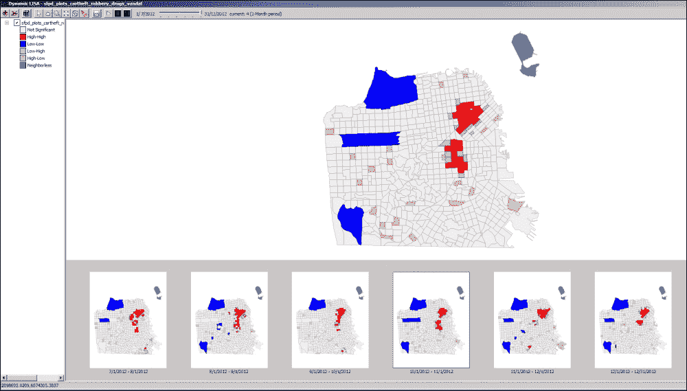
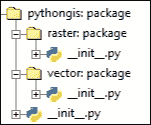

# 第一章. 准备构建自己的 GIS 应用程序

你在这里是因为你喜欢 Python 编程，并且对制作自己的**地理信息系统（GIS**）应用程序感兴趣。你希望创建一个桌面应用程序，换句话说，一个用户界面，帮助你或其他人创建、处理、分析和可视化地理数据。这本书将是你实现这一目标的逐步指南。

我们假设你是一个喜欢编程和富有创造力的人，但并不一定是计算机科学专家、Python 专家或经验丰富的 GIS 分析师。为了成功地继续阅读这本书，建议你具备 Python 编程的基本入门知识，包括类、方法和**Tkinter**工具包，以及一些核心 GIS 概念。如果你是这些领域的初学者，我们仍会介绍一些基础知识，但你需要有兴趣和能力以较快的速度跟上。

在本章介绍中，你将涵盖以下内容：

+   了解从头创建 GIS 应用程序的一些好处

+   设置你的计算机，以便你可以遵循本书的说明。

+   熟悉创建我们应用程序的路线图。

# 为什么重新发明轮子？

为这本书做准备的第一步是说服自己为什么我们要制作自己的 GIS 应用程序，以及要清楚我们的动机。空间分析和 GIS 已经流行了几十年，市面上有大量的 GIS 软件，那么为什么还要费劲去重新发明轮子呢？首先，我们并不是真的在重新发明轮子，因为 Python 可以通过大量的第三方库来扩展，这些库可以满足我们大部分的地理空间需求（关于这一点稍后还会详细介绍）。

对于我来说，主要的动机源于这样一个问题：如今的大多数 GIS 应用程序都是针对那些对 GIS 或计算机科学非常精通、技术能力很强的用户，它们配备了令人眼花缭乱的按钮和选项，这可能会吓跑许多分析师。我们相信，尝试为初学者 GIS 用户或更广泛的公众创建一个更简单、更用户友好的软件是有价值的，而不必完全从头开始。这样，我们也为用户提供了更多的选择，作为补充当前由少数几个主要巨头（如 ArcGIS 和 QGIS）主导的 GIS 市场，以及其他如 GRASS、uDig、gvSIG 等。

从零开始创建自己的 GIS 的一个特别令人兴奋的原因是，您可以为自己想象中的任何任务创建专门的领域特定软件，无论是水流模型 GIS、生态迁徙 GIS，甚至是儿童 GIS。通常在普通 GIS 中需要许多繁琐步骤的这些专门任务，可以大大简化为一个按钮，并附带适当的功能、设计布局、图标和颜色。以下是一个例子，即亚利桑那州立大学 GeoDa 中心生产的**时空犯罪分析软件**（**CAST**），如图所示：



此外，通过从头开始创建自己的 GIS，您可以更好地控制应用程序的大小和便携性。这可以使您的应用程序更小巧——让应用程序具有更快的启动时间，并轻松在互联网或 USB 闪存驱动器上运行。尽管存储空间本身在今天并不是一个大问题，但从用户的角度来看，安装一个 200 MB 的应用程序仍然是一个更大的心理投资，其尝试意愿的代价比一个 30 MB 的应用程序（其他条件相同）要高得多。这在智能手机和平板电脑领域尤其如此，这是一个非常令人兴奋的专用地理空间应用程序市场。虽然本书中我们制作的特定应用程序无法在 iOS 或 Android 设备上运行，但它可以在基于 Windows 8 的混合平板电脑上运行，并且可以围绕不同的 GUI 工具包进行重建，以支持 iOS 或 Android（我们将在第八章展望未来中简要提及一些建议）。 

最后，免费和开源软件的实用性和哲学可能是一些人的重要动机。今天，许多人是在完成大学教育或更换工作后失去了对基于订阅的应用程序（如 ArcGIS）的访问后，才开始欣赏开源 GIS 的。通过开发自己的开源 GIS 应用程序并与他人分享，您可以回馈社区，并成为曾经帮助过您的社区的一部分。

# 设置您的计算机

在本书中，我们遵循在 Windows 环境中开发应用程序的步骤。这并不意味着应用程序不能在 Mac OS X 或 Linux 上开发，但这些平台可能具有略微不同的安装说明，可能需要编译本书范围之外的二进制代码。因此，我们将选择权留给读者。在本书中，我们专注于 Windows，我们尽可能避免编译问题，使用预编译版本（关于这一点将在后面详细介绍）。

开发过程本身将使用 Python 2.7，特别是 32 位版本，尽管理论上也可以使用 64 位（注意，这是你的 Python 安装的位版本，与你的操作系统的位版本无关）。尽管存在许多更新的版本，但 2.7 版本在能够使用第三方包方面是最广泛支持的。据报道，版本 2.7 将继续到 2020 年积极开发和推广。即使在支持结束后，仍然可以使用。如果你还没有 2.7 版本，现在就按照以下步骤安装它：

1.  前往[Python 官网](https://www.python.org/)。

1.  在**下载**下点击下载 Windows 的最新 32 位 Python 2.7 版本，在撰写本文时是 Python 2.7.9。

1.  下载并运行安装程序。

对于实际的代码编写和编辑，我们将使用内置的**Python 交互式开发环境**（**IDLE**），但你当然可以使用任何你想要的代码编辑器。IDLE 让你可以编写可以保存到文件的长时间脚本，并提供一个交互式 shell 窗口来逐行执行。安装 Python 后，应该有一个指向 Python IDLE 的桌面或开始菜单链接。

# 安装第三方包

为了制作我们的应用程序，我们必须依赖现有的丰富多样的第三方 GIS 使用包生态系统。

### 注意

**Python 包索引**（**PyPI**）网站目前列出了超过 240 个标记为**Topic :: Scientific/Engineering :: GIS**的包。为了更轻松地了解更受欢迎的 GIS 相关 Python 库的概述，请查看作者创建的*Python-GIS-Resources*网站上的目录：

[Python GIS 资源](http://pythongisresources.wordpress.com/)

我们将不得不定义要使用和安装哪些包，这取决于我们正在制作的应用程序类型。在这本书中，我们想要制作的是一个轻量级、高度便携、可扩展和通用目的的 GIS 应用程序。出于这些原因，我们避免使用像 GDAL、NumPy、Matplotlib、SciPy 和 Mapnik（每个大约 30MB，如果我们将它们全部组合起来大约是 150-200MB）这样的沉重包。相反，我们专注于为每个特定功能专门设计的较轻的第三方包。

### 注意

放弃这些沉重的包是一个大胆的决定，因为它们包含了很多功能，并且是可靠、高效的，也是许多其他包的依赖。如果你决定想在大小不是问题的情况下使用它们，你可能现在就可以开始安装多功能的 NumPy 和可能还有 SciPy，它们都从它们的官方网站提供了易于使用的安装程序。其他沉重的包将在后面的章节中简要回顾。

每个包在其相关的章节中都有具体的安装说明（见下表以获取概述），这样如果您不想使用某些功能，可以忽略这些安装。由于我们专注于创建一个基本且轻量级的应用程序，我们将只安装少量包。然而，本书中我们将提供关于其他可能希望稍后添加的相关包的建议。

| 章节 | 安装 | 目的 |
| --- | --- | --- |
| 1 | Python |   |
| 1 | PIL | 栅格数据、管理和分析 |
| 1 | Shapely | 向量管理和分析 |
| 2 | PyShp | 数据 |
| 2 | PyGeoj | 数据 |
| 2 | Rtree | 向量数据加速 |
| 4 | PyAgg | 可视化 |
| 7 | Py2exe | 应用程序分发 |

### 注意

安装 Python 包的典型方法是使用`pip`（包含在 Python 2.7 中），它直接从 Python 包索引网站下载和安装包。`Pip`的使用方式如下：

+   第一步——打开您操作系统的命令行（不是 Python IDLE）。在 Windows 上，这可以通过在系统中搜索`cmd.exe`并运行它来完成。

+   第二步——在弹出的黑色屏幕窗口中，只需输入`pip install packagename`。如果`pip`在您的系统环境路径上，这将有效。如果不是这种情况，一个快速的解决办法是直接输入`pip`脚本的完整路径`C:\Python27\Scripts\pip`而不是仅仅输入`pip`。

对于基于 C 或 C++的包，将它们作为以`.whl`结尾的预编译**wheel**文件提供变得越来越流行，这导致了一些关于如何安装它们的混淆。幸运的是，我们可以使用`pip`来安装这些 wheel 文件，只需下载 wheel 并将其文件路径指向`pip`即可。

由于我们的某些依赖项具有多个用途，并不局限于某一章节，我们将现在安装这些依赖项。其中之一是**Python 图像库**（**PIL**），我们将用它来进行栅格数据模型和可视化。让我们现在为 Windows 安装 PIL：

1.  前往 [`pypi.python.org/pypi/Pillow/2.6.1`](https://pypi.python.org/pypi/Pillow/2.6.1).

1.  点击我们 32 位 Python 2.7 环境的最新`.exe`文件链接以下载 PIL 安装程序，当前为`Pillow-2.6.1.win32-py2.7.exe`。

1.  运行安装文件。

1.  打开 IDLE 交互式外壳，并输入`import PIL`以确保它已正确安装。

我们还将使用另一个核心包 Shapely，用于位置测试和几何操作。要在 Windows 上安装它，请执行以下步骤：

1.  前往 [`www.lfd.uci.edu/~gohlke/pythonlibs/#shapely`](http://www.lfd.uci.edu/~gohlke/pythonlibs/#shapely)。

1.  下载适合我们系统的 Shapely wheel 文件，看起来像`Shapely-1.5.7-cp27-none-win32.whl`。

1.  如前所述，打开命令行窗口，输入 `C:\Python27\Scripts\pip install path\to\Shapely‑1.5.7‑cp27‑none‑win32.whl` 以解压预编译的二进制文件。

1.  为了确保安装正确，打开 IDLE 交互式外壳，并输入 `import shapely`。

# 展望未来的路线图

在我们开始开发应用程序之前，重要的是我们要构想出我们希望如何构建我们的应用程序。在 Python 术语中，我们将创建一个多层包，包含各种子包和子模块，以独立于任何用户界面来处理我们功能的不同部分。我们只在底层功能之上创建可视用户界面，作为访问和运行底层代码的方式。这样，我们构建了一个坚实的系统，并允许高级用户通过 Python 脚本访问所有相同的功能，以实现更大的自动化和效率，就像在 ArcGIS 和 QGIS 中一样。

要设置我们应用程序背后的主要 Python 包，在您的计算机上的任何位置创建一个名为 `pythongis` 的新文件夹。为了 Python 能够将文件夹 `pythongis` 解释为可导入的包，它需要在那个文件夹中找到一个名为 `__init__.py` 的文件。执行以下步骤：

1.  从 Windows 开始菜单打开 **Python IDLE**。

1.  首先弹出的窗口是交互式外壳。要打开脚本编辑窗口，请点击 **文件** 和 **新建**。

1.  点击 **文件** 然后选择 **另存为**。

1.  在弹出的对话框中，浏览到 `pythongis` 文件夹，将文件名输入为 `__init__.py`，然后点击 **保存**。

GIS 数据主要有两种类型：**向量**（基于坐标的几何形状，如点、线和多边形）和**栅格**（由规则间隔的数据点或单元格组成的网格，类似于图像及其像素）。

### 提示

对于向量与栅格数据之间差异的更详细介绍，以及其他基本 GIS 概念，我们建议读者阅读 Joel Lawhead 所著的《Learning Geospatial Analysis with Python》一书。您可以在以下位置找到这本书：

[`www.packtpub.com/application-development/learning-geospatial-analysis-python`](https://www.packtpub.com/application-development/learning-geospatial-analysis-python)

由于向量和栅格数据在所有方面都存在根本性的不同，我们将我们的包分为两部分，一部分用于向量，另一部分用于栅格。使用之前的方法，我们在 `pythongis` 包内创建两个新的子包文件夹；一个名为 `vector`，另一个名为 `raster`（每个都包含前面提到的空 `__init__.py` 文件）。因此，我们的包结构将如下所示（注意 `: package` 不是文件夹名称的一部分）：



为了使我们的新 `vector` 和 `raster` 子包可由顶级 `pythongis` 包导入，我们需要在 `pythongis/__init__.py` 中添加以下相对导入语句：

```py
from . import vector
from . import raster
```

在本书的整个过程中，我们将在这两个数据类型的相应文件夹中构建它们的函数性，作为一组 Python 模块。最终，我们希望得到一个只包含最基本地理空间工具的 GIS 应用程序，这样我们就能加载、保存、管理、可视化和叠加数据，这些内容将在接下来的章节中介绍。

就我们的最终产品而言，因为我们注重清晰和简洁，所以我们并没有在让它快速或内存高效上投入太多精力。这源于程序员中经常重复的一句话，其中之一可以在《带有 goto 语句的结构化编程》，ACM，计算调查 6（4）中找到：

|   | *过早优化是万恶之源* |   |
| --- | --- | --- |
|   | --*唐纳德·E·克努特* |

这使得我们的软件最适合处理小文件，这在大多数情况下已经足够好。一旦你有一个工作中的应用程序，并且你觉得你需要支持更大的或更快的文件，那么是否投入额外的优化努力就取决于你了。

本书结尾时你得到的 GIS 应用程序简单但功能齐全，旨在作为一个你可以轻松构建的框架。为了给你一些想法，我们在书中放置了各种信息框，介绍了你可以优化或扩展应用程序的方法。对于我们在本书早期未能涵盖的核心主题和功能，我们在最后一章给出了缺失功能更广泛的讨论和未来建议。

# 摘要

在本章中，你学习了为什么想要使用 Python 创建一个 GIS 应用程序，设置了我们的编程环境，安装了一些常用的包，并创建了你的应用程序结构和框架。

在下一章中，你将迈出创建地理空间应用程序的第一步，通过从头开始创建一个简单但强大的模块来加载和保存一些常见的地理空间数据格式。
