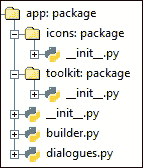
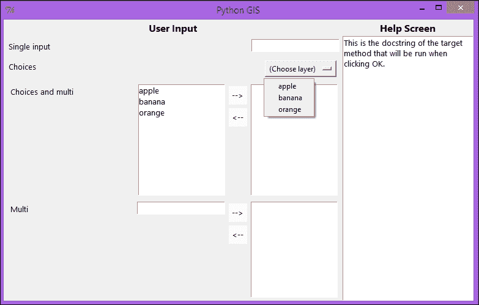
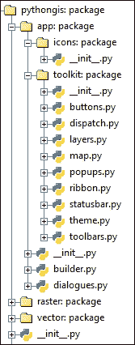
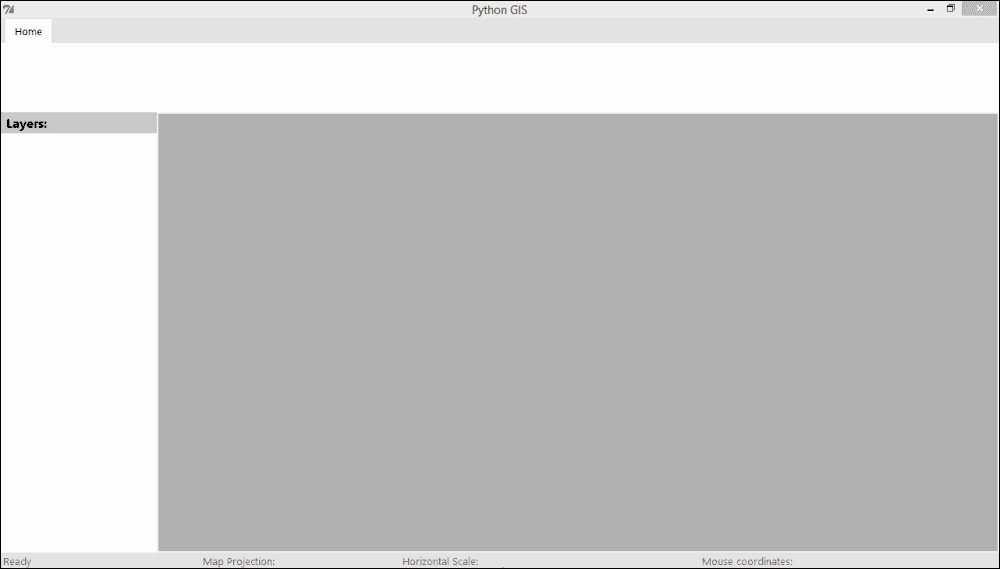

# 第三章 设计应用程序的视觉外观

我们现在已经到了设计我们的应用程序外观和感觉的部分。对于这个**图形用户界面**（**GUI**），我们选择了阻力最小的路径，选择了**Tkinter**库，因为这是官方 Python 安装中的标准内置库，至少在 Windows 和 Mac 上是这样。选择 Tkinter 的其他原因还包括它相对容易使用，并且比一些较新的第三方 GUI 库更符合 Python 风格。

即使您之前没有使用过 Tkinter，也应该能够跟上。Tkinter 的基本思想是，您为 GUI 中的每个图形元素创建小部件类，定义它们的样式和位置。可以通过在小部件内部嵌套小部件来创建复杂元素。您还可以将函数绑定到用户交互事件。

### 注意

要了解更多关于 Tkinter 的信息，我强烈推荐使用 John W. Shipman 的参考指南，可在[`infohost.nmt.edu/tcc/help/pubs/tkinter/tkinter.pdf`](http://infohost.nmt.edu/tcc/help/pubs/tkinter/tkinter.pdf)找到。

在本章中，您将：

+   设置通用代码结构，以创建一个主题化和高度可定制的 GIS 应用程序

+   创建一个工具箱，包含专门的用户界面小部件，这些小部件可以连接到我们底层的 GIS 功能

+   使用这个小部件工具箱将应用程序的视觉设计和布局粘合在一起

+   学习如何测试运行我们的应用程序

# 设置 GUI 包

我们从设置应用程序 GUI 的结构骨架开始本章。这应该与我们的其余代码逻辑上分开，所以我们给它一个自己的子包。在顶级`pythongis`文件夹内部，创建一个名为`app`的包文件夹，并在其中包含一个`__init__.py`文件。让它导入我们将要创建的其余模块：

```py
from . import builder
from . import dialogues
from . import toolkit
from . import icons 
```

为了使我们的`app`包可以从我们的顶级`pythongis`包中访问，我们同样需要在`pythongis/__init__.py`中导入它，如下所示：

```py
from . import app
```

`app`包的目的是我们应该能够定义我们的 GUI 的外观和行为，并且通过一行代码`pythongis.app.run()`，我们应该能够调用它。我们 GUI 的实际定义和布局应该包含在一个我们称为`app/builder.py`的模块中（我们将在本章末尾回到这个模块）。构建器反过来又依赖于一组预定义的 GUI 构建块，我们在一个名为`app/toolkit`的子包文件夹中定义这些构建块。这个工具包的`__init__.py`文件导入了我们将在本章中创建的构建块模块：

```py
from .buttons import *
from .layers import *
from .map import *
from .popups import *
from .ribbon import *
from .statusbar import *
from .toolbars import *

from . import theme
from . import dispatch
```

除了我们的构建器和工具包之外，我们还需要一个`app/dialogues.py`模块，该模块定义了应用程序特定的对话框窗口。

最后但同样重要的是，应用程序结构的一个重要部分是如何访问图标和图像。为了使我们的图标能够迅速提供给任何可能需要它们的控件，我们创建了一个`app/icons`包。这个`包`文件夹是我们将保存所有图标的地方。当应用程序小部件需要图标时，它只需通过`get()`请求图标名称和大小，然后返回一个 Tkinter 兼容的`PhotoImage`对象。现在创建它的`__init__.py`文件：

```py
import os
import PIL.Image, PIL.ImageTk

ICONSFOLDER = os.path.split(__file__)[0]

def get(iconname, width=None, height=None):
    iconpath = os.path.join(ICONSFOLDER, iconname)

    if os.path.lexists(iconpath):
        img = PIL.Image.open(iconpath)
        if width or height:
            width = width or img.size[0]
            height = height or img.size[1]
            img = img.resize((width,height), PIL.Image.ANTIALIAS)
        tk_img = PIL.ImageTk.PhotoImage(img)
        return tk_img

    else:
        raise Exception("No icon by that name")
```

一旦创建了所有这些，我们就应该准备就绪了。你的`app`文件夹结构应该看起来像这样：



# 创建工具包构建块

在我们开始设计我们的 GUI 布局之前，我们必须创建包含我们将使用的底层构建块或设计元素的`toolkit`包。Tkinter 已经提供了一套基本的 GUI 元素或**小部件**类，例如`按钮`、`标签`或`复选框`，它们提供了将它们放置在应用程序窗口中或嵌套在彼此内部的方法。为了保持这种逻辑的一致性，我们子类化这些 Tkinter 小部件并在此基础上扩展，以创建我们自己的专用构建块小部件。这样，我们的 GUI 代码就变得一致、稳定且可重用。

在我们的`toolkit`包中，我们希望有一些小部件可以随时使用：图标按钮、工具栏、标签页系统、状态栏、包含数据层的面板概览、地图小部件和弹出窗口模板。我们还需要一种方法让我们的按钮能够与我们的 GIS 代码库中的地理空间工作任务连接并执行，因此我们创建了一个命令调度工具。然而，在我们开始制作小部件之前，让我们设置一种简单的方式来风格化它们。

## 主题风格

为了给我们的应用程序一种风格感，我们必须在每一个工具包小部件中定义诸如背景颜色或文本字体等元素。为了使这种风格更加灵活，我们将风格说明集中到一个单独的模块中，我们称之为`app/toolkit/theme.py`。各种小部件可以从中导入风格说明，这些说明可以很容易地在我们开发应用程序时进行更改和修改，或者甚至作为最终用户可定制的功能。

在 Tkinter 中指定颜色时，你可以指定十六进制颜色字符串或 Tkinter 预定义的颜色名称。让我们将应用程序的主要背景颜色设为浅灰色，从浅灰色一直到纯白色共有五种不同的色调。我们还想为突出显示目的添加一些更独特的颜色，一种是两种橙色的色调，另一种是两种蓝色的色调：

```py
color1 = "Grey69"
color2 = "Grey79"
color3 = "Grey89"
color4 = "Grey99"
color5 = "white"

strongcolor1 = "gold"
strongcolor2 = "dark orange"

alterncolor1 = "DodgerBlue"
alterncolor2 = "Blue3"
```

### 注意

要查看有效的 Tkinter 颜色名称及其外观的完整列表，请参阅[`wiki.tcl.tk/37701`](http://wiki.tcl.tk/37701)。

一个人使用的字体类型和大小也是应用程序设计的关键部分，因此我们决定使用 Windows 8 中使用的时尚的 Segoe 字体。Tkinter 字体可以用包含字体名称、大小和可选的强调类型的元组来指定。我们创建了两种主要的文本字体色调，一种是正常的，一种是较弱的，用于不太重要的背景文本。我们还创建了两种标题/标题文本字体类型，一种是正常的，一种是白色的，以防我们需要在较暗的背景上显示文本：

```py
titlefont1 = {"type": ("Segoe UI", 12, "bold"),
              "color": "black"}
titlefont1_contrast = {"type": ("Segoe UI", 12, "bold"),
              "color": "white"}

font1 = {"type": ("Segoe UI", 10),
         "color": "black"}
font2 = {"type": ("Segoe UI", 10),
         "color": "Grey42"}
```

## 基本按钮

现在，我们可以开始制作小部件了。尽管 Tkinter 已经自带**Button**小部件，但我们将创建一些自己的，以便每个创建的按钮都按照我们想要的样式进行设计，并且我们可以简化为它们添加图标的过程。因此，我们在`toolkit`包中创建我们的第一个模块，我们将其命名为`app/toolkit/buttons.py`。在顶部，我们导入一些必要的东西：

```py
# Import builtins
import sys, os

# Import GUI libraries
import Tkinter as tk
from tkFileDialog import askopenfilenames, asksaveasfilename
import PIL, PIL.Image, PIL.ImageTk

# Import internals
from .. import icons
```

接下来，我们导入我们的主题模块，并将用于按钮的样式定义为字典条目。在正常情况下，我们希望按钮具有浅色背景色和平滑的立体感。一旦鼠标指针悬停在按钮上，它就会**点亮**，并显示高亮颜色，如果点击，颜色会变得更鲜艳：

```py
# Import theme
from . import theme
style_button_normal = {"fg": theme.font1["color"],
                  "font": theme.font1["type"],
                  "bg": theme.color4,
                   "relief": "flat",
                   "activebackground": theme.strongcolor2
                   }
style_button_mouseover = {"bg": theme.strongcolor1
                    }
```

为了实现遵循这种样式的按钮小部件，我们创建了一个继承自标准 Tkinter 按钮的按钮小部件，并使用我们的格式化样式字典作为关键字参数。我们还定义了当鼠标经过按钮时，它应该按照我们定义的悬停字典中的方式**点亮**：

```py
class Button(tk.Button):
    def __init__(self, master, **kwargs):
        # get theme style
        style = style_button_normal.copy()
        style.update(kwargs)

        # initialize
        tk.Button.__init__(self, master, **style)

        # bind event behavior
        def mouse_in(event):
            event.widget.config(style_button_mouseover)
        def mouse_out(event):
            event.widget.config(style_button_normal)

        self.bind("<Enter>", mouse_in)
        self.bind("<Leave>", mouse_out)
```

我们还添加了一些常用的按钮，例如带有*Enter*/*Return*键盘快捷键的**确定**按钮，当激活时运行指定的函数：

```py
class OkButton(Button):
    def __init__(self, master, **kwargs):
        # initialize
        if kwargs.get("text") == None:
            kwargs["text"] = "OK"
        okfunc = kwargs.get("command")
        Button.__init__(self, master, **kwargs)

        # bind enter keypress to command function
        def runfunc(event):
            okfunc()
        self.winfo_toplevel().bind("<Return>", runfunc)
```

## 带有图标的按钮

在我们的应用程序中，我们希望通过使用小图标图像来展示按钮的功能，但正如你很快就会看到的，在 Tkinter 中为按钮添加图标需要几个自定义步骤，这些步骤很快就会变得乏味。因此，我们创建了一个专门的图标按钮，它会为我们完成这些步骤。

要创建`IconButton`类，我们将我们的样式按钮类作为起点，我们只需要添加一个`set_icon`方法。该方法通过`icons`包检索图像，大小适合按钮，以样式化图像在按钮内的放置方式，分配它，并将其存储为按钮的一个属性，以便它不会被垃圾回收：

```py
class IconButton(Button):
    def __init__(self, master, **kwargs):
        # initialize
        Button.__init__(self, master, **kwargs)

    def set_icon(self, iconname, **kwargs):
        # get icon as tkinter photoimage, with an optional resize
        tk_img = icons.get(iconname,
                           width=kwargs.get("width"),
                           height=kwargs.get("height"))
        self.config(image=tk_img, **kwargs)
        # resize button to have room for text if compound type
        if not kwargs.get("anchor"): kwargs["anchor"] = "center"
        if kwargs.get("compound"):
            def expand():
                self["width"] += tk_img.width()
                self["height"] += tk_img.height() / 2
            self.after(100, expand)
        # store as attribute, so it doesn't get garbage collected
        self.tk_img = tk_img
```

## 工具栏

按钮不应随意放置。相反，我们希望将逻辑上相关的按钮组合成称为**工具栏**的区域。我们创建`app/toolkit/toolbars.py`模块，并从必要的导入和样式设置开始：

```py
# Import GUI
import Tkinter as tk

# Import internals
from .buttons import *
from .popups import *

# Import style
from . import theme
style_toolbar_normal = {"bg": theme.color4}
style_namelabel_normal = {"bg": theme.color4,
                          "font": theme.font2["type"],
                          "fg": theme.font2["color"],
                          "pady": 0}
```

工具栏区域本身是 Tkinter 框架的子类，它将包括一个框架区域，按钮将并排打包，底部有一个文本区域，指定工具栏的用途。目前，我们只创建了一个方便的`Toolbar`类，它有一个`add_button`方法，这样我们就可以通过子类化这个类来后来构建和填充专门的工具栏：

```py
class Toolbar(tk.Frame):
    """
    Base class for all toolbars.
    """
    def __init__(self, master, toolbarname, **kwargs):
        # get theme style
        style = style_toolbar_normal.copy()
        style.update(kwargs)

        # Make this class a subclass of tk.Frame and add to it
        tk.Frame.__init__(self, master, **style)

        # Divide into button area and toolbar name
        self.buttonframe = tk.Frame(self, **style)
        self.buttonframe.pack(side="top", fill="y", expand=True)
        self.name_label = tk.Label(self, **style_namelabel_normal)
        self.name_label["text"] = toolbarname
        self.name_label.pack(side="bottom")

    def add_button(self, icon=None, **kwargs):
        button = IconButton(self.buttonframe)
        options = {"text":"", "width":48, "height":32, "compound":"top"}
        options.update(kwargs)
        if icon:
            button.set_icon(icon, **options)
        else:
            button.config(**options)
        button.pack(side="left", padx=2, pady=0, anchor="center")
        return button
```

## 功能区标签系统

接下来是**功能区**小部件，它受到微软办公软件新版本的启发，不仅将为我们的应用程序带来时尚现代的外观，还将提供我们所需要的组织水平和简洁性，以避免吓跑我们应用程序的非技术用户。就像上一节中相关的按钮被分组到工具栏中一样，这里工具栏可以被分组到窗口顶部的功能区区域，可以切换和翻页，就像笔记本一样，如下面的截图所示：


在`toolkit`包中创建`app/toolkit/ribbon.py`模块后，我们开始导入和样式设置，使用微妙的灰色高亮效果为标签选择器着色：

```py
# Import GUI
import Tkinter as tk

# Import internals
from .toolbars import *

# Import style
from . import theme
style_ribbon_normal = {"bg": theme.color3,
                       "height": 120,
                       "pady": 0}

style_tabsarea_normal = {"bg": theme.color3,
                         "height": 20,
                         "padx": 1,
                         "pady": 0}

style_tabselector_normal = {"bg": theme.color3,
                            "activebackground": theme.color4,
                            "fg": theme.font1["color"],
                            "font": theme.font1["type"],
                            "relief": "flat",
                            "padx":10, "pady":5}
style_tabselector_mouseover = {"bg": "Grey93" }

style_toolbarsarea_normal = {"bg": theme.color4}
```

`Ribbon`类本身是一个框架，顶部区域用于标签选择器，底部区域用于显示当前选中的标签区域，用于相关工具栏。标签作为单独的实例创建，并通过`add_tab`方法添加，当鼠标悬停在其上时，它也会亮起。当标签选择器被按下时，将调用一个`switch`方法，它将将其标签区域提升到所有其他标签之上：

```py
class Ribbon(tk.Frame):
    """
    Can switch between a series of logically grouped toolbar areas (tabs).
    """
    def __init__(self, master, **kwargs):
        # get theme style
        style = style_ribbon_normal.copy()
        style.update(kwargs)

        # Make this class a subclass of tk.Frame and add to it
        tk.Frame.__init__(self, master, **style)

        # Make top area for tab selectors
        self.tabs_area = tk.Frame(self, **style_tabsarea_normal)
        self.tabs_area.pack(fill="x", side="top")

        # Make bottom area for each tab's toolbars
        self.toolbars_area = tk.Frame(self, **style_toolbarsarea_normal)
        self.toolbars_area.pack(fill="both", expand=True, side="top")
        self.pack_propagate(False)

        # Create tab list
        self.tabs = dict()

    def add_tab(self, tabname):
        tab = Tab(self.toolbars_area, tabname=tabname)
        self.tabs[tab.name] = tab
        self.current = tab
        # add tab to toolbars area
        tab.place(relwidth=1, relheight=1)
        # add tabname to tab selector area
        tab.selector = tk.Label(self.tabs_area, text=tab.name, **style_tabselector_normal)
        tab.selector.pack(side="left", padx=5)
        # enable dynamic tab selector styling
        def mouse_in(event):
            if event.widget["state"] == "normal":
                event.widget.config(style_tabselector_mouseover)
        def mouse_out(event):
            if event.widget["state"] == "normal":
                event.widget.config(style_tabselector_normal)
        tab.selector.bind("<Enter>", mouse_in)
        tab.selector.bind("<Leave>", mouse_out)
        # make tab selector selectable
        tab.selector.bind("<Button-1>", self.switch)
        return tab

    def switch(self, event=None, tabname=None):
        if event: tabname = event.widget["text"]
        # deactivate old tab
        self.current.selector["state"] = "normal"
        # activate new tab
        self.current = self.tabs[tabname]
        self.current.selector.config(style_tabselector_normal)
        self.current.selector["state"] = "active"
        self.current.lift()
```

当我们使用功能区的`add_tab`方法时，它返回给我们一个`Tab`类，我们负责用按钮和其他内容填充它。为了方便，我们给`Tab`类提供了一个`add_toolbar`方法：

```py
class Tab(tk.Frame):
    """
    Base class for all tabs
    """
    def __init__(self, master, tabname, **kwargs):
        # get theme style
        style = style_toolbarsarea_normal.copy()
        style.update(kwargs)

        # Make this class a subclass of tk.Frame and add to it
        tk.Frame.__init__(self, master, **style)

        # remember name
        self.name = tabname

    def add_toolbar(self, toolbarname):
        toolbar = Toolbar(self, toolbarname=toolbarname)
        toolbar.pack(side="left", padx=10, pady=0, fill="y")
        return toolbar
```

## 底部状态栏

另一个重要的 GUI 元素是状态栏，它可以包含一个或多个信息或状态，并且通常放置在应用程序窗口的底部，与背景交织在一起。我们在`app/toolkit/statusbar.py`模块中创建状态栏，并在开始时进行常规导入和样式设置：

```py
# Import GUI
import Tkinter as tk

# Import style
from . import theme
style_statusbar_normal = {"height": 25,
                          "bg": theme.color3}
style_status_normal = {"fg": theme.font2["color"],
                       "font": theme.font2["type"],
                       "bg": theme.color3}
style_taskstatus_normal = style_status_normal.copy()
style_taskstatus_working = {"fg": theme.font1["color"],
                            "font": theme.font1["type"],
                            "bg": theme.strongcolor2}
```

状态栏小部件本身只是一个包含一个或多个状态小部件的框架。以下是`StatusBar`类的代码：

```py
class StatusBar(tk.Frame):
    def __init__(self, master, **kwargs):
        """
        A container bar that contains one or more status widgets
        """
        # get theme style
        style = style_statusbar_normal.copy()
        style.update(kwargs)

        # Make this class a subclass of tk.Frame and add to it
        tk.Frame.__init__(self, master, **style)

        # Insert status items
        self.task = TaskStatus(self)
        self.task.place(relx=0.0, rely=0.5, anchor="w") 
        self.projection = ProjectionStatus(self)
        self.projection.place(relx=0.20, rely=0.5, anchor="w") 
        self.zoom = ZoomStatus(self)
        self.zoom.place(relx=0.40, rely=0.5, anchor="w") 
        self.mouse = MouseStatus(self)
        self.mouse.place(relx=0.70, rely=0.5, anchor="w")
```

我们然后为所有状态小部件创建一个基类，称为`Status`，以及一些它的子类来显示投影名称、缩放级别和鼠标指针坐标，由于这些将由父小部件控制，因此不需要任何事件绑定或行为。一个特殊的`TaskStatus`小部件可以被设置为`start()`，并将随着调用者提供的任务描述变为橙色。一旦调用`stop`方法，它将恢复正常，如下面的代码所示：

```py
class Status(tk.Label):
    def __init__(self, master, **kwargs):
        """
        The base class used for all status widgets
        """
        # get theme style
        style = style_status_normal.copy()
        style.update(kwargs)

        # Make this class a subclass of tk.Label and add to it
        tk.Label.__init__(self, master, **style)
        self.prefix = ""

    def set_text(self, text):
        self["text"] = self.prefix + text

    def clear_text(self):
        self["text"] = self.prefix

class TaskStatus(Status):
    def __init__(self, master, **kwargs):
        # Make this class a subclass of tk.Label and add to it
        default = {"width":30, "anchor":"w"}
        default.update(kwargs)
        Status.__init__(self, master, **default)

        # Set startup status
        self.set_text("Ready")

    def start(self, taskname):
        self.config(**style_taskstatus_working)
        self.set_text(taskname)

    def stop(self):
        self.set_text("Finished!")
        self.config(**style_taskstatus_normal)
        def reset_text():
            self.set_text("Ready")
        self.after(1000, reset_text)

class ProjectionStatus(Status):
    def __init__(self, master, **kwargs):
        # Make this class a subclass of tk.Label and add to it
        self.prefix = "Map Projection: "
        default = {"text":self.prefix, "width":30, "anchor":"w"}
        default.update(kwargs)
        Status.__init__(self, master, **default)

class ZoomStatus(Status):
    def __init__(self, master, **kwargs):
        # Make this class a subclass of tk.Label and add to it
        self.prefix = "Horizontal Scale: "
        default = {"text":self.prefix, "width":30, "anchor":"w"}
        default.update(kwargs)
        Status.__init__(self, master, **default)

class MouseStatus(Status):
    def __init__(self, master, **kwargs):
        # Make this class a subclass of tk.Label and add to it
        self.prefix = "Mouse coordinates: "
        default = {"text":self.prefix, "width":50, "anchor":"w"}
        default.update(kwargs)
        Status.__init__(self, master, **default)
```

## 层级面板

大多数 GIS 应用中的一个关键元素是图层面板，它显示并允许访问加载的数据，并显示它们的符号以及它们在地图上的渲染顺序。在启动我们新的`app/toolkit/layers.py`模块后，我们通过一些导入和样式来启动它。请注意，我们还导入了我们的顶级`pythongis`包和我们的`dispatch`模块，因为这一层面板需要能够加载和渲染数据：

```py
# Import GUI functionality
import Tkinter as tk
from tkFileDialog import askopenfilenames, asksaveasfilename

# Import internals
from .buttons import *
from .popups import *

# Import style
from . import theme
style_layerspane_normal = {"bg": theme.color4,
                           "width": 200}
style_layersheader = {"bg": theme.color2,
                      "font": theme.titlefont1["type"],
                      "fg": theme.titlefont1["color"],
                      "anchor": "w", "padx": 5}

style_layeritem_normal = {"bg": theme.color4,
                          "width": 200,
                          "relief": "ridge"}
style_layercheck = {"bg": theme.color4}
style_layername_normal = {"bg": theme.color4,
                   "fg": theme.font1["color"],
                   "font": theme.font1["type"],
                   "relief": "flat",
                   "anchor": "w"}

# Import GIS functionality
import pythongis as pg
from . import dispatch
```

目前我们只创建了一个带样式的`LayersPane`类，标题文本为**图层**，以及一个主列表区域，其中将显示单个加载的图层。关于这些图层项、如何加载它们以及它们的显示和行为将在第四章*渲染我们的地理数据*中更自然地处理：

```py
class LayersPane(tk.Frame):
    def __init__(self, master, layer_rightclick=None, **kwargs):
        # get theme style
        style = style_layerspane_normal.copy()
        style.update(kwargs)

        # Make this class a subclass of tk.Frame and add to it
        tk.Frame.__init__(self, master, **style)

        # Make the top header
        self.header = tk.Label(self, text="Layers:", **style_layersheader)
        self.header.pack(side="top", fill="x")

        # Then, the layer list view
        self.layersview = tk.Frame(self, **style)
        self.layersview.pack(side="top", fill="x")
        self.pack_propagate(False) # important, this prevents layeritem names from deciding the size of layerspane
```

## 地图小部件

最后但同样重要的是，没有用于交互式查看地理数据的地图小部件，我们就无法拥有 GIS。创建`app/toolkit/map.py`模块，并按照以下方式启动它：

```py
# Import builtins
import time

# Import GUI libraries
import Tkinter as tk

# Import internals
from .popups import popup_message
from .. import icons

# Import GIS functionality
import pythongis as pg
from . import dispatch

# Import style
from . import theme
style_map_normal = {"bg": theme.color1} 
```

与图层面板一样，我们在第四章*渲染我们的地理数据*中更全面地开发地图小部件，因此现在我们只创建初始的`MapView`类。最终，我们希望我们的地图小部件能够包含渲染的地图图像，并允许用户在地图上平移和缩放，因此我们将其作为 Tkinter **Canvas**小部件的子类。由于`MapView`类将在以后调用一些可能很重的渲染操作，我们还需要一种方法将其链接到状态栏，以便报告其进度：

```py
class MapView(tk.Canvas):
    def __init__(self, master, **kwargs):
        # get theme style
        style = style_map_normal.copy()
        style.update(kwargs)

        # Make this class a subclass of tk.Canvas and add to it
        tk.Canvas.__init__(self, master, **style)

        # Other
        self.proj = kwargs.get("projection", "WGS84")
        self.statusbar = None
        self.mousepressed = False
        self.mouse_mode = "pan"
        self.zoomcenter = None
        self.zoomfactor = 1
        self.zoomdir = None
        self.last_zoomed = None 

    def assign_statusbar(self, statusbar):
        statusbar.mapview = self
        self.statusbar = statusbar
```

## 弹出窗口

在本书的后面部分，我们将在主 GUI 窗口之上打开几个额外的窗口，无论是错误消息还是选项或工具菜单。因此，在我们的`toolkit`包中，我们想要定义一些窗口模板。

### 注意

这些窗口模板与我们的应用程序中特定的实际窗口不同，这些窗口在本章中作为我们之前创建的`app/dialogues.py`模块的一部分定义。

创建一个用于窗口模板的模块`app/toolkit/popups.py`，并开始导入：

```py
# Import GUI helpers
import Tkinter as tk
import tkMessageBox

# Import internals
from .buttons import IconButton, OkButton, CancelButton
from . import dispatch
from ... import vector

# Define some styles
from . import theme
style_options_helptext = {"font": theme.font1["type"],
                          "fg": theme.font1["color"]}
style_options_titles = {"font": theme.titlefont1["type"],
                        "fg": theme.titlefont1["color"]}
style_options_labels = {"font": theme.font1["type"],
                      "fg": theme.font1["color"]}
```

首先，我们创建了一些基本的弹出窗口和模板。这包括一个简单的警告`popup_message`函数，可以用于在 GUI 中引发错误，以及一个基本的`Window`类模板，具有理想的定位和大小，用作任何其他窗口的起点：

```py
def popup_message(parentwidget, errmsg):
    tkMessageBox.showwarning("Warning", errmsg) 

class Window(tk.Toplevel):
    def __init__(self, master=None, **kwargs):
        # Make this class a subclass of tk.Menu and add to it
        tk.Toplevel.__init__(self, master, **kwargs)
        # Set its size to percent of screen size, and place in middle
        width = self.winfo_screenwidth() * 0.6
        height = self.winfo_screenheight() * 0.6
        xleft = self.winfo_screenwidth()/2.0 - width / 2.0
        ytop = self.winfo_screenheight()/2.0 - height / 2.0
        self.geometry("%ix%i+%i+%i"%(width, height, xleft, ytop))
        # Force and lock focus to the window
        self.grab_set()
        self.focus_force()
```

我们还创建了一个模板，这次专门用于构建工具选项输入框架。这不会是一个窗口，而是一个 Tkinter 框架，可以放置在任何其他小部件内部，代表一些工具或功能，用户可以自定义设置或参数，并决定运行工具或取消。让我们创建这个通用的`RunToolFrame`类，它由一个输入区域组成，所有选项都将构建在左侧，一个帮助区域在右侧，以及一个在底部运行工具的按钮：



下面是创建`RunToolFrame`类的代码：

```py
class RunToolFrame(tk.Frame): 
    def __init__(self, master=None, **kwargs):
        # Make this class a subclass of tk.Toplevel and add to it
        tk.Frame.__init__(self, master, **kwargs)

        # Create empty option and input data
        self.hidden_options = dict()
        self.inputs = list()
        self.statusbar = None
        self.method = None
        self.process_results = None

        # Make helpscreen area to the right
        self.helpscreen = tk.Frame(self)
        self.helpscreen.pack(side="right", fill="y")
        self.helptitle = tk.Label(self.helpscreen, text="Help Screen", **style_options_titles)
        self.helptitle.pack(fill="x")
        self.helptext = tk.Text(self.helpscreen, width=30,
                                wrap=tk.WORD, cursor="arrow",
                                **style_options_helptext)
        self.helptext.pack(fill="both", expand=True)

        # Make main screen where input goes to the left
        self.mainscreen = tk.Frame(self)
        self.mainscreen.pack(side="left", fill="both", expand=True)
        self.maintitle = tk.Label(self.mainscreen, text="User Input", **style_options_titles)
        self.maintitle.pack()
        self.mainoptions = tk.Frame(self.mainscreen)
        self.mainoptions.pack(fill="both", expand=True)
        self.mainbottom = tk.Frame(self.mainscreen)
        self.mainbottom.pack()

        # Make run button at bottom
        self.runbut = OkButton(self.mainbottom, command=self.run)
        self.runbut.pack(side="right")
```

为了让我们以后更容易操作，我们还提供了简单的方法来定义要传递给目标操作哪些选项，它使用这些选项自动创建适当的输入小部件。这里最强大的功能是`add_option_input()`，它添加一个可定制的选项小部件，并具有几个可以调整和组合的参数，以生成适用于许多不同值类型的小部件。这需要两个参数：`label`——显示在输入小部件旁边的文本，和`valuetype`——一个函数，用于将从小部件（总是文本）检索到的输入值转换为目标操作期望的类型。

如果没有指定其他参数，此方法将向目标函数添加一个未命名的列表参数，或者通过指定`argname`，可以将其作为关键字参数。当`multi`参数为真时，用户将获得一个输入小部件，可以自由输入值并将其添加到选项值的列表中，如果`choices`参数也为真，则用户被限制只能从选择列表中选择一个或多个项目。设置`choices`参数而不设置`multi`参数允许用户只能从下拉列表中选择单个值。`default`参数定义了小部件的起始值，而`minval`和`maxval`试图确保最终参数大于、小于或介于某些限制之间。最后，还有一个`add_hidden_option`方法，它设置一个选项，而不会将其显示为可定制的控件。请看以下代码：

```py
    def add_option_input(self, label, valuetype, argname=None, multi=False, length=None, default=None, minval=None, maxval=None, choices=None):
        optionrow = tk.Frame(self.mainoptions)
        optionrow.pack(fill="x", anchor="n", pady=5, padx=5)
        if multi:
            # make a list-type widget that user can add to
            inputlabel = tk.Label(optionrow, text=label, **style_options_labels)
            inputlabel.pack(side="left", anchor="nw", padx=3)
            inputwidget = tk.Listbox(optionrow, activestyle="none",
                                     highlightthickness=0, selectmode="extended",
                                     **style_options_labels)
            inputwidget.pack(side="right", anchor="ne", padx=3)

            if choices:
                # add a listbox of choices to choose from
                def addtolist():
                    for selectindex in fromlist.curselection():
                        selectvalue = fromlist.get(selectindex)
                        inputwidget.insert(tk.END, selectvalue)
                    for selectindex in reversed(fromlist.curselection()):
                        fromlist.delete(selectindex)
                def dropfromlist():
                    for selectindex in inputwidget.curselection():
                        selectvalue = inputwidget.get(selectindex)
                        fromlist.insert(tk.END, selectvalue)
                    for selectindex in reversed(inputwidget.curselection()):
                        inputwidget.delete(selectindex)
                # define buttons to send back and forth bw choices and input
                buttonarea = tk.Frame(optionrow)
                buttonarea.pack(side="right", anchor="n")
                addbutton = IconButton(buttonarea, command=addtolist,
                                       text="-->", **style_options_labels)
                addbutton.pack(anchor="ne", padx=3, pady=3)
                dropbutton = IconButton(buttonarea, command=dropfromlist,
                                       text="<--", **style_options_labels)
                dropbutton.pack(anchor="ne", padx=3, pady=3)
                # create and populate the choices listbox
                fromlist = tk.Listbox(optionrow, activestyle="none",
                                     highlightthickness=0, selectmode="extended",
                                     **style_options_labels)
                for ch in choices:
                    fromlist.insert(tk.END, ch)
                fromlist.pack(side="right", anchor="ne", padx=3)
            else:
                # add a freeform entry field and button to add to the listbox
                def addtolist():
                    entryvalue = addentry.get()
                    inputwidget.insert(tk.END, entryvalue)
                    addentry.delete(0, tk.END)
                def dropfromlist():
                    for selectindex in reversed(inputwidget.curselection()):
                        inputwidget.delete(selectindex)
                buttonarea = tk.Frame(optionrow)
                buttonarea.pack(side="right", anchor="n")
                addbutton = IconButton(buttonarea, command=addtolist,
                                       text="-->", **style_options_labels)
                addbutton.pack(anchor="ne", padx=3, pady=3)
                dropbutton = IconButton(buttonarea, command=dropfromlist,
                                       text="<--", **style_options_labels)
                dropbutton.pack(anchor="ne", padx=3, pady=3)
                # place the freeform text entry widget
                addentry = tk.Entry(optionrow, **style_options_labels)
                addentry.pack(side="right", anchor="ne", padx=3)

        else:
            inputlabel = tk.Label(optionrow, text=label, **style_options_labels)
            inputlabel.pack(side="left", anchor="nw")
            if choices:
                # dropdown menu of choices
                choice = tk.StringVar()
                if default: choice.set(default)
                inputwidget = tk.OptionMenu(optionrow, choice, *choices)
                inputwidget.choice = choice
                inputwidget.pack(side="right", anchor="ne", padx=3)
            else:
                # simple number or string entry widget
                inputwidget = tk.Entry(optionrow, **style_options_labels)
                inputwidget.pack(side="right", anchor="ne")
                if default != None:
                    inputwidget.insert(tk.END, str(default))

        # remember for later
        inputwidget.meta = dict(argname=argname, label=label, choices=choices,
                                valuetype=valuetype, multi=multi, length=length,
                                default=default, minval=minval, maxval=maxval)            
        self.inputs.append(inputwidget)

    def add_hidden_option(self, argname, value):
        self.hidden_options[argname] = value
```

我们现在有方法在窗口中构建一系列可定制的参数小部件，但我们仍然不知道当用户准备好运行工具窗口时应该运行什么操作或目标操作。这个操作必须作为一个能够接收输入小部件参数并传递给`set_target_method()`的函数。这样做可以记住目标函数以供以后使用，并从给定的函数中检索`doc`字符串，然后在窗口的帮助区域显示给用户。此外，我们不希望在函数运行时锁定 GUI，因此目标函数将在新线程中调度（稍后将有更多介绍）。使用`assign_statusbar()`可以让它在等待结果时通知链接的状态栏。我们还需要设置一个在处理结果完成后要运行的函数，使用`set_finished_method()`：

```py
    def assign_statusbar(self, statusbar):
        self.statusbar = statusbar

    def set_target_method(self, taskname, method):
        self.taskname = taskname
        self.method = method
        # use the method docstring as the help text
        doc = method.__doc__
        if doc:
            # clean away tabs, multispaces, and other junk
            cleandoc = method.__doc__.strip().replace("\t","").replace("  "," ")
            # only keep where there are two newlines after each other
            # because single newlines are likely just in-code formatting
            cleandoc = "\n\n".join(paragraph.replace("\n","").strip() for paragraph in cleandoc.split("\n\n") )
            helptext = cleandoc
        else:
            helptext = "Sorry, no documentation available..."
        self.helptext.insert(tk.END, helptext)
        self.helptext["state"] = tk.DISABLED

    def set_finished_method(self, method):
        self.process_results = method

    def get_options(self):
        args = list()
        kwargs = dict()
        for key,val in self.hidden_options.items():
            if key == None: args.extend(val) #list arg
            else: kwargs[key] = val
        for inputwidget in self.inputs:
            argname = inputwidget.meta["argname"]
            multi = inputwidget.meta["multi"]
            choices = inputwidget.meta["choices"]
            valuetype = inputwidget.meta["valuetype"]

            # ensure within min/max range
            def validate(value):
                minval = inputwidget.meta["minval"]
                if minval and not value >= minval:
                    return Exception("The input value for %s was smaller than the minimum value %s" %(inputwidget.meta["label"], minval))
                maxval = inputwidget.meta["maxval"]
                if maxval and not value <= maxval:
                    return Exception("The input value for %s was larger than the maximum value %s" %(inputwidget.meta["label"], minval))
                return value

            # get value based on the argument type
            if argname == None:
                # if argname is None, then it is not a kwarg, but unnamed arg list
                get = inputwidget.get(0, last=tk.END)
                if get != "":
                    args.extend( [validate(valuetype(val)) for val in get] )
            elif multi:
                get = inputwidget.get(0, last=tk.END)
                if get != "":
                    kwargs[argname] = [ validate(valuetype(val)) for val in get ]
            elif choices:
                get = inputwidget.choice.get()
                if get != "":
                    kwargs[argname] = validate(valuetype(get))
            else:
                get = inputwidget.get()
                if get != "":
                    kwargs[argname] = validate(valuetype(get))
        return args,kwargs

    def run(self):
        # first ensure the tool has been prepped correctly
        if not self.statusbar:
            raise Exception("Internal error: The tool has not been assigned a statusbar")
        if not self.method:
            raise Exception("Internal error: The tool has not been assigned a method to be run")
        if not self.process_results:
            raise Exception("Internal error: The tool has not been assigned how to process the results")

        # get options
        try:
            args,kwargs = self.get_options()
        except Exception as err:
            popup_message(self, "Invalid options: \n" + str(err) )
            return

        # start statusbar
        self.statusbar.task.start(self.taskname)

        # run task
        pending = dispatch.request_results(self.method, args=args, kwargs=kwargs)

        # schedule to process results upon completion
        def finish(results):
            # first run user specified processing
            try:
                self.process_results(results)
            except Exception as err:
                popup_message(self, "Error processing results:" + "\n\n" + str(err) )
            # then stop the task
            self.statusbar.task.stop()
        # note: this window cannot be the one to schedule the listening
        # ...because this window might be destroyed, so use its master
        dispatch.after_completion(self.master, pending, finish)
```

## 将重任务调度到线程工作者

在后面的章节中，我们将开始添加在点击不同按钮时运行的特定 GIS 代码。许多 GIS 任务可能非常复杂，需要一些时间才能完成。如果我们只是在我们 Tkinter 主事件处理循环中运行这段冗长的代码，那么我们的应用程序在等待它完成时会冻结。为了避免这种情况，长时间运行的线程必须在除了我们的 GUI 之外的其他线程中运行，同时我们的 GUI 会定期检查结果是否已经准备好。

由于我们预计将通过按钮点击频繁地调用这些重任务，我们通过创建一个`app/toolkit/dispatch.py`模块来简化线程处理过程，该模块为我们完成工作。每当一个 GUI 工具或按钮需要运行任何类型的地理空间任务或工作负载时，我们只需将函数和参数发送到调度程序的`request_results`方法。该方法将立即返回一个**队列通信对象**，然后我们必须将其发送到`after_completion()`以定期检查结果，而不会阻塞任何新的 GUI 事件或交互，并在完成后运行指定的函数来处理结果。如果在线程处理过程中抛出异常，它将被返回到应用程序以进行适当的处理。

这里是代码：

```py
import threading
import Queue
import traceback

def request_results(func, args=(), kwargs={}):
    # prepare request
    results = Queue.Queue()
    func_args = (args, kwargs)
    instruct = func, func_args, results

    # ask the thread
    worker = threading.Thread(target=_compute_results_, args=instruct)
    worker.daemon = True
    worker.start()

    # return the empty results, it is up to the GUI to wait for it
    return results

def after_completion(window, queue, func):

    def check():
        try:
            result = queue.get(block=False)
        except:
            window.after(1000, check)
        else:
            func(result)

    window.after(100, check)

def _compute_results_(func, func_args, results):
    """
    This is where the actual work is done,
    and is run entirely in the new worker thread.
    """
    args, kwargs = func_args
    try: _results = func(*args, **kwargs)
    except Exception as errmsg:
        _results = Exception(traceback.format_exc() )
    results.put( _results )
```

# 使用工具包构建 GUI

现在我们已经创建了基本的 GUI 构建块，我们只需要将它们全部组合起来，以创建我们的第一个应用程序：



要做到这一点，请重新打开我们在本章开头创建的空`app/builder.py`模块。让我们创建一个基本的 GUI 小部件，它代表我们应用程序的全部内容，并使用传统的布局填充我们的小部件：

+   顶部的 Ribbon 小部件

+   左侧的 LayersPane

+   右侧的 MapView

+   底部的 StatusBar 容器

这里是代码：

```py
# Import builtins
import sys, os
import time

# Import GUI library
import Tkinter as tk

# Import internals
from .toolkit import *
from .dialogues import *

# Import GIS functionality
import pythongis as pg

class GUI(tk.Frame):
    def __init__(self, master, **kwargs):
        tk.Frame.__init__(self, master, **kwargs)

        # Place top ribbon area
        self.ribbon = Ribbon(self)
        self.ribbon.pack(side="top", fill="x")
        # Add tabs
        hometab = self.ribbon.add_tab("Home")
        # Set starting tab
        self.ribbon.switch(tabname="Home")

        # Place main middle area
        middle_area = tk.Frame(self)
        middle_area.pack(side="top", expand=True, fill="both")

        # Layers pane on left
        self.layerspane = LayersPane(middle_area)
        self.layerspane.pack(side="left", fill="y")

        # Mapwidget on right
        self.mapview = MapView(middle_area)
        self.mapview.pack(side="left", fill="both", expand=True)

        # Place bottom info and mouse coords bar at bottom
        self.statusbar = StatusBar(self, height=20, width=100)
        self.statusbar.pack(side="bottom", fill="x")

        # Assign statusbar to widgets that perform actions
        self.mapview.assign_statusbar(self.statusbar)
        self.layerspane.assign_statusbar(self.statusbar)
```

最后，我们创建一个`run`函数，它独立于 GUI 类，简单地创建主 Tkinter 根窗口，将我们的 GUI 小部件打包到其中，并运行应用程序：

```py
def run():
    """Build the GUI."""
    # create main window
    window = tk.Tk()
    window.wm_title("Python GIS")
    try: # windows and mac
        window.wm_state('zoomed')
    except: # linux
        window.wm_attributes("-zoomed", "1")
    # pack in the GUI frame
    gui = GUI(window)
    gui.place(relwidth=1, relheight=1)

    # open the window
    window.mainloop()
```

通过在`app/__init__.py`中添加以下内容，使此函数直接从`app`包中可用：

```py
from .builder import run
```

# 测试我们的应用程序

假设你正确地遵循了所有指示，你现在应该能够使用之前的`run`函数开始探索我们迄今为止构建的应用程序。随着我们在整本书中添加更多功能，你可能会多次调用此函数进行测试。因此，我们添加了一个现成的脚本，名为`guitester.py`，将其保存在我们的`pythongis`包所在的同一目录中，以便后者可以直接导入。该脚本只需要以下代码：

```py
import pythongis as pg
pg.app.run()
```

如果你现在运行`guitester.py`，它应该在 Windows 上打开一个看起来像这样的应用程序：



### 小贴士

你可能还希望开始收集一些矢量文件和栅格文件，以便稍后使用应用程序进行测试。一个获取这些文件的好地方是[`www.naturalearthdata.com/`](http://www.naturalearthdata.com/)，它们都在相同的 WGS84 坐标系中。

# 摘要

到目前为止，我们已经完成了应用程序的基础部分，目前它功能有限，但已经准备好随着我们继续添加新的地理空间功能而进一步扩展。你学会了创建一个坚实的工具包基础，包括工具和控件，我们可以使用这些工具和控件在一个独立且灵活的构建模块中构建我们的 GUI，其中一些将在后面的章节中扩展。在我们可以说我们有一个功能齐全的 GIS 应用程序之前，主要缺少的部分是在我们的地图控件中可视化数据。这就是我们在下一章要解决的问题。
