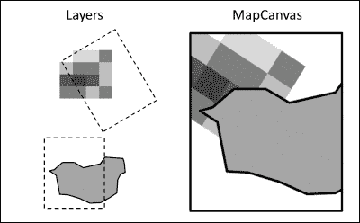

# 第四章。渲染我们的地理数据

这章可能是本书中最有趣的一章之一。数据的地形可视化是 GIS 应用程序的核心功能之一，无论是用作探索辅助工具还是用于制作地图。学习地形可视化应该在不同层面上都是有益的。在本章中，你将学习以下内容：

+   将渲染过程分解为一系列一个或多个专题图层的渲染

+   根据视图范围和缩放级别实现矢量数据和栅格数据的基本图形渲染

+   将这些渲染连接到我们的视觉用户界面，允许交互式地图可视化

# 渲染

在 GIS 中的典型用法是向应用程序添加一个或多个地理数据源或图层，然后它立即在地图窗口中渲染。在 第三章，*设计应用程序的视觉外观*中，我们将它设置为 MapView 小部件。尽管 MapView 小部件负责在交互式 GUI 中显示地图，但我们希望将实际的渲染逻辑分离到一个单独的模块中。这样，如果用户想要的话，也可以通过编码批量生成地图渲染。

通常，图形渲染是通过使用用户的硬件图形能力在屏幕上绘制来最有效地完成的。然而，Tkinter 的屏幕绘制能力（Tkinter Canvas 小部件）可能很慢，如果绘制太多项目，会很快耗尽内存，并且只能产生粗糙的锯齿状图形，没有抗锯齿平滑。我们改用将图形绘制到虚拟图像上的方法，然后将该图像发送到 Tkinter 进行显示。这会在渲染和显示之间产生轻微的延迟，并且不如使用图形硬件快；然而，它几乎与现有 GIS 软件的速度和质量相当，并且比 Tkinter 默认设置好得多。

## 安装 PyAgg

在我们开始之前，我们需要安装我们将要使用的图形渲染包，这个包叫做 **PyAgg**，由作者创建。PyAgg 是围绕 Fredrik Lundh 的 Python **aggdraw** 绑定和 **Anti-Grain Geometry** C++ 库的高级便利包装。与 Matplotlib 或 Mapnik 等其他流行的渲染库相比，PyAgg 非常轻量，仅约 2 MB，因为它包含了预编译的必要文件，所以不需要复杂的安装步骤。**PyCairo** 是另一个轻量级图形库，尽管它具有更丰富的功能集，包括线连接、线帽和渐变，但它绘制具有许多顶点的大对象时速度非常慢。因此，我们选择 PyAgg，因为它轻量、速度快，并且具有方便的高级 API。

现在按照以下步骤进行安装：

1.  在 Windows 命令行中，输入 `C:/Python27/Scripts/pip install pyagg`

1.  如果出于某种原因这不起作用，你可以从[`github.com/karimbahgat/PyAgg`](https://github.com/karimbahgat/PyAgg)下载 ZIP 文件，并将其提取到`site-packages`文件夹中

1.  通过在 Python 壳中输入`import pyagg`来测试它是否正确导入

    ### 注意

    如果你想尝试其他渲染库，Matplotlib 在其网站上提供了一个易于使用的 Windows 安装程序。你应该将其与**Descartes**结合使用，以将地理特征转换为 Matplotlib 可以渲染的对象，通过命令行安装 Descartes，即使用 pip install Descartes。

    对于 Mapnik，据我所知没有预编译版本，因此你将不得不自己编译它，按照[`wiki.openstreetmap.org/wiki/Mapnik/Installation`](http://wiki.openstreetmap.org/wiki/Mapnik/Installation)上的说明进行。

    如果你想要尝试**PyCairo**，你可以在[`www.lfd.uci.edu/~gohlke/pythonlibs/#pycairo`](http://www.lfd.uci.edu/~gohlke/pythonlibs/#pycairo)获取 Windows 的预编译 wheel 文件。

现在必要的图形库已经安装，我们在`pythongis`文件夹的根目录下创建一个名为`renderer.py`的模块。通过以下导入来初始化它：

```py
import random
import pyagg
import PIL, PIL.Image
```

为了使其对我们的顶级`pythongis`包可用，只需从`pythongis/__init__.py`内部导入它：

```py
from . import renderer
```

## 图层序列

我们 GIS 应用程序中渲染的基本思想是，我们定义了一系列应该一起可视化的地图图层，例如国家、城市和高速公路。为了方便起见，我们将这些图层集合到一个可迭代的`LayerGroup`类中，它具有添加或删除图层的方法，以及一个用于移动和更改这些图层绘制顺序的方法。请注意，它可以持有对一个或多个连接的地图小部件的引用，使其可以作为分割视图类型地图应用程序的中心图层存储库。在`renderer.py`内部，编写以下代码：

```py
class LayerGroup:
    def __init__(self):
        self.layers = list()
        self.connected_maps = list()

    def __iter__(self):
        for layer in self.layers:
            yield layer

    def add_layer(self, layer):
        self.layers.append(layer)

    def move_layer(self, from_pos, to_pos):
        layer = self.layers.pop(from_pos)
        self.layers.insert(to_pos, layer)

    def remove_layer(self, position):
        self.layers.pop(position)

    def get_position(self, layer):
        return self.layers.index(layer)
```

## MapCanvas 绘图器

接下来，我们需要一种方法将地图图层组合成一个最终的复合地图图像。为此，我们创建了一个`MapCanvas`类，它是 PyAgg 的`Canvas`类的包装器。`MapCanvas`类通过要求每个图层将自己渲染到图像上（带有透明背景），然后按照正确的顺序将它们叠加在一起来创建最终的渲染。由于每个图层都有独立的图像渲染，因此可以非常快速地重新排序或删除图层，而无需重新绘制所有图层。

在图像上叠加层是一回事，但我们如何知道哪些层要显示，或者它们在绘图画布上的具体位置呢？要做到这一点，我们需要将我们的地理空间数据的坐标转换成图像的像素坐标，这实际上并不比在图上绘制任意数据值有太大区别。通常在二维计算机图形学中，从一个坐标系转换到另一个坐标系是通过将每个 *x* 和 *y* 坐标与一些预先计算的数字相乘来完成的，这些数字被称为**仿射变换系数**。然而，得到这些系数并不立即直观，需要一点矩阵数学知识。

PyAgg 让我们的工作变得更简单，这也是我们选择使用它的主要原因之一。使用 `custom_space` 方法，PyAgg 允许我们告诉 `Canvas` 实例，它所绘制的图像是给定矩形真实世界空间的一个表示。这个空间由坐标的边界框定义，以便所有用于渲染的数据都相对于该坐标系放置，只绘制那些在其边界内的部分。PyAgg 然后使用那个边界框在幕后计算变换系数，在 Sean Gillies 的仿射模块的帮助下。作为对我们有用的另一个特性，PyAgg 允许锁定请求的视图范围的宽高比，使其与画布图像本身的宽高比相同，以避免地理数据变形或拉伸。请参考以下图示：



在启动时，在添加任何数据之前，我们使用 `geographic_space()` 将 `MapCanvas` 类的默认坐标空间设置为，它实际上是对 `custom_space()` 的封装，使用 `[-180, 90, 180, -90]` 作为边界（这是未投影数据的标准经纬度坐标系）并强制保持宽高比。通过简单地改变坐标空间的边界，`MapCanvas` 类可以用来渲染任何地理数据，无论其坐标系或 CRS 如何。这样，我们可以通过修改绘图变换系数来创建缩放或平移地图的效果。为此，我们利用 PyAgg 方便的缩放方法，这些方法允许我们用人类可以理解的方式指定我们想要如何缩放或平移绘图变换。

然而，一个挑战是在渲染定义在不同坐标参考系统（CRS）中的数据层时，因为这些数据不会像预期的那样对齐。在 GIS 中，通常的解决方案是在单个公共 CRS 中即时重投影所有地理数据。然而，在地理 CRS 之间进行转换涉及广泛的参数和对地球形状以及投影类型的假设，这使得它比我们之前的仿射变换更复杂。出于这些原因以及其他原因，我们的应用程序将不会处理 CRS 重投影。因此，我们 `MapCanvas` 类的主要限制是需要所有数据都在相同的 CRS 中，以便正确叠加。我们简要地回到第八章（ch08.html "第八章. 展望未来"）的主题，*展望未来*，以及添加此类功能的方法。以下是 `MapCanvas` 类的代码：

```py
class MapCanvas:
    def __init__(self, layers, width, height, background=None, *args, **kwargs):

        # remember and be remembered by the layergroup
        self.layers = layers
        layers.connected_maps.append(self)

        # create the drawer with a default unprojected lat-long coordinate system
        self.drawer = pyagg.Canvas(width, height, background)
        self.drawer.geographic_space() 

        self.img = self.drawer.get_image()

    def pixel2coord(self, x, y):
        return self.drawer.pixel2coord(x, y)

    # Map canvas alterations

    def offset(self, xmove, ymove):
        self.drawer.move(xmove, ymove)
    def resize(self, width, height):
        self.drawer.resize(width, height, lock_ratio=True)
        self.img = self.drawer.get_image()

    # Zooming

    def zoom_bbox(self, xmin, ymin, xmax, ymax):
        self.drawer.zoom_bbox(xmin, ymin, xmax, ymax)

    def zoom_factor(self, factor, center=None):
        self.drawer.zoom_factor(factor, center=center)

    def zoom_units(self, units, center=None):
        self.drawer.zoom_units(units, center=center)

    # Drawing

    def render_one(self, layer):
        if layer.visible:
            layer.render(width=self.drawer.width,
                         height=self.drawer.height,
                       coordspace_bbox=self.drawer.coordspace_bbox)
            self.update_draworder()

    def render_all(self):
        for layer in self.layers:
            if layer.visible:
                layer.render(width=self.drawer.width,
                             height=self.drawer.height,
                             coordspace_bbox=self.drawer.coordspace_bbox)
        self.update_draworder()

    def update_draworder(self):
        self.drawer.clear()
        for layer in self.layers:
            if layer.visible:
                self.drawer.paste(layer.img)
        self.img = self.drawer.get_image()

    def get_tkimage(self):
        # Special image format needed by Tkinter to display it in the GUI
        return self.drawer.get_tkimage() 
```

## 单个层的渲染

之前描述的 `MapCanvas` 类负责定义一个公共坐标系并组合其层的图像，但不负责任何实际的绘制。我们将这项任务留给单个层类，一个用于 `vector`，另一个用于 `raster`。

### 向量层

向量数据的渲染相当简单。我们只需在 `VectorData` 类周围创建一个 `VectorLayer` 实例，并可选地使用关键字参数决定其几何形状的一些样式方面。在样式选项阶段，我们允许所有被样式的特征以相同的方式进行样式化。

### 小贴士

亲自尝试，你可能希望扩展此功能，以便根据其属性值对单个特征或特征组进行样式化。这将允许你可视化数据如何在空间中流动。

为了渲染自身，向量层在其父类 `MapCanvas` 的相同图像尺寸上创建一个 PyAgg Canvas，背景为透明。为了确保它只绘制其父类 `MapCanvas` 应该看到的那些数据部分，我们需要设置 `coordspace_bbox` 参数为 `MapCanvas` 类的边界框。该层通过 `custom_space()` 方法将此信息传递给其 `Canvas` 实例，以便 PyAgg 可以使用矩阵数学计算正确的绘图变换系数。

当涉及到绘制每个特征时，PyAgg 及其底层的 aggdraw 模块有不同的绘图方法，对坐标的格式有不同的要求。由于我们的几何可以是点、线或多边形，并且存储在 GeoJSON 格式的字典中，我们需要将我们的 GeoJSON 格式转换为 PyAgg 期望的格式。例如，GeoJSON 多边形是一个坐标序列列表，第一个是外部，所有随后的都是孔洞；然后可以将这些信息发送到 PyAgg 的`draw_polygon`方法，并使用它期望的参数。我们不必学习整个 GeoJSON 格式来正确解析数据并调用正确的方法，PyAgg 的`Canvas`类可以在`draw_geojson`方法中为我们完成这些操作。绘制后，渲染的图像会被记住并可供`MapCanvas`访问：

```py
class VectorLayer:
    def __init__(self, data, **options):

        self.data = data
        self.visible = True
        self.img = None

        # by default, set random style color
        rand = random.randrange
        randomcolor = (rand(255), rand(255), rand(255), 255)
        self.styleoptions = {"fillcolor": randomcolor}

        # override default if any manually specified styleoptions
        self.styleoptions.update(options)

    def render(self, width, height, coordspace_bbox):
        drawer = pyagg.Canvas(width, height, background=None)
        drawer.custom_space(*coordspace_bbox)
        # get features based on spatial index, for better speeds when zooming
        if not hasattr(self.data, "spindex"):
            self.data.create_spatial_index()
        spindex_features = self.data.quick_overlap(coordspace_bbox)
        # draw each as geojson, using same style options for all features
        for feat in spindex_features:
            drawer.draw_geojson(feat.geometry, **self.styleoptions)
        self.img = drawer.get_image() 
```

### 栅格层

以类似的方式，渲染栅格数据是通过创建一个`RasterLayer`类来完成的。在自身渲染时，要考虑到栅格网格中的每个单元格在地理空间中都有一个精确的位置和矩形区域。为了将这些单元格坐标从栅格空间转换为图像空间以进行可视化，`RasterLayer`类必须知道父`MapCanvas`类的坐标视图范围，并确定每个栅格单元格应该放置在哪些边界内。

幸运的是，我们之前已经为`RasterData`类提供了一个执行此类网格转换的方法，即利用 PIL 的 quad 转换技术的`positioned`方法。使用此方法，`RasterLayer`类根据其父`MapCanvas`类的大小指定要返回的数据的宽度和高度，并且只包括位于`MapCavas`类坐标系统边界内的栅格部分。

由于我们的`RasterData`类的数据结构基于 PIL 图像，它只需将所有波段图像组合在一起以创建一个灰度或 RGB 图像，即可添加到`MapCanvas`类中进行可视化。`positioned`方法还会转换并返回`RasterLayer`类使用的`nodata`掩码，该掩码用于使缺失值透明。

### 小贴士

目前，我们不允许自定义用于可视化栅格的颜色，但如果您想添加此功能，使用 PIL 对颜色调色板的支持应该很容易。

```py
class RasterLayer:
    def __init__(self, data, **options):
        self.data = data
        self.styleoptions = dict(**options)
        self.visible = True
        self.img = None

    def render(self, width, height, coordspace_bbox):
        # position in space
        positioned,mask = self.data.positioned(width, height, coordspace_bbox)

        # combine all data bands into one image for visualizing
        if len(positioned.bands) == 1:
            # greyscale if one band
            band1 = positioned.bands[0]
            img = band1.img.convert("RGB")
        else:
            # rgb of first three bands
            bands = [band.img for band in positioned.bands[:3] ]
            img = PIL.Image.merge("RGB", bands)

        # make edge and nodata mask transparent
        img.putalpha(mask)

        # final
        self.img = img
```

# 交互式渲染我们的地图

现在我们有了将多个图层组合成渲染地图图像的方法，我们就可以进入更令人兴奋的部分，即如何在我们的应用程序中以交互式方式立即实现这一点。

## 将 MapView 连接到渲染器

在我们将一系列图层渲染到地图图像上之后，必须将此图像发送到我们的应用程序并显示出来，以便立即获得反馈。这个任务是由我们在第三章中创建的 MapView 小部件完成的，*设计应用程序的视觉外观*。在构建我们的应用程序时，我们的想法是，我们只需要担心创建这个可视的 MapView 小部件；幕后，MapView 将负责创建自己的`MapCanvas`渲染器来完成实际工作。由于`MapCanvas`类需要 LayerGroup 来管理其图层，我们将在`app/toolkit/map.py`中创建一个 MapView 方法来分配一个 LayerGroup：

```py
    def assign_layergroup(self, layergroup):
        self.layers = layergroup
```

然后，我们在 MapView 的`__init__`方法中添加了这两个组件的链接作为额外的代码。由于渲染器在创建之前需要像素宽度和高度，我们安排 MapView 在启动后不久创建它（因为 Tkinter 在启动前不知道各种小部件需要多少空间）：

```py
        # Assign a renderer just after startup, because only then can one know the required window size
        def on_startup():
            # create renderer
            width, height = self.winfo_width(), self.winfo_height()
            self.renderer = pg.MapCanvas(self.layers, width, height)
            # link to self
            self.renderer.mapview = self
            # fill with blank image
            self.tkimg = self.renderer.get_tkimage()
            self.image_on_canvas = self.create_image(0, 0, anchor="nw", image=self.tkimg )

        self.after(10, on_startup)
```

### 请求渲染地图

当 MapView 小部件想要渲染包含所有可见图层的整个新地图时，它会调用此方法，并在单独的线程中这样做，以避免在等待结果时冻结应用程序。它还会更新状态栏上的活动状态，并根据新的缩放级别设置水平比例状态。之后，它必须更新放置在可查看 Tkinter Canvas 上的图像：

```py
    def threaded_rendering(self):
        # perform render/zoom in separate thread
        self.statusbar.task.start("Rendering layers...")
        pending = dispatch.request_results(self.renderer.render_all)

        def finish(result):
            if isinstance(result, Exception):
                popup_message(self, "Rendering error: " + str(result) )
            else:
                # update renderings
                self.coords(self.image_on_canvas, 0, 0) # always reanchor rendered image nw at 0,0 in case of panning
                self.update_image()
                # display zoom scale
                self.statusbar.zoom.set_text("1:"+str(self.renderer.drawer. coordspace_units) )
            self.statusbar.task.stop()

        dispatch.after_completion(self, pending, finish)

    def update_image(self):
        self.tkimg = self.renderer.get_tkimage()
        self.itemconfig(self.image_on_canvas, image=self.tkimg )
```

### 按比例调整地图大小以适应窗口大小

如果用户更改应用程序窗口大小为原始启动大小，我们需要相应地调整 MapView 的渲染器大小。我们告诉它只在用户停止调整窗口大小后一秒内调整大小，因为 Tkinter 的调整大小事件在过程中会连续触发。在这种情况下，重要的是坐标系统会相应地改变，以映射新的图像尺寸；幸运的是，我们的 PyAgg Canvas 在调整大小时会自动更新并锁定绘图变换的纵横比：

```py
        # Schedule resize map on window resize
        self.last_resized = None
        def resizing(event):
            # record resize time
            self.last_resized = time.time()
            # schedule to check if finished resizing after x millisecs
            self.after(300, process_if_finished)

        def process_if_finished():
            # only if x time since last resize event
            if time.time() - self.last_resized > 0.3:
                width, height = self.winfo_width(), self.winfo_height()
                self.renderer.resize(width, height)
                self.threaded_rendering()

        self.bind("<Configure>", resizing)
```

## LayersPane 作为一个图层组

在我们有了能够渲染的基本地图小部件后，我们继续向地图添加数据，然后我们可以在应用程序的图层面板中查看这些数据。LayersPane 小部件仅仅是其连接的 LayerGroup 类中图层序列的视觉表示。因此，`app/toolkit/layers.py`文件中的 LayersPane 类需要一个方法将其绑定到 LayerGroup：

```py
    def assign_layergroup(self, layergroup):
        self.layers = layergroup
```

## 添加图层

现在，我们将在`app/toolkit/layers.py`文件中的 LayersPane 类中创建一个`add_layer`方法。为了使其灵活，我们允许它从文件路径或已加载的数据对象中添加一个图层。

如果它检测到一个文件路径，它首先运行一个 `from_filepath` 函数，其中它决定是否创建一个矢量或栅格数据类，告诉我们的调度模块使用这个数据类在后台线程中加载文件路径，并安排我们的应用程序每 100 毫秒检查一次结果队列，以查看是否加载完成。

一旦加载或提供了一个已加载的数据对象，它就会直接使用 `from_loaded()` 函数添加图层。这创建了一个能够渲染自己的 VectorLayer 或 RasterLayer，并在 `LayersPane` 中添加了一个对右键事件做出响应的图层表示（更多内容将在下一节中介绍），并要求调度将图层渲染为图像并更新与之连接的 MapView 小部件。如果新图层是当前在 `LayersPanel` 中加载的唯一图层，那么我们将自动缩放到其边界框，以便用户可以立即查看数据。

这里是代码：

```py
    def add_layer(self, filepath_or_loaded, name=None, **kwargs):

        def from_filepath(filepath):
            if filepath.lower().endswith((".shp",".geojson",".json")):
                func = pg.vector.data.VectorData
                args = (filepath,)
            elif filepath.lower().endswith((".asc",".ascii",
                                            ".tif",".tiff",".geotiff",
                                            ".jpg",".jpeg",
                                            ".png",".bmp",".gif")):
                func = pg.raster.data.RasterData
                args = (filepath,)
            else:
                popup_message(self, "Fileformat not supported\n\n" + filepath )
                return

            self.statusbar.task.start("Loading layer from file...")
            pending = dispatch.request_results(func, args, kwargs)

            def finish(loaded):
                if isinstance(loaded, Exception):
                    popup_message(self, str(loaded) + "\n\n" + filepath )
                else:
                    from_loaded(loaded)
                self.statusbar.task.stop()

            dispatch.after_completion(self, pending, finish)

        def from_loaded(loaded):
            # add the data as a rendering layer
            if isinstance(loaded, pg.vector.data.VectorData):
                renderlayer = pg.renderer.VectorLayer(loaded)
            elif isinstance(loaded, pg.raster.data.RasterData):
                renderlayer = pg.renderer.RasterLayer(loaded)
            self.layers.add_layer(renderlayer)

            # list a visual representation in the layerspane list
            listlayer = LayerItem(self.layersview, renderlayer=renderlayer, name=name)
            listlayer.namelabel.bind("<Button-3>", self.layer_rightclick)
            listlayer.pack(fill="x", side="bottom")

            # render to and update all mapcanvases connected to the layergroup
            for mapcanvas in self.layers.connected_maps:
                if len(mapcanvas.layers.layers) == 1:
                    # auto zoom to layer if it is the only layer
                    mapcanvas.zoom_bbox(*loaded.bbox)

                func = mapcanvas.render_one
                args = [renderlayer]

                self.statusbar.task.start("Rendering layer...")
                pending = dispatch.request_results(func, args)

                def finish(loaded):
                    if isinstance(loaded, Exception):
                        popup_message(self, "Rendering error: " + str(loaded) )
                    else:
                        mapcanvas.mapview.update_image()
                    self.statusbar.task.stop()

                dispatch.after_completion(self, pending, finish)

        # load from file or go straight to listing/rendering
        if isinstance(filepath_or_loaded, (str,unicode)):
            from_filepath(filepath_or_loaded)
        else:
            from_loaded(filepath_or_loaded)
```

## 在 `LayersPane` 小部件中编辑图层

现在我们可以向 `LayersPane` 添加图层，我们还想能够对图层进行一些操作。图层表示为一个 `LayerItem` 小部件，我们尚未定义它。我们在右侧为 `LayerItem` 添加一个删除按钮，并在左侧添加一个复选框来切换其可见性，如图所示：


删除按钮将需要一个图标，所以让我们先获取一个：

1.  前往图标网站，例如 [www.iconarchive.com](http://www.iconarchive.com) 或 [`www.flaticon.com`](http://www.flaticon.com)。

1.  搜索并选择您喜欢的图标。

1.  将其保存为 `delete_layer.png`，大小为 32 像素，并将其放置在您的 `app/icons` 文件夹中。

我们还定义了如何重命名图层的名称，它暂时在图层名称显示上方添加一个 Tkinter 输入小部件，以便用户可以更改名称并按 *Return* 键接受或按 *ESC* 键取消。现在使用以下代码在 `app/toolkit/layers.py` 中创建 `LayerItem` 类：

```py
class LayerItem(tk.Frame):
    def __init__(self, master, renderlayer, name=None, **kwargs):
        # get theme style
        style = style_layeritem_normal.copy()
        style.update(kwargs)

        # Make this class a subclass of tk.Frame and add to it
        tk.Frame.__init__(self, master, **style)
        self.layerspane = self.master.master
        self.statusbar = self.layerspane.statusbar

        # Create a frame to place main row with name etc
        self.firstrow = tk.Frame(self, **style)
        self.firstrow.pack(side="top", fill="x", expand=True)

        # Create the visibility check box
        var = tk.BooleanVar(self)
        self.checkbutton = tk.Checkbutton(self.firstrow, variable=var, offvalue=False, onvalue=True, command=self.toggle_visibility, **style_layercheck)
        self.checkbutton.var = var
        self.checkbutton.pack(side="left")
        self.checkbutton.select()

        # Create Delete button to the right
        self.deletebutton = IconButton(self.firstrow, padx=2, relief="flat", command=self.delete)
        self.deletebutton.set_icon("delete_layer.png")
        self.deletebutton.pack(side="right")

        # Create the layername display
        self.renderlayer = renderlayer
        if name: layername = name
        elif self.renderlayer.data.filepath: 
            layername = os.path.split(self.renderlayer.data.filepath)[-1]
        else: layername = "Unnamed layer"
        self.namelabel = tk.Label(self.firstrow, text=layername, **style_layername_normal)
        self.namelabel.pack(side="left", fill="x", expand=True)

    def toggle_visibility(self):
        self.layerspane.toggle_layer(self)

    def delete(self):
        self.layerspane.remove_layer(self)

    def ask_rename(self):
        # place entry widget on top of namelabel
        nameentry = tk.Entry(self)
        nameentry.place(x=self.namelabel.winfo_x(), y=self.namelabel.winfo_y(), width=self.namelabel.winfo_width(), height=self.namelabel.winfo_height())
        # set its text to layername and select all text
        nameentry.insert(0, self.namelabel["text"])
        nameentry.focus()
        nameentry.selection_range(0, tk.END)
        # accept or cancel change via keypress events
        def finish(event):
            newname = nameentry.get()
            nameentry.destroy()
            self.namelabel["text"] = newname
        def cancel(event):
            nameentry.destroy()
        nameentry.bind("<Return>", finish)
        nameentry.bind("<Escape>", cancel)
```

`LayerItem` 类的删除按钮和前一个代码中的可见性复选框都调用了父级 `LayersPane` 中的方法来完成工作，因为 `LayersPane` 的连接 `MapCanvas` 需要在之后进行更新。因此，让我们将这些方法添加到 `LayersPane` 中。我们还需要一种方法来指定在 `LayersPane` 中右键点击任何图层时要运行的功能：

```py
    def toggle_layer(self, layeritem):
        # toggle visibility
        if layeritem.renderlayer.visible == True:
            layeritem.renderlayer.visible = False
        elif layeritem.renderlayer.visible == False:
            layeritem.renderlayer.visible = True
        # update all mapcanvas
        for mapcanvas in self.layers.connected_maps:
            mapcanvas.update_draworder()
            mapcanvas.mapview.update_image()

    def remove_layer(self, layeritem):
        # remove from rendering
        layerpos = self.layers.get_position(layeritem.renderlayer)
        self.layers.remove_layer(layerpos)
        for mapcanvas in self.layers.connected_maps:
            mapcanvas.update_draworder()
            mapcanvas.mapview.update_image()
        # remove from layers list
        layeritem.destroy()

    def bind_layer_rightclick(self, func):
        self.layer_rightclick = func
```

### 点击并拖动以重新排列图层顺序

一个稍微复杂一些的程序是让用户通过点击并拖动将 `LayersPane` 中 `LayerItems` 的绘制顺序重新排列到新位置。这是任何 GIS 软件分层性质的一个基本功能，但不幸的是，Tkinter GUI 框架没有为我们提供任何拖放快捷方式，因此我们必须从头开始构建。我们使其保持简单，并且一次只允许移动一个图层。

要在列表中重新排列图层，我们首先需要监听用户点击 LayerItem 的事件。在这样的事件中，我们记住我们想要移动的图层的位置，并将光标更改为指示正在进行拖放操作。当用户释放鼠标点击时，我们遍历所有 LayerItem 小部件的屏幕坐标，以检测鼠标释放时的图层位置。请注意，渲染在所有其他图层之上的图层的索引位置是列表中的第一个，但在 LayerGroup 的图层序列中是最后一个。我们在 LayerItem 的`__init__`方法中添加了这种监听行为：

```py
        def start_drag(event):
            self.dragging = event.widget.master.master
            self.config(cursor="exchange")

        def stop_drag(event):

            # find closest layerindex to release event
            def getindex(layeritem):
                return self.layerspane.layers.get_position(layeritem.renderlayer)

            goingdown = event.y_root - (self.dragging.winfo_rooty() + self.dragging.winfo_height() / 2.0) > 0
            if goingdown:
                i = len(self.layerspane.layersview.winfo_children())
                for layeritem in sorted(self.layerspane.layersview.winfo_children(), key=getindex, reverse=True):
                    if event.y_root < layeritem.winfo_rooty() + layeritem.winfo_height() / 2.0:
                        break
                    i -= 1
            else:
                i = 0
                for layeritem in sorted(self.layerspane.layersview.winfo_children(), key=getindex):
                    if event.y_root > layeritem.winfo_rooty() - layeritem.winfo_height() / 2.0:
                        break
                    i += 1

            # move layer
            frompos = self.layerspane.layers.get_position(self.dragging.renderlayer)
            if i != frompos:
                self.layerspane.move_layer(frompos, i)

            # clean up
            self.dragging = None
            self.config(cursor="arrow")

        self.dragging = None
        self.namelabel.bind("<Button-1>", start_drag)
        self.namelabel.bind("<ButtonRelease-1>", stop_drag)
```

在用户与 LayersPane 交互以告知其移动图层位置后，我们告诉其关联的 LayerGroup 根据“从”和“到”位置重新排列图层顺序。然后我们告诉所有连接到该 LayerGroup 的 MapCanvas 更新它们的绘制顺序和显示的图像。我们必须在`LayersPane`类中定义此方法：

```py
    def move_layer(self, fromindex, toindex):
        self.layers.move_layer(fromindex, toindex)
        for mapcanvas in self.layers.connected_maps:
            mapcanvas.update_draworder()
            mapcanvas.mapview.update_image()
        self.update_layerlist()
```

## 缩放地图图像

到目前为止，我们可以向地图添加和删除图层，并重新排列它们的顺序，但我们仍然不能与地图本身交互。这正是自己制作应用程序的一大优点之一。用户可能会发现，与现有的 GIS 软件相比，他们必须在这两种地图交互模式之间做出选择：一种是**平移**模式，点击并拖动鼠标会相应地移动地图；另一种是**矩形缩放**模式，点击并拖动定义要缩放的区域。

在这两种模式之间切换不利于地图探索，而地图探索通常是一个更动态和迭代的进程，涉及在 Google Maps 中使用时同时使用缩放和平移。现在我们有了决定权，让我们通过分别用双击和点击拖动来控制它们，将缩放和平移结合起来。

地图的实际缩放是通过让 MapCanvas 在给定的缩放级别重新绘制地图来完成的。我们将一个以鼠标为中心的 2 倍缩放因子方法绑定到用户在地图上双击的事件上。当用户停止点击后，我们给这种缩放一个三分之一的秒延迟，这样用户就可以连续多次双击以实现更大的缩放，而不会使应用程序渲染多个增量缩放图像过度繁忙。每次缩放级别改变时，我们也会要求更新状态栏的缩放单位比例，这是由 PyAgg 渲染画布提供的。我们添加的所有这些监听行为都在`app/toolkit/map.py`文件中的 MapView 的`__init__`方法内部：

```py
        # Bind interactive zoom events
        def doubleleft(event):
            self.zoomfactor += 1
            canvasx,canvasy = self.canvasx(event.x),self.canvasy(event.y)
            self.zoomcenter = self.renderer.pixel2coord(canvasx, canvasy)
            self.zoomdir = "in"
            # record zoom time
            self.last_zoomed = time.time()
            # schedule to check if finished zooming after x millisecs
            self.after(300, zoom_if_finished)

        def doubleright(event):
            self.zoomfactor += 1
            canvasx,canvasy = self.canvasx(event.x),self.canvasy(event.y)
            self.zoomcenter = self.renderer.pixel2coord(canvasx, canvasy)
            self.zoomdir = "out"
            # record zoom time
            self.last_zoomed = time.time()
            # schedule to check if finished zooming after x millisecs
            self.after(300, zoom_if_finished)

        def zoom_if_finished():
            if time.time() - self.last_zoomed >= 0.3:
                if self.zoomdir == "out":
                    self.zoomfactor *= -1
                self.renderer.zoom_factor(self.zoomfactor, center=self.zoomcenter)
                self.threaded_rendering()
                # reset zoomfactor
                self.zoomfactor = 1
                self.last_zoomed = None

        self.bind("<Double-Button-1>", doubleleft)
        self.bind("<Double-Button-3>", doubleright)
```

### 地图平移和一次性矩形缩放

滚动地图相对简单，因为渲染的地图图像只是一个放置在 Tkinter 可滚动 Canvas 小部件内的图像。渲染的地图图像始终放置在 Tkinter Canvas 的 [0,0] 坐标，即左上角，但当我们平移地图时，我们会让图像开始跟随鼠标。在我们松开鼠标后，渲染器开始通过偏移 MapCanvas 的 PyAgg 坐标系并重新渲染地图来渲染新的地图。我们还允许使用这些点击和释放事件来执行传统的矩形缩放，并配合 Tkinter 内置的画布矩形绘制视觉引导。这种矩形缩放模式应该只作为一次事件，默认回到平移模式，因为矩形缩放相对很少需要。为了指示我们处于矩形缩放模式，我们还将在鼠标悬停在 MapView 小部件上时，将光标替换为类似放大镜图标的东西，因此您需要找到并保存一个 `rect_zoom.png` 图像到 `app/icons` 目录。将鼠标移到地图上通常也应该在状态栏中显示鼠标坐标。我们在 `app/toolkit/map.py` 文件中的 MapView 小部件的 `__init__` 方法中定义了这一点：

```py
        def mousepressed(event):
            if self.last_zoomed: return
            self.mousepressed = True
            self.startxy = self.canvasx(event.x), self.canvasy(event.y)
            if self.mouse_mode == "zoom":
                startx,starty = self.startxy
                self.rect = self.create_rectangle(startx, starty, startx+1, starty+1, fill=None)

        def mousemoving(event):
            if self.statusbar:
                # mouse coords
                mouse = self.canvasx(event.x), self.canvasy(event.y)
                xcoord,ycoord = self.renderer.pixel2coord(*mouse)
                self.statusbar.mouse.set_text("%3.8f , %3.8f" %(xcoord,ycoord) )
            if self.mouse_mode == "pan":
                if self.mousepressed:
                    startx,starty = self.startxy
                    curx,cury = self.canvasx(event.x), self.canvasy(event.y)
                    xmoved = curx - startx
                    ymoved = cury - starty
                    self.coords(self.image_on_canvas, xmoved, ymoved) # offset the image rendering
            elif self.mouse_mode == "zoom":
                curx,cury = self.canvasx(event.x), self.canvasy(event.y)
                self.coords(self.zoomicon_on_canvas, curx, cury)
                if self.mousepressed:
                    startx,starty = self.startxy
                    self.coords(self.rect, startx, starty, curx, cury)

        def mousereleased(event):
            if self.last_zoomed: return
            self.mousepressed = False
            if self.mouse_mode == "pan":
                startx,starty = self.startxy
                curx,cury = self.canvasx(event.x), self.canvasy(event.y)
                xmoved = int(curx - startx)
                ymoved = int(cury - starty)
                if xmoved or ymoved:
                    # offset image rendering
                    self.renderer.offset(xmoved, ymoved) 
                    self.threaded_rendering()
            elif self.mouse_mode == "zoom":
                startx,starty = self.startxy
                curx,cury = self.canvasx(event.x), self.canvasy(event.y)
                self.coords(self.rect, startx, starty, curx, cury)
                # disactivate rectangle selector
                self.delete(self.rect)
                self.event_generate("<Leave>") # fake a mouseleave event to destroy icon
                self.mouse_mode = "pan"
                # make the zoom
                startx,starty = self.renderer.drawer.pixel2coord(startx,starty)
                curx,cury = self.renderer.drawer.pixel2coord(curx,cury)
                bbox = [startx, starty, curx, cury]
                self.renderer.zoom_bbox(*bbox)
                self.threaded_rendering()

        def mouseenter(event):
            if self.mouse_mode == "zoom":
                # replace mouse with zoomicon
                self.zoomicon_tk = icons.get("zoom_rect.png", width=30, height=30)
                self.zoomicon_on_canvas = self.create_image(event.x, event.y, anchor="center", image=self.zoomicon_tk )
                self.config(cursor="none")

        def mouseleave(event):
            if self.mouse_mode == "zoom":
                # back to normal mouse
                self.delete(self.zoomicon_on_canvas)
                self.config(cursor="arrow")

        def cancel(event):
            if self.mouse_mode == "zoom":
                self.event_generate("<Leave>") # fake a mouseleave event to destroy icon
                self.mouse_mode = "pan"
                if self.mousepressed:
                    self.delete(self.rect)

        # bind them
        self.bind("<Button-1>", mousepressed, "+")
        self.bind("<Motion>", mousemoving)
        self.bind("<ButtonRelease-1>", mousereleased, "+")
        self.bind("<Enter>", mouseenter)
        self.bind("<Leave>", mouseleave)
        self.winfo_toplevel().bind("<Escape>", cancel)
```

### 导航工具栏

为了激活一次性的矩形缩放，我们在 `app/toolkit/toolbars.py` 文件中创建了一个导航工具栏，该工具栏必须连接到 MapView，并给它一个按钮，该按钮简单地打开其连接的 MapView 的一次性缩放模式。在此过程中，我们还创建了一个工具栏按钮，用于缩放到 MapView 的 `layergroup` 中所有层的全局边界框。请记住找到并保存这两个新按钮的图标，`zoom_rect.png` 和 `zoom_global.png`。参见图表：


```py
class NavigateTB(tk.Frame):
    def __init__(self, master, **kwargs):
        # get theme style
        style = style_toolbar_normal.copy()
        style.update(kwargs)

        # Make this class a subclass of tk.Frame and add to it
        tk.Frame.__init__(self, master, **style)

        # Modify some options
        self.config(width=80, height=40)

    def assign_mapview(self, mapview):
        mapview.navigation = self
        self.mapview = mapview

        # Add buttons
        self.global_view = IconButton(self, text="zoom global", command=self.mapview.zoom_global)
        self.global_view.set_icon("zoom_global.png", width=32, height=32)
        self.global_view.pack(side="left", padx=2, pady=2)
        self.zoom_rect = IconButton(self, text="zoom to rectangle", command=self.mapview.zoom_rect)
        self.zoom_rect.set_icon("zoom_rect.png", width=32, height=32)
        self.zoom_rect.pack(side="left", padx=2, pady=2)
```

实际的缩放调用被定义为 MapView 小部件的方法，在 `app/toolkit/map.py` 文件中：

```py
    def zoom_global(self):
        layerbboxes = (layer.data.bbox for layer in self.renderer.layers)
        xmins,ymins,xmaxs,ymaxs = zip(*layerbboxes)
        globalbbox = [min(xmins), min(ymins), max(xmaxs), max(ymaxs)]
        self.renderer.zoom_bbox(*globalbbox)
        self.threaded_rendering()

    def zoom_rect(self):
        self.mouse_mode = "zoom"
        self.event_generate("<Enter>")

    def zoom_bbox(self, bbox):
        self.renderer.zoom_bbox(*bbox)
        self.threaded_rendering()
```

# 整合所有内容

我们现在已经定义了一个基本渲染应用的所有必要构建块。这些可以以许多不同的方式使用和组合。例如，如果您想，您可以构建一个应用程序，它有一个单独的 LayerGroup/LayersPane 与多个独立可缩放的 MapView 连接，以同时查看相同数据的不同位置。在这本书中，我们选择了更基本的桌面 GIS 外观。

让我们回到我们在 第三章 中创建的 GUI 类，*设计应用程序的视觉外观*，并在其启动阶段添加更多内容。首先，我们给 GUI 一个 LayerGroup 实例来保存我们的层，并将其链接到 MapView 和 LayersPane 小部件，以便它们可以在以后进行通信。

我们还需要一个按钮来添加数据层。有许多可能的位置可以放置这样一个重要的按钮，但就我们当前的应用程序而言，让我们将其放置在 LayersPane 小部件的标题栏中，以便将所有与层相关的内容逻辑上分组在一起。我们希望这个按钮有一个图标，所以让我们首先找到并保存一个合适的图标，将其命名为 `add_layer.png` 并保存在 `app/icons` 文件夹中。具体来说，我们想要创建一个添加层的按钮，将其与我们的图标关联，并将其放置在 LayersPane 标题栏的右侧。当按钮被点击时，它将运行一个 `selectfiles` 函数，该函数打开一个 Tkinter 文件选择对话框窗口，并将所有选定的文件作为新层添加。

从文件加载数据可能需要我们指定数据的正确文本编码。默认情况下，我们将其设置为 `utf8`，但用户应该能够在一个单独的数据设置窗口中自定义此和其他数据选项。我们将数据选项字典存储为 GUI 类的属性，并允许用户在设置窗口中更改它。这个设置窗口可以通过我们的 `RunToolFrame` 模板轻松定义。为了允许用户访问这个设置窗口，我们在添加层按钮旁边添加了一个数据设置按钮。像往常一样，找到并下载用于按钮的图标，命名为 `data_options.png`。

之后，让我们创建一个用于可视化的选项卡，给它一个按钮，以便将我们的 MapView 小部件的内容保存到图像文件中。记得找到并保存一个 `save_image.png` 文件，这样我们就可以给这个按钮添加一个图标。最后，我们添加了之前创建的导航工具栏，将其悬挂在 MapView 的上部。

现在我们将这段新代码添加到我们的 GUI 类的 `__init__` 方法中，位于 `app/builder.py` 文件内：

```py
        # Create a layergroup that keeps track of all the loaded data
        # ...so that all widgets can have access to the same data
        self.layers = pg.renderer.LayerGroup()

        # Assign layergroup to layerspane and mapview
        self.layerspane.assign_layergroup(self.layers)
        self.mapview.assign_layergroup(self.layers)

        ## Visualize tab
        visitab = self.ribbon.add_tab("Visualize")
        ### (Output toolbar)
        output = visitab.add_toolbar("Output")
        def save_image():
            filepath = asksaveasfilename()
            self.mapview.renderer.img.save(filepath)
        output.add_button(text="Save Image", icon="save_image.png",
                               command=save_image)

        # Place add layer button in the header of the layerspane
        def selectfiles():
            filepaths = askopenfilenames()
            for filepath in filepaths:
                encoding = self.data_options.get("encoding")
                self.layerspane.add_layer(filepath, encoding=encoding)
        button_addlayer = IconButton(self.layerspane.header, command=selectfiles)
        button_addlayer.set_icon("add_layer.png", width=27, height=27)
        button_addlayer.pack(side="right", anchor="e", ipadx=3, padx=6, pady=3,)

        # Place button for setting data options
        self.data_options = {"encoding": "utf8"}
        button_data_options = IconButton(self.layerspane.header)
        button_data_options.set_icon("data_options.png", width=24, height=21)
        button_data_options.pack(side="right", anchor="e", ipadx=5, ipady=3, padx=6, pady=3,)

        # Open options window on button click
        def data_options_window():
            win = popups.RunToolWindow(self)

            # assign status bar
            win.assign_statusbar(self.statusbar)

            # place option input for data encoding
            win.add_option_input("Vector data encoding", valuetype=str,
                                 argname="encoding", default=self.data_options.get("encoding"))

            # when clicking OK, update data options
            def change_data_options(*args, **kwargs):
                """
                Customize settings for loading and saving data.

                Vector data encoding: Common options include "utf8" or "latin"
                """
                # update user settings
                self.data_options.update(kwargs)

            def change_data_options_complete(result):
                # close window
                win.destroy()

            win.set_target_method("Changing data options", change_data_options)
            win.set_finished_method(change_data_options_complete)

        button_data_options["command"] = data_options_window

        # Attach floating navigation toolbar inside mapwidget
        self.navigation = NavigateTB(self.mapview)
        self.navigation.place(relx=0.5, rely=0.03, anchor="n")
        self.navigation.assign_mapview(self.mapview)
```

大概就是这样！你的应用程序现在应该已经准备好用于渲染地图数据了。运行 `guitester.py`，尝试添加一些数据并与地图进行交互。如果你一切都做得正确，并且根据你的数据，你的屏幕应该看起来像这样：


# 摘要

本章是一个基本的里程碑。我们基于可重新排列的层在 LayerGroup 中构建了一个工作地理渲染模块，创建了一个用于交互显示这些地图渲染的 MapView 小部件，制作了我们地图中层的可视化 LayersPane，并启用了 MapView 的交互式缩放和平移。

在遵循每个步骤之后，你现在应该拥有一个看起来和感觉像 GIS 数据检查应用程序的东西。当然，一个更复杂的 GIS 需要额外的功能，不仅用于检查数据，还用于管理和编辑数据——这正是我们接下来要做的。
