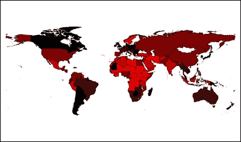
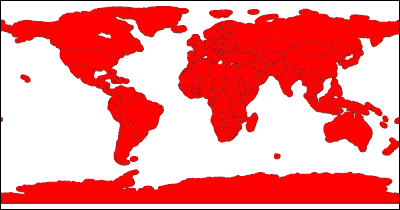
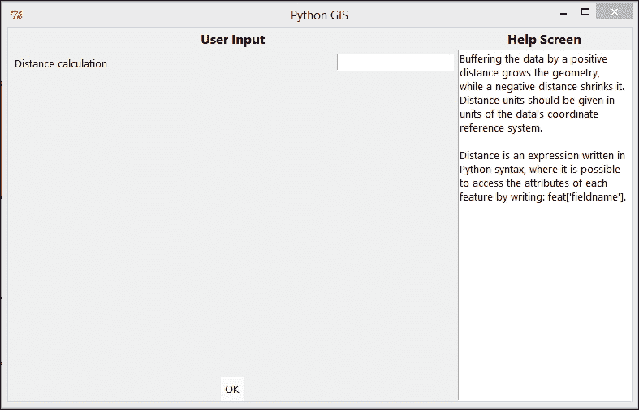
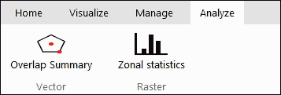
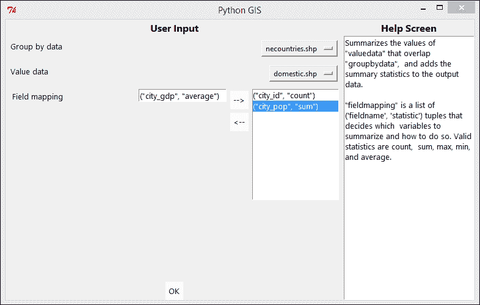
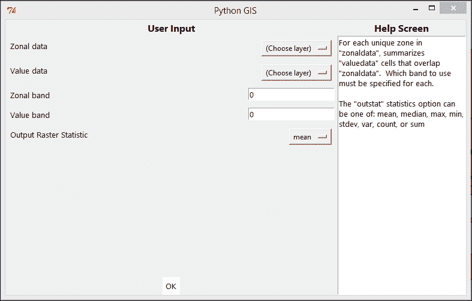

# 第六章：分析地理数据

在获取、准备和组织数据以适应你的需求之后，你最终会到达一个点，可以真正利用这些数据进行一些更大的好事：形成查询、探索、回答问题、测试假设等等。在本章中，你将开发一些这些能力及其应用组件，特别是：

+   创建分析功能：

    +   矢量数据中的叠加汇总和距离缓冲区

    +   栅格数据的区域汇总统计

+   添加通过用户界面访问它们的方式

# 创建分析模块

我们首先创建一个名为`app/analyzer.py`的模块，并添加必要的导入。在`vector`文件夹中也有一个：

```py
import itertools, operator
from .data import *

import shapely
from shapely.prepared import prep as supershapely
```

在`raster`文件夹中也有一个：

```py
import itertools, operator
from .data import *
from .manager import *

import PIL.Image, PIL.ImageMath, PIL.ImageStat
```

如同往常，我们必须使这些新模块可以从它们的父包导入，因此需要在`vector/__init__.py`和`raster/__init__.py`中添加以下导入语句：

```py
from . import analyzer
```

# 分析数据

本章的前半部分创建了分析功能，而后半部分将功能融入应用程序设计。让我们先创建功能。这包括矢量数据中的重叠汇总和缓冲区，以及栅格数据的区域统计。

## 矢量数据

对于矢量数据，我们将关注两个常用的分析工具：重叠汇总和缓冲区。

### 重叠汇总

在 GIS 中，最基本的空间分析操作之一是对接触或重叠其他图层特征的要素层进行统计汇总。这类分析通常涉及的问题包括：每个国家多边形内有多少个点，或者每个国家的值总和或平均值是多少？这类分析通常使用*空间连接*工具来完成，其中多对一选项表示多个匹配特征与一个汇总统计。然后，这些汇总统计被附加到原始国家多边形上。空间连接本身不是一种分析，它只是进行用户可以用于后续分析（例如在地图或表格图中）的数值计算。根据我的经验，这是使用空间连接最常见的原因之一，作为预处理步骤，但它仍然是叠加分析的一个关键部分。

以下截图展示了叠加分析可以用来汇总值和可视化模式的一种典型方式：



由于我们的应用程序更多地面向非技术用户，并且我们希望尽可能使一切清晰明了，我们将这种特定的空间连接用法做成一个独立的工具，并给它一个更恰当地描述分析最终结果的名称：重叠摘要。该工具已被分配用于将统计分组到包含将被汇总的值的数据库中，以及一个要计算输出中的字段名统计元组列表，也称为 **字段映射**。有效的统计值有计数、总和、最大值、最小值和平均值。作为一个字段映射的例子，该工具期望如果我们想让输出文件计算主要城市的数量和它们人口的总和，我们将写成 `[("city_id", "count"), ("city_pop", "sum")]`。请注意，字段映射遵循通常的 Python 语法，字符串周围有引号，这也是我们稍后通过用户界面输入它们的方式。对于检测重叠，我们使用 Shapely 模块的 `intersects` 操作。还请注意，使用 Shapely 不太为人所知的 `prep` 函数（导入为 `supershapely`）在相同几何形状上的多次重复相交比较中提供了惊人的加速。

因此，进入 `vector/analyzer.py` 并添加以下函数：

```py
def overlap_summary(groupbydata, valuedata, fieldmapping=[]):
    # prep
    data1,data2 = groupbydata,valuedata
    if fieldmapping: aggfields,aggtypes = zip(*fieldmapping)
    aggfunctions = dict([("count",len),
                         ("sum",sum),
                         ("max",max),
                         ("min",min),
                         ("average",lambda seq: sum(seq)/float(len(seq)) ) ])

    # create spatial index
    if not hasattr(data1, "spindex"): data1.create_spatial_index()
    if not hasattr(data2, "spindex"): data2.create_spatial_index()

    # create new
    new = VectorData()
    new.fields = list(data1.fields)
    if fieldmapping: 
        for aggfield,aggtype in fieldmapping:
            new.fields.append(aggfield)

    # for each groupby feature
    for i,feat in enumerate(data1.quick_overlap(data2.bbox)):
        geom = feat.get_shapely()
        geom = supershapely(geom)
        matches = []

        # get all value features that intersect
        for otherfeat in data2.quick_overlap(feat.bbox):        
            othergeom = otherfeat.get_shapely()
            if geom.intersects(othergeom):
                matches.append(otherfeat)

        # make newrow from original row
        newrow = list(feat.row)

        # if any matches
        if matches:
            def make_number(value):
                try: return float(value)
                except: return None

            # add summary values to newrow based on fieldmapping
            for aggfield,aggtype in fieldmapping:
                values = [otherfeat[aggfield] for otherfeat in matches]
                if aggtype in ("sum","max","min","average"):
                    # only consider number values if numeric stats
                    values = [make_number(value) for value in values if make_number(value) != None]
                aggregatefunc = aggfunctions[aggtype]
                summaryvalue = aggregatefunc(values)
                newrow.append(summaryvalue)

        # otherwise, add empty values
        else:
            newrow.extend(("" for _ in fieldmapping))

        # write feature to output
        new.add_feature(newrow, feat.geometry)

    return new
```

### 缓冲区

如果在你的分析中，你还想包括那些不一定与分组特征重叠但位于一定距离内的特征，那么缓冲区是一个很好的工具。缓冲操作是指通过指定距离扩展或缩小几何特征。在将几何形状扩展到所需距离后，可以随后使用之前实现的重叠摘要工具，这样也可以将接近重叠的特征包含在统计中。参考以下截图以查看多边形缓冲操作的示例：



我们通过 Shapely 的 `buffer` 方法非常简单地实现这一点，使用正数进行扩展，使用负数进行缩小。为了使其更有趣，我们允许用户根据表达式动态设置缓冲距离。该表达式应采用表示 Python 代码的字符串形式，引用特征为 **feat**，这允许根据一个或多个属性或甚至数学表达式进行缓冲。例如，为了根据人均 GDP 和缩放以增强可见性来缓冲国家图层，我们可能写成：*(feat['GDP'] / float(feat['population'])) / 500.0*。

在 `vector/analyzer.py` 中添加以下代码：

```py
def buffer(data, dist_expression):
    # buffer and change each geojson dict in-place
    new = VectorData()
    new.fields = list(data.fields)
    for feat in data:
        geom = feat.get_shapely()
        dist = eval(dist_expression)
        buffered = geom.buffer(dist)
        if not buffered.is_empty:
            geojson = buffered.__geo_interface__
            geojson["type"] = buffered.type
            new.add_feature(feat.row, geojson)
    # change data type to polygon
    new.type = "Polygon"
    return new
```

## 栅格数据

在我们的轻量级应用程序中分析栅格数据时，我们多少受到主要依赖项 PIL 提供的速度和功能的限制。幸运的是，PIL 包内有许多隐藏的宝石，其中之一就是 `ImageStat` 模块，我们用它来实现区域统计分析。

### 注意

PIL 库中的其他有用功能可以在其`ImageMath`模块中找到。这将使我们能够根据一个或多个输入栅格层的数学表达式生成输出栅格。然而，如果你的应用程序主要是用于高级栅格数据或卫星图像分析，你可能想要考虑 GDAL/NumPy/SciPy 路线。我们将在最后一章中回到这些可能性。

### 区域统计

区域统计是常见的 GIS 工具，它从每个栅格中提取每个类别或区域，并总结另一个栅格中重叠单元格的值。在某种程度上，区域统计是重叠摘要的栅格等效物。在我们的实现中，我们返回一个包含每个区域各种统计信息的字典和一个区域栅格的副本，其中每个区域的值基于其全局汇总统计信息之一。用户必须指定要使用区域数据和值数据中的哪个波段，并将 outstat 统计选项设置为以下之一：`mean`，`median`，`max`，`min`，`stdev`，`var`，`count`或`sum`。

在`raster/analyser.py`中编写：

```py
def zonal_statistics(zonaldata, valuedata, zonalband=0, valueband=0, outstat="mean"):
    """
    For each unique zone in "zonaldata", summarizes "valuedata" cells that overlap "zonaldata".
    Which band to use must be specified for each.

    The "outstat" statistics option can be one of: mean, median, max, min, stdev, var, count, or sum
    """
    # get nullvalues
    nullzone = zonaldata.info.get("nodata_value")

    # position value grid into zonal grid
    (valuedata,valuemask) = valuedata.positioned(zonaldata.width, zonaldata.height,
                                                 zonaldata.bbox)

    # pick one image band for each
    zonalimg = zonaldata.bands[zonalband].img
    valueimg = valuedata.bands[valueband].img

    # create output image, using nullzone as nullvalue
    outimg = PIL.Image.new("F", zonalimg.size, nullzone)

    # get stats for each unique value in zonal data
    zonevalues = [val for count,val in zonalimg.getcolors()]
    zonesdict = {}
    for zoneval in zonevalues:
        # exclude nullzone
        if zoneval == nullzone: continue

        # mask only the current zone
        zonemask = zonalimg.point(lambda px: 1 if px == zoneval else 0, "1")
        fullmask = PIL.Image.new("1", zonemask.size, 0)
        # also exclude null values from calculations
        fullmask.paste(zonemask, valuemask)

        # retrieve stats
        stats = PIL.ImageStat.Stat(valueimg, fullmask)
        statsdict = {}
        statsdict["min"],statsdict["max"] = stats.extrema[0]
        for stattype in ("count","sum","mean","median","var","stddev"):
            try: statsdict[stattype] = stats.__getattr__(stattype)[0]
            except ZeroDivisionError: statsdict[stattype] = None
        zonesdict[zoneval] = statsdict

        # write chosen stat to outimg
        outimg.paste(statsdict[outstat], (0,0), zonemask)

    # make outimg to raster
    outraster = Raster(image=outimg, **zonaldata.info)

    return zonesdict, outraster
```

# 将功能集成到用户界面中

接下来，让我们使到目前为止创建的分析功能在我们的应用程序用户界面中可用。

## 图层特定的右键单击功能

在第五章中，我们指导我们的应用程序，在图层窗格中右键单击图层将给我们一个菜单，可以选择特定于该图层的操作。在本章中，我们唯一创建的图层特定功能是`buffer`操作。因此，我们将缓冲菜单选项添加到`app/dialogues.py`中的`RightClickMenu_VectorLayer`类中。请记住找到并保存一个`app/icons/buffer.png`图标，以便它可以在菜单的缓冲项旁边显示：

```py
        # Buffering
        def open_options_window():
            window = VectorBufferOptionWindow(self.layeritem, self.layerspane, self.layeritem, statusbar)
        self.imgs["buffer"] = icons.get("buffer.png", width=32, height=32)
        self.add_command(label="Buffer", command=open_options_window, image=self.imgs["buffer"], compound="left")
```

### 定义工具选项窗口

仍然在`app/dialogues.py`中，我们定义了应该弹出的图层特定工具选项窗口。由于它们是图层特定的，我们添加了 LayerItem 的数据作为隐藏选项，用户不需要担心设置。这里唯一的用户输入是我们之前基于数据坐标参考系统单位引入的缓冲距离表达式，可以是正数用于增长或负数用于缩小。表达式计算器可能是一个很好的用户自定义选项。



下面是所述功能的代码：

```py
class VectorBufferOptionWindow(Window):
    def __init__(self, master, layerspane, layeritem, statusbar, **kwargs):
        # Make this class a subclass and add to it
        Window.__init__(self, master, **kwargs)

        # Create runtoolframe
        self.runtool = RunToolFrame(self)
        self.runtool.pack(fill="both", expand=True)
        self.runtool.assign_statusbar(statusbar)

        # Add a hidden option from its associated layeritem data
        self.runtool.add_hidden_option(argname="data", value=layeritem.renderlayer.data)

        # Set the remaining options
        self.runtool.set_target_method("Buffering data...", vector.analyzer.buffer)
        self.runtool.add_option_input(argname="dist_expression",
                              label="Distance calculation",
                              valuetype=str)

        # Define how to process
        def process(result):
            if isinstance(result, Exception):
                popup_message(self, "Failed to buffer the data:" + "\n\n" + str(result) )
            else:
                layerspane.add_layer(result)
                self.destroy()
        self.runtool.set_finished_method(process)
```

## 设置分析标签页

接下来，我们关注那些应该可在顶部功能区中使用的工具。首先，我们在 GUI 类的初始化阶段进入`app/builder.py`，为分析添加一个新标签页，并添加工具栏和按钮以实现我们的剩余功能，如下面的截图所示：



下面是创建**分析**标签页的代码：

```py
        ## Analysis tab
        analysistab = self.ribbon.add_tab("Analyze")
        ### (Vector toolbar)
        vectorfiles = analysistab.add_toolbar("Vector")
        def open_overlapsummary_window():
            window = VectorOverlapSummaryWindow(self, self.layerspane, self.statusbar)
        vectorfiles.add_button(text="Overlap Summary", icon="overlap.png",
                               command=open_overlapsummary_window)
        ### (Raster toolbar)
        rasterfiles = analysistab.add_toolbar("Raster")
        def open_zonalstats_window():
            window = RasterZonalStatsOptionWindow(self, self.layerspane, self.statusbar)
        rasterfiles.add_button(text="Zonal statistics", icon="zonalstats.png",
                               command=open_zonalstats_window)
```

### 定义工具选项窗口

在工具选项窗口中，对于重叠摘要，我们在`app/dialogues.py`中定义了标准方式。请注意，为输出添加字段名统计元组的理想过程应从两个下拉列表中选择（一个用于可用的字段名，一个用于可用的统计类型）。由于我们没有现成的这种双下拉小部件，我们改为让用户以两个引号括起来的字符串的形式将其拼写出来作为元组，这不幸地并不是非常用户友好。使用双下拉列表可以作为一个练习供读者实现。此外，由于我们没有根据它们的属性可视化输出数据的方法，这种方法目前在我们的应用程序中是无效的：



下面是实现所述功能的代码：

```py
class VectorOverlapSummaryWindow(Window):
    def __init__(self, master, layerspane, statusbar, **kwargs):
        # Make this class a subclass and add to it
        Window.__init__(self, master, **kwargs)

        # Create runtoolframe
        self.runtool = RunToolFrame(self)
        self.runtool.pack(fill="both", expand=True)
        self.runtool.assign_statusbar(statusbar)

        # Set the remaining options
        self.runtool.set_target_method("Calculating overlap summary on data...", vector.analyzer.overlap_summary)
        def get_data_from_layername(name):
            data = None
            for layeritem in layerspane:
                if layeritem.namelabel["text"] == name:
                    data = layeritem.renderlayer.data
                    break
            return data
        self.runtool.add_option_input(argname="groupbydata",
                              label="Group by data",
                              default="(Choose layer)",
                              choices=[layeritem.namelabel["text"] for layeritem in layerspane],
                              valuetype=get_data_from_layername)
        self.runtool.add_option_input(argname="valuedata",
                              label="Value data",
                              default="(Choose layer)",
                              choices=[layeritem.namelabel["text"] for layeritem in layerspane],
                              valuetype=get_data_from_layername)
        self.runtool.add_option_input(argname="fieldmapping",
                              label="Field mapping",
                              multi=True,
                              valuetype=eval)

        # Define how to process
        def process(result):
            if isinstance(result, Exception):
                popup_message(self, "Failed to calculate overlap summary on data:" + "\n\n" + str(result) )
            else:
                layerspane.add_layer(result, name="overlap summary")
        self.runtool.set_finished_method(process)
```

对于区域统计工具，我们做的是相同的：



下面是实现所述功能的代码：

```py
class RasterZonalStatsOptionWindow(Window):
    def __init__(self, master, layerspane, statusbar, **kwargs):
        # Make this class a subclass and add to it
        Window.__init__(self, master, **kwargs)

        # Create runtoolframe
        self.runtool = RunToolFrame(self)
        self.runtool.pack(fill="both", expand=True)
        self.runtool.assign_statusbar(statusbar)

        # Set the remaining options
        self.runtool.set_target_method("Calculating zonal statistics on data...", raster.analyzer.zonal_statistics)
        def get_data_from_layername(name):
            data = None
            for layeritem in layerspane:
                if layeritem.namelabel["text"] == name:
                    data = layeritem.renderlayer.data
                    break
            return data
        self.runtool.add_option_input(argname="zonaldata",
                              label="Zonal data",
                              default="(Choose layer)",
                              choices=[layeritem.namelabel["text"] for layeritem in layerspane],
                              valuetype=get_data_from_layername)
        self.runtool.add_option_input(argname="valuedata",
                              label="Value data",
                              default="(Choose layer)",
                              choices=[layeritem.namelabel["text"] for layeritem in layerspane],
                              valuetype=get_data_from_layername)
        self.runtool.add_option_input(argname="zonalband",
                              label="Zonal band",
                              valuetype=int,
                              default=0)
        self.runtool.add_option_input(argname="valueband",
                              label="Value band",
                              valuetype=int,
                              default=0)
        self.runtool.add_option_input(argname="outstat",
                              label="Output Raster Statistic",
                              valuetype=str,
                              default="mean",
                              choices=["min","max","count","sum","mean","median","var","stddev"] )
```

然而，当处理区域统计结果时，我们不仅添加了输出栅格作为图层，还弹出一个显示所有区域汇总统计的滚动窗口。为了创建可滚动的文本小部件，Tkinter 已经有一个预构建的可滚动文本小部件（出于某种奇怪的原因，它放在一个自己的模块中，这里导入为`tkst`），所以我们使用这个：

```py
        # Define how to process
        def process(result):
            if isinstance(result, Exception):
                popup_message(self, "Failed to calculate zonal statistics on the data:" + "\n\n" + str(result) )
            else:
                zonesdict, outraster = result
                # add the resulting zonestatistics layer
                layerspane.add_layer(outraster, name="zonal statistic")
                # also view stats in window
                win = Window()
                textbox = tkst.ScrolledText(win)
                textbox.pack(fill="both", expand=True)
                textbox.insert(tk.END, "Zonal statistics detailed result:")
                textbox.insert(tk.END, "\n------------------------ ---------\n")
                for zone,stats in zonesdict.items():
                    statstext = "\n"+"Zone %i:"%zone
                    statstext += "\n\t" + "\n\t".join(["%s: %f"%(key,val) for key,val in stats.items()])
                    textbox.insert(tk.END, statstext)
        self.runtool.set_finished_method(process)
```

# 摘要

在本章中，我们添加了最基本的常用 GIS 分析工具。具体来说，我们添加了一个在右键点击矢量图层时可以使用的灵活缓冲工具，以及一个包含一个用于矢量数据之间重叠摘要的按钮和一个用于栅格数据之间区域统计的按钮的分析标签页。

然而，这仅仅只是触及了在 GIS 应用程序中可以进行的分析类型的一角，而有趣的部分在于当你选择将应用程序进一步发展并构建附加功能时。例如，你可以如何将工具链接起来以简化所需步骤，并创建帮助您或您的目标受众更高效的自定义分析工具。

随着我们应用程序分析组件的完成，我们得到了一个非常简单但功能齐全的 GIS 应用程序，至少在演示目的上是可以工作的。为了让应用程序在我们的开发环境之外也能使用，尤其是对非程序员来说，我们必须将注意力转向将其打造成一个自包含的应用程序，这正是我们将在下一章中要做的。
