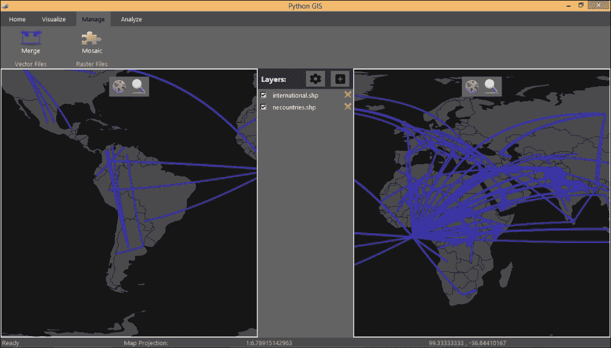

# 第八章. 展望未来

恭喜！您现在已经成为您自己的 GIS 应用程序的骄傲所有者；但并非真的如此。实际上，您只是开始了这段旅程。我们创建的应用程序仍然非常基础，尽管它具有一些核心基本功能，但还缺少许多其他功能。您可能也有一些想法和自定义设置想要自己实现。在我们让您自己去应对之前，在本章的最后，我们将探讨一些您可以继续前进的方法：

+   应该改进现有用户界面的区域

+   使用我们的工具包构建替代 GUI 布局的几点建议

+   向应用程序添加额外 GIS 功能的建议

+   如何在 Mac 和移动设备等额外平台上支持您的应用程序

# 改进用户界面

在本书中我们创建的应用程序中，我们试图给它一个现代且直观的设计。然而，由于我们必须在构建 GIS 内容的同时保持这种平衡，因此有几个用户界面方面我们没有能够解决。

## 保存和加载用户会话

我们通用用户界面中缺失的一个明显功能是没有保存或加载用户会话的方法。也就是说，保存当前加载图层的状态及其属性、图层顺序、通用地图选项、投影、缩放级别等，以便我们可以返回到之前使用的相同应用程序会话。**主页**标签将是一个放置加载和保存会话按钮的好地方，这个按钮也可以通过键盘快捷键 *Ctrl* + *O* 和 *Ctrl* + *S* 来调用。

为了保存这些设置，我们不得不想出一个文件格式规范以及一个可识别的文件名扩展名。例如，这可以是一个以 `.pgs` 结尾的简单 JSON 文本文件（如果您的应用程序名称是 Python GIS，那么这就是它的缩写），其中包含一个或多个选项字典。可以根据原始文件路径重新加载图层，也许还可以强制用户保存任何虚拟图层到文件中。

## 文件拖放

使用**添加图层**按钮添加数据图层是可行的，但有时每次都需要重复定位文件，尤其是如果它们位于多个位置的深层嵌套文件夹中。从已经打开的 Windows 文件夹拖放一系列文件到应用程序窗口通常是添加图层的一种更受欢迎的方式。目前，我们还没有在我们的应用程序中添加对此的支持，因为 Tkinter 没有内置的检测应用程序间拖放的功能。

### 注意

幸运的是，在 SourceForge 上存在一个名为 TkDND 的`Tk`扩展，您需要设置它：[`sourceforge.net/projects/tkdnd/`](http://sourceforge.net/projects/tkdnd/)。以下是在 StackOverflow 上发布的 Python 包装器，它应该可以让您在 Tkinter 应用程序中访问这个`Tk`扩展：[`stackoverflow.com/questions/14267900/python-drag-and-drop-explorer-files-to-tkinter-entry-widget`](http://stackoverflow.com/questions/14267900/python-drag-and-drop-explorer-files-to-tkinter-entry-widget)。

## GUI 小部件

我们在应用程序框架上投入了大量精力，用于调整和创建我们自己的自定义小部件模板，目的是为了小部件的样式化和代码重用性。随着您的前进，我建议进一步遵循这种逻辑，使其更容易构建和扩展用户界面。例如，在我们的`RunToolFrame`中，我们创建了一个方法，可以在该特定框架内添加常用的小部件组合。然而，为了使其更加灵活，您可以将这些组合变成独立的小部件类，这样您就可以在应用程序的任何地方放置它们。特别是，我建议为您的控件添加滚动条，这是我们当前应用程序所缺少的。

在更表面的层面上，尽管 Tkinter 通常看起来不错，尤其是在自定义样式下，但我们的一些应用程序小部件仍然显得有些不协调，比如下拉选择菜单。不过，通过一些样式实验，您应该能够改善其外观。或者，Python 2.7 及更高版本包含一个名为**ttk**的 Tkinter 扩展模块，它提供了许多新的下拉小部件，如 ComboBox。如果您选择切换到 ttk 小部件，请注意的唯一区别是，它们使用不同的方法进行样式化，这需要您对基于旧 Tkinter 的代码进行更改。

# 用户界面的其他变体

我们构建灵活的 GIS 相关小部件工具包的方法之美在于，它们可以以任何数量的方式使用、定位和组合，而不是将自己锁定在 GIS 的传统“图层面板-地图视图”布局中。例如，这里有一些创建不同类型 GIS 应用程序和布局的有用方式的有趣示例。

而不是仅仅一个地图的 GIS 应用程序，您可以将窗口分割成多个窗口，比如中间有一个图层面板的 2 个或 4 个地图。通过将每个地图连接到相同的图层组和图层面板，您定义的图层序列和符号化将影响所有地图，但您还可以拥有多个视角查看相同的数据，在不同的位置和缩放级别。参考以下截图：

或者，你不必在所有地方都拥有所有的小部件。你可以创建一个极简的仅地图应用程序，其中图层可以预先加载和/或以不同的或更隐蔽的方式进行管理。或者，你可以拥有一个更注重管理的应用程序，其中只包含图层面板和用于管理和组织文件的功能。

最后，请记住，我们所有的部件都是根据`app/toolkit/theme.py`模块中的颜色和字体说明进行样式化和轻松更改的。我们这样设计是有原因的，所以请充分利用它！

# 添加更多 GIS 功能

你可能希望将许多 GIS 功能添加到你的应用程序中。在许多现有的模块和库中，这里只是提供了一些建议，关于通常需要和可能做到的事情。更全面的列表可以在[www.pythongisresources.wordpress.com](http://www.pythongisresources.wordpress.com)或 Python 包索引网站上找到。

### 注意

对于一些这些工具的更深入实现，以及如何在 Python 中实现 GIS 应用程序的进一步阅读和想法，请参阅 Erik Westra 所著的*Python 地理空间开发 - 第二版*。

## 基本 GIS 选择

我们还有一些核心数据选择功能尚未实现。重要的是，这些包括基于数据查询对图层进行子集化，或基于区域边界框或与其他图层的重叠进行空间裁剪的能力。这两者都应该像遍历特征并仅保留来自属性查询或空间查询的匹配项一样简单。查看存储在矢量数据中的实际信息的能力也是我们目前所缺乏的，例如在表格中或在特征识别工具中，用户可以点击任何矢量特征或栅格单元并查看它们的属性或值。

## 更高级的可视化

目前，我们的应用程序在可视化数据方面不太灵活。矢量数据以单个随机颜色渲染所有特征，栅格数据以灰度或 RGB 渲染，没有更改的能力。然而，使用我们的 RunToolFrame 小部件，应该很容易将其打包到图层属性窗口中的**符号**选项卡中，并分配输入小部件和更新该图层`styleoptions`字典并重新绘制它的函数。

尽管如此，GIS 可视化的一个标志是我们也应该能够根据每个矢量特征的属性来改变这些颜色和大小，以便可视化模式。同样，我们需要能够根据其属性在特征上渲染文本来标记图层。最后，我们应该能够向地图添加制图元素，例如添加自定义标题、放置图例、比例尺和指向北方的箭头。这些都是你可以努力改进的一些非常激动人心的领域。

## 在线数据服务

对于我们的应用程序，我们构建了通过指向您计算机上的文件路径来加载数据的功能，这是在 GIS 中工作的传统方式。但是，直接从网络加载通用背景数据或定期更新的数据流，如卫星图像，变得越来越常见，这可以通过**开放地理空间联盟**（**OGC**）的 Web 服务接口标准实现。

在 Python 中，我推荐使用 OWSLib，它允许你访问各种在线服务和数据源，并且提供了很好的文档来学习更多关于它的信息。

### 注意

为了更具体的例子，看看 PyEarthquake 是如何使用 Web 服务检索实时地震数据的：

[`blog.christianperone.com/?p=1013`](http://blog.christianperone.com/?p=1013)

## 在栅格和矢量数据之间进行转换

将栅格网格转换为正方形多边形或中心点的矢量数据，以便进行更定制化的处理，或者将矢量数据转换为给定分辨率的栅格网格，这是经常需要的。这两种功能目前在我们的应用程序中缺失，但应该在现有的框架内实现起来既简单又实用。将矢量数据栅格化本质上等同于在图像上绘制它，因此你可以直接绘制到所需的栅格分辨率，使用 PIL 或 PyAgg。要将栅格数据矢量化，你可以遍历栅格的单元格，并在每个单元格的*x*和*y*坐标（或基于单元格边界框的多边形几何）处创建一个点几何。或者，你可以使用 GDAL，它已经具有栅格化和矢量化功能的函数。

## 投影

如目前所示，我们的应用程序可以处理和可视化定义在任何投影中的数据，但它不能在这些投影之间进行转换。所以如果有多个数据具有不同的投影，那么就没有办法正确地将它们定位或分析彼此之间的关系。幸运的是，PyProj 是一个基于 PROJ4 的优秀的、广泛使用的 Python 包，用于将坐标从一个投影转换为另一个投影，并且相当轻量级。有了这个，你可以添加定义和转换图层投影的工具，以及设置所有图层即时重投影到通用地图投影的工具。

最困难的部分是投影存储的格式种类繁多，例如 EPSG 代码、OGC URN 代码、ESRI WKT、OGC WKT、+proj 字符串和 GeoTIFF 定义，仅举几例。PyProj 要求将投影定义为+proj 字符串，因此挑战在于正确检测、解析和将文件存储的任何投影格式转换为+proj 格式。GDAL 是处理这些转换的最佳方式，或者如果你只期望接收 EPSG 等代码，可以使用[`www.spatialreference.org`](http://www.spatialreference.org)。

## 地理编码

今天，使用免费的在线搜索网站及其编程友好的 API，将地址和其他文本信息地理编码到坐标中相对容易。GeoPy 是一个 Python 包，它提供了访问众多在线地理编码服务的权限，例如 OpenStreetMap、Google、Bing 以及许多其他服务。这可以添加到你的应用程序中，既可以作为一个基于包含文本位置的字段的表地理编码的工具，也可以提供一个交互式地理编码搜索小部件，该小部件在地图上显示结果匹配项。

## 采用 GDAL/NumPy/SciPy 方案

如果你，在某个时刻，决定将 GDAL、NumPy 和 SciPy 添加为应用程序的依赖项，这将使你的应用程序增加大约 100 MB 的额外大小，但也将打开许多新的大门。例如，不同投影格式之间的转换问题将通过 GDAL 中提供的函数得到解决。添加 GDAL 和 NumPy 还将让你添加大量新的数据加载和保存功能，特别是通过 PyResample、RasterStats 和甚至通过 SMEAR 进行栅格插值等方法，打开栅格管理、分析和重采样的方法。对于矢量数据，它还将为 PySAL 或使用 PyCluster 的各种聚类算法提供更高级的空间统计和热点分析。Matplotlib 结合 Basemap 或 Cartopy 可能会提供你需要的所有视觉投影支持，而无需你做太多额外的工作。

# 扩展到其他平台

目前，我可以证实该应用程序在 Windows 7 上运行良好，甚至 Windows 8（特别是 MapView 的单点触摸导航特别有趣）。然而，在某个时刻，你可能会发现自己需要将你的 GIS 应用程序分享到除 Windows 之外的其他平台上。Python 和我们应用程序的大多数依赖项原则上都是跨平台的，我亲自测试过，我在本书中创建的应用程序框架在 Mac OS X 上也能运行，尽管安装说明略有不同。

当你完成应用程序的创建并准备分发它时，只需获取你想要支持的操作系统，安装必要的第三方库，然后复制并粘贴你的应用程序文件夹。如果应用程序在 Python 中运行良好，那么只需使用第七章中建议的操作系统打包库之一将其打包即可，第七章是“打包和分发你的应用程序”。

## 触摸设备

更时尚和令人兴奋的可能性是能够将你的应用移植到新一代的休闲平板电脑和其他移动触摸设备上。遗憾的是，我们当前的 Tkinter 用户界面方法无法打包用于或包含对 Android 或 iPhone 等手机或 iPad 等平板电脑的多点触控手势支持。如果你主要的目标受众是这些设备，你可能保留 GIS 处理引擎，但可能希望将用户界面切换到基于 Kivy 的界面，这是一个越来越受欢迎的新 GUI 包，它支持多点触控输入，据说还支持为 Android、iPhone 和 iPad 打包。如果你只想支持 iOS，那么 Pythonista 应用提供了一个 GUI 构建器，几个核心 Python 包如 PIL、NumPy 和 Matplotlib，访问 iOS 渲染引擎，甚至可以将你的应用打包成一个应用（尽管你仍然需要申请才能将其上传到苹果商店）。

# 摘要

我们在这本书的开始就寻求从头开始创建一个基本且轻量级的 GIS 应用。随着我们接近书尾，这正是我们所做的。基于一个相互链接的 Python 库底层代码库，我们有一个可分发的可视化用户界面应用，它可以执行基本的数据加载和保存、可视化、管理和空间数据分析。

至少，你已经了解了一些如何创建一个应用的方法。最好的部分在于，你可以完全控制对其进行调整、修改和进一步开发。如果你有特定的需求或者一个出色的自定义工作流应用的想法，只需查看可用的众多工具并自行构建。我非常兴奋地继续使用这个应用框架，并且特别好奇你将想出什么样的 GIS 应用。
