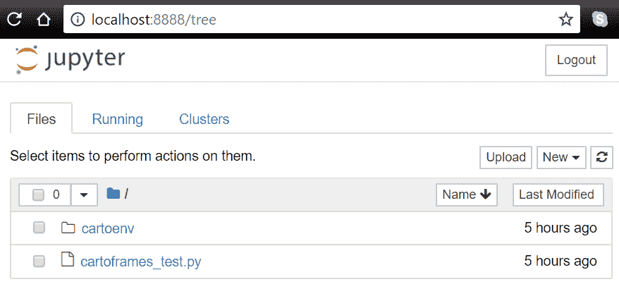
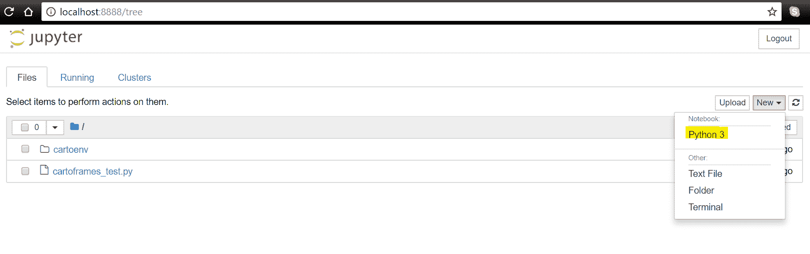

# 第一章：软件包安装和管理

本书专注于 Python 3 地理空间数据管理和分析的重要代码库。原因很简单——随着 Python 2 接近生命周期的尾声，它正迅速被 Python 3 所取代。这个新的 Python 版本在组织和语法上存在关键差异，这意味着开发者需要调整他们的遗留代码并在代码中应用新的语法。机器学习、数据科学和大数据等领域已经改变了今天地理空间数据的管理、分析和展示方式。在这些所有领域，Python 3 迅速成为新的标准，这也是地理空间社区开始使用 Python 3 的另一个原因。

地理空间社区长期以来一直依赖 Python 2，因为许多依赖项在 Python 3 中不可用或无法正确工作。但现在 Python 3 已经成熟稳定，地理空间社区已经利用了其功能，从而产生了许多新的库和工具。本书旨在帮助开发者理解用 Python 3 编写的地理空间程序的开放源代码和商业模块，提供了一系列主要的地理空间库和工具，用于地理空间数据管理和数据分析。

本章将解释如何安装和管理本书中使用的代码库。它将涵盖以下主题：

+   安装 Anaconda

+   使用 Anaconda Navigator、Anaconda Cloud、`conda`和`pip`管理 Python 包

+   使用 Anaconda、`conda`和`virtualenv`管理虚拟环境

+   运行 Jupyter Notebook

# 介绍 Anaconda

Anaconda 是 Python 编程语言的免费增值开源发行版，用于大规模数据处理、预测分析和科学计算，旨在简化包管理和部署。它也是世界上最受欢迎的 Python 数据科学平台，拥有超过 450 万用户和 1000 个数据科学包。它不应与`conda`混淆，`conda`是一个与 Anaconda 一起安装的包管理器。

对于本书，我们建议安装并使用 Anaconda，因为它为您提供了一切所需——Python 本身、Python 库、管理这些库的工具、Python 环境管理器以及 Jupyter Notebook 应用程序来编写、编辑和运行您的代码。您也可以选择使用 Anaconda 的替代品或通过[www.python.org/downloads](http://www.python.org/downloads)安装 Python，并使用您选择的任何 IDE 结合包管理器，如`pip`（在进一步讨论中涵盖）。我们建议使用 Python 版本 3.6。

# 使用 Anaconda 安装 Python

Continuum Analytics 的主页上提供了适用于 Windows、macOS 和 Linux 的 Anaconda 最新版本的免费下载。在撰写本文时，最新版本是 Anaconda 5.0.1，于 2017 年 10 月发布，提供 32 位和 64 位版本，可在 [`www.continuum.io/downloads`](https://www.continuum.io/downloads) 获取。此页面还提供了针对每个操作系统的详细下载说明、一个 30 分钟的教程，解释如何使用 Anaconda、一个入门指南，以及一个常见问题解答部分。还有一个名为 Miniconda 的 Anaconda 瘦身版，它仅安装 Python 和 `conda` 包管理器，不包括 Anaconda 标准安装中包含的 1000 多个软件包：[`conda.io/miniconda.html`](https://conda.io/miniconda.html)。如果您决定使用它，请确保下载 Python 3.6 版本。

Anaconda 将将 Python 3.6.2 作为默认的 Python 版本安装到您的机器上。本书所有章节中使用的 Python 版本是 Python 3.6，所以任何以 3.6 或更高版本开始的版本都适用。使用 Anaconda，您将获得 1000 多个 Python 包，以及一些应用程序，例如 Jupyter Notebook，以及各种 Python 控制台和 IDE。

请注意，您在安装后并不强制始终使用 Python 3.6 版本——使用 Anaconda Navigator（一个用于管理本地环境和安装包的 GUI），您还可以选择在虚拟环境中使用 Python 3.5 或 2.7。这为您在切换不同项目之间的不同 Python 版本提供了更多灵活性。

要开始安装，根据您的系统能力下载 32 位或 64 位 Anaconda 安装程序。打开安装程序，按照设置指南在您的本地系统上安装 Anaconda。

# 运行 Jupyter 笔记本

Jupyter 笔记本是 一个新颖的想法，已被许多公司（包括 Esri 和新的 ArcGIS API for Python）采用。由 Jupyter 项目管理，这是一个开源项目（基于 IPython，一个早期的交互式代码环境），是学习和生产环境中的绝佳工具。虽然代码也可以像其他章节中看到的那样作为脚本运行，但使用 Jupyter 笔记本会让编码变得更加有趣。

代码笔记本的想法是使编码交互式。通过将 Python 终端与代码运行产生的直接输出相结合，这些可保存的笔记本成为分享和比较代码的工具。每个部分都可以稍后编辑，或保存为用于演示目的的单独组件。

在此处查看 Jupyter 笔记本的文档：

[Jupyter.org 文档](http://jupyter.org/documentation)

# 运行笔记本

要启动为笔记本提供动力的本地服务器，激活虚拟环境并传递 `jupyter notebook` 命令：

```py
C:\PythonGeospatial3>cartoenv\Scripts\activate
(cartoenv) C:\PythonGeospatial3>jupyter notebook
[I 17:30:46.338 NotebookApp] Serving notebooks from local directory: C:\PythonGeospatial3
[I 17:30:46.338 NotebookApp] 0 active kernels
[I 17:30:46.339 NotebookApp] The Jupyter Notebook is running at:
[I 17:30:46.339 NotebookApp] http://localhost:8888/?token=5376ed8c704d0ead295a3c0464e52664e367094a9e74f70e
[I 17:30:46.339 NotebookApp] Use Control-C to stop this server and shut down all kernels (twice to skip confirmation).
[C 17:30:46.344 NotebookApp]

 Copy/paste this URL into your browser when you connect for the first time,
 to login with a token:
 http://localhost:8888/?token=5376ed8c704d0ead295a3c0464e52664e367094a9e74f70e
[I 17:30:46.450 NotebookApp] Accepting one-time-token-authenticated connection from ::1
[I 17:30:49.490 NotebookApp] Kernel started: 802159ef-3215-4b23-b77f-4715e574f09b
[I 17:30:50.532 NotebookApp] Adapting to protocol v5.1 for kernel 802159ef-3215-4b23-b77f-4715e574f09b
```

这将启动一个服务器，该服务器将为笔记本提供动力。这个本地服务器可以通过端口 `8888` 使用浏览器访问，通过导航到：`http://localhost:8888`。启动时应自动打开一个类似于这样的标签页：



如果你注销了，请使用在将 `jupyter notebook` 命令传递时生成的文本中提供的令牌来重新登录，如下例所示：

```py
http://localhost:8888/?token=5376ed8c704d0ead295a3c0464e52664e367094a9e74f70e
```

# 创建新的笔记本

要创建一个新的笔记本，请点击右上角的“新建”按钮，并在笔记本部分选择“Python 3”。它将在新标签页中打开笔记本：



# 添加代码

在 Jupyter 笔记本中，代码是在“输入”部分添加的。代码可以逐行添加，因为代码变量和导入的模块将被保存在内存中，或者可以以块/多行的方式添加，就像脚本一样。可以编辑和运行“输入”部分多次，或者可以将其保留不变，然后开始一个新的部分。这会创建脚本努力的记录，以及交互式输出的记录。

这里有一个 GIST，解释了 Jupyter 笔记本中许多有用的快捷键：

[`gist.github.com/kidpixo/f4318f8c8143adee5b40 `](https://gist.github.com/kidpixo/f4318f8c8143adee5b40)

# 管理 Python 包

安装 Anaconda 后，是时候讨论如何管理不同的 Python 包了。Anaconda 提供了几个选项来完成这项任务——Anaconda Navigator、Anaconda Cloud 和 `conda` 包管理器。

# 使用 Anaconda Navigator 管理包

安装 Anaconda 后，你将注意到一个包含各种应用程序的工作文件夹。其中之一是 Anaconda Navigator，它提供了一个 **图形用户界面**（**GUI**）。你可以将其与 Windows 文件资源管理器进行比较，即一个用于管理项目、包和环境的平台。术语 *环境* 指的是一组包和 Python 安装。请注意，这与使用 `virtualenv` 的方式类似，但这次是使用图形用户界面而不是命令提示符来创建它（`virtualenv` 在本章后面将更详细地介绍）。

打开 Anaconda Navigator 后，点击屏幕左侧的环境标签，Anaconda Navigator 将提供现有环境和其中包含的包的概览。有一个预定义的环境可供使用，这是一个所谓的根环境，它为您提供了 150 多个预安装的 Python 包。可以通过点击屏幕底部的创建按钮来创建新的环境。这将自动安装五个默认的 Python 包，包括 `pip`，这意味着您也可以自由地使用它进行包管理。Anaconda Navigator 的有趣之处在于，对于每个新的环境，您都可以选择一个首选的 Python 版本，如果您安装的是默认的 Anaconda 版本而不是 Miniconda，您可以从 1000 多个本地可用的包中进行选择。此列表可通过选择通道按钮旁边的下拉菜单中的“未安装”选项来获取。您可以通过使用搜索包字段并按 *Enter* 键来轻松搜索和选择您选择的包。标记包并为您选择的 环境 安装它们。安装后，包将以名称的形式列在环境中。如果您点击包名称旁边的带勾选标记的绿色框，您可以选择标记一个包进行升级、删除或特定版本安装。

安装完包后，您可以通过打开终端、Jupyter Notebook 或其他 Anaconda 应用程序来开始使用环境，只需在您选择的环境中的箭头按钮上单击一次鼠标即可。如果您希望使用 IDE 而不是 Anaconda Navigator 提供的选项之一，请确保将您的 IDE 重定向到 Anaconda 使用的正确 `python.exe` 文件。此文件通常位于以下路径，这是 Anaconda 的默认安装路径：

`C:\Users\<UserName>\Anaconda3\python.exe`。

# 使用 Anaconda Cloud 在线搜索包

如果您正在寻找的 Python 包不在本地可用的 Python 包列表中，您可以使用 Anaconda Cloud。此应用程序也是 Anaconda3 的一部分，您可以使用 Anaconda Cloud 应用程序与他人共享包、Notebooks 和环境。在点击 Anaconda Cloud 桌面图标后，将打开一个网页，您可以在其中注册成为注册用户。Anaconda Cloud 与 GitHub 类似，因为它允许您为您的个人工作创建一个私有在线仓库。这些仓库被称为 **channels**。

如果您创建了一个用户账户，您可以在 Anaconda Navigator 内部使用 Anaconda Cloud。在为 Anaconda Cloud 创建用户账户后，打开 Anaconda Navigator 并使用您的登录详细信息在屏幕右上角（显示为“登录到 Anaconda Cloud”）登录 Anaconda Cloud。现在，您可以将自己的包和文件上传到私有包仓库，并搜索现有的文件或包。

# 使用 conda 管理 Python 包

除了使用 Anaconda Navigator 和 Cloud 进行包管理外，您还可以使用`conda`，一个二进制包管理器，作为命令行工具来管理您的软件包安装。`conda`可以快速安装、运行和更新软件包及其依赖项。`conda`可以轻松创建、保存、加载并在您的本地计算机上切换环境。安装`conda`的最佳方式是通过安装 Anaconda 或 Miniconda。第三种选择是通过**Python Package Index**（**PyPI**）进行单独安装，但可能不是最新的，因此不建议选择此选项。

使用`conda`安装软件包非常简单，因为它与`pip`的语法相似。然而，了解`conda`不能直接从 Git 服务器安装软件包是有好处的。这意味着许多正在开发的软件包的最新版本无法使用`conda`下载。此外，`conda`并不像`pip`那样覆盖 PyPI 上所有可用的软件包，这就是为什么在创建 Anaconda Navigator 的新环境时您始终可以访问`pip`（关于`pip`的更多内容将在后续章节中介绍）。

您可以通过在终端中输入以下命令来验证是否已安装`conda`：

```py
>> conda -version
```

如果已安装，`conda`将显示您已安装的`版本`号。您可以使用以下终端命令安装您选择的软件包：

```py
>> conda install <package-name>
```

更新已安装的软件包到最新可用版本可以按照以下方式操作：

```py
>> conda update <package-name>
```

您还可以通过指定版本号来安装特定版本的软件包：

```py
>> conda install <package-name>=1.2.0
```

您可以通过使用`--all`参数简单地更新所有可用的软件包：

```py
>> conda update --all
```

您也可以卸载软件包：

```py
>> conda remove <package-name>
```

详细的`conda`文档可在以下网址找到：[`conda.io/docs/index.html`](https://conda.io/docs/index.html)。

# 使用 pip 管理 Python 软件包

如前所述，Anaconda 用户在每一个新环境中始终可以使用`pip`，以及`root`文件夹——它预安装在 Anaconda 的每个版本中，包括 Miniconda。由于`pip`是一个用于安装和管理用 Python 编写的软件包的 Python 包管理器，它运行在命令行中，而不是 Anaconda Navigator 和 Cloud。如果您决定不使用 Anaconda 或类似的产品，并使用来自[python.org](https://www.python.org/)的默认 Python 安装，您可以使用`easy_install`或`pip`作为包管理器。由于`pip`被视为对`easy_install`的改进，并且是 Python 3 的首选包管理器，因此我们在此仅讨论`pip`。建议在后续章节中使用`pip`、`conda`、Anaconda Navigator 或 Cloud 进行 Python 包管理。

可选地，当您安装 Anaconda 时，三个环境变量将被添加到您的用户变量列表中。这使您能够在打开终端的情况下从任何系统位置访问`pip`等命令。要检查您的系统上是否已安装`pip`，请打开终端并输入：

```py
>> pip
```

如果您没有收到任何错误信息，这意味着`pip`已正确安装，您可以使用`pip`通过以下方式从 PyPI 安装您选择的任何包：

```py
>> pip install <package-name>
```

对于 Anaconda 用户，`pip`命令文件应存储在以下路径：

`C:\Users\<用户名>\Anaconda3\Scripts\pip.exe`。

如果您的系统上没有`pip`，您可以通过以下链接提供的说明来安装`pip`：[`pip.pypa.io/en/latest/installing`](https://pip.pypa.io/en/latest/installing)。

# 使用 pip 升级和卸载包

与 Anaconda Cloud 自动显示已安装包的版本号不同，选择使用默认 Python 安装的用户可以使用`pip`通过以下命令显示它：

```py
>> import pandas
>> pandas.__version__ # output will be a version number, for example: u'0.18.1'
```

升级包，例如当您想使用新版本时，可以按照以下步骤进行：

```py
>> pip install -U pandas==0.21.0
```

将其升级到最新可用版本可以按照以下步骤进行：

```py
>> pip install -U pandas
```

使用以下命令可以卸载包：

```py
>> pip uninstall <package name>
```

# Python 虚拟环境

通常来说，使用 Python 的推荐方法是项目基础方法。这意味着每个项目使用一个单独的 Python 版本，以及所需的包及其相互依赖。这种方法让您能够在不同的 Python 版本和已安装的包版本之间切换。如果不遵循这种方法，每次您更新包或安装新包时，其依赖项也会更新，导致不同的设置。这可能会导致问题，例如，由于底层的变化而无法正确运行的代码，或者无法正确相互通信的包。虽然这本书主要关注 Python 3，但您不需要切换到不同的 Python 版本，但也许您可以想象为不同的项目使用相同包的不同版本。

在 Anaconda 之前，这种项目基础方法需要使用`virtualenv`工具来创建隔离的 Python 环境。随着 Anaconda 的出现，这种方法变得更加简单。这两种选项将在我们进一步讨论时详细介绍。

# 使用 Anaconda 的虚拟环境

如前所述，Anaconda Navigator 有一个名为“环境”的标签页，点击它将显示用户在本地文件系统上创建的所有本地环境的概览。您可以在这样的环境中轻松创建、导入、克隆或删除环境，指定首选的 Python 版本，并按版本号安装包。任何新的环境都将自动安装一些 Python 包，例如`pip`。从那里，您可以自由地安装更多包。这些环境与您使用`virtualenv`工具创建的虚拟环境完全相同。您可以通过打开终端或运行 Python 来开始使用它们，这会打开一个终端并运行`python.exe`。

Anaconda 将所有环境存储在一个单独的`root`文件夹中，将所有虚拟环境集中在一个地方。请注意，Anaconda Navigator 中的每个环境都被视为虚拟环境，即使是根环境。

# 使用 conda 管理环境

Anaconda 和 Miniconda 都提供了`conda`包管理器，它也可以用来管理虚拟环境。打开终端并使用以下命令列出系统上所有可用的环境：

```py
>> conda info -e
```

使用以下命令创建基于 Python 2.7 版本的虚拟环境：

```py
>> conda create -n python3packt python=2.7
```

按照以下步骤激活环境：

```py
>> activate python3packt
```

现在可以使用单个命令安装多个附加包：

```py
>> conda install -n python3packt <package-name1> <package-name2>
```

此命令直接调用`conda`。

按照以下步骤注销您正在工作的环境：

```py
>> deactivate
```

更多关于使用`conda`管理环境的信息，请参阅：[`conda.io/docs/user-guide/tasks/manage-environments.html`](https://conda.io/docs/user-guide/tasks/manage-environments.html)

# 使用 virtualenv 创建虚拟环境

如果您不想使用 Anaconda，则需要首先安装`virtualenv`。使用以下命令进行本地安装：

```py
>> pip install virtualenv
```

接下来，可以通过使用`virtualenv`命令并跟上新环境的名称来创建一个虚拟环境，例如：

```py
>> virtualenv python3packt
```

导航到具有相同名称的目录：

```py
>> cd python3packt
```

接下来，使用`activate`命令激活虚拟环境：

```py
>> activate
```

您的虚拟环境现在已准备好使用。使用`pip install`将包专门安装到该环境中，并在您的代码中使用它们。使用`deactivate`命令停止虚拟环境的工作：

```py
>> deactivate
```

如果您安装了多个 Python 版本，请使用`-p`参数与所需的 Python 版本或您选择的`python.exe`文件路径一起使用，例如：

```py
>> -p python2.7
```

您也可以这样做：

```py
>> -p c:\python34\python.exe
```

此步骤在创建虚拟环境之后，在安装所需包之前进行。有关`virtualenv`的更多信息，请参阅：[`virtualenv.readthedocs.io/en/stable`](http://virtualenv.readthedocs.io/en/stable)

# 摘要

这章介绍了如何安装和管理本书中将要使用的代码库。我们将主要使用 Anaconda，它是 Python 编程语言的免费增值开源发行版，旨在简化包管理和部署。我们讨论了如何安装 Anaconda，以及使用 Anaconda Navigator、Anaconda Cloud、`conda`和`pip`进行 Python 包管理的选项。最后，我们讨论了虚拟环境以及如何使用 Anaconda、`conda`和`virtualenv`来管理这些环境。

本书推荐的安装版本是 Anaconda3，它不仅会安装一个可工作的 Python 环境，还会安装一个庞大的本地 Python 包库、Jupyter Notebook 应用程序，以及`conda`包管理器、Anaconda Navigator 和云服务。在下一章中，我们将介绍用于处理和分析地理空间数据的主要代码库。
