# 第三章：地理空间数据库简介

在前面的章节中，你学习了如何设置你的 Python 环境，并了解了使用 Python 处理地理数据的不同库。在本章中，你将开始处理数据。

数据库提供了存储大量数据最受欢迎的方式之一，其中最受欢迎的开源数据库之一是 PostgreSQL。PostGIS 扩展了 PostgreSQL，增加了地理对象和空间查询记录的能力。当 PostgreSQL 和 PostGIS 结合使用时，它们创建了一个强大的地理数据存储库。

地理空间数据库通过允许你通过位置或通过数据库中其他特征的位置查询你的数据来改进基本的关系数据库查询。你还可以执行地理空间操作，如特征测量、特征之间的距离以及投影之间的转换。地理空间数据库的另一个特点是能够从现有特征创建新的几何形状，例如通过缓冲区、并集或裁剪操作。

本章将介绍地理空间数据库的基础知识。在本章中，你将学习：

+   如何安装 PostgreSQL 和 PostGIS

+   如何安装和使用 `pyscopg2` 连接到数据库

+   如何向数据库添加数据

+   如何执行基本的空间查询

+   如何查询长度和面积

+   如何查询多边形内的点

在 第七章，*使用地理数据库进行地理处理* 中，我们将回到地理空间数据库，你将学习更高级的操作以及如何显示你的数据。

# 在 Windows 上安装 PostgreSQL 和 PostGIS

你可以通过安装 PostgreSQL 然后安装 PostGIS，或者安装 PostgreSQL 然后使用随 PostgreSQL 一起提供的 Stack Builder 来添加 PostGIS。使用 Stack Builder 允许你下载所需的 PostgreSQL 版本，并单击一次即可获取正确的 PostGIS 版本。

当我安装 PostgreSQL 10 时，Stack Builder 没有包含 PostGIS。到出版时，这应该已经添加了。截图可能显示不同的 PostGIS 版本，因为我使用了一个旧的 PostgreSQL 复制来展示 Stack Builder 将如何工作。您可以从 [`www.postgresql.org/download/`](https://www.postgresql.org/download/) 下载 PostgreSQL。

随着我们继续前进，我将指导你安装 PostgreSQL，然后使用 Stack Builder 添加 PostGIS 和数据库。下载可执行文件后，双击它。你将看到以下向导：

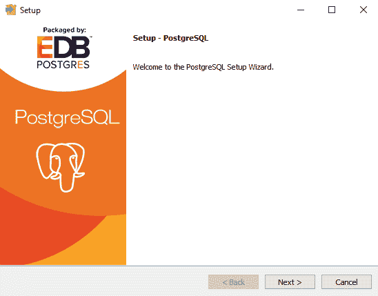

你可以选择安装 PostgreSQL 的位置，但除非你有特定的理由将其放置在其他位置，否则最好将其保留为默认设置：

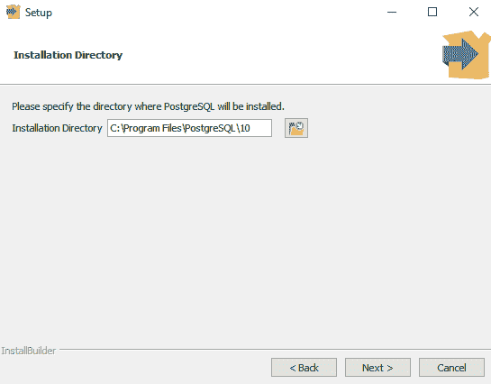

再次强调，最好将数据存储在默认位置，即与 PostgreSQL 安装相同的根文件夹：

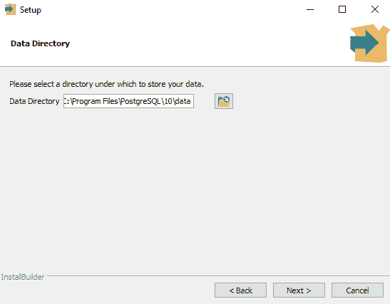

选择你想要运行 PostgreSQL 的端口。应用程序将期望在这个端口上找到 PostgreSQL，所以请自行承担更改端口的风险。更高级的用户可以在安装后修改`.config`文件中的端口通道配置：

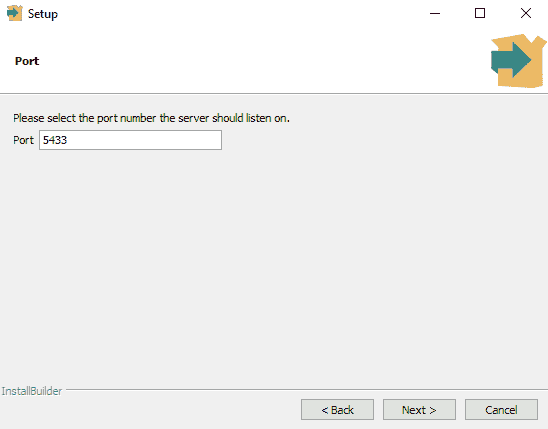

选择你的区域设置，或者选择默认设置。我选择了英语，美国：

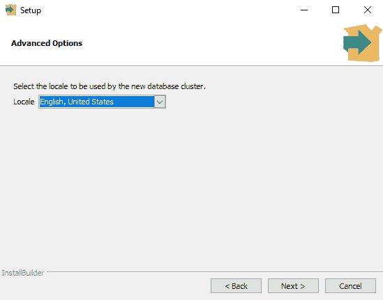

这里你将看到启动 Stack Builder 的选项，从那里你可以安装 PostGIS。勾选复选框开始安装。在较新的系统上，安装应该只需要几分钟：

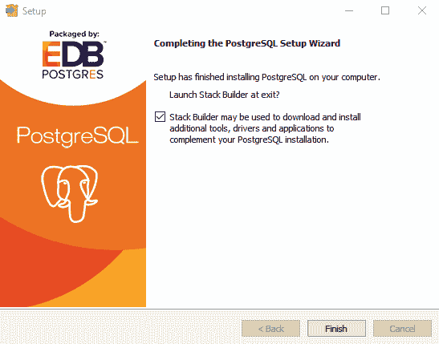

PostgreSQL 安装已完成，Stack Builder 现在应该已经打开。在空间扩展部分，选择 PostGIS 32 位或 64 位的正确版本。请注意，它是一个捆绑包，包括其他包，如`pgRouting`：


现在，PostGIS 的安装向导将启动。你必须同意许可协议：


你可以随时创建数据库，本章将向你展示如何操作，但是，最好现在就检查创建空间数据库框并处理它。如果你这样做，一旦 PostGIS 安装完成，你的数据库将设置好并准备好使用：


PostGIS 将尝试在 PostgreSQL 安装的位置安装：

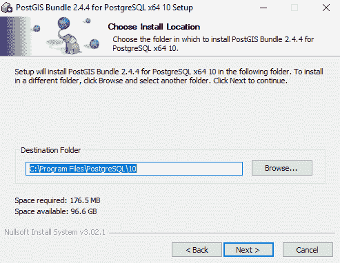

输入数据库的用户名、密码和端口。本章中的示例将使用`postgres`（用户名）和`postgres`（密码）。如果你选择不同的用户名和密码组合，请记住它。在生产环境中，最好不使用默认的用户名和密码，因为它们众所周知，会使你容易受到黑客攻击：

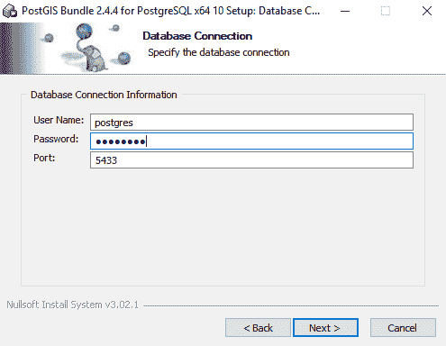

输入数据库名称。我们将要查看的示例将使用`pythonspatial`作为数据库名称。你将只使用该名称进行初始连接。示例中的 SQL 查询将使用表名：

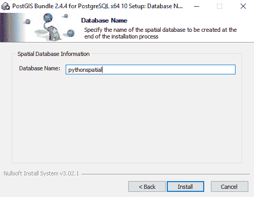

# 在 Mac 上安装 PostgreSQL 和 PostGIS

在 Mac 上安装 PostgreSQL 和 PostGIS，你可以使用`Postgres.app`。你可以从[`postgresapp.com/`](http://postgresapp.com/)下载文件。文件下载完成后，将其移动到`applications`文件夹，并双击它。点击初始化。你将有一个在`localhost:5432`的服务器。用户名和数据库名与你的 Mac 用户名相同。没有密码。

然后，你应该能够使用`psql`命令创建一个新的数据库并启用 PostGIS。

# 使用 Python 与 PostgreSQL 和 PostGIS 协同工作

要在 Python 中使用`psycopg2`库连接和操作您的 PostgreSQL 数据库，您需要一个辅助库。`psycopg2`就是那个库。它提供了一个官方`libpq`客户端库的包装。在本节中，我们将介绍如何安装该库、如何连接到数据库以及如何添加表和执行基本的空间查询。

# 使用 psycopg2 连接到 PostgreSQL

`psycopg2`是 Python 中处理 PostgreSQL 最流行的库。它完全实现了 Python DB API 2.0 规范，并且与 Python 3 兼容。在接下来的章节中，您将学习如何安装库、建立连接、执行查询和读取结果。您可以在此处阅读完整的文档：[`initd.org/psycopg/docs/`](http://initd.org/psycopg/docs/)

# 安装 psycopg2

安装大多数 Python 库需要您打开控制台并输入：

```py
pip install psycopg2
```

如果这不起作用，并且您使用的是 Anaconda Python 发行版，您可以使用`conda`命令，如下所示：

```py
conda install -c anaconda psycopg2
```

大多数 Python 库都可以使用以下方式下载和安装：

```py
python setup.py install
```

由于`psycopg2`比这更高级，并且需要您拥有 C 编译器、Python 头文件、`libpq`头文件和`pg_config`程序。如果您需要从源代码安装`psycopg2`，说明链接位于以下提示框中。

要从源代码安装`psycopg2`，说明位于：[`initd.org/psycopg/docs/install.html#install-from-source`](http://initd.org/psycopg/docs/install.html#install-from-source)

# 连接到数据库并创建一个表

您应该在安装 PostGIS 时创建数据库。对于以下提到的示例，我们将使用此数据库。

如果您在安装 PostGIS 时没有创建数据库，您可以使用终端（Windows 中的命令提示符）和以下命令创建：

```py
createdb -U postgres pythonspatial
 psql -U postgres -d pythonspatial -c "CREATE EXTENSION postgis;" 
```

您可能需要修改您的路径。在 Windows 上，执行此操作的命令如下所示：

```py
set PATH=%PATH%;C:\Program Files\PostgreSQL\10\bin
```

要连接到您的数据库，请使用以下代码：

```py
import psycopg2

connection = psycopg2.connect(database="pythonspatial",user="postgres", password="postgres")

cursor = connection.cursor()

cursor.execute("CREATE TABLE art_pieces (id SERIAL PRIMARY KEY, code VARCHAR(255), location GEOMETRY)")

connection.commit()
```

之前提到的代码首先通过导入`psycopg2`开始。然后使用`connect()`函数并通过传递数据库名称、`user`和`password`参数来建立连接。然后创建一个`cursor`，允许您与数据库通信。您可以使用`cursor`的`execute()`方法通过字符串形式的 SQL 语句创建表。

该代码执行一个 SQL 命令，创建一个名为`art_pieces`的表，其中`id`的类型为`SERIAL`，并使其成为`PRIMARY KEY`，`code`的类型为`VARCHAR`，长度为`255`，`location`的类型为`GEOMETRY`。`SERIAL PRIMARY KEY`告诉 PostgreSQL 我们想要一个自动递增的唯一标识符。您也可以使用`BIGSERIAL`类型。另一种不同的类型是`location`的`GEOMETRY`类型。这是将存储我们记录地理部分的列。

最后，您 `commit()` 以确保更改已保存。您也可以在完成时 `close()`，但我们将继续前进。

# 向表中添加数据

在上一节中，我们创建了一个表。在本节中，您将从开放数据网站抓取数据并将其放入您的表中，以便您可以在下一节中进行查询。

大多数城市都有开放数据网站和门户。阿尔伯克基市有几个带有空间数据的 ArcServer 端点。以下代码将使用 `requests` Python 库抓取公共艺术数据，然后使用 `psycopg2` 将其发送到 PostgreSQL 数据库，`pythonspatial`：

```py
import requests

url='http://coagisweb.cabq.gov/arcgis/rest/services/public/PublicArt/MapServer/0/query'

params={"where":"1=1","outFields":"*","outSR":"4326","f":"json"}

r=requests.get(url,params=params)

data=r.json()

data["features"][0]
```

我们之前提到的代码导入 `requests`，然后，使用 ArcServer 端点的 URL，它抓取了查询所有数据（`where:1=1`）和所有字段（outFields:`*`）在 **世界大地测量系统**（**WGS**） **84**（`outSR:4326`）的结果，并将其作为 JSON（`f:json`）返回。

ArcServer 是由 **环境系统研究学院**（**ESRI**）制作的 GIS 服务器。它提供了一种使用 API 提供 GIS 数据并返回 JSON 的方式。许多政府机构将有一个开放数据门户，该门户利用 ArcServer 来提供数据。

结果被加载到 `data` 变量中。每个记录都在数组 `features`（`data["features"][n]`）中。单个记录 `data["features"][0]` 如下所示：

```py
{'attributes': {'ADDRESS': '4440 Osuna NE',
 'ARTIST': 'David Anderson',
 'ART_CODE': '101',
 'IMAGE_URL': 'http://www.flickr.com/photos/abqpublicart/6831137393/',
 'JPG_URL': 'http://farm8.staticflickr.com/7153/6831137393_fa38634fd7_m.jpg',
 'LOCATION': 'Osuna Median bet.Jefferson/ W.Frontage Rd',
 'OBJECTID': 951737,
 'TITLE': 'Almond Blossom/Astronomy',
 'TYPE': 'public sculpture',
 'X': -106.5918383,
 'Y': 35.1555,
 'YEAR': '1986'},
 'geometry': {'x': -106.59183830022498, 'y': 35.155500000061544}}
```

使用 `data`，您将遍历 `features` 数组，将 `ART_CODE` 作为 `code` 插入，并为每个点创建一个 **已知文本**（**WKT**）表示。

要了解更多关于 WKT 的信息，您可以在其维基百科条目中阅读：[`en.wikipedia.org/wiki/Well-known_text`](https://en.wikipedia.org/wiki/Well-known_text)

以下代码展示了如何插入数据：

```py
for a in data["features"]:
    code=a["attributes"]["ART_CODE"]
    wkt="POINT("+str(a["geometry"]["x"])+" "+str(a["geometry"]        ["y"])+")"
    if a["geometry"]["x"]=='NaN':
        pass
    else:
        cursor.execute("INSERT INTO art_pieces (code, location)             VALUES ({},
        ST_GeomFromText('{}'))".format(code, wkt))
connection.commit()
```

上述代码遍历每个要素。它将 `ART_CODE` 分配给 `code`，然后构建 WKT `(Point(-106.5918 35.1555))`，并将其分配给 `wkt`。代码使用 `ART_CODE` 来展示如何将其他属性加载到数据库中。

数据几乎永远不会干净完美。这些数据也不例外。为了防止在 `x` 坐标缺失时崩溃，我添加了一个 `if`*，* `else` 语句来跳过缺失的数据。这个概念被称为 **错误处理**，在构建 `requests` 时是一种最佳实践。`else` 语句是数据被插入的地方。使用 `cursor.execute()`，您可以构建 SQL 查询。

查询将 `art_pieces` 以及 `code` 和 `location` 字段与值一起插入到数据库中。对于 `code` 的第一个值是一个占位符 `{}`。对于 `location` 的第二个值是几何形状，我们将其存储为 WKT。因此，它使用 `ST_GeomFromText()` 函数和一个占位符 `{}` 插入。

`format()` 方法是您传递变量以填充占位符的地方——`code`，`wkt`。以下代码展示了当占位符被填充时查询将看起来是什么样子：

```py
INSERT INTO art_pieces (code, location) VALUES (101, ST_GeomFromText('Point(-106.5918 35.1555)'))
```

在之前提到的代码中，你通过连接字符串创建了 WKT。这可以通过使用 Shapely 库以更简洁和更 Pythonic 的方式完成。

# Shapely

Shapely 可以通过以下方式安装：

```py
pip install shapely
```

或者使用 `conda`：

```py
conda install -c scitools shapely
```

Shapely 使得创建和使用几何形状的任务更加容易，并使你的代码更加简洁。在之前的代码中，你通过连接一个字符串来创建一个点的 WKT 表示。使用 Shapely，你可以创建一个点并将其转换为 WKT。以下代码展示了如何操作：

```py
from shapely.geometry import Point, MultiPoint

thepoints=[]

for a in data["features"]:
    code=a["attributes"]["ART_CODE"]
    p=Point(float(a["geometry"]["x"]),float(a["geometry"]["y"]))
    thepoints.append(p)
    if a["geometry"]["x"]=='NaN':
        pass
    else:
        cursor.execute("INSERT INTO art_pieces (code, location)             VALUES ('{}',
        ST_GeomFromText('{}'))".format(code, p.wkt))
connection.commit()
```

之前的代码从 `shapely.geometry` 中导入了 `Point` 和 `MultiPoint`。代码与上一个版本相同，直到加粗的行。在 Shapely 中创建一个点，你使用 `Point(x,y)`。它将所有点放入一个名为 `thepoints` 的数组中，以便在 Jupyter Notebook 中绘制，以下是一个图像。最后，SQL 语句将 `p.wkt` 传递给 `ST_GeomFromText()`。

在 Jupyter Notebook 中，你只需输入包含几何形状的变量的名称即可打印 Shapely 几何形状，它将自动绘制。公共 `art` 点存储在变量 `thepoints` 中*。可以使用点的数组创建一个 `MultiPoint`，打印它们将绘制以下图像：

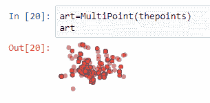

# 查询数据

你创建了一个表，为代码和位置添加了列，并使用来自另一个源的数据填充了它。现在，你将学习如何查询数据并将其从数据库中导出。

虽然你可以使用空间 SQL 查询，但你总是可以像选择非空间启用数据库中的数据一样选择数据，这样你就可以像以下那样使用它：

```py
SELECT * FROM table
```

以下代码展示了通用的 `SELECT` 全查询及其结果：

```py
cursor.execute("SELECT * from art_pieces")
data=cursor.fetchall()
data
```

结果应该如下所示：

```py

 [(1, '101', '010100000025FFBFADE0A55AC06A658B6CE7934140'),
 (2, '102', '0101000000CC4E16E181AA5AC0D99F67B3EA8B4140'),
 .......,]
```

第一个数字，`1`、`2`、n，是 `id`（`SERIAL PRIMARY KEY`）。接下来是 `code`。几何形状是最后一列。看起来像是随机数字和字母的字符串是一个 **已知的二进制**（**WKB**）的十六进制表示。

要转换 WKB，你使用 `shapely`。以下代码将指导你如何将 WKB 转换为 `shapely` 的 `Point`，然后打印 WKT：

```py
from shapely.wkb import loads
aPoint=loads(data[0][2],hex=True)
aPoint.wkt
```

之前的代码从 `shapely.wkb` 中导入了 `loads()` 方法。你必须添加 `hex` 参数并将其设置为 `True`，否则你会收到错误。要获取第一条记录的地理列，你可以使用 `data[0][2]`，其中 `[0]` 是记录，`[2]` 是列。现在你有了 `shapely` 的 `Point`，你可以通过使用 `type(aPoint)` 来验证它，你可以使用 `aPoint.wkt` 来打印它。你应该看到以下结果：

```py
POINT (-106.591838300225 35.15550000006154)
```

如果你想让 PostgreSQL 返回 WKB 格式的数据而不包含十六进制，你可以使用 `ST_AsBinary()` 来实现。以下代码展示了如何操作：

```py
cursor.execute("SELECT id,code,ST_AsBinary(location) from art_pieces")
data=cursor.fetchall()
data[0][2]
from shapely.wkb import loads
pNoHex=loads(bytes(data[0][2]))
pNoHex.wkt
```

之前的代码使用 `ST_AsBinary()` 包裹了位置。要将结果加载到 `shapely` 的 `Point` 中，你必须使用 `bytes()`。然后，你可以使用 `pNoHex.wkt` 来查看 WKT。你应该看到与上一个示例中相同的点。

二进制可能很有用，但您也可以查询数据并将几何作为 WKT 返回：

```py
cursor.execute("SELECT code, ST_AsText(location) from art_pieces")
data = cursor.fetchone()
```

之前的代码使用 `ST_AsText(geometry column)` 将数据作为 WKT 返回。您可以使用 `ST_AsText()` 在任何时候返回包含几何的列。代码使用 `fetchone()` 而不是 `fetchall()` 来获取单个记录。您应该看到以下单个记录：

```py
('101', 'POINT(-106.591838300225 35.1555000000615)')
```

您可以使用 `loads()` 将 WKT 载入 `shapely` 的 `Point`，但您需要先导入它，就像您之前导入 WKB 一样：

```py
from shapely.wkt import loads
pb=loads(data[1])
pb.coords[:]
```

之前的代码从 `shapely` 导入 `loads`——但这次使用 `shapely.wkt` 而不是 `wkb`。否则，您将以与之前示例相同的方式加载数据。您可以使用 `pb.coords[:]` 查看坐标，或者使用 `pb.x` 和 `pb.y` 单独查看它们。

`pb.coords[:]` 的结果将是一对坐标，如下所示：

```py
[(-106.591838300225, 35.1555000000615)]
```

# 改变坐标参考系统

数据库中的数据使用 **世界大地测量系统 84** （**WGS 84**）的纬度和经度。如果您需要将数据输出到 **欧洲石油调查组** （**EPSG**） 3857，您可以使用 `ST_Transform()` 在查询中更改空间参考。以下代码通过使用 PostGIS 函数展示了如何操作：

```py
cursor.execute("SELECT UpdateGeometrySRID('art_pieces','location',4326)")
cursor.execute("SELECT Find_SRID('public','art_pieces','location')")
cursor.fetchall()
```

之前的代码对数据库进行了两次查询：

+   首先，它使用 `UpdateGeomtrySRID()` 将空间参考系统标识符分配给表中的几何列。这是因为点被放入表中而没有任何 `SRID` 的参考。因此，当我们尝试使用不同的坐标参考系统获取结果时，数据库将不知道如何转换我们的坐标。

+   其次，代码查询数据库以告诉我们表中的几何列的 `SRID` 使用 `Find_SRID()`。如果您没有正确添加几何列，该函数将失败。

现在您已经在表中的列上设置了 `SRID`，您可以查询数据并转换它：

```py
cursor.execute("SELECT code, ST_AsTexT(ST_Transform(location,3857)) from art_pieces")
cursor.fetchone()
```

之前的代码是一个基本的 `select code` 和 `location` 作为文本从 `art_pieces` 中选择，但现在有一个 `ST_Transform` 方法。该方法接受具有几何的列和您希望数据返回的 `SRID`。现在，使用 `3857` 返回 `(-106.59, 35.155)` 的艺术品，如下所示，并显示转换后的坐标：

```py
('101', 'POINT(-11865749.1623 4185033.1034)')
```

# 缓冲区

空间数据库允许您存储空间数据，但您还可以对数据进行操作并获取不同的几何结果。这些操作中最常见的是缓冲区。您有一个点表，但使用 `ST_Buffer()`，您可以要求数据库返回一个具有指定半径的点周围的多边形。以下代码展示了如何操作：

```py
cursor.execute("SELECT ST_AsText(ST_Buffer(a.location,25.00,'quad_segs=2')) from pieces a WHERE a.code='101'")

cursor.fetchall()
```

之前的代码从表中抓取了一个记录，其中艺术代码字段等于 `101`，并选择了一个半径为 `25` 的 `location` 缓冲区。结果将是一个多边形，如下所示：

当使用地理信息时，如果缓冲区很大，位于两个 UTM 区之间，或者穿过日界线，它可能会出现意外的行为。

```py

 'POLYGON((-106.591563918525 35.1555036055616,-106.591568334295 35.1554595740463,-106.59158312469 35.1554170960907,...,-106.591570047094 35.155547498531,-106.591563918525 35.1555036055616))'
```

如果你使用以下代码将多边形加载到 `shapely` 中，Jupyter Notebook 将绘制多边形：

```py
from shapely.geometry import Polygon
from shapely.wkt import loads
buff=loads(data[0][0])
buff
```

`ST_Buffer` 返回的 `shapely` 多边形如下所示：

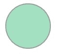

你也可以向 `ST_Buffer` 传递一个参数来指定绘制四分之一圆所使用的段数。如果你将圆分成四个象限，`quad_segs` 参数将在每个象限中绘制这么多段。`quad_seg` 的值为 1 将绘制一个旋转的正方形，如下所示：


而 `quad_seg` 的值为 2 将绘制一个八边形，如下所示：


# 距离和邻近

在前面的部分，你让数据库缓冲一个点并返回多边形。在本节中，你将学习如何查询数据库以获取两点之间的距离，并且你将查询数据库并让它根据与指定点的距离返回记录。

PostGIS 的距离函数是 `ST_Distance(a,b)`。你可以将 `a` 和 `b` 作为几何图形或地理图形传递。作为地理图形，结果将以米为单位返回。以下代码将获取数据库中两点之间的距离：

```py
cursor.execute("SELECT ST_Distance(a.location::geography,b.location::geography) FROM art_pieces a, art_pieces b where a.name='101' AND b.name='102'")
dist=cursor.fetchall()
dist
```

之前的代码执行了 `ST_Distance()` 的 SQL 查询，传递了 `a` 和 `b` 记录的 `location` 列，其中代码等于 `101` 和 `102`。`::geography` 是在 PostGIS 中将几何图形转换为地理图形的方法。它们相距多远？它们相距 9,560.45428363 米。

要将其转换为英里，请使用：`dist[0][0]*0.00062137`，这使得它们相距 5.940 英里。

在前面的例子中，你使用了数据库中的两个点，但你也可以像以下代码一样传递一个硬编码的点：

```py
cursor.execute("SELECT ST_Distance(a.location::geography,
               ST_GeometryFromText('POINT(-106.5 35.1)')::geography) 
               FROM art_pieces a where a.name='101'")

cursor.fetchall()
```

之前的代码是相同的查询，但这次你用硬编码的 WKT 点替换了点 `b` (`code=102`)。查询的结果应该声明这些点相距 10,391.40637117 米。

并且，就像之前的例子一样，你也可以使用 `shapely` 传递点的 WKT，如下面的代码所示：

```py
from shapely.geometry import Point
p=Point(-106.5,35.1)
cursor.execute("SELECT ST_Distance(a.location::geography,
                ST_GeometryFromText('{}')::geography) 
                FROM art_pieces a where a.name='101'".format(p.wkt))
cursor.fetchall()
```

之前的代码在 `shapely` 中创建点，然后使用 `format(p.wkt)` 将 WKT 传递到 `{}` 占位符。

你可以获取两点之间的距离，但如果你想要多个点与另一个点的距离呢？为此，你可以移除 `a.location` 并仅使用 `location` 作为第一个点。以下代码将返回五个点及其与指定点的距离：

```py
cursor.execute("SELECT code, ST_Distance(location::geography,
                ST_GeometryFromText('POINT(-106.591838300225
                35.1555000000615)')::geography) 
                as d from art_pieces LIMIT 5")
cursor.fetchall()
```

结果应该看起来像显示距离（米）的数据：

```py
[('101', 0.0),
 ('102', 9560.45428362),
 ('104', 4741.8711304),
 ('105', 9871.8424894),
 ('106', 7907.8263995)]
```

数据库返回了表中前五个点的代码和与指定点的距离。如果你移除 `LIMIT`，你将得到所有点。

通过添加 `ORDER BY` 子句和 k-最近邻运算符，你可以扩展这个查询以获取指定点的最近五个点。看看以下代码：

```py
cursor.execute("SELECT code, ST_Distance(location::geography,
                ST_GeometryFromText('POINT(-106.591838300225
                35.1555000000615)')::geography) as d from art_pieces 
                ORDER BY location<-                                                                
                >ST_GeometryFromText('POINT(-106.591838300225 
                35.1555000000615)') LIMIT 5")
cursor.fetchall()
```

之前代码中的关键元素是符号 `*<->*`。这是 k-最近邻运算符。它返回两个几何体之间的距离。使用 `ORDER BY location <-> ST_GeometryFromText()`，你指定了两个几何体。由于你设置了 `LIMIT` 为 `5`，数据库将返回与指定点最近的 `5` 个点——包括起点。结果应该看起来像以下点：

```py
[('101', 0.0),
 ('614', 1398.08905864),
 ('492', 2384.97632735),
 ('570', 3473.81914218),
 ('147', 3485.71207698)]
```

注意代码值不是 `101`-`106` 或数据库中的前五个，并且距离从 `0.0` 开始增加。最近的点，代码 `101`，是你查询中指定的点，因此它距离 `0.0` 米。

# 数据库中的线

本章的第一部分重点介绍了点操作。现在，我们将把注意力转向线。对于以下示例，你将创建一个新的表并插入三条线。以下代码将完成这个任务：

```py
from shapely.geometry import LineString
from shapely.geometry import MultiLineString

connection = psycopg2.connect(database="pythonspatial",user="postgres",    
    password="postgres")

cursor = c.cursor()
cursor.execute("CREATE TABLE lines (id SERIAL PRIMARY KEY, location GEOMETRY)")
thelines=[]
thelines.append(LineString([(-106.635585,35.086972),(-106.621294,35.124997)]))
thelines.append(LineString([(-106.498309,35.140108),(-106.497010,35.069488)]))
thelines.append(LineString([(-106.663878,35.106459),(-106.586506,35.103979)]))

mls=MultiLineString([((-106.635585,35.086972),(-106.621294,35.124997)),((-106.498309,35.140108),(-106.497010,35.069488)),((-106.663878,35.106459),(-106.586506,35.103979))])

for a in thelines:
    cursor.execute("INSERT INTO lines (location) VALUES  
                (ST_GeomFromText('{}'))".format(a.wkt))
connection.commit()
```

之前的代码应该很熟悉。它首先连接到 Python 空间数据库，获取一个 `cursor`，然后创建一个包含 `id` 和 `geometry` 类型位置的表。你应该导入 `shapely LineString` 和 `MultiLine`，`MultiLine` 是为了你可以在 Jupyter notebook 中打印出这些线。你应该创建一个 `lines` 的数组，然后遍历它们，使用 `cursor` 将每个插入到表中。然后你可以 `commit()` 这些更改。

要查看是否已将行添加到数据库中，你可以执行以下代码：

```py
cursor.execute("SELECT id, ST_AsTexT(location) from lines")
data=cursor.fetchall()
data
```

之前的代码在新的表上执行了一个基本的 `SELECT` 语句。结果集应该有三条记录，如下所示：

```py
[(1, 'LINESTRING(-106.635585 35.086972,-106.621294 35.124997)'),
 (2, 'LINESTRING(-106.498309 35.140108,-106.49701 35.069488)'),
 (3, 'LINESTRING(-106.663878 35.106459,-106.586506 35.103979)')]
```

如果你打印 `mls` 变量（在早期代码中持有多线字符串的变量），你可以看到以下图像中显示的线：

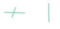

现在你已经有一个包含几条线的数据库表，你可以继续测量它们并找出它们是否相交。

# 线的长度

点没有长度，如果它们相交，它们有相同的坐标。然而，线有长度，并且可以在表中未指定的点上相交，或者在创建线的两个点之间。

以下代码将返回所有 `lines` 的长度：

```py
cu.execute("SELECT id, ST_Length(location::geography) FROM lines ")
cu.fetchall()
```

之前的代码使用了 `ST_Length` 函数。该函数将接受几何体和地理体。在这个例子中，使用了 `::geography` 将几何体转换，以便返回米。

结果如下：

```py
[(1, 4415.21026808109),
 (2, 7835.65405408195),
 (3, 7059.45840502359)]
```

你可以在之前的查询中添加一个 `ORDER BY` 子句，数据库将按从短到长的顺序返回 `lines`。以下代码添加了该子句：

```py
cu.execute("SELECT id, ST_Length(location::geography) 
            FROM lines ORDER BY ST_Length(location::geography)")
cu.fetchall()
```

添加 `ORDER BY` 将返回记录，交换 `2` 和 `3` 的位置，如下所示：

```py
[(1, 4415.21026808109),
 (3, 7059.45840502359),
 (2, 7835.65405408195)]
```

# 相交的线

你知道`lines`的长度，通过在 Jupyter Notebook 中绘制`lines`，你知道`lines 1`和`lines 3`相交。在 PostGIS 中，你可以使用`ST_Intersects()`函数，传递几何体或地理体。数据库将返回`true`或`false`。

以下代码将在`lines 1`和`lines 3`上执行查询并返回`True`：

```py
cu.execute("SELECT ST_Intersects(l.location::geography,ll.location::geometry)
            FROM lines l, lines ll WHERE l.id=1 AND ll.id=3")
cu.fetchall()
```

之前的代码将返回`True`，因为`lines 1`和`lines 3`相交。但它们在哪里相交？使用`ST_Intersection()`将返回两条`线`相遇的点：

```py
cu.execute("SELECT ST_AsText(ST_Intersection(l.location::geography,
            ll.location::geometry)) FROM lines l, lines ll 
            WHERE l.id=1 AND ll.id=3")
cu.fetchall()
```

通过从`ST_Intersects`切换到`ST_Intersection`，你将得到两条`线`之间的接触点。该点如下：

```py
[('POINT(-106.628684465508 35.1053370957485)',)]
```

# 数据库中的多边形

你也可以使用 PostGIS 存储多边形。以下代码将创建一个包含单个多边形的新表：

```py
from shapely.geometry import Polygon

connection = psycopg2.connect(database="pythonspatial",user="postgres", password="postgres")
cursor = conectionn.cursor()
cursor.execute("CREATE TABLE poly (id SERIAL PRIMARY KEY, location GEOMETRY)")
a=Polygon([(-106.936763,35.958191),(-106.944385,35.239293),
           (-106.452396,35.281908),(-106.407844,35.948708)])
cursor.execute("INSERT INTO poly (location) 
             VALUES (ST_GeomFromText('{}'))".format(a.wkt))
connection.commit()
```

之前的代码几乎与`Point`和`Line`示例相同。建立数据库连接，然后获取一个`cursor`。使用`execute()`创建表。导入`shapely`，构建你的几何体并将其插入到表中。最后，`commit()`更改。

之前的示例从数据库中选择了所有内容，并在 Jupyter Notebook 中绘制了几何体。以下代码将跳过这些步骤，而是返回到多边形的区域：

```py
cur.execute("SELECT id, ST_Area(location::geography) from poly")
cur.fetchall()
```

使用`ST_Area()`和将几何体转换为地理体的方法，之前的代码应该返回以下平方米值：

```py
[(1, 3550790242.52023)]
```

现在你已经知道表中有一个多边形，你可以学习如何在多边形内搜索一个点。

# 点在多边形内

最常见的问题之一是试图确定一个点是否在多边形内。要使用 PostGIS 解决这个问题，你可以使用`ST_Contains`或`ST_Intersects`。

`St_Contains`接受两个几何体并确定第一个是否包含第二个。

顺序很重要——*a* 包含 *b*，这与使用顺序 *b*，*a* 的 `ST_Within` 相反。

使用包含时，几何体 *b* 的任何部分都不能在几何体 *a* 之外。以下代码解决了一个**点在多边形内**（**PIP**）问题：

```py
isin=Point(-106.558743,35.318618)
cur.execute("SELECT ST_Contains(polygon.location,ST_GeomFromText('{}')) 
             FROM poly polygon WHERE polygon.id=1".format(isin.wkt))
cur.fetchall()
```

之前的代码创建了一个点，然后使用`ST_Contains(polygon,point)`并返回`True`。该点位于多边形内。你可以使用`ST_Contains`与任何其他有效几何体。只需记住，它必须包含整个几何体才能为真。

判断一个点是否在多边形内的另一种方法是使用`ST_Intersects`。如果点或任何其他几何体与多边形重叠、接触或位于多边形内，`ST_Intersects`将返回`True`。`ST_Intersects`可以接受几何体或地理体。

以下代码将使用`ST_Intersects`执行一个 PIP：

```py
isin=Point(-106.558743,35.318618)
cur.execute("SELECT ST_Intersects(ST_GeomFromText('{}')::geography,polygon.location::geometry) FROM poly polygon WHERE polygon.id=1".format(isin.wkt))
cur.fetchall()
```

之前的代码仅与`ST_Contains`示例中的函数不同，使用了几何体，并且返回`True`。当使用多边形和线时，如果线的任何部分接触到或位于多边形内，`ST_Intersects`将返回`True`。这与`ST_Contains`不同。

使用`ST_Intersection`，你可以获取表示交集的几何形状。在前面提到的`lines`例子中，它是一个点。在多边形和线的例子中，我将稍后展示，它将是一条线。以下代码使用`ST_Intersection`来获取与多边形相交的`LineString`：

```py
isin=LineString([(-106.55,35.31),(-106.40,35.94)])
cur.execute("SELECT ST_AsText(ST_Intersection(polygon.location,ST_GeomFromText('{}'))) 
FROM poly polygon WHERE polygon.id=1".format(isin.wkt))
cur.fetchall()
```

之前的代码几乎与前面的例子相同，只是我们使用了 intersection（交集）与 intersects（相交）的区别。结果是得到一个`LINESTRING`：

```py
[('LINESTRING(-106.55 35.31,-106.411712640251 35.8908069109443)',)]
```

# 摘要

本章涵盖了 PostgreSQL 和 PostGIS 的安装，以及`psycogp2`和 Shapely。然后，我们简要概述了在处理空间数据库时使用的的主要功能。你现在应该熟悉连接到数据库、执行插入数据的查询以及如何获取你的数据。此外，我们还介绍了返回新几何形状、距离和几何形状面积的功能。了解这些函数的工作原理应该允许你阅读 PostGIS 文档，并熟悉为该函数形成 SQL 语句。

在下一章中，你将学习 GIS 中的主要数据类型以及如何使用 Python 代码库读取和写入地理空间数据。你将学习如何在数据类型之间进行转换，以及如何从地理空间数据库和远程数据源上传和下载数据。
