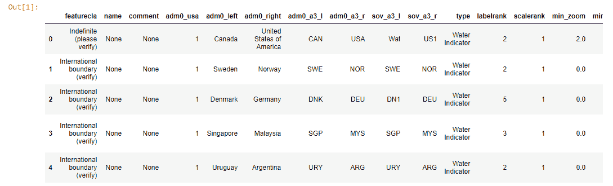
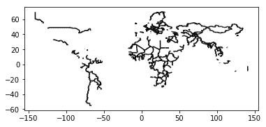
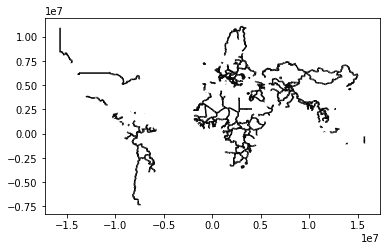
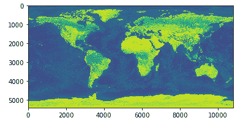

# 数据类型、存储和转换

本章将重点介绍 GIS 中存在的多种不同数据类型，并提供 GIS 中主要数据类型的概述以及如何使用之前提到的 Python 代码库来读取和写入地理空间数据。除了读取和写入不同的地理空间数据类型外，你还将学习如何使用这些库在不同数据类型之间进行文件转换，以及如何从地理空间数据库和远程源下载数据。

本章将涵盖以下矢量和栅格数据类型：

+   Shapefiles

+   GeoJSON

+   KML

+   GeoPackages

+   GeoTIFF

以下文件操作也将被涵盖，使用在第二章，*地理空间代码库简介*中介绍的 Python 地理空间数据库：

+   打开现有文件

+   读取和显示不同的属性（空间和非空间）

+   以不同格式创建和写入新的地理空间数据

+   将一种文件格式转换为另一种格式

+   下载地理空间数据

在我们开始编写读取和写入这些数据类型的代码之前，我们将概述最常用的 GIS 数据类型。接下来，我们将通过一些示例来解释如何使用各种 Python 库来读取、写入、下载和转换地理空间数据。我们将从解释地理空间数据代表什么以及矢量和栅格数据之间的区别开始。

# 栅格和矢量数据

在深入探讨一些最常用的 GIS 数据类型之前，需要先了解地理数据所代表的信息类型。本书早期提到了栅格数据和矢量数据之间的区别。所有 GIS 数据都是由其中一种或另一种组成，但也可以是两者的组合。在决定使用哪种数据类型时，要考虑数据所代表的地理信息的比例和类型，这反过来又决定了应该使用哪些 Python 数据库。正如以下示例所示，对某个 Python 库的选择也可能取决于个人偏好，并且可能存在多种完成同一任务的方法。

在地理空间领域，栅格数据以航空影像或卫星数据的形式出现，其中每个像素都有一个与之相关的值，该值对应于不同的颜色或阴影。栅格数据用于表示大范围的连续区域，例如区分世界各地的不同温度带。其他流行的应用包括高程、植被和降水图。

栅格数据也可以用作创建矢量地图的输入，例如，可以区分道路和建筑物等对象（例如，在导航到谷歌地图时的标准地图视图）。矢量数据本身由点、线和多边形组成，用于在地理空间中区分特征，如行政边界。这些特征是由具有空间关系的单个点组成的，这些关系在相关数据模型中进行了描述。矢量数据在放大时保持相同的清晰度，而栅格数据则会显得更加粗糙。

既然你已经知道了地理数据代表什么，那么让我们来讨论一下最常用的地理空间数据格式，用于矢量数据和栅格数据。

# Shapefiles

Shapefile 可能是今天最常用于地理矢量数据的数据格式。这种文件格式是由 Esri 开发的，基于 Esri 和其他 GIS 软件产品之间数据互操作性的开放规范。尽管已经引入了许多其他文件格式试图取代 shapefile，但它仍然是一种广泛使用的文件格式。如今，许多第三方 Python 编程模块可用于读取和写入 shapefile。

尽管名称*shapefile*可能暗示与之相关联的只有一个文件，但实际上一个 shapefile 需要至少三个文件，这些文件需要存储在同一个目录中才能正确工作：

+   包含特征几何本身的`.shp`文件

+   包含特征几何位置索引的`.shx`文件，以便快速向前和向后搜索

+   包含每个形状的列属性`.dbf`文件

Shapefiles 有其自身的结构。主文件（`.shp`）包含几何数据，由一个单一定长头部组成，后面跟着一个或多个变长记录。

# GeoJSON

GeoJSON 是一种基于 JSON 的文件格式，在短时间内变得流行。GeoJSON 使用**JavaScript 对象表示法**（**JSON**）开放数据标准将地理特征存储为键值对。这些文件易于阅读，可以使用简单的文本编辑器创建，现在在空间数据库、开放数据平台以及商业 GIS 软件中都很常见。你可以使用 GeoJSON 处理各种类型的地理空间矢量数据，如点、线和多边形。GeoJSON 使用`.json`或`.geojson`作为文件扩展名。这意味着文件名不一定是`.geojson`才能是 GeoJSON 文件。

# KML

**关键孔标记语言** (**KML**)，指的是开发该格式的公司。它可以用来存储地理数据，这些数据可以通过众多应用程序进行可视化，例如谷歌地球、Esri ArcGIS Explorer、Adobe Photoshop 和 AutoCAD。KML 基于 XML，使用基于标签的结构，具有嵌套元素和属性。KML 文件通常以 KMZ 文件的形式分发，这些是带有 `.kmz` 扩展名的压缩 KML 文件。对于其参考系统，KML 使用经度、纬度和海拔坐标，这些坐标由 **1984 年世界大地测量系统** (**WGS84**) 定义。

# GeoPackage

**开放地理空间联盟** (**OGC**) 的 **GeoPackage** (**GPKG**) 是一种开放数据格式，用于支持矢量和栅格数据的地理信息系统。该格式由 OGC 定义并于 2014 年发布，此后得到了来自各个政府、商业和开源组织的广泛支持。GeoPackage 数据格式是在考虑到移动用户的情况下开发的——它被设计得尽可能高效，所有信息都包含在一个文件中。这使得它们在云存储和 USB 驱动器上快速共享变得容易，并且它被用于断开连接的移动应用程序中。GeoPackage 文件由一个扩展的 SQLite 3 数据库文件 (`*.gpkg`) 组成，该文件结合了数据和元数据表。

# 栅格数据格式

这些是目前用于地理信息的一些最流行的栅格数据格式：

+   **ECW** (**增强压缩小波**)：ECW 是一种压缩图像格式，通常用于航空和卫星影像。这种 GIS 文件类型以其高压缩比而闻名，同时仍能保持图像中的质量对比度。

+   **Esri 网格**：一种用于向栅格文件添加属性数据的文件格式。Esri 网格文件可用作整数和浮点网格。

+   **GeoTIFF** (**地理标记图像文件格式**)：一种用于 GIS 和卫星遥感应用的行业图像标准文件。几乎所有 GIS 和图像处理软件包都支持 GeoTIFF。

+   **JPEG 2000**：一种开源的压缩栅格格式，允许有损和无损压缩。JPEG 2000 通常具有 JP2 文件扩展名。JPEG 2000 可以实现 20:1 的压缩比，这与 MrSID 格式相似。

+   **MrSID** (**多分辨率无缝图像数据库**)：一种允许有损和无损压缩的压缩小波格式。LizardTech 的专有 MrSID 格式常用于需要压缩的正射影像。MrSID 图像具有 SID 扩展名，并附带一个文件扩展名为 SDW 的世界文件。

# 使用 GeoPandas 读取和写入矢量数据

是时候进行一些动手练习了。我们将使用 GeoPandas 库读取和写入一些以 GeoJSON 形式存在的矢量数据，GeoPandas 库是演示所有示例的应用程序，它预安装在 Anaconda3 中。如果您已从第二章，“地理空间代码库简介”中安装了所有地理空间 Python 库，那么您就可以开始了。如果没有，请先这样做。您可能会决定为不同的 Python 库组合创建虚拟环境，因为不同的依赖关系和版本。打开一个新的 Jupyter Notebook 和一个浏览器窗口，转到[`www.naturalearthdata.com/downloads/`](http://www.naturalearthdata.com/downloads/)并下载 Natural Earth 快速入门套件到方便的位置。我们将在本章的其余部分检查一些数据，以及一些其他地理数据文件。

首先，在具有 GeoPandas 库访问权限的 Jupyter Notebook 中输入以下代码并运行：

```py
In: import geopandas as gpd
    df = gpd.read_file(r'C:\data\gdal\NE\10m_cultural
    \ne_10m_admin_0_boundary_lines_land.shp')
    df.head()
```

输出如下所示：



代码执行以下操作——第一行导入 GeoPandas 库并缩短其名称，在以后引用它时节省空间。第二行从磁盘读取数据，在本例中是一个包含陆地边界线的 shapefile。它被分配给一个 dataframe 变量，该变量指的是一个`pandas` dataframe，即一个类似于 Excel 表的二维对象，具有行和列。GeoPandas 的数据结构是`pandas`子类，名称不同——GeoPandas 中的`pandas` dataframe 被称为**GeoDataFrame**。第三行打印属性表，仅限于前五行。运行代码后，单独单元格的输出将列出引用 shapefile 的属性数据。您会注意到 FID 列没有名称，并且已添加了一个作为最后一列的`geometry`列。

这不是读取数据的唯一命令，您还可以使用`read_postgis()`命令从 PostGIS 数据库中读取数据。接下来，我们将在 Jupyter Notebook 内部绘制数据：

```py
In: %matplotlib inline
    df.plot(color='black')
```

上一段代码的输出如下：



第一行是一个所谓的魔法命令，仅用于 Jupyter Notebook 内部，告诉它使用 Jupyter Notebook 应用程序单元格内的`matplotlib`库的绘图功能。这样，您可以直接绘制地图数据，而不是在 IDE 中工作。第二行表示我们想要绘制的 dataframe，颜色为`black`（默认颜色是蓝色）。输出类似于只有陆地边界的世界地图，这些边界以黑色线条可见。

接下来，我们将研究 GeoPandas 数据对象的一些属性：

```py
In: df.geom_type.head()

Out: 0 LineString
     1 LineString
     2 MultiLineString
     3 LineString
     4 LineString
     dtype: object
```

这告诉我们，我们的属性表中的前五个条目由线字符串和多行字符串组成。要打印所有条目，请使用相同的行代码，但不使用 `.head()`：

```py
In: df.crs

Out: {'init': 'epsg:4326'}
```

`crs` 属性指的是数据框的 **坐标参考系统**（**CRS**），在本例中为 `epsg:4326`，这是一个由 **国际油气生产商协会**（**IOGP**）定义的代码。有关 EPSG 的更多信息，请访问 [www.spatialreference.org](http://www.spatialreference.org)。CRS 提供了关于您的空间数据集的基本信息。EPSG 4326 也称为 WGS 1984，是地球的标准坐标系。

您可以将 CRS 更改为以下内容，以 Mercator 投影，显示更垂直拉伸的图像：

```py
In: merc = df.to_crs({'init': 'epsg:3395'})
    merc.plot(color='black')
```

上一段代码的输出如下：



假设我们想要将数据框的 shapefile 数据转换为 `json`。GeoPandas 可以用一行代码完成此操作，输出结果列在新单元格中：

```py
In: df.to_json()
```

此前命令将数据转换为新的格式，但没有将其写入新文件。将数据框写入新的 `geojson` 文件可以这样做：

```py
In: df.to_file(driver='GeoJSON',filename=r'C:\data\world.geojson')
```

不要被 JSON 文件扩展名所迷惑——包含空间数据的 JSON 文件是 GeoJSON 文件，尽管也存在单独的 `.geojson` 文件扩展名。

对于文件转换，GeoPandas 依赖于 Fiona 库。要列出所有可用的 `drivers`（一个软件组件，允许操作系统和设备相互通信），请使用以下命令：

```py
In: import fiona; fiona.supported_drivers
```

# 使用 OGR 读取和写入矢量数据

现在，让我们转向 OGR 来读取和写入矢量数据，这样您就可以比较 OGR 和 GeoPandas 在执行相同类型任务时的功能。要遵循我们继续提到的说明，您可以下载 MTBS 火灾数据，从： [`edcintl.cr.usgs.gov/downloads/sciweb1/shared/MTBS_Fire/data/composite_data/fod_pt_shapefile/mtbs_fod_pts_data.zip`](https://edcintl.cr.usgs.gov/downloads/sciweb1/shared/MTBS_Fire/data/composite_data/fod_pt_shapefile/mtbs_fod_pts_data.zip) 并将它们存储在您的电脑上。这里将要分析的是 `mtbs_fod_pts_20170501` shapefile 的属性表，该表有 20,340 行和 30 列。

我们将从 `ogrinfo` 命令开始，该命令在终端窗口中运行，可以用于描述矢量数据。这些不是 Python 命令，但我们将在这里包括它们，因为您可以在 Jupyter Notebook 中通过简单的前缀（在使用的命令前添加感叹号）轻松运行它们。以以下命令为例，该命令类似于 Fiona 驱动器命令：

```py
In: !ogrinfo –-formats
```

此命令列出`ogrinfo`可以访问的可用格式，通过使用通用选项`--formats`。结果还告诉我们 GDAL/OGR 是否只能读取/打开该格式，或者它是否还可以在该格式中写入新层。如输出所示，OGR 支持许多支持的文件格式。查看列表中的 Esri shapefiles，添加的(rw+v)表示 OGR 支持 Esri shapefiles 的读取、写入、更新（意味着创建）和虚拟格式：

```py
In: !ogrinfo -so "pts" mtbs_fod_pts_20170501
```

之前的命令列出了数据源中所有层的摘要信息，在这种情况下是名为`"pts"`的文件夹中的所有 shapefile。添加的`-so`代表摘要选项。您可以看到，此命令列出了与 GeoPandas 中看到的信息类似的信息，例如 CRS。相同的代码行，但如果没有添加`-so`，将打印所有要素和属性，并且需要一些时间来处理。这与在 GeoPandas 中创建 GeoDataFrame 类似，但所有属性信息都是按特征在新行上打印，而不是保留表格形式：

```py
In: !ogrinfo "pts" mtbs_fod_pts_20170501
```

如果我们要将此 shapefile 转换为 GeoJSON 文件，我们将使用以下命令：

```py
In: !ogr2ogr -f "GeoJSON" "C:\data\output.json"                                 
    "C:\data\mtbs_fod_pts_data\mtbs_fod_pts_20170501.shp"
```

`-f`前缀代表格式，后面跟着输出驱动程序名称、输出文件名、位置和输入文件。在文件转换过程中可能会收到错误警告，例如遇到不良特征时，但无论如何都会写入输出文件。

OGR 也支持读取和写入 KML 文件。使用以下代码下载此 KML 样本文件（[`developers.google.com/kml/documentation/KML_Samples.kml`](https://developers.google.com/kml/documentation/KML_Samples.kml)）并运行以下代码来读取其内容：

```py
In:   !ogrinfo "C:\Users\UserName\Downloads\KML_Samples.kml" -summary

Out:  Had to open data source read-only.INFO: Open of                              
      `C:\Users\UserName\Downloads\KML_Samples.kml' using driver             
     `KML' successful.
        1: Placemarks (3D Point)
        2: Highlighted Icon (3D Point)
        3: Paths (3D Line String)
        4: Google Campus (3D Polygon)
        5: Extruded Polygon (3D Polygon)
        6: Absolute and Relative (3D Polygon)
```

对于 OGR 的 Pythonic 方法，让我们看看一些示例，了解如何使用 OGR 读取和写入数据。

以下代码使用 OGR 列出了我们野火 shapefile 的 30 个字段名称：

```py
In: from osgeo import ogr
    source = ogr.Open(r"C:\data\mtbs_fod_pts_data\
    mtbs_fod_pts_20170501.shp")
    layer = source.GetLayer()
    schema = []
    ldefn = layer.GetLayerDefn()
    for n in range(ldefn.GetFieldCount()):
        fdefn = ldefn.GetFieldDefn(n)
        schema.append(fdefn.name)
    print(schema)

Out: ['FIRE_ID', 'FIRENAME', 'ASMNT_TYPE', 'PRE_ID', 'POST_ID', 'ND_T',      
    'IG_T', 'LOW_T',
    'MOD_T', 'HIGH_T', 'FIRE_YEAR', 'FIRE_MON', 'FIRE_DAY', 'LAT',          
    'LONG', 'WRS_PATH',
    'WRS_ROW', 'P_ACRES', 'R_ACRES', 'STATE', 'ADMIN', 'MTBS_ZONE',      
    'GACC', 
    'HUC4_CODE','HUC4_NAME', 'Version', 'RevCode', 'RelDate',              
    'Fire_Type']
```

如前述代码所示，这比使用 GeoPandas 要复杂一些，在 GeoPandas 中，您可以使用少量代码直接将所有属性数据加载到一个 GeoDataFrame 中。使用 OGR，您需要遍历单个要素，这些要素需要从层定义中引用并附加到空列表中。但首先，您需要使用`GetLayer`函数——这是因为 OGR 有自己的数据模型，它不会自动适应它所读取的文件格式。

现在我们有了所有字段名称，我们可以遍历单个要素，例如，对于州字段：

```py
In: from osgeo import ogr
  import os
  shapefile = r"C:\data\mtbs_fod_pts_data\mtbs_fod_pts_20170501.shp"
  driver = ogr.GetDriverByName("ESRI Shapefile")
  dataSource = driver.Open(shapefile, 0)
  layer = dataSource.GetLayer()
  for feature in layer:
      print(feature.GetField("STATE"))
```

从最后一个单元的输出来看，显然有很多要素，但确切有多少呢？可以使用以下方式打印总要素计数：

```py
In: import os
    from osgeo import ogr
    daShapefile = r"C:\data\mtbs_fod_pts_data\
    mtbs_fod_pts_20170501.shp"
    driver = ogr.GetDriverByName("ESRI Shapefile")
    dataSource = driver.Open(daShapefile, 0)
    layer = dataSource.GetLayer()
    featureCount = layer.GetFeatureCount()
    print("Number of features in %s: %d" %                                    
    (os.path.basename(daShapefile), featureCount))

Out: Number of features in mtbs_fod_pts_20170501.shp: 20340
```

正如我们之前看到的，CRS 是关于您空间数据的重要信息。您可以通过两种方式打印此信息——从层和层的几何形状。在以下代码中，两个空间参考变量将打印相同的输出，正如它应该的那样（这里只列出了第一个选项的输出以节省空间）：

```py
In: from osgeo import ogr, osr
   driver = ogr.GetDriverByName('ESRI Shapefile')
    dataset = driver.Open(r"C:\data\mtbs_fod_pts_data\
    mtbs_fod_pts_20170501.shp")
    # Option 1: from Layer
    layer = dataset.GetLayer()
    spatialRef = layer.GetSpatialRef()
    print(spatialRef)
    # Option 2: from Geometry
    feature = layer.GetNextFeature()
    geom = feature.GetGeometryRef()
    spatialRef2 = geom.GetSpatialReference()
    print(spatialRef2)

Out: GEOGCS["GCS_North_American_1983",                                                       
     DATUM["North_American_Datum_1983",                                             
     SPHEROID["GRS_1980",6378137.0,298.257222101]],                                   
     PRIMEM["Greenwich",0.0],
     UNIT["Degree",0.0174532925199433]]
```

我们可以检查我们是否在处理点，并按照以下方式打印所有单个特征的 *x* 和 *y* 值以及它们的质心：

```py
In: from osgeo import ogr
    import os
    shapefile = r"C:\data\mtbs_fod_pts_data\mtbs_fod_pts_20170501.shp"
    driver = ogr.GetDriverByName("ESRI Shapefile")
    dataSource = driver.Open(shapefile, 0)
    layer = dataSource.GetLayer()
    for feature in layer:
        geom = feature.GetGeometryRef()                                    
    print(geom.Centroid().ExportToWkt())
```

# 使用 Rasterio 读取和写入栅格数据

在介绍了如何在 Python 中读取和写入各种矢量数据格式之后，我们现在将做同样的事情来处理栅格数据。我们将从 Rasterio 库开始，看看我们如何读取和写入栅格数据。打开一个新的 Jupyter Notebook，其中包含对 Rasterio 库的访问权限，并输入以下代码：

```py
In: import rasterio    
    dataset = rasterio.open(r"C:\data\gdal\NE\50m_raster\NE1_50M_SR_W
    \NE1_50M_SR_W.tif")
```

这导入 `rasterio` 库并打开一个 GeoTIFF 文件。我们现在可以执行一些简单的数据描述命令，例如打印图像带的数量。

栅格图像包含单个或多个带。所有带都包含在单个文件中，每个带覆盖相同的区域。当您的计算机读取图像时，这些带将叠加在一起，因此您将看到一个单独的图像。每个带包含一个二维数组，具有行和列的数据。每个数组的每个数据单元包含一个与颜色值（或可能的高度值）相对应的数值。如果一个栅格图像有多个带，则每个带对应于传感器收集的电磁谱的一部分。用户可以显示一个或多个带，将不同的带组合在一起以创建自己的彩色合成。第九章，*ArcGIS API for Python 和 ArcGIS Online* 在讨论使用 ArcGIS API for Python 显示栅格数据时提供了一些这些彩色合成的示例。

在这种情况下，有三个不同的带：

```py
In: dataset.count
Out: 3
```

一个 `dataset` 带是一个表示二维空间中单个变量部分分布的值数组。列数由 `width` 属性返回：

```py
In: dataset.width
Out: 10800
```

行数由 `height` 属性返回：

```py
In:  dataset.height
Out: 5400
```

以下代码返回以米为单位的空间边界框，因此您可以计算它覆盖的区域：

```py
In:  dataset.bounds
Out: BoundingBox(left=-179.99999999999997, bottom=-89.99999999998201,
     right=179.99999999996405, top=90.0)
```

数据集的 CRS 可以按照以下方式打印：

```py
In:  dataset.crs
Out: CRS({'init': 'epsg:4326'})
```

您可以访问并返回一个 NumPy ndarray，该 ndarray 表示栅格带的栅格数组，如下所示：

```py
In:   band1 = dataset.read(1)
      band1
Out:  array([[124, 124, 124, ..., 124, 124, 124], ...
```

如果您想可视化图像，请使用以下代码：

```py
In: %matplotlib inline
    from matplotlib import pyplot
    pyplot.imshow(dataset.read(1))
    pyplot.show()
```

输出地图将看起来像这样：



# 使用 GDAL 读取和写入栅格数据

这里有一些使用 GDAL 读取和写入栅格数据的命令：

```py
In: !gdalinfo --formats
```

此命令列出了 GDAL 支持的所有文件格式。要包括 CRS 的摘要，请使用 `!gdalinfo` 而不带任何前缀：

```py
In: !gdalinfo "C:\data\gdal\NE\50m_raster\NE1_50M_SR_W
    \NE1_50M_SR_W.tif"

Out: Driver: GTiff/GeoTIFF
     Files: C:\data\gdal\NE\50m_raster\NE1_50M_SR_W\NE1_50M_SR_W.tif
     Size is 10800, 5400
     Coordinate System is:
     GEOGCS"WGS 84",
     DATUM["WGS_1984", ...
```

您可以将 GeoTIFF 转换为 JPEG 文件，如下所示：

```py
In: !gdal_translate -of JPEG 
    "C:\data\gdal\NE\50m_raster\NE1_50M_SR_W\NE1_50M_SR_W.tif" 
    NE1_50M_SR_W.jpg

Out: Input file size is 10800, 5400
     0...10...20...30...40...50...60...70...80...90...100 - done.
```

输出，`NE1_50M_SR_W.jpg`，将看起来像这样：

）并按照以下方式引用：

```py
In: !gdalinfo                                                             
    "C:\Users\UserName\Downloads\gdal_sample_v1.2_no_extensions.gpkg"

Out: Driver: GPKG/GeoPackageFiles:
     C:\Users\UserName\Downloads\gdal_sample_v1.2_no_extensions.gpkg
    Size is 512, 512
    Coordinate System is''
   ...
```

GDAL 的**Web 地图服务**（**WMS**）驱动程序允许与在线网络地图服务进行交互。你可以使用它从命令提示符（或在这种情况下，Jupyter Notebook）直接下载各种地理空间数据集、子集或有关可用数据集的信息，而无需使用浏览器导航到网站并手动下载数据。有许多不同的选项，因此请参考在线文档以获取更多信息。以下示例需要 GDAL 版本 2.0 或更高版本。以下命令使用 ArcGIS MapServer 的**表示性状态转移**（**REST**）定义的 URL，并返回有关请求的图像服务的信息，例如波段数量、波段名称、CRS、角坐标等：

```py
In: !gdalinfo http://server.arcgisonline.com/ArcGIS/rest/services/
    World_Imagery/MapServer?f=json&pretty=true
```

注意，你向图像服务的 URL 中添加了一些信息，在这种情况下，`f=json&pretty=true`。这意味着用户请求的文件格式是`pretty json`，这是一种格式良好的`json`，更容易供人类阅读。

# 摘要

本章概述了 GIS 中的主要数据类型。在解释了矢量和栅格数据之间的区别之后，接下来介绍了以下矢量栅格数据类型——Esri 形状文件、GeoJSON、KML、GeoPackages 和 GeoTIFF 文件。然后，我们解释了如何使用一些之前描述的 Python 代码库来读取和写入地理空间数据。特别介绍了以下用于读取和写入栅格和矢量数据的地理空间 Python 库——GeoPandas、OGR、GDAL 和 Rasterio。除了读取和写入不同的地理空间数据类型之外，你还学习了如何使用这些库在不同数据类型之间进行文件转换，以及如何从地理空间数据库和远程源上传和下载数据。

下一章将介绍地理空间分析和处理。涉及到的 Python 库有 OGR、Shapely 和 GeoPandas。读者将学习如何使用这些库编写用于地理空间分析的脚本，并使用实际案例进行学习。
