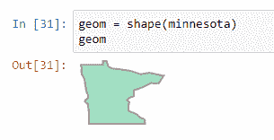
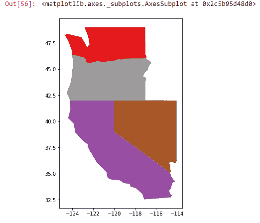
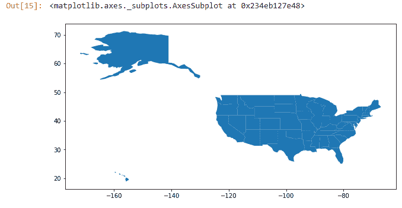
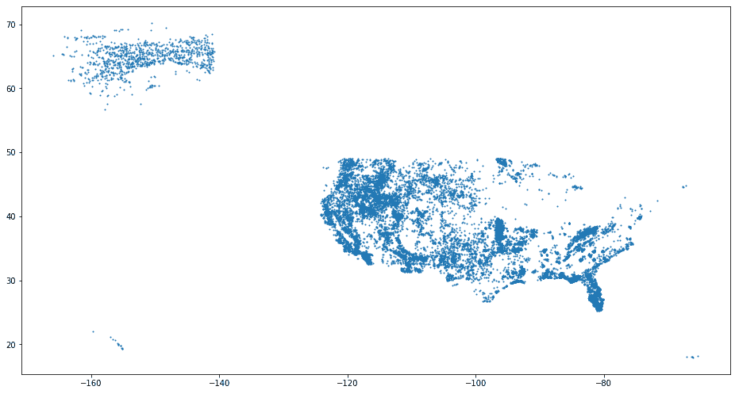
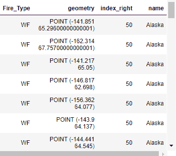
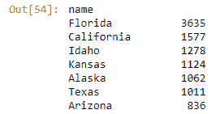
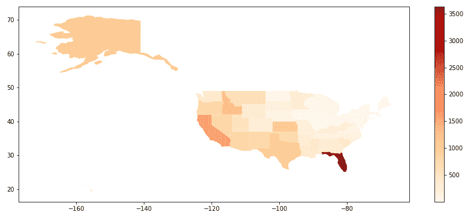
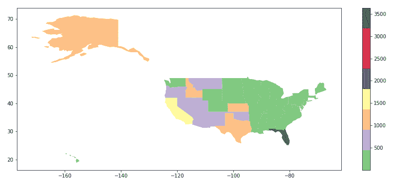
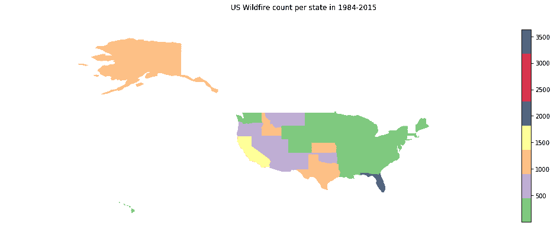

# 第五章：向量数据分析

本章将涵盖地理空间分析和处理向量数据。以下三个 Python 库将被介绍——Shapely、OGR 和 GeoPandas。读者将学习如何使用这些 Python 库进行地理空间分析，包括编写基本和高级分析脚本。

每个库都将单独介绍，其中适当的地方将概述其数据结构、方法和类。我们将讨论每个库的最佳用例以及如何将它们结合起来用于地理空间工作流程。简短的示例脚本将说明如何执行基本的地理分析。GeoPandas 库为执行数据科学任务和结合地理空间分析提供了更复杂的功能。

在本章中，我们将涵盖以下主题：

+   读取和写入向量数据

+   创建和操作向量数据

+   在地图上可视化（绘图）向量数据

+   处理地图投影和重新投影数据

+   执行空间操作，如空间连接

+   在表格形式中处理向量几何和属性数据

+   分析结果以回答问题，例如在区域 x 中有多少次野火？

在本章之后，你将拥有一个坚实的基础，开始处理地理空间向量数据。你将了解所有三个地理空间库的特点和应用场景，并知道如何进行基本的向量数据处理和分析。

# OGR 简单特征库

**OGR 简单特征库**（属于**地理空间数据抽象库**（**GDAL**）的一部分）提供了一套处理向量数据的工具。尽管 GDAL 和 OGR 现在比以前更加集成，但我们仍然可以将 GDAL 区分为向量部分（OGR）和栅格部分（GDAL）。虽然 OGR 是用 C++ 编写的，文档也是用 C++ 编写的，但通过 Python 绑定，我们可以使用 Python 访问 GDAL 的所有功能。

我们可以区分以下 OGR 的组成部分：

+   用于描述和处理向量数据的 OGR 批处理命令

+   `ogrmerge`，一个用于合并多个向量数据文件的即时 Python 脚本

+   OGR 库本身

在介绍一些如何使用这三个库的示例之前，我们将简要介绍这些组件。

# OGR 批处理命令

OGR 提供了一系列批处理命令，可用于描述和转换现有的地理空间向量数据。我们已经在第四章，*数据类型、存储和转换*中提到了其中两个，`ogrinfo`和`ogr2ogr`：

+   `ogrinfo`可用于对向量数据进行各种报告，例如列出支持的向量格式、可用图层和摘要细节，并且可以与 SQL 查询语法结合，从数据集中选择特征。

+   `ogr2ogr`用于执行矢量数据转换，例如在不同格式之间转换矢量文件，将多个图层转换为新的数据源，以及根据位置重新投影矢量数据和过滤特征。它也可以像`ogrinfo`一样使用 SQL 查询语法。

这些是非常强大的命令，可以让您完成大量工作。建议您在工作处理矢量数据时熟悉这些命令。我们很快会提供一些示例。

此外，还有两个用于创建矢量瓦片的批处理命令，`ogrtindex`和`ogr2vrt`。这两个命令之间的区别在于，第二个命令比第一个命令更通用。第二个命令需要从在线脚本中导入，因为它不包括在最近的 GDAL 版本中。

# ogrmerge

随着 GDAL 的安装，还附带了一套 Python 脚本，可用于专门的地理空间任务。这些脚本可以直接从 Jupyter Notebook 或终端运行，并指定数据集。您可以在本地`gdal`文件文件夹的`scripts`目录中找到所有这些脚本，在 Windows 机器上可能类似于以下路径：

`C:\Users\Username\Anaconda3\pkgs\gdal-2.2.2-py36_1\scripts`

如您从该文件夹中的 Python 脚本列表中看到的，几乎所有的脚本都是针对 GDAL 而不是 OGR 的。所有这些 Python 脚本都可以从 Jupyter Notebook 或终端运行。使用 Jupyter Notebook，您可以使用魔法命令`%run`来执行 Python 脚本，而使用终端，您将使用`python`后跟脚本名称和输入/输出数据文件。

魔法命令是扩展核心 Python 语言的命令，并且只能在 Jupyter Notebook 应用程序中使用。它们提供了有用的快捷方式，例如，从外部脚本插入代码，以及从磁盘上的`.py`文件或`shell`命令中执行 Python 代码。可以使用以下命令在空单元格中打印出所有魔法命令的完整列表：%lsmagic。

以下示例使用`ogrmerge.py`，这是 GDAL 2.2.2 及更高版本中可用的一个 Python 脚本。从 Jupyter Notebook 中运行此脚本，它将地球数据集中单个文件夹中的所有 shapefile 合并成一个名为`merged.gpkg`的单个 GeoPackage 文件：

```py
In: %run "C:\Users\Eric\Anaconda3\pkgs\gdal-2.2.2-                        
    py36_1\Scripts\ogrmerge.py" -f GPKG -o
    merged.gpkg "C:\data\gdal\NE\10m_cultural\*.shp"
```

请注意，为了正确运行 GDAL 目录中的一个 Python 脚本，如果您在运行脚本的不同文件夹中，需要参考它们的文件位置，如果您在使用 Jupyter Notebook 应用程序工作，这种情况很可能是这样。

# OGR 库和 Python 绑定

`OGR` 库及其 Python 绑定结合在一起，是使用 Python 处理矢量数据最重要的部分。有了它，你可以创建点、线和多边形，并对这些元素执行空间操作。例如，你可以计算几何形状的面积，将不同的数据叠加在一起，并使用如缓冲区之类的邻近工具。此外，就像 `ogrinfo` 和 `ogr2ogr` 一样，OGR 库提供了读取矢量数据文件、遍历单个元素以及选择和重新投影数据的工具。

# OGR 的主要模块和类

OGR 库由两个主要模块组成——`ogr` 和 `osr`。这两个都是 `osgeo` 模块内的子模块。`ogr` 子模块处理矢量几何，而 `osr` 则全部关于投影。在 第四章 的 *使用 OGR 读取和写入矢量数据* 部分，*数据类型、存储和转换*，我们已经看到了一些如何利用这两个模块的例子。

OGR 提供以下七个类：

+   `几何形状`

+   `空间参考`

+   `要素`

+   `要素类定义`

+   `图层`

+   `数据集`

+   `驱动程序`

类名大多一目了然，但了解 OGR 的结构概述是很好的。在以下示例中，我们将看到如何访问和使用这些类。OGR 的模块、类和函数在 GDAL 网站上有所记录（[www.gdal.org/python](http://www.gdal.org/python)），但未提供代码示例，这使得入门变得困难。现在值得知道的是，其他 Python 库填补了这一空白，并提供了更用户友好的方式来处理 GDAL 的功能（如 Fiona 和 GeoPandas）。此外，在某些用例中，`ogrinfo` 和 `ogr2ogr` 可能比使用 Python 更可取，例如，在重新投影矢量数据时。

让我们看看几个 OGR 的例子。

# 使用 OGR 创建多边形几何形状

OGR 允许你写入矢量几何，如点、线、多点、多线字符串、多边形和几何集合。如果你计划稍后进行投影，你可以用坐标或米来给出这些几何值。你创建的所有几何形状都遵循相同的程序，单独的点被定义并连接成线或多边形。你用数字定义单独的实体，用**已知二进制**（**WKB**）进行编码，最终的多边形被转换为**已知文本**（**WKT**）。Jupyter Notebook 会返回多边形的坐标，但不会自动绘制它，为此，我们将在本章后面使用 Shapely：

```py
In: from osgeo import ogr
    r = ogr.Geometry(ogr.wkbLinearRing)
    r.AddPoint(1,1)
    r.AddPoint(5,1)
    r.AddPoint(5,5)
    r.AddPoint(1,5)
    r.AddPoint(1,1)
    poly = ogr.Geometry(ogr.wkbPolygon)
    poly.AddGeometry(r)
    print(poly.ExportToWkt())
Out: POLYGON ((1 1 0,5 1 0,5 5 0,1 5 0,1 1 0))
```

# 从 GeoJSON 创建多边形几何形状

你也可以通过将 GeoJSON 传递给 OGR 来创建几何形状，与第一个例子相比，这样可以节省空间：

```py
In: from osgeo import ogr
    geojson = """{"type":"Polygon","coordinates":[[[1,1],[5,1],
    [5,5],[1,5], [1,1]]]}"""
    polygon = ogr.CreateGeometryFromJson(geojson)
    print(polygon)  
Out: POLYGON ((1 1,5 1,5 5,1 5,1 1))
```

# 基本几何操作

这里有一些基本几何操作，我们可以对我们的多边形执行。我们创建面积、质心、边界、凸包、缓冲区，并检查多边形是否包含某个点：

```py
# 1 create area
In: print("The area of our polygon is %d" % polygon.Area())
Out: The area of our polygon is 16

# 2 calculate centroid of polygon
In: cen = polygon.Centroid()
print(cen)
Out: POINT (3 3)

# 3 Get the boundary
In: b = polygon.GetBoundary()
print(b)
Out: LINESTRING (1 1,5 1,5 5,1 5,1 1)
# 4 convex hull does the same in this case as boundary, as our polygon is a square:
In: ch = polygon.ConvexHull() 
print(ch)
Out: POLYGON ((1 1,1 5,5 5,5 1,1 1))
# 5 buffer. A buffer value of 0 (zero) returns the same values as boundary and convex hull in this example:
In: buffer = polygon.Buffer(0) 
print(buffer)
Out: POLYGON ((1 1,1 5,5 5,5 1,1 1))# 6 check if a point is inside our polygon
In: point = ogr.Geometry(ogr.wkbPoint)
point.AddPoint(10, 10)
polygon.Contains(point)
Out: False
```

# 将多边形数据写入新创建的 shapefile

我们当前的多边形仅存在于内存中。我们可以创建一个新的 shapefile，并将我们之前创建的多边形几何形状写入此 shapefile。脚本包括以下步骤：

1.  导入模块并设置空间参考（在这种情况下，**世界大地测量系统 1984**（**WGS1984**））。

1.  创建 shapefile，然后使用多边形几何创建图层。接下来，将几何形状放入特征中，并将特征放入图层中。注意，脚本直接引用了早期示例中的多边形。

1.  关键是要在代码的第一行使用正确的几何类型，在这种情况下应该是`wkbPolygon`。

1.  我们在早期示例中使用的多边形几何形状在本步骤中被引用并放入了 shapefile 中。

1.  在此步骤中将 shapefile 添加为图层。

看看以下代码：

```py
In:  import osgeo.ogr, osgeo.osr
    # 1 set the spatial reference
    spatialReference = osgeo.osr.SpatialReference()
    spatialReference.ImportFromProj4('+proj=longlat +ellps=WGS84                 
    +datum=WGS84 +no_defs')

    # 2 create a new shapefile
    driver = osgeo.ogr.GetDriverByName('ESRI Shapefile')
    shapeData = driver.CreateDataSource('my_polygon.shp')

    # 3 create the layer
    layer = shapeData.CreateLayer('polygon_layer', spatialReference,             
    osgeo.ogr.wkbPolygon)
    layerDefinition = layer.GetLayerDefn()

    # 4 geometry is put inside feature
    featureIndex = 0
    feature = osgeo.ogr.Feature(layerDefinition)
    feature.SetGeometry(polygon)
    feature.SetFID(featureIndex)

    # 5 feature is put into layer
    layer.CreateFeature(feature)
```

我们可以使用`ogrInfo`来查看文件是否已正确创建：

```py
In: !ogrinfo my_polygon.shp
Out: INFO: Open of `my_polygon.shp'
     using driver `ESRI Shapefile' successful.
     1: my_polygon (Polygon)
```

# 使用空间过滤器选择要素

此示例使用在第四章，“数据类型、存储和转换”部分中介绍的 Natural Earth Dataset。我们将在“使用 GeoPandas 读取和写入矢量数据”小节中使用经纬度坐标来创建一个边界框形式的空问过滤器。这个框只选择框内的数据。这是一种处理数据子集的方法。我们将使用 OGR 的`SpatialFilterRec`方法，该方法接受四个值——`minx`、`miny`、`maxx`和`maxy`，来创建一个边界框。我们的（随机）示例是选择边界框内的城市（显示德克萨斯州以及俄克拉荷马州和墨西哥的部分）。为了进一步过滤我们的结果，我们只想选择美国内的城市。这意味着我们必须在`for`循环中添加额外的`if`/`else`语句来过滤我们的搜索结果。

网站 www.mapsofworld.com 为我们提供的示例代码如下四个值：`-102` (`minx`)，`26` (`miny`)，`-94` (`maxx`)，和`36` (`maxy`)，用于德克萨斯州。以下是脚本：

```py
In: # import the modules
    from osgeo import ogr
    import os
    # reference the shapefile and specify driver type
    shapefile =                                              
    r"C:\data\gdal\NE\10m_cultural\ne_10m_populated_places.shp"
    driver = ogr.GetDriverByName("ESRI Shapefile")
    # open the data source with driver, zero means open in read-only 
    mode
    dataSource = driver.Open(shapefile, 0)
    # use the GetLayer() function for referencing the layer that holds 
    the data
    layer = dataSource.GetLayer()
    # pass in the coordinates for the data frame to the                     
    SetSpatialFilterRect() function. This filter creates a rectangular     
    extent and selects the features
      inside the extent
      layer.SetSpatialFilterRect(-102, 26, -94, 36)
      for feature in layer:
      # select only the cities inside of the USA
      # we can do this through a SQL query:
      # we skip the cities that are not in the USA,
      # and print the names of the cities that are
          if feature.GetField("ADM0NAME") != "United States of                              
      America":
              continue
          else:
              print(feature.GetField("NAME"))

Out:    Ardmore
        McAlester
        Bryan
        San Marcos
        Longview
        …
```

# Shapely 和 Fiona

Shapely 和 Fiona 库在第二章，“地理空间代码库简介”部分中介绍，包括*Shapely*和*Fiona*小节。将它们一起介绍是有意义的，因为 Shapely 依赖于其他库来读取和写入文件，而 Fiona 则符合这一要求。正如我们将在示例中看到的那样，我们可以使用 Fiona 打开和读取文件，然后将几何数据传递给 Shapely 对象。

# Shapely 对象和类

Shapely 库用于创建和操作 2D 矢量数据，无需空间数据库。它不仅摒弃了数据库，还摒弃了投影和数据格式，只关注几何形状。Shapely 的强大之处在于它使用易于阅读的语法创建各种几何形状，这些形状可用于几何运算。

在其他 Python 包的帮助下，这些几何形状和几何运算的结果可以被写入矢量文件格式，并在必要时进行投影——我们将结合 `pyproj` 和 Fiona 的功能来介绍示例。一个可能的工作流程示例是使用 Fiona 从 shapefile 中读取矢量几何形状，然后使用 Shapely 简化或清理现有的几何形状，以防内部或与其他几何形状的组合可能正确对齐。清理后的几何形状可以用作其他工作流程的输入，例如创建专题地图或执行数据科学。

Shapely 库使用一组类，这些类是三种基本几何对象类型（点、曲线和表面）的实现。如果你熟悉地理空间数据和它们的几何形状，它们会听起来很熟悉。如果你不熟悉，请使用示例来熟悉它们：

| **几何对象名称** | **类名** |
| --- | --- |
| 点集合 | Point |
| 曲线集合 | LineString, LinearRing |
| 表面 | Polygon |
| 点集合 | MultiPoint |
| 曲线集合 | MultiLineString |
| 表面集合 | MultiPolygon |

# Shapely 的地理空间分析方法

拓扑关系作为几何对象上的方法实现（例如，包含、接触等）。Shapely 还提供了返回新几何对象的分析方法（交集、并集等）。通过知名格式（WKT 和 WKB）、NumPy + Python 数组和 Python 地理接口提供与其他软件的互操作性。

# Fiona 的数据模型

虽然 Fiona 是 OGR 的 Python 封装器，但 Fiona 使用的数据模型与 OGR 不同。OGR 使用数据源、层和要素，而 Fiona 使用术语记录来访问存储在矢量数据中的地理要素。这些基于 GeoJSON 特性——使用 Fiona 读取 shapefile 时，你通过其中一个键引用记录，使用 Python 字典对象。记录有一个 ID、几何形状和属性键。

让我们看看一些 Shapely 和 Fiona 的代码示例。

# 使用 Shapely 创建几何形状

就像 OGR 一样，你可以使用 Shapely 来创建几何形状。在创建几何形状后，Jupyter Notebook 会像 OGR 一样绘制这些几何形状，而不需要使用额外的绘图语句，只需重复用于存储几何形状的变量名即可：

```py
In:   from shapely.geometry import Polygon
      p1 = Polygon(((1, 2), (5, 3), (5, 7), (1, 9), (1, 2)))
      p2 = Polygon(((6,6), (7,6), (10,4), (11,8), (6,6)))
      p1 
      # A new command line is required for printing the second polygon:
In:   p2

      # Point takes tuples as well as positional coordinate values
In:   from shapely.geometry import Point
      point = Point(2.0, 2.0)
      q = Point((2.0, 2.0))
      q

       # line geometry
In:    from shapely.geometry import LineString
       line = LineString([(0, 0), (10,10)])
       line

       # linear rings
In:    from shapely.geometry.polygon import LinearRing
       ring = LinearRing([(0,0), (3,3), (3,0)])
       ring

       # collection of points
In:    from shapely.geometry import MultiPoint
       points = MultiPoint([(0.0, 0.0), (3.0, 3.0)])
       points

       # collection of lines
In:    from shapely.geometry import MultiLineString
       coords = [((0, 0), (1, 1)), ((-1, 0), (1, 0))]
       coords

       # collection of polygons
In:    from shapely.geometry import MultiPolygon
       polygons = MultiPolygon([p1, p2,])
       polygons
```

# 使用 Shapely 应用几何方法

与 OGR 类似，你可以应用几何方法，使用前面示例中的多边形：

```py
In:    print(p1.area)
       print(p1.bounds)
       print(p1.length)
       print(p1.geom_type)

Out:   22.0
       (1.0, 2.0, 5.0, 9.0)
       19.59524158061724
       Polygon
```

# 使用 Shapely 读取 JSON 几何形状

虽然 Shapely 不读取或写入数据文件，但你可以通过从库外部访问几何形状，例如，通过提供以 `json` 编写的矢量数据来访问它。以下脚本创建了一个在行中读取到 Shapely 的 `json` 多边形。接下来，映射命令返回一个新的、独立的几何对象，其坐标来自上下文：

```py
In:    import json
       from shapely.geometry import mapping, shape
       p = shape(json.loads('{"type": "Polygon", "coordinates":                                     
       [[[1,1], [1,3 ], [3,3]]]}'))
       print(json.dumps(mapping(p)))
       p.area

Out:   {"type": "Polygon", "coordinates": [[[1.0, 1.0], [1.0, 3.0],                             
       [3.0, 3.0], [1.0, 1.0]]]}
       2.0        # result of p.area
```

# 使用 Fiona 读取数据

以下代码从我们的 Natural Earth 数据集中读取一个文件并打印其字典键：

```py
In:   import fiona
      c = fiona.open(r"C:\data\gdal\NE\
      110m_cultural\ne_110m_admin_1_states_provinces.shp")
      rec = next(iter(c))
      rec.keys()

Out:  dict_keys(['type', 'id', 'geometry', 'properties'])
```

使用 Python 标准库中的数据格式化打印库 (`pprint`)，我们可以将数据集中第一个特征对应的值打印到键上：

```py
In:   import pprint
      pprint.pprint(rec['type'])
      pprint.pprint(rec['id'])
      pprint.pprint(rec['properties'])
      pprint.pprint(rec['geometry'])

Out:  'Feature'
      '0'
      OrderedDict([('adm1_code', 'USA-3514'),
                  ('diss_me', 3514),
                  ('iso_3166_2', 'US-MN'),
                  ('wikipedia',                                               
      'http://en.wikipedia.org/wiki/Minnesota'),
                  ('iso_a2', 'US'),
                  ('adm0_sr', 1),
                  ('name', 'Minnesota'), ….
```

在数据文件对象上使用以下方法来打印以下信息：

```py
In:   print(len(c))        # prints total amount of features     
      print(c.driver)      # prints driver name
      print(c.crs)         # prints coordinate reference system of data                                                                                  file

Out:  51
      ESRI Shapefile
      {'init': 'epsg:4326'}
```

# 使用 Shapely 和 Fiona 在 shapefile 中访问矢量几何

使用 Fiona，你可以打开一个 shapefile 并访问属性数据，例如几何形状。例如，我们的 Natural Earth 数据集包含一个包含美国所有州及其矢量几何的 shapefile。使用以下代码打开 shapefile 并获取第一个特征的所有矢量几何（从索引号`0`开始）：

```py
In:   import pprint, fiona
      with fiona.open\              
     (r"C:\data\gdal\NE\110m_cultural\ne_110m_admin_1_states_provinc        
     es.shp") as src:
      pprint.pprint(src[0])
```

我们可以使用 `shape` 方法并传入明尼苏达州的所有坐标：

```py
In:   from shapely.geometry import shape
      minnesota = {'type': 'Polygon', 'coordinates': 
      [[(-89.61369767938538, 47.81925202085796), (-89.72800594761503, 
      47.641976019880644), (-89.84283098016755, 47.464725857119504), 
      (-89.95765601272012, 47.286907253603175),....]]}
```

接下来，我们使用 Shapely 绘制几何形状：



关于在 Python 中绘制单独的 shapefile 几何形状的注意事项：

如前文所述，从 shapefile 中引用单独的几何元素，如一个州，并用 Python 绘制它们并不直接。幸运的是，有许多代码示例可供专业人士解决此问题。查看以下免费提供的 Python 用户选项，了解如果你决定直接使用 shapefile 而不是转换为 GeoJSON 格式，如何处理 Python 中的 shapefile 矢量几何绘图：

+   使用 NumPy 数组并`matplotlib`：**你可以使用 NumPy 数组将所有坐标挤压到一个一维数组中，然后绘制这些坐标。

+   使用 Shapely 并从现有 shapefile 创建一个新的字典：**如果你知道如何重新组织现有的字典集合，则可以从现有的 shapefile 中创建一个新的字典，该字典使用地理区域的名称作为键，该区域的几何数据作为值。接下来，你可以使用 Shapely 将这些字典的元素传递进去，并在 Python 中绘制它们。

+   使用`pyshp`和`matplotlib`：**`pyshp`库可以用来读取几何信息，然后可以使用`matplotlib`进行绘图。

+   使用 GeoPandas 和`matplotlib`：**GeoPandas 库可以与 matplotlib 一起使用来读取 shapefile。不仅可以使用 matplotlib 的功能绘制矢量数据，还可以将属性表作为`pandas`数据框读取。

# GeoPandas

GeoPandas 已在第二章的“地理空间代码库简介”部分的*GeoPandas*小节中介绍，其中也涵盖了其数据结构和方法。

# 使用 GeoPandas 进行地理空间分析

GeoPandas 是为了向希望使用类似于 `pandas` 的空间数据的科学家提供数据而创建的，这意味着通过数据结构提供对地理空间属性数据的访问，这些数据结构在 `pandas` 中不可用。结合一组几何运算、数据叠加功能、地理编码和绘图功能，您就可以了解这个库的功能。在我们继续提到的示例中，我们将涵盖 GeoPandas 的绘图方法，解释如何访问和子集空间数据，并提供使用 GeoPandas 进行地理空间分析的典型工作流程，其中数据处理是正确分析和解释数据的重要条件。

让我们看看一些 GeoPandas 的代码示例。

# 使用 GeoPandas 和 Matplotlib 选择和绘制几何数据

以下脚本结合了 GeoPandas GeoDataFrame 对象上的 `pandas` 数据框方法。一起使用，您可以轻松地子集数据并绘制单独的特征几何图形。我们从导入模块开始，这是在 Jupyter Notebook 内部绘制数据的神奇命令，以及输入数据，这是一个包含所有美国州边界的 shapefile：

```py
In: import geopandas as gpd
    %matplotlib inline
    df = gpd.read_file\
 (r"C:\data\gdal\NE\110m_cultural\ne_110m_admin_1_states_provinces.shp" )
    df
```

一些简单的数据检查方法——`type(df)` 返回对象类型，它是一个 GeoPandas `GeoDataFrame`，它接受与 `pandas` 数据框相同的方法。`shape` 方法返回一个包含行数和列数的元组，而 `df.columns` 返回列名列表：

```py
In:        type(df)
Out:       geopandas.geodataframe.GeoDataFrame

In:        df.shape
Out:       (51, 61)

In:        df.columns
Out:       Index(['adm1_code', 'diss_me', 'iso_3166_2', 'wikipedia', ...
```

我们可以使用 `pandas`、`.loc` 和 `.iloc` 方法来子集我们的 `GeoDataFrame` 的单独行。我们访问第一个特征的属性，如下所示：

```py
In:        df.loc[0]

Out:       adm1_code       USA-3514
           diss_me         3514
           iso_3166_2      US-MN
           Wikipedia       http://en.wikipedia.org/wiki/Minnesota
           iso_a2          US
           adm0_sr         1
           name            Minnesota
           …               …
```

现在，我们将绘制一些州的数据。首先，我们将获取所有州名的列表，因为我们需要州名及其行号：

```py
In:    df['name']

Out:   0    Minnesota
       1    Montana
       2    North Dakota
       3    Hawaii
       4    Idaho
       5    Washington
       …    …
```

可以使用 `.loc` 和一个值来通过 `name` 而不是行号引用单独的行。重复 `name` 值将返回所有列和属性数据：

```py
In:    california = df.loc[df['name'] == "California"]
       california
```

您可以按照以下方式绘制这个变量的几何图形：

```py
In:    california.plot(figsize=(7,7))
```

下面是这个图表的样子：


您可以通过使用 `.iloc` 函数并传递一个行号列表来绘制多个项目；在这种情况下，行号分别对应华盛顿、加利福尼亚、内华达和俄勒冈：

```py
In:   multipl = df.iloc[[5,7,9,11]]
      multipl.plot(cmap="Set1", figsize=(7,7))
```

输出的图表将看起来像这样：



使用 `.cx` 方法在 `GeoDataFrame` 上也可以获得相同的结果，传入边界框的值。此方法使用以下语法：`df.cx[xmin:xmax, ymin:ymax]`：

```py
In:  exp = df.cx[-124:-118,30:50]
     exp.plot(cmap="Set1", figsize=(7,7))
```

# 使用 GeoPandas 绘制野火数据

以下脚本可以用来创建一个表示 1984-2015 年美国总野火数量的等值线图，基于每个州的计数。我们可以使用在第四章中引入的 MTBS 火数据，*数据类型、存储和转换*，它给我们 1984-2015 年所有野火发生点的数据。我们可以使用野火数据的州字段来按州映射野火发生。但，我们选择在这里将数据叠加到一个包含州几何形状的单独形状文件上，以说明空间连接的使用。接下来，我们将按州统计总野火数量并绘制结果。GeoPandas 可以用来完成所有这些任务。

我们首先导入模块：

```py
In:   import geopandas
```

接下来，我们导入包含所有州边界的形状文件：

```py
In:  states =              
     geopandas.read_file(r"C:\data\gdal\NE\110m_cultural\ne_110m_admin_          
     1_states_provinces.shp")
```

通过重复变量名，可以显示文件的属性表作为一个`pandas`数据框：

```py
In:   states
```

我们可以看到所有州名都列在 name 列中。我们稍后会需要这个列。矢量数据可以使用 Jupyter Notebook 中的魔法命令和`matplotlib`的`plot`方法进行绘制。由于默认地图看起来相当小，我们将通过`figsize`选项传递一些值来使其看起来更大：

```py
In: %matplotlib inline
    states.plot(figsize=(10,10))
```

你将看到以下地图：



对于我们的野火数据，重复相同的步骤。使用大的`figsize`选项值可以得到一个显示野火位置的较大地图：

```py
In: fires =                                                                     
    geopandas.read_file(r"C:\data\mtbs_fod_pts_data\mtbs_fod_pts_201705        
    01.shp") 
    fires
In: fires.plot(markersize=1, figsize=(17,17))
```

地图看起来像这样：



查看名为 MTBS Zone 的`fires` `GeoDataFrame`列，并验证这个数据集并不包含所有州名以引用数据。然而，我们有一个几何列，我们可以用它来连接这两个数据集。在我们能这样做之前，我们必须确保数据使用相同的地图投影。我们可以如下验证：

```py
In:    fires.crs
Out:   {'init': 'epsg:4269'}

In:    states.crs
Out:   {'init': 'epsg:4326'}
```

有两种地图投影，但两者都需要有相同的 CRS 才能正确对齐。我们可以如下将`fires`形状文件重新投影到 WGS84：

```py
In: fires = fires.to_crs({'init': 'epsg:4326'})
```

现在，我们准备执行空间连接，使用`sjoin`方法，表示我们想知道`fires`几何形状是否在州几何形状内：

```py
In: state_fires =                                                    
   geopandas.sjoin(fires,states[['name','geometry']].copy(),op='within'    )
    state_fires
```

新的`state_fires` `GeoDataFrame`在右侧外边增加了一个名为 name 的列，显示每个火灾所在的州：



我们现在可以按州统计每州的野火总数。结果是显示州名和总数的一个`pandas`系列对象。为了从最高计数开始，我们将使用`sort_values`方法：

```py
In:   counts_per_state = state_fires.groupby('name').size()
      counts_per_state.sort_values(axis=0, ascending=False)
```

根据我们的数据，`佛罗里达州`、`加利福尼亚州`和`爱达荷州`是 1984-2015 年期间野火最多的三个州：



这些值可以作为新字段输入到原始形状文件中，显示每个州的野火总数：

```py
In: states =        
    states.merge(counts_per_state.reset_index(name='number_of_fires'))
    states.head()
```

`head`方法打印了`states` shapefile 中的前五个条目，并在表格的右端添加了一个新字段。最后，可以创建并绘制每个州的野火计数热力图如下：

```py
In: ax = states.plot(column='number_of_fires', figsize=(15, 6),                       
    cmap='OrRd', legend=True)
```

输出将类似于以下内容：



将此与应用于相同结果的另一种颜色方案进行比较，去除低值处的浅色：

```py
In: ax = states.plot(column='number_of_fires', figsize=(15, 6),
    cmap='Accent', legend=True)
```

下面是地图的样貌：



使用以下代码进一步微调地图，通过添加标题并删除*x*轴和*y*轴：

```py
In: import matplotlib.pyplot as plt
    f, ax = plt.subplots(1, figsize=(18,6))
    ax = states.plot(column='number_of_fires', cmap='Accent',                 
    legend=True, ax=ax)
    lims = plt.axis('equal')
    f.suptitle('US Wildfire count per state in 1984-2015')                     
    ax.set_axis_off()
    plt.show()
```

输出如下：



# 为什么数据检查很重要

在准备数据时，了解你处理的数据是很重要的。例如，列出关于你的数据集的统计数据，显示有多少元素，以及是否有任何缺失值。在进行分析之前，通常需要对数据进行清理。由于 GeoPandas 数据对象是`pandas`数据对象的子类，你可以使用它们的方法进行数据检查和清理。以我们之前使用的野火数据 shapefile 为例。通过列出我们的 dataframe 对象，它不仅打印了所有属性数据，还列出了总行数和列数，共有 20340 行和 30 列。总行数也可以这样打印出来：

```py
In:        len(fires.index)

Out:       20340
```

这意味着在我们的输入数据集中有`20340`个单独的野火案例。现在，将这个行值与我们执行空间连接后每个州计数之和进行比较：

```py
In:        counts_per_state.sum()

Out:       20266
```

我们注意到，在空间连接之后，我们的数据集中野火减少了 74 个。虽然目前还不清楚我们的空间连接出了什么问题，为什么会有缺失值，但在执行几何操作之前和之后检查数据集是可能的，也是推荐的，例如检查空字段、非值或简单的空值：

```py
In:        fires.empty   #checks if there are empty fields in the                             
                         dataframe

Out:       False
```

同样的操作也可以通过指定列名来完成：

```py
In:        fires['geometry'].empty

Out:       False
```

注意到 GeoPandas 几何列使用文本和值的组合，因此检查 NaN 或零值没有意义。

# 摘要

本章介绍了三个用于处理矢量数据的 Python 库——OGR、Shapely 和 GeoPandas。特别是，我们展示了如何使用这三个库进行地理空间分析和处理。每个库都单独介绍，包括它们的类、方法、数据结构和常用用例。简短的示例脚本展示了如何开始进行数据处理和分析。整体来看，读者现在知道了如何单独使用每个库，以及如何将这三个库结合起来完成以下任务：

+   读取和写入矢量数据

+   创建和操作矢量数据

+   绘制矢量数据

+   处理地图投影

+   执行空间操作

+   以表格形式处理矢量几何和属性数据

+   展示和分析数据以回答具有空间成分的问题

下一章讨论了光栅数据处理以及如何使用 GDAL 和 Rasterio 库。使用这些库，读者将学习如何执行基于光栅的地理空间搜索和分析，以及如何使用地理定位的文本和图像。
