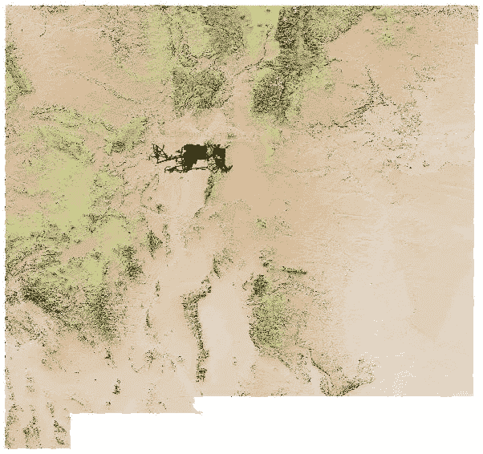
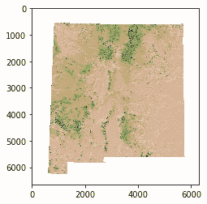
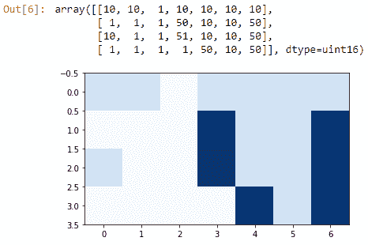

# 第六章：栅格数据处理

**地理信息系统**（**GIS**）通常由点、线和多边形组成。这些数据类型被称为矢量数据。然而，GIS 中还有一种数据类型——栅格。在本章中，你将学习如何处理栅格数据的基础知识。你将学习如何：

+   使用 **地理数据抽象库**（**GDAL**）加载和查询栅格

+   使用 GDAL 修改和保存栅格

+   使用 GDAL 创建栅格

+   将栅格加载到 PostgreSQL 中

+   使用 PostgreSQL 对栅格进行查询

安装 GDAL 可能很困难。通过使用虚拟环境和运行 Anaconda，你可以通过使用环境的 GUI 简化此过程。

# 使用 GDAL 进行栅格操作

GDAL 库允许你读取和写入矢量和栅格数据。要在 Windows 上安装 GDAL，你需要适当的二进制文件：

你可以在 [`trac.osgeo.org/osgeo4w/`](https://trac.osgeo.org/osgeo4w/) 下载包含二进制的 OSGeo4W。

当你有了二进制文件，你可以使用 `conda` 安装 `gdal`，如下所示：

```py
conda install -c conda-forge gdal
```

在接下来的章节中，你将学习如何加载和使用 `.tif` 文件。

# 使用 GDAL 库加载和查询栅格

现在你已经安装了 `gdal`，使用以下代码导入它：

```py
from osgeo import gdal
```

GDAL 2 是最新版本。如果你安装了较旧的 `gdal` 版本，你可能需要使用以下代码导入它：

```py
import gdal
```

如果是这样，你可能需要考虑升级你的 `gdal` 版本。一旦你导入了 `gdal`，你就可以打开一个栅格图像。首先，让我们从网络上获取一个图像。新墨西哥大学的地球数据分析中心维护着 **资源地理信息系统**（**RGIS**）。在其中，你可以找到新墨西哥的 GIS 数据。浏览到 [`rgis.unm.edu/`](http://rgis.unm.edu/) 并从“获取数据”链接，选择“阴影地形”、“通用”和“新墨西哥”。然后，下载 `Color Shaded Relief of New Mexico (Georeferenced TIFF)` 文件。

当你解压 ZIP 文件时，你会得到几个文件。我们只对 `nm_relief_color.tif` 感兴趣。以下代码将使用 `gdal` 打开 TIF：

```py
nmtif = gdal.Open(r'C:\Desktop\ColorRelief\nm_relief_color.tif')
print(nmtif.GetMetadata())
```

之前的代码打开 TIF 文件。这和在 Python 中打开任何文件非常相似，只是你使用了 `gdal.Open` 而不是标准的 Python 库 `open`。下一行打印 TIF 的元数据，输出如下：

```py
{'AREA_OR_POINT': 'Area', 'TIFFTAG_DATETIME': '2002:12:18 8:10:06', 'TIFFTAG_RESOLUTIONUNIT': '2 (pixels/inch)', 'TIFFTAG_SOFTWARE': 'IMAGINE TIFF Support\nCopyright 1991 - 1999 by ERDAS, Inc. All Rights Reserved\n@(#)$RCSfile: etif.c $ $Revision: 1.9.3.3 $ $Date: 2002/07/29 15:51:11EDT $', 'TIFFTAG_XRESOLUTION': '96', 'TIFFTAG_YRESOLUTION': '96'}
```

之前的元数据为你提供了一些基本信息，例如创建和修订的日期、分辨率和每英寸像素数。我们感兴趣的数据的一个特点是投影。要找到它，请使用以下代码：

```py
nmtif.GetProjection()
```

使用 TIF 上的 `GetProjection` 方法，你会看到我们没有找到任何内容。代码的输出如下：

```py
'LOCAL_CS[" Geocoding information not available Projection Name = Unknown Units = other GeoTIFF Units = other",UNIT["unknown",1]]'
```

如果您在 QGIS 中打开此 TIF，您将收到一个警告，表示坐标系未定义，它将默认为 `epsg:4326`。我知道该图像是投影的，我们可以通过查看 `nm_relief_color.tif.xml` 文件来找出这一点。如果您滚动到页面底部，您将看到 XML 标签 `<cordsysn>` 下的值，如下所示：

```py
 <cordsysn>
 <geogcsn>GCS_North_American_1983</geogcsn>
 <projcsn>NAD_1983_UTM_Zone_13N</projcsn>
 </cordsysn>
```

如果您在 [spatialreference.org](http://spatialreference.org) 上查找投影，您会发现它是 EPSG:26913。我们可以使用 `gdal` 来设置投影，如下面的代码所示：

```py
from osgeo import osr
p=osr.SpatialReference()
p.ImportFromEPSG(26913)
nmtif.SetProjection(p.ExportToWkt())
nmtif.GetProjection()
```

之前的代码导入了 `osr` 库。然后它使用库创建一个新的 `SpatialReference`。接下来，它使用 `ImportFromEPSG` 导入一个已知参考，并传递 `26913`。然后它使用 `SetProjection`，传递 EPSG:26913 的 WKT。最后，它调用 `GetProjection`，这样我们就可以看到代码是否成功。结果如下：

```py
'PROJCS["NAD83 / UTM zone 13N",GEOGCS["NAD83",DATUM["North_American_Datum_1983",SPHEROID["GRS 1980",6378137,298.257222101,AUTHORITY["EPSG","7019"]],TOWGS84[0,0,0,0,0,0,0],AUTHORITY["EPSG","6269"]],PRIMEM["Greenwich",0,AUTHORITY["EPSG","8901"]],UNIT["degree",0.0174532925199433,AUTHORITY["EPSG","9122"]],AUTHORITY["EPSG","4269"]],PROJECTION["Transverse_Mercator"],PARAMETER["latitude_of_origin",0],PARAMETER["central_meridian",-105],PARAMETER["scale_factor",0.9996],PARAMETER["false_easting",500000],PARAMETER["false_northing",0],UNIT["metre",1,AUTHORITY["EPSG","9001"]],AXIS["Easting",EAST],AXIS["Northing",NORTH],AUTHORITY["EPSG","26913"]]'
```

之前的输出是 EPSG:26913 的 WKT。

打开 QGIS，TIF 将无警告加载。我可以添加阿尔伯克基街道的副本，它们将出现在正确的位置。这两组数据都在 EPSG:26913。以下图像显示了新墨西哥州阿尔伯克基中心的 TIF 和街道：



新墨西哥州街道的 Tif 文件

现在我们已经添加了投影，我们可以保存 TIF 的新版本：

```py
geoTiffDriver="GTiff"
driver=gdal.GetDriverByName(geoTiffDriver)
out=driver.CreateCopy("copy.tif",nmtif,strict=0)
```

要查看新文件是否有空间参考，请使用以下代码：

```py
out.GetProjection()
```

之前的代码将输出 EPSG:26913 的 **知名文本**（**WKT**），如下所示：

```py
 'PROJCS["NAD83 / UTM zone 13N",GEOGCS["NAD83",DATUM["North_American_Datum_1983",SPHEROID["GRS 1980",6378137,298.257222101,AUTHORITY["EPSG","7019"]],TOWGS84[0,0,0,0,0,0,0],AUTHORITY["EPSG","6269"]], PRIMEM["Greenwich",0,AUTHORITY["EPSG","8901"]],UNIT["degree",0.0174532925199433,AUTHORITY["EPSG","9122"]], AUTHORITY["EPSG","4269"]],PROJECTION["Transverse_Mercator"],PARAMETER["latitude_of_origin",0],PARAMETER["central_meridian", -105],PARAMETER["scale_factor",0.9996],PARAMETER["false_easting",500000],PARAMETER["false_northing",0],UNIT["metre",1, AUTHORITY["EPSG","9001"]],AXIS["Easting",EAST],AXIS["Northing",NORTH],AUTHORITY["EPSG","26913"]]'
```

一个彩色栅格数据集有三个波段——红色、绿色和蓝色。您可以使用以下代码单独获取每个波段：

```py
nmtif.RasterCount 
```

之前的代码将返回 `3`。与数组不同，波段是按 1-n 索引的，因此三波段栅格将具有索引 `1`、`2` 和 `3`。您可以通过传递索引到 `GetRasterBand()` 来获取单个波段，如下面的代码所示：

```py
band=nmtif.GetRasterBand(1)
```

现在您已经有一个栅格波段，您可以在其上执行查询，并且可以查找位置处的值。要找到指定行和列的值，您可以使用以下代码：

```py
values=band.ReadAsArray()
```

现在，`values` 是一个数组，因此您可以通过索引符号查找值，如下所示：

```py
values[1100,1100]
```

之前的代码将返回一个值为 `216`。在单波段数组中，这可能很有用，但在彩色图像中，您可能更想知道位置处的颜色。这需要知道所有三个波段的值。您可以通过使用以下代码来完成：

```py
one= nmtif.GetRasterBand(1).ReadAsArray()
two = nmtif.GetRasterBand(2).ReadAsArray()
three= nmtif.GetRasterBand(3).ReadAsArray()
print(str(one[1100,1100])+","+ str(two[1100,1100])+","+str(three[1100,1100]))
```

之前的代码返回的值是 `216`、`189`、`157`。这些是像素的 RGB 值。这三个值是合成的——叠加在一起，这应该是以下图像中显示的颜色：


在 [1100,1100] 位置表示的三个波段的颜色

使用乐队，您可以访问获取乐队信息的好几种方法。您可以获取值的平均值和标准差，如下面的代码所示：

```py
one=nmtif.GetRasterBand(1)
two=nmtif.GetRasterBand(2)
three=nmtif.GetRasterBand(3)
one.ComputeBandStats()
two.ComputeBandStats()
three.ComputeBandStats()
```

输出如下所示：

```py
(225.05771967375847, 34.08382839593031)
(215.3145137636133, 37.83657996026153)
(195.34890652292185, 53.08308166590347)
```

你还可以从波段获取最小值和最大值，如下面的代码所示：

```py
print(str(one.GetMinimum())+","+str(one.GetMaximum()))
```

结果应该是 `0.0` 和 `255.0`。

你还可以获取波段的描述。以下代码展示了如何获取和设置描述：

```py
two.GetDescription()    # returns 'band_2'
two.SetDescription("The Green Band")
two.GetDescription()    # returns "The Green Band"
```

你可能最想对栅格数据集做的事情之一就是在 Jupyter Notebook 中查看栅格。在 Jupyter Notebook 中加载图像有几种方法，其中一种就是使用 HTML 和 `` 标签。在以下代码中，你将看到如何使用 `matplotlib` 绘制图像：

```py
import numpy as np
from matplotlib.pyplot import imshow
%matplotlib inline

data_array=nmtif.ReadAsArray()
x=np.array(data_array[0])
# x.shape ---> 6652,6300
w, h =6652, 6300
image = x.reshape(x.shape[0],x.shape[1]) 
imshow(image, cmap='gist_earth') 
```

之前的代码导入了 `numpy` 和 `matplotlib.pyploy.imshow`。

NumPy 是一个用于处理数组的流行库。当处理栅格（数组）时，你将受益于对库的深入了解。Packt 出版了多本关于 NumPy 的书籍，如 *NumPy Cookbook*、*NumPy Beginners Guide* 和 *Learning NumPy Array*，这将是一个学习更多知识的好起点。

然后，它为这个笔记本设置内联绘图。代码接着读取 TIF 作为数组。然后，它从第一个波段创建一个 `numpy` 数组。

波段索引为 *1*-*n*，但一旦作为数组读取，它们就索引为 0。

为了隔离第一个波段，代码使用宽度和高度重塑数组。使用 `x.shape`，你可以获取它们两个，如果你索引，你可以单独获取每一个。最后，使用 `imshow`，代码使用 `gist_earth` 的颜色图绘制图像。图像将在 Jupyter 中如下显示：



在 Jupyter 中使用 imshow 显示 Tif

现在你已经知道了如何加载栅格并执行基本操作，你将在下一节学习如何创建栅格。

# 使用 GDAL 创建栅格

在上一节中，你学习了如何加载栅格、执行基本查询、修改它并将其保存为新的文件。在本节中，你将学习如何创建栅格。

**栅格**是一组值。因此，要创建一个，你首先创建一个数组，如下面的代码所示：

```py
 a_raster=np.array([
 [10,10,1,10,10,10,10],
 [1,1,1,50,10,10,50],
 [10,1,1,51,10,10,50],
 [1,1,1,1,50,10,50]])
```

之前的代码创建了一个有四行七列的 `numpy` 数组。现在你有了数据数组，你需要设置一些基本属性。以下代码将值分配给变量，然后你将在以下示例中将它们传递给栅格：

```py
coord=(-106.629773,35.105389)
w=10
h=10
name="BigI.tif"
```

以下代码为变量 `coord` 中的栅格设置了左下角、宽度、高度和名称。然后，它以像素为单位设置宽度和高度。最后，它命名了栅格。

下一步是通过组合数据和属性来创建栅格。以下代码将向你展示如何操作：

```py
d=gdal.GetDriverByName("GTiff")
output=d.Create(name,a_raster.shape[1],a_raster.shape[0],1,gdal.GDT_UInt16)
output.SetGeoTransform((coord[0],w,0,coord[1],0,h))
output.GetRasterBand(1).WriteArray(a_raster)
outsr=osr.SpatialReference()
outsr.ImportFromEPSG(4326)
output.SetProjection(outsr.ExportToWkt())
output.FlushCache()
```

之前的代码将`GeoTiff`驱动程序分配给变量`d`。然后，它使用该驱动程序创建栅格。创建方法需要五个参数——`name`、`x`的大小、`y`的大小、波段数和数据类型。要获取`x`和`y`的大小，你可以访问`a_raster.shape`，它将返回`(4,7)`。对`a_raster.shape`进行索引将分别给出`x`和`y`。

`Create()` 接受几种数据类型——从 `GDT_` 开始。其他数据类型包括未知、字节、无符号 16 位整数、有符号 16 位整数、无符号 32 位整数、有符号 32 位整数、单精度浮点数、双精度浮点数、有符号 16 位整数、有符号 32 位整数、单精度浮点数和双精度浮点数。

接下来，代码使用左上角坐标和旋转设置从地图到像素坐标的转换。旋转是宽度和高度，如果是一个北向上图像，则其他参数为 0。

要将数据写入波段，代码选择栅格波段——在这种情况下，您在调用 `Create()` 方法时指定了一个单波段，因此将 `1` 传递给 `GetRasterBand()` 和 `WriteArray()` 将获取 `numpy` 数组。

现在，您需要为 TIF 分配一个空间参考。创建一个空间参考并将其分配给 `outsr`。然后，您可以从 EPSG 码导入空间参考。接下来，通过将 WKT 传递给 `SetProjection()` 方法来设置 TIF 上的投影。

最后一步是 `FlushCache()`，这将写入文件。如果您完成 TIF，可以将 `output = None` 设置为清除它。然而，您将在下面的代码片段中再次使用它，所以这里将跳过该步骤。

要证明代码有效，您可以检查投影，如下面的代码所示：

```py
output.GetProjection()
```

输出显示 TIF 在 EPSG:4326：

```py
'GEOGCS["WGS 84",DATUM["WGS_1984",SPHEROID["WGS 84",6378137,298.257223563,AUTHORITY["EPSG","7030"]],AUTHORITY["EPSG","6326"]],PRIMEM["Greenwich",0,AUTHORITY["EPSG","8901"]],UNIT["degree",0.0174532925199433,AUTHORITY["EPSG","9122"]],AUTHORITY["EPSG","4326"]]'
```

您可以在 Jupyter 中显示 TIF 并查看它是否如您预期的那样。以下代码演示了如何绘制 `image` 并检查您的结果：

```py
data=output.ReadAsArray()
w, h =4, 7
image = data.reshape(w,h) #assuming X[0] is of shape (400,) .T
imshow(image, cmap='Blues') #enter bad color to get list
data
```

之前的代码将栅格读取为数组，并分配宽度和高度。然后，它创建一个 `image` 变量，将数组重塑为宽度和高度。最后，它将图像传递给 `imshow()` 并在最后一行打印 `data`。如果一切正常，您将看到以下图像：



数组的值以及由它们创建的栅格

以下部分将向您介绍如何使用 PostgreSQL 来处理栅格，作为 `gdal` 的替代品或与其结合使用。

# 使用 PostgreSQL 进行栅格操作

在本章的第一节中，您能够使用 `gdal` 加载、显示和查询栅格。在本节中，您将学习如何使用空间数据库——PostgreSQL 来加载和查询栅格。当您开始建模数据时，您很可能会将其存储在空间数据库中。您可以利用数据库对您的栅格执行查询。

# 将栅格加载到 PostgreSQL 中

要将栅格加载到 PostgreSQL 中，您可以使用 `raster2pgsql` 二进制文件。如果它不在您的路径中，您可能需要将其添加。您应该能够在 Windows 的 PostgreSQL 安装目录中的 `\PostgreSQL\10\bin` 找到该二进制文件。

以下命令应从您的操作系统的命令行执行。它将本章中创建的 TIF 加载到现有的 PostgreSQL 数据库中：

```py
>raster2pgsql -I -C -s 4326 C:\Users\Paul\Desktop\BigI.tif public.bigi | psql -U postgres -d pythonspatial
```

上一条命令使用 `raster2pgsql` 的 `-I`（创建索引）、`-C`（添加栅格约束）和 `-s 4326`（SRID）参数。在 Windows 上使用管道操作符，将命令发送到 `psql`。`psql` 使用 `-U` `postgres`（用户名）和 `-d pythonspatial`（数据库名）参数运行。

如果你以 Postgres 用户登录，你不需要 `-U`。如果没有它，Windows 将尝试使用已登录的用户账户登录到 PostgreSQL，这可能与 PostgreSQL 用户不同。

现在你已经将数据加载到 PostgreSQL 中，下一节将展示你如何使用 Python 查询它。

# 使用 PostgreSQL 对栅格进行查询

在 PostgreSQL 中加载了栅格后，你可以使用 Python 查询它。用于与 PostgreSQL 一起工作的 Python 库是 `psycopg2`。以下代码将连接到你已加载 TIF 的数据库：

```py
import psycopg2
connection = psycopg2.connect(database="pythonspatial",user="postgres", password="postgres")
cursor = connection.cursor()
```

上一段代码导入 `psycopg2`。然后通过传递数据库名、用户名和密码建立连接。最后，它获取一个 `cursor` 对象，以便你可以执行查询。

要在 PostgreSQL 中查看栅格，你可以执行一个选择所有操作，如下面的代码所示：

```py
cursor.execute("SELECT * from bigi") 
#Big I is the name of the intersection where I-25 and I-40 meet and split Albuquerque in quadrants.
cursor.fetchall()
```

上一段代码执行了一个选择所有语句并打印所有结果。表中有两列——rid 和 `rast`。Rid 是栅格的唯一 ID 字段。如果你在运行 `raster2pgsql` 时将其分块，则会有更多行。`rast` 列包含栅格数据：

```py
[(1,
 '010000010000000000000024400000000000002440D8B969334EA85AC0D82D02637D8D414000000000000000000000000000000000E61000000700040004000A0A010A0A0A0A010101320A0A320A0101330A0A3201010101320A32')]
```

# 查询栅格元数据

使用 PostgreSQL，你可以对你的数据进行各种查询。在本节中，你将学习如何查询栅格的基本元数据和属性。本节将介绍许多可用的 PostgreSQL 函数中的几个。

你可以查询基本文本摘要的数据。以下代码展示了如何使用 `ST_Summary()` 函数：

```py
cursor.execute("select ST_Summary(rast) from bigi;")
cursor.fetchall()
```

汇总函数接受栅格数据列作为参数，并返回一个包含栅格大小、边界框、波段数量以及是否任何波段中没有数据值的字符串。以下是从上一段代码输出的内容：

```py
[('Raster of 7x4 pixels has 1 band and extent of BOX(-106.629773 35.105389,-36.629773 75.105389)\n band 1 of pixtype 8BUI is in-db with no NODATA value',)]
```

从 `ST_Summary` 中解析出单个信息片段将很困难。你可以通过使用 `ST_Metadata` 函数以更易于机器读取的格式检索此信息。你可以使用以下代码来完成此操作：

```py
cursor.execute("select ST_MetaData(rast) from bigi")
cursor.fetchall()
```

上一段代码查询栅格的左上角 *X* 值、左上角 *Y* 值、宽度、高度、*X* 的比例、*Y* 的比例、*X* 的倾斜、*Y* 的倾斜、SRID 和栅格中的波段数量。输出如下所示：

```py
[('(-106.629773,35.105389,7,4,10,10,0,0,4326,1)',)]
```

输出允许你通过索引符号选择单个元数据片段，这是一个比解析 `ST_Summary` 提供的字符串更简单的解决方案。

你可以查询栅格的特定和单个属性。要获取单个多边形作为栅格——而不是摘要中描述的两个点框——你可以使用以下代码：

```py
cursor.execute("select ST_AsText(ST_Envelope(rast)) from bigi;")
cursor.fetchall()
```

之前代码的输出是栅格的向量和多边形的 WKT。如下所示：

```py
[('POLYGON((-106.629773 75.105389,-36.629773 75.105389,-36.629773 35.105389,-106.629773 35.105389,-106.629773 75.105389))',)]
```

以下代码将查询栅格的高度和宽度：

```py
cursor.execute("select st_height(rast), st_Width(rast) from bigi;") #st_width
cursor.fetchall()
```

如您从本章前面的内容中可能记得的，栅格是`4x7`，如下输出所示：

```py
[(4, 7)]
```

另一个可能很有用的元数据是像素大小。以下代码将展示如何操作：

```py
cursor.execute("select ST_PixelWidth(rast), ST_PixelHeight(rast) from bigi;")
cursor.fetchall()
```

使用`ST_PixelWidth`和`ST_PixelHeight`，您将得到以下输出。这与您在章节早期创建栅格时的高度和宽度相匹配：

```py
[(10.0,10.0)]
```

您可以查询特定波段中单元格内数据的统计信息。`ST_SummaryStats`提供了数据值的基本摘要统计信息。以下代码展示了如何查询：

```py
cursor.execute("select ST_SummaryStats(rast) from bigi;")
cursor.fetchall()
```

之前代码的输出返回了栅格波段的数量、总和、平均值、标准差、最小值和最大值。您可以通过将波段作为整数传递到第二个参数`ST_SummaryStats(rast,3)`中来传递栅格波段。如果您没有指定波段，默认为`1`。输出如下所示：

```py
[('(28,431,15.3928571428571,18.5902034218377,1,51)',)]
```

您还可以查询栅格中值的直方图，如下所示：

```py
cursor.execute("SELECT ST_Histogram(rast,1) from bigi;")
cursor.fetchall()
```

之前的代码使用了`ST_Histogram`并传递了栅格列和波段。你可以将 bins 的数量作为第三个参数传递，或者让函数自行决定。结果如下所示：

```py
[('(1,9.33333333333333,10,0.357142857142857)',),
 ('(9.33333333333333,17.6666666666667,12,0.428571428571429)',),
 ('(17.6666666666667,26,0,0)',),
 ('(26,34.3333333333333,0,0)',),
 ('(34.3333333333333,42.6666666666667,0,0)',),
 ('(42.6666666666667,51,6,0.214285714285714)',)]
```

之前的输出是一个 bins 的数组。每个 bin 包含最小值、最大值、计数和百分比。

# 返回几何形状的查询

之前的查询返回了关于栅格的基本信息，并返回了包含数据的集合。在 PostgreSQL 中，有一系列函数可以从查询中返回几何形状。本节将介绍其中的一些函数。

栅格由一系列单元格和值组成。这些单元格成为我们栅格数据中的地理参照像素。使用 PostgreSQL，您可以查询特定单元格的栅格数据，并返回该单元格的多边形表示。以下代码展示了如何操作：

```py
cursor.execute("select rid, ST_asText(ST_PixelAsPolygon(rast,7,2)) from bigi;")
cursor.fetchall()
```

使用`ST_PixelAsPolygons`，您可以传递栅格列、单元格的列和行，并获取该单元格的多边形几何形状。通过将查询包裹在`ST_AsText`中，您将得到多边形的 WKT 表示而不是二进制表示。

以下为结果：

```py
 [(1,
 'POLYGON((-46.629773 45.105389,-36.629773 45.105389,-36.629773   
  55.105389,-46.629773 55.105389,-46.629773 45.105389))')]
```

之前的输出返回了像素的 rid（栅格 ID）。由于您在将栅格加载到 PostgreSQL 时没有进行瓦片化，所有查询都将返回 rid 为`1`。

之前的查询返回了一个多边形，但您可以使用函数来返回点。使用`ST_PixelAsPoints`和`ST_PixelAsCentroids`，您可以检索栅格数据集中每个像素的点。

使用`ST_PixelAsPoints`，您可以检索表示每个像素左上角的一个点几何形状。查询还返回了单元格的`x`和`y`坐标以及值。以下代码将展示如何操作：

```py
cursor.execute("SELECT x, y, val, ST_AsText(geom) FROM (SELECT (ST_PixelAsPoints(rast, 1)).* FROM bigi) as foo;")

cursor.fetchall()
```

之前的代码有两个部分的查询。从`FROM`语句之后开始，查询选择波段`1`的像素作为点。第一个语句在结果上执行选择并检索点几何形状，以及单元格的`x`、`y`和值。默认情况下，`ST_PixelAsPoints`不返回无值的单元格的数据。您可以将第三个参数传递为 false 以返回无值的单元格。

之前查询的输出是一个数组，每行代表一个单元格。每行包含`x`、`y`、值和几何形状。结果如下所示：

```py
[(1, 1, 10.0, 'POINT(-106.629773 35.105389)'),
 (2, 1, 10.0, 'POINT(-96.629773 35.105389)'),
 (3, 1, 1.0, 'POINT(-86.629773 35.105389)'),
 (4, 1, 10.0, 'POINT(-76.629773 35.105389)'),
 (5, 1, 10.0, 'POINT(-66.629773 35.105389)'),
 (6, 1, 10.0, 'POINT(-56.629773 35.105389)'),
 (7, 1, 10.0, 'POINT(-46.629773 35.105389)'),
 (1, 2, 1.0, 'POINT(-106.629773 45.105389)'),
 (2, 2, 1.0, 'POINT(-96.629773 45.105389)'),
 (3, 2, 1.0, 'POINT(-86.629773 45.105389)'),
 (4, 2, 50.0, 'POINT(-76.629773 45.105389)'),
 (5, 2, 10.0, 'POINT(-66.629773 45.105389)'),
 (6, 2, 10.0, 'POINT(-56.629773 45.105389)'),
 (7, 2, 50.0, 'POINT(-46.629773 45.105389)'),
 (1, 3, 10.0, 'POINT(-106.629773 55.105389)'),
 (2, 3, 1.0, 'POINT(-96.629773 55.105389)'),
 (3, 3, 1.0, 'POINT(-86.629773 55.105389)'),
 (4, 3, 51.0, 'POINT(-76.629773 55.105389)'),
 (5, 3, 10.0, 'POINT(-66.629773 55.105389)'),
 (6, 3, 10.0, 'POINT(-56.629773 55.105389)'),
 (7, 3, 50.0, 'POINT(-46.629773 55.105389)'),
 (1, 4, 1.0, 'POINT(-106.629773 65.105389)'),
 (2, 4, 1.0, 'POINT(-96.629773 65.105389)'),
 (3, 4, 1.0, 'POINT(-86.629773 65.105389)'),
 (4, 4, 1.0, 'POINT(-76.629773 65.105389)'),
 (5, 4, 50.0, 'POINT(-66.629773 65.105389)'),
 (6, 4, 10.0, 'POINT(-56.629773 65.105389)'),
 (7, 4, 50.0, 'POINT(-46.629773 65.105389)')]
```

使用`ST_PixelAsCentroids`，您可以获取代表像素或单元格重心的点。查询与之前的示例相同，如下所示：

```py
cursor.execute("SELECT x, y, val, ST_AsText(geom) FROM (SELECT (ST_PixelAsCentroids(rast, 1)).* FROM bigi) as foo;")

cursor.fetchall()
```

之前的查询分为两部分。它首先执行`ST_PixelAsCentroids`函数，然后从结果集中选择`x`、`y`、值和几何形状。输出如下。注意，点与之前的示例不同：

```py
[(1, 1, 10.0, 'POINT(-101.629773 40.105389)'),
 (2, 1, 10.0, 'POINT(-91.629773 40.105389)'),
 (3, 1, 1.0, 'POINT(-81.629773 40.105389)'),
 (4, 1, 10.0, 'POINT(-71.629773 40.105389)'),
 (5, 1, 10.0, 'POINT(-61.629773 40.105389)'),
 (6, 1, 10.0, 'POINT(-51.629773 40.105389)'),
 (7, 1, 10.0, 'POINT(-41.629773 40.105389)'),
 (1, 2, 1.0, 'POINT(-101.629773 50.105389)'),
 (2, 2, 1.0, 'POINT(-91.629773 50.105389)'),
 (3, 2, 1.0, 'POINT(-81.629773 50.105389)'),
 (4, 2, 50.0, 'POINT(-71.629773 50.105389)'),
 (5, 2, 10.0, 'POINT(-61.629773 50.105389)'),
 (6, 2, 10.0, 'POINT(-51.629773 50.105389)'),
 (7, 2, 50.0, 'POINT(-41.629773 50.105389)'),
 (1, 3, 10.0, 'POINT(-101.629773 60.105389)'),
 (2, 3, 1.0, 'POINT(-91.629773 60.105389)'),
 (3, 3, 1.0, 'POINT(-81.629773 60.105389)'),
 (4, 3, 51.0, 'POINT(-71.629773 60.105389)'),
 (5, 3, 10.0, 'POINT(-61.629773 60.105389)'),
 (6, 3, 10.0, 'POINT(-51.629773 60.105389)'),
 (7, 3, 50.0, 'POINT(-41.629773 60.105389)'),
 (1, 4, 1.0, 'POINT(-101.629773 70.105389)'),
 (2, 4, 1.0, 'POINT(-91.629773 70.105389)'),
 (3, 4, 1.0, 'POINT(-81.629773 70.105389)'),
 (4, 4, 1.0, 'POINT(-71.629773 70.105389)'),
 (5, 4, 50.0, 'POINT(-61.629773 70.105389)'),
 (6, 4, 10.0, 'POINT(-51.629773 70.105389)'),
 (7, 4, 50.0, 'POINT(-41.629773 70.105389)')]
```

之前提到的函数返回了栅格数据集中所有像素的几何形状。这两个函数都有一个相应的函数，允许您指定单个像素。

从重心和点中移除复数形式将允许您指定单个像素，但不会返回`x`、`y`和值。以下代码展示了如何将单个像素作为重心进行查询：

```py
cursor.execute("SELECT ST_AsText(ST_PixelAsCentroid(rast,4,1)) FROM bigi;")
cursor.fetchall()
```

之前的代码使用了`ST_PixelAsCentroid`并传递了栅格、行和列。结果是为已指定的单元格生成一个单独的重心点几何形状。输出如下：

```py
[('POINT(-71.629773 40.105389)',)]
```

将查询包裹在`ST_AsText`中，结果输出为 WKT 格式。

# 返回值的查询

前两个部分返回了关于栅格和表示栅格数据的几何形状的信息。本节将向您展示如何查询您的栅格数据集的值。

要获取特定单元格的值，您使用`ST_Value`，如下所示：

```py
cursor.execute("select ST_Value(rast,4,3) from bigi;")
cursor.fetchall()
```

之前的代码将栅格、列和行传递给`ST_Value`。如果不想返回任何数据值，可以选择传递 false。之前查询的结果如下所示：

```py
[(51.0,)]
```

输出是给定单元格的值。

如果您要搜索具有给定值的所有像素，可以使用`ST_PixelOfValue`，如下所示：

```py
cursor.execute("select ST_PixelOfValue(rast,1,50) from bigi;")
cursor.fetchall()
```

之前的代码将波段和要搜索的值传递给查询。此查询的结果是一个数组，包含所有(*x*，*y*)坐标，其中值为`50`。输出如下：

```py
[('(4,2)',), ('(5,4)',), ('(7,2)',), ('(7,3)',), ('(7,4)',)]
```

对于之前显示的每个坐标，其值是`50`。

要总结栅格中每个值的出现次数，可以使用`ST_ValueCount`进行查询，如下所示：

```py
cursor.execute("select ST_ValueCount(rast) from bigi;")
cursor.fetchall()
```

之前的代码将栅格列传递给`ST_ValueCount`。您可以通过传递整数作为第二个参数来指定栅格波段——`ST_ValueCount(raster,2)`将是波段`2`。否则，默认是波段`1`。输出如下：

```py
[('(10,12)',), ('(1,10)',), ('(50,5)',), ('(51,1)',)]
```

之前的输出包含值和计数的格式为（值，计数）。

你也可以查询数据中单个值出现的次数。以下代码展示了如何进行查询：

```py
cursor.execute("select ST_ValueCount(rast,1,True,50) from bigi;")
cursor.fetchall()
```

使用`ST_ValueCount`并传递搜索值（`50`），你将收到`50`在栅格中作为值的出现次数，如下所示：

```py
[(5,)]
```

之前的输出显示在栅格数据集中`50`出现了`5`次。

要返回栅格数据中的所有值，你可以使用`ST_DumpValues`，如下所示：

```py
cursor.execute("select ST_DumpValues(rast,1) from bigi;")
cursor.fetchall()
```

之前的代码传递了栅格列和波段。结果是栅格中的所有值作为一个数组。输出如下所示：

```py
[([[10.0, 10.0, 1.0, 10.0, 10.0, 10.0, 10.0],
 [1.0, 1.0, 1.0, 50.0, 10.0, 10.0, 50.0],
 [10.0, 1.0, 1.0, 51.0, 10.0, 10.0, 50.0],
 [1.0, 1.0, 1.0, 1.0, 50.0, 10.0, 50.0]],)]
```

使用之前的输出，你可以使用标准的 Python 索引符号查询单个单元格。

之前的查询返回了指定单元格或使用指定值返回的值。接下来的两个查询将基于点几何形状返回值。

使用`ST_NearestValue`，你可以传递一个点并获取离该点最近的像素值。如果栅格数据包含高程值，你将查询离点最近已知的已知高程。以下代码展示了如何进行查询：

```py
cursor.execute("select ST_NearestValue(rast,( select ST_SetSRID( ST_MakePoint(-71.629773,60.105389),4326))) from bigi;".format(p.wkt))

cursor.fetchall()
```

之前的代码将栅格列和一个点传递给`ST_NearestValue`。从内部开始，点参数使用了`ST_MakePoint`从坐标创建一个点。该函数被`ST_SetSRID`包裹。`ST_SetSRID`接受两个参数——一个点和空间参考。在这种情况下，点是`ST_MakePoint`，空间参考是 ESPG `4326`。之前查询的结果如下所示：

```py
[(51.0,)]
```

`51`的值是离点最近的值。查询中的坐标是之前`ST_PixelAsCentroids`示例中的单元格（4,3）的重心。在那个示例中，该点的值是`51`。

要检索给定点附近的多个值，你可以使用`ST_Neighborhood`，如下面的代码所示：

```py
cursor.execute("select ST_Neighborhood(rast,(select ST_SetSRID( ST_MakePoint(410314,3469015),26913)),1,1) from newmexicoraster;")

cursor.fetchall()
```

`ST_Neighborhood`函数接受一个栅格列、一个点和`x`、`y`距离值。在之前的代码中，你使用了`ST_MakePoint`和`ST_SetSRID`来创建点。然后，你传递了这个点和`x`、`y`距离参数的`1`和`1`距离值。这将返回一个 3x3 的邻域，如下面的输出所示：

```py
[([[255.0, 255.0, 255.0], [255.0, 255.0, 255.0], [255.0, 255.0, 255.0]],)]
```

之前的输出显示周围邻域的值都是`255`。

最后，你可以将矢量几何形状作为栅格选择。当查询包含阿尔伯克基警察区域命令的多边形矢量表时，以下代码将提取单个区域命令作为栅格：

```py
cursor.execute("SELECT ST_AsPNG(ST_asRaster(geom,150,250,'8BUI')) from areacommand where name like 'FOOTHILLS';")

c=cursor.fetchall()

with open('Foothills.png','wb') as f:
    f.write(c[0][0])
f.close()
```

之前的代码是一个选择语句，用于从`areacommand`表中选取名为`FOOTHILLS`的几何形状。查询中的几何部分是执行栅格转换的地方。

`ST_AsRaster`函数接受一个几何形状、`x`的比例、`y`的比例以及像素类型。`ST_AsRaster`函数被`ST_AsPNG`函数封装。结果是内存中的 PNG 文件。使用标准的 Python 文件操作，代码以写二进制模式打开一个文件，`Foothills.png`，然后将内存视图`c[0][0]`写入磁盘。然后关闭文件。

输出结果展示在以下图像中：


展示山麓地带的栅格图像

# 摘要

在本章中，你学习了如何使用 GDAL 和 PostgreSQL 处理栅格数据。

首先，你学习了如何使用 GDAL 加载和查询栅格。你还学习了如何使用 GDAL 修改和保存栅格。然后，你学习了如何创建自己的栅格数据。你学习了如何使用`raster2pgsql`工具将栅格数据加载到 PostgreSQL 中。一旦在 PostgreSQL 中，你学习了如何查询元数据、属性、值和几何形状。你学习了 PostgreSQL 中用于栅格数据分析的几个常用函数。

虽然本章只是对处理栅格数据进行了初步探讨，但你现在应该有足够的知识来了解如何学习新的技术和方法来处理栅格数据。在下一章中，你将学习如何在 PostgreSQL 中处理矢量数据。
