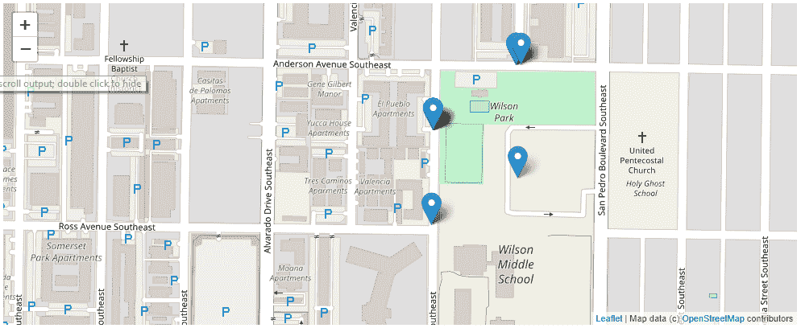

# 使用地理数据库进行地理处理

在第三章，“地理空间数据库简介”中，您学习了如何安装 PostGIS、创建表、添加数据以及执行基本空间查询。在本章中，您将学习如何与地理空间数据库一起工作以回答问题和制作地图。本章将指导您将犯罪数据加载到表中。一旦您的地理数据库用真实世界的数据填充，您将学习如何执行常见的犯罪分析任务。您将学习如何映射查询、按日期范围查询以及执行基本地理处理任务，如缓冲区、点在多边形内和最近邻。您将学习如何将小部件添加到您的 Jupyter 笔记本中，以便查询可以交互式地进行。最后，您将学习如何使用 Python 从您的地理空间查询创建图表。作为一名犯罪分析师，您将制作地图，但并非所有与 GIS 相关的任务都是基于地图的。分析师使用 GIS 数据来回答问题和创建报告。高管通常更熟悉图表和图形。

在本章中，您将学习：

+   如何使用空间查询执行地理处理任务

+   如何向您的表添加触发器

+   如何映射您的地理空间查询结果

+   如何绘制地理空间查询

+   如何使用 Jupyter 与查询交互并将小部件连接到您的查询

# 犯罪仪表板

要构建一个交互式**犯罪仪表板**，您需要收集数据来构建数据库。然后，您将查询数据并添加小部件，以便用户无需编写代码即可修改查询。最后，您将绘制和映射查询结果。

# 构建犯罪数据库

要构建犯罪仪表板的组件，我们将使用阿尔伯克基市的开放数据。阿尔伯克基市有犯罪事件、区域指挥和“beat”的数据集。通过将区域与“事件”结合，您将能够报告两个地理区域。然后，您可以使用邻里协会或任何其他边界——人口普查区块、群体或区域，并获取人口统计信息。

您可以在位于：[`www.cabq.gov/abq-data/`](http://www.cabq.gov/abq-data/) 的主要开放数据网站上找到数据链接。滚动到页面底部并查找“安全数据集”标题。

# 创建表

我们需要创建三个表来存储犯罪数据。我们需要一个表来：

1.  区域指挥

1.  beat

1.  事件

要创建表，我们需要导入所需的库：

```py
import psycopg2
import requests
from shapely.geometry import Point,Polygon,MultiPolygon, mapping
import datetime
```

珍贵的代码导入`psycopg2`以连接到 PostGIS，导入`requests`以调用服务以便您可以抓取数据，从`shapely.geometry`导入`Point`、`Polygon`和`MultiPolygon`以使将`GeoJSON`转换为对象更容易，以及`datetime`因为事件有一个`date`字段。

在第三章，《地理空间数据库简介》中，您创建了一个名为`pythonspatial`的数据库，并使用名为`postgres`的用户。我们将在该数据库中创建表。为了填充这些表，我们将从服务中复制一些字段。服务的图层页面底部有一个字段列表。

图层的 URL 链接到服务的根页面或图层编号。对于事件，图层的 URL 是：[`coagisweb.cabq.gov/arcgis/rest/services/public/APD_Incidents/MapServer/0`](http://coagisweb.cabq.gov/arcgis/rest/services/public/APD_Incidents/MapServer/0)。

每个字段都有类型和长度，用于`incidents`图层，如下所示：

+   `OBJECTID`（类型：esriFieldTypeOID，别名：Object_ID）

+   `Shape`（类型：esriFieldTypeGeometry，别名：Geometry）

+   `CV_BLOCK_ADD`（类型：esriFieldTypeString，别名：Location，长度：72）

+   `CVINC_TYPE`（类型：esriFieldTypeString，别名：Description，长度：255）

+   `date`（类型：esriFieldTypeDate，别名：Date，长度：8）

**支持的操作**：查询、生成渲染器、返回更新。

使用以下代码创建表：

```py
connection = psycopg2.connect(database="pythonspatial",user="postgres", password="postgres")
cursor = connection.cursor()

cursor.execute("CREATE TABLE areacommand (id SERIAL PRIMARY KEY, name VARCHAR(20), geom GEOMETRY)")

cursor.execute("CREATE TABLE beats (id SERIAL PRIMARY KEY, beat VARCHAR(6), agency VARCHAR(3), areacomm VARCHAR(15),geom GEOMETRY)")

cursor.execute("CREATE TABLE incidents (id SERIAL PRIMARY KEY, address VARCHAR(72), crimetype VARCHAR(255), date DATE,geom GEOMETRY)")

connection.commit()
```

之前的代码首先创建连接并获取`cursor`。然后创建`areacommand`表，包含一个`name`字段和一个`GEOMETRY`字段。在**ArcServer**服务中，区域命令字段长度为`20`，因此代码创建了一个名为`name`的字段，类型为`VARCHAR(20)`。接下来的两行创建了`beats`和`incidents`的表，最后，代码提交，使更改永久生效。

# 数据填充

在创建好表之后，我们需要获取数据并填充它们。以下代码将获取区域命令并将其插入到我们的表中：

```py
url='http://coagisweb.cabq.gov/arcgis/rest/services/public/adminboundaries/MapServer/8/query'
params={"where":"1=1","outFields":"*","outSR":"4326","f":"json"}
r=requests.get(url,params=params)
data=r.json()

for acmd in data['features']:
    polys=[]

    for ring in acmd['geometry']['rings']:
        polys.append(Polygon(ring))
    p=MultiPolygon(polys)
    name=acmd['attributes']['Area_Command']

    cursor.execute("INSERT INTO areacommand (name, geom) VALUES ('{}',
    ST_GeomFromText('{}'))".format(name, p.wkt))

 connection.commit()
```

之前的代码使用`requests`查询 URL，传递参数。参数仅获取所有数据（`1=1`），并获取所有字段（`*`），在参考`4326`和以`json`格式下。结果使用`json()`方法加载到变量`data`中。

要了解**环境系统研究学院**（**ESRI**）ArcServer 查询参数，请参阅以下 API 参考：[`coagisweb.cabq.gov/arcgis/sdk/rest/index.html#/Query_Map_Service_Layer/02ss0000000r000000/`](http://coagisweb.cabq.gov/arcgis/sdk/rest/index.html#/Query_Map_Service_Layer/02ss0000000r000000/)

下一段代码是`for`循环，用于插入数据。服务返回`json`，我们需要的数据存储在`features`数组中。对于`features`数组中的每个区域命令（`acmd`），我们将获取`name`和`geometry`。

`geometry`由多个`rings`组成——在本例中，因为我们的数据由多边形组成。我们需要遍历`rings`。为了做到这一点，代码中有一个另一个`for`循环，它遍历每个`ring`，创建一个多边形，并将其添加到`polys[]`中。当所有`rings`都被收集为多边形时，代码创建一个名为区域命令的单个`MultiPolygon`，并使用`cursor.execute()`将其插入表中。

SQL 是基本的插入命令，但使用了参数化查询和`ST_GeometryFromText()`。不要被这些附加功能分散注意力。使用以下基本查询构建查询：

```py
INSERT INTO table (field, field) VALUES (value,value)
```

要传递值，代码使用`.format()`。它传递字符串名称并使用 Shapely 将坐标转换为 WKT（`p.wkt`）。

你需要对`beats`表做同样的事情：

```py
url='http://coagisweb.cabq.gov/arcgis/rest/services/public/adminboundaries/MapServer/9/query'
params={"where":"1=1","outFields":"*","outSR":"4326","f":"json"}
r=requests.get(url,params=params)
data=r.json()

for acmd in data['features']:
    polys=[]
    for ring in acmd['geometry']['rings']:
        polys.append(Polygon(ring))
    p=MultiPolygon(polys)

    beat = acmd['attributes']['BEAT']
    agency = acmd['attributes']['AGENCY']
    areacomm = acmd['attributes']['AREA_COMMA']

    cursor.execute("INSERT INTO beats (beat, agency,areacomm,geom) VALUES ('{}','{}','{}',
    ST_GeomFromText('{}'))".format(beat,agency,areacomm,p.wkt))

connection.commit()
```

之前的代码与面积命令的代码相同，只是通过多个占位符（`'{}'`）传递额外的字段。

最后，我们需要添加`incidents`：

```py
url='http://coagisweb.cabq.gov/arcgis/rest/services/public/APD_Incidents/MapServer/0/query'
params={"where":"1=1","outFields":"*","outSR":"4326","f":"json"}
r=requests.get(url,params=params)
data=r.json()

for a in data["features"]:
    address=a["attributes"]["CV_BLOCK_ADD"]
    crimetype=a["attributes"]["CVINC_TYPE"]
    if a['attributes']['date'] is None:
        pass
    else:
        date = datetime.datetime.fromtimestamp(a['attributes']['date'] / 1e3).date()
    try:
        p=Point(float(a["geometry"]["x"]),float(a["geometry"]["y"]))
        cursor.execute("INSERT INTO incidents (address,crimetype,date, geom) VALUES
        ('{}','{}','{}', ST_GeomFromText('{}'))".format(address,crimetype,str(date), p.wkt))

   except KeyError:
        pass
connection.commit()
```

之前的代码使用`requests`获取数据。然后它遍历`features`。这个代码块有一些错误检查，因为有一些`features`有空白日期，还有一些没有坐标。如果没有`date`，代码会通过，并使用`try`，`catch`块接受一个`KeyError`，这将捕获缺失的坐标。

现在数据已加载到表中，我们可以开始查询数据并在地图和图表中展示它。

# 映射查询

在第三章，《地理空间数据库简介》中，你查询了数据库并返回了文本。`geometry`以**已知文本**（**WKT**）的形式返回。这是我们请求的结果，但我不能通过读取坐标列表来可视化地理数据。我需要在地图上看到它。在本节中，你将使用`ipyleaflet`和 Jupyter 来映射查询的结果。

要在 Jupyter 中映射查询，你需要安装`ipyleaflet`。你可以在操作系统的命令提示符中使用`pip`来完成此操作：

```py
pip install ipyleaflet
```

然后，你可能需要根据你的环境启用扩展。在命令提示符中输入：

```py
jupyter nbextension enable --py --sys-prefix ipyleaflet
```

对于代码和`ipyleaflet`的使用示例，你可以在 GitHub 仓库中查看：[`github.com/ellisonbg/ipyleaflet`](https://github.com/ellisonbg/ipyleaflet)

如果你在映射过程中遇到错误，你可能需要启用`widgetsnbextension`：

```py
jupyter nbextension enable --py --sys-prefix widgetsnbextension
```

如果你正在运行 Jupyter，你需要重新启动它。

在安装并启用`ipyleaflet`之后，你可以映射你的查询：

```py
import psycopg2
from shapely.geometry import Point,Polygon,MultiPolygon
from shapely.wkb import loads
from shapely.wkt import dumps, loads
import datetime
import json
from ipyleaflet import (
    Map, Marker,
    TileLayer, ImageOverlay,
    Polyline, Polygon, Rectangle, Circle, CircleMarker,
    GeoJSON
)
```

之前的代码导入了我们需要查询和映射数据的库。让我们建立`connection`并获取`cursor`，如下面的代码所示：

```py
connection = psycopg2.connect(database="pythonspatial",user="postgres", password="postgres")
cursor = connection.cursor()
```

在第三章，《地理空间数据库简介》中，所有的查询都使用了`ST_AsText()`来返回`geometry`。现在，由于我们将要映射结果，如果它们以`GeoJSON`返回将会更容易。在下面的代码中，你将使用`ST_AsGeoJSON()`来获取`geometry`：

```py
cursor.execute("SELECT name, ST_AsGeoJSON(geom) from areacommand")
c=cursor.fetchall()
c[0]
```

上述查询获取了 `areacommand` 表中的所有记录，包括它们的 `name` 和作为 `GeoJSON` 的 `geometry`，然后打印第一条记录 (`c[0]`)。结果如下：

```py
('FOOTHILLS',
 '{"type":"MultiPolygon","coordinates":[[[[-106.519742762931,35.0505292241227],[-106.519741401085,35.0505292211811],[-106.51973952181,35.0505292175042],[-106.518248463965,35.0505262104449],[-106.518299012166,35.0517336649125],[-106.516932057477,35.0537380198153],....]]]}
```

`ST_AsText` 和 `ST_AsGeoJSON` 是从 PostGIS 中获取 `几何形状` 的 17 种方法中的两种。有关可用返回类型的完整列表，请参阅 PostGIS 参考文档：[`postgis.net/docs/reference.html#Geometry_Accessors`](https://postgis.net/docs/reference.html#Geometry_Accessors)

现在你已经有了一些 `GeoJSON`，是时候创建一个地图来显示它了。要创建 leaflet 地图，请使用以下代码：

```py
center = [35.106196,-106.629515]
zoom = 10
map = Map(center=center, zoom=zoom)
map
```

上述代码定义了地图的 `中心`，对于阿尔伯克基，我总是使用 I-25 和 I-40 的交汇处。这个交汇处将城市分为四个象限。然后代码定义了 `缩放` 级别——数字越高，`缩放` 越近。最后，它打印出地图。

你将有一个带有 `OpenStreetMap` 瓦片的空白底图。在 Jupyter 中，当你向地图添加数据时，你可以滚动回地图的原始打印版以查看数据；你不需要每次都重新打印地图。

区域命令的 `GeoJSON` 存储在变量 `c` 中。对于每个项目 `c[x]`，`GeoJSON` 位于位置 `1` `(c[x][1])`。以下代码将遍历 `c` 并将 `GeoJSON` 添加到地图中：

```py
for x in c:
   layer=json.loads(x[1])
   layergeojson=GeoJSON(data=layer)
   map.add_layer(layergeojson)
```

上述代码使用 `json.loads()` 将 `GeoJSON` 分配给一个图层。这将使返回的 `GeoJSON` 字符串在 Python 中成为一个字典。接下来，代码在图层上调用 `ipyleaflet GeoJSON()` 方法，并将其传递给变量 `layergeojson`。最后，在地图上调用 `add_layer()` 并传递 `layergeojson`。在 Jupyter 中绘制地图还有其他方法；例如，你可以使用 Matplotlib、Plotly 或 Bokeh 来绘制它们。如果你来自网络制图，你可能已经熟悉了 Leaflet JavaScript 库，这将使使用 `ipyleaflet` 变得熟悉。此外，`ipyleaflet` 加载底图并提供交互性。

如果你滚动到地图上方，你应该看到如下截图：


在`cursor.execute()`中更改 SQL 查询，你可以映射 `beats`：

```py
cursor.execute("SELECT beat, ST_AsGeoJSON(geom) from beats")
c=cursor.fetchall()
for x in c:
   layer=json.loads(x[1])
   layergeojson=GeoJSON(data=layer)
   map.add_layer(layergeojson)
```

你应该看到 `beats` 如下绘制：


你可以为 `incidents` 做同样的事情，但我们现在先保留这个，因为数据集中有近 30,000 个 `incidents`，这会使得我们的地图显得过于拥挤。为了在地图上显示 `incidents`，我们将使用空间查询来限制我们的选择。

# 按日期统计事件

限制事件查询结果的一种方法是通过 `日期`。使用 Python 的 `datetime` 库，你可以指定一个 `日期`，然后查询该 `日期` 的事件，并将结果的 `几何形状` 作为 `GeoJSON` 添加到你的地图中：

```py
d=datetime.datetime.strptime('201781','%Y%m%d').date() 
cursor.execute("SELECT address,crimetype,date,ST_AsGeoJSON(geom) from incidents where date =
'{}' ".format(str(d)))
incidents_date=cursor.fetchall()
for x in incidents_date:
    layer=json.loads(x[3])
    layergeojson=GeoJSON(data=layer)
    map.add_layer(layergeojson)
```

上一段代码指定了一个日期（YYYYMD）为 2017 年 8 月 1 日。它查询我们使用的“事件”表，其中`date = d`并将几何返回为`GeoJSON`。然后它使用您用于区域命令的`for`循环和`beats`来映射“事件”。

当您在 Jupyter Notebook 中创建地图时，后续的代码块将修改该地图。您可能需要向上滚动以查看地图以查看更改。

您之前创建的地图现在将看起来像以下截图：


除了指定特定的日期外，您还可以获取所有日期大于特定日期的“事件”：

```py
d=datetime.datetime.strptime('201781','%Y%m%d').date() 
cursor.execute("SELECT address,crimetype,date,ST_AsGeoJSON(geom) from incidents where date >
'{}' ".format(str(d)))
```

或者，您也可以查询早于今天的日期间隔：

```py
cursor.execute("select * from incidents where date >= NOW() - interval '10 day'")
```

上一段代码使用`NOW()`方法和 10 天间隔。通过指定`>=`，您将获得所有 10 天前以及更近期的犯罪。我在 2017 年 11 月 24 日写了这篇文章，所以结果将是 11 月 14 日（th）直到今天的所有“事件”。

# 多边形内的“事件”

我们的犯罪数据库有一个多边形区域——区域命令和`beats`——以及事件点。为了构建犯罪仪表板，我们希望能够在特定的区域命令或`beat`内映射“事件”。我们可以通过使用`JOIN`和`ST_Intersects`来实现这一点。以下代码向您展示了如何操作：

```py
cursor.execute("SELECT ST_AsGeoJSON(i.geom) FROM incidents i JOIN areacommand acmd ON ST_Intersects(acmd.geom, i.geom) WHERE acmd.name like'FOOTHILLS' and date >= NOW() - interval '10 day';")

crime=cursor.fetchall()
for x in crime:
    layer=json.loads(x[0])
    layergeojson=GeoJSON(data=layer)
    map.add_layer(layergeojson)
```

上一段代码从“事件”中选择“几何”作为`GeoJSON`（从“事件”中的`ST_AsGeoJSON(i.geom)`），其中事件`ST_Intersects`与多边形区域命令相交，具体来说，区域命令的名称是`FOOTHILLS`。代码通过将事件和区域命令表连接起来，其中相交为真来限制结果。代码通过仅选择过去 10 天的犯罪来限制结果。

代码随后遍历结果并将它们映射，就像之前的示例一样。您应该看到以下截图：


上一张截图显示了在“山丘”区域命令上叠加的“事件”。注意所有“事件”都在多边形内部。

您可以通过更改 SQL 查询来为特定的`beats`做同样的事情。以下代码将映射特定的`beats`：

```py
cursor.execute("SELECT ST_AsGeoJSON(geom)from beats where beats.beat in ('336','523','117','226','638','636')")

c=cursor.fetchall()
for x in c:
    layer=json.loads(x[0])
    layergeojson=GeoJSON(data=layer)
    map.add_layer(layergeojson)
```

上一段代码使用`beats.beat`字段的数组。在 Python 中，数组是`[]`，但在 SQL 语句中，使用括号。结果是指定的`beats`。然后，代码将它们映射。

使用相同的指定`beats`，我们可以通过在`ST_Intersects()`上与`beats`进行连接来选择“事件”，并按代码所示映射“事件”：

```py
cursor.execute("SELECT ST_AsGeoJSON(i.geom) FROM incidents i JOIN beats b ON ST_Intersects(b.geom, i.geom) WHERE b.beat in ('336','523','117','226','638','636') and date >= NOW() - interval '10 day';")

crime=cursor.fetchall()
for x in crime:
    layer=json.loads(x[0])
    layergeojson=GeoJSON(data=layer)
    map.add_layer(layergeojson)
```

上一段代码传递了`beats`数组并再次通过最后 10 天进行过滤。然后它映射了“事件”，如下面的截图所示：


# 缓冲区

您已经从表中映射了数据，但现在您将映射地理处理任务的输出结果——缓冲区。

要编写一个缓冲区示例代码，我们首先需要创建一个点。以下代码将为我们完成这项工作：

```py
from shapely.geometry import mapping
p = Point([-106.578677,35.062485])
pgeojson=mapping(p)
player=GeoJSON(data=pgeojson)
map.add_layer(player)
```

之前的代码使用 Shapely 创建一个点，然后使用`shapely.geometry.mapping()`将其转换为`GeoJSON`。接下来的两行允许我们在地图上显示它。

PostGIS 允许你将数据发送到数据库并获取数据，这些数据不必都在表中。例如，检查以下代码：

```py
cursor.execute("SELECT ST_AsGeoJSON(ST_Buffer(ST_GeomFromText('{}')::geography,1500));".format(p.wkt))
buff=cursor.fetchall()
buffer=json.loads(buff[0][0])
bufferlayer=GeoJSON(data=buffer)
map.add_layer(bufferlayer)
```

之前的代码使用`ST_Buffer()`从 PostGIS 获取一个多边形。`ST_Buffer()`可以接受一个点地理和半径（以米为单位）来返回多边形。代码将结果包装在`ST_AsGeoJSON`中，以便我们可以进行映射。在这个例子中，结果集是一个单独的项目，所以我们不需要`for`循环。代码加载结果`buff[0][0]`并将其映射。

之前代码的结果显示在下述截图：


现在我们有一个多边形，我们可以用它来选择`incidents`。以下代码将执行与之前相同的查询，但我们将使用`ST_AsText`而不是`ST_AsGeoJSON`。我们不是映射多边形，而是将其用作点在多边形操作中的参数：

```py
cursor.execute("SELECT ST_AsText(ST_Buffer(ST_GeomFromText('{}')::geography,1500));".format(p.wkt))
bufferwkt=cursor.fetchall()
b=loads(bufferwkt[0][0])
```

在之前的代码中，查询结果通过`loads()`传递给名为`b`的`shapely`多边形。现在，你可以使用`ST_Intersects()`将这个多边形传递给另一个查询，如下所示：

```py
cursor.execute("SELECT ST_AsGeoJSON(incidents.geom) FROM incidents where ST_Intersects(ST_GeomFromText('{}'), incidents.geom) and date >= NOW() - interval '10 day';".format(b.wkt))
crime=cursor.fetchall()
for x in crime:
    layer=json.loads(x[0])
    layergeojson=GeoJSON(data=layer)
    map.add_layer(layergeojson)
```

之前的代码选择与`buffer`（`b.wkt`）相交的`incidents`，以及在过去 10 天内的`incidents`。结果被映射。以下地图显示了之前代码的输出：


# 最近邻

使用`buffer`，你可以获取到兴趣点周围指定半径内的所有`incidents`。但如果你只想获取 5 个、10 个或 15 个最近的`incidents`呢？为了做到这一点，你可以使用`<->`运算符或 k-最近邻算法。

你可以使用以下代码选择距离指定点最近的`15`个点：

```py
p = Point([-106.578677,35.062485])
cursor.execute("SELECT ST_AsGeoJSON(incidents.geom), ST_Distance(incidents.geom::geography,ST_GeometryFromText('{}')::geography) from incidents ORDER BY incidents.geom<->ST_GeometryFromText('{}') LIMIT 15".format(p.wkt,p.wkt))
c=cursor.fetchall()
for x in c:
    layer=json.loads(x[0])
    layergeojson=GeoJSON(data=layer)
    map.add_layer(layergeojson)
```

之前的代码使用 Shapely 创建一个点，并在 SQL 查询中使用它。查询选择`geometry`作为`GeoJSON`的`incidents`，然后计算每个`incidents`与指定点的距离。`ORDER BY`子句、`<->`运算符和限制子句确保我们按接近程度顺序获取最近的`15`个点。

代码的最后一段是我们将结果添加到地图中的代码。结果显示在下述截图。截图中心的是指定的点：



现在你已经知道了如何映射空间查询的结果，让我们添加交互式小部件来修改查询并更改地图，而无需编写新代码。

# 交互式小部件

在本章的开头，你学习了如何根据`date`查询和映射`incidents`。在 Jupyter 中，你可以使用交互式小部件来更改值。以下代码将帮助我们了解如何使用`ipywidgets`导入`interact`，这将允许你插入一个`DatePicker`，以便你可以选择一个`date`与笔记本进行交互：


之前的代码导入`interact`和`DatePicker`小部件。在最简单的情况下，之前的截图显示了一个装饰器和函数，允许交互式选择日期并将其作为字符串显示。

当`DatePicker`改变时，`x`（`DatePicker`）被发送到函数`theDate(x)`，并且`x`作为字符串打印出来。实际的返回值是`datetime.date`。

使用`DatePicker`小部件，你可以将`date`值传递给 SQL 查询，然后映射结果。当`DatePicker`改变时，你可以擦除地图并显示新的结果。以下代码将向您展示如何操作：

```py
from ipywidgets import interact, interactive, fixed, interact_manual,DatePicker
import ipywidgets as widgets

@widgets.interact(x=DatePicker())
def theDate(x):

    if x:
        for l in map.layers[1:]:
        map.remove_layer(l)
    nohyphen=str(x).replace("-","")
    d=datetime.datetime.strptime(nohyphen,'%Y%m%d').date() 
    cursor.execute("SELECT ST_AsGeoJSON(geom) from incidents where date 
    = '{}' ".format(str(d))) 
    c=cursor.fetchall()

    for x in c:
        layer=json.loads(x[0])
        layergeojson=GeoJSON(data=layer)
        map.add_layer(layergeojson)
    return len(c)

    else:
        pass
```

之前的代码创建了一个交互式`DatePicker`小部件。代码中有一个`if...else`语句，因为第一次遍历时，`x`将是`none`。`DatePicker`没有被选择，所以在第一次遍历时我们`pass`。

接下来，代码获取地图上的所有图层，并使用`map.remove_layer()`从第二个（`[1:]`）图层开始删除它们。为什么是第二个图层？因为地图上的第一个图层是`TileLayer`——基础地图。我们希望它保持不变，并且只删除从 SQL 查询中添加的标记。

然后，代码从`date`字符串中删除连字符，并将其转换为`datetime`。一旦它成为`datetime`，你就可以将其传递给 SQL 查询。

下一个代码块是你在本章中用来将查询结果添加到地图上的相同代码块。

选择 2017 年 11 月 2 日的日期，如下截图所示：


当选择 2017 年 11 月 8 日时，地图被重新绘制并显示在以下截图中：


这些截图是在重新选择日期后立即生成的。用户可以使用`DatePicker`下拉菜单重新查询你的 PostGIS 数据库中的数据。

在 Jupyter 中，如果你将变量的值设置为字符串或整数，你将得到一个数字滑块或文本框。在以下截图中，装饰器有`x="None"`，其中`None`是一个字符串。文本`None`是一个占位符，用于创建文本框。这将在文本框中创建一个包含单词`None`的文本框：


上一张截图中的代码如下所示。该代码将允许你输入区域命令的名称，然后显示该区域命令内的`incidents`：

```py
@widgets.interact(x="None")
def areaCommand(x):
    if x:
        for l in map.layers[1:]:
            map.remove_layer(l)
        cursor.execute("SELECT ST_AsGeoJSON(i.geom) FROM incidents i 
        JOIN areacommand acmd ON   
        ST_Intersects(acmd.geom, i.geom) WHERE acmd.name like'{}' and 
        date >= NOW() - interval '10 
        day';".format(x))
        c=cursor.fetchall()

        for x in c:
            layer=json.loads(x[0])
            layergeojson=GeoJSON(data=layer)
            map.add_layer(layergeojson)
        return c
    else:
        pass
```

之前的代码从装饰器和字符串开始。这将绘制文本框。`areaCommand()`函数与前面提到的`date`示例作用相同，但它将字符串传递给 SQL 查询。它返回查询结果，并在地图上绘制`incidents`。

以下截图显示了`NORTHWEST`的返回值：


以下截图显示了用户在文本框中输入`NORTHWEST`时的地图：


在本节中，你学习了如何对空间数据进行查询，以及如何映射结果。在下一节中，你将学习如何绘制查询结果。

# 图表

地图是出色的数据可视化工具，但有时条形图也能解决问题。在本节中，你将学习如何使用 `pandas.DataFrame` 绘制你的数据图表。

`DataFrame` 存储二维表格数据（想想电子表格）。数据帧可以从许多不同的来源和数据结构中加载数据，但我们感兴趣的是它可以从 SQL 查询中加载数据。

以下代码将 SQL 查询加载到`DataFrame`中：

```py
import pandas as pd
d=datetime.datetime.strptime('2017101','%Y%m%d').date()
cursor.execute("SELECT date, count(date) from incidents where date > '{}' group by date".format(str(d)))
df=pd.DataFrame(cursor.fetchall(),columns=["date","count"])
df.head()
```

之前的代码选择了“日期”，然后计算在`incidents`中日期大于 2017 年 10 月 1 日的每个“日期”的出现次数。然后使用 `DataFrame`（SQL，列）填充`DataFrame`。在这种情况下，代码传递 `cursor.fetchall()`*，* 和 `columns=["date","count"]`。使用 `df.head()` 显示了五条记录的结果。你可以使用 `df.tail()` 来查看最后五条记录，或者使用 `df` 来查看所有记录。

以下截图显示 `df.head()`：


前面的截图显示，在 2017-10-17，有 175 个“事件”。

你可以通过从 `pandas` 库调用 `plot()` 方法来绘制`DataFrame`。以下代码将绘制`df`的条形图：

```py
df.sort_values(by='date').plot(x="date",y="count",kind='bar',figsize=(15,10))
```

之前的代码按“日期”对数据帧进行排序。这样，我们的条形图中的日期就按时间顺序排列。然后使用条形图绘制数据，其中 *x* 轴是“日期”，*y* 轴是“计数”。我指定了图形大小，使其适合屏幕。对于较小的数据集，默认图形大小通常效果很好。

以下截图是 `plot` 的结果：


此图表向我们展示了地图无法展示的内容——犯罪似乎在周五和周六有所减少。

让我们通过使用`beats`的另一个示例来了解。以下代码将按`beat`加载犯罪：

```py
cursor.execute("SELECT beats.beat, beats.agency, count(incidents.geom) as crimes from beats left join incidents on ST_Contains(beats.geom,incidents.geom) group by beats.beat, beats.agency")
area=pd.DataFrame(cursor.fetchall(),columns=["Area","Agency","Crimes"])
area.head()
```

之前的代码从`beats`表中选择了`beat`、`agency`和`incidents`的计数。注意`left join`。`left join`将给我们可能没有`incidents`的`beats`。连接基于事件位于`beat`多边形内。我们按每个选定的字段进行分组。

查询被加载到`DataFrame`中，并显示`head()`。结果如下截图所示：


注意，我们没有“无犯罪”的`beats`，而是缺失的`beats`。`beats`太多，无法滚动查看，所以让我们绘制`DataFrame`。我们将再次使用绘图函数，传递以下 `x`、`y`、`kind` 和 `figsize`：

```py
area.plot(x="Area",y="Crimes",kind='bar',figsize=(25,10))
```

绘图的结果如下截图所示：


需要查看的数据量很大，但某些 `beats` 作为高犯罪率区域而突出。这是数据帧可以帮助的地方。您可以查询 `DataFrame` 而不是重新查询数据库。以下代码将绘制 `beats` 的选择：

```py
area[(area['Crimes']>800)].plot(x='Area',y='Crimes',kind='bar')
```

上述代码将一个表达式传递给区域。该表达式选择 `DataFrame` 列 `Crimes` 中的记录，其中值超过 `800`；`Crimes` 是 `count` 列。结果如以下截图所示：


将您的查询加载到 `DataFrame` 中将允许您绘制数据，但还可以在不重新查询数据库的情况下再次切片和查询数据。您还可以使用交互式小部件允许用户修改图表，就像您使用地图学习的那样。

# 触发器

在任何数据库中，当数据被插入、更新或删除时，您可以让表启动一个 **触发器**。例如，如果用户插入一条记录，您可以启动一个触发器以确保记录满足某些指定的标准——没有空值。空间数据库允许您使用相同的触发器。您可以使用多种语言创建这些触发器，包括 Python 和 SQL。以下示例将使用 `PL/pgsql`。

您可以使用 SQL 表达式创建触发器。以下代码将创建一个触发器以防止输入不完整的事件：

```py
query=('CREATE FUNCTION newcrime()'+'\n'
 'RETURNS trigger' +'\n'
 'AS $newcrime$' +'\n'
 'BEGIN' +'\n'
 'IF NEW.crimetype IS NULL THEN'+'\n'
 'RAISE EXCEPTION' +" '% Must Include Crime Type', NEW.address;"+'\n'
 'END IF;'+'\n'
 'RETURN NEW;'+'\n'
 'END;'+'\n'
 '$newcrime$'+'\n'
 'LANGUAGE \'plpgsql\';'
 )
 cursor.execute(query)
```

上述代码创建了一个名为 `newcrime()` 的新函数。该函数是一个 `if` 语句，用于检查 `NEW.crimetype` 是否为空。如果是，则不添加记录，并引发异常。异常将指出 `NEW.address` 必须包含犯罪类型。假设地址不为空。

现在您已经有一个函数，您可以创建一个调用该函数的触发器。以下代码展示了如何操作：

```py
query=('CREATE TRIGGER newcrime BEFORE INSERT OR UPDATE ON incidents FOR EACH ROW EXECUTE PROCEDURE newcrime()')
cursor.execute(query)
connection.commit()
```

上述代码执行创建触发器的 SQL 语句。它是在 `BEFORE INSERT OR UPDATE` 时创建的。为了测试触发器，让我们插入一个没有犯罪类型的点。以下代码将尝试输入事件：

```py
p=Point([-106,35])
address="123 Sesame St"
cursor.execute("INSERT INTO incidents (address, geom) VALUES ('{}', ST_GeomFromText('{}'))".format(address, p.wkt))
```

上述代码创建了一个只有 `address` 和 `geom` 的事件。执行上述代码的结果如以下截图所示：


在前面的截图中，内部错误指出 123 芝麻街必须包含犯罪类型。我们的触发器成功阻止了不良数据的输入。为了双重检查，我们可以查询 `"123 芝麻街"`。结果如以下截图所示：


触发器可以用于在发生更改时防止加载不良数据用于电子邮件或短信。例如，您可以允许用户输入他们感兴趣的多边形及其电话号码。当数据库中添加新事件时，您可以检查它是否在多边形内，如果是，则向与多边形关联的电话号码发送短信。

要安装触发器的其他语言，请打开 **Stack Builder** 并添加以下截图所示的附加组件：


# 摘要

在本章中，你学习了如何使用空间查询来执行地理处理任务。你还学习了如何使用 `ipyleaflet` 和数据框来映射和图表查询结果。你学习了如何使用 Jupyter 中的交互式小部件来修改地图和查询。最后，你了解了触发器的工作原理，并看到了一个使用触发器进行数据检查的快速示例。

在下一章中，你将学习如何使用 QGIS 执行地理处理任务。你将学习如何使用 QGIS 中已包含的工具箱。你将学习如何编写自己的工具箱，以便你可以使用并与其他 QGIS 用户共享，你还将学习如何使用 QGIS 来映射结果。结果可以保存为 QGIS 项目，或作为 QGIS 的许多空间数据格式之一。
