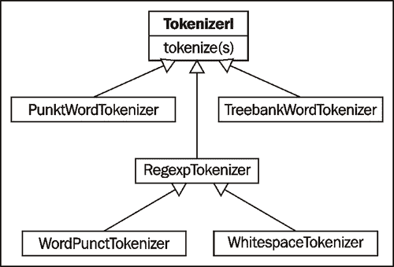

# 第一章. 分词文本和 WordNet 基础知识

本章我们将介绍：

+   将文本分词成句子

+   将句子分词成单词

+   使用正则表达式进行句子分词

+   在分词后的句子中过滤停用词

+   在 WordNet 中查找一个单词的 synset

+   在 WordNet 中查找词元和同义词

+   计算 WordNet synset 相似度

+   发现词组

# 简介

**NLTK**是**自然语言工具包**，是一个用于自然语言处理和文本分析的综合性 Python 库。最初是为教学设计的，由于其有用性和广泛的应用范围，它已被工业界用于研究和开发。

本章将介绍分词文本和使用 WordNet 的基础知识。**分词**是将一段文本分解成许多片段的方法，是后续章节中食谱的必要第一步。

**WordNet**是为自然语言处理系统程序化访问而设计的词典。NLTK 包括一个 WordNet 语料库读取器，我们将使用它来访问和探索 WordNet。我们将在后续章节中再次使用 WordNet，因此首先熟悉其基础知识很重要。

# 将文本分词成句子

分词是将字符串分割成一系列片段或*标记*的过程。我们将从将一个段落分割成句子列表开始。

## 准备工作

NLTK 的安装说明可在[`www.nltk.org/download`](http://www.nltk.org/download)找到，截至本文写作的最新版本是 2.0b9。NLTK 需要 Python 2.4 或更高版本，但**不兼容 Python 3.0**。**推荐的 Python 版本是 2.6**。

一旦安装了 NLTK，你还需要按照[`www.nltk.org/data`](http://www.nltk.org/data)上的说明安装数据。我们建议安装所有内容，因为我们将在后续章节中使用多个语料库和 pickle 对象。数据安装在数据目录中，在 Mac 和 Linux/Unix 系统中通常是`/usr/share/nltk_data`，在 Windows 系统中是`C:\nltk_data`。请确保`tokenizers/punkt.zip`在数据目录中，并且已经解压，以便在`tokenizers/punkt/english.pickle`中有一个文件。

最后，为了运行代码示例，你需要启动一个 Python 控制台。有关如何操作的说明可在[`www.nltk.org/getting-started`](http://www.nltk.org/getting-started)找到。对于 Mac 和 Linux/Unix 用户，你可以打开一个终端并输入**python**。

## 如何实现...

一旦安装了 NLTK 并且你有一个 Python 控制台正在运行，我们可以从创建一段文本开始：

```py
>>> para = "Hello World. It's good to see you. Thanks for buying this book."
```

现在我们想将`para`分割成句子。首先我们需要导入句子分词函数，然后我们可以用段落作为参数调用它。

```py
>>> from nltk.tokenize import sent_tokenize
>>> sent_tokenize(para)
['Hello World.', "It's good to see you.", 'Thanks for buying this book.']
```

因此，我们现在有一系列句子可以用于进一步处理。

## 工作原理...

`sent_tokenize` 使用来自 `nltk.tokenize.punkt` 模块的 `PunktSentenceTokenizer` 实例。这个实例已经在许多欧洲语言上进行了训练，并且效果良好。因此，它知道哪些标点符号和字符标志着句子的结束和新一行的开始。

## 还有更多...

`sent_tokenize()` 中使用的实例实际上是从 pickle 文件中按需加载的。所以如果你要分词大量句子，一次性加载 `PunktSentenceTokenizer` 并调用其 `tokenize()` 方法会更有效率。

```py
>>> import nltk.data
>>> tokenizer = nltk.data.load('tokenizers/punkt/english.pickle')
>>> tokenizer.tokenize(para)
['Hello World.', "It's good to see you.", 'Thanks for buying this book.']
```

### 其他语言

如果你想要对非英语语言的句子进行分词，你可以加载 `tokenizers/punkt` 中的其他 pickle 文件，并像使用英语句子分词器一样使用它。以下是一个西班牙语的例子：

```py
>>> spanish_tokenizer = nltk.data.load('tokenizers/punkt/spanish.pickle')
>>> spanish_tokenizer.tokenize('Hola amigo. Estoy bien.')
```

## 参见

在下一个菜谱中，我们将学习如何将句子分割成单个单词。之后，我们将介绍如何使用正则表达式进行文本分词。

# 将句子分词成单词

在这个菜谱中，我们将一个句子分割成单个单词。从字符串中创建单词列表的简单任务是所有文本处理的基本部分。

## 如何做到...

基本单词分词非常简单：使用 `word_tokenize()` 函数：

```py
>>> from nltk.tokenize import word_tokenize
>>> word_tokenize('Hello World.')
['Hello', 'World', '.']
```

## 它是如何工作的...

`word_tokenize()` 是一个包装函数，它在一个 `TreebankWordTokenizer` 实例上调用 `tokenize()`。它等同于以下代码：

```py
>>> from nltk.tokenize import TreebankWordTokenizer
>>> tokenizer = TreebankWordTokenizer()
>>> tokenizer.tokenize('Hello World.')
['Hello', 'World', '.']
```

它通过使用空格和标点符号来分隔单词。正如你所见，它不会丢弃标点符号，这让你可以决定如何处理它们。

## 还有更多...

忽略显然命名的 `WhitespaceTokenizer` 和 `SpaceTokenizer`，还有两个其他值得关注的单词分词器：`PunktWordTokenizer` 和 `WordPunctTokenizer`。它们与 `TreebankWordTokenizer` 的不同之处在于它们处理标点和缩写的方式，但它们都继承自 `TokenizerI`。继承关系如下：



### 缩写

`TreebankWordTokenizer` 使用在宾州树库语料库中找到的约定，我们将在第四章（ch04.html）*词性标注*和第五章（ch05.html）*提取词组*中用于训练。这些约定之一是分隔缩写。例如：

```py
>>> word_tokenize("can't")
['ca', "n't"]
```

如果你觉得这个约定不可接受，那么请继续阅读以了解替代方案，并查看下一个菜谱，了解如何使用正则表达式进行分词。

### PunktWordTokenizer

另一个可选的单词分词器是 `PunktWordTokenizer`。它会在标点符号处分割，但会将标点符号与单词一起保留，而不是创建单独的标记。

```py
>>> from nltk.tokenize import PunktWordTokenizer
>>> tokenizer = PunktWordTokenizer()
>>> tokenizer.tokenize("Can't is a contraction.")
['Can', "'t", 'is', 'a', 'contraction.']
```

### WordPunctTokenizer

另一个可选的单词分词器是 `WordPunctTokenizer`。它将所有标点符号分割成单独的标记。

```py
>>> from nltk.tokenize import WordPunctTokenizer
>>> tokenizer = WordPunctTokenizer()
>>> tokenizer.tokenize("Can't is a contraction.")
['Can', "'", 't', 'is', 'a', 'contraction', '.']
```

## 参见

为了更好地控制单词分词，你可能需要阅读下一个菜谱，了解如何使用正则表达式和 `RegexpTokenizer` 进行分词。

# 使用正则表达式进行句子分词

如果你想要完全控制如何标记化文本，可以使用正则表达式。由于正则表达式可能会很快变得复杂，我们只建议在之前的配方中提到的单词标记化器不可接受时使用它们。

## 准备工作

首先，你需要决定你想要如何标记化一段文本，因为这将决定你如何构建你的正则表达式。选择包括：

+   匹配标记

+   匹配分隔符，或间隔

我们将从第一个示例开始，匹配字母数字标记和单引号，这样我们就不需要分割缩略语。

## 如何操作...

我们将创建一个`RegexpTokenizer`的实例，给它一个用于匹配标记的正则表达式字符串。

```py
>>> from nltk.tokenize import RegexpTokenizer
>>> tokenizer = RegexpTokenizer("[\w']+")
>>> tokenizer.tokenize("Can't is a contraction.")
["Can't", 'is', 'a', 'contraction']
```

如果你不想实例化类，你也可以使用一个简单的辅助函数。

```py
>>> from nltk.tokenize import regexp_tokenize
>>> regexp_tokenize("Can't is a contraction.", "[\w']+")
["Can't", 'is', 'a', 'contraction']
```

现在我们终于有一种可以处理缩略语作为整个单词的方法，而不是将它们分割成标记。

## 工作原理...

`RegexpTokenizer`通过编译你的模式，然后在你的文本上调用`re.findall()`来工作。你可以使用`re`模块自己完成所有这些操作，但`RegexpTokenizer`实现了`TokenizerI`接口，就像之前配方中的所有单词标记化器一样。这意味着它可以被 NLTK 包的其他部分使用，例如语料库读取器，我们将在第三章创建自定义语料库中详细讨论。许多语料库读取器需要一个方法来标记化他们正在读取的文本，并且可以接受可选的关键字参数来指定一个`TokenizerI`子类的实例。这样，如果你觉得默认标记化器不合适，你可以提供自己的标记化器实例。

## 更多...

`RegexpTokenizer`也可以通过匹配间隔来工作，而不是匹配标记。它不会使用`re.findall()`，而是使用`re.split()`。这就是`nltk.tokenize`中的`BlanklineTokenizer`是如何实现的。

### 简单空白标记化器

这里是一个使用`RegexpTokenizer`在空白处进行标记化的简单示例：

```py
>>> tokenizer = RegexpTokenizer('\s+', gaps=True)
>>> tokenizer.tokenize("Can't is a contraction.")
 ["Can't", 'is', 'a', 'contraction.']
```

注意，标点符号仍然保留在标记中。

## 参见

对于更简单的单词标记化，请参阅之前的配方。

# 在标记化句子中过滤停用词

**停用词**是通常不贡献于句子意义的常见单词，至少对于信息检索和自然语言处理的目的来说是这样。大多数搜索引擎都会从搜索查询和文档中过滤掉停用词，以节省索引空间。

## 准备工作

NLTK 附带了一个包含许多语言单词列表的停用词语料库。请确保解压缩数据文件，以便 NLTK 可以在`nltk_data/corpora/stopwords/`中找到这些单词列表。

## 如何操作...

我们将创建一个包含所有英语停用词的集合，然后使用它来过滤句子中的停用词。

```py
>>> from nltk.corpus import stopwords
>>> english_stops = set(stopwords.words('english'))
>>> words = ["Can't", 'is', 'a', 'contraction']
>>> [word for word in words if word not in english_stops]
["Can't", 'contraction']
```

## 工作原理...

停用词语料库是 `nltk.corpus.reader.WordListCorpusReader` 的一个实例。因此，它有一个 `words()` 方法，可以接受单个参数作为文件 ID，在这种情况下是 `'english'`，指的是包含英语停用词列表的文件。您也可以不带参数调用 `stopwords.words()`，以获取所有可用的语言的停用词列表。

## 还有更多...

您可以使用 `stopwords.words('english')` 或通过检查 `nltk_data/corpora/stopwords/english` 中的单词列表文件来查看所有英语停用词。还有许多其他语言的停用词列表。您可以使用 `fileids()` 方法查看完整的语言列表：

```py
>>> stopwords.fileids()
['danish', 'dutch', 'english', 'finnish', 'french', 'german', 'hungarian', 'italian', 'norwegian', 'portuguese', 'russian', 'spanish', 'swedish', 'turkish']
```

这些 `fileids` 中的任何一个都可以用作 `words()` 方法的参数，以获取该语言的停用词列表。

## 参见

如果您想创建自己的停用词语料库，请参阅 第三章 中的 *Creating a word list corpus* 菜谱，*Creating Custom Corpora*，了解如何使用 `WordListCorpusReader`。我们还将在此章后面的 *Discovering word collocations* 菜谱中使用停用词。

# 在 WordNet 中查找单词的同义词集

WordNet 是英语的词汇数据库。换句话说，它是一个专门为自然语言处理设计的字典。

NLTK 提供了一个简单的接口来查找 WordNet 中的单词。您得到的是 **synset** 实例的列表，这些实例是表达相同概念的同类词的分组。许多单词只有一个同义词集，但有些有几个。我们现在将探索一个同义词集，在下一道菜谱中，我们将更详细地查看几个同义词集。

## 准备工作

确保您已将 `wordnet` 语料库解压缩到 `nltk_data/corpora/wordnet`。这将允许 `WordNetCorpusReader` 访问它。

## 如何操作...

现在我们将查找 `cookbook` 的 `synset`，并探索同义词集的一些属性和方法。

```py
>>> from nltk.corpus import wordnet
>>> syn = wordnet.synsets('cookbook')[0]
>>> syn.name
'cookbook.n.01'
>>> syn.definition
'a book of recipes and cooking directions'
```

## 它是如何工作的...

您可以使用 `wordnet.synsets(word)` 在 WordNet 中查找任何单词，以获取同义词集列表。如果找不到单词，列表可能为空。列表也可能包含很多元素，因为一些单词可能有多种可能的含义，因此有多个同义词集。

## 还有更多...

列表中的每个同义词集都有一些属性，您可以使用这些属性来了解更多关于它的信息。`name` 属性将为您提供同义词集的唯一名称，您可以使用它直接获取同义词集。

```py
>>> wordnet.synset('cookbook.n.01')
Synset('cookbook.n.01')
```

`definition` 属性应该是自解释的。一些同义词集（synsets）也具有 `examples` 属性，其中包含使用该词的短语列表。

```py
>>> wordnet.synsets('cooking')[0].examples
['cooking can be a great art', 'people are needed who have experience in cookery', 'he left the preparation of meals to his wife']
```

### 上位词

同义词集以某种继承树的形式组织。更抽象的术语称为 **上位词**，更具体的术语称为 **下位词**。这棵树可以追溯到根上位词。

上义词提供了一种根据词之间的相似性对词进行分类和分组的方法。上义词树中两个词之间的距离计算的相似度菜谱详细说明了用于计算相似度的函数。

```py
>>> syn.hypernyms()
[Synset('reference_book.n.01')]
>>> syn.hypernyms()[0].hyponyms()
[Synset('encyclopedia.n.01'), Synset('directory.n.01'), Synset('source_book.n.01'), Synset('handbook.n.01'), Synset('instruction_book.n.01'), Synset('cookbook.n.01'), Synset('annual.n.02'), Synset('atlas.n.02'), Synset('wordbook.n.01')]
>>> syn.root_hypernyms()
[Synset('entity.n.01')]
```

如您所见，`参考书`是`食谱`的*上义词*，但`食谱`只是`参考书`众多*下义词*中的一个。所有这些类型的书籍都有相同的根上义词，`实体`，这是英语中最抽象的术语之一。您可以使用`hypernym_paths()`方法从`实体`追踪到`食谱`的整个路径。

```py
>>> syn.hypernym_paths()
[[Synset('entity.n.01'), Synset('physical_entity.n.01'), Synset('object.n.01'), Synset('whole.n.02'), Synset('artifact.n.01'), Synset('creation.n.02'), Synset('product.n.02'), Synset('work.n.02'), Synset('publication.n.01'), Synset('book.n.01'), Synset('reference_book.n.01'), Synset('cookbook.n.01')]]
```

此方法返回一个列表的列表，其中每个列表从根上义词开始，以原始`sense`结束。大多数情况下，您只会得到一个嵌套的`sense`列表。

### 词性（POS）

您还可以查找简化的词性标签。

```py
>>> syn.pos
'n'
```

WordNet 中有四种常见的词性。

| 词性 | 标签 |
| --- | --- |
| 名词 | n |
| 形容词 | a |
| 副词 | r |
| 动词 | v |

这些 POS 标签可用于查找一个词的特定`sense`。例如，单词`great`可以用作名词或形容词。在 WordNet 中，`great`有一个名词`sense`和六个形容词`sense`。

```py
>>> len(wordnet.synsets('great'))
7
>>> len(wordnet.synsets('great', pos='n'))
1
>>> len(wordnet.synsets('great', pos='a'))
6
```

这些 POS 标签将在第四章的*使用 WordNet 进行词性标注*菜谱中更多地进行参考。

## 参见

在接下来的两个菜谱中，我们将探讨词元和如何计算`sense`相似度。在第二章中，*替换和纠正单词*，我们将使用 WordNet 进行词元化、同义词替换，然后探讨反义词的使用。

# 在 WordNet 中查找词元和同义词

在上一个菜谱的基础上，我们还可以在 WordNet 中查找词元，以找到一个词的**同义词**。在语言学中，**词元**是一个词的规范形式或形态形式。

## 如何做...

在以下代码块中，我们将通过使用`lemmas`属性找到`cookbook sense`的两个词元：

```py
>>> from nltk.corpus import wordnet
>>> syn = wordnet.synsets('cookbook')[0]
>>> lemmas = syn.lemmas
>>> len(lemmas)
2
>>> lemmas[0].name
'cookbook'
>>> lemmas[1].name
'cookery_book'
>>> lemmas[0].synset == lemmas[1].synset
True
```

## 它是如何工作的...

如您所见，`cookery_book`和`cookbook`是同一`sense`中的两个不同的词元。事实上，一个词元只能属于一个`sense`。这样，一个`sense`代表了一组具有相同意义的词元，而一个词元代表了一个独特的单词形式。

## 还有更多...

由于一个`sense`中的词元都具有相同的意义，因此它们可以被视为同义词。所以如果您想获取一个`sense`的所有同义词，您可以这样做：

```py
>>> [lemma.name for lemma in syn.lemmas]
['cookbook', 'cookery_book']
```

### 所有可能的同义词

如前所述，许多词有多个`sense`，因为这个词可以根据上下文有不同的含义。但假设您不关心上下文，只想为一个词找到所有可能的同义词。

```py
>>> synonyms = []
>>> for syn in wordnet.synsets('book'):
...     for lemma in syn.lemmas:
...         synonyms.append(lemma.name)
>>> len(synonyms)
38
```

如您所见，似乎有 38 个可能的同义词用于单词`book`。但实际上，有些是动词形式，许多只是`book`的不同用法。相反，如果我们取同义词集，那么独特的单词就少多了。

```py
>>> len(set(synonyms))
25
```

### 反义词

一些词元也有 **反义词**。例如，单词 `good` 有 27 个 `synset`，其中 5 个有带反义词的 `lemmas`。

```py
>>> gn2 = wordnet.synset('good.n.02')
>>> gn2.definition
'moral excellence or admirableness'
>>> evil = gn2.lemmas[0].antonyms()[0]
>>> evil.name
'evil'
>>> evil.synset.definition
'the quality of being morally wrong in principle or practice'
>>> ga1 = wordnet.synset('good.a.01')
>>> ga1.definition
'having desirable or positive qualities especially those suitable for a thing specified'
>>> bad = ga1.lemmas[0].antonyms()[0]
>>> bad.name
'bad'
>>> bad.synset.definition
'having undesirable or negative qualities'
```

`antonyms()` 方法返回一个 `lemmas` 列表。在这里的第一个例子中，我们看到 `good` 作为名词的第二个 `synset` 被定义为 `道德上的优点`，其第一个反义词是 `evil`，定义为 `道德上的错误`。在第二个例子中，当 `good` 被用作形容词来描述积极的品质时，第一个反义词是 `bad`，它描述的是消极的品质。

## 参见

在下一个菜谱中，我们将学习如何计算 `synset` 相似度。然后在 第二章，*替换和修正单词* 中，我们将重新审视词元化、同义词替换和反义词替换。

# 计算 WordNet synset 相似度

`Synsets` 是按 *hypernym* 树组织起来的。这棵树可以用来推理它包含的 `synset` 之间的相似度。两个 `synset` 越接近树中的位置，它们就越相似。

## 如何做...

如果你查看 `reference book`（它是 `cookbook` 的超类）的所有下位词，你会看到其中之一是 `instruction_book`。这些看起来直观上与 `cookbook` 非常相似，所以让我们看看 WordNet 相似度对此有什么看法。

```py
>>> from nltk.corpus import wordnet
>>> cb = wordnet.synset('cookbook.n.01')
>>> ib = wordnet.synset('instruction_book.n.01')
>>> cb.wup_similarity(ib)
0.91666666666666663
```

因此，它们的相似度超过 91%！

## 它是如何工作的...

`wup_similarity` 是指 *Wu-Palmer Similarity*，这是一种基于词义相似性和在超类树中相对位置进行评分的方法。用于计算相似度的核心指标之一是两个 `synset` 及其共同超类之间的最短路径距离。

```py
>>> ref = cb.hypernyms()[0]
>>> cb.shortest_path_distance(ref)
1
>>> ib.shortest_path_distance(ref)
1
>>> cb.shortest_path_distance(ib)
2
```

因此，`cookbook` 和 `instruction book` 必定非常相似，因为它们只相差一步就能到达同一个超类 `reference book`，因此彼此之间只相差两步。

## 还有更多...

让我们看看两个不同的词，看看我们会得到什么样的分数。我们将比较 `dog` 和 `cookbook`，这两个词看起来非常不同。

```py
>>> dog = wordnet.synsets('dog')[0]
>>> dog.wup_similarity(cb)
0.38095238095238093
```

哇，`dog` 和 `cookbook` 看起来有 38% 的相似度！这是因为它们在树的上层共享共同的超类。

```py
>>> dog.common_hypernyms(cb)
[Synset('object.n.01'), Synset('whole.n.02'), Synset('physical_entity.n.01'), Synset('entity.n.01')]
```

### 比较动词

之前的比较都是名词之间的，但同样的方法也可以用于动词。

```py
>>> cook = wordnet.synset('cook.v.01')
>>> bake = wordnet.synset('bake.v.02')
>>> cook.wup_similarity(bake)
0.75
```

之前的 `synset` 明显是特意挑选出来进行演示的，原因是动词的超类树有更多的广度而深度较少。虽然大多数名词可以追溯到 `object`，从而提供相似性的基础，但许多动词没有共享的共同超类，这使得 WordNet 无法计算相似度。例如，如果你在这里使用 `bake.v.01` 的 `synset`，而不是 `bake.v.02`，返回值将是 `None`。这是因为这两个 `synset` 的根超类不同，没有重叠的路径。因此，你也不能计算不同词性的单词之间的相似度。

### 路径和 LCH 相似度

另外两种相似度比较是路径相似度和**Leacock Chodorow (LCH**)相似度。

```py
>>> cb.path_similarity(ib)
0.33333333333333331
>>> cb.path_similarity(dog)
0.071428571428571425
>>> cb.lch_similarity(ib)
2.5389738710582761
>>> cb.lch_similarity(dog)
0.99852883011112725
```

如你所见，这些评分方法的数值范围差异很大，这就是为什么我们更喜欢`wup_similarity()`方法。

## 参考内容

在本章前面讨论的*在 WordNet 中查找单词的 synsets*的食谱中，有更多关于上位词和上位词树的信息。

# 发现单词搭配

**搭配词**是指两个或更多经常一起出现的单词，例如“United States”。当然，还有许多其他单词可以跟在“United”后面，例如“United Kingdom”，“United Airlines”等等。与自然语言处理的许多方面一样，上下文非常重要，对于搭配词来说，上下文就是一切！

在搭配词的情况下，上下文将是一个单词列表形式的文档。在这个单词列表中寻找搭配词意味着我们将找到在整个文本中频繁出现的常见短语。为了好玩，我们将从*《蒙提·派森与圣杯》*的剧本开始。

## 准备工作

*《蒙提·派森与圣杯》*的剧本可以在`webtext`语料库中找到，所以请确保它在`nltk_data/corpora/webtext/`中已解压。

## 如何做到这一点...

我们将创建一个包含文本中所有小写单词的列表，然后生成一个`BigramCollocationFinder`，我们可以使用它来查找**双词组合**，即单词对。这些双词组合是通过在`nltk.metrics`包中找到的关联测量函数找到的。

```py
>>> from nltk.corpus import webtext
>>> from nltk.collocations import BigramCollocationFinder
>>> from nltk.metrics import BigramAssocMeasures
>>> words = [w.lower() for w in webtext.words('grail.txt')]
>>> bcf = BigramCollocationFinder.from_words(words)
>>> bcf.nbest(BigramAssocMeasures.likelihood_ratio, 4)
[("'", 's'), ('arthur', ':'), ('#', '1'), ("'", 't')]
```

嗯，这并不很有用！让我们通过添加一个单词过滤器来去除标点符号和停用词来稍微改进一下。

```py
>>> from nltk.corpus import stopwords
>>> stopset = set(stopwords.words('english'))
>>> filter_stops = lambda w: len(w) < 3 or w in stopset
>>> bcf.apply_word_filter(filter_stops)
>>> bcf.nbest(BigramAssocMeasures.likelihood_ratio, 4)
[('black', 'knight'), ('clop', 'clop'), ('head', 'knight'), ('mumble', 'mumble')]
```

更好——我们可以清楚地看到*《蒙提·派森与圣杯》*中最常见的四个双词组合。如果你想要看到超过四个，只需将数字增加到你想要的任何值，搭配词查找器将尽力而为。

## 它是如何工作的...

`BigramCollocationFinder`构建了两个频率分布：一个用于每个单词，另一个用于双词组合。**频率分布**，在 NLTK 中称为`FreqDist`，基本上是一个增强的字典，其中键是正在计数的项，值是计数。任何应用到的过滤函数都会通过消除任何未通过过滤器的单词来减少这两个`FreqDist`的大小。通过使用过滤函数消除所有一或两个字符的单词以及所有英语停用词，我们可以得到一个更干净的结果。过滤后，搭配词查找器就准备好接受一个通用的评分函数来查找搭配词。额外的评分函数将在本章后面的*评分函数*部分进行讨论。

## 还有更多...

除了`BigramCollocationFinder`，还有`TrigramCollocationFinder`，用于查找三元组而不是成对的三元组。这次，我们将寻找澳大利亚单身广告中的**三元组**。

```py
>>> from nltk.collocations import TrigramCollocationFinder
>>> from nltk.metrics import TrigramAssocMeasures
>>> words = [w.lower() for w in webtext.words('singles.txt')]
>>> tcf = TrigramCollocationFinder.from_words(words)
>>> tcf.apply_word_filter(filter_stops)
>>> tcf.apply_freq_filter(3)
>>> tcf.nbest(TrigramAssocMeasures.likelihood_ratio, 4)
[('long', 'term', 'relationship')]
```

现在，我们不知道人们是否在寻找长期关系，但显然这是一个重要的话题。除了停用词过滤器外，我们还应用了一个频率过滤器，该过滤器移除了出现次数少于三次的所有三元组。这就是为什么当我们要求四个结果时只返回一个结果的原因——因为只有一个结果出现了两次以上。

### 评分函数

除了 `likelihood_ratio()` 之外，还有许多其他的评分函数可用。但除了 `raw_freq()` 之外，你可能需要一点统计学背景才能理解它们是如何工作的。请参考 `nltk.metrics` 包中 `NgramAssocMeasures` 的 NLTK API 文档，以查看所有可能的评分函数。

### 评分 n-gram

除了 `nbest()` 方法之外，还有两种从搭配查找器中获取 **n-gram**（描述 *bigram* 和 *trigram* 的通用术语）的方法。

1.  `above_score(score_fn, min_score)` 可以用来获取所有评分至少为 `min_score` 的 n-gram。你选择的 `min_score` 将在很大程度上取决于你使用的 `score_fn`。

1.  `score_ngrams(score_fn)` 将返回一个包含 `(ngram, score)` 元组的列表。这可以用来告知你之前步骤中 `min_score` 的选择。

## 参见

`nltk.metrics` 模块将在 第七章 *文本分类* 中再次使用。
