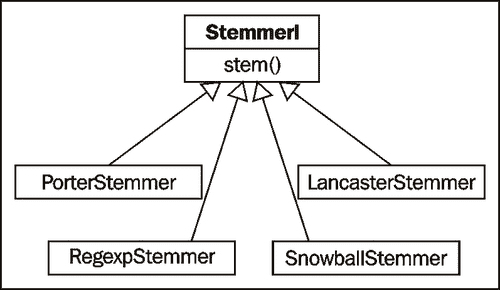

# 第二章 替换和纠正单词

在本章中，我们将介绍以下内容：

+   词干提取

+   使用 WordNet 词元化单词

+   使用 Babelfish 翻译文本

+   替换匹配正则表达式的单词

+   移除重复字符

+   使用 Enchant 进行拼写纠正

+   替换同义词

+   将否定词替换为反义词

# 简介

在本章中，我们将介绍各种单词替换和纠正技术。这些配方涵盖了语言压缩、拼写纠正和文本归一化的范围。所有这些方法在文本搜索索引、文档分类和文本分析之前的预处理中都非常有用。

# 词干提取

**词干提取**是从单词中移除*词缀*的技术，最终得到*词干*。例如，“cooking”的词干是“cook”，一个好的词干提取算法知道“ing”*后缀*可以被移除。词干提取最常由搜索引擎用于索引单词。搜索引擎可以存储单词的所有形式，而不是存储词干，这可以大大减少索引的大小，同时提高检索的准确性。

最常见的词干提取算法之一是 Martin Porter 的**Porter 词干提取算法**。它旨在移除和替换英语单词的已知后缀，NLTK 中的使用将在下一节中介绍。

### 注意

结果词干不总是有效的单词。例如，“cookery”的词干是“cookeri”。这是一个特性，而不是错误。

## 如何做到...

NLTK 包含 Porter 词干提取算法的实现，使用起来非常简单。只需实例化`PorterStemmer`类，并使用要提取词干的单词调用`stem()`方法。

```py
>>> from nltk.stem import PorterStemmer
>>> stemmer = PorterStemmer()
>>> stemmer.stem('cooking')
'cook'
>>> stemmer.stem('cookery')
'cookeri'
```

## 它是如何工作的...

`PorterStemmer`知道许多常见的单词形式和后缀，并使用这些知识通过一系列步骤将输入单词转换为最终的词干。结果词干通常是更短的单词，或者至少是单词的常见形式，具有相同的词根意义。

## 还有更多...

除了 Porter 词干提取算法之外，还有其他词干提取算法，例如在兰开斯特大学开发的**Lancaster 词干提取算法**。NLTK 将其作为`LancasterStemmer`类包含在内。在撰写本文时，没有确凿的研究表明一个算法优于另一个算法。然而，Porter 词干提取通常是默认选择。

接下来的所有词干提取器都继承自`StemmerI`接口，该接口定义了`stem()`方法。以下是一个继承图，展示了这一点：



### LancasterStemmer

`LancasterStemmer`的功能与`PorterStemmer`类似，但可以产生略微不同的结果。它被认为是比`P` `orterStemmer`更激进。

```py
>>> from nltk.stem import LancasterStemmer
>>> stemmer = LancasterStemmer()
>>> stemmer.stem('cooking')
'cook'
>>> stemmer.stem('cookery')
'cookery'
```

### RegexpStemmer

您还可以使用`RegexpStemmer`构建自己的词干提取器。它接受单个正则表达式（可以是编译后的或字符串形式），并将移除任何匹配的前缀或后缀。

```py
>>> from nltk.stem import RegexpStemmer
>>> stemmer = RegexpStemmer('ing')
>>> stemmer.stem('cooking')
'cook'
>>> stemmer.stem('cookery')
'cookery'
>>> stemmer.stem('ingleside')
'leside'
```

`RegexpStemmer` 应仅用于 `PorterStemmer` 或 `LancasterStemmer` 无法覆盖的非常特定的情况。

### SnowballStemmer

NLTK 2.0b9 新增了 `SnowballStemmer`，它支持 13 种非英语语言。要使用它，你需要创建一个以你使用的语言命名的实例，然后调用 `stem()` 方法。以下是所有支持的语言列表，以及使用西班牙语 `SnowballStemmer` 的示例：

```py
>>> from nltk.stem import SnowballStemmer
>>> SnowballStemmer.languages
('danish', 'dutch', 'finnish', 'french', 'german', 'hungarian', 'italian', 'norwegian', 'portuguese', 'romanian', 'russian', 'spanish', 'swedish')
>>> spanish_stemmer = SnowballStemmer('spanish')
>>> spanish_stemmer.stem('hola')
u'hol'
```

## 参见

在下一个菜谱中，我们将介绍词元化，它与词干提取非常相似，但有一些细微的差别。

# 使用 WordNet 词元化单词

**词元化** 与词干提取非常相似，但更类似于同义词替换。一个 *词元* 是一个词根，与根 *词干* 相反。所以与词干提取不同，你总是留下一个有效的单词，它意味着相同的事情。但最终你得到的单词可能完全不同。一些例子将解释词元化...

## 准备工作

确保你已经解压缩了 `wordnet` 语料库在 `nltk_data/corpora/wordnet` 中。这将允许 `WordNetLemmatizer` 访问 WordNet。你还应该对 第一章 中 *在 WordNet 中查找单词的词义集* 菜单中涵盖的词性标签有所了解，*文本分词和 WordNet 基础*。

## 如何做...

我们将使用 `WordNetLemmatizer` 来查找词元：

```py
>>> from nltk.stem import WordNetLemmatizer
>>> lemmatizer = WordNetLemmatizer()
>>> lemmatizer.lemmatize('cooking')
'cooking'
>>> lemmatizer.lemmatize('cooking', pos='v')
'cook'
>>> lemmatizer.lemmatize('cookbooks')
'cookbook'
```

## 它是如何工作的...

`WordNetLemmatizer` 是围绕 WordNet 语料库的一个薄包装，并使用 `W` `ordNetCorpusReader` 的 `morphy()` 函数来查找词元。如果没有找到词元，则将单词按原样返回。与词干提取不同，了解单词的词性很重要。如前所述，“cooking”没有词元，除非你指定词性（`pos`）是动词。这是因为默认的词性是名词，而“cooking”不是名词，因此找不到词元。“Cookbooks”，另一方面，是名词，其词元是单数形式，“cookbook”。

## 更多...

下面是一个示例，说明了词干提取和词元化之间的一大主要区别：

```py
>>> from nltk.stem import PorterStemmer
>>> stemmer = PorterStemmer()
>>> stemmer.stem('believes')
'believ'
>>> lemmatizer.lemmatize('believes')
'belief'
```

与 `PorterStemmer` 不同，`WordNetLemmatizer` 会找到一个有效的词根。词干提取器只关注单词的形式，而词元化器关注单词的意义。通过返回一个词元，你将始终得到一个有效的单词。

### 将词干提取与词元化结合

词干提取和词元化可以结合起来压缩单词，比单独的任何过程都能压缩更多。这些情况相对较少，但它们确实存在：

```py
>>> stemmer.stem('buses')
'buse'
>>> lemmatizer.lemmatize('buses')
'bus'
>>> stemmer.stem('bus')
'bu'
```

在这个例子中，词干提取节省了一个字符，词元化节省了两个字符，而词干提取词元总共节省了五个字符中的三个字符。这几乎是 60% 的压缩率！在成千上万的单词中，这种程度的单词压缩虽然不太可能总是产生如此高的收益，但仍然可以产生巨大的差异。

## 参见

在前面的食谱中，我们介绍了词干提取的基础知识，并在第一章的*在 WordNet 中查找单词的 synsets*和*在 WordNet 中查找词元和同义词*食谱中介绍了 WordNet。展望未来，我们将在第四章的*使用 WordNet 进行词性标注*食谱中介绍。

# 使用 Babelfish 翻译文本

**Babelfish**是 Yahoo 提供的一个在线语言翻译 API。使用它，你可以将*源语言*的文本翻译成*目标语言*。NLTK 提供了一个简单的接口来使用它。

## 准备工作

首先确保你已经连接到互联网。`babelfish.translate()`函数需要访问 Yahoo 的在线 API 才能工作。

## 如何操作...

要翻译你的文本，你首先需要知道两件事：

1.  你的文本或源语言的语言。

1.  你想要翻译到的语言或目标语言。

语言检测不在这个食谱的范围内，所以我们将假设你已经知道源语言和目标语言。

```py
>>> from nltk.misc import babelfish
>>> babelfish.translate('cookbook', 'english', 'spanish')
'libro de cocina'
>>> babelfish.translate('libro de cocina', 'spanish', 'english')
'kitchen book'
>>> babelfish.translate('cookbook', 'english', 'german')
'Kochbuch'
>>> babelfish.translate('kochbuch', 'german', 'english')
'cook book'
```

### 注意

你不能使用相同的语言来翻译源语言和目标语言。尝试这样做将会引发一个`BabelfishChangedError`错误。

## 它是如何工作的...

`translate()`函数是一个小的函数，它向[`babelfish.yahoo.com/translate_txt`](http://babelfish.yahoo.com/translate_txt)发送`urllib`请求，然后搜索响应以找到翻译后的文本。

### 注意

如果由于某种原因 Yahoo 改变了他们的 HTML 响应，以至于`translate()`无法识别翻译后的文本，将会引发一个`BabelfishChangedError`错误。这种情况不太可能发生，但如果真的发生了，你可能需要升级到 NLTK 的新版本，或者报告这个错误。

## 还有更多...

还有一个有趣的功能叫做`babelize()`，它可以在源语言和目标语言之间来回翻译，直到没有更多变化。

```py
>>> for text in babelfish.babelize('cookbook', 'english', 'spanish'):
...  print text
cookbook
libro de cocina
kitchen book
libro de la cocina
book of the kitchen
```

### 可用语言

你可以通过检查`available_languages`属性来查看所有可用的翻译语言。

```py
>>> babelfish.available_languages
['Portuguese', 'Chinese', 'German', 'Japanese', 'French', 'Spanish', 'Russian', 'Greek', 'English', 'Korean', 'Italian']
```

这些语言的低档版本可以用作翻译的源语言或目标语言。

# 替换匹配正则表达式的单词

现在我们将进入替换单词的过程。其中词干提取和词形还原是一种*语言压缩*，而单词替换可以被视为*错误纠正*，或*文本规范化*。

对于这个食谱，我们将根据正则表达式替换单词，重点是*扩展缩写词*。记得我们在第一章中分词单词时，*文本分词和 WordNet 基础知识*，很明显大多数分词器在处理缩写词时都有困难吗？这个食谱旨在通过将缩写词替换为其扩展形式来解决这个问题，例如将"can't"替换为"cannot"，或将"would've"替换为"would have"。

## 准备工作

理解这个食谱的工作原理需要具备正则表达式和`re`模块的基本知识。关键要知道的是*匹配模式*和`re.subn()`函数。

## 如何做...

首先，我们需要定义一系列替换模式。这将是一个元组对的列表，其中第一个元素是要匹配的模式，第二个元素是替换内容。

接下来，我们将创建一个`RegexpReplacer`类，该类将编译模式，并提供一个`replace()`方法来替换所有找到的模式。

以下代码可以在`replacers.py`模块中找到，并打算导入，而不是在控制台中输入：

```py
import re

replacement_patterns = [
  (r'won\'t', 'will not'),
  (r'can\'t', 'cannot'),
  (r'i\'m', 'i am'),
  (r'ain\'t', 'is not'),
  (r'(\w+)\'ll', '\g<1> will'),
  (r'(\w+)n\'t', '\g<1> not'),
  (r'(\w+)\'ve', '\g<1> have'),
  (r'(\w+)\'s', '\g<1> is'),
  (r'(\w+)\'re', '\g<1> are'),
  (r'(\w+)\'d', '\g<1> would')

]
class RegexpReplacer(object):
  def __init__(self, patterns=replacement_patterns):
    self.patterns = [(re.compile(regex), repl) for (regex, repl) in patterns]

  def replace(self, text):
    s = text
    for (pattern, repl) in self.patterns:
      (s, count) = re.subn(pattern, repl, s)
    return s
```

## 它是如何工作的...

下面是一个简单的使用示例：

```py
>>> from replacers import RegexpReplacer
>>> replacer = RegexpReplacer()
>>> replacer.replace("can't is a contraction")
'cannot is a contraction'
>>> replacer.replace("I should've done that thing I didn't do")
'I should have done that thing I did not do'
```

`RegexpReplacer.replace()`通过将每个替换模式的所有实例替换为其相应的替换模式来工作。在`replacement_patterns`中，我们定义了如(`r'(\w+)\'ve', '\g<1> have'`)这样的元组。第一个元素匹配一组 ASCII 字符后跟`'ve'`。通过在`'ve'`之前将字符分组放在括号中，我们找到了一个匹配组，并可以使用`\g<1>`引用在替换模式中使用。因此，我们保留`'ve'`之前的所有内容，然后将`'ve'`替换为单词`have`。这就是“should've”可以变成“should have”的方式。

## 更多内容...

这种替换技术可以与任何类型的正则表达式一起工作，而不仅仅是缩写。因此，你可以将任何“&”的出现替换为“and”，或者通过将其替换为空字符串来消除所有“-”的出现。`RegexpReplacer`可以接受任何用于任何目的的替换模式列表。

### 分词前的替换

让我们尝试在分词之前使用`RegexpReplacer`作为初步步骤：

```py
>>> from nltk.tokenize import word_tokenize
>>> from replacers import RegexpReplacer
>>> replacer = RegexpReplacer()
>>> word_tokenize("can't is a contraction")
['ca', "n't", 'is', 'a', 'contraction']
>>> word_tokenize(replacer.replace("can't is a contraction"))
['can', 'not', 'is', 'a', 'contraction']
```

更好！通过首先消除缩写，分词器将产生更干净的结果。在处理文本之前进行清理是自然语言处理中的常见模式。

## 参见

关于分词的更多信息，请参阅第一章的前三个食谱，“文本分词和 WordNet 基础知识”。有关更多替换技术，请继续阅读本章的其余部分。

# 移除重复字符

在日常语言中，人们往往并不严格遵守语法。他们会写出像“我 looooooove 它”这样的句子来强调“爱”这个词。但除非有人告诉它们，“looooooove”是“love”的变体，否则计算机并不知道。这个方法提供了一种去除那些令人烦恼的重复字符的方法，以便最终得到一个“正确”的英语单词。

## 准备工作

正如上一个食谱中一样，我们将使用`re`模块，特别是回溯引用。**回溯引用**是在正则表达式中引用之前匹配的组的一种方式。这将使我们能够匹配和删除重复字符。

## 如何做...

我们将创建一个类，其形式与之前菜谱中的 `RegexpReplacer` 相同。它将有一个 `replace()` 方法，该方法接受一个单词并返回该单词的正确版本，移除了可疑的重复字符。以下代码可以在 `replacers.py` 中找到，并打算导入：

```py
import re

class RepeatReplacer(object):
  def __init__(self):
    self.repeat_regexp = re.compile(r'(\w*)(\w)\2(\w*)')
    self.repl = r'\1\2\3'

  def replace(self, word):
    repl_word = self.repeat_regexp.sub(self.repl, word)
    if repl_word != word:
      return self.replace(repl_word)

    else:
      return repl_word
```

现在是一些示例用法：

```py
>>> from replacers import RepeatReplacer
>>> replacer = RepeatReplacer()
>>> replacer.replace('looooove')
'love'
>>> replacer.replace('oooooh')
'oh'
>>> replacer.replace('goose')
'gose'
```

## 它是如何工作的...

`RepeatReplacer` 首先编译一个用于匹配的正则表达式，并定义一个带有回溯引用的替换字符串。`repeat_regexp` 匹配三个组：

1.  零个或多个起始字符 `(\w*)`。

1.  一个字符 `(\w)`，后跟该字符的另一个实例 `\2`。

1.  零个或多个结尾字符 `(\w*)`。

然后，*替换字符串* 用于保留所有匹配的组，同时丢弃对第二个组的引用。因此，单词 "looooove" 被分割成 `(l)(o)o(ooove)`，然后重新组合为 "loooove"，丢弃第二个 "o"。这会一直持续到只剩下一个 "o"，此时 `repeat_regexp` 不再匹配字符串，不再移除更多字符。

## 还有更多...

在前面的示例中，您可以看到 `RepeatReplacer` 稍微有点贪婪，最终将 "goose" 改成了 "gose"。为了纠正这个问题，我们可以在 `replace()` 函数中增加 WordNet 查找。如果 WordNet 识别该单词，那么我们可以停止替换字符。以下是 WordNet 增强版本：

```py
import re
from nltk.corpus import wordnet

class RepeatReplacer(object):
  def __init__(self):
    self.repeat_regexp = re.compile(r'(\w*)(\w)\2(\w*)')
    self.repl = r'\1\2\3'

  def replace(self, word):
    if wordnet.synsets(word):
      return word
    repl_word = self.repeat_regexp.sub(self.repl, word)

    if repl_word != word:
      return self.replace(repl_word)
    else:
      return repl_word
```

现在，"goose" 将在 WordNet 中找到，不会进行字符替换。而 "oooooh" 将变成 "ooh" 而不是 "oh"，因为 "ooh" 实际上是一个单词，在 WordNet 中定义为表示钦佩或愉悦的表达。

## 参考信息

读取下一菜谱了解如何纠正拼写错误。有关 WordNet 的更多信息，请参阅第一章 Tokenizing Text and WordNet Basics 中的 WordNet 菜谱。我们还将在本章后面使用 WordNet 进行反义词替换。

# 使用 Enchant 进行拼写纠正

替换重复字符实际上是拼写纠正的一种极端形式。在这个菜谱中，我们将处理不那么极端的情况，即使用 **Enchant**（一个拼写纠正 API）纠正轻微的拼写错误。

## 准备工作

您需要安装 Enchant 以及为其使用的词典。Enchant 是 "Abiword" 开源文字处理器的分支，更多信息可以在 [`www.abisource.com/projects/enchant/`](http://www.abisource.com/projects/enchant/) 找到。

对于词典，**aspell** 是一个优秀的开源拼写检查器和词典，可以在 [`aspell.net/`](http://aspell.net/) 找到。

最后，您还需要 **pyenchant** 库，可以在 [`www.rfk.id.au/software/pyenchant/`](http://www.rfk.id.au/software/pyenchant/) 找到。您应该能够使用随 *python-setuptools* 一起提供的 `easy_install` 命令安装它，例如在 Linux 或 Unix 上执行 `sudo easy_install pyenchant`。

## 如何操作...

我们将在 `replacers.py` 中创建一个新的类 `SpellingReplacer`，这次 `replace()` 方法将检查 Enchant 以查看单词是否有效。如果不是，我们将查找建议的替代方案，并使用 `nltk.metrics.edit_distance()` 返回最佳匹配：

```py
import enchant
from nltk.metrics import edit_distance

class SpellingReplacer(object):
  def __init__(self, dict_name='en', max_dist=2):
    self.spell_dict = enchant.Dict(dict_name)
    self.max_dist = 2

  def replace(self, word):
    if self.spell_dict.check(word):
      return word
    suggestions = self.spell_dict.suggest(word)

    if suggestions and edit_distance(word, suggestions[0]) <= self.max_dist:
      return suggestions[0]
    else:
      return word
```

之前提到的类可以用来如下修正英语拼写：

```py
>>> from replacers import SpellingReplacer
>>> replacer = SpellingReplacer()
>>> replacer.replace('cookbok')
'cookbook'
```

## 它是如何工作的...

`SpellingReplacer` 首先创建了一个对 `enchant` 字典的引用。然后，在 `replace()` 方法中，它首先检查给定的 `word` 是否存在于字典中。如果存在，则不需要拼写修正，并返回该单词。但如果单词未找到，它会查找一个建议列表，并返回第一个建议，只要其编辑距离小于或等于 `max_dist`。**编辑距离**是将给定单词转换为建议单词所需的字符更改数。`max_dist` 作为对 Enchant `suggest()` 函数的约束，以确保不会返回不太可能的替换词。以下是一个显示 "languege"（"language" 的拼写错误）的所有建议的示例：

```py
>>> import enchant
>>> d = enchant.Dict('en')
>>> d.suggest('languege')
['language', 'languisher', 'languish', 'languor', 'languid']
```

除了正确的建议 "language" 之外，所有其他单词的编辑距离都为三个或更大。

## 还有更多...

您可以使用除 `'en'` 之外的语言字典，例如 `'en_GB'`，假设字典已经安装。要检查哪些其他语言可用，请使用 `enchant.list_languages()`：

```py
>>> enchant.list_languages()
['en_AU', 'en_GB', 'en_US', 'en_ZA', 'en_CA', 'en']
```

### 注意

如果您尝试使用不存在的字典，您将得到 `enchant.DictNotFoundError`。您可以使用 `enchant.dict_exists()` 首先检查字典是否存在，如果存在，它将返回 `True`，否则返回 `False`。

### en_GB 字典

总是要确保使用正确的字典来对您正在进行的拼写修正的语言进行操作。`'en_US'` 可能会给出与 `'en_GB'` 不同的结果，例如对于单词 "theater"。 "Theater" 是美式英语的拼写，而英式英语的拼写是 "Theatre"：

```py
>>> import enchant
>>> dUS = enchant.Dict('en_US')
>>> dUS.check('theater')
True
>>> dGB = enchant.Dict('en_GB')
>>> dGB.check('theater')
False
>>> from replacers import SpellingReplacer
>>> us_replacer = SpellingReplacer('en_US')
>>> us_replacer.replace('theater')
'theater'
>>> gb_replacer = SpellingReplacer('en_GB')
>>> gb_replacer.replace('theater')
'theatre'
```

### 个人单词列表

Enchant 还支持个人单词列表。这些可以与现有字典结合使用，允许您通过自己的单词来扩展字典。所以假设您有一个名为 `mywords.txt` 的文件，其中有一行是 `nltk`。您然后可以创建一个包含您的个人单词列表的扩展字典，如下所示：

```py
>>> d = enchant.Dict('en_US')
>>> d.check('nltk')
False
>>> d = enchant.DictWithPWL('en_US', 'mywords.txt')
>>> d.check('nltk')
True
```

要使用 `SpellingReplacer` 的扩展字典，我们可以在 `replacers.py` 中创建一个子类，它接受现有的拼写字典。

```py
class CustomSpellingReplacer(SpellingReplacer):
  def __init__(self, spell_dict, max_dist=2):
    self.spell_dict = spell_dict
    self.max_dist = max_dist
```

这个 `CustomSpellingReplacer` 不会替换您放入 `mywords.txt` 中的任何单词。

```py
>>> from replacers import CustomSpellingReplacer
>>> d = enchant.DictWithPWL('en_US', 'mywords.txt')
>>> replacer = CustomSpellingReplacer(d)
>>> replacer.replace('nltk')
'nltk'
```

## 相关内容

之前的配方涉及通过替换重复字符的极端形式的拼写修正。您还可以通过简单的单词替换来进行拼写修正，如下一配方中讨论的那样。

# 替换同义词

通过用常用同义词替换单词来减少文本的词汇量通常很有用。通过在不失去意义的情况下压缩词汇量，您可以在 *频率分析* 和 *文本索引* 等情况下节省内存。词汇量减少还可以增加重要搭配的出现频率，这在 第一章 的 *发现单词搭配* 食谱中已有介绍，*文本分词和 WordNet 基础*。

## 准备工作

您需要定义一个单词与其同义词的映射。这是一个简单的 *受控词汇表*。我们将首先将同义词硬编码为 Python 字典，然后探讨存储同义词映射的其他选项。

## 如何做...

我们首先在 `replacers.py` 中创建一个 `WordReplacer` 类，它接受一个单词替换映射：

```py
class WordReplacer(object):
  def __init__(self, word_map):
    self.word_map = word_map
  def replace(self, word):
    return self.word_map.get(word, word)
```

然后，我们可以演示其用于简单单词替换的使用方法：

```py
>>> from replacers import wordReplacer
>>> replacer = WordReplacer({'bday': 'birthday'})
>>> replacer.replace('bday')
'birthday'
>>> replacer.replace('happy')
'happy'
```

## 它是如何工作的...

`WordReplacer` 类简单地封装了一个 Python 字典。`replace()` 方法在其 `word_map` 中查找给定的单词，如果存在替换同义词，则返回该同义词。否则，返回给定的单词。

如果您只使用 `word_map` 字典，您就不需要 `WordReplacer` 类，可以直接调用 `word_map.get()`。但是 `WordReplacer` 可以作为从各种文件格式构建 `word_map` 的其他类的基类。继续阅读以获取更多信息。

## 还有更多...

将同义词硬编码为 Python 字典不是一个好的长期解决方案。两种更好的替代方案是将同义词存储在 CSV 文件或 YAML 文件中。选择对维护同义词词汇表的人来说最简单的格式。以下部分概述的两个类都从 `WordReplacer` 继承了 `replace()` 方法。

### CSV 同义词替换

`CsvWordReplacer` 类在 `replacers.py` 中扩展了 `WordReplacer`，以便从 CSV 文件中构建 `word_map`：

```py
import csv

class CsvWordReplacer(WordReplacer):
  def __init__(self, fname):
    word_map = {}
    for line in csv.reader(open(fname)):
      word, syn = line
      word_map[word] = syn
    super(CsvWordReplacer, self).__init__(word_map)
```

您的 CSV 文件应该有两列，其中第一列是单词，第二列是要替换的单词的同义词。如果此文件名为 `synonyms.csv` 且第一行是 `bday`，`birthday`，则可以这样做：

```py
>>> from replacers import CsvWordReplacer
>>> replacer = CsvWordReplacer('synonyms.csv')
>>> replacer.replace('bday')
'birthday'
>>> replacer.replace('happy')
'happy'
```

### YAML 同义词替换

如果您已安装 PyYAML，您可以在 `replacers.py` 中创建一个 `YamlWordReplacer`。PyYAML 的下载和安装说明位于 [`pyyaml.org/wiki/PyYAML`](http://pyyaml.org/wiki/PyYAML)。

```py
import yaml

class YamlWordReplacer(WordReplacer):
  def __init__(self, fname):
    word_map = yaml.load(open(fname))
    super(YamlWordReplacer, self).__init__(word_map)
```

您的 YAML 文件应该是一个简单的 "单词：同义词" 映射，例如 `bday: birthday`。请注意，YAML 语法非常特别，冒号后面的空格是必需的。如果文件名为 `synonyms.yaml`，则可以这样做：

```py
>>> from replacers import YamlWordReplacer
>>> replacer = YamlWordReplacer('synonyms.yaml')
>>> replacer.replace('bday')
'birthday'
>>> replacer.replace('happy')
'happy'
```

## 参见

您可以使用 `WordReplacer` 来进行任何类型的单词替换，甚至是对更复杂的单词进行拼写纠正，这些单词无法自动纠正，就像我们在前面的食谱中所做的那样。在下一个食谱中，我们将介绍反义词替换。

# 用反义词替换否定词

同义词替换的相反是 *反义词替换*。**反义词**是一个词的相反含义。这次，我们不再创建自定义的词映射，而是可以使用 WordNet 用明确的反义词替换词。有关反义词查找的更多详细信息，请参阅 第一章 中的 *在 Wordnet 中查找词元和同义词* 配方。

## 如何做到这一点...

假设你有一个句子，例如 "let's not uglify our code"。使用反义词替换，你可以将 "not uglify" 替换为 "beautify"，从而得到句子 "let's beautify our code"。为此，我们需要在 `replacers.py` 中创建一个 `AntonymReplacer`，如下所示：

```py
from nltk.corpus import wordnet
class AntonymReplacer(object):
  def replace(self, word, pos=None):
    antonyms = set()
    for syn in wordnet.synsets(word, pos=pos):
      for lemma in syn.lemmas:
        for antonym in lemma.antonyms():
          antonyms.add(antonym.name)
    if len(antonyms) == 1:
      return antonyms.pop()
    else:
      return None

  def replace_negations(self, sent):
    i, l = 0, len(sent)
    words = []
    while i < l:
      word = sent[i]
      if word == 'not' and i+1 < l:
        ant = self.replace(sent[i+1])
        if ant:
          words.append(ant)
          i += 2
          continue
      words.append(word)
      i += 1
    return words
```

现在我们可以将原始句子分词为 `["let's", 'not', 'uglify', 'our', 'code']`，并将其传递给 `replace_negations()` 函数。以下是一些示例：

```py
>>> from replacers import AntonymReplacer
>>> replacer = AntonymReplacer()
>>> replacer.replace('good')
>>> replacer.replace('uglify')
'beautify'
>>> sent = ["let's", 'not', 'uglify', 'our', 'code']
>>> replacer.replace_negations(sent)
["let's", 'beautify', 'our', 'code']
```

## 它是如何工作的...

`AntonymReplacer` 有两种方法：`replace()` 和 `replace_negations()`。`replace()` 方法接受一个单个的 `word` 和一个可选的词性标签，然后查找 WordNet 中该词的 synsets。遍历所有 synsets 以及每个 synset 的每个词元，它创建一个包含所有找到的反义词的 `set`。如果只找到一个反义词，那么它是一个 *明确的替换*。如果找到多个反义词（这种情况相当常见），那么我们无法确定哪个反义词是正确的。在存在多个反义词（或没有反义词）的情况下，`replace()` 返回 `None`，因为它无法做出决定。

在 `replace_negations()` 中，我们遍历一个分词句子以查找单词 "`not`"。如果找到 "`not`"，则尝试使用 `replace()` 查找下一个词的反义词。如果我们找到一个反义词，则将其追加到 `words` 列表中，替换掉 "`not`" 和原始词。所有其他词都按原样追加，结果是一个分词句子，其中明确的否定被其反义词替换。

## 还有更多...

由于在 WordNet 中明确的反义词并不常见，您可能需要创建一个与同义词相同的自定义反义词映射。这个 `AntonymWordReplacer` 可以通过从 `WordReplacer` 和 `AntonymReplacer` 继承来构建：

```py
class AntonymWordReplacer(WordReplacer, AntonymReplacer):
  pass
```

继承顺序非常重要，因为我们希望 `WordReplacer` 的初始化和 `replace()` 函数与 `AntonymReplacer` 的 `replace_negations()` 函数结合。结果是这样一个替换器，它可以执行以下操作：

```py
>>> from replacers import AntonymWordReplacer
>>> replacer = AntonymWordReplacer({'evil': 'good'})
>>> replacer.replace_negations(['good', 'is', 'not', 'evil'])
['good', 'is', 'good']
```

当然，如果您想从文件中加载反义词词映射，您也可以从 `CsvWordReplacer` 或 `YamlWordReplacer` 继承而不是 `WordReplacer`。

## 参见

之前的配方从同义词替换的角度介绍了 `WordReplacer`。在 第一章 中，*文本分词和 WordNet 基础* 详细介绍了 Wordnet 的使用，包括 *在 Wordnet 中查找词的 synsets* 和 *在 Wordnet 中查找词元和同义词* 配方。
