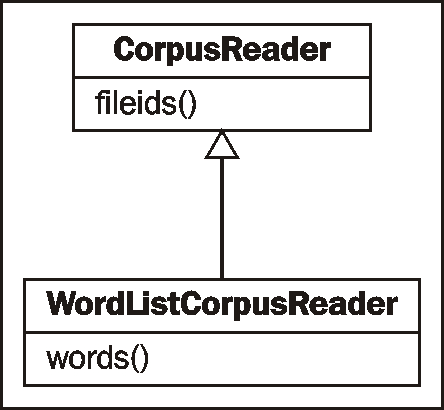
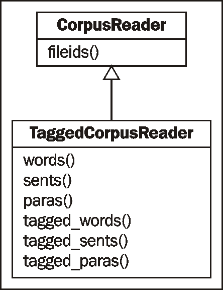
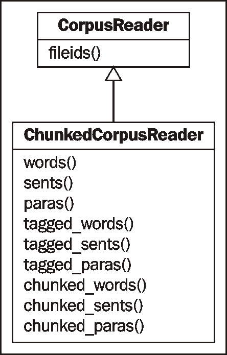
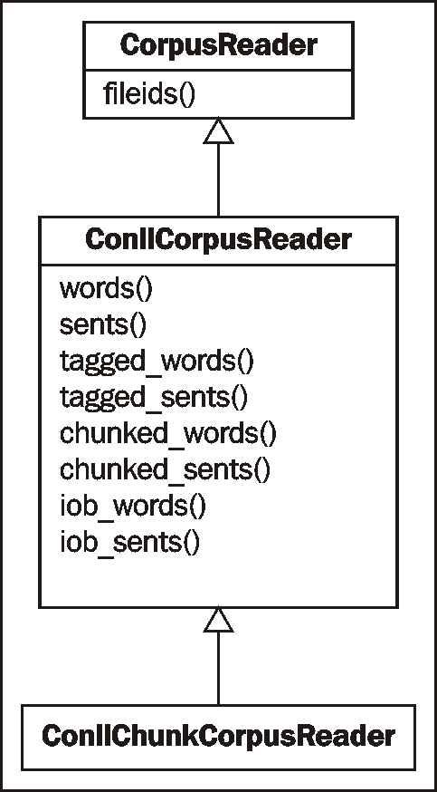
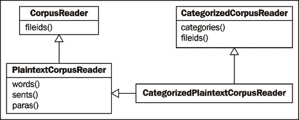
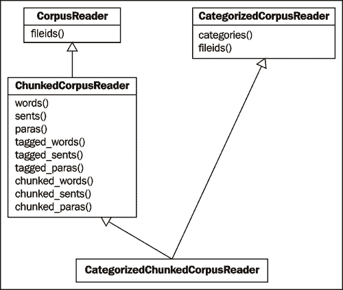
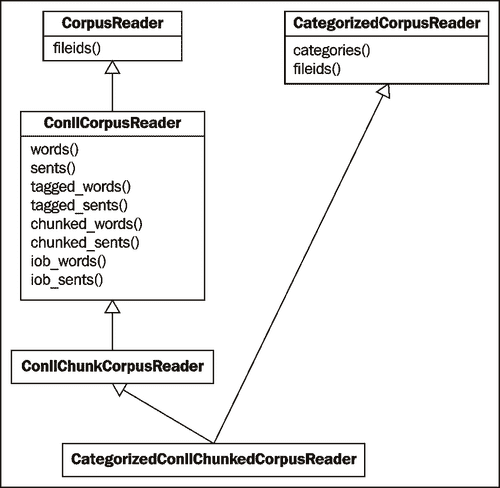
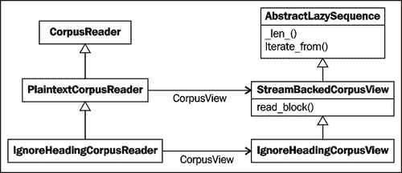

# 第三章 创建自定义语料库

在本章中，我们将介绍：

+   设置自定义语料库

+   创建单词列表语料库

+   创建词性标注的单词语料库

+   创建分块短语语料库

+   创建分类文本语料库

+   创建分类分块语料库读取器

+   懒加载语料库

+   创建自定义语料库视图

+   创建基于 MongoDB 的语料库读取器

+   使用文件锁定进行语料库编辑

# 简介

在本章中，我们将介绍如何使用语料库读取器创建自定义语料库。同时，你将学习如何使用 NLTK 附带的存在语料库数据。这些信息对于后续章节至关重要，届时我们需要将语料库作为训练数据来访问。我们还将介绍创建自定义语料库读取器，这可以在你的语料库不是 NLTK 已识别的文件格式时使用，或者如果你的语料库根本不在文件中，而是位于数据库（如 MongoDB）中。

# 设置自定义语料库

**语料库**是一组文本文档的集合，**corpora**是语料库的复数形式。因此，*自定义语料库*实际上只是目录中的一些文本文件，通常与许多其他文本文件目录并列。

## 准备工作

你应该已经按照[`www.nltk.org/data`](http://www.nltk.org/data)上的说明安装了 NLTK 数据包。我们将假设数据安装在了 Windows 上的`C:\nltk_data`，Linux、Unix 或 Mac OS X 上的`/usr/share/nltk_data`。

## 如何操作...

NLTK 定义了一个数据目录列表，或**路径**，在`nltk.data.path`中。我们的自定义语料库必须位于这些路径之一，以便 NLTK 可以找到它。为了避免与官方数据包冲突，我们将在主目录中创建一个自定义的`nltk_data`目录。以下是一些 Python 代码，用于创建此目录并验证它是否在由`nltk.data.path`指定的已知路径列表中：

```py
>>> import os, os.path
>>> path = os.path.expanduser('~/nltk_data')
>>> if not os.path.exists(path):
...    os.mkdir(path)
>>> os.path.exists(path)
True
>>> import nltk.data
>>> path in nltk.data.path
True
```

如果最后一行`path in nltk.data.path`是`True`，那么你现在应该在主目录中有一个`nltk_data`目录。在 Windows 上，路径应该是`%UserProfile%\nltk_data`，在 Unix、Linux 或 Mac OS X 上，路径应该是`~/nltk_data`。为了简化，我将把这个目录称为`~/nltk_data`。

### 注意

如果最后一行没有返回`True`，请尝试在你的主目录中手动创建`nltk_data`目录，然后验证绝对路径是否在`nltk.data.path`中。在继续之前，确保此目录存在并且位于`nltk.data.path`中是至关重要的。一旦你有了`nltk_data`目录，惯例是语料库位于一个`corpora`子目录中。在`nltk_data`目录中创建此`corpora`目录，以便路径为`~/nltk_data/corpora`。最后，我们将在`corpora`中创建一个子目录来存放我们的自定义语料库。让我们称它为`cookbook`，完整的路径为`~/nltk_data/corpora/cookbook`。

现在我们可以创建一个简单的 *单词列表* 文件并确保它被加载。在 第二章，*替换和纠正单词*，*使用 Enchant 进行拼写纠正* 菜谱中，我们创建了一个名为 `mywords.txt` 的单词列表文件。将此文件放入 `~/nltk_data/corpora/cookbook/`。现在我们可以使用 `nltk.data.load()` 来加载该文件。

```py
>>> import nltk.data
>>> nltk.data.load('corpora/cookbook/mywords.txt', format='raw')
'nltk\n'
```

### 注意

我们需要指定 `format='raw'`，因为 `nltk.data.load()` 不知道如何解释 `.txt` 文件。正如我们将看到的，它确实知道如何解释许多其他文件格式。

## 它是如何工作的...

`nltk.data.load()` 函数识别多种格式，例如 `'raw'`、`'pickle'` 和 `'yaml'`。如果没有指定格式，它将尝试根据文件的扩展名猜测格式。在前一个例子中，我们有一个 `.txt` 文件，这不是一个已识别的扩展名，因此我们必须指定 `'raw'` 格式。但如果我们使用以 `.yaml` 结尾的文件，则不需要指定格式。

传递给 `nltk.data.load()` 的文件名可以是 *绝对* 路径或 *相对* 路径。相对路径必须是 `nltk.data.path` 中指定的路径之一。文件是通过 `nltk.data.find(path)` 找到的，它搜索所有已知路径与相对路径的组合。绝对路径不需要搜索，可以直接使用。

## 更多内容...

对于大多数语料库访问，实际上你不需要使用 `nltk.data.load`，因为这将由以下菜谱中介绍的 `CorpusReader` 类处理。但了解这个函数对于加载 `.pickle` 文件和 `.yaml` 文件是很有帮助的，同时它也引入了将所有数据文件放入 NLTK 已知路径的概念。

### 加载 YAML 文件

如果你将 第二章，*替换和纠正单词*，*替换同义词* 菜谱中的 `synonyms.yaml` 文件放入 `~/nltk_data/corpora/cookbook`（在 `mywords.txt` 旁边），你可以使用 `nltk.data.load()` 来加载它，无需指定格式。

```py
>>> import nltk.data
>>> nltk.data.load('corpora/cookbook/synonyms.yaml')
{'bday': 'birthday'}
```

这假设 PyYAML 已经安装。如果没有，你可以在[`pyyaml.org/wiki/PyYAML`](http://pyyaml.org/wiki/PyYAML)找到下载和安装说明。

## 相关内容

在接下来的菜谱中，我们将介绍各种语料库读取器，然后在 *Lazy corpus loading* 菜谱中，我们将使用 `LazyCorpusLoader`，它期望语料库数据位于 `nltk.data.path` 指定路径之一的 `corpora` 子目录中。

# 创建单词列表语料库

`WordListCorpusReader` 是最简单的 `CorpusReader` 类之一。它提供对包含单词列表的文件的访问，每行一个单词。实际上，当我们在 第一章，*文本分词和 WordNet 基础*，*在分词句子中过滤停用词* 和 *发现词搭配* 菜谱中使用 `stopwords` 语料库时，你已经使用过它了。

## 准备工作

我们需要首先创建一个单词列表文件。这可以是一个单列 CSV 文件，或者只是一个每行一个单词的普通文本文件。让我们创建一个名为`wordlist`的文件，如下所示：

```py
nltk
corpus
corpora
wordnet
```

## 如何操作...

现在我们可以实例化一个`WordListCorpusReader`，它将从我们的文件中生成单词列表。它需要两个参数：包含文件的目录路径和文件名列表。如果你在包含文件的同一目录中打开 Python 控制台，那么`'.'`可以用作目录路径。否则，你必须使用一个目录路径，例如：`'nltk_data/corpora/cookbook'`。

```py
>>> from nltk.corpus.reader import WordListCorpusReader
>>> reader = WordListCorpusReader('.', ['wordlist'])
>>> reader.words()
['nltk', 'corpus', 'corpora', 'wordnet']
>>> reader.fileids()
['wordlist']
```

## 工作原理...

`WordListCorpusReader`类继承自`CorpusReader`，这是所有语料库读取器的公共基类。`CorpusReader`负责确定要读取哪些文件，而`WordListCorpus`读取文件并将每一行分词以生成单词列表。下面是一个继承关系图：



当你调用`words()`函数时，它会使用`nltk.tokenize.line_tokenize()`对原始文件数据进行分词，你可以通过`raw()`函数访问这些数据。

```py
>>> reader.raw()
'nltk\ncorpus\ncorpora\nwordnet\n'
>>> from nltk.tokenize import line_tokenize
>>> line_tokenize(reader.raw())
['nltk', 'corpus', 'corpora', 'wordnet']
```

## 还有更多...

`stopwords`语料库是多文件`WordListCorpusReader`的一个很好的例子。在第一章第一章.文本分词和 WordNet 基础知识中，*在分词句子中过滤停用词*的配方中，我们看到了它为每种语言有一个单词列表文件，并且你可以通过调用`stopwords.words(fileid)`来访问该语言的单词。如果你想创建自己的多文件单词列表语料库，这是一个很好的例子。

### 名字语料库

NLTK 附带的其他单词列表语料库是`names`语料库。它包含两个文件：`female.txt`和`male.txt`，每个文件都包含按性别组织的几千个常见名字列表。

```py
>>> from nltk.corpus import names
>>> names.fileids()
['female.txt', 'male.txt']
>>> len(names.words('female.txt'))
5001
>>> len(names.words('male.txt'))
2943
```

### 英语单词

NLTK 还附带了一个大量的英语单词列表。有一个包含 850 个**基本**单词的文件，还有一个包含超过 20 万个已知英语单词的列表。

```py
>>> from nltk.corpus import words
>>> words.fileids()
['en', 'en-basic']
>>> len(words.words('en-basic'))
850
>>> len(words.words('en'))
234936
```

## 参考信息

在第一章第一章.文本分词和 WordNet 基础知识中，*在分词句子中过滤停用词*的配方中，对使用`stopwords`语料库有更多细节。在接下来的配方中，我们将介绍更高级的语料库文件格式和语料库读取器类。

# 创建词性标注的语料库

**词性标注**是识别单词的词性标签的过程。大多数情况下，一个**标记器**必须首先在一个**训练语料库**上训练。如何训练和使用标记器将在第四章第四章.词性标注中详细说明，但首先我们必须知道如何创建和使用词性标注单词的训练语料库。

## 准备工作

标注语料库的最简单格式是“word/tag”的形式。以下是从`brown`语料库中摘录的内容：

```py
The/at-tl expense/nn and/cc time/nn involved/vbn are/ber astronomical/jj ./.
```

每个单词都有一个表示其词性的**标记**。例如，`nn` 指名词，而以 `vb` 开头的标记是动词。

## 如何做到这一点...

如果你将前面的摘录放入一个名为 `brown.pos` 的文件中，然后你可以创建一个 `TaggedCorpusReader` 并执行以下操作：

```py
>>> from nltk.corpus.reader import TaggedCorpusReader
>>> reader = TaggedCorpusReader('.', r'.*\.pos')
>>> reader.words()
['The', 'expense', 'and', 'time', 'involved', 'are', ...]
>>> reader.tagged_words()
[('The', 'AT-TL'), ('expense', 'NN'), ('and', 'CC'), …]
>>> reader.sents()
[['The', 'expense', 'and', 'time', 'involved', 'are', 'astronomical', '.']]
>>> reader.tagged_sents()
[[('The', 'AT-TL'), ('expense', 'NN'), ('and', 'CC'), ('time', 'NN'), ('involved', 'VBN'), ('are', 'BER'), ('astronomical', 'JJ'), ('.', '.')]]
>>> reader.paras()
[[['The', 'expense', 'and', 'time', 'involved', 'are', 'astronomical', '.']]]
>>> reader.tagged_paras()
[[[('The', 'AT-TL'), ('expense', 'NN'), ('and', 'CC'), ('time', 'NN'), ('involved', 'VBN'), ('are', 'BER'), ('astronomical', 'JJ'), ('.', '.')]]]
```

## 它是如何工作的...

这次，我们不是明确命名文件，而是使用正则表达式 `r'.*\.pos'` 来匹配所有以 `.pos` 结尾的文件。我们本来可以像对 `WordListCorpusReader` 做的那样，将 `['brown.pos']` 作为第二个参数传递，但这样你可以看到如何在语料库中包含多个文件而不需要明确命名每个文件。

`TaggedCorpusReader` 提供了多种从语料库中提取文本的方法。首先，你可以获取所有单词的列表，或者标记化标记的列表。一个**标记化标记**就是一个 `(word, tag)` 的元组。接下来，你可以获取每个句子的列表，以及每个标记化句子的列表，其中句子本身是一个单词或标记化标记的列表。最后，你可以获取段落列表，其中每个段落是一个句子列表，每个句子是一个单词或标记化标记的列表。以下是一个列出所有主要方法的继承图：



## 还有更多...

之前图中展示的函数都依赖于 *tokenizers* 来分割文本。`TaggedCorpusReader` 尝试使用良好的默认值，但你可以在初始化时传递自己的标记化器来自定义它们。

### 自定义词标记器

默认单词标记器是 `nltk.tokenize.WhitespaceTokenizer` 的一个实例。如果你想使用不同的标记器，你可以将其作为 `word_tokenizer` 传递。

```py
>>> from nltk.tokenize import SpaceTokenizer
>>> reader = TaggedCorpusReader('.', r'.*\.pos', word_tokenizer=SpaceTokenizer())
>>> reader.words()
['The', 'expense', 'and', 'time', 'involved', 'are', ...]
```

### 自定义句子标记器

默认句子标记器是 `nltk.tokenize.RegexpTokenize` 的一个实例，使用 `'\n'` 来识别间隔。它假设每个句子都单独在一行上，并且单个句子没有换行符。要自定义这一点，你可以传递自己的标记器作为 `sent_tokenizer`。

```py
>>> from nltk.tokenize import LineTokenizer
>>> reader = TaggedCorpusReader('.', r'.*\.pos', sent_tokenizer=LineTokenizer())
>>> reader.sents()
[['The', 'expense', 'and', 'time', 'involved', 'are', 'astronomical', '.']]
```

### 自定义段落块读取器

假设段落是通过空白行分隔的。这是通过默认的 `para_block_reader` 实现的，即 `nltk.corpus.reader.util.read_blankline_block`。`nltk.corpus.reader.util` 中有其他许多块读取函数，其目的是从 *stream* 中读取文本块。它们的用法将在后面的食谱中更详细地介绍，即 *创建自定义语料库视图*，我们将创建一个自定义语料库读取器。

### 自定义标记分隔符

如果你不想使用 `'/'` 作为单词/标记分隔符，你可以传递一个替代字符串给 `TaggedCorpusReader` 的 `sep` 参数。默认是 `sep='/'`，但如果你想用 `'|'` 分隔单词和标记，例如 'word|tag'，那么你应该传递 `sep='|'`。

### 使用标记映射函数简化标记

如果你想要以某种方式转换词性标签，你可以在初始化时传入一个 `tag_mapping_function`，然后使用 `simplify_tags=True` 调用一个 `tagged_*` 函数。以下是一个将每个标签转换为小写的示例：

```py
>>> reader = TaggedCorpusReader('.', r'.*\.pos', tag_mapping_function=lambda t: t.lower())
>>> reader.tagged_words(simplify_tags=True)
[('The', 'at-tl'), ('expense', 'nn'), ('and', 'cc'), …]
```

不带 `simplify_tags=True` 调用 `tagged_words()` 将产生与未传入 `tag_mapping_function` 相同的结果。

在 `nltk.tag.simplify` 中定义了多个标签简化函数。这些函数可以用于减少不同词性标签的数量。

```py
>>> from nltk.tag import simplify
>>> reader = TaggedCorpusReader('.', r'.*\.pos', tag_mapping_function=simplify.simplify_brown_tag)
>>> reader.tagged_words(simplify_tags=True)
[('The', 'DET'), ('expense', 'N'), ('and', 'CNJ'), ...]
>>> reader = TaggedCorpusReader('.', r'.*\.pos', tag_mapping_function=simplify.simplify_tag)
>>> reader.tagged_words(simplify_tags=True)
[('The', 'A'), ('expense', 'N'), ('and', 'C'), ...]
```

## 相关内容

第四章，*词性标注* 将更详细地介绍词性标注和标注。有关分词器的更多信息，请参阅 第一章 的前三个食谱，*文本分词和 WordNet 基础知识*。

在下一个食谱中，我们将创建一个 *语块短语* 语料库，其中每个短语也被标注了词性。

# 创建语块短语语料库

**语块** 是句子中的一个短短语。如果你还记得小学时的句子图，它们是句子中短语的树形表示。这正是语块：*句子树中的子树*，它们将在 第五章，*提取语块* 中更详细地介绍。以下是一个包含三个名词短语（**NP**）语块作为子树的示例句子树形图。


本食谱将介绍如何创建包含语块的句子语料库。

## 准备工作

这里是标注过的 `treebank` 语料库的摘录。它有词性标注，就像之前的食谱一样，但它还有方括号来表示语块。这与之前的树形图中的句子相同，但以文本形式呈现：

```py
[Earlier/JJR staff-reduction/NN moves/NNS] have/VBP trimmed/VBN about/IN [300/CD jobs/NNS] ,/, [the/DT spokesman/NN] said/VBD ./.
```

在这种格式中，每个语块都是一个 *名词短语*。不在括号内的单词是句子树的一部分，但不属于任何名词短语子树。

## 如何做...

将此摘录放入一个名为 `treebank.chunk` 的文件中，然后执行以下操作：

```py
>>> from nltk.corpus.reader import ChunkedCorpusReader
>>> reader = ChunkedCorpusReader('.', r'.*\.chunk')
>>> reader.chunked_words()
[Tree('NP', [('Earlier', 'JJR'), ('staff-reduction', 'NN'), ('moves', 'NNS')]), ('have', 'VBP'), ...]
>>> reader.chunked_sents()
[Tree('S', [Tree('NP', [('Earlier', 'JJR'), ('staff-reduction', 'NN'), ('moves', 'NNS')]), ('have', 'VBP'), ('trimmed', 'VBN'), ('about', 'IN'), Tree('NP', [('300', 'CD'), ('jobs', 'NNS')]), (',', ','), Tree('NP', [('the', 'DT'), ('spokesman', 'NN')]), ('said', 'VBD'), ('.', '.')])]
>>> reader.chunked_paras()
[[Tree('S', [Tree('NP', [('Earlier', 'JJR'), ('staff-reduction', 'NN'), ('moves', 'NNS')]), ('have', 'VBP'), ('trimmed', 'VBN'), ('about', 'IN'), Tree('NP', [('300', 'CD'), ('jobs', 'NNS')]), (',', ','), Tree('NP', [('the', 'DT'), ('spokesman', 'NN')]), ('said', 'VBD'), ('.', '.')])]]
```

`ChunkedCorpusReader` 提供了与 `TaggedCorpusReader` 相同的方法来获取标注的标记，同时提供了三个新方法来获取语块。每个语块都表示为 `nltk.tree.Tree` 的一个实例。句子级树形看起来像 `Tree('S', [...])`，而名词短语树形看起来像 `Tree('NP', [...])`。在 `chunked_sents()` 中，你得到一个句子树的列表，其中每个名词短语作为句子的子树。在 `chunked_words()` 中，你得到一个名词短语树的列表，以及不在语块中的单词的标注标记。以下是一个列出主要方法的继承图：



### 注意

你可以通过调用 `draw()` 方法来绘制一个 `Tree`。使用前面定义的语料库读取器，你可以执行 `reader.chunked_sents()[0].draw()` 来获取与该食谱开头所示相同的句子树形图。

## 工作原理...

`ChunkedCorpusReader` 与上一道菜谱中的 `TaggedCorpusReader` 类似。它具有相同的默认 `sent_tokenizer` 和 `para_block_reader`，但使用 `str2chunktree()` 函数代替 `word_tokenizer`。默认为 `nltk.chunk.util.tagstr2tree()`，它将包含括号内短语的句子字符串解析为句子树，每个短语作为一个名词短语子树。单词通过空格分隔，默认的单词/标签分隔符是 `'/'`。如果您想自定义短语解析，则可以为 `str2chunktree()` 传递自己的函数。

## 更多内容...

表示短语的另一种格式称为 IOB 标签。**IOB** 标签与词性标签类似，但提供了一种表示短语内部、外部和开始的方法。它们还有允许表示多种不同的短语类型（而不仅仅是名词短语）的优点。以下是 `conll2000` 语料库的一个摘录。每个单词都在单独的一行上，后面跟着一个词性标签和一个 IOB 标签。

```py
Mr. NNP B-NP
Meador NNP I-NP
had VBD B-VP
been VBN I-VP
executive JJ B-NP
vice NN I-NP
president NN I-NP
of IN B-PP
Balcor NNP B-NP
. . O
```

`B-NP` 表示名词短语的开始，而 `I-NP` 表示该词位于当前名词短语内部。`B-VP` 和 `I-VP` 表示动词短语的开始和内部。`O` 表示句子的结束。

要使用 IOB 格式读取语料库，您必须使用 `ConllChunkCorpusReader`。每个句子由一个空行分隔，但段落之间没有分隔。这意味着 `para_*` 方法不可用。如果您将之前的 IOB 示例文本放入名为 `conll.iob` 的文件中，您可以使用我们即将看到的代码创建并使用 `ConllChunkCorpusReader`。`ConllChunkCorpusReader` 的第三个参数应该是一个元组或列表，指定文件中的短语类型，在这种情况下是 `('NP', 'VP', 'PP')`。

```py
>>> from nltk.corpus.reader import ConllChunkCorpusReader
>>> conllreader = ConllChunkCorpusReader('.', r'.*\.iob', ('NP', 'VP', 'PP'))
>>> conllreader.chunked_words()
[Tree('NP', [('Mr.', 'NNP'), ('Meador', 'NNP')]), Tree('VP', [('had', 'VBD'), ('been', 'VBN')]), ...]
>>> conllreader.chunked_sents()
[Tree('S', [Tree('NP', [('Mr.', 'NNP'), ('Meador', 'NNP')]), Tree('VP', [('had', 'VBD'), ('been', 'VBN')]), Tree('NP', [('executive', 'JJ'), ('vice', 'NN'), ('president', 'NN')]), Tree('PP', [('of', 'IN')]), Tree('NP', [('Balcor', 'NNP')]), ('.', '.')])]
>>> conllreader.iob_words()
[('Mr.', 'NNP', 'B-NP'), ('Meador', 'NNP', 'I-NP'), ...]
>>> conllreader.iob_sents()
[[('Mr.', 'NNP', 'B-NP'), ('Meador', 'NNP', 'I-NP'), ('had', 'VBD', 'B-VP'), ('been', 'VBN', 'I-VP'), ('executive', 'JJ', 'B-NP'), ('vice', 'NN', 'I-NP'), ('president', 'NN', 'I-NP'), ('of', 'IN', 'B-PP'), ('Balcor', 'NNP', 'B-NP'), ('.', '.', 'O')]]

```

之前的代码还展示了 `iob_words()` 和 `iob_sents()` 方法，它们返回包含三个元组的列表 `(word, pos, iob)`。`ConllChunkCorpusReader` 的继承图如下，其中大多数方法由其超类 `ConllCorpusReader` 实现：



### 树的叶子

当涉及到短语树时，树的叶子是标记过的标记。因此，如果您想获取树中所有标记过的标记的列表，请调用 `leaves()` 方法。

```py
>>> reader.chunked_words()[0].leaves()
[('Earlier', 'JJR'), ('staff-reduction', 'NN'), ('moves', 'NNS')]
>>> reader.chunked_sents()[0].leaves()
[('Earlier', 'JJR'), ('staff-reduction', 'NN'), ('moves', 'NNS'), ('have', 'VBP'), ('trimmed', 'VBN'), ('about', 'IN'), ('300', 'CD'), ('jobs', 'NNS'), (',', ','), ('the', 'DT'), ('spokesman', 'NN'), ('said', 'VBD'), ('.', '.')]
>>> reader.chunked_paras()[0][0].leaves()
[('Earlier', 'JJR'), ('staff-reduction', 'NN'), ('moves', 'NNS'), ('have', 'VBP'), ('trimmed', 'VBN'), ('about', 'IN'), ('300', 'CD'), ('jobs', 'NNS'), (',', ','), ('the', 'DT'), ('spokesman', 'NN'), ('said', 'VBD'), ('.', '.')]

```

### 树库短语语料库

`nltk.corpus.treebank_chunk` 语料库使用 `ChunkedCorpusReader` 来提供华尔街日报标题的词性标注单词和名词短语短语。NLTK 包含了宾夕法尼亚树库项目的 5% 样本。您可以在 [`www.cis.upenn.edu/~treebank/home.html`](http://www.cis.upenn.edu/~treebank/home.html) 获取更多信息。

### CoNLL2000 语料库

**CoNLL**代表**计算自然语言学习会议**。对于 2000 年的会议，一个共享任务被承担，基于《华尔街日报》语料库生成一个基于块的语料库。除了名词短语（`NP`）之外，它还包含动词短语（`VP`）和介词短语（`PP`）。这个块语料库作为`nltk.corpus.conll2000`提供，它是`ConllChunkCorpusReader`的一个实例。你可以了解更多信息[在这里](http://www.cnts.ua.ac.be/conll2000/chunking/)。

## 相关内容

第五章，*提取块*将详细介绍块提取。也可以查看之前的配方，了解从语料库读取器获取标记化标记的详细信息。

# 创建分类文本语料库

如果你有一个大量的文本语料库，你可能想要将其分类到不同的部分。例如，布朗语料库就有许多不同的类别。

```py
>
>> from nltk.corpus import brown
>>> brown.categories()
['adventure', 'belles_lettres', 'editorial', 'fiction', 'government', 'hobbies', 'humor', 'learned', 'lore', 'mystery', 'news', 'religion', 'reviews', 'romance', 'science_fiction']

```

在这个配方中，我们将学习如何创建自己的分类文本语料库。

## 准备工作

将语料库分类的最简单方法是每个类别一个文件。以下是`movie_reviews`语料库的两个摘录：

`movie_pos.txt`

```py
the thin red line is flawed but it provokes .
```

`movie_neg.txt`

```py
a big-budget and glossy production can not make up for a lack of spontaneity that permeates their tv show .
```

使用这两个文件，我们将有两个类别：`pos`和`neg`。

## 如何实现...

我们将使用继承自`PlaintextCorpusReader`和`CategorizedCorpusReader`的`CategorizedPlaintextCorpusReader`。这两个超类需要三个参数：根目录、`fileids`和类别指定。

```py
>>> from nltk.corpus.reader import CategorizedPlaintextCorpusReader
>>> reader = CategorizedPlaintextCorpusReader('.', r'movie_.*\.txt', cat_pattern=r'movie_(\w+)\.txt')
>>> reader.categories()
['neg', 'pos']
>>> reader.fileids(categories=['neg'])
['movie_neg.txt']
>>> reader.fileids(categories=['pos'])
['movie_pos.txt']

```

## 它是如何工作的...

`CategorizedPlaintextCorpusReader`的前两个参数是根目录和`fileids`，它们被传递给`PlaintextCorpusReader`以读取文件。`cat_pattern`关键字参数是从`fileids`中提取类别名称的正则表达式。在我们的例子中，类别是`fileid`中`movie_`之后和`.txt`之前的部分。**类别必须被分组括号包围**。

`cat_pattern`被传递给`CategorizedCorpusReader`，它覆盖了常见的语料库读取器函数，如`fileids()`、`words()`、`sents()`和`paras()`，以接受一个`categories`关键字参数。这样，你可以通过调用`reader.sents(categories=['pos'])`来获取所有`pos`句子。`CategorizedCorpusReader`还提供了一个`categories()`函数，它返回语料库中所有已知类别的列表。

`CategorizedPlaintextCorpusReader`是使用多继承将多个超类的方法结合起来的一个例子，如下面的图所示：



## 更多内容...

除了`cat_pattern`，你也可以传递一个`cat_map`，它是一个将`fileid`映射到类别标签列表的字典。

```py
>>> reader = CategorizedPlaintextCorpusReader('.', r'movie_.*\.txt', cat_map={'movie_pos.txt': ['pos'], 'movie_neg.txt': ['neg']})
>>> reader.categories()
['neg', 'pos']

```

### 类别文件

指定类别的第三种方式是使用 `cat_file` 关键字参数来指定一个包含 `fileid` 到类别映射的文件名。例如，`brown` 语料库有一个名为 `cats.txt` 的文件，看起来像这样：

```py
ca44 news
cb01 editorial

```

`reuters` 语料库有多个类别的文件，其 `cats.txt` 看起来像这样：

```py
test/14840 rubber coffee lumber palm-oil veg-oil
test/14841 wheat grain

```

### 分类标记语料库读取器

`brown` 语料库读取器实际上是一个 `CategorizedTaggedCorpusReader` 的实例，它继承自 `CategorizedCorpusReader` 和 `TaggedCorpusReader`。就像在 `CategorizedPlaintextCorpusReader` 中一样，它覆盖了 `TaggedCorpusReader` 的所有方法，以允许一个 `categories` 参数，因此你可以调用 `brown.tagged_sents(categories=['news'])` 来获取 `news` 类别中的所有标记句子。你可以像使用 `CategorizedPlaintextCorpusReader` 一样使用 `CategorizedTaggedCorpusReader` 来处理你自己的分类和标记文本语料库。

### 分类语料库

`movie_reviews` 语料库读取器是 `CategorizedPlaintextCorpusReader` 的一个实例，同样 `reuters` 语料库读取器也是如此。但是，`movie_reviews` 语料库只有两个类别（`neg` 和 `pos`），而 `reuters` 有 90 个类别。这些语料库通常用于训练和评估分类器，这将在 第七章 *文本分类* 中介绍。

## 参见

在下一个配方中，我们将创建一个 `CategorizedCorpusReader` 和 `ChunkedCorpusReader` 的子类，用于读取分类块语料库。也请参阅 第七章 *文本分类*，其中我们使用分类文本进行分类。

# 创建分类块语料库读取器

NLTK 提供了 `CategorizedPlaintextCorpusReader` 和 `CategorizedTaggedCorpusReader`，但没有为块语料库提供分类语料库读取器。因此，在这个配方中，我们将创建一个。

## 准备工作

参考前面的配方，*创建块短语语料库*，以了解 `ChunkedCorpusReader` 的解释，以及前面的配方，以了解 `CategorizedPlaintextCorpusReader` 和 `CategorizedTaggedCorpusReader` 的详细信息，这两个类都继承自 `CategorizedCorpusReader`。

## 如何做...

我们将创建一个名为 `CategorizedChunkedCorpusReader` 的类，它继承自 `CategorizedCorpusReader` 和 `ChunkedCorpusReader`。它主要基于 `CategorizedTaggedCorpusReader`，并提供了三个额外的获取分类块的方法。以下代码位于 `catchunked.py` 中：

```py
from nltk.corpus.reader import CategorizedCorpusReader, ChunkedCorpusReader

class CategorizedChunkedCorpusReader(CategorizedCorpusReader, ChunkedCorpusReader):
  def __init__(self, *args, **kwargs):
    CategorizedCorpusReader.__init__(self, kwargs)
    ChunkedCorpusReader.__init__(self, *args, **kwargs)

  def _resolve(self, fileids, categories):
    if fileids is not None and categories is not None:
      raise ValueError('Specify fileids or categories, not both')
    if categories is not None:
      return self.fileids(categories)
    else:
      return fileids

```

所有以下方法都调用 `ChunkedCorpusReader` 中的相应函数，并使用 `_resolve()` 返回的值。我们将从纯文本方法开始。

```py
  def raw(self, fileids=None, categories=None):
    return ChunkedCorpusReader.raw(self, self._resolve(fileids, categories))
  def words(self, fileids=None, categories=None):
    return ChunkedCorpusReader.words(self, self._resolve(fileids, categories))

  def sents(self, fileids=None, categories=None):
    return ChunkedCorpusReader.sents(self, self._resolve(fileids, categories))

  def paras(self, fileids=None, categories=None):
    return ChunkedCorpusReader.paras(self, self._resolve(fileids, categories))

```

接下来是标记文本方法。

```py
  def tagged_words(self, fileids=None, categories=None, simplify_tags=False):
    return ChunkedCorpusReader.tagged_words(
      self, self._resolve(fileids, categories), simplify_tags)

  def tagged_sents(self, fileids=None, categories=None, simplify_tags=False):
    return ChunkedCorpusReader.tagged_sents(
      self, self._resolve(fileids, categories), simplify_tags)

  def tagged_paras(self, fileids=None, categories=None, simplify_tags=False):
    return ChunkedCorpusReader.tagged_paras(
      self, self._resolve(fileids, categories), simplify_tags)

```

最后，是块方法，这是我们真正追求的。

```py
  def chunked_words(self, fileids=None, categories=None):
    return ChunkedCorpusReader.chunked_words(
      self, self._resolve(fileids, categories))

  def chunked_sents(self, fileids=None, categories=None):
    return ChunkedCorpusReader.chunked_sents(
      self, self._resolve(fileids, categories))

  def chunked_paras(self, fileids=None, categories=None):
    return ChunkedCorpusReader.chunked_paras(
      self, self._resolve(fileids, categories))

```

所有这些方法共同构成了一个完整的 `CategorizedChunkedCorpusReader`。

## 它是如何工作的...

`CategorizedChunkedCorpusReader`覆盖了所有`ChunkedCorpusReader`方法，以接受一个`categories`参数来定位`fileids`。这些`fileids`通过内部`_resolve()`函数找到。这个`_resolve()`函数利用`CategorizedCorpusReader.fileids()`返回给定`categories`列表的`fileids`。如果没有提供`categories`，则`_resolve()`只返回给定的`fileids`，这可能是`None`，在这种情况下，将读取所有文件。`CategorizedCorpusReader`和`ChunkedCorpusReader`的初始化使得这一切成为可能。如果你查看`CategorizedTaggedCorpusReader`的代码，你会看到它与它非常相似。继承图如下：



下面是使用`treebank`语料库的一些示例代码。我们只是将`fileids`制作成类别，但重点是你可以使用相同的技巧来创建自己的分类分块语料库。

```py
>>> import nltk.data
>>> from catchunked import CategorizedChunkedCorpusReader
>>> path = nltk.data.find('corpora/treebank/tagged')
>>> reader = CategorizedChunkedCorpusReader(path, r'wsj_.*\.pos', cat_pattern=r'wsj_(.*)\.pos')
>>> len(reader.categories()) == len(reader.fileids())
True
>>> len(reader.chunked_sents(categories=['0001']))
16

```

我们使用`nltk.data.find()`在数据目录中搜索以获取`FileSystemPathPointer`到`treebank`语料库。所有以`wsj_`开头，后跟数字，并以`.pos`结尾的`treebank`标记文件。前面的代码将文件编号转换为类别。

## 更多...

如*创建分块短语语料库*配方中所述，有一个使用 IOB 标签的块语料库的替代格式和读取器。为了有一个分类的 IOB 块语料库，我们必须创建一个新的语料库读取器。

### 分类 Conll 语料库分块读取器

这是一个名为`CategorizedConllChunkCorpusReader`的`CategorizedCorpusReader`和`ConllChunkReader`的子类。它覆盖了所有接受`fileids`参数的`ConllCorpusReader`方法，因此这些方法也可以接受`categories`参数。`ConllChunkReader`只是`ConllCorpusReader`的一个小子类，用于处理初始化；大部分工作都在`ConllCorpusReader`中完成。此代码也可在`catchunked.py`中找到。

```py
from nltk.corpus.reader import CategorizedCorpusReader, ConllCorpusReader, ConllChunkCorpusReader

class CategorizedConllChunkCorpusReader(CategorizedCorpusReader, ConllChunkCorpusReader):
  def __init__(self, *args, **kwargs):
    CategorizedCorpusReader.__init__(self, kwargs)
    ConllChunkCorpusReader.__init__(self, *args, **kwargs)

  def _resolve(self, fileids, categories):
    if fileids is not None and categories is not None:
      raise ValueError('Specify fileids or categories, not both')
    if categories is not None:
      return self.fileids(categories)
    else:
      return fileids

```

所有以下方法都调用`ConllCorpusReader`的相应方法，并使用从`_resolve()`返回的值。我们将从纯文本方法开始。

```py
  def raw(self, fileids=None, categories=None):
    return ConllCorpusReader.raw(self, self._resolve(fileids, categories))

  def words(self, fileids=None, categories=None):
    return ConllCorpusReader.words(self, self._resolve(fileids, categories))

  def sents(self, fileids=None, categories=None):
    return ConllCorpusReader.sents(self, self._resolve(fileids, categories))

```

`ConllCorpusReader`不识别段落，因此没有`*_paras()`方法。接下来是标记和分块的方法。

```py
  def tagged_words(self, fileids=None, categories=None):
    return ConllCorpusReader.tagged_words(self, self._resolve(fileids, categories))

  def tagged_sents(self, fileids=None, categories=None):
    return ConllCorpusReader.tagged_sents(self, self._resolve(fileids, categories))

  def chunked_words(self, fileids=None, categories=None, chunk_types=None):
    return ConllCorpusReader.chunked_words(
      self, self._resolve(fileids, categories), chunk_types)

  def chunked_sents(self, fileids=None, categories=None, chunk_types=None):
    return ConllCorpusReader.chunked_sents(
      self, self._resolve(fileids, categories), chunk_types)

```

为了完整性，我们必须覆盖`ConllCorpusReader`的以下方法：

```py
  def parsed_sents(self, fileids=None, categories=None, pos_in_tree=None):
    return ConllCorpusReader.parsed_sents(
      self, self._resolve(fileids, categories), pos_in_tree)

  def srl_spans(self, fileids=None, categories=None):
    return ConllCorpusReader.srl_spans(self, self._resolve(fileids, categories))

  def srl_instances(self, fileids=None, categories=None, pos_in_tree=None, flatten=True):
    return ConllCorpusReader.srl_instances(
      self, self._resolve(fileids, categories), pos_in_tree, flatten)

  def iob_words(self, fileids=None, categories=None):
    return ConllCorpusReader.iob_words(self, self._resolve(fileids, categories))

  def iob_sents(self, fileids=None, categories=None):
    return ConllCorpusReader.iob_sents(self, self._resolve(fileids, categories))

```

该类的继承图如下：



下面是使用`conll2000`语料库的一些示例代码。与`treebank`一样，我们使用`fileids`作为类别。`ConllChunkCorpusReader`需要一个第三个参数来指定`chunk_types`。这些`chunk_types`用于解析 IOB 标签。正如你在*创建分块短语语料库*配方中学到的，`conll2000`语料库识别三种分块类型：

+   `NP`表示名词短语

+   `VP`表示动词短语

+   `PP`表示介词短语

```py
>>> import nltk.data
>>> from catchunked import CategorizedConllChunkCorpusReader
>>> path = nltk.data.find('corpora/conll2000')
>>> reader = CategorizedConllChunkCorpusReader(path, r'.*\.txt', ('NP','VP','PP'), cat_pattern=r'(.*)\.txt')
>>> reader.categories()
['test', 'train']
>>> reader.fileids()
['test.txt', 'train.txt']
>>> len(reader.chunked_sents(categories=['test']))
2012

```

## 参见

在本章的 *创建分块短语语料库* 食谱中，我们介绍了 `ChunkedCorpusReader` 和 `ConllChunkCorpusReader`。在前一个食谱中，我们介绍了 `CategorizedPlaintextCorpusReader` 和 `CategorizedTaggedCorpusReader`，它们与 `CategorizedChunkedCorpusReader` 和 `CategorizedConllChunkReader` 使用的相同超类 `CategorizedCorpusReader` 具有相同的超类。

# 懒惰语料库加载

由于文件数量、文件大小和多种初始化任务，加载语料库读取器可能是一个昂贵的操作。虽然你通常会想在公共模块中指定语料库读取器，但你并不总是需要立即访问它。为了在定义语料库读取器时加快模块导入时间，NLTK 提供了一个 `LazyCorpusLoader` 类，它可以在你需要时立即将自身转换为实际的语料库读取器。这样，你可以在公共模块中定义语料库读取器，而不会减慢模块加载速度。

## 如何操作...

`LazyCorpusLoader` 需要两个参数：语料库的 `name` 和语料库读取器类，以及初始化语料库读取器类所需的任何其他参数。

`name` 参数指定语料库的根目录名称，它必须位于 `nltk.data.path` 中某个路径的 `corpora` 子目录内。有关 `nltk.data.path` 的更多详细信息，请参阅本章的第一个食谱，*设置自定义语料库*。

例如，如果你在你的本地 `nltk_data` 目录中有一个名为 `cookbook` 的自定义语料库，它的路径将是 `~/nltk_data/corpora/cookbook`。然后，你会将 `'cookbook'` 传递给 `LazyCorpusLoader` 作为 `name`，`LazyCorpusLoader` 将在 `~/nltk_data/corpora` 中查找名为 `'cookbook'` 的目录。

`LazyCorpusLoader` 的第二个参数是 `reader_cls`，它应该是 `CorpusReader` 的子类的名称，例如 `WordListCorpusReader`。你还需要传递 `reader_cls` 初始化所需的任何其他参数。以下将演示如何使用我们之前在 *创建单词列表语料库* 食谱中创建的相同 `wordlist` 文件，这将展示 `LazyCorpusLoader` 的第三个参数，即将在初始化时传递给 `WordListCorpusReader` 的文件名和 `fileids` 列表。

```py
>>> from nltk.corpus.util import LazyCorpusLoader
>>> from nltk.corpus.reader import WordListCorpusReader
>>> reader = LazyCorpusLoader('cookbook', WordListCorpusReader, ['wordlist'])
>>> isinstance(reader, LazyCorpusLoader)
True
>>> reader.fileids()
['wordlist']
>>> isinstance(reader, LazyCorpusLoader)
False
>>> isinstance(reader, WordListCorpusReader)
True

```

## 它是如何工作的...

`LazyCorpusLoader` 存储了所有给出的参数，但在你尝试访问属性或方法之前，它不会做任何事情。这样初始化非常快，消除了立即加载语料库读取器的开销。一旦你访问了属性或方法，它就会执行以下操作：

1.  调用 `nltk.data.find('corpora/%s' % name)` 来查找语料库数据根目录。

1.  使用根目录和任何其他参数实例化语料库读取器类。

1.  将自身转换为语料库读取类。

因此，在之前的示例代码中，在我们调用 `reader.fileids()` 之前，`reader` 是 `LazyCorpusLoader` 的一个实例，但在调用之后，`reader` 是 `WordListCorpusReader` 的一个实例。

## 还有更多...

NLTK 中包含的所有语料库和定义在`nltk.corpus`中的语料库最初都是`LazyCorpusLoader`的一个实例。以下是从`nltk.corpus`定义`treebank`语料库的代码。

```py
treebank = LazyCorpusLoader(

    'treebank/combined', BracketParseCorpusReader, r'wsj_.*\.mrg',

    tag_mapping_function=simplify_wsj_tag)

treebank_chunk = LazyCorpusLoader(

    'treebank/tagged', ChunkedCorpusReader, r'wsj_.*\.pos',

    sent_tokenizer=RegexpTokenizer(r'(?<=/\.)\s*(?![^\[]*\])', gaps=True),

    para_block_reader=tagged_treebank_para_block_reader)

treebank_raw = LazyCorpusLoader(

    'treebank/raw', PlaintextCorpusReader, r'wsj_.*')

```

如您所见，可以通过`LazyCorpusLoader`通过`reader_cls`传递任意数量的附加参数。

# 创建自定义语料库视图

**语料库视图**是一个围绕语料库文件的类包装器，它按需读取标记块。其目的是在不一次性读取整个文件的情况下（因为语料库文件通常相当大）提供对文件的“视图”。如果 NLTK 中包含的语料库读取器已经满足您的所有需求，那么您不需要了解任何关于语料库视图的知识。但是，如果您有一个需要特殊处理的自定义文件格式，这个菜谱将向您展示如何创建和使用自定义语料库视图。主要的语料库视图类是`StreamBackedCorpusView`，它将单个文件作为*流*打开，并维护它已读取的块的内缓存。

使用*块读取器*函数读取标记块。一个**块**可以是任何文本片段，例如一个段落或一行，而**标记**是块的一部分，例如单个单词。在*创建词性标注词语料库*菜谱中，我们讨论了`TaggedCorpusReader`的默认`para_block_reader`函数，该函数从文件中读取行，直到找到空白行，然后返回这些行作为单个段落标记。实际的块读取器函数是：`nltk.corpus.reader.util.read_blankline_block`。`TaggedCorpusReader`在需要从文件中读取块时将此块读取器函数传递给`TaggedCorpusView`。`TaggedCorpusView`是`StreamBackedCorpusView`的一个子类，知道如何将“word/tag”段落分割成`(word, tag)`元组。

## 如何做到这一点...

我们将从需要被语料库读取器忽略的标题的纯文本文件开始。让我们创建一个名为`heading_text.txt`的文件，其外观如下：

```py
A simple heading

Here is the actual text for the corpus.

Paragraphs are split by blanklines.

This is the 3rd paragraph.

```

通常我们会使用`PlaintextCorpusReader`，但默认情况下，它将`A simple heading`视为第一段。为了忽略这个标题，我们需要对`PlaintextCorpusReader`进行子类化，这样我们就可以用我们自己的`StreamBackedCorpusView`子类覆盖其`CorpusView`类变量。这段代码位于`corpus.py`中。

```py
from nltk.corpus.reader import PlaintextCorpusReader
from nltk.corpus.reader.util import StreamBackedCorpusView

class IgnoreHeadingCorpusView(StreamBackedCorpusView):
  def __init__(self, *args, **kwargs):
    StreamBackedCorpusView.__init__(self, *args, **kwargs)
    # open self._stream
    self._open()
    # skip the heading block
    self.read_block(self._stream)
    # reset the start position to the current position in the stream
    self._filepos = [self._stream.tell()]

class IgnoreHeadingCorpusReader(PlaintextCorpusReader):
  CorpusView = IgnoreHeadingCorpusView

```

为了证明这按预期工作，以下代码显示了默认的`PlaintextCorpusReader`找到了四个段落，而我们的`IgnoreHeadingCorpusReader`只有三个段落。

```py
>>> from nltk.corpus.reader import PlaintextCorpusReader
>>> plain = PlaintextCorpusReader('.', ['heading_text.txt'])
>>> len(plain.paras())
4
>>> from corpus import IgnoreHeadingCorpusReader
>>> reader = IgnoreHeadingCorpusReader('.', ['heading_text.txt'])
>>> len(reader.paras())
3

```

## 它是如何工作的...

`PlaintextCorpusReader`设计上有一个可以被子类覆盖的`CorpusView`类变量。所以我们就是这样做的，并使我们的`IgnoreHeadingCorpusView`成为`CorpusView`。

### 注意

大多数语料库读取器没有`CorpusView`类变量，因为它们需要非常特定的语料库视图。

`IgnoreHeadingCorpusView`是`StreamBackedCorpusView`的一个子类，在初始化时执行以下操作：

1.  使用`self._open()`打开文件。此函数由`StreamBackedCorpusView`定义，并将内部实例变量`self._stream`设置为打开的文件。

1.  使用`read_blankline_block()`读取一个块，它将读取标题作为段落，并将流的文件位置向前移动到下一个块。

1.  将文件起始位置重置为`self._stream`的当前位置。`self._filepos`是文件中每个块的内部索引。

下面是一个说明类之间关系的图示：



## 还有更多...

语料库视图可以变得更加复杂和花哨，但其核心概念是相同的：从`stream`中读取*块*以返回一个*标记*列表。`nltk.corpus.reader.util`中提供了一些块读取器，但您始终可以创建自己的。如果您确实想定义自己的块读取器函数，那么您有两种实现方式：

1.  将其定义为单独的函数，并将其作为`block_reader`传递给`StreamBackedCorpusView`。如果您的块读取器相对简单、可重用且不需要任何外部变量或配置，这是一个不错的选择。

1.  继承`StreamBackedCorpusView`类并重写`read_block()`方法。这是因为块读取非常专业化，需要额外的函数和配置，通常在初始化语料库视图时由语料库读取器提供。

### 块读取器函数

下面是对`nltk.corpus.reader.util`中包含的大多数块读取器的一个概述。除非另有说明，否则每个块读取器函数只接受一个参数：要从中读取的`stream`。

+   `read_whitespace_block()`将从流中读取 20 行，通过空白字符将每行分割成标记。

+   `read_wordpunct_block()`从流中读取 20 行，使用`nltk.tokenize.wordpunct_tokenize()`分割每行。

+   `read_line_block()`从流中读取 20 行，并将它们作为列表返回，每行作为一个标记。

+   `read_blankline_block()`将从流中读取行，直到找到空白行。然后，它将返回所有找到的行合并成一个字符串的单个标记。

+   `read_regexp_block()`需要两个额外的参数，这些参数必须是可以通过`re.match()`传递的正则表达式：`start_re`和`end_re`。`start_re`匹配块的起始行，而`end_re`匹配块的结束行。`end_re`默认为`None`，在这种情况下，块将在找到新的`start_re`匹配时结束。返回值是所有行合并成一个字符串的单个标记。

### Pickle 语料库视图

如果你想要一个包含序列化对象的语料库，你可以使用`PickleCorpusView`，它是位于`nltk.corpus.reader.util`中的`StreamBackedCorpusView`的子类。一个文件由序列化对象的块组成，可以使用`PickleCorpusView.write()`类方法创建，该方法接受一个对象序列和一个输出文件，然后使用`pickle.dump()`将每个对象序列化并写入文件。它覆盖了`read_block()`方法，使用`pickle.load()`从流中返回一个未序列化对象的列表。

### 连接语料库视图

在`nltk.corpus.reader.util`中还可以找到`ConcatenatedCorpusView`。如果你有多个文件，希望语料库读取器将其视为单个文件，这个类很有用。`ConcatenatedCorpusView`是通过提供一个`corpus_views`列表来创建的，然后像单个视图一样迭代这些视图。

## 参见

块读取器的概念在本章的*创建词性标注词语料库*食谱中引入。

# 创建 MongoDB 支持的语料库读取器

到目前为止，我们处理的所有语料库读取器都是基于文件的。这在一定程度上是由于`CorpusReader`基类的设计，以及大多数语料库数据将存储在文本文件中的假设。但有时你会有大量存储在数据库中的数据，你希望像访问和使用文本文件语料库一样访问和使用这些数据。在本食谱中，我们将介绍你有存储在 MongoDB 中的文档，并且希望使用每个文档的特定字段作为你的文本块的情况。

## 准备工作

MongoDB 是一个面向文档的数据库，它已成为 MySQL 等关系数据库的流行替代品。MongoDB 的安装和设置超出了本书的范围，但你可以在[`www.mongodb.org/display/DOCS/Quickstart`](http://www.mongodb.org/display/DOCS/Quickstart)找到说明。

你还需要安装 PyMongo，它是 MongoDB 的 Python 驱动程序。你可以通过`easy_install`或`pip`来完成此操作，方法是执行`sudo easy_install pymongo`或`sudo pip install pymongo`。

在*如何做到...*部分中的代码假设你的数据库位于`localhost`端口`27017`，这是 MongoDB 的默认配置，并且你将使用名为`corpus`的集合，该集合包含具有`text`字段的文档。这些参数的解释可以在 PyMongo 文档中找到，网址为[`api.mongodb.org/python/`](http://api.mongodb.org/python/)。

## 如何做到...

由于`CorpusReader`类假设你有一个基于文件的语料库，所以我们不能直接继承它。相反，我们将模拟`StreamBackedCorpusView`和`PlaintextCorpusReader`。`StreamBackedCorpusView`是`nltk.util.AbstractLazySequence`的子类，因此我们将继承`AbstractLazySequence`来创建一个 MongoDB 视图，然后创建一个新的类，该类将使用视图提供类似于`PlaintextCorpusReader`的功能。此代码位于`mongoreader.py`中。

```py
import pymongo
from nltk.data import LazyLoader
from nltk.tokenize import TreebankWordTokenizer
from nltk.util import AbstractLazySequence, LazyMap, LazyConcatenation

class MongoDBLazySequence(AbstractLazySequence):
  def __init__(self, host='localhost', port=27017, db='test', collection='corpus', field='text'):
    self.conn = pymongo.Connection(host, port)
    self.collection = self.conn[db][collection]
    self.field = field

  def __len__(self):
    return self.collection.count()

  def iterate_from(self, start):
    f = lambda d: d.get(self.field, '')
    return iter(LazyMap(f, self.collection.find(fields=[self.field], skip=start)))

class MongoDBCorpusReader(object):
  def __init__(self, word_tokenizer=TreebankWordTokenizer(),
         sent_tokenizer=LazyLoader('tokenizers/punkt/english.pickle'),
         **kwargs):
    self._seq = MongoDBLazySequence(**kwargs)
    self._word_tokenize = word_tokenizer.tokenize
    self._sent_tokenize = sent_tokenizer.tokenize

  def text(self):
    return self._seq

  def words(self):
    return LazyConcatenation(LazyMap(self._word_tokenize, self.text()))

  def sents(self):
    return LazyConcatenation(LazyMap(self._sent_tokenize, self.text()))

```

## 它是如何工作的...

`AbstractLazySequence`是一个抽象类，它提供了只读的按需迭代。子类必须实现`__len__()`和`iterate_from(start)`方法，同时它提供了列表和迭代器模拟的其余方法。通过创建`MongoDBLazySequence`子类作为我们的视图，我们可以在按需迭代 MongoDB 集合中的文档，而不需要将所有文档都保存在内存中。`LazyMap`是 Python 内置的`map()`函数的懒加载版本，并在`iterate_from()`中使用，以将文档转换为感兴趣的特定字段。它也是一个`AbstractLazySequence`的子类。

`MongoDBCorpusReader`为迭代创建了一个`MongoDBLazySequence`的内部实例，然后定义了单词和句子分词方法。`text()`方法简单地返回`MongoDBLazySequence`的实例，从而得到每个文本字段的懒加载列表。`words()`方法使用`LazyMap`和`LazyConcatenation`返回所有单词的懒加载列表，而`sents()`方法对句子执行相同的操作。`sent_tokenizer`通过`LazyLoader`按需加载，`LazyLoader`是`nltk.data.load()`的包装器，类似于`LazyCorpusLoader`。`LazyConcatentation`也是一个`AbstractLazySequence`的子类，它从给定的列表列表（每个列表也可以是懒加载的）中生成一个扁平列表。在我们的情况下，我们通过连接`LazyMap`的结果来确保我们不返回嵌套列表。

## 还有更多...

所有参数都是可配置的。例如，如果您有一个名为`db`的数据库，其`collection`名为`comments`，文档中有一个名为`comment`的字段，您可以创建一个`MongoDBCorpusReader`如下：

```py
>>> reader = MongoDBCorpusReader(db='website', collection='comments', field='comment')

```

您也可以为`word_tokenizer`和`sent_tokenizer`传递自定义实例，只要这些对象通过提供`tokenize(text)`方法实现了`nltk.tokenize.TokenizerI`接口。

## 参考以下内容

在之前的菜谱中已经介绍了语料库视图，而在第一章中介绍了分词，*文本分词和 WordNet 基础知识*。

# 使用文件锁定进行语料库编辑

语料库读取器和视图都是只读的，但有时您可能想要添加或编辑语料库文件。然而，当其他进程正在使用它时，例如通过语料库读取器，修改语料库文件可能会导致危险的不确定行为。这时文件锁定就派上用场了。

## 准备工作

您必须使用`sudo easy_install lockfile`或`sudo pip install lockfile`命令安装`lockfile`库。这个库提供跨平台的文件锁定功能，因此可以在 Windows、Unix/Linux、Mac OS X 等操作系统上工作。您可以在`http://packages.python.org/lockfile/` [g/lockfile/](http://g/lockfile/)找到关于`lockfile`的详细文档。

为了使以下代码能够正常工作，您还必须安装 Python 2.6。2.4 版本及更早的版本不支持`with`关键字。

## 如何操作...

这里有两个文件编辑功能：`append_line()` 和 `remove_line()`。这两个函数在更新文件之前都会尝试获取一个 *独占锁*。独占锁意味着这些函数将等待直到没有其他进程正在读取或写入文件。一旦获取了锁，任何尝试访问文件的进程都必须等待直到锁被释放。这样，修改文件将是安全的，并且不会在其他进程中引起任何未定义的行为。这些函数可以在 `corpus.py` 中找到。

```py
import lockfile, tempfile, shutil

def append_line(fname, line):
  with lockfile.FileLock(fname):
    fp = open(fname, 'a+')
    fp.write(line)
    fp.write('\n')
    fp.close()

def remove_line(fname, line):

  with lockfile.FileLock(fname):
    tmp = tempfile.TemporaryFile()
    fp = open(fname, 'r+')
    # write all lines from orig file, except if matches given line
    for l in fp:
      if l.strip() != line:
        tmp.write(l)

    # reset file pointers so entire files are copied
    fp.seek(0)
    tmp.seek(0)
    # copy tmp into fp, then truncate to remove trailing line(s)
    shutil.copyfileobj(tmp, fp)
    fp.truncate()
    fp.close()
    tmp.close()

```

当您使用 `with lockfile.FileLock(fname)` 时，锁的获取和释放是透明发生的。

### 注意

除了使用 `with lockfile.FileLock(fname)`，您还可以通过调用 `lock = lockfile.FileLock(fname)` 来获取锁，然后调用 `lock.acquire()` 来获取锁，以及调用 `lock.release()` 来释放锁。这种替代用法与 Python 2.4 兼容。

## 它是如何工作的...

您可以使用以下功能：

```py
>>> from corpus import append_line, remove_line
>>> append_line('test.txt', 'foo')
>>> remove_line('test.txt', 'foo')

```

在 `append_line()` 中，获取锁后，文件以 *追加模式* 打开，文本与换行符一起写入，然后关闭文件，释放锁。

### 小贴士

由 `lockfile` 获取的锁只能保护文件免受其他也使用 `lockfile` 的进程的影响。换句话说，仅仅因为您的 Python 进程使用 `lockfile` 有锁，并不意味着非 Python 进程不能修改文件。因此，最好只使用 `lockfile` 与那些不会被任何非 Python 进程编辑的文件，或者不使用 `lockfile` 的 Python 进程。

`remove_line()` 函数稍微复杂一些。因为我们是在删除一行而不是文件的具体部分，所以我们需要遍历文件以找到要删除的行的每个实例。在将更改写回文件时，最简单的方法是使用 `TemporaryFile` 来保存更改，然后使用 `shutil.copyfileobj()` 将该文件复制回原始文件。

这些函数最适合用于单词列表语料库，或者某些其他具有可能唯一行的语料库类型，这些语料库可能由多人同时编辑，例如通过网页界面。使用这些函数与更面向文档的语料库，如 `brown`、`treebank` 或 `conll2000`，可能是一个糟糕的主意。
