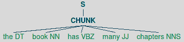
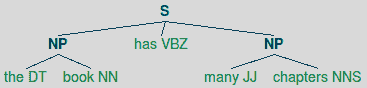
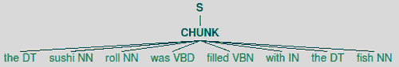
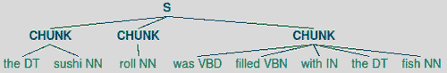
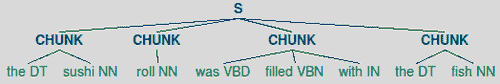
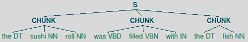
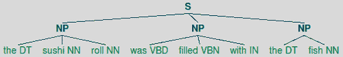
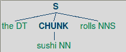
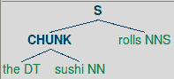
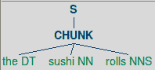

# 第五章 提取块

在本章中，我们将涵盖：

+   使用正则表达式进行块处理和切分

+   使用正则表达式合并和拆分块

+   使用正则表达式扩展和删除块

+   使用正则表达式进行部分解析

+   训练基于标签器的块提取器

+   基于分类的块处理

+   提取命名实体

+   提取专有名词块

+   提取地点块

+   训练命名实体块提取器

# 简介

**块提取**或**部分解析**是从词性标注句子中提取短语的进程。这与完整解析不同，因为我们感兴趣的是独立的**块**或**短语**，而不是完整的解析树。想法是通过简单地寻找特定的词性标签模式，可以从句子中提取有意义的短语。

如同第四章中所述的*词性标注*，我们将使用**宾州树库语料库**进行基本训练和测试块提取。我们还将使用 CoNLL 2000 语料库，因为它具有更简单、更灵活的格式，支持多种块类型（有关 `conll2000` 语料库和 IOB 标记的更多详细信息，请参阅第三章中的*创建块短语语料库*配方）。

# 使用正则表达式进行块处理和切分

使用修改后的正则表达式，我们可以定义**块模式**。这些是定义构成块单词类型的词性标签模式。我们还可以定义不应在块中的单词类型的模式。这些未块化的单词被称为**切分**。

`ChunkRule` 指定要包含在块中的内容，而 `ChinkRule` 指定要从块中排除的内容。换句话说，**块处理**创建块，而**切分**则将这些块拆分。

## 准备工作

我们首先需要知道如何定义块模式。这些是经过修改的正则表达式，旨在匹配词性标签序列。单个标签通过括号指定，例如 `<NN>` 以匹配名词标签。然后可以将多个标签组合起来，例如 `<DT><NN>` 以匹配一个限定词后跟一个名词。在括号内可以使用正则表达式语法来匹配单个标签模式，因此您可以使用 `<NN.*>` 来匹配包括 `NN` 和 `NNS` 在内的所有名词。您还可以在括号外使用正则表达式语法来匹配标签的模式。`<DT>?<NN.*>+` 将匹配一个可选的限定词后跟一个或多个名词。块模式通过 `tag_pattern2re_pattern()` 函数内部转换为正则表达式：

```py
>>> from nltk.chunk import tag_pattern2re_pattern
>>> tag_pattern2re_pattern('<DT>?<NN.*>+')
'(<(DT)>)?(<(NN[^\\{\\}<>]*)>)+'
```

您不必使用此功能进行块处理，但查看您的块模式如何转换为正则表达式可能是有用或有趣的。

## 如何操作...

指定一个块的模式是使用周围的括号，例如`{<DT><NN>}`。要指定一个 chink，您需要翻转括号，如`}<VB>{`。这些规则可以组合成特定短语类型的**语法**。下面是一个名词短语的语法，它结合了块和 chink 模式，以及解析句子"The book has many chapters"的结果：

```py
>>> from nltk.chunk import RegexpParser
>>> chunker = RegexpParser(r'''
... NP:
...    {<DT><NN.*><.*>*<NN.*>}
...    }<VB.*>{
... ''')
>>> chunker.parse([('the', 'DT'), ('book', 'NN'), ('has', 'VBZ'), ('many', 'JJ'), ('chapters', 'NNS')])
Tree('S', [Tree('NP', [('the', 'DT'), ('book', 'NN')]), ('has', 'VBZ'), Tree('NP', [('many', 'JJ'), ('chapters', 'NNS')])])
```

语法告诉`RegexpParser`存在两个解析`NP`块规则。第一个块模式表示块以一个*限定词*开始，后面跟任何类型的*名词*。然后允许任何数量的其他单词，直到找到一个最后的名词。第二个模式表示动词应该被*chinked*，从而分离包含动词的任何大块。结果是包含两个名词短语块的树："the book"和"many chapters"。

### 注意

标记的句子总是被解析成一个`Tree`（在`nltk.tree`模块中找到）。`Tree`的顶层节点是"`S`"，代表*句子*。找到的任何块都将作为子树，其节点将引用块类型。在这种情况下，块类型是"`NP`"代表*名词短语*。可以通过调用`draw()`方法来绘制树，例如`t.draw()`。

## 如何工作...

下面是逐步发生的事情：

1.  句子被转换成一个扁平的`Tree`，如下面的图所示：

1.  使用`Tree`创建一个`ChunkString`。

1.  `RegexpParser`解析语法以创建具有给定规则的`NP RegexpChunkParser`。

1.  创建并应用于`ChunkString`的`ChunkRule`，将整个句子匹配到一个块中，如下面的图所示：

1.  创建并应用于相同的`ChunkString`的`ChinkRule`，将大块分成两个较小的块，中间有一个动词，如下面的图所示：

1.  `ChunkString`被转换回一个`Tree`，现在有两个**NP**块子树，如下面的图所示：

您可以使用`nltk.chunk.regexp`中的类自己完成这项操作。`ChunkRule`和`ChinkRule`都是`RegexpChunkRule`的子类，需要两个参数：模式和规则的描述。`ChunkString`是一个以扁平树开始的对象，然后通过将其传递到规则的`apply()`方法时修改每个规则。`ChunkString`可以通过`to_chunkstruct()`方法转换回`Tree`。下面是演示它的代码：

```py
>>> from nltk.chunk.regexp import ChunkString, ChunkRule, ChinkRule
>>> from nltk.tree import Tree
>>> t = Tree('S', [('the', 'DT'), ('book', 'NN'), ('has', 'VBZ'), ('many', 'JJ'), ('chapters', 'NNS')])
>>> cs = ChunkString(t)
>>> cs
<ChunkString: '<DT><NN><VBZ><JJ><NNS>'>
>>> ur = ChunkRule('<DT><NN.*><.*>*<NN.*>', 'chunk determiners and nouns')
>>> ur.apply(cs)
>>> cs
<ChunkString: '{<DT><NN><VBZ><JJ><NNS>}'>
>>> ir = ChinkRule('<VB.*>', 'chink verbs')
>>> ir.apply(cs)
>>> cs
<ChunkString: '{<DT><NN>}<VBZ>{<JJ><NNS>}'>
>>> cs.to_chunkstruct()
Tree('S', [Tree('CHUNK', [('the', 'DT'), ('book', 'NN')]), ('has', 'VBZ'), Tree('CHUNK', [('many', 'JJ'), ('chapters', 'NNS')])])
```

可以通过调用`cs.to_chunkstruct().draw()`在每个步骤中绘制前面的树图。

## 还有更多...

您会注意到来自`ChunkString`的子树被标记为`'CHUNK'`而不是`'NP'`。这是因为之前的规则是无短语感知的；它们创建块而不需要知道它们是什么类型的块。

在内部，`RegexpParser`为每个词块短语类型创建一个`RegexpChunkParser`。所以如果你只对`NP`短语进行词块处理，就只有一个`RegexpChunkParser`。`RegexpChunkParser`获取特定词块类型的所有规则，并按顺序应用这些规则，将`'CHUNK'`树转换为特定词块类型，如`'NP'`。

下面是一些代码示例，说明了`RegexpChunkParser`的用法。我们将前两个规则传递给`RegexpChunkParser`，然后解析之前创建的相同句子树。得到的树与按顺序应用两个规则得到的树相同，只是两个子树中的`'CHUNK'`已被替换为`'NP'`。这是因为`RegexpChunkParser`默认的`chunk_node`是`'NP'`。

```py
>>> from nltk.chunk import RegexpChunkParser
>>> chunker = RegexpChunkParser([ur, ir])
>>> chunker.parse(t)
Tree('S', [Tree('NP', [('the', 'DT'), ('book', 'NN')]), ('has', 'VBZ'), Tree('NP', [('many', 'JJ'), ('chapters', 'NNS')])])
```

### 不同的词块类型

如果你想要解析不同的词块类型，可以将它作为`chunk_node`传递给`RegexpChunkParser`。以下是刚刚看到的相同代码，但我们将`'NP'`子树改为`'CP'`（自定义短语）：

```py
>>> from nltk.chunk import RegexpChunkParser
>>> chunker = RegexpChunkParser([ur, ir], chunk_node='CP')
>>> chunker.parse(t)
Tree('S', [Tree('CP', [('the', 'DT'), ('book', 'NN')]), ('has', 'VBZ'), Tree('CP', [('many', 'JJ'), ('chapters', 'NNS')])])
```

当你指定多个短语类型时，`RegexpParser`会内部执行此操作。这将在*使用正则表达式进行部分解析*中介绍。

### 替代模式

通过在语法中使用两个词块模式并丢弃`chink`模式，可以得到相同的解析结果：

```py
>>> chunker = RegexpParser(r'''
... NP:
...    {<DT><NN.*>}
...    {<JJ><NN.*>}
... ''')
>>> chunker.parse(t)
Tree('S', [Tree('NP', [('the', 'DT'), ('book', 'NN')]), ('has', 'VBZ'), Tree('NP', [('many', 'JJ'), ('chapters', 'NNS')])])
```

实际上，你可以将两个词块模式合并成一个模式。

```py
>>> chunker = RegexpParser(r'''
... NP:
...    {(<DT>|<JJ>)<NN.*>}
... ''')
>>> chunker.parse(t)
Tree('S', [Tree('NP', [('the', 'DT'), ('book', 'NN')]), ('has', 'VBZ'), Tree('NP', [('many', 'JJ'), ('chapters', 'NNS')])])
```

你如何创建和组合模式完全取决于你。模式创建是一个试错的过程，完全取决于你的数据看起来像什么，以及哪些模式最容易表达。

### 带有上下文的词块规则

你还可以创建带有周围标签上下文的词块规则。例如，如果你的模式是`<DT>{<NN>}`，它将被解析为`ChunkRuleWithContext`。任何在花括号两侧有标签的情况下，你都会得到一个`ChunkRuleWithContext`而不是`ChunkRule`。这可以让你更具体地确定何时解析特定类型的词块。

这是一个直接使用`ChunkWithContext`的示例。它接受四个参数：左侧上下文、词块模式、右侧上下文和描述：

```py
>>> from nltk.chunk.regexp import ChunkRuleWithContext
>>> ctx = ChunkRuleWithContext('<DT>', '<NN.*>', '<.*>', 'chunk nouns only after determiners')
>>> cs = ChunkString(t)
>>> cs
<ChunkString: '<DT><NN><VBZ><JJ><NNS>'>
>>> ctx.apply(cs)
>>> cs
<ChunkString: '<DT>{<NN>}<VBZ><JJ><NNS>'>
>>> cs.to_chunkstruct()
Tree('S', [('the', 'DT'), Tree('CHUNK', [('book', 'NN')]), ('has', 'VBZ'), ('many', 'JJ'), ('chapters', 'NNS')])
```

这个例子中只对跟在限定词后面的名词进行词块处理，因此忽略了跟在形容词后面的名词。以下是使用`RegexpParser`的示例：

```py
>>> chunker = RegexpParser(r'''
... NP:
...    <DT>{<NN.*>}
... ''')
>>> chunker.parse(t)
Tree('S', [('the', 'DT'), Tree('NP', [('book', 'NN')]), ('has', 'VBZ'), ('many', 'JJ'), ('chapters', 'NNS')])
```

## 参见

在下一个菜谱中，我们将介绍合并和拆分词块。

# 使用正则表达式合并和拆分词块

在这个菜谱中，我们将介绍两个额外的词块规则。`MergeRule`可以根据第一个词块的末尾和第二个词块的开头合并两个词块。`SplitRule`将根据指定的拆分模式将一个词块拆分为两个。

## 如何实现...

一个`Sp` `litRule`通过在两侧的模式中包围两个对立的大括号来指定。要在名词之后分割一个块，你会这样做`<NN.*>}{<.*>`。一个`Merg` `eRule`通过翻转大括号来指定，它将连接第一个块的末尾与左模式匹配，下一个块的开始与右模式匹配的块。要合并两个块，第一个以名词结束，第二个以名词开始，你会使用`<NN.*>{}<NN.*>`。

### 注意

规则的顺序非常重要，重新排序可能会影响结果。`RegexpParser`从上到下逐个应用规则，因此每个规则都会应用到前一个规则产生的`ChunkString`。

这里有一个分割和合并的例子，从下面的句子树开始：


1.  整个句子被分割，如下面的图所示：

1.  每个名词之后，块被分割成多个块，如下面的树所示：

1.  每个带有限定词的块都被分割成单独的块，创建了四个块，而之前是三个：

1.  以名词结尾的块如果下一个块以名词开始，则与下一个块合并，将四个块减少到三个，如下面的图所示：

使用`RegexpParser`，代码看起来像这样：

```py
>>> chunker = RegexpParser(r'''
... NP:
...     {<DT><.*>*<NN.*>}
...     <NN.*>}{<.*>
...     <.*>}{<DT>
...     <NN.*>{}<NN.*>
... ''')
>>> sent = [('the', 'DT'), ('sushi', 'NN'), ('roll', 'NN'), ('was', 'VBD'), ('filled', 'VBN'), ('with', 'IN'), ('the', 'DT'), ('fish', 'NN')]
>>> chunker.parse(sent)
Tree('S', [Tree('NP', [('the', 'DT'), ('sushi', 'NN'), ('roll', 'NN')]), Tree('NP', [('was', 'VBD'), ('filled', 'VBN'), ('with', 'IN')]), Tree('NP', [('the', 'DT'), ('fish', 'NN')])])
```

`NP`块的最后树如下所示：



## 它是如何工作的...

`MergeRule`和`SplitRule`类接受三个参数：左模式、右模式和描述。`RegexpParser`负责在花括号上分割原始模式以获取左右两侧，但你也可以手动创建这些。以下是如何通过应用每个规则逐步修改原始句子的说明：

```py
>>> from nltk.chunk.regexp import MergeRule, SplitRule
>>> cs = ChunkString(Tree('S', sent))
>>> cs
<ChunkString: '<DT><NN><NN><VBD><VBN><IN><DT><NN>'>
>>> ur = ChunkRule('<DT><.*>*<NN.*>', 'chunk determiner to noun')
>>> ur.apply(cs)
>>> cs
<ChunkString: '{<DT><NN><NN><VBD><VBN><IN><DT><NN>}'>
>>> sr1 = SplitRule('<NN.*>', '<.*>', 'split after noun')
>>> sr1.apply(cs)
>>> cs
<ChunkString: '{<DT><NN>}{<NN>}{<VBD><VBN><IN><DT><NN>}'>
>>> sr2 = SplitRule('<.*>', '<DT>', 'split before determiner')
>>> sr2.apply(cs)
>>> cs
<ChunkString: '{<DT><NN>}{<NN>}{<VBD><VBN><IN>}{<DT><NN>}'>
>>> mr = MergeRule('<NN.*>', '<NN.*>', 'merge nouns')
>>> mr.apply(cs)
>>> cs
<ChunkString: '{<DT><NN><NN>}{<VBD><VBN><IN>}{<DT><NN>}'>
>>> cs.to_chunkstruct()
Tree('S', [Tree('CHUNK', [('the', 'DT'), ('sushi', 'NN'), ('roll', 'NN')]), Tree('CHUNK', [('was', 'VBD'), ('filled', 'VBN'), ('with', 'IN')]), Tree('CHUNK', [('the', 'DT'), ('fish', 'NN')])])
```

## 还有更多...

规则的解析以及左右模式的分割是在`RegexpChunkRule`超类的静态`parse()`方法中完成的。这是由`RegexpParser`调用来获取传递给`RegexpChunkParser`的规则列表的。以下是一些解析之前使用的模式的示例：

```py
>>> from nltk.chunk.regexp import RegexpChunkRule
>>> RegexpChunkRule.parse('{<DT><.*>*<NN.*>}')
<ChunkRule: '<DT><.*>*<NN.*>'>
>>> RegexpChunkRule.parse('<.*>}{<DT>')
<SplitRule: '<.*>', '<DT>'>
>>> RegexpChunkRule.parse('<NN.*>{}<NN.*>')
<MergeRule: '<NN.*>', '<NN.*>'>
```

### 规则描述

可以通过在规则后面的注释字符串（注释字符串必须以`#`开头）来指定每个规则的描述。如果没有找到注释字符串，则规则的描述将为空。以下是一个示例：

```py
>>> RegexpChunkRule.parse('{<DT><.*>*<NN.*>} # chunk everything').descr()
'chunk everything'
>>> RegexpChunkRule.parse('{<DT><.*>*<NN.*>}').descr()
''
```

在传递给`RegexpParser`的语法字符串中也可以使用注释字符串描述。

## 参见

之前的配方介绍了如何使用`ChunkRule`以及如何将规则传递给`RegexpChunkParser`。

# 使用正则表达式扩展和删除块

有三个`RegexpChunkRule`子类不被`RegexpChunkRule.parse()`支持，因此如果你想要使用它们，必须手动创建。这些规则是：

1.  `ExpandLeftRule`：将未解块的（词）添加到块的左侧。

1.  `ExpandRightRule`：将未解块的（词）添加到块的右侧。

1.  `UnChunkRule`：解块任何匹配的块。

## 如何操作...

`ExpandLeft` `Rule` 和 `ExpandRightRule` 都接受两个模式以及一个描述作为参数。对于 `ExpandLeftRule`，第一个模式是我们想要添加到块开头的词，而右侧的模式将匹配我们想要扩展的块的开头。对于 `ExpandRightRule`，左侧的模式应该匹配我们想要扩展的块的末尾，而右侧的模式匹配我们想要添加到块末尾的词。这个想法与 `MergeRule` 类似，但在这个情况下，我们是在合并词而不是其他块。

`UnChunkRule` 是 `ChunkRule` 的反义词。任何与 `UnChunkRule` 模式完全匹配的块将被解块，并成为词。以下是一些使用 `RegexpChunkParser` 的代码示例：

```py
>>> from nltk.chunk.regexp import ChunkRule, ExpandLeftRule, ExpandRightRule, UnChunkRule
>>> from nltk.chunk import RegexpChunkParser
>>> ur = ChunkRule('<NN>', 'single noun')
>>> el = ExpandLeftRule('<DT>', '<NN>', 'get left determiner')
>>> er = ExpandRightRule('<NN>', '<NNS>', 'get right plural noun')
>>> un = UnChunkRule('<DT><NN.*>*', 'unchunk everything')
>>> chunker = RegexpChunkParser([ur, el, er, un])
>>> sent = [('the', 'DT'), ('sushi', 'NN'), ('rolls', 'NNS')]
>>> chunker.parse(sent)
Tree('S', [('the', 'DT'), ('sushi', 'NN'), ('rolls', 'NNS')])
```

你会注意到最终结果是平面的句子，这正是我们开始时的样子。那是因为最终的 `UnChunkRule` 取消了之前规则创建的块。继续阅读以了解发生了什么一步一步的过程。

## 如何操作...

以下规则按以下顺序应用，从下面的句子树开始：


1.  将单个名词组合成一个块，如下所示：

1.  将左侧的限定词扩展到以名词开头的块中，如下所示：

1.  将右侧的复数名词扩展到以名词结尾的块中，如下所示：

1.  将每个由限定词 + 名词 + 复数名词组成的块进行解块，从而得到原始句子树，如下所示：

下面是展示每一步的代码：

```py
>>> from nltk.chunk.regexp import ChunkString
>>> from nltk.tree import Tree
>>> cs = ChunkString(Tree('S', sent))
>>> cs
<ChunkString: '<DT><NN><NNS>'>
>>> ur.apply(cs)
>>> cs
<ChunkString: '<DT>{<NN>}<NNS>'>
>>> el.apply(cs)
>>> cs
<ChunkString: '{<DT><NN>}<NNS>'>
>>> er.apply(cs)
>>> cs
<ChunkString: '{<DT><NN><NNS>}'>
>>> un.apply(cs)
>>> cs
<ChunkString: '<DT><NN><NNS>'>
```

## 还有更多...

在实践中，你可能只需要使用前面提到的四个规则：`ChunkRule`、`ChinkRule`、`MergeRule` 和 `SplitRule`。但如果你确实需要非常精细地控制块解析和移除，现在你知道如何使用扩展和解块规则来做到这一点。

## 参见

前两个配方涵盖了 `RegexpChunkRule.parse()` 和 `RegexpParser` 支持的更常见的块规则。

# 使用正则表达式进行部分解析

到目前为止，我们只解析了名词短语。但 `RegexpParser` 支持具有多种短语类型的语法，例如 *动词短语* 和 *介词短语*。我们可以将学到的规则应用到定义一个语法中，该语法可以与 `conll2000` 语料库进行评估，该语料库包含 `NP`、`VP` 和 `PP` 短语。

## 如何操作...

我们将定义一个语法来解析三种短语类型。对于名词短语，我们有一个`ChunkRule`，它寻找一个可选的限定词后跟一个或多个名词。然后我们有一个`MergeRule`，用于在名词块的前面添加一个形容词。对于介词短语，我们简单地分块任何`IN`词，例如“in”或“on”。对于动词短语，我们分块一个可选的情态词（例如“should”）后跟一个动词。

### 注意

每个语法规则后面都跟着一个`#`注释。这个注释被传递给每个规则作为描述。注释是可选的，但它们可以是理解规则做什么的有用注释，并且将包含在追踪输出中。

```py
>>> chunker = RegexpParser(r'''
... NP:
... {<DT>?<NN.*>+}  # chunk optional determiner with nouns
... <JJ>{}<NN.*>  # merge adjective with noun chunk
... PP:
... {<IN>}  # chunk preposition
... VP:
... {<MD>?<VB.*>}  # chunk optional modal with verb
... ''')
>>> from nltk.corpus import conll2000
>>> score = chunker.evaluate(conll2000.chunked_sents())
>>> score.accuracy()
0.61485735457576884
```

当我们在`chunker`上调用`evaluate()`方法时，我们给它一个分块句子的列表，并返回一个`ChunkScore`对象，该对象可以给我们`chunker`的准确度，以及许多其他指标。

## 它是如何工作的...

`RegexpParser`将语法字符串解析成一系列规则，每个短语类型有一组规则。这些规则被用来创建一个`RegexpChunkParser`。规则是通过`RegexpChunkRule.parse()`解析的，它返回五个子类之一：`ChunkRule`、`ChinkRule`、`MergeRule`、`SplitRule`或`ChunkRuleWithContext`。

现在语法已经被翻译成一系列规则，这些规则被用来将标记句子解析成`Tree`结构。`RegexpParser`从`ChunkParserI`继承，它提供了一个`parse()`方法来解析标记的词。每当标记的标记的一部分与分块规则匹配时，就会构建一个子树，使得标记的标记成为`Tree`的叶子，其节点字符串是分块标签。`ChunkParserI`还提供了一个`evaluate()`方法，该方法将给定的分块句子与`parse()`方法的输出进行比较，以构建并返回一个`ChunkScore`对象。

## 还有更多...

你还可以在`treebank_chunk`语料库上评估这个`chunker`。

```py
>>> from nltk.corpus import treebank_chunk
>>> treebank_score = chunker.evaluate(treebank_chunk.chunked_sents())
>>> treebank_score.accuracy()
0.49033970276008493
```

`treebank_chunk`语料库是`treebank`语料库的一个特殊版本，它提供了一个`chunked_sents()`方法。由于文件格式，常规的`treebank`语料库无法提供该方法。

### 分块评分指标

`ChunkScore`除了准确度之外还提供了一些其他指标。对于`chunker`能够猜测的分块，精确度告诉你有多少是正确的。召回率告诉你`chunker`在找到正确分块方面的表现如何，与总共有多少分块相比。

```py
>>> score.precision()
0.60201948127375005
>>> score.recall()
0.60607250250584699
```

你还可以获取`chunker`遗漏的分块列表，错误找到的分块，正确的分块和猜测的分块。这些可以帮助你了解如何改进你的分块语法。

```py
>>> len(score.missed())
47161
>>> len(score.incorrect())
47967
>>> len(score.correct())
119720
>>> len(score.guessed())
120526
```

如你所见，通过错误分块的数量，以及比较`guessed()`和`correct()`，我们的分块器猜测实际上存在的分块更多。它还遗漏了大量正确的分块。

### 循环和追踪

如果你想在语法中多次应用分块规则，你可以在初始化`RegexpParser`时传递`loop=2`。默认是`loop=1`。

要观察分块过程的内部跟踪，请将 `trace=1` 传递给 `RegexpParser`。要获取更多输出，请传递 `trace=2`。这将给出分块器正在执行的操作的打印输出。规则注释/描述将包含在跟踪输出中，这可以帮助你了解何时应用了哪个规则。

## 参见

如果觉得提出正则表达式块模式看起来工作量太大，那么请阅读下一部分内容，我们将介绍如何基于分块句子的语料库训练一个分块器。

# 基于标签器的分块器

训练分块器可以是一个手动指定正则表达式块模式的绝佳替代方案。而不是通过繁琐的试错过程来获取确切的正确模式，我们可以使用现有的语料库数据来训练分块器，就像我们在 第四章 中做的那样，*词性标注*。

## 如何操作...

与词性标注一样，我们将使用树库语料库数据进行训练。但这次我们将使用 `treebank_chunk` 语料库，该语料库专门格式化以生成以树的形式呈现的分块句子。这些 `chunked_sents()` 将由 `TagChunker` 类用于训练基于标签器的分块器。`TagChunker` 使用辅助函数 `conll_tag_chunks()` 从 `Tree` 列表中提取 `(pos, iob)` 元组列表。然后，这些 `(pos, iob)` 元组将用于以与 第四章 中 *词性标注* 相同的方式训练标签器。但与学习单词的词性标签不同，我们正在学习词性标签的 IOB 标签。以下是 `chunkers.py` 中的代码：

```py
import nltk.chunk, itertools
from nltk.tag import UnigramTagger, BigramTagger
from tag_util import backoff_tagger

def conll_tag_chunks(chunk_sents):
  tagged_sents = [nltk.chunk.tree2conlltags(tree) for tree in chunk_sents]
  return [[(t, c) for (w, t, c) in sent] for sent in tagged_sents]

class TagChunker(nltk.chunk.ChunkParserI):
  def __init__(self, train_chunks, tagger_classes=[UnigramTagger, BigramTagger]):
    train_sents = conll_tag_chunks(train_chunks)
    self.tagger = backoff_tagger(train_sents, tagger_classes)

  def parse(self, tagged_sent):
    if not tagged_sent: return None
    (words, tags) = zip(*tagged_sent)
    chunks = self.tagger.tag(tags)
    wtc = itertools.izip(words, chunks)
    return nltk.chunk.conlltags2tree([(w,t,c) for (w,(t,c)) in wtc])
```

一旦我们有了训练好的 `TagChunker`，我们就可以像在之前的食谱中对 `RegexpParser` 进行评估一样评估 `ChunkScore`。

```py
>>> from chunkers import TagChunker
>>> from nltk.corpus import treebank_chunk
>>> train_chunks = treebank_chunk.chunked_sents()[:3000]
>>> test_chunks = treebank_chunk.chunked_sents()[3000:]
>>> chunker = TagChunker(train_chunks)
>>> score = chunker.evaluate(test_chunks)
>>> score.accuracy()
0.97320393352514278
>>> score.precision()
0.91665343705350055
>>> score.recall()
0.9465573770491803
```

非常准确！训练分块器显然是手动指定语法和正则表达式的绝佳替代方案。

## 它是如何工作的...

从第三章中的*创建分块短语语料库*配方回忆起，在*创建自定义语料库*中，`conll2000`语料库使用 IOB 标签定义分块，这些标签指定了分块的类型以及它的开始和结束位置。我们可以在这些 IOB 标签模式上训练一个词性标注器，然后使用它来驱动`ChunkerI`子类。但首先，我们需要将从一个语料库的`chunked_sents()`方法得到的`Tree`转换成一个词性标注器可用的格式。这就是`conll_tag_chunks()`所做的事情。它使用`nltk.chunk.tree2conlltags()`将一个句子`Tree`转换成一个形式为`(word, pos, iob)`的 3 元组列表，其中`pos`是词性标签，`iob`是一个 IOB 标签，例如`B-NP`用来标记名词短语的开始，或者`I-NP`用来标记该词位于名词短语内部。这个方法的逆操作是`nltk.chunk.conlltags2tree()`。以下是一些演示这些`nltk.chunk`函数的代码：

```py
>>> import nltk.chunk
>>> from nltk.tree import Tree
>>> t = Tree('S', [Tree('NP', [('the', 'DT'), ('book', 'NN')])])
>>> nltk.chunk.tree2conlltags(t)
[('the', 'DT', 'B-NP'), ('book', 'NN', 'I-NP')]
>>> nltk.chunk.conlltags2tree([('the', 'DT', 'B-NP'), ('book', 'NN', 'I-NP')])
Tree('S', [Tree('NP', [('the', 'DT'), ('book', 'NN')])])
```

下一步是将这些 3 元组转换为标签分类器可以识别的 2 元组。因为`RegexpParser`使用词性标签作为分块模式，所以我们在这里也会这样做，并将词性标签作为单词来标注。通过简单地从 3 元组`(word, pos, iob)`中删除`word`，`conll_tag_chunks()`函数返回一个形式为`(pos, iob)`的 2 元组列表。当给定的示例`Tree`作为一个列表提供时，结果就是我们能够喂给标签分类器的格式。

```py
>>> conll_tag_chunks([t])
[[('DT', 'B-NP'), ('NN', 'I-NP')]]
```

最后一步是`ChunkParserI`的一个子类，称为`TagChunker`。它使用一个内部标签分类器在一系列分块树上进行训练。这个内部标签分类器由一个`UnigramTagger`和一个`BigramTagger`组成，它们在一个回退链中使用，使用的是第四章中*训练和组合 Ngram 标签分类器*配方中创建的`backoff_tagger()`方法。

最后，`ChunkerI`子类必须实现一个`parse()`方法，该方法期望一个词性标注过的句子。我们将该句子解包成一个单词和词性标签的列表。然后，标签由标签分类器进行标注以获得 IOB 标签，这些标签随后与单词和词性标签重新组合，以创建我们可以传递给`nltk.chunk.conlltags2tree()`的 3 元组，从而返回一个最终的`Tree`。

## 还有更多...

由于我们一直在讨论`conll` IOB 标签，让我们看看`TagChunker`在`conll2000`语料库上的表现：

```py
>>> from nltk.corpus import conll2000
>>> conll_train = conll2000.chunked_sents('train.txt')
>>> conll_test = conll2000.chunked_sents('test.txt')
>>> chunker = TagChunker(conll_train)
>>> score = chunker.evaluate(conll_test)
>>> score.accuracy()
0.89505456234037617
>>> score.precision()
0.81148419743556754
>>> score.recall()
0.86441916769448635
```

不如`treebank_chunk`好，但`conll2000`是一个更大的语料库，所以这并不太令人惊讶。

### 使用不同的标签分类器

如果你想要使用不同的标签分类器与`TagChunker`一起使用，你可以将它们作为`tagger_classes`传入。例如，这里是一个仅使用`UnigramTagger`的`TagChunker`：

```py
>>> from nltk.tag import UnigramTagger
>>> uni_chunker = TagChunker(train_chunks, tagger_classes=[UnigramTagger])
>>> score = uni_chunker.evaluate(test_chunks)
>>> score.accuracy()
0.96749259243354657
```

`tagger_classes`将直接传递到`backoff_tagger()`函数中，这意味着它们必须是`SequentialBackoffTagger`的子类。在测试中，默认的`tagger_classes=[UnigramTagger, BigramTagger]`产生了最佳结果。

## 参见

在第四章 “词性标注” 的 *“训练和组合 Ngram 标注器”* 菜谱中，涵盖了使用 `UnigramTagger` 和 `BigramTagger` 的回退标注。在之前的菜谱中解释了由短语结构切分器的 `evaluate()` 方法返回的 `ChunkScore` 指标。

# 基于分类的短语结构切分

与大多数词性标注器不同，`ClassifierBasedTagger` 从特征中学习。这意味着我们可以创建一个 `ClassifierChunker`，它可以同时从单词和词性标注中学习，而不仅仅是像 `TagChunker` 那样只从词性标注中学习。

## 如何实现...

对于 `ClassifierChunker`，我们不想像在之前的菜谱中那样丢弃训练句子中的单词。相反，为了保持与训练 `ClassiferBasedTagger` 所需的 2 元组 `(word, pos)` 格式兼容，我们使用 `chunk_trees2train_chunks()` 函数将 `nltk.chunk.tree2conlltags()` 中的 `(word, pos, iob)` 3 元组转换为 `((word, pos), iob)` 2 元组。此代码可在 `chunkers.py` 中找到：

```py
import nltk.chunk
from nltk.tag import ClassifierBasedTagger

def chunk_trees2train_chunks(chunk_sents):
  tag_sents = [nltk.chunk.tree2conlltags(sent) for sent in chunk_sents]
  return [[((w,t),c) for (w,t,c) in sent] for sent in tag_sents]
```

接下来，我们需要一个特征检测函数传递给 `ClassifierBasedTagger`。我们的默认特征检测函数 `prev_next_pos_iob()` 知道 `tokens` 列表实际上是 `(word, pos)` 元组的列表，并且可以使用它来返回适合分类器的特征集。为了给分类器尽可能多的信息，这个特征集包含当前、前一个和下一个单词以及词性标注，以及前一个 IOB 标注。

```py
def prev_next_pos_iob(tokens, index, history):
  word, pos = tokens[index]

  if index == 0:
    prevword, prevpos, previob = ('<START>',)*3
  else:
    prevword, prevpos = tokens[index-1]
    previob = history[index-1]

  if index == len(tokens) - 1:
    nextword, nextpos = ('<END>',)*2
  else:
    nextword, nextpos = tokens[index+1]

  feats = {
    'word': word,
    'pos': pos,
    'nextword': nextword,
    'nextpos': nextpos,
    'prevword': prevword,
    'prevpos': prevpos,
    'previob': previob
  }
  return feats
```

现在，我们可以定义 `ClassifierChunker`，它使用内部 `ClassifierBasedTagger`，并使用 `prev_next_pos_iob()` 提取的特征和来自 `chunk_trees2train_chunks()` 的训练句子。作为 `ChunkerParserI` 的子类，它实现了 `parse()` 方法，该方法使用 `nltk.chunk.conlltags2tree()` 将内部标注器产生的 `((w, t), c)` 元组转换为 `Tree`。

```py
class ClassifierChunker(nltk.chunk.ChunkParserI):
  def __init__(self, train_sents, feature_detector=prev_next_pos_iob, **kwargs):
    if not feature_detector:
      feature_detector = self.feature_detector

    train_chunks = chunk_trees2train_chunks(train_sents)
    self.tagger = ClassifierBasedTagger(train=train_chunks,
      feature_detector=feature_detector, **kwargs)

  def parse(self, tagged_sent):
    if not tagged_sent: return None
    chunks = self.tagger.tag(tagged_sent)
    return nltk.chunk.conlltags2tree([(w,t,c) for ((w,t),c) in chunks])
```

使用与之前菜谱中 `treebank_chunk` 语料库相同的 `train_chunks` 和 `test_chunks`，我们可以评估 `chunkers.py` 中的此代码：

```py
>>> from chunkers import ClassifierChunker
>>> chunker = ClassifierChunker(train_chunks)
>>> score = chunker.evaluate(test_chunks)
>>> score.accuracy()
0.97217331558380216
>>> score.precision()
0.92588387933830685
>>> score.recall()
0.93590163934426229
```

与 `TagChunker` 相比，所有分数都有所上升。让我们看看它在 `conll2000` 上的表现：

```py
>>> chunker = ClassifierChunker(conll_train)
>>> score = chunker.evaluate(conll_test)
>>> score.accuracy()
0.92646220740021534
>>> score.precision()
0.87379243109102189
>>> score.recall()
0.90073546206203459
```

这比 `TagChunker` 有很大改进。

## 它是如何工作的...

与之前菜谱中的 `TagChunker` 一样，我们正在训练一个用于 IOB 标注的词性标注器。但在这个情况下，我们希望包括单词作为特征来驱动分类器。通过创建形式为 `((word, pos), iob)` 的嵌套 2 元组，我们可以将单词通过标注器传递到特征检测函数。`chunk_trees2train_chunks()` 生成这些嵌套 2 元组，`prev_next_pos_iob()` 了解它们并使用每个元素作为特征。以下特征被提取：

+   当前单词和词性标注

+   前一个单词、词性标注和 IOB 标注

+   下一个单词和词性标注

`prev_next_pos_iob()`的参数看起来与`ClassifierBasedTagger`的`feature_detector()`方法的参数相同：`tokens`、`index`和`history`。但这次，`tokens`将是一个包含`(word, pos)`二元组的列表，而`history`将是一个 IOB 标签的列表。如果没有前一个或下一个标记，将使用特殊特征值`'<START>'`和`'<END>'`。

`ClassifierChunker`使用内部的`ClassifierBasedTagger`和`prev_next_pos_iob()`作为其默认的`feature_detector`。然后，将标签器的结果（以相同的嵌套二元组形式）重新格式化为三元组，使用`nltk.chunk.conlltags2tree()`返回一个最终的`Tree`。

## 更多...

您可以通过将自定义的特征检测函数传递给`ClassifierChunker`作为`feature_detector`来使用自己的特征检测函数。`tokens`将包含一个`(word, tag)`元组的列表，而`history`将包含之前找到的 IOB 标签的列表。

### 使用不同的分类器构建器

`ClassifierBasedTagger`默认使用`NaiveBayesClassifier.train`作为其`classifier_builder`。但您可以通过覆盖`classifier_builder`关键字参数来使用任何您想要的分类器。以下是一个使用`MaxentClassifier.train`的示例：

```py
>>> from nltk.classify import MaxentClassifier
>>> builder = lambda toks: MaxentClassifier.train(toks, trace=0, max_iter=10, min_lldelta=0.01)
>>> me_chunker = ClassifierChunker(train_chunks, classifier_builder=builder)
>>> score = me_chunker.evaluate(test_chunks)
>>> score.accuracy()
0.9748357452655988
>>> score.precision()
0.93794355504208615
>>> score.recall()
0.93163934426229511
```

不是直接使用`MaxentClassifier.train`，它被包装在一个`lambda`中，以便其输出是安静的（`trace=0`）并且能够在合理的时间内完成。如您所见，与使用`NaiveBayesClassifier`相比，分数略有不同。

## 参见

之前的配方*基于标签器的训练*介绍了使用词性标注器来训练标签器的想法。第四章*词性标注*中的*基于分类器的标签*配方描述了`ClassifierBasedPOSTagger`，它是`ClassifierBasedTagger`的子类。在第七章*文本分类*中，我们将详细讨论分类。

# 提取命名实体

**命名实体识别**是一种特定的块提取，它使用**实体标签**而不是，或者除了，块标签。常见的实体标签包括`PERSON`、`ORGANIZATION`和`LOCATION`。词性标注句子与正常块提取一样被解析成块树，但树的节点可以是实体标签而不是块短语标签。

## 如何做...

NLTK 附带了一个预训练的命名实体分块器。这个分块器已经在 ACE 程序的数据上进行了训练，ACE 程序是由**NIST**（**国家标准与技术研究院**）赞助的**自动内容提取**项目，你可以在这里了解更多信息：[`www.itl.nist.gov/iad/894.01/tests/ace/`](http://www.itl.nist.gov/iad/894.01/tests/ace/)。不幸的是，这些数据不包括在 NLTK 语料库中，但训练好的分块器是包含在内的。这个分块器可以通过`nltk.chunk`模块中的`ne_chunk()`方法使用。`ne_chunk()`将单个句子分块成一个`Tree`。以下是一个使用`ne_chunk()`对`treebank_chunk`语料库中第一个标记句子的示例：

```py
>>> from nltk.chunk import ne_chunk
>>> ne_chunk(treebank_chunk.tagged_sents()[0])
Tree('S', [Tree('PERSON', [('Pierre', 'NNP')]), Tree('ORGANIZATION', [('Vinken', 'NNP')]), (',', ','), ('61', 'CD'), ('years', 'NNS'), ('old', 'JJ'), (',', ','), ('will', 'MD'), ('join', 'VB'), ('the', 'DT'), ('board', 'NN'), ('as', 'IN'), ('a', 'DT'), ('nonexecutive', 'JJ'), ('director', 'NN'), ('Nov.', 'NNP'), ('29', 'CD'), ('.', '.')])
```

你可以看到找到了两个实体标签：`PERSON`和`ORGANIZATION`。这些子树中的每一个都包含一个被识别为`PERSON`或`ORGANIZATION`的单词列表。为了提取这些命名实体，我们可以编写一个简单的辅助方法，该方法将获取我们感兴趣的子树的所有叶子节点。

```py
def sub_leaves(tree, node):
  return [t.leaves() for t in tree.subtrees(lambda s: s.node == node)]
```

然后，我们可以调用此方法从树中获取所有`PERSON`或`ORGANIZATION`叶子节点。

```py
>>> tree = ne_chunk(treebank_chunk.tagged_sents()[0])
>>> from chunkers import sub_leaves
>>> sub_leaves(tree, 'PERSON')
[[('Pierre', 'NNP')]]
>>> sub_leaves(tree, 'ORGANIZATION')
[[('Vinken', 'NNP')]]
```

你可能会注意到，分块器错误地将“Vinken”分成了它自己的`ORGANIZATION Tree`，而不是将其包含在包含“Pierre”的`PERSON Tree`中。这是统计自然语言处理的情况——你不能总是期望完美。

## 它是如何工作的...

预训练的命名实体分块器与其他分块器类似，实际上它使用了一个由`MaxentClassifier`驱动的`ClassifierBasedTagger`来确定 IOB 标签。但它不使用`B-NP`和`I-NP` IOB 标签，而是使用`B-PERSON`、`I-PERSON`、`B-ORGANIZATION`、`I-ORGANIZATION`等标签。它还使用`O`标签来标记不属于命名实体的单词（因此位于命名实体子树之外）。

## 还有更多...

要同时处理多个句子，可以使用`batch_ne_chunk()`。以下是一个示例，我们处理了`treebank_chunk.tagged_sents()`的前 10 个句子，并获取了`ORGANIZATION sub_leaves()`：

```py
>>> from nltk.chunk import batch_ne_chunk
>>> trees = batch_ne_chunk(treebank_chunk.tagged_sents()[:10])
>>> [sub_leaves(t, 'ORGANIZATION') for t in trees]
[[[('Vinken', 'NNP')]], [[('Elsevier', 'NNP')]], [[('Consolidated', 'NNP'), ('Gold', 'NNP'), ('Fields', 'NNP')]], [], [], [[('Inc.', 'NNP')], [('Micronite', 'NN')]], [[('New', 'NNP'), ('England', 'NNP'), ('Journal', 'NNP')]], [[('Lorillard', 'NNP')]], [], []]
```

你可以看到有几个多词的`ORGANIZATION`分块，例如“New England Journal”。还有一些句子没有`ORGANIZATION`分块，如空列表`[]`所示。

### 二进制命名实体提取

如果你不在乎要提取的特定类型的命名实体，可以将`binary=True`传递给`ne_chunk()`或`batch_ne_chunk()`。现在，所有命名实体都将被标记为`NE`：

```py
>>> ne_chunk(treebank_chunk.tagged_sents()[0], binary=True)
Tree('S', [Tree('NE', [('Pierre', 'NNP'), ('Vinken', 'NNP')]), (',', ','), ('61', 'CD'), ('years', 'NNS'), ('old', 'JJ'), (',', ','), ('will', 'MD'), ('join', 'VB'), ('the', 'DT'), ('board', 'NN'), ('as', 'IN'), ('a', 'DT'), ('nonexecutive', 'JJ'), ('director', 'NN'), ('Nov.', 'NNP'), ('29', 'CD'), ('.', '.')])
```

如果我们获取`sub_leaves()`，我们可以看到“Pierre Vinken”被正确地组合成一个单一的命名实体。

```py
>>> sub_leaves(ne_chunk(treebank_chunk.tagged_sents()[0], binary=True), 'NE')
[[('Pierre', 'NNP'), ('Vinken', 'NNP')]]
```

## 参见

在下一个菜谱中，我们将创建自己的简单命名实体分块器。

# 提取专有名词分块

提取命名实体的简单方法是将所有专有名词（标记为`NNP`）进行分块。我们可以将这些分块标记为`NAME`，因为专有名词的定义是人的名字、地点或事物的名称。

## 如何做到这一点...

使用`RegexpParser`，我们可以创建一个非常简单的语法，将所有专有名词组合成一个`NAME`片段。然后我们可以在`treebank_chunk`的第一个标记句子上测试这个语法，以比较之前的结果。

```py
>>> chunker = RegexpParser(r'''
... NAME:
...   {<NNP>+}
... ''')
>>> sub_leaves(chunker.parse(treebank_chunk.tagged_sents()[0]), 'NAME')
[[('Pierre', 'NNP'), ('Vinken', 'NNP')], [('Nov.', 'NNP')]]
```

虽然我们得到了“Nov.”作为一个`NAME`片段，但这不是一个错误的结果，因为“Nov.”是月份的名称。

## 它是如何工作的...

`NAME`片段器是`RegexpParser`的一个简单用法，在本章的*使用正则表达式进行分块和切分*、*使用正则表达式合并和拆分片段*和*使用正则表达式进行部分解析*食谱中进行了介绍。所有标记为`NNP`的词序列都被组合成`NAME`片段。

## 还有更多...

如果我们想要确保只对人的名字进行分块，那么我们可以构建一个使用`names`语料库进行分块的`PersonChunker`。这个类可以在`chunkers.py`中找到：

```py
import nltk.chunk
from nltk.corpus import names

class PersonChunker(nltk.chunk.ChunkParserI):
  def __init__(self):
    self.name_set = set(names.words())

  def parse(self, tagged_sent):
    iobs = []
    in_person = False

    for word, tag in tagged_sent:
      if word in self.name_set and in_person:
        iobs.append((word, tag, 'I-PERSON'))
      elif word in self.name_set:
        iobs.append((word, tag, 'B-PERSON'))
        in_person = True
      else:
        iobs.append((word, tag, 'O'))
        in_person = False

    return nltk.chunk.conlltags2tree(iobs)
```

`PersonChunker`遍历标记句子，检查每个词是否在其`names_set`（从`names`语料库构建）中。如果当前词在`names_set`中，那么它使用`B-PERSON`或`I-PERSON` IOB 标签，具体取决于前一个词是否也在`names_set`中。不在`names_set`中的任何词都得到`O` IOB 标签。完成后，使用`nltk.chunk.conlltags2tree()`将 IOB 标签列表转换为`Tree`。使用它对之前的标记句子进行操作，我们得到以下结果：

```py
>>> from chunkers import PersonChunker
>>> chunker = PersonChunker()
>>> sub_leaves(chunker.parse(treebank_chunk.tagged_sents()[0]), 'PERSON')
[[('Pierre', 'NNP')]]
```

我们不再得到“Nov.”，但我们也失去了“Vinken”，因为它没有在`names`语料库中找到。这个食谱突出了片段提取和自然语言处理一般的一些困难。

+   如果你使用通用模式，你会得到通用结果

+   如果你正在寻找特定的结果，你必须使用特定的数据

+   如果你的具体数据不完整，你的结果也会不完整

## 参见

之前的食谱定义了`sub_leaves()`方法，用于显示找到的片段。在下一个食谱中，我们将介绍如何根据`gazetteers`语料库找到`LOCATION`片段。

# 提取位置片段

要识别位置片段，我们可以创建一个不同的`ChunkParserI`子类，该子类使用`gazetteers`语料库来识别位置词。`gazetteers`是一个包含以下位置词的`WordListCorpusReader`：

+   国家名称

+   美国州份和缩写

+   主要美国城市

+   加拿大省份

+   墨西哥州份

## 如何做到这一点...

`LocationChunker`，位于`chunkers.py`中，遍历一个标记句子，寻找在`gazetteers`语料库中找到的词。当它找到一个或多个位置词时，它使用 IOB 标签创建一个`LOCATION`片段。辅助方法`iob_locations()`是产生 IOB `LOCATION`标签的地方，而`parse()`方法将这些 IOB 标签转换为`Tree`。

```py
import nltk.chunk
from nltk.corpus import gazetteers

class LocationChunker(nltk.chunk.ChunkParserI):
  def __init__(self):
    self.locations = set(gazetteers.words())
    self.lookahead = 0

    for loc in self.locations:
      nwords = loc.count(' ')

      if nwords > self.lookahead:
        self.lookahead = nwords

  def iob_locations(self, tagged_sent):
    i = 0
    l = len(tagged_sent)
    inside = False

    while i < l:
      word, tag = tagged_sent[i]
      j = i + 1
      k = j + self.lookahead
      nextwords, nexttags = [], []
      loc = False

      while j < k:
        if ' '.join([word] + nextwords) in self.locations:
          if inside:
            yield word, tag, 'I-LOCATION'
          else:
            yield word, tag, 'B-LOCATION'

          for nword, ntag in zip(nextwords, nexttags):
            yield nword, ntag, 'I-LOCATION'

          loc, inside = True, True
          i = j
          break

        if j < l:
          nextword, nexttag = tagged_sent[j]
          nextwords.append(nextword)
          nexttags.append(nexttag)
          j += 1
        else:
          break

      if not loc:
        inside = False
        i += 1
        yield word, tag, 'O'

  def parse(self, tagged_sent):
    iobs = self.iob_locations(tagged_sent)
    return nltk.chunk.conlltags2tree(iobs)
```

我们可以使用`LocationChunker`将以下句子解析为两个位置：“与旧金山，CA 相比，圣何塞，CA 很冷”。

```py
>>> from chunkers import LocationChunker
>>> t = loc.parse([('San', 'NNP'), ('Francisco', 'NNP'), ('CA', 'NNP'), ('is', 'BE'), ('cold', 'JJ'), ('compared', 'VBD'), ('to', 'TO'), ('San', 'NNP'), ('Jose', 'NNP'), ('CA', 'NNP')])
>>> sub_leaves(t, 'LOCATION')
[[('San', 'NNP'), ('Francisco', 'NNP'), ('CA', 'NNP')], [('San', 'NNP'), ('Jose', 'NNP'), ('CA', 'NNP')]]
```

结果是我们得到了两个`LOCATION`片段，正如预期的那样。

## 它是如何工作的...

`LocationChunker` 首先构建 `gazetteers` 语料库中所有地点的 `set`。然后它找到单个地点字符串中的单词最大数量，这样它就知道在解析标记句子时必须向前查看多少个单词。

`parse()` 方法调用一个辅助方法 `iob_locations()`，该方法生成形式为 `(word, pos, iob)` 的 3-元组，其中 `iob` 是 `O`（如果单词不是地点），或者对于 `LOCATION` 分块是 `B-LOCATION` 或 `I-LOCATION`。`iob_locations()` 通过查看当前单词和下一个单词来查找地点分块，以检查组合单词是否在地点 `set` 中。相邻的多个地点单词然后被放入同一个 `LOCATION` 分块中，例如在先前的例子中，“San Francisco” 和 “CA”。

与前面的配方类似，构建一个 `(word, pos, iob)` 元组的列表传递给 `nltk.chunk.conlltags2tree()` 以返回一个 `Tree` 更简单、更方便。另一种方法是手动构建一个 `Tree`，但这需要跟踪子节点、子树以及你在 `Tree` 中的当前位置。

## 还有更多...

这个 `LocationChunker` 的一个优点是它不关心词性标记。只要地点单词在地点 `set` 中找到，任何词性标记都可以。

## 参考内容

在下一个配方中，我们将介绍如何使用 `ieer` 语料库训练一个命名实体分块器。

# 训练一个命名实体分块器

您可以使用 `ieer` 语料库训练自己的命名实体分块器，`ieer` 代表 **信息提取—实体识别**（**ieer**）。但这需要一些额外的工作，因为 `ieer` 语料库有分块树，但没有单词的词性标记。

## 如何实现...

使用 `chunkers.py` 中的 `ieertree2conlltags()` 和 `ieer_chunked_sents()` 函数，我们可以从 `ieer` 语料库创建命名实体分块树，以训练本章“基于分类的分块”配方中创建的 `ClassifierChunker`。

```py
import nltk.tag, nltk.chunk, itertools
from nltk.corpus import ieer

def ieertree2conlltags(tree, tag=nltk.tag.pos_tag):
  words, ents = zip(*tree.pos())
  iobs = []
  prev = None

  for ent in ents:
    if ent == tree.node:
      iobs.append('O')
      prev = None
    elif prev == ent:
      iobs.append('I-%s' % ent)
    else:
      iobs.append('B-%s' % ent)
      prev = ent

  words, tags = zip(*tag(words))
  return itertools.izip(words, tags, iobs)

def ieer_chunked_sents(tag=nltk.tag.pos_tag):
  for doc in ieer.parsed_docs():
    tagged = ieertree2conlltags(doc.text, tag)
    yield nltk.chunk.conlltags2tree(tagged)
```

我们将使用 94 句中的 80 句进行训练，其余的用于测试。然后我们可以看看它在 `treebank_chunk` 语料库的第一句话上的表现如何。

```py
>>> from chunkers import ieer_chunked_sents, ClassifierChunker
>>> from nltk.corpus import treebank_chunk
>>> ieer_chunks = list(ieer_chunked_sents())
>>> len(ieer_chunks)
94
>>> chunker = ClassifierChunker(ieer_chunks[:80])
>>> chunker.parse(treebank_chunk.tagged_sents()[0])
Tree('S', [Tree('LOCATION', [('Pierre', 'NNP'), ('Vinken', 'NNP')]), (',', ','), Tree('DURATION', [('61', 'CD'), ('years', 'NNS')]), Tree('MEASURE', [('old', 'JJ')]), (',', ','), ('will', 'MD'), ('join', 'VB'), ('the', 'DT'), ('board', 'NN'), ('as', 'IN'), ('a', 'DT'), ('nonexecutive', 'JJ'), ('director', 'NN'), Tree('DATE', [('Nov.', 'NNP'), ('29', 'CD')]), ('.', '.')])
```

因此，它找到了正确的 `DURATION` 和 `DATE`，但将“Pierre Vinken”标记为 `LOCATION`。让我们看看它与其他 `ieer` 分块树相比的得分如何：

```py
>>> score = chunker.evaluate(ieer_chunks[80:])
>>> score.accuracy()
0.88290183880706252
>>> score.precision()
0.40887174541947929
>>> score.recall()
0.50536352800953521
```

准确率相当不错，但精确率和召回率非常低。这意味着有很多误判和误报。

## 工作原理...

事实上，我们并不是在理想训练数据上工作。由 `ieer_chunked_sents()` 生成的 `ieer` 树并不完全准确。首先，没有明确的句子分隔，所以每个文档都是一个单独的树。其次，单词没有明确的标记，所以我们不得不使用 `nltk.tag.pos_tag()` 来猜测。

`ieer`语料库提供了一个`parsed_docs()`方法，该方法返回一个具有`text`属性的文档列表。这个`text`属性是一个文档`Tree`，它被转换为形式为`(word, pos, iob)`的 3 元组列表。为了获得这些最终的 3 元组，我们必须首先使用`tree.pos()`来展平`Tree`，它返回形式为`(word, entity)`的 2 元组列表，其中`entity`是实体标签或树的顶层标签。任何实体标签为顶层标签的单词都位于命名实体块之外，并得到 IOB 标签`O`。所有具有唯一实体标签的单词要么是命名实体块的开始，要么在命名实体块内部。一旦我们有了所有的 IOB 标签，我们就可以获取所有单词的词性标签，并使用`itertools.izip()`将单词、词性标签和 IOB 标签组合成 3 元组。

## 还有更多...

尽管训练数据并不理想，但`ieer`语料库为训练一个命名实体分块器提供了一个良好的起点。数据来自《纽约时报》和《美联社新闻稿》。`ieer.parsed_docs()`中的每个文档也包含一个标题属性，该属性是一个`Tree`。

```py
>>> from nltk.corpus import ieer
>>> ieer.parsed_docs()[0].headline
Tree('DOCUMENT', ['Kenyans', 'protest', 'tax', 'hikes'])
```

## 参见

本章中的*提取命名实体*配方涵盖了 NLTK 附带预训练的命名实体分块器。
