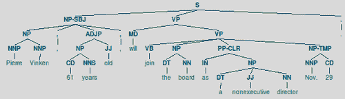
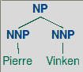
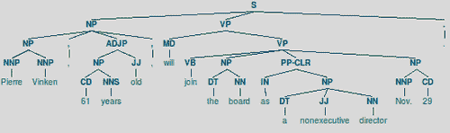

# 第六章：转换块和树

在本章中，我们将涵盖：

+   过滤不重要的单词

+   纠正动词形式

+   交换动词短语

+   交换名词基数

+   交换不定式短语

+   使复数名词变为单数

+   连接块转换

+   将块树转换为文本

+   展平一个深树

+   创建一个浅树

+   转换树节点

# 简介

现在你已经知道了如何从句子中获取块/短语，你将如何使用它们？本章将向你展示如何对块和树进行各种转换。块转换用于语法纠正和重新排列短语而不丢失意义。树转换为你提供了修改和展平深层解析树的方法。

这些菜谱中详细说明的功能是修改数据，而不是从数据中学习。这意味着不能不加区分地应用它们。对您想要转换的数据有深入的了解，以及一些实验，应该有助于您决定应用哪些函数以及何时应用。

在本章中，当使用术语**chunk**时，它可能指的是由分块器提取的实际块，或者它可能仅仅是指由标记词组成的列表形式的一个短语或句子。本章重要的是你能用块做什么，而不是它从哪里来。

# 过滤不重要的单词

许多最常用的单词在区分短语含义时都是不重要的。例如，在短语“the movie was terrible”中，最**重要**的单词是“movie”和“terrible”，而“the”和“was”几乎毫无用处。如果你把它们去掉，你仍然可以得到相同的意思，比如“movie terrible”或“terrible movie”。无论如何，情感都是一样的。在本菜谱中，我们将学习如何通过查看它们的词性标记来移除不重要的单词，并保留重要的单词。

## 准备工作

首先，我们需要决定哪些词性标记是重要的，哪些不是。通过查看`treebank`语料库中的`stopwords`得到以下不重要的单词和标记表：

| Word | Tag |
| --- | --- |
| a | DT |
| all | PDT |
| an | DT |
| and | CC |
| or | CC |
| that | WDT |
| the | DT |

除了 CC 之外，所有标记都以 DT 结尾。这意味着我们可以通过查看标记的后缀来过滤掉不重要的单词。

## 如何做到...

在`transforms.py`中有一个名为`filter_insignificant()`的函数。它接受一个单独的块，该块应是一个标记词的列表，并返回一个不包含任何不标记单词的新块。它默认过滤掉以 DT 或 CC 结尾的任何标记。

```py
def filter_insignificant(chunk, tag_suffixes=['DT', 'CC']):
  good = []

  for word, tag in chunk:
    ok = True

    for suffix in tag_suffixes:
      if tag.endswith(suffix):
        ok = False
        break

    if ok:
      good.append((word, tag))

  return good
```

现在，我们可以将其应用于“the terrible movie”的词性标记版本。

```py
>>> from transforms import filter_insignificant
>>> filter_insignificant([('the', 'DT'), ('terrible', 'JJ'), ('movie', 'NN')])
[('terrible', 'JJ'), ('movie', 'NN')]
```

如你所见，单词“the”已从块中删除。

## 它是如何工作的...

`filter_insignificant()` 遍历块中的标记词。对于每个标签，它检查该标签是否以任何 `tag_suffixes` 结尾。如果是，则跳过标记词。但如果标签是可接受的，则将标记词追加到返回的新良好块中。

## 还有更多...

根据 `filter_insignificant()` 的定义，如果你觉得 DT 和 CC 不够，或者对于你的情况不正确，你可以传递自己的标签后缀。例如，你可能会决定所有格词和代词，如 "you"、"your"、"their" 和 "theirs" 都不好，而 DT 和 CC 词是可接受的。标签后缀将是 PRP 和 PRP$。以下是这个函数的一个示例：

```py
>>> filter_insignificant([('your', 'PRP$'), ('book', 'NN'), ('is', 'VBZ'), ('great', 'JJ')], tag_suffixes=['PRP', 'PRP$'])
[('book', 'NN'), ('is', 'VBZ'), ('great', 'JJ')]
```

过滤不重要的词可以作为停止词过滤的良好补充，用于搜索引擎索引、查询和文本分类等目的。

## 参见

这个配方与 第一章 中 *Filtering stopwords in a tokenized sentence* 配方类似，*Tokenizing Text and WordNet Basics*。

# 修正动词形式

在现实世界的语言中找到错误的动词形式相当常见。例如，"is our children learning?" 的正确形式是 "are our children learning?"。动词 "is" 应仅与单数名词一起使用，而 "are" 用于复数名词，如 "children"。我们可以通过创建根据块中是否有复数或单数名词来使用的动词修正映射来纠正这些错误。

## 准备工作

我们首先需要在 `transforms.py` 中定义动词修正映射。我们将创建两个映射，一个用于复数到单数，另一个用于单数到复数。

```py
plural_verb_forms = {
  ('is', 'VBZ'): ('are', 'VBP'),
  ('was', 'VBD'): ('were', 'VBD')
}

singular_verb_forms = {
  ('are', 'VBP'): ('is', 'VBZ'),
  ('were', 'VBD'): ('was', 'VBD')
}
```

每个映射都有一个标记动词映射到另一个标记动词。这些初始映射涵盖了映射的基础，包括 is to are，was to were，反之亦然。

## 如何做...

在 `transforms.py` 中有一个名为 `correct_verbs()` 的函数。传递一个包含错误动词形式的块，你将得到一个修正后的块。它使用辅助函数 `first_chunk_index()` 在块中搜索 `pred` 返回 `True` 的第一个标记词的位置。

```py
def first_chunk_index(chunk, pred, start=0, step=1):
  l = len(chunk)
  end = l if step > 0 else -1

  for i in range(start, end, step):
    if pred(chunk[i]):
      return i

  return None

def correct_verbs(chunk):
  vbidx = first_chunk_index(chunk, lambda (word, tag): tag.startswith('VB'))
  # if no verb found, do nothing
  if vbidx is None:
    return chunk

  verb, vbtag = chunk[vbidx]
  nnpred = lambda (word, tag): tag.startswith('NN')
  # find nearest noun to the right of verb
  nnidx = first_chunk_index(chunk, nnpred, start=vbidx+1)
  # if no noun found to right, look to the left
  if nnidx is None:
    nnidx = first_chunk_index(chunk, nnpred, start=vbidx-1, step=-1)
  # if no noun found, do nothing
  if nnidx is None:
    return chunk

  noun, nntag = chunk[nnidx]
  # get correct verb form and insert into chunk
  if nntag.endswith('S'):
    chunk[vbidx] = plural_verb_forms.get((verb, vbtag), (verb, vbtag))
  else:
    chunk[vbidx] = singular_verb_forms.get((verb, vbtag), (verb, vbtag))

  return chunk
```

当我们在一个部分标记为 "is our children learning" 的块上调用它时，我们得到正确的形式，"are our children learning"。

```py
>>> from transforms import correct_verbs
>>> correct_verbs([('is', 'VBZ'), ('our', 'PRP$'), ('children', 'NNS'), ('learning', 'VBG')])
[('are', 'VBP'), ('our', 'PRP$'), ('children', 'NNS'), ('learning', 'VBG')]
```

我们也可以尝试用单数名词和错误的复数动词。

```py
>>> correct_verbs([('our', 'PRP$'), ('child', 'NN'), ('were', 'VBD'), ('learning', 'VBG')])
[('our', 'PRP$'), ('child', 'NN'), ('was', 'VBD'), ('learning', 'VBG')]
```

在这种情况下，"were" 变为 "was"，因为 "child" 是一个单数名词。

## 它是如何工作的...

`correct_verbs()` 函数首先在块中寻找一个动词。如果没有找到动词，则块保持不变并返回。一旦找到动词，我们就保留动词、其标签和其在块中的索引。然后我们在动词的两侧寻找最近的名词，从右侧开始，如果右侧没有找到名词，则向左查找。如果没有找到任何名词，则块保持原样返回。但如果找到了名词，那么我们将根据名词是否为复数来查找正确的动词形式。

回忆一下第四章中的*词性标注*，复数名词用 NNS 标注，而单数名词用 NN 标注。这意味着我们可以通过查看名词的标注是否以 S 结尾来检查名词的复数性。一旦我们得到修正后的动词形式，它就被插入到块中，以替换原始的动词形式。

为了使在块中搜索更容易，我们定义了一个名为`first_chunk_index()`的函数。它接受一个块、一个`lambda`谓词、起始索引和步长增量。谓词函数对每个标注词进行调用，直到它返回`True`。如果它从未返回`True`，则返回`None`。起始索引默认为零，步长增量默认为 1。正如你将在接下来的菜谱中看到的，我们可以通过覆盖`start`并设置`step`为-1 来向后搜索。这个小的实用函数将是后续转换函数的关键部分。

## 参见

下面的四个菜谱都使用`first_chunk_index()`来执行块转换。

# 交换动词短语

交换动词周围的词可以消除特定短语中的被动语态。例如，“the book was great”可以转换为“the great book”。

## 如何做到...

在`transforms.py`中有一个名为`swap_verb_phrase()`的函数。它使用动词作为*支点*，将块的右侧与左侧交换。它使用前一个菜谱中定义的`first_chunk_index()`函数来找到要围绕其进行转换的动词。

```py
def swap_verb_phrase(chunk):
  # find location of verb
  vbpred = lambda (word, tag): tag != 'VBG' and tag.startswith('VB') and len(tag) > 2
  vbidx = first_chunk_index(chunk, vbpred)

  if vbidx is None:
    return chunk

  return chunk[vbidx+1:] + chunk[:vbidx]
```

现在，我们可以看到它如何在词性标注的短语“the book was great”上工作。

```py
>>> from transforms import swap_verb_phrase
>>> swap_verb_phrase([('the', 'DT'), ('book', 'NN'), ('was', 'VBD'), ('great', 'JJ')])
[('great', 'JJ'), ('the', 'DT'), ('book', 'NN')]
```

结果是“伟大的书”。这个短语显然在语法上不正确，所以请继续阅读，了解如何修复它。

## 它是如何工作的...

使用前一个菜谱中的`first_chunk_index()`，我们首先找到第一个匹配的动词，该动词不是现在分词（以“ing”结尾的词）并标注为 VBG。一旦我们找到动词，我们就返回带有正确左右顺序的块，并移除动词。

我们不希望围绕现在分词进行转换的原因是，现在分词通常用来描述名词，围绕一个现在分词进行转换会移除那个描述。以下是一个例子，说明为什么不在现在分词周围进行转换是一个好事：

```py
>>> swap_verb_phrase([('this', 'DT'), ('gripping', 'VBG'), ('book', 'NN'), ('is', 'VBZ'), ('fantastic', 'JJ')])
[('fantastic', 'JJ'), ('this', 'DT'), ('gripping', 'VBG'), ('book', 'NN')]
```

如果我们围绕现在分词进行转换，结果将是“book is fantastic this”，我们会失去现在分词“gripping”。

## 还有更多...

过滤掉不重要的词可以使最终结果更易读。通过在`swap_verb_phrase()`之前或之后过滤，我们得到“精彩的扣人心弦的书”，而不是“精彩的这本书扣人心弦”。

```py
>>> from transforms import swap_verb_phrase, filter_insignificant
>>> swap_verb_phrase(filter_insignificant([('this', 'DT'), ('gripping', 'VBG'), ('book', 'NN'), ('is', 'VBZ'), ('fantastic', 'JJ')]))
[('fantastic', 'JJ'), ('gripping', 'VBG'), ('book', 'NN')]
>>> filter_insignificant(swap_verb_phrase([('this', 'DT'), ('gripping', 'VBG'), ('book', 'NN'), ('is', 'VBZ'), ('fantastic', 'JJ')]))
[('fantastic', 'JJ'), ('gripping', 'VBG'), ('book', 'NN')]
```

不论哪种方式，我们都能得到一个没有意义损失但更短的语法块。

## 参见

前一个菜谱定义了`first_chunk_index()`，它用于在块中找到动词。

# 交换名词基数

在一个块中，一个**基数词**（标记为 CD）指的是一个数字，例如“10”。这些基数词通常位于名词之前或之后。为了归一化目的，始终将基数词放在名词之前可能很有用。

## 如何操作...

函数 `swap_noun_cardinal()` 定义在 `transforms.py` 中。它将任何紧接在名词之后的基数词与名词交换，使得基数词紧接在名词之前。

```py
def swap_noun_cardinal(chunk):
  cdidx = first_chunk_index(chunk, lambda (word, tag): tag == 'CD')
  # cdidx must be > 0 and there must be a noun immediately before it
  if not cdidx or not chunk[cdidx-1][1].startswith('NN'):
    return chunk

  noun, nntag = chunk[cdidx-1]
  chunk[cdidx-1] = chunk[cdidx]
  chunk[cdidx] = noun, nntag
  return chunk
```

让我们在日期“Dec 10”和另一个常见短语“the top 10”上试一试。

```py
>>> from transforms import swap_noun_cardinal
>>> swap_noun_cardinal([('Dec.', 'NNP'), ('10', 'CD')])
[('10', 'CD'), ('Dec.', 'NNP')]
>>> swap_noun_cardinal([('the', 'DT'), ('top', 'NN'), ('10', 'CD')])
[('the', 'DT'), ('10', 'CD'), ('top', 'NN')]
```

结果是数字现在位于名词之前，形成了“10 Dec”和“the 10 top”。

## 工作原理...

我们首先在块中寻找 CD 标签。如果没有找到 CD，或者 CD 位于块的开头，则块将按原样返回。CD 前面也必须有一个名词。如果我们找到一个 CD，其前面有名词，那么我们将名词和基数词就地交换。

## 参见

*纠正动词形式* 菜谱定义了 `first_chunk_index()` 函数，用于在块中查找标记的单词。

# 交换不定式短语

不定式短语的形式为“A of B”，例如“book of recipes”。这些短语通常可以转换成新的形式，同时保留相同的意思，例如“recipes book”。

## 如何操作...

通过寻找标记为 IN 的单词，可以找到一个不定式短语。在 `transforms.py` 中定义的函数 `swap_infinitive_phrase()` 将返回一个交换了 IN 词之后短语部分与 IN 词之前短语部分的块。

```py
def swap_infinitive_phrase(chunk):
  inpred = lambda (word, tag): tag == 'IN' and word != 'like'
  inidx = first_chunk_index(chunk, inpred)

  if inidx is None:
    return chunk

  nnpred = lambda (word, tag): tag.startswith('NN')
  nnidx = first_chunk_index(chunk, nnpred, start=inidx, step=-1) or 0

  return chunk[:nnidx] + chunk[inidx+1:] + chunk[nnidx:inidx]
```

该函数现在可以用来将“book of recipes”转换成“recipes book”。

```py
>>> from transforms import swap_infinitive_phrase
>>> swap_infinitive_phrase([('book', 'NN'), ('of', 'IN'), ('recipes', 'NNS')])
[('recipes', 'NNS'), ('book', 'NN')]
```

## 工作原理...

此函数与 *交换动词短语* 菜谱中描述的 `swap_verb_phrase()` 函数类似。`inpred lambda` 被传递给 `first_chunk_index()` 以查找标记为 IN 的单词。然后使用 `nnpred` 查找 IN 词之前出现的第一个名词，这样我们就可以在 IN 词之后、名词和块的开头之间插入块的部分。一个更复杂的例子应该可以演示这一点：

```py
>>> swap_infinitive_phrase([('delicious', 'JJ'), ('book', 'NN'), ('of', 'IN'), ('recipes', 'NNS')])
[('delicious', 'JJ'), ('recipes', 'NNS'), ('book', 'NN')]
```

我们不希望结果是“recipes delicious book”。相反，我们希望在名词“book”之前、形容词“delicious”之后插入“recipes”。因此，需要找到 `nnidx` 发生在 `inidx` 之前。

## 更多内容...

你会注意到 `inpred lambda` 会检查单词是否不是“like”。这是因为“like”短语必须以不同的方式处理，因为以相同的方式转换会导致不规则的短语。例如，“tastes like chicken”不应该转换成“chicken tastes”。

```py
>>> swap_infinitive_phrase([('tastes', 'VBZ'), ('like', 'IN'), ('chicken', 'NN')])
[('tastes', 'VBZ'), ('like', 'IN'), ('chicken', 'NN')]
```

## 参见

在下一个菜谱中，我们将学习如何将“recipes book”转换成更常见的“recipe book”形式。

# 单复数名词

正如我们在之前的食谱中看到的，转换过程可能导致诸如 "recipes book" 这样的短语。这是一个 NNS 后跟一个 NN，当短语的一个更合适的版本是 "recipe book"，这是一个 NN 后跟另一个 NN。我们可以进行另一个转换来纠正这些不正确的复数名词。

## 如何做到这一点...

`transforms.py` 定义了一个名为 `singularize_plural_noun()` 的函数，该函数将去复数化一个复数名词（标记为 NNS），它后面跟着另一个名词。

```py
def singularize_plural_noun(chunk):
  nnspred = lambda (word, tag): tag == 'NNS'
  nnsidx = first_chunk_index(chunk, nnspred)

  if nnsidx is not None and nnsidx+1 < len(chunk) and chunk[nnsidx+1][1][:2] == 'NN':
    noun, nnstag = chunk[nnsidx]
    chunk[nnsidx] = (noun.rstrip('s'), nnstag.rstrip('S'))

  return chunk
```

在 "recipes book" 上使用它，我们得到更正确的形式，"recipe book"。

```py
>>> from transforms import singularize_plural_noun
>>> singularize_plural_noun([('recipes', 'NNS'), ('book', 'NN')])
[('recipe', 'NN'), ('book', 'NN')]
```

## 它是如何工作的...

我们首先寻找带有标签 NNS 的复数名词。如果找到，并且下一个词是一个名词（通过确保标签以 NN 开头来确定），那么我们就通过从标签和单词的右侧都去掉 "s" 来去复数化复数名词。

假设标签是大写的，所以从标签的右侧去掉一个 "S"，同时从单词的右侧去掉一个 "s"。

## 参见

之前的食谱展示了如何一个转换可以导致一个复数名词后面跟着一个单数名词，尽管这在现实世界的文本中也可能自然发生。

# 连接块转换

在之前的食谱中定义的转换函数可以连接起来以规范化块。结果块通常更短，但不会失去意义。

## 如何做到这一点...

在 `transforms.py` 中是 `transform_chunk()` 函数。它接受一个单独的块和一个可选的转换函数列表。它对块上的每个转换函数逐一调用，并返回最终的块。

```py
def transform_chunk(chunk, chain=[filter_insignificant, swap_verb_phrase, swap_infinitive_phrase, singularize_plural_noun], trace=0):
  for f in chain:
    chunk = f(chunk)

    if trace:
      print f.__name__, ':', chunk

  return chunk
```

在短语 "the book of recipes is delicious" 上使用它，我们得到 "delicious recipe book":

```py
>>> from transforms import transform_chunk
>>> transform_chunk([('the', 'DT'), ('book', 'NN'), ('of', 'IN'), ('recipes', 'NNS'), ('is', 'VBZ'), ('delicious', 'JJ')])
[('delicious', 'JJ'), ('recipe', 'NN'), ('book', 'NN')]
```

## 它是如何工作的...

`transform_chunk()` 函数默认按顺序链接以下函数：

+   `filter_insignificant()`

+   `swap_verb_phrase()`

+   `swap_infinitive_phrase()`

+   `singularize_plural_noun()`

每个函数都转换由前一个函数产生的块，从原始块开始。

### 注意

应用转换函数的顺序可能很重要。通过实验自己的数据来确定哪些转换最好，以及它们应该按什么顺序应用。

## 更多内容...

你可以将 `trace=1` 传递给 `transform_chunk()` 以在每个步骤得到输出。

```py
>>> from transforms import transform_chunk
>>> transform_chunk([('the', 'DT'), ('book', 'NN'), ('of', 'IN'), ('recipes', 'NNS'), ('is', 'VBZ'), ('delicious', 'JJ')], trace=1)
filter_insignificant : [('book', 'NN'), ('of', 'IN'), ('recipes', 'NNS'), ('is', 'VBZ'), ('delicious', 'JJ')]
swap_verb_phrase : [('delicious', 'JJ'), ('book', 'NN'), ('of', 'IN'), ('recipes', 'NNS')]
swap_infinitive_phrase : [('delicious', 'JJ'), ('recipes', 'NNS'), ('book', 'NN')]
singularize_plural_noun : [('delicious', 'JJ'), ('recipe', 'NN'), ('book', 'NN')]
[('delicious', 'JJ'), ('recipe', 'NN'), ('book', 'NN')]
```

这显示了每个转换函数的结果，然后这些结果被传递到下一个转换函数，直到返回一个最终块。

## 参见

使用的转换函数在上一章的食谱中定义。

# 将块树转换为文本

在某个时候，你可能想将一个 `Tree` 或子树转换回句子或块字符串。这通常很简单，除了在正确输出标点符号时。

## 如何做到这一点...

我们将使用 `treebank_chunk` 的第一个 `Tree` 作为我们的例子。显然的第一步是将树中的所有单词用空格连接起来。

```py
>>> from nltk.corpus import treebank_chunk
>>> tree = treebank_chunk.chunked_sents()[0]
>>> ' '.join([w for w, t in tree.leaves()])
'Pierre Vinken , 61 years old , will join the board as a nonexecutive director Nov. 29 .'
```

如你所见，标点符号并不完全正确。逗号和句号被当作单独的单词处理，因此也获得了周围的空格。我们可以使用正则表达式替换来修复这个问题。这已经在`transforms.py`中找到的`chunk_tree_to_sent()`函数中实现。

```py
import re
punct_re = re.compile(r'\s([,\.;\?])')

def chunk_tree_to_sent(tree, concat=' '):
  s = concat.join([w for w, t in tree.leaves()])
  return re.sub(punct_re, r'\g<1>', s)
```

使用这个函数可以得到一个更干净的句子，每个标点符号前都没有空格：

```py
>>> from transforms import chunk_tree_to_sent
>>> chunk_tree_to_sent(tree)
'Pierre Vinken, 61 years old, will join the board as a nonexecutive director Nov. 29.'
```

## 它是如何工作的...

为了纠正标点符号前的额外空格，我们创建了一个正则表达式`punct_re`，它将匹配一个空格后跟任何已知的标点符号字符。由于`.`和`?`是特殊字符，我们必须用`\`来转义它们。标点符号被括号包围，这样我们就可以使用匹配的组来进行替换。

一旦我们有了我们的正则表达式，我们就定义了`chunk_tree_to_sent()`函数，其第一步是使用默认为空格的连接字符将单词连接起来。然后我们可以调用`re.sub()`来替换所有标点符号匹配项，只保留标点符号组。这消除了标点符号前的空格，从而得到一个更正确的字符串。

## 更多...

我们可以通过使用`nltk.tag.untag()`来简化这个函数，以获取树叶中的单词，而不是使用我们自己的列表推导。

```py
import nltk.tag, re
punct_re = re.compile(r'\s([,\.;\?])')

def chunk_tree_to_sent(tree, concat=' '):
  s = concat.join(nltk.tag.untag(tree.leaves()))
  return re.sub(punct_re, r'\g<1>', s)
```

## 参见

`nltk.tag.untag()`函数在第四章的*默认标注*食谱的结尾进行了介绍，*词性标注*。

# 展平深层树

其中一些包含的语料库包含解析句子，这些句子通常是嵌套短语的深层树。不幸的是，这些树太深了，不能用于训练 chunker，因为 IOB 标签解析不是为嵌套 chunk 设计的。为了使这些树可用于 chunker 训练，我们必须将它们展平。

## 准备中

我们将使用`treebank`语料库的第一个解析句子作为我们的例子。以下是一个显示这个树有多深嵌套的图示：



你可能会注意到词性标签是树结构的一部分，而不是与单词一起包含。这将在使用`Tree.pos()`方法时得到处理，该方法专门用于将单词与预终端`Tree`节点（如词性标签）结合。

## 如何操作...

在`transforms.py`中有一个名为`flatten_deeptree()`的函数。它接受一个单个`Tree`，并将返回一个新的`Tree`，该`Tree`只保留最低级别的树。它使用一个辅助函数`flatten_childtrees()`来完成大部分工作。

```py
from nltk.tree import Tree

def flatten_childtrees(trees):
  children = []

  for t in trees:
    if t.height() < 3:
      children.extend(t.pos())
    elif t.height() == 3:
      children.append(Tree(t.node, t.pos()))
    else:
      children.extend(flatten_childtrees([c for c in t]))

  return children

def flatten_deeptree(tree):
  return Tree(tree.node, flatten_childtrees([c for c in tree]))
```

我们可以在`treebank`语料库的第一个解析句子上使用它来得到一个更平展的树：

```py
>>> from nltk.corpus import treebank
>>> from transforms import flatten_deeptree
>>> flatten_deeptree(treebank.parsed_sents()[0])
Tree('S', [Tree('NP', [('Pierre', 'NNP'), ('Vinken', 'NNP')]), (',', ','), Tree('NP', [('61', 'CD'), ('years', 'NNS')]), ('old', 'JJ'), (',', ','), ('will', 'MD'), ('join', 'VB'), Tree('NP', [('the', 'DT'), ('board', 'NN')]), ('as', 'IN'), Tree('NP', [('a', 'DT'), ('nonexecutive', 'JJ'), ('director', 'NN')]), Tree('NP-TMP', [('Nov.', 'NNP'), ('29', 'CD')]), ('.', '.')])
```

结果是一个更平展的`Tree`，它只包括 NP 短语。不是 NP 短语部分的单词被分开。这个更平展的树如下所示：


这个 `Tree` 与 `treebank_chunk` 语料库中的第一个块 `Tree` 非常相似。主要区别在于，在之前的图中，最右边的 NP `Tree` 被分成了两个子树，其中一个被命名为 NP-TMP。

以下是将 `treebank_chunk` 中的第一个树显示出来以供比较：


## 如何工作...

解决方案由两个函数组成：`flatten_deeptree()` 通过对给定树的每个子树调用 `flatten_childtrees()` 来从给定的树返回一个新的 `Tree`。

`flatten_childtrees()` 是一个递归函数，它深入到 `Tree` 中，直到找到高度等于或小于三的子树。高度小于三的 `Tree` 看起来像这样：

```py
>>> from nltk.tree import Tree
>>> Tree('NNP', ['Pierre']).height()
2
```


这些短树通过 `pos()` 函数被转换成元组的列表。

```py
>>> Tree('NNP', ['Pierre']).pos()
[('Pierre', 'NNP')]
```

我们感兴趣保留的最低级别的树的高度等于三。这些树看起来像这样：

```py
>>> Tree('NP', [Tree('NNP', ['Pierre']), Tree('NNP', ['Vinken'])]).height()
3
```



当我们在那个树上调用 `pos()` 时，我们得到：

```py
>>> Tree('NP', [Tree('NNP', ['Pierre']), Tree('NNP', ['Vinken'])]).pos()
[('Pierre', 'NNP'), ('Vinken', 'NNP')]
```

`flatten_childtrees()` 的递归性质消除了所有高度大于三的树。

## 更多...

展平深层 `Tree` 允许我们在展平的 `Tree` 上调用 `nltk.chunk.util.tree2conlltags()`，这是训练分块器的一个必要步骤。如果你在展平 `Tree` 之前尝试调用此函数，你会得到一个 `ValueError` 异常。

```py
>>> from nltk.chunk.util import tree2conlltags
>>> tree2conlltags(treebank.parsed_sents()[0])
Traceback (most recent call last):
  File "<stdin>", line 1, in <module>
  File "/usr/local/lib/python2.6/dist-packages/nltk/chunk/util.py", line 417, in tree2conlltags
    raise ValueError, "Tree is too deeply nested to be printed in CoNLL format"
ValueError: Tree is too deeply nested to be printed in CoNLL format
```

然而，在展平之后没有问题：

```py
>>> tree2conlltags(flatten_deeptree(treebank.parsed_sents()[0]))
[('Pierre', 'NNP', 'B-NP'), ('Vinken', 'NNP', 'I-NP'), (',', ',', 'O'), ('61', 'CD', 'B-NP'), ('years', 'NNS', 'I-NP'), ('old', 'JJ', 'O'), (',', ',', 'O'), ('will', 'MD', 'O'), ('join', 'VB', 'O'), ('the', 'DT', 'B-NP'), ('board', 'NN', 'I-NP'), ('as', 'IN', 'O'), ('a', 'DT', 'B-NP'), ('nonexecutive', 'JJ', 'I-NP'), ('director', 'NN', 'I-NP'), ('Nov.', 'NNP', 'B-NP-TMP'), ('29', 'CD', 'I-NP-TMP'), ('.', '.', 'O')]
```

能够展平树，为在由深层解析树组成的语料库上训练分块器打开了可能性。

### CESS-ESP 和 CESS-CAT 树库

`cess_esp` 和 `cess_cat` 语料库有解析过的句子，但没有分块句子。换句话说，它们有必须展平以训练分块器的深层树。实际上，树太深了，无法用图表显示，但可以通过显示展平前后的树的高度来演示展平过程。

```py
>>> from nltk.corpus import cess_esp
>>> cess_esp.parsed_sents()[0].height()
22
>>> flatten_deeptree(cess_esp.parsed_sents()[0]).height()
3
```

## 参考也

在 第五章 的 *基于标签器的分块器训练* 菜谱中，*提取分块* 覆盖了使用 IOB 标签训练分块器。

# 创建浅层树

在上一个菜谱中，我们通过仅保留最低级别的子树来展平了一个深层的 `Tree`。在这个菜谱中，我们将只保留最高级别的子树。

## 如何做...

我们将使用 `treebank` 语料库中的第一个解析句子作为我们的示例。回想一下，上一个菜谱中的句子 `Tree` 看起来像这样：


在 `transforms.py` 中定义的 `shallow_tree()` 函数消除了所有嵌套的子树，只保留顶层树节点。

```py
from nltk.tree import Tree

def shallow_tree(tree):
  children = []

  for t in tree:
    if t.height() < 3:
      children.extend(t.pos())
    else:
      children.append(Tree(t.node, t.pos()))

  return Tree(tree.node, children)
```

在 `treebank` 中的第一个解析句子上使用它，结果得到一个只有两个子树的 `Tree`。

```py
>>> from transforms import shallow_tree
>>> shallow_tree(treebank.parsed_sents()[0])
Tree('S', [Tree('NP-SBJ', [('Pierre', 'NNP'), ('Vinken', 'NNP'), (',', ','), ('61', 'CD'), ('years', 'NNS'), ('old', 'JJ'), (',', ',')]), Tree('VP', [('will', 'MD'), ('join', 'VB'), ('the', 'DT'), ('board', 'NN'), ('as', 'IN'), ('a', 'DT'), ('nonexecutive', 'JJ'), ('director', 'NN'), ('Nov.', 'NNP'), ('29', 'CD')]), ('.', '.')])
```

我们可以直观地看到差异，如下面的图表和代码所示：


```py
>>> treebank.parsed_sents()[0].height()
7
>>> shallow_tree(treebank.parsed_sents()[0]).height()
3
```

与前一个示例一样，新树的高度为三，因此它可以用于训练分块器。

## 工作原理...

`shallow_tree()` 函数按顺序遍历每个顶级子树以创建新的子树。如果一个子树的 `height()` 小于三个，则该子树被替换为其词性标注的子节点列表。所有其他子树都被替换为一个新的 `Tree`，其子节点是词性标注的叶子节点。这消除了所有嵌套的子树，同时保留了顶级子树。

这个函数是前一个示例中的 `flatten_deeptree()` 的替代方案，当你想要保留高级别的树节点并忽略低级别节点时使用。

## 参见

前一个示例介绍了如何展平 `Tree` 并保留最低级别的子树，而不是保留最高级别的子树。

# 转换树节点

如前文示例所示，解析树通常具有各种 `Tree` 节点类型，这些类型在块树中并不存在。如果你想使用解析树来训练一个分块器，那么你可能希望通过将这些树节点转换为更常见的节点类型来减少这种多样性。

## 准备工作

首先，我们必须决定哪些 `Tree` 节点需要被转换。让我们再次看看那个第一个 `Tree`：


立刻就可以看到有两个可选的 NP 子树：NP-SBJ 和 NP-TMP。让我们将这两个都转换为 NP。映射将如下所示：

| 原始节点 | 新节点 |
| --- | --- |
| NP-SBJ | NP |
| NP-TMP | NP |

## 如何实现...

在 `transforms.py` 中有一个名为 `convert_tree_nodes()` 的函数。它接受两个参数：要转换的 `Tree` 和节点转换 `映射`。它返回一个新的 `Tree`，其中所有匹配的节点根据 `映射` 中的值被替换。

```py
from nltk.tree import Tree

def convert_tree_nodes(tree, mapping):
  children = []

  for t in tree:
    if isinstance(t, Tree):
      children.append(convert_tree_nodes(t, mapping))
    else:
      children.append(t)

  node = mapping.get(tree.node, tree.node)
  return Tree(node, children)
```

使用前面显示的映射表，我们可以将其作为 `dict` 传递给 `convert_tree_nodes()` 并将 `treebank` 的第一个解析句子进行转换。

```py
>>> from transforms import convert_tree_nodes
>>> mapping = {'NP-SBJ': 'NP', 'NP-TMP': 'NP'}
>>> convert_tree_nodes(treebank.parsed_sents()[0], mapping)
Tree('S', [Tree('NP', [Tree('NP', [Tree('NNP', ['Pierre']), Tree('NNP', ['Vinken'])]), Tree(',', [',']), Tree('ADJP', [Tree('NP', [Tree('CD', ['61']), Tree('NNS', ['years'])]), Tree('JJ', ['old'])]), Tree(',', [','])]), Tree('VP', [Tree('MD', ['will']), Tree('VP', [Tree('VB', ['join']), Tree('NP', [Tree('DT', ['the']), Tree('NN', ['board'])]), Tree('PP-CLR', [Tree('IN', ['as']), Tree('NP', [Tree('DT', ['a']), Tree('JJ', ['nonexecutive']), Tree('NN', ['director'])])]), Tree('NP', [Tree('NNP', ['Nov.']), Tree('CD', ['29'])])])]), Tree('.', ['.'])])
```

在下面的图中，你可以看到 NP-* 子树已被替换为 NP 子树：



## 工作原理...

`convert_tree_nodes()` 递归地使用 `映射` 转换每个子树。然后，使用转换后的节点和子节点重建 `Tree`，直到整个 `Tree` 被转换。

结果是一个全新的 `Tree` 实例，其中新的子树节点已被转换。

## 参见

前两个示例介绍了不同的解析 `Tree` 展平方法，这两种方法都可以产生在使用它们来训练分块器之前可能需要映射的子树。分块器训练在 第五章 的 *基于标签器的分块器训练* 示例中介绍，*提取分块*。
