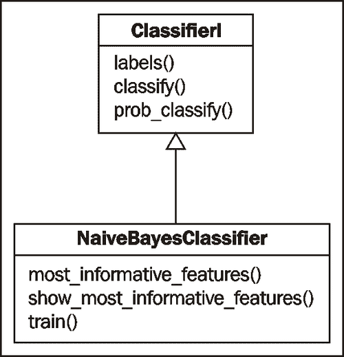

# 第七章 文本分类

在本章中，我们将涵盖：

+   词袋特征提取

+   训练朴素贝叶斯分类器

+   训练决策树分类器

+   训练最大熵分类器

+   测量分类器的精确率和召回率

+   计算高信息词

+   结合分类器进行投票

+   使用多个二元分类器进行分类

# 简介

**文本分类**是将文档或文本片段进行分类的一种方法。通过检查文本中的单词使用情况，分类器可以决定将其分配给什么**类标签**。一个**二元分类器**在两个标签之间进行选择，例如正面或负面。文本可以是其中一个标签，但不能同时是两个，而**多标签分类器**可以给一个文本片段分配一个或多个标签。

分类是通过从**标记特征集**或训练数据中学习，以后来对**未标记特征集**进行分类。**特征集**基本上是**特征名称**到**特征值**的键值映射。在文本分类的情况下，特征名称通常是单词，而值都是`True`。由于文档可能包含未知单词，并且可能的单词数量可能非常大，因此省略了未出现在文本中的单词，而不是将它们包含在具有`False`值的特征集中。

**实例**是一个单独的特征集。它代表了一个特征组合的单次出现。我们将交替使用*实例*和*特征集*。一个**标记特征集**是一个具有已知类标签的实例，我们可以用它进行训练或评估。

# 词袋特征提取

文本特征提取是将本质上是一系列单词转换成分类器可用的特征集的过程。NLTK 分类器期望`dict`风格的特征集，因此我们必须将我们的文本转换成`dict`。**词袋模型**是最简单的方法；它从一个实例的所有单词中构建一个**单词出现**特征集。

## 如何实现...

理念是将单词列表转换成一个`dict`，其中每个单词成为一个键，其值为`True`。`featx.py`中的`bag_of_words()`函数看起来像这样：

```py
def bag_of_words(words):
  return dict([(word, True) for word in words])
```

我们可以用一个单词列表使用它，在这种情况下是分词后的句子"the quick brown fox"：

```py
>>> from featx import bag_of_words
>>> bag_of_words(['the', 'quick', 'brown', 'fox'])
{'quick': True, 'brown': True, 'the': True, 'fox': True}
```

结果的`dict`被称为**词袋**，因为单词没有顺序，它们在单词列表中的位置或出现的次数无关紧要。唯一重要的是单词至少出现一次。

## 它是如何工作的...

`bag_of_words()`函数是一个非常简单的**列表推导**，它从给定的单词构建一个`dict`，其中每个单词都得到`True`的值。

由于我们必须为每个单词分配一个值以创建`dict`，所以`True`是一个逻辑上的选择，用于表示单词的存在。如果我们知道所有可能的单词的宇宙，我们可以将值`False`分配给不在给定单词列表中的所有单词。但大多数时候，我们事先不知道所有可能的单词。此外，将`False`分配给所有可能的单词所得到的`dict`将会非常大（假设所有单词都是可能的）。因此，为了保持特征提取简单并使用更少的内存，我们坚持将值`True`分配给至少出现一次的所有单词。我们不分配`False`给任何单词，因为我们不知道可能的单词集合是什么；我们只知道我们给出的单词。

## 更多...

在默认的词袋模型中，所有单词都被同等对待。但这并不总是好主意。正如我们已经知道的，有些单词非常常见，以至于它们实际上没有意义。如果你有一组想要排除的单词，你可以使用`featx.py`中的`bag_of_words_not_in_set()`函数。

```py
def bag_of_words_not_in_set(words, badwords):
  return bag_of_words(set(words) - set(badwords))
```

此函数可用于过滤停用词。以下是一个示例，其中我们从“the quick brown fox”中过滤掉单词“the”：

```py
>>> from featx import bag_of_words_not_in_set
>>> bag_of_words_not_in_set(['the', 'quick', 'brown', 'fox'], ['the'])
{'quick': True, 'brown': True, 'fox': True}
```

如预期的那样，结果`dict`中有“quick”、“brown”和“fox”，但没有“the”。

### 过滤停用词

这是一个使用`bag_of_words_not_in_set()`函数过滤所有英语停用词的示例：

```py
from nltk.corpus import stopwords

def bag_of_non_stopwords(words, stopfile='english'):
  badwords = stopwords.words(stopfile)
  return bag_of_words_not_in_set(words, badwords)
```

如果你使用的是除英语以外的语言，你可以将不同的语言文件名作为`stopfile`关键字参数传递。使用此函数产生的结果与上一个示例相同：

```py
>>> from featx import bag_of_non_stopwords
>>> bag_of_non_stopwords(['the', 'quick', 'brown', 'fox'])
{'quick': True, 'brown': True, 'fox': True}
```

在这里，“the”是一个停用词，所以它不会出现在返回的`dict`中。

### 包括重要的二元组

除了单个单词外，通常包括重要的二元组也很有帮助。因为重要的二元组比大多数单个单词更不常见，所以在词袋模型中包括它们可以帮助分类器做出更好的决策。我们可以使用第一章中“发现词搭配”食谱中提到的`BigramCollocationFinder`来找到重要的二元组。`featx.py`中的`bag_of_bigrams_words()`函数将返回一个包含所有单词以及 200 个最显著二元组的`dict`。

```py
from nltk.collocations import BigramCollocationFinder
from nltk.metrics import BigramAssocMeasures

def bag_of_bigrams_words(words, score_fn=BigramAssocMeasures.chi_sq, n=200):
  bigram_finder = BigramCollocationFinder.from_words(words)
  bigrams = bigram_finder.nbest(score_fn, n)
  return bag_of_words(words + bigrams)
```

二元组将以`(word1, word2)`的形式出现在返回的`dict`中，并将具有`True`的值。使用与之前相同的示例单词，我们得到所有单词以及每个二元组：

```py
>>> from featx import bag_of_bigrams_words
>>> bag_of_bigrams_words(['the', 'quick', 'brown', 'fox'])
{'brown': True, ('brown', 'fox'): True, ('the', 'quick'): True, 'fox': True, ('quick', 'brown'): True, 'quick': True, 'the': True}
```

你可以通过改变关键字参数`n`来更改找到的最大二元组数。

## 参见

第一章中“发现词搭配”食谱的*Tokenizing Text and WordNet Basics*更详细地介绍了`BigramCollocationFinder`。在下一个食谱中，我们将使用词袋模型创建的特征集来训练`NaiveBayesClassifier`。

# 训练朴素贝叶斯分类器

现在我们可以从文本中提取特征，我们可以训练一个分类器。最容易开始的分类器是 `NaiveBayesClassifier`。它使用 **贝叶斯定理** 来预测给定特征集属于特定标签的概率。公式是：

```py
P(label | features) = P(label) * P(features | label) / P(features)
```

+   `P(label)` 是标签发生的先验概率，这与随机特征集具有该标签的似然性相同。这是基于具有该标签的训练实例数与训练实例总数的比例。例如，如果有 60/100 的训练实例具有该标签，则该标签的先验概率是 60%。

+   `P(features | label)` 是给定特征集被分类为该标签的先验概率。这是基于在训练数据中哪些特征与每个标签一起发生的。

+   `P(features)` 是给定特征集发生的先验概率。这是随机特征集与给定特征集相同的似然性，基于训练数据中观察到的特征集。例如，如果给定特征集在 100 个训练实例中出现了两次，则先验概率是 2%。

+   `P(label | features)` 告诉我们给定特征应该具有该标签的概率。如果这个值很高，那么我们可以合理地确信该标签对于给定特征是正确的。

## 准备工作

我们将使用 `movie_reviews` 语料库作为我们最初的分类示例。这个语料库包含两种文本类别：`pos` 和 `neg`。这些类别是互斥的，这使得在它们上训练的分类器是一个 **二元分类器**。二元分类器只有两个分类标签，并且总是选择其中一个。

`movie_reviews` 语料库中的每个文件都是由正面或负面电影评论组成的。我们将使用每个文件作为训练和测试分类器的单个实例。由于文本的性质及其类别，我们将进行的分类是一种 *情感分析*。如果分类器返回 `pos`，则文本表达 *积极情感*；而如果得到 `neg`，则文本表达 *消极情感*。

## 如何操作...

对于训练，我们首先需要创建一个标记特征集的列表。这个列表应该是 `[(featureset, label)]` 的形式，其中 `featureset` 是一个 `dict`，`label` 是 `featureset` 的已知类标签。`featx.py` 中的 `label_feats_from_corpus()` 函数接受一个语料库，例如 `movie_reviews`，以及一个 `feature_detector` 函数，默认为 `bag_of_words`。然后它构建并返回一个形式为 `{label: [featureset]}` 的映射。我们可以使用这个映射来创建一个标记的 *训练实例* 和 *测试实例* 的列表。这样做的原因是因为我们可以从每个标签中获得一个公平的样本。

```py
import collections
def label_feats_from_corpus(corp, feature_detector=bag_of_words):
  label_feats = collections.defaultdict(list)
  for label in corp.categories():
    for fileid in corp.fileids(categories=[label]):
      feats = feature_detector(corp.words(fileids=[fileid]))
      label_feats[label].append(feats)
  return label_feats
```

一旦我们能够得到`label : feature`集合的映射，我们希望构建一个标签训练实例和测试实例的列表。`featx.py`中的`split_label_feats()`函数接受从`label_feats_from_corpus()`返回的映射，并将每个特征集合列表分割成标签训练实例和测试实例。

```py
def split_label_feats(lfeats, split=0.75):
  train_feats = []
  test_feats = []
  for label, feats in lfeats.iteritems():
    cutoff = int(len(feats) * split)
    train_feats.extend([(feat, label) for feat in feats[:cutoff]])
    test_feats.extend([(feat, label) for feat in feats[cutoff:]])
  return train_feats, test_feats
```

使用这些函数与`movie_reviews`语料库一起，我们可以得到训练和测试分类器所需的标签特征集合列表。

```py
>>> from nltk.corpus import movie_reviews
>>> from featx import label_feats_from_corpus, split_label_feats
>>> movie_reviews.categories()
['neg', 'pos']
>>> lfeats = label_feats_from_corpus(movie_reviews)
>>> lfeats.keys()
['neg', 'pos']
>>> train_feats, test_feats = split_label_feats(lfeats)
>>> len(train_feats)
1500
>>> len(test_feats)
500
```

因此有 1,000 个`pos`文件，1,000 个`neg`文件，我们最终得到 1,500 个标签训练实例和 500 个标签测试实例，每个实例由等量的`pos`和`neg`组成。现在我们可以使用它的`train()`类方法来训练一个`NaiveBayesClassifier`，

```py
>>> from nltk.classify import NaiveBayesClassifier
>>> nb_classifier = NaiveBayesClassifier.train(train_feats)
>>> nb_classifier.labels()
['neg', 'pos']
```

让我们在几个虚构的评论上测试一下分类器。`classify()`方法接受一个单一参数，这个参数应该是一个特征集合。我们可以使用相同的`bag_of_words()`特征检测器对一个虚构的单词列表进行检测，以获取我们的特征集合。

```py
>>> from featx import bag_of_words
>>> negfeat = bag_of_words(['the', 'plot', 'was', 'ludicrous'])
>>> nb_classifier.classify(negfeat)
'neg'
>>> posfeat = bag_of_words(['kate', 'winslet', 'is', 'accessible'])
>>> nb_classifier.classify(posfeat)
'pos'
```

## 它是如何工作的...

`label_feats_from_corpus()`假设语料库是分类的，并且单个文件代表一个用于特征提取的实例。它遍历每个分类标签，并使用默认为`bag_of_words()`的`feature_detector()`函数从该分类中的每个文件中提取特征。它返回一个字典，其键是分类标签，值是该分类的实例列表。

### 注意

如果`label_feats_from_corpus()`函数返回一个标签特征集合的列表，而不是字典，那么获取平衡的训练数据将会更加困难。列表将按标签排序，如果你从中取一个子集，你几乎肯定会得到比另一个标签多得多的一个标签。通过返回一个字典，你可以从每个标签的特征集合中取子集。

现在我们需要使用`split_label_feats()`将标签特征集合分割成训练和测试实例。这个函数允许我们从每个标签中公平地抽取标签特征集合的样本，使用`split`关键字参数来确定样本的大小。`split`默认为`0.75`，这意味着每个标签的前三分之四的标签特征集合将用于训练，剩下的四分之一将用于测试。

一旦我们将训练和测试特征分割开，我们使用`NaiveBayesClassifier.train()`方法训练一个分类器。这个类方法构建两个概率分布来计算先验概率。这些被传递给`NaiveBayesClassifier`构造函数。`label_probdist`包含`P(label)`，每个标签的先验概率。`feature_probdist`包含`P(feature name = feature value | label)`。在我们的情况下，它将存储`P(word=True | label)`。这两个都是基于训练数据中每个标签以及每个特征名称和值的频率来计算的。

`NaiveBayesClassifier` 继承自 `ClassifierI`，这要求子类提供 `labels()` 方法，以及至少一个 `classify()` 或 `prob_classify()` 方法。以下图显示了这些和其他方法，稍后将会介绍：



## 还有更多...

我们可以使用 `nltk.classify.util.accuracy()` 和之前创建的 `test_feats` 来测试分类器的准确度。

```py
>>> from nltk.classify.util import accuracy
>>> accuracy(nb_classifier, test_feats)
0.72799999999999998
```

这告诉我们，分类器正确猜测了几乎 73% 的测试特征集的标签。

### 分类概率

虽然 `classify()` 方法只返回一个标签，但你可以使用 `prob_classify()` 方法来获取每个标签的分类概率。如果你想要使用超过 50% 的概率阈值进行分类，这可能很有用。

```py
>>> probs = nb_classifier.prob_classify(test_feats[0][0])
>>> probs.samples()
['neg', 'pos']
>>> probs.max()
'pos'
>>> probs.prob('pos')
0.99999996464309127
>>> probs.prob('neg')
3.5356889692409258e-08
```

在这种情况下，分类器表示第一个测试实例几乎 100% 可能是 `pos`。

### 最具信息量的特征

`NaiveBayesClassifier` 有两种非常实用的方法，可以帮助你了解你的数据。这两种方法都接受一个关键字参数 `n` 来控制显示多少个结果。`most_informative_features()` 方法返回一个形式为 `[(feature name, feature value)]` 的列表，按信息量从大到小排序。在我们的例子中，特征值总是 `True`。

```py
>>> nb_classifier.most_informative_features(n=5)
[('magnificent', True), ('outstanding', True), ('insulting', True), ('vulnerable', True), ('ludicrous', True)]
```

`show_most_informative_features()` 方法将打印出 `most_informative_features()` 的结果，并包括特征对属于每个标签的概率。

```py
>>> nb_classifier.show_most_informative_features(n=5)
Most Informative Features

    magnificent = True    pos : neg = 15.0 : 1.0

    outstanding = True    pos : neg = 13.6 : 1.0

    insulting = True      neg : pos = 13.0 : 1.0

    vulnerable = True     pos : neg = 12.3 : 1.0

    ludicrous = True      neg : pos = 11.8 : 1.0
```

每个特征对的 *信息量*，或 **信息增益**，基于每个标签发生特征对的先验概率。信息量大的特征主要出现在一个标签中，而不是另一个标签。信息量小的特征是那些在两个标签中都频繁出现的特征。

### 训练估计器

在训练过程中，`NaiveBayesClassifier` 使用 `estimator` 参数构建其概率分布，该参数默认为 `nltk.probability.ELEProbDist`。但你可以使用任何你想要的 `estimator`，并且有很多可供选择。唯一的限制是它必须继承自 `nltk.probability.ProbDistI`，并且其构造函数必须接受一个 `bins` 关键字参数。以下是一个使用 `LaplaceProdDist` 的示例：

```py
>>> from nltk.probability import LaplaceProbDist
>>> nb_classifier = NaiveBayesClassifier.train(train_feats, estimator=LaplaceProbDist)
>>> accuracy(nb_classifier, test_feats)
0.71599999999999997
```

如你所见，准确度略有下降，所以请仔细选择你的 `estimator`。

### 注意

你不能使用 `nltk.probability.MLEProbDist` 作为估计器，或者任何不接受 `bins` 关键字参数的 `ProbDistI` 子类。训练将因 `TypeError: __init__() got an unexpected keyword argument 'bins'` 而失败。

### 手动训练

你不必使用 `train()` 类方法来构建 `NaiveBayesClassifier`。你可以手动创建 `label_probdist` 和 `feature_probdist`。`label_probdist` 应该是 `ProbDistI` 的一个实例，并且应该包含每个标签的先验概率。`feature_probdist` 应该是一个 `dict`，其键是形式为 `(label, feature name)` 的元组，其值是具有每个特征值概率的 `ProbDistI` 的实例。在我们的情况下，每个 `ProbDistI` 应该只有一个值，`True=1`。以下是一个使用手动构建的 `DictionaryProbDist` 的非常简单的例子：

```py
>>> from nltk.probability import DictionaryProbDist
>>> label_probdist = DictionaryProbDist({'pos': 0.5, 'neg': 0.5})
>>> true_probdist = DictionaryProbDist({True: 1})
>>> feature_probdist = {('pos', 'yes'): true_probdist, ('neg', 'no'): true_probdist}
>>> classifier = NaiveBayesClassifier(label_probdist, feature_probdist)
>>> classifier.classify({'yes': True})
'pos'
>>> classifier.classify({'no': True})
'neg'
```

## 参见

在接下来的菜谱中，我们将训练另外两个分类器，即 `DecisionTreeClassifier` 和 `MaxentClassifier`。在本章的 *Measuring precision and recall of a classifier* 菜谱中，我们将使用精确率和召回率而不是准确率来评估分类器。然后在 *Calculating high information words* 菜谱中，我们将看到仅使用最有信息量的特征如何提高分类器性能。

`movie_reviews` 语料库是 `CategorizedPlaintextCorpusReader` 的一个实例，这在 第三章 的 *Creating a categorized text corpus* 菜谱中有详细说明，*Creating Custom Corpora*。

# 训练决策树分类器

`DecisionTreeClassifier` 通过创建一个树结构来工作，其中每个节点对应一个特征名称，分支对应特征值。沿着分支追踪，你会到达树的叶子，它们是分类标签。

## 准备工作

为了使 `DecisionTreeClassifier` 能够用于文本分类，你必须使用 NLTK 2.0b9 或更高版本。这是因为早期版本无法处理未知特征。如果 `DecisionTreeClassifier` 遇到了它之前没有见过的单词/特征，那么它会引发异常。这个错误已经被我修复，并包含在所有自 2.0b9 版本以来的 NLTK 版本中。

## 如何操作...

使用我们在上一个菜谱中从 `movie_reviews` 语料库创建的相同的 `train_feats` 和 `test_feats`，我们可以调用 `DecisionTreeClassifier.train()` 类方法来获取一个训练好的分类器。我们传递 `binary=True`，因为我们的所有特征都是二元的：要么单词存在，要么不存在。对于其他具有多值特征的分类用例，你将想要坚持默认的 `binary=False`。

### 注意

在这个上下文中，`binary`指的是*特征值*，不要与*二元分类器*混淆。我们的词特征是二元的，因为值要么是`True`，要么该词不存在。如果我们的特征可以取超过两个值，我们就必须使用`binary=False`。另一方面，*二元分类器*是一种只选择两个标签的分类器。在我们的情况下，我们正在对二元特征训练一个二元`DecisionTreeClassifier`。但也可以有一个具有非二元特征的二元分类器，或者一个具有二元特征的非二元分类器。

下面是训练和评估`DecisionTreeClassifier`准确性的代码：

```py
>>> from nltk.classify import DecisionTreeClassifier
>>> dt_classifier = DecisionTreeClassifier.train(train_feats, binary=True, entropy_cutoff=0.8, depth_cutoff=5, support_cutoff=30)
>>> accuracy(dt_classifier, test_feats)
0.68799999999999994
```

### 小贴士

`DecisionTreeClassifier`的训练时间可能比`NaiveBayesClassifier`长得多。因此，默认参数已被覆盖，以便更快地训练。这些参数将在后面解释。

## 它是如何工作的...

`DecisionTreeClassifier`，就像`NaiveBayesClassifier`一样，也是`ClassifierI`的一个实例。在训练过程中，`DecisionTreeClassifier`创建一个树，其中子节点也是`DecisionTreeClassifier`的实例。叶节点只包含一个标签，而中间子节点包含每个特征的决策映射。这些决策将每个特征值映射到另一个`DecisionTreeClassifier`，该`DecisionTreeClassifier`本身可能包含对另一个特征的决策，或者它可能是一个带有分类标签的最终叶节点。`train()`类方法从叶节点开始构建这个树。然后它通过将最有信息量的特征放在顶部来优化自己，以最小化到达标签所需的决策数量。

为了分类，`DecisionTreeClassifier`会查看给定的特征集，并沿着树向下追踪，使用已知的特征名称和值来做出决策。因为我们创建了一个*二叉树*，每个`DecisionTreeClassifier`实例还有一个*默认*决策树，当分类的特征集中不存在已知特征时，它就会使用这个决策树。这在基于文本的特征集中很常见，表明在分类的文本中没有出现已知单词。这也为分类决策提供了信息。

## 还有更多...

传递给`DecisionTreeClassifier.train()`的参数可以调整以提高准确性或减少训练时间。一般来说，如果你想提高准确性，你必须接受更长的训练时间，而如果你想减少训练时间，准确性很可能会降低。

### 熵截止值

`entropy_cutoff`在树优化过程中使用。如果树中标签选择概率分布的熵大于`entropy_cutoff`，则进一步优化树。但如果熵低于`entropy_cutoff`，则停止树优化。

**熵**是结果的不确定性。当熵接近 1.0 时，不确定性增加；相反，当熵接近 0.0 时，不确定性减少。换句话说，当你有相似的概率时，熵会很高，因为每个概率都有相似的似然性（或发生的不确定性）。但是，概率差异越大，熵就越低。

熵是通过给`nltk.probability.entropy()`传递一个由标签计数`FreqDist`创建的`MLEProbDist`来计算的。以下是一个显示各种`FreqDist`值的熵的示例：

```py
>>> from nltk.probability import FreqDist, MLEProbDist, entropy
>>> fd = FreqDist({'pos': 30, 'neg': 10})
>>> entropy(MLEProbDist(fd))
0.81127812445913283
>>> fd['neg'] = 25
>>> entropy(MLEProbDist(fd))
0.99403021147695647
>>> fd['neg'] = 30
>>> entropy(MLEProbDist(fd))
1.0
>>> fd['neg'] = 1
>>> entropy(MLEProbDist(fd))
0.20559250818508304
```

这一切意味着，如果标签发生非常倾斜，树不需要被细化，因为熵/不确定性低。但是，当熵大于`entropy_cutoff`时，树必须通过进一步的决策来细化，以减少不确定性。`entropy_cutoff`的值越高，准确性和训练时间都会降低。

### 深度截止

`depth_cutoff`也在细化过程中使用，以控制树的深度。最终的决策树永远不会比`depth_cutoff`更深。默认值是`100`，这意味着分类可能需要最多 100 个决策才能到达叶节点。减少`depth_cutoff`将减少训练时间，并且很可能会降低准确性。

### 支持截止

`support_` `cutoff`控制需要多少个标记的特征集来细化树。随着`DecisionTreeClassifier`的自我细化，一旦标记的特征集不再对训练过程有价值，它们就会被消除。当标记的特征集数量小于或等于`support_cutoff`时，细化停止，至少对于树的那个部分。

另一种看待它的方法是`support_cutoff`指定了做出关于一个特征的决定所需的最小实例数。如果`support_cutoff`是`20`，而你拥有的标记特征集少于 20 个，那么你没有足够的实例来做出好的决定，并且围绕该特征的细化必须停止。

## 另请参阅

之前的配方涵盖了从`movie_reviews`语料库创建训练和测试特征集。在下一个配方中，我们将介绍如何训练`MaxentClassifier`，在本章的*测量分类器的精确度和召回率*配方中，我们将使用精确度和召回率来评估所有分类器。

# 训练最大熵分类器

我们将要介绍的第三个分类器是`MaxentClassifier`，也称为*条件指数分类器*。**最大熵分类器**使用编码将标记的特征集转换为向量。然后，使用这个编码向量来计算每个特征的*权重*，然后可以将这些权重组合起来，以确定特征集的最可能标签。

## 准备工作

`MaxentClassifier` 分类器需要 `numpy` 包，并且可选地需要 `scipy` 包。这是因为特征编码使用了 `numpy` 数组。安装 `scipy` 也意味着你可以使用更快的算法，这些算法消耗更少的内存。你可以在 [`www.scipy.org/Installing_SciPy`](http://www.scipy.org/Installing_SciPy) 找到两者的安装方法。

### 小贴士

许多算法可能会非常消耗内存，所以在训练 `MaxentClassifier` 时，你可能想要关闭所有其他程序，以确保安全。

## 如何操作...

我们将使用之前构建的 `movie_reviews` 语料库中的相同的 `train_feats` 和 `test_feats`，并调用 `MaxentClassifier.train()` 类方法。与 `DecisionTreeClassifier` 类似，`MaxentClassifier.train()` 有其自己的特定参数，这些参数已被调整以加快训练速度。这些参数将在稍后进行更详细的解释。

```py
>>> from nltk.classify import MaxentClassifier
>>> me_classifier = MaxentClassifier.train(train_feats, algorithm='iis', trace=0, max_iter=1, min_lldelta=0.5)
>>> accuracy(me_classifier, test_feats)
0.5
```

这个分类器准确率如此低的原因是因为参数被设置为无法学习更准确的模型。这是由于使用 `iis` 算法训练合适模型所需的时间。使用 `scipy` 算法可以更快地学习到更高准确率的模型。

### 小贴士

如果训练过程耗时过长，你通常可以通过按 *Ctrl + C* 手动中断。这应该会停止当前迭代，并基于模型当前的状态返回一个分类器。

## 它是如何工作的...

与之前的分类器一样，`MaxentClassifier` 继承自 `ClassifierI`。根据算法的不同，`MaxentClassifier.train()` 会调用 `nltk.classify.maxent` 模块中的某个训练函数。如果没有安装 `scipy`，则默认算法是 `iis`，使用的函数是 `train_maxent_classifier_with_iis()`。另一种不需要 `scipy` 的算法是 `gis`，它使用 `train_maxent_classifier_with_gis()` 函数。**gis** 代表 **General Iterative Scaling**，而 **iis** 代表 **Improved Iterative Scaling**。如果安装了 `scipy`，则使用 `train_maxent_classifier_with_scipy()` 函数，默认算法是 `cg`。如果安装了 `megam` 并指定了 `megam` 算法，则使用 `train_maxent_classifier_with_megam()`。

最大熵模型背后的基本思想是构建一些适合观察数据的概率分布，然后选择具有最高熵的任何概率分布。`gis` 和 `iis` 算法通过迭代改进用于分类特征的权重来实现这一点。这就是 `max_iter` 和 `min_lldelta` 参数发挥作用的地方。

`max_iter` 指定了要遍历并更新权重的最大迭代次数。更多的迭代通常可以提高准确率，但仅限于某个程度。最终，从一个迭代到下一个迭代的改变将达到一个平台期，进一步的迭代将变得无用。

`min_lldelta` 指定了在迭代改进权重之前所需的 *对数似然* 的最小变化。在开始训练迭代之前，创建了一个 `nltk.classify.util.CutoffChecker` 的实例。当调用其 `check()` 方法时，它使用 `nltk.classify.util.log_likelihood()` 等函数来决定是否达到了截止限制。**对数** **似然** 是训练数据平均标签概率的对数（即标签平均似然的对数）。随着对数似然的增加，模型会改进。但这也将达到一个平台期，进一步的增加非常小，继续下去没有意义。指定 `min_lldelta` 允许你控制每次迭代在停止迭代之前必须增加多少对数似然。

## 更多内容...

与 `NaiveBayesClassifier` 类似，你可以通过调用 `show_most_informative_features()` 方法来查看最有信息量的特征。

```py
>>> me_classifier.show_most_informative_features(n=4)
-0.740 worst==True and label is 'pos'

0.740 worst==True and label is 'neg'

0.715 bad==True and label is 'neg'

-0.715 bad==True and label is 'pos'
```

显示的数字是每个特征的权重。这告诉我们，单词 *worst* 对 `pos` 标签具有 *负权重*，对 `neg` 标签具有 *正权重*。换句话说，如果单词 *worst* 出现在特征集中，那么文本被分类为 `neg` 的可能性很高。

### Scipy 算法

当安装了 `scipy` 时可用的算法有：

+   **CG**（**共轭梯度** 算法）——默认的 `scipy` 算法

+   **BFGS**（**Broyden-Fletcher-Goldfarb-Shanno** 算法）——非常占用内存

+   Powell

+   LBFGSB（BFGS 的内存限制版本）

+   Nelder-Mead

这是使用 CG 算法时发生的情况：

```py
>>> me_classifier = MaxentClassifier.train(train_feats, algorithm='cg', trace=0, max_iter=10)
>>> accuracy(me_classifier, test_feats)
0.85599999999999998
```

这是迄今为止最准确的分类器。

### Megam 算法

如果你已经安装了 `megam` 包，那么你可以使用 `megam` 算法。它比 `scipy` 算法快一点，并且大约一样准确。安装说明和信息可以在 [`www.cs.utah.edu/~hal/megam/`](http://www.cs.utah.edu/~hal/megam/) 找到。可以使用 `nltk.classify.megam.config_megam()` 函数来指定 `megam` 可执行文件的位置。或者，如果 `megam` 可以在标准可执行路径中找到，NLTK 将自动配置它。

```py
>>> me_classifier = MaxentClassifier.train(train_feats, algorithm='megam', trace=0, max_iter=10)
[Found megam: /usr/local/bin/megam]
>>> accuracy(me_classifier, test_feats)
0.86799999999999999
```

`megam` 算法因其准确性和训练速度而被高度推荐。

## 参见

本章中关于 *词袋特征提取* 和 *训练朴素贝叶斯分类器* 的食谱展示了如何从 `movie_reviews` 语料库中构建训练和测试特征。在下一个食谱中，我们将介绍如何以及为什么使用精确率和召回率而不是准确率来评估分类器。

# 测量分类器的精确率和召回率

除了准确率之外，还有许多其他指标用于评估分类器。其中最常见的是*精确率*和*召回率*。为了理解这两个指标，我们首先必须理解*假阳性*和*假阴性*。**假阳性**发生在分类器将一个特征集错误地分类为一个它不应该有的标签时。**假阴性**发生在分类器没有将标签分配给应该有标签的特征集时。在*二元分类器*中，这些错误同时发生。

这里有一个例子：分类器将一个电影评论错误地分类为`pos`，而它应该是`neg`。这算作`pos`标签的*假阳性*，以及`neg`标签的*假阴性*。如果分类器正确地猜测了`neg`，那么它将算作`neg`标签的**真阳性**，以及`pos`标签的**真阴性**。

这如何应用于精确率和召回率？**精确率**是*缺乏假阳性*，而**召回率**是*缺乏假阴性*。正如您将看到的，这两个指标通常存在竞争关系：一个分类器的精确率越高，召回率就越低，反之亦然。

## 如何去做...

让我们计算在*训练朴素贝叶斯分类器*菜谱中训练的`NaiveBayesClassifier`的精确率和召回率。`classification.py`中的`precision_recall()`函数看起来是这样的：

```py
import collections
from nltk import metrics

def precision_recall(classifier, testfeats):
  refsets = collections.defaultdict(set)
  testsets = collections.defaultdict(set)

  for i, (feats, label) in enumerate(testfeats):
    refsets[label].add(i)
    observed = classifier.classify(feats)
    testsets[observed].add(i)

  precisions = {}
  recalls = {}

  for label in classifier.labels():
    precisions[label] = metrics.precision(refsets[label], testsets[label])
    recalls[label] = metrics.recall(refsets[label], testsets[label])

  return precisions, recalls
```

此函数接受两个参数：

1.  训练好的分类器。

1.  带标签的测试特征，也称为黄金标准。

这些是您传递给`accuracy()`函数的相同参数。`precision_recall()`返回两个字典；第一个包含每个标签的精确率，第二个包含每个标签的召回率。以下是一个使用我们在*训练朴素贝叶斯分类器*菜谱中较早创建的`nb_classifier`和`test_feats`的示例用法：

```py
>>> from classification import precision_recall
>>> nb_precisions, nb_recalls = precision_recall(nb_classifier, test_feats)
>>> nb_precisions['pos']
0.6413612565445026
>>> nb_precisions['neg']
0.9576271186440678
>>> nb_recalls['pos']
0.97999999999999998
>>> nb_recalls['neg']
0.45200000000000001
```

这告诉我们，虽然`NaiveBayesClassifier`可以正确识别大多数`pos`特征集（高召回率），但它也将许多`neg`特征集错误地分类为`pos`（低精确率）。这种行为导致了`neg`标签的高精确率但低召回率——因为`neg`标签并不经常给出（低召回率），当它给出时，它非常可能是正确的（高精确率）。结论可能是，有一些常见的词语倾向于`pos`标签，但它们在`neg`特征集中出现的频率足够高，以至于导致错误分类。为了纠正这种行为，我们将在下一个菜谱中只使用最有信息量的词语，即*计算高信息词语*。

## 它是如何工作的...

要计算精确率和召回率，我们必须为每个标签构建两个集合。第一个集合被称为**参考集**，包含所有正确的值。第二个集合称为**测试集**，包含分类器猜测的值。这两个集合被比较以计算每个标签的精确率或召回率。

**精确率**定义为两个集合交集的大小除以测试集的大小。换句话说，正确猜测的测试集百分比。在 Python 中，代码是 `float(len(reference.intersection(test))) / len(test)`。

**召回率**是两个集合交集的大小除以参考集的大小，或者正确猜测的参考集百分比。Python 代码是 `float(len(reference.intersection(test))) / len(reference)`。

`classification.py` 中的 `precision_recall()` 函数遍历标记的测试特征并对每个特征进行分类。我们将特征集的 *数值索引*（从 `0` 开始）存储在已知训练标签的参考集中，并将索引存储在测试集中以猜测标签。如果分类器猜测为 `pos` 但训练标签是 `neg`，则索引存储在 `neg` 的 *参考集* 和 `pos` 的 *测试集* 中。

### 注意

我们使用数值索引，因为特征集是不可哈希的，我们需要为每个特征集提供一个唯一的值。

`nltk.metrics` 包包含计算精确率和召回率的函数，所以我们实际上需要做的只是构建集合，然后调用适当的函数。

## 更多内容...

让我们用之前配方中训练的 `MaxentClassifier` 来试试：

```py
>>> me_precisions, me_recalls = precision_recall(me_classifier, test_feats)
>>> me_precisions['pos']
0.8801652892561983
>>> me_precisions['neg']
0.85658914728682167
>>> me_recalls['pos']
0.85199999999999998
>>> me_recalls['neg']
0.88400000000000001
```

这个分类器比 `NaiveBayesClassifier` 更加全面。在这种情况下，标签偏差不太重要，原因是 `MaxentClassifier` 根据其内部模型来权衡其特征。更有意义的词语是那些主要出现在单个标签中的词语，它们在模型中会获得更高的权重。同时出现在两个标签中的词语会获得较低的权重，因为它们不太重要。

### F 度量

**F 度量**定义为精确率和召回率的加权调和平均。如果 `p` 是 *精确率*，而 `r` 是 *召回率*，则公式为：

```py
1/(alpha/p + (1-alpha)/r)
```

其中 `alpha` 是一个默认值为 `0.5` 的权重常数。你可以使用 `nltk.metrics.f_measure()` 来获取 F 度量。它接受与 `precision()` 和 `recall()` 函数相同的参数：一个参考集和一个测试集。它通常用于代替准确率来衡量分类器。然而，精确率和召回率被发现是更有用的度量标准，因为 F 度量可以隐藏我们之前在 `NaiveBayesClassifier` 中看到的那些不平衡情况。

## 参见

在 *训练朴素贝叶斯分类器* 配方中，我们收集了训练和测试特征集，并训练了 `NaiveBayesClassifier`。`MaxentClassifier` 在 *训练最大熵分类器* 配方中进行了训练。在下一个配方中，我们将探讨消除不太重要的词语，并仅使用高信息词来创建我们的特征集。

# 计算高信息词

**高信息单词**是指强烈偏向于单个分类标签的单词。这些是我们调用 `NaiveBayesClassifier` 和 `MaxentClassifier` 上的 `show_most_informative_features()` 方法时所看到的单词类型。有些令人惊讶的是，两个分类器的顶级单词是不同的。这种差异是由于每个分类器计算每个特征的重要性方式不同，实际上拥有这些不同的方法是有益的，因为我们可以将它们结合起来提高准确性，正如我们将在下一个配方中看到的，*使用投票结合分类器*。

**低信息单词**是指所有标签都共有的单词。这可能有些反直觉，但消除这些单词可以从训练数据中提高准确性、精确度和召回率。这种方法之所以有效，是因为仅使用高信息单词可以减少分类器内部模型的噪声和混淆。如果所有单词/特征都高度偏向某一方向，那么分类器做出正确猜测就更容易了。

## 如何做到这一点...

首先，我们需要计算 `movie_review` 语料库中的高信息单词。我们可以使用 `featx.py` 中的 `high_information_words()` 函数来完成这项工作：

```py
from nltk.metrics import BigramAssocMeasures
from nltk.probability import FreqDist, ConditionalFreqDist

def high_information_words(labelled_words, score_fn=BigramAssocMeasures.chi_sq, min_score=5):
  word_fd = FreqDist()
  label_word_fd = ConditionalFreqDist()

  for label, words in labelled_words:
    for word in words:
      word_fd.inc(word)
      label_word_fd[label].inc(word)

  n_xx = label_word_fd.N()
  high_info_words = set()

  for label in label_word_fd.conditions():
    n_xi = label_word_fd[label].N()
    word_scores = collections.defaultdict(int)

    for word, n_ii in label_word_fd[label].iteritems():
      n_ix = word_fd[word]
      score = score_fn(n_ii, (n_ix, n_xi), n_xx)
      word_scores[word] = score

    bestwords = [word for word, score in word_scores.iteritems() if score >= min_score]
    high_info_words |= set(bestwords)

  return high_info_words
```

它需要一个参数，即形如 `[(label, words)]` 的 2-元组列表，其中 `label` 是分类标签，而 `words` 是在该标签下出现的单词列表。它返回一个按信息量从高到低排序的高信息单词列表。

一旦我们有了高信息单词，我们就使用特征检测器函数 `bag_of_words_in_set()`，它也位于 `featx.py` 中，这将允许我们过滤掉所有低信息单词。

```py
def bag_of_words_in_set(words, goodwords):
  return bag_of_words(set(words) & set(goodwords))
```

使用这个新的特征检测器，我们可以调用 `label_feats_from_corpus()` 并使用 `split_label_feats()` 获取新的 `train_feats` 和 `test_feats`。这两个函数在本章的 *训练朴素贝叶斯分类器* 配方中已有介绍。

```py
>>> from featx import high_information_words, bag_of_words_in_set
>>> labels = movie_reviews.categories()
>>> labeled_words = [(l, movie_reviews.words(categories=[l])) for l in labels]
>>> high_info_words = set(high_information_words(labeled_words))
>>> feat_det = lambda words: bag_of_words_in_set(words, high_info_words)
>>> lfeats = label_feats_from_corpus(movie_reviews, feature_detector=feat_det)
>>> train_feats, test_feats = split_label_feats(lfeats)
```

现在我们有了新的训练和测试特征集，让我们训练并评估一个 `NaiveBayesClassifier`：

```py
>>> nb_classifier = NaiveBayesClassifier.train(train_feats)
>>> accuracy(nb_classifier, test_feats)
0.91000000000000003
>>> nb_precisions, nb_recalls = precision_recall(nb_classifier, test_feats)
>>> nb_precisions['pos']
0.89883268482490275
>>> nb_precisions['neg']
0.92181069958847739
>>> nb_recalls['pos']
0.92400000000000004
>>> nb_recalls['neg']
0.89600000000000002
```

虽然 `neg` 精确度和 `pos` 召回率都有所下降，但 `neg` 召回率和 `pos` 精确度都有显著提高。现在准确性略高于 `MaxentClassifier`。

## 它是如何工作的...

`high_information_words()` 函数首先计算每个单词的频率，以及每个标签内每个单词的条件频率。这就是为什么我们需要标记单词，这样我们才知道每个单词在每个标签中出现的频率。

一旦我们有了这个 `FreqDist` 和 `ConditionalFreqDist`，我们就可以根据每个标签对每个单词进行评分。默认的 `score_fn` 是 `nltk.metrics.BigramAssocMeasures.chi_sq()`，它使用以下参数计算每个单词的卡方得分：

1.  `n_ii`：单词在标签中的频率。

1.  `n_ix`：单词在所有标签中的总频率。

1.  `n_xi`：在标签中出现的所有单词的总频率。

1.  `n_xx`：所有标签中所有单词的总频率。

考虑这些数字的最简单方式是，`n_ii`越接近`n_ix`，得分就越高。或者，一个单词在标签中出现的频率相对于其整体出现频率越高，得分就越高。

一旦我们得到了每个标签中每个单词的分数，我们可以过滤掉所有得分低于`min_score`阈值的单词。我们保留满足或超过阈值的单词，并返回每个标签中所有得分高的单词。

### 小贴士

建议尝试不同的`min_score`值以观察其效果。在某些情况下，更少的单词可能会使指标进一步提升，而在其他情况下，更多的单词可能更佳。

## 更多...

在`BigramAssocMeasures`类中还有许多其他评分函数可用，例如`phi_sq()`用于 phi-square，`pmi()`用于点互信息，以及`jaccard()`用于使用 Jaccard 指数。它们都接受相同的参数，因此可以与`chi_sq()`互换使用。

### 带有高信息单词的 MaxentClassifier

让我们使用高信息单词特征集来评估`MaxentClassifier`：

```py
>>> me_classifier = MaxentClassifier.train(train_feats, algorithm='megam', trace=0, max_iter=10)
>>> accuracy(me_classifier, test_feats)
0.88200000000000001
>>> me_precisions, me_recalls = precision_recall(me_classifier, test_feats)
>>> me_precisions['pos']
0.88663967611336036
>>> me_precisions['neg']
0.87747035573122534
>>> me_recalls['pos']
0.876
>>> me_recalls['neg']
0.88800000000000001
```

如您所见，由于`MaxentClassifier`已经根据重要性对所有特征进行了加权，因此与`NaiveBayesClassifier`相比，改进幅度要小得多。但仅使用高信息单词与使用所有单词相比，仍然有积极的影响。每个标签的精确率和召回率更接近，这使得`MaxentClassifier`的表现更加均衡。

### 带有高信息单词的 DecisionTreeClassifier

现在，让我们评估`DecisionTreeClassifier`：

```py
>>> dt_classifier = DecisionTreeClassifier.train(train_feats, binary=True, depth_cutoff=20, support_cutoff=20, entropy_cutoff=0.01)
>>> accuracy(dt_classifier, test_feats)
0.68600000000000005
>>> dt_precisions, dt_recalls = precision_recall(dt_classifier, test_feats)
>>> dt_precisions['pos']
0.6741573033707865
>>> dt_precisions['neg']
0.69957081545064381
>>> dt_recalls['pos']
0.71999999999999997
>>> dt_recalls['neg']
0.65200000000000002
```

即使在更大的`depth_cutoff`、较小的`support_cutoff`和`entropy_cutoff`下，准确率也大致相同。结果表明，`DecisionTreeClassifier`已经将高信息特征置于树的最顶层，只有当我们显著增加深度时，它才会得到改善。但这可能会使训练时间变得过长。

## 参见

我们在本章开始时介绍了**词袋模型特征提取**的配方。`NaiveBayesClassifier`最初是在**训练朴素贝叶斯分类器**的配方中训练的，而`MaxentClassifier`是在**训练最大熵分类器**的配方中训练的。关于精确率和召回率的详细信息可以在**测量分类器的精确率和召回率**的配方中找到。在接下来的两个配方中，我们将只使用高信息单词，我们将结合分类器。

# 结合分类器进行投票

提高分类性能的一种方法是将分类器组合起来。组合多个分类器最简单的方法是使用投票，并选择获得最多投票的标签。对于这种投票方式，最好有奇数个分类器，这样就没有平局。这意味着至少需要组合三个分类器。单个分类器也应该使用不同的算法；想法是多个算法比一个更好，许多算法的组合可以弥补单个偏差。

## 准备工作

由于我们需要至少三个训练好的分类器来组合，我们将使用一个`NaiveBayesClassifier`、一个`DecisionTreeClassifier`和一个`MaxentClassifier`，它们都是在`movie_reviews`语料库的最高信息词上训练的。这些都是在前面的配方中训练的，所以我们将通过投票组合这三个分类器。

## 如何做...

在`classification.py`模块中，有一个`MaxVoteClassifier`类。

```py
import itertools
from nltk.classify import ClassifierI
from nltk.probability import FreqDist

class MaxVoteClassifier(ClassifierI):
  def __init__(self, *classifiers):
    self._classifiers = classifiers
    self._labels = sorted(set(itertools.chain(*[c.labels() for c in classifiers])))

  def labels(self):
    return self._labels

  def classify(self, feats):
    counts = FreqDist()

    for classifier in self._classifiers:
      counts.inc(classifier.classify(feats))

    return counts.max()
```

要创建它，你需要传入一个你想要组合的分类器列表。一旦创建，它的工作方式就像任何其他分类器一样。尽管分类可能需要大约三倍的时间，但它应该通常至少与任何单个分类器一样准确。

```py
>>> from classification import MaxVoteClassifier
>>> mv_classifier = MaxVoteClassifier(nb_classifier, dt_classifier, me_classifier)
>>> mv_classifier.labels()
['neg', 'pos']
>>> accuracy(mv_classifier, test_feats)
0.89600000000000002
>>> mv_precisions, mv_recalls = precision_recall(mv_classifier, test_feats)
>>> mv_precisions['pos']
0.8928571428571429
>>> mv_precisions['neg']
0.89919354838709675
>>> mv_recalls['pos']
0.90000000000000002
>>> mv_recalls['neg']
0.89200000000000002
```

这些指标与`MaxentClassifier`和`NaiveBayesClassifier`大致相当。一些数字略好，一些略差。很可能对`DecisionTreeClassifier`的重大改进会产生一些更好的数字。

## 它是如何工作的...

`MaxVoteClassifier`扩展了`nltk.classify.ClassifierI`接口，这要求实现至少两个方法：

+   `labels()`函数必须返回一个可能的标签列表。这将是从初始化时传入的每个分类器的`labels()`的并集。

+   `classify()`函数接受一个特征集并返回一个标签。`MaxVoteClassifier`遍历其分类器，并对每个分类器调用`classify()`，将它们的标签记录为`FreqDist`中的投票。使用`FreqDist.max()`返回获得最多投票的标签。

虽然`MaxVoteClassifier`没有检查这一点，但它假设在初始化时传入的所有分类器都使用相同的标签。违反这个假设可能会导致异常行为。

## 参见

在前面的配方中，我们仅使用最高信息词训练了`NaiveBayesClassifier`、`MaxentClassifier`和`DecisionTreeClassifier`。在下一个配方中，我们将使用`reuters`语料库并组合多个二元分类器来创建一个多标签分类器。

# 使用多个二元分类器进行分类

到目前为止，我们专注于**二元分类器**，它们通过**两个可能标签中的一个**进行分类。用于训练二元分类器的相同技术也可以用来创建**多类分类器**，这是一种可以**通过许多可能标签中的一个**进行分类的分类器。但也有需要能够用**多个标签**进行分类的情况。能够返回多个标签的分类器被称为**多标签分类器**。

创建多标签分类器的一种常见技术是将许多二元分类器结合起来，每个标签一个。你训练每个二元分类器，使其要么返回一个已知标签，要么返回其他内容以表示该标签不适用。然后你可以在你的特征集上运行所有二元分类器以收集所有适用的标签。

## 准备就绪

`reuters`语料库包含多标签文本，我们可以用它来训练和评估。

```py
>>> from nltk.corpus import reuters
>>> len(reuters.categories())
90
```

我们将为每个标签训练一个二元分类器，这意味着我们最终将拥有 90 个二元分类器。

## 如何做到这一点...

首先，我们应该计算`reuters`语料库中的高信息词。这是通过`featx.py`中的`reuters_high_info_words()`函数完成的。

```py
from nltk.corpus import reuters

def reuters_high_info_words(score_fn=BigramAssocMeasures.chi_sq):
  labeled_words = []

  for label in reuters.categories():
    labeled_words.append((label, reuters.words(categories=[label])))

  return high_information_words(labeled_words, score_fn=score_fn)
```

然后，我们需要根据那些高信息词来获取训练和测试特征集。这是通过`featx.py`中的`reuters_train_test_feats()`函数完成的。它默认使用`bag_of_words()`作为其`feature_detector`，但我们将使用`bag_of_words_in_set()`来仅使用高信息词。

```py
def reuters_train_test_feats(feature_detector=bag_of_words):
  train_feats = []
  test_feats = []

  for fileid in reuters.fileids():
    if fileid.startswith('training'):
      featlist = train_feats
    else: # fileid.startswith('test')
      featlist = test_feats

    feats = feature_detector(reuters.words(fileid))
    labels = reuters.categories(fileid)
    featlist.append((feats, labels))

  return train_feats, test_feats
```

我们可以使用这两个函数来获取多标签训练和测试特征集列表。

```py
>>> from featx import reuters_high_info_words, reuters_train_test_feats
>>> rwords = reuters_high_info_words()
>>> featdet = lambda words: bag_of_words_in_set(words, rwords)
>>> multi_train_feats, multi_test_feats = reuters_train_test_feats(featdet)
```

`multi_train_feats`和`multi_test_feats`是多标签特征集。这意味着它们有一个标签列表，而不是单个标签，并且它们的格式看起来像`[(featureset, [label])]`，因为每个特征集可以有一个或多个标签。有了这些训练数据，我们可以训练多个二元分类器。`classification.py`中的`train_binary_classifiers()`函数接受一个训练函数、一个多标签特征集列表以及一个可能的标签集合，返回一个`label : binary`分类器的`dict`。

```py
def train_binary_classifiers(trainf, labelled_feats, labelset):
  pos_feats = collections.defaultdict(list)
  neg_feats = collections.defaultdict(list)
  classifiers = {}

  for feat, labels in labelled_feats:
    for label in labels:
      pos_feats[label].append(feat)

    for label in labelset - set(labels):
      neg_feats[label].append(feat)

  for label in labelset:
    postrain = [(feat, label) for feat in pos_feats[label]]
    negtrain = [(feat, '!%s' % label) for feat in neg_feats[label]]
    classifiers[label] = trainf(postrain + negtrain)

  return classifiers
```

要使用此函数，我们需要提供一个训练函数，它接受一个单一参数，即训练数据。这将是一个简单的`lambda`包装器，围绕`MaxentClassifier.train()`，这样我们就可以指定额外的关键字参数。

```py
>>> from classification import train_binary_classifiers
>>> trainf = lambda train_feats: MaxentClassifier.train(train_feats, algorithm='megam', trace=0, max_iter=10)
>>> labelset = set(reuters.categories())
>>> classifiers = train_binary_classifiers(trainf, multi_train_feats, labelset)
>>> len(classifiers)
90
```

现在我们可以定义一个`MultiBinaryClassifier`，它接受一个形式为`[(label, classifier)]`的标签化分类器列表，其中`classifier`假设是一个二元分类器，它要么返回`label`，要么在标签不适用时返回其他内容。

```py
from nltk.classify import MultiClassifierI

class MultiBinaryClassifier(MultiClassifierI):
  def __init__(self, *label_classifiers):
    self._label_classifiers = dict(label_classifiers)
    self._labels = sorted(self._label_classifiers.keys())

  def labels(self):
    return self._labels

  def classify(self, feats):
    lbls = set()

    for label, classifier in self._label_classifiers.iteritems():
      if classifier.classify(feats) == label:
        lbls.add(label)

    return lbls
```

我们可以使用我们刚刚创建的二元分类器来构建这个类。

```py
>>> from classification import MultiBinaryClassifier
>>> multi_classifier = MultiBinaryClassifier(*classifiers.items())
```

为了评估这个分类器，我们可以使用精确度和召回率，但不能使用准确率。这是因为准确率函数假设单值，并且不考虑部分匹配。例如，如果多分类器对一个特征集返回三个标签，其中两个是正确的但第三个不是，那么`accuracy()`会将其标记为不正确。因此，我们不会使用准确率，而是使用**masi 距离**，它衡量两个集合之间的部分重叠。masi 距离越低，匹配度越好。因此，较低的平均 masi 距离意味着更准确的局部匹配。`classification.py`中的`multi_metrics()`函数计算每个标签的精确度和召回率，以及平均 masi 距离。

```py
import collections
from nltk import metrics

def multi_metrics(multi_classifier, test_feats):
  mds = []
  refsets = collections.defaultdict(set)
  testsets = collections.defaultdict(set)

  for i, (feat, labels) in enumerate(test_feats):
    for label in labels:
      refsets[label].add(i)

    guessed = multi_classifier.classify(feat)

    for label in guessed:
      testsets[label].add(i)

    mds.append(metrics.masi_distance(set(labels), guessed))

  avg_md = sum(mds) / float(len(mds))
  precisions = {}
  recalls = {}

  for label in multi_classifier.labels():
    precisions[label] = metrics.precision(refsets[label], testsets[label])
    recalls[label] = metrics.recall(refsets[label], testsets[label])

  return precisions, recalls, avg_md
```

使用我们刚刚创建的`multi_classifier`，我们得到以下结果：

```py
>>> from classification import multi_metrics
>>> multi_precisions, multi_recalls, avg_md = multi_metrics(multi_classifier, multi_test_feats)
>>> avg_md
0.18191264129488705
```

因此，我们的平均 masi 距离相当低，这意味着我们的多标签分类器通常非常准确。让我们看看一些精确度和召回率的例子：

```py
>>> multi_precisions['zinc']
1.0
>>> multi_recalls['zinc']
0.84615384615384615
>>> len(reuters.fileids(categories=['zinc']))
34
>>> multi_precisions['sunseed']
0.5
>>> multi_recalls['sunseed']
0.20000000000000001
>>> len(reuters.fileids(categories=['sunseed']))
16
>>> multi_precisions['rand']
None
>>> multi_recalls['rand']
0.0
>>> len(reuters.fileids(categories=['rand']))
3
```

如您所见，存在相当大的值范围。但总的来说，具有更多特征集的标签将具有更高的精确度和召回率，而具有较少特征集的标签将性能较低。当分类器可学习的特征集不多时，您不能期望它表现良好。

## 它是如何工作的...

`reuters_high_info_words()`函数相当简单；它为`reuters`语料库的每个类别构建一个`[(label, words)]`列表，然后将其传递给`high_information_words()`函数，以返回`reuters`语料库中最具信息量的单词列表。

使用生成的单词集，我们使用`bag_of_words_in_set()`创建一个特征检测函数。然后将其传递给`reuters_train_test_feats()`，该函数返回两个列表，第一个列表包含所有训练文件的`[(feats, labels)]`，第二个列表包含所有测试文件的相同内容。

接下来，我们使用`train_binary_classifiers()`为每个标签训练一个二元分类器。这个函数为每个标签构建两个列表，一个包含正训练特征集，另一个包含负训练特征集。**正特征集**是那些对标签进行分类的特征集。**负特征集**来自所有其他标签的正特征集。例如，对`zinc`和`sunseed`都是**正**的特征集是对于其他 88 个标签的**负**示例。一旦我们为每个标签有了正负特征集，我们就可以使用给定的训练函数为每个标签训练一个二元分类器。

使用生成的二元分类器字典，我们创建了一个`MultiBinaryClassifier`的实例。这个类扩展了`nltk.classify.MultiClassifierI`接口，该接口至少需要两个函数：

1.  `labels()`函数必须返回一个可能的标签列表。

1.  `classify()`函数接受一个特征集，并返回一个`set`标签。为了创建这个`set`，我们遍历二元分类器，每次调用`classify()`返回其标签时，我们就将其添加到`set`中。如果它返回其他内容，我们就继续。

最后，我们使用`multi_metrics()`函数评估多标签分类器。它与*测量分类器的精确度和召回率*配方中的`precision_recall()`函数类似，但在这个情况下我们知道分类器是`MultiClassifierI`的一个实例，因此可以返回多个标签。它还使用`nltk.metrics.masi_` `distance()`跟踪每个分类标签集的 masi 距离。`multi_metrics()`函数返回三个值：

1.  每个标签的精度字典。

1.  每个标签的召回率字典。

1.  每个特征集的平均 masi 距离。

## 还有更多...

`reuters`语料库的性质引入了**类别不平衡问题**。当某些标签具有非常少的特征集，而其他标签具有很多时，就会出现这个问题。那些在训练时只有少量正例的二元分类器最终会有更多的负例，因此强烈偏向于负标签。这本身并没有什么错误，因为偏差反映了数据，但负例可能会压倒分类器，以至于几乎不可能得到一个正例。有几种高级技术可以克服这个问题，但这些技术超出了本书的范围。

## 参见

本章中的*训练最大熵分类器*配方涵盖了`MaxentClassifier`。*测量分类器的精确度和召回率*配方展示了如何评估分类器，而*计算高信息词*配方描述了如何仅使用最佳特征。
