# 第五章：使用密度分析回答问题

我们经常需要处理大型且密集的数据集，其中存在大量重叠，并且特征之间存在显著的重叠。这些数据集在渲染时可能非常缓慢，因为它们包含数千甚至数百万个特征，并且由于重叠使得检测任何集群或分布模式变得非常困难。在本章中，你将学习到允许你通过显示特征密度而不是特征本身来以更易读和更快的速度可视化此类数据集的技术。在本章结束时，你将能够对你的数据进行密度分析并从密度图中提取信息。

在本章中，我们将探讨以下主题：

+   密度分析和热力图

+   使用 Heatmap 插件创建热力图

+   使用六边形网格映射密度

# 密度分析和热力图

密度图允许对研究区域内对象或事件浓度的视觉估计。此类地图对于评估研究区域内特征分布模式非常有用。当我们简单地将特征或事件的位置（例如，作为点）添加到地图上时，我们无法看到它们在不同区域的浓度变化。密度分析通过使用均匀的区域特征，如每英亩或每平方公里的特征计数，为我们提供了这种功能。

密度图使我们能够估计区域内某些特征的浓度。这有助于我们找到需要紧急反应或符合您标准的区域。热力图也有助于控制条件和它们的变化。

当映射的区域（例如，区域）具有不同大小时，密度图也非常有用。例如，如果我们想知道每个区域有多少人居住，我们只需要一个包含人口数据的序数图。根据此图，一个大的区域可能比一个小的区域人口更多。但如果我们想识别人口密度较高的区域，那么我们需要一个密度图来查看每平方公里的居民人数。而密度图将显示，实际上，人口密度高的较小区域可能比较大的区域每平方公里的居民人数更多。

通常，我们可以在地图上显示特征本身的密度分布（例如，学校），以及这些特征的某些数值特征的分布（例如，学校中的学生人数）。在这些情况下，结果将完全不同。学校的热力图可以帮助教育部门找到需要更多学校的地方，而来自每所学校学生人数信息的密度图可能有助于运输公司规划公交线路并决定在哪里设置公交车站。

最常见的用例是创建密度图以显示点要素的密度。此类地图通常被称为**热力图**。什么是热力图？它是一个栅格层。它的每个单元格都包含其附近要素密度的表示（例如，每平方公里的居民数），这取决于某个区域内要素的数量。

要创建热力图，在最简单的情况下，GIS 会查看单元格中心周围的要素，使用给定的搜索半径。然后计算给定半径内的要素数量，并将其除以该区域的面积。这个值将是单元格值。然后分析下一个单元格，依此类推。结果，我们将得到一系列值，这些值组合在一起形成平滑的表面。为了更好地理解，请参考以下图表：

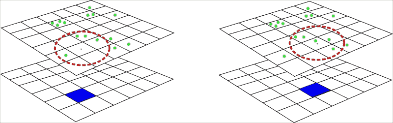

此图表展示了创建热力图的一般原理。绿色圆点表示用于生成密度图的要素，蓝色方块是当前栅格单元格，红色虚线圆圈标记搜索半径，例如，1 公里。在这种情况下，覆盖的面积约为 3.14 平方公里。如图表左侧所示，有四个要素位于搜索半径内。因此，栅格单元格将获得*4/3.14 = 1.27*的值。在右侧，我们注意到下一个单元格将获得 1.59 的值，因为现在搜索半径内有五个要素。

这是最简单的方法。在实际应用中，使用更复杂的算法，其中每个点根据其与相邻单元格的距离对其值产生影响。

# 使用热力图插件创建热力图

在 QGIS 核心插件 Heatmap 的帮助下，我们可以轻松地从矢量点数据创建热力图，并用于进一步分析。首先，我们需要激活此插件，如果尚未激活。激活后，它将在**栅格**菜单下创建一个子菜单，并将按钮放置在**栅格**工具栏上。

让我们为包含关于高噪音水平投诉信息的`noise`图层创建一个密度图。此图层包含 44,397 个要素，很难知道哪些地方是噪音源。

对于警察部门或其他机构计划降低噪音的活动，或者对于寻找公寓且不想与喜欢大声播放音乐的邻居为邻的人来说，此类地点的信息可能很有用：

1.  通过点击**热力图**按钮或导航到**栅格** | **热力图** | **热力图...**，开始使用插件。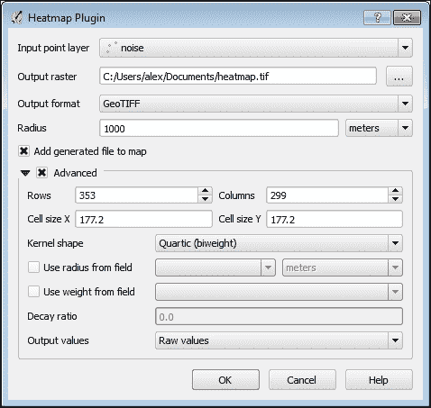

1.  从**输入点层**组合框中选择`noise`图层。

1.  使用**输出栅格**字段右侧的**…**按钮，指定结果热力图需要保存的位置。请注意，无需指定文件扩展名；它将根据输出文件格式自动选择。

1.  使用**输出格式**下拉框选择热力图所需的格式。这里最常见的选项是**GeoTIFF**，但对于非常大的地图，最好使用不同的格式，例如**Erdas Imagine**。

1.  我们最后需要指定的是**半径**。此值定义了 QGIS 将搜索邻居特征并考虑其存在的距离。通常，较大的搜索半径会给出更一般化的结果，因为找到的特征数量将除以更大的面积。较小的半径会给出更精确的结果，但如果此值太小，我们可能找不到任何分布模式。搜索半径可以用米或地图单位定义。

要从已知区域确定搜索半径，我们可以使用从圆面积公式推导出的一个非常简单的公式：

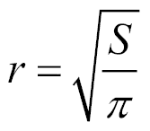

例如，如果我们需要计算每平方千米的密度，那么搜索半径将如下所示：

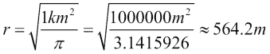

为了对结果有更精细的控制，我们可以勾选**高级**复选框并定义一些额外的参数：

+   **行**和**列**：这些允许我们定义输出栅格的尺寸。较大的尺寸将导致更大的输出文件大小，而较小的尺寸将导致粗糙和像素化的输出。输入字段是相互链接的，因此更改**行**字段中的值（例如，将其减半）也会导致**列**字段中的相应值发生变化，反之亦然。此外，这些值直接影响栅格单元格大小（参见下一点）。值得注意的是，在更改栅格维度时保留的栅格范围。

+   **单元格大小 X** 和 **单元格大小 Y**：栅格单元格大小决定了分布模式的显示将有多粗糙或多详细。较小的单元格大小将给出更平滑的结果，但分析所需的处理时间和内存将增加。较大的单元格将更快地处理，但生成的栅格将出现像素化。如果单元格真的很大，某些模式将变得不可见，因此您可能需要多次运行分析，尝试不同的单元格大小以获得满足您要求的结果。

    单元格大小取决于并链接到栅格维度。增加它将减少行数和列数，反之亦然。

+   **核形状**：这控制了从该点距离的变化如何影响点的影响。QGIS Heatmap 插件目前支持以下核：

    +   四次方（也称为双权重）

    +   三角形

    +   均匀

    +   三重权重

    +   Epanechnikov

    以下图表显示了不同核函数的点影响分布：

    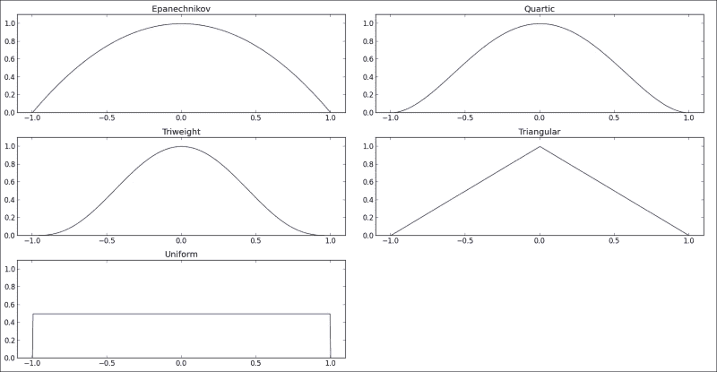

### 注意

关于核形状的更多详细信息，请参阅维基百科上的文章[`en.wikipedia.org/wiki/Kernel_(statistics)#Kernel_functions_in_common_use`](http://en.wikipedia.org/wiki/Kernel_(statistics)#Kernel_functions_in_common_use)，以及关于统计学的书籍，例如 B. W. Silverman 的《统计密度估计》和《数据分析》。

根据核形状，我们将得到更平滑的热图，或者更清晰地显示热点。例如，三重权重核将比 Epanechnikov 核给出更清晰、更尖锐的热点，因为 Epanechnikov 核在热点中心附近的影响较低。此外，在不同的科学领域，人们通常偏好不同的核函数；例如，在犯罪分析中，通常使用四次核函数。

还可以通过选择**使用半径字段**复选框并从下拉菜单中选择具有半径值的属性字段来为每个点使用可变搜索半径。如果您需要通过某些数值属性对点进行加权（换句话说，增加或减少它们的影响），请激活**使用权重字段**复选框并选择相应的字段。在我们的例子中，我们不会使用此功能，但您可以自己尝试。

正如我们之前所说的，单元格大小直接影响最终热图的质量，因此选择它非常重要。在大多数情况下，单元格大小被选择为每单位面积 10 到 100 个单元格（这反过来又由搜索半径定义）。为了计算单元格大小，我们需要将面积单位与距离单位对齐；例如，如果我们使用平方公里计算密度并定义搜索半径为米，那么将平方公里转换为平方米是必要的。下一步是将面积除以所需的单元格数。最后，由于单元格大小由其宽度或高度定义（因为栅格单元格通常呈方形），我们需要提取这个值的平方根。

在我们的例子中，我们将创建一个搜索半径为 1000 米的热图，因此查找区域将大约是 3.14 平方公里。以米为单位表示如下：

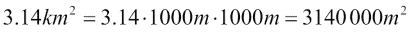

由于我们希望热图平滑，我们将使用每单位面积相对较多的单元格数；比如说每 3.14 平方公里 100 个单元格。因此，我们将面积（平方米）除以所需的单元格数：

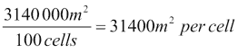

最后，我们计算这个值的平方根以得到允许我们在 3.14 平方公里内有 100 个单元格的单元格大小：

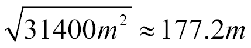

当然，这并不是一个严格的规则，而只是一个建议。您可以根据您的数据和期望的结果安全地使用另一个单元格大小。只需记住，较小的值会导致热力图更平滑，但同时也增加了分析时间和输出栅格的大小。

当所有输入和参数都设置好后，按下**确定**按钮以启动热力图生成过程。热力图形成的过程将在一个小进度对话框中显示。如果这个过程完成时间过长，您可以按**中止**按钮中断它。请注意，在终止热力图生成后，您仍然会得到输出，但它将是不完整且不适用于进一步分析的。

当过程完成后，生成的热力图将以灰度栅格的形式添加到 QGIS 中，其中较亮的区域对应于较高的密度值，较暗的区域对应于较低的密度值，如下所示：

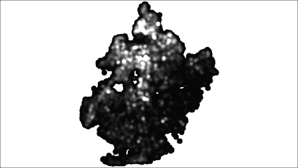

为了提高可读性并使其看起来像真正的热力图，我们需要更改其样式。为此，请按照以下步骤操作。有关样式栅格层的更详细信息，请参阅第二章的*为栅格层开发样式*部分，*可视化与样式化数据*：

1.  在 QGIS 图层树中右键点击`热力图`层。在上下文菜单中，选择**属性**。

1.  转到**样式**选项卡，并将**渲染类型**选择为**单波段伪彩色**。

1.  在**加载最小/最大值**组中，激活**最小/最大**选项。将**范围**设置为**全部**，将**精度**设置为**实际（较慢）**。按下**加载**按钮以获取栅格统计信息。这将用于进一步的分类。

1.  在**生成新颜色图**组中选择合适的颜色渐变，例如`YlOrBr`（颜色从黄色变为橙色，然后变为棕色），或`Reds`（使用不同深度的红色）。如有必要，更改类别数量并点击**分类**按钮。

1.  点击**确定**以应用更改并关闭属性对话框。

现在我们可以轻松地定位最热点（如果使用`Reds`颜色图，则颜色接近红色），甚至可以识别出在我们查看原始点层时不可见的某些分布模式：

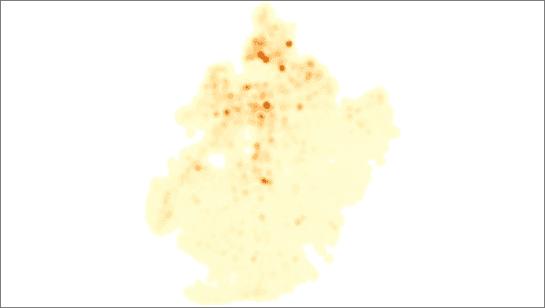

现在我们可以轻松地定位最热点（如果使用`Reds`颜色图，则颜色接近红色），甚至可以识别出在我们查看原始点层时不可见的某些分布模式。此外，我们的热力图层显示得比用于创建此热力图的矢量图层要快得多。

## 检测“最热点”

有时，您可能不需要热图本身，而只是想找到热点——密度最高的区域——并在进一步的分析中使用它们。在 QGIS 中找到这样的区域并将其提取为矢量形式非常容易。

首先，我们应该定义阈值值，这将用于识别热点。作为一个起始值，我们可以使用我们热图中的最大像素值，然后根据我们的需求进行调整。

找到最大像素值的最简单方法是使用**识别特征**工具。在 QGIS 图层树中选择一个图层，激活**识别特征**工具，点击最直观的“最热”区域，并查看报告的值。在我们的热图中，这个值将是`540.32`。

如果我们直接使用这个值，我们无法找到所有重要的簇，因此这个值应该首先减小。所选值（与最大值相比）越小，找到的簇数量就越多。单独簇的面积也会增大。对于我们的示例，我们选择了一个`200`的值。

现在，从**栅格**菜单打开**栅格计算器**，在**输出图层**字段中指定输出文件应保存的路径，并在**栅格计算器表达式**字段中输入`"heatmap@1">=200`公式，如下所示：

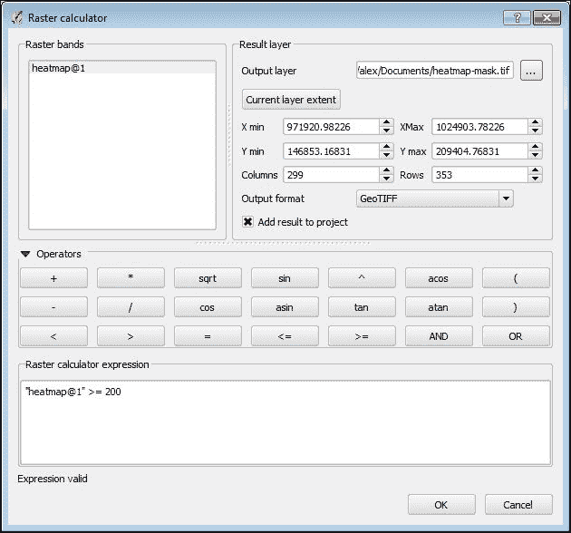

这个公式用于创建所谓的掩码。如果输入层的像素值大于或等于我们的阈值`200`，则输出像素值将为`1`。否则，它将为`0`。因此，我们的输出栅格将是一个二进制栅格，只有两个像素值——`0`和`1`——这非常容易转换为矢量。

保持所有其他值不变，以便生成的栅格将具有与输入相同的精确尺寸和单元格大小。按下**确定**按钮开始计算。完成后，将在 QGIS 画布中添加一个新的黑白栅格图层，如图所示：

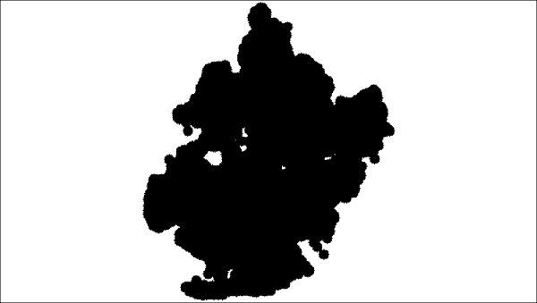

要将掩码栅格转换为矢量格式，我们需要从所有具有相同值的连接像素创建多边形。这就是**多边形化**工具发挥作用的地方。在**处理**工具箱中，您可以通过在工具箱顶部的过滤器字段中输入其名称来找到**多边形化**算法。双击算法名称以打开其对话框，您将看到如下内容：

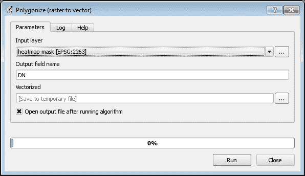

选择之前创建的掩膜图层作为**输入层**，使用**输出层**字段指定结果保存的路径，然后点击**运行**按钮开始算法。完成后，将在 QGIS 中添加一个新的矢量图层。这个图层有一个名为`DN`（如果你没有更改它）的属性，表示图层中每个多边形的像素值。因此，我们只需要删除所有属性值等于零的要素。剩余的要素将是热点。

要从热点图层中删除不必要的特征，在 QGIS 图层树中选择它，右键点击打开上下文菜单，然后选择**打开属性表**。点击**使用表达式选择要素**按钮。在**选择表达式**对话框中，输入`"DN" = 0`（如果需要，将`DN`替换为你的字段名），点击**选择**按钮，并关闭对话框。通过点击**切换编辑模式**按钮或按*Ctrl* + *E*开始编辑。要删除选定的要素，按*Delete*键或点击**删除选定要素**。最后，通过按*Ctrl* + *E*或再次点击**切换编辑模式**来关闭编辑模式。

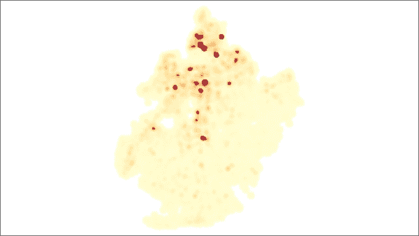

现在，热点图层只包含热点多边形，可用于进一步分析。例如，我们可以将这个簇与最近建筑物的信息和噪音类型的信息结合起来，以找到依赖关系并为此处降低噪音水平提出一些建议。

## 使用等高线寻找分布模式

除了检测热点外，热图还可以用于检测强度变化或可视化值变化的方向。完成这两项任务最常见的方法是生成等高线。

幸运的是，QGIS 拥有完成这项任务所需的所有工具。我们将再次使用处理工具，但等高线生成也可在**GDALTools**插件（可在**栅格**菜单中找到）中找到。在**处理**工具箱中，你可以通过在工具箱顶部的过滤器字段中输入其名称来找到**Contour**算法。双击算法名称以打开其对话框，其外观如下：

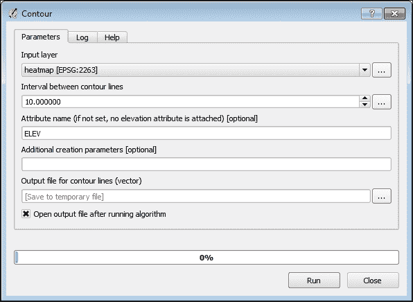

选择**输入层**为`heatmap`栅格图层。在**输出文件**字段中，指定结果保存的路径。同时，需要定义**等高线之间的间隔**。确定这个间隔没有严格的原则。一般规则是选择一个能够检测到密度变化平滑区域模式的间隔。我们将选择`10`的间隔。

当所有必要的信息都已定义后，点击**运行**以开始生成等高线。经过一段时间，一个新的多边形矢量层将被添加到 QGIS 中，我们可以开始分析它。首先，如果需要，将等高线层移动到 QGIS 图层树中热图的顶部。此外，调整等高线的符号以使其在热图背景中更易于识别也是更好的选择。

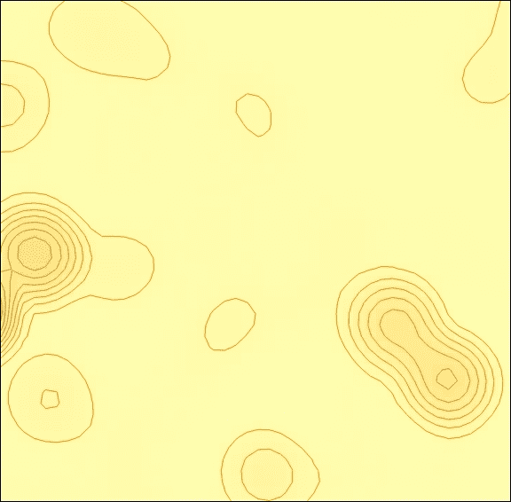

更密集的等高线对应着更强烈的密度变化。此外，我们还可以识别噪声变化的方向。例如，在先前的屏幕截图中，我们可以看到在某些地方，围绕中心的噪声分布并不均匀；东南部的强度比西北部更快地降低。因此，我们可能假设那里有一些噪声障碍物。

# 使用六边形网格映射密度

还有另一种映射密度的方法，称为分箱。一般来说，分箱是将*N*个值/特征分组到*M*个组中的技术，其中*M < N*。这种操作的成果可以解释为二维直方图。

分箱是热图的替代方案，而不是替代品。方法的选择取决于结果的要求和进一步的使用。然而，值得注意的是，分箱产生矢量输出，而热图产生栅格输出。

通常，分箱可以描述为两个简单的步骤：

1.  在点层之上创建一个六边形网格。

1.  计算每个网格单元格中的点数。

在本节中，您将学习如何在 QGIS 中通过六边形分箱的示例使用这项技术，换句话说，就是使用六边形网格映射密度。

### 注意

实际上，对于分箱，我们不仅可以使用六边形，还可以使用其他允许对二维表面进行规则镶嵌的形状——三角形和矩形。

为什么我们选择六边形？因为六边形是所有镶嵌形状中最接近圆形的。因此，它们更自然地表示曲线。六边形的另一个优点是结构更紧凑，因此六边形网格中单元格中心之间的距离比矩形网格中的距离更短。因此，围绕单元格中心的数据聚合更有效率。

### 注意

在第八章中，我们将创建一个模型，该模型生成两个密度图：六边形和矩形，以便您可以并排比较它们，更好地理解它们的不同用途和用例。

在接下来的章节中，我们将使用这种方法创建一个密度图。为此练习，我们将使用布鲁克林街道树木普查的数据。这是我们地图中的`trees`层。

## 创建六边形网格

要创建六边形网格，我们将使用 QGIS 处理框架及其名为**创建网格**的算法：

1.  在**处理**工具箱中，通过在工具箱顶部的过滤器字段中输入其名称来找到**创建网格**算法。双击算法名称以打开其对话框，其外观如下：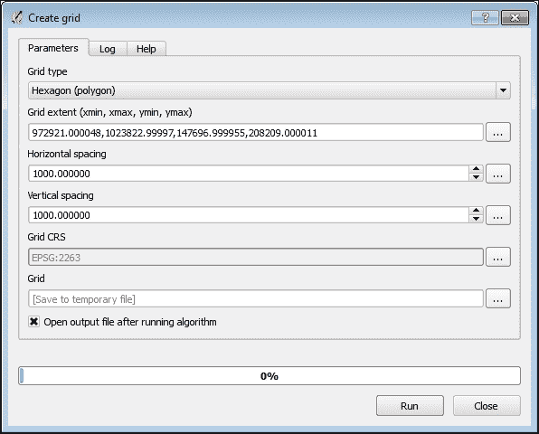

1.  在**网格类型**组合框中，选择**六边形（多边形）**。

1.  要指定网格范围，请按**…**按钮，该按钮位于**网格范围**字段的右侧，并从菜单中选择**使用图层/画布范围**。

1.  **选择范围**对话框将弹出。使用它从组合框中选择`trees`图层，然后点击**确定**。`layer`范围坐标将被添加到字段中。

1.  将水平间距和垂直间距设置为`1000`。这些值与热图中的搜索半径具有相同的意义。网格间距决定了网格中会有多少个单元格以及生成的地图将有多平滑。较小的间距会产生更平滑的结果，但非常小的值会阻止我们识别任何分布模式。请注意，间距应与图层使用的单位相同；例如，如果图层 CRS 使用英尺作为单位，则间距也应为英尺。

1.  最后，在**输出**字段中指定结果网格的保存路径，并点击**运行**以创建网格。当算法执行完成后，一个新的多边形图层将被添加到 QGIS 中。

## 在网格单元格中计数点

要计算每个网格单元格内的要素数量，我们可以使用 fTools 或处理核心插件。后者更灵活，允许我们自动化任务，如第八章所述，*使用处理模型自动化分析*。我们将使用处理框架中的**计数多边形中的点**算法。

### 小贴士

在处理中还有一个**计数唯一点**算法，它允许我们只计算所选字段中具有唯一属性的点。当需要更精确的分析时，这可能很有用，例如，用于绘制多样性地图。

在处理工具箱中，通过在工具箱顶部的过滤器字段中输入其名称来找到**计数多边形中的点**算法。双击算法名称以打开其对话框，您将看到如下内容：

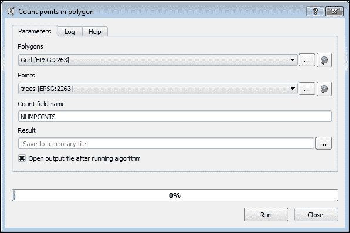

选择上一节创建的网格图层作为**多边形**，并将`trees`图层作为**点**。输入**计数字段名称**或保持不变。不要忘记形状文件字段名称的 10 个字符限制！最后，在**结果**字段中指定结果图层将存储的位置，并点击**运行**按钮以开始分析。请记住，这可能需要一些时间，因为`tree`图层包含许多要素，而网格大小相对较小。

当算法执行完成后，一个新的网格层将被添加到 QGIS 中，其中包含每个单元格中点的数量字段。我们可以安全地从 QGIS 和文件系统中删除原始网格层，因为它不再需要。

为了更好地展示我们的数据，我们根据单元格中的要素数量应用渐变渲染器来样式化单元格。如果需要，请回到第二章的*为矢量图层开发样式*部分，*可视化和样式化数据*。结果可能看起来像这样：

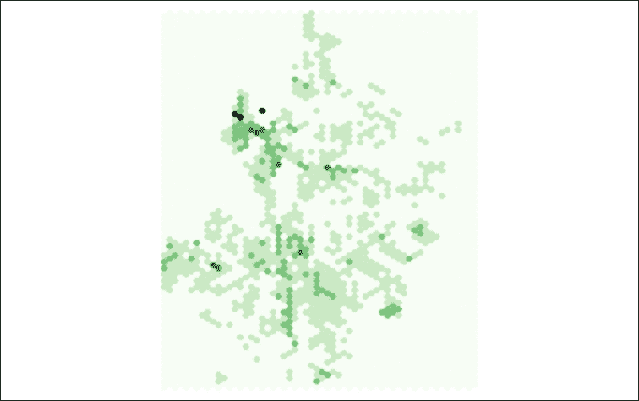

## 删除冗余数据

如果我们仔细观察我们的网格层及其属性表，我们会发现一些网格单元是空的；它们里面没有点。这些单元在前面的截图中被显示为非常浅的绿色。很明显，空单元的数量远多于非空单元。当然，我们可以简单地通过将它们分配与地图背景相同的颜色或从渲染器中移除它们（分配一个空样式）来隐藏这些空单元。但是，完全移除它们并减小文件大小是否更好？

有两种可能的删除空单元的方法：手动或使用处理工具箱中的现有工具。每种方法都有其自身的优点。

首先，你将学习如何手动删除冗余数据。当您只需要处理一个图层且不想创建任何临时中间文件时，可以使用此方法。此外，它允许您轻松检查将要删除的要素。让我们来做：

1.  从 QGIS 图层树中选择`LAYER`图层。然后，点击**属性**工具栏中的**使用表达式选择要素**按钮以打开**按表达式选择**对话框。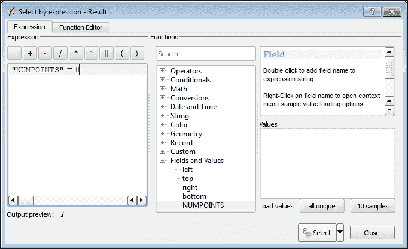

1.  在函数树中，在**字段和值**组下，找到`NUMPOINTS`字段，并双击它以将其名称添加到表达式中。

1.  然后，点击**=**以将等于运算符添加到表达式中，并在其后输入`0`。最终的表达式将看起来像**"NUMPOINTS" = 0**。

1.  点击**选择**以选择所有符合您条件的要素。选定的要素将以黄色突出显示，以便您可以检查它们是否是您想要的。

1.  现在，关闭**按表达式选择**对话框，通过点击**属性**工具栏中的**打开属性表**按钮来打开图层属性表。

1.  通过在属性表对话框中点击相应的按钮或简单地按*Ctrl* + *E*来切换编辑模式。

1.  要删除选定的要素，只需按*Delete*键或点击**删除选定要素**按钮。

1.  最后，再次按*Ctrl* + *E*来关闭编辑模式。现在我们的图层只包含非空单元，并且大小大大减小。

使用处理移除冗余数据比手动移除冗余数据需要更少的步骤，但它不会更新现有图层，而是创建另一个文件。当你需要一次性处理多个图层或想要自动化某些操作时，处理框架非常有用。为了移除空单元格，我们可以使用**按属性提取**算法。

### 小贴士

在我们的案例中，比较条件非常简单，所以我们使用**按属性提取**算法。当需要更复杂的比较条件，包括多个属性或某些计算时，最好使用**按表达式选择**算法并结合**保存所选要素**。

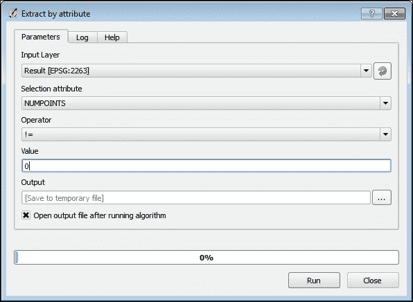

这里是必要的步骤：

1.  通过在过滤器字段中输入其名称来查找**按属性提取**算法，并双击其名称以打开其对话框。

1.  在**输入图层**组合框中，选择`LAYER`。

1.  在**选择属性**组合框中，选择`NUMPOINTS`字段，该字段存储每个单元格中的点数。

1.  在**运算符**组合框中选择不等于运算符 !`=`.

1.  在**值**字段中输入`0`。

1.  在**输出**字段中指定输出文件的名称。

现在，我们可以按下**运行**按钮开始处理。完成后，新的图层（移除了空单元格）将被添加到 QGIS 中，我们可以移除原始图层。新的图层要小得多，但仍然包含所有信息。此外，我们现在可以更精确地设置样式，并识别出之前不可见的某些分布模式。

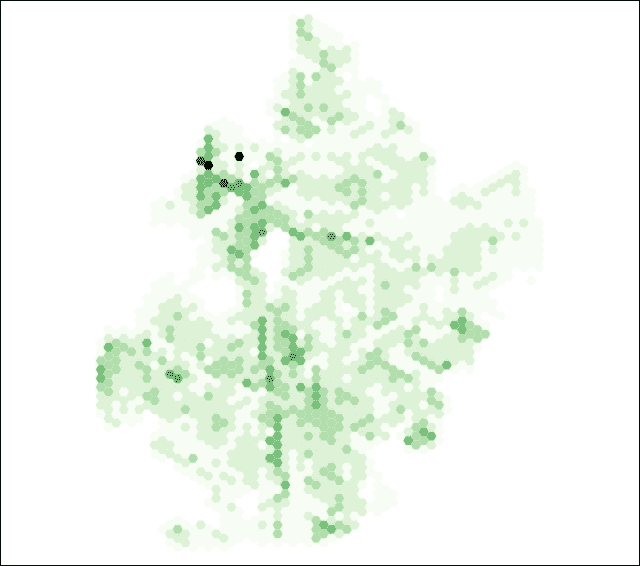

如果我们将具有这种密度的街道网络图层叠加到这个密度图上，我们可以轻松地识别出最绿色的街道是 Ocean Parkway。

结果看起来很棒，但手动执行所有这些步骤并不舒服。此外，还有许多中间图层可以，也应该被移除。幸运的是，QGIS 允许我们通过处理图形模型器自动化此类操作。请参阅第八章，*使用处理模型自动化分析*，了解如何创建模型并使用它们。

# 摘要

在本章中，我们介绍了密集点数据集的分析。你学习了如何借助 QGIS 热图插件创建栅格热图。然后，我们介绍了热图分析和从其中提取数据。

你还熟悉了一种用于显示密集数据集的替代且流行的技术，称为分箱，并学习了如何在 QGIS 中使用处理框架执行六分箱（一种分箱技术）。
