# 第一章 自动化 QGIS

本章将涵盖以下菜谱：

+   为开发安装 QGIS

+   使用 QGIS Python 控制台

+   使用 Python 的 ScriptRunner 插件

+   设置您的 QGIS IDE

+   调试 QGIS Python 脚本

+   导航 PyQGIS API

+   创建 QGIS 插件

+   分发插件

+   构建独立应用程序

+   存储和读取全局首选项

+   存储和读取项目首选项

+   在您的脚本中访问脚本路径

# 简介

本章解释了如何使用 Python 配置 QGIS 以实现自动化。除了设置 QGIS 之外，我们还将配置带有 PyDev 插件的免费 Eclipse **集成开发环境**（**IDE**），以便更容易地编写、编辑和调试脚本。我们还将通过 PyQGIS API 学习不同类型的 QGIS 自动化 Python 脚本的基础知识。最后，我们将检查一些核心的 QGIS 插件，这些插件显著扩展了 QGIS 的功能。

# 为开发安装 QGIS

QGIS 有一套可以从 QGIS 中的 Python 控制台访问的 Python 模块和库。然而，它们也可以从 QGIS 外部访问以编写独立应用程序。首先，您必须确保为您的平台安装了 PyQGIS，然后设置一些必需的系统环境变量。

在这个菜谱中，我们将向您介绍在正常 QGIS 安装之外所需的额外步骤，以准备您的系统进行开发。每个平台的步骤都提供，其中包括不同的 Linux 包管理器样式。

## 准备工作

QGIS 针对 Windows、GNU/Linux 和 Mac OS X 使用略微不同的安装方法。Windows 安装程序安装了 Python 开发所需的所有内容，包括 Python 本身。

然而，在 Linux 发行版和 Mac OS X 上，您可能需要手动安装 Python 模块以进行系统 Python 安装。在 Mac OS X 上，您可以从[`www.kyngchaos.com/software/python`](http://www.kyngchaos.com/software/python)下载一些常用 Python 模块的安装程序，与 QGIS 一起使用。

## 如何操作

在 Linux 上，您可以选择从源代码编译，或者您可以通过包管理器指定要安装的 Python QGIS 接口。

### 使用 Debian 包管理器安装 PyQGIS

1.  对于基于 Debian Linux 包管理器的 Linux 发行版，包括 Ubuntu 和 Debian，请在 shell 中使用以下命令：

    ```py
    sudo apt-get update

    ```

1.  接下来，安装 QGIS、PyQGIS 和 QGIS GRASS 插件：

    ```py
    sudo apt-get install qgis python-qgis qgis-plugin-grass

    ```

### 使用 RPM 包管理器安装 PyQGIS

1.  对于基于**Red Hat 包管理器**（**RPM**）的 Linux 发行版，首先更新包管理器，如下所示：

    ```py
    sudo yum update

    ```

1.  然后，安装 QGIS、PyQGIS 和 QGIS GRASS 插件的包：

    ```py
    sudo yum install qgis qgis-python qgis-grass

    ```

### 设置环境变量

现在，我们必须将`PYTHONPATH`设置为 PyQGIS 目录。同时，将此目录的路径追加到`PATH`变量中，以便您可以使用外部 IDE 使用 PyQGIS 模块。

#### 在 Windows 上设置环境变量

1.  在命令提示符中设置`PYTHONPATH`变量为 QGIS 安装的`bin`目录：

    ```py
    set PYTHONPATH="C:\Program Files\QGIS Brighton\bin"

    ```

1.  接下来，将 QGIS 的`bin`目录追加到系统的`PATH`变量中：

    ```py
    set PATH="C:\Program Files\QGIS Brighton\bin";"C:\Program Files\QGIS Brighton\bin\apps\qgis\bin";%PATH%

    ```

#### 在 Linux 上设置环境变量

1.  在命令提示符中设置`PYTHONPATH`变量为 QGIS 安装的`bin`目录：

    ```py
    export PYTHONPATH=/usr/share/qgis/python

    ```

1.  现在，将 QGIS 共享库目录追加到运行时搜索路径中。请注意，此位置可能因您的特定系统配置而异：

    ```py
    export LD_LIBRARY_PATH=/usr/share/qgis/python

    ```

## 它是如何工作的...

QGIS 安装过程和包管理器在 QGIS 内部设置了 Python 模块的配置。当您在 QGIS 内部使用 Python 控制台时，它知道所有 PyQGIS 模块的位置。然而，如果您想在 QGIS 之外使用 PyQGIS API，在 Windows 或 Linux 上使用系统 Python 安装，则需要设置一些系统变量，以便 Python 可以找到所需的 PyQGIS 模块。

## 还有更多...

此配方使用每个平台的默认 QGIS 路径。如果您不确定哪个 PyQGIS 路径适用于您的系统，您可以从 QGIS 中的 Python 控制台找出这一点。

### 在 Windows 上查找 PyQGIS 路径

Windows 上的库存储位置与其他平台不同。要定位路径，您可以检查 Python 控制台当前的工作目录：

1.  启动 QGIS。

1.  从 QGIS 应用程序窗口的右下角出现的**插件**菜单中选择**Python 控制台**，如图所示：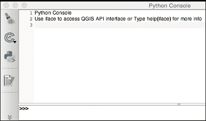

1.  使用`os`模块获取当前工作目录：

    ```py
    import os
    os.getcwd()

    ```

1.  验证 Python 控制台当前的工作目录是否返回。

### 在其他平台上查找 QGIS Python 安装的位置

执行以下步骤以找到除 Windows 之外所有平台所需的路径：

1.  启动 QGIS。

1.  启动 QGIS **Python 控制台**。

1.  使用`sys`模块定位 PyQGIS 路径：

    ```py
    import sys
    sys.path

    ```

1.  Python 将返回一个路径列表。

1.  找到以`/python`结尾的路径，这是 QGIS 使用的 Python 安装位置

# 使用 QGIS Python 控制台进行交互式控制

QGIS Python 控制台允许您交互式地控制 QGIS。您可以测试想法或进行一些快速自动化。控制台是使用 QGIS Python API 的最简单方式。

## 如何操作...

在以下步骤中，我们将打开 QGIS Python 控制台，在内存中创建一个矢量图层，并在地图上显示它：

1.  启动 QGIS。

1.  从**插件**菜单中选择**Python 控制台**。

1.  以下代码将在地图画布上创建一个点：

    ```py
    layer =  QgsVectorLayer('Point?crs=epsg:4326', 'MyPoint' , 'memory')
    pr = layer.dataProvider()
    pt = QgsFeature()
    point1 = QgsPoint(20,20)
    pt.setGeometry(QgsGeometry.fromPoint(point1))
    pr.addFeatures([pt])
    layer.updateExtents()
    QgsMapLayerRegistry.instance().addMapLayers([layer])
    ```

## 它是如何工作的...

此示例使用一个`内存`图层来避免与磁盘或网络上的任何数据交互，以保持事情简单。请注意，当我们声明图层类型时，我们添加了**坐标参考系统**（**CRS**）参数为 EPSG:4326。如果没有这个声明，QGIS 将提示您选择一个。创建地图画布上的单个点甚至需要三个部分或抽象级别，如下所示：

+   首先，创建一个几何类型的图层。然后，设置一个数据提供者以接受数据源。

+   然后，创建一个通用的要素对象，接着是点几何。

+   接下来，将对象堆叠在一起并将它们添加到地图中。

图层类型是`内存`，这意味着您可以在代码中而不是在外部数据源中内联定义几何形状和属性。在此配方中，我们只定义几何形状并跳过定义任何属性。

# 使用 Python ScriptRunner 插件

QGIS Python ScriptRunner 插件为 QGIS 自动化提供了一个中间地带，介于交互式控制台和插件开销之间。它提供了一个脚本管理对话框，允许您轻松加载、创建、编辑和运行脚本，以实现大规模的 QGIS 自动化。

## 准备工作

使用 QGIS 插件管理器安装**ScriptRunner**插件。然后，从**插件**菜单运行插件以打开**ScriptRunner**对话框。按照以下步骤配置默认编辑器以编辑脚本：

1.  找到代表**ScriptRunner 首选设置**对话框的齿轮图标，并点击它。

1.  在**常规选项**部分，勾选**使用以下方式编辑脚本**复选框。

1.  点击**…**按钮浏览到您系统上的文本编辑器位置。

1.  点击**打开**按钮。

1.  在**首选项**对话框中点击**OK**按钮。

## 如何操作…

1.  在**ScriptRunner**对话框中，点击下面的截图所示的**新建脚本**图标：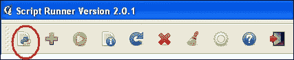

1.  浏览到可以保存您的脚本的位置，命名脚本，并保存它。

1.  验证新脚本是否已加载到**ScriptRunner**中。

1.  在 ScriptRunner 中的脚本名称上右键单击（或在 Mac 上控制单击）并选择**在外部编辑器中编辑脚本**。

1.  在编辑器中，将模板代码替换为以下代码：

    ```py
    from PyQt4.QtCore import *
    from PyQt4.QtGui import *
    from qgis.core import *
    from qgis.gui import *

    def run_script(iface):
        layer =  QgsVectorLayer('Polygon?crs=epsg:4326', 'Mississippi' , "memory")
    pr = layer.dataProvider()
        poly = QgsFeature()
        geom = QgsGeometry.fromWkt("POLYGON ((-88.82 34.99,-88.09 34.89,-88.39 30.34,-89.57 30.18,-89.73 31,-91.63 30.99,-90.87 32.37,-91.23 33.44,-90.93 34.23,-90.30 34.99,-88.82 34.99))")
        poly.setGeometry(geom)
        pr.addFeatures([poly])
        layer.updateExtents()
    QgsMapLayerRegistry.instance().addMapLayers([layer])
    ```

1.  点击代表绿色箭头的运行脚本图标。

1.  关闭**ScriptRunner**插件。

1.  验证内存图层多边形是否已添加到 QGIS 地图中，如下面的截图所示：

## 它是如何工作的…

ScriptRunner 是一个简单但强大的想法。它允许您构建自动化脚本库，并在 QGIS 内部使用它们，但无需构建插件或独立应用程序的开销。所有 Python 和系统路径变量都设置正确，并从 QGIS 继承；然而，您仍然必须导入 QGIS 和 Qt 库。

# 设置您的 QGIS IDE

配备 PyDev 插件的 Eclipse IDE 是跨平台的，具有高级调试工具，并且是免费的。

### 注意

您可以参考[`pydev.org/manual_101_install.html`](http://pydev.org/manual_101_install.html)以正确安装 PyDev。

此工具是一个出色的 PyQGIS IDE。Eclipse 允许您为不同的 Python 环境配置多个 Python 解释器。当您安装 PyDev 时，它将自动找到已安装的系统 Python 安装。在 Windows 上，您还必须添加与 PyQGIS 一起安装的 Python 解释器。在所有平台上，您都必须告诉 PyDev PyQGIS 库的位置。

## 准备工作

此配方使用 Eclipse 和 PyDev。您可以使用操作系统支持的最新版本的任一包。除了 Windows 之外的所有平台都依赖于系统 Python 解释器。因此，在 Windows 上添加 QGIS Python 解释器需要额外的一步。

## 如何操作…

以下步骤将指导您如何将 QGIS 特定的 Python 解释器添加到 Eclipse 中，以便支持运行独立的 QGIS 应用程序或调试 QGIS 插件。

### 在 Windows 上添加 QGIS Python 解释器

在 Windows 上添加 QGIS Python 解释器到 Eclipse 的过程与在 Linux 上使用的过程不同。以下步骤描述了如何在 Windows 版本的 Eclipse 上设置解释器：

1.  打开 Eclipse。

1.  从**窗口**菜单中选择**首选项**。在 OS X 上，您必须点击**Eclipse**菜单以找到首选项菜单。

1.  在**首选项**窗口的左侧面板中，点击**PyDev**旁边的加号。

1.  从 PyDev 首选项列表中选择**解释器 Python**。

1.  在标记为 Python 解释器的面板中，点击**新建**按钮。

1.  在**选择解释器**对话框中，将解释器命名为`PyQGIS`。

1.  浏览到 QGIS 程序文件夹中的`bin`文件夹内名为`python.exe`的 QGIS Python 解释器位置。在 OS X 和 Linux 上，您可以使用系统 Python 安装。在 Windows 上，Python 包含在 QGIS 中。Windows 上的默认位置如以下截图所示：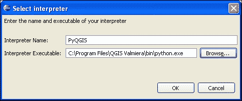

1.  当您点击**确定**按钮时，Eclipse 将尝试自动将找到的每个 Python 库添加到该解释器配置的 Python 路径中。我们需要控制添加哪些库以防止冲突。点击**取消选择全部**按钮，然后点击**确定**：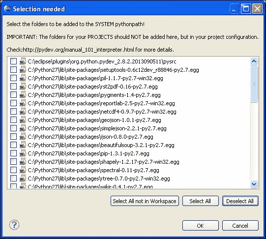

1.  Eclipse 将显示一个警告对话框，因为您尚未选择任何核心库。点击**继续**按钮，如以下截图所示：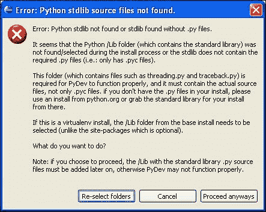

### 将 PyQGIS 模块路径添加到解释器

除了添加 Python 解释器外，你还必须使用以下步骤添加 PyQGIS 需要的模块路径。这些步骤将需要你在 QGIS 和 Eclipse 之间来回切换：

1.  启动 QGIS。

1.  从**插件**菜单启动 QGIS **Python 控制台**。

1.  使用 `sys` 模块定位 PyQGIS Python 路径，如前一个食谱中所述，*设置环境变量*：

    ```py
    import sys
    sys.path

    ```

1.  我们还希望添加 PyQGIS API。接下来，使用 QGIS **Python 控制台**输入以下命令来查找该路径：

    ```py
    qgis
    ```

1.  对于返回列表中的每个路径，在 Eclipse 的 QGIS 解释器**库**面板中点击**新建文件夹**按钮，浏览到该文件夹，直到所有路径都已添加。如果系统上不存在某个文件夹，只需忽略它，如图所示：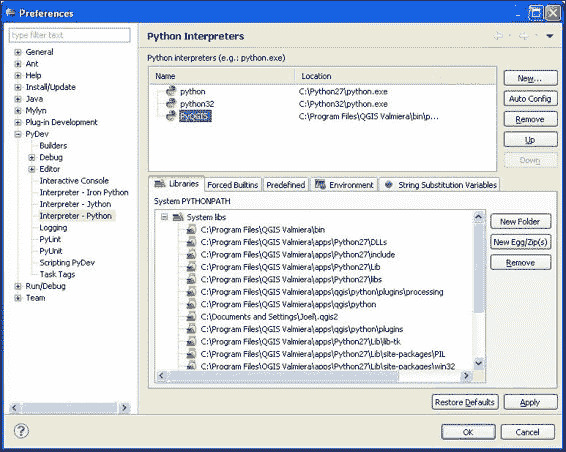

1.  在**首选项**对话框中点击**确定**按钮。

### 将 PyQGIS API 添加到 IDE

为了充分利用 Eclipse 的功能，包括代码补全，我们将向 PyQGIS Eclipse 解释器首选项添加 QGIS 和 Qt4 模块。以下步骤将允许 Eclipse 在你输入时建议 QGIS 对象的可能方法和属性；这个功能被称为**自动完成**：

1.  在 PyDev 的 PyQGIS 解释器首选项中，选择**强制内置**选项卡，如图所示：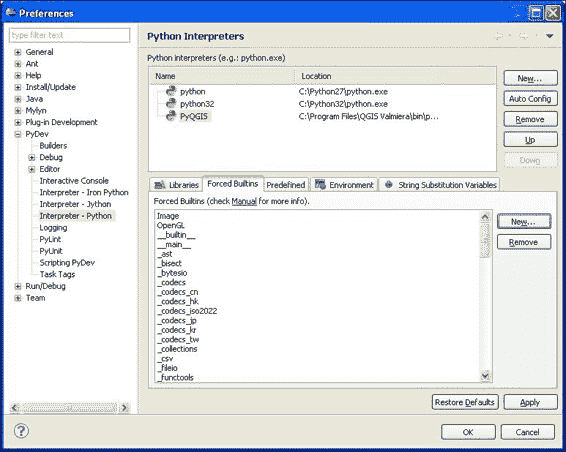

1.  点击**新建**按钮。

1.  在**内置要添加**对话框中，输入 `qgis`：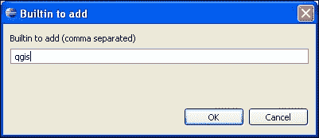

1.  点击**确定**按钮。

### 添加环境变量

你还需要创建一个指向 QGIS 二进制库、Windows 上的 DLL 和所有平台在运行时所需的库的 `PATH` 变量。

1.  在**PyDev 首选项**对话框中，确保在解释器列表中选择了**PyQGIS**解释器。

1.  选择**环境**选项卡。

1.  点击**新建**按钮。

在**名称**字段中，输入**PATH**。

1.  在**值**字段中，添加 QGIS 程序目录和包含二进制的任何 QGIS 目录的路径，这些路径由分号分隔。以下是一个来自 Windows 机器的示例：

    ```py
    C:\Program Files\QGIS Brighton;C:\Program Files\QGIS Brighton\bin;C:\Program Files\QGIS Brighton\apps\qgis\bin;C:\Program Files\QGIS Brighton\apps\Python27\DLLs

    ```

## 它是如何工作的...

Eclipse 和 PyDev 仅使用你提供的信息在 Eclipse 工作区中运行脚本。这种方法与流行的 Python 工具 **virtualenv** 非常相似，它提供了一个干净的环境，以确保你在编写和调试代码时不会浪费时间在调试由环境引起的问题上。

# 调试 QGIS Python 脚本

在本食谱中，我们将配置 Eclipse 以调试 QGIS Python 脚本。

## 如何操作...

QGIS 和 Eclipse 都必须配置为调试，以便这两款软件能够通信。Eclipse 会**附加**到 QGIS 上，以便您了解在 QGIS 中运行的 Python 脚本。这种方法允许您以受控的方式运行脚本，可以在您监控程序以捕获错误时暂停执行。

### 配置 QGIS

以下步骤将为 QGIS 添加两个插件，这允许 Eclipse 与 QGIS 通信。一个插件是**插件重载器**，允许您在不重启 QGIS 的情况下将 QGIS 插件重新加载到内存中，以便更快地进行测试。第二个插件是**远程调试**，它将 QGIS 连接到 Eclipse。

**远程调试**是一个实验性插件，因此您必须确保实验性插件在可用插件列表中可见，以便 QGIS 插件管理器可以访问。

1.  启动 QGIS。

1.  在**插件**菜单下，选择**管理并安装插件**…

1.  在**插件**对话框的左侧面板中，选择**设置**选项卡。

1.  在**设置**窗口中向下滚动，并确保已勾选**显示实验性插件**复选框，如下截图所示：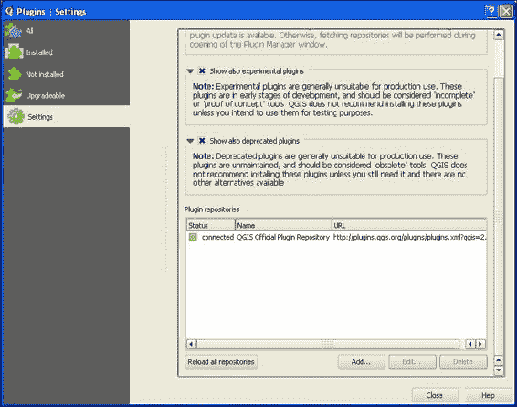

1.  点击**确定**按钮。

1.  在**插件**窗口左侧的面板中选择标签为**所有**的选项卡。

1.  在窗口顶部的**搜索**对话框中，搜索**插件重载器**。

1.  从搜索结果中选择**插件重载器**，然后点击**安装插件**按钮。

1.  接下来，搜索**远程调试**插件并安装它。

1.  最后，安装**HelloWorld**插件。

### 配置 Eclipse

现在 QGIS 已配置为在 Eclipse 中进行调试，我们将配置 Eclipse 以完成调试通信循环，具体步骤如下：

1.  启动 Eclipse。

1.  在**文件**菜单中，选择**新建**，然后点击**项目**。

1.  在**新建项目**对话框中，选择**通用**，然后点击**项目**。

1.  点击**下一步>**按钮。

1.  给项目命名为**HelloWorldPlugin**。

1.  点击**完成**按钮。

1.  在项目资源管理器中选择新的**HelloWorldPlugin**项目，然后选择**新建**；接着，从**文件**菜单中选择**文件夹**。

1.  在**新建文件夹**对话框中，点击**高级>>**按钮。

1.  选择**链接到备用位置（链接文件夹）**单选按钮。

1.  点击**浏览**按钮，浏览到`HelloWorldPlugin`文件夹的位置，如下截图所示：

    ### 小贴士

    您可以从 QGIS 插件管理器中找到 HelloWorld 插件的存放位置。

    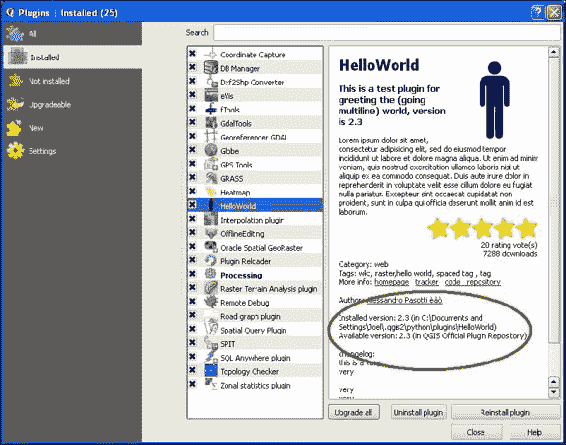

1.  点击**完成**按钮。

### 测试调试器

本食谱的前几部分配置了 Eclipse 和 QGIS 以协同工作以调试 QGIS 插件。在本节中，我们将使用最简单的插件 **HelloWorld** 来测试配置，使用 **Debug Perspective** 运行 Eclipse。我们将在插件中设置一个断点以暂停执行，然后在 Eclipse 内部监控插件执行，如下所示：

1.  在 `HelloWorld` 文件夹下打开文件 `HelloWorld.py`。

1.  从 Eclipse **窗口** 菜单中选择 **OpenPerspective**，然后点击 **Other…**

1.  从 **OpenPerspective** 对话框中选择 **调试**。

1.  点击 **OK** 按钮。

1.  滚动到 `hello_world()` 函数的第一行，并在行号左侧双击以设置断点，它显示为绿色图标：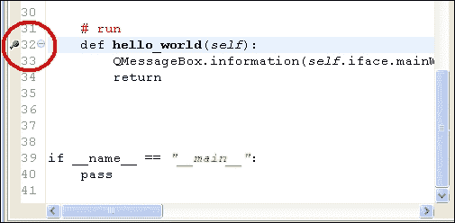

1.  从 **Pydev** 菜单中选择 **Start Debug Server**。

1.  通过在窗口底部的调试控制台中查找类似以下的消息来验证服务器正在运行：

    ```py
    Debug Server at port: 5678

    ```

1.  切换到 QGIS。

1.  从 QGIS **插件** 菜单中选择 **RemoteDebug**，然后选择 **RemoteDebug** 命令。

1.  验证窗口左下角的 QGIS 状态栏显示以下信息：

    ```py
    Python Debugging Active

    ```

1.  现在，从 QGIS **插件** 菜单中选择 **HelloWorld**，然后选择 **HelloWorld**。

1.  切换回 Eclipse。

1.  验证 `hello_world()` 函数在断点处被突出显示。

1.  从 **运行** 菜单中选择 **继续**。

1.  切换回 QGIS。

1.  验证 **HelloWorld** 对话框已出现。

## 它是如何工作的…

RemoteDebug 插件作为 PyDev 调试服务器的客户端，用于将 QGIS 中的 Python 脚本执行状态发送到 Eclipse。尽管它已经伴随 QGIS 几个版本了，但仍被视为实验性的。

PluginReloader 插件可以重置在运行时维护状态的插件。HelloWorld 插件非常简单，因此不需要重新加载来重复测试。然而，当你调试更复杂的插件时，你需要在每次测试之前运行它以重置它。这种方法比关闭 QGIS、编辑插件代码然后重新启动要高效得多且易于使用。

### 注意

你可以在 [`docs.qgis.org/2.6/en/docs/pyqgis_developer_cookbook/ide_debugging.html`](http://docs.qgis.org/2.6/en/docs/pyqgis_developer_cookbook/ide_debugging.html) 了解更多关于调试 QGIS 的信息，包括使用其他 IDE。

# 导航 PyQGIS API

QGIS Python API，也称为 PyQGIS，允许你控制 QGIS 的几乎所有方面。找到 PyQGIS 对象以便访问 QGIS 的特定功能的能力对于自动化至关重要。

## 准备中

PyQGIS API 基于 QGIS C++ API。C++ API 在线保持最新，并且有很好的文档记录。

### 注意

QGIS API 的网页位于 [`qgis.org/api/2.6/modules.html`](http://qgis.org/api/2.6/modules.html)。

注意 URL 中的版本号，2.2。您可以将此版本号更改为您正在使用的 QGIS 版本，以便找到适当的文档。

PyQGIS API 文档更新不频繁，因为它几乎与 C++ API 的结构相同。然而，[github.com](http://github.com)上的 QGIS 项目维护了一个最新版本的 PyQGIS 类的列表。PyQGIS 2.6 API 位于[`github.com/qgis/QGIS/blob/master/python/qsci_apis/Python-2.6.api`](https://github.com/qgis/QGIS/blob/master/python/qsci_apis/Python-2.6.api)。

您可以在主 C++ API 中找到已记录的类并了解它。然后，使用 PyQGIS API 列表查找相应的 Python 模块和类。在大多数情况下，类的 C++ API 名称与 Python 中的名称相同。

在本菜谱中，我们将定位控制 QGIS 标签的 PyQGIS 类。

## 如何操作…

我们将执行以下步骤，以查看 QGIS 标签对象和 QgsLabel 位于哪个 PyQGIS 模块中：

1.  前往 QGIS API 页面[`qgis.org/api/2.6/index.html`](http://qgis.org/api/2.6/index.html)。

1.  点击**模块**标签。

1.  点击链接**QGIS** **核心** **库**。

1.  按字母顺序滚动模块列表，直到您看到**QgsLabel**。

1.  点击**QgsLabel**链接以访问标签对象文档。

1.  现在，前往 PyQGIS API 列表[`github.com/qgis/QGIS/blob/master/python/qsci_apis/Python-2.6.api`](https://github.com/qgis/QGIS/blob/master/python/qsci_apis/Python-2.6.api)。

1.  按字母顺序滚动类列表，直到您看到`qgis.core.QgsLabel.LabelField`。

## 工作原理…

QGIS API 分为五个不同的类别，如下所示：

+   核心

+   GUI

+   分析

+   地图编绘

+   网络分析

大多数情况下，找到针对您所需功能的类很容易，因为 QGIS 的大部分功能都包含在通用的**核心**模块中。您使用 API 的次数越多，您就越快能找到您脚本所需的对象。

## 更多内容…

如果您在定位包含所需关键字的类时遇到困难，您可以使用 QGIS API 网站上的搜索引擎。

### 小贴士

然而，请注意，此搜索引擎返回的结果可能包含您不需要的项目，甚至可能因为不同模块中相似的关键词而将您引向错误的方向。

# 创建 QGIS 插件

插件是扩展 QGIS 的最佳方式，因为它们可以轻松更新并由其他人重用。

## 准备工作

创建插件的最简单方法就是使用**插件构建器**插件来快速启动开发。您可以在主 QGIS 插件仓库中找到它并进行安装。

## 如何操作…

执行以下步骤以创建一个显示自定义消息对话框的简单插件：

1.  启动 QGIS。

1.  从**插件**菜单中选择**插件构建器**，然后在子菜单下点击**插件构建器**。

1.  在**QGIS 插件构建器**对话框中，将类命名为`MyPlugin`。

1.  将插件命名为 `My Plugin`。

1.  输入简短描述，例如 `一个关于构建 QGIS 插件的演示。`

1.  将 **模块** 名称输入为 `myplugin`。

1.  保持默认版本号不变。

1.  在 **菜单项文本** 字段中输入 `My Plugin`。

1.  输入您的姓名和电子邮件地址作为作者信息。

1.  确保选中了标记为 **将插件标记为实验性** 的复选框，如图所示：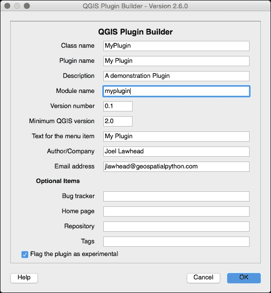

1.  点击 **确定** 按钮。

1.  将会出现一个文件浏览器对话框；您可以选择一个文件夹来创建您的插件。在主用户目录或 QGIS 程序目录中的 `python` 文件夹中的 `plugins` 文件夹中选择一个文件夹。以下示例来自 Windows 机器。您应该使用用户目录中的文件夹，这是第三方插件的推荐位置。QGIS 标准插件位于主程序目录中：

    ```py
    C:\Documents and Settings\Joel\.qgis2\python\plugins
    C:\Program Files\QGIS Brighton\apps\qgis\python\plugins

    ```

1.  通过点击 **确定** 按钮关闭后续的 **插件构建器** 信息对话框。

1.  使用命令提示符，导航到您的新插件模板文件夹。

1.  使用 `pyrcc4` 命令编译资源文件：

    ```py
    pyrcc4 –o resources_rc.py resources.qrc

    ```

    ### 小贴士

    如果您使用的是 Windows，则非常重要，需要使用与 QGIS 一起安装的 OSGEO4W shell，以确保 Qt 编译工具能够正常工作。

1.  在文本编辑器中，例如 Windows 记事本或 Linux 上的 vi，打开名为 `myplugin_dialog_base.ui` 的用户界面 XML 文件。

1.  在第 31 行附近，在最后一个 `</widget>` 标签之前插入以下 XML 以创建自定义标签。编辑后保存文件：

    ```py
    <widget class="QLabel" name="label">
    <property name="geometry">
    <rect>
    <x>120</x>
    <y>80</y>
    <width>201</width>
    <height>20</height>
    </rect>
    </property>
    <property name="font">
    <font>
    <pointsize>14</pointsize>
    </font>
    </property>
    <property name="text">
    <string>Geospatial Python Rocks!</string>
    </property>
    </widget>
    ```

1.  现在，使用 `pyuic4` 工具编译 `ui` 文件：

    ```py
    pyuic4 –o ui_myplugin.py ui_myplugin.ui

    ```

1.  您的插件现在已准备就绪。重新启动 QGIS。

1.  从 **插件** 菜单中选择 **My Plugin**，然后从子菜单中选择 **My Plugin**，以查看 QGIS 中创建的对话框，如图所示：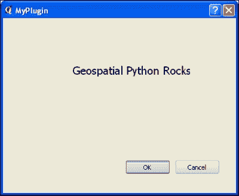

## 它是如何工作的…

此配方展示了制作一个工作插件所需的基本内容。尽管我们没有对其进行修改，但插件行为的代码包含在 `myplugin.py` 中。您可以更改图标和 GUI，并且随时重新编译。请注意，我们必须编译插件的 `Qt4` 部分，这会创建对话框。整个 QGIS GUI 都是建立在 `Qt4` 库之上的，因此 `pyrrc4` 编译器和 `pyuic4` 包含在内以编译 GUI 小部件。

您可以从 [`geospatialpython.googlecode.com/svn/MyPlugin.zip`](https://geospatialpython.googlecode.com/svn/MyPlugin.zip) 下载包含源代码和编译后的 `ui` 和资源文件的完整插件。

### 注意

您可以在 QGIS 文档中找到更多关于 QGIS 插件的信息，包括目录中其他文件的目的，请参阅 [`docs.qgis.org/testing/en/docs/pyqgis_developer_cookbook/plugins.html`](http://docs.qgis.org/testing/en/docs/pyqgis_developer_cookbook/plugins.html)。

## 更多信息…

我们已经手动编辑了 `myplugin_dialog_base.ui` XML 文件以进行一些小的修改。然而，使用 Qt Creator 有更好的方法。Qt Creator 是一个完整的开源 GUI 设计器，用于 Qt 框架。它是一个易于使用的所见即所得编辑器，用于 Qt Widgets，包括 PyQGIS 插件，它使用包含的 Qt Designer 接口。在 Windows 上，Qt Designer 可以在 QGIS 程序目录中的 `bin` 目录下找到。它被命名为 `designer.exe`。在其他平台上，Qt Designer 作为 qt4-devel 软件包的一部分提供。

### 注意事项

您还可以从 [`qt-project.org/downloads`](http://qt-project.org/downloads) 下载 Qt Creator，其中包含 Qt Designer。

当您运行安装程序时，您可以取消选中所有安装选项，除了 **工具** 类别，以仅安装 IDE。

# 分发插件

分发 QGIS 插件意味着将文件集合作为一个 `ZIP` 文件放置在服务器上，并包含一个特殊的配置文件，以便 QGIS 插件管理器能够定位和安装插件。QGIS 项目有一个官方仓库，但也允许第三方仓库。官方仓库对插件的上传方式非常严格。因此，对于这个配方，我们将为示例插件设置一个简单的第三方仓库，并使用 QGIS 插件管理器进行测试，以避免将测试项目污染主 QGIS 仓库。

## 准备工作

为了完成这个配方，您需要一个示例插件和一个可公开访问的网络目录。您还需要一个 `zip` 工具，例如免费的 7-zip 程序 ([`www.7-zip.org/download.html`](http://www.7-zip.org/download.html))。您可以使用 *Creating a QGIS plugin* 配方中的 *MyPlugin* 示例作为要分发的插件。对于网络目录，您可以使用 Google Code 仓库、GitHub 仓库或您可以访问的其他在线目录。代码仓库工作得很好，因为它们是存储您正在开发的插件的好地方。

## 如何操作...

在以下步骤中，我们将打包我们的插件，为其创建一个服务器配置文件，并将其放置在服务器上以创建一个 QGIS 插件仓库：

1.  首先，将插件目录压缩成 `.ZIP` 文件。

1.  将 `.ZIP` 文件重命名为包含插件版本号：

    ```py
    Myplugin.0.1.0.zip

    ```

1.  将此文件上传到公开可访问的网络目录。

1.  将您的插件目录中的 `icon.png` 文件上传到网络目录。

1.  接下来，为您的插件自定义一个 `plugins.xml` 元数据文件。您需要的绝大多数数据都可以在插件目录中的 `metatdata.txt` 文件中找到。以下示例提供了一些指导：

    ```py
    <?xml version = '1.0' encoding = 'UTF-8'?>
    <?xml-stylesheet type="text/xsl" href="" ?>
    <plugins>
    <pyqgis_plugin name="My Plugin" version="0.1.0" plugin_id="227">
    <description>
    <![CDATA[Demonstration of a QGIS Plugin]]>
    </description>
    <about></about>
    <version>0.1.0</version>
    <qgis_minimum_version>1.8.0</qgis_minimum_version>
    <qgis_maximum_version>2.9.9</qgis_maximum_version>
    <homepage>
    <![CDATA[https://code.google.com/p/geospatialpython]]>
    </homepage>
    <file_name>MyPlugin.0.1.0.zip</file_name>
    <icon>
    http://geospatialpython.googlecode.com/svn/icon_227.png
    </icon>
    <author_name><![CDATA[Joel Lawhead]]></author_name>
    <download_url> http://geospatialpython.googlecode.com/svn/MyPlugin.0.1.0.zip
    </download_url>
    <uploaded_by><![CDATA[jll]]></uploaded_by>
    <create_date>2014-05-16T15:31:19.824333</create_date>
    <update_date>2014-07-15T15:31:19.824333</update_date>
    <experimental>True</experimental>
    <deprecated>False</deprecated>
    <tracker>
    <![CDATA[http://code.google.com/p/geospatialpython/issues]]>
    </tracker>
    <repository>
    <![CDATA[https://geospatialpython.googlecode.com/svn/]]>
    </repository>
    <tags>
    <![CDATA[development,debugging,tools]]></tags>
    <downloads>0</downloads>
    <average_vote>0</average_vote>
    <rating_votes>0</rating_votes>
    </pyqgis_plugin>
    </plugins>
    ```

1.  将 `plugins.xml` 文件上传到您的网络目录。

1.  现在，启动 QGIS 并通过访问 **插件** 菜单并选择 **管理并安装插件…** 来启动插件管理器。

1.  在 **插件设置** 对话框的 **设置** 选项卡中，向下滚动并点击 **添加…** 按钮。

1.  给插件起一个名字，然后在 URL 字段中添加您 `plugins.xml` 的完整 URL。

1.  点击**确定**按钮。

1.  为了使事情更简单，通过选择存储库名称，点击**编辑**按钮，并取消选择**启用**复选框来禁用其他存储库。

1.  点击**确定**按钮。

1.  点击**未安装**选项卡。

1.  您的测试插件应该是列表中唯一的插件，因此从列表中选择它。

1.  点击窗口右下角的**安装插件**按钮。

1.  点击**关闭**按钮。

1.  前往**插件**菜单并选择您的插件以确保它正常工作。

## 它是如何工作的…

QGIS 存储库的概念简单而有效。`plugins.xml` 文件包含一个指向同一服务器或不同服务器上 `ZIP` 文件插件的 `download_url` 标签。`pyqgis_plugin` 标签的 `name` 属性在 QGIS 插件管理器中显示。

# 创建独立应用程序

QGIS 是一个完整的桌面 GIS 应用程序。然而，通过 PyQGIS，它也可以成为一个全面的地理空间 Python 库，用于构建独立应用程序。在这个菜谱中，我们将构建一个简单的独立脚本，该脚本创建一个带有线条的地图。

## 准备工作

为了准备，您需要确保已经按照 *设置您的 QGIS IDE* 菜谱中描述的配置了 Eclipse 和 PyDev 以进行 PyQGIS 开发。

## 如何操作…

在 PyDev 中，创建一个名为 `MyMap` 的新项目，包含一个名为 `MyMap.py` 的 Python 脚本，如下所示：

1.  在 Eclipse 的**文件**菜单中，选择**新建**然后点击**PyDev 项目**。

1.  在 PyDev 项目的**名称**字段中，输入 `MyMap`。

1.  然后，从**项目类型**列表中选择**Python**单选按钮。

1.  从**解释器**下拉菜单中选择**PyQGIS**。

1.  保持**将项目目录添加到 PYTHONPATH**单选按钮选中。

1.  点击**完成**按钮。

1.  现在，在 PyDev 包资源管理器中选择项目。

1.  从**文件**菜单中选择**新建**，然后点击**文件**。

1.  将文件命名为 `myMap.py`。

1.  点击**完成**按钮。

1.  将以下代码添加到编辑器中打开的文件：

    ```py
    from qgis.core import *
    from qgis.gui import *
    from qgis.utils import *
    from PyQt4.QtCore import *
    from PyQt4.QtGui import *

    app = QgsApplication([], True)
    app.setPrefixPath("C:/Program Files/QGIS Brighton/apps/qgis", True)
    app.initQgis()
    canvas = QgsMapCanvas()
    canvas.setWindowTitle("PyQGIS Standalone Application Example")
    canvas.setCanvasColor(Qt.white)
    layer =  QgsVectorLayer('LineString?crs=epsg:4326', 'MyLine' , "memory")
    pr = layer.dataProvider()
    linstr = QgsFeature()
    geom = QgsGeometry.fromWkt("LINESTRING (1 1, 10 15, 40 35)")
    linstr.setGeometry(geom)
    pr.addFeatures([linstr])
    layer.updateExtents()
    QgsMapLayerRegistry.instance().addMapLayer(layer)
    canvas.setExtent(layer.extent())
    canvas.setLayerSet([QgsMapCanvasLayer(layer)])
    canvas.zoomToFullExtent()
    canvas.freeze(True)
    canvas.show()
    canvas.refresh()
    canvas.freeze(False)
    canvas.repaint()
    exitcode = app._exec()
    QgsApplication.exitQgis()
    sys.exit(exitcode)
    ```

1.  从**运行**菜单中选择**运行**。

1.  确认独立的 QGIS 地图在新窗口中显示，如图所示：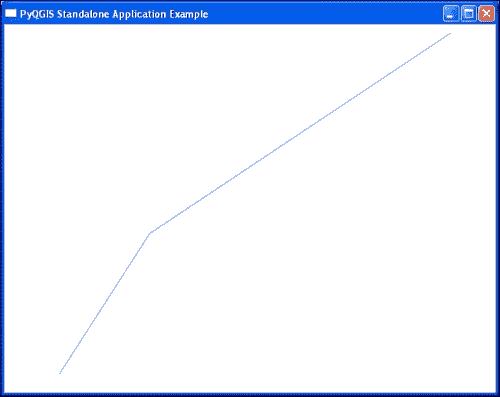

## 它是如何工作的…

这个菜谱尽可能少地使用代码来创建地图画布并绘制线条，以展示独立应用程序的骨架，可以进一步构建以添加更多功能。

要创建线条几何形状，我们使用**已知文本**（**WKT**），它提供了一种简单的方法来定义线条顶点，而无需创建大量对象。在这段代码的末尾，我们通过**冻结**画布来解决 QGIS 2.2 中的一个错误。当画布被冻结时，它不会响应用户事件，在这种情况下，这阻止了画布更新。一旦我们刷新画布，我们解冻它并重新绘制它以绘制线条。这个解决方案在 QGIS 2.4 和 2.6 中仍然有效，但不是必需的。

## 更多内容...

独立的应用程序可以编译成可执行文件，无需安装 QGIS，使用 py2exe 或 PyInstaller：

您可以在 [`www.py2exe.org`](http://www.py2exe.org) 了解更多关于 py2exe 的信息。

您可以在 [`github.com/pyinstaller/pyinstaller/wiki`](https://github.com/pyinstaller/pyinstaller/wiki) 了解更多关于 PyInstaller 的信息。

# 存储和读取全局首选项

PyQGIS 允许您存储应用程序级别的首选项并检索它们。

## 准备工作

此代码可以在任何类型的 PyQGIS 应用程序中运行。在这个例子中，我们将运行它以进行简单的演示。在这个例子中，我们将更改新项目的默认坐标参考系统（CRS），然后从全局设置中读取该值。

## 如何操作…

在这个食谱中，我们将使用 Python 控制台设置 QGIS 用于新项目的默认投影：

1.  启动 QGIS。

1.  从 **插件** 菜单中选择 **Python 控制台**。

1.  我们需要导入 Qt 核心库，如下所示：

    ```py
    from PyQt4.QtCore import *
    ```

1.  在 Python 控制台中，运行以下代码：

    ```py
    settings = QSettings(QSettings.NativeFormat, QSettings.UserScope, 'QuantumGIS', 'QGis')
    settings.setValue('/Projections/projectDefaultCrs', 'EPSG:2278')
    settings.value('/Projections/projectDefaultCrs')
    ```

## 工作原理…

此 API 实际上是 QGIS 依赖的 Qt API，用于设置。在 QSettings 对象中，我们指定存储的 NativeFormat，这是平台的默认格式。在 Windows 上，格式是注册表；在 OS X 上，是 `plist` 文件；在 Unix 上，是文本文件。其他 QSettings 参数是 **组织** 和 **应用程序**，通常用作存储信息的层次结构。请注意，即使更改了这些设置，QGIS GUI 中的某些属性也可能不会立即更改。在某些情况下，例如 Windows，必须重新启动系统才能使注册表更改生效。然而，一切都将通过编程方式工作。

## 更多内容…

如果您想查看可以更改的所有选项，请调用 QSettings 的 `allKeys()` 方法；这将返回所有设置名称的列表。

# 存储和读取项目首选项

QGIS 应用程序设置使用 Qt API 存储。然而，QGIS 项目设置有自己的对象。在这个食谱中，我们将设置和读取项目标题，然后设置和读取一个插件的自定义首选项。

## 准备工作

我们将使用之前创建的示例插件 *创建 QGIS 插件* 来设置插件首选项。您也可以替换您想要的任何插件名称。我们还将在这个 QGIS Python 控制台中运行此食谱以进行快速测试，但此代码通常用于插件中。

## 如何操作…

在这个食谱中，我们首先将写入并读取当前项目的标题。然后，我们将为名为 `splash` 的插件创建一个自定义值，如果需要，可以用于插件的启动动画屏幕。

1.  启动 QGIS。

1.  从 **插件** 菜单中选择 **Python 控制台**。

1.  在控制台中，运行以下代码：

    ```py
    proj = QgsProject.instance()
    proj.title("My QGIS Project")
    proj.title()
    proj.writeEntry("MyPlugin", "splash", "Geospatial Python Rocks!")
    proj.readEntry("MyPlugin", "splash", "Welcome!")[0]
    ```

## 工作原理…

在前两行中，我们更改了当前活动项目的标题，然后将其回显。在下一组两行中，我们为插件设置了自定义设置并读取了它们。请注意，`readEntry()` 方法返回一个包含所需文本和布尔值的元组，确认该值已设置。因此，我们提取第一个索引以获取文本。读取方法还允许在属性未设置的情况下使用默认文本（而不是抛出必须处理的异常），以及布尔值 `False` 来通知你，由于属性未设置，使用了默认文本。使用此方法设置的值在保存项目时存储在项目的 XML 文件中。

## 更多内容…

`QgsProject` 对象有多个方法和属性可能很有用。QGIS API 文档详细介绍了它们在[`qgis.org/api/2.6/classQgsProject.html`](http://qgis.org/api/2.6/classQgsProject.html)。

# 在你的脚本中访问脚本路径

有时候，你需要确切地知道当前的工作目录在哪里，这样你才能访问外部资源。

## 准备工作

此代码使用 Python 内置库，可以在任何上下文中使用。我们将在这个 QGIS Python 控制台中运行这个菜谱。

## 如何操作…

在这个菜谱中，我们将获取 Python 控制台当前的工作目录，它可能会随着配置而改变：

1.  启动 QGIS。

1.  从 **插件** 菜单中选择 **Python 控制台**。

1.  在 Python 控制台中，运行以下代码：

    ```py
    import os
    os.getcwd()
    ```

## 它是如何工作的…

QGIS 严重依赖于文件系统路径来运行应用程序和管理外部数据。当编写跨平台的 QGIS 代码时，你不能假设你的脚本的工作目录。

## 更多内容…

在他的博客上，一位 QGIS 开发者有一篇关于 QGIS 中路径变量各个方面的优秀文章，而不仅仅是执行目录；你可以在[`spatialgalaxy.net/2013/11/06/getting-paths-with-pyqgis/`](http://spatialgalaxy.net/2013/11/06/getting-paths-with-pyqgis/)查看。
