# 第四章 使用栅格数据

在本章中，我们将介绍以下菜谱：

+   加载栅格图层

+   获取栅格图层的单元格大小

+   获取栅格的宽度和高度

+   计算栅格波段数量

+   交换栅格波段

+   查询指定点的栅格值

+   重新投影栅格

+   创建高程晕渲

+   从高程数据创建矢量等高线

+   使用规则网格对栅格数据集进行采样

+   使用数字高程模型将高程数据添加到线

+   创建栅格的共同范围

+   重采样栅格分辨率

+   计算栅格中的唯一值

+   栅格镶嵌

+   将 TIFF 图像转换为 JPEG 图像

+   为栅格创建金字塔

+   将像素位置转换为地图坐标

+   将地图坐标转换为像素位置

+   为栅格创建 KML 图像叠加

+   对栅格进行分类

+   将栅格转换为矢量

+   使用地面控制点对栅格进行地理配准

+   使用形状文件裁剪栅格

# 简介

本章向您展示如何使用 QGIS 和 Python 将栅格数据引入 GIS，并创建派生栅格产品。QGIS 在处理栅格数据方面与矢量数据一样熟练，通过整合领先的开源库和算法，包括 GDAL、SAGA 和 Orfeo Toolbox。QGIS 为大量遥感工具提供了一个一致的接口。我们将通过处理工具箱在视觉上处理栅格数据和使用 QGIS 作为处理引擎之间来回切换，以完全自动化遥感工作流程。

栅格数据由行和列的单元格或像素组成，每个单元格代表一个单一值。将栅格数据视为图像是最简单的方法，这也是它们通常由软件表示的方式。然而，栅格数据集不一定以图像的形式存储。它们也可以是 ASCII 文本文件或数据库中的**二进制大对象**（**BLOBs**）。

地理空间栅格数据与常规数字图像之间的另一个区别是它们的分辨率。如果以全尺寸打印，数字图像以每英寸点数表示分辨率。分辨率也可以表示为图像中的总像素数，定义为百万像素。然而，地理空间栅格数据使用每个单元格代表的地面距离。例如，具有两英尺分辨率的栅格数据集意味着单个单元格代表地面上的两英尺。这也意味着只有大于两英尺的物体可以在数据集中通过视觉识别。

栅格数据集可能包含多个波段，这意味着可以在同一区域同时收集不同波长的光。通常，这个范围从 3 到 7 个波段，但在高光谱系统中，波段可以宽达数百个。这些波段可以单独查看，也可以作为图像的 RGB 波段进行交换。它们还可以通过数学方法重新组合成派生单波段图像，然后使用一定数量的类别重新着色，这些类别在数据集中表示相似值。

# 加载栅格图层

`QGSRasterLayer` API 为栅格数据提供了一个方便的高级接口。要使用此接口，我们必须将图层加载到 QGIS 中。API 允许你在不将其添加到地图的情况下处理图层。因此，我们将先加载图层，然后再将其添加到地图中。

## 准备工作

与本书中的其他食谱一样，你需要在我们的根目录或用户目录中创建一个名为`qgis_data`的目录，这提供了一个没有空格的短路径名。这种设置将有助于防止因系统中的路径相关问题而导致的任何令人沮丧的错误。在本食谱和其他食谱中，我们将使用密西西比湾海岸的 Landsat 卫星图像，你可以从[`geospatialpython.googlecode.com/files/SatImage.zip`](https://geospatialpython.googlecode.com/files/SatImage.zip)下载。

解压`SatImage.tif`和`SatImage.tfw`文件，并将它们放置在`qgis_data`目录下名为`rasters`的目录中。

## 如何操作...

现在，我们将逐步介绍如何加载栅格图层，并将其逐步添加到地图中。

1.  启动 QGIS。

1.  从**插件**菜单中选择**Python 控制台**。

1.  然后，在**Python 控制台**中，通过指定源文件和图层名称来创建图层：

    ```py
    rasterLyr = QgsRasterLayer("/qgis_data/rasters/SatImage.tif", "Gulf Coast")

    ```

1.  接下来，确保图层已按预期创建。以下命令应返回`True`：

    ```py
    rasterLyr.isValid()

    ```

1.  最后，将图层添加到图层注册表中：

    ```py
    QgsMapLayerRegistry.instance().addMapLayers([rasterLyr])

    ```

1.  确认你的 QGIS 地图看起来与以下图像相似：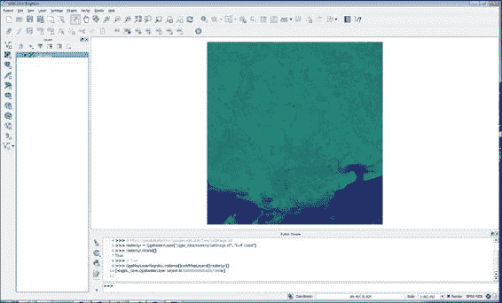

    当加载栅格图层时，QGIS 会自动缩放到图层的范围，如下所示，这是一个密西西比湾海岸的 Landsat 卫星图像示例。

## 它是如何工作的...

`QgsRasterLayer`对象需要文件的路径和 QGIS 中图层的名称。底层 GDAL 库确定加载图层的适当方法。这种方法与`QgsVectorLayer()`方法不同，后者需要你指定数据提供者。栅格图层也有数据提供者，但与矢量图层不同，所有栅格图层都通过 GDAL 进行管理。QGIS 的其中一个最佳特性是它将最优秀的开源地理空间工具结合到一个软件包中。GDAL 可以作为库使用，正如我们在这里从 Python 中使用它一样，也可以作为命令行工具使用。

一旦我们创建了 `QgsRasterLayer` 对象，我们将使用 `rasterLayer.isValid()` 方法进行快速检查，以查看文件是否正确加载。如果图层有效，此方法将返回 `True`。我们不会在每一道菜谱中都使用此方法；然而，这是一个最佳实践，尤其是在构建接受用户输入的动态应用程序时。由于 PyQGIS API 大部分基于 C 库构建，许多方法在操作失败时不会抛出异常。你必须使用专用方法来验证输出。

最后，我们将图层添加到地图图层注册表中，使其在地图和图例中可用。注册表通过分离、加载和可视化图层来跟踪所有加载的图层。QGIS 允许你在幕后工作，以便在将最终产品添加到地图之前对图层执行无限的中继过程。

# 获取栅格图层的单元格大小

地理空间栅格的第一个关键元素是像素宽度和高度。第二个关键元素是每个像素的地面距离，也称为像素大小。一旦你知道单元格大小和图像上的某个坐标（通常是左上角），你就可以开始使用遥感工具处理图像。在本菜谱中，我们将查询栅格的单元格大小。

## 准备工作

再次，我们将使用可在 [`geospatialpython.googlecode.com/files/SatImage.zip`](https://geospatialpython.googlecode.com/files/SatImage.zip) 获取的 SatImage 栅格。

将此栅格放入你的 `/qgis_data/rasters` 目录。

## 如何操作...

我们将加载栅格作为图层，然后使用 `QgsRasterLayer` API 获取 *x* 和 *y* 轴的单元格大小。为此，我们需要执行以下步骤：

1.  启动 QGIS。

1.  从 **插件** 菜单中选择 **Python 控制台**。

1.  加载图层并验证它：

    ```py
    rasterLyr = QgsRasterLayer("/qgis_data/rasters/satimage.tif", "Sat Image")
    rasterLyr.isValid()

    ```

1.  现在，调用 x 距离方法，它应返回 0.00029932313140079714：

    ```py
    rasterLyr.rasterUnitsPerPixelX()

    ```

1.  然后，调用 *y* 距离，其值应为 `0.00029932313140079714`：

    ```py
    rasterLyr.rasterUnitsPerPixelY()

    ```

## 工作原理...

GDAL 提供此信息，并将其传递给图层 API。请注意，虽然在此情况下 *x* 和 *y* 值本质上相同，但 *x* 和 *y* 距离完全可能是不同的——特别是如果图像以某种方式投影或扭曲。

# 获取栅格的宽度和高度

所有栅格图层都有像素宽度和高度。因为遥感数据可以被视为图像、数组或矩阵，所以你经常会看到使用不同的术语，包括列和行或像素和线。这些不同的术语在 QGIS API 中多次出现。

## 准备工作

我们将再次使用 SatImage 栅格，它可在 [`geospatialpython.googlecode.com/files/SatImage.zip`](https://geospatialpython.googlecode.com/files/SatImage.zip) 获取。

将此栅格放入你的 `/qgis_data/rasters` 目录。

## 如何操作...

1.  启动 QGIS。

1.  从 **插件** 菜单中选择 **Python 控制台**。

1.  在 Python 控制台中，加载图层并确保它是有效的：

    ```py
    rasterLyr = QgsRasterLayer("/qgis_data/rasters/satimage.tif", "satimage")
    rasterLyr.isValid()

    ```

    解压 SatImage 后检查其名称。

1.  获取图层的宽度，应该是`2592`：

    ```py
    rasterLyr.width()

    ```

1.  现在，获取栅格的高度，这将返回`2693`：

    ```py
    rasterLyr.height()

    ```

## 它是如何工作的...

栅格的宽度和高度对于许多算法至关重要，包括计算栅格占用的地图单位。

# 计算栅格波段

一个栅格可能有一个或多个波段。波段代表栅格中的信息层。每个波段都有相同数量的列和行。

## 准备中

我们将再次使用位于[`geospatialpython.googlecode.com/files/SatImage.zip`](https://geospatialpython.googlecode.com/files/SatImage.zip)的 SatImage 栅格。

将此栅格放在你的`/qgis_data/rasters`目录中。

## 如何操作...

我们将加载图层并将波段数量打印到控制台。为此，我们需要执行以下步骤：

1.  启动 QGIS。

1.  从**插件**菜单中选择**Python 控制台**。

1.  在 Python 控制台中，加载图层并确保它是有效的：

    ```py
    rasterLyr = QgsRasterLayer("/qgis_data/rasters/satimage.tif", "Sat Image")
    rasterLyr.isValid()

    ```

1.  现在，获取波段数量，在这种情况下应该是`3`：

    ```py
    rasterLyr.bandCount()

    ```

## 它是如何工作的...

重要的是要注意，栅格波段不是基于零的索引。当你想访问第一个波段时，你将其引用为`1`而不是`0`。在编程环境中，大多数序列从`0`开始。

# 交换栅格波段

计算机显示器以红、绿、蓝光（RGB）的可视光谱渲染图像。然而，栅格图像可能包含可视光谱之外的波段。这类栅格图像的视觉效果较差，因此你通常会想要重新组合波段以改变 RGB 值。

## 准备中

对于这个配方，我们将使用假彩色图像，你可以从[`geospatialpython.googlecode.com/files/FalseColor.zip`](https://geospatialpython.googlecode.com/files/FalseColor.zip)下载。

解压这个`tif`文件并将其放在你的`/qgis_data/rasters`目录中。

## 如何操作...

我们将加载这个栅格并交换第一和第二波段的位置。然后，我们将它添加到地图上。为此，我们需要执行以下步骤：

1.  启动 QGIS。

1.  从**插件**菜单中选择**Python 控制台**。

1.  在**Python 控制台**中，加载图层并确保它是有效的：

    ```py
    rasterLyr = QgsRasterLayer("/qgis_data/rasters/FalseColor.tif", "Band Swap")
    rasterLyr.isValid()

    ```

1.  现在，我们必须访问图层渲染器以操纵显示的波段顺序。请注意，此更改不会影响底层数据：

    ```py
    ren = rasterLyr.renderer()

    ```

1.  接下来，我们将设置`红色波段`为波段`2`：

    ```py
    ren.setRedBand(2)

    ```

1.  现在，我们将设置`绿色波段`为波段`1`：

    ```py
    ren.setGreenBand(1)

    ```

1.  最后，将修改后的栅格图层添加到地图上：

    ```py
    QgsMapLayerRegistry.instance().addMapLayers([rasterLyr])

    ```

## 它是如何工作的...

将源图像也加载到 QGIS 中以比较结果。在假彩色图像中，植被呈红色，而在波段交换图像中，树木呈现更自然的绿色，水呈蓝色。QGIS 使用 RGB 顺序允许你继续通过编号引用波段。尽管波段 `2` 首先显示，但它仍然被引用为波段 `2`。此外，请注意，波段顺序是由图层实例化的 `QgsMultiBandColorRenderer` 对象控制的，而不是图层本身。所需的渲染器类型在加载时由数据类型和波段数量确定。

## 更多...

`QgsMultiBandColorRenderer()` 方法有其他方法可以控制每个波段的对比度增强，例如 `setRedContrastEnhancement()`。你可以在 QGIS API 文档中了解有关不同类型数据的栅格渲染器的更多信息，文档地址为 [`qgis.org/api/classQgsRasterRenderer.html`](http://qgis.org/api/classQgsRasterRenderer.html)。

# 在指定点查询栅格的值

一个常见的遥感操作是在指定坐标处获取栅格数据值。在这个食谱中，我们将查询图像中心的值。碰巧的是，栅格图层会为你计算其范围的中心坐标。

## 准备工作

与本章中的许多食谱一样，我们再次使用 SatImage 栅格，该栅格可在 [`geospatialpython.googlecode.com/files/SatImage.zip`](https://geospatialpython.googlecode.com/files/SatImage.zip) 获取。

将此栅格放在你的 `/qgis_data/rasters` 目录中。

## 如何做...

我们将加载图层，获取中心坐标，然后查询值。为此，我们需要执行以下步骤：

1.  首先，加载并验证图层：

    ```py
    rasterLyr = QgsRasterLayer("/qgis_data/rasters/satimage.tif", "Sat Image")
    rasterLyr.isValid()

    ```

1.  接下来，从图层的 `QgsRectangle 范围` 对象获取图层的中心点，它将返回一个包含 *x* 和 *y* 值的元组：

    ```py
    c = rasterLyr.extent().center()

    ```

1.  现在，使用图层的数据提供者，我们可以使用 `identify()` 方法查询该点的数据值：

    ```py
    qry = rasterLyr.dataProvider().identify(c, QgsRaster.IdentifyFormatValue)

    ```

1.  因为查询错误不会抛出异常，我们必须验证查询：

    ```py
    qry.isValid()

    ```

1.  最后，我们可以查看查询结果，它将返回一个 Python 字典，其中每个波段编号作为键，指向该波段中的数据值：

    ```py
    qry.results()

    ```

1.  验证你是否得到以下输出：

    ```py
    {1: 17.0, 2: 66.0, 3: 56.0}

    ```

## 它是如何工作的...

与其他食谱相比，这个食谱很短，但我们已经触及了 PyQGIS 栅格 API 的几个部分。首先从一个栅格图层开始，获取范围；然后我们计算中心并创建一个位于中心坐标的点，最后在该点查询栅格。如果我们使用底层 GDAL 库的 Python API 来执行这个看似简单的操作，该库负责执行工作，这个例子将大约长七倍。

# 重投影栅格

所有地理空间分析的核心要求之一是能够更改数据的地图投影，以便允许不同的图层在同一地图上打开。重投影可能具有挑战性，但 QGIS 使其变得轻而易举。从本食谱开始，我们将开始使用强大的 QGIS 处理工具箱。处理工具箱将 600 多个算法包装成一个高度一致的 API，可供 Python 使用，也可以作为交互式工具。这个工具箱最初是一个名为 SEXTANTE 的第三方插件，但现在它是与 QGIS 一起分发的标准插件。

## 准备工作

正如本章中许多食谱一样，我们将使用位于[`geospatialpython.googlecode.com/files/SatImage.zip`](https://geospatialpython.googlecode.com/files/SatImage.zip)的 SatImage 栅格。

将此栅格文件放置在您的`/qgis_data/rasters`目录中。

## 如何操作...

在本食谱中，我们将使用`processing`模块的`gdal warp`算法将我们的图像从`EPSG 4326`重新投影到`3722`。为此，我们需要执行以下步骤：

1.  启动 QGIS。

1.  从**插件**菜单中选择**Python 控制台**。

1.  代码的第一行用于导入`processing`模块：

    ```py
    import processing

    ```

1.  接下来，我们加载我们的栅格图层并验证它：

    ```py
    rasterLyr = QgsRasterLayer("/qgis_data/rasters/SatImage.tif", "Reproject")
    rasterLyr.isValid()

    ```

1.  最后，我们通过插入正确的参数来运行`gdal warp`算法，包括图层引用、当前投影、期望投影、`None`用于更改分辨率、`0`表示最近邻重采样、`None`用于其他参数、`0 –Byte`输出栅格数据类型（`1 for int16`），以及重投影图像的输出名称：

    ```py
    processing.runalg("gdalogr:warpreproject", rasterLyr, "EPSG:4326", "EPSG:3722", None, 0, None, "/0, qgis_data/rasters/warped.tif")

    ```

1.  验证输出图像`warped.tif`是否已在文件系统中正确创建。

## 工作原理...

处理工具箱基本上是对命令行工具的包装。然而，与它访问的工具不同，工具箱提供了一个一致且大部分可预测的 API。熟悉 Esri 的 ArcGIS ArcToolbox 的用户会发现这种方法很熟悉。除了一致性之外，工具箱还增加了参数验证和日志记录，使这些工具更加用户友好。重要的是要记住，您必须显式导入`processing`模块。PyQGIS 会自动加载 QGIS API，但此模块尚未包含。记住，它直到最近还是第三方插件。

## 更多内容...

`runalg()` 方法，即运行算法，是运行处理命令最常见的方式。尽管如此，您还可以使用其他处理方法。如果您想直接将命令的输出加载到 QGIS 中，可以将 `runalg()` 替换为 `runandload()` 方法。该方法的所有参数保持不变。您还可以通过运行 `processing.alglist()` 获取带有描述的处理算法列表。对于任何给定的算法，您可以通过运行 `alghelp()` 命令来查看它所需的输入类型，例如 `processing.alghelp("gdalogr:warpproject")`。您还可以根据算法的组合编写自己的处理脚本，并将它们添加到处理工具箱中。此外，还有一个用于将处理命令链接在一起的视觉模型器。

# 创建高程阴影

高程阴影，或称为阴影地形，是一种可视化高程数据的技术，以便将其作为地图以照片逼真的方式展示。这种功能是 GDAL 的一部分，在 QGIS 中有两种不同的方式提供。它位于 **栅格** 菜单下的 **地形分析** 菜单中的工具，同时也是处理工具箱中的一个算法。

## 准备工作

您需要从 [`geospatialpython.googlecode.com/files/dem.zip`](https://geospatialpython.googlecode.com/files/dem.zip) 下载 DEM。

解压缩名为 `dem.asc` 的文件，并将其放置在您的 `/qgis_data/rasters` 目录中。

## 如何操作...

在本食谱中，我们将加载 DEM 图层并对其运行 `高程阴影` 处理算法。为此，我们需要执行以下步骤：

1.  启动 QGIS。

1.  从 **插件** 菜单中选择 **Python 控制台**。

1.  导入 `processing` 模块：

    ```py
    import processing

    ```

1.  加载和验证图层：

    ```py
    rasterLyr = QgsRasterLayer("/qgis_data/rasters/dem.asc", "Hillshade")
    rasterLyr.isValid()

    ```

1.  运行 `高程阴影` 算法，提供算法名称、图层引用、波段号、计算边缘选项、zevenbergen 选项以获得更平滑的地形、`z`-因子高程夸张数值、垂直与水平单位的比例、方位角（光源的角度）、高度（光源的高度）以及输出图像的名称：

    ```py
    processing.runandload("gdalogr:hillshade", rasterLyr, 1, False, False, 1.0, 1.0, 315.0, 45.0, "/qgis_data/rasters/hillshade.tif")

    ```

1.  在 QGIS 中验证输出图像 `hillshade.tif` 是否与以下图像相似。它应通过 `processing.runandload()` 方法自动加载到 QGIS 中：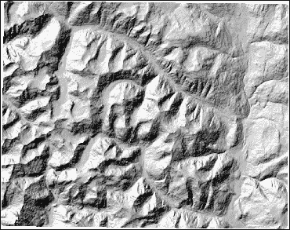

## 它是如何工作的...

`高程阴影` 算法通过在高度数据集上模拟光源来使其更具视觉吸引力。通常，您只需要更改算法中的 z 因子、方位角和高度以获得不同的效果。然而，如果生成的图像看起来不正确，您可能需要更改比例。根据 GDAL 文档，如果您的 DEM 以度为单位，则应设置比例 `111120`，如果以米为单位，则应设置比例 `370400`。此数据集覆盖的区域较小，因此比例 1 就足够了。有关这些值的更多信息，请参阅 [gdaldem](http://www.gdal.org/gdaldem.html) 文档。

# 从海拔数据创建矢量等高线

等高线通过在数据集中以相同的海拔追踪线条，在设定的时间间隔内形成环，从而有效地可视化地形数据。类似于 QGIS 中的阴影能力，**等高线**工具由 GDAL 提供，既作为**提取类别**下**栅格**菜单中的菜单选项，也作为处理工具箱算法。

## 准备工作

此配方使用来自[`geospatialpython.googlecode.com/files/dem.zip`](https://geospatialpython.googlecode.com/files/dem.zip)的 DEM，该 DEM 也用于其他配方。

解压名为`dem.asc`的文件，并将其放置在您的`/qgis_data/rasters`目录中。

## 如何操作...

在此配方中，我们将加载并验证 DEM 图层，将其添加到地图中，然后生成并加载等高线矢量图层。为此，我们需要执行以下步骤：

1.  启动 QGIS。

1.  从**插件**菜单中选择**Python 控制台**。

1.  导入`processing`模块。

    ```py
    import processing

    ```

1.  加载并验证 DEM：

    ```py
    rasterLyr = QgsRasterLayer("/qgis_data/rasters/dem.asc", "DEM")
    rasterLyr.isValid()

    ```

1.  使用`mapLayerRegistry`方法将 DEM 添加到地图中：

    ```py
    QgsMapLayerRegistry.instance().addMapLayers([rasterLyr])

    ```

1.  运行等高线算法，并在 DEM 图层上绘制结果，指定算法名称、图层引用、等高线之间的地图单位间隔、将包含海拔值的矢量数据属性字段名称、任何额外参数和输出文件名：

    ```py
    processing.runandload("gdalogr:contour", rasterLyr, 50.0, "Elv", None, "/qgis_data/rasters/contours.shp")

    ```

1.  确认 QGIS 中的输出类似于以下截图：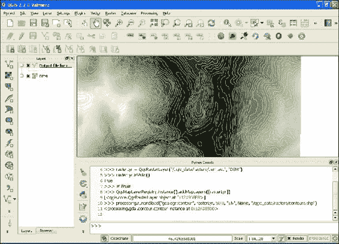

    此配方将生成的海拔等高线叠加到 DEM 上，作为将海拔数据转换为矢量数据集的方法。

## 它是如何工作的...

等高线算法创建一个矢量数据集，即 shapefile。图层属性表包含每条线的海拔值。根据海拔数据集的分辨率，您可能需要更改等高线间隔，以防止等高线在所需的地图分辨率下过于密集或过于稀疏。通常，像这样的自动生成的等高线是一个起点，您必须手动编辑结果以使其更具视觉吸引力。您可能想要平滑线条或删除不必要的微小环。

# 使用规则网格对栅格数据集进行采样

有时，您需要以规则间隔对栅格数据集进行采样，以便提供汇总统计信息或对栅格数据进行质量保证。实现这种规则采样的常见方法是在数据集上创建一个点网格，在每个点上查询网格，并将结果作为属性分配给这些点。在此配方中，我们将在卫星图像上执行此类采样。QGIS 有一个名为**规则点**的工具来执行此操作，它位于**研究工具**下的**矢量**菜单中。然而，QGIS API 中没有工具可以以编程方式执行此操作。但是，我们可以直接使用 Python 的`numpy`模块实现此算法。

## 准备工作

在这个菜谱中，我们将使用之前使用的 SatImage 栅格，可在 [`geospatialpython.googlecode.com/files/SatImage.zip`](https://geospatialpython.googlecode.com/files/SatImage.zip) 找到。

将此栅格放在您的 `/qgis_data/rasters` 目录中。

## 如何做到这一点...

此菜谱的操作顺序是加载栅格图层，在内存中创建一个矢量图层，以规则间隔添加点，在这些点上采样栅格图层，然后将采样数据作为每个点的属性添加。为此，我们需要执行以下步骤：

1.  启动 QGIS。

1.  从 **插件** 菜单中选择 **Python 控制台**。

1.  我们需要导入 `numpy` 模块，它是 QGIS 的一部分，以及 Qt 核心模块：

    ```py
    import numpy
    from PyQt4.QtCore import *

    ```

1.  现在，我们将创建一个 `spacing` 变量来控制点在地图单位中的间隔距离：

    ```py
    spacing = .1

    ```

1.  接下来，我们将创建一个 `inset` 变量来决定点从图像边缘开始有多近，以地图单位计算：

    ```py
    inset = .04

    ```

1.  现在，我们加载并验证栅格图层：

    ```py
    rasterLyr = QgsRasterLayer("/qgis_data/rasters/satimage.tif", "Sat Image")
    rasterLyr.isValid()

    ```

1.  接下来，我们收集栅格图层的坐标参考系统和范围，以便将其传输到点图层：

    ```py
    rpr = rasterLyr.dataProvider()
    epsg = rasterLyr.crs().postgisSrid()
    ext = rasterLyr.extent()

    ```

1.  现在，我们创建一个内存中的矢量点图层，它不会写入磁盘：

    ```py
    vectorLyr = QgsVectorLayer('Point?crs=epsg:%s' % epsg, 'Grid' , "memory")

    ```

1.  为了向矢量图层添加点，我们必须访问其数据提供者：

    ```py
    vpr = vectorLyr.dataProvider()
    qd = QVariant.Double

    ```

1.  接下来，我们创建属性字段来存储栅格数据样本：

    ```py
    vpr.addAttributes([QgsField("Red", qd), QgsField("Green", qd), QgsField("Blue", qd)])
    vectorLyr.updateFields()

    ```

1.  我们使用 `inset` 变量来设置图层在栅格图层内的范围：

    ```py
    xmin = ext.xMinimum() + inset
    xmax = ext.xMaximum()
    ymin = ext.yMinimum() + inset
    ymax = ext.yMaximum() – inset

    ```

1.  现在，我们使用 `numpy` 模块高效地创建我们规则网格中点的坐标：

    ```py
    pts = [(x,y) for x in (i for i in numpy.arange(xmin, xmax, spacing)) for y in (j for j in numpy.arange(ymin, ymax, spacing))]

    ```

1.  然后，我们创建一个列表来存储我们将创建的点要素：

    ```py
    feats = []

    ```

1.  在一个循环中，我们创建点要素，查询栅格，然后更新属性表。我们目前将这些点存储在一个列表中：

    ```py
    for x,y in pts:
     f = QgsFeature()
     f.initAttributes(3)
     p = QgsPoint(x,y)
     qry = rasterLyr.dataProvider().identify(p, QgsRaster.IdentifyFormatValue)
     r = qry.results()
     f.setAttribute(0, r[1])
     f.setAttribute(1, r[2])
     f.setAttribute(2, r[3])
     f.setGeometry(QgsGeometry.fromPoint(p))
     feats.append(f)

    ```

1.  接下来，我们将点列表传递给点图层数据提供者：

    ```py
    vpr.addFeatures(feats)

    ```

1.  现在，我们更新图层的范围：

    ```py
    vectorLyr.updateExtents()

    ```

1.  然后，我们将栅格图层和矢量图层都添加到地图列表中。列表中的最后一项在最上面：

    ```py
    QgsMapLayerRegistry.instance().addMapLayers([rasterLyr,vectoryr])

    ```

1.  最后，我们刷新地图以查看结果：

    ```py
    canvas = iface.mapCanvas()
    canvas.setExtent(rasterLyr.extent())
    canvas.refresh()

    ```

## 它是如何工作的...

以下截图显示了最终结果，其中一个网格点使用 **Identify Features** 地图工具被识别。结果对话框显示了所选点的栅格值：

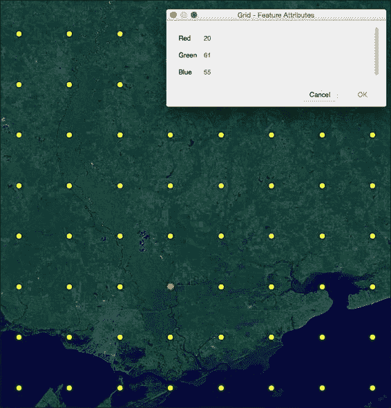

当你使用 QGIS 识别工具点击其中一个点时，结果对话框会显示从图像中提取的红色、绿色和蓝色值。

在 QGIS 中使用内存图层是执行快速、一次性操作的一种简单方法，无需在磁盘上创建文件的开销。如果您的机器有足够的资源，内存图层通常也很快。

## 还有更多...

在这个例子中，我们使用了一个规则网格，但我们可以轻松修改基于 numpy 的算法来创建一个随机点网格，在某些情况下这可能更有用。然而，处理工具箱还有一个简单的随机点算法，称为 `grass:v.random`。

# 使用数字高程模型向线顶点添加高程数据

如果您有一些地形中的交通路线，了解该路线的高程剖面是有用的。此操作可以使用构成路线的线上的点查询 DEM 并将高程值分配给该点来完成。在这个菜谱中，我们将做 exactly that。

## 准备工作

您需要一个高程格网和一个路线。您可以从 [`geospatialpython.googlecode.com/svn/path.zip`](https://geospatialpython.googlecode.com/svn/path.zip) 下载此数据集。

解压包含 shapefile 和高程格网的 `path` 目录。将整个路径目录放置在您的 `qgis_data/rasters` 目录中。

## 如何操作...

我们需要两个处理算法来完成这个菜谱。我们将加载栅格和矢量图层，将线要素转换为点，然后使用这些点查询栅格。生成的点数据集将作为路线的高程剖面。为此，我们需要执行以下步骤：

1.  启动 QGIS。

1.  从 **插件** 菜单中选择 **Python 控制台**。

1.  导入 `processing` 模块：

    ```py
    import processing

    ```

1.  将文件名设置为变量，以便在整个脚本中使用：

    ```py
    pth = "/qgis_data/rasters/path/"
    rasterPth = pth + "elevation.asc"
    vectorPth = pth + "path.shp"
    pointsPth = pth + "points.shp"
    elvPointsPth = pth + "elvPoints.shp"

    ```

1.  加载并验证源图层：

    ```py
    rasterLyr = QgsRasterLayer(rasterPth, "Elevation")
    rasterLyr.isValid()
    vectorLyr = QgsVectorLayer(vectorPth, "Path", "ogr")
    vectorLyr.isValid()

    ```

1.  将图层添加到地图中：

    ```py
    QgsMapLayerRegistry.instance().addMapLayers([vectorLyr, rasterLyr])

    ```

1.  使用处理工具箱中的 SAGA 算法从线创建一个中间点数据集：

    ```py
    processing.runalg("saga:convertlinestopoints", vectorLyr, False, 1, pointsPth)

    ```

1.  最后，使用 SAGA 的另一个处理算法创建最终数据集，并将网格值分配给点：

    ```py
    processing.runandload("saga:addgridvaluestopoints", pointsPth, rasterPth, 0, elvPointsPth)

    ```

## 工作原理...

以下是从 QGIS 保存的图像显示了数字高程模型（DEM）、路线线和带有高程标签的高程点，所有这些都在地图上显示，并应用了一些样式：

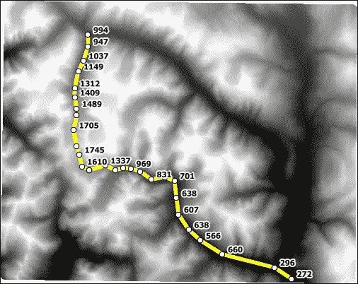

必须将线转换为点，因为线要素只能有一组属性。您也可以用多边形执行相同的操作。

## 更多...

我们可以构建一个处理脚本，将这两个算法组合到一个界面中，然后将其添加到工具箱中，而不是运行两个算法。在处理工具箱中，有一个名为 **脚本** 的类别，其中有一个名为 **创建新脚本** 的工具。双击此工具将打开一个编辑器，允许您构建自己的处理脚本。根据您的平台，您可能需要安装或配置 SAGA 以使用此算法。您可以在 [`sourceforge.net/p/saga-gis/wiki/Binary%20Packages/`](http://sourceforge.net/p/saga-gis/wiki/Binary%20Packages/) 找到 Linux 的二进制包。

此外，在 Linux 上，您可能需要更改以下选项：

1.  在 **处理** 菜单中，选择 **选项…**。

1.  在 **选项** 对话框中，打开 **提供者** 树菜单，然后打开 **SAGA** 树菜单。

1.  取消选择 **使用 2.0.8 语法** 选项。

# 创建栅格的共同范围

如果你试图比较两个栅格图像，它们必须具有相同的范围和分辨率。大多数软件包甚至不允许你尝试比较没有相同范围的图像。有时，你会有重叠的图像，但它们没有共享一个共同的区域，或者具有不同的分辨率。以下插图是这种情况的一个例子：

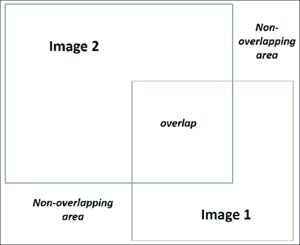

在这个菜谱中，我们将取两个重叠的图像并给它们相同的范围。

## 准备工作

你可以从[`geospatialpython.googlecode.com/svn/overlap.zip`](https://geospatialpython.googlecode.com/svn/overlap.zip)下载两个重叠的图像。

解压图像并将它们放在你的`/qgis_data/rasters`目录中。

你还需要从以下位置下载以下处理脚本：

[`geospatialpython.googlecode.com/svn/unify_extents.zip`](https://geospatialpython.googlecode.com/svn/unify_extents.zip)

解压内容并将脚本放在你的`\.qgis2\processing\scripts`目录中，该目录位于你的用户目录内。例如，在一个 Windows 64 位机器上，该目录将是`C:\Users\<username>\.qgis2\processing\scripts`，将`<username>`替换为你的用户名。

确保你重新启动 QGIS。此脚本是 Yury Ryabov 在他的博客[`ssrebelious.blogspot.com/2014/01/unifying-extent-and-resolution-of.html`](http://ssrebelious.blogspot.com/2014/01/unifying-extent-and-resolution-of.html)上创建的修改版本。

原始脚本使用了一个需要用户交互的确认对话框。修改后的脚本遵循处理工具箱编程约定，并允许你以编程方式使用它。

## 如何操作...

在 QGIS 中，唯一的步骤是运行新创建的处理命令。为此，我们需要执行以下步骤：

1.  启动 QGIS。

1.  从**插件**菜单中选择**Python 控制台**。

1.  导入`processing`模块：

    ```py
    import processing

    ```

1.  运行新添加的处理算法，指定算法名称、两个图像的路径、可选的无数据值、统一图像的输出目录以及一个布尔标志，用于将图像加载到 QGIS 中：

    ```py
    processing.runalg("script:unifyextentandresolution","/qgis_data/rasters/Image2.tif;/qgis_data/rasters/Image1.tif",-9999,"/qgis_data/rasters",True)

    ```

1.  在 QGIS 的目录中，请确认你有以下两个名为的图片：

    ```py
    Image1_unified.tif
    Image2_unfied.tif

    ```

## 它是如何工作的...

以下截图显示了通过将`Image1_unified.tif`的透明度设置为像素`0,0,0`的栅格的常见范围：

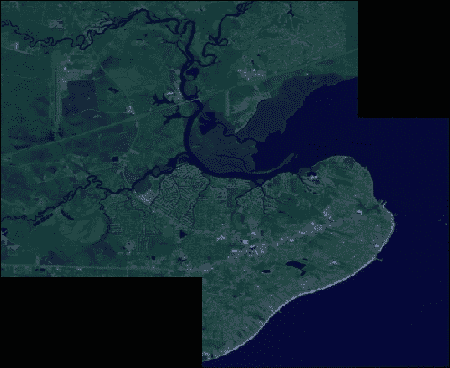

如果你没有使用透明度设置，你会看到两个图像都填充了非重叠区域，在两个范围的最小边界框内没有数据。这些无数据值，指定为`-9999`，将被其他处理算法忽略。

# 重采样栅格分辨率

重采样图像允许您将图像的当前分辨率更改为不同的分辨率。将分辨率降低，也称为下采样，需要您从图像中删除像素，同时保持数据集的地理空间参照完整性。在 QGIS 处理工具箱中，使用的是`gdalogr:warpproject`算法，这与用于重投影的算法相同。

## 准备工作

我们将再次使用可在[`geospatialpython.googlecode.com/files/SatImage.zip`](https://geospatialpython.googlecode.com/files/SatImage.zip)找到的 SatImage 栅格数据。

将此栅格放在您的`/qgis_data/rasters`目录中。

## 如何操作...

在此过程中有一个额外的步骤，我们将获取栅格当前像素分辨率作为参考来计算新的分辨率并将其传递给算法。为此，我们需要执行以下步骤：

1.  启动 QGIS。

1.  从**插件**菜单中选择**Python 控制台**。

1.  导入`processing`模块：

    ```py
    import processing

    ```

1.  加载并验证栅格图层：

    ```py
    rasterLyr = QgsRasterLayer("/qgis_data/rasters/SatImage.tif", "Resample")
    rasterLyr.isValid()

    ```

1.  算法需要投影信息。我们不会更改它，所以只需将当前投影分配给一个变量：

    ```py
    epsg = rasterLyr.crs().postgisSrid()
    srs = "EPSG:%s" % epsg

    ```

1.  获取当前像素的地面距离并将其乘以 2 以计算地面分辨率的一半。我们只使用 X 距离，因为在这种情况下，它与 Y 距离相同：

    ```py
    res = rasterLyr.rasterUnitsPerPixelX() * 2

    ```

1.  运行重采样算法，指定算法名称、图层引用、输入和输出空间参考系统、期望的分辨率、重采样算法（`0`是最近邻）、任何附加参数、`0`为输出栅格数据类型，以及输出文件名：

    ```py
    processing.runalg("gdalogr:warpreproject", rasterLyr, srs, srs, res, 0, None, 0,  "/qgis_data/rasters/resampled.tif")

    ```

1.  确认`resampled.tif`图像已创建在您的`/qgis_data/rasters`目录中。

## 它是如何工作的...

初始时，通过乘法降低分辨率似乎是不直观的。然而，通过增加每个像素的空间覆盖范围，覆盖栅格范围所需的像素更少。您可以在 QGIS 中通过加载两个图像并放大到有建筑物或其他详细结构的区域，然后关闭或打开一个图层来轻松比较两者之间的差异。

# 计算栅格中的唯一值

遥感图像不仅仅是图片；它们是数据。像素的值具有意义，可以由计算机自动分析。在数据集上运行统计算法是遥感的关键。此菜谱计算多个波段中像素唯一组合的数量。此菜谱的一个用例将是评估图像分类的结果，这是一个我们将在本章后面讨论的菜谱。此菜谱与典型的直方图函数相反，后者总计唯一值以及每个波段中每个值的频率。

## 准备工作

我们将使用可在[`geospatialpython.googlecode.com/files/SatImage.zip`](https://geospatialpython.googlecode.com/files/SatImage.zip)找到的 SatImage 栅格数据。

将此栅格放在您的`/qgis_data/rasters`目录中。

## 如何操作...

此算法完全依赖于`numpy`模块，该模块包含在 PyQGIS 中。Numpy 可以通过 GDAL 包的`gdalnumeric`模块访问。为此，我们需要执行以下步骤：

1.  启动 QGIS。

1.  从**插件**菜单中选择**Python 控制台**。

1.  首先，我们必须导入名为`gdalnumeric`的桥梁模块，该模块将 GDAL 与 Numpy 连接，以便在地理空间图像上执行数组数学：

    ```py
    import gdalnumeric

    ```

1.  现在，我们将直接将我们的栅格图像加载到多维数组中：

    ```py
    a = gdalnumeric.LoadFile("/qgis_data/rasters/satimage.tif")

    ```

1.  以下代码计算图像中的像素组合数量：

    ```py
    b = a.T.ravel()
    c=b.reshape((b.size/3,3))
    order = gdalnumeric.numpy.lexsort(c.T)
    c = c[order]
    diff = gdalnumeric.numpy.diff(c, axis=0)
    ui = gdalnumeric.numpy.ones(len(c), 'bool')
    ui[1:] = (diff != 0).any(axis=1)
    u = c[ui]

    ```

1.  现在，我们可以查看结果一维数组的大小以获取唯一值计数：

    ```py
    u.size

    ```

最后，验证结果是否为`16085631`。

## 它是如何工作的...

`numpy`模块是商业软件包`Matlab`的开源等效物。你可以在[`Numpy.org`](http://Numpy.org)了解更多关于 Numpy 的信息。

当你使用 Numpy 加载一个图像时，它被加载为一个多维数组。Numpy 允许你使用操作符和专用函数在整个数组上进行数组数学，就像你在包含单个数值变量的变量上做的那样。

# 栅格镶嵌

栅格镶嵌是将具有相同分辨率和地图投影的多个地理空间图像融合成一个栅格的过程。在本菜谱中，我们将结合两个重叠的卫星图像形成一个单一的数据集。

## 准备工作

如果你之前没有从其他菜谱中下载，你需要从[`geospatialpython.googlecode.com/svn/overlap.zip`](https://geospatialpython.googlecode.com/svn/overlap.zip)下载重叠数据集。

将两个图像放置在您的`/qgis_data/rasters/`目录中。

## 如何操作...

此过程相对简单，在处理工具箱中有一个专门的算法。执行以下步骤：

1.  启动 QGIS。

1.  从**插件**菜单中选择**Python 控制台**。

1.  运行 gdalogr:merge 算法，指定进程名称、两个图像、一个布尔值以使用第一个图像的伪彩色调色板、一个布尔值以将每个图像堆叠到单独的波段中，以及输出文件名：

    ```py
    processing.runalg("gdalogr:merge","C:/qgis_data/rasters/Image2.tif;C:/qgis_data/rasters/Image1.tif",False,False,"/qgis_data/rasters/merged.tif")

    ```

1.  验证`merged.tif`图像是否已创建，并在 QGIS 中显示为单个栅格中的两个图像。

## 它是如何工作的...

**合并**处理算法是实际`gdal_merge`命令行工具的简化版本。此算法仅限于 GDAL 输出并汇总输入栅格的范围。它一次只能合并两个栅格。gdal_merge 工具具有更多选项，包括额外的输出格式、一次合并多个栅格的能力、控制范围的能力等。你还可以直接使用 GDAL API 来利用这些功能，但将需要比这个简单示例更多的代码。

# 将 TIFF 图像转换为 JPEG 图像

图像格式转换是几乎所有地理空间项目的一部分。栅格有多种不同的专用格式，将它们转换为更常见的格式是必要的。GDAL 工具包括一个名为`gdal_translate`的工具，专门用于格式转换。不幸的是，Processing 工具箱中的算法功能有限。对于格式转换，使用核心 GDAL API 更容易。

## 准备工作

我们将使用位于[`geospatialpython.googlecode.com/files/SatImage.zip`](https://geospatialpython.googlecode.com/files/SatImage.zip)的 SatImage 栅格。

将此栅格放置在您的`/qgis_data/rasters`目录中。

## 如何操作...

在这个配方中，我们将使用 GDAL 打开一个 TIFF 图像并将其复制到一个新的数据集作为 JPEG2000 图像，这允许您在保持地理空间信息的同时使用常见的 JPEG 格式。为此，我们需要执行以下步骤：

1.  启动 QGIS。

1.  从**插件**菜单中选择**Python 控制台**。

1.  导入 gdal 模块：

    ```py
    from osgeo import gdal

    ```

1.  获取我们所需格式的 GDAL 驱动程序：

    ```py
    drv = gdal.GetDriverByName("JP2OpenJPEG")

    ```

1.  打开源图像：

    ```py
    src = gdal.Open("/qgis_data/rasters/satimage.tif")

    ```

1.  将源数据集复制到新格式：

    ```py
    tgt = drv.CreateCopy("/qgis_data/rasters/satimage.jp2", src)

    ```

## 它是如何工作的...

对于图像格式的直接格式转换，核心 GDAL 库非常快且简单。GDAL 支持创建超过 60 种栅格格式和读取超过 130 种栅格格式。

# 为栅格创建金字塔

金字塔，或概述图像，通过在文件中存储与全分辨率图像一起的重新采样、低分辨率图像版本来牺牲磁盘空间以换取地图渲染速度。一旦您最终确定了一个栅格，构建金字塔概述是一个好主意。

## 准备工作

对于这个配方，我们将使用一个假彩色图像，您可以从[`geospatialpython.googlecode.com/files/FalseColor.zip`](https://geospatialpython.googlecode.com/files/FalseColor.zip)下载。

解压此`TIF`文件并将其放置在您的`/qgis_data/rasters`目录中。

## 如何操作...

Processing 工具箱有一个专门用于构建金字塔图像的算法。执行以下步骤以创建栅格金字塔：

1.  启动 QGIS。

1.  从**插件**菜单中选择**Python 控制台**。

1.  导入`processing`模块：

    ```py
    import processing

    ```

1.  运行`gdalogr:overviews`算法，指定进程名称、输入图像、概述级别、删除现有概述的选项、重采样方法（`0`是最近邻）和概述格式（`1`是内部）：

    ```py
    processing.runalg("gdalogr:overviews","/qgis_data/rasters/FalseColor.tif","2 4 8 16",True,0,1)

    ```

1.  现在，通过从文件系统拖放到地图画布上，将栅格加载到 QGIS 中。

1.  双击地图图例中的图层名称以打开**图层属性**对话框。

1.  在**图层属性**对话框中，点击**金字塔**选项卡并验证图层是否列出了多个分辨率。

## 它是如何工作的...

概览图像的概念相当简单。你多次重采样图像，然后查看器根据比例选择最合适的、最小的文件加载到地图上。概览可以存储在文件的头部，对于某些格式或作为外部文件格式。所需概览的级别在很大程度上取决于当前图像的文件大小和分辨率，但实际上是任意的。在这个例子中，我们通过 2 的倍数放大比例，这是一种常见的做法。大多数应用程序中的缩放工具在点击放大时都会将比例加倍。2 的倍数为你提供了足够的缩放级别，因此你通常不会缩放到没有金字塔图像的水平。如果你创建太多级别，因为金字塔会占用额外的磁盘空间，所以会有一个收益递减的点。通常 4 到 5 个级别是有效的。

# 将像素位置转换为地图坐标

在地理空间环境中查看栅格的能力依赖于将像素位置转换为地面坐标。迟早，当你使用 Python 编写地理空间程序时，你必须自己执行这种转换。

## 准备工作

我们将使用在以下位置可用的 SatImage 栅格：

[`geospatialpython.googlecode.com/files/SatImage.zip`](https://geospatialpython.googlecode.com/files/SatImage.zip)

将此栅格放置在您的`/qgis_data/rasters`目录中。

## 如何操作...

我们将使用 GDAL 提取将像素转换为坐标所需的信息，然后使用纯 Python 执行计算。我们将使用图像的中心像素作为转换的位置。

1.  启动 QGIS。

1.  从**插件**菜单选择**Python 控制台**

1.  我们需要导入`gdal`模块：

    ```py
    from osgeo import gdal

    ```

1.  然后，我们需要定义一个可重用的函数，该函数执行转换，接受包含栅格地理参考信息的 GDAL `GeoTransform`对象以及像素的*x*、*y*值：

    ```py
    def Pixel2world(geoMatrix, x, y):
     ulX = geoMatrix[0]
     ulY = geoMatrix[3]
     xDist = geoMatrix[1]
     yDist = geoMatrix[5]
     coorX = (ulX + (x * xDist))
     coorY = (ulY + (y * yDist))
     return (coorX, coorY)

    ```

1.  现在，我们将使用 GDAL 打开图像

    ```py
    src = gdal.Open("/qgis_data/rasters/Satimage.tif")

    ```

1.  接下来，从图像中获取`GeoTransform`对象：

    ```py
    geoTrans = src.GetGeoTransform()

    ```

1.  现在，计算图像的中心像素：

    ```py
    centerX = src.RasterXSize/2
    centerY = src.RasterYSize/2

    ```

1.  最后，通过调用我们的函数来执行转换：

    ```py
    Pixel2world(geoTrans, centerX, centerY)

    ```

1.  验证返回的坐标是否接近以下输出：

    ```py
    (-89.59486002580364, 30.510227817850406)

    ```

## 工作原理...

像素转换只是两个平面之间的缩放比例，即图像坐标系和地球坐标系。当处理大面积时，这种转换可能成为一个更复杂的投影，因为地球的曲率会发挥作用。GDAL 网站在以下 URL 有一个关于地理变换对象的优秀教程：[`www.gdal.org/gdal_tutorial.html`](http://www.gdal.org/gdal_tutorial.html)

# 将地图坐标转换为像素位置

当你收到一个地图坐标作为用户输入或来自其他来源时，你必须能够将其转换回栅格上的适当像素位置。

## 准备工作

我们将使用在以下位置可用的 SatImage 栅格：

[`geospatialpython.googlecode.com/files/SatImage.zip`](https://geospatialpython.googlecode.com/files/SatImage.zip)

将此栅格文件放置在您的`/qgis_data/rasters`目录中。

## 如何操作...

与之前的菜谱类似，我们将定义一个函数，从我们的栅格中提取 GDAL `GeoTransform`对象，并用于转换。

1.  启动 QGIS。

1.  从**插件**菜单中选择**Python 控制台**

1.  我们需要导入 gdal 模块：

    ```py
    from osgeo import gdal

    ```

1.  然后，我们需要定义一个可重用的函数，该函数执行坐标到像素的转换。我们获取包含栅格地理参考信息的 GDAL `GeoTransform`对象和地图*x*，*y*坐标：

    ```py
    def world2Pixel(geoMatrix, x, y):
     ulX = geoMatrix[0]
     ulY = geoMatrix[3]
     xDist = geoMatrix[1]
     yDist = geoMatrix[5]
     rtnX = geoMatrix[2]
     rtnY = geoMatrix[4]
     pixel = int((x - ulX) / xDist)
     line = int((y - ulY) / yDist)
     return (pixel, line)

    ```

1.  接下来，我们打开源图像：

    ```py
    src = gdal.Open("/qgis_data/rasters/satimage.tif")

    ```

1.  现在，获取 GeoTransform 对象：

    ```py
    geoTrans = src.GetGeoTransform()

    ```

1.  最后，执行转换：

    ```py
    world2Pixel(geoTrans, -89.59486002580364, 30.510227817850406)

    ```

1.  验证您的输出如下：

    ```py
    (1296, 1346)

    ```

## 工作原理...

这种转换在小范围内非常可靠，但随着感兴趣区域的扩大，您还必须考虑高程，这需要一个更复杂的转换，具体取决于图像是如何生成的。

### 注意

马萨诸塞大学提供的以下演示文稿出色地解释了地理参考数据的挑战：

[UMass 大学课程资料](http://courses.umass.edu/nrc592g-cschweik/pdfs/Class_3_Georeferencing_concepts.pdf)

# 为栅格创建 KML 图像叠加

**GoogleEarth**是现有最广泛使用的地理空间查看器之一。GoogleEarth 用于地理空间数据的 XML 数据格式称为**KML**。开放地理空间联盟采用了 KML 作为数据标准。将栅格转换为压缩在**KMZ**存档文件中的**KML**叠加是一种非常流行的将数据提供给知道如何使用 GoogleEarth 的最终用户的方式。

## 准备工作

如果您尚未从之前的菜谱中下载，我们将再次使用以下 URL 中可用的 SatImage 栅格：

[SatImage 下载链接](https://geospatialpython.googlecode.com/files/SatImage.zip)

将此栅格文件放置在您的`/qgis_data/rasters`目录中。

## 如何操作...

在本菜谱中，我们将创建一个描述我们图像的**KML**文档。然后，我们将使用 GDAL 的专用虚拟文件系统将图像转换为内存中的**JPEG**，并使用 Python 的`zipfile`模块将所有内容直接写入**KMZ**文件。

1.  启动 QGIS。

1.  从**插件**菜单中选择**Python 控制台**

1.  我们需要导入`gdal`模块以及 Python 的`zipfile`模块：

    ```py
    from osgeo import gdal
    import zipfile

    ```

1.  接下来，我们将在`gdal`中打开我们的卫星图像：

    ```py
    srcf = "/qgis_data/rasters/Satimage.tif"

    ```

1.  现在，我们将使用以`vismem`开头的 GDAL 虚拟文件命名约定，创建一个包含虚拟文件名的变量：

    ```py
    vfn = "/vsimem/satimage.jpg"

    ```

1.  我们为输出格式创建 JPEG gdal 驱动程序对象：

    ```py
    drv = gdal.GetDriverByName('JPEG')

    ```

1.  现在，我们可以打开源文件：

    ```py
    src = gdal.Open(srcf)

    ```

1.  然后，我们可以将源文件复制到我们的虚拟 JPEG：

    ```py
    tgt = drv.CreateCopy(vfn, src)

    ```

1.  现在，我们将为我们的栅格创建一个 QGIS 栅格图层，仅为了计算图像的范围：

    ```py
    rasterLyr = QgsRasterLayer(srcf, "SatImage")

    ```

1.  接下来，我们获取图层的范围：

    ```py
    e = rasterLyr.extent()

    ```

1.  接下来，我们格式化 KML 文档模板并插入图像范围：

    ```py
    kml = """<?xml version="1.0" encoding="UTF-8"?>
    <kml >
      <Document>
        <name>QGIS KML Example</name>
        <GroundOverlay>
            <name>SatImage</name>
            <drawOrder>30</drawOrder>
            <Icon>
              <href>SatImage.jpg</href>
            </Icon>
            <LatLonBox>
              <north>%s</north>
              <south>%s</south>
              <east>%s</east>
              <west>%s</west>
            </LatLonBox>
        </GroundOverlay>
      </Document>
    </kml>""" %(e.yMaximum(), e.yMinimum(), e.xMaximum(), e.xMinimum())
    ```

1.  现在，我们打开我们的虚拟 JPEG 文件在 GDAL 中，并为其读取做准备：

    ```py
    vsifile = gdal.VSIFOpenL(vfn,'r')
    gdal.VSIFSeekL(vsifile, 0, 2)
    vsileng = gdal.VSIFTellL(vsifile)
    gdal.VSIFSeekL(vsifile, 0, 0)

    ```

1.  最后，我们将我们的 KML 文档和虚拟 JPEG 写入一个压缩的 KMZ 文件：

    ```py
    z = zipfile.ZipFile("/qgis_data/rasters/satimage.kmz", "w", zipfile.ZIP_DEFLATED)
    z.writestr("doc.kml", kml)
    z.writestr("SatImage.jpg", gdal.VSIFReadL(1, vsileng, vsifile))
    z.close()

    ```

1.  现在，在 GoogleEarth 中打开 KMZ 文件，并确认它看起来像以下截图：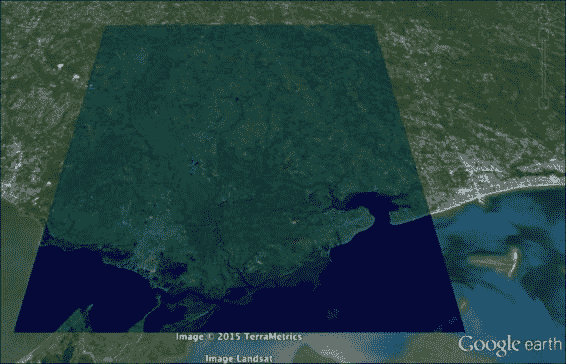

## 它是如何工作的...

KML 是一个简单的 XML 格式。在 Python 中，有专门的库用于读取和写入它，但对于简单的导出以共享一个或两个图像，PyQGIS 控制台已经足够了。虽然我们在这个脚本中运行 QGIS Python 解释器，但它也可以仅使用 GDAL 在 QGIS 之外运行。

## 更多...

**Orfeo Toolbox**有一个名为`otb:imagetokmzexport`的处理算法，它为图像提供了一个更复杂的 KMZ 导出工具。

# 栅格分类

图像分类是遥感中最复杂的方面之一。虽然 QGIS 能够根据值对像素进行着色以进行可视化，但它并没有进行太多的分类。它确实提供了一个栅格计算器工具，你可以在图像上执行任意数学公式，然而它并没有尝试实现任何常见算法。Orfeo Toolbox 完全致力于遥感，包括一个名为 K-means 聚类的自动分类算法，该算法将像素分组到任意数量的相似类别中，以创建一个新的图像。我们可以使用这个算法做一个很好的图像分类演示。

## 准备工作

对于这个食谱，我们将使用一个假彩色图像，你可以从这里下载：

[`geospatialpython.googlecode.com/files/FalseColor.zip`](https://geospatialpython.googlecode.com/files/FalseColor.zip)

解压这个 TIFF 文件，并将其放置在你的`/qgis_data/rasters`目录中。

## 如何操作...

我们需要做的只是在我们输入的图像上运行算法。重要的参数是第二个、第三个、第六个和第十个参数。它们分别定义了输入图像名称、分配给任务的 RAM 量、类别数量和输出名称。

1.  首先，在 QGIS **Python 控制台**中导入`processing`模块：

    ```py
    import processing

    ```

1.  接下来，使用`processing.runandload()`方法运行`otb`算法，以在 QGIS 中显示输出：

    ```py
    processing.runandload("otb:unsupervisedkmeansimageclassification","/qgis_data/rasters/FalseColor.tif",768,None,10000,3,1000,0.95,"/qgis_data/rasters/classify.tif",None)

    ```

1.  当图像在 QGIS 中加载时，双击**内容表**中的图层名称。

1.  在**图层属性**对话框中，选择**样式**。

1.  将**渲染类型**菜单更改为**单波段伪彩色**。

1.  将右侧的**颜色图**菜单更改为**光谱**。

1.  点击**分类**按钮。

1.  在窗口底部选择**确定**按钮。

1.  确认你的图像看起来与以下图像相似，但不要有类别标签：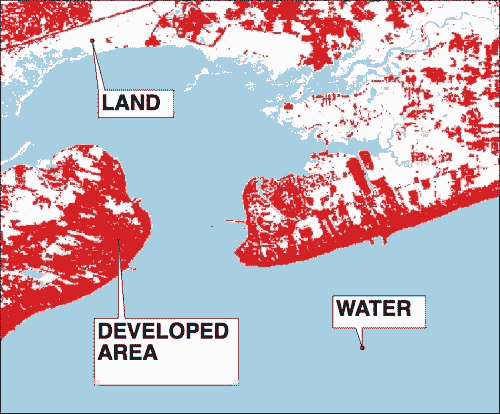

## 它是如何工作的...

保持类别编号低，可以让自动化分类算法专注于图像中的主要特征，并在我们达到非常高的整体土地利用准确性时有所帮助。额外的自动化分类将需要带有训练数据集的监督分析和更深入的准备。但整体概念将保持不变。QGIS 有一个用于半自动分类的插件。您可以在以下 URL 了解更多信息：

[`plugins.qgis.org/plugins/SemiAutomaticClassificationPlugin/`](https://plugins.qgis.org/plugins/SemiAutomaticClassificationPlugin/)

# 将栅格转换为矢量

栅格数据集有效地表示现实世界的特征，但在地理空间分析中可能用途有限。一旦将图像分类为可管理的数据集，您可以将这些栅格类别转换为矢量数据集，以便进行更复杂的 GIS 分析。GDAL 有一个名为 **polygonize** 的函数用于此操作。

## 准备工作

您需要下载以下分类栅格并将其放置在您的 `/qgis_data/rasters` 目录中：

[`geospatialpython.googlecode.com/svn/landuse_bay.zip`](https://geospatialpython.googlecode.com/svn/landuse_bay.zip)

## 如何操作...

通常，您会将此菜谱的输出保存为形状文件。我们不会指定输出文件名。处理工具箱将分配一个临时文件名并返回该文件名。我们只需将临时文件加载到 QGIS 中。该算法允许您通过将其指定为最后一个参数来写入形状文件。

1.  在 QGIS **Python 控制台**中导入`processing`模块：

    ```py
    import processing

    ```

1.  接下来，运行算法，指定进程名称、输入图像、类别编号的字段名称，以及可选的输出形状文件：

    ```py
    processing.runalg("gdalogr:polygonize","C:/qgis_data/rasters/landuse_bay.tif","DN",None)

    ```

1.  您应该获得一个包含三个类别的矢量图层，定义为多边形，表示已开发区域。在下面的示例图像中，我们为每个类别分配了独特的颜色：开发区域（最暗），水域（中间色调），和陆地（最浅颜色）：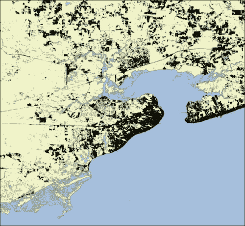

## 它是如何工作的...

GDAL 寻找像素簇并在其周围创建多边形。尽可能少地使用类别很重要。如果像素之间存在太多差异，那么 GDAL 将在图像中的每个像素周围创建一个多边形。您可以通过使用第一章中的菜谱 *计算多边形面积* 来将此菜谱转换为真正的分析产品，以量化每种土地利用类别。

# 从控制点进行栅格地理配准

有时，代表地球特征的栅格图可能只是一个没有地理参照信息的图像。历史扫描地图的情况就是这样。然而，你可以使用同一区域的参考数据集来创建连接点，或称为地面控制点，然后使用算法将图像扭曲以适应地球模型。数据收集系统通常只存储与栅格一起的**地面控制点（GCP**），以尽可能保持图像的原始格式。每次对图像的更改都可能导致数据丢失。因此，按需地理参照图像通常是最佳方法。

在这个菜谱中，我们将地理参照 1853 年路易斯安那州和密西西比州墨西哥湾沿岸的历史调查地图。控制点是使用 QGIS 地理参照插件手动创建并保存到标准控制点文件的。

## 准备工作

下载以下 zip 文件，解压内容，并将`georef`目录放在`/qgis_data/rasters`：

[`geospatialpython.googlecode.com/svn/georef.zip`](https://geospatialpython.googlecode.com/svn/georef.zip)

## 如何操作...

我们将使用处理 API 的低级模块来访问一些专门的 GDAL 实用工具函数。

1.  在 QGIS **Python 控制台**中，导入`GdalUtils`模块：

    ```py
    from processing.algs.gdal.GdalUtils import GdalUtils

    ```

1.  现在，我们将为源数据和目标数据设置一些路径名，这些路径名将被多次使用：

    ```py
    src = "/qgis_data/rasters/georef/1853survey.jpg"
    points = "/qgis_data/rasters/georef/1853Survey.points"
    trans = "/qgis_data/rasters/georef/1835survey_trans.tif"
    final = "/qgis_data/rasters/georef/1835survey_georef.tif"

    ```

1.  接下来，我们将打开我们的 GCP 文件并读取标题行：

    ```py
    gcp = open(points, "rb")
    hdr = gcp.readline()

    ```

1.  然后，我们可以开始构建我们的第一个 gdal 实用工具命令：

    ```py
    command = ["gdal_translate"]

    ```

1.  遍历 GCP 文件并将点追加到命令参数中：

    ```py
    for line in gcp:
     x,y,col,row,e = line.split(",")
     command.append("-gcp")
     command.append("%s" % col)
     command.append("%s" % abs(float(row)))
     command.append("%s" % x)
     command.append("%s" % y)

    ```

1.  现在，将输入和输出文件添加到命令中：

    ```py
    command.append(src)
    command.append(trans)

    ```

1.  接下来，我们可以执行第一个命令：

    ```py
    GdalUtils.runGdal(command, None)

    ```

1.  接下来，我们将命令更改为扭曲图像：

    ```py
    command = ["gdalwarp"]
    command.extend(["-r", "near", "-order", "3", "-co", "COMPRESS=NONE", "-dstalpha"])

    ```

1.  将上一个命令的输出添加为输入，并使用最终图像路径作为输出：

    ```py
    command.append(trans)
    command.append(final)

    ```

1.  现在，运行扭曲命令以完成任务：

    ```py
    GdalUtils.runGdal(command, None)

    ```

## 它是如何工作的...

GdalUtils API 公开了 Processing 工具箱算法使用的底层工具，同时提供了一个比其他传统方法更好的跨平台方法，这些传统方法是从 Python 访问外部程序。如果你将输出图像拖入 QGIS 并与 USGS 海岸线 shapefile 进行比较，你可以看到结果相当准确，并且可以通过添加更多的控制点和参考数据来改进。对于给定图像所需的 GCP 数量是一个试错的问题。添加更多的 GCP 并不一定会导致更好的结果。你可以在 QGIS 文档中了解更多关于创建 GCP 的信息：

[`docs.qgis.org/2.6/en/docs/user_manual/plugins/plugins_georeferencer.html`](http://docs.qgis.org/2.6/en/docs/user_manual/plugins/plugins_georeferencer.html)

# 使用 shapefile 裁剪栅格

有时候，你可能需要使用图像的一部分，这部分覆盖了项目感兴趣的区域。实际上，图像中你感兴趣区域外的区域可能会分散听众对你试图传达的想法的注意力。将栅格裁剪到矢量边界可以让你只使用所需的栅格部分。这还可以通过消除你感兴趣区域外的区域来节省处理时间。

## 准备工作

如果您之前没有从之前的菜谱中下载，我们将再次使用以下 URL 中可用的 SatImage 栅格：

[`geospatialpython.googlecode.com/files/SatImage.zip`](https://geospatialpython.googlecode.com/files/SatImage.zip)

将此栅格放置在你的`/qgis_data/rasters`目录中。

## 如何操作...

裁剪是一种常见的操作，GDAL 非常适合进行这项操作。

1.  首先，在 QGIS 的**Python 控制台**中运行导入处理模块：

    ```py
    import processing

    ```

1.  接下来，运行处理命令，将输入图像名称作为第二个参数，输出图像作为第七个参数：

    ```py
    processing.runandload("gdalogr:cliprasterbymasklayer","/qgis_data/rasters/SatImage.tif","/qgis_data/hancock/hancock.shp","none",False,False,"","/qgis_data/rasters/clipped.tif")

    ```

1.  验证你的`输出`栅格看起来像以下截图：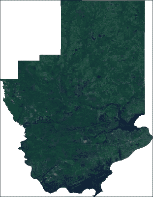

## 它是如何工作的...

GDAL 在 shapefile 边界外创建了一个无数据掩码。原始图像的尺寸保持不变，但你不再可视化它，处理算法将忽略无数据值。
