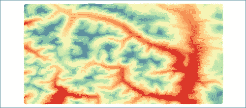
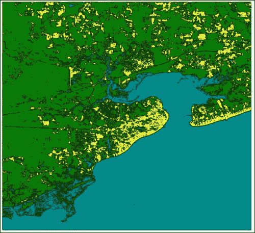
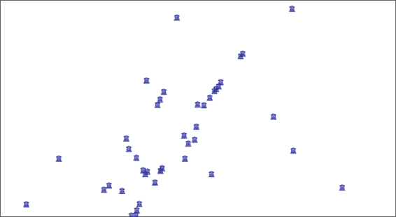
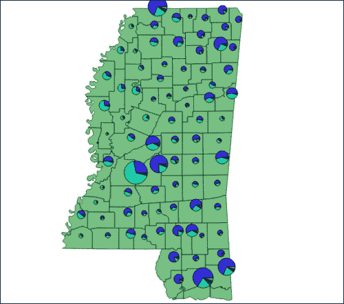
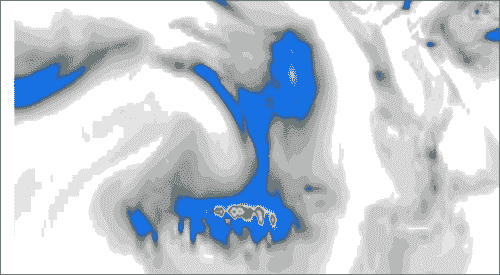
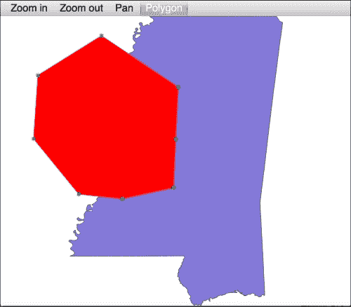
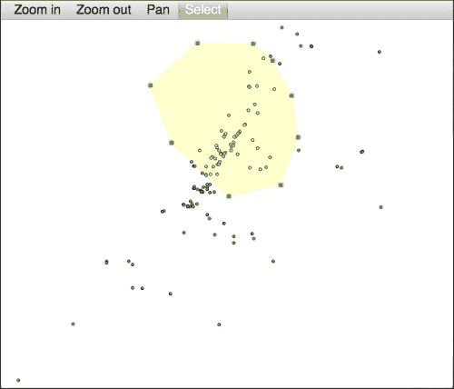

# 第五章：创建动态地图

在本章中，我们将介绍以下菜谱：

+   访问地图画布

+   更改地图单位

+   遍历图层

+   矢量图层符号化

+   使用颜色渐变算法渲染单波段栅格

+   创建复杂的矢量图层符号

+   使用图标作为矢量图层符号

+   创建渐变矢量图层符号

+   创建分类矢量图层符号

+   创建地图书签

+   导航到地图书签

+   设置图层的基于比例的可见性

+   使用 SVG 作为图层符号

+   使用饼图作为符号

+   使用 OpenStreetMap 服务

+   使用 Bing 航拍影像服务

+   从 OpenWeatherMap 添加实时天气数据

+   特征标注

+   更改地图图层透明度

+   将标准地图工具添加到画布上

+   使用地图工具在画布上绘制点

+   使用地图工具在画布上绘制多边形或线条

+   构建自定义选择工具

+   创建鼠标坐标跟踪工具

# 简介

在本章中，我们将使用 Python 编程创建动态地图，以控制 QGIS 地图画布的各个方面。我们将学习如何使用自定义符号、标签、地图书签，甚至实时数据。我们还将超越画布创建自定义地图工具。您将看到 Python 可以控制 QGIS 的各个方面，以编写您自己的应用程序。有时，PyQGIS API 可能不会直接支持您的应用程序目标，但几乎总是有办法使用 QGIS 完成您设定的目标。

# 访问地图画布

QGIS 中的地图通过地图画布进行控制。在本菜谱中，我们将访问画布，然后检查其属性之一以确保我们对对象有控制权。

## 准备工作

对于这个菜谱，您需要做的唯一事情是打开 QGIS 并从 **插件** 菜单中选择 **Python 控制台**。

## 如何操作...

我们将把地图画布分配给一个名为 `canvas` 的变量。然后，我们将检查画布的 `size` 属性以获取其像素大小。为此，请执行以下步骤：

1.  在 QGIS **Python 控制台**中输入以下行：

    ```py
    canvas = qgis.utils.iface.mapCanvas()

    ```

1.  现在，为了确保我们已经正确访问了画布，请使用以下代码行检查其像素大小：

    ```py
    canvas.size()

    ```

1.  验证 QGIS 是否返回一个包含画布像素大小的 `QSize` 对象，格式类似于以下内容：

    ```py
    PyQt4.QtCore.QSize(698, 138)

    ```

## 它是如何工作的...

QGIS 中的所有内容都集中在画布上。画布是 QGIS 界面或 iface API 的一部分。使用 QGIS 时你在屏幕上看到的所有内容都是通过 iface API 生成的。请注意，`iface` 对象仅对脚本和插件可用。当你构建独立应用程序时，你必须初始化自己的 `QgsMapCanvas` 对象。

# 更改地图单位

根据您的地图目的或您组织或国家的标准，更改地图单位或地图单位是一个非常常见的操作。在本菜谱中，我们将读取 QGIS 使用的地图单位，然后更改它们以适应您的项目。

## 准备工作

为此菜谱，您唯一需要的准备是打开 QGIS 并从**插件**菜单中选择**Python 控制台**。

## 如何操作...

在以下步骤中，我们将访问地图画布，检查地图单位类型，并将其更改为不同的设置。

1.  首先，按照以下方式访问地图画布：

    ```py
    canvas = iface.mapCanvas()

    ```

1.  现在，获取地图单位类型。默认情况下，它应该是数字**2**：

    ```py
    canvas.mapUnits()

    ```

1.  现在，让我们使用内置枚举器将地图单位设置为米：

    ```py
    canvas.setMapUnits(QGis.Meters)

    ```

## 它是如何工作的...

QGIS 有七个不同的地图单位，按以下顺序列出：

0 米

1 英尺

2 度

3 未知单位

4 十进制度

5 度分秒

6 十进制度分

7 海里

重要的是要注意，更改地图单位仅更改测量工具和状态栏显示的测量单位；它不会更改底层地图投影。如果您尝试在依赖于未投影数据的米投影数据上运行 Processing 工具箱中的操作，您将注意到这种差异。更改地图单位的最常见用例是根据用户的偏好在英制和公制单位之间切换。

# 遍历层

对于许多 GIS 操作，您需要遍历地图层以查找特定信息或对所有层应用更改。在这个菜谱中，我们将遍历层并获取它们的信息。

## 准备工作

我们需要两个具有相同地图投影的层来执行此菜谱。您可以从[`geospatialpython.googlecode.com/files/MSCities_Geo_Pts.zip`](https://geospatialpython.googlecode.com/files/MSCities_Geo_Pts.zip)下载第一个层作为 ZIP 文件。

您可以从[`geospatialpython.googlecode.com/files/Mississippi.zip`](https://geospatialpython.googlecode.com/files/Mississippi.zip)下载第二个压缩层。

将这两个层解压缩到您`qgis_data`目录下的名为`ms`的目录中。

## 如何操作...

我们将通过地图注册表将层添加到地图中。然后，我们将遍历地图层并打印每一层的标题。为此，执行以下步骤：

1.  首先，让我们使用 QGIS **Python 控制台**打开多边形和点层：

    ```py
    lyr_1 = QgsVectorLayer("/Users/joellawhead/qgis_data/ms/mississippi.shp", "Mississippi", "ogr")
    lyr_2 = QgsVectorLayer("/Users/joellawhead/qgis_data/ms/MSCities_Geo_Pts.shp", "Cities", "ogr")

    ```

1.  接下来，获取地图层注册实例：

    ```py
    registry = QgsMapLayerRegistry.instance()

    ```

1.  现在，将矢量层添加到地图中：

    ```py
    registry.addMapLayers([lyr_2, lyr_1])

    ```

1.  然后，我们将层作为迭代器检索：

    ```py
    layers = registry.mapLayers()

    ```

1.  最后，我们遍历层并打印标题：

    ```py
    for l in layers:
     printl.title()

    ```

1.  确认您可以在**Python 控制台**中读取层标题，格式类似于以下：

    ```py
    Cities20140904160234792
    Mississippi20140904160234635

    ```

## 它是如何工作的...

在 QGIS 中，层在您将它们添加到地图层注册表之前与地图画布独立。一旦创建，它们就有一个 ID。当添加到地图中时，它们成为画布的一部分，在那里它们获取标题、符号和许多其他属性。在这种情况下，您可以使用地图层注册表遍历它们并访问它们以更改它们的外观或添加和提取数据。

# 符号化矢量层

QGIS 地图上图层的外观由其符号控制。图层的符号包括渲染器和一个或多个符号。渲染器提供规则，以规定符号的外观。符号描述属性，包括颜色、形状、大小和线宽。在本食谱中，我们将加载一个矢量图层，更改其符号，并刷新地图。

## 准备工作

下载以下压缩的 shapefile 并将其提取到您的`qgis_data`目录中的`ms`文件夹中，从[`geospatialpython.googlecode.com/files/Mississippi.zip`](https://geospatialpython.googlecode.com/files/Mississippi.zip)。

## 如何操作...

我们将加载一个图层，将其添加到地图图层注册表中，更改图层的颜色，然后刷新地图。为此，执行以下步骤：

1.  首先，使用 QGIS **Python 控制台**，我们必须导入`QtGui`库，以便访问用于在 PyQGIS API 中描述颜色的`QColor`对象：

    ```py
    from PyQt4.QtGui import *

    ```

1.  然后，我们创建我们的矢量图层，如下所示：

    ```py
    lyr = QgsVectorLayer("/Users/joellawhead/qgis_data/ms/mississippi.shp", "Mississippi", "ogr")

    ```

1.  然后，我们将它添加到地图图层注册表中：

    ```py
    QgsMapLayerRegistry.instance().addMapLayer(lyr)

    ```

1.  现在，我们通过图层的渲染器对象访问图层的符号列表：

    ```py
    symbols = lyr.rendererV2().symbols()

    ```

1.  接下来，我们引用第一个符号，在这种情况下，这是唯一的符号：

    ```py
    sym = symbols[0]

    ```

1.  一旦我们有了符号，我们就可以设置其颜色：

    ```py
    sym.setColor(QColor.fromRgb(255,0,0))

    ```

1.  我们必须记住重新绘制图层以强制更新：

    ```py
    lyr.triggerRepaint()

    ```

## 它是如何工作的...

改变图层的颜色听起来很简单，但请记住，在 QGIS 中，您看到的任何内容都必须通过画布 API 进行更改。因此，我们将图层添加到地图中，并通过其渲染器访问图层的符号。地图画布被渲染为位图图像。渲染器负责将图层数据转换为位图图像，因此图层的表示信息与其渲染器一起存储。

# 使用颜色渐变算法渲染单波段栅格

颜色渐变允许您使用仅几种颜色来表示具有相似意义的单元格值的不同范围，以便将它们分组。本食谱中将使用的方法是渲染高程数据最常见的方式。

## 准备工作

您可以从[`geospatialpython.googlecode.com/files/dem.zip`](https://geospatialpython.googlecode.com/files/dem.zip)下载一个示例 DEM，您可以在`qgis_data`目录中的`rasters`目录中解压缩它。

## 如何操作...

在以下步骤中，我们将设置对象以着色栅格，创建一个建立颜色渐变范围的列表，将渐变应用于图层渲染器，并最终将图层添加到地图中。为此，我们需要执行以下步骤：

1.  首先，我们在 QGIS **Python 控制台**中导入用于颜色对象的`QtGui`库：

    ```py
    from PyQt4 import QtGui

    ```

1.  接下来，我们加载栅格图层，如下所示：

    ```py
    lyr = QgsRasterLayer("/Users/joellawhead/qgis_data/rasters/dem.asc", "DEM")

    ```

1.  现在，我们创建一个通用的栅格着色器对象：

    ```py
    s = QgsRasterShader()

    ```

1.  然后，我们实例化专门的渐变着色器对象：

    ```py
    c = QgsColorRampShader()

    ```

1.  我们必须为渐变着色器命名一个类型。在这种情况下，我们使用一个`INTERPOLATED`着色器：

    ```py
    c.setColorRampType(QgsColorRampShader.INTERPOLATED)

    ```

1.  现在，我们将创建我们的颜色渐变定义列表：

    ```py
    i = []

    ```

1.  然后，我们填充颜色渐变值列表，这些值对应于高程值范围：

    ```py
    i.append(QgsColorRampShader.ColorRampItem(400, QtGui.QColor('#d7191c'), '400'))
    i.append(QgsColorRampShader.ColorRampItem(900, QtGui.QColor('#fdae61'), '900'))
    i.append(QgsColorRampShader.ColorRampItem(1500, QtGui.QColor('#ffffbf'), '1500'))
    i.append(QgsColorRampShader.ColorRampItem(2000, QtGui.QColor('#abdda4'), '2000'))
    i.append(QgsColorRampShader.ColorRampItem(2500, QtGui.QColor('#2b83ba'), '2500'))

    ```

1.  现在，我们将颜色渐变分配给我们的着色器：

    ```py
    c.setColorRampItemList(i)

    ```

1.  现在，我们告诉通用栅格着色器使用颜色渐变：

    ```py
    s.setRasterShaderFunction(c)

    ```

1.  接下来，我们使用着色器创建一个栅格渲染器对象：

    ```py
    ps = QgsSingleBandPseudoColorRenderer(lyr.dataProvider(), 1,  s)

    ```

1.  我们将渲染器分配给栅格图层：

    ```py
    lyr.setRenderer(ps)

    ```

1.  最后，我们将图层添加到画布上以便查看：

    ```py
    QgsMapLayerRegistry.instance().addMapLayer(lyr)

    ```

## 它是如何工作的…

虽然创建颜色渐变需要四个对象，但这个菜谱展示了 PyQGIS API 的灵活性。通常，在 QGIS 中完成操作所需的对象越多，API 就越丰富，这为你提供了制作复杂地图的灵活性。

注意，在每一个`ColorRampItem`对象中，你指定一个起始高程值、颜色和作为字符串的标签。颜色渐变的范围在下一个项目之前的任何值结束。因此，在这种情况下，第一个颜色将被分配给值在 400 到 899 之间的单元格。以下截图显示了应用的颜色渐变。



# 创建复杂矢量图层符号

QGIS 符号化的真正力量在于其能够堆叠多个符号以创建单个复杂符号的能力。这种能力使得创建几乎任何你可以想象到的地图符号成为可能。在这个菜谱中，我们将合并两个符号以创建单个符号，并开始解锁复杂符号的潜力。

## 准备工作

对于这个菜谱，我们需要一个线形状文件，你可以从[`geospatialpython.googlecode.com/svn/paths.zip`](https://geospatialpython.googlecode.com/svn/paths.zip)下载并提取。

将此形状文件添加到`qgis_data`目录中名为`shapes`的目录。

## 如何做到这一点…

使用**QGISPythonConsole**，我们将通过在规则线符号上放置一系列短旋转线标记来创建一个经典的铁路线符号。为此，我们需要执行以下步骤：

1.  首先，我们加载我们的线形状文件：

    ```py
    lyr = QgsVectorLayer("/Users/joellawhead/qgis_data/shapes/paths.shp", "Route", "ogr")

    ```

1.  接下来，我们获取符号列表并引用默认符号：

    ```py
    symbolList = lyr.rendererV2().symbols()
    symbol = symbolList[0]

    ```

1.  然后，我们为符号层创建一个更短的变量名：

    ```py
    symLyrReg = QgsSymbolLayerV2Registry

    ```

1.  现在，我们使用 Python 字典设置简单线的样式：

    ```py
    lineStyle = {'width':'0.26', 'color':'0,0,0'}

    ```

1.  然后，我们为简单线创建一个抽象符号层：

    ```py
    symLyr1Meta = symLyrReg.instance().symbolLayerMetadata("SimpleLine")

    ```

1.  我们使用线样式属性从抽象层实例化一个符号层：

    ```py
    symLyr1 = symLyr1Meta.createSymbolLayer(lineStyle)

    ```

1.  现在，我们将符号层添加到层的符号中：

    ```py
    symbol.appendSymbolLayer(symLyr1)

    ```

1.  现在，为了在铁路上创建轨道，我们开始使用另一个 Python 字典构建一个标记线样式，如下所示：

    ```py
    markerStyle = {}
    markerStyle['width'] = '0.26'
    markerStyle['color'] = '0,0,0'
    markerStyle['interval'] = '3'
    markerStyle['interval_unit'] = 'MM'
    markerStyle['placement'] = 'interval'
    markerStyle['rotate'] = '1'

    ```

1.  然后，我们为第二个符号创建标记线抽象符号层：

    ```py
    symLyr2Meta = symLyrReg.instance().symbolLayerMetadata("MarkerLine")

    ```

1.  我们创建符号层，如下所示：

    ```py
    symLyr2 = symLyr2Meta.createSymbolLayer(markerStyle)

    ```

1.  现在，我们必须与定义标记线上的标记的子符号一起工作：

    ```py
    sybSym = symLyr2.subSymbol()

    ```

1.  我们必须删除默认的子符号：

    ```py
    sybSym.deleteSymbolLayer(0)

    ```

1.  现在，我们使用字典设置我们的轨道标记的样式：

    ```py
    railStyle = {'size':'2', 'color':'0,0,0', 'name':'line', 'angle':'0'}

    ```

1.  现在，我们重复构建符号层并将其添加到子符号的过程：

    ```py
    railMeta = symLyrReg.instance().symbolLayerMetadata("SimpleMarker")
    rail = railMeta.createSymbolLayer(railStyle) 
    sybSym.appendSymbolLayer(rail)

    ```

1.  然后，我们将子符号添加到第二个符号层：

    ```py
    symbol.appendSymbolLayer(symLyr2)

    ```

1.  最后，我们将图层添加到地图上：

    ```py
    QgsMapLayerRegistry.instance().addMapLayer(lyr)

    ```

## 它是如何工作的…

首先，我们必须创建一个简单的线符号。标记线本身将正确渲染，但底层的简单线将是一个随机选择的颜色。我们还必须更改标记线的子符号，因为默认的子符号是一个简单的圆圈。

# 使用图标作为矢量层符号

除了 QGIS 中可用的默认符号类型外，您还可以使用 TrueType 字体作为地图符号。TrueType 字体是可缩放矢量图形，可以用作点标记。在本例中，我们将创建此类符号。

## 准备工作

您可以从[`geospatialpython.googlecode.com/files/NYC_MUSEUMS_GEO.zip`](https://geospatialpython.googlecode.com/files/NYC_MUSEUMS_GEO.zip)下载本例中使用的点形状文件。

将其提取到您的`qgis_data`目录中名为`nyc`的文件夹中。

## 如何操作...

我们将加载一个点形状文件作为图层，然后使用一个名为`Webdings`的免费字体中的字符`G`，这个字体可能已经存在于您的系统中，在每个点渲染建筑图标。为此，我们需要执行以下步骤：

1.  首先，我们将定义点形状文件的路径：

    ```py
    src = "/qgis_data/nyc/NYC_MUSEUMS_GEO.shp"

    ```

1.  然后，我们将加载矢量层：

    ```py
    lyr = QgsVectorLayer(src, "Museums", "ogr")

    ```

1.  现在，我们将使用 Python 字典来定义字体属性：

    ```py
    fontStyle = {}
    fontStyle['color'] = '#000000'
    fontStyle['font'] = 'Webdings'
    fontStyle['chr'] = 'G'
    fontStyle['size'] = '6'

    ```

1.  现在，我们将创建一个字体符号层：

    ```py
    symLyr1 = QgsFontMarkerSymbolLayerV2.create(fontStyle)

    ```

1.  然后，我们将矢量层的默认符号层更改为我们的字体符号信息：

    ```py
    lyr.rendererV2().symbols()[0].changeSymbolLayer(0, symLyr1)

    ```

1.  最后，我们将图层添加到地图中：

    ```py
    QgsMapLayerRegistry.instance().addMapLayer(lyr)

    ```

## 它是如何工作的...

字体标记符号层只是另一种标记层；然而，与 QGIS 内置字体相比，矢量字体的可能性范围更广。许多行业使用自定义字体作为标记来定义标准地图符号。

# 创建渐变向量层符号渲染器

毕业向量层符号渲染器是栅格颜色渐变的矢量等价物。您可以将要素分组到相似的范围内，并使用有限的颜色集来视觉上识别这些范围。在本例中，我们将使用多边形形状文件渲染渐变符号。

## 准备工作

您可以从[`geospatialpython.googlecode.com/files/MS_UrbanAnC10.zip`](https://geospatialpython.googlecode.com/files/MS_UrbanAnC10.zip)下载包含一组城市区域多边形的形状文件。

将此文件提取到您的`qgis_data`目录中名为`ms`的目录中。

## 如何操作...

我们将使用渐变符号根据人口规模对每个城市区域进行分类，如下所示：

1.  首先，我们导入`QColor`对象来构建我们的颜色范围。

    ```py
    from PyQt4.QtGui import QColor

    ```

1.  接下来，我们将加载我们的多边形形状文件作为矢量层：

    ```py
    lyr = QgsVectorLayer("/qgis_data/ms/MS_UrbanAnC10.shp", "Urban Areas", "ogr")

    ```

1.  现在，我们构建一些嵌套的 Python 元组，定义符号的渐变。元组中的每个项目包含一个范围标签、范围起始值、范围结束值和颜色名称，如下所示：

    ```py
    population = (
    ("Village", 0.0, 3159.0, "cyan"), 
    ("Small town", 3160.0, 4388.0, "blue"),
    ("Town", 43889.0, 6105.0, "green"),
    ("City", 6106.0, 10481.0, "yellow"),
    ("Large City", 10482.0, 27165, "orange"),
    ("Metropolis", 27165.0, 1060061.0, "red"))

    ```

1.  然后，我们创建一个 Python 列表来保存我们的 QGIS 渲染器对象：

    ```py
    ranges = []

    ```

1.  接下来，我们将遍历我们的范围列表，构建 QGIS 符号，并将它们添加到渲染器列表中：

    ```py
    for label, lower, upper, color in population:
    sym = QgsSymbolV2.defaultSymbol(lyr.geometryType())
    sym.setColor(QColor(color))
    rng = QgsRendererRangeV2(lower, upper, sym, label)
    ranges.append(rng)

    ```

1.  现在，引用包含形状文件属性中人口值的字段名称：

    ```py
    field = "POP"

    ```

1.  然后，我们创建渲染器：

    ```py
    renderer = QgsGraduatedSymbolRendererV2(field, ranges)

    ```

1.  我们将渲染器分配给图层：

    ```py
    lyr.setRendererV2(renderer)

    ```

1.  最后，我们将地图添加到图层：

    ```py
    QgsMapLayerRegistry.instance().addMapLayer(lyr)

    ```

## 如何工作...

使用渐变符号为矢量图层的方法与栅格图层中的颜色渐变着色器非常相似。你可以通过扩展用于构建范围的 Python 元组来拥有你想要的任意多个范围。当然，你也可以通过首先以编程方式检查数据字段，然后以相等间隔或其他方案划分值来构建自己的算法。

# 创建分类矢量图层符号

分类矢量图层符号允许你为独特特征创建具有颜色和标签的不同类别。这种方法通常用于具有有限独特类型特征的集合。在这个食谱中，我们将矢量图层分类为三个不同的类别。

## 准备工作

对于这个食谱，我们将使用一个土地利用 shapefile，你可以从[`geospatialpython.googlecode.com/svn/landuse_shp.zip`](https://geospatialpython.googlecode.com/svn/landuse_shp.zip)下载。

将其提取到你的`qgis_data`目录中名为`hancock`的目录。

## 如何做到这一点...

我们将加载矢量图层，创建三个土地利用类别，并将它们渲染为分类符号。为此，我们需要执行以下步骤：

1.  首先，我们需要导入`QColor`对象以用于我们的分类颜色：

    ```py
    from PyQt4.QtGui import QColor

    ```

1.  然后，我们加载矢量图层：

    ```py
    lyr = QgsVectorLayer("Users/joellawhead/qgis_data/hancock/landuse.shp", "Land Use", "ogr")

    ```

1.  接下来，我们将使用 Python 字典创建我们的三个土地利用分类，其中字段值作为键，颜色名称和标签：

    ```py
    landuse = {
     "0":("yellow", "Developed"),
     "1":("darkcyan", "Water"),
     "2":("green", "Land")}

    ```

1.  现在，我们可以构建我们的分类渲染项：

    ```py
    categories = []
    for terrain, (color, label) in landuse.items():
     sym = QgsSymbolV2.defaultSymbol(lyr.geometryType())
     sym.setColor(QColor(color))
     category = QgsRendererCategoryV2(terrain, sym, label)
     categories.append(category)

    ```

1.  我们命名包含土地利用值的字段：

    ```py
    field = "DN"

    ```

1.  接下来，我们构建渲染器：

    ```py
    renderer = QgsCategorizedSymbolRendererV2(field, categories)

    ```

1.  我们将渲染器添加到图层：

    ```py
    lyr.setRendererV2(renderer)

    ```

1.  最后，我们将分类图层添加到地图：

    ```py
    QgsMapLayerRegistry.instance().addMapLayer(lyr)

    ```

## 如何工作...

QGIS 中各种渲染器类型的配置只有细微差别。通过首先使用原生 Python 对象定义渲染器的属性来设置它们，可以使你的代码更容易阅读和管理。以下地图图像展示了本食谱中的分类符号：



# 创建地图书签

地图书签允许你在 QGIS 中保存地图上的位置，这样你可以快速跳转到需要重复查看的点，而无需手动平移和缩放地图。PyQGIS 不包含用于读取、写入和缩放到书签的 API 命令。幸运的是，QGIS 将书签存储在 SQLite 数据库中。Python 有一个内置的 SQLite 库，我们可以使用数据库 API 来操作书签。

## 准备工作

你可以从[`geospatialpython.googlecode.com/files/GIS_CensusTract.zip`](https://geospatialpython.googlecode.com/files/GIS_CensusTract.zip)下载一个人口普查区多边形 shapefile，用于与这个食谱一起使用。

将其提取到你的`qgis_data`目录中。我们将创建一个使用此 shapefile 中感兴趣区域的书签，这样你可以手动加载书签以进行测试。

## 如何操作...

我们将访问 QGIS 配置变量以获取用户数据库的路径，该数据库存储书签。然后，我们将连接到这个数据库并执行一个插入书签的 SQL 查询。最后，我们将更改提交到数据库，如下所示：

1.  首先，使用 QGIS 的**Python 控制台**，我们必须导入 Python 的内置 SQLite 库：

    ```py
    import sqlite3

    ```

1.  接下来，获取数据库的路径：

    ```py
    dbPath = QgsApplication.qgisUserDbFilePath()

    ```

1.  现在，我们连接到数据库：

    ```py
    db = sqlite3.connect(dbPath)

    ```

1.  然后，我们需要一个数据库游标来操作数据库：

    ```py
    cursor = db.cursor()

    ```

1.  现在，我们可以执行 SQL 查询，它是一个字符串。在查询的`VALUES`部分，我们将书签 ID 留为`NULL`但给它一个名称，然后我们将项目名称留为`NULL`并设置范围，如下所示：

    ```py
    cursor.execute("""INSERT INTO tbl_bookmarks(
     bookmark_id, name, project_name,
     xmin, ymin, xmax, ymax, 
     projection_srid)
     VALUES(NULL, "BSL", NULL,
     -89.51715550010032,
     30.233838337125075,
     -89.27257255649518,
     30.381717490617945,
     4269)""")

    ```

1.  然后，我们提交更改：

    ```py
    db.commit()

    ```

1.  为了测试地图书签，通过从您的文件系统拖放到 QGIS 中，将人口普查区层加载到地图上。

1.  接下来，在 QGIS 中点击**视图**菜单并选择**显示书签**。

1.  然后，选择**BSL 书签**并点击**ZoomTo**按钮。

1.  验证地图是否已捕捉到接近多边形的感兴趣区域，其 OBJECTID 从 4625 到 4627。

## 它是如何工作的...

即使 QGIS 没有提供高级 API，您几乎总是可以使用 Python 深入挖掘并访问您想要的信息。QGIS 建立在开源软件之上，因此程序中的任何部分都不是真正受限的。

# 导航到地图书签

地图书签在地图上存储重要位置，因此您可以快速找到它们。您可以使用 Python 的`sqlite3`库编程导航到书签，以便访问 QGIS 用户数据库中的书签数据库表，然后使用 PyQGIS 画布 API。

## 准备工作

我们将使用人口普查区层来测试书签导航。您可以从[`geospatialpython.googlecode.com/files/GIS_CensusTract.zip`](https://geospatialpython.googlecode.com/files/GIS_CensusTract.zip)下载压缩的 shapefile。

在从 ZIP 文件中提取后，手动将此层加载到 QGIS 中。同时，请确保您已完成了之前的配方，*创建地图书签*。您将需要一个名为 BSL 的书签来定位此 shapefile 中的感兴趣区域。

## 如何操作...

我们将从 QGIS 用户数据库中检索一个书签，并将地图的范围设置为这个书签。为此，执行以下步骤：

1.  首先，导入 Python 的`sqlite3`库：

    ```py
    import sqlite3

    ```

1.  接下来，从 QGIS 数据中获取用户数据库的位置：

    ```py
    dbPath = QgsApplication.qgisUserDbFilePath()

    ```

1.  现在，我们连接到数据库：

    ```py
    db = sqlite3.connect(dbPath)

    ```

1.  然后，我们需要一个数据库游标来运行查询：

    ```py
    cursor = db.cursor()

    ```

1.  现在，我们可以获取名为**BSL**的书签信息：

    ```py
    cursor.execute("""SELECT * FROM tbl_bookmarks WHERE name='BSL'""")

    ```

1.  现在，我们将从查询中获取完整的结果：

    ```py
    row = cursor.fetchone()

    ```

1.  然后，我们将结果值拆分为多个变量：

    ```py
    id,mark_name,project,xmin,ymin,xmax,ymax,srid = row

    ```

1.  现在，我们可以使用书签来创建一个 QGIS 范围矩形：

    ```py
    rect = QgsRectangle(xmin, ymin, xmax, ymax)

    ```

1.  接下来，我们引用地图画布：

    ```py
    canvas = qgis.utils.iface.mapCanvas()

    ```

1.  最后，我们将画布的范围设置为矩形并刷新画布：

    ```py
    canvas.setExtent(rect)
    canvas.refresh()

    ```

## 它是如何工作的...

使用 SQLite 读取和写入书签非常简单，尽管它不是 PyQGIS 主 API 的一部分。请注意，书签有一个用于项目名称的占位符，您可以使用它根据需要按项目过滤书签。

# 为图层设置基于比例的可见性

有时，GIS 图层只有在特定比例下显示时才有意义，例如，复杂的道路网络。PyQGIS 支持基于比例的可见性，可以编程设置图层显示的比例范围。在本菜谱中，我们将研究基于比例的图层。

## 准备工作

您需要从[`geospatialpython.googlecode.com/files/GIS_CensusTract.zip`](https://geospatialpython.googlecode.com/files/GIS_CensusTract.zip)提供的 ZIP 文件中获取样本人口普查区形状文件。

将压缩层提取到您的`qgis_data`目录下名为`census`的目录中。

## 如何做到...

我们将加载矢量层，切换基于比例的可见性，设置可见范围，然后将图层添加到地图中。为此，请执行以下步骤：

1.  首先，我们加载图层：

    ```py
    lyr = QgsVectorLayer("/Users/joellawhead/qgis_data/census/GIS_CensusTract_poly.shp", "Census", "ogr")

    ```

1.  接下来，我们切换基于比例的可见性：

    ```py
    lyr.toggleScaleBasedVisibility(True)

    ```

1.  然后，我们设置图层可见的最小和最大地图比例：

    ```py
    lyr.setMinimumScale(22945.0)
    lyr.setMaximumScale(1000000.0)

    ```

1.  现在，我们将图层添加到地图中：

    ```py
    QgsMapLayerRegistry.instance().addMapLayer(lyr)

    ```

1.  最后，手动放大和缩小地图以确保图层在适当的比例下消失和重新出现。

## 它是如何工作的...

地图比例是地图单位与物理地图大小的比率，以浮点数表示。您必须记住切换基于比例的可见性，以便 QGIS 知道每次地图比例变化时都需要检查范围。

# 使用 SVG 作为图层符号

**可缩放矢量图形**（**SVG**）是一个 XML 标准，它定义了可以按任何分辨率缩放的矢量图形。QGIS 可以使用 SVG 文件作为点的标记。在本菜谱中，我们将使用 Python 将 QGIS 附带的一个 SVG 符号应用到点图层上。

## 准备工作

对于这个菜谱，从[`geospatialpython.googlecode.com/files/NYC_MUSEUMS_GEO.zip`](https://geospatialpython.googlecode.com/files/NYC_MUSEUMS_GEO.zip)下载以下压缩的点形状文件图层。

将其提取到您的`qgis_data`目录中。

## 如何做到...

在以下步骤中，我们将加载矢量层，构建符号层和渲染器，并将其添加到图层中，如下所示：

1.  首先，我们将定义形状文件的路径：

    ```py
    src = "/Users/joellawhead/qgis_data/NYC_MUSEUMS_GEO/NYC_MUSEUMS_GEO.shp"

    ```

1.  接下来，我们将加载图层：

    ```py
    lyr = QgsVectorLayer(src, "Museums", "ogr")

    ```

1.  现在，我们定义符号的属性，包括将 SVG 文件位置作为 Python 字典：

    ```py
    svgStyle = {}
    svgStyle['fill'] = '#0000ff'
    svgStyle['name'] = 'landmark/tourism=museum.svg'
    svgStyle['outline'] = '#000000'
    svgStyle['outline-width'] = '6.8'
    svgStyle['size'] = '6'

    ```

1.  然后，我们创建一个 SVG 符号层：

    ```py
    symLyr1 = QgsSvgMarkerSymbolLayerV2.create(svgStyle)

    ```

1.  现在，我们更改图层渲染器的默认符号层：

    ```py
    lyr.rendererV2().symbols()[0].changeSymbolLayer(0, symLyr1)

    ```

1.  最后，我们将图层添加到地图中以查看 SVG 符号：

    ```py
    QgsMapLayerRegistry.instance().addMapLayer(lyr)

    ```

## 它是如何工作的...

默认 SVG 图层存储在 QGIS 应用程序目录中。有许多图形可用于许多常见用途。您也可以添加自己的图形。以下地图图像显示了菜谱的输出：



# 使用饼图作为符号

QGIS 具有使用动态饼图作为符号描述给定区域统计信息的能力。在这个配方中，我们将使用 QGIS 中的多边形图层上的饼图符号。

## 准备工作

对于这个配方，请从[`geospatialpython.googlecode.com/svn/County10PopnHou.zip`](https://geospatialpython.googlecode.com/svn/County10PopnHou.zip)下载以下压缩的 shapefile 并将其提取到`qgis_data`目录中名为`ms`的目录中。

## 如何做...

与其他渲染器一样，我们将构建一个符号图层，将其添加到渲染器中，并在地图上显示该图层。饼图图示渲染器比其他渲染器更复杂，但具有更多选项。按照以下步骤创建饼图地图：

1.  首先，我们导入 PyQt GUI 库：

    ```py
    from PyQt4.QtGui import *

    ```

1.  然后，我们加载图层：

    ```py
    lyr = QgsVectorLayer("/Users/joellawhead/qgis_data/ms/County10PopnHou.shp", "Population", "ogr")

    ```

1.  接下来，我们根据属性名称设置类别：

    ```py
    categories = [u'PCT_WHT', u'PCT_BLK', u'PCT_AMIND', u'PCT_ASIAN', u'PCT_HAW', u'PCT_ORA', u'PCT_MR', u'PCT_HISP']

    ```

1.  现在，我们为每个类别设置一个相应的颜色列表：

    ```py
    colors = ['#3727fa','#01daae','#f849a6','#268605','#6810ff','#453990','#630f2f','#07dd45']

    ```

1.  接下来，我们将十六进制颜色值转换为`QColor`对象：

    ```py
    qcolors = []
    for c in colors:
     qcolors.append(QColor(c))

    ```

1.  现在，我们引用地图画布：

    ```py
    canvas = iface.mapCanvas()

    ```

1.  然后，我们创建一个饼图对象：

    ```py
    diagram = QgsPieDiagram()

    ```

1.  然后，我们创建一个图示设置对象：

    ```py
    ds = QgsDiagramSettings()

    ```

1.  现在，我们定义所有将用于渲染器的图示设置：

    ```py
    ds.font = QFont("Helvetica", 12)
    ds.transparency = 0
    ds.categoryColors = qcolors
    ds.categoryAttributes = categories
    ds.size = QSizeF(100.0, 100.0)
    ds.sizeType = 0 
    ds.labelPlacementMethod = 1 
    ds.scaleByArea = True 
    ds.minimumSize = 0 
    ds.BackgroundColor = QColor(255,255,255,0)
    ds.PenColor = QColor("black") 
    ds.penWidth = 0

    ```

1.  现在，我们可以创建我们的图示渲染器：

    ```py
    dr = QgsLinearlyInterpolatedDiagramRenderer()

    ```

1.  我们必须为我们的图示设置一些尺寸参数：

    ```py
    dr.setLowerValue(0.0)
    dr.setLowerSize(QSizeF(0.0, 0.0))
    dr.setUpperValue(2000000)
    dr.setUpperSize(QSizeF(40,40))
    dr.setClassificationAttribute(6)

    ```

1.  然后，我们可以将我们的图示添加到渲染器中：

    ```py
    dr.setDiagram(diagram)

    ```

1.  接下来，我们将渲染器添加到图层中：

    ```py
    lyr.setDiagramRenderer(dr)

    ```

1.  现在，我们在图层级别应用一些额外的放置设置：

    ```py
    dls = QgsDiagramLayerSettings() 
    dls.dist = 0
    dls.priority = 0
    dls.xPosColumn = -1 
    dls.yPosColumn = -1
    dls.placement = 0 
    lyr.setDiagramLayerSettings(dls)

    ```

1.  在 QGIS 2.6 中，图示渲染器与新的 PAL 标签引擎绑定，因此我们需要激活此引擎：

    ```py
    label = QgsPalLayerSettings() 
    label.readFromLayer(lyr) 
    label.enabled = True 
    label.writeToLayer(lyr)

    ```

1.  接下来，我们删除任何已渲染的缓存图像并强制图层重新绘制：

    ```py
    if hasattr(lyr, "setCacheImage"):
     lyr.setCacheImage(None)

    lyr.triggerRepaint()

    ```

1.  最后，我们将我们的图示图层添加到地图中：

    ```py
    QgsMapLayerRegistry.instance().addMapLayer(lyr)

    ```

## 如何工作...

饼图图示的基本符号简单易懂，其工作方式与其他类型的符号和渲染器类似。然而，当我们需要在三个不同级别应用设置时——图示级别、渲染级别和图层级别——事情就会变得有些复杂。实际上，它们相当复杂。大多数设置都没有很好地记录，如果有的话。幸运的是，大多数设置都是自我解释的。以下截图显示了完成的饼图图示地图示例：



## 还有更多...

要了解饼图图示符号的更多可能性，您可以在 Script Runner 插件中尝试此配方，在那里您可以更改或删除设置，并快速重新渲染地图。您还可以使用 QGIS 对话框手动更改设置，然后将样式导出为 XML 文件，查看使用了哪些设置。它们中的大多数都很好地映射到 Python API。

# 使用 OpenStreetMap 服务

云技术正越来越多地将数据移动到互联网上，GIS 也不例外。QGIS 可以使用 Open GIS Consortium 标准加载基于 Web 的数据，例如**Web Map Service (WMS)**。添加 WMS 图层最简单的方法是使用**地理空间数据抽象库 (GDAL**)及其虚拟文件系统功能来加载瓦片图层。

## 准备工作

除了在 QGIS 中打开 Python 控制台插件之外，您不需要为此菜谱做任何准备。

## 如何操作...

我们将创建一个描述我们想要导入的 OpenStreetMap 瓦片网络服务的 XML 模板。然后，我们将将其转换为 GDAL 虚拟文件，并在 QGIS 中将其加载为栅格图层。为此，我们需要执行以下步骤：

1.  首先，我们导入 GDAL 库：

    ```py
    from osgeo import gdal

    ```

1.  接下来，我们将创建我们的 XML 模板，描述我们想要导入的 OpenStreetMap 瓦片网络服务：

    ```py
    xml = """<GDAL_WMS>
    <Service name="TMS">
    <ServerUrl>http://tile.openstreetmap.org/${z}/${x}/${y}.png</ServerUrl>
    </Service>
    <DataWindow>
    <UpperLeftX>-20037508.34</UpperLeftX>
    <UpperLeftY>20037508.34</UpperLeftY>
    <LowerRightX>20037508.34</LowerRightX>
    <LowerRightY>-20037508.34</LowerRightY>
    <TileLevel>18</TileLevel>
    <TileCountX>1</TileCountX>
    <TileCountY>1</TileCountY>
    <YOrigin>top</YOrigin>
    </DataWindow>
    <Projection>EPSG:900913</Projection>
    <BlockSizeX>256</BlockSizeX>
    <BlockSizeY>256</BlockSizeY>
    <BandsCount>3</BandsCount>
    <Cache />
    </GDAL_WMS>"""
    ```

1.  现在，我们将为我们的 GDAL 虚拟文件系统文件创建路径：

    ```py
    vfn = "/vsimem/osm.xml"

    ```

1.  接下来，我们使用 GDAL 通过路径和 XML 文档创建虚拟文件：

    ```py
    gdal.FileFromMemBuffer(vfn, xml)

    ```

1.  现在，我们可以从虚拟文件创建一个栅格图层：

    ```py
    rasterLyr = QgsRasterLayer(vfn, "OSM")

    ```

1.  在我们将图层添加到地图之前，我们将确保其有效性：

    ```py
    rasterLyr.isValid()

    ```

1.  最后，将图层添加到地图中：

    ```py
    QgsMapLayerRegistry.instance().addMapLayers([rasterLyr])

    ```

## 它是如何工作的...

虽然有其他方法可以将如 OpenStreetMap 之类的瓦片地图服务以编程方式加载到 QGIS 中，但 GDAL 是最稳健的方法。前缀 `vsimem` 告诉 GDAL 使用虚拟文件来管理瓦片。这种方法让您免于直接在磁盘上管理下载的瓦片，并让您专注于应用程序的功能。

# 使用 Bing 空中影像服务

虽然有许多服务提供街道地图瓦片，但提供影像服务的服务却少得多。对于地图和更重要的是影像，Microsoft 的 Bing 地图服务是一个出色的免费服务。我们可以使用 GDAL 的 WMS 功能结合虚拟文件在 QGIS 中以编程方式访问 Bing 影像。

## 准备工作

除了在 QGIS 中打开 Python 控制台插件之外，您不需要为此菜谱做任何准备。

## 如何操作...

与之前用于 *使用 OpenStreetMap 服务* 的方法类似，我们将创建一个字符串形式的 XML 文件来描述服务，将其转换为 GDAL 虚拟文件，并在 QGIS 中将其加载为栅格。为此，我们需要执行以下步骤：

1.  首先，我们导入 GDAL 库：

    ```py
    from osgeo import gdal

    ```

1.  接下来，我们创建 XML 文件，将 Bing 服务描述为一个字符串：

    ```py
    xml = """<GDAL_WMS>
      <Service name="VirtualEarth">
        <ServerUrl>
          http://a${server_num}.ortho.tiles.virtualearth.net/tiles/a${quadkey}.jpeg?g=90
        </ServerUrl>
      </Service>
      <MaxConnections>4</MaxConnections>
      <Cache/>
    </GDAL_WMS>"""
    ```

1.  现在，我们为 XML 文件创建虚拟文件路径：

    ```py
    vfn = "/vsimem/bing.xml"

    ```

1.  然后，我们将 XML 文件转换为 GDAL 虚拟文件：

    ```py
    gdal.FileFromMemBuffer(vfn, xml)

    ```

1.  现在，我们可以将文件作为 QGIS 栅格图层添加，并检查其有效性：

    ```py
    rasterLyr = QgsRasterLayer(vfn, "BING")
    rasterLyr.isValid()

    ```

1.  最后，我们将图层添加到地图中：

    ```py
    QgsMapLayerRegistry.instance().addMapLayers([rasterLyr])

    ```

## 它是如何工作的...

GDAL 为各种地图服务提供了驱动程序。Bing 的服务名称为 `VirtualEarth`。服务器 URL 中的 `${}` 子句提供了占位符，当 GDAL 下载样式时，这些占位符将被实例特定的数据替换。在使用这些数据时，您应该意识到它们有版权限制。请务必在线阅读 Bing 使用协议。

# 添加来自 OpenWeatherMap 的实时天气数据

实时数据是您可以添加到现代地图中最激动人心的数据类型之一。大多数数据生产者通过 **Open GIS Consortium** 标准提供数据。一个这样的例子是 OpenWeatherMap，它提供不同实时天气数据层的 OGC **Web Map Service (WMS**)。在本食谱中，我们将访问此服务以访问实时天气数据层。

## 准备工作

为了准备这个食谱，您只需通过点击 **插件** 菜单并选择 **Python 控制台** 来打开 QGIS **Python 控制台**。

## 如何操作...

我们将按照以下方式将降水 WMS 数据层添加到 QGIS 地图中：

1.  首先，我们指定 `service` 的参数：

    ```py
    service = 'crs=EPSG:900913&dpiMode=7&featureCount=10&format=image/png&layers=precipitation&styles=&url=http://wms.openweathermap.org/service'

    ```

1.  接下来，我们创建栅格图层，指定 `wms` 作为类型：

    ```py
    rlayer = QgsRasterLayer(service, "precip", "wms")

    ```

1.  最后，我们将降水层添加到地图中：

    ```py
    QgsMapLayerRegistry.instance().addMapLayers([rlayer])

    ```

## 工作原理...

WMS 请求通常是一个带有所有参数作为 URL 部分的 HTTP `GET` 请求。在 PyQGIS 中，您使用 URL 编码格式，并从 URL 中单独指定参数。

以下地图图像显示了 QGIS 中降水层的输出：



# 标记要素

一旦您的地图图层被样式化，创建完整地图的下一步就是标记要素。在本食谱中，我们将探讨标记的基础知识。

## 准备工作

从 [`geospatialpython.googlecode.com/files/MSCities_Geo_Pts.zip`](https://geospatialpython.googlecode.com/files/MSCities_Geo_Pts.zip) 下载以下压缩的 shapefile。

将 shapefile 提取到名为 `ms` 的目录中，该目录位于您的 `qgis_data` shapefile 目录下。

## 如何操作...

我们将加载点 shapefile 图层，创建一个标签对象，设置其属性，将其应用于图层，然后将图层添加到地图中。为此，我们需要执行以下步骤：

1.  首先，为了节省空间，我们将指定 shapefile 的路径：

    ```py
    src = "/Users/joellawhead/qgis_data/ms/MSCities_Geo_Pts.shp"

    ```

1.  接下来，我们将加载图层：

    ```py
    lyr = QgsVectorLayer(src, "Museums", "ogr")

    ```

1.  然后，我们将创建标记对象：

    ```py
    label = QgsPalLayerSettings()

    ```

1.  现在，我们将配置标签，从正在读取的当前图层设置开始：

    ```py
    label.readFromLayer(lyr)
    label.enabled = True

    ```

1.  然后，我们指定标签数据的属性：

    ```py
    label.fieldName = 'NAME10' 

    ```

1.  然后，我们可以设置放置和大小选项：

    ```py
    label.placement= QgsPalLayerSettings.AroundPoint
    label.setDataDefinedProperty(QgsPalLayerSettings.Size,True,True,'8','')

    ```

1.  接下来，我们将更改提交到图层：

    ```py
    label.writeToLayer(lyr)

    ```

1.  最后，我们可以将图层添加到地图中以查看标签：

    ```py
    QgsMapLayerRegistry.instance().addMapLayers([lyr])

    ```

## 工作原理...

标记的一个有趣部分是往返读取和写入过程，用于访问图层数据和分配标记属性。标记可能相当复杂，但本食谱涵盖了开始所需的基本知识。

# 改变地图图层透明度

地图图层透明度允许您更改图层的透明度，以便在一定程度上可以看到其后的项目。一种常见的技术是将矢量图层多边形部分透明，以便允许底层图像或高程数据为数据添加纹理。

## 准备工作

在名为 `ms` 的目录中，在您的 `qgis_data` 目录下，从以下位置下载并提取以下 shapefile：

[`geospatialpython.googlecode.com/files/Mississippi.zip`](https://geospatialpython.googlecode.com/files/Mississippi.zip)。

## 如何操作...

这个过程极其简单。透明度只是一个方法：

1.  首先，我们加载 shapefile 图层：

    ```py
    lyr = QgsVectorLayer("/Users/joellawhead/qgis_data/ms/mississippi.shp", "Mississippi", "ogr")

    ```

1.  接下来，我们将图层的透明度设置为 `50` 百分比：

    ```py
    lyr.setLayerTransparency(50)

    ```

1.  最后，我们将此图层添加到地图上：

    ```py
    QgsMapLayerRegistry.instance().addMapLayer(lyr)

    ```

## 它是如何工作的...

如果您将透明度设置为 100%，则图层完全不透明。如果设置为 `0`，则图层完全不可见。

# 将标准地图工具添加到画布

在这个菜谱中，您将学习如何将标准地图导航工具添加到独立的地图画布。创建最简单的交互式应用程序提供了一个框架，以开始使用 QGIS 作为库来构建专业地理空间应用程序。

## 准备工作

下载以下压缩的 shapefile 并将其提取到您的 `qgis_data` 目录中的 `ms` 文件夹中，从 [`geospatialpython.googlecode.com/files/Mississippi.zip`](https://geospatialpython.googlecode.com/files/Mississippi.zip)。

## 如何操作...

我们将逐步介绍创建地图画布、向其添加图层以及添加缩放和平移地图的工具所需的步骤，如下所示：

1.  首先，因为我们是在 QGIS Python 解释器外部工作，所以我们需要导入一些 QGIS 和 Qt 库：

    ```py
    from qgis.gui import *
    from qgis.core import *
    from PyQt4.QtGui import *
    from PyQt4.QtCore import SIGNAL, Qt
    import sys, os

    ```

1.  然后，我们必须设置主 QGIS 应用程序目录的位置。此设置取决于平台：

    ```py
    # OSX:
    QgsApplication.setPrefixPath("/Applications/QGIS.app/Contents/MacOS/", True)
    # Windows:
    # app.setPrefixPath("C:/Program Files/QGIS Valmiera/apps/qgis", True)

    ```

1.  接下来，我们开始初始化类：

    ```py
    class MyWnd(QMainWindow):
     def __init__(self):

    ```

1.  现在，我们可以初始化应用程序并创建地图画布：

    ```py
    QMainWindow.__init__(self)
    QgsApplication.setPrefixPath("/Applications/QGIS.app/Contents/MacOS/", True)
    QgsApplication.initQgis()
    self.canvas = QgsMapCanvas()
    self.canvas.setCanvasColor(Qt.white)

    ```

1.  然后，我们可以加载 shapefile 图层并将其添加到画布上：

    ```py
    self.lyr = QgsVectorLayer("/Users/joellawhead/qgis_data/ms/mississippi.shp", "Mississippi", "ogr")
    QgsMapLayerRegistry.instance().addMapLayer(self.lyr)
    self.canvas.setExtent(self.lyr.extent())
    self.canvas.setLayerSet([QgsMapCanvasLayer(self.lyr)])
    self.setCentralWidget(self.canvas)

    ```

1.  接下来，我们定义将在工具栏上可见的按钮：

    ```py
    actionZoomIn = QAction("Zoom in", self)
    actionZoomOut = QAction("Zoom out", self)
    actionPan = QAction("Pan", self)
    actionZoomIn.setCheckable(True)
    actionZoomOut.setCheckable(True)
    actionPan.setCheckable(True)

    ```

1.  现在，我们将按钮点击时创建的信号连接到提供每个工具功能的 Python 方法：

    ```py
    actionZoomIn.triggered.connect(self.zoomIn)
    actionZoomOut.triggered.connect(self.zoomOut)
    actionPan.triggered.connect(self.pan)

    ```

1.  接下来，我们创建工具栏并添加按钮：

    ```py
    self.toolbar = self.addToolBar("Canvas actions")
    (actionZoomIn)
    self.toolbar.addAction(actionZoomOut)
    self.toolbar.addAction(actionPan)

    ```

1.  然后，我们将按钮连接到应用程序的状态：

    ```py
    self.toolPan = QgsMapToolPan(self.canvas)
    self.toolPan.setAction(actionPan)
    self.toolZoomIn = QgsMapToolZoom(self.canvas, False) # false = in
    self.toolZoomIn.setAction(actionZoomIn)
    self.toolZoomOut = QgsMapToolZoom(self.canvas, True) # true = out
    self.toolZoomOut.setAction(actionZoomOut)

    ```

1.  然后，我们定义当应用程序加载时将选择的按钮：

    ```py
    self.pan()

    ```

1.  现在，我们定义控制应用程序行为的每个工具的 Python 方法：

    ```py
    defzoomIn(self):
    self.canvas.setMapTool(self.toolZoomIn)
    defzoomOut(self):
    self.canvas.setMapTool(self.toolZoomOut)
    def pan(self):
    self.canvas.setMapTool(self.toolPan)

    ```

1.  然后，我们创建一个使用我们的应用程序窗口类的 Qt 应用程序：

    ```py
    class MainApp(QApplication):
    def __init__(self):
    QApplication.__init__(self,[],True)
    wdg = MyWnd()
    wdg.show()
    self.exec_()

    ```

1.  最后，我们进入程序的主循环：

    ```py
    if __name__ == "__main__":
    import sys
    app = MainApp()

    ```

## 它是如何工作的...

应用程序是一个持续运行的程序循环，只有当我们退出应用程序时才会结束。QGIS 基于 Qt 窗口库，因此我们的应用程序类继承自提供画布以及创建工具栏和对话框的主要窗口类。即使是对于极其简单的应用程序，这也有很多设置，但一旦应用程序的框架完成，扩展它就变得容易得多。

# 使用地图工具在画布上绘制点

QGIS 包含了在自定义应用程序中缩放和平移地图的内置功能。它还包含了构建您自己的交互式工具的基本钩子。在这个菜谱中，我们将创建一个交互式点工具，允许您通过点击点在地图上标记位置。

## 准备工作

我们将使用来自上一节“将标准地图工具添加到画布”的应用程序框架，因此首先完成该食谱。我们将通过添加新工具来扩展该应用程序。该应用程序的完整版本可在本书提供的代码示例中找到。

## 如何操作...

我们将设置按钮、信号触发和动作，就像我们处理所有地图工具一样。然而，因为我们正在构建一个新工具，我们必须定义一个类来精确地定义工具的功能。为此，我们需要执行以下操作：

1.  首先，我们在应用程序的动作部分定义我们的点工具按钮。将此行放置在`QAction("Pan")`方法之后：

    ```py
    actionPoint = QAction("Point", self)

    ```

1.  在下一节中，我们确保点击按钮后它保持选中状态：

    ```py
    actionPoint.setCheckable(True)

    ```

1.  在下一节中，我们定义当按钮被触发时使用的方法：

    ```py
    self.connect(actionPoint, SIGNAL("triggered()"), self.point)

    ```

1.  现在，我们将按钮添加到工具栏中，与其他按钮一起：

    ```py
    self.toolbar.addAction(actionPoint)

    ```

1.  然后，我们将应用程序链接到我们的专用工具类：

    ```py
    self.toolPoint = PointMapTool(self.canvas)
    self.toolPoint.setAction(actionPoint)

    ```

1.  我们设置在应用程序加载时选择点工具：

    ```py
    self.point()

    ```

1.  现在，我们在主应用程序类中定义我们的工具方法：

    ```py
    def point(self):
    self.canvas.setMapTool(self.toolPoint)

    ```

1.  现在，我们创建一个类来描述我们拥有的工具类型及其提供的输出。输出是在`canvasPressEvent`方法中定义的画布上的一个点，它接收按钮点击事件。我们将从名为`QgsMapToolEmitPoint`的通用工具继承，以创建点：

    ```py
    classPointMapTool(QgsMapToolEmitPoint):
    def __init__(self, canvas):
    self.canvas = canvas
    QgsMapToolEmitPoint.__init__(self, self.canvas)
    self.point = None

    defcanvasPressEvent(self, e):
    self.point = self.toMapCoordinates(e.pos())
    printself.point.x(), self.point.y()
    m = QgsVertexMarker(self.canvas)
    m.setCenter(self.point)
    m.setColor(QColor(0,255,0))
    m.setIconSize(5)
    m.setIconType(QgsVertexMarker.ICON_BOX) # or ICON_CROSS, ICON_X
    m.setPenWidth(3)

    ```

## 它是如何工作的...

对于自定义工具，PyQGIS 提供了一套通用工具，用于执行您可以扩展和组合的常见功能。在这种情况下，EmitPoint 工具处理您在地图上点击位置时事件和地图功能的相关细节。

# 使用地图工具在画布上绘制多边形或线条

在本食谱中，我们将创建一个在画布上绘制多边形的工具。这个工具是一个重要的工具，因为它打开了通往更多高级工具的大门。一旦你在画布上有一个多边形，你就可以执行所有涉及查询和几何的各种操作。

## 准备工作

我们将使用来自“将标准地图工具添加到画布”的*Adding standard map tools to the canvas*食谱的应用程序框架，因此首先完成该食谱。我们将通过添加新工具来扩展该应用程序。该应用程序的完整版本可在本书提供的代码示例中找到。

## 如何操作...

我们将添加一个新工具到工具栏，并创建一个描述我们的多边形工具的类，如下所示：

1.  首先，我们在应用程序的动作部分定义我们的多边形工具按钮。将此行放置在`QAction("Pan")`方法之后：

    ```py
    actionPoly = QAction("Polygon", self)

    ```

1.  在下一节中，我们确保点击按钮后它保持选中状态：

    ```py
    actionPoly.setCheckable(True)

    ```

1.  在下一节中，我们定义当按钮被触发时使用的方法：

    ```py
    self.connect(actionPoly, SIGNAL("triggered()"), self.poly)

    ```

1.  现在，我们将按钮添加到工具栏中，与其他按钮一起：

    ```py
    self.toolbar.addAction(actionPoly)

    ```

1.  然后，我们将应用程序链接到我们的专用工具类：

    ```py
    self.toolPoly = PolyMapTool(self.canvas)
    self.toolPoly.setAction(actionPoly)

    ```

1.  我们设置在应用程序加载时选择点工具：

    ```py
    self.poly()

    ```

1.  现在，我们在主应用程序类中定义我们的工具方法：

    ```py
    def poly(self):
    self.canvas.setMapTool(self.toolPoly)

    ```

现在，我们创建一个类来描述我们拥有的工具类型以及它提供的输出。输出是在`canvasPressEvent`方法中定义的画布上的一个点，该方法接收按钮点击事件和`showPoly`方法。我们将从通用的工具中继承以创建名为`QgsMapToolEmitPoint`的点；我们还将使用名为`QgsRubberBand`的对象来处理多边形：

```py
classPolyMapTool(QgsMapToolEmitPoint):
def __init__(self, canvas):
self.canvas = canvas
QgsMapToolEmitPoint.__init__(self, self.canvas)
self.rubberband = QgsRubberBand(self.canvas, QGis.Polygon)
self.rubberband.setColor(Qt.red)
self.rubberband.setWidth(1)
self.point = None
self.points = []

defcanvasPressEvent(self, e):
self.point = self.toMapCoordinates(e.pos())
m = QgsVertexMarker(self.canvas)
m.setCenter(self.point)
m.setColor(QColor(0,255,0))
m.setIconSize(5)
m.setIconType(QgsVertexMarker.ICON_BOX)
m.setPenWidth(3) 
self.points.append(self.point)
self.isEmittingPoint = True
self.showPoly()

defshowPoly(self):
self.rubberband.reset(QGis.Polygon)
for point in self.points[:-1]:
self.rubberband.addPoint(point, False)
self.rubberband.addPoint(self.points[-1], True)
self.rubberband.show()

```

## 如何工作...

多边形的所有设置都包含在自定义类中。有一个关键属性，称为**EmittingPoint**，我们用它来检测我们是否仍在向多边形添加点。这个值最初是`false`。如果是这种情况，我们将重置我们的多边形对象并开始绘制一个新的。以下截图显示了使用此工具在地图上绘制的多边形：



# 构建自定义选择工具

在这个菜谱中，我们将构建一个自定义工具，该工具可以在地图上绘制形状并与地图上的其他功能交互。这两个基本功能是几乎所有你想要构建的地图工具的基础，无论是像这样一个独立的 QGIS 应用程序，还是通过插件扩展 QGIS 桌面应用程序。

## 准备工作

我们将使用来自*将标准地图工具添加到画布*菜谱的应用程序框架，所以首先完成那个菜谱。我们将通过添加新工具来扩展该应用程序。该应用程序的完整版本可在本书提供的代码示例中找到。研究其他两个与工具相关的菜谱，*在画布上绘制多边形或线条的工具*和*在画布上绘制点的工具*也将大有裨益，因为这个菜谱也是基于它们的。

你还需要以下来自[`geospatialpython.googlecode.com/files/NYC_MUSEUMS_GEO.zip`](https://geospatialpython.googlecode.com/files/NYC_MUSEUMS_GEO.zip)的压缩 shapefile。

下载并提取到你的`qgis_data`目录中。

## 如何做...

我们将在工具栏中添加一个新工具，并创建一个描述我们的选择工具的类，包括如何绘制选择多边形以及如何选择功能。为此，我们需要执行以下步骤：

1.  首先，我们在应用程序的动作部分定义我们的多边形工具的按钮。将此行放置在`QAction("Pan")`方法之后：

    ```py
    actionSelect = QAction("Select", self)

    ```

1.  在下一节中，我们确保当我们点击按钮时，它保持选中状态：

    ```py
    actionSelect.setCheckable(True)

    ```

1.  在接下来的部分中，我们定义当按钮被触发时使用的方法：

    ```py
    self.connect(actionSelect, SIGNAL("triggered()"), self.select)

    ```

1.  现在，我们在工具栏中添加按钮以及其他按钮：

    ```py
    self.toolbar.addAction(actionSelect)

    ```

1.  然后，我们将应用程序链接到我们的专用工具类：

    ```py
    self.toolSelect = SelectMapTool(self.canvas, self.lyr)
    self.toolSelect.setAction(actionSelect)

    ```

1.  我们设置点工具在应用程序加载时被选中：

    ```py
    self.select()

    ```

1.  现在，我们在主应用程序类中为我们的工具定义方法：

    ```py
    def select(self):
    self.canvas.setMapTool(self.toolSelect)

    ```

1.  接下来，我们创建一个类来描述我们工具的类型及其工作方式。输出是在`canvasPressEvent`方法中定义的画布上的一个点，该方法接收按钮点击事件和`selectPoly`方法。我们将从名为`QgsMapToolEmitPoint`的通用工具继承以创建点；我们还将使用名为`QgsRubberBand`的对象来处理多边形。然而，我们还必须执行选取过程以突出显示落在我们的选取多边形内的特征：

    ```py
    classSelectMapTool(QgsMapToolEmitPoint):
    def __init__(self, canvas, lyr):
    self.canvas = canvas
    self.lyr = lyr
    QgsMapToolEmitPoint.__init__(self, self.canvas)
    self.rubberband = QgsRubberBand(self.canvas, QGis.Polygon)
    self.rubberband.setColor(QColor(255,255,0,50))
    self.rubberband.setWidth(1)
    self.point = None
    self.points = []

    defcanvasPressEvent(self, e):
    self.point = self.toMapCoordinates(e.pos())
    m = QgsVertexMarker(self.canvas)
    m.setCenter(self.point)
    m.setColor(QColor(0,255,0))
    m.setIconSize(5)
    m.setIconType(QgsVertexMarker.ICON_BOX)
    m.setPenWidth(3) 
    self.points.append(self.point)
    self.isEmittingPoint = True
    self.selectPoly()

    defselectPoly(self):
    self.rubberband.reset(QGis.Polygon)
    for point in self.points[:-1]:
    self.rubberband.addPoint(point, False)
    self.rubberband.addPoint(self.points[-1], True)
    self.rubberband.show() 
    iflen(self.points) > 2:
    g = self.rubberband.asGeometry()
    featsPnt = self.lyr.getFeatures(QgsFeatureRequest().setFilterRect(g.boundingBox()))
    forfeatPnt in featsPnt:
    iffeatPnt.geometry().within(g):
    self.lyr.select(featPnt.id()) 

    ```

## 它是如何工作的...

QGIS 有一个用于突出显示特征的通用工具，但在这个案例中，我们可以使用标准的选取功能，这简化了我们的代码。除了加载新图层对话框和显示属性的能力之外，我们有一个非常基础但几乎完整的独立 GIS 应用程序。以下截图显示了选取工具的效果：



# 创建鼠标坐标跟踪工具

在这个菜谱中，我们将构建一个实时跟踪和显示鼠标坐标的工具。此工具还将演示如何与 QGIS 应用程序的状态栏交互。

## 准备工作

我们将使用来自*将标准地图工具添加到画布*菜谱的应用程序框架，因此首先完成该菜谱。我们将使用坐标跟踪工具扩展该应用程序。此书的代码示例中提供了一个此应用程序的完整版本。研究本章中的其他两个与工具相关的菜谱，*在画布上绘制多边形或线条的工具*和*在画布上绘制点的工具*也将有益，因为此菜谱也基于它们。

## 如何做...

我们将向基本独立 QGIS 应用程序添加一个事件过滤器，并使用它来获取当前鼠标坐标以及更新状态栏。为此，我们需要执行以下步骤：

1.  作为我们应用程序`__init__`方法的最后一行，插入以下行以在应用程序加载时创建默认状态栏消息：

    ```py
    self.statusBar().showMessage(u"x: --, y: --")

    ```

1.  在应用程序的`__init__`方法之后立即，我们将添加以下事件过滤器方法：

    ```py
    defeventFilter(self, source, event):
    ifevent.type() == QEvent.MouseMove:
    ifevent.buttons() == Qt.NoButton:
    pos = event.pos()
    x = pos.x()
    y = pos.y()
    p = self.canvas.getCoordinateTransform().toMapCoordinates(x, y)
    self.statusBar().showMessage(u"x: %s, y: %s" % (p.x(), p.y()))
    else:
    pass
    returnQMainWindow.eventFilter(self, source, event)

    ```

1.  在`MainApp`类中，作为倒数第二行，我们必须使用以下代码安装事件过滤器：

    ```py
    self.installEventFilter(wdg)

    ```

## 它是如何工作的...

在 Qt 框架中，为了监视鼠标事件，我们必须插入一个事件过滤器，允许我们监视应用程序中的所有事件。在默认事件过滤器方法中，然后我们可以处理我们想要的任何事件。在这种情况下，我们监视鼠标的任何移动。
