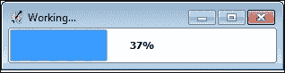
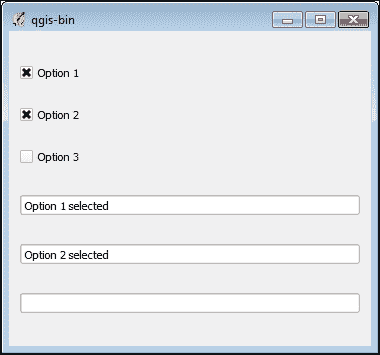
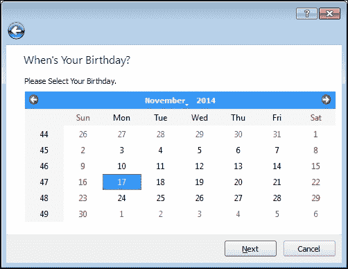

# 第七章. 与用户交互

在本章中，我们将介绍以下配方：

+   使用日志文件

+   创建一个简单的消息对话框

+   创建一个警告对话框

+   创建一个错误对话框

+   显示进度条

+   创建一个简单的文本输入对话框

+   创建一个文件输入对话框

+   创建一个组合框

+   创建单选按钮

+   创建复选框

+   创建标签页

+   引导用户通过向导

+   保持对话框在最前面

# 简介

QGIS 是使用名为 Qt 的综合图形用户界面框架构建的。QGIS 和 Qt 都有 Python API。在本章中，我们将学习如何与用户交互，以便在默认 QGIS 界面之外收集和显示信息。Qt 有自己出色的文档，由于 QGIS 是基于 Qt 构建的，因此所有这些文档都适用于 QGIS。您可以在[`qt-project.org`](http://qt-project.org)找到 Qt 文档。

# 使用日志文件

日志文件提供了一种跟踪 Python 插件或脚本中确切发生情况的方法，即使脚本或 QGIS 崩溃，这些消息仍然可用。这些日志消息使故障排除变得更容易。在本配方中，我们将演示两种用于日志记录的方法。一种方法是在文件系统上使用实际的日志文件，另一种方法是使用 QGIS **日志消息**窗口，可以通过点击 QGIS 应用程序窗口右下角的黄色感叹号三角形或通过选择**视图**菜单，然后点击**面板**，然后勾选**日志消息**来实现。

## 准备工作

要使用日志文件，我们必须通过执行以下步骤来配置`QGIS_LOG_FILE`环境变量，以便 QGIS 知道在哪里写入日志消息：

1.  从 QGIS **设置**菜单中选择**选项**。

1.  在**选项**对话框中，选择**系统**面板。

1.  在**系统**面板中，向下滚动到**环境**部分。

1.  在**环境**部分，勾选**使用自定义变量**复选框。

1.  点击**添加**按钮。

1.  在**变量**字段中，输入`QGIS_LOG_FILE`。

1.  在**值**字段中，输入`/qgis_data/log.txt`或您有写权限的另一个目录的路径。

1.  点击**确定**按钮关闭**选项**对话框。

1.  重新启动 QGIS 以使环境变量生效。

## 如何做到这一点...

我们将向之前配置的定制日志文件写入一条消息，然后向标签页式的 QGIS **日志消息**窗口写入一条消息。为此，我们需要执行以下步骤：

1.  首先，在 QGIS 中打开**Python 控制台**。

1.  接下来，我们将编写以下日志文件消息：

    ```py
    QgsLogger.logMessageToFile("This is a message to a log file.")

    ```

1.  然后，我们将向 QGIS **日志消息**窗口写入一条消息，指定消息作为第一个参数，以及消息将出现的标签页名称：

    ```py
    QgsMessageLog.logMessage("This is a message from the Python Console", "Python Console")

    ```

1.  现在，打开日志文件并检查消息是否出现。

1.  最后，打开 QGIS **日志消息**窗口，点击**Python 控制台**标签，并验证第二个日志消息是否出现。

## 它是如何工作的...

传统的日志文件提供了使用 Python 从 QGIS 记录信息的简单且便携的方式。**日志消息**窗口是一种更结构化的方式来查看来自许多不同来源的信息，具有标签式界面和每条消息的方便时间戳。在大多数情况下，你可能想使用 **日志消息**窗口，因为 QGIS 用户对此很熟悉。然而，请谨慎使用。在测试代码时记录大量消息是可以的，但将插件或应用程序的日志记录限制在严重错误上。大量的日志记录——例如，在遍历图层中的每个要素时记录消息——可能会减慢 QGIS 的速度，甚至导致其崩溃。

# 创建一个简单的消息对话框

消息对话框弹出以吸引用户的注意力并显示重要信息。在本例中，我们将创建一个简单的信息对话框。

## 准备工作

通过转到 **插件** 菜单并选择 **Python** **控制台** 来打开 QGIS **Python** **控制台**。

## 如何做...

我们将创建一个消息对话框并在其中显示一些文本，如下所示：

1.  首先，我们需要导入 GUI 库：

    ```py
    from PyQt4.QtGui import *

    ```

1.  然后，我们将创建消息对话框：

    ```py
    msg = QMessageBox()

    ```

1.  接下来，我们将设置要显示的消息：

    ```py
    msg.setText("This is a simple information message.")

    ```

1.  最后，我们调用执行方法来显示消息对话框：

    ```py
    msg.show()

    ```

## 工作原理...

注意，我们直接使用构建 QGIS 的底层 Qt 框架。QGIS API 的对象以 `Qgs` 开头，而 Qt 对象仅以字母 `Q` 开头。

## 还有更多...

消息对话框也应该谨慎使用，因为它是一个弹出窗口，可能会让用户感到烦恼，或者可能会在用户桌面上的打开窗口和对话框中丢失。QGIS 信息消息的首选方法是使用 `QgsMessageBar()` 方法，这在位于 [`docs.qgis.org/testing/en/docs/pyqgis_developer_cookbook/communicating.html`](http://docs.qgis.org/testing/en/docs/pyqgis_developer_cookbook/communicating.html) 的 PyQGIS 开发者手册中有详细说明。

# 创建一个警告对话框

有时，当检测到问题可能会引起问题，如果用户继续操作，就需要通知用户。这种情况需要警告对话框，我们将在本例中演示。

## 准备工作

通过转到 **插件** 菜单并选择 **Python 控制台** 来打开 QGIS **Python 控制台**。

## 如何做...

在本例中，我们将创建一个对话框，设置警告信息和警告图标，并显示对话框，如下所示：

1.  首先，我们导入 GUI 库：

    ```py
    from PyQt4.QtGui import *

    ```

1.  接下来，我们初始化警告对话框：

    ```py
    msg = QMessageBox()

    ```

1.  然后，我们设置警告信息：

    ```py
    msg.setText("This is a warning...")

    ```

1.  现在，向对话框添加一个具有枚举索引 `2` 的警告图标：

    ```py
    msg.setIcon(QMessageBox.Warning)

    ```

1.  最后，我们调用执行方法来显示对话框：

    ```py
    msg.show()

    ```

## 工作原理...

消息对话框应该谨慎使用，因为它们会打断用户体验，并可能很快变得令人烦恼。然而，有时防止用户执行可能导致数据损坏或程序崩溃的操作是很重要的。

# 创建一个错误对话框

当你需要因为严重错误而结束一个进程时，你可以发出一个错误对话框。在这个菜谱中，我们将创建一个错误对话框的示例。

## 准备工作

通过选择**插件**菜单然后点击**Python 控制台**来打开 QGIS 的**Python 控制台**。

## 如何做...

在这个菜谱中，我们将创建一个对话框，分配一个错误信息，设置一个错误图标，并显示对话框，如下所示：

1.  首先，我们需要导入 GUI 库：

    ```py
    from PyQt4.QtGui import *

    ```

1.  接下来，我们初始化对话框：

    ```py
    msg = QMessageBox()

    ```

1.  然后，我们设置错误信息：

    ```py
    msg.setText("This is an error!")

    ```

1.  然后，我们为错误图标设置一个图标编号：

    ```py
    msg.setIcon(QMessageBox.Critical)

    ```

1.  最后，我们执行错误对话框：

    ```py
    msg.show()

    ```

## 它是如何工作的...

模态窗口的一个重要特性是它们总是保持在应用程序的最前面，无论用户是否更改窗口的焦点。这个特性确保用户在继续之前先处理对话框。

# 显示进度条

进度条是一个动态对话框，显示用户必须等待的运行进程的完成百分比。进度条比简单对话框更高级，因为它需要不断更新。在这个菜谱中，我们将基于计时器创建一个简单的进度对话框。

## 准备工作

这个菜谱不需要做任何准备工作。

## 如何做...

这个菜谱的步骤包括基于`QProgressBar`创建一个自定义类，初始化对话框并设置其大小和标题，创建一个计时器，将进度条连接到计时器，开始计时，并显示进度。为此，我们需要执行以下步骤：

1.  首先，我们必须导入 GUI 和 QGIS 核心库：

    ```py
    from PyQt4.QtGui import *
    from PyQt4.QtCore import *

    ```

1.  接下来，我们为我们的进度条创建一个自定义类，包括一个用于增加进度条值的`increaseValue`方法：

    ```py
    class Bar(QProgressBar):
     value = 0
     def increaseValue(self):
     self.setValue(self.value)
     self.value = self.value+1

    ```

1.  现在，我们设置进度条：

    ```py
    bar = Bar()

    ```

1.  接下来，我们设置进度条的大小和标题：

    ```py
    bar.resize(300,40)
    bar.setWindowTitle('Working...')

    ```

1.  然后，我们初始化计时器，它将作为我们监控的进程：

    ```py
    timer = QTimer()

    ```

1.  现在，将计时器的`timeout`信号连接到我们之前创建的`increaseValue`方法。每当计时器完成倒计时，它将发出`timeout`信号并通知`increaseValue`方法。

    ```py
    timer.timeout.connect(bar.increaseValue)

    ```

1.  现在，我们将开始计时器，指定一个 500 毫秒的间隔。计时器将每 0.5 秒调用其`timeout()`信号：

    ```py
    timer.start(500)

    ```

1.  最后，我们显示进度条并开始进度计：

    ```py
    bar.show()

    ```

## 它是如何工作的...

当进度条值达到 100 时，进度条将停止，但我们的计时器将继续运行，直到调用`stop()`方法。在更现实的实现中，你需要一种方法来确定被监控的过程是否完成。指示器可能是文件的创建，或者更好的是，一个信号。Qt 框架使用信号和槽的概念来连接 GUI 元素。GUI 是事件驱动的，在多个不同时间发生多个事件，包括用户操作和其他触发器。信号/槽系统允许你在事件发生时定义反应，而无需编写代码来持续监控变化。在这个菜谱中，我们使用计时器预定义的信号并创建我们自己的槽。槽只是一个通过传递给信号`connect()`方法而被标识为槽的方法。以下截图显示了进度条的示例：



## 还有更多...

在像 QGIS 这样的复杂 GUI 应用程序中，你将会有多个同时触发多个槽的信号。你必须注意，快速更新的元素，如进度条，不会减慢应用程序的速度。仅当确实有变化时使用线程来更新进度条会更有效。关于这种技术的示例，请参阅[`snorf.net/blog/2013/12/07/multithreading-in-qgis-python-plugins/`](http://snorf.net/blog/2013/12/07/multithreading-in-qgis-python-plugins/)。

使用`QgsMessageBar`对象来显示信息性消息是首选的，但它也可以接受进度条等小部件。PyQGIS 开发者手册有一个示例，展示了如何将进度条放置在`QgsMessageBar`对象中（[`docs.qgis.org/testing/en/docs/pyqgis_developer_cookbook/communicating.html`](http://docs.qgis.org/testing/en/docs/pyqgis_developer_cookbook/communicating.html)）

# 创建一个简单的文本输入对话框

在这个菜谱中，我们将演示用于从用户那里接受输入的最简单方法之一，即文本输入对话框。

## 准备工作

通过选择**插件**菜单然后点击**Python 控制台**来打开 QGIS **Python 控制台**。

## 如何做到这一点...

在这个菜谱中，我们将初始化对话框并配置其标题和标签。我们将设置编辑模式和默认文本。当你点击**确定**按钮时，文本将被打印到**Python 控制台**。为此，我们需要执行以下步骤：

1.  首先，我们需要导入 GUI 库：

    ```py
    from PyQt4.QtGui import *

    ```

1.  接下来，我们初始化对话框：

    ```py
    qid = QInputDialog()

    ```

1.  现在，我们设置窗口标题、标签文本、编辑模式和默认文本：

    ```py
    title = "Enter Your Name"
    label = "Name: "
    mode = QLineEdit.Normal
    default = "<your name here>"

    ```

1.  我们在捕获用户输入和返回代码的同时配置对话框：

    ```py
    text, ok = QInputDialog.getText(qid, title, label, mode, default)

    ```

1.  当对话框出现时，输入一些文本并点击**确定**按钮。

1.  现在，我们将用户输入打印到控制台：

    ```py
    print text

    ```

1.  最后，验证是否正确地将文本打印到了**Python 控制台**。

## 如何工作...

编辑模式区分**正常**，这是我们在这里使用的，和**密码**，以隐藏输入的密码。尽管我们没有在这个例子中使用它，但返回码是一个布尔值，可以用来验证用户输入是否发生。

# 创建文件输入对话框

从用户那里获取文件名的最佳方式是让他们使用对话框浏览文件。您可以让用户使用文本输入对话框输入文件名，但这种方法容易出错。在这个菜谱中，我们将创建一个文件对话框并将选定的文件名打印到控制台。

## 准备工作

通过选择**插件**菜单然后点击**Python 控制台**来打开 QGIS **Python 控制台**。

## 如何做...

在这个菜谱中，我们将创建和配置对话框，浏览文件，并打印选定的文件名，如下所示：

1.  首先，我们导入 GUI 库：

    ```py
    from PyQt4.QtGui import *

    ```

1.  接下来，我们初始化文件对话框并指定其窗口标题：

    ```py
    qfd = QFileDialog()
    title = 'Open File'

    ```

1.  现在，我们指定文件对话框开始时的目录路径：

    ```py
    path = "/Users/joellawhead/qgis_data"

    ```

1.  然后，我们使用前面的参数配置文件对话框并将输出分配给一个变量：

    ```py
    f = QFileDialog.getOpenFileName(qfd, title, path)

    ```

1.  当对话框出现时，浏览文件，选择它，然后点击**确定**按钮。

1.  最后，我们将选定的文件名打印到控制台：

    ```py
    print f

    ```

## 它是如何工作的...

文件对话框仅提供文件名。在用户选择文件后，您必须打开它或对其执行其他操作。如果用户取消文件对话框，文件变量将是一个空字符串。您可以使用`QFileInfo`对象来获取所选文件的路径：

```py
from PyQt4.QtCore import *path = QFileInfo(f).path()

```

然后，您可以将此路径保存到项目设置中，如第一章中所示，*自动化 QGIS*。这样，下次打开文件对话框时，您将开始于与上次文件相同的目录位置，这通常更方便。

## 更多...

您也可以使用`QFileDialog()`方法获取要保存的文件名。您可以使用`FileMode`枚举来限制用户选择目录。

# 创建组合框

组合框提供了一个下拉列表，以限制用户的选项为定义好的选择集。在这个菜谱中，我们将创建一个简单的组合框。

## 准备工作

通过选择**插件**菜单然后点击**Python 控制台**来打开 QGIS **Python 控制台**。

## 如何做...

在这个菜谱中，我们将初始化组合框小部件，向其中添加选项，调整其大小，显示它，然后捕获用户输入以打印到控制台。为此，我们需要执行以下步骤：

1.  首先，我们导入 GUI 库：

    ```py
    from PyQt4.QtGui import *

    ```

1.  现在，我们创建我们的组合框对象：

    ```py
    cb = QComboBox()

    ```

1.  接下来，我们添加用户可以选择的项目：

    ```py
    cb.addItems(["North", "South", "West", "East"])

    ```

1.  然后，我们调整小部件的大小：

    ```py
    cb.resize(200,35)

    ```

1.  现在，我们可以向用户显示小部件：

    ```py
    cb.show()

    ```

1.  接下来，我们需要从列表中选择一个项目。

1.  现在，我们将用户的选项设置为一个变量：

    ```py
    text = cb.currentText()

    ```

1.  最后，我们可以打印选择：

    ```py
    print text

    ```

1.  确认选择已打印到控制台。

## 它是如何工作的...

添加到组合框中的项是一个 Python 列表。此功能使得使用 Python 作为数据库查询或其他动态数据的结果动态生成选项变得容易。您可能还希望访问对象在列表中的索引，您可以通过`currentIndex`属性来访问它。

# 创建单选按钮

当您希望用户从选项列表中选择一个唯一的选择时，单选按钮非常适合用户输入，与允许用户选择多个或所有可用选项的复选框相比。对于更长的选项列表，组合框是一个更好的选择。一旦选中单选按钮，您只能通过选择另一个单选按钮来取消选中它。

## 准备工作

通过选择**插件**菜单并然后点击**Python 控制台**来打开 QGIS **Python 控制台**。

## 如何实现...

单选按钮作为类的一部分更容易管理，因此我们将创建一个自定义类，该类还包括一个文本框来查看哪个单选按钮被选中。为此，请执行以下步骤：

1.  首先，我们将导入 GUI 和核心 QGIS 库：

    ```py
    from PyQt4.QtCore import *
    from PyQt4.QtGui import *

    ```

1.  接下来，我们将创建`RadioButton`类并设置单选按钮和文本框：

    ```py
    class RadioButton(QWidget):
     def __init__(self, parent=None):
     QWidget.__init__(self, parent)

    ```

1.  我们还必须定义一个布局来管理小部件的位置，如下所示：

    ```py
    self.layout = QVBoxLayout()
    self.rb1 = QRadioButton('Option 1')
    self.rb2 = QRadioButton('Option 2')
    self.rb3 = QRadioButton('Option 3')
    self.textbox = QLineEdit()

    ```

1.  现在，我们将每个单选按钮的切换信号连接到您即将定义的方法，以便检测何时选中单选按钮：

    ```py
    self.rb1.toggled.connect(self.rb1_active)
    self.rb2.toggled.connect(self.rb2_active)
    self.rb3.toggled.connect(self.rb3_active)

    ```

1.  然后，我们将单选按钮和文本框添加到布局中：

    ```py
    self.layout.addWidget(self.rb1)
    self.layout.addWidget(self.rb2)
    self.layout.addWidget(self.rb3)
    self.layout.addWidget(self.textbox)

    ```

1.  现在，我们可以定义我们正在构建的自定义小部件的布局：

    ```py
     self.setLayout(self.layout)

    ```

1.  接下来，我们可以定义表示哪个单选按钮被选中的方法。您也可以在单个方法中定义这些选项，但为了更好的理解，三个方法更容易：

    ```py
    def rb1_active(self, on):
     if on:
     self.textbox.setText('Option 1 selected')
    def rb2_active(self, on):
     if on:
     self.textbox.setText('Option 2 selected')
    def rb3_active(self, on):
     if on:
     self.textbox.setText('Option 3 selected')

    ```

1.  我们现在可以初始化我们的类并显示单选按钮：

    ```py
    buttons = RadioButton()
    buttons.show()

    ```

1.  最后，点击每个单选按钮并验证文本框中的文本是否更改以指示您点击的单选按钮已被选中。

## 它是如何工作的...

单选按钮几乎总是作为一个单独的对象分组，因为它们是相关的选项。许多 GUI 框架在 API 中将它们暴露为单个对象；然而，Qt 将它们作为单独的对象来保持最大的控制。

# 创建复选框

复选框与单选按钮密切相关，因为它们围绕一个主题提供选项。然而，与单选按钮不同，复选框可以被选中或取消选中。您还可以同时选中多个复选框。在本例中，我们将创建一个带有复选框和一些文本框的对话框，以编程方式跟踪哪些复选框被选中。

## 准备工作

通过选择**插件**菜单并然后点击**Python** **控制台**来打开 QGIS **Python 控制台**。

## 如何实现...

在本例中，我们将使用一个类来管理复选框和文本框小部件，如下所示：

1.  首先，我们导入 GUI 和 QGIS 核心库：

    ```py
    from PyQt4.QtCore import *
    from PyQt4.QtGui import *

    ```

1.  接下来，我们创建我们的自定义类用于复选框和文本框：

    ```py
    class CheckBox(QWidget):
     def __init__(self, parent=None):
     QWidget.__init__(self, parent)

    ```

1.  接下来，我们需要一个`layout`对象来管理小部件的位置：

    ```py
    self.layout = QVBoxLayout()

    ```

1.  现在，我们将添加三个复选框和三个文本框：

    ```py
     self.cb1 = QCheckBox('Option 1')
     self.cb2 = QCheckBox('Option 2')
     self.cb3 = QCheckBox('Option 3')
     self.textbox1 = QLineEdit()
     self.textbox2 = QLineEdit()
     self.textbox3 = QLineEdit()

    ```

1.  然后，我们将复选框的状态信号连接到我们将定义的方法：

    ```py
     self.cb1.toggled.connect(self.cb1_active)
     self.cb2.toggled.connect(self.cb2_active)
     self.cb3.toggled.connect(self.cb3_active)

    ```

1.  接下来，我们必须将小部件添加到布局中：

    ```py
     self.layout.addWidget(self.cb1)
     self.layout.addWidget(self.cb2)
     self.layout.addWidget(self.cb3)
     self.layout.addWidget(self.textbox1)
     self.layout.addWidget(self.textbox2)
     self.layout.addWidget(self.textbox3)

    ```

1.  现在，我们将我们的自定义类的布局设置为创建的布局：

    ```py
     self.setLayout(self.layout)

    ```

1.  然后，我们创建在每次复选框切换时更改文本框的方法：

    ```py
     # First checkbox
     def cb1_active(self, on):
     if on:
     self.textbox1.setText('Option 1 selected')
     else: self.textbox1.setText('') 
     # Second checkbox 
     def cb2_active(self, on):
     if on:
     self.textbox2.setText('Option 2 selected')
     else: self.textbox2.setText('') 
     # Third checkbox 
     def cb3_active(self, on):
     if on:
     self.textbox3.setText('Option 3 selected')
     else: self.textbox3.setText('')

    ```

1.  现在，我们已准备好初始化我们的自定义类并显示对话框：

    ```py
    buttons = CheckBox()
    buttons.show()

    ```

1.  分别和同时切换复选框，然后验证文本框是否反映了这些变化。

## 如何工作...

文本框允许你验证当复选框切换时，你是否以编程方式捕获了复选框的信号。你也可以使用单个复选框作为只有两个选择的选项的布尔值。当你运行这个菜谱时，结果应该类似于以下截图：



# 创建标签

标签允许你将多个屏幕的信息压缩到相对较小的空间。标签在窗口顶部提供标题，当点击时，每个标题都呈现一个单独的小部件布局。在这个菜谱中，我们将创建一个简单的标签界面。

## 准备工作

通过选择**插件**菜单然后点击**Python** **控制台**来打开 QGIS **Python 控制台**。

## 如何做到这一点...

我们将创建一个总体的标签小部件。然后，我们将创建三个通用小部件来表示我们的标签。我们将设置包含三个不同 GUI 小部件的布局，并将每个布局分配给我们的标签小部件。最后，我们将添加我们的标签到标签小部件并显示它。为此，我们需要执行以下步骤：

1.  首先，我们需要导入 GUI 和 QGIS 核心库：

    ```py
    from PyQt4.QtCore import *
    from PyQt4.QtGui import *

    ```

1.  接下来，我们创建我们的标签并配置其标题和大小：

    ```py
    qtw = QTabWidget()
    qtw.setWindowTitle("PyQGIS Tab Example")
    qtw.resize(400,300)

    ```

1.  现在，我们初始化我们的标签小部件：

    ```py
    tab1 = QWidget()
    tab2 = QWidget()
    tab3 = QWidget()

    ```

1.  然后，我们将设置一个包含丰富文本输入框的小部件和布局，使用 HTML 标签为我们的第一个标签加粗文本：

    ```py
    layout1 = QVBoxLayout()
    layout1.addWidget(QTextEdit("<b>Type text here</b>"))
    tab1.setLayout(layout1)

    ```

1.  现在，我们将为第二个标签页设置一个简单的按钮，遵循与第一个标签页相同的格式：

    ```py
    layout2 = QVBoxLayout()
    layout2.addWidget(QPushButton("Button"))
    tab2.setLayout(layout2)

    ```

1.  接下来，我们将为第三个标签创建小部件和布局，其中包含一个简单的文本标签：

    ```py
    layout3 = QVBoxLayout()
    layout3.addWidget(QLabel("Label text example"))
    tab3.setLayout(layout3)

    ```

1.  然后，我们将标签添加到标签窗口中：

    ```py
    qtw.addTab(tab1, "First Tab")
    qtw.addTab(tab2, "Second Tab")
    qtw.addTab(tab3, "Third Tab")

    ```

1.  最后，我们将显示标签窗口：

    ```py
    qtw.show()

    ```

1.  确认你可以点击每个标签并与小部件交互。

## 如何工作...

这个菜谱的关键是 `QTabWidget()` 方法。其他所有内容只是任意布局和小部件，这些最终都包含在标签小部件中。

### 注意

标签的一般规则是保持其中信息独立。

无法预测用户如何与标签界面交互，如果标签之间的信息相互依赖，则会出现问题。

# 引导用户通过向导

向导是一系列对话框，引导用户通过一系列步骤。向导每一页的信息可能以某种方式与其他页面的信息相关。在这个菜谱中，我们将创建一个简单的三页向导来收集用户的一些信息并将其显示给他们。

## 准备工作

通过选择**插件**菜单并点击**Python** **控制台**来打开 QGIS **Python 控制台**。

## 如何操作...

我们将创建三个类，每个类代表我们的向导页面。前两个页面将收集信息，第三个页面将向用户展示信息。我们将创建一个`QWizard`对象来将这些页面类连接起来。我们还将使用向导字段的概念在页面之间传递信息。

要做到这一点，我们需要执行以下步骤：

1.  首先，我们导入 GUI 和 QGIS 核心库：

    ```py
    from PyQt4.QtCore import *
    from PyQt4.QtGui import *

    ```

1.  接下来，我们为向导的第一个页面创建类，并添加一个文本框以收集用户的`uname`变量：

    ```py
    class Page1(QWizardPage):
     def __init__(self, parent=None):
     super(Page1, self).__init__(parent)
     self.setTitle("What's Your Name?")
     self.setSubTitle("Please enter your name.")
     self.label = QLabel("Name:")
     self.uname = QLineEdit("<enter your name>")

    ```

1.  现在，我们注册`uname`字段，以便我们可以在稍后访问输入的值，而无需跟踪变量本身：

    ```py
     self.registerField("uname", self.uname)

    ```

1.  然后，我们设置页面的布局：

    ```py
     layout = QVBoxLayout()
     layout.addWidget(self.label)
     layout.addWidget(self.uname)
     self.setLayout(layout)

    ```

1.  接下来，我们将设置第二个页面的类：

    ```py
    class Page2(QWizardPage):
     def __init__(self, parent=None):
     super(Page2, self).__init__(parent)
     self.setTitle("When's Your Birthday?")
     self.setSubTitle("Select Your Birthday.")

    ```

1.  然后，我们将添加一个日历小部件以获取用户的生日：

    ```py
     self.cal = QCalendarWidget()

    ```

1.  我们将注册选定的日期作为一个`field`，以便稍后访问：

    ```py
     self.registerField("cal", self.cal, "selectedDate")

    ```

1.  然后，我们将为此页面设置布局：

    ```py
     layout = QVBoxLayout()
     layout.addWidget(self.cal)
     self.setLayout(layout)

    ```

1.  现在，我们已准备好设置第三个页面，该页面将展示用户信息。我们将使用简单的标签，这些标签将在下一步动态填充：

    ```py
    class Page3(QWizardPage):
     def __init__(self, parent=None):
     super(Page3, self).__init__(parent)
     self.setTitle("About You")
     self.setSubTitle("Here is Your Information:")
     self.name_lbl = QLabel()
     self.date_lbl = QLabel()
     layout = QVBoxLayout()
     layout.addWidget(self.name_lbl)
     layout.addWidget(self.date_lbl)
     self.setLayout(layout)

    ```

1.  现在，我们设置页面的初始化。我们首先访问从前一页注册的字段以获取用户输入：

    ```py
     def initializePage(self):
     uname = self.field("uname")
     date = self.field("cal").toString()

    ```

1.  然后，我们只需将这些值设置为标签的文本，使用 Python 字符串格式化即可：

    ```py
     self.name_lbl.setText("Your name is %s" % uname)
     self.date_lbl.setText("Your birthday is %s" % date)

    ```

1.  最后，我们创建我们的向导小部件，添加页面，并显示向导：

    ```py
    wiz = QWizard()
    wiz.addPage(Page1())
    wiz.addPage(Page2())
    wiz.addPage(Page3())
    wiz.show() 

    ```

## 如何操作...

向导界面与标签页控件有许多相似之处，但也有一些重要区别。向导只允许用户根据页面顺序进行线性前进和后退。如果信息被注册为字段，它可以跨页面共享信息，这使得页面在向导的作用域内全局。然而，`field()`方法是一个受保护的方法，因此您的页面必须定义为从`QWizardPage`对象继承的类，以便注册的字段能够按预期工作。以下截图显示了向导的日历屏幕：



# 保持对话框在顶部

很容易失去 QGIS 前面的弹出窗口的跟踪。一旦用户将焦点转移到移动主 QGIS 应用程序窗口，您的对话框可能会消失在它后面，迫使用户重新排列整个桌面以再次找到较小的窗口。幸运的是，Qt 有一个窗口设置称为 hint，它允许您强制窗口保持在顶部。这种类型的对话框称为模式对话框。在这个菜谱中，我们将创建一个消息对话框并使用 hint 强制它保持在顶部。

## 准备工作

通过选择**插件**菜单并点击**Python** **控制台**来打开 QGIS **Python 控制台**。

## 如何操作...

在这个菜谱中，我们将创建一个简单的消息对话框并将其设置为保持在顶部，如下所示：

1.  首先，我们导入 Qt GUI 和 QGIS 核心库：

    ```py
    from PyQt4.QtGui import *
    from PyQt4.QtCore import *

    ```

1.  接下来，我们创建消息的文本：

    ```py
    msg = "   This window will always stay on top."

    ```

1.  现在，我们创建我们的对话框并指定消息和提示：

    ```py
    lbl = QLabel(msg, None, Qt.WindowStaysOnTopHint)

    ```

1.  我们可以调整对话框的大小并显示它：

    ```py
    lbl.resize(400,400)
    lbl.show()

    ```

1.  点击主 QGIS 应用程序窗口以更改窗口焦点并验证对话框始终位于 QGIS 之上。

## 它是如何工作的...

这种简单技术可以帮助确保用户在继续之前先处理重要的对话框。
