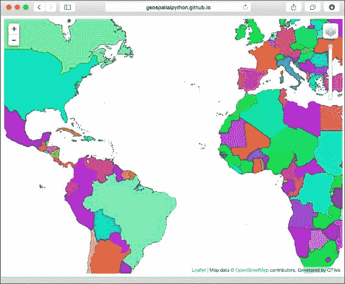
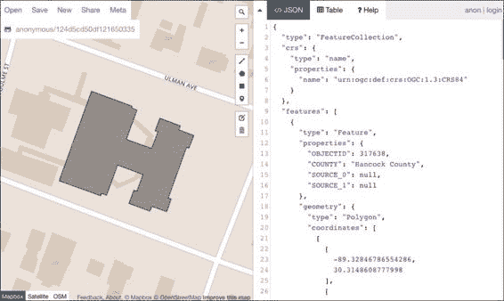
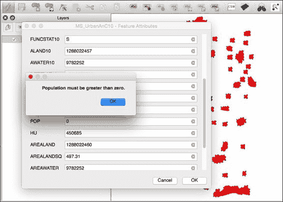
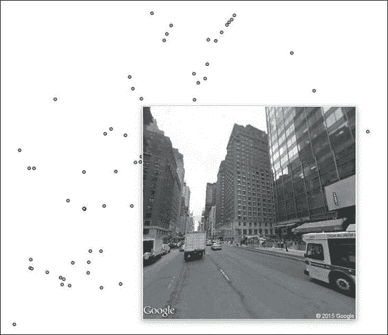
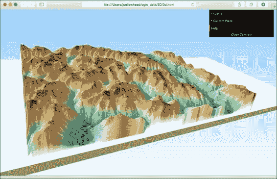

# 第九章。其他技巧和窍门

在本章中，我们将介绍以下配方：

+   从 QGIS 地图中创建瓦片

+   将图层添加到 geojson.io

+   根据规则渲染地图图层

+   创建图层样式文件

+   在 PyQGIS 中使用 NULL 值

+   使用生成器进行图层查询

+   使用 alpha 值显示数据密度

+   使用 `__geo_interface__` 协议

+   沿着线生成点

+   使用基于表达式的标签

+   在 QGIS 中创建动态表单

+   计算所有选中线的长度

+   使用与地图不同的状态栏 CRS

+   在 QGIS 中创建 HTML 标签

+   在 QGIS 中使用 OpenStreetMap 的兴趣点

+   使用 WebGL 在 3D 中可视化数据

+   在地球上可视化数据

# 简介

本章提供了有趣的、有价值的 QGIS Python 技巧，这些技巧没有包含在其他章节的任何主题中。每个配方都有一个特定的目的，但在许多情况下，一个配方可能展示了多个您在其他程序中会发现有用的概念。本章中的所有配方都在 QGIS Python 控制台中运行。

# 从 QGIS 地图中创建瓦片

此配方从您的 QGIS 地图中创建一组互联网网络地图瓦片。这个配方的有趣之处在于，一旦生成了静态地图瓦片，您可以在本地或从任何可访问的 Web 目录使用客户端浏览器的 JavaScript 提供它们，而无需地图服务器，或者您可以将它们（例如，在可移动的 USB 驱动器上分发）。

## 准备工作

您需要从 [`geospatialpython.googlecode.com/svn/countries.zip`](https://geospatialpython.googlecode.com/svn/countries.zip) 下载压缩的 shapefile。

将 shapefile 解压缩到 `qgis_data` 目录中名为 `shapes` 的目录。接下来，在 `qgis_data` 目录中创建一个名为 `tilecache` 的目录。您还需要使用 **QGIS 插件管理器** 安装 **QTiles** 插件。此插件是实验性的，所以请确保在 QGIS 插件管理器的 **设置** 选项卡中勾选了 **显示实验性插件** 复选框。

## 如何做到这一点...

我们将加载 shapefile 并随机着色每个国家。然后，我们将使用 Python 操作 **QTiles** 插件以生成 `5` 个缩放级别的地图瓦片。为此，我们需要执行以下步骤：

1.  首先，我们需要导入所有必要的 Python 库，包括 QTiles 插件：

    ```py
    from PyQt4.QtCore import *
    from PyQt4.QtGui import *
    import qtiles
    import random

    ```

1.  现在，我们创建一个可以产生随机颜色的颜色函数。此函数接受混合颜色，默认为白色，以改变整个颜色调的基调：

    ```py
    def randomColor(mix=(255,255,255)):
     red = random.randrange(0,256)
     green = random.randrange(0,256)
     blue = random.randrange(0,256)
     r,g,b = mix
     red = (red + r) / 2
     green = (green + g) / 2
     blue = (blue + b) / 2
     return (red, green, blue)

    ```

1.  接下来，我们将创建一个简单的回调函数，用于在瓦片生成完成后通知。此函数通常用于创建消息栏或其他通知，但我们将保持简单：

    ```py
    def done():
     print "FINISHED!!"

    ```

1.  现在，我们设置 shapefile 的路径和瓦片的输出方向：

    ```py
    shp = "/qgis_data/shapes/countries.shp"
    dir = "/qgis_data/tilecache"

    ```

1.  然后，我们加载 shapefile：

    ```py
    layer = QgsVectorLayer(shp, "Countries", "ogr")

    ```

1.  之后，我们定义用于着色国家的字段：

    ```py
    field = 'CNTRY_NAME'

    ```

1.  现在，我们需要获取所有要素，以便我们可以遍历它们：

    ```py
    features = layer.getFeatures()

    ```

1.  我们将构建我们的颜色渲染器：

    ```py
    categories = []
    for feature in features:
     country = feature[field]
     sym = QgsSymbolV2.defaultSymbol(layer.geometryType())
     r,g,b = randomColor()
     sym.setColor(QColor(r,g,b,255))
     category = QgsRendererCategoryV2(country, sym, country)
     categories.append(category) 

    ```

1.  然后，我们将设置图层渲染器并将其添加到地图中：

    ```py
    renderer = QgsCategorizedSymbolRendererV2(field, categories)
    layer.setRendererV2(renderer)
    QgsMapLayerRegistry.instance().addMapLayer(layer)

    ```

1.  现在，我们将设置图像瓦片所需的所有属性，包括地图元素和图像属性：

    ```py
    canvas = iface.mapCanvas()
    layers = canvas.mapSettings().layers()
    extent = canvas.extent()
    minZoom = 0
    maxZoom = 5
    width = 256
    height = 256
    transp = 255
    quality = 70
    format = "PNG"
    outputPath = QFileInfo(dir)
    rootDir = "countries"
    antialiasing = False
    tmsConvention = True
    mapUrl = False
    viewer = True

    ```

1.  我们准备好使用`QTiles`插件的效率线程系统生成瓦片。我们将创建一个线程对象，并传递之前提到的所有瓦片设置：

    ```py
    tt = qtiles.tilingthread.TilingThread(layers, extent, minZoom, maxZoom, width, height, transp,
    quality, format, outputPath, rootDir, antialiasing, tmsConvention,
    mapUrl, viewer)

    ```

1.  然后，我们可以将完成信号连接到我们的简单回调函数：

    ```py
    tt.processFinished.connect(done)

    ```

1.  最后，我们开始瓦片处理过程：

    ```py
    tt.start()

    ```

1.  一旦收到完成消息，检查输出目录并验证是否存在名为`countries.html`的 HTML 文件和一个名为`countries`的目录。

1.  双击`countries.html`页面，在浏览器中打开它。

1.  一旦地图加载，点击左上角的加号符号（**+**）两次以放大地图。

1.  接下来，四处移动以查看您的地图瓦片版本加载。

## 它是如何工作的...

使用此插件，您可以生成多达 16 个缩放级别。在八个缩放级别之后，瓦片生成过程会花费很长时间，瓦片集在文件系统上变得相当大，总计数百兆字节。避免创建大量文件的一种方法是用**mbtiles**格式，它将所有数据存储在一个文件中。但是，您需要一个使用 GDAL 的 Web 应用程序来访问它。

### 注意

您可以在存储在`github.io`网络目录中的输出菜谱的示例中看到工作效果，网址为[`geospatialpython.github.io/qgis/tiles/countries.html`](http://geospatialpython.github.io/qgis/tiles/countries.html)。

以下图像显示了浏览器中的输出：



# 将图层添加到 geojson.io

云服务已成为常态，地理空间地图也不例外。这个菜谱使用一个名为 geojson.io 的服务，该服务提供在线矢量图层，您可以使用 Python 从 QGIS 上传。

## 准备工作

对于这个菜谱，您需要使用**QGIS 插件管理器**安装**qgisio**插件。

您还需要从[`geospatialpython.googlecode.com/svn/union.zip`](https://geospatialpython.googlecode.com/svn/union.zip)获取一个在测地坐标系（WGS84）中的 shapefile。

解压缩 ZIP 文件并将其放置在您的`qgis_data`目录中，命名为`shapes`。

## 如何操作...

我们将使用临时文件将我们的 shapefile 转换为 GeoJSON。然后，我们将使用 Python 调用**qgisio**插件，以便将数据上传到在线显示。为此，我们需要执行以下步骤：

1.  首先，我们需要导入所有相关的 Python 库：

    ```py
    from PyQt4.QtCore import *
    from PyQt4.QtGui import *
    from qgis.core import *
    from tempfile import mkstemp
    import os
    from qgisio import geojsonio

    ```

1.  现在，我们设置图层并获取图层的名称：

    ```py
    layer = QgsVectorLayer("/qgis_data/shapes/building.shp", "Building", "ogr")
    name = layer.name()

    ```

1.  接下来，我们使用 Python 的 tempfile 模块创建一个用于 GeoJSON 转换的临时文件：

    ```py
    handle, tmpfile = mkstemp(suffix='.geojson')
    os.close(handle)

    ```

1.  现在，我们将建立转换所需的坐标系，这必须是 WGS84 地理坐标系，以便与云服务协同工作：

    ```py
    crs = QgsCoordinateReferenceSystem(4326,
    QgsCoordinateReferenceSystem.PostgisCrsId)

    ```

1.  接下来，我们可以将图层以 GeoJSON 格式输出：

    ```py
    error = QgsVectorFileWriter.writeAsVectorFormat(layer, tmpfile,
     "utf-8", crs, "GeoJSON", onlySelected=False)

    ```

1.  然后，我们可以确保转换没有出现任何问题：

    ```py
    if error != QgsVectorFileWriter.NoError:
     print "Unable to write geoJSON!"

    ```

1.  现在，我们可以读取 GeoJSON 内容：

    ```py
    with open(str(tmpfile), 'r') as f:
     contents = f.read()

    ```

1.  然后，我们需要删除临时文件：

    ```py
    os.remove(tmpfile)

    ```

1.  我们现在可以使用`qgisio`模块将我们的 GeoJSON 上传到 geojson.io：

    ```py
    url = geojsonio._create_gist(contents, "Layer exported from QGIS", name + ".geojson")

    ```

1.  然后，我们可以使用 Qt 库在浏览器中打开地图：

    ```py
    QDesktopServices.openUrl(QUrl(url))

    ```

## 如何工作...

这个配方实际上使用了两个云服务。GeoJSON 数据存储在名为 Gist 的[`github.com`](https://github.com)服务上，该服务允许您存储代码片段，如`JSON`。geojson.io 服务可以读取 Gist 中的数据。

### 注意

注意，有时生成可用的 URL 可能需要几秒钟到几分钟。

这张截图显示了 geojson.io 上 OSM 地图上的建筑图层，GeoJSON 显示在地图旁边：



## 还有更多...

有一些额外的先进服务可以用于 QGIS 地图，包括[www.QGISCloud.com](http://www.QGISCloud.com)和[www.CartoDB.com](http://www.CartoDB.com)，它们也可以显示栅格地图。这两个服务都有免费选项和 QGIS 插件。然而，如果您尝试将地图发布到 Web 作为工作流程的一部分进行自动化，那么从 Python 脚本化这些服务会困难得多。

# 根据规则渲染地图图层

渲染规则提供了一种强大的方式来控制图层相对于其他图层或图层本身的属性如何以及何时显示。使用基于规则的渲染器，本配方演示了如何根据属性对图层进行着色编码。

## 准备工作

您需要从[`geospatialpython.googlecode.com/svn/ms_rails_mstm.zip`](https://geospatialpython.googlecode.com/svn/ms_rails_mstm.zip)下载一个压缩的 shapefile。

解压它并将其放置在您的`qgis_data`目录下名为`ms`的目录中。

在同一目录中，下载并解压以下 shapefile：

[`geospatialpython.googlecode.com/files/Mississippi.zip`](https://geospatialpython.googlecode.com/files/Mississippi.zip)

最后，还需要将此 shapefile 添加到目录中：

[`geospatialpython.googlecode.com/svn/jackson.zip`](https://geospatialpython.googlecode.com/svn/jackson.zip)

## 如何做到这一点...

我们将设置一个铁路图层，然后我们将设置我们的规则作为 Python 元组，根据使用频率对其进行着色编码。最后，我们将添加一些其他图层作为参考。为此，我们需要执行以下步骤：

1.  首先，我们需要导入 QTGui 库来处理颜色：

    ```py
    from PyQt4.QtGui import *

    ```

1.  接下来，我们将设置我们的数据路径以避免重复输入。将此字符串替换为您的`qgis_data`目录路径：

    ```py
    prefix = "/Users/joellawhead/qgis_data/ms/"

    ```

1.  现在，我们可以加载我们的铁路图层：

    ```py
    rails = QgsVectorLayer(prefix + "ms_rails_mstm.shp", "Railways", "ogr")

    ```

1.  然后，我们可以将我们的规则定义为一系列元组。每个规则定义了一个标签和一个表达式，详细说明了哪些属性值构成了该规则，一个颜色名称，以及描述的特征在最小/最大地图比例值上可见：

    ```py
    rules = (
     ('Heavily Used', '"DEN09CODE" > 3', 'red', (0, 6000000)),
     ('Moderately Used', '"DEN09CODE" < 4 AND "DEN09CODE" > 1', 'orange', (0, 1500000)),
     ('Lightly Used', '"DEN09CODE" < 2', 'grey', (0, 250000)),
    )

    ```

1.  接下来，我们创建一个基于规则的渲染器和基础符号，以便开始应用我们的规则：

    ```py
    sym_rails = QgsSymbolV2.defaultSymbol(rails.geometryType())
    rend_rails = QgsRuleBasedRendererV2(sym_rails)

    ```

1.  规则基于根规则分层，因此我们首先必须访问根规则：

    ```py
    root_rule = rend_rails.rootRule()
    ```

1.  现在，我们将遍历我们的规则，克隆默认规则，并将我们的自定义规则追加到树中：

    ```py
    for label, exp, color, scale in rules:
     # create a clone (i.e. a copy) of the default rule
     rule = root_rule.children()[0].clone()
     # set the label, exp and color
     rule.setLabel(label)
     rule.setFilterExpression(exp)
     rule.symbol().setColor(QColor(color))
     # set the scale limits if they have been specified
     if scale is not None:
     rule.setScaleMinDenom(scale[0])
     rule.setScaleMaxDenom(scale[1])
    # append the rule to the list of rules
     root_rule.appendChild(rule)

    ```

1.  我们现在可以删除默认规则，该规则不属于我们的渲染方案：

    ```py
    root_rule.removeChildAt(0)

    ```

1.  现在，我们将渲染器应用到我们的`rails`图层上：

    ```py
    rails.setRendererV2(rend_rails)

    ```

1.  我们将建立一个城市图层，它将提供一个焦点以便我们放大，这样我们就可以轻松地看到基于比例的渲染效果：

    ```py
    jax = QgsVectorLayer(prefix + "jackson.shp", "Jackson", "ogr")
    jax_style = {}
    jax_style['color'] = "#ffff00"
    jax_style['name'] = 'regular_star'
    jax_style['outline'] = '#000000'
    jax_style['outline-width'] = '1'
    jax_style['size'] = '8'
    sym_jax = QgsSimpleMarkerSymbolLayerV2.create(jax_style)
    jax.rendererV2().symbols()[0].changeSymbolLayer(0, sym_jax)

    ```

1.  然后，我们将为两个数据集周围设置并样式化一个边框层：

    ```py
    ms = QgsVectorLayer(prefix + "mississippi.shp", "Mississippi", "ogr")
    ms_style = {}yea
    ms_style['color'] = "#F7F5EB"
    sym_ms = QgsSimpleFillSymbolLayerV2.create(ms_style)
    ms.rendererV2().symbols()[0].changeSymbolLayer(0, sym_ms)

    ```

1.  最后，我们将所有内容添加到地图中：

    ```py
    QgsMapLayerRegistry.instance().addMapLayers([jax, rails, ms])

    ```

## 如何工作...

规则是符号和表达式的分层集合。符号是符号层的集合。这个配方相对简单，但包含超过 50 行代码。渲染是 QGIS 中编码最复杂的特性之一。然而，规则也有它们自己的属性集，与图层和符号分开。请注意，在这个配方中，我们能够为规则设置标签和过滤器，这些属性通常被分配给图层。将规则视为单独图层的一种方式。我们可以通过将我们的铁路图层作为每个规则的新图层来加载，以实现相同的功能。规则是分割单个图层渲染的更紧凑方式。

此图像显示了在所有规则输出都可见的比例尺下的渲染效果：


# 创建图层样式文件

图层样式是 QGIS Python API 中最复杂的方面之一。一旦为图层开发出样式，通常将样式保存到 XML 格式的**QGIS 标记语言**（**QML**）中是非常有用的。

## 准备工作

您需要下载名为`saveqml`的压缩目录，并将其解压缩到您的`qgis_data/rasters`目录中，链接为[`geospatialpython.googlecode.com/svn/saveqml.zip`](https://geospatialpython.googlecode.com/svn/saveqml.zip)。

## 如何做到这一点...

我们将为 DEM 创建一个颜色渐变，并将其设置为半透明，以叠加 DEM 的阴影 tif 图像。我们将创建的样式保存到 QML 文件中。为此，我们需要执行以下步骤：

1.  首先，我们需要以下 Python Qt 库：

    ```py
    from PyQt4.QtCore import *
    from PyQt4.QtGui import *

    ```

1.  接下来，我们将加载我们的两个栅格图层：

    ```py
    hs = QgsRasterLayer("/qgis_data/saveqml/hillshade.tif", "Hillshade")
    dem = QgsRasterLayer("/qgis_data/saveqml/dem.asc", "DEM")

    ```

1.  接下来，我们将对 DEM 执行直方图拉伸以获得更好的可视化效果：

    ```py
    algorithm = QgsContrastEnhancement.StretchToMinimumMaximum
    limits = QgsRaster.ContrastEnhancementMinMax
    dem.setContrastEnhancement(algorithm, limits)

    ```

1.  现在，我们将创建一个基于 DEM 高程值的视觉上令人愉悦的颜色渐变，并将其作为渲染器应用到图层上：

    ```py
    s = QgsRasterShader() 
    c = QgsColorRampShader() 
    c.setColorRampType(QgsColorRampShader.INTERPOLATED) 
    i = [] 
    qri = QgsColorRampShader.ColorRampItem
    i.append(qri(356.334, QColor(63,159,152,255), '356.334')) 
    i.append(qri(649.292, QColor(96,235,155,255), '649.292')) 
    i.append(qri(942.25, QColor(100,246,174,255), '942.25')) 
    i.append(qri(1235.21, QColor(248,251,155,255), '1235.21'))
    i.append(qri(1528.17, QColor(246,190,39,255), '1528.17')) 
    i.append(qri(1821.13, QColor(242,155,39,255), '1821.13'))
    i.append(qri(2114.08, QColor(165,84,26,255), '2114.08'))
    i.append(qri(2300, QColor(236,119,83,255), '2300'))
    i.append(qri(2700, QColor(203,203,203,255), '2700'))
    c.setColorRampItemList(i) 
    s.setRasterShaderFunction(c) 
    ps = QgsSingleBandPseudoColorRenderer(dem.dataProvider(), 1, s)
    ps.setOpacity(0.5) 
    dem.setRenderer(ps)

    ```

1.  现在，我们可以将图层添加到地图中：

    ```py
    QgsMapLayerRegistry.instance().addMapLayers([dem, hs])

    ```

1.  最后，通过这一行，我们可以将 DEM 的样式保存到可重用的 QML 文件中：

    ```py
    dem.saveNamedStyle("/qgis_data/saveqml/dem.qml")

    ```

## 如何工作...

QML 格式易于阅读，并且可以手动编辑。`saveNamedStyle()`方法在矢量图层上以完全相同的方式工作。您无需对前面的代码进行样式化，只需使用`loadNamedStyle()`方法引用 QML 文件即可：

```py
dem.loadNamedStyle("/qgis_data/saveqml/dem.qml")

```

如果您将 QML 文件与 shapefile 一起保存，并使用相同的文件名（带有`.qml`扩展名），那么当加载 shapefile 时，QGIS 将自动加载样式：

# 在 PyQGIS 中使用 NULL 值

QGIS 可以使用 NULL 值作为字段值。Python 没有 NULL 值的概念。它最接近的类型是`None`类型。当在 QGIS 中使用 Python 时，您必须注意这一点。在这个菜谱中，我们将探讨 QGIS 的 NULL 值在 Python 中的影响。NULL 值的计算涉及一个指针，该指针是一个未初始化、未定义、空或无意义的值。

## 准备工作

在您的`qgis_data/shapes`目录中，从[`geospatialpython.googlecode.com/svn/NullExample.zip`](https://geospatialpython.googlecode.com/svn/NullExample.zip)下载 shapefile，该 shapefile 包含一些 NULL 字段值，并将其解压缩。

## 如何操作...

我们将加载 shapefile 并获取其第一个要素。然后，我们将访问其一个 NULL 字段值。接下来，我们将运行一些测试，让您看到 NULL 值在 Python 中的行为。为此，我们需要执行以下步骤：

1.  首先，我们将加载 shapefile 并访问其第一个要素：

    ```py
    lyrPth = "/qgis_data/shapes/NullExample.shp"
    lyr = QgsVectorLayer(lyrPth, "Null Field Example", "ogr")
    features = lyr.getFeatures()
    f = features.next()

    ```

1.  接下来，我们将获取一个 NULL 字段值：

    ```py
    value = f["SAMPLE"]

    ```

1.  现在，我们将检查 NULL 值的类型：

    ```py
    print "Check python value type:"
    print type(value)

    ```

1.  然后，我们将查看该值是否是 Python 的`None`类型：

    ```py
    print "Check if value is None:"
    print value is None

    ```

1.  现在，我们将查看它是否等同于`None`：

    ```py
    print "Check if value == None:"
    print value == None

    ```

1.  接下来，我们将查看该值是否与 QGIS 的 NULL 类型匹配：

    ```py
    print "Check if value == NULL:"
    print value == NULL

    ```

1.  然后，我们将查看它是否实际上是 NULL：

    ```py
    print "Check if value is NULL:"
    print value is NULL

    ```

1.  最后，我们将与 QGIS 的 NULL 进行类型匹配：

    ```py
    print "Check type(value) is type(NULL):"
    print type(value) is type(NULL)

    ```

## 它是如何工作的...

如您所见，NULL 值的类型是`PyQt4.QtCore.QPyNullVariant`。这个类是注入到 PyQt 框架中的一个特殊类型。需要注意的是，使用`is`运算符和`==`运算符比较时，返回的值可能不同。您应该了解这些差异，以避免代码中出现意外结果。

# 使用生成器进行图层查询

Python 生成器提供了一种高效处理大数据集的方法。一位名为 Nathan Woodrow 的 QGIS 开发者创建了一个简单的 Python QGIS 查询引擎，该引擎使用生成器轻松地从 QGIS 图层中检索特征。我们将在这个菜谱中使用这个引擎来查询图层。

## 准备工作

您需要使用`easy_install`或下载并添加到您的 QGIS Python 安装中安装查询引擎。要使用`easy_install`，请在控制台中运行以下命令，这将下载原始代码的克隆，包括 Python 设置文件：

```py
easy_install 

```

[`github.com/GeospatialPython/qquery/archive/master.zip`](https://github.com/GeospatialPython/qquery/archive/master.zip)

您也可以从[`github.com/NathanW2/qquery/archive/master.zip`](https://github.com/NathanW2/qquery/archive/master.zip)下载 ZIP 文件，并将其内容复制到您的工作目录或 QGIS Python 安装的`site-packages`目录中。

您还需要从以下位置下载压缩的 shapefile 并将其解压缩到`qgis_data`目录下的`ms`目录中：

[`geospatialpython.googlecode.com/files/MS_UrbanAnC10.zip`](https://geospatialpython.googlecode.com/files/MS_UrbanAnC10.zip)

## 如何操作...

我们将加载包含人口数据的图层。然后，我们将使用查询引擎执行一个针对人口少于 50,000 的城市区域的简单查询。我们将过滤结果，只提供三个列，地点名称、人口水平和土地面积。为此，我们需要执行以下步骤：

1.  首先，我们导入查询引擎模块：

    ```py
    from query import query

    ```

1.  然后，我们设置到我们的 shapefile 的路径并将其加载为一个矢量图层：

    ```py
    pth = "/Users/joellawhead/qgis_data/ms/MS_UrbanAnC10.shp"
    layer = QgsVectorLayer(pth, "Urban Areas", "ogr")

    ```

1.  现在，我们可以运行查询，该查询使用 Python 的点表示法执行 `where` 子句搜索，然后使用 `select` 语句进行过滤。这一行将返回一个包含结果的生成器：

    ```py
    q = (query(layer).where("POP > 50000").select('NAME10', "POP", "AREALAND", "POPDEN"))

    ```

1.  最后，我们将使用查询生成器迭代到第一个结果：

    ```py
    q().next()

    ```

## 它是如何工作的...

如您所见，这个模块非常实用。要使用默认的 PyQGIS API 执行此相同查询，代码量将几乎是现在的四倍。

# 使用 alpha 值来显示数据密度

主题地图通常使用基于单一颜色的颜色渐变来显示数据密度。较暗的颜色表示对象浓度较高，而较浅的颜色表示浓度较低。您也可以使用透明度渐变来显示密度。如果您想在影像或其他矢量图层上叠加密度层，这种技术很有用。在这个配方中，我们将使用一些熊目击数据来显示一个区域内熊的浓度。我们将使用 alpha 值来显示密度。我们将使用不寻常的六边形网格来划分区域，并使用基于规则的渲染器来构建显示。

## 准备工作

您需要安装 MMQGIS 插件，该插件用于使用 QGIS **插件管理器**构建六边形网格。

您还需要从 [`geospatialpython.googlecode.com/svn/bear-data.zip`](https://geospatialpython.googlecode.com/svn/bear-data.zip) 下载熊的数据，解压缩 shapefile，并将其放入 `qgis_data` 目录下的 `ms` 目录。

## 如何做到这一点...

我们将加载熊的数据。然后，我们将使用 MMQGIS 插件生成六边形网格。然后，我们将使用处理工具箱将六边形裁剪到熊 shapefile，并将 shapefile 属性数据连接到六边形网格。最后，我们将使用基于规则的渲染器根据熊目击密度应用 alpha 值并将结果添加到地图上。为此，我们需要执行以下步骤：

1.  首先，我们导入所有需要的库，包括处理引擎、用于颜色管理的 PyQt GUI 库和 MMQGIS 插件：

    ```py
    import processing
    from PyQt4.QtGui import *
    from mmqgis import mmqgis_library as mmqgis

    ```

1.  接下来，我们将设置所有输入和输出 shapefile 的路径：

    ```py
    dir = "/qgis_data/ms/"
    source = dir + "bear-data.shp"
    grid = dir + "grid.shp"
    clipped_grid = dir + "clipped_grid.shp"
    output = dir + "ms-bear-sightings.shp"

    ```

1.  现在，我们可以设置输入 shapefile 作为图层：

    ```py
    layer = QgsVectorLayer(source, "bear data", "ogr")

    ```

1.  我们需要 shapefile 的范围来创建网格以及地图单位中的宽度和高度：

    ```py
    e = layer.extent()
    llx = e.xMinimum()
    lly = e.yMinimum()
    w = e.width()
    h = e.height()

    ```

1.  现在，我们可以使用 MMQGIS 插件在整个 shapefile 范围内生成网格。我们将使用十分之一的度（大约 6 英里）的网格单元大小：

    ```py
    mmqgis.mmqgis_grid(iface, grid, .1, .1, w, h, llx, lly, "Hexagon (polygon)", False)

    ```

1.  然后，我们可以使用处理工具箱将网格裁剪到源数据的形状：

    ```py
    processing.runalg("qgis:clip",grid,source,clipped_grid)

    ```

1.  接下来，我们需要进行空间连接，以便根据县匹配源数据的属性到每个网格单元：

    ```py
    processing.runalg("qgis:joinbylocation",source,clipped_grid,0,"sum,mean,min,max,median",0,0,output)

    ```

1.  现在，我们可以将此输出作为一个图层添加：

    ```py
    bears = QgsVectorLayer(output, "Bear Sightings", "ogr")

    ```

1.  接下来，我们将创建我们的渲染规则集作为 Python 元组，指定符号之间的标签、值表达式、颜色和 alpha 级别（介于 0 和 1）：

    ```py
    rules = (
     ('RARE', '"BEARS" < 5', (227,26,28,255), .2),
     ('UNCOMMON', '"BEARS" > 5 AND "BEARS" < 15', (227,26,28,255), .4),
     ('OCCASIONAL', '"BEARS" > 14 AND "BEARS" < 50', (227,26,28,255), .6),
     ('FREQUENT', '"BEARS" > 50', (227,26,28,255), 1),
    )

    ```

1.  我们然后创建默认符号规则渲染器并将规则添加到渲染器中：

    ```py
    sym_bears = QgsFillSymbolV2.createSimple({"outline_color":"white","outline_width":".26"}) 
    rend_bears = QgsRuleBasedRendererV2(sym_bears)
    root_rule = rend_bears.rootRule()
    for label, exp, color, alpha in rules:
     # create a clone (i.e. a copy) of the default rule
    rule = root_rule.children()[0].clone()
     # set the label, exp and color
    rule.setLabel(label)
    rule.setFilterExpression(exp)
    r,g,b,a = color
    rule.symbol().setColor(QColor(r,g,b,a))
     # set the transparency level
    rule.symbol().setAlpha(alpha)
     # append the rule to the list of rules
    root_rule.appendChild(rule)

    ```

1.  我们移除了默认规则：

    ```py
    root_rule.removeChildAt(0)

    ```

1.  我们将渲染器应用到图层上：

    ```py
    bears.setRendererV2(rend_bears)

    ```

1.  最后，我们将完成的密度图层添加到地图上：

    ```py
    QgsMapLayerRegistry.instance().addMapLayer(bears)

    ```

## 它是如何工作的...

规则渲染器是这个菜谱的核心。然而，六边形网格提供了一种更有趣的方式来可视化统计数据。就像基于点的密度图一样，六边形在空间上并不完全准确或精确，但它使得理解数据的整体趋势变得非常容易。六边形的一个有趣特性是它们的质心，它到每个邻居的距离相等，而正方形网格中，对角邻居则更远。

这张图片显示了最终地图的样式：


# 使用 __geo_interface__ 协议

```py
__geo_interface__ method.
```

## 准备工作

这个菜谱不需要准备。

## 如何操作...

我们将创建两个函数：一个用于特征，一个用于几何。然后我们将使用 Python 的动态能力，通过 `__geo_interface__ 内置` 方法来修补 QGIS 对象。为此，我们需要执行以下步骤：

1.  首先，我们需要 Python 的 `json` 模块：

    ```py
    import json

    ```

1.  接下来，我们将创建一个用于特征的函数，该函数接受一个特征作为输入并返回一个类似 GeoJSON 的对象：

    ```py
    def mapping_feature(feature):
    geom = feature.geometry()
     properties = {}
     fields = [field.name() for field in feature.fields()]
     properties = dict(zip(fields, feature.attributes()))
     return { 'type' : 'Feature',
     'properties' : properties,
     'geometry' : geom.__geo_interface__}

    ```

1.  现在，我们将创建 `geometry` 函数：

    ```py
    def mapping_geometry(geometry):
    geo = geometry.exportToGeoJSON()
    return json.loads(geo)

    ```

1.  最后，我们将使用我们的自定义内置函数修补 QGIS 特征和几何对象，以便在访问内置函数时调用我们的函数：

    ```py
    QgsFeature.__geo_interface__ = property(lambda self: mapping_feature(self))
    QgsGeometry.__geo_interface__ = property(lambda self: mapping_geometry(self))

    ```

## 它是如何工作的...

这个菜谱出奇地简单，但利用了 Python 的一些最有趣的功能。首先，请注意，特征函数实际上在其输出部分调用了几何函数。另外，请注意，添加 `__geo_interface__` 内置函数就像使用双下划线命名约定和 Python 的内置属性方法来声明 lambda 函数作为对象的内部一样简单。另一个有趣的 Python 功能是 QGIS 对象能够使用 self 关键字将自身传递给我们的自定义函数。

# 沿着线生成点

您可以通过使用点在多边形内的方法以相当简单的方式在多边形内生成点。然而，有时您可能想要在一条线上生成点。您可以在多边形范围内部随机放置点——这本质上只是一个矩形多边形——或者您可以在线上随机距离处随机放置点。在这个菜谱中，我们将演示这两种方法。

## 准备工作

您需要下载压缩的 shapefile 并将其放置在 `qgis_data` 目录中名为 `shapes` 的目录中，如下所示：

[`geospatialpython.googlecode.com/svn/path.zip`](https://geospatialpython.googlecode.com/svn/path.zip)

## 如何操作...

首先，我们将使用处理工具箱中的`grass()`函数在一条线上生成随机点。然后，我们将使用 QGIS 的本地处理函数在线的范围内生成点。为此，我们需要执行以下步骤：

1.  首先，我们需要导入处理模块：

    ```py
    import processing

    ```

1.  然后，我们将线图层加载到地图上：

    ```py
    line = QgsVectorLayer("/qgis_data/shapes/path.shp", "Line", "ogr")
    QgsMapLayerRegistry.instance().addMapLayer(line)

    ```

1.  接下来，我们将通过指定 shapefile 的路径、点之间的最大地图单位距离（米）、我们想要输出的特征类型（顶点）、范围、捕捉容差选项、点之间的最小距离、输出类型和输出名称来生成线上的点。我们不会指定名称，并告诉 QGIS 自动加载输出：

    ```py
    processing.runandload("grass:v.to.points",line,"1000",False, False,True,"435727.015026,458285.819185,5566442.32879,5591754.78979",-1,0.0001,0,None)

    ```

1.  最后，我们将在线的范围内创建一些点并将它们也加载进来：

    ```py
    processing.runandload("qgis:randompointsinextent","435727.015026,458285.819185,5566442.32879,5591754.78979",100,100,None)

    ```

## 它是如何工作的...

第一个算法将点放在线上。第二个算法将它们放在附近。这两种方法有不同的使用场景。

## 更多内容...

另一个选项是在线周围创建一个指定距离的缓冲区，并剪切第二个算法的输出，以便点不会靠近线范围的角落。`QgsGeometry`类还有一个 interpolate 方法，允许您在指定距离处创建线上的点。这已在[`qgis.org/api/classQgsGeometry.html#a8c3bb1b01d941219f2321e6c6c3db7e1`](http://qgis.org/api/classQgsGeometry.html#a8c3bb1b01d941219f2321e6c6c3db7e1)中记录。

# 使用基于表达式的标签

表达式是一种迷你编程语言或类似 SQL 的语言，在 QGIS 的不同功能中都可以找到，用于选择特征。表达式的一个重要用途是控制标签。如果为每个特征都添加标签，地图很容易变得杂乱。表达式可以轻松地将标签限制在重要特征上。您可以使用 Python 中的表达式从内部过滤标签，就像我们在这个菜谱中所做的那样。

## 准备工作

您需要从以下链接下载压缩的 shapefile 并将其解压缩到您的`qgis_data`目录中名为`ms`的目录：

[`geospatialpython.googlecode.com/files/MS_UrbanAnC10.zip`](https://geospatialpython.googlecode.com/files/MS_UrbanAnC10.zip)

## 如何操作...

我们将使用 QGIS PAL 标签引擎根据字段名过滤标签。在加载图层后，我们将创建我们的 PAL 设置并将它们写入图层。最后，我们将图层添加到地图上。为此，我们需要执行以下步骤：

1.  首先，我们将设置 shapefile 的路径：

    ```py
    pth = "/Users/joellawhead/qgis_data/ms/MS_UrbanAnC10.shp"

    ```

1.  接下来，我们将加载我们的图层：

    ```py
    lyr = QgsVectorLayer(pth, "Urban Areas", "ogr")

    ```

1.  现在，我们创建一个标签对象并读取图层的当前标签设置：

    ```py
    palyr = QgsPalLayerSettings()
    palyr.readFromLayer(lyr)

    ```

1.  我们创建一个表达式，仅对人口字段大于 50,000 的特征进行标签：

    ```py
    palyr.fieldName = 'CASE WHEN "POP" > 50000 THEN NAME10 END'

    ```

1.  然后，我们将启用以下设置：

    ```py
    palyr.enabled = True

    ```

1.  最后，我们将标签过滤器应用于图层并将其添加到地图上：

    ```py
    palyr.writeToLayer(lyr)
    QgsMapLayerRegistry.instance().addMapLayer(lyr)

    ```

## 它是如何工作的...

当标签是图层的功能时，标签引擎的设置由外部对象控制，然后应用于图层。

# 在 QGIS 中创建动态表单

当您在 QGIS 中编辑图层的字段时，您可以选择使用类似电子表格的表格视图或使用数据库样式的表单视图。表单很有用，因为您可以更改表单的设计并添加交互式功能，这些功能会根据用户输入做出反应，以便更好地控制数据编辑。在本菜谱中，我们将向表单添加一些自定义验证，以检查用户输入的有效值。

## 准备工作

您需要从以下链接下载压缩的 shapefile 并将其解压缩到您的`qgis_data`目录中名为`ms`的目录中：

[`geospatialpython.googlecode.com/files/MS_UrbanAnC10.zip`](https://geospatialpython.googlecode.com/files/MS_UrbanAnC10.zip)

您还需要创建一个名为`validate.py`的空 Python 文件，您将按照以下步骤进行编辑。将`validate.py`文件放在与 shapefile 相同的`qgis_data`目录的`ms`目录中。

## 如何操作...

我们将创建我们验证引擎所需的两个函数。然后，我们将使用 QGIS 界面将操作附加到图层上。确保您将以下代码添加到与 shapefile 同一目录下的`validate.py`文件中，如下所示：

1.  首先，我们将导入 Qt 库：

    ```py
    from PyQt4.QtCore import *
    from PyQt4.QtGui import *

    ```

1.  接下来，我们将为我们将要验证的属性和表单对话框创建一些全局变量：

    ```py
    popFld = None
    dynamicDialog = None

    ```

1.  现在，我们将开始构建更改对话框行为的函数，并为我们要验证的字段和提交按钮创建变量：

    ```py
    def dynamicForm(dialog,lyrId,featId):
     globaldynamicDialog
     dynamicDialog = dialog
     globalpopFld = dialog.findChild(QLineEdit,"POP")
     buttonBox=\
     dialog.findChild(QDialogButtonBox,"buttonBox")

    ```

1.  我们必须断开对话框与控制表单接受的操作的连接：

    ```py
    buttonBox.accepted.disconnect(dynamicDialog.accept)

    ```

1.  接下来，我们将重新连接对话框，将操作重新连接到我们的自定义操作：

    ```py
    buttonBox.accepted.connect(validate)
    buttonBox.rejected.connect(dynamicDialog.reject)

    ```

1.  现在，我们将创建一个验证函数，如果人口字段值小于 1，则拒绝表单：

    ```py
    def validate():
    if not float(popFld.text()) > 0:
     msg = QMessageBox(f)
     msg.setText("Population must be \ 
     greater than zero.")
     msg.exec_()
     else:
     dynamicDialog.accept()

    ```

1.  接下来，打开 QGIS 并将 shapefile 从您的文件系统拖放到地图画布上。

1.  保存项目并在与`validate.py`文件相同的目录中为其命名。

1.  在 QGIS 图例中双击图层名称。

1.  在**图层属性**对话框的左侧选择**字段**选项卡。

1.  在屏幕右上角的**字段**选项卡中，将以下行输入到**PythonInit 函数**字段中：

    ```py
    validate.dynamicForm

    ```

1.  点击**确定**按钮，位于**图层属性**对话框的右下角。

1.  现在，使用识别工具选择一个要素。

1.  在**要素属性**对话框中，点击图像左上角的表单图标。

1.  一旦要素表单打开，切换回**QGIS 图例**，右键单击图层名称，并选择**切换编辑**。

1.  切换回功能表单，向下滚动到**POP**字段，并将值更改为`0`。

1.  现在，点击**确定**按钮并验证您是否收到了警告对话框，该对话框要求值大于`0`。

## 作用原理...

`validate.py`文件必须在您的 Python 路径中。将此文件放在与项目相同的目录中可以使函数可用。验证是您可以实现的简单函数之一。

这张截图显示了当人口设置为`0`时的拒绝信息：



# 计算所有选中线的长度

如果您需要计算给定数据集属性的总和，例如长度，最简单的方法是使用 Python。在这个菜谱中，我们将计算数据集中铁路的总长度。

## 准备工作

您需要从[`geospatialpython.googlecode.com/svn/ms_rails_mstm.zip`](https://geospatialpython.googlecode.com/svn/ms_rails_mstm.zip)下载一个压缩的 shapefile。

解压它，并将其放置在`qgis_data`目录中名为`ms`的目录中。

## 如何做到这一点...

我们将加载图层，在遍历特征的同时保持线长度的累计总和，最后将结果转换为公里。为此，我们需要执行以下步骤：

1.  首先，我们将设置 shapefile 的路径：

    ```py
    pth = "/Users/joellawhead/qgis_data/ms/ms_rails_mstm.shp"

    ```

1.  然后，我们将加载图层：

    ```py
    lyr = QgsVectorLayer(pth, "Railroads", "ogr")

    ```

1.  接下来，我们需要一个变量来累计线长度：

    ```py
    total = 0

    ```

1.  现在，我们遍历图层，获取每条线的长度：

    ```py
    for f in lyr.getFeatures():
     geom = f.geometry()
     total += geom.length()

    ```

1.  最后，我们将打印转换成公里的总长度，并将字符串格式化为只显示两位小数：

    ```py
    print "%0.2f total kilometers of rails." % (total / 1000)

    ```

## 工作原理...

这个函数很简单，但它不是直接在 QGIS API 中可用的。您可以使用类似的技术来计算一组多边形的面积或执行条件计数。

# 使用与地图不同的状态栏 CRS

有时，您可能希望在状态栏中显示与源数据不同的鼠标坐标坐标系统。使用这个菜谱，您可以在不更改数据坐标参考系统或地图 CRS 的情况下设置不同的坐标系统。

## 准备工作

从以下链接下载压缩的 shapefile 并将其解压到您的`qgis_data/ms`目录：

[`geospatialpython.googlecode.com/files/MSCities_Geo.zip`](https://geospatialpython.googlecode.com/files/MSCities_Geo.zip)

## 如何做到这一点...

我们将加载我们的图层，在状态栏中建立一条信息，创建一个特殊的事件监听器，将鼠标位置的地图坐标转换为我们的备用 CRS，然后将地图的鼠标坐标信号连接到我们的监听函数。为此，我们需要执行以下步骤：

1.  首先，我们需要导入 Qt 核心库：

    ```py
    from PyQt4.QtCore import *

    ```

1.  然后，我们将设置 shapefile 的路径并将其作为图层加载：

    ```py
    pth = "/qgis_data/ms/MSCities_Geo_Pts.shp"
    lyr = QgsVectorLayer(pth, "Cities", "ogr")

    ```

1.  现在，我们将图层添加到地图：

    ```py
    QgsMapLayerRegistry.instance().addMapLayer(lyr)

    ```

1.  接下来，我们创建一个默认消息，该消息将在状态栏中显示，并在事件监听器激活后用备用坐标替换：

    ```py
    msg = "Alternate CRS ( x: %s, y: %s )"

    ```

1.  然后，我们在状态栏的左侧显示默认消息作为占位符：

    ```py
    iface.mainWindow().statusBar().showMessage(msg % ("--", "--"))

    ```

1.  现在，我们创建一个自定义的事件监听器函数，将鼠标的地图位置转换为我们的自定义坐标参考系统（CRS），在这个例子中是**EPSG 3815**：

    ```py
    def listen_xyCoordinates(point):
     crsSrc = iface.mapCanvas().mapRenderer().destinationCrs()
     crsDest = QgsCoordinateReferenceSystem(3815) 
     xform = QgsCoordinateTransform(crsSrc, crsDest)
     xpoint = xform.transform(point)
     iface.mainWindow().statusBar().showMessage(msg % (xpoint.x(), xpoint.y()))

    ```

1.  接下来，我们将连接地图画布信号，该信号在鼠标坐标更新时发出，并将其连接到我们的自定义事件监听器：

    ```py
    QObject.connect(iface.mapCanvas(), SIGNAL("xyCoordinates(const QgsPoint &)"), listen_xyCoordinates)

    ```

1.  最后，验证当你移动鼠标在地图上时，状态栏会更新为转换后的坐标。

## 它是如何工作的...

QGIS 中的坐标转换引擎非常快。通常，QGIS 会尝试将所有内容转换为 WGS84 地理坐标，但有时你需要以不同的参考系查看坐标。

# 在 QGIS 中创建 HTML 标签

QGIS 地图提示允许你将鼠标光标悬停在要素上以创建一个弹出窗口，显示信息。这些信息通常是数据字段，但你也可以使用 HTML 标签的子集显示其他类型的信息。在这个菜谱中，我们将创建一个 HTML 地图提示，在要素的位置显示 Google 街景图像。

## 准备工作

在你的 `qgis_data` 目录中，创建一个名为 `tmp` 的目录。

你还需要下载以下压缩的 shapefile 并将其放置在 `qgis_data/nyc` 目录中：

[`geospatialpython.googlecode.com/files/NYC_MUSEUMS_GEO.zip`](https://geospatialpython.googlecode.com/files/NYC_MUSEUMS_GEO.zip)

## 如何做到这一点...

我们将创建一个处理 Google 数据的函数并将其注册为 QGIS 函数。然后，我们将加载图层并设置其地图提示显示字段。为此，我们需要执行以下步骤：

1.  首先，我们需要导入我们将需要的 Python 库：

    ```py
    from qgis.utils import qgsfunction
    from qgis.core import QGis
    import urllib 

    ```

1.  接下来，我们将设置一个特殊的 QGIS Python 装饰器，将我们的函数注册为 QGIS 函数。第一个参数 `0` 表示该函数本身不接受任何参数。第二个参数 `Python` 定义了当使用表达式构建器时函数将出现的组：

    ```py
    @qgsfunction(0, "Python")

    ```

1.  我们将创建一个接受要素并使用其几何形状来拉取 Google 街景图像的函数。我们必须在本地缓存图像，因为显示地图提示的 Qt 小部件只允许你使用本地图像：

    ```py
    def googleStreetView(values, feature, parent):
    x,y = feature.geometry().asPoint()
    baseurl = "https://maps.googleapis.com/maps/api/streetview?"
    w = 400
    h = 400
    fov = 90
    heading = 235
    pitch = 10
    params = "size=%sx%s&" % (w,h)
    params += "location=%s,%s&" % (y,x)
    params += "fov=%s&heading=%s&pitch=%s" % (fov, heading, pitch) 
    url = baseurl + params
    tmpdir = "/qgis_data/tmp/"
    img = tmpdir + str(feature.id()) + ".jpg"
    urllib.urlretrieve(url, img)
    return img

    ```

1.  现在，我们可以加载图层：

    ```py
    pth = "/qgis_data/nyc/nyc_museums_geo.shp"
    lyr = QgsVectorLayer(pth, "New York City Museums", "ogr")

    ```

1.  接下来，我们可以使用一个特殊的 QGIS 标签来设置显示字段，该标签的名称就是我们的函数名：

    ```py
    lyr.setDisplayField('')

    ```

1.  最后，我们将它添加到地图中：

    ```py
    QgsMapLayerRegistry.instance().addMapLayer(lyr)

    ```

1.  选择地图提示工具，并将鼠标悬停在不同的点上以查看 Google 街景图像。

## 它是如何工作的...

这个菜谱的关键是 `@qgsfunction` 装饰器。当你以这种方式注册函数时，它会在表达式中以 Python 函数的形式出现在菜单中。该函数还必须具有父级和值参数，但在这个例子中我们不需要它们。

以下截图显示了一个 Google 街景地图提示：



## 还有更多...

如果你不再需要该函数，你必须取消注册它，以便函数消失。`unregister` 命令使用以下约定，使用美元符号引用函数名：

```py
QgsExpression.unregisterFunction("$googleStreetView")

```

# 在 QGIS 中使用 OpenStreetMap 的兴趣点

OpenStreetMap 有一个名为 Overpass 的 API，允许您动态访问 OSM 数据。在这个菜谱中，我们将添加一些 OSM 旅游兴趣点到一个地图上。

## 准备工作

您需要使用 QGIS **插件管理器** 安装 **Quick OSM** 插件。

您还需要下载以下 shapefile 并将其解压到您的 `qgis_data/ms` 目录中：

[`geospatialpython.googlecode.com/svn/MSCoast_geo.zip`](https://geospatialpython.googlecode.com/svn/MSCoast_geo.zip)

## 如何操作...

我们将加载定义感兴趣区域的基本图层。然后，我们将使用 Processing 工具箱构建 OSM 查询，下载数据并将其添加到地图中。为此，我们需要执行以下步骤：

1.  首先，我们需要导入 `processing` 模块：

    ```py
    import processing

    ```

1.  接下来，我们需要加载基本图层：

    ```py
    lyr = QgsVectorLayer("/qgis_data/ms/MSCoast_geo.shp", "MS Coast", "ogr")

    ```

1.  然后，我们需要处理算法的图层范围：

    ```py
    ext = lyr.extent()
    w =  ext.xMinimum()
    s =  ext.yMinimum()
    e =  ext.xMaximum()
    n =  ext.yMaximum()

    ```

1.  接下来，我们创建查询：

    ```py
    factory = processing.runalg("quickosm:queryfactory",\
    "tourism","","%s,%s,%s,%s" % (w,e,s,n),"",25)
    q = factory["OUTPUT_QUERY"]

    ```

1.  Quick OSM 算法在其输出中有一个错误，因此我们将创建一个正确格式的 XML 标签并执行字符串替换：

    ```py
    bbox_query = """<bbox-query e="%s" n="%s" s="%s" \ w="%s"/>""" % (e,n,s,w)
    bad_xml = """<bbox-query %s,%s,%s,%s/>""" % (w,e,s,n)
    good_query = q.replace(bad_xml, bbox_query)

    ```

1.  现在，我们使用我们的查询下载 OSM 数据：

    ```py
    results = processing.runalg("quickosm:queryoverpassapiwithastring",\"http://overpass-api.de/api/",good_query,"0,0,0,0","",None)
    osm = results["OUTPUT_FILE"]

    ```

1.  我们定义了从 OSM 输出创建的 shapefile 的名称：

    ```py
    poly = "/qgis_data/ms/tourism_poly.shp"
    multiline = "/qgis_data/ms/tourism_multil.shp"
    line = "/qgis_data/ms/tourism_lines.shp"
    points = "/qgis_data/ms/tourism_points.shp"

    ```

1.  现在，我们将 OSM 数据转换为 shapefile：

    ```py
    processing.runalg("quickosm:ogrdefault",osm,"","","","",poly,multiline,line,points)

    ```

1.  我们将点作为一个图层放置：

    ```py
    tourism_points = QgsVectorLayer(points, "Points of Interest", "ogr")

    ```

1.  最后，我们可以将它们添加到地图中：

    ```py
    QgsMapLayerRegistry.instance().addMapLayers([tourism_points, lyr]

    ```

## 工作原理...

Quick OSM 插件管理 Overpass API。这个插件有趣的地方在于它除了提供图形用户界面外，还提供了处理算法。不幸的是，创建查询的处理算法格式化 `bbox-query` 标签不正确，因此我们需要通过字符串替换来解决这个问题。API 返回一个 OSM XML 文件，我们必须将其转换为 shapefile 以在 QGIS 中使用。

# 使用 WebGL 在 3D 中可视化数据

QGIS 以二维显示数据，即使数据是三维的。然而，大多数现代浏览器可以使用 WebGL 标准显示 3D 数据。在这个菜谱中，我们将使用 **Qgis2threejs** 插件在浏览器中显示 QGIS 数据的 3D 版本。

## 准备工作

您需要从以下链接下载一些栅格高程数据并将其放置在您的 `qgis_data` 目录中：

[`geospatialpython.googlecode.com/svn/saveqml.zip`](https://geospatialpython.googlecode.com/svn/saveqml.zip)

您还需要使用 QGIS **插件管理器** 安装 **Qgis2threejs** 插件。

## 如何操作...

我们将为覆盖在阴影图像上的 DEM 设置颜色渐变，并使用插件创建一个 WebGL 页面以显示数据。为此，我们需要执行以下步骤：

1.  首先，我们需要导入相关的库和 **Qgis2threejs** 插件：

    ```py
    from PyQt4.QtCore import *
    from PyQt4.QtGui import *
    import Qgis2threejs as q23js

    ```

1.  接下来，我们将禁用 QGIS 自动重投影以保持数据显示在米为单位：

    ```py
    iface.mapCanvas().setCrsTransformEnabled(False)
    iface.mapCanvas().setMapUnits(0)

    ```

1.  现在，我们可以加载我们的栅格图层：

    ```py
    demPth = "/Users/joellawhead/qgis_data/saveqml/dem.asc"
    hillshadePth = "/Users/joellawhead/qgis_data/saveqml/hillshade.tif"
    dem = QgsRasterLayer(demPth, "DEM")
    hillshade = QgsRasterLayer(hillshadePth, "Hillshade")

    ```

1.  然后，我们可以为 DEM 图层创建颜色渐变渲染器：

    ```py
    algorithm = QgsContrastEnhancement.StretchToMinimumMaximum
    limits = QgsRaster.ContrastEnhancementMinMax
    dem.setContrastEnhancement(algorithm, limits)
    s = QgsRasterShader() 
    c = QgsColorRampShader() 
    c.setColorRampType(QgsColorRampShader.INTERPOLATED) 
    i = [] 
    qri = QgsColorRampShader.ColorRampItem
    i.append(qri(356.334, QColor(63,159,152,255), '356.334')) 
    i.append(qri(649.292, QColor(96,235,155,255), '649.292')) 
    i.append(qri(942.25, QColor(100,246,174,255), '942.25')) 
    i.append(qri(1235.21, QColor(248,251,155,255), '1235.21'))
    i.append(qri(1528.17, QColor(246,190,39,255), '1528.17')) 
    i.append(qri(1821.13, QColor(242,155,39,255), '1821.13'))
    i.append(qri(2114.08, QColor(165,84,26,255), '2114.08'))
    i.append(qri(2300, QColor(236,119,83,255), '2300'))
    i.append(qri(2700, QColor(203,203,203,255), '2700'))
    c.setColorRampItemList(i) 
    s.setRasterShaderFunction(c) 
    ps = QgsSingleBandPseudoColorRenderer(dem.dataProvider(), 1,  s)
    ps.setOpacity(0.5) 
    dem.setRenderer(ps) 

    ```

1.  现在，我们准备将栅格图层添加到地图中：

    ```py
    QgsMapLayerRegistry.instance().addMapLayers([dem, hillshade])

    ```

1.  要创建 WebGL 界面，我们需要控制插件的 GUI 对话框，但我们将保持其隐藏：

    ```py
    d = q23js.qgis2threejsdialog.Qgis2threejsDialog(iface)

    ```

1.  接下来，我们必须创建一个字典，其中包含插件所需的属性。最重要的是 DEM 图层的图层 ID：

    ```py
    props = [None,
     None,
     {u'spinBox_Roughening': 4,
    u'checkBox_Surroundings': False,
    u'horizontalSlider_Resolution': 2,
    u'lineEdit_Color': u'',
     'visible': False,
     'dem_Height': 163,
    u'checkBox_Frame': False,
    u'lineEdit_ImageFile': u'',
    u'spinBox_Size': 5,
    u'spinBox_sidetransp': 0,
    u'lineEdit_xmax': u'',
    u'radioButton_MapCanvas': True,
     'dem_Width': 173,
    u'radioButton_Simple': True,
    u'lineEdit_xmin': u'',
    u'checkBox_Sides': True,
    u'comboBox_DEMLayer': dem.id(),
    u'spinBox_demtransp': 0,
    u'checkBox_Shading': False,
    u'lineEdit_ymax': u'',
    u'lineEdit_ymin': u'',
    u'spinBox_Height': {5},{},{},{},{}]}

    ```

1.  现在，我们将将这些属性应用到插件上：

    ```py
    d.properties = props

    ```

1.  我们必须设置 HTML 页面的输出文件：

    ```py
    d.ui.lineEdit_OutputFilename.setText('/qgis_data/3D/3d.html')

    ```

1.  在下一步中，我们必须覆盖保存属性的方法，否则它会覆盖我们设置的属性：

    ```py
    def sp(a,b):
    return
    d.saveProperties = sp

    ```

1.  现在，我们已准备好运行插件：

    ```py
    d.run()

    ```

1.  在您的文件系统中，导航到 HTML 输出页面并在浏览器中打开它。

1.  按照帮助说明移动 3D 高程显示。

## 工作原理...

此插件绝对不是为脚本级访问而设计的。然而，Python 非常灵活，我们甚至可以在 GUI 级别脚本化插件并避免显示 GUI，因此对用户来说无缝。这种方法中唯一的缺陷是保存方法会覆盖我们设置的属性，因此我们必须插入一个虚拟函数来防止这种覆盖。

以下图像显示了 WebGL 查看器的实际效果：



# 在球体上可视化数据

自从 Google Earth 发布以来，*旋转地球*应用程序已成为地理探索的有用且受欢迎的方法。QGIS 有一个名为**QGIS Globe**的实验性插件，它与 Google Earth 类似；然而，它极其不稳定。在本教程中，我们将展示如何在 Google Earth 中显示一个图层。

## 准备工作

您需要使用 QGIS **插件管理器**来安装**MMQGIS**插件。

确保您已从[`www.google.com/earth/`](https://www.google.com/earth/)安装了 Google Earth。

您还需要从之前的教程中获取以下数据集。它是一个名为`ufo`的压缩目录，您应该将其解压缩到您的`qgis_data`目录中：

[`geospatialpython.googlecode.com/svn/ufo.zip`](https://geospatialpython.googlecode.com/svn/ufo.zip)

## 如何操作...

我们将加载我们的图层并设置我们想要用于 Google Earth KML 输出的属性作为描述符。我们将使用 MMQIGS 插件将我们的图层输出为 KML。最后，我们将使用跨平台技术打开文件，这将触发它在 Google Earth 中打开。为此，我们需要执行以下步骤：

1.  首先，我们将导入包括插件在内的相关 Python 库。我们将使用 Python 的`webbrowser`模块来启动 Google Earth：

    ```py
    from mmqgis import mmqgis_library as mmqgis
    import webbrowser
    import os

    ```

1.  现在，我们将加载图层：

    ```py
    pth = "/Users/joellawhead/qgis_data/continental-us"
    lyrName = "continental-us"
    lyr = QgsVectorLayer(pth, lyrName, "ogr")

    ```

1.  接下来，我们将设置 KML 的输出路径：

    ```py
    output = "/Users/joellawhead/qgis_data/us.kml"

    ```

1.  然后，我们将设置插件用于 KML 输出的所需变量，这些变量组成图层标识符：

    ```py
    nameAttr = "FIPS_CNTRY"
    desc = ["CNTRY_NAME",]
    sep = "Paragraph"

    ```

1.  现在，我们可以使用此插件创建 KML：

    ```py
    mmqgis.mmqgis_kml_export(iface, lyrName, nameAttr, desc, \
    sep, output, False)

    ```

1.  最后，我们将使用`webbrowser`模块打开 KML 文件，它将默认在 Google Earth 中打开。我们需要在输出中添加`file`协议，以便`webbrowser`模块能够工作：

    ```py
    webbrowser.open("file://" + output)

    ```

## 工作原理...

MMQGIS 插件在自定义脚本和易于使用的功能方面做得很好。虽然我们的自动启动 Google Earth 的方法可能不适用于所有可能的情况，但它几乎是完美的。
