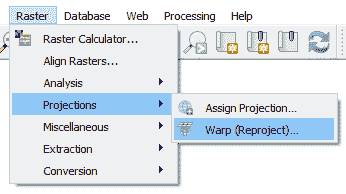

# 第二章：加载数据

接下来的两章都是关于在 QGIS 中使用数据的。在第三章创建数据中，我们将探讨如何构建和编辑 GIS 数据。在本章中，我们将从加载现有数据开始。QGIS 支持许多 GIS 数据格式。它使用 OGR 库处理矢量数据，使用 GDAL 库处理栅格数据。默认情况下，QGIS 使用 GeoPackage 格式。因此，我们将将其作为本书的默认格式。

本章将涵盖以下主题：

+   矢量、栅格和其他数据类型

+   GeoPackage

+   加载数据

+   投影

+   创建和保存项目

# GIS 数据

我所说的 GIS 数据是什么意思？通过矢量数据，我指的是点、线和多边形。最常见的文件格式是 Shapefile（多个文件组成一个 Shapefile）。通过栅格数据，我指的是（地理参考的）位图。最常见的文件格式是 GeoTIFF。

从[`github.com/PacktPublishing/QGIS-Quick-Start-Guide/blob/master/qgis_sample_data.zip`](https://github.com/PacktPublishing/QGIS-Quick-Start-Guide/blob/master/qgis_sample_data.zip)下载 QGIS 样本数据集。将其提取到您计算机上的工作目录中[.](https://qgis.org/downloads/data/)

在 QGIS 中，您现在应该能够在浏览器面板中看到这些数据，如下面的屏幕截图所示：

浏览器面板

# 加载数据

在 QGIS 中加载数据可以通过多种方式完成。以下三种最常见的方式如下：

+   您可以直接从文件夹（Windows 操作系统）中将数据拖动到地图中

+   您可以将数据从浏览器面板直接拖动到地图中

+   您可以点击“图层”|“添加图层”，然后选择要添加到地图中的图层类型

+   以这种方式打开数据源管理器

在下面的屏幕截图中，我们选择加载添加矢量图层，这也可以通过*Ctrl* + *Shift* + *V* 快捷键完成：

加载数据

这张屏幕截图展示了 QGIS 可以消费的所有不同数据类型。我们不会涵盖所有这些格式；我们提到它只是为了突出 QGIS 的数据能力。通过这种方式添加数据，您将打开数据源管理器，如下面的屏幕截图所示：

QGIS 数据源管理器

数据源管理器是向您的地图添加数据的一种非常不错的方式。您可以逐个添加文件，添加多个文件，或者同时添加不同类型的文件。打个比方，数据源管理器非常像是一个数据菜单：只需选择您想要的数据。

从之前下载的 QGIS 样本数据中，从`shapefiles`文件夹中加载`airport.shp`文件，从`raster`文件夹中加载`SR_50M_alaska_nad.tif`文件。这些数据应该加载到地图中，并显示如下：

加载数据后的 QGIS 概览

右键单击 `SR_50M_alaska_nad` 并选择缩放到图层以缩放到图层范围。这显示在以下截图中：

缩放到图层

选择项目 | 新建，不保存更改以清除项目并打开一个新的项目。

# GeoPackage

我已将 `shapefiles` 文件夹中的所有 Shapefiles 加载到 GeoPackage 图层中。您可以从这里下载此图层：[`github.com/PacktPublishing/QGIS-Quick-Start-Guide/blob/master/Alaska_GeoPackage.zip`](https://github.com/PacktPublishing/QGIS-Quick-Start-Guide/blob/master/Alaska_GeoPackage.zip)。

在浏览器面板中展开 `GeoPackage`，如下截图所示。在第三章 “创建数据”中，我们将探讨如何向此包中添加图层。现在，选择 `Airports` 图层并将其拖动到地图中，如下所示：

浏览器面板中的 GeoPackage

通过拖动更多图层并缩放到图层范围进行实验。这些数据看起来与我们之前加载的 Shapefiles 没有区别。如果你在文件管理器（例如 Windows Explorer）中查看该文件，而不是几个 Shapefiles 和与 Shapefile 相关的几个文件，我们只有一个文件。这使得 GeoPackage 格式（`.gpkg`）非常适合共享和管理项目数据。GeoPackage 格式没有文件大小限制，且平台无关，与 Shapefile 不同。

# 与数据交互

在本节中，我们将使用地图导航和属性工具栏。创建一个新的项目（项目 | 新建）并将以下数据从 GeoPackage 加载到 QGIS 项目中：

+   `Airports`

+   `majrivers`

+   `trees`

从 `raster` 文件夹加载 `SR_50M_alaska_nad.tif`。确保图层按此顺序排列。缩放到 `Airports` 图层的范围。您的屏幕应类似于以下截图：

添加图层后的 QGIS 概览

# 识别数据

从属性工具栏中，点击蓝色 i 按钮，然后在地图中的 `Airports` 图层上点击一个点。这将在新面板中显示要素属性；同样，像所有面板一样，您可以移动它并按需调整大小。点击的点将在地图中突出显示，其属性将显示，类似于以下截图：

识别工具

使用其他图层调查识别工具。请注意，在识别结果中显示的模式当前设置为当前图层。这意味着您只能看到当前活动图层的结果。模式中有四个选项：

+   当前图层

+   自顶向下，首次停止

+   自顶向下

+   选择

将模式设置为选择并点击地图上的另一个位置。这次，您将看到所有图层（与点击位置相关）的识别选项。这样，您可以选择要查询的要素。以下是一个示例截图：

识别所有图层

关闭识别结果面板。接下来，我们将查看如何选择数据。

# 数据选择

在 QGIS 中，选择数据有多种方法。在本章中，我们将查看属性工具栏中的绘图选择选项，这是我们已在第一章“QGIS 3 入门”中强调的内容。让我们从“机场”中选择一些数据。在图层面板中点击“机场”图层（确保它被突出显示）并选择“按区域或单击选择要素”按钮。请注意，还有其他从下拉按钮绘制选择的方法，包括按多边形、自由手绘和半径选择。在本例中，我们将使用默认的要素选择选项，如下面的截图所示：

按区域或单击选择要素

点击并拖动一个框围绕几个机场的点。选中的点将改变颜色。按*F6*或点击工具栏中的打开表格按钮。将出现“机场”图层的属性表。在左下角，将查询设置为“显示所选要素”。这如下面的截图所示：

机场图层属性表

在属性表中，点击“反转选择”（Ctrl+R）按钮（黄色直角三角形和清除三角形形成一个正方形），如下所示：

反转选择

反转数据选择通常很有用。例如，您可能想选择许多点，但只想排除少数几个。使用反转功能，您可以选择少数几个并反转选择以选择多数。关闭属性表，您将在地图上看到新选择的机场。从属性工具栏点击“从所有图层取消选择要素”以清除选择。这如下面的截图所示：

从所有图层取消选择要素

最后，让我们通过属性值在“机场”图层中选择一个要素。在属性工具栏中点击“按值选择要素”按钮。这如下面的截图所示：

按值选择要素

将出现一个选择对话框。将 ID 字段设置为等于`1`。点击“选择要素”按钮，选中的机场将在地图上突出显示。您可以点击“闪烁要素”以闪烁选中的机场，也可以点击“缩放到要素”以放大到选中的机场。

按值选择要素的对话框如下截图所示：

通过值选择功能对话框

点击关闭按钮并清除选择（使用之前显示的清除选择按钮）。注意，这里也可以使用通过表达式选择功能。我们将在本书稍后更详细地探讨表达式。

# 测量距离和面积

GIS 的一个常见功能是快速计算距离和面积。在第三章，*创建数据*中，我们将展示如何将特征面积写入属性表。然而，在本章中，我们将探讨从属性工具栏中可用的测量选项。

测量工具不需要在图层面板中选择图层即可工作。这意味着它是独立的。测量工具可以测量长度、面积或角度，您可以使用工具旁边的下拉按钮选择所需的选项。在这个例子中，让我们测量长度。选择测量线选项，然后在地图上左键单击开始测量。完成后，再次左键单击以测量线段。继续左键单击以测量线段，或右键单击终点以完成测量。

以下截图显示了机场之间的距离（以米为单位）：

QGIS 中的测量工具

将单位从米转换为千米，以显示在此比例尺上更有意义的距离。尝试测量面积；工具的工作方式与测量距离相同。在任何 GIS 中测量都取决于地图的投影。在下一节中，我们将探讨 QGIS 中的投影。

# 投影

QGIS 的默认投影（首次加载时）具有 EPSG 代码 4326（WGS 84）。除非更改，否则 QGIS 中的默认设置允许通过加载到地图中的第一个层的投影来设置地图的投影，假设数据与投影相关联。

本书不涉及各种坐标系统的详细内容；如果您想了解更多关于这方面的知识，那么一个很好的起点是维基百科上关于地理坐标系统的条目[`en.wikipedia.org/wiki/Geographic_coordinate_system`](https://en.wikipedia.org/wiki/Geographic_coordinate_system)。

suffice to say that getting the projection correct in your GIS is fundamental to any analysis, mapping, or derivation of knowledge from your data. The world is not flat and projecting your data is the process of taking the part of the Earth's surface you are working on and mathematically shrinking and distorting it so it fits on a plane. You can move from one projection system to another by transforming your data.

以`Airports`图层为例，图层的投影是 EPSG 2964，在加载数据时，你的 QGIS 项目将设置为这个投影。如果你添加了另一个投影的数据，那么 QGIS 将实时对你的数据进行重投影。这非常强大且有用，但请注意，你了解所有数据所在的投影系统。

为了说明投影，考虑将投影从 EPSG 2964 更改为 EPSG 4326，使用内部重投影参数。以下是我们的数据，在 EPSG 2964 投影下：

EPSG 2964 下 QGIS 项目的概述

在状态栏的右下角，你会看到 EPSG 2964\. 点击它并将投影更改为 WGS 84\. 在过滤器框中搜索`4326`，如下所示：

项目投影属性概述

点击确定并返回到你的地图。你会看到数据与之前表示得非常不同。以下屏幕截图中显示了此操作：

重投影数据概述

通过重复这些步骤并选择 EPSG 2964 来重置投影。

# 保存数据

在后面的章节中，当我们开始创建数据时，我们将在一个投影系统中工作。然而，在本节中值得注意，矢量数据（点、线和多边形）和栅格数据（位图）都可以保存为不同的投影。在`Airports`图层上右键单击并选择导出 | 保存要素为。在对话框中，你会看到一个选项为 CRS；这就是你可以更改投影系统的地方。

此对话框在以下屏幕截图中显示：

保存图层

对于栅格，从菜单栏中选择栅格 | 投影 | Warp（重投影）。以下屏幕截图中显示了此操作：

在 QGIS 中重投影栅格

`Warp`命令使用`gdalwarp`重投影栅格数据。以下屏幕截图中显示了将`SR_50M_alaska_nad`栅格重投影到 EPSG:4326 的示例：

重投影栅格工具

如果你滚动到对话框的底部，你会看到相应的`gdalwarp`命令。这可以粘贴到 OSGeo4W shell 中（如果你通过 OSGeo4W 安装程序安装了 QGIS）并在命令行上运行（就像许多 QGIS 功能一样）。

# 保存你的项目

我们可以将 QGIS 项目保存下来，以便将来返回。默认格式是`.qgz`。要保存项目，请转到选择项目 | 保存。我将其命名为`ch2.qgz`；在 Windows 资源管理器中显示如下：

将项目保存为.qgz 文件

# 摘要

我们已经探讨了 QGIS 中的地理/空间数据。我们讨论了矢量格式和栅格格式。本章介绍了默认文件新格式，GeoPackage。在下一章中，我们将创建 GeoPackage 中的数据。QGIS 仍然完全支持 Shapefiles 和 GeoTIFFs，它们在许多行业和 GIS 社区中仍然被广泛使用。在第七章，*扩展 QGIS 3*中，我们将探讨将文本文件导入和导出到 QGIS。

我们已经探索了通过属性工具栏来探索数据的方法。我们查看过查询、选择和测量数据。我们还能做很多事情，在下一章中，我们将探讨在 QGIS 中构建数据。
