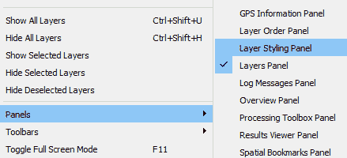
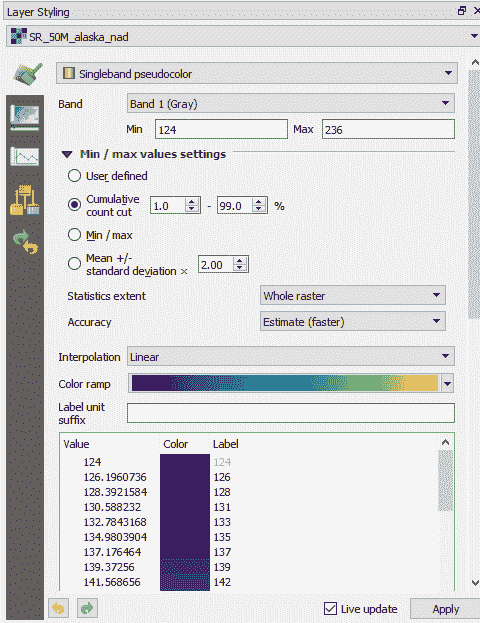

# 样式化数据

在本章中，我们将样式化 GIS 数据。我们将使用存储在 GeoPackage 中的数据。我们将根据属性表中的数据样式化矢量图层，并使用我们可用的各种渲染工具来样式化栅格数据。在创建样式后，您可以保存并重用它们。

QGIS 默认情况下会随机为每个图层分配颜色，这在编辑和创建时很有用，但我们希望更好地可视化我们的数据。这将帮助我们制作出更有用和令人愉悦的地图。这是本章的重点。

本章涵盖以下主题：

+   图层样式面板

+   样式化矢量数据

+   样式化栅格数据

+   保存样式文件

# 图层样式面板

图层样式面板提供了访问图层属性对话框样式选项的快捷方式。它允许用户更新图层的样式并立即在地图上看到更新。

打开 QGIS。从 GeoPackage 加载以下图层，并在图层面板中保持以下顺序：

+   `机场`

+   `majrivers`

+   `grassland`

+   `alaska`

图层按从上到下的顺序排列，点、线和多边形，以便于可见性。打开图层样式面板。通过点击视图 | 面板 | 图层样式面板来完成此操作，如下面的截图所示：

激活图层样式面板

一旦您打开了图层样式面板，请确保面板右下角的“实时更新”复选框被勾选，以便任何更新都可以在制作时看到。

右键点击`alaska`图层并选择缩放到图层选项。您的屏幕应该看起来类似于以下截图：

QGIS 中加载的所有图层的概述

# 样式化矢量数据

在本节中，我们将探讨样式化矢量数据的选择。我们将查看点数据的聚类和将其转换为热图。我们将查看阿拉斯加的主要河流的样式化，但首先我们将探讨样式化多边形数据的选择，从阿拉斯加的边界开始。

# 样式化多边形数据

在本节中，我们将样式化`alaska`和`grassland`图层。在图层面板中关闭所有其他图层。我们将通过前图中右侧的图层样式面板来样式化数据，因为它具有交互性。然而，如果您愿意，您也可以通过右键点击一个图层并选择属性然后符号选项卡来访问相同的信息。

选择单符号，并在符号层中输入然后选择形状爆发填充。形状爆发填充是多边形内部边缘的阴影。我为我`alaska`图层的边界选择了蓝色。将填充距离设置为 2.00 毫米，如下所示：

图层样式面板

这产生了很好的样式。我们可以进一步细化它。点击忽略多边形阴影时环的复选框旁边的复选框。然后，点击绘制效果按钮并选择自定义效果按钮。从结果对话框中，将效果设置为着色，如图所示：

图层样式面板中的高级多边形样式

`alaska`层现在应该被样式化并看起来类似于以下截图：

阿拉斯加边界样式化

接下来，打开`grassland`层。这次，我们将使用 F_CODEDESC 字段来样式化它。在此字段中，我们有两种类型：`grassland`和`Scrub/Bush`。这些数据被分为几类。QGIS 有一个根据字段中的类别可视化数据的渲染器；它被称为分类渲染器。将分类作为符号并选择 F_CODEDESC 字段。点击分类。

接下来，双击`grassland`并将其设置为酒红色符号，如图所示：

符号化草地

通过点击符号选择器标签旁边的蓝色三角形返回到原始样式选择窗口。双击`grassland`并将符号更改为点划线，如图所示：

符号化草地（2）

你的数据现在应该看起来类似于以下截图：

阿拉斯加已符号化的草地

我们有多种方式可以样式化多边形数据。探索样式菜单中的选项，这有助于在需要时调整你的可视化效果。接下来，我们将通过 GeoPackage 中的`majrivers`层来查看线样式。

# 样式化线数据 – 河流层

从图层样式面板顶部选择`majrivers`层。我们将使用此层创建一个由两种颜色组成的线条样式：填充颜色和轮廓颜色。在图层样式面板中选择单个符号。在此符号学下方，点击绿色加号图标添加一个新的简单线条。你现在应该看到两条线，它们看起来类似于以下：

将河流样式化为线条

将顶部简单线条改为厚度为 0.260000 的蓝色，底部为厚度为 0.460000 的灰/黑色。点击线条（直接在这两条线之上）以突出符号。这将稍微改变图层样式面板。在此面板底部，有一个标签为“高级”的按钮。点击此按钮并选择符号级别。从结果屏幕中，选择启用符号级别复选框。你的数据现在应该看起来类似于以下截图：

阿拉斯加已符号化的主要河流

接下来，我们将查看如何样式化`Airports`层。

# 样式化点 – 机场层

在样式化点方面有许多选项。首先，让我们看看一些选项。

点聚类选项通过聚类接近其他点特征的点特征来样式化点图层。它将一个数字样式分配给聚类点，以指示聚类的点数。打开`Airports`图层，在图层样式面板中选择点聚类。接受默认设置。现在您应该有一个带有该位置点（簇）数的红色标记。您的地图应该看起来类似于这个：

显示为簇的机场数据的阿拉斯加

热力图创建是点数据的另一种选项。类似于聚类，我们可以即时创建点的密度热力图。从下拉列表中，这次选择热力图。选择合适的颜色渐变；在以下示例中，我选择了光谱颜色渐变。与`Airports`数据集相关的点数据相当稀疏，而且，实际上在这里的热力图对数据可视化并没有太大的作用。然而，了解它是一个有用的工具：

从点数据创建热力图

更好的方法是将机场位置显示为飞机符号，而不是热力图或点簇。在图层样式面板中使用分类选项进行符号化。选择 USE 作为列，这将定义机场是否为以下：

+   民用/公共

+   联合军事/民用

+   军事

+   其他

这在下面的屏幕截图中显示：

按类别样式化的机场

通过以这种方式显示数据，可以清楚地看到大多数机场都被归类为其他类别。这有助于我们更好地样式化地图。这样，我们可以通过复选框打开/关闭我们希望显示的机场。如果我们只想显示民用机场，我们可以取消选中所有其他机场类型。生成的地图将如下所示：

显示民用机场数据的阿拉斯加

# 数据管理的一点说明

通过直接查询数据仅显示数据选择，可以实现与上一节相同的结果。我们可以复制相同的图层，查询它，并不同地符号化，而不会对底层数据产生影响。要复制机场数据，在图层面板中右键单击图层并选择复制图层。这将再次将完全相同的图层添加到地图上。现在您可以更改符号化，或添加标签（更多内容请参阅第五章，*创建地图*）。

右键单击新图层并选择筛选。您可以使用查询构建器构建一个查询，仅选择军事机场。双击字段中的 USE，然后从操作符中选择=，最后在值中选择所有并选择军事。查询构建器将如下所示截图：

使用查询构建器选择数据

点击“确定”，然后再次点击“确定”以退出属性对话框。现在，地图上只显示军事机场。这种过滤是另一种处理数据的方式。如果你只打开此图层的属性表，则只会显示过滤特征。

# 样式化栅格数据

关闭所有矢量图层。在本节中，我们将专注于渲染栅格数据。将`SR_50M_alaska_nad`和`landcover`图层加载到地图中。我们将对这些图层进行风格化。风格栅格数据的选项包括以下内容：

+   多波段颜色：当你有三个或更多栅格波段（例如卫星图像）时，此选项允许你选择哪些波段用于红色、绿色和蓝色通道

+   调色板/唯一值：为离散栅格数据（例如`landcover`分类）着色

+   单波段灰色：对连续栅格数据（例如高程数据）应用从黑到白或从白到黑的颜色渐变

+   单波段伪彩色：将对连续栅格数据（例如高程数据）应用颜色渐变

+   阴影图：将 DEM 即时风格化为阴影栅格

`SR_50M_alaska_nad`图像将默认加载为单波段灰色。在图层风格面板中，将符号类型更改为单波段伪彩色。展开最小/最大值设置并选择累积计数切分到 1%到 99%，保持插值方式为线性（因为它是一个连续的栅格数据集），并选择 Viridis 作为颜色渐变。

图层风格面板应类似于以下屏幕截图：

使用单波段伪彩色渲染器风格栅格

当处理连续栅格数据时，调整设置以适应你的数据是值得的。尝试不同的拉伸设置和颜色渐变，以最好地解释数据。

`landcover`数据在加载时使用调色板/唯一值符号显示。由于这是离散数据（它有定义的类别），这是显示`landcover`数据最合适的符号类型。你可以通过双击颜色来调整类别颜色。这将打开图层风格面板中的颜色选择工具，它提供了几种调整颜色的方法。这在上面的屏幕截图中显示：

QGIS 中的颜色选择器

选择一个类别的最合适的颜色后，点击“应用”。在这种情况下，我们不知道每个类别代表什么，所以在这个阶段选择颜色是任意的。回到图层风格面板，我们可以为我们的标签分配文本，这在制作包含这些数据的地图时非常有用。当你对图层风格面板进行更改时，地图/图层面板将实时更新。这在上面的屏幕截图中显示：

样式化土地覆盖栅格文件的概述

# 栅格工具栏

通过视图 | 工具栏 | 栅格工具栏打开栅格工具栏。这在上面的屏幕截图中显示：

栅格工具栏

您可以使用此工具栏来拉伸您的连续栅格数据（例如，DEM 或卫星影像数据）。这是通过之前显示的前四个按钮完成的，使用各种拉伸方式。在最后四个按钮上，您可以增加/减少栅格的亮度并增加/减少对比度。此工具栏提供了方便的工具，可以快速调整您的数据。然而，如果您想要更多控制，那么请使用之前演示过的图层样式面板。

# 保存样式

将数据样式化以在地图上展示可能需要花费大量时间，您可能希望将来重用和/或调整您创建的样式。这可以通过将样式保存为样式文件来完成。为此，右键单击一个图层并选择属性。

在图层属性对话框的左下角有一个名为样式的按钮，如以下屏幕截图所示：

保存样式

选择保存样式。有三种保存样式的选项。您可以将`.qml`文件保存到项目目录中，您可以将样式保存为 SLD（样式图层描述文件，通常用于在线样式化栅格数据，例如在 GeoServer 中），或者您可以直接将其保存到 GeoPackage 中。在这种情况下，我选择将其保存为`.qml`文件，所有类别都开启，在我的项目目录中。点击确定关闭图层属性对话框。右键单击图层，选择移除图层以将其从项目中移除。现在，将图层添加回来，样式将设置为默认。右键单击图层，从样式按钮中选择加载样式，并选择刚刚创建的样式。

保存你的项目。在下一章中，我们将使用这种样式化的数据来制作地图。

# 摘要

我们已经探讨了矢量数据和栅格数据的样式化。我们使用图层样式面板使样式化交互式。我们探讨了在 QGIS 中样式化多边形、线和点的一些方法。然后，我们转向探讨样式化连续和离散栅格数据的方法。最后，我们展示了如何保存样式并将它们应用到图层上。

在下一章中，我们将探讨如何使用标签添加额外信息，然后创建可以打印或导出为文件以便共享的地图。
