# 创建地图

在本章中，我们将使用 QGIS 创建地图。我们将使用上一章中的样式和数据。在构建地图之前，我们将查看标签功能。QGIS 在创建地图方面非常出色。查看这个画廊以了解 QGIS 的功能：[`www.flickr.com/groups/qgis/pool/`](https://www.flickr.com/groups/qgis/pool/)。

本章涵盖的主题如下：

+   标签

+   创建地图

+   保存和导出地图

+   创建地图集

+   构建网络地图

# 标签

打开我们在第四章，*数据样式*中构建的 QGIS 项目。我们将使用它来构建地图。通过选择视图 | 工具栏并选择标签工具栏来打开标签工具栏。标签工具栏如下所示：

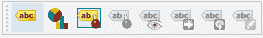

标签工具栏

在这个工具栏上有八个按钮；按顺序，它们如下：

+   点击“图层标签选项”将打开图层样式面板，并默认打开标签选项卡

+   图层图表选项

+   突出显示已锚定的标签和图表

+   锚定/取消锚定标签和图表

+   显示/隐藏标签和图表

+   移动标签和图表

+   旋转标签

+   更改标签，用于标签编辑

确保在图层面板中选择了“机场”图层。在标签工具栏上点击图层标签按钮。这将打开图层样式面板；我们在上一章中使用它来设置图层样式。选择单个标签和带有 NAME 的标签来标记所有“机场”。我已经将文本大小从 10.0000 点减少到 8.0000 点。确保勾选了“实时更新”旁边的复选框，以便在更新时可以看到任何更改。这在上面的屏幕截图中显示：

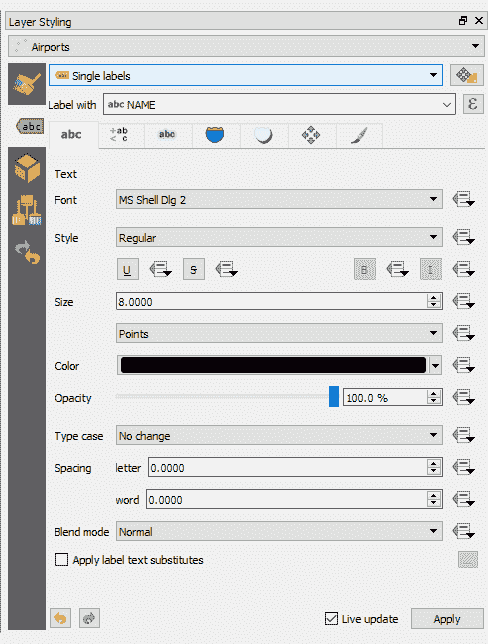

图层样式面板——标签设计重点

这些是默认的标签选项。您所做的任何更改都将立即在地图中显示。并非所有标签都将放置得完美。一个好的方法是尽可能多地使用位置选项卡将标签放置在最佳位置，如果它们仍然没有放置得最优，则手动移动单个标签。

在打开标签选项卡后，选择位置选项卡（带有四个箭头指向北、南、东和西的图标）。选择“从点偏移”旁边的单选按钮，并在显示窗口中点击顶部中间象限。这将使所有标签直接向北（如您查看地图时所见）从“机场”图标移动。调整偏移 X，Y 为 0.0000,-2.0000 以夸大与图标的距离。这在上面的屏幕截图中显示：

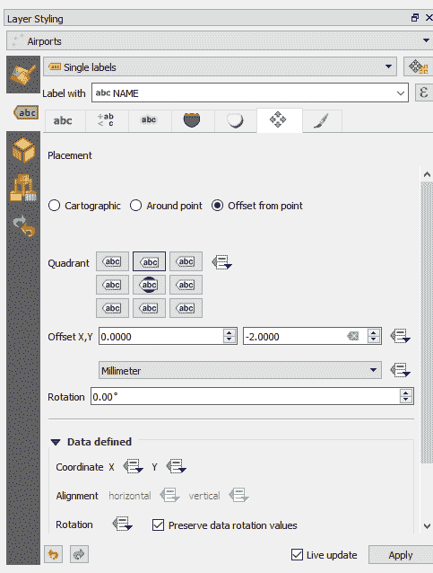

图层样式面板——标签位置重点

现在我们已经放置了标签，让我们使用我们可用的选项之一来设置它们的样式。点击缓冲区标签（图标显示为蓝色背景下的 abc）。接下来，勾选旁边的“绘制文本缓冲区”复选框。这有助于我们的标签从地图中脱颖而出。点击自定义效果按钮，勾选旁边的“阴影”复选框，并将其不透明度设置为 50.0%。这如图所示：

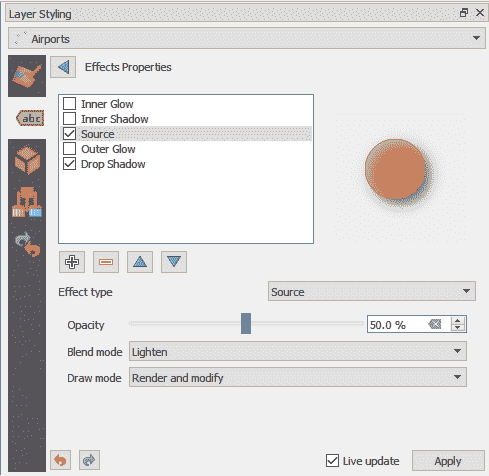

图层样式面板—标签效果属性

地图现在看起来像这样：

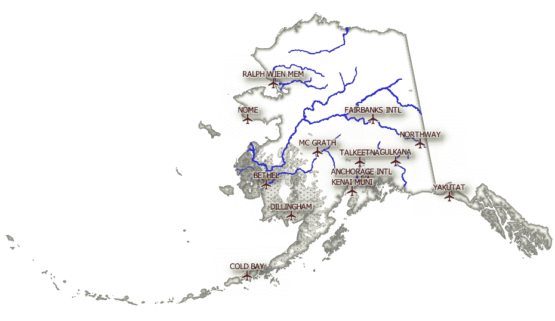

添加了图层后的地图

如你所见，靠近安克雷奇国际机场的标签存在问题。让我们使用交互式标签工具栏手动移动这些标签。还有一些标签没有显示；在下一节中，我们将手动移动它们。

# 手动移动标签

要交互式移动一个标签，请点击标签工具栏上的“移动标签和图表”按钮，接受 ID 作为主键。接下来，点击一个标签并移动它。当你点击并拖动一个标签时，一个放置框以绿色出现在新标签位置。这如图所示：

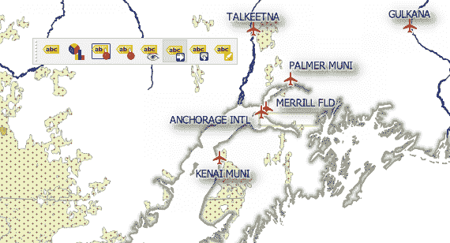

添加标签

保持放大和缩小地图，以确保你的标签放置在最适合你的数据的位置。你还有许多其他选项，我们不会在本快速入门指南中介绍，但旋转（如图在标签工具栏上突出显示如下）很有用，尤其是在线性特征上：


标签工具栏

标签工具栏最右侧的按钮允许你一次更改一个标签的个别属性；大小、颜色和字体大小都可以逐个标签设置。你的地图将看起来类似于以下截图：

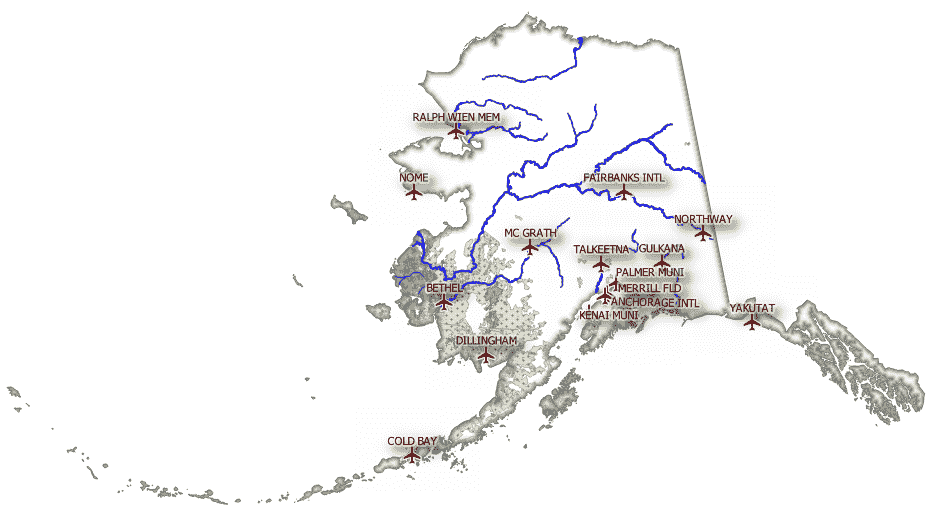

标签放置与调整

如果你想要标记河流和草地区域，请使用我们刚刚描述的工具应用标签。

现在我们已经准备好将所有这些整合在一起并制作地图。

# 在 QGIS 中制作地图

点击项目 | 新建打印布局（或点击项目工具栏上的相应按钮）。

在创建打印布局标题对话框（如下所示）中，给你的新、空地图添加一个标题并点击确定：


创建新的打印布局

现在，你将有一个空白的画布，我们将在其上构建我们的地图。通过菜单进入添加项目 | 添加地图，将你的地图添加到布局画布中。然后，点击并拖动鼠标在你想放置地图的位置绘制画布。这将添加一个名为“地图 1”的项目；我们稍后会添加更多项目。这如图所示：

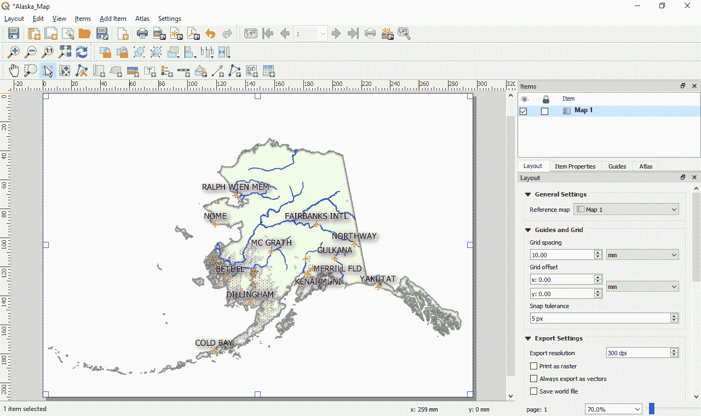

地图布局

请注意，为了便于阅读本书，标签大小已经增加。

因此，你会发现屏幕截图与你的屏幕略有不同。

选择“地图 1”，点击“项目属性”选项卡，并将比例设置为`12000000`，这样就可以在页面上显示所有数据。确保工具箱工具栏已启用（视图 | 工具栏 | 工具箱）。这是一个非常有用的工具栏，因为它允许我们设计我们的页面。点击“移动项目内容”按钮，如下所示：

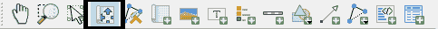

移动项目按钮——用于在地图上移动项目

这个工具允许我们将地图中的数据移动到最佳位置以适应页面。当你满意它在正确的位置时，点击“平移地图”（手形图标）。

要添加图例，点击添加图例按钮。绘制一个区域，图例将出现在地图上。图例最初可能看起来很杂乱，但我们可以通过“项目属性”进行调整。确保在“项目”面板中选择图例，然后在“项目属性”选项卡中添加一个标题（图例）并取消勾选自动更新复选框。我们可以移除图例中不需要的任何图层。在地图中，“阴影”和“土地覆盖”栅格仍然存在。要移除这些，点击图层名称，然后点击红色减号按钮将其从图例中移除。如果您想将图层添加回来，则点击绿色十字按钮以显示选择图层列表。完成图例后，在“项目属性”中向下滚动并展开字体。

在这里，将标题字体设置为粗体。现在的地图看起来是这样的：

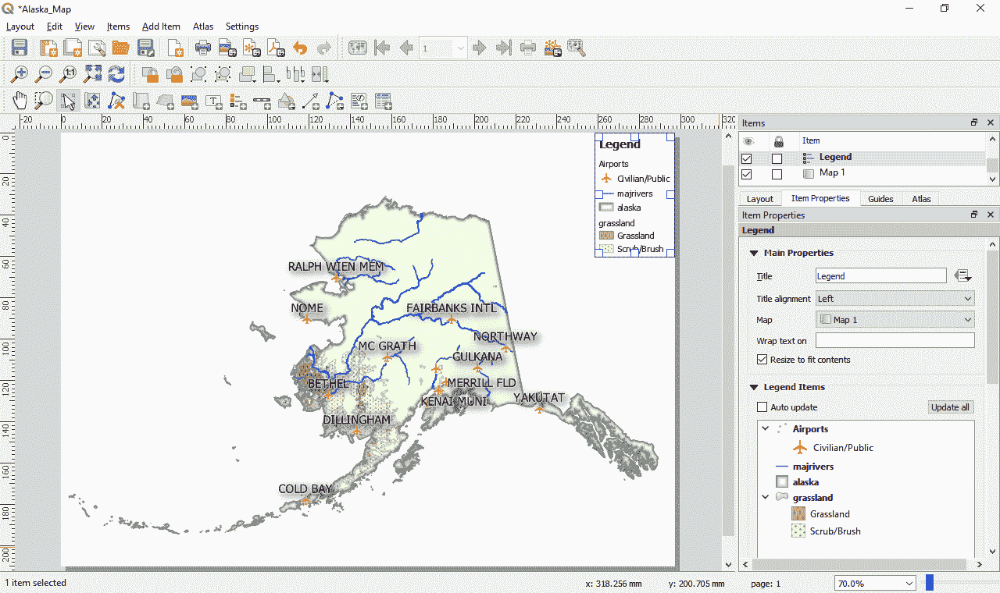

添加图例的地图布局

接下来，添加一个比例尺。在工具箱工具栏中，选择比例尺工具，并将新的比例尺拖动到地图的右下角。在比例尺的“项目属性”中，将样式设置为“双框”并将单位设置为英里。将单位值的标签从“mi”更改为“Miles”。

通过点击“添加项目”|“添加图片”，添加一个指向北方的箭头。使用北方的项目属性来指向计算机上存储 QGIS SVG 文件的地点。在这个例子中，我使用的是`C:\OSGeo4W64\apps\qgis\svg\arrows\NorthArrow_11.svg`。

现在，我们需要添加一个标题和描述。要将文本添加到这个地图中，选择“添加项目”|“添加标签”。在左下角绘制一个框，然后在“项目属性”窗口中，复制以下文本：

```py
<h1>A QGIS built map of Alaska</h1>
<h2>This map was created in QGIS 3.4</h2>
<p>We used the following data</p>
<ul><li>Airports</li>
<li>Grassland</li>
<li>Rivers</li>
<li>Alaska boundary</li></ul>
```

点击“渲染为 HTML”。

为了完成，我们可以为地图设置一个背景颜色。在“项目”面板中选择“地图 1”，然后在“项目属性”中的背景选项中滚动。选择一个中性颜色；我选择了浅灰色。调整透明度到一个合适的水平，以免分散观众的注意力。在“项目”面板中选择图例，并将其背景设置为与地图背景相同的颜色。

最后，从工具箱工具栏中，点击添加形状图标。选择一个矩形并围绕标题绘制。选择该项目，然后在“项目属性”中，将填充更改为无填充并将边框设置为黑色（默认为黑色）。然后，将圆角半径设置为 3.00，这样文本框的角落就是圆滑的。

您的地图将类似于以下截图：

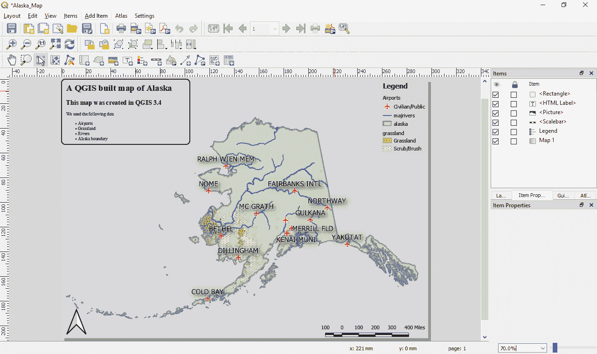

QGIS 3.4 中更新的地图布局

通过布局 | 保存项目来保存您的地图。要将它保存为`.pdf`格式，请点击布局 | 导出为 PDF。您可能需要调整导出设置，例如 dpi 值，以获得最佳的地图输出。为此，请点击屏幕右侧的布局标签（在项目属性旁边）。在此屏幕上，您将有机会更改各种设置。布局标签如图所示：

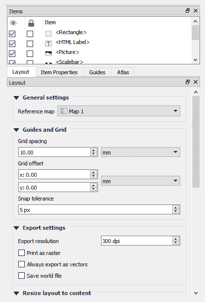

布局设置

# 创建图集

关闭我们刚刚创建的布局，并返回到 QGIS 主项目屏幕。在这个例子中，我们将创建一个关于民用机场周边地区的图集。为此，请使用只包含民用机场的 NAME 字段。让我们创建一个新的基本布局来展示这个功能。我们可以通过选择项目 | 新打印布局，或者通过布局管理器项目 | 布局管理器来实现。让我们选择布局管理器。这是一个有用的对话框，列出了 QGIS 项目中的所有创建的布局。如图所示：

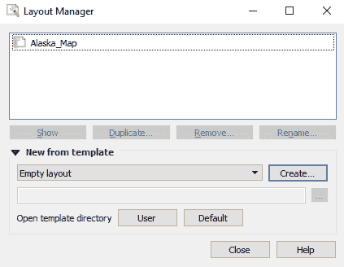

QGIS 布局管理器

选择空布局并点击创建以打开一个新的空白模板。我将把我的新布局命名为`Airport_Atlas`：

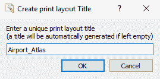

创建一个新的打印布局

就像我们在创建阿拉斯加地图时做的那样，选择将新地图添加到布局的按钮，然后点击并拖动以用 QGIS 项目的数据填充地图页面。从菜单栏中选择图集 | 图集设置，然后勾选“生成图集”旁边的框。现在，选择覆盖层为“机场”和页面名称为“NAME”。这将告诉图集为每个机场名称创建一页：

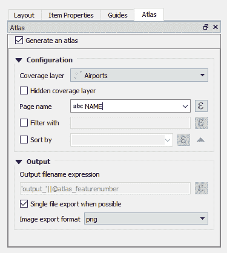

生成图集的选项

在项目属性标签页中，确保已勾选“由图集控制”；这意味着比例/视图将调整到每个要素。接下来，确保大纲工具栏已开启。工具栏如图所示：

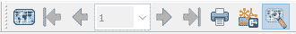

大纲工具栏

点击图集工具栏中的预览按钮，并使用箭头滚动查看建议的图集。如图所示：

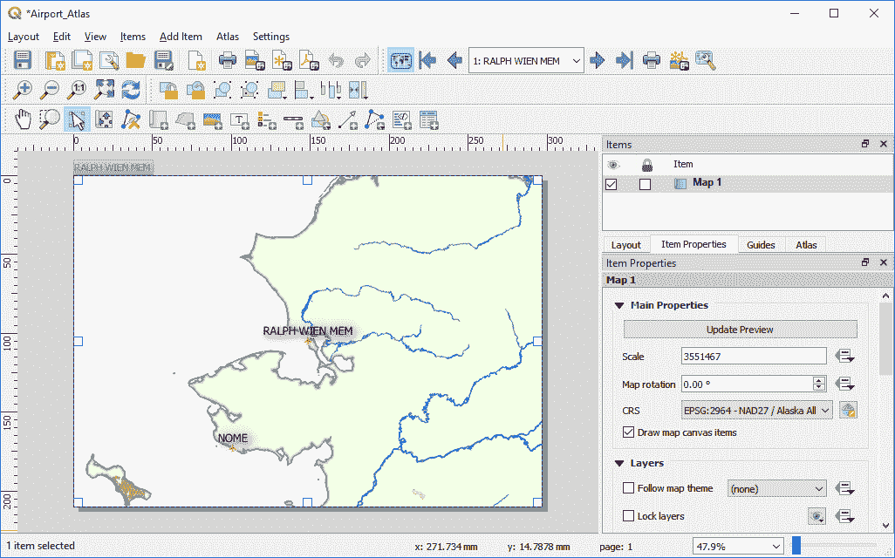

在图集功能中创建的地图

比例可能需要调整以适应您的需求。您可以添加标题、图例、比例尺和北箭头，就像我们在前面的例子中所做的那样。完成之后，从菜单中选择图集 | 导出图集为`.pdf`并保存到磁盘。这是一个简单的例子，但它展示了创建图集的基本方法；您只需构建一个布局即可完成。完成布局后，保存并关闭它。

最后，在本章中，我们将快速浏览创建网络地图的过程。

# 创建网络地图

我们不仅可以创建打印或静态的数字地图。通过创建网络地图，用户可以在线与地图进行更多交互。QGIS 有一个插件可以让你将数据以网络地图的形式展示。这为共享地图提供了另一种选择。在这个简短的例子中，我们将介绍 QGIS 插件以及 `qgis2web` 插件如何让我们创建网络地图。

插件是 QGIS 中非常强大且具有协作性的功能。开发者和公司已经创建了众多插件，这些插件扩展了 QGIS 的核心功能。其中一些插件已经如此关键，以至于它们被整合到了主软件中。从插件菜单中选择“管理”和“安装插件”。

在接下来的两章中，我们将更详细地探讨插件，第六章 *空间处理* 和 第七章 *扩展 QGIS 3*。

在插件管理器中，选择“全部”标签，搜索并安装 `qgis2web`。安装完成后，关闭插件管理器。在菜单中，应该有一个名为“网络”的选项。从这里，选择 qgis2web | 创建网络地图。调整图层和组以匹配您希望创建的地图。在这个例子中，选择了 `Airports`、`majrivers` 和 `alaska` 图层。这张地图将使用 `Leaflet` JavaScript 库；这是一个用于创建轻量级网络地图的库。以下是 qgis2web 的截图：

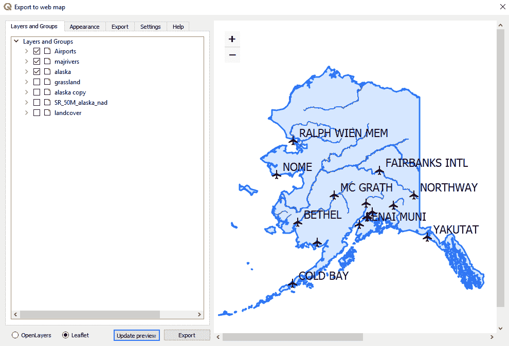

QGIS qgis2web 插件概述

当你对配置满意时，点击“导出”按钮；这将把网络地图保存到指定的“导出”文件夹中。然后，在您的网络浏览器中打开生成的网络地图。您可以将“导出”文件夹中的内容复制到网络服务器上以发布地图。`qgis2web` 插件是创建网络地图的一种非常高效的方式。

# 摘要

在本章中，我们使用 QGIS 构建了地图。我们首先查看标签选项，包括使用规则和交互式更改单个标签。然后，我们使用上一章中设计的样式数据构建了一张地图。接着，我们探讨了如何创建图集，最后查看使用 `qgis2web` 插件将地图导出到网络上的选项。

在下一章中，我们将探讨空间分析，帮助从数据中提取更详细的空间信息。
