# 扩展 QGIS 3

在本章的最后一章中，我们将探讨扩展 QGIS。我们将通过模型构建器将工具组合成一个模型。这有效地使我们能够构建自己的可重用模型，使用参数我们要么硬编码在模型中，要么留给用户调整。在最后，我们将简要查看插件的范围，以及随着 QGIS 熟练程度的提高，我们可以创建脚本的 Python 命令行。

这些是本章涵盖的主题：

+   模型构建器

+   插件

+   Python 命令行

# 模型构建器

你可能还记得在第六章“空间处理”中，我们运行了几个工具来利用区域直方图的答案来分析缓冲管线走廊中地形（`Landcover`）的分布。打开一个新的 QGIS 项目并加载`Pipeline`图层和`Landcover`。

要创建一个模型，请转到处理 | 图形模型器以打开模型构建器，在那里我们可以从不同的输入和算法中选择我们的模型。图形模型器在以下屏幕截图中显示：

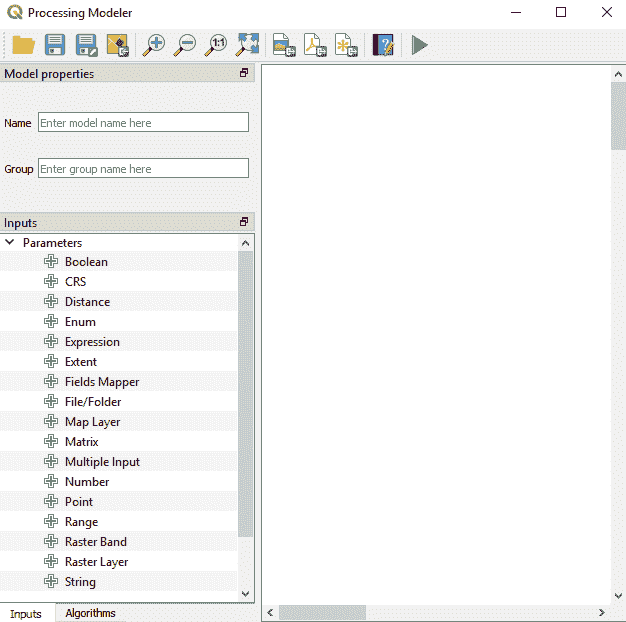

图形模型器

选择输入选项卡并选择矢量图层。添加一个名为`Pipeline`的新参数并将几何类型设置为线；这在上面的屏幕截图中显示：

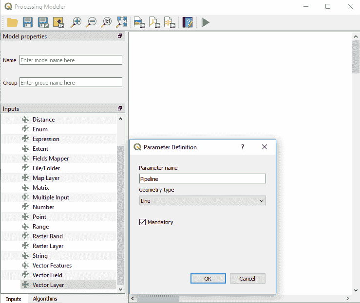

创建一个作为几何类型的管线属性—线

点击“确定”。现在，添加栅格图层并命名为`Landcover`。在算法选项卡中，我们可以使用顶部的过滤器来缩小我们搜索正确算法的范围。搜索`buffer`并双击以打开算法。将距离填写为`15000`并勾选复选框以确保图层被溶解。

现在，搜索并打开区域直方图工具，将前缀更改为`Terrain_`。这是我们最终的输出，所以告诉模型它是最终结果。最终输出是模型成功运行后返回给用户的内容。输入应类似于以下对话框：

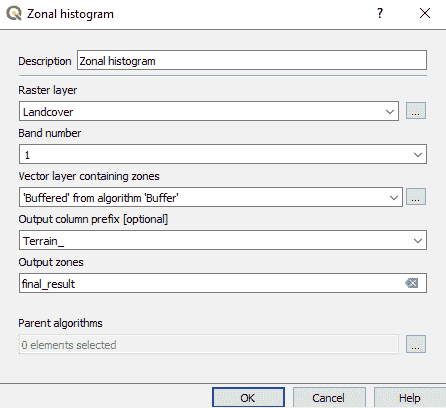

区域直方图工具

点击“确定”。为了完成模型，我们需要输入模型名称（`Pipeline_impact_terrain`）和组名称（`QuickStart_QGIS`）。处理将使用组名称来组织我们创建的所有模型到不同的工具箱组中。模型现在已完成。完成的模型将如下所示：

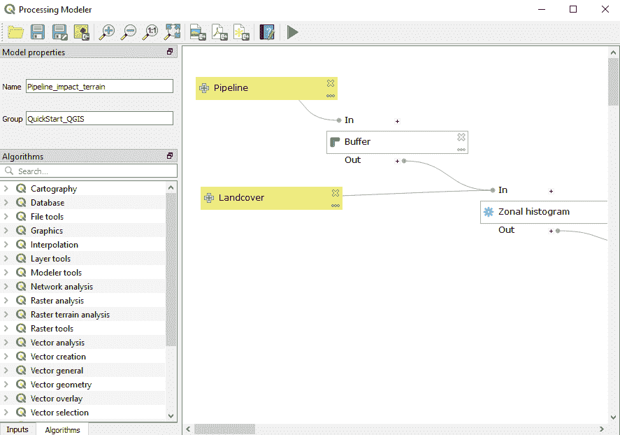

显示模型的图形模型器

点击保存图标并将其保存为`terrain_stats.model3`。点击绿色三角形或按 *F5* 运行模型。应该会出现如下对话框：

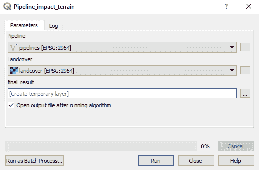

作为工具表示的模型

点击运行以执行模型。管道输出将出现在 QGIS 地图窗口中。关闭模型器后，我们可以像使用任何其他工具一样运行保存的模型。在处理工具箱下的模型中查找。这个新创建的模型将出现在那里，如下面的截图所示。甚至可以使用一个模型作为另一个模型的构建块：

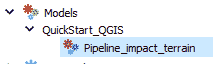

模型出现在处理工具箱下的模型中

另一个有用的功能是，我们可以指定需要自动应用于处理结果的图层样式。此默认样式可以通过在创建的模型工具箱的上下文菜单中右键单击并选择编辑、渲染样式来设置输出。这意味着如果您愿意，您可以自动化地图的构建。

您可以通过将`.model3`文件提供给他人来共享您的模型。这是扩大 QGIS 使用范围的第一步。保存您的项目。

# QGIS 插件

我们在第五章“创建地图”中简要介绍了插件。我们使用 qgis2web 将我们的阿拉斯加地图转换为网络地图。以下是按下载量排名的顶级插件列表：[`plugins.qgis.org/plugins/popular/`](https://plugins.qgis.org/plugins/popular/)。您可以使用此页面搜索插件或查看标签以查看不同的插件及其功能。

插件通过插件菜单访问。一些插件是实验性的。所谓实验性，意味着它们可能不稳定或在开发初期，但如果有插件可能有助于您的流程，打开这些插件是值得的；只是要小心使用。从插件对话框中，选择设置并勾选“显示实验性插件”旁边的框：

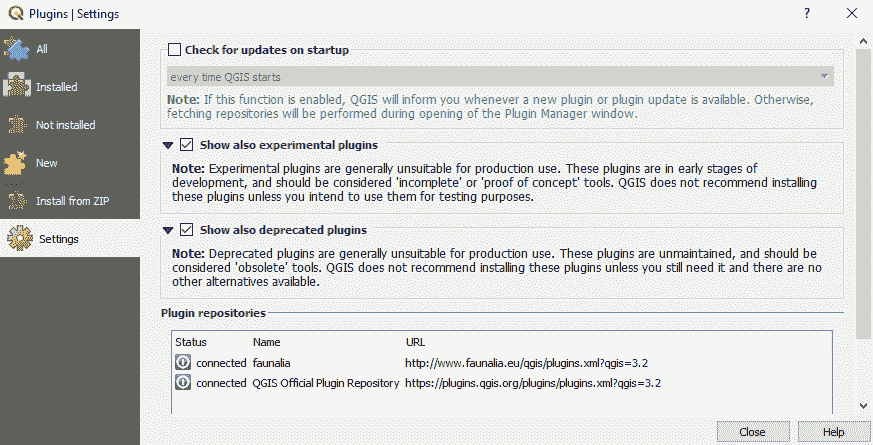

插件设置

# 半自动分类插件

**Semi-Automatic Classification Plugin**（SCP）为 QGIS 提供了对遥感图像的监督分类功能，提供了卫星图像下载、预处理和后处理的工具（[`plugins.qgis.org/plugins/SemiAutomaticClassificationPlugin/`](https://plugins.qgis.org/plugins/SemiAutomaticClassificationPlugin/)）。这是一个功能强大的工具，显著扩展了 QGIS 的遥感功能。

在本例中，我们将使用 SCP 下载覆盖我们数字化部分阿拉斯加的`Sentinel-2`图像：火岛。在此阶段，请确保您在**Copernicus Open Data Hub**上有账户。您可以在：[`scihub.copernicus.eu/dhus/#/self-registration`](https://scihub.copernicus.eu/dhus/#/self-registration)进行注册。

打开一个新的 QGIS 项目，并在浏览器面板中添加来自 `XYZ Tiles` 的 `OpenStreeMap` 数据，然后添加我们从 第三章 “创建数据” 中创建的 `Fire_Island` GeoPackage 中的 `Island_Outline` 图层。确保状态栏中的地图项目设置为 EPSG 3857。

要安装 SCP，选择插件 | 管理和安装插件。点击“全部”标签页，搜索 SCP，然后点击“安装插件”。将出现两个新的工具栏和一个新的面板。在这个例子中，我们将只查看 SCP 工作工具栏，如下所示：


SCP 工作工具栏

点击工具栏最左边的按钮；这将打开一个对话框，如下面的截图所示：

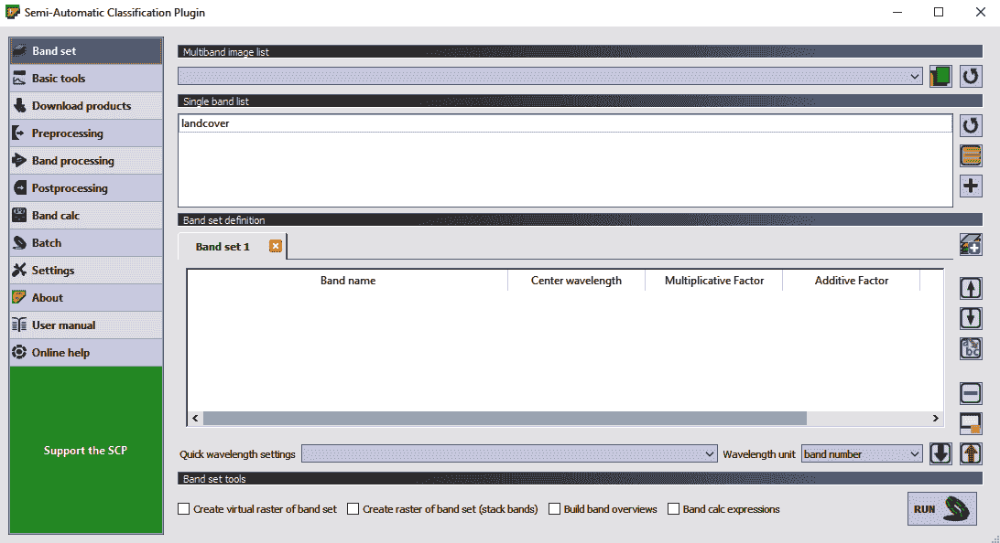

半自动分类插件对话框

假设您已经在 Copernicus Open Data Hub 上设置了账户，然后点击“下载产品”菜单并选择“登录数据”标签页。在此，输入您的用户名和密码。接下来，选择“搜索”标签页，从产品列表中选择`Sentinel-2`，将日期范围设置为 2018 年 11 月 01 日至 2018 年 12 月 01 日，并将云量设置为 25%，如下面的截图所示：

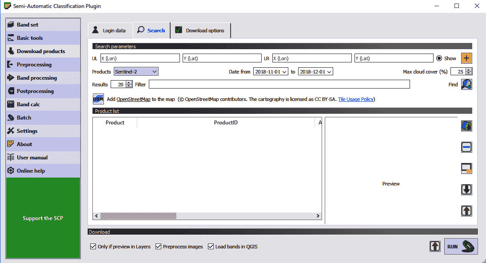

设置搜索参数

要定义我们正在搜索的区域，点击带有橙色背景加号的按钮，最小化窗口，然后返回到主 QGIS 屏幕。左键单击以获取 **左上角**（**UL**），右键单击以获取 **右下角**（**LR**）。你应该会在地图上画出一个如下所示的框：

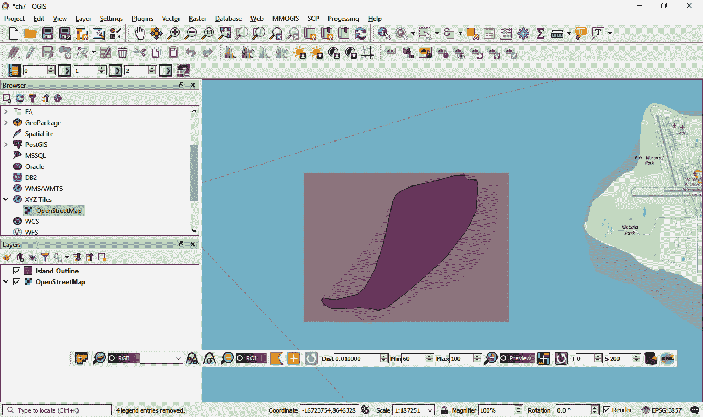

定义搜索区域的概述

前往插件（您之前可以点击插件按钮，或者只需最大化 SCP 插件窗口）。如果您对搜索参数满意，点击“查找”旁边的按钮。结果将在产品列表中返回。您可以点击每个选项以找到最佳图像。这如下面的截图所示：

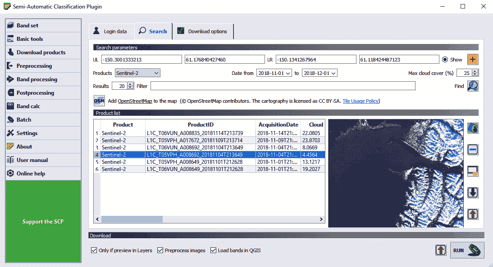

选择图像

如果您取消选中“仅在图层预览中”选项，此时您可以点击“运行”（右下角）。这将下载大量数据并对其进行预处理（校正大气效应）。在这个例子中，为了节省下载大小，选择下载选项并仅选择波段 2、3 和 4 以及辅助数据。这将使我们能够创建真彩色卫星图像。我还已关闭“预处理图像”选项以简化此说明。这些选项如下面的截图所示：

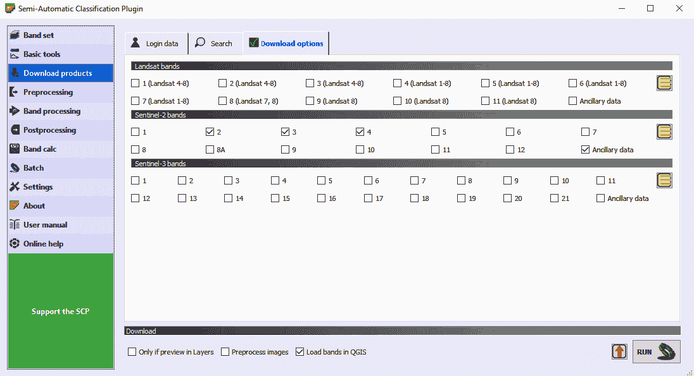

指定下载选项

在“搜索”标签页中，我已启用“仅在图层预览中”选项并点击了“在地图中显示突出显示图像预览”按钮。这已将我选择的产品添加到我的地图中。这如下面的截图所示：

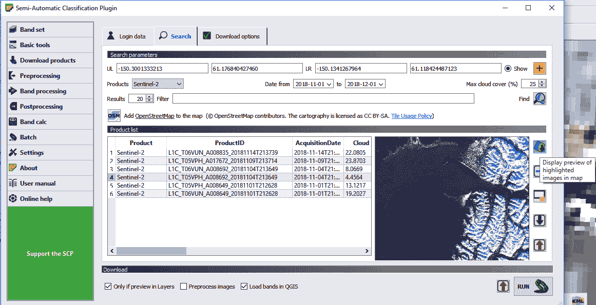

通过对话框显示层的预览

最后，点击 RUN 按钮，选择你希望保存数据的文件夹，并让数据下载。完成后，你应该会在 QGIS 中以层的形式加载你的 `Sentinel-2` 图像。这个插件的功能远不止这里所涵盖的。如果你有兴趣进一步探索可用的功能，包括使用 QGIS 对卫星数据进行分类，请访问 [`fromgistors.blogspot.com/p/semi-automatic-classification-plugin.html`](https://fromgistors.blogspot.com/p/semi-automatic-classification-plugin.html) 以获取详细的文档、视频和指南。

应该将卫星数据加载到 QGIS 中。使用栅格工具栏，拉伸其中一个波段直到你可以看到它（有时图像加载得很暗，特别是如果其中包含大量的海洋）。你的屏幕应该看起来如下：

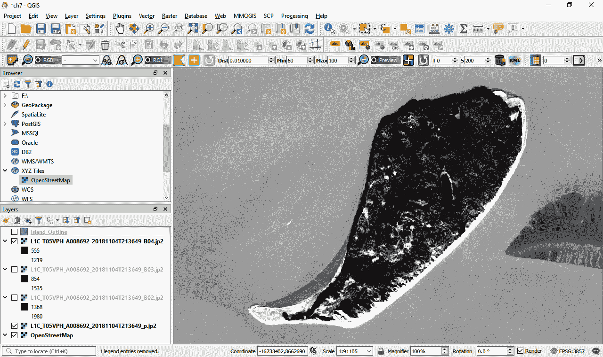

下载的卫星图像出现在 QGIS 中

有许多其他插件可用；使用插件管理器搜索并探索新的工具以进行工作。

# 使用 Python 命令行

从插件工具栏中选择 Python 控制台按钮，或按 *Ctrl* + *Alt* + *P*，或从插件菜单中选择 Python 控制台。

Python 已经成为 GIS 的首选编程语言。在这本书中，我们将只查看 QGIS API 的基础知识。随着你变得更加高级，你可以使用 Python 开发自己的插件和自定义脚本。最终，你可以使用 QGIS Python 库（PyQGIS），在 QGIS 之外构建应用程序。

打开一个新的空 QGIS 项目。

# 加载层

要加载一个矢量层，我们使用 `iface` 的 `addVectorLayer()` 函数。`iface` 类用于访问 QGIS 界面的图形部分。在以下示例中，我将 `airport.shp` 添加到地图中。这在一行代码中显示，如下所示：

```py
Airport_layer = iface.addVectorLayer('D:/QGIS_quickstart/qgis_sample_data/shapefiles/airports.shp','airports','ogr')
```

按下 *Enter* 键，`airports` 层现在已加载（更改到你的 Shapefile 路径）：

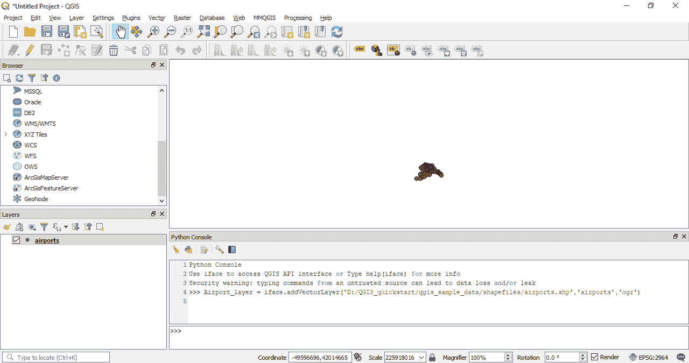

加载到 QGIS 地图中的机场 Shapefile

添加另一个层：

```py
Alaska_layer = iface.addVectorLayer('D:/QGIS_quickstart/qgis_sample_data/shapefiles/alaska.shp','alaska','ogr')
```

现在我们已经将 `alaska` 边界和 `airports` 层添加到了地图中。

# 检查层

我们可以通过访问一些属性来查看每一层。要获取层的名称，请使用 `.name()` 函数：

```py
Airport_layer.name()
```

输出如下：

```py
'airports'
```

要计算层中的记录数，请使用 `featureCount()` 函数：

```py
Airport_layer.featureCount()
```

输出如下：

```py
76
```

要打印所有这些 `76` 层的属性，请使用 `for` 循环：

```py
airportFeatures = Airport_layer.getFeatures()
for feature in airportFeatures:
    print (feature.attributes()
```

记得使用缩进。结果看起来会像这样：

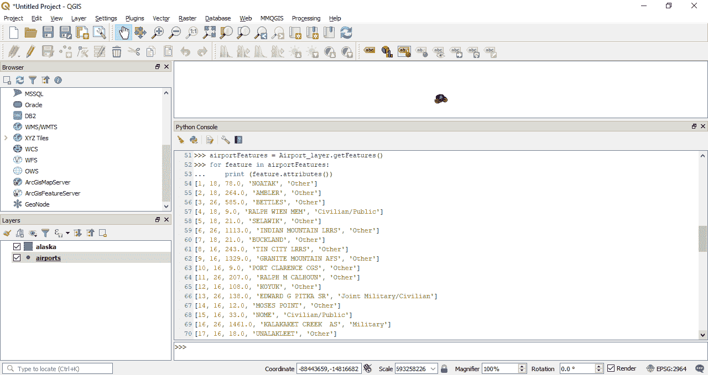

QGIS Python 控制台打印出属性表

# 脚本

命令行可能会让人困惑。最好是构建脚本并在命令行上进行测试。让我们将这些命令行调用转换为 Python 脚本。关闭此项目并打开一个新的 QGIS 项目。打开 Python 控制台。

点击“显示编辑器”按钮以打开脚本窗口。如下截图所示：

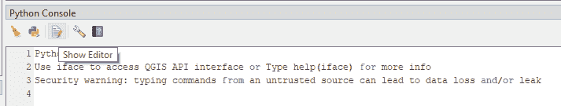

Python 控制台

将以下代码复制到脚本编辑器中：

```py
Airport_layer = iface.addVectorLayer('D:/QGIS_quickstart/qgis_sample_data/shapefiles/airports.shp','airports','ogr')

Alaska_layer = iface.addVectorLayer('D:/QGIS_quickstart/qgis_sample_data/shapefiles/alaska.shp','alaska','ogr')

print (Airport_layer.name())

print (Airport_layer.featureCount())

## print the attribute table

airportFeatures = Airport_layer.getFeatures()

for feature in airportFeatures:
    print (feature.attributes())
```

或者，你也可以从[`github.com/PacktPublishing/QGIS-Quick-Start-Guide/blob/master/Chapter07/01_Loading_Data.py`](https://github.com/PacktPublishing/QGIS-Quick-Start-Guide/blob/master/Chapter_07/01_Loading_Data.py)下载数据。请确保重新指定你的数据位置。在编辑器中点击“另存为”按钮，将文件保存到你的项目中，文件名为`01_Loading_data.py`。然后，点击运行（绿色三角形）。结果应该看起来像下面的截图：

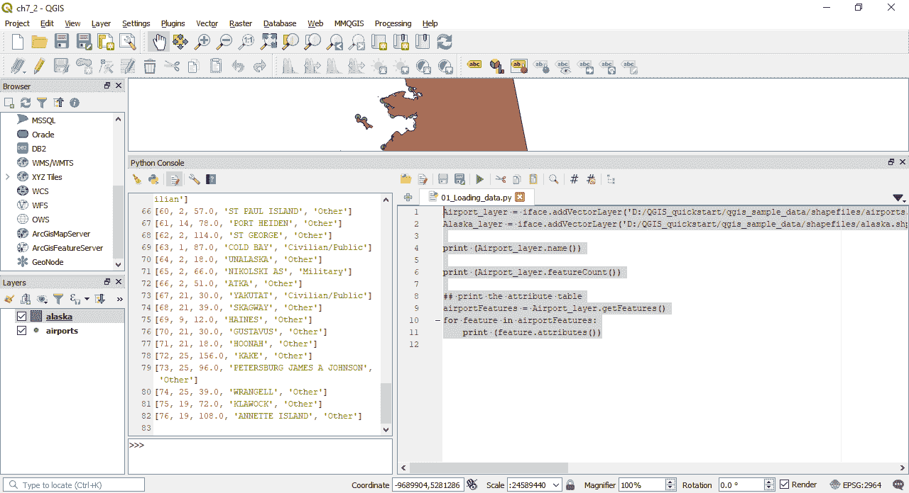

Python 控制台中的脚本

要了解更多关于矢量类的信息，请查看以下文档：[`qgis.org/api/classQgsVectorLayer.html`](https://qgis.org/api/classQgsVectorLayer.html)。

# 加载栅格数据

让我们再编写一个脚本以加载栅格数据。复制以下代码：

```py
Hillshade_layer = iface.addRasterLayer('D:/QGIS_quickstart/qgis_sample_data/raster/SR_50M_alaska_nad.tif','Hillshade')

Landcover_layer = iface.addRasterLayer('D:/QGIS_quickstart/qgis_sample_data/raster/landcover.img','Landcover')

## print the layer names

print (Hillshade_layer.name())

print (Landcover_layer.name())

## print the image dimensions

print (Hillshade_layer.width(), Hillshade_layer.height())

print (Landcover_layer.width(), Landcover_layer.height())
```

此脚本中的代码在两个图层`Hillshade`和`Landcover`中加载，将名称打印到控制台，并打印图像尺寸。

你可以从这里下载数据：[`github.com/PacktPublishing/QGIS-Quick-Start-Guide/blob/master/Chapter07/02_Loading_data_raster.py`](https://github.com/PacktPublishing/QGIS-Quick-Start-Guide/blob/master/Chapter_07/02_Loading_data_raster.py)。如果数据位置与脚本不同，请确保重新指定。在编辑器中点击“另存为”按钮，将文件保存到你的项目中，文件名为`02_Loading_data_raster.py`。然后，点击运行（绿色三角形）。结果应该看起来像下面的截图：

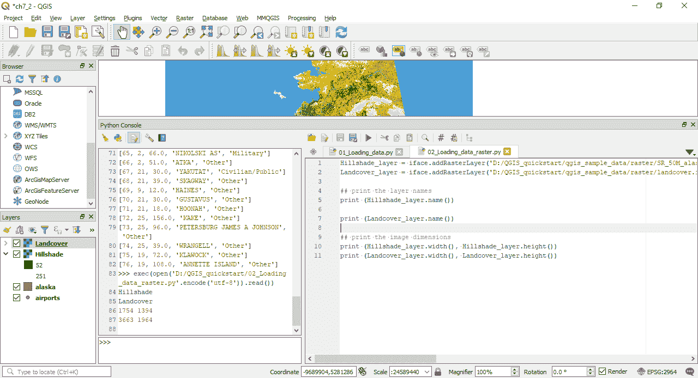

Python 控制台中的脚本

要了解更多关于`Raster`类的信息，请查看以下文档：[`qgis.org/api/classQgsRasterLayer.html`](https://qgis.org/api/classQgsRasterLayer.html)。

我们可以编写脚本来自动化 QGIS 中的许多过程，包括渲染、地图创建和处理。实际上，这本书的所有部分都可以自动化。让我们用最后一个空间处理脚本来结束 Python 和脚本编写这一节。这次，我们将对`airports`图层进行缓冲。

# 缓冲脚本

在 QGIS 中打开一个新的项目。将以下代码复制到编辑器中：

```py
## Buffering

Airport_layer = iface.addVectorLayer('D:/QGIS_quickstart/qgis_sample_data/shapefiles/airports.shp','airports','ogr')

param = { 'INPUT' : Airport_layer, 'DISTANCE' : 15000, 'SEGMENTS' : 5, 'END_CAP_STYLE' : 0, 'JOIN_STYLE' : 0, 'MITER_LIMIT' : 2, 'DISSOLVE' : False, 'OUTPUT' : 'memory:' }

algoOutput = processing.run("qgis:buffer", param)

Airport_buffer = QgsProject.instance().addMapLayer(algoOutput['OUTPUT'])
```

此脚本中的代码加载了`airports`图层，设置了缓冲参数（`param`），使用`processing.run`命令调用`qgis`缓冲，然后将名为`OUTPUT`的图层添加到地图中。

您可以从这里下载数据：[`github.com/PacktPublishing/QGIS-Quick-Start-Guide/blob/master/Chapter07/03_Buffer_Airport.py`](https://github.com/PacktPublishing/QGIS-Quick-Start-Guide/blob/master/Chapter_07/03_Buffer_Airport.py)。请确保将数据位置重定向。将文件保存到您的项目中为`03_Buffer_airport.py`。然后，点击运行（绿色三角形）。结果应该看起来像以下截图：

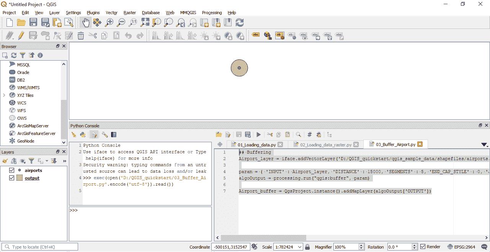

Python 控制台中的脚本

如果您想了解更多关于在 QGIS 中使用 Python 编程的信息，这是一个很好的资源，其中包含大量的脚本示例：[`docs.qgis.org/testing/pdf/en/QGIS-testing-PyQGISDeveloperCookbook-en.pdf`](https://docs.qgis.org/testing/pdf/en/QGIS-testing-PyQGISDeveloperCookbook-en.pdf)。

# 摘要

在本章的最后，我们探讨了扩展 QGIS。我们探讨了三个选项：使用模型构建器构建模型、访问插件和 Python 控制台。扩展 QGIS 的能力可能是使用该软件的最有说服力的理由。您可以按需定制它，可以下载他人编写的插件，并且可以自动化无聊的重复性工作。模型、脚本和插件都是可共享的。
