# 第四章：分子哈密顿算符

“我们大多数人所能期望在物理学上达到的最好成果，就是在一个更深的层次上误解。”

– 魏冈·泡利


图 4.1 – 魏冈·泡利寻求对与费米子自旋相关的反对称性的更深入理解 [作者]

在魏冈·泡利 1946 年的诺贝尔演讲结束时 [Pauli]，他陈述道：

“我可能表达我的批评意见，即正确的理论既不应导致无限零点能量，也不应导致无限零电荷，它不应使用数学技巧来减去无穷大或奇点，也不应在能够对物理世界的实际现实进行正确解释之前发明一个仅是数学虚构的假设世界。”

本章中的概念有数学公式，但没有物理或化学现实性。换句话说，使用了标准近似，允许确定有用的化学量。使用这些近似的计算并不代表精确量；相反，它们是近似量。因此，为了获得更精确和更好的答案，需要对这些近似有更深入的理解。

此外，本章中使用的近似方法仅适用于费米子（电子）系统。将这种方法扩展到玻色子系统是更广泛科学界的研究领域。我们将看到在基态能量计算中虚拟轨道和占据轨道以及未占据轨道的实施和使用。

我们提到了**哈特里-福克**（**HF**）理论的实施不同级别：**限制性哈特里-福克**（**RHF**）、**限制性开壳哈特里-福克**（**ROHF**）和**非限制性哈特里-福克**（**UHF**）；然而，通过 Qiskit，我们只会展示 RHF。还有后 HF 方法可以使用，例如**耦合簇**（**CC**），我们将在*第五章*“变分量子本征值求解器”中使用。

在本章中，我们将求解氢分子和锂氢分子的费米子哈密顿算符方程，并涵盖以下主题：

+   *第 4.1 节*，*波恩-奥本海默近似*

+   *第 4.2 节*，*福克空间*

+   *第 4.3 节*，*费米子生成和湮灭算符*

+   *第 4.4 节*，*哈特里-福克轨道基中的分子哈密顿算符*

+   *第 4.5 节*，*基组*

+   *第 4.6 节*，*使用 Qiskit Nature 构建费米子哈密顿算符*

+   *第 4.7 节*，*费米子到量子比特映射*

+   *第 4.8 节*，*使用 Qiskit Nature 构建量子比特哈密顿算符*

# 技术要求

我们提供了一个链接到本章的配套 Jupyter 笔记本，该笔记本已在 Google Colab 环境中测试，这是一个免费且完全在云端运行的环境，以及 IBM Quantum Lab 环境。请参阅*附录 B* *– 在云端利用 Jupyter 笔记本*，获取更多信息。配套的 Jupyter 笔记本自动安装以下列表中的库：

+   NumPy [NumPy]，一个开源的 Python 库，几乎在科学和工程的每个领域都得到应用

+   Qiskit [Qiskit]，一个开源 SDK，用于在脉冲、电路和应用模块级别与量子计算机交互

+   Qiskit 可视化支持以启用可视化工具和 Jupyter 笔记本的使用

+   Qiskit Nature [Qiskit_Nature] [Qiskit_Nat_0]，一个独特的平台，它弥合了自然科学与量子模拟之间的差距

+   **基于 Python 的化学模拟框架**（**PySCF**）[PySCF]，一个由 Python 驱动的开源电子结构模块集合

## 安装 NumPy、Qiskit 以及导入各种模块

使用以下命令安装 NumPy：

```py
pip install numpy
```

使用以下命令安装 Qiskit：

```py
pip install qiskit
```

使用以下命令安装 Qiskit 可视化支持：

```py
pip install 'qiskit[visualization]'
```

使用以下命令安装 Qiskit Nature：

```py
pip install qiskit-nature
```

使用以下命令安装 PySCF：

```py
pip install pyscf
```

使用以下命令导入 NumPy：

```py
import numpy as np
```

使用以下命令导入 Matplotlib，这是一个用于在 Python 中创建静态、动画和交互式可视化的综合性库：

```py
import matplotlib.pyplot as plt
```

使用以下命令导入所需的函数和类方法。`array_to_latex function()`返回一个具有 1 或 2 维的复数数组的 LaTeX 表示：

```py
from qiskit.visualization import array_to_latex, plot_bloch_vector, plot_bloch_multivector, plot_state_qsphere, plot_state_city
from qiskit import QuantumRegister, ClassicalRegister, QuantumCircuit, transpile
from qiskit import execute, Aer
import qiskit.quantum_info as qi
from qiskit.extensions import Initialize
from qiskit.providers.aer import extensions  # import aer snapshot instructions
```

使用以下命令导入 Qiskit Nature 库：

```py
from qiskit import Aer
from qiskit_nature.drivers import UnitsType, Molecule
from qiskit_nature.drivers.second_quantization import ElectronicStructureDriverType, ElectronicStructureMoleculeDriver
from qiskit_nature.problems.second_quantization import ElectronicStructureProblem
from qiskit_nature.mappers.second_quantization import ParityMapper, JordanWignerMapper, BravyiKitaevMapper
from qiskit_nature.converters.second_quantization import QubitConverter
from qiskit_nature.transformers.second_quantization.electronic import ActiveSpaceTransformer, FreezeCoreTransformer
from qiskit_nature.operators.second_quantization import FermionicOp
```

使用以下命令导入 Qiskit Nature 属性框架：

```py
from qiskit_nature.properties import Property, GroupedProperty
```

使用以下命令导入`ElectronicEnergy`属性：

```py
# https://qiskit.org/documentation/nature/tutorials/08_property_framework.html
from qiskit_nature.properties.second_quantization.electronic import (
    ElectronicEnergy,
    ElectronicDipoleMoment,
    ParticleNumber,
    AngularMomentum,
    Magnetization,
)
```

使用以下命令导入`ElectronicIntegrals`属性：

```py
from qiskit_nature.properties.second_quantization.electronic.integrals import (
    ElectronicIntegrals,
    OneBodyElectronicIntegrals,
    TwoBodyElectronicIntegrals,
    IntegralProperty,
)
from qiskit_nature.properties.second_quantization.electronic.bases import ElectronicBasis
```

使用以下命令导入数学库：

```py
import cmath
import math
```

# 4.1. Born-Oppenheimer 近似

回想一下，原子中的电子轨道和分子中的电子分子轨道都是时间无关的定态。在*第 2.4 节*，*公设 4 – 时间无关定态*中，我们介绍了时间无关薛定谔方程：

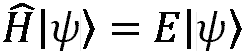

其中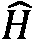是通过将经典能量在哈密顿形式中量子化（首次量子化）得到的非相对哈密顿算符，它代表所有粒子的总能量（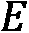）；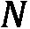电子和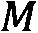核。对于一个分子系统，两个核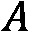和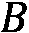的电荷分别是和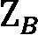，质量分别是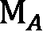和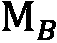。分子中粒子的位置是通过使用**实验室**（**LAB**）坐标系来确定的，如图*图 4.2*所示，其中坐标系的起点位于分子外部。坐标系的起点可以放置在自由空间的任何位置。

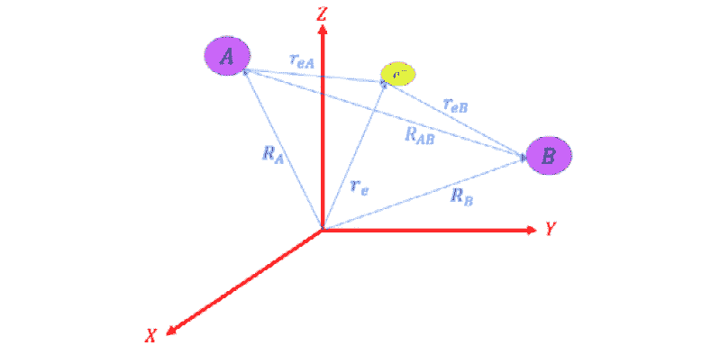

图 4.2 – 实验室坐标系

实验室坐标系中的哈密顿量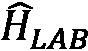为：

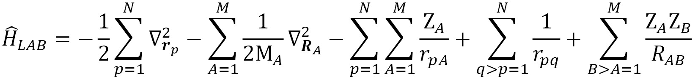

其中在原子单位中，电子的质量、约化普朗克常数（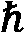）和电荷（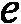）被设置为 1。实验室哈密顿量包括所有粒子的动能之和以及所有粒子之间的势能，其定义如下：

+   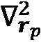和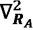是电子和核相对于位置坐标的二阶导数算符，即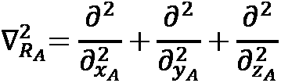，对于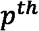电子也是如此。

+   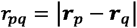、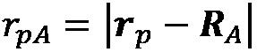和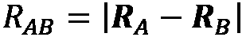是电子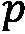和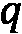、电子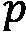和核、以及核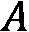和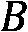之间的距离，由欧几里得范数确定。

为了清晰起见，我们在*图 4.3*中列出实验室哈密顿量的算符：


图 4.3 – 分子哈密顿算符的项

在实验室哈密顿量中，分子系统的能量是连续的，而不是离散的。质心（**COM**）运动不会对系统的内部状态能量产生影响，可以将其分解出来。内部状态是量子化的，并且对平移是不变的。这些状态不受自由空间中的平移和旋转运动的影响。核仍然可以通过振动和内部旋转在 COM 周围移动。

在**Born-Oppenheimer**（**BO**）近似中，我们假设核的运动与电子的运动是解耦的，也就是说，核方程（旋转和振动）与电子方程的乘积：

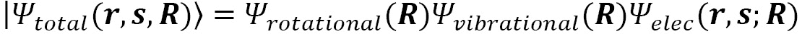

其中  是核坐标， 是电子坐标，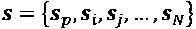 是磁矩坐标，电子波函数 ) 是对核坐标的约束 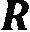)。

在 BO 近似中，仅对具有固定核位置的电子方程进行求解，可以迭代以考虑核的振动和内部旋转。对于每次迭代，原子的核在空间中是固定的，可以将其视为违反了在 *第 1.4 节*，*光和能量* 中引入的海森堡不确定性原理。你越确切地知道一个粒子的位置，你对它的动量的了解就越少。一般来说，内部坐标系可以放置在分子中最重的原子或质心处。

我们只处理围绕静止核运动的电子。因此，如果我们忽略核与电子之间的动能耦合项，以及核与核之间的动能耦合项，一般电子分子哈密顿量是四个算符的和，如下所示：

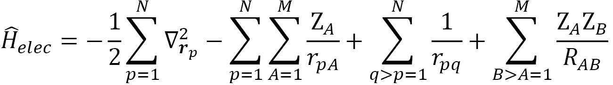

最后一个项，即核势能排斥能，未进行计算，并使用**伪势**和实验数据进行近似，我们将在 *图 4.4* 中展示这一点。这种近似有一定的局限性，我们将在 *第六章**，*超越玻恩-奥本海默* 中进一步讨论，特别是通过确定势能表面。

# 4.2\. 泡利空间

电子波函数 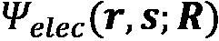 包括每个电子的空间位置 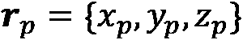)，这些位置取决于核的位置 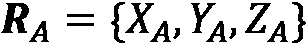) 以及每个电子的磁矩方向坐标 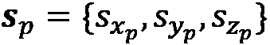)。由于这些粒子是费米子，电子波函数必须对粒子对的交换具有反对称性。请回忆，这是在 *第 2.1.3 节*，*泡利不相容原理的通用公式* 中引入的泡利不相容原理。

现在，让我们考虑两个电子 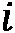 和 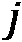 在状态  和 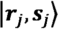 中的情况，其中对应的电子波函数 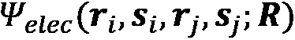) 代表了双电子系统的状态，并且对相同粒子对的交换具有反对称性 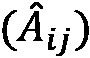)：

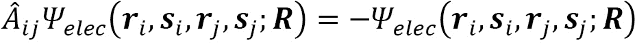 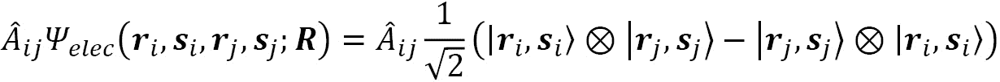 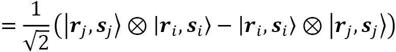 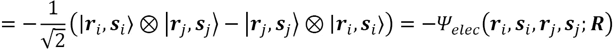

由于一电子波函数，如第 2.1 节 *公设 1 – 波函数* 中所述，是空间 (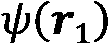) 和磁矩分量 (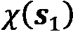) 的乘积，存在两种情况可以实现反对称性：

+   自旋函数必须是反对称的，而空间函数是对称的。

+   空间函数必须是反对称的，而自旋函数是对称的。

这意味着当两个粒子交换时，描述系统的总分子波函数 (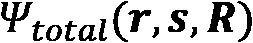) 的符号也会改变：

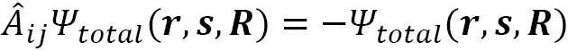

对于在核场中的 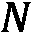 个电子，总波函数 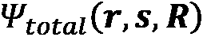 可以写成原子单粒子自旋轨道的乘积：


并且通过反对称张量积 ( [图卢兹] 和使用**斯莱特行列式**（由狄拉克首次引入）的状态叠加来实现反对称：


斯莱特行列式波函数在两个电子（两行排列）或两个自旋轨道（两列排列）交换时是反对称的。

对于两个电子 ()，斯莱特行列式的形式为：


对于三个电子 ()，斯莱特行列式的形式为：


**福克空间** [福克] 是斯莱特行列式波函数所属的希尔伯特空间。根据定义，福克空间是一组至少包含三种重要配置的希尔伯特空间的和：

+   零粒子态，也称为真空态，被解释为轨道中不存在电子的状态： 或 .

+   单粒子态： 或 .

+   双粒子态： 或 .

在  个电子的福克空间中，一个  粒子子空间的状态数是：


其中  表示从一组  个元素中得到的  组合数。

如果我们有 5 个电子，且 3 粒子子空间：


在一个包含  个电子的福克空间中，状态的总数是 [Wiki-Comb]：


我们在本节中展示的只是一个数学构造，并不代表物理现实或化学实际。因此，在某种程度上，它与实际化学中使用的概念和术语难以联系起来。然而，福克空间在量子计算中被利用，因为分子中的电子空间和量子比特空间之间存在一一对应的关系；但这不是必要的映射。还有其他更具有计算优势的映射，例如在*第 4.7.4 节，Bravyi-Kitaev 变换*中展示的。

# 4.3\. 费米子创建和湮灭算符

在上一节中，我们提到福克空间是一个数学构造，并不代表物理现实或化学实际。然而，请记住，在分子中，每个电子一次只能占据一个自旋轨道，并且没有两个电子可以占据同一个自旋轨道。

现在我们进一步考虑福克空间的一个子空间，它由自旋轨道的**占有数**生成，由  电子基态  描述，其中  是轨道  的占有数。

没有电子占据的轨道-自旋态  表示为 。

我们定义了一组费米子湮灭算符  和创建算符 ，它们作用于局部电子模式，并满足以下**反对易**关系：


其中  是狄拉克δ函数。算符  被称为**占有数算符**，它们彼此交换。

一个**费米子算符**是创建算符和湮灭算符乘积的线性组合，我们将在下文中讨论。

## 4.3.1\. 费米子创建算符

费米子创建算符  将位于  费米子轨道中的粒子数增加一个单位：


其中：

+    和  是位于  费米子轨道中的粒子数。

+    是一个预因子，如果我们有一个电子位于  费米子轨道中，即如果 。

+   相位因子  保持整个状态叠加的反对称性质。

## 4.3.2\. 费米子湮灭算符

费米子湮灭算符  将位于  费米子轨道中的粒子数减少一个单位：


其中：

+   和是位于费米子轨道中的粒子数。

+   是一个预因子，如果费米子轨道中没有电子，即如果。

+   相位因子保持整个状态叠加的反对称性质。

我们现在来看如何将电子分子哈密顿量写成创建和湮灭算子乘积的线性组合。

# 4.4. Hartree-Fock 轨道基中的分子哈密顿量

为了将原始的**电子结构哈密顿量**映射到相应的**量子比特哈密顿量**，我们在量子力学的第二量子化形式下工作。回顾我们在*第 4.1 节*中介绍了第一量子化，*Born-Oppenheimer 近似*。

**Hartree-Fock (HF)**方法将多体问题近似为单体问题，其中每个电子在**平均场**中演化，其他电子的平均场。

我们可以将电子分子哈密顿量()重写为创建和湮灭算子乘积的线性组合（总结在*图 4.4*中）：


其中从自旋轨道移除一个电子，而在自旋轨道中创建一个电子。操作是**激发算子**，它将电子从**占据的自旋轨道**激发到**未占据的轨道**。这些在*第 2.1 节，公设 1 – 波函数*中介绍。核-核()排斥能量()通过伪势和实验数据近似，如第 4.1 节中提到的*Born-Oppenheimer 近似*。


图 4.4 – 将分子哈密顿量表示为创建和湮灭算子乘积的线性组合

操作符的权重由使用 HF 方法计算的单电子积分给出：


其中是电子的坐标，是原子的坐标，而是原子的原子序数，双电子项由以下给出：


分子哈密顿量可以用 HF 方法的解的基表示，这些解被称为**分子轨道（MOs）**[Panagiotis]：

我们在*第 2.3.6 节*，*动能操作*和*第 2.3.7 节*，*势能操作*中展示了这些积分的一些示例计算。在下一节中，我们将看到如何近似这些积分中的空间波函数。

有三种常用的 HF 方法：

+   **限制的 HF (RHF)** 方法用于闭壳分子。自旋轨道要么是α（自旋向上）要么是β（自旋向下），所有轨道都由α和β自旋轨道双占据。

+   **限制的开放壳 (ROHF)** 方法用于开壳分子，其中每个自旋的电子数不相等。ROHF 尽可能使用双占据分子轨道，并为未成对电子使用单占据轨道。

+   **无限制的 HF (UHF)** 方法用于开壳分子，其中每个自旋的电子数不相等。UHF 轨道可以具有α或β自旋，但α和β轨道可能具有不同的空间分量。

# 4.5. 基础集

在*第 4.4 节*，*哈特里-福克轨道基中的分子哈密顿量积分*中的空间波函数  通过几个独立基函数的线性组合进行近似。这些函数的形式受到我们在*第 2.1.1 节*，*球谐函数*中介绍的氢类似系统的原子轨道的启发，其径向部分如*第 2.2.1 节*，*计算径向波函数*所示。

常用的两类近似基轨道是基于在*第 4.2 节*，*福克空间*中引入的斯莱特行列式的**斯莱特型轨道 (STOs)** 和**笛卡尔高斯型轨道 (GTOs)**。这两种类型的基函数可以组合为**STO-nG**，其中*n*是用于近似的高斯函数的数量。**从头计算电子结构**计算使用轨道基集进行数值计算。

我们现在详细说明这两类结构的结构，并用 Python 绘制的函数图来展示。

## 4.5.1. 斯莱特型轨道

STOs 具有与氢类似系统的原子轨道相同的结构，它们的径向部分具有以下形式 [Wiki_GAU]：


其中：

+   是角动量量子数，其值从到![公式 _04_159.png]，其中![公式 _04_160.png]是主量子数。

+   是电子从原子核的核距离。

+   被称为轨道指数，它控制了轨道密度随核距离变化的消失速度。

由以下归一化条件确定 [Wiki-GAU]：


注意到 [Wiki-STO]：


我们有：


对于 1轨道，我们有，因此，Slater 轨道的径向部分为：


让我们用以下 Python 代码绘制这个函数：

```py
x = np.linspace(-5,5,num=1000)
r = abs(x)
alpha = 1.0
R = 2*alpha**(1.5)*np.exp(-alpha*r)
plt.figure(figsize=(4,3))
plt.plot(x,R,label="STO 1s H")
plt.legend()
```

*图 4.5* 展示了结果：


图 4.5 – 氢原子 1s 轨道 Slater 型轨道径向部分的绘图

我们将氢分子的反对称空间波函数表示为氢原子 slater 轨道的前面径向部分的线性组合，如下所示：

```py
x = np.linspace(-7,7,num=1000)
r1 = abs(x+2.5)
r2 = abs(x-2.5)
alpha = 1.0
R = 2*alpha**(1.5)*np.exp(-alpha*r1)-2*alpha**(1.5)*np.exp(-alpha*r2)
plt.figure(figsize=(4,3))
plt.plot(x,R,label="Antisymmetric STO H2")
plt.legend()
```

*图 4.6* 展示了结果：


图 4.6 – 氢分子反对称空间波函数的绘图

## 4.5.2. 高斯型轨道

GTOs 具有与 STOs 相同的角形式，但它们的径向函数采用高斯形式[Wiki_GAU]：


其中：

+    是角动量量子数，其值从到，其中是主量子数。

+    是电子从原子核的距离。

+    被称为轨道指数，它控制着轨道密度随核距离变化的消失速度。

 由以下归一化条件确定[Wiki-GAU]：


在实际应用中，我们用原始高斯函数的线性组合来近似 STO 的径向部分，称为收缩高斯函数。STO-nG 基组包含每个原子轨道的一个收缩高斯函数[Skylaris]。我们绘制了氢原子 1轨道的 STO-3G 函数。以下是代码：

```py
x = np.linspace(-7,7,num=1000)
r = abs(x)
c = [0.444635,0.535328,0.154329]
alpha = [0.109818,0.405771,2.227660]
psi = 0
for k in range(3):
  psi += c[k]*(2*alpha[k]/np.pi)**0.75 * np.exp(-alpha[k]*r**2)
plt.figure(figsize=(5,3))
plt.plot(x,psi,label="STO-3G 1s H")
plt.legend()
```

*图 4.7* 展示了结果：


图 4.7 – 氢原子 1轨道 STO-3G 函数的绘图

我们将氢分子的反对称空间波函数表示为氢原子 1*s*轨道的 STO-3G 函数前面径向部分的线性组合，如下所示：

```py
x = np.linspace(-7,7,num=1000)
r1 = abs(x+2.5)
r2 = abs(x-2.5)
c = [0.444635,0.535328,0.154329]
alpha = [0.109818,0.405771,2.227660]
psi = 0
for k in range(3):
  psi += c[k]*(2*alpha[k]/np.pi)**0.75 * np.exp(-alpha[k]*r1**2) \
  - c[k]*(2*alpha[k]/np.pi)**0.75 * np.exp(-alpha[k]*r2**2)
plt.figure(figsize=(5,3))
plt.plot(x,psi,label="Antisymmetric STO-3G H2")
plt.legend()
```

*图 4.8* 展示了结果：


图 4.8 – 氢分子 1轨道的反对称 STO-3G 函数的绘图

# 4.6. 使用 Qiskit Nature 构建费米子哈密顿算符

Qiskit Nature 平台与自旋轨道[Qiskit_Nat_1]一起工作。每个分子轨道可以有一个自旋向上的电子、一个自旋向下的电子或自旋配对电子。自旋轨道是这些情况之一。对于每个分子轨道，我们有两个自旋轨道。现在让我们用 Qiskit Nature 说明构建氢分子费米子哈密顿算符的过程。

## 4.6.1. 构建氢分子的费米子哈密顿算符

首先，我们使用 Qiskit 的`Molecule`类定义氢分子的分子几何形状，该类具有以下输入参数：

+   `geometry`，一个原子名称列表，例如`H`代表氢，后面跟着原子位置的笛卡尔坐标![img/Formulla_04_184.png]，单位为埃

+   `charge`，一个整数，分子的电荷

+   `multiplicity`，一个整数，分子的多重性![img/Formulla_04_185.png]，其中![img/Formulla_04_186.png]是总自旋角动量，它由分子中未成对电子的数量决定，即占据分子轨道的单个电子的数量，而不是与其他电子一起：

```py
hydrogen_molecule = Molecule(geometry=[['H', [0., 0., 0.]],
                              ['H', [0., 0., 0.735]]],
                     charge=0, multiplicity=1)
```

我们通过选择 PySCF 的`driver`类型和基组`sto3g`来定义电子结构分子驱动程序，这是我们在*第 4.5.2 节*，*高斯型轨道*中引入的基础 STO-3G，其中分子轨道将被展开。在 Qiskit Nature 中默认使用 STO-3G。在 Qiskit Nature 的 PySCF 驱动程序中默认使用 RHF：

```py
driver = ElectronicStructureMoleculeDriver(hydrogen_molecule, basis='sto3g', driver_type=ElectronicStructureDriverType.PYSCF)
```

我们对基础 STO-3G 进行 HF 计算。以下是代码：

```py
qH2 = driver.run()
```

我们创建一个`ElectronicStructureProblem`实例，该实例生成费米子算符的列表：

```py
H2_fermionic_hamiltonian = ElectronicStructureProblem(driver)
```

我们使用`second_q_ops()`方法[Qiskit_Nat_3]，它返回一系列量子化的算符：哈密顿算符、总粒子数算符、总角动量算符、总磁化算符，以及如果有的话，![img/Formulla_04_187.png]，![img/Formulla_04_188.png]，![img/Formulla_04_189.png]偶极算符：

```py
H2_second_q_op = H2_fermionic_hamiltonian.second_q_ops()
```

回想一下，在*第 1.3 节*，*量子数和物质的量子化*中，我们介绍了**自旋投影量子数**，![img/Formulla_04_190.png]，它给出了沿指定轴的自旋动量![img/Formulla_04_191.png]的投影，在给定的空间方向上为自旋向上(+½)或自旋向下(-½)。HF 理论类似地定义![img/Formulla_04_192.png]（向上）和![img/Formulla_04_193.png]（向下）自旋轨道[Skylaris_1]。

我们定义了`get_particle_number()`函数，该函数获取给定电子结构问题的粒子数属性。以下是代码：

```py
def get_particle_number(problem, show=True):
  particle_number = problem.grouped_property_transformed.get_property("ParticleNumber")
  num_particles = (particle_number.num_alpha, particle_number.num_beta)
  num_spin_orbitals = particle_number.num_spin_orbitals
  if show:
    print("Number of alpha electrons: {}".format(particle_number.num_alpha))
    print("Number of beta electrons: {}".format(particle_number.num_beta))
    print("Number of spin orbitals: {}".format(num_spin_orbitals))
  return particle_number
```

我们调用`get_particle_number()`函数来获取并打印粒子的数量属性，如下所示：

```py
print("Hydrogen molecule, basis: sto3g, Hartree-Fock calculation")
H2_particle_number = get_particle_number(H2_fermionic_hamiltonian)
```

*图 4.9*显示了结果，我们看到四个自旋轨道，一个![img/Formulla_04_194.png]电子和一个![img/Formula_03_006.png]电子：

![img/B18268_Figure_4.9.jpg]

图 4.9 – 氢分子，STO-3G 基组的 HF 计算，粒子数

我们定义了`get_electronic_energy()`函数，该函数返回给定电子结构问题的电子能量属性。以下是代码：

```py
def get_electronic_energy(problem, show=True):
  electronic_energy = problem.grouped_property_transformed.get_property("ElectronicEnergy")
  if show:
    print(electronic_energy)
  return electronic_energy
```

我们调用`get_electronic_energy()`函数来获取并打印电子能量，如下所示：

```py
H2_electronic_energy = get_electronic_energy(H2_fermionic_hamiltonian)
```

*图 4.10*显示了分子轨道(`MO`)的单体项，其中我们看到两个![img/Formulla_04_196.png]电子项和两个![img/Formula_03_006.png]电子项：


图 4.10 – 氢分子，电子能量，分子轨道（MO），单体项

*图 4.11* 展示了包含所有可能的分子轨道（MO）二体项自旋组合的分子轨道（MO）二体项，，，：


图 4.11 – 氢分子，电子能量，分子轨道（MO），二体项

在稀疏标签模式下，`FermionicOp` 类 [Qiskit_Nat_2] 通过由空格分隔的项目字符串显示费米子算符的每一项，以标签开头，后跟下划线 `_`，然后是一个表示费米子模式索引的正整数。*图 4.12* 展示了标签列表、相应的符号和费米子算符：


图 4.12 – Qiskit FermionicOp 类使用的标签列表

Qiskit 的 `FermionicOp` 类根据 `set_truncation()` 方法设置的字符最大数截断费米子哈密顿算符的显示，默认值为 200 [Qiskit_Nat_T]。如果截断值设置为 `0`，则禁用截断。我们使用 `set_truncation(0)` 方法将截断设置为 `None`，然后我们打印出氢分子费米子哈密顿算符的所有 14 项：

```py
# Set truncation to None
H2_second_q_op[0].set_truncation(0)
# Print the Fermionic operator
print("Hydrogen molecule")
print(H2_second_q_op[0])
```

*图 4.13* 展示了结果：


图 4.13 – 氢分子费米子哈密顿算符

现在我们使用 `FermionicOp.to_matrix` 方法打印出氢分子费米子算符在福克基下的矩阵表示，其中基态按递增的比特串顺序排列，为 0000、0001、…、1111。以下是代码：

```py
print(H2_second_q_op[0].to_matrix())
```

*图 4.14* 展示了结果：


图 4.14 – 氢分子费米子哈密顿算符在福克基下的矩阵表示

氢分子的费米子哈密顿算符包含四个粒子数算符，如图 *4.15* 所示：


图 4.15 – 氢分子费米子哈密顿算符的粒子数算符

氢分子的费米子哈密顿算符包含十个二电子交换算符，如图 *4.16* 所示：


图 4.16 – 氢分子费米子哈密顿算符的二电子交换算符

现在我们用 Qiskit Nature 举例说明锂氢分子费米子哈密顿算符的构建。

## 4.6.2\. 构建锂氢分子的费米子哈密顿算符

我们使用 Qiskit 的 `Molecule` 类定义锂氢（LiH）分子的分子几何形状，正如我们在 *4.6.1 节，构建氢分子费米子哈密顿算符* 中所解释的：

```py
LiH_molecule = Molecule(geometry=[['Li', [0., 0., 0.]],
                              ['H', [0., 0., 1.5474]]],
                     charge=0, multiplicity=1)
```

我们通过选择 PySCF 的`driver`类型和要展开分子轨道的`sto3g`基集来定义电子结构分子驱动器：

```py
driver = ElectronicStructureMoleculeDriver(LiH_molecule, basis='sto3g', driver_type=ElectronicStructureDriverType.PYSCF)
```

我们创建一个`ElectronicStructureProblem`实例，使用`freeze`参数`core=True`和`remove_orbitals=[4,3]`来生成费米子算符列表，移除未占据轨道：

```py
LiH_fermionic_hamiltonian = ElectronicStructureProblem(driver, transformers=[FreezeCoreTransformer(freeze_core=True, remove_orbitals=[4, 3])])
```

我们使用`second_q_ops()`方法获取一个第二量子化算符的列表：

```py
LiH_second_q_op = LiH_fermionic_hamiltonian.second_q_ops()
```

我们调用`get_particle_number()`来获取并打印粒子数属性，如下所示：

```py
print("Lithium hydride molecule, basis: sto3g, Hartree-Fock calculation")
print("Parameters freeze_core=True, remove_orbitals=[4, 3]")
LiH_particle_number = get_particle_number(LiH_fermionic_hamiltonian)
```

*图 4.17* 展示了结果，其中我们看到六个自旋轨道，一个电子和一个电子：


图 4.17 – 锂氢分子，STO-3G 基下的 HF 计算，粒子数

我们调用`get_electronic_energy()`函数来获取并打印电子能量，如下所示：

```py
LiH_electronic_energy = get_electronic_energy(LiH_fermionic_hamiltonian)
```

*图 4.18* 展示了分子轨道（MO）的单体项，其中我们看到两个电子项和两个电子项：


图 4.18 – LiH 分子，电子能量，分子轨道（MO），单体项

-体项

*图 4.19* 展示了分子轨道（MO）的双体项，它包含了所有可能的分子轨道双体项的自旋组合，，，：


图 4.19 – LiH 分子，电子能量，分子轨道（MO），双体项

Qiskit 的`FermionicOp`类根据`set_truncation()`方法设置的字符最大数来截断费米子哈密顿算符的显示，默认值为`200` [Qiskit_Nat_T]。如果截断值设置为`0`，则禁用截断。我们使用`set_truncation(1000)`方法将截断设置为`1000`，然后我们打印出 LiH 分子费米子算符超过一百项中的前 20 项：

```py
# Set truncation to 1000
LiH_second_q_op[0].set_truncation(1000)
# Print the Fermionic operator
print("Lithium hydride molecule")
print(LiH_second_q_op[0])
```

*图 4.20* 展示了结果：


图 4.20 – 锂氢分子费米子哈密顿算符的前 20 项

我们现在打印出锂氢分子费米子算符在 Fock 基下的矩阵表示，其中基态按递增的位串顺序排列，如 0000，0001，…，1111。以下是代码：

```py
print(LiH_second_q_op[0].to_matrix())
```

*图 4.21* 展示了结果：


图 4.21 – 锂氢分子费米子哈密顿算符在 Fock 基下的矩阵表示

# 4.7. 费米子到量子比特映射

我们考虑一个由  个费米子组成的系统，每个费米子用从  到  的整数标记。我们需要一个费米子到量子比特的映射，描述费米子状态和量子比特状态之间的对应关系，或者，等价地，费米子算符和多量子比特算符之间的对应关系。我们需要一个映射，将费米子创建和湮灭算符与多量子比特算符之间的映射。Jordan-Wigner 和 Bravyi-Kitaev 变换被广泛使用，并模拟具有与电子数量相同的量子比特的电子系统。

## 4.7.1. 量子比特创建和湮灭算符

我们定义作用于局部量子比特的量子比特算符 [Yepez] [Chiew]，如图 4.22 所示：


图 4.22 – 量子比特创建和湮灭算符

量子比特算符具有反对易关系：。

## 4.7.2. Jordan-Wigner 变换

**Jordan-Wigner**（**JW**）变换存储每个量子比特中每个自旋轨道的占据情况。它将费米子创建和湮灭算符映射到泡利算符的张量积，如图 4.23 所示 [Yepez] [Chiew] [Cao]。算符  和  改变轨道能级  的占据情况。 个泡利算符  通过根据轨道标签小于  的占据情况的偶奇性应用相位，强制执行费米子的反对易关系 [Cao]。


图 4.23 – JW 变换

例如，对于一个轨道 ，我们有以下映射：


单个泡利算符  的数量与系统的规模成线性关系。占据数基和 JW 变换允许通过  个量子比特操作来表示单个费米子创建或湮灭算符。

JW 变换产生的哈密顿量与自旋向上和自旋向下算符交换，这可以用来减少两个量子比特 [de Keijzer]。

我们定义 `label_to_qubit()` 函数，将表示为稀疏标签的费米子算符项转换为量子比特算符，该函数具有以下输入参数：

+   `label`，一个如图 4.12 所示的稀疏标签，由 Qiskit 的 `FermionicOp` 类使用

+   `converter`，可以是 `JordanWignerMapper()`、`ParityMapper()` 或 `BravyiKitaevMapper()`

这里是代码：

```py
def label_to_qubit(label, converter):
    qubit_converter = QubitConverter(converter)
    f_op = FermionicOp(label)
    qubit_op = qubit_converter.convert(f_op)
    return qubit_op
```

现在我们使用以下代码将费米子算符 "+_0"、"+_1"、"+_2"、"+_3" 和 "+_4" 转换为 JW 变换的量子比特算符：

```py
for k in ("+_0", "+_1", "+_2", "+_3", "+_4"):
  qubit_op = label_to_qubit(k, JordanWignerMapper())
  print("{}:\n {}\n".format(k, qubit_op))
```

*图 4.24* 展示了结果，与 JW 变换的预期结果相匹配，按照 Qiskit 量子比特的张量顺序：


图 4.24 – 使用 "+_0", "+_1", "+_2", "+_3", 和 "+_4" 说明的 JW 变换

## 4.7.3\. 偶宇称变换

偶宇称变换是 JW 变换的对偶：偶宇称算符是低权重，而占用算符变为高权重 [Bravyi][Cao]。*图 4.25* 显示了费米子创建和湮灭算符映射到泡利算符的张量积的映射：


图 4.25 – 偶宇称变换

现在我们使用以下代码将费米子算符 "+_0", "+_1", "+_2", "+_3", 和 "+_4" 转换为偶宇称变换的量子比特算符：

```py
for k in ("+_0", "+_1", "+_2", "+_3", "+_4"):
  qubit_op = label_to_qubit(k, ParityMapper())
  print("{}:\n {}\n".format(k, qubit_op))
```

*图 4.26* 显示了结果，该结果与偶宇称变换的预期结果相匹配，使用 Qiskit 量子比特的张量排序：


图 4.26 – 使用 "+_0", "+_1", "+_2", "+_3", 和 "+_4" 说明的偶宇称变换

偶宇称变换引入了已知的对称性，可以利用这些对称性通过两个量子比特来减少问题的大小。

## 4.7.4\. Bravyi-Kitaev 变换

Bravyi-Kitaev (BK) 变换仅适用于包含  个费米子的系统，其中  等于 2 的幂，。BK 基和变换只需要  个量子比特操作来表示一个费米子算符。BK 变换将第 4.3 节中引入的占用数基 ，*费米子创建和湮灭算符*，映射到 BK 基 ，使用一个矩阵 ，该矩阵递归定义 [Cao][Seeley]，其中求和是模 2 进行的：

，

因此：

，

我们定义了 `BK(m)` 函数，它返回一个字典，包含从  到  的矩阵 ：

```py
def BK(m):
  I = [[1, 0], [0, 1]]
  d = {}
  d[0] = [1]
  for k in range(0, m):
    B = np.kron(I,d[k])
    for l in range(2**k, 2**(k+1)):
      B[0,l] = 1
    d[k+1] = B
  return d
```

我们通过调用 `BK(3)` 函数来计算矩阵 ，，，和 ：

```py
d = BK(3)
for k, v in d.items():
  s = "B_{"+str(2**k)+"} = "
  display(array_to_latex(v, prefix=s, precision = 0))
  print(" ")
```

*图 4.27* 显示了结果：


图 4.27 – BK 矩阵 ，，，和 

有三个集合需要考虑 [Bravyi] [Mezzacapo] [Tranter]：

+   偶宇称集  是编码费米子模式偶宇称的量子比特集合，其索引小于 ，并给出全局相位。

+   更新集  是当费米子模式  改变占用时必须翻转的量子比特集合。

+   翻转集  是确定量子比特  与费米子模式  是否具有相同或相反奇偶性的量子比特集合。它在奇数  [Ribeiro] 中是必需的。

这三个集合可以从映射费米子占据到量子比特的递归矩阵中获得。余集  是通过奇偶性和翻转集的集合差获得的 [Bravyi]。

*图 4.28* 展示了费米子创建和湮灭算符映射到泡利算符的张量积：


图 4.28 – BK 变换

现在我们将费米子算符"+_0"、"+_1"、"+_2"、"+_3"和"+_4"转换为量子比特算符，使用以下代码进行 BK 变换：

```py
for k in ("+_0", "+_1", "+_2", "+_3", "+_4"):
  qubit_op = label_to_qubit(k, BravyiKitaevMapper())
  print("{}:\n {}\n".format(k, qubit_op))
```

*图 4.29* 展示了结果，与 BK 变换的预期结果相匹配，按照 Qiskit 的量子比特张量排序：


图 4.29 – 使用"+_0"、"+_1"、"+_2"、"+_3"和"+_4"说明的 BK 变换

# 4.8. 使用 Qiskit Nature 构建量子比特哈密顿算符

本节展示了如何使用 Qiskit Nature 为氢分子和锂氢分子构建量子比特哈密顿算符。

我们定义了`fermion_to_qubit()`函数，用于将费米子算符转换为量子比特算符，该函数具有以下输入参数：

+   `f_op`，一个费米子算符，如*第 4.6 节*中所述，*使用 Qiskit Nature 构建费米子哈密顿算符*

+   `mapper`，可以是`"Jordan-Wigner"`、`"Parity"`或`"Bravyi-Kitaev"`

+   `truncate`，一个整数，用于截断显示 Pauli 列表，可能非常大；默认设置为`20`项

+   `two_qubit_reduction`，布尔值，默认为`False`，表示是否在可能的情况下执行两量子比特简化

+   `z2symmetry_reduction`，默认为`None`，表示是否应将 Z2 对称性简化应用于基于在算符中可检测到的数学对称性计算出的结果量子比特算符 [de Keijzer]

+   `show`，默认设置为`True`以显示变换名称和结果

这里是代码：

```py
def fermion_to_qubit(f_op, second_q_op, mapper, truncate=20, two_qubit_reduction=False, z2symmetry_reduction=None, show=True): 
  if show:
    print("Qubit Hamiltonian operator")
  dmap = {"Jordan-Wigner": JordanWignerMapper(), "Parity": ParityMapper(), "Bravyi-Kitaev": BravyiKitaevMapper()}
  qubit_op = None
  qubit_converter = None
  for k, v in dmap.items():
    if k == mapper:
      if show:
        print("{} transformation ". format(mapper))
      qubit_converter = QubitConverter(v, two_qubit_reduction=two_qubit_reduction, z2symmetry_reduction=z2symmetry_reduction)
      if two_qubit_reduction:
        qubit_op = qubit_converter.convert(second_q_op[0], num_particles=f_op.num_particles)
      else:
        qubit_op = qubit_converter.convert(second_q_op[0])
      n_items = len(qubit_op)
      if show:
        print("Number of items in the Pauli list:", n_items)
        if n_items <= truncate:
          print(qubit_op)
        else:
          print(qubit_op[0:truncate])
  return qubit_op, qubit_converter
```

现在我们展示如何构建氢分子的量子比特哈密顿算符。

## 4.8.1. 构建氢分子的量子比特哈密顿算符

首先，我们选择名为`JordanWignerMapper()`的量子比特映射器：

```py
print("Hydrogen molecule")
H2_qubit_op, qubit_converter = fermion_to_qubit(H2_fermionic_hamiltonian, H2_second_q_op, "Jordan-Wigner", two_qubit_reduction=True)
```

*图 4.30* 展示了结果：


图 4.30 – 使用 JW 变换的 H2 量子比特哈密顿算符

接下来，我们使用名为`ParityMapper()`的量子比特映射器，并设置`two_qubit_reduction=True`来消除量子比特哈密顿算符中的两个量子比特 [Qiskit_Nat_4] [Qiskit_Nat_5]：

```py
print("Hydrogen molecule")
H2_qubit_op, qubit_converter = fermion_to_qubit(H2_fermionic_hamiltonian, H2_second_q_op, "Parity", two_qubit_reduction=True)
```

*图 4.31*显示了结果量子比特哈密顿量算符在两个量子比特上工作。回想一下，有四个自旋轨道，如图*图 4.9*所示，并且寄存器长度为四个，如图*图 4.13*在*4.6.1 节*，*构建氢分子的费米子哈密顿量算符*所示。已经实现了两个量子比特的简化：


图 4.31 – 使用偶数变换的 H2 量子比特哈密顿量算符，two_qubit_reduction=True

最后，我们选择名为`BravyiKitaevMapper()`的量子比特映射器：

```py
print("Hydrogen molecule")
H2_qubit_op, qubit_converter = fermion_to_qubit(H2_fermionic_hamiltonian, H2_second_q_op, "Bravyi-Kitaev", two_qubit_reduction=True)
```

*图 4.32*显示了结果：


图 4.32 – 使用 Bravyi-Kitaev 转换的 H2 量子比特哈密顿量算符

## 4.8.2\. 构建锂氢分子的量子比特哈密顿量算符

我们使用名为`ParityMapper()`的量子比特映射器，并设置`two_qubit_reduction=True`来消除量子比特哈密顿量算符中的两个量子比特 [Qiskit_Nat_4] [Qiskit_Nat_5]。我们设置`z2symmetry_reduction="auto"`。我们打印 LiH 分子的量子比特哈密顿量算符的前 20 项：

```py
print("Lithium hydride molecule")
print("Using the ParityMapper with two_qubit_reduction=True to eliminate two qubits")
print("Setting z2symmetry_reduction=\"auto\"")
LiH_qubit_op, qubit_converter = fermion_to_qubit(LiH_fermionic_hamiltonian, LiH_second_q_op, "Parity", two_qubit_reduction=True, z2symmetry_reduction="auto")
```

*图 4.33*显示了结果量子比特哈密顿量算符在四个量子比特上工作。回想一下，有六个自旋轨道，如图*图 4.17*所示，并且寄存器长度为六个，如图*图 4.20*在*4.6.2 节*，*构建锂氢分子的费米子哈密顿量算符*所示。已经实现了两个量子比特的简化：


图 4.33 – 使用偶数变换的 LiH 量子比特哈密顿量算符，two_qubit_reduction=True

# 摘要

在本章中，我们展示了如何制定一个电子结构程序并将其映射到一个量子比特哈密顿量，这是用于寻找量子系统最低能量本征值的混合经典-量子算法的输入。这是*第五章**，变分量子本征值求解器（VQE）*的主题。

# 问题

请通过相应的 Google Colab 笔记本测试你对本章中提出的概念的理解：

1.  在 BO 近似中，以下哪个项被忽略了？

    1.  电子动能算符。

    1.  核动能算符。

    1.  电子和核之间的势能。它是所有电子-核库仑相互作用的总和。

    1.  由电子-电子库仑排斥力产生的势能算符。

    1.  核-核排斥能算符，所有核-核库仑排斥力的总和。

1.  斯莱特行列式波函数相对于以下内容是对称的：

    1.  两个电子的交换（两行的排列）

    1.  两个自旋轨道的交换（两列的排列）

    1.  以上两者

1.  列出 Qiskit Nature 目前支持的三个费米子到量子比特的转换。

1.  列出两种模拟具有与电子数量相同量子比特数的电子系统的费米子到量子比特的转换。

1.  对于哪种变换，得到的哈密顿量与可以用来衰减两个量子比特的向上和向下自旋算符是交换的？

答案

1.  B

1.  C

1.  Jordan-Wigner，偶宇称，Bravyi-Kitaev

1.  Jordan-Wigner，偶宇称

1.  Jordan-Wigner

# 参考文献

[Bravyi] Sergey Bravyi，Jay M. Gambetta，Antonio Mezzacapo，Kristan Temme，衰减量子比特以模拟费米子哈密顿量，arXiv:1701.08213v1，2017 年 1 月 27 日，[`arxiv.org/pdf/1701.08213.pdf`](https://arxiv.org/pdf/1701.08213.pdf)

[Cao] Yudong Cao，Jonathan Romero，Jonathan P. Olson，Matthias Degroote，Peter D. Johnson，Mária Kieferová，Ian D. Kivlichan，Tim Menke，Borja Peropadre，Nicolas P. D. Sawaya，Sukin Sim，Libor Veis，Alán Aspuru-Guzik，量子计算时代的量子化学，化学评论 2019，119，19，10856–10915，2019 年 8 月 30 日，[`doi.org/10.1021/acs.chemrev.8b00803`](https://doi.org/10.1021/acs.chemrev.8b00803)

[Chiew] Mitchell Chiew 和 Sergii Strelchuk, 最佳费米子-量子比特映射，arXiv:2110.12792v1 [quant-ph]，2021 年 10 月 25 日，[`arxiv.org/pdf/2110.12792.pdf`](https://arxiv.org/pdf/2110.12792.pdf)

[De Keijzer] de Keijzer，R. J. P. T.，Colussi，V. E.，Škorić，B.，和 Kokkelmans，S. J. J. M. F. (2021)，为量子化学应用优化变分量子本征求解器，arXiv，2021 年，[2102.01781]，[`arxiv.org/abs/2102.01781`](https://arxiv.org/abs/2102.01781)

[Grok] 理解布洛赫球，[`javafxpert.github.io/grok-bloch/`](https://javafxpert.github.io/grok-bloch/)

[IBM_CEO] IBM 首席执行官：本世纪量子计算将“像火箭一样”起飞，Fast Company，2021 年 9 月 28 日，[`www.fastcompany.com/90680174/ibm-ceo-quantum-computing-will-take-off-like-a-rocket-ship-this-decade`](https://www.fastcompany.com/90680174/ibm-ceo-quantum-computing-will-take-off-like-a-rocket-ship-this-decade)

[IBM_comp1] 欢迎使用 IBM 量子作曲家，[`quantum-computing.ibm.com/composer/docs/iqx/`](https://quantum-computing.ibm.com/composer/docs/iqx/)

[IBM_comp2] IBM 量子作曲家，[`quantum-computing.ibm.com/composer/files/new`](https://quantum-computing.ibm.com/composer/files/new)

[Kaplan] Ilya G. Kaplan, 泡利不相容原理的现代状态及其理论基础的难题，对称性 2021，13(1)，21，[`doi.org/10.3390/sym13010021`](https://doi.org/10.3390/sym13010021)

[Mezzacapo] Antonio Mezzacapo，在量子计算机上模拟化学，第一部分，Qiskit 全球暑期学校 2020，IBM 量子，Qiskit，量子计算与量子硬件简介，[`qiskit.org/learn/intro-qc-qh/`](https://qiskit.org/learn/intro-qc-qh/)，讲义 8，[`github.com/qiskit-community/intro-to-quantum-computing-and-quantum-hardware/blob/master/lectures/introqcqh-lecture-notes-8.pdf?raw=true`](https://github.com/qiskit-community/intro-to-quantum-computing-and-quantum-hardware/blob/master/lectures/introqcqh-lecture-notes-8.pdf?raw=true)

[NumPy] NumPy：初学者的绝对基础，[`numpy.org/doc/stable/user/absolute_beginners.html`](https://numpy.org/doc/stable/user/absolute_beginners.html)

[Panagiotis] Panagiotis Kl. Barkoutsos，Jerome F. Gonthier，Igor Sokolov，Nikolaj Moll，Gian Salis，Andreas Fuhrer，Marc Ganzhorn，Daniel J. Egger，Matthias Troyer，Antonio Mezzacapo，Stefan Filipp，Ivano Tavernelli，量子算法用于电子结构计算：粒子-空穴哈密顿量和优化波函数展开，Phys. Rev. A 98，022322 – 2018 年 8 月 20 日发表，DOI：10.1103/PhysRevA.98.022322，[`link.aps.org/doi/10.1103/PhysRevA.98.022322`](https://link.aps.org/doi/10.1103/PhysRevA.98.022322)

[Qiskit] Qiskit，[`qiskit.org/`](https://qiskit.org/)

[Qiskit_Nat_0] Qiskit_Nature，[`github.com/Qiskit/qiskit-nature/blob/main/README.md`](https://github.com/Qiskit/qiskit-nature/blob/main/README.md)

[Qiskit_Nat_1] Qiskit Nature 和金融演示会，由 Max Rossmannek 和 Julien Gacon 主讲，2021 年 10 月 15 日，[`www.youtube.com/watch?v=UtMVoGXlz04`](https://www.youtube.com/watch?v=UtMVoGXlz04)

[Qiskit_Nat_2] FermionicOp，[`qiskit.org/documentation/nature/stubs/qiskit_nature.operators.second_quantization.FermionicOp.html`](https://qiskit.org/documentation/nature/stubs/qiskit_nature.operators.second_quantization.FermionicOp.html)

[Qiskit_Nat_3] ElectronicStructureProblem.second_q_ops，[`qiskit.org/documentation/nature/stubs/qiskit_nature.problems.second_quantization.ElectronicStructureProblem.second_q_ops.html`](https://qiskit.org/documentation/nature/stubs/qiskit_nature.problems.second_quantization.ElectronicStructureProblem.second_q_ops.html)

[Qiskit_Nat_4] QubitConverter，[`qiskit.org/documentation/nature/stubs/qiskit_nature.converters.second_quantization.QubitConverter.html`](https://qiskit.org/documentation/nature/stubs/qiskit_nature.converters.second_quantization.QubitConverter.html)

[Qiskit_Nat_5] Qiskit Nature 教程，电子结构，[`qiskit.org/documentation/nature/tutorials/01_electronic_structure.html`](https://qiskit.org/documentation/nature/tutorials/01_electronic_structure.html)

[Qiskit_Nat_T] 第二量子化算子 (qiskit_nature.operators.second_quantization) > FermionicOp > FermionicOp.set_truncation，[`qiskit.org/documentation/nature/stubs/qiskit_nature.operators.second_quantization.FermionicOp.set_truncation.html`](https://qiskit.org/documentation/nature/stubs/qiskit_nature.operators.second_quantization.FermionicOp.set_truncation.html)

[Qiskit_Nature] 介绍 Qiskit Nature，Qiskit，Medium，2021 年 4 月 6 日，[`medium.com/qiskit/introducing-qiskit-nature-cb9e588bb004`](https://medium.com/qiskit/introducing-qiskit-nature-cb9e588bb004)

[Ribeiro] Sofia Leitão, Diogo Cruz, João Seixas, Yasser Omar, José Emilio Ribeiro, J.E.F.T. Ribeiro, Quantum Simulation of Fermionic Systems, CERN, [`indico.cern.ch/event/772852/contributions/3505906/attachments/1905096/3146117/Quantum_Simulation_of_Fermion_Systems.pdf`](https://indico.cern.ch/event/772852/contributions/3505906/attachments/1905096/3146117/Quantum_Simulation_of_Fermion_Systems.pdf)

[Seeley] Jacob T. Seeley, Martin J. Richard, Peter J. Love, The Bravyi-Kitaev transformation for quantum computation of electronic structure, August 29, 2012, arXiv:1208.5986 [quant-ph], [`arxiv.org/abs/1208.5986v1`](https://arxiv.org/abs/1208.5986v1)

[Skylaris] CHEM6085: 密度泛函理论，Lecture 8, 高斯基组，[`www.southampton.ac.uk/assets/centresresearch/documents/compchem/DFT_L8.pdf`](https://www.southampton.ac.uk/assets/centresresearch/documents/compchem/DFT_L8.pdf)

[Skylaris_1] C.-K. Skylaris, CHEM3023: Spins, Atoms, and Molecules, Lecture 8, Experimental observables / Unpaired electrons, [`www.southampton.ac.uk/assets/centresresearch/documents/compchem/chem3023_L8.pdf`](https://www.southampton.ac.uk/assets/centresresearch/documents/compchem/chem3023_L8.pdf)

[Toulouse] Julien Toulouse, Introduction to quantum chemistry, January 20, 2021, [`www.lct.jussieu.fr/pagesperso/toulouse/enseignement/introduction_qc.pdf`](https://www.lct.jussieu.fr/pagesperso/toulouse/enseignement/introduction_qc.pdf)

[Tranter] Andrew Tranter, Peter J. Love, Florian Mintert, Peter V. Coveney, A comparison of the Bravyi-Kitaev and Jordan-Wigner transformations for the quantum simulation of quantum chemistry, December 5, 2018, J. Chem. Theory Comput. 2018, 14, 11, 5617–5630, [`doi.org/10.1021/acs.jctc.8b00450`](https://doi.org/10.1021/acs.jctc.8b00450)

[Wiki-Comb] 所有 k 的 k 组合数，维基百科，[`en.wikipedia.org/wiki/Combination#Number_of_k-combinations_for_all_k`](https://en.wikipedia.org/wiki/Combination#Number_of_k-combinations_for_all_k)

[Wiki-GAU] 高斯轨道，维基百科，[`en.wikipedia.org/wiki/Gaussian_orbital`](https://en.wikipedia.org/wiki/Gaussian_orbital)

[Wiki-STO] 斯莱特轨道，维基百科，[`en.wikipedia.org/wiki/Slater-type_orbital`](https://en.wikipedia.org/wiki/Slater-type_orbital)

[Yepez] Jeffrey Yepez, Lecture notes: Quantum gates in matrix and ladder operator forms, January 15, 2013, [`www.phys.hawaii.edu/~yepez/Spring2013/lectures/Lecture2_Quantum_Gates_Notes.pdf`](https://www.phys.hawaii.edu/~yepez/Spring2013/lectures/Lecture2_Quantum_Gates_Notes.pdf)
