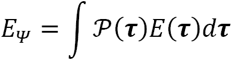
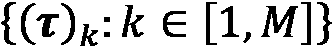
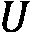
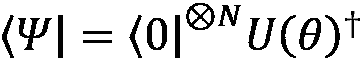
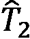
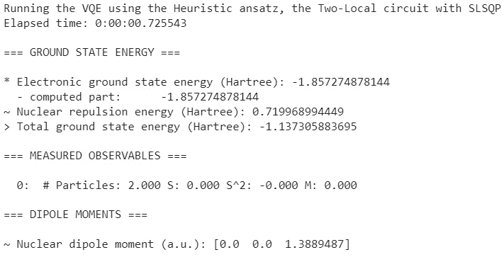

# 第五章：变分量子本征求解器（VQE）算法

“宇宙不仅比我们想象的更奇怪，而且比我们能想象的更奇怪。”

– 韦纳·海森堡


图 5.1 – 潜在能面（PES）上的最速下降线 [作者]

我们在第 1.1 节*理解量子化学和力学的历史*中介绍了变分法使用的历史背景。它是一种可以用于计算的数学结构。在量子化学的背景下，变分法用于确定与特征值相关的最低能量，无论是基态还是激发态。

**变分量子本征求解器**（**VQE**）算法于 2014 年提出[VQE_1]，并使用基于量子硬件进行定义。它是目前科学工业正在探索的几个**变分量子算法**（**VQAs**）中的第一个。

我们使用**单位耦合簇单双**（**UCCSD**）作为变分法的起始点来确定一个试探波函数，因为 VQE 的基必须接近真实基态，这对于 VQE 计算的成功至关重要。为了获得 1 毫哈特里（mHA）的准确能量估计，VQE 的基必须比真实基态小百万分之一[Troyer]。在本章中，我们将专注于计算氢（H2）和氢化锂（LiH）分子以及一个宏分子的基态和 Born-Oppenheimer 势能面（BOPES）。我们在*第 4.1 节，Born-Oppenheimer 近似*中介绍了 BOPES。我们将涵盖以下主题：

+   *第 5.1 节，变分法*

+   *第 5.2 节，示例化学计算*

# 技术要求

本章的配套 Jupyter 笔记本可以从 GitHub 下载，网址为[`github.com/PacktPublishing/Quantum-Chemistry-and-Computing-for-the-Curious`](https://github.com/PacktPublishing/Quantum-Chemistry-and-Computing-for-the-Curious)，该笔记本已在 Google Colab 环境中测试，Colab 是免费的，完全运行在云端，以及 IBM 量子实验室环境中。请参阅*附录 B* *– 在云端利用 Jupyter 笔记本*，获取更多信息。配套的 Jupyter 笔记本会自动安装以下列表中的库：

+   **数值 Python**（**NumPy**）[NumPy]，一个开源的 Python 库，几乎被应用于科学和工程的各个领域。

+   Qiskit [Qiskit]，一个开源 SDK，用于在脉冲、电路和应用模块级别与量子计算机协同工作。

+   Qiskit 可视化支持，以启用可视化功能和 Jupyter 笔记本的使用。

+   Qiskit Nature [Qiskit_Nature] [Qiskit_Nat_0]，一个独特的平台，用于弥合自然科学与量子模拟之间的差距。

+   **基于 Python 的化学模拟框架**（**PySCF**）[PySCF]，一个由 Python 驱动的开源电子结构模块集合。

+   **Python 量子工具箱**（**QuTiP**）[QuTiP]，一个用于解决量子力学问题（如由低能级量子系统和谐振子组成的系统）的通用框架。

+   **原子模拟环境**（**ASE**）[ASE_0]，一套用于设置、操作、运行、可视化和分析原子模拟的工具和 Python 模块。代码在 GNU LGPL 许可下免费提供。

+   PyQMC [PyQMC]，一个实现实空间量子蒙特卡罗技术的 Python 模块。它主要用于与 PySCF 交互操作。

+   h5py [h5py] 包，一个 Pythonic 接口，用于 HDF5 二进制数据格式。

+   SciPy [SciPy]，一个包含大量概率分布、汇总和频率统计、相关函数和统计测试、掩码统计、核密度估计、准蒙特卡罗功能等的 Python 模块。

## 安装 NumPy、Qiskit、QuTiP 并导入各种模块

使用以下命令安装 NumPy：

```py
pip install numpy
```

使用以下命令安装 Qiskit：

```py
pip install qiskit
```

使用以下命令安装 Qiskit 可视化支持：

```py
pip install 'qiskit[visualization]'
```

使用以下命令安装 Qiskit Nature：

```py
pip install qiskit-nature
```

使用以下命令安装 PySCF：

```py
pip install pyscf
```

使用以下命令安装 QuTiP：

```py
pip install qutip
```

使用以下命令安装 ASE：

```py
pip install ase
```

使用以下命令安装 PyQMC：

```py
pip install pyqmc --upgrade
```

使用以下命令安装 h5py：

```py
pip install h5py
```

使用以下命令安装 SciPy：

```py
pip install scipy
```

使用以下命令导入 NumPy：

```py
import numpy as np
```

使用以下命令导入 Matplotlib，一个用于在 Python 中创建静态、动画和交互式可视化的综合库：

```py
import matplotlib.pyplot as plt
```

导入所需的函数和类方法。`array_to_latex function()` 返回一个具有 1 或 2 维的复杂数组的 LaTeX 表示形式：

```py
from qiskit.visualization import array_to_latex, plot_bloch_vector, plot_bloch_multivector, plot_state_qsphere, plot_state_city
from qiskit import QuantumRegister, ClassicalRegister, QuantumCircuit, transpile
from qiskit import execute, Aer
import qiskit.quantum_info as qi
from qiskit.extensions import Initialize
from qiskit.providers.aer import extensions  # import aer snapshot instructions
```

使用以下命令导入 Qiskit Nature 库：

```py
from qiskit import Aer
from qiskit_nature.drivers import UnitsType, Molecule
from qiskit_nature.drivers.second_quantization import ElectronicStructureDriverType, ElectronicStructureMoleculeDriver
from qiskit_nature.problems.second_quantization import ElectronicStructureProblem
from qiskit_nature.mappers.second_quantization import ParityMapper, JordanWignerMapper, BravyiKitaevMapper
from qiskit_nature.converters.second_quantization import QubitConverter
from qiskit_nature.transformers.second_quantization.electronic import ActiveSpaceTransformer, FreezeCoreTransformer
from qiskit_nature.operators.second_quantization import FermionicOp
from qiskit_nature.circuit.library.initial_states import HartreeFock
from qiskit_nature.circuit.library.ansatzes import UCCSD
```

使用以下命令导入 Qiskit Nature 属性框架：

```py
from qiskit_nature.properties import Property, GroupedProperty
```

使用以下命令导入 `ElectronicEnergy` 属性：

```py
# https://qiskit.org/documentation/nature/tutorials/08_property_framework.html
from qiskit_nature.properties.second_quantization.electronic import (
    ElectronicEnergy,
    ElectronicDipoleMoment,
    ParticleNumber,
    AngularMomentum,
    Magnetization,
)
```

使用以下命令导入 `ElectronicIntegrals` 属性：

```py
from qiskit_nature.properties.second_quantization.electronic.integrals import (
    ElectronicIntegrals,
    OneBodyElectronicIntegrals,
    TwoBodyElectronicIntegrals,
    IntegralProperty,
)
from qiskit_nature.properties.second_quantization.electronic.bases import ElectronicBasis
```

使用以下命令导入 Qiskit Aer 状态向量模拟器和各种算法：

```py
from qiskit.providers.aer import StatevectorSimulator
from qiskit import Aer
from qiskit.utils import QuantumInstance
from qiskit_nature.algorithms import VQEUCCFactory, GroundStateEigensolver, NumPyMinimumEigensolverFactory, BOPESSampler
from qiskit.algorithms import NumPyMinimumEigensolver, VQE, HamiltonianPhaseEstimation
from qiskit.circuit.library import TwoLocal
from qiskit.algorithms.optimizers import QNSPSA
from qiskit.opflow import StateFn, PauliExpectation,  CircuitSampler, PauliTrotterEvolution
from functools import partial as apply_variation
```

使用以下命令导入 PySCF gto 和 scf 库：

```py
from pyscf import gto, scf
```

使用以下命令导入 PyQMC API 库：

```py
import pyqmc.api as pyq
```

使用以下命令导入 h5py：

```py
import h5py
```

使用以下命令导入 ASE 库、`Atoms` 对象、分子数据和可视化：

```py
from ase import Atoms
from ase.build import molecule
from ase.visualize import view
```

使用以下命令导入数学库：

```py
import cmath
import math
```

使用以下命令导入 SciPy 包提供的 Python 统计函数：

```py
import scipy.stats as stats
```

使用以下命令导入 QuTiP：

```py
import qutip
```

使用以下命令导入 time 和 datetime：

```py
import time, datetime
```

使用以下命令导入 pandas 和 os.path：

```py
import pandas as pd
import os.path
```

# 5.1. 变分法

我们通过经典和混合量子方法来展示变分方法。我们比较 VQE 与变分蒙特卡罗方法。此外，我们还比较了 VQE 的结果与**量子相位估计**（**QPE**）算法的结果，后者不是变分方法。

在本节中，我们涵盖了以下主题：

+   *第 5.1.1 节，Rayleigh-Ritz 变分定理*

+   *第 5.1.2 节，变分蒙特卡罗方法*

+   *第 5.1.3 节，量子相位估计（QPE）*

+   *第 5.1.4 节，VQE 算法描述*

## 5.1.1\. Rayleigh-Ritz 变分定理

Rayleigh-Ritz 变分定理指出，系统哈密顿量 ![img/Formula_05_001.png] 关于任意波函数状态 (![img/Formula_05_002.png]) 的期望值总是该系统描述的精确基态能量 ![img/Formula_05_003.png] 的上界：

![img/Formula_05_004.jpg]

其中 ![img/Formula_05_005.png] 通常代表时间、空间和自旋变量。这个公式没有假设任何特定的化学设置或参考系。

现在我们给出了一般哈密顿量定理的证明，该哈密顿量由离散厄米算子 ![img/Formula_05_006.png] [Toulouse] 表示。回顾一下，根据在第 2.3.1 节中引入的谱定理，厄米算子 ![img/Formula_05_007.png] 必须有一组正交归一的本征向量 ![img/Formula_05_008.png] 以及实本征值 ![img/Formula_05_009.png]，![img/Formula_05_010.png]，这些构成了希尔伯特空间的一个正交归一基，并且在这个基中 ![img/Formula_05_006.png] 有一个唯一的谱表示：

![img/Formula_05_012.jpg]

我们可以按能量增加的顺序对 ![img/Formula_05_006.png] 的正交归一本征向量进行索引，![img/Formula_05_014.png]，并将任何状态 ![img/Formula_05_015.png] 在这个基中分解：

![img/Formula_05_016.jpg]

系数 ![img/Formula_05_017.png] 和归一化约束：

![img/Formula_05_018.jpg]

注意到复共轭转置是：

![img/Formula_05_019.jpg]

我们计算期望值：

![img/Formula_05_020.jpg]

这个表达式 ![img/Formula_05_021.png] 的最小值在 ![img/Formula_05_022.png] 和 ![img/Formula_05_023.png] 处取得，对于所有 ![img/Formula_05_024.png]，即对于 ![img/Formula_05_025.png]。因此：

![img/Formula_05_026.jpg]

为了找到最小值，可以找到关于波函数参数的表达式的第一和第二导数。这个变分定理的设置对于电子分子哈密顿量 (![img/Formula_05_027.png]) 是成立的。

## 5.1.2\. 变分蒙特卡罗方法

**变分蒙特卡罗**（**VMC**）方法基于 Rayleigh-Ritz 变分定理 [Chen] [Gorelov] [Toulouse_1] [Cao] [Dagrada] 和蒙特卡罗积分方法 [Pease]，注意到期望值可以重写为以下形式：


我们将积分分解为一个概率分布：


并且一个可观察的：


这使我们能够将能量表示为平均值的形式：



现在我们对  公式进行近似，这被称为**Metropolis-Hastings**（**MH**）算法 [Chen] [Toulouse1]。为了在数学上进行近似，我们从概率分布  中采样一组  点，并在每个点  上评估局部能量，因此：


在实践中，我们可以使用灵活的显式相关波函数 

现在我们用来自 Ref. [Stephens] 的 Python 代码给出 MH 算法的示例。MH 算法是一种用于从概率分布中产生样本的**马尔可夫链蒙特卡罗**（**MCMC**）方法，我们将称之为目标概率分布。它通过模拟一个马尔可夫链来工作，其平稳分布是目标概率分布。**马尔可夫链理论**用于描述在化学、化学工程、生物学和医学中突出的聚合反应类型，例如**聚合酶链反应**（**PCR**）[Tamir]。

我们想从以下概率分布中采样：


我们使用“随机游走”核实现 MH 算法，，其中  是正态分布，以下接受概率：


这里是代码：

```py
n = 10000 # Size of the Markov chain stationary distribution
# Use np.linspace to create an array of n numbers between 0 and n
index = np.linspace(0, n, num=n)
x = np.linspace(0, n, num=n)
x[0] = 3     # Initialize to 3
for i in range(1, n):
  current_x = x[i-1]
  # We add a N(0,1) random number to x
  proposed_x = current_x + stats.norm.rvs(loc=0, scale=1, size=1, random_state=None)
  A = min(1, p(proposed_x)/p(current_x))
  r = np.random.uniform(0,1) # Generate a uniform random number in [0, 1]
  if r < A:
    x[i] = proposed_x       # Accept move with probabilty min(1,A)
  else:
    x[i] = current_x        # Otherwise “reject” move, and stay where we are
```

我们绘制了马尔可夫链  访问的位置：

```py
plt.plot(index, x, label=”Trace plot”)
plt.xlabel('Index')
plt.ylabel('MH value')
plt.legend()
plt.show()
```

*图 5.2* 显示了结果：


图 5.2 – 马尔可夫链  访问的位置图

我们使用 Freedman-Diaconis 规则来选择用于直方图的“正确”的箱宽 [Bushmanov] [Freeman]：

```py
q25, q75 = np.percentile(x, [25, 75])
bin_width = 2 * (q75 - q25) * len(x) ** (-1/3)
bins = round((x.max() - x.min()) / bin_width)
print(“Freedman–Diaconis number of bins:”, bins)
```

这里是结果：

```py
Freedman–Diaconis number of bins: 109
```

我们绘制了马尔可夫链  的直方图：

```py
plt.hist(x, density=True, bins=bins)
plt.ylabel('Density')
plt.xlabel('x');
```

*图 5.3* 显示了结果：


图 5.3 – 马尔可夫链  的直方图

我们看到马尔可夫链  的值直方图是先前定义的分布  的良好近似。

现在我们定义 `run_PySCF()` 函数，该函数使用 PySCF RHF 方法计算基态能量，并使用 PyQMC Python 模块中的 `OPTIMIZE` 函数实现空间变分蒙特卡罗技术 [PyQMC]。它具有以下参数：

+   `molecule`，分子的几何形状，使用 Qiskit 的 `Molecule` 类定义

+   `pyqmc`，默认设置为`True`以运行 PyQMC Python 模块

+   `show`，默认设置为`True`以显示中间结果

+   这里是`run_PySCF()`函数的定义：

```py
def run_PySCF(molecule, pyqmc=True, show=True):
```

现在我们展示包含在`run_PySCF()`函数中的代码。首先，我们重置文件：

```py
  # Reset the files
  for fname in ['mf.hdf5','optimized_wf.hdf5']:
    if os.path.isfile(fname):
        os.remove(fname)
```

+   然后我们从输入参数传递的分子构建 PySCF 分子几何。

```py
  mol_PySCF = gto.M(atom = [“ “.join(map(str, (name, *coord))) for (name, coord) in molecule.geometry])
```

+   我们运行了 PySCF RHF 方法：

```py
  mf = scf.RHF(mol_PySCF)
  mf.chkfile = “mf.hdf5”

  conv, e, mo_e, mo, mo_occ = scf.hf.kernel(mf)
  if show:
    if conv:
      print(“PySCF restricted HF (RHF) converged ground-state energy: {:.12f}”.format(e))
    else:
      print(“PySCF restricted HF (RHF) ground-state computation failed to converge”)
```

+   接下来，我们在 PyQMC Python 模块中运行`OPTIMIZE`函数：

```py
  if pyqmc:
    pyq.OPTIMIZE(“mf.hdf5”,# Construct a Slater-Jastrow wave function from the pyscf output
      “optimized_wf.hdf5”, # Store optimized parameters in this file.
      nconfig=100,         # Optimize using this many Monte Carlo samples/configurations
      max_iterations=4,    # 4 optimization steps
      verbose=False)
```

+   我们读取包含优化参数的 HDF5 文件的内容，如果 PyQMC 变分蒙特卡洛计算收敛，则打印每次迭代的能量：

```py
    with h5py.File(“optimized_wf.hdf5”) as f:
      iter = f['iteration']
      energy = f['energy']
      error = f['energy_error']
      l = energy.shape[0]
      e = energy[l-1]
      err = error[l-1]
      if show:
        if err < 0.1:
          print(“Iteration, Energy, Error”)
          for k in iter:
            print(“{}:         {:.4f} {:.4f}”.format(k, energy[k], error[k]))
          print(“PyQMC Monte Carlo converged ground-state energy: {:.12f}, error: {:.4f}”.format(e, err))
        else:
          print(“PyQMC Monte Carlo failed to converge”)
```

最后，我们让`run_PySCF()`函数将以下参数返回给调用者：

+   `conv`，`Boolean`，如果 PySCF RHF 方法收敛则设置为`True`

+   `e`，基态能量

+   这里是`return`语句：

```py
return conv, e
```

## 5.1.3. 量子相位估计 (QPE)

在量子化学中，我们需要对参与化学反应的每种分子物种的总电子能量进行非常精确的计算 [Burg]。**量子相位估计** (**QPE**) 算法具有一个独特的特性，即它允许对量子系统进行有界误差的模拟，这使得它成为未来容错量子计算最有希望的应用之一。给定一个单位算符 ，其本征态和本征值 ，准备状态  的能力，以及应用  本身的能力，QPE 算法计算 ，其中  是用于估计  的量子比特数，从而允许我们将  测量得尽可能精确。

回想一下，在 *第 2.5 节，公设 5 – 时间演化动力学* 中，我们看到了量子系统的动力学由薛定谔方程描述：


对于具有初始条件  的时间独立哈密顿量 ，解为：


其中  是单位时间演化算符。进一步回忆，任何单位矩阵都有形式为  的特征值。 的特征值也是  的特征值。

现在我们说明如何使用 Qiskit 的`PhaseEstimation`类。首先，我们定义一个函数 ，它创建一个包含单个量子比特  的量子电路，并应用以下单位算符：


其中  是我们在 *第 3.2.1 节，单量子比特量子门* 中引入的门，其矩阵形式为：


这里是代码：

```py
def U(theta):
  unitary = QuantumCircuit(1)
  unitary.p(np.pi*2*theta, 0)
  return unitary
```

我们定义了`do_qpe()`函数，它说明了如何使用 Qiskit Nature 的`PhaseEstimation`类，并且有三个参数：

+   `unitary`，一个实现单位算符的函数

+   `nqubits`，量子比特数，默认为`3`

+   `show`，默认设置为 `True` 以显示 `PhaseEstimation` 类返回的相位

这里是代码：

```py
def do_qpe(unitary, nqubits=3, show=True):
  state_in = QuantumCircuit(1)
  state_in.x(0)
  pe = PhaseEstimation(num_evaluation_qubits=nqubits, quantum_instance=quantum_instance)
  result = pe.estimate(unitary, state_in)
  phase_out = result.phase
  if show:
    print(“Number of qubits: {}, QPE phase estimate: {}”.format(nqubits, phase_out))
  return(phase_out)
```

首先，我们使用三个量子比特进行准确度测试：

```py
quantum_instance = QuantumInstance(backend = Aer.get_backend('aer_simulator_statevector'))
theta = 1/2 + 1/4 + 1/8
print(“theta: {}”.format(theta))
unitary = U(theta)
result = do_qpe(unitary, nqubits=3)
```

这里是结果：

```py
theta: 0.875
Number of qubits: 3, QPE phase estimate: 0.875 
```

接下来，我们使用八个量子比特进行准确度测试：

```py
theta = 1/2 + 1/4 + 1/8 + 1/16 + 1/32 + 1/64 + 1/128 + 1/256
print(“theta: {}”.format(theta))
unitary = U(theta)
result = do_qpe(unitary, nqubits=8)
```

这里是结果：

```py
theta: 0.99609375
Number of qubits: 8, QPE phase estimate: 0.99609375 
```

我们可以看到，通过增加 `PhaseEstimation` 类允许使用的量子比特数量，我们可以从真实相位中获得一个有界误差的相位估计。

## 5.1.4. VQE 算法描述

在循环中，经典计算机根据目标函数优化量子电路的参数，例如寻找分子的基态，这是具有最低能量的状态。参数化量子电路准备一个试验量子态作为试验解（一个试探解）。通过反复测量量子电路输出的量子比特，我们得到与试验态相关的能量可观察量的期望值。

VQE 算法提供了一个编码为哈密顿量  的给定量子系统的基态估计，即系统具有最低能量的状态 ，例如，分子的基态能量。它涉及对参数化（）试验态  的能量可观察量的期望值  进行迭代最小化：


如 *第 3.1.6 节，泡利矩阵* 所示，我们可以将哈密顿量  分解为  张量积  的加权求和，其中  具有权重  和  个量子比特：


因此，能量可观察量的期望值  可以重新写为以下形式：


我们使用量子电路初始化在状态  并表示为  的参数集  准备一个试验态 ，该电路输出状态 。

通过转置复共轭 ，我们可以将能量可观察量的期望值  重新写为以下形式：


然后将求和项移到前面：


对于每个 ，我们运行量子电路 ，然后根据  进行旋转 ，在 Z 基础上测量量子比特，从而有效地测量输出态在  的特征向量基中的输出态，以获得与输出态  相关的期望值 。

在经典计算机上，我们计算期望值的加权总和  与权重  相乘，以得到相对于输出状态  的期望值 。我们使用经典优化算法更新参数集 ，最小化期望值 ，直到能量值收敛或达到最大允许迭代次数。收敛时的参数  大约定义了编码到哈密顿量  中的量子系统的基态  的最低能量 。算法总结在 *图 5.4* 中。


图 5.4 – VQE 算法

### 尝试波函数

**耦合簇**（**CC**）理论使用指数簇算符  构建多电子波函数 ()，其中  是所有单激发的算符， 是所有双激发的算符，等等。我们以以下量子态  的**单位 ary 耦合簇**（**UCC**）基函数  作为变分参数 [Panagiotis] [Lolur] 开始 VQE：


其中  是哈特里-福克基态。在仅限于单、双激发扩展的 UCC 方法（UCCSD）中，算符  和  可以展开如下：


其中：

+    是在第 4.3.1 节“费米子创建算符”中引入的费米子创建算符

+    是在第 4.3.2 节“费米子湮灭算符”中引入的费米子湮灭算符

+    是所有展开系数的参数集。

然后将量子态  的 UCCSD 基函数映射到量子比特算符，使用第 4.7 节中引入的 Jordan-Wigner（JW）、偶数性或 Bravyi-Kitaev（BK）变换，从而得到 VQE 计算的初始量子比特状态向量。

### 设置 VQE 求解器

我们使用 Qiskit Aer 状态向量模拟器后端设置了一个无噪声的模拟：

```py
quantum_instance = QuantumInstance(backend = Aer.get_backend('aer_simulator_statevector'))
```

现在我们设置求解方法。要了解如何训练基于电路的变分模型，请参阅参考文献 [Qiskit_2021_Lab4]。首先，我们按照以下方式设置 NumPy 最小特征值求解器：

```py
numpy_solver = NumPyMinimumEigensolver()
```

我们按照 [Panagiotis] 的方法设置双局部电路如下：

```py
tl_circuit = TwoLocal(rotation_blocks = ['h', 'rx'], entanglement_blocks = 'cz',
                      entanglement='full', reps=2, parameter_prefix = 'y')
```

我们使用启发式基函数，即默认的**顺序最小二乘规划（SLSQP）**优化器设置 VQE，采用双局部电路：

```py
vqe_tl_solver = VQE(ansatz = tl_circuit,
                     quantum_instance = QuantumInstance(Aer.get_backend('aer_simulator_statevector')))
```

然后，我们使用**单位耦合簇**（**UCC**）工厂设置求解器。它允许快速初始化 VQE，将量子比特初始化在哈密顿状态，并使用量子 UCC 单双（q-UCCSD），这是一个流行的波函数近似[VQE_2] [VQE_3]。以下是代码：

```py
vqe_ucc_solver = VQEUCCFactory(quantum_instance, ansatz=tl_ circuit)
```

我们为`qnspsa_loss`设置了一个回调函数，`qnspsa_callback()`：

```py
qnspsa_loss = []
def qnspsa_callback(nfev, x, fx, stepsize, accepted):
    qnspsa_loss.append(fx)
```

现在，我们准备展示一些示例。

# 5.2. 示例化学计算

如*第四章*中所述，分子哈密顿量，由于使用了 BO 近似，近似核运动的 PES。我们可以使用半经验方法通过实验数据/或计算机模拟来近似 PES。

PES 可以与有山有谷的地形进行比较。在实践中，作为化学家，我们希望找到 PES 的全局最小值（海底），而不是局部最小值（山丘草地），如图 5.1 所示。我们使用经典和量子变分方法来找到全局最小值。这可以与在地形上滚动的球体进行比较。如果我们给球体一个方向上的推力，通常是向下的，球体最终会落在最小值处。我们称这种梯度下降。梯度下降可以通过数值改变输入值或通过描述 PES 的波函数的解析公式来提供。

为了说明确定 PES 的计算，我们猜测一个试探波函数，该波函数可以在计算中优化，使我们能够找到能量的全局最小值。我们称这个全局最小值为给定本征值的最低能量。我们称这个全局最小值为给定本征值的最低能量。

我们展示了使用经典 PySCF RHF、PyQMC 变分蒙特卡洛、QPE 和 Qiskit Nature 的 VQE 以及使用 PySCF 驱动程序的 STO-3G 基，求解三个分子的基态并绘制 BOPES 的几种实现。

在本节中，我们将涵盖以下主题：

+   *第 5.2.1 节，氢分子*

+   *第 5.2.2 节，氢化锂分子*

+   *第 5.2.3 节，大分子*

我们使用在*第 4.6.1 节，构建氢分子的费米子哈密顿量算符*中定义的`get_particle_number()`函数，该函数获取给定电子结构问题的粒子数属性。

我们使用在*第 4.8 节，使用 Qiskit Nature 构建量子比特哈密顿量*中定义的`fermion_to_qubit()`函数，将费米子算符转换为量子比特算符。它具有以下输入参数：

+   `f_op`，一个费米子算符，如*第 4.6 节，使用 Qiskit Nature 构建费米子哈密顿量*中所述获得

+   `mapper`，可以是`“Jordan-Wigner”`、`“Parity”`或`“Bravyi-Kitaev”`

+   `truncate`，一个用于截断泡利列表的整数，默认设置为 20 项

+   `two_qubit_reduction`，一个布尔值，默认为`False`，用于确定是否在可能的情况下执行两量子比特简化

+   `z2symmetry_reduction`，默认为`None`，表示是否应将 Z2 对称性减少应用于基于在算符中可检测到的数学对称性计算出的结果量子比特算符[de Keijzer]

+   `show`，默认设置为`True`以显示变换名称和结果

Qiskit Nature 提供了一个名为`GroundStateEigensolver`的类，用于计算分子的基态。我们定义了`run_vqe()`函数，它具有以下输入参数：

+   `name`，一个字符串，将被打印出来，例如`'NumPy 精确求解器'`

+   `f_op`，一个通过*第四部分，使用 Qiskit Nature 构建费米子哈密顿量*中解释的方法获得的费米子算符

+   `qubit_converter`，`JordanWignerMapper()`、`ParityMapper()`或`BravyiKitaevMapper()`之一，这是`fermion_to_qubit()`函数的输出

+   `solver`，*第 5.2.3 节，设置 VQE 求解器*中定义的求解器之一，`numpy_solver`、`vqe_ucc_solver`或`vqe_tl_solver`。

这里是代码：

```py
def run_vqe(name, f_op, qubit_converter, solver, show=True):
  calc = GroundStateEigensolver(qubit_converter, solver)
  start = time.time()
  ground_state = calc.solve(f_op)
  elapsed = str(datetime.timedelta(seconds = time.time()-start))
  if show:
    print(“Running the VQE using the {}”.format(name))
    print(“Elapsed time: {} \n”.format(elapsed))
    print(ground_state)
  return ground_state
```

我们定义了`run_qpe()`函数以执行量子相位估计，并返回哈密顿量的本征值作为电子基态能量的估计。它具有以下输入参数：

+   `particle_number`，`get_particle_number()`函数返回的属性

+   `qubit_converter`，`JordanWignerMapper()`、`ParityMapper()`或`BravyiKitaevMapper()`之一，这是`fermion_to_qubit()`函数的输出

+   `qubit_op`，由`fermion_to_qubit()`函数返回的量子比特哈密顿量算符

+   `n_ancillae`，一个整数，默认为`3`，表示辅助量子比特的数量

+   `num_time_slices`，一个整数，默认为`1`，表示`PauliTrotterEvolution`类的数量

+   `show`，默认设置为`True`以显示中间结果

这里是代码：

```py
def run_qpe(particle_number, qubit_converter, qubit_op, n_ancillae=3, num_time_slices = 1, show=True):
  initial_state = HartreeFock(particle_number.num_spin_orbitals, 
                            (particle_number.num_alpha, 
                             particle_number.num_beta), qubit_converter)

  state_preparation = StateFn(initial_state)
  evolution = PauliTrotterEvolution('trotter', reps=num_time_slices)
  qpe = HamiltonianPhaseEstimation(n_ancillae, quantum_instance=quantum_instance)
  result = qpe.estimate(qubit_op, state_preparation, evolution=evolution)
  if show:
    print(“\nQPE initial Hartree Fock state”)
    display(initial_state.draw(output='mpl'))
    eigv = result.most_likely_eigenvalue
    print(“QPE computed electronic ground state energy (Hartree): {}”.format(eigv))

  return eigv
```

我们定义了`plot_energy_landscape()`函数，以绘制原子间距作为能量的函数：

```py
def plot_energy_landscape(energy_surface_result):
  if len(energy_surface_result.points) > 1:
      plt.plot(energy_surface_result.points, energy_surface_result.energies, label=”VQE Energy”)
      plt.xlabel('Atomic distance Deviation(Angstrom)')
      plt.ylabel('Energy (hartree)')
      plt.legend()
      plt.show()
  else:
      print(“Total Energy is: “, energy_surface_result.energies[0], “hartree”)
      print(“(No need to plot, only one configuration calculated.)”)
  return
```

我们定义了`plot_loss()`函数，它接受以下输入参数：

+   `loss`，一个浮点数数组，可选，由回调函数生成

+   `label`，一个字符串，将由`plot_loss()`函数显示

+   `target`，一个浮点数，将由`plot_loss()`函数显示

这里是代码：

```py
def plot_loss(loss, label, target):
  plt.figure(figsize=(12, 6))
  plt.plot(loss, 'tab:green', ls='--', label=label)
  plt.axhline(target, c='tab:red', ls='--', label='target')
  plt.ylabel('loss')
  plt.xlabel('iterations')
  plt.legend()
```

我们现在定义`solve_ground_state()`函数，该函数用于求解基态。它接受以下参数作为输入，这些参数定义了分子的几何形状：

+   `molecule`，分子的几何形状，以及`Molecule`函数的输出。

+   `mapper`，`“Jordan-Wigner”`、`“Parity”`或`“Bravyi-Kitaev”`之一。

+   `num_electrons`，一个整数，可选，`ActiveSpaceTransformer`的电子数量。默认为`2`。

+   `num_molecular_orbitals`，一个整数，可选，`ActiveSpaceTransformer`的电子轨道数量。默认为`2`。

以下输入参数列表控制整个流程：

+   `transformers`，一个可选的转换器列表。例如，对于氢化锂，我们将使用以下设置：`transformers=[FreezeCoreTransformer(freeze_core=True, remove_orbitals=[4, 3])]`。

+   `two_qubit_reduction`，一个布尔值，默认为`False`。它决定了是否在可能的情况下执行两比特简化。

+   `z2symmetry_reduction`，默认为`None`，这表示是否应该将 Z2 对称性简化应用于基于可以在算子中检测到的数学对称性计算出的结果量子比特算子[de Keijzer]。

+   `name_solver`，求解器的名称，默认为`'NumPy exact solver'`。

+   `solver`，可以是第 5.2.3 节中定义的求解器之一，即`numpy_solver`、`vqe_ucc_solver`或`vqe_tl_solver`。默认为`NumPyMinimumEigensolver()`。

+   `plot_bopes`，一个布尔值，设置为`True`以计算和绘制分子的 BOPES。

+   `perturbation_steps`，评估自由度的点，在这种情况下是一个以埃为单位的距离。默认为`np.linspace(-1, 1, 3)`。

+   `pyqmc`，默认设置为`True`以运行 PyQMC Python 模块。

+   `n_ancillae`，一个整数，默认为`3`，代表`run_qpe()`函数使用的辅助量子比特的数量。

+   `num_time_slices`，一个整数，默认为`1`，代表`PauliTrotterEvolution`类的数量。

+   `loss`，一个可选的浮点数数组，由回调函数生成。

+   `label`，一个字符串，将由`plot_loss()`函数显示。

+   `target`，一个浮点数，将由`plot_loss()`函数显示。

+   `show`，默认设置为`True`以显示中间结果。

下面是`solve_ground_state()`函数的定义：

```py
def solve_ground_state(
    molecule,
    mapper =”Parity”,
    num_electrons=None,
    num_molecular_orbitals=None,
    transformers=None,
    two_qubit_reduction=False,
    z2symmetry_reduction = “Auto”,
    name_solver='NumPy exact solver',
    solver=NumPyMinimumEigensolver(),
    plot_bopes=False,
    perturbation_steps=np.linspace(-1, 1, 3),
    pyqmc=True,
    n_ancillae=3, 
    num_time_slices=1,
    loss=[],
    label=None,
    target=None,
    show=True
):
```

现在我们展示包含在`solve_ground_state()`函数中的代码。

我们首先通过选择 PySCF 驱动类型和分子轨道要展开的基础集`sto3g`来定义电子结构分子驱动程序。以下是代码：

```py
    # Defining the electronic structure molecule driver
    driver = ElectronicStructureMoleculeDriver(molecule, basis='sto3g', driver_type=ElectronicStructureDriverType.PYSCF)
```

然后，如果同时指定了`num_electrons`和`num_molecular_orbitals`，我们调用`ActiveSpaceTransformer`函数将计算分为经典和量子两部分：

```py
# Splitting into classical and quantum
    if num_electrons != None and num_molecular_orbitals != None:
      split = ActiveSpaceTransformer(num_electrons=num_electrons, num_molecular_orbitals=num_molecular_orbitals)
    else:
      split = None
```

接下来，我们创建一个`ElectronicStructureProblem`，如下生成费米子算子的列表：

```py
# Defining a fermionic Hamiltonian operator
    if split != None:
      fermionic_hamiltonian = ElectronicStructureProblem(driver, [split])
    elif transformers != None:
      fermionic_hamiltonian = ElectronicStructureProblem(driver, transformers=transformers)
    else:
      fermionic_hamiltonian = ElectronicStructureProblem(driver)
```

然后，我们使用`second_q_ops()`方法[Qiskit_Nat_3]，它返回一个包含量子化算子的列表：哈密顿算子、总粒子数算子、总角动量算子、总磁化算子，以及如果可用的话，，，偶极算子：

```py
second_q_op = fermionic_hamiltonian.second_q_ops()
```

我们通过调用`particle_number()`函数来获取分子的粒子数属性：

```py
    # Get particle number
    particle_number = get_particle_number(fermionic_hamiltonian, show=show)
```

如果输入参数`show`设置为`True`，我们使用`set_truncation(1000)`方法将截断设置为`1000`，然后打印分子的费米子哈密顿算子：

```py
if show:
      # We set truncation to 1000 with the method set_truncation(1000)
      second_q_op[0].set_truncation(1000)
      # then we print the first 20 terms of the fermionic Hamiltonian operator of the molecule
      print(“Fermionic Hamiltonian operator”)
      print(second_q_op[0])
```

接下来，我们使用在第 4.8 节*使用 Qiskit Nature 构建量子比特哈密顿量*中定义的`fermion_to_qubit()`函数将费米子算符转换为量子比特算符：

```py
# Use the function fermion_to_qubit() to convert a fermionic operator to a qubit operator
    if show:
      print(“ “)
    qubit_op, qubit_converter = fermion_to_qubit(fermionic_hamiltonian, second_q_op, mapper=mapper, two_qubit_reduction=two_qubit_reduction, z2symmetry_reduction=z2symmetry_reduction, show=show)
```

然后我们调用之前定义的`run_PySCF()`函数来运行 PySCF RHF 方法：

```py
    # Run the the PySCF RHF method
    if show:
      print(“ “)
    conv, e = run_PySCF(molecule, pyqmc=pyqmc, show=show)
```

然后我们调用`run_qpe()`函数执行 QPE，并将哈密顿量的最可能本征值作为电子基态能量的估计值返回：

```py
 # Run QPE
    eigv = run_qpe(particle_number, qubit_converter, qubit_op, n_ancillae=n_ancillae, num_time_slices=num_time_slices, show=True)
```

接下来，我们调用之前定义的`run_vqe()`函数来求解基态：

```py
    # Run VQE
    if show:
      print(“ “)
    ground_state = run_vqe(name_solver, fermionic_hamiltonian, qubit_converter, solver, show=show)
```

如果`loss`参数不是一个空数组，我们调用`plot_loss()`函数来绘制损失随迭代次数的变化：

```py
    # Plot loss function
    if loss != []:
      plot_loss(loss, label, target)
```

接下来，如果`plot_bopes`参数设置为`True`，我们使用`BOPESSampler` Python 类[Qiskit_Nat_6]，它管理改变几何形状并重复调用基态求解器的过程，然后我们获取并绘制 BOPES：

```py
if plot_bopes:
      # Compute the potential energy surface as follows:
      energy_surface = BOPESSampler(gss=GroundStateEigensolver(qubit_converter, solver), bootstrap=False)
      # Set default to an empty dictionary instead of None:
      energy_surface._points_optparams = {}
      energy_surface_result = energy_surface.sample(fermionic_hamiltonian, perturbation_steps)
      # Plot the energy as a function of atomic separation
      plot_energy_landscape(energy_surface_result)
```

最后，我们让`solve_ground_state()`函数将以下参数返回给调用者：

+   `fermionic hamiltonian`，分子的费米子哈密顿量算符

+   `particle number`，分子的粒子数性质

+   `qubit_op`，量子比特哈密顿量算符

+   `qubit_converter`，可以是`JordanWignerMapper()`、`ParityMapper()`或`BravyiKitaevMapper()`，这是`fermion_to_qubit()`函数的输出

+   `ground_state`，分子的基态，如果已经收敛

使用以下`return`语句：

```py
return fermionic_hamiltonian, particle_number, qubit_op, qubit_converter, ground_state
```

现在我们演示如何使用`solve_ground_state()`函数处理不同的分子、不同的映射器和不同的经典求解器。

## 5.2.1. 氢分子（H2）

我们遵循*第 4.6.1 节*中描述的过程，即*构建氢分子的费米子哈密顿量算符*。首先，我们定义氢分子的几何形状如下：

```py
hydrogen_molecule = Molecule(geometry=[['H', [0., 0., 0.]],
                              ['H', [0., 0., 0.735]]],
                     charge=0, multiplicity=1)
```

我们在*第 4.6.1 节*的*图 4.9*中展示了氢分子的粒子数性质，其中我们看到四个**自旋轨道**（**SOs**），一个电子和一个电子。

我们在第 4.6.1 节*构建氢分子的费米子哈密顿量算符*中展示了氢分子的费米子哈密顿量算符。

### 变化氢分子

我们指定分子变体的类型，`Molecule.absolute_stretching`，如下所示：

```py
molecular_variation = Molecule.absolute_stretching
```

我们指定将指定原子对中的第一个原子移动到第二个原子更近的位置。数字指的是几何定义列表中原子的索引。以下是代码：

```py
specific_molecular_variation = apply_variation(molecular_variation, atom_pair=(1, 0))
```

我们按如下方式修改原始分子定义：

```py
hydrogen_molecule_stretchable = Molecule(geometry=
                                 [['H', [0., 0., 0.]],
                                  ['H', [0., 0., 0.735]]],
                                  charge=0, multiplicity=1,
                                  degrees_of_freedom=[specific_molecular_variation])
```

现在我们继续求解基态。

### 求解基态

现在我们使用 NumPy 精确最小本征值求解器运行 VQE：

```py
H2_fermionic_hamiltonian, H2_particle_number, H2_qubit_op, H2_qubit_converter, H2_ground_state = \
                  solve_ground_state(hydrogen_molecule, mapper =”Parity”,
                   two_qubit_reduction=True, z2symmetry_reduction=None, 
                   name_solver = 'NumPy exact solver', solver = numpy_solver)
```

*图 5.5*显示了`run_PySCF()`和`run_QPE()`函数的计算结果：


图 5.5 – 使用 PySCF RHF、PyQMC 模拟退火和 QPE 的 H2 分子基态

*图 5.6* 展示了 VQE 计算的结果：


图 5.6 – 使用 NumPy 最小特征值求解器进行 VQE 的 H2 分子基态

接下来，我们使用 UCC 工厂基组（[VQE_2] [VQE_3]）运行 VQE：

```py
H2_fermionic_hamiltonian, H2_particle_number, H2_qubit_op, H2_qubit_converter, H2_ground_state = \
                  solve_ground_state(hydrogen_molecule, mapper =”Parity”,
                   two_qubit_reduction=True, z2symmetry_reduction=None, 
                   name_solver = 'Unitary Coupled Cluster (UCC) factory ansatz', solver = vqe_ucc_solver)
```

*图 5.7* 展示了结果：


图 5.7 – 使用 UCC 工厂基组进行 VQE 的 H2 分子基态

现在我们使用启发式基组，默认的 SLSQP 优化器（[Panagiotis]）运行 VQE：

```py
H2_fermionic_hamiltonian, H2_particle_number, H2_qubit_op, H2_qubit_converter, H2_ground_state = \
                  solve_ground_state(hydrogen_molecule, mapper =”Parity”,
                   two_qubit_reduction=True, z2symmetry_reduction=None, 
                   name_solver = 'Heuristic ansatz, the Two-Local circuit with SLSQP',solver = vqe_tl_solver)
```

*图 5.8* 展示了结果：



图 5.8 – 使用 Two-Local 电路和 SLSQP 进行 VQE 的 H2 分子基态

我们定义 `qnspsa()` 函数如下：

```py
qnspsa_loss = []
ansatz = tl_circuit
fidelity = QNSPSA.get_fidelity(ansatz, quantum_instance, expectation=PauliExpectation())
qnspsa = QNSPSA(fidelity, maxiter=200, learning_rate=0.01, perturbation=0.7, callback=qnspsa_callback)
```

这里是设置 VQE 使用启发式基组和 QN-SPSA 优化器的代码：

```py
vqe_tl_QNSPSA_solver = VQE(ansatz=tl_circuit, optimizer=qnspsa,
                     quantum_instance=quantum_instance)
```

现在我们使用启发式基组和 QN-SPSA 优化器调用 `solve_ground_state()`：

```py
H2_fermionic_hamiltonian, H2_particle_number, H2_qubit_op, H2_qubit_converter, H2_ground_state = \
                  solve_ground_state(hydrogen_molecule, mapper =”Parity”,
                  two_qubit_reduction=True, z2symmetry_reduction=None, loss=qnspsa_loss, label='QN-SPSA', target=-1.857274810366,
                  name_solver='Two-Local circuit and the QN-SPSA optimizer', solver=vqe_tl_QNSPSA_solver)
```

*图 5.9* 展示了结果：


图 5.9 – 使用 Two-Local 电路和 QN-SPSA 进行 VQE 的 H2 分子基态

*图 5.10* 展示了 QN-SPSA 优化器的损失函数图：


图 5.10 – 使用 Two-Local 电路和 QN-SPSA 对 H2 分子进行 VQE 的损失函数图

*图 5.11* 中的表格总结了使用 Python 包 PySCF RHF、PyQMC 以及 Qiskit Nature 类（VQE 使用 NumPy 精确求解器、SLSQP、QN-SPSA 和 QPE）获得的计算结果。


图 5.11 – 总结使用 H2 分子获得的基态能量的计算表格

*图 5.11* 显示了不同电子基态计算和总基态能量与相同量子比特映射器（称为 `ParityMapper()`，`two_qubit_reduction=True`）的紧密一致性。PyQMC 方法给出了最低的总能量 -1.162 Ha，是最准确的。它与参考文献 [Ebomwonyi] 中显示的 -1.168 Ha 的结果一致。

### 计算 BOPES

我们现在计算并绘制氢分子的 BOPES 如下：

```py
perturbation_steps = np.linspace(-0.5, 2, 25) # 25 equally spaced points from -0.5 to 2, inclusive.
H2_stretchable_fermionic_hamiltonian, H2_stretchable_particle_number, H2_stretchable_qubit_op, H2_stretchable_qubit_converter, H2_stretchable_ground_state = \
                  solve_ground_state(hydrogen_molecule_stretchable, mapper =”Parity”,
                   two_qubit_reduction=True, z2symmetry_reduction=None, 
                   name_solver = 'NumPy exact solver', solver = numpy_solver,
                   plot_bopes = True, perturbation_steps=perturbation_steps)
```

*图 5.12* 展示了氢分子 BOPES 的图：


图 5.12 – 氢分子 BOPES 的图

## 5.2.2. 锂氢分子

我们遵循 *第 4.6.2 节，构建锂氢分子的费米子哈密顿算符* 中描述的过程。首先，我们定义锂氢（LiH）分子的几何结构如下：

```py
LiH_molecule = Molecule(geometry=[['Li', [0., 0., 0.]],
                              ['H', [0., 0., 1.5474]]],
                     charge=0, multiplicity=1)
```

我们在*第 4.6.2 节*的*图 4.17*中展示了粒数属性，其中我们看到了六个 SOs、一个电子和一个电子。我们在*第 4.6.2 节*的*图 4.20*中展示了锂氢分子的费米子哈密顿算符。

### 改变锂氢分子

我们如下修改了原始分子定义：

```py
LiH_molecule_stretchable = Molecule(geometry=[['Li', [0., 0., 0.]],
                              ['H', [0., 0., 1.5474]]],
                    charge=0, multiplicity=1,
                    degrees_of_freedom=[specific_molecular_variation])
reduction=True, z2symmetry_reduction=”auto”)
```

### 求解基态

我们使用 NumPy 精确特征值求解器运行 VQE：

```py
LiH_fermionic_hamiltonian, LiH_particle_number, LiH_qubit_op, LiH_qubit_converter, LiH_ground_state = \
                  solve_ground_state(LiH_molecule, mapper =”Parity”,
                  transformers=[FreezeCoreTransformer(freeze_core=True, remove_orbitals=[4, 3])],
                  two_qubit_reduction=True, z2symmetry_reduction=”auto”, 
                  name_solver = 'NumPy exact solver', solver = numpy_solver)
```

*图 5.13* 展示了`run_PySCF()`和`run_QPE()`函数的计算结果：


图 5.13 – 使用 PySCF RHF、PyQMC 蒙特卡洛和 QPE 得到的 LiH 分子的基态

*图 5.14* 展示了 VQE 计算的成果：


图 5.14 – 使用 NumPy 最小特征值求解器的 VQE 得到的 LiH 分子的基态

我们使用 Two-Local 电路和 SLSQP 运行 VQE：

```py
LiH_fermionic_hamiltonian, LiH_particle_number, LiH_qubit_op, LiH_qubit_converter, LiH_ground_state = \
                  solve_ground_state(LiH_molecule, mapper =”Parity”,
                  transformers=[FreezeCoreTransformer(freeze_core=True, remove_orbitals=[4, 3])],
                  two_qubit_reduction=True, z2symmetry_reduction=”auto”, 
                  name_solver = 'Heuristic ansatz, the Two-Local circuit with SLSQP', solver = vqe_tl_solver)
```

*图 5.15* 展示了结果：


图 5.15 – 使用 Two-Local 电路和 SLSQP 的 VQE 得到的 LiH 分子的基态

我们如下定义`qnspsa()`函数：

```py
qnspsa_loss = []
ansatz = tl_circuit
fidelity = QNSPSA.get_fidelity(ansatz, quantum_instance, expectation=PauliExpectation())
qnspsa = QNSPSA(fidelity, maxiter=500, learning_rate=0.01, perturbation=0.7, callback=qnspsa_callback)
```

下面是使用启发式基和 QN-SPSA 优化器的 VQE 设置的代码：

```py
vqe_tl_QNSPSA_solver = VQE(ansatz=tl_circuit, optimizer=qnspsa,
                     quantum_instance=quantum_instance)
```

现在我们使用启发式基和 QN-SPSA 优化器调用`solve_ground_state()`：

```py
LiH_fermionic_hamiltonian, LiH_particle_number, LiH_qubit_op, LiH_qubit_converter, LiH_ground_state = \
                  solve_ground_state(LiH_molecule, mapper=”Parity”,
                  transformers=[FreezeCoreTransformer(freeze_core=True, remove_orbitals=[4, 3])],
                  two_qubit_reduction=True, z2symmetry_reduction=”auto”, loss=qnspsa_loss, label='QN-SPSA', target=-1.0703584,
                  name_solver='Two-Local circuit and the QN-SPSA optimizer', solver=vqe_tl_QNSPSA_solver)
```

*图 5.16* 展示了结果：


图 5.16 – 使用 Two-Local 电路和 QN-SPSA 的 VQE 得到的 LiH 分子的基态

*图 5.17* 展示了 QN-SPSA 优化器的损失函数图：


图 5.17 – 使用 Two-Local 电路和 QN-SPSA 的 VQE 对 LiH 分子的损失函数

*图 5.18* 中显示的表格总结了使用 Python 包 PySCF RHF、PyQMC 以及 Qiskit Nature 类、使用 NumPy 精确求解器的 VQE、SLSQP、QN-SPSA 和 QPE 得到的计算结果：


图 5.18 – 总结使用 LiH 分子得到的基态能量的计算表格

*图 5.18* 显示了不同电子基态计算和总基态能量之间的紧密一致性。PyQMC 方法给出了最低的总能量-8.102 Ha，并且是最准确的。它与参考文献[Adamowicz_3]中显示的-8.07 Ha 的结果一致。

### 计算 BOPES

我们现在如下计算并绘制锂氢分子的 BOPES：

```py
perturbation_steps = np.linspace(-0.8, 0.8, 10) # 10 equally spaced points from -0.8 to 0.8, inclusive.
LiH_stretchable_fermionic_hamiltonian, LiH_stretchable_particle_number, LiH_stretchable_qubit_op, LiH_stretchable_qubit_converter, LiH_stretchable_ground_state = \
                  solve_ground_state(LiH_molecule_stretchable, mapper =”Parity”,
                  transformers=[FreezeCoreTransformer(freeze_core=True, remove_orbitals=[4, 3])],
                   two_qubit_reduction=True, z2symmetry_reduction=”auto”, 
                   name_solver='NumPy exact solver', solver=numpy_solver,
                   plot_bopes = True, perturbation_steps=perturbation_steps)
```

*图 5.19* 展示了结果：


图 5.19 – LiH 分子的 BOPES 图

## 5.2.3. 宏分子

现在，我们探索 IBM 量子挑战非洲 2021 年 HIV 的使用案例，量子化学在 HIV 中的应用 [Africa21]。在他们的挑战中，他们旨在确定一个抗逆转录病毒分子的玩具模型是否能与一个蛋白酶分子的玩具模型结合。由于抗逆转录病毒分子有多个原子，它通过使用单个碳原子进行近似。蛋白酶分子的玩具模型由甲酰胺分子（HCONH2）的一个组成部分表示；特别是它是甲酰胺分子的碳-氧-氮部分。简而言之，实验是确定单个碳原子是否能与甲酰胺分子的碳-氧-氮部分结合。我们将通过绘制宏观分子（甲酰胺分子加上碳原子）的 BOPES 来得到 IBM 提出的问题的答案。

首先，我们使用 ASE 的`Atoms`对象定义宏观分子 [ASE_1]：

```py
macro_ASE = Atoms('ONCHHHC', [(1.1280, 0.2091, 0.0000), 
                          (-1.1878, 0.1791, 0.0000), 
                          (0.0598, -0.3882, 0.0000),
                          (-1.3085, 1.1864, 0.0001),
                          (-2.0305, -0.3861, -0.0001),
                          (-0.0014, -1.4883, -0.0001),
                          (-0.1805, 1.3955, 0.0000)])
```

然后，我们使用 ASE 查看器 X3D 为 Jupyter 笔记本显示分子的 3D 视图 [ASE2]：

```py
view(macro_ASE, viewer='x3d')
```

*图 5.20*显示了结果。氮原子在左侧用蓝色表示，氧原子在右侧用红色表示，碳原子在中间用灰色表示，三个氢原子是浅灰色中最小的。顶部的碳原子没有与其他原子结合。


图 5.20 – 宏观分子

我们指定分子变体的类型，`Molecule.absolute_stretching`，如下所示：

```py
molecular_variation = Molecule.absolute_stretching
```

我们指定变体应用于哪些原子。数字指的是几何定义列表中原子的索引。单个碳原子被移动到氮原子更近的位置：

```py
specific_molecular_variation = apply_variation(molecular_variation, atom_pair=(6, 1))
```

我们使用 Qiskit 的`Molecule`类定义宏观分子的分子几何形状，如下所示：

```py
macromolecule = Molecule(geometry=
   [['O', [1.1280, 0.2091, 0.0000]],
   ['N', [-1.1878, 0.1791, 0.0000]],
   ['C', [0.0598, -0.3882, 0.0000]],
   ['H', [-1.3085, 1.1864, 0.0001]],
   ['H', [-2.0305, -0.3861, -0.0001]],
   ['H', [-0.0014, -1.4883, -0.0001]],
   ['C', [-0.1805, 1.3955, 0.0000]]],
   charge=0, multiplicity=1,
   degrees_of_freedom=[specific_molecular_variation])
```

现在我们可以求解基态。

### 求解基态

通过指定某些电子应使用量子计算算法处理，而其余电子应使用 Qiskit 的`ActiveSpaceTransformer`类进行经典近似，从而减少量子工作量，该类接受两个参数：

+   `num_electrons`，从最外层电子中选出的电子数量，从外向内计数，用于量子计算算法处理。

+   `num_molecular_orbitals`，允许这些电子在所谓的费米能级周围（漫游）的轨道数量。它决定了需要多少个量子比特。

我们打印 VQE 运行的参数选择：

```py
print(“Macro molecule”)
print(“Using the ParityMapper with two_qubit_reduction=True to eliminate two qubits”)
print(“Parameters ActiveSpaceTransformer(num_electrons=2, num_molecular_orbitals=2)”)
print(“Setting z2symmetry_reduction=\”auto\””)
```

这里是结果：

```py
Macro molecule
Using the ParityMapper with two_qubit_reduction=True to eliminate two qubits
Parameters ActiveSpaceTransformer(num_electrons=2, num_molecular_orbitals=2)
Setting z2symmetry_reduction=”auto”
```

然后我们使用 NumPy 精确最小本征值求解器运行 VQE：

```py
macro_fermionic_hamiltonian, macro_particle_number, macro_qubit_op, macro_qubit_converter, macro_ground_state = \
                  solve_ground_state(macromolecule, mapper=”Parity”,
                  num_electrons=2, num_molecular_orbitals=2,
                  two_qubit_reduction=True, z2symmetry_reduction=”auto”, 
                  name_solver='NumPy exact solver', solver=numpy_solver, pyqmc=False)
```

*图 5.21*显示了宏观分子费米子算符的前 20 项：


图 5.21 – 宏观分子费米子哈密顿算符的前 20 项

*图 5.22* 展示了通过偶宇称变换获得的大分子最外层两个电子的量子比特哈密顿算符。正如预期的那样，只需要两个量子比特来将费米子哈密顿算符映射到量子比特哈密顿算符：


图 5.22 – 大分子最外层两个电子的量子比特哈密顿算符

*图 5.23* 展示了由 PySCF RHF Python 软件包计算的分子的总基态能量以及由 Qiskit Nature QPE 类计算的最外层两个电子的分子电子基态能量的估计：


图 5.23 – 由 PySCF 和 QPE 分别计算的大分子的总基态能量和电子基态能量

*图 5.24* 展示了 VQE 计算的结果：


图 5.24 – 使用 NumPy 精确最小本征值求解器计算的大分子基态

通过 QPE 计算的大分子最外层两个电子的电子基态能量，（哈特里），以及通过 VQE 和 Qiskit Nature 类计算的大分子电子基态能量，，是一致的。

由 PySCF RHF Python 软件包计算的大分子的总基态能量，（哈特里），以及由 Qiskit Nature VQE 类计算的大分子的总基态能量，，是一致的。

### 计算 BOPES

我们现在按照以下方式计算和绘制大分子的 BOPES：

```py
perturbation_steps = np.linspace(-0.5, 3, 10) # 10 equally spaced points from -0.5 to 3, inclusive.
macro_fermionic_hamiltonian, macro_particle_number, macro_qubit_op, macro_qubit_converter, macro_ground_state = \
                  solve_ground_state(macromolecule, mapper =”Parity”,
                  num_electrons=2, num_molecular_orbitals=2,
                  two_qubit_reduction=True, z2symmetry_reduction=”auto”, 
                  name_solver='NumPy exact solver', solver=numpy_solver, pyqmc=False,
                  plot_bopes=True, perturbation_steps=perturbation_steps)
```

*图 5.25* 展示了结果：


图 5.25 – 大分子 BOPES 的绘图

大分子 BOPES 的绘图显示在任何分离下都没有明显的最小值。我们得出结论，单个碳原子与甲酰胺玩具蛋白酶分子没有结合。

# 摘要

在本章中，我们介绍了用于寻找量子系统最低能量本征值的经典和混合经典-量子变分方法，以及使用与 PySCF 和 Qiskit Nature 兼容的基于 Python 的 PyQMC 变分蒙特卡洛 Python 软件包的实现，该软件包使用 STO-3G 基和基于 Python 的 PySCF 驱动程序。

我们已经展示了这些方法，求解了氢分子、氢化锂分子和宏分子的基态，并绘制了它们的 BOPES。

我们使用 Qiskit Nature VQE 和 QPE 获得的结果与使用 PyQMC 和 PySCF RHF 软件包获得的那些结果在几个费米子到量子比特哈密顿映射器和经典梯度下降求解器的组合中以及通过将量子工作量减少到甲酰胺分子的最外层两个电子的形式中是一致的。我们希望这些结果将鼓励读者用不同的求解器和不同的分子重新进行这些实验。

# 问题

请使用相应的 Google Colab 笔记本测试你对本章中提出的概念的理解：

1.  变分定理是否适用于激发态？

1.  对或错：Metropolis-Hastings 方法是一种近似空间坐标积分的方法。

1.  对或错：VQE 只是一个量子计算算法，不需要使用经典计算。

# 答案

1.  是

1.  对

1.  错误

# 参考文献

[ASE_0] 原子模拟环境 (ASE)，[`wiki.fysik.dtu.dk/ase/index.html`](https://wiki.fysik.dtu.dk/ase/index.html)

[ASE_1] ASE，原子对象，[`wiki.fysik.dtu.dk/ase/ase/atoms.html`](https://wiki.fysik.dtu.dk/ase/ase/atoms.html)

[ASE_2] ASE 可视化，[`wiki.fysik.dtu.dk/ase/ase/visualize/visualize.html#module-ase.visualize`](https://wiki.fysik.dtu.dk/ase/ase/visualize/visualize.html#module-ase.visualize)

[Adamowicz_3] Tung WC，Pavanello M，Adamowicz L.，LiH 分子的非常精确的势能曲线。表 I. LiH 分子基态在 R = 3.015 bohr 时的 BO 能量收敛性比较，J Chem Phys. 2011 年 2 月 14 日；134(6)：064117。doi：10.1063/1.3554211，[`doi.org/10.1063/1.3554211`](https://doi.org/10.1063/1.3554211)

[Africa21] IBM 量子挑战非洲 2021，[`github.com/qiskit-community/ibm-quantum-challenge-africa-2021`](https://github.com/qiskit-community/ibm-quantum-challenge-africa-2021)

[Burg] Vera von Burg，Guang Hao Low，Thomas Häner，Damian S. Steiger，Markus Reiher，Martin Roetteler，Matthias Troyer，量子计算增强的计算催化，2021 年 3 月 3 日，10.1103/PhysRevResearch.3.033055，[`arxiv.org/abs/2007.14460`](https://arxiv.org/abs/2007.14460)

[Bushmanov] Sergey Bushmanov，如何在 Python 中使用 Matplotlib 和数据列表绘制直方图？，Stack Overflow，[`stackoverflow.com/questions/33203645/how-to-plot-a-histogram-using-matplotlib-in-python-with-a-list-of-data`](https://stackoverflow.com/questions/33203645/how-to-plot-a-histogram-using-matplotlib-in-python-with-a-list-of-data)

[Cao] Yudong Cao，Jonathan Romero，Jonathan P. Olson，Matthias Degroote，Peter D. Johnson，Mária Kieferová，Ian D. Kivlichan，Tim Menke，Borja Peropadre，Nicolas P. D. Sawaya，Sukin Sim，Libor Veis，Alán Aspuru-Guzik，量子计算时代的量子化学，Chem. Rev. 2019，119，19，10856–10915，2019 年 8 月 30 日，[`doi.org/10.1021/acs.chemrev.8b00803`](https://doi.org/10.1021/acs.chemrev.8b00803)

[Chen] Sija Chen，量子蒙特卡罗方法，Maplesoft，[`fr.maplesoft.com/Applications/Detail.aspx?id=154748`](https://fr.maplesoft.com/Applications/Detail.aspx?id=154748)

[Dagrada] Mario Dagrada，改进的量子蒙特卡罗模拟：从开放到扩展系统，材料科学 [cond-mat.mtrl-sci]。皮埃尔和玛丽·居里大学 - 巴黎第六大学；圣马丁国立大学，2016。英语。⟨NNT: 2016PA066349⟩。⟨tel-01478313⟩，[`tel.archives-ouvertes.fr/tel-01478313/document`](https://tel.archives-ouvertes.fr/tel-01478313/document)

[埃博姆沃尼] 埃博姆沃尼，奥萨罗迪翁，使用 CASINO 代码对氢分子的基态能量进行量子蒙特卡罗计算，2013，表 3.1：不同研究者对氢分子基态能量的比较分析，https://www.semanticscholar.org/paper/A-Quantum-Monte-Carlo-Calculation-of-the-Ground-for-Ebomwonyi/5316eb86f39cf4fa0a8fd06d136aac4db1105ad4

[Freeman] 弗里德曼-迪亚科尼斯规则，维基百科，[`en.wikipedia.org/wiki/Freedman%E2%80%93Diaconis_rule`](https://en.wikipedia.org/wiki/Freedman%E2%80%93Diaconis_rule)

[戈列洛夫] 维塔利·戈列洛夫，电子结构计算的量子蒙特卡罗方法：应用于极端条件下的氢，1.4.1 变分蒙特卡罗（VMC），[`tel.archives-ouvertes.fr/tel-03045954/document`](https://tel.archives-ouvertes.fr/tel-03045954/document)

[Grok] 理解布洛赫球，[`javafxpert.github.io/grok-bloch/`](https://javafxpert.github.io/grok-bloch/)

[H5py] 快速入门指南，[`docs.h5py.org/en/stable/quick.html`](https://docs.h5py.org/en/stable/quick.html)

[IBM_CEO] IBM 首席执行官：本世纪量子计算将“像火箭一样”起飞，Fast Company，2021 年 9 月 28 日，[`www.fastcompany.com/90680174/ibm-ceo-quantum-computing-will-take-off-like-a-rocket-ship-this-decade`](https://www.fastcompany.com/90680174/ibm-ceo-quantum-computing-will-take-off-like-a-rocket-ship-this-decade)

[IBM_comp1] 欢迎使用 IBM 量子作曲家，[`quantum-computing.ibm.com/composer/docs/iqx/`](https://quantum-computing.ibm.com/composer/docs/iqx/)

[IBM_comp2] IBM 量子作曲家，[`quantum-computing.ibm.com/composer/files/new`](https://quantum-computing.ibm.com/composer/files/new)

[洛尔] 洛尔，法尔贡，马格努斯·拉姆，马库斯·斯科格，劳拉·加西亚-阿尔瓦雷斯和戈兰·温丁，通过在高性能计算机上模拟原生物分子的基态能量来基准测试变分量子本征求解器，arXiv:2010.13578v2 [quant-ph]，2021 年 1 月 5 日，[`arxiv.org/pdf/2010.13578.pdf`](https://arxiv.org/pdf/2010.13578.pdf)

[NumPy] NumPy：初学者的绝对基础，[`numpy.org/doc/stable/user/absolute_beginners.html`](https://numpy.org/doc/stable/user/absolute_beginners.html)

[帕纳吉奥蒂斯] 帕纳吉奥蒂斯·K. 巴科乌索斯，杰罗姆·F. 贡蒂耶尔，伊戈尔·索科洛夫，尼古拉·莫尔，吉安·萨利斯，安德烈亚斯·富赫勒，马克·甘茨霍恩，丹尼尔·J. 埃格尔，马蒂亚斯·特罗耶，安东尼奥·梅扎卡波，斯特凡·菲利普，伊瓦诺·塔瓦内利，电子结构计算的量子算法：粒子-空穴哈密顿量和优化波函数展开，物理评论 A 98，022322 – 发布于 2018 年 8 月 20 日，DOI：10.1103/PhysRevA.98.022322，[`link.aps.org/doi/10.1103/PhysRevA.98.022322`](https://link.aps.org/doi/10.1103/PhysRevA.98.022322)，[`arxiv.org/abs/1805.04340`](https://arxiv.org/abs/1805.04340)

[Pease] 克里斯托弗·皮斯，蒙特卡洛方法概述，数据科学之路，[`towardsdatascience.com/an-overview-of-monte-carlo-methods-675384eb1694`](https://towardsdatascience.com/an-overview-of-monte-carlo-methods-675384eb1694)

[PyQMC] PyQMC，一个实现实空间量子蒙特卡洛技术的 Python 模块，[`github.com/WagnerGroup/pyqmc`](https://github.com/WagnerGroup/pyqmc)

[PySCF] 基于 Python 的化学模拟框架（PySCF），[`pyscf.org/`](https://pyscf.org/)

[Qiskit] Qiskit，[`qiskit.org/`](https://qiskit.org/)

[Qiskit_2021_Lab4] 朱利安·加孔，实验 4：量子电路训练简介，Qiskit 夏令营 2021，[`learn.qiskit.org/summer-school/2021/lab4-introduction-training-quantum-circuits`](https://learn.qiskit.org/summer-school/2021/lab4-introduction-training-quantum-circuits)

[Qiskit_Nat_0] Qiskit_Nature，[`github.com/Qiskit/qiskit-nature/blob/main/README.md`](https://github.com/Qiskit/qiskit-nature/blob/main/README.md)

[Qiskit_Nat_3] ElectronicStructureProblem.second_q_ops，[`qiskit.org/documentation/nature/stubs/qiskit_nature.problems.second_quantization.ElectronicStructureProblem.second_q_ops.html`](https://qiskit.org/documentation/nature/stubs/qiskit_nature.problems.second_quantization.ElectronicStructureProblem.second_q_ops.html)

[Qiskit_Nat_4] QubitConverter，[`qiskit.org/documentation/nature/stubs/qiskit_nature.converters.second_quantization.QubitConverter.html`](https://qiskit.org/documentation/nature/stubs/qiskit_nature.converters.second_quantization.QubitConverter.html)

[Qiskit_Nat_5] Qiskit Nature 教程，电子结构，[`qiskit.org/documentation/nature/tutorials/01_electronic_structure.html`](https://qiskit.org/documentation/nature/tutorials/01_electronic_structure.html)

[Qiskit_Nat_6] Qiskit Nature 教程，采样势能面，[`qiskit.org/documentation/nature/_modules/qiskit_nature/algorithms/pes_samplers/bopes_sampler.html`](https://qiskit.org/documentation/nature/_modules/qiskit_nature/algorithms/pes_samplers/bopes_sampler.html)

[Qiskit_Nature] 介绍 Qiskit Nature，Qiskit，Medium，2021 年 4 月 6 日，[`medium.com/qiskit/introducing-qiskit-nature-cb9e588bb004`](https://medium.com/qiskit/introducing-qiskit-nature-cb9e588bb004)

[QuTiP] QuTiP，在布洛赫球上绘图，[`qutip.org/docs/latest/guide/guide-bloch.html`](https://qutip.org/docs/latest/guide/guide-bloch.html)

[SciPy] 统计函数（scipy.stats），[`docs.scipy.org/doc/scipy/getting_started.html`](https://docs.scipy.org/doc/scipy/getting_started.html)

[Stephens] 马修·斯蒂芬斯，Metropolis Hastings 算法，[`stephens999.github.io/fiveMinuteStats/MH_intro.html`](https://stephens999.github.io/fiveMinuteStats/MH_intro.html)

[Toulouse] Julien Toulouse，量子化学导论，2021 年 1 月 20 日，[`www.lct.jussieu.fr/pagesperso/toulouse/enseignement/introduction_qc.pdf`](https://www.lct.jussieu.fr/pagesperso/toulouse/enseignement/introduction_qc.pdf)

[Tamir] Abraham Tamir，化学工程中马尔可夫链的应用，Elsevier，1998 年，9780080527390，0080527396，[`www.google.fr/books/edition/Applications_of_Markov_Chains_in_Chemica/X0ivOmHYPoYC`](https://www.google.fr/books/edition/Applications_of_Markov_Chains_in_Chemica/X0ivOmHYPoYC)

[Toulouse_1] Julien Toulouse，量子蒙特卡洛波函数及其在量子化学中的优化，CEA Saclay，SPhN Orme des Merisiers，2015 年 4 月，[`www.lct.jussieu.fr/pagesperso/toulouse/presentations/presentation_saclay_15.pdf`](https://www.lct.jussieu.fr/pagesperso/toulouse/presentations/presentation_saclay_15.pdf)

[Troyer] Matthias Troyer，Matthias Troyer：在化学模拟中实现实用量子优势，QuCQC 2021，[`www.youtube.com/watch?v=2MsfbPlKgyI`](https://www.youtube.com/watch?v=2MsfbPlKgyI)

[VQE_1] Peruzzo, A., McClean, J., Shadbolt, P. 等人，基于光子量子处理器的变分本征值求解器，Nat Commun 5, 4213 (2014)，[`doi.org/10.1038/ncomms5213`](https://doi.org/10.1038/ncomms5213)

[VQE_2] Qiskit Nature, 地基态求解器，[`qiskit.org/documentation/nature/tutorials/03_ground_state_solvers.html`](https://qiskit.org/documentation/nature/tutorials/03_ground_state_solvers.html)

[VQE_3] 用于小分子和量子磁体的硬件高效变分量子本征值求解器，Nature 549, 242–246 (2017)，[`doi.org/10.1038/nature23879`](https://doi.org/10.1038/nature23879)

[VQE_4] 在状态向量模拟器上运行 VQE，[`qiskit.org/textbook/ch-applications/vqe-molecules.html#Running-VQE-on-a-Statevector-Simulator`](https://qiskit.org/textbook/ch-applications/vqe-molecules.html#Running-VQE-on-a-Statevector-Simulator)
