# 附录 A：准备数学概念

按照惯例，#表示在*第九章**，术语表*中有一个互补条目。

在本附录中，我们将涵盖以下主题：

+   使用的符号

+   数学定义

# 技术要求

本章的配套 Jupyter 笔记本可以从 GitHub 下载，网址为[`github.com/PacktPublishing/Quantum-Chemistry-and-Computing-for-the-Curious`](https://github.com/PacktPublishing/Quantum-Chemistry-and-Computing-for-the-Curious)，已在 Google Colab 环境中测试，这是一个免费的环境，完全运行在云端，并在 IBM Quantum Lab 环境中。请参阅*附录 B**——在云端利用 Jupyter 笔记本*，获取更多信息。配套的 Jupyter 笔记本会自动安装以下列表中的库：

+   **数值 Python**（**NumPy**）[NumPy]，一个开源的 Python 库，几乎被应用于科学和工程的各个领域

+   **SymPy** [SymPy]，一个用于符号数学的 Python 库

+   **Qiskit** [Qiskit]，一个开源 SDK，用于在脉冲、电路和应用模块级别与量子计算机交互

+   Qiskit 可视化支持以启用其可视化功能和使用 Jupyter 笔记本

## 安装 NumPy、SimPy 和 Qiskit 以及导入各种模块

使用以下命令安装 NumPy：

```py
pip install numpy
```

使用以下命令安装 SymPy：

```py
pip install simpy
```

使用以下命令安装 Qiskit：

```py
pip install qiskit
```

### 导入 NumPy 和一个返回复数数组 LaTeX 表示的函数

使用以下命令导入 NumPy：

```py
import numpy as np
```

导入所需的函数和类方法。`array_to_latex function()` 返回一个具有 1 或 2 维度的复数数组的 LaTeX 表示：

```py
from qiskit.visualization import array_to_latex
```

# 使用的符号

我们将在适当的地方使用以下符号：

+   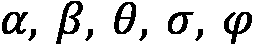，等等——小写希腊字母表示标量。

+   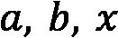，等等——小写拉丁字母表示粒子空间中的列向量。这些向量有 n 个分量，表示为 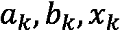，等等，其中 k 是一个整数。

+   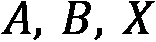，等等——大写拉丁字母表示粒子空间中的矩阵。这些是 n x n 的矩阵。

+   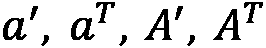，等等——撇号（'）和字母 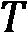 分别表示向量和矩阵的转置。

+   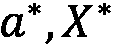，等等——星号（*）用于向量和矩阵的复共轭。

+   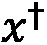，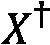，等等—— dagger 符号，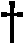，用于向量和矩阵的复共轭转置。

+   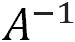，等等——负一的幂 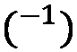 表示矩阵的逆。

+   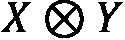，等等 – 符号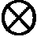表示矩阵和/或向量的克罗内克积或张量积。

+   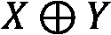，等等。 – 符号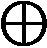表示平方矩阵的克罗内克和。

+   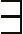 – 至少存在一个。

+   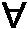 – 对于所有。

+   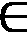 – 例如，是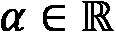的成员意味着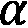属于实数集合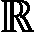。

# 数学定义

## 泡利不相容原理（PEP） #

在 1925 年，泡利描述了电子的 PEP，该原理指出，同一原子的两个电子不可能同时具有以下四个量子数的相同值：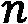，主量子数；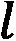，角动量量子数；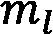，磁量子数；和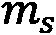，自旋量子数。

在发现各种基本粒子之后，电子的 PEP（泡利不相容原理）已被推广到所有基本粒子和复合系统。记住，费米子是具有半整数值自旋（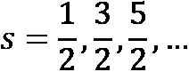）的粒子，而玻色子是具有整数值自旋（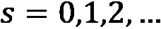）的粒子。PEP 的一般公式指出，量子系统的总波函数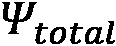必须对所有相同粒子的集合具有某些对称性，即电子和相同核子，玻色子和费米子，在配对粒子排列操作下：

+   对于费米子，总波函数必须相对于相同配对粒子的交换具有反对称性（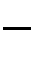）：

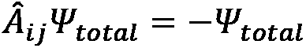

这意味着波函数的空间部分是反对称的，而自旋部分是对称的，或者反之亦然。

+   对于玻色子，总波函数必须相对于配对粒子的交换具有对称性（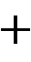）：

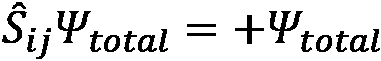

这意味着空间波函数和自旋函数要么都是对称的，要么都是反对称的。

+   对于同时包含相同费米子和相同玻色子的复合系统，上述操作必须同时成立。

## 角动量量子数 #

也称为轨道量子数或方位量子数，用 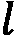 表示，它描述了电子亚层，并通过关系式：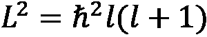给出了轨道角动量的模。在化学和光谱学中，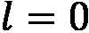 被称为 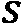 轨道，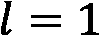 是  轨道，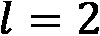 是 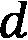 轨道，而  是 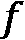 轨道。技术上，在 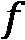 轨道之外还有更多的轨道，即 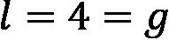，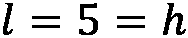 等等，这些具有更高的能级。

## 职位数算子 #

一个算子 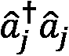，其中 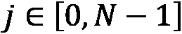 和 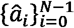 是湮灭算子，而  是作用在局部电子模式上的创建算子，它们满足以下反对易关系：

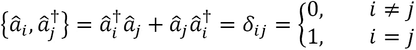

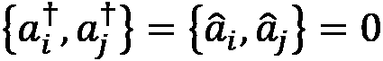

其中 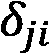 是狄拉克δ函数，而  是两个算子  和  的反对易子。

## 量子相位估计 (QPE) #

给定一个幺正算子 ，其本征态和本征值 ，准备状态  的能力，以及应用  本身的能力，QPE 算法计算 ，其中  是用于估计  所使用的量子比特数，从而允许我们测量  如我们所希望的那样精确。

## 复数

复数的形式为 ，其中  和  是实数，而  ( 在 Python 中称为虚数单位)定义为满足方程  的数。复数的模长为：。复数  的共轭复数为 。欧拉公式  在复数的乘法和指数运算中非常方便。复数集加上加法和乘法运算构成一个域，表示为 。由复数组成的代数表达式遵循代数的标准规则；与实数不同的是， 被替换为 。

## 向量空间

在复数域  或实数域 ℝ 上，一个向量空间  是一组称为向量的对象集合，这些向量可以相加，并且可以由数字相乘（“缩放”）。

以下 Python 代码说明了具有两个复数分量的向量：

```py
x = np.array([[1j],
             [2]])
array_to_latex(x, prefix='x = ')
```


我们使用 Python 3.5 中引入的@运算符来乘以一个向量，如下所示，将向量乘以虚数单位（Python 中的），其中被替换为：

```py
α = 1j
print('α =', α)
y = α*x
array_to_latex(y, prefix=' y = α*x =')
```


## 线性算子

定义在向量空间上，且在上的函数是线性算子，如果它具有以下两个性质：

+   对于任何在中，

+   对于任何在中，在中，

## 矩阵

矩阵是一组以方形或矩形排列的元素。元素可以是数字、矩阵、函数或代数表达式。矩阵的阶数或形状写作（行数）x（列数）。索引以*行，列*格式书写，例如，是第行和第列的元素。矩阵代表向量空间中的线性算子。在某些正交归一基中，使用相同的符号表示算子和它的矩阵是方便的。

## 特征值和特征向量

根据定义，线性算子在向量空间上定义，且在上，其特征向量是一个非零向量，它具有以下性质：，其中是中的一个标量，称为与特征向量相关的特征值。

对于有限维空间，上述定义等价于，其中是的矩阵表示。

## 向量和矩阵的转置、共轭和共轭转置

一些向量或一些矩阵的转置，通常表示为，是通过交换向量或矩阵的行和列索引得到的。以下 Python 代码说明了向量的转置：

```py
x = array_to_latex(x.transpose(), prefix='x^T = ')
```


一些向量或一些矩阵的复共轭，通常表示为、，是通过对所有元素执行复共轭得到的。

```py
x = array_to_latex(x.conjugate(), prefix='x^* = ')
```


在量子力学中，某些向量  或矩阵  的复共轭转置通常表示为 、。符号  被称为 dagger。 被称为伴随或厄米共轭 ：

```py
x = array_to_latex(x.conjugate().transpose(), prefix='(x^*)^T = ')
```


## 狄拉克符号 #

在狄拉克符号，也称为括号-括号符号中：

+   拉括号  表示一个矢量，它代表量子系统的状态。

+   拉括号  表示一个线性函数，它将每个向量映射到一个复数。

+   线性函数  对矢量  的作用表示为 。

它们之间的关系如下：

 

## 两个向量的内积

在向量空间  上，对  的内积是一个复函数 (·, ·)，它返回一个标量，并满足以下条件：

+   对于任何  在  中，。此外， 当且仅当 。

+   ![公式 A_150.png].

+   .

在  上，标准厄米内积是： .

使用狄拉克符号，向量  和  的内积表示为 ，并且与将括号  应用到矢量  上的结果相同：

 

![公式 A_161.jpg]

Python 的 `numpy.vdot` 函数返回两个向量的厄米内积：

```py
array_to_latex(x, prefix='x = ')
```

![公式 A_162.png]

```py
array_to_latex(y, prefix='y = ')
```


```py
print("np.vdot(x, y) = ", np.vdot(x, y)
```


## 向量的范数

内积产生一个由  定义的范数。除了三角不等式  之外，范数还满足施瓦茨不等式 。向量的范数或向量的模通常被称为向量的长度。

Python 的 `numpy.linalg.norm` 函数返回向量的范数：

```py
print("Norm of vector x: {:.3f}".format(np.linalg.norm(x)))
```


## 希尔伯特空间

内积空间  如果在诱导范数下是完备的，即如果每个柯西序列都收敛：对于每个序列  有  使得 ，在  中存在一个 ，使得 。这个性质允许使用微积分技术。

## 矩阵与向量的乘法

Python 3.5 中引入的 `@` 运算符实现了矩阵与向量的乘法：

```py
A = np.array([[1, 2],
              [3, 1j]])
array_to_latex(A, prefix='A = ')
```


```py
a = np.array([[1],
             [1]])
array_to_latex(a, prefix='a = ')
```


```py
array_to_latex(A@ , prefix='A@  = ')
```


## 矩阵加法

相同形状的两个矩阵的加法是通过将相应的项相加来实现的：


```py
A = np.array([[1, 0],
              [0, 1j]])
array_to_latex(A, prefix='A = ')
```


```py
B = np.array([[0, 1],
              [1j, 0]])
array_to_latex(B, prefix='B = ')
```


```py
array_to_latex(A+B, prefix='A+B = ')
```


## 矩阵乘法

设  是一个 m 行 n 列的矩阵， 是一个 n 行 p 列的矩阵，那么乘积  是一个 m 行 p 列的矩阵，其定义如下：


Python 3.5 中引入的 `@` 运算符实现了矩阵乘法：

```py
A = np.array([[1, 0],
              [0, 1j]])
array_to_latex(A, prefix='A = ')
```


```py
B = np.array([[1, 1, 1j],
              [1, -1, 0]])
array_to_latex(B, prefix='B = ')
```


```py
array_to_latex(A@B, prefix='A@B = ')
```


## 矩阵逆

当某些矩阵  存在时，其逆矩阵表示为 ，是一个矩阵，使得 ，其中  是单位矩阵，对于任何矩阵  :  。`numpy.linalg.inv` 函数计算矩阵的乘法逆：

```py
from numpy.linalg import inv
a = np.array([[1., 2.], [3., 4.]])
array_to_latex(A, prefix='A =')
```


```py
array_to_latex(inv(A), prefix='A^{-1} = ')
```


## 张量积

给定维度为  的向量空间  和维度为  的向量空间  在  上，张量积  是另一个维度为  的向量空间  在  上。

 和  是  上的线性映射， 是  上的线性映射：

### 双线性


### 结合律


### 线性映射的性质


如果内积空间  是两个内积空间 ， 的张量积，那么对于每一对向量 ，，在  中存在一个相关的张量积 。

在狄拉克记号中，我们表示张量积  为  或 。

 和  的内积是 。

## 克朗内克积或矩阵或向量的张量积

表示为  的两个矩阵的克朗内克积或张量积是由第二个矩阵的块按第一个矩阵的比例缩放而成的复合矩阵。设  是一个 m 行 n 列的矩阵， 是一个 p 行 q 列的矩阵，那么克朗内克积  是一个 pm 行 qn 列的块矩阵：


Python 的 `numpy.kron` 函数实现了克罗内克积：

```py
A = np.array([[1,2],
              [3, 4]])
array_to_latex(A, prefix='A =')
```


```py
B = np.array([[0, 5],
              [6, 7]])
array_to_latex(B, prefix='B =')
```


```py
C = np.kron(A,B)
array_to_latex(C, prefix='A \otimes B =')
```


## 克罗内克和

任何两个方阵的克罗内克和， n×n 和  m×m，记为 ，定义为：


其中  是阶数为  的单位矩阵， 是阶数为  的单位矩阵。

## 外积

基底  和 bra  的外积是一个秩为 1 的算子 ，其规则为：


对于有限维向量空间，外积是一个简单的矩阵乘法：


Python 的 `numpy.outer` 函数实现了外积：

```py
array_to_latex(x, prefix='x = ')
```


```py
array_to_latex(y, prefix='y = ')
```


```py
array_to_latex(np.outer(x, y), prefix='np.outer(x, y) = ')
```


### 将矩阵表示为外积之和

任何矩阵都可以用外积表示。例如，对于一个 2×2 矩阵：

 

 


## 厄米算子

某些向量  或矩阵  的复共轭转置通常表示为 ， 在量子力学中。符号  被称为 dagger。 被称为伴随或厄米共轭。

一个线性算子  如果它是自己的伴随算子，则称为厄米算子或自伴算子：。

谱定理表明，如果  是厄米算子，那么它必须有一组正交归一的特征向量


其中  具有实特征值 ， 是特征向量的数量，或者也是希尔伯特空间的维度。厄米算子以特征值集合  和相应的特征向量  为唯一谱表示：


## 单位算子

一个线性算子  如果其伴随算子存在并且满足 ，其中  是单位矩阵，根据定义，它将乘以的任何向量保持不变，则称为单位算子。

单位算子保持内积：


因此，单位算子也保持了通常称为量子态长度的范数：


对于任何幺正矩阵 ，任何特征向量  和  以及它们的特征值  和 ， 和 ，特征值  和  的形式为 ，如果  则特征向量  和  是正交的：。

有用的一点是，由于对于任何  ，：


## 密度矩阵 #

任何量子态，无论是**混合**还是**纯**，都可以用一个**密度矩阵**()来描述，这是一个归一化的正厄米算子，其中 。根据谱定理，存在一个正交基，在*第 2.3.1 节，厄米算子*中定义，使得密度是所有特征值的和()：


其中  从 1 到 ， 是正的或零特征值 ()，特征值的和是密度矩阵的迹操作 ()，等于 1：


例如，当密度为 ， 时，密度的迹为：


下面是一些纯量子态密度矩阵的例子：


由  个纯量子态  组成的混合量子态的密度矩阵，每个态具有经典发生的概率 ，定义为：


其中每个  是正的或零，它们的和等于一：


我们在图 AA.1 中总结了纯态和混合态之间的区别，它与*图 2.20*相同。


图 AA.1 – 纯态和混合量子态的密度矩阵

## 泡利矩阵

存在三个泡利矩阵( ,  和 )：

 ,  , 

它们是厄米算子和幺正算子，使得每个矩阵的平方等于  单位矩阵：


每个泡利矩阵都等于其逆矩阵：


我们在以下表格中总结了泡利矩阵和作用于量子比特的操作，这些操作产生相关的特征向量：


### 将矩阵分解为泡利矩阵张量的加权求和

可以证明任何矩阵都可以分解为恒等矩阵和泡利矩阵  的张量的加权求和，其中  ，权重为  和  个量子比特：


对于厄米矩阵，所有权重  都是实数。

我们为任何 2x2 矩阵  提供一个证明。


由于  因此  我们有：


从 2x2 矩阵的分解作为外积之和开始：


因此我们可以写出：


## 反对易子 #

两个算子  的运算，定义为：。

## 反对易 #

可以定义一组作用于局部电子模式的费米子湮灭算符  和创建算符  ，它们满足以下反对易关系：


## 交换子

两个算子  的运算，定义为：。对于任何算子  和 ， 当且仅当  和  交换。可以证明，如果一个量子系统有两个同时物理可观测的量，那么表示它们的厄米算子必须交换。对于任何算子  ，  和  ，我们有以下关系，这些关系对于计算交换子是有用的：


### 费米子，费米子，电子湮灭算符 #

一种数学运算，允许我们表示准粒子的激发或跃迁。激发需要初始状态比最终状态具有更低的能量水平。

一个算子  ，它将位于  费米子轨道中的粒子数减少一个单位：


其中：

 和  是位于  费米子轨道中的粒子数。

 是一个预因子，如果  费米子轨道中没有电子，即如果  ，则湮灭斯莱特行列式中的状态。

相位因子  保持整个状态叠加的反对称性质。

### 费米子，费米子，电子创建算符 #

一种数学运算，允许我们表示准粒子的去激发（去激发）或跃迁。去激发需要初始状态比最终状态具有更高的能量水平。

一个算符 ，它将位于  费米子轨道中的粒子数增加一个单位：


其中：

 和  是位于  费米子轨道中的粒子数。

 是一个预因子，如果我们有一个电子在  费米子轨道中，它将湮灭该状态，即如果 。

相位因子  保持整个状态叠加的反对称性质。

### 费米子，费米子，电子激发算符 #

一个算符 ，它将电子从占据的自旋轨道  激发到未占据轨道 。

## 总波函数 #

描述系统的物理行为，并由大写希腊字母 Psi 表示：。它包含量子系统的所有信息，包括作为参数的复数 ()。一般来说， 是系统中所有粒子  的函数，其中粒子的总数是 。此外， 包括每个粒子的空间位置 ()、每个粒子的自旋方向坐标 () 和时间 ：


其中  和  是单粒子坐标的向量：


单粒子系统的总波函数是空间 、自旋  和时间  函数的乘积：


# 参考文献

[Micr_Algebra] 线性代数，QuantumKatas/tutorials/LinearAlgebra/：[`github.com/microsoft/QuantumKatas/tree/main/tutorials/LinearAlgebra`](https://github.com/microsoft/QuantumKatas/tree/main/tutorials/LinearAlgebra)

[Micr_Complex] 复数运算，QuantumKatas/tutorials/ComplexArithmetic/：https://github.com/microsoft/QuantumKatas/tree/main/tutorials/ComplexArithmetic

[NumPy] NumPy：初学者的绝对基础：[`numpy.org/doc/stable/user/absolute_beginners.html`](https://numpy.org/doc/stable/user/absolute_beginners.html)

[Qiskit] Qiskit：[`qiskit.org/`](https://qiskit.org/)

[Qiskit_Alg] 线性代数，Qiskit: [`qiskit.org/textbook/ch-appendix/linear_algebra.html`](https://qiskit.org/textbook/ch-appendix/linear_algebra.html)

[SymPy] SymPy，一个用于符号数学的 Python 库：[`www.sympy.org/en/index.html`](https://www.sympy.org/en/index.html)
