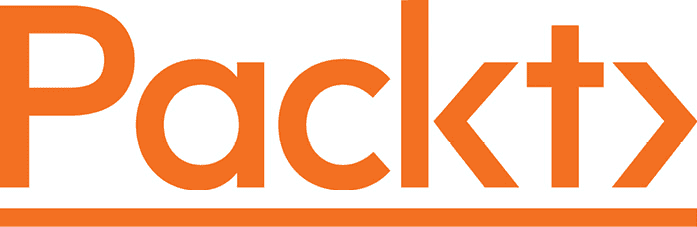
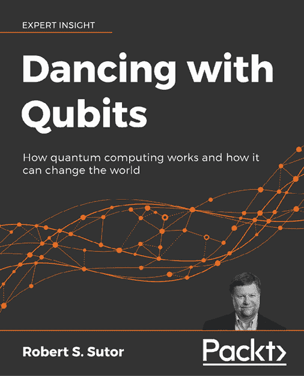
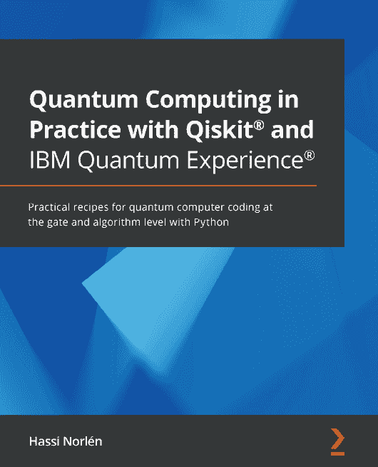

Packt.com

订阅我们的在线数字图书馆，全面访问超过 7,000 本书籍和视频，以及领先的工具，帮助您规划个人发展并推进职业生涯。欲了解更多信息，请访问我们的网站。

# 第十章：为什么订阅？

+   通过来自超过 4,000 位行业专业人士的实用电子书和视频，节省学习时间，增加编码时间

+   通过为您量身定制的技能计划提高学习效果

+   每月免费获得一本电子书或视频

+   完全可搜索，便于轻松访问关键信息

+   复制粘贴、打印和收藏内容

您知道 Packt 为每本书都提供电子书版本，包括 PDF 和 ePub 文件吗？您可以在 packt.com 升级到电子书版本，作为印刷书客户，您有权获得电子书副本的折扣。如需了解更多详情，请联系 customercare@packtpub.com。

在 www.packt.com，您还可以阅读一系列免费技术文章，订阅各种免费通讯，并享受 Packt 书籍和电子书的独家折扣和优惠。

# 您可能还会喜欢以下书籍

如果您喜欢这本书，您可能会对 Packt 出版的以下其他书籍感兴趣：

**与量子比特共舞**

罗伯特·S·苏托

ISBN: 9781838827366

+   了解量子计算的工作原理，深入探究其背后的数学，了解其独特之处以及为什么它如此强大，本量子计算教科书将为您揭示这一切

+   发现支撑量子系统的复杂、令人着迷的力学机制

+   理解经典计算和量子计算背后的必要概念

+   刷新和扩展对基本数学、计算和量子理论的理解

+   探索量子计算在科学计算、人工智能等领域的主要应用

+   检查量子比特、量子电路和量子算法的详细概述

**使用 Qiskit®和 IBM Quantum Experience®实践量子计算**

哈西·诺伦

ISBN: 9781838828448

+   在 Python 中可视化量子比特并理解叠加的概念

+   安装本地 Qiskit®模拟器并连接到实际量子硬件

+   使用 Qiskit® Terra 在电路级别编写量子程序

+   使用模拟器和 IBM Quantum®硬件比较和对比噪声中尺度量子计算（NISQ）和通用容错量子计算

+   使用 Qiskit® Ignis 减轻量子电路和系统中的噪声

+   通过在 Qiskit®中实现 Grover 算法，了解经典算法和量子算法之间的区别

# Packt 正在寻找像您这样的作者

如果您有兴趣成为 Packt 的作者，请访问 authors.packtpub.com 并申请。我们已与数千名开发人员和科技专业人士合作，就像您一样，帮助他们将见解分享给全球科技社区。您可以提交一般申请，申请我们正在招募作者的特定热门话题，或提交您自己的想法。

# 分享您的想法

现在您已经完成了《好奇者的量子化学与计算》，我们非常想听听您的想法！如果您在亚马逊购买了这本书，请[点击此处直接跳转到该书的亚马逊评论页面](https://packt.link/r/1-803-24390-2)，分享您的反馈或在该购买网站上留下评论。

您的评论对我们和科技社区都非常重要，它将帮助我们确保我们提供的是高质量的内容。
