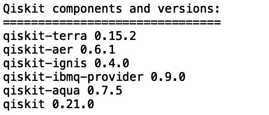
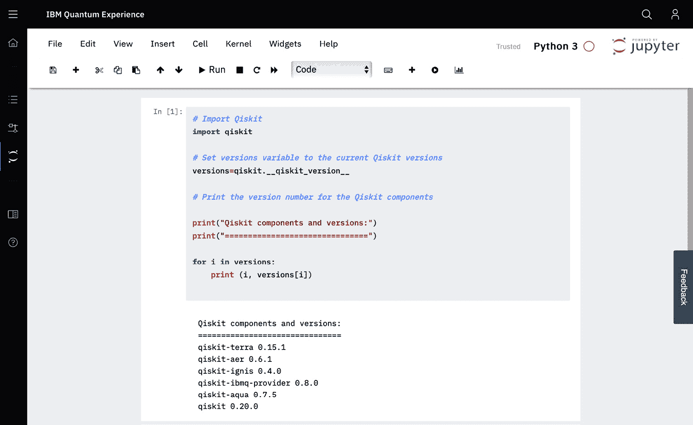

# *第一章*: 准备您的环境

在您开始编写量子程序之前，您必须有一个 Python 环境来执行您的代码。本书中的示例可以在使用 IBM Quantum®提供的 Qiskit®开发者环境在您的本地机器上运行，也可以在 IBM Quantum Experience®的在线环境中运行。

在本章中，我们将探讨这两种环境，帮助您在 IBM Quantum Experience®上获得登录账户，并安装本地版本的**Qiskit®**。我们还将讨论快速发展的开源 Qiskit®环境，以及如何保持您的本地环境更新。

我们将涵盖以下食谱：

+   创建您的 IBM Quantum Experience®账户

+   安装 Qiskit®

+   下载代码示例

+   安装您的 API 密钥并访问您的提供商

+   保持您的 Qiskit®环境更新

因此，让我们开始吧。本章及其内容非常重要，因为它为您提供了构建 Qiskit®未来的基础。请花一点时间设置好，然后开始使用本书中的食谱进行量子编程，以在 Qiskit®上入门。为了快速入门，您还可以获取并运行本书提供的示例食谱代码。

# 技术要求

我们将在本章中讨论的食谱可以在以下位置找到：[`github.com/PacktPublishing/Quantum-Computing-in-Practice-with-Qiskit-and-IBM-Quantum-Experience/tree/master/Chapter01`](https://github.com/PacktPublishing/Quantum-Computing-in-Practice-with-Qiskit-and-IBM-Quantum-Experience/tree/master/Chapter01)。

您可以在本章中设置的本地 Qiskit®环境中运行本书中的食谱。您还可以在本书中的`c1_r1_version.py`食谱中运行大多数食谱，该食谱列出了您运行食谱的环境中的 Qiskit®安装版本。

有关下载食谱的信息，请参阅*下载代码示例*。

您选择安装 Qiskit®的本地环境必须已安装**Python 3.5 或更高版本**（截至本书编写时）。有关 Qiskit®安装的最新要求的详细信息，请参阅[`qiskit.org/documentation/install.html`](https://qiskit.org/documentation/install.html)上的 Qiskit®要求页面。

IBM Quantum®建议使用 Python 的 Anaconda 发行版([`www.anaconda.com/distribution/`](https://www.anaconda.com/distribution/))，并使用虚拟环境来保持您的 Qiskit®安装与您的常规 Python 环境隔离。

对虚拟环境不熟悉？

虚拟环境提供了隔离的 Python 环境，您可以分别修改它们。例如，您可以为您安装的 Qiskit®创建一个隔离的环境。然后，您将仅在那种环境中安装 Qiskit®，而不会触及基础环境中的 Python 框架，这将包含一个未受损害的 Python 版本。

随着 Qiskit®发布新版本的包，实际上没有任何阻止您为 Qiskit®的每个更新版本创建一个新的隔离环境，以保留您用于 Qiskit®量子编程的旧版和稳定版本，以及一个可以测试 Qiskit®更新版本的新环境。您将在*保持 Qiskit®环境更新*菜谱中了解更多信息。

# 创建您的 IBM Quantum Experience®账户

您探索 IBM 量子计算机编程的钥匙是您的*IBM Quantum Experience®账户*。这个免费账户为您提供了访问在线 IBM Quantum Experience®界面和那里可用的编程工具。实际上，您不需要 IBM Quantum Experience®账户来测试 IBM Quantum Experience®或安装 Qiskit®，但您需要运行程序在免费可用的 IBM 量子计算机上，毕竟这也是您最初阅读这本书的原因。

## 准备工作

要设置您的 IBM Quantum Experience®账户，您可以使用 IBMid 登录，或使用以下之一：

+   Google 账户

+   GitHub 账户

+   LinkedIn 账户

+   Twitter 账户

+   电子邮件地址

## 如何操作...

1.  在您的浏览器（Google Chrome 似乎效果最好）中，访问此链接：[`quantum-computing.ibm.com/login`](https://quantum-computing.ibm.com/login)。

1.  输入您的 IBMid 凭证或选择其他登录方法。

    您也可以跳过登录，这将使您能够访问 IBM Quantum Experience®，但您的量子电路将限制为 3 个量子位，并且只能使用模拟后端。

1.  一旦您登录，现在您拥有了一个激活的 IBM Quantum Experience®账户，您将发现自己位于主仪表板：

    Figure 1.1 – The IBM Quantum Experience® home page

1.  从这里，您有几个路径：

    前往作曲家开始使用图形用户界面构建您的量子程序。点击左侧菜单的**电路作曲家**图标 ()，然后转到*第三章*，*IBM Quantum Experience® – 量子拖放*。

    如果您想在安装本地 Qiskit®实例之前开始用 Python 编写量子程序，您可以去 Qiskit®笔记本，在 Jupyter Notebook Python 环境中开始编写您的量子程序。点击**量子实验室**左侧菜单图标 ()，点击**新建笔记本**，然后转到*第四章*，*从 Terra 开始入门*。

    如果您想继续使用本书所写的 Qiskit®路径，现在您可以退出 IBM Quantum Experience®，并在本地机器上安装 Qiskit®。

## 相关链接

+   *IBM Quantum* *Experience* 是云上的量子计算：[`www.ibm.com/quantum-computing/technology/experience/`](https://www.ibm.com/quantum-computing/technology/experience/)。

+   *量子计算*：是时候建立一个量子社区了：[`www.ibm.com/blogs/research/2016/05/quantum-computing-time-build-quantum-community/`](https://www.ibm.com/blogs/research/2016/05/quantum-computing-time-build-quantum-community/)。

# 安装 Qiskit®

在你的 Python 环境准备就绪并可以运行，以及你的 IBM Quantum Experience® 账户设置完成后，你现在可以使用 `pip` 来安装 Qiskit® Python 扩展。这个过程大约需要 10 分钟左右，之后你就可以使用你的 Python 命令行，或者你喜欢的 Anaconda Python 解释器来开始编写你的量子程序。

## 准备工作

这个配方提供了关于安装 Qiskit® 的通用方法的信息，并没有涉及操作系统差异或一般安装故障排除的细节。

有关 Qiskit® 安装最新要求的详细信息，请参阅 Qiskit® 要求页面 [`qiskit.org/documentation/install.html`](https://qiskit.org/documentation/install.html)。

## 如何操作...

1.  创建你的 Anaconda 虚拟环境：

    ```py
    $ conda create -n environment_name python=3
    ```

    这将安装一组特定于环境的包。

1.  激活你的虚拟环境：

    ```py
    $ conda activate environment_name
    ```

1.  确认你处于虚拟环境中。

    你的命令提示符现在应该包含你环境的名字；我用自己的环境 `packt_qiskit` 做了类似设置：

    ```py
    (environment_name) … $ to remind you that you must execute the commands in the correct environment. In the rest of the book, I will assume that you are indeed in your Qiskit-enabled environment and just show the generic prompt: $.
    ```

1.  如果需要，执行 `pip` 更新。

    要安装 Qiskit®，你必须使用 `pip`，因为 Qiskit® 不是以 `conda` 包的形式发布的。最新的 Qiskit® 需要 pip 19 或更高版本。

    如果你有一个较旧的 `pip` 版本，你必须使用以下命令进行升级：

    ```py
    (environment_name) … $  pip  install  -U  pip
    ```

1.  安装 Qiskit®。

    因此，在一切准备就绪之后，我们现在可以进入正题，在你的环境中安装 Qiskit® 代码。让我们开始吧！

    ```py
    (environment_name) … $  pip install qiskit
    ```

    轮子构建失败

    作为安装的一部分，你可能会看到 *wheel* 构建失败的错误。这个错误可以忽略。

1.  使用 Python 验证 Qiskit® 是否成功安装。

    打开 Python：

    ```py
    (environment_name) … $  python3
    ```

    导入 Qiskit®：

    ```py
    >>> import qiskit
    ```

    这有点令人兴奋；我们将首次使用 Qiskit® 代码。当然，不是用来编程量子计算机，但至少可以确保我们现在已经准备好开始编写你的量子程序。

    列出版本详细信息：

    ```py
    >>> qiskit.__qiskit_version__
    ```

    这应该会显示已安装的 Qiskit® 组件的版本：

    ```py
    {'qiskit-terra': '0.15.2', 'qiskit-aer': '0.6.1', 'qiskit-ignis': '0.4.0', 'qiskit-ibmq-provider': '0.9.0', 'qiskit-aqua': '0.7.5', 'qiskit': '0.21.0'}
    ```

恭喜，你的 Qiskit® 安装已完成；你现在可以开始了！

通过在你的虚拟环境中使用 `pip` `install`，你可以在那个环境中安装 Qiskit®，这样它就会与你的其他 Python 环境保持隔离。

## 还有更多…

Qiskit® 还附带了一些可选的可视化依赖项，用于在 Qiskit® 组件之间使用可视化。你可以使用以下命令安装这些依赖项：

```py
(environment_name) … $ pip install qiskit[visualization]
```

注意

如果你使用的是 zsh shell，你必须将组件用引号括起来：pip install '`qiskit[visualization]`'

## 参见

要快速了解 Anaconda 环境，请参阅 Anaconda 文档中的*管理环境*：[`docs.conda.io/projects/conda/en/latest/user-guide/tasks/manage-environments.html`](https://docs.conda.io/projects/conda/en/latest/user-guide/tasks/manage-environments.html)。

这本书在任何方面都不是 Qiskit®安装故障排除指南，而且你可能会在安装时遇到问题，这取决于你的本地操作系统、版本和其他因素。

但不必担心，帮助即将到来。以下是一些友好且有用的频道，你可以寻求帮助：

+   **Slack**: [`qiskit.slack.com/`](https://qiskit.slack.com/)

+   **Stack Exchange**: [`quantumcomputing.stackexchange.com/questions/tagged/qiskit`](https://quantumcomputing.stackexchange.com/questions/tagged/qiskit)

# 下载代码样本

这本书中的食谱包括简短和一些不那么简短的样本程序，这些程序将引导你完成编程量子计算机的第一步。如果你想的话，可以直接从书中的说明中输入这些程序，但为了方便，你也可以直接从 Packt Cookbook GitHub 组织获取样本代码。

Python 样本是为 Python 3.5+编写的，以及你在 Python 环境中安装的 Qiskit®扩展。所有的 Python 样本都有`.py`扩展名。

## 准备工作

虽然你可以直接在你的 Python 环境中输入食谱，或者在 IBM Quantum Experience®上的 Jupyter Notebooks 或者你本地的 Anaconda 环境中输入，但使用 Git 下载或克隆样本代码到你的本地环境会更有效率。克隆的优势在于，如果远程仓库有任何更新，你可以稍后从远程仓库刷新你的本地文件。

如果你没有计划使用 Git，而是要下载作为压缩文件的食谱，请继续阅读*如何操作*。

要使用 Git 克隆样本代码，你必须首先做以下事情：

1.  获取 GitHub 账户。这些是免费的，你可以在[`github.com`](https://github.com)注册一个。

1.  在你的本地环境中安装 Git。更多信息，请参阅[`git-scm.com/book/en/v2/Getting-Started-Installing-Git`](https://git-scm.com/book/en/v2/Getting-Started-Installing-Git)。

1.  如果你是一名用户界面人员，你可能还希望安装 GitHub Desktop，可在此处获取：[`desktop.github.com/`](https://desktop.github.com/).

## 如何操作...

你有几种不同的选项可以将样本食谱下载到你的本地机器。

对于每个，首先打开您的网页浏览器，然后转到[`github.com/PacktPublishing/Quantum-Computing-in-Practice-with-Qiskit-and-IBM-Quantum-Experience`](https://github.com/PacktPublishing/Quantum-Computing-in-Practice-with-Qiskit-and-IBM-Quantum-Experience)上的*Quantum-Computing-in-Practice-with-Qiskit-and-IBM-Quantum-Experience* GitHub 仓库。

### 将仓库作为压缩文件下载

获取食谱的最简单方法是将样本文件作为压缩目录抓取，并在您的本地机器上解压缩：

1.  在前面的 URL 中，点击**克隆或下载**按钮并选择**下载 zip**。

1.  下载压缩文件并选择位置。

1.  解压缩文件。

### 使用 git 克隆仓库

1.  点击**克隆或下载**按钮并复制 URL。

1.  打开您的命令行，导航到您想要克隆目录的位置。

1.  输入以下命令：

    ```py
    $ git clone **https://github.com/PacktPublishing/Quantum-Computing-in-Practice-with-Qiskit-and-IBM-Quantum-Experience.git**
    ```

    命令应该产生以下类似的结果：

    ```py
    Cloning into 'Quantum-Computing-in-Practice-with-Qiskit-and-IBM-Quantum-Experience'...
    remote: Enumerating objects: 250, done.
    remote: Counting objects: 100% (250/250), done.
    remote: Compressing objects: 100% (195/195), done.
    remote: Total 365 (delta 106), reused 183 (delta 54), pack-reused 115
    Receiving objects: 100% (365/365), 52.70 MiB | 5.42 MiB/s, done.
    Resolving deltas: 100% (153/153), done.
    ```

### 使用 GitHub Desktop 克隆仓库

1.  点击**克隆或下载**按钮，并选择**在桌面打开**。

1.  在 GitHub Desktop 对话框中，选择要克隆仓库的目录并点击**确定**。

您现在可以浏览这本烹饪书中的食谱。每一章都包含一个或多个食谱。如果您愿意，可以直接将食谱复制粘贴到您的 Python 环境中，或者 IBM 量子体验®或您的本地 Anaconda 环境中。

### 打开食谱文件

到目前为止，您已经使用命令行完成了所有操作。那么，您是否想抓取以下 Python 程序，并从您喜欢的 Python 解释器中运行它，例如**Anaconda Spyder**或**Jupyter Notebooks**？

如果您已下载样本文件，食谱文件可在以下本地目录中找到：

```py
<The folder where you downloaded the files>/https://github.com/PacktPublishing/Quantum-Computing-in-Practice-with-Qiskit-and-IBM-Quantum-Experience/blob/master/Chapter01/ch1_r1_version.py
```

`ch1_r1_version.py`代码示例列出了我们刚刚安装的 Qiskit®组件的版本号：

```py
# Import Qiskit
import qiskit
# Set versions variable to the current Qiskit versions
versions=qiskit.__qiskit_version__
# Print the version number for the Qiskit components
print("Qiskit components and versions:")
print("===============================")

for i in versions:
    print (i, versions[i]) 
```

运行时，前面的代码应该产生以下类似的结果：



图 1.2 – Qiskit®组件及其版本列表

以下部分涵盖了如何在可用的环境中运行脚本。

#### Spyder 中的 Python 脚本

在您的本地环境中，您现在可以打开您选择的 Python 解释器中的 Python 脚本；例如，Anaconda 中包含的 Spyder：

重要

确保您在安装 Qiskit®的虚拟环境中运行解释器。否则，它将无法找到 Qiskit®，程序将无法正确运行。

1.  打开您的 Anaconda 用户界面。

1.  选择您的虚拟环境。

1.  点击**Spyder**磁贴。如果您的虚拟环境中尚未安装 Spyder，它将现在进行安装。这可能需要一些时间。请耐心等待！

1.  在 Spyder 中，打开本章包含的 Python 脚本：

    ```py
    <The folder where you downloaded the files>/https://github.com/PacktPublishing/Quantum-Computing-in-Practice-with-Qiskit-and-IBM-Quantum-Experience/blob/master/Chapter01/ch1_r1_version.py
    ```

1.  点击**运行**。脚本现在将提取已安装的 Qiskit®组件的版本号。您也可以在 Jupyter 笔记本中打开 Python 脚本，例如，在在线 IBM Quantum Experience®环境中，但这需要额外的工作。

#### Anaconda 中的 Jupyter 笔记本

1.  打开您的 Anaconda 用户界面。

1.  选择您的虚拟环境。

1.  点击**Jupyter 笔记本**磁贴。如果 Jupyter Notebook 尚未为您的虚拟环境安装，它现在将安装。

1.  您的默认网页浏览器将在您的根目录中打开。浏览并打开以下内容：

    ```py
    <The folder where you downloaded the files>/https://github.com/PacktPublishing/Quantum-Computing-in-Practice-with-Qiskit-and-IBM-Quantum-Experience/blob/master/Chapter01/ch1_r1_version.py
    ```

1.  示例脚本在 Jupyter 文本编辑器中打开。您现在可以看到代码，但不能运行它。

1.  返回 Jupyter 浏览器并点击**新建** | **笔记本**。

1.  将 Python 脚本代码复制并粘贴到新笔记本中。现在您可以点击**运行**并查看代码执行。

#### IBM Quantum Experience®中的 Jupyter 笔记本

1.  要在在线 IBM Quantum Experience®笔记本中运行 Python 脚本，请登录到[`quantum-computing.ibm.com/login`](https://quantum-computing.ibm.com/login)。

1.  在主仪表板上，点击左侧菜单中的**Quantum Lab**图标（)，然后点击**新建笔记本**并按照我们在“Anaconda 中的 Jupyter 笔记本”部分讨论的过程进行操作：



Figure 1.3 – 在 IBM Quantum Experience®上运行您的 Qiskit®代码

## 它是如何工作的...

我们将在后续章节中介绍的基于 Qiskit®的 Python 代码可以在满足 Qiskit®要求的任何 Python 环境中运行，因此您可以自由选择适合您的环境。并且有了这个环境，您也可以自由选择您喜欢的工具来运行程序。

对于这本书，我已经测试了在**Anaconda**标准提供的**Spyder**编辑器和 IBM Quantum Experience®和 Anaconda 上的**Jupyter Notebook**环境中运行代码。

# 安装您的 API 密钥并访问您的提供商

现在您已经安装了 Qiskit®，您可以立即开始创建您的量子程序并在本地模拟器上运行这些程序。但是，如果您在某个时候想在实际的 IBM Quantum®硬件上运行您的量子代码，您必须在本地上安装您自己的唯一 API 密钥。

IBM Quantum Experience®上的 API 密钥

如果您在 IBM Quantum Experience®笔记本环境中运行 Qiskit®程序，您的 API 密钥将自动注册。

## 准备工作

在您安装 API 密钥之前，您必须首先拥有一个 IBM Quantum Experience®账户。如果您还没有创建，请返回并创建（见“创建您的 IBM Quantum Experience®账户”部分）。

## 如何操作...

让我们看看如何在本地安装 API 密钥：

1.  在[`quantum-computing.ibm.com/login`](https://quantum-computing.ibm.com/login)登录 IBM Quantum Experience®。

1.  在 IBM Quantum Experience®仪表板上，找到右上角的用户图标，点击它，然后选择**我的账户**。

1.  在账户页面，找到**本地环境中的 Qiskit**部分，并点击**复制令牌**。

1.  您现在可以将令牌粘贴到临时位置或将其保持在剪贴板中。

1.  在您的本地机器上，访问您的 Qiskit®环境。我们已经完成了这个步骤，但这里重复一下过程，如果您正在使用 Anaconda。

1.  激活您的虚拟环境：

    ```py
    $ conda activate environment_name
    ```

1.  打开 Python：

    ```py
    $(environment_name) … $  python3
    ```

    验证 Python 头部是否显示，并且您正在运行正确的 Python 版本：

    ```py
    Python 3.7.6 (default, Jan  8 2020, 13:42:34) 
    [Clang 4.0.1 (tags/RELEASE_401/final)] :: Anaconda, Inc. on darwin
    Type "help", "copyright", "credits" or "license" for more information.
    >>> 
    ```

1.  获取所需的`IBMQ`类：

    ```py
    >>> from qiskit import IBMQ		
    ```

1.  在本地安装您的 API 令牌：

    ```py
    >>> IBMQ.save_account('MY_API_TOKEN')
    ```

    在这里，将`MY_API_TOKEN`替换为您刚刚从 IBM Quantum Experience®复制的 API 令牌：请保持单引号不变，因为它们对于命令是必需的。

1.  加载您的账户。

    现在令牌已经就位，让我们验证一切是否正常，并且您的账户具有正确的权限：

    ```py
    >>> IBMQ.load_account()
    ```

    这应该会显示以下输出：

    ```py
    <AccountProvider for IBMQ(hub='ibm-q', group='open', project='main')>
    ```

    这是您账户的提供者信息，包括`hub`、`group`和`project`。

## 它是如何工作的...

您为此练习导入的主要类是`IBMQ`，这是一个用于在云中由 IBM 提供的量子硬件和软件的工具箱。

在本章中，我们使用了`save.account()`来在本地存储您的账户。随着我们继续前进，在我们将要访问 IBM Quantum®机器的食谱中，我们将使用`IBMQ.load_account()`和`IBMQ.get_provider()`类来确保您具有正确的访问权限。

更新您的 API 密钥

如果出于某种原因，您需要在 IBM Quantum Experience®上创建新的 API 令牌并更新本地保存的令牌，您可以使用以下命令：

`>>> IBMQ.save_account('NEW_API_TOKEN', overwrite=True)`

## 还有更多...

在本食谱中的后续代码中，我们将使用以下命令设置`provider`变量以保存您账户的提供者信息：

```py
>>> provider = IBMQ.get_provider()
```

我们可以使用`provider`信息在选择 IBM Quantum®计算机或后端时运行您的量子程序。在以下示例中，我们选择了一个名为`ibmqx2`的量子计算机作为我们的后端。该机器的内部引用是`ibmqx2`：

```py
>>> backend = provider.get_backend('ibmqx2')
```

# 保持您的 Qiskit®环境更新

Qiskit®是一个开源编程环境，它处于*持续变化*中。在撰写本书的过程中，我经历了许多软件的次要和主要版本更新。

通常来说，保持最新版本是一个好主意，但有些更新可能会改变代码组件的行为。查看每个新版本的发布说明总是一个好主意。有时会引入一些更改，这些更改将改变您的代码的行为方式。在这些情况下，您可能想要在验证代码仍然按预期工作之后再进行升级。

如果你使用 Anaconda 环境，那么你可以维护多个不同 Qiskit® 级别的环境，以便在升级后的 Qiskit® 版本破坏你的代码时有一个回退环境。

Qiskit® 发展迅速

IBM Quantum Experience® 笔记本环境始终运行 Qiskit® 的最新版本，在你升级本地环境之前，在该环境中测试你的代码可能是个好主意。

你还可以订阅通知更新，以了解何时提供了新版本：

1.  在 [`quantum-computing.ibm.com/login`](https://quantum-computing.ibm.com/login) 登录 IBM Quantum Experience®。

1.  在 IBM Quantum Experience® 仪表板上，找到右上角的用户图标，点击它，然后选择 **我的账户**。

1.  在账户页面下，在 **通知** 设置中，将 **更新和新功能公告** 设置为 **开启**。

## 准备工作

在开始之前，验证你每个环境（如果你有多个）正在运行的 Qiskit® 版本。

对于每个环境，从命令行、IDE（如 Spyder）或 Jupyter 笔记本启动 Python，然后执行以下代码：

```py
>>> import qiskit
>>> qiskit.__qiskit_version__
```

如果你安装了旧版本的 Qiskit®，前面的代码可能会产生以下输出：

```py
{'qiskit-terra': '0.9.0', 'qiskit-aer': '0.3.0', 'qiskit-ibmq-provider': '0.3.0', 'qiskit-aqua': '0.6.0', 'qiskit': '0.12.0'}
```

然后，你可以前往 Qiskit® 发布说明以了解是否有更新版本的可用：[`qiskit.org/documentation/release_notes.html`](https://qiskit.org/documentation/release_notes.html)

这需要很多步骤来确保。整个过程在 Python 中是自动化的。要进入这条路径，请参阅下一节。

## 如何操作...

1.  激活你的虚拟环境：

    ```py
    $ conda activate environment_name
    ```

1.  运行以下命令以检查你的虚拟环境中的过时 `pip` 包：

    ```py
    (environment_name) … $  pip list --outdated
    ```

1.  这将返回一个列表，列出你当前过时的所有 `pip` 包以及可用的版本：

    ```py
    Example:Package                  Version  Latest   Type 
    ------------------------ -------- -------- -----
    …
    qiskit                   0.19.6   0.21.0   sdist
    qiskit-aer               0.5.2    0.6.1    wheel
    qiskit-aqua              0.7.3    0.7.5    wheel
    qiskit-ibmq-provider     0.7.2    0.9.0    wheel
    qiskit-ignis             0.3.3    0.4.0    wheel
    qiskit-terra             0.14.2   0.15.1   wheel 
    …
    ```

1.  然后，使用 `pip` 更新 Qiskit® 就变得非常简单：

    ```py
    (environment_name) … $  pip install qiskit --upgrade
    ```

1.  在命令行中，验证 Qiskit® 是否已安装：

    ```py
    (environment_name)… $ pip show qiskit
    ```

    这将产生类似于以下输出的结果：

    ```py
    Name: qiskit
    Version: 0.21.0
    Summary: Software for developing quantum computing programs
    Home-page: https://github.com/Qiskit/qiskit
    Author: Qiskit Development Team
    Author-email: qiskit@us.ibm.com
    License: Apache 2.0
    Location: /Users/hassi/opt/anaconda3/envs/packt_qiskit/lib/python3.7/site-packages
    Requires: qiskit-aer, qiskit-terra, qiskit-aqua, qiskit-ignis, qiskit-ibmq-provider
    Required-by: 
    …
    ```

1.  验证 Qiskit® 是否已集成到你的隔离环境中。

    打开 Python：

    ```py
    (environment_name)… $ python3
    ```

    导入 Qiskit®：

    ```py
    >>> import qiskit
    ```

    列出版本详细信息：

    ```py
    >>> qiskit.__qiskit_version__
    ```

    这应该会显示已安装的 Qiskit® 组件的版本：

    ```py
    {'qiskit-terra': '0.15.2', 'qiskit-aer': '0.6.1', 'qiskit-ignis': '0.4.0', 'qiskit-ibmq-provider': '0.9.0', 'qiskit-aqua': '0.7.5', 'qiskit': '0.21.0'} 
    ```

恭喜，你的 Qiskit® 升级成功了；你现在正在运行最新的代码！

## 它是如何工作的...

根据你如何消费这本书，你可能会在第一次阅读过程中查看此过程，并且没有可用的升级。如果是这样，请继续将此菜谱添加到书签，并在 Qiskit® 升级后稍后再回来。

pip 工具将为你管理每个虚拟环境的升级。如我之前提到的，如果你有多个环境，进行分阶段升级可能是个好主意。

例如，你可以升级一个环境，并在该环境中测试运行你的量子程序，以确保新版本没有破坏你的代码。

好的，有了这些，你应该已经准备好了一个或多个 Qiskit®环境，可以在这些环境中运行你的量子程序。如果你感觉准备好了，现在就可以直接跳到*第四章*，*从 Terra 开始入门*，开始使用 Qiskit®在 Python 中编写量子程序。如果你想要做一些准备工作来感受一下量子计算机编程是什么样的，可以从*第二章*，*使用 Python 进行量子计算和量子比特入门*，来了解量子比特和门的基础知识，或者从*第三章*，*IBM Quantum Experience® – 量子拖放*，通过使用 IBM Quantum Experience®的拖放编程界面来获得量子程序的直观感受。

无论你选择哪条路径，不用担心，我们会让 Python 来做艰苦的工作。再次强调，享受编程的乐趣！
