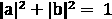
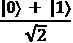
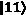

# *第二章*：使用 Python 进行量子计算和量子比特

量子计算是一个既新又旧的领域。用于实现量子计算（如量子力学的叠加和纠缠）的思想和概念已经存在了近一个世纪，量子信息科学领域几乎是在 40 年前成立的。早期的探索者，如 Peter Shor 和 Lov Grover，产生了量子计算算法（Shor 算法和 Grover 算法），这些算法现在开始像基础物理概念（如 *E=mc**2*）一样为人所熟知。有关详细信息，请参阅本章末尾的参考文献。

同时，真正利用这些效果的量子计算机是一种相对较新的发明。在 1990 年，DiVincenzo 概述了构建一个量子计算机的要求，IBM 于 2016 年推出了 IBM Quantum Experience® 和 Qiskit®，这实际上是第一次任何人（除了研究实验室的人）可以真正开始探索这个新兴领域。

那么，经典计算和量子计算之间有什么区别呢？一种开始探索的方法是看看每个计算所使用的基本计算元素——经典比特和量子量子比特。

在本章中，我们将对比比特和量子比特，通过一些通用的线性代数来更详细地探索它们，并对比确定性（经典）计算和概率性（量子）计算。我们甚至会快速浏览一些基本的 Qiskit® 展示方法来可视化量子比特。

在本章中，我们将介绍以下食谱：

+   比较比特和量子比特

+   在 Python 中可视化量子比特

+   量子门的快速介绍

# 技术要求

本章中讨论的食谱可以在这里找到：[`github.com/PacktPublishing/Quantum-Computing-in-Practice-with-Qiskit-and-IBM-Quantum-Experience/tree/master/Chapter02`](https://github.com/PacktPublishing/Quantum-Computing-in-Practice-with-Qiskit-and-IBM-Quantum-Experience/tree/master/Chapter02)。

有关如何获取示例代码的更多信息，请参阅*第一章*中的*下载代码示例*部分，*准备你的环境*。

# 比较比特和量子比特

那么，让我们从显而易见——或者也许不那么显而易见——的观念开始，即大多数阅读这本书的人都知道比特是什么。

我们有一种直观的感觉，即比特要么是**零**（**0**），要么是**一**（**1**）。通过将许多比特组合在一起，你可以创建字节以及任意大的二进制数，并且利用这些数，你可以构建最令人惊叹的计算机程序，编码数字图像，加密你的情书和银行交易，等等。

在经典计算机中，位是通过在组成逻辑板的晶体管上使用低电压或高电压来实现的，通常是 0 V 和 5 V 这样的事情。在硬盘驱动器中，位可能是一个以某种方式磁化的区域，用来表示 0，而另一种方式表示 1，等等。

在关于量子计算的书籍中，需要强调的重要观点是，经典位只能是 0 或 1；它永远不能是其他任何东西。在计算机的例子中，你可以想象一个带有输入和输出的盒子，盒子代表你正在运行的程序。在经典计算机（我在这里使用“经典”一词来表示不是量子计算机的二进制计算机）中，输入是一串位，输出是另一串位，盒子是一系列位被操作、按摩和组织以生成该输出的算法。再次强调的一个重要事情是，在盒子中，位仍然是位，始终是 0 或 1，没有其他。

量子比特，正如我们将在本章中发现的那样，是相当不同的东西。让我们去探索。

## 准备工作

作为食谱来说，这个并不真正值得炫耀。它只是一个快速的 Python 和 NumPy 实现，将位定义为 2x1 矩阵，或者表示 0 或 1 的向量。我们还引入了狄拉克符号  来表示我们的量子比特。然后我们计算测量位和量子比特时得到各种结果的概率。

以下食谱的 Python 文件可以从这里下载：[`github.com/PacktPublishing/Quantum-Computing-in-Practice-with-Qiskit-and-IBM-Quantum-Experience/blob/master/Chapter02/ch2_r1_bits_qubits.py`](https://github.com/PacktPublishing/Quantum-Computing-in-Practice-with-Qiskit-and-IBM-Quantum-Experience/blob/master/Chapter02/ch2_r1_bits_qubits.py)。

## 如何做到这一点...

1.  让我们先导入 `numpy` 和 `math`，这是我们进行计算所需的：

    ```py
    import numpy as np
    from math import sqrt, pow
    ```

1.  为 0、1、 创建并打印位和量子比特向量，分别为 `[1,0]`、`[0,1]`、`[1,0]`、`[0,1]` 和 `[a,b]`：

    ```py
    # Define the qubit parameters for superposition
    a = sqrt(1/2)
    b = sqrt(1/2)
    if round(pow(a,2)+pow(b,2),0)!=1:
        print("Your qubit parameters are not normalized.
            \nResetting to basic superposition")
        a = sqrt(1/2)
        b = sqrt(1/2)
    bits = {"bit = 0":np.array([1,0]), 
        "bit = 1":np.array([0,1]), 
        "|0\u27E9":np.array([1,0]), 
        "|1\u27E9":np.array([0,1]), 
        "a|0\u27E9+b|1\u27E9":np.array([a,b])}
    # Print the vectors 
    for b in bits:
      print(b, ": ", bits[b].round(3)) 
    print ("\n")
    ```

    注意这里的 Unicode 条目：`\u27E9`。我们使用这个而不是简单的 `>` 来在输出中创建看起来很棒的狄拉克量子比特渲染 。

    您必须提供正确的 a 和 b 参数

    注意参数验证代码检查 `a` 和 `b` 的值是否 *归一化*。如果不是，则将 `a` 和 `b` 重置为简单的 50/50 超叠加，通过设置  和 ![img/Formula_02_005.png]。

1.  通过创建测量字典来测量量子比特，然后计算从我们创建的位向量中得到 `0` 和 `1` 的概率：

    ```py
    print("'Measuring' our bits and qubits")
    print("-------------------------------")
    prob={}
    for b in bits:
        print(b)
        print("Probability of getting:")
        for dig in range(len(bits[b])):
            prob[b]=pow(bits[b][dig],2)
            print(dig, " = ", '%.2f'%(prob[b]*100), percent") 
        print ("\n")
    ```

上述代码应产生以下输出：


图 2.1 – 使用 NumPy 模拟位和量子比特

现在我们知道了在测量比特和量子比特时得到`0`或`1`值的概率。对于其中一些（0，1，），结果是我们可以预期的，0 或 100%；比特或量子比特要么是 0 要么是 1，没有其他。对于其中一个()，这是一个处于 0 和 1 叠加状态的量子比特，得到任一的概率是 50%。这是一个对于经典比特永远不会发生的结果，只有对于量子比特。我们将在下一节中解释原因。

## 它是如何工作的...

在这个配方中，我们看到的经典比特读取的概率总是*100%*，要么是 0 要么是 1；没有其他选项。但对于可以表示为的量子比特，0 或 1 的概率与成正比。对于纯状态，*a*或*b*总是 1，测量每个的概率都是 100%。但对于我们标记为的量子比特，a 和 b 都是，给出 0 或 1 的概率为 50% 。

测量比特和量子比特

在经典计算和量子计算中，“测量”这个词意味着两件略有不同的事情。在经典计算中，你可以在任何时候测量你的比特，而不会严重干扰你正在进行的计算。对于量子计算机来说，测量是一个更明确的行为，导致你的量子比特从表现出量子力学行为的比特转变为表现出经典行为的比特。测量量子比特后，你就完成了。你不能再对该量子比特进行任何进一步的量子操作。

由于量子比特的量子力学性质，我们可以将其描述为与用于比特的向量相似的向量。为了澄清这一点，当我们谈论量子比特时，我们不仅使用 0 和 1 作为标签，而是使用狄拉克*矢量*符号， 和 ，表示这些是向量空间中的状态向量。

我们可以像这样写出量子比特的状态向量，（psi）：

+    对于处于**基态**的量子比特，表示 0

+    对于处于**激发态**的量子比特，表示 1

在这里，我们使用了**基态**和**激发态**作为对量子比特进行分类的一种方式。这是合适的，因为 IBM Quantum®量子比特使用的约瑟夫森结是具有两个能级的量子系统。根据底层物理系统，量子比特也可以基于其他两能级量子系统，例如电子自旋（向上或向下）或光子偏振（水平或垂直）。

到目前为止，与经典比特相比，并没有什么直观上的不同，因为每个都只代表值 0 或 1。但现在我们增加了一个复杂性：一个量子比特也可以是两种状态的叠加， 和 。

，其中*a*和*b*是复数。这些数字被归一化，使得，这在几何上意味着结果向量的长度为 1。这很重要！

回到最简单的例子，这些可以描述如下：

+   对于基态的量子比特。在这种情况下，a=1，b=0。

+   对于激发态的量子比特。在这种情况下，a=0，b=1。

到目前为止，一切顺利，但现在我们加入量子转折：叠加。以下量子比特状态向量也得到支持：


只是为了检查我们是否仍然归一化，在这种情况下，

.

但这个状态向量意味着什么呢？

量子比特被设置在一个状态，它正好位于和之间；它存在于两种基本状态的叠加中。它正在表现出量子行为。

重要提示

量子比特的量子叠加态只能在我们在量子计算机上进行计算时维持。对于自然界中的实际粒子，例如表现出量子行为的光子，也是如此。例如，光子的偏振可以描述为在光子飞行过程中水平方向和垂直方向的叠加，但当你在其路径上添加一个偏振器时，你会测量到它是水平方向或垂直方向，而不会是其他方向。

回到计算机作为盒子的例子，对于量子计算机，我们有一个类似的概念，输入是一串比特，输出也是另一串比特。区别在于盒子内部，在计算过程中，量子比特可以处于叠加态。

然而，当我们测量量子比特以获得那一串输出比特时，量子比特必须量子力学地决定它们是还是，这就是那些*a*和*b*参数出现的地方。

公式不仅表明该向量被归一化到长度 1，而且还描述了获得和输出的概率。获得的概率是，是。这是量子计算机和经典计算机之间差异的核心。量子计算机是概率性的——你无法预先知道最终结果会是什么，只能知道得到某个结果的概率——而经典计算机是确定性的——你总是可以，至少在理论上，预测出答案会是什么。

关于概率计算

人们经常对量子计算机和概率结果感到有些困惑，并将整个量子编程概念可视化为一个量子位在所有不同状态下随机且无法控制地旋转。这不是一个真实的画面；每个量子位都是初始化在特定的已知状态，，然后通过量子门操作进行作用。每次操作都是严格确定性的；没有任何随机性。在量子状态演化的每个阶段，我们都能确切地知道我们的量子位在做什么，这可以用一个叠加来表示。只有在最后，当我们测量并迫使量子位变为 0 或 1 时，概率性质才会显现出来，测量的 0 或 1 的概率由*a*和*b*参数()设定。

## 参见

关于量子位及其解释的更多信息，请参阅以下优秀书籍：

+   *与量子位共舞：量子计算是如何工作的以及它如何改变世界*，罗伯特·S·萨托，Packt Publishing Ltd.，2019 年，*第七章*，*一个量子位*

+   *量子计算与量子信息*，艾萨克·L·丘昂；迈克尔·A·尼尔森，剑桥大学出版社，2010 年，*第 1.2 章*，*量子比特*

+   *量子力学：理论最小值*，莱昂纳德·苏斯金德 & 阿特·弗里德曼，基础书籍出版社，2015 年，*讲座 1：系统和实验*

+   *肖尔，我会做到的*，斯科特·阿伦森的博客，[`www.scottaaronson.com/blog/?p=208`](https://www.scottaaronson.com/blog/?p=208)

+   *量子电话簿是什么？*，洛夫·格罗弗，朗讯科技公司，[`web.archive.org/web/20140201230754/http://www.bell-labs.com/user/feature/archives/lkgrover/`](https://web.archive.org/web/20140201230754/http://www.bell-labs.com/user/feature/archives/lkgrover/)

+   *量子计算的物理实现*，大卫·P·迪文森佐，IBM，[`arxiv.org/abs/quant-ph/0002077`](https://arxiv.org/abs/quant-ph/0002077)

# 在 Python 中可视化量子位

在这个菜谱中，我们将使用通用的 Python 和 NumPy 创建一个比特的矢量和可视化表示，并展示它只能处于两种状态，0 和 1。我们还将通过展示量子位不仅可以处于唯一的 0 和 1 状态，还可以处于这些状态的叠加，来引入我们对 Qiskit®世界的第一次小规模探索。要做到这一点，我们需要将量子位取为矢量形式，并将其投影到所谓的**布洛赫球**上，Qiskit®提供了一个方法。让我们开始工作吧！

在前面的菜谱中，我们通过两个复数参数——*a*和*b*的帮助定义了我们的量子位。这意味着我们的量子位可以取除了经典比特的 0 和 1 之外的值。但即使你知道*a*和*b*，也很难想象一个介于 0 和 1 之间的量子位。

然而，通过一点数学技巧，我们发现也可以用两个角度来描述一个量子比特——**theta** () 和 **phi** ()——并在布洛赫球上可视化量子比特。你可以把  和  角度想象成地球的纬度和经度。在布洛赫球上，我们可以投射量子比特可能取的任何值。

变换的方程如下：


这里，我们使用之前看到的公式：


*a* 和 *b* 分别如下：


我会把更深入细节和数学留给你们去进一步探索：


图 2.2 – 布洛赫球。

糟糕的经典比特在布洛赫球上无法做太多事情，因为它们只能存在于南北极，代表二进制值 0 和 1。我们只包括它们来进行比较。

0 指向上方和 1 指向下方有特殊的历史原因。 的量子比特向量表示为 ，或向上， 是 ，或向下，这不符合直观的预期。你会认为 1，或者一个更令人兴奋的量子比特，应该是一个指向上方的向量，但事实并非如此；它指向下方。所以，我也会用同样糟糕的经典比特来做：0 表示向上，1 表示向下。

纬度，从穿过布洛赫球的切面到两极的距离，对应于 *a* 和 *b* 的数值， 指向直上方的 （a=1，b=0）， 指向直下方的 ，对于基本叠加态  来说，它指向赤道。

因此，我们添加到方程中的是量子比特的**相位**。 角度不能直接测量，并且对我们的初始量子电路的结果没有影响。在本书后面的*第九章*，“Grover 搜索算法”中，我们将看到你可以利用相位角度在某些算法中取得很大的优势。但我们现在走得太远了。

## 准备工作

以下菜谱的 Python 文件可以从这里下载：[`github.com/PacktPublishing/Quantum-Computing-in-Practice-with-Qiskit-and-IBM-Quantum-Experience/blob/master/Chapter02/ch2_r2_visualize_bits_qubits.py`](https://github.com/PacktPublishing/Quantum-Computing-in-Practice-with-Qiskit-and-IBM-Quantum-Experience/blob/master/Chapter02/ch2_r2_visualize_bits_qubits.py)。

## 如何操作...

对于这个练习，我们将使用和角度作为 Bloch 球面上的纬度和经度坐标。我们将使用相应的角度来编码 0、1、、和状态。由于我们可以将这些角度设置为任何纬度和经度值，我们可以将量子比特状态向量放置在 Bloch 球面上的任何位置：

1.  导入我们需要的类和方法，包括来自 Qiskit®的`numpy`和`plot_bloch_vector`。我们还需要使用`cmath`来对复数进行一些计算：

    ```py
    import numpy as np
    import cmath 
    from math import pi, sin, cos
    from qiskit.visualization import plot_bloch_vector
    ```

1.  创建量子比特：

    ```py
    # Superposition with zero phase
    angles={"theta": pi/2, "phi":0}
    # Self defined qubit
    #angles["theta"]=float(input("Theta:\n"))
    #angles["phi"]=float(input("Phi:\n"))
    # Set up the bit and qubit vectors
    bits = {"bit = 0":{"theta": 0, "phi":0}, 
        "bit = 1":{"theta": pi, "phi":0}, 
        "|0\u27E9":{"theta": 0, "phi":0}, 
        "|1\u27E9":{"theta": pi, "phi":0}, 
        "a|0\u27E9+b|1\u27E9":angles}
    ```

    从代码示例中，你可以看到我们现在只使用 theta 角度，theta = 0 表示我们直接向上指，theta 表示直接向下，对于我们的基本比特和量子比特：0、1、和。theta 将我们带到赤道，我们使用这个角度来表示叠加量子比特。

1.  打印 Bloch 球面上的比特和量子比特。

    Bloch 球面方法接受一个三维向量作为输入，但我们必须首先构建这个向量。我们可以使用以下公式来计算用于`plot_bloch_vector`和显示比特和量子比特的 Bloch 球面表示的*X*、*Y*和*Z*参数：

    ```py
    bloch=[cos(bits[bit]["phi"])*sin(bits[bit]
        ["theta"]),sin(bits[bit]["phi"])*sin(bits[bit]
        ["theta"]),cos(bits[bit]["theta"])]
    ```

    我们现在遍历比特字典，显示比特和量子比特的 Bloch 球面视图以及相应的状态向量：

    .jpg)

    状态向量是使用我们之前看到的方程计算的：

    

    我们现在看到的是，*a*和*b*实际上可以变成复数值，正如定义的那样。

    这里是代码：

    ```py
    for bit in bits:
         bloch=[cos(bits[bit]["phi"])*sin(bits[bit]
            ["theta"]),sin(bits[bit]["phi"])*sin(bits[bit]
            ["theta"]),cos(bits[bit]["theta"])]
        display(plot_bloch_vector(bloch, title=bit))
        # Build the state vector
        a = cos(bits[bit]["theta"]/2)
        b = cmath.exp(bits[bit]["phi"]*1j)*sin(bits[bit]
            ["theta"]/2)
        state_vector = [a * complex(1, 0), b * complex(1, 0)]
        print("State vector:", np.around(state_vector, 
            decimals = 3))
    ```

1.  样本代码应该给出类似于以下示例的输出。

    首先，我们展示经典比特，0 和 1：

    

    图 2.3 – 经典比特的 Bloch 球面可视化

1.  然后，我们展示量子比特，或称为量子比特，和：

    图 2.4 – 量子比特的 Bloch 球面可视化

1.  最后，我们展示一个处于叠加状态的量子比特，它是和的混合：


图 2.5 – 超叠加态的量子比特的 Bloch 球面可视化

因此，简单的 0、1、和显示并没有什么震撼人心的地方。它们只是根据需要指向 Bloch 球面的北极和南极。如果我们通过测量来检查比特或量子比特的值，我们将以 100%的确定性得到 0 或 1。

另一方面，以计算的超置量子比特指向赤道。从赤道开始，到两个极点的距离相等，因此得到 0 或 1 的概率是 50/50。

在代码中，我们包括以下几行，这些行定义了`angles`变量，它为量子比特设置了和：

```py
# Superposition with zero phase
angles={"theta": pi/2, "phi":0}
```

## 还有更多...

我们之前提到过，我们不会涉及相位()角，至少最初不会。但我们可以可视化它对我们量子比特的作用。记住，我们可以直接使用角度和来描述*a*和*b*。

要测试这一点，你可以取消注释样本代码中定义角度的行：

```py
# Self-defined qubit
angles["theta"]=float(input("Theta:\n"))
angles["phi"]=float(input("Phi:\n"))
```

你现在可以通过操作和值来定义你的第三个量子比特的外观。让我们通过再次运行脚本并输入一些角度来测试我们能做什么。

例如，我们可以尝试以下操作：


你应该看到最终的布洛赫球看起来像以下这样：


图 2.6 – 通过  旋转的量子比特状态向量

注意状态向量仍然位于赤道上的，但现在与*x*轴成角度。你还可以查看状态向量：[0.707+0.j 0.653+0.271j]。

我们现在已经离开了布洛赫球上的本初子午线，进入了复平面，并添加了一个相位角，它由沿*y*轴的虚状态向量分量表示：

让我们继续旅行

尝试使用不同的和角度来获取其他*a*和*b*条目，并看看你最终会到达哪里。对于这些粗略估计，不需要包括 10+位小数，两位或三位小数就足够了。尝试在你的家乡在布洛赫球上绘制。记住，脚本需要以弧度为单位输入，而 theta 从北极开始，而不是赤道。例如，英国格林尼治天文台的坐标是 51.4779° N，0.0015° W，这转化为：，。

这里是 Qiskit®和一个地球仪显示相同的坐标：


图 2.7 – 格林尼治量子化和在地球仪上

## 参见

*量子计算与量子信息*，艾萨克·L·丘恩；迈克尔·A·尼尔森，剑桥大学出版社，2010 年，*第 1.2 章*，*量子比特*，以及*第 4.2 章*，*单量子比特操作*。

# 量子门的快速介绍

现在我们已经区分了比特和量子比特的区别，并且也已经了解了如何将量子比特可视化成布洛赫球，我们知道关于量子比特的所有知识，对吗？嗯，并不完全是这样。量子比特，或者更确切地说，成百上千个量子比特，并不是构建量子计算机的唯一东西！你需要对量子比特进行逻辑操作。为此，就像经典计算机一样，我们需要逻辑门。

我不会详细介绍逻辑门的工作原理，但可以说，量子门操作一个或多个量子比特的输入，并输出一个结果。

在这个菜谱中，我们将通过使用单比特和多比特门的矩阵乘法来逐步解释少数量子门的数学意义。别担心，我们不会深入挖掘，只是浅尝辄止。你将在*第六章*中找到更深入的量子门内容，*理解 Qiskit 门库*。

再次强调，我们目前不会构建任何实际的 Qiskit 量子电路。我们仍在使用或多或少纯 Python 和一些 NumPy 矩阵操作来证明我们的观点。

## 准备工作

以下菜谱的 Python 文件可以从这里下载：[`github.com/PacktPublishing/Quantum-Computing-in-Practice-with-Qiskit-and-IBM-Quantum-Experience/blob/master/Chapter02/ch2_r3_qubit_gates.py`](https://github.com/PacktPublishing/Quantum-Computing-in-Practice-with-Qiskit-and-IBM-Quantum-Experience/blob/master/Chapter02/ch2_r3_qubit_gates.py).

## 如何操作...

这个菜谱将创建量子比特和门的向量和矩阵表示，并使用简单的代数来说明量子比特在门作用下的行为：

1.  在你的 Python 环境中运行`ch2_r3_qubit_gates.py`，并响应**按回车键继续**提示以继续程序。

1.  首先，我们看到了三个量子比特状态的向量表示：

    图 2.8 – 量子比特作为向量

1.  接下来，我们显示了一些门的矩阵表示。

    我们将使用`Id`（无操作）、`X`（翻转量子比特）和`H`（创建叠加）门：

    

    图 2.9 – 单量子比特门作为矩阵

1.  我们单量子比特设置的最终步骤是查看每个门如何操作量子比特。

    这是通过量子比特向量和门矩阵的矩阵乘法来实现的：

    

    图 2.10 – 对量子比特起作用的门

1.  单量子比特的工作完成之后，我们现在转向处理两个量子比特状态的组合：

    图 2.11 – 两个量子比特作为向量

1.  就像单个量子比特一样，我们现在展示两个量子比特量子门的矩阵表示。

    这里，我们使用 `CX`（受控非，如果另一个量子比特为 1 则翻转一个量子比特）和 `swap`（交换两个量子比特的值）：

    

    图 2.12 – 二量子比特门作为矩阵

1.  最后，让我们看看我们的多量子比特状态的门操作。

    同样，我们有量子比特向量和门矩阵的矩阵乘法：


图 2.13 – 多量子比特门作用于两个量子比特

那就这样……我们现在已经见证了 Python 生成的线性代数，它描述了我们的量子比特是如何定义的，以及当门应用于它们时它们是如何表现的。

## 它是如何工作的……

前一节包含了很多打印信息，但对我们如何得到这些结果解释得很少。让我们深入查看示例代码，看看输出是如何生成的：

提示

下面的编号步骤对应于前一节 *如何做* 部分中的相同编号步骤。请参考那些步骤，以查看以下代码示例的结果。

1.  让我们先导入我们需要的数学工具：

    ```py
    import numpy as np
    from math import sqrt
    ```

1.  设置我们量子比特的基本向量。

    将量子比特设置为值 0 时，在狄拉克矢量记法中标记为，如果设置为 1，则数学上表示为向量，或者设置为向量。到目前为止，一切顺利，仍然是 0 和 1。正如我们所见，真正的魔法出现在量子比特设置为表示指向 Bloch 球赤道的叠加值时，或者在任何除了极点的地方——例如，，它将被以下向量表示：

    

    ```py
    np.array([1,0])
    ```

    在这个示例中，我们创建了一个量子比特字典：

    ```py
    qubits = {"|0\u27E9":np.array([1,0]), 
        "|1\u27E9":np.array([0,1]), 
        "(|0\u27E9+|1\u27E9)/\u221a2":1/sqrt(2)*np.
        array([1,1])}
    for q in qubits:
      print(q, "\n", qubits[q].round(3))
    ```

1.  设置我们量子门的基矩阵。

    对于量子比特，任何单个量子比特门都可以用一个 2x2 矩阵来表示，如下所示：。

    对于单个量子比特，我们实现的数学是一个矩阵运算，对应于两个操作的真值表，*ID* 和 *NOT*（或 *X*，量子门被称为）：

    ```py
    np.array([[0, 1], [1, 0]])
    ```

    在这个示例中，我们创建了一个门字典：

    ```py
    gates ={"id":np.array([[1, 0], [0, 1]]),
        "x":np.array([[0, 1], [1, 0]]), 
        "h":1/sqrt(2)*np.array([[1, 1], [1, -1]])}
    for g in gates:
      print(g, "\n", gates[g].round(3)) 
    ```

1.  现在，让我们使用 NumPy 在我们的量子比特上应用定义的门。

    在量子比特上应用一个门可以表示为量子比特和门的向量乘积。以下是在上应用 X 门的 NumPy 矩阵点乘：

    ```py
    np.dot(np.array([[0, 1], [1, 0]]), np.array([1,0]))
    ```

    在我们的示例中，我们逐步遍历我们创建的两个字典，对每个门/量子比特组合应用矩阵乘法：

    ```py
    for g in gates:
        print("Gate:",g) 
        for q in qubits:
            print(q,"\n",qubits[q].round(3),"->", 
                np.dot(gates[g],qubits[q]).round(3))
    ```

    在这里，我们看到门在我们量子比特上的预期行为：ID 门不做任何事情，X 门翻转量子比特，H 门创建或取消一个叠加。

    如果你想稍微实验一下，你可以看看我们在 *第六章* 中展示的各种量子门的向量表示，*理解 Qiskit®门库*，看看你是否可以将这些门添加到 **gates** 字典中。

    在这个第一个例子中，我们探讨了如何将单个量子比特和门作为向量和矩阵构建，以及如何通过向量乘法运行量子比特通过门。现在让我们用两个量子比特来做同样的事情...

1.  设置我们的多量子比特向量。

    首先，我们扩展我们的狄拉克标记的量子比特组合：，，，和 。

    这些分别代表量子比特 0，第一个量子比特 1 和第二个 0，第一个量子比特 0 和第二个 1，以及两个量子比特 1。在这里，我们使用 **向后 Qiskit® 符号**表示我们的量子比特，从第一个量子比特（）作为向量子符号中的 **最低有效位**（**LSB**）开始，如下所示：。

    这些向量的表示分别是如下：

    

    我们已经知道如何将量子比特作为 2x1 NumPy 数组构建，所以让我们将其扩展到 4x1 向量。使用 NumPy，例如，这样创建  量子比特向量：

    ```py
    np.array([1,0,0,0])
    ```

    在示例代码中，我们使用多量子比特数组设置了一个字典：

    ```py
    twoqubits = {"|00\u27E9":np.array([1,0,0,0]),
        "|01\u27E9":np.array([0,1,0,0]),
        "|10\u27E9":np.array([0,0,1,0]),
        "|11\u27E9":np.array([0,0,0,1]),
        "|PH\u27E9":np.array([0.5,-0.5,0.5,-0.5])}
    for b in twoqubits:
      print(b, "\n", twoqubits[b]) 
    ```

1.  设置我们的多量子比特门矩阵。

    双量子比特量子门由 4x4 矩阵表示，例如 **受控非**（**CX**）门，如果控制第二个量子比特（）设置为 1，则翻转第一个量子比特（）：

    

    这种类型的门矩阵，其中一个量子比特作为控制，另一个作为受控，根据你选择的控制量子比特不同而有所不同。如果 CX 门的方向相反，第一个量子比特（）作为控制量子比特，矩阵将看起来像这样：

    

    这是构建门的方法：

    ```py
    twogates ={"cx":np.array([[1, 0, 0, 0], [0, 1, 0, 0], 
        [0, 0, 0, 1], [0, 0, 1, 0]]), 
        "swap":np.array([[1, 0, 0, 0], [0, 0, 1, 0], 
        [0, 1, 0, 0], [0, 0, 0, 1]])}
    ```

    这里是一个针对  量子比特的 CX 矩阵点乘示例：

    ```py
    np.dot(np.array([[1, 0, 0, 0], [0, 1, 0, 0], 
        [0, 0, 0, 1], [0, 0, 1, 0]]), np.array([0,0,0,1]))
    ```

    这里是示例代码：

    ```py
    twogates ={"cx":np.array([[1, 0, 0, 0], [0, 1, 0, 0], 
        [0, 0, 0, 1], [0, 0, 1, 0]]), 
        "swap":np.array([[1, 0, 0, 0], [0, 0, 1, 0], 
        [0, 1, 0, 0], [0, 0, 0, 1]])}
    for g in twogates:
      print(g, "\n", twogates[g].round()) 
    print ("\n")
    ```

1.  然后，我们将门应用到我们的比特上，查看结果：

    ```py
    for g in twogates:
        print("Gate:",g) 
        for b in twoqubits:
            print(b,"\n",twoqubits[b],"->", 
                np.dot(twogates[g],twoqubits[b])) 
        print("\n")
    ```

    多量子比特矩阵操作的主要收获是输出向量与输入向量具有相同的维度；没有信息丢失。

## 还有更多...

量子门的一个其他方面，通常不适用于经典门，是它们是可逆的。如果你反向运行门，你将得到量子比特的输入状态，并且没有信息丢失。本章的最后食谱说明了这一点。

### 示例代码

以下示例的样本文件可以从这里下载：[`github.com/PacktPublishing/Quantum-Computing-in-Practice-with-Qiskit-and-IBM-Quantum-Experience/blob/master/Chapter02/ch2_r4_reversible_gates.py`](https://github.com/PacktPublishing/Quantum-Computing-in-Practice-with-Qiskit-and-IBM-Quantum-Experience/blob/master/Chapter02/ch2_r4_reversible_gates.py):

1.  让我们先导入所有需要的：

    ```py
    import numpy as np
    from math import sqrt
    ```

1.  设置基本的量子比特向量和门矩阵。当打印出门时，我们比较门矩阵与其复共轭。如果它们相同，则门及其逆是相同的：

    ```py
    qubits = {"|0\u232A":np.array([1,0]), 
        "|1\u232A":np.array([0,1]), 
        "(|0\u232A+|1\u232A)/\u221a2":1/sqrt(2)*np.
        array([1,1])}
    for q in qubits:
      print(q, "\n", qubits[q]) 
    print ("\n")
    gates ={"id":np.array([[1, 0], [0, 1]]),
        "x":np.array([[0, 1], [1, 0]]), 
        "y":np.array([[0, -1.j], [1.j, 0]]), 
        "z":np.array([[1, 0], [0, -1]]), 
        "h":1/sqrt(2)*np.array([[1, 1], [1, -1]]), 
        "s":np.array([[1, 0], [0, 1j]])}
    diff=""
    for g in gates:
      print(g, "\n", gates[g].round(3)) 
      if gates[g].all==np.matrix.conjugate(gates[g]).all:
          diff="(Same as original)" 
      else:
          diff="(Complex numbers conjugated)" 
      print("Inverted",g, diff, "\n",     np.matrix.conjugate(gates[g]).round(3)) 
    print ("\n")
    ```

1.  通过应用门然后是其复共轭，并比较结果与输入，来证明基本量子门是可逆的。对于可逆的量子门，这将使量子比特回到起始状态：

    ```py
    for g in gates:
        input("Press enter...")
        print("Gate:",g) 
        print("-------")
        for q in qubits:
            print ("\nOriginal qubit: ",q,"\n", 
                qubits[q].round(3))
            print ("Qubit after",g,"gate: \n",
                np.dot(gates[g],qubits[q]).round(3))
            print ("Qubit after inverted",g,"gate.","\n",
                np.dot(np.dot(gates[g],qubits[q]),
                np.matrix.conjugate(gates[g])).round(3))
        print("\n")
    ```

### 运行示例

当你运行这个`ch2_r4_reversible_gates.py`脚本时，它将执行以下操作：

1.  如前所述，创建并打印出我们的量子比特和量子门的向量和矩阵表示。

    这次，我们添加了三个新的门：

    

    在这里，*Y*和*Z*在相应的轴上执行旋转，本质上在布洛赫球上的*y*和*z*轴上充当 NOT 门。S 门为门添加了新的功能，即绕*z*轴的旋转。我们将在*第六章*中更详细地介绍这些门，*理解 Qiskit®门库*：

    

    Figure 2.14 – 量子门及其逆

    复数的复共轭是通过改变其虚部的符号得到的，因此对于矩阵中只有实数的门，复共轭不起作用，门就是其自身的逆。

1.  然后，对于我们的每个量子比特，我们应用每个门然后是其逆门，并展示我们最终得到的量子比特状态与开始时相同。

    下面的例子是关于 X 和 S 门的：


Figure 2.15 – X 门和反转 X 门对三个量子比特状态的影响

反转的 X 门就是它本身，将其应用于一个量子比特两次会恢复原始的量子比特状态：


Figure 2.16 – S 门和反转 S 门()对三个量子比特状态的影响

S 门的逆称为门，其中是 S 的复共轭。应用 S 然后是会恢复原始的量子比特状态。

## 参见

+   *《量子计算与量子信息》*，艾萨克·L. 库恩；迈克尔·A. 尼尔森，剑桥大学出版社，2010 年，*第 4.2 章*，*单量子比特操作*，以及 *第 4.3 章*，*控制操作*。

+   *《费曼物理学讲义》*，费曼，理查德·P.；莱顿，罗伯特·B.；桑德斯，马修，1965 年，Addison-Wesley。查看在线版本，以及关于幅度和向量的章节，了解更多关于狄拉克符号的信息：[`www.feynmanlectures.caltech.edu/III_08.html#Ch8-S1`](https://www.feynmanlectures.caltech.edu/III_08.html#Ch8-S1).

+   要快速查看单个量子比特的 Bloch 球表示，请查看 Qiskit Advocate James Weaver 的 **grok bloch** 应用程序：[`github.com/JavaFXpert/grok-bloch`](https://github.com/JavaFXpert/grok-bloch).

+   您可以从自己的 Python 环境中安装并运行它，或者在此处在线运行：[`javafxpert.github.io/grok-bloch/`](https://javafxpert.github.io/grok-bloch/).

+   该应用程序支持我们迄今为止测试过的简单 X 和 H 门，以及以下章节中将要涉及的其他门，如 Y、Z、Rx、Ry、Rz 等。要深入了解 Qiskit® 提供的量子门，请参阅*第六章*，*理解 Qiskit® 门库*。
