# *第四章*：从 Terra 的起点开始

在我们对 IBM Quantum Experience®作曲家和 IBM 的 Qiskit®进行简要探索，并安装 IBM 的 Qiskit®之后，我们现在准备好开始使用 Qiskit®编写量子程序。我们将放弃用户界面，将我们的量子计算之旅扩展到 Python——这是世界上最受欢迎和广泛使用的科学编程语言之一。

本章涵盖了使用 Qiskit®构建量子电路的基本要求。我们将逐步介绍几个最小化量子程序的制作，这些程序在本地 Qiskit Aer 模拟器上运行，并以数值和图表形式显示程序的结果。然后我们将迈出一步，在实际的 IBM Quantum®硬件上运行这些程序。

本章的主题是*量子抛硬币*，基于我们在 IBM Quantum Experience®中构建的原始量子程序。这些可能是你可以编写的最简单且具有意义的量子程序，因为它们从一些基本的量子门开始，同时也展示了概率量子计算与确定性经典计算之间的差异。

我们还将通过添加更多门来扩展最小化程序，多次运行程序以收集关于结果的数据，等等。本章我们将学习的内容将从下一章开始应用。

在本章中，我们将介绍以下食谱：

+   构建一个 Qiskit®量子程序

+   再次探讨量子抛硬币

+   获取一些统计数据——连续抛掷许多硬币

+   实现倒立抛硬币

+   同时抛掷两个硬币

+   抛硬币时的量子作弊？——介绍贝尔态

+   更多量子作弊的方法——调整概率

+   添加更多硬币——直接和作弊

+   抛掷一些真实的硬币

# 技术要求

本章中讨论的量子程序可以在这里找到：[`github.com/PacktPublishing/Quantum-Computing-in-Practice-with-Qiskit-and-IBM-Quantum-Experience/tree/master/Chapter04`](https://github.com/PacktPublishing/Quantum-Computing-in-Practice-with-Qiskit-and-IBM-Quantum-Experience/tree/master/Chapter04)。

你可以在作为*第一章*，“准备你的环境”一部分设置的本地 Qiskit®环境中运行本章的食谱，或者你可以在 IBM Quantum Experience®的笔记本环境中运行它们。

如果你在本地环境中运行它们，我建议使用 Anaconda 安装中的内置 Spyder iPython 编辑器。这是本书中构建和运行示例所使用的编辑器。

在本书的代码示例中，你有时会看到以下这一行代码：

```py
from IPython.core.display import display
```

根据你的环境，iPython 可能不会直接在输出中显示图形输出。如果是这种情况，你可以使用`display()`方法强制输出，如下所示：

```py
display(qc.draw('mpl'))
```

此示例将量子电路`qc`打印到 iPython 控制台。

构建 Qiskit®量子程序

通常来说，使用 Qiskit®创建量子程序只需要几个必要的构建块。首先，您必须设置所需的基础设施并创建量子电路（在 IBM Quantum Experience®中我们称之为**量子评分**）。然后，您必须配置一个后端来运行您的量子程序，最后执行并检索计算结果。

以下部分是构成量子程序的 Python 构建块的摘要。

## 列出所需的类、模块和函数

Qiskit®包含大量的 Python 类，但对我们最初的探索来说，我们只需要基本的一些。这些用于配置以下每个组件：

+   `QuantumCircuit`: 这用于创建您将要执行的电路——程序。您将向电路添加门和其他组件。

+   `QuantumRegister`: 这代表您可以用它来构建量子程序的可用的量子比特。

+   `ClassicalRegister`: 这代表用于存储您的量子程序输出的经典比特。

+   `Aer`: 这是 Qiskit®模拟层，我们将在*第七章*中更详细地讨论，*使用 Aer 模拟量子计算机*。

+   `IBMQ`: 此模块是执行您在 IBM Q 硬件上量子程序所必需的。它包括您与 IBM Q 交互所需的工具。

+   `execute`: 此组件允许您通过提供电路、后端和射击次数来运行您的程序。

## 使用量子寄存器和经典寄存器

为了能够构建您的量子程序，您首先需要决定您想要使用多少量子比特，以及您想要包含多少经典比特来存储您的输出。您可以明确设置这些，或者使用`QuantumCircuit`类自动创建寄存器。

寄存器构成了您的量子系统中的两套信息携带比特：

+   一组量子寄存器来存储您的量子比特

+   一组经典寄存器来存储您的常规比特

您将使用测量门来读取您的量子比特，然后将结果经典比特写入经典寄存器。

对于本书中的大多数食谱，量子比特和经典寄存器的数量将是相同的，但这不是必需的。

## 理解您的量子电路

您创建的量子电路实例将包含量子比特和经典比特。您将通过添加门来操作每个实例。

量子程序可以通过组合多个量子电路来组装。例如，您可以创建一个包含量子门的电路和一个包含测量门的电路。然后，您可以添加这些电路以创建一个主量子电路，该电路构成了您的量子程序。

## 选择运行的后端

为了能够执行你的量子程序，你必须定义一个后端。后端可以是一个本地模拟器，云中的 IBM Quantum®模拟器，或者通过云访问的实际 IBM Quantum®硬件。

初始时，我们将使用 Qiskit Aer 附带的自带的`qasm_simulator`后端，但我们也会在我们的量子程序上运行一些免费可用的 IBM Quantum®后端。

## 将你的电路作为工作运行

你可以通过提供电路、后端和射击次数来作为一个工作运行量子程序。如果你在 IBM Quantum®硬件上运行量子程序，你还可以包括一个工作监控器来跟踪你在队列中的位置。

## 接收你的工作结果

当你的工作运行完成后，结果将被返回。在这些初始菜谱中，当我们使用`qasm_simulator`后端或 IBM Quantum®硬件时，返回的结果将是 Python 字典。

对于 1 比特电路，结果可能看起来像这样：

```py
{'1': 1} 
```

在这种情况下，一次射击的返回结果是处于![img/Formula_04_001.png]状态的量子比特。

结果也可能看起来像这样：

```py
{'0': 495, '1': 505}
```

这里，返回的结果是 1,000 次射击，其中 495 次射击导致量子比特处于![img/Formula_04_002.png]状态，505 次射击导致![img/Formula_04_001.png]状态。

返回的结果可能更复杂。以下是一个可能的结果，这是一个运行了 1,000 次的 3 比特量子程序：

```py
{'100': 113, '111': 139, '001': 112, '101': 114, '010': 121, '011': 133, '000': 134, '110': 134}
```

这里，结果出现了 113 次![img/Formula_04_004.png]，出现了 139 次![img/Formula_04_005.png]，等等。

但是，话不多说，让我们编写一些量子程序。

# 量子抛硬币再探

在这个菜谱中，我们将更详细地研究我们在 IBM Quantum Experience®中创建的第一个量子程序——**量子抛硬币**。再次强调，这可能是最简单的量子程序，但仍提供了真正的量子计算价值。它展示了量子计算的随机性质。为了复习，请参阅*第三章**，IBM Quantum Experience® – Quantum Drag and Drop*。

在 IBM Quantum Experience®中，抛硬币程序看起来像这样：

![图 4.1 – IBM Quantum Experience® composer 中的简单抛硬币电路

![img/Figure_4.1_B14436.jpg]

图 4.1 – IBM Quantum Experience® composer 中的简单抛硬币电路

在量子抛硬币中，我们再次使用*Hadamard 门*来创建量子叠加，并使用测量门迫使叠加坍缩为两个量子比特状态之一![img/Formula_04_002.png]或![img/Formula_04_001.png]，分别代表*正面*或*反面*。然而，这次我们将使用 Qiskit®在 Python 中创建电路，这意味着我们还需要通过定义和创建量子电路和经典电路来定义和创建门和测量的框架。

这是一个模拟单个量子比特在叠加中概率性质的量子电路。1 量子比特电路将量子比特初始化在基态 –  – 然后使用 Hadamard 门将量子比特置于叠加状态。

在我们的计算中，量子比特的状态向量看起来是这样的：

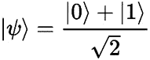

图 4.2 – 量子比特状态向量的公式

您也可以将其写成向量形式：

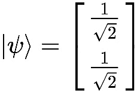

图 4.3 – 向量形式下的量子比特状态向量

另一种向量形式是您将在这些示例中看到的 Qiskit®状态向量形式：

```py
[0.70710678+0.j 0.70710678+0.j]
```

测量量子比特会导致它以大约 50%的概率坍缩到状态  或 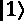 ，即抛硬币。结果以数字读数、条形图和 Bloch 球的形式显示。

## 准备工作

本食谱的示例代码可以在以下位置找到：[`github.com/PacktPublishing/Quantum-Computing-in-Practice-with-Qiskit-and-IBM-Quantum-Experience/blob/master/Chapter04/ch4_r1_coin_toss.py`](https://github.com/PacktPublishing/Quantum-Computing-in-Practice-with-Qiskit-and-IBM-Quantum-Experience/blob/master/Chapter04/ch4_r1_coin_toss.py)。

为了快速回顾如何运行示例程序，请参阅*第一章*的*下载代码示例*食谱，*准备您的环境*。

您现在可以编写您的第一个量子程序了。

## 如何做…

以下步骤在很大程度上将在本书中重复，基于基本所需的类和步骤进行基本的 Qiskit®管理。因此，请期待接下来的*如何做…*部分的要点将变得更加简短。

然而，具体差异将取决于您计划运行的程序以及您将使用的 Qiskit®组件。现在让我们开始程序：

1.  导入所需的 Qiskit®类。

    首先，我们导入创建寄存器和电路、设置后端等所需的 Python 类。请参阅*列出所需的 Qiskit®类、模块和函数*部分的*构建 Qiskit®量子程序*食谱：

    ```py
    from qiskit import QuantumRegister, ClassicalRegister
    from qiskit import QuantumCircuit, Aer, execute
    from qiskit.tools.visualization import plot_histogram
    from IPython.core.display import display
    ```

    此外，我们还从`IPython.core.display`导入`display`方法。这用于在我们的 Anaconda Spyder IPython 环境中正确显示图形输出，并且可能不在您的环境中需要。

1.  创建所需的寄存器和量子电路。

    我们创建两个寄存器，一个用于量子比特，一个用于经典比特。我们还创建了一个由量子寄存器和经典寄存器组成的量子电路。量子寄存器被初始化在基态， ，而经典寄存器被设置为 0：

    ```py
    q = QuantumRegister(1)
    c = ClassicalRegister(1)
    qc = QuantumCircuit(q, c)
    ```

1.  向量子电路添加门。

    为了让我们的量子程序真正做些事情，我们现在添加一个哈达玛门，将量子比特置于叠加态，并添加一个测量门，我们将在程序结束时使用它来读取量子比特的值。哈达玛门是基础门之一。我们将在*第六章*《理解 Qiskit®门库》中更详细地研究该门以及其他门：

    ```py
    qc.h(q[0])
    qc.measure(q, c)
    display(qc.draw('mpl'))
    ```

    通过使用`qc.draw`(`'mpl'`)可视化电路，我们看到，就像在 IBM Quantum Experience® composer 中一样，我们有一个包含 1 个量子比特和 1 个经典比特的量子电路，量子比特上有一个哈达玛门，以及一个将量子比特`q0_0`(或)的状态写入经典比特`c0_0`作为 0 或 1 的测量门：

    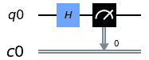

    图 4.4 – 一个简单的量子抛硬币电路

    在一个纯文本的 Python 环境中，你也可以使用`print(qc)`命令或使用`qc.draw`(`'text'`)来打印你的电路，这两个都会产生 ASCII 文本输出：

    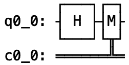

    图 4.5 – 以 ASCII 文本显示的电路

1.  设置运行的后端。

    对于这个初始配方，我们将使用内置的`qasm_simulator`后端。我们创建一个后端变量并调用 Aer 组件来获取所需的后端信息：

    ```py
    backend = Aer.get_backend('qasm_simulator')
    ```

1.  运行作业。

    为电路和所选后端创建一个量子作业，只运行一次以模拟抛硬币。然后我们运行作业并显示返回的结果；要么是表示正面，要么是表示反面。结果以 Python 字典的形式返回：

    ```py
    job = execute(qc, backend, shots=1)
    result = job.result()
    counts = result.get_counts(qc)
    ```

1.  打印并可视化结果：

    ```py
    print(counts)
    display(plot_histogram(counts))
    ```

    首先，我们打印出结果：

    ```py
    {'0': 1}
    ```

    然后，我们以直方图的形式打印出结果：


图 4.6 – 作为直方图的单个量子“抛硬币”结果

成功！你第一个量子抛硬币程序返回了反面，或结果。

## 它是如何工作的...

我们抛了一个量子硬币，它最初是向上（），在量子空间中以和的叠加态旋转，当我们测量它时最终落在反面位置。

那么，发生了什么？

让我们重申：

1.  我们创建了一个量子比特并将其初始化在基态，。

1.  然后，我们对量子比特应用了一个哈达玛门，将状态向量从布洛赫球的极点移动到赤道。

    从数学上讲，当你将 Hadamard 门应用于量子比特时，你让它经历两次旋转，首先是在*y*轴上的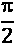旋转，然后是在*x*轴上的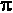旋转。量子比特现在处于和的叠加状态，位于两个极点之间。

    想了解更多关于 Hadamard 门的信息，请参阅*第六章*中的*使用 H 门创建叠加*配方，*理解 Qiskit®门库*。

1.  最后，我们测量了量子比特。

    通过测量，我们破坏了叠加，实际上迫使自然界做出决定，量子比特将处于或。

现在，先运行你的程序几次，注意观察你是否得到正面（）或反面（）。如果我们做得正确，你应该能非常接近地模拟抛硬币。

# 获取一些统计数据——连续抛很多次硬币

好的，到目前为止，我们一次只抛一个硬币，就像现实生活中一样。

但量子计算的力量来自于多次运行相同的初始条件下的量子程序，让量子比特的叠加发挥其量子力学优势，并对大量运行进行统计分析。

使用这个配方，我们将在一瞬间进行 1,000 次抛硬币，并查看结果，看看硬币的好坏。这个硬币是否能够公平地开始一场棒球比赛？让我们看看它是如何工作的。

## 准备工作

这个配方的示例代码可以在这里找到：[`github.com/PacktPublishing/Quantum-Computing-in-Practice-with-Qiskit-and-IBM-Quantum-Experience/blob/master/Chapter04/ch4_r2_coin_tosses.py`](https://github.com/PacktPublishing/Quantum-Computing-in-Practice-with-Qiskit-and-IBM-Quantum-Experience/blob/master/Chapter04/ch4_r2_coin_tosses.py)。

在这个配方中，我们将探索和扩展`shots`作业参数。这个参数让你控制量子作业周期（准备、运行、测量）运行的次数。到目前为止，我们已经将量子比特准备在状态，将后端设置为模拟器，然后运行一次，这代表了一个完整的周期。

在 IBM Quantum Experience®作曲家的示例中，我们运行了 1,024 次评分，这是默认值。我们发现输出变成了统计性的。在这个配方中，我们将尝试不同的射击次数，看看结果如何从统计上变化。

通常来说，你想要增加射击次数以提高统计精度。

## 如何操作...

与前面的配方类似，以下步骤都是你所需要的：

代码重用

对于懒惰的程序员来说，在这种情况下，正如你可能已经意识到的，电路中唯一真正的变化出现在*第 6 步*，在那里我们设置了射击次数。请随意重用之前的配方。

1.  导入所需的 Qiskit® 类和方法：

    ```py
    from qiskit import QuantumRegister, ClassicalRegister
    from qiskit import QuantumCircuit, Aer, execute
    from qiskit.tools.visualization import plot_histogram
    from IPython.core.display import display
    ```

1.  创建所需的寄存器和量子电路。使用寄存器设置我们的量子电路，一个量子比特和一个经典比特。根据寄存器创建量子电路：

    ```py
    q = QuantumRegister(1)
    c = ClassicalRegister(1)
    qc = QuantumCircuit(q, c)
    ```

1.  向量子电路添加门。添加 Hadamard 和测量门：

    ```py
    qc.h(q[0])
    qc.measure(q, c)
    display(qc.draw('mpl'))
    ```

    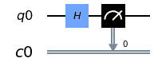

    图 4.7 – 相同的简单量子抛硬币电路

1.  将后端设置为我们的本地模拟器以运行：

    ```py
    backend = Aer.get_backend('qasm_simulator')
    ```

1.  运行作业。

    注意，这次我们运行了*1,000 次射击*。这意味着我们运行了我们的量子电路 1,000 次，收集了结果，并提供了平均输出作为我们的结果：

    ```py
    job = execute(qc, backend, shots=1000)
    result = job.result()
    counts = result.get_counts(qc)
    ```

1.  打印并可视化结果：

    ```py
    print(counts)
    display(plot_histogram(counts))
    ```

    这次输出看起来不同：

    ```py
    {'0': 480, '1': 520}
    ```

    这里是输出的直方图形式：

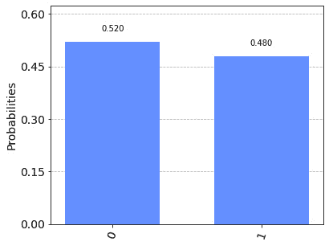

图 4.8 – 1,000 次射击的结果，0 和 1 的分布大致均匀

## 它是如何工作的...

这次我们使用了底层的 Qiskit® 分析来存储和处理每次射击的结果，并将其作为连接的 Python 字典返回。最终结果是所有实际输出的统计视图。对于抛硬币，如果你运行足够多次，你预计会以大致相等的概率得到正面和反面。

尝试将射击次数调整为 10,000 或 20,000，并查看你的量子比特在统计上的行为。

在一个更复杂的量子程序中，结果通常将表明对特定结果的偏好，即量子比特统计的特定组合，其中某些解决方案被放大并比其他解决方案出现得更频繁。这是编写良好的量子算法的关键技巧之一，理解如何让电路指向正确的答案。

我们将在稍后对此进行更详细的介绍，从*第九章*中的*探索量子相位回弹*配方开始，*Grover 搜索算法*。

## 更多内容...

通常来说，你通常对获取量子程序的统计结果感兴趣。在这种情况下，我们正在查看量子抛硬币的概率性质——一个随机数生成器。但有时，看到每一步的具体情况可能也很有趣。

你可以通过在运行你的量子程序时设置`memory=True`参数来实现这一点：

```py
job = execute(circuit, backend, shots=10, memory=True)
```

此设置使量子作业保存每次射击的个别结果，你可以稍后通过使用`result.get_memory()`命令检索这些结果。对于 1 量子比特电路的 10 次射击，内存结果可能看起来像这样：

```py
['1', '1', '0', '0', '1', '1', '0', '1', '0', '0']
```

对于一个 2 量子比特电路的 10 次射击（我们将在后面的配方中这样做），内存结果可能看起来像这样：

```py
['10', '10', '10', '11', '11', '00', '10', '10', '01', '00']
```

您可以从这个列表中挖掘出任何您想要的数据，并根据需要使用其他 Python 工具进一步处理。

# 实现倒立硬币抛掷

在这个菜谱中，我们将对我们的第一个量子程序进行一点调整，但仍然保持相对简单。实际的硬币可以抛掷，开始时正面朝上或反面朝上。让我们再进行一次量子硬币抛掷，但起点不同，硬币朝反面。在狄拉克符号中，我们开始时将量子比特置于![img/Formula_04_001.png]，而不是![img/Formula_04_002.png]。

## 准备中

这个菜谱的示例代码可以在以下位置找到：[`github.com/PacktPublishing/Quantum-Computing-in-Practice-with-Qiskit-and-IBM-Quantum-Experience/blob/master/Chapter04/ch4_r3_coin_toss_tails.py`](https://github.com/PacktPublishing/Quantum-Computing-in-Practice-with-Qiskit-and-IBM-Quantum-Experience/blob/master/Chapter04/ch4_r3_coin_toss_tails.py).

就像之前的菜谱一样，这个菜谱几乎与第一个硬币抛掷菜谱相同。您可以自由地重用您已经创建的内容。唯一的真正区别是，我们添加了一个新的量子门，即**X**（或**NOT**）门。

## 如何操作...

以下步骤在很大程度上与*量子硬币抛掷重访*菜谱中的步骤相同。然而，根据您创建的程序以及您使用的 Qiskit®组件，可能会有所不同。我将详细描述这些。

按照之前的示例设置您的代码，然后添加一个 X 门来翻转量子比特：

1.  导入所需的 Qiskit®类和方法：

    ```py
    from qiskit import QuantumCircuit, Aer, execute
    from qiskit.visualization import plot_histogram
    from IPython.core.display import display
    ```

    注意，我们在这里没有像之前那样导入`QuantumRegister`和`ClassicalRegister`方法。在这个菜谱中，我们将探讨创建量子电路的另一种不同方式。

1.  创建包含 1 个量子比特和 1 个经典比特的量子电路：

    ```py
    qc = QuantumCircuit(1, 1)
    ```

    在这里，我们隐式地让`QuantumCircuit`方法在后台创建量子比特和经典比特寄存器；我们不需要显式地创建它们。我们将使用数字和列表来引用这些寄存器。

1.  将 Hadamard 门、X 门和测量门添加到电路中：

    ```py
    qc.x(0)
    qc.h(0)
    qc.measure(0, 0)
    ```

    因此，这里是我们使用仅数字来引用量子比特的第一个例子。我们将 X 门添加到第一个量子比特，这里称为 0，因为 Python 从 0 开始编号，而不是从 1 开始：

    ![Figure 4.9 – The upside-down quantum coin toss circuit

    ![img/Figure_4.9_B14436.jpg]

    图 4.9 – 倒立量子硬币抛掷电路

1.  将后端设置为我们的本地模拟器：

    ```py
    backend = Aer.get_backend('qasm_simulator')
    ```

1.  要运行作业，这次，我们回到 1 次抛掷，只进行一次硬币抛掷：

    ```py
    counts = execute(qc, backend, shots=1).result().    get_counts(qc)
    ```

    注意这里我们稍微简化了代码，并将所有执行放在一行中，因为我们只对最终的计数感兴趣。

1.  可视化结果：

    ```py
    display(plot_histogram(counts))
    ```

    输出看起来如下：

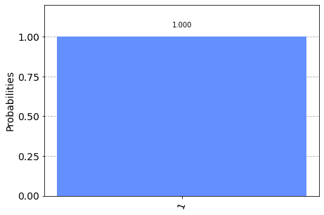

图 4.10 – 单次倒立量子硬币抛掷的结果

## 它是如何工作的...

在这个菜谱中，我们引入了一个新的门，即 Pauli-X 门。X 门在经典计算中就像 NOT 门一样工作——它翻转量子位的值。

如果量子位是 ，则它翻转成 ，如果它在 ，则它翻转成 。

对于像这样简单的情况，直观上很容易理解结果会是什么，但对于更复杂的量子位配置，其中 Bloch 向量指向 Bloch 球上的任意点，事情就变得有点棘手。本质上发生的事情是量子位绕 *x* 轴旋转了 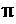 弧度。

## 还有更多...

X 门在这里很有用，但还有另一种方法可以设置你的硬币投掷反面。你可以在运行电路之前使用 Qiskit Aer 的 `initialize` 方法将量子位的初始状态设置为 。

以下是如何做到这一点的示例：

1.  创建一个与激发态对应的 Python 向量，并初始化量子电路：

    ```py
    initial_vector = [0.+0.j, 1.+0.j]qc.initialize(initial_vector, 0)
    ```

1.  在你的电路中找到以下代码，并将其替换为前面的 initialize 代码片段：

    ```py
    qc.x(0)
    ```

1.  现在正常运行程序。结果应该相似，但你的电路打印输出将如下所示：

![图 4.11 – 使用 initialize 方法设置你的量子位为 ]

](img/Figure_4.11_B14436.jpg)

图 4.11 – 使用 initialize 方法设置你的量子位为 

这样，你可以将任意数量的量子位初始化为任何你选择的状态。初始化向量需要满足两个主要标准：

1.  它必须包括 2^n 可能状态中的每个状态的条目。在前面的例子中，对于 1 个量子位，我们只需要一个长度为 2 的向量。对于 2 个量子位，向量必须长度为 4，依此类推。

1.  向量分量绝对值的平方和必须等于 1。以下是初始化量子位为  的前一个示例中的初始向量：

    ```py
    initial_vector = [0.+0.j, 1.+0.j]
    ```

    这可以转化为以下：

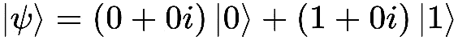

图 4.12 – 初始向量

这反过来又给出了概率之和：

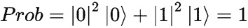

图 4.13 – 概率之和

# 同时掷两枚硬币

到目前为止，我们一次只玩一枚硬币，但没有任何阻止我们添加更多硬币。在这个菜谱中，我们将向模拟中添加一枚硬币，并同时掷两枚硬币。我们将通过添加第二个量子位来实现这一点，扩展量子位的数量——两倍于所有东西。

## 准备工作

该食谱的示例代码可以在以下位置找到：[`github.com/PacktPublishing/Quantum-Computing-in-Practice-with-Qiskit-and-IBM-Quantum-Experience/blob/master/Chapter04/ch4_r4_two_coin_toss.py`](https://github.com/PacktPublishing/Quantum-Computing-in-Practice-with-Qiskit-and-IBM-Quantum-Experience/blob/master/Chapter04/ch4_r4_two_coin_toss.py).

## 如何做到这一点...

按照前面的例子设置你的代码，但使用 2 量子比特量子电路：

1.  导入我们需要的类和方法：

    ```py
    from qiskit import QuantumCircuit, Aer, execute
    from qiskit.tools.visualization import plot_histogram
    from IPython.core.display import display
    ```

1.  使用两个量子比特和两个经典比特设置我们的量子电路：

    ```py
    qc = QuantumCircuit(2, 2)
    ```

1.  将 Hadamard 门和测量门添加到电路中：

    ```py
    qc.h([0,1])
    qc.measure([0,1],[0,1])
    display(qc.draw('mpl'))
    ```

    注意我们现在是如何使用列表来引用多个量子比特和多个比特的。例如，我们通过使用[0,1]作为输入来对量子比特 0 和 1 应用 Hadamard 门：

    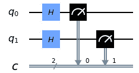

    图 4.14 – 2 量子比特量子硬币抛掷电路

1.  将后端设置为我们的本地模拟器：

    ```py
    backend = Aer.get_backend('qasm_simulator')
    ```

1.  运行一次射击的作业：

    ```py
    counts = execute(qc, backend, shots=1).result().    get_counts(qc)
    ```

    再次，我们使用简化的代码，因为我们只对计数感兴趣。

1.  可视化结果：

    ```py
    display(plot_histogram(counts))
    ```

    直方图看起来像这样：


图 4.15 – 双量子硬币抛掷的![img/Formula_04_041.png]结果

## 它是如何工作的...

当你创建量子电路时，你可以设置量子比特的数量。

当你运行程序时，两个量子比特都提供了 Hadamard 门，创建了两个处于叠加态的并行量子比特。

在 Qiskit®中，量子比特编号从 0 开始，第一个量子比特，然后向上计数。一个 3 量子比特电路将包含以下量子比特，分别称为第一个、第二个和第三个量子比特：

+   如果你使用`QuantumRegister`表示法，就像在*量子硬币抛掷重访*食谱中一样：`q[0]`，`q[1]`，和`q[2]`

+   如果你使用列表表示法：`[0,1,2]`

## 还有更多...

在这里进行一些实验，通过向你的电路中添加更多量子比特。你会发现你可以使用这种方法来创建任何类型的随机数。输出将是一个与你的电路中量子比特数量相同的二进制数。

例如，创建一个包含 20 个量子比特的电路，并运行一次，可能会得到以下输出：

```py
{'00101011101110011011': 1}
```

这可以转换为以下十进制数字：

```py
179099
```

因此，你可以使用量子程序来创建任何类型的随机数。例如，你也可以使用这个设置来创建不同大小的骰子，遵循 2^n 规则（其中 n 是量子比特的数量）。所以，计算是这样的：

+   一个量子比特 = 两种可能状态 = 硬币

+   两个量子比特 = 四种可能状态 = 四面骰子

+   三个量子比特 = 八种可能状态 = 八面骰子

# 抛硬币的量子作弊？介绍贝尔态

现在，你有了抛一个或多个量子硬币并获得概率结果的能力。这很好，我们可以想象自己使用这个新工具进行赌博，对抛硬币的结果下注。但是，由于结果是 50/50，除非我们调整赔率（也就是说，我们作弊），否则赚钱的可能性有限。

那么，在抛硬币时如何作弊呢？嗯，事先知道结果将是一个聪明的办法。结果证明，这可以通过一种称为**纠缠**的量子现象来实现。

通过纠缠两个量子比特，我们将它们以某种方式连接起来，使得它们不能再单独描述。在最基本的意义上，如果你有两个纠缠的量子比特，并测量其中一个为 ，那么测量另一个的结果将是 。

那么，我们如何利用这个来在抛硬币时作弊呢？嗯，我们创建两个量子比特，将它们纠缠在一起，然后分开它们（实际上，这在物理上做起来很棘手，但我们现在将忽略这一点）。你将一个量子比特带入赌场，而你的朋友将另一个量子比特留在房间外。

当是时候抛硬币时，你运行你的量子电路，纠缠量子比特，然后你的朋友测量他们留在房间外的量子比特。然后他们通过某种方式（例如蓝牙耳机、信号或心灵感应）偷偷告诉你他们的测量结果，或。你将立即知道你的量子比特是什么，在你测量它之前，并可以据此下注。测量后，你会发现你确实猜对了，并可以领取你的奖金。

那么，如何进行量子编程呢？我们将介绍一个新的门，**受控非门**（**CX**）。

## 准备工作

该菜谱的示例代码可以在以下位置找到：[`github.com/PacktPublishing/Quantum-Computing-in-Practice-with-Qiskit-and-IBM-Quantum-Experience/blob/master/Chapter04/ch4_r5_two_coin_toss_bell.py`](https://github.com/PacktPublishing/Quantum-Computing-in-Practice-with-Qiskit-and-IBM-Quantum-Experience/blob/master/Chapter04/ch4_r5_two_coin_toss_bell.py)。

## 如何做...

按照前面的示例设置你的代码，使用 2 个量子比特和经典比特：

1.  导入我们需要的类和方法：

    ```py
    from qiskit import QuantumCircuit, Aer, execute
    from qiskit.tools.visualization import plot_histogram
    from IPython.core.display import display
    ```

1.  使用两个量子比特和两个经典比特设置我们的量子电路：

    ```py
    qc = QuantumCircuit(2, 2)
    ```

1.  将哈达玛门、受控非门和测量门添加到电路中。

    对于我们进行的每个电路操作，例如添加一个门，我们需要指明要对哪个量子比特进行操作。例如，要在第一个量子比特上添加一个哈达玛门，你会使用代码 `qc.h(0)`：

    ```py
    qc.h(0)
    qc.cx(0,1)
    qc.measure([0,1],[0,1])
    display(qc.draw('mpl'))
    ```

    上述代码给出了以下输出：

    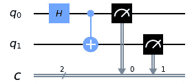

    图 4.16 – 带有受控非门以纠缠量子比特的 2 量子比特量子电路

1.  将后端设置为我们的本地模拟器：

    ```py
    backend = Aer.get_backend('qasm_simulator')
    ```

1.  运行一次射击的作业：

    ```py
    counts = execute(qc, backend, shots=1).result().    get_counts(qc)
    ```

1.  可视化结果：

    ```py
    display(plot_histogram(counts))
    ```

    直方图输出的结果如下：

    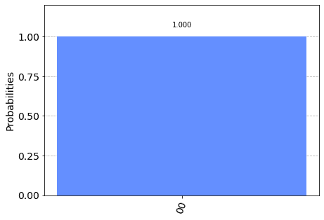

    图 4.17 – 2 量子比特纠缠抛硬币的结果

1.  运行电路几次，你就会意识到在这个双量子抛硬币的结果上，唯一的结果是 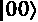 或 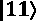。现在再次运行电路，但使用 1,000 次射击，得到以下结果：

    ```py
    counts = execute(qc, backend, shots=1000).result().get_counts(qc)
    ```

    你将看到以下直方图作为你代码的结果：

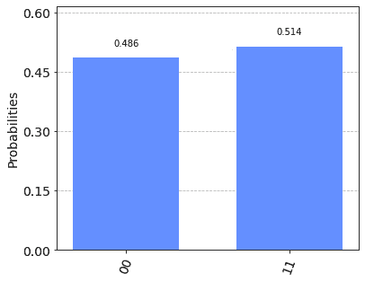


图 4.18 – 1,000 次射击的结果。只有 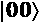 和 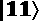 出现！

## 它是如何工作的...

让我们从新的门，CX 门开始。这个门将第一个量子比特的量子状态（如第一个量子比特得分的点所示）作为输入，然后如果量子状态是 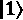，则在第二个量子比特上执行一个 NOT 门（x）。如果量子状态是 ，则对第二个量子比特不做任何操作。

所以，这个故事中真正令人兴奋的部分是，在我们预期`cx`门起作用的地方，我们还没有知道第一个量子比特的状态。Hadamard 门已经将它置于一个很好的叠加态，精确地悬浮在  和  之间。直到我们测量第一个量子比特，我们才会知道量子比特处于什么状态。甚至自然也不知道状态，因为量子比特不在特定的状态中；它处于两个状态的叠加中。

那么，CX 门是如何知道在运行程序时需要将第二个量子比特从  翻转到  呢？嗯，这正是量子计算中令人着迷的部分，*它* *没有*。只有当我们测量第一个量子比特时，门执行才会发生，纠缠的第二个量子比特才会翻转，或者不会翻转。爱因斯坦将量子力学的这个非常真实的事例称为“遥远地点的幽灵行动”并希望与之无关。

因此，运行我们的小食谱的最终结果是我们得到这两个量子比特的两个可能结果之一， 或 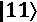，概率大致相等。如果第一个量子比特读取 ，则第二个量子比特也将读取相同，给出  的结果。对于  的相反读取也是一样；两个量子比特都将读取相同，给我们 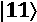 的结果。一旦你读取了一个量子比特，你立即就知道第二个量子比特会是什么。这就是量子抛硬币作弊的方法！

## 还有更多...

但贝尔态不仅仅锁定在两个结果  和 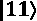 上。通过使用其他门，你可以设置这种纠缠状态为 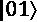 和 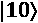：

```py
{'10': 542, '01': 458}
```

你会使用哪个门，它在哪个量子比特上起作用，你会在电路的哪个位置添加它？在这种情况下，你可能想要以不同的状态开始量子比特，看看会发生什么。参考“实现倒立抛硬币”菜谱以获取灵感。

## 参考以下内容

在`qasm_simulator`（模拟一个完美的通用容错量子计算机）上运行这个贝尔态电路得到的结果非常明确，两个量子比特在每次测量时都是相同的。

在现实世界中，现有的物理量子计算机还远未达到通用容错量子计算机的水平，结果将会有所不同。为了快速了解，请参阅“抛一些真实的硬币”菜谱。

# 更多量子作弊的方法 – 调整概率

在前面的菜谱中，我们使用了一种名为纠缠的量子现象来通过抛硬币作弊。诚然，这可能会很复杂，人们确实倾向于怀疑那些戴着耳机、显然在接住并揭示硬币（测量量子比特）之前就监听信息的抛硬币者。

但剥猫的方法不止一种。记得我们关于量子比特和量子门的讨论。通过使用门来操作量子比特，我们可以在测量之前调整量子比特的状态。向量越接近  或 ，当你测量时，该特定结果出现的概率就越高。

在这个菜谱中，我们将使用旋转门，即**Ry**门，来增加抛硬币时得到反面结果的概率。

## 准备工作

这个菜谱的示例代码可以在以下链接找到：[`github.com/PacktPublishing/Quantum-Computing-in-Practice-with-Qiskit-and-IBM-Quantum-Experience/blob/master/Chapter04/ch4_r6_coin_toss_rot.py`](https://github.com/PacktPublishing/Quantum-Computing-in-Practice-with-Qiskit-and-IBM-Quantum-Experience/blob/master/Chapter04/ch4_r6_coin_toss_rot.py)。

## 如何做...

按照前面的例子设置你的代码，然后添加一个**Ry**门来旋转量子比特：

1.  导入我们需要的类和方法：

    ```py
    from qiskit import QuantumCircuit, Aer, execute
    from qiskit.tools.visualization import plot_histogram
    from IPython.core.display import display
    from math import pi
    ```

1.  使用一个量子比特和一个经典比特设置我们的量子电路，并基于寄存器创建量子电路：

    ```py
    qc = QuantumCircuit(1, 1)
    ```

1.  将 Hadamard 门、Ry 门和测量门添加到电路中：

    ```py
    qc.h(0)
    qc.ry(pi/8,0)
    qc.measure(0, 0)
    display(qc.draw('mpl'))
    ```

    前面的代码应该产生以下输出：

    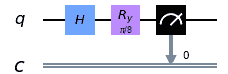

    图 4.19 – 带有 Ry 门的我们的作弊抛硬币电路

1.  将后端设置为我们的本地模拟器：

    ```py
    backend = Aer.get_backend('qasm_simulator')
    ```

1.  使用一千次射击运行作业：

    ```py
    counts = execute(qc, backend, shots=1000).result().    get_counts(qc)
    ```

1.  可视化结果：

    ```py
    display(plot_histogram(counts))
    ```

    前面代码的直方图看起来如下：

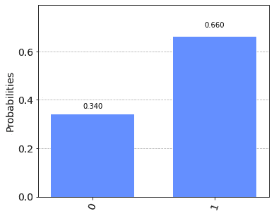

图 4.20 – 我们作弊抛硬币电路的略微倾斜的结果

好吧，所以现在似乎有更多的机会让你投掷一个  – 几乎是 2 比 1。

它是如何工作的...

那么，这里发生了什么？通过添加 Ry 门，我们极大地提高了我们获胜的机会。让我们更仔细地看看这个门的作用。

让我们看看我们正在讨论的三个不同状态下的 Bloch 矢量。在示例代码中，有一个可疑的函数我们还没有涉及。我们将在 *第六章*，*理解 Qiskit® 量子门库*中看到更多。通过调用 `get_psi()` 函数并使用你正在构建的量子电路，你可以看到量子比特在构建电路的每个阶段的动态。该函数使用另一个模拟器，`statevector_simulator`，它计算你在电路中给定位置的量子比特行为，然后我们使用 `plot_bloch_multivector()` 方法将其显示为 Bloch 球：

```py
# Function that returns the statevector (Psi) for the circuit
def get_psi(circuit):
    show_bloch=False
    if show_bloch:
        from qiskit.visualization import plot_bloch_multivector
        backend = Aer.get_backend('statevector_simulator') 
        result = execute(circuit, backend).result()
        psi = result.get_statevector(circuit)
        print(title)
        display(qc.draw('mpl'))
        display(plot_bloch_multivector(psi))  
```

当我们用量子电路作为输入调用此函数时，它将在电路结束时返回量子比特状态矢量（psi 或 ）。如果电路中包含多个量子比特，该函数将包括所有量子比特的完整状态矢量。

要使用 `get_psi()` 函数运行电路，将 `show_bloch` 变量从 `False` 更改为 `True`，然后再次运行你的电路。现在的输出应该看起来像以下这样：

1.  首先，我们展示了处于基态的量子比特：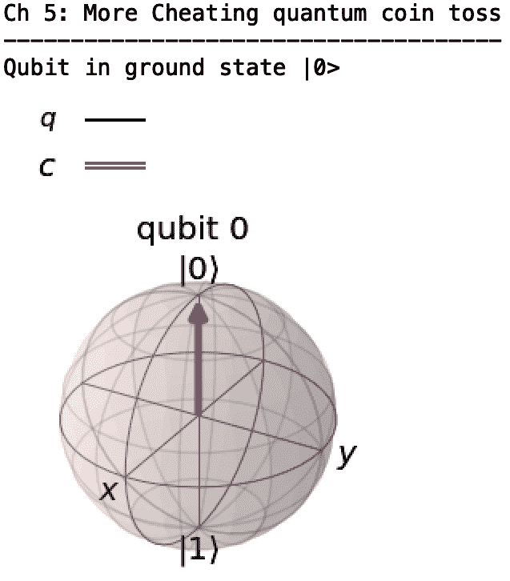

    图 4.21 – 在初始基态，量子矢量如我们所预期的那样直接指向 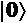

1.  然后，我们展示了经过 Hadamard 门后的量子比特，现在处于  和  的叠加态：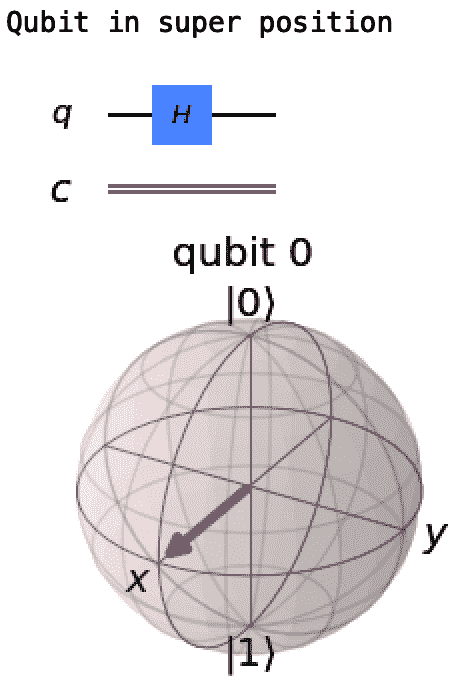

    图 4.22 – 应用 Hadamard 门后，矢量现在指向 Bloch 球赤道

1.  我们之前见过这个。如果我们现在测量它，我们会有大约 50% 的概率得到  和 ：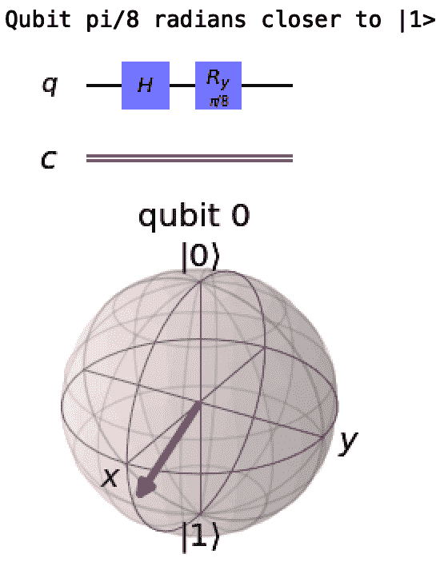

图 4.23 – 最后，应用 Ry 门后，矢量现在指向 Bloch 球赤道以下

现在，我们应用 Ry 门，将矢量 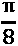 弧度（在我们先前的电路图中为 0.3927）绕 *y* 轴旋转到 。

因此，这里发生的情况是，我们通过使用 Ry 门修改了角度 。

记得*第二章*中的公式，*使用 Python 进行量子计算和量子比特*？

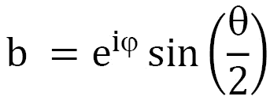

在应用 Hadamard 门之后，角度为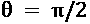和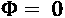（我们还没有围绕*y*轴旋转）。

测量的概率是：

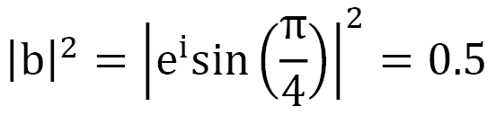

现在，如果我们通过添加将改为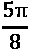，我们得到这个：

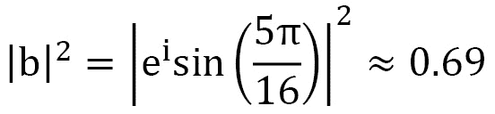

这与我们测量的结果非常吻合，表明我们确实调整了量子硬币落地为尾的概率。

## 还有更多...

有三个基本的旋转门——Rx、Ry 和 Rz，你可以使用它们轻松地将向量指向 Bloch 球上的任何一点。这些在*第六章*中描述得更详细，*理解 Qiskit®门库*。

#### 尝试这些变体

尝试使用这些创建几个量子电路：

1.  不使用 Hadamard 门创建一个 1 比特叠加态。

1.  测量电路以确保结果与使用 Hadamard 门的结果相同。

1.  使用 Hadamard 门创建一个 1 比特叠加态，然后使用 R 门将向量指向*y*轴。

    那会是哪个门，输入是什么？你能通过跳过 Hadamard 门而只使用 R 门得到相同的结果吗？哪一个？现在，测量一下，看看这会不会对叠加态电路的预期结果产生影响。

1.  看看计算测量概率的公式，看看你是否可以使用 Ry 门设置一个电路，使其结果为：

    99%的时间

    66%的时间

    33%的时间

恭喜！你现在不仅可以在量子硬币投掷中作弊，还可以计算你的概率。

#### 关于`get_psi()`函数的更多内容

我们以这个非常小的，1 比特量子电路为例，展示了如何使用我们自制的`get_psi()`函数逐步遍历你的电路，以了解你的量子比特在每个阶段的运行情况。记住，尽管人们有时会谈论量子比特同时为 0 和 1，但他们真正指的是我们之前看过的叠加数学。重要的是，在我们的计算中，通过操纵它们的态矢量，我们将量子比特置于非常知名的状态。

对于小电路，想象每个步骤发生的事情相对容易，但对于大电路，你很快就会用尽脑力来心理上可视化小量子比特的行为。

您可以使用 `get_psi()` 函数和状态向量模拟器来完成这个任务。您可以从电路设计的任何位置调用它，以查看您的量子比特正在做什么。如果您的量子程序没有按照您预期的行为运行，请使用状态向量模拟器和布洛赫球可视化来调试。

随着我们继续阅读本书，我们将调整和修改 `get_psi()` 函数以满足我们的需求，并使用它来显示有关我们电路的更多详细信息。

# 添加更多硬币 – 正直和作弊

到目前为止，我们的菜谱主要是 1-或 2-量子比特的。有了我们的模拟器，我们可以在电路中随意添加更多量子比特，前提是每个额外的量子比特将需要更多和更多的处理能力，这是您的模拟器运行的系统所必需的。例如，IBM Quantum Experience® `qasm_simulator` 在 IBM POWER9™ 服务器上运行，最大可达到约 32 个量子比特。

在这个菜谱中，我们将创建两个 3-量子比特量子程序，一个是多硬币投掷，另一个是新纠缠态，称为 **GHZ**（代表 **Greenberger–Horne–Zeilinger** 态）。

而不是通过创建两个单独的文件来做这件事，我们将查看一个新的命令，`reset()`。正如其名所示，使用 `reset()` 命令与量子比特一起将其设置回其原始状态！[](img/Formula_04_002.png)，准备开始新一轮的量子计算。在这个例子中，我们使用 `reset()` 来连续运行两个量子程序，写入两组三个经典寄存器，每次运行测量两次。

## 准备工作

此菜谱的示例代码可以在以下位置找到：[`github.com/PacktPublishing/Quantum-Computing-in-Practice-with-Qiskit-and-IBM-Quantum-Experience/blob/master/Chapter04/ch4_r7_three_coin_toss_ghz.py`](https://github.com/PacktPublishing/Quantum-Computing-in-Practice-with-Qiskit-and-IBM-Quantum-Experience/blob/master/Chapter04/ch4_r7_three_coin_toss_ghz.py).

## 如何操作...

按照前面的示例设置您的代码，但使用三个量子比特和经典比特：

1.  导入我们需要的类和方法：

    ```py
    from qiskit import QuantumCircuit, Aer, execute
    from qiskit.tools.visualization import plot_histogram
    from IPython.core.display import display
    ```

1.  使用三个量子比特和六个经典比特设置我们的量子电路：

    ```py
    qc = QuantumCircuit(3, 6)
    ```

1.  将哈达玛门和测量门添加到电路中：

    ```py
    qc.h([0,1,2])
    qc.measure([0,1,2],[0,1,2])
    display(qc.draw('mpl'))
    ```

    前面代码的输出如下所示：

    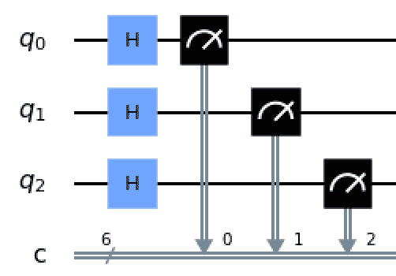

    图 4.24 – 一个 3-量子比特叠加电路，测量到经典比特 0、1 和 2

1.  将后端设置为我们的本地模拟器：

    ```py
    backend = Aer.get_backend('qasm_simulator')
    ```

1.  使用一千次射击运行作业：

    ```py
    counts = execute(qc, backend, shots=1000).result().    get_counts(qc)
    ```

1.  可视化结果：

    ```py
    display(plot_histogram(counts))
    ```

    前面代码的直方图如下所示：

    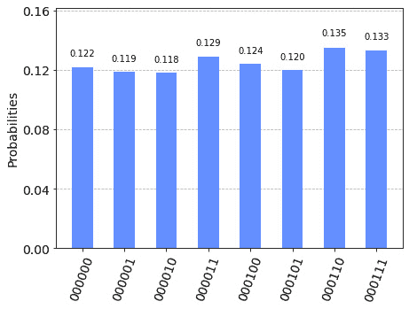

    图 4.25 – 三个叠加态的量子比特给出随机结果

    注意到这里我们只看到了前三个经典比特（0、1 和 2）的测量结果。最后三个经典比特都是 0。

1.  现在通过重置量子比特，向量子比特 0 添加一个 Hadamard 门，然后添加两个 CX（受控非）门，一个从量子比特 0 到量子比特 1，另一个从量子比特 0 到量子比特 2 来修改电路。

    我们将使用一个新的电路命令来重置电路的量子比特回到初始状态，并使用`reset()`重新开始：

    ```py
    qc.barrier([0,1,2])
    qc.reset([0,1,2])
    qc.h(0)
    qc.cx(0,1)
    qc.cx(0,2)
    qc.measure([0,1,2],[3,4,5])
    display(qc.draw('mpl'))
    ```

    记住，当你只修改一个量子比特时，你必须指定要修改的量子比特，就像这样`qc.h`(`0`)，向第一个量子比特添加 Hadamard 门：

    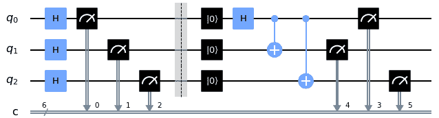

    图 4.26 – 将量子电路的量子比特重置为初始状态并重新开始，将最终测量写入经典比特 3、4 和 5

1.  使用 1,000 次射击运行作业：

    ```py
    counts = execute(qc, backend, shots=1000).result().    get_counts(qc)
    ```

1.  显示结果：

    ```py
    display(plot_histogram(counts))
    ```

    之前代码的直方图展示如下：

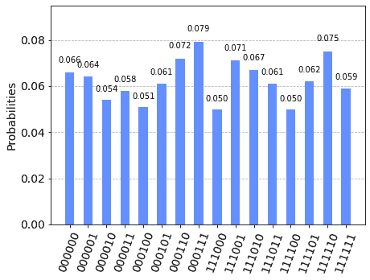

图 4.27 – 三个抛掷硬币量子比特和三个纠缠量子比特（GHZ 态）在第一三个和第二三个经典比特中的组合结果

## 它是如何工作的...

我们创建的两个电路并没有什么本质上的新东西，只是增加了更多的量子比特，以及两轮测量。在第一个中，我们并行添加了所有门，而在第二个中，我们仔细指定了添加门的位置。最终结果是两个 3 量子比特电路，一个代表了更多抛掷的硬币，另一个扩展了我们之前探索的贝尔态。

最后一个很有趣，因为它显示了几个量子比特之间的纠缠；现在没有一个量子比特可以单独处理。这种纠缠是更高级量子算法的关键，在这些算法中，大量量子比特被设置，处于叠加态，然后被纠缠。它们最终被其他门作用，以产生特定的结果。

最后，我们测试了一种新的将结果写入经典比特的方法。我们将抛掷硬币的结果写入前三个经典比特，将 GHZ 状态的结果写入最后三个。

## 更多...

进行一些实验，看看你如何构建具有更多量子比特的更大电路，以及如何添加门：

1.  创建一个 5 量子比特电路，所有量子比特上都有 Hadamard 门，但只有第一个、第三个和第五个量子比特上有测量门。你实际上需要多少个经典寄存器？

1.  创建一个 5 量子比特电路，将第一个、第二个、第四个和第五个量子比特与第三个量子比特纠缠。你需要在哪个量子比特上添加 Hadamard 门？

1.  我们在本菜谱中构建的 GHZ 电路只能给出纠缠结果![img/Formula_04_089.png]和![img/Formula_04_090.png]。构建一个给出结果![img/Formula_04_091.png]或![img/Formula_04_092.png]的电路。除了 H 和 CX 门之外，你使用什么门，以及你将它们放在哪里，或者它们在哪里？

    小贴士

    如果你只使用一组测量命令，而不使用`reset()`命令，可能更容易理解这些电路的工作原理。

# 投掷一些真实的硬币

那么，你的想法是什么？你现在是否完成了量子硬币投掷的模拟，并想要进行真正的操作，即在真实的 IBM 量子计算机上运行你的 Qiskit®量子程序？让我们最终利用你创建的 IBM Quantum Experience® API 密钥。

在本菜谱中，你将通过使用 Qiskit®在真实的 IBM Quantum®机器上运行作弊硬币投掷或贝尔态。我们知道在完美模拟的量子计算机上预期的结果是什么，现在我们将看看所谓的 NISQ 机器的实际结果是什么样的。

最后，我们将利用这个 API 密钥，介绍 IBMQ 组件，如何找到后端，如何选择最佳后端，以及如何在该后端运行电路。

## 准备工作

本菜谱的示例代码可以在以下链接找到：[`github.com/PacktPublishing/Quantum-Computing-in-Practice-with-Qiskit-and-IBM-Quantum-Experience/blob/master/Chapter04/ch4_r8_coin_toss_IBMQ.py`](https://github.com/PacktPublishing/Quantum-Computing-in-Practice-with-Qiskit-and-IBM-Quantum-Experience/blob/master/Chapter04/ch4_r8_coin_toss_IBMQ.py).

要能在真实的 IBM 硬件上运行你的量子程序，你需要使用你在 IBM Quantum Experience®账户中分配的 API 密钥。如果你在 IBM Quantum Experience®笔记本环境中运行 Qiskit®，那么你的 API 密钥已经可用，无需进一步操作。

如果你在自己的本地机器上运行 Qiskit®，你必须将 API 密钥本地存储。你可能已经作为*第一章*中“安装你的 API 密钥和访问你的提供商”菜谱的一部分完成了这些必要的步骤，*准备你的环境*。如果没有，现在就完成这个任务。我们在这里等你。

## 如何操作

按照前面的示例设置你的代码，使用两个量子比特和经典比特：

1.  导入所需的类和方法：

    ```py
    from qiskit import QuantumCircuit, execute
    from qiskit import IBMQ
    from qiskit.tools.monitor import job_monitor
    from IPython.core.display import display
    ```

1.  获取存储的 API 密钥：

    ```py
    IBMQ.load_account()
    provider = IBMQ.get_provider()
    ```

1.  使用两个量子比特和两个经典比特设置我们的量子电路：

    ```py
    qc = QuantumCircuit(2, 2)
    ```

1.  添加 Hadamard 门和 CX 门以准备贝尔态：

    ```py
    qc.h(0)
    qc.cx(0,1)
    qc.measure([0,1],[0,1])
    display(qc.draw('mpl'))
    ```

    上述代码显示了以下电路：

    ![图 4.28 – 2 量子比特贝尔态电路

    ![img/Figure_4.28_B14436.jpg]

    图 4.28 – 2 量子比特贝尔态电路

1.  将后端设置为最不繁忙的 IBM Quantum®机器：

    ```py
    from qiskit.providers.ibmq import least_busy
    backend = least_busy(provider.backends(n_qubits=5,    operational=True, simulator=False))
    print(backend.name())
    ibmq_essex
    ```

    我们将在*第五章*的“寻找最不繁忙的后端”食谱中重新审视这种选择 IBM Quantum®计算机后端来运行你的电路的方法，即*使用 Qiskit®工具游览 IBM Quantum Hardware®*。现在，只需按原样使用代码即可。

1.  使用 1,000 次射击运行作业。等待作业完成：

    ```py
    job = execute(qc, backend, shots=1000)
    job_monitor(job)
    Job Status: job has successfully run
    ```

1.  获取结果：

    ```py
    result = job.result()
    counts = result.get_counts(qc)
    from qiskit.tools.visualization import plot_histogram
    display(plot_histogram(counts))
    ```

    上述代码的直方图表示如下：

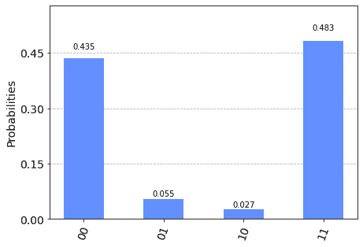

Figure 4.29 – 在实际的 IBM Quantum®后端上运行贝尔态电路的结果

稍等一下！我们只期待得到和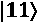的结果……这里发生了什么？

## 它是如何工作的...

哇，看看那些有噪声的量子位！

你在程序的有噪声结果中看到的就是噪声本身。尽管 IBM Quantum®计算机在低于外太空温度（15 毫开尔文）下运行，但它们在执行量子位上的门操作和测量时仍然会遭受随机噪声。

我们一直运行量子程序的本地`qasm_simulator`表现得像一个完美的**通用量子计算机**。另一方面，真正的硬件被称为**有噪声的中规模量子（NISQ）计算机**，其表现并不完美。

我们将在*第五章*的*使用 Qiskit®工具游览 IBM Quantum®硬件*中更详细地探讨现有的 IBM Quantum®后端。

## 还有更多...

当你在实际的 IBM Quantum®机器上运行你的作业时，通常会有所不同，与你在本地模拟器上所经历的受控体验。

### 排队

一旦你开始在 IBM Quantum®机器上运行一个或两个量子程序，你很可能会意识到你不是唯一一个。实际上，可供公众免费使用的量子计算机数量有限。截至本文撰写时，有稳定增长数量的物理后端和一个模拟器可以使用。使用`provider.backends()`命令列出目前可用的后端：

```py
from qiskit import IBMQ
IBMQ.load_account()
provider = IBMQ.get_provider()
provider.backends()
```

上述代码可能得到以下类似的结果：

```py
[<IBMQSimulator('ibmq_qasm_simulator') from IBMQ(hub='ibm-q', group='open', project='main')>,
 <IBMQBackend('ibmqx2') from IBMQ(hub='ibm-q', group='open', project='main')>,
 <IBMQBackend('ibmq_16_melbourne') from IBMQ(hub='ibm-q', group='open', project='main')>,
 <IBMQBackend('ibmq_vigo') from IBMQ(hub='ibm-q', group='open', project='main')>,
 <IBMQBackend('ibmq_ourense') from IBMQ(hub='ibm-q', group='open', project='main')>,
 <IBMQBackend('ibmq_london') from IBMQ(hub='ibm-q', group='open', project='main')>,
 <IBMQBackend('ibmq_burlington') from IBMQ(hub='ibm-q', group='open', project='main')>,
 <IBMQBackend('ibmq_essex') from IBMQ(hub='ibm-q', group='open', project='main')>,
 <IBMQBackend('ibmq_armonk') from IBMQ(hub='ibm-q', group='open', project='main')>]
```

记住，你在这里是共享时间，与其他所有人同时使用与你相同的机器。在下一章中，我们将更仔细地查看这些机器，并探讨如何确定在任何给定时刻使用哪个机器最好。

### 结果中的硬件细节

作业完成后，你已经查看过结果后，可以通过使用`job.result()`命令快速查看完整的返回结果。它看起来可能像这样：

```py
namespace(backend_name='ibmq_burlington',
          backend_version='1.1.4',
          qobj_id='630c02ca-7d06-4430-91e8-8ef08b9f5a63',
          job_id='5f15dec89def8b001b437dfe',
          success=True,
          results=[namespace(shots=1000,
                        success=True,
                        data=namespace(counts=namespace(                                                       0x0=471,
                                                     0x1=529)),
                        meas_level=2,
                        header=namespace(memory_slots=2,
                                         qreg_sizes=[['q', 5]],
                                         qubit_labels=[['q',0],
                                                       ['q',1],
                                                       ['q',2],
                                                       ['q',3],
                                                      ['q',4]],
                                         name='circuit58',
                                         n_qubits=5,
                                         creg_sizes=[['c', 2]],
                                         clbit_labels=[['c',0],
                                                     ['c',1]]),
                        memory=False)],
          status='Successful completion',
          header=namespace(backend_version='1.1.4',
                        backend_name='ibmq_burlington'),
          date=datetime.datetime(2020, 7, 20, 18, 13, 44, tzinfo=datetime.timezone.utc),
          time_taken=7.400392055511475,
          execution_id='bc4d19d0-cab4-11ea-b9ba-ac1f6b46a78e')
```

在这个结果集中，你可以看到有关所使用的量子计算机后端的信息，运行的结果，以及运行的状态和日期和时间。

### 如果等待时间过长怎么办？

有时你前面可能有一个非常长的队列，你必须等待你的轮次。从某种意义上说，IBM Quantum®机器就像计算机早期的时间共享设置一样工作；同一时间只能运行一个程序。

但无需绝望。你的作业已经提交，你可以退后一步，让机器做它们的工作，在你方便的时候继续。

这与 IBM Quantum Experience®电路作曲家的工作方式相同。一旦提交，你的作业将等待它的轮次，然后在返回时显示在结果页面上。要在你的本地 Qiskit®中做同样的事情，你首先需要你的作业 ID。

你可以使用作业 ID 来获取你的最新作业，甚至检索你之前执行过的作业。每个执行过的作业都有一个唯一的作业 ID。

使用`job.job_id()`命令来获取作业 ID：

```py
job.job_id()
Out[]: '5f15dec89def9b001b437dfe'
```

现在你有了作业 ID，你可以通过使用`retrieve_job()`命令来获取`job`对象：

```py
get_result=backend.retrieve_job(<jobid>)
```

现在你可以像平时一样从`job`对象中获取作业结果，例如：

```py
counts = get_result.result().get_counts()
print(counts)
```

前面的代码可能会产生以下输出：

```py
Out[]: {'11': 339, '10': 174, '00': 339, '01': 172}
```

你还可以使用作业 ID 来查找作业的状态，并查看它在队列中的当前位置：

```py
print(backend.retrieve_job(<jobid>).status())
```

这里有一个例子：

```py
Out[]: JobStatus.QUEUED
Out[]: JobStatus.RUNNING
Out[]: JobStatus.DONE
```

IBM Quantum Experience®中内置了更多与作业相关的功能，你可以从中获取。要更详细地了解后端以及你可以了解的内容，请继续阅读*第五章*，*使用 Qiskit®工具游览 IBM Quantum®硬件*。
