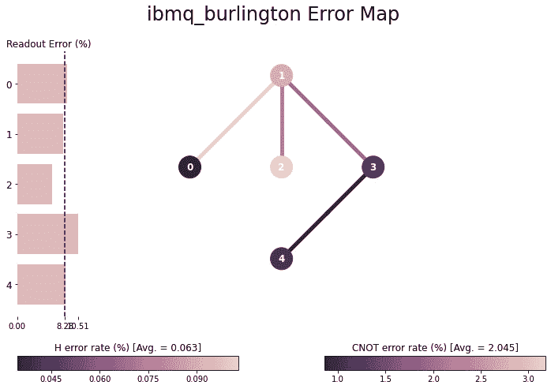

# 第五章：*第五章*：使用 Qiskit®游览 IBM Quantum®硬件

在前面的章节中，我们主要使用了内置和本地各种形式的量子计算机模拟器，但我们也将一些量子程序连接到实际的 IBM 量子计算机上并运行。在本章中，我们将更深入地研究这些后端，直至实际的物理量子比特层面。

我们将通过使用 IBM Quantum Experience®和 Qiskit®访问有关可用硬件的数据，快速游览 IBM Quantum®实验室。在这些事情中，我们将查看量子芯片布局的图形视图，量子计算机的一些物理方面，如 T1 和 T2 退相干参数，一些基本和高级错误度量，可用的量子比特之间如何相互交互，等等。

在本章中，我们将涵盖以下食谱：

+   IBM Quantum®机器是什么？

+   定位可用的后端

+   比较后端

+   寻找最不繁忙的后端

+   可视化后端

+   使用 Qiskit®探索选定的后端

在本章中，我们将一般使用我们在*第四章*中使用的贝尔态程序，*从 Terra 的起点开始*，作为其理想结果，和，这些结果对我们来说是已知的，我们可以使用它们来比较不同机器和不同量子比特集上的运行。

# 技术要求

在您开始本章的量子程序之前，请确保您已完成了*第一章*中所有步骤，*准备您的环境*，特别是*安装您的 API 密钥并访问您的提供商*食谱。

本章中讨论的量子程序可以在此找到：[`github.com/PacktPublishing/Quantum-Computing-in-Practice-with-Qiskit-and-IBM-Quantum-Experience/tree/master/Chapter05`](https://github.com/PacktPublishing/Quantum-Computing-in-Practice-with-Qiskit-and-IBM-Quantum-Experience/tree/master/Chapter05)。

# IBM Quantum®机器是什么？

本节与其说是食谱，不如说是对您将遇到的量子组件和过程的基本概述。如果您想直接跳过并开始编码，请转到下一食谱。

使用 Qiskit®，您可以在两种类型的量子计算机上运行您的量子程序：`ibmq_qasm_simulator` – 可在线使用 – 允许您在最多 *32 个量子比特* 上运行相当深入的量子程序。您本地模拟器的性能取决于您的硬件；请记住，模拟量子计算机随着每个量子比特的增加而呈指数级变难。

实际的 IBM 量子计算机硬件位于 IBM 实验室中，并通过云访问。这样做有很好的理由，所以让我们一步步了解如何设置和运行 IBM Quantum®提供的超导量子比特量子计算机。

## 准备工作

超导量子计算机对噪声非常敏感，如电磁辐射、声波和热量。配备低温冷却的隔离环境提供了一个尽可能少的干扰的位置。

量子计算机可能使用所谓的**约瑟夫森结**，在低温下保持并受微波脉冲操控。普通人没有这种硬件，因此，在这本书中，我们将使用云中免费可用的 IBM 量子计算机进行量子编程。

## 如何操作...

以下步骤是对在真实的 IBM 量子计算机上运行你的量子程序过程的非常高级的描述：

1.  在你的本地 Qiskit®环境中或在 IBM Quantum Experience®上编写量子程序。

1.  将你的程序通过云发送到 IBM Quantum®进行排队。

    IBM 云®量子计算模型意味着你将不会无限制地访问这些机器。这是一个时间共享系统，每个人都会得到一些访问权限，类似于计算机早期使用过的经典时间共享系统。这种类比并不太坏。

1.  你的程序现在获得了`u1`、`u2`、`u3`、`id`和`cx`。结果证明，你编写的所有量子程序都可以仅使用这些门来表示。

    作为转换的一部分，你的电路可能会在大小和深度上有所变化，因为单个门根据你运行程序的底层转换成一系列门。简单来说，电路的大小是使用的门的基本数量，深度是电路从左到右的长度，这大致相当于量子计算机运行你的程序时必须进行的并行操作的数量。你的原始程序结构可能需要改变以适应你运行的芯片的物理布局。

1.  你的转换程序中的门被编码成波包。

    现在代码已经被转换成可以在芯片上运行的组件，这些组件被转换成微波包，可以发送到量子芯片。每个门可以看作是量子比特布洛赫矢量绕三个轴的旋转，每个角度都可以编码为不同频率和持续时间的微波脉冲。

1.  量子芯片被重置。

    在我们能在芯片上执行任何量子计算之前，其量子比特需要重置到其基态。这是通过向每个量子比特发送特定的微波脉冲来完成的，就像在下一步中描述的将你的门发送到量子比特一样。

1.  你的编码门随后被发送到量子比特。

    每个门都作为*波包*发送到相应的量子比特，这个波包位于一个 GHz 载波波上，其频率正好调谐到接收量子比特的频率。我们现在离开了所谓的**室温电子设备**，进入了低温环境。编码门的信号通过依次冷却的层向下传输到量子计算机的内部，最终到达 15 毫开尔文温度的量子芯片——比外太空还要冷。在旅程结束时，波包最终通过微波谐振器撞击量子比特，以改变量子比特的状态。

    这对每个量子比特上应用的每个门都重复进行，这就是在后端运行量子程序的过程。

1.  现在读取了量子比特。

    到程序结束时，一种特定的波包与谐振器发生干涉，然后产生的包干涉被发送回堆栈，通过依次变暖的层，然后进入室温电子设备。

    干涉被解释为`0`或`1`，因此你的程序结果被记录下来。在这个状态下，你共振量子比特的微妙平衡已经被破坏——量子比特不再表现出量子行为，在我们可以再次使用它之前需要将其重置到基态。

整个过程会根据你要求的射击次数重复进行，所有结果都存储在云端。最后，如果你的耐心足够，你的完整运行会被打包并返回给你，同时也会被存储以供以后检索。

## 它是如何工作的...

之前提到的多数步骤都是高度自动化的。你只需编写你的量子程序并发送出去，然后 IBM Quantum®会完成剩余的工作，并将你的量子比特测量结果以 1 或 0 的形式返回。

如你所见，有几个步骤你可以介入并指定如何操作，例如，选择后端，根据量子比特参数选择要使用的量子比特，决定要运行的射击次数，等等。在本章中，我们将介绍如何从 IBM Quantum®机器中挖掘硬件信息和配置参数。

## 参考信息

+   想了解更多关于 IBM Quantum®硬件的信息，请参阅[`www.research.ibm.com/ibm-q/technology/devices/`](https://www.research.ibm.com/ibm-q/technology/devices/)

+   你还可以阅读由 John M. Martinis 和 Kevin Osborne 在 NIST 撰写的关于*超导量子比特和约瑟夫森结物理学*的文章：[`web.physics.ucsb.edu/~martinisgroup/classnotes/finland/LesHouchesJunctionPhysics.pdf`](https://web.physics.ucsb.edu/~martinisgroup/classnotes/finland/LesHouchesJunctionPhysics.pdf)

+   此外，这里有一篇关于 *QC – 如何使用超导电路构建量子计算机？* 的令人愉快的 Medium 文章，作者是 Jonathan Hui：[`medium.com/@jonathan_hui/qc-how-to-build-a-quantum-computer-with-superconducting-circuit-4c30b1b296cd`](https://medium.com/@jonathan_hui/qc-how-to-build-a-quantum-computer-with-superconducting-circuit-4c30b1b296cd)

# 定位可用的后端

在 Qiskit®中，后端代表您运行量子程序的系统。一个 **后端** 可以是一个模拟器，比如我们之前使用过的本地 Aer 模拟器。如果您想在本地模拟器而不是在您的本地模拟器上运行量子程序，您必须将一个 IBM Quantum®机器识别为后端来使用，然后配置您的量子程序以使用它。

让我们看看我们将要进行的步骤：

1.  首先，导入所需的类和方法，并加载您的账户信息。在这种情况下，我们使用 IBM Q 类，它包含主要的硬件相关功能。

1.  查看您账户可用的机器。

1.  选择一个通常可用的后端。

1.  在选定的后端上创建并运行贝尔态量子程序。

1.  选择一个模拟器后端，再次运行贝尔态量子程序以进行比较。

## 准备工作

在这个菜谱中，我们将使用 IBM Q `provider.backends()` 方法来识别和过滤可用的后端以运行您的程序，然后使用 `provider.get_backend()` 方法来选择后端。在下面的示例中，我们将使用 `ibmqx2` 和 `ibmq_qasm_simulator` 后端。然后我们将在一个硬件后端上运行一个小型量子程序，然后是在模拟器后端上。

在以下菜谱中的 Python 文件可以从这里下载：[`github.com/PacktPublishing/Quantum-Computing-in-Practice-with-Qiskit-and-IBM-Quantum-Experience/blob/master/Chapter05/ch5_r1_identifying_backends.py`](https://github.com/PacktPublishing/Quantum-Computing-in-Practice-with-Qiskit-and-IBM-Quantum-Experience/blob/master/Chapter05/ch5_r1_identifying_backends.py)。

## 如何做到这一点...

1.  总是先导入 Qiskit®类和方法以使用：

    ```py
    from qiskit import IBMQ, QuantumCircuit, execute
    from qiskit.tools.monitor import job_monitor
    ```

1.  在您可以使用 `IBMQ` 类和后端方法（如果尚未设置）之前，您必须设置与您的账户关联的提供者：

    ```py
    if not IBMQ.active_account():
        IBMQ.load_account()
    provider = IBMQ.get_provider()
    ```

1.  `provider.backends()` 方法用于定位对您的 IBM Quantum®账户可用的 IBM Quantum®后端。有了这些信息，您可以通过使用 `provider.get_backend()` 方法来设置您想要在它上面运行量子程序的后端：

    ```py
    print(provider.backends(operational=True, 
        simulator=False))
    ```

1.  之前的代码可能会产生类似于以下输出的结果：

    ```py
    Available backends:
    [<IBMQBackend('ibmqx2') from IBMQ(hub='ibm-q', group='open', project='main')>, <IBMQBackend('ibmq_16_melbourne') from IBMQ(hub='ibm-q', group='open', project='main')>, <IBMQBackend('ibmq_vigo') from IBMQ(hub='ibm-q', group='open', project='main')>, <IBMQBackend('ibmq_ourense') from IBMQ(hub='ibm-q', group='open', project='main')>, <IBMQBackend('ibmq_valencia') from IBMQ(hub='ibm-q', group='open', project='main')>, <IBMQBackend('ibmq_london') from IBMQ(hub='ibm-q', group='open', project='main')>, <IBMQBackend('ibmq_burlington') from IBMQ(hub='ibm-q', group='open', project='main')>, <IBMQBackend('ibmq_essex') from IBMQ(hub='ibm-q', group='open', project='main')>, <IBMQBackend('ibmq_armonk') from IBMQ(hub='ibm-q', group='open', project='main')>, <IBMQBackend('ibmq_santiago') from IBMQ(hub='ibm-q', group='open', project='main')>] 
    >>> provider.backends(simulator=False)
    ```

    或者，您可以使用复杂的过滤，如 lambda 函数：

    ```py
    >>> provider.backends(filters=lambda x: not x.configuration().simulator)
    ```

    我们也只对那些没有因维护而关闭的后端感兴趣。为此，我们通过 `operational` 参数进行过滤：

    ```py
    >>> provider.backends(operational=True, simulator=False)
    ```

    或者，您可以使用以下代码：

    ```py
    >>> provider.backends(filters=lambda x: not x.configuration().simulator and x.status().operational)
    ```

1.  因此，考虑到这一点，当你想在 IBM Quantum®机器上运行你的量子程序时，你需要指定要运行的后端，为此，你可以使用`get_backend()`方法。让我们手动从我们之前的列表中选择一个后端，例如，`ibmqx2`：

    ```py
    backend = provider.get_backend('ibmqx2')
    print("\nSelected backend:", backend.name())
    ```

1.  前面的代码应该给出以下结果：

    ```py
    Out[]: Selected backend: ibmqx2
    ```

1.  现在，选择了一个后端，你可以使用命令`job = execute(<your_quantum_circuit>, backend)`在该后端上执行作业。在这种情况下，我们将使用以下命令：

    ```py
    job = execute(qc, backend, shots=1000)
    ```

1.  我们现在可以创建电路进行测试：

    ```py
    qc = QuantumCircuit(2,2)
    qc.h(0)
    qc.cx(0,1)
    qc.measure([0,1],[0,1])
    print("\nQuantum circuit:")
    print(qc)
    job = execute(qc, backend, shots=1000)
    job_monitor(job)
    result = job.result()
    counts = result.get_counts(qc)
    print("\nResults:", counts)
    ```

1.  示例代码应该给出类似以下的结果：

    图 5.1 – 在所选后端上贝尔量子电路的输出

1.  要选择 IBM Quantum®模拟器作为后端，并在其上运行电路，你可以这样做：

    ```py
    print(provider.backends(operational=True,
        simulator=True))
    backend = provider.get_backend('ibmq_qasm_simulator')
    job = execute(qc, backend, shots=1000)
    job_monitor(job)
    result = job.result()
    counts = result.get_counts(qc)
    print("\nSimulator results:", counts)
    ```

1.  前面的代码应该给出以下结果：


图 5.2 – 在 ibmq_qasm_simulator 后端上贝尔量子电路的输出

因此，我们现在已经确定了可用的 IBM Quantum®后端，并在我们选择的后端以及模拟后端上运行了一个量子程序。在下一道菜谱“比较后端”中，我们将对可用的后端进行简单的性能比较。

## 更多内容...

你还可以使用`backends()`方法查看你本地安装的 Qiskit®环境中可用的模拟后端。首先，导入`Aer`模拟器类，然后使用`backends()`方法查看可用的后端：

```py
from qiskit import Aer
Aer.backends()
```

前面的代码应该给出以下结果：

```py
Out[]: [<QasmSimulator('qasm_simulator') from AerProvider()>,
 <StatevectorSimulator('statevector_simulator') from 
 AerProvider()>,
 <UnitarySimulator('unitary_simulator') from AerProvider()>,
 <PulseSimulator('pulse_simulator') from AerProvider()>]
```

这些都是模拟器：

+   `'qasm_simulator'`：这个模拟器允许你运行你的量子程序，并得到的结果就像你在没有错误和噪声的完美量子计算机上运行一样。

+   `'statevector_simulator'`：使用这个，你可以模拟你的量子比特在整个电路中的状态向量。

+   `'unitary_simulator'`：这个模拟器允许你为你的电路创建单位矩阵。

+   `'pulse_simulator'`：这个模拟器允许你向量子比特发送离散脉冲。

我们已经看到了在*第四章*，“从 Terra 的起点开始”，中使用的`'qasm_simulator'`和`'statevector_simulator'`，我们将在*第六章*，“理解 Qiskit®门库”中更详细地查看`'unitary_simulator'`。

## 参见

+   关于可用的 IBM Quantum®系统的更多信息：[`www.ibm.com/quantum-computing/technology/systems/`](https://www.ibm.com/quantum-computing/technology/systems/).

+   你还可以使用 Python 帮助，使用`help(IBMQ)`和`help(provider.backends)`来查找有关这些 Qiskit®方法的更多信息。

# 比较后端

IBM Quantum®后端在数量、比特数以及这些比特之间的行为和交互上都有所不同。根据你编写的量子程序，你可能希望在具有特定特性的机器上运行代码。

IBMQ 返回的后端信息只是一个普通的 Python 列表，你可以用任何其他列表来操作返回的数据。例如，你可以编写一个 Python 脚本来查找可用的 IBM Quantum®后端，然后在每个后端上运行量子程序，并在显示后端比特质量大致测量的图表中比较结果。

在这个菜谱中，我们将使用一个简单的 Python 循环，在可用的 IBM Quantum®后端上运行一系列相同的贝尔态量子程序，以获得后端性能的大致估计。

## 准备工作

用于此菜谱所需的文件可以从这里下载：[`github.com/PacktPublishing/Quantum-Computing-in-Practice-with-Qiskit-and-IBM-Quantum-Experience/blob/master/Chapter05/ch5_r2_comparing_backends.py`](https://github.com/PacktPublishing/Quantum-Computing-in-Practice-with-Qiskit-and-IBM-Quantum-Experience/blob/master/Chapter05/ch5_r2_comparing_backends.py)。

## 如何操作…

让我们看看如何比较后端：

1.  首先，我们导入所需的类和方法。

    在这种情况下，我们使用 IBMQ 库，它包含主要的硬件相关函数。我们还导入了构建量子电路、监控作业和显示结果的类。然后加载存储的账户 API 密钥并获取提供者：

    ```py
    from qiskit import IBMQ, QuantumCircuit, execute
    from qiskit.tools.monitor import job_monitor
    from qiskit.visualization import plot_histogram
    if not IBMQ.active_account():
        IBMQ.load_account()
    provider = IBMQ.get_provider()
    ```

1.  现在，我们将创建一个已知预期结果的量子程序。

    例如，一个贝尔态程序，在完美的量子计算机上只会给出  和  的结果：

    ```py
    qc = QuantumCircuit(2,2)
    qc.h(0)
    qc.cx(0,1)
    qc.measure([0,1],[0,1])
    ```

1.  上一段代码应该给出以下结果：

    图 5.3 – 一个贝尔态量子电路

1.  现在，我们将获取所有可用和可操作的后端，包括用于基准测试的 IBM Quantum®模拟器：

    ```py
    backends = provider.backends(filters=lambda b:
        b.configuration().n_qubits > 1 and
            b.status().operational)
    print("\nAvailable backends:", backends)
    ```

    过滤掉单比特后端

    看看我们在这里是如何使用过滤器，只包括具有超过 1 个比特的后端。这样做的原因是我们的代码需要两个操作比特，如果我们在只有一个比特的后端上运行代码，代码将会失败。可用的 IBM Quantum®机器之一—`ibmq_armonk`—是一个只有一个比特的量子计算机；我们不希望使用它，并使用过滤器将其从我们的后端列表中删除。`ibmq_armonk`后端的目的在于进行量子比特脉冲编程的实验，这超出了本书的范围。

1.  上一段代码可能会得到以下结果：

    ```py
    Available backends: [<IBMQSimulator('ibmq_qasm_simulator') from IBMQ(hub='ibm-q', group='open', project='main')>, <IBMQBackend('ibmqx2') from IBMQ(hub='ibm-q', group='open', project='main')>, <IBMQBackend('ibmq_16_melbourne') from IBMQ(hub='ibm-q', group='open', project='main')>, <IBMQBackend('ibmq_vigo') from IBMQ(hub='ibm-q', group='open', project='main')>, <IBMQBackend('ibmq_ourense') from IBMQ(hub='ibm-q', group='open', project='main')>, <IBMQBackend('ibmq_valencia') from IBMQ(hub='ibm-q', group='open', project='main')>, <IBMQBackend('ibmq_london') from IBMQ(hub='ibm-q', group='open', project='main')>, <IBMQBackend('ibmq_burlington') from IBMQ(hub='ibm-q', group='open', project='main')>, <IBMQBackend('ibmq_essex') from IBMQ(hub='ibm-q', group='open', project='main')>, <IBMQBackend('ibmq_santiago') from IBMQ(hub='ibm-q', group='open', project='main')>]
    ```

1.  然后，我们将按顺序在这些后端上运行简单的量子程序。结果计数存储在一个我们称之为`counts`的字典中：

    ```py
    counts = {}
    for n in range(0, len(backends)):
        print('Run on:', backends[n])
        job = execute(qc, backends[n], shots=1000)
        job_monitor(job)
        result = job.result()
        counts[backends[n].name()] = result.get_counts(qc)
    ```

    排队

    在几台不同的机器上运行四个量子程序可能需要一段时间，具体取决于其他用户在积极使用后端的人数以及排队作业的数量。例如，在典型的周日晚上，在八个后端和一个模拟器上运行此程序可能需要大约一个小时。

1.  之前的代码可能会得到以下结果：

    ```py
    Run on: ibmq_qasm_simulator
    Job Status: job has successfully run
    Run on: ibmqx2
    Job Status: job has successfully run
    Run on: ibmq_16_melbourne
    Job Status: job has successfully run
    ...
    Run on: ibmq_essex
    Job Status: job has successfully run
    Run on: ibmq_santiago
    Job Status: job has successfully run
    ```

1.  现在作业正在运行，我们可以使用以下代码打印并绘制结果：

    ```py
    print("\nRaw results:", counts)
    #Optionally define the histogram colors.
    colors = ['green','darkgreen','red','darkred','orange',
        'yellow','blue','darkblue','purple']
    #Plot the counts dictionary values in a histogram, using
    #the counts dictionary keys as legend.
    display(plot_histogram(list(counts.values()),
        title = "Bell results on all available backends
        legend=list(counts), color = colors[0:len(backends)],
        bar_labels = True)
    ```

1.  之前的代码可能会得到以下结果：

    ```py
    Raw results: {'ibmq_qasm_simulator': {'00': 510, '11': 490}, 'ibmqx2': {'00': 434, '01': 77, '10': 39, '11': 450}, 'ibmq_16_melbourne': {'00': 474, '01': 42, '10': 48, '11': 436}, 'ibmq_vigo': {'00': 512, '01': 18, '10': 42, '11': 428}, 'ibmq_ourense': {'00': 494, '01': 26, '10': 19, '11': 461}, 'ibmq_valencia': {'00': 482, '01': 31, '10': 30, '11': 457}, 'ibmq_london': {'00': 463, '01': 48, '10': 39, '11': 450}, 'ibmq_burlington': {'00': 385, '01': 182, '10': 84, '11': 349}, 'ibmq_essex': {'00': 482, '01': 46, '10': 24, '11': 448}, 'ibmq_santiago': {'00': 514, '01': 17, '10': 17, '11': 452}}
    ```

这些原始结果显示了每个后端运行程序的效果。`ibmq-qasm-simulator` 代表在模拟的通用量子计算机上的理想结果；其他结果显示了程序在实际 IBM Quantum® 后端上的运行情况。一个完美的量子计算机将得到与模拟器相似的结果，从而得到  和  的值：


图 5.4 – 贝尔结果的图形视图

我们在这里创建的是一个简单的比较，使用一个 *基本的 2 量子比特贝尔态量子程序*来比较可用的 IBM Quantum® 后端。在一个完美的量子计算机上，我们只期望得到结果 –  和  – 这正是我们在 `ibmq_qasm_simulator` 上看到的结果。正如我们在*第四章*，*从 Terra 的基础开始*所讨论的，对于真实的 **有噪声的中尺度量子**（**NISQ**）机器，我们期望有一些噪声和混合结果，包括 ，，，和  对于 IBM Quantum® 硬件。

一般而言， 和  条形图越小，后端的表现越好，但有许多因素在起作用。这些将在本章的后面以及*第八章*，*用 Ignis 清理你的量子行为*中探讨。

此外，请注意，我们在这里只比较了你的量子程序默认执行情况。不同的量子比特配置、读出错误、量子比特连接问题和其他在真实硬件上发生的错误也会起作用，并使结果变得有些随机。

## 更多内容

在这个配方中，我们在几乎所有可用的后端上运行了我们的量子程序。正如你在 *定位可用的后端* 配方中所看到的，你还可以过滤后端。这个配方至少需要两个量子比特来运行，因此我们添加了一个过滤器来包括具有一个以上量子比特的后端：

```py
backends = provider.backends(filters=lambda b: b.configuration().n_qubits > 1 and b.status().operational)
```

你可以使用过滤功能出于其他原因；例如，仅运行在 5 量子比特机器上，通过量子比特数量进行过滤：

```py
# Get all available and operational backends.
backends = provider.backends(n_qubits=5)
```

你现在可以看到可用的后端如何表现，以及其中一些可能有多忙碌。是时候找出一种方法，通过找到队列最短的后端来加速你的量子程序执行了。

# 寻找最近忙的后端

当您在 IBM Quantum®后端上运行量子程序时，您会很快意识到，您可能不是唯一一个同时尝试使用相同后端的人。根据时间和星期几，以及正在运行的量子程序的类型和目的，并非所有 IBM Quantum®机器的使用程度都相同。

如果您不关心应该在哪个机器上运行代码，您可以使用`least_busy`方法自动找到运行程序的最佳后端。后端的最不繁忙状态通常意味着您有最少的等待时间，但这并不一定正确。有些程序运行时间比其他程序长，队列（就像在超市里一样）可能以不同的速度移动。

让我们看看以下步骤：

1.  首先，导入所需的`IBMQ`和`least_busy`方法，并加载我们的账户。

1.  使用`least_busy`方法自动选择通常可用的最不繁忙的后端，以及具有 5 量子比特的最不繁忙的后端。

1.  最后，让我们显示所有后端的概述数据，以验证我们选择的后端确实是最近忙的后端。

如果我们不希望等待执行但可能不是最佳选择，`least_busy`方法就非常方便。Qiskit®已经为我们提供了最不繁忙的后端名称。我们现在可以信任 Qiskit®并在该后端上运行我们的量子代码，或者，根据我们的目的，我们可能选择另一个后端来运行。结果可能是，最不繁忙的后端是一个具有噪声量子比特或 T1 或 T2 时间短的机器，这并不适合我们的需求。

## 准备工作

下面的食谱中所需文件可以从这里下载：[`github.com/PacktPublishing/Quantum-Computing-in-Practice-with-Qiskit-and-IBM-Quantum-Experience/blob/master/Chapter05/ch5_r3_least_busy.py`](https://github.com/PacktPublishing/Quantum-Computing-in-Practice-with-Qiskit-and-IBM-Quantum-Experience/blob/master/Chapter05/ch5_r3_least_busy.py)。

## 如何做到这一点...

`least_busy`正在寻找包含`pending_jobs`参数的后端。如果您添加了额外的筛选功能，排除了实际最不繁忙的后端，该方法将返回符合筛选标准的具有最少挂起作业的后端。

让我们看看：

1.  首先，导入所需的`IBMQ`和`least_busy`方法，并加载我们的账户：

    ```py
    from qiskit import IBMQ
    from qiskit.providers.ibmq import least_busy
    if not IBMQ.active_account():
        IBMQ.load_account()
    provider = IBMQ.get_provider()
    ```

1.  现在，我们可以询问 IBM Quantum®哪个后端是最不繁忙的，并相应地设置我们的`backend`参数：

    ```py
    backend = least_busy(provider.backends(simulator=False))
    print("Least busy backend:", backend.name())
    ```

    上述代码可能会得到以下结果：

    ```py
    Out[]: 
    Least busy backend: ibmq_armonk
    ```

    在这个例子中，最不繁忙的后端是`ibmq_armonk`，这是一台用于脉冲测试的 1 量子比特机器。这不是您想在上面运行多量子比特电路的后端。

1.  筛选最不繁忙的结果。

    您可以将`least_busy`方法传入一个经过筛选的后端列表，例如，仅包括 5 量子比特的机器，或者直接使用未经筛选的`provider.backends()`函数调用该方法，如下面的示例所示：

    ```py
    filtered_backend = least_busy(provider.backends(
        n_qubits=5, operational=True, simulator=False))
    print("\nLeast busy 5-qubit backend:",
        filtered_backend.name())
    ```

    以下代码可能给出以下输出：

    ```py
    Out[]: 
    Least busy 5-qubit backend: ibmq_santiago
    ```

    就这样 – 这是拥有五个量子比特的最不繁忙的后端。

1.  为了检查所选方法是否选择了最佳后端，我们可以使用`backend_overview()`方法查看可用后端的挂起作业数量：

    ```py
    from qiskit.tools.monitor import backend_overview
    print("\nAll backends overview:\n")
    backend_overview()
    ```

    以下代码可能给出以下结果：


图 5.5 – 未过滤的所有可用后端

注意**最不繁忙**参数。如您所见，最不繁忙的后端挂起作业数量是最小的。

因此，本食谱的要点是您可以自动化您运行的量子程序的后端，但如果您需要在特定数量的量子比特上运行程序，返回的后端可能不是您想要的。如果是这种情况，通过量子比特数量过滤搜索以获取队列最短的后端。

# 可视化后端

现在我们已经开始探索 IBM Quantum®后端的各个参数，有一个简单的方法来获取量子芯片和各个重要参数的视觉概述将很有帮助，例如量子比特如何相互连接，哪些连接比其他连接更好，每个量子比特的质量如何，等等。Qiskit®内置了可视化功能。

## 准备工作

下面的食谱中所需的文件可以从这里下载：[`github.com/PacktPublishing/Quantum-Computing-in-Practice-with-Qiskit-and-IBM-Quantum-Experience/blob/master/Chapter05/ch5_r4_backend_vis.py`](https://github.com/PacktPublishing/Quantum-Computing-in-Practice-with-Qiskit-and-IBM-Quantum-Experience/blob/master/Chapter05/ch5_r4_backend_vis.py)。

## 如何操作...

我们将使用`qiskit.visualization`包的三个方法来查看后端：`plot_gate_map()`、`plot_error_map()`和`plot_circuit_layout()`。对于最后一个，我们还需要使用`transpile()`方法对量子电路进行*转换*，然后显示 Qiskit®将您的门映射到后端上的哪些量子比特。

让我们看看以下步骤：

1.  首先导入所需的`qiskit`和`qiskit.visualization`方法，并加载我们的账户：

    ```py
    from qiskit import IBMQ, QuantumCircuit, transpile
    from qiskit.providers.ibmq import least_busy
    # Import the backend visualization methods
    from qiskit.visualization import plot_gate_map,
    plot_error_map, plot_circuit_layout
    if not IBMQ.active_account():
        IBMQ.load_account()
    provider = IBMQ.get_provider()
    ```

1.  获取并获取所有具有超过 1 个量子比特且不是模拟器的可用 IBM Quantum®后端：

    ```py
    available_backends = provider.backends(filters=lambda b:
        b.configuration().n_qubits > 1 and b.status().
            operational)
    print("{0:20} {1:<10}".format("Name","#Qubits"))
    print("{0:20} {1:<10}".format("----","-------"))
    for n in range(0, len(available_backends)):
        backend = provider.get_backend(str(available_
            backends[n]))
        print("{0:20} {1:<10}".format(backend.name(),
            backend.configuration().n_qubits))
    ```

1.  选择您想要查看的后端：

    ```py
    backend_input = input("Enter the name of a backend, or X
        for the least busy:")
    if backend_input not in ["X","x"]:
        backend = provider.get_backend(backend_input)
    else:
        backend = least_busy(provider.backends(
            filters=lambda b: b.configuration().n_qubits > 1
                and b.status().operational))
    ```

1.  现在，让我们显示后端的门映射图和错误映射图：

    ```py
    print("\nQubit data for backend:",backend.status().
        backend_name)
    display(plot_gate_map(backend, plot_directed=True))
    display(plot_error_map(backend))
    ```

    这种首次可视化显示了后端的逻辑布局，可选地显示了量子比特之间允许的通信方向（`plot_directed=True`）。

    考虑以下示例：`display(plot_gate_map(backend, plot_directed=True))`。

    以下代码可能为`ibmq_burlington`提供以下输出：

    

    图 5.6 – ibmq_burlington 的门映射图

    通过错误映射可视化，你可以看到后端的读出错误和 CX 错误率。此图为你提供了关于量子比特质量的信息，这些量子比特可以提供准确的读出结果，并在两个量子比特之间的 **受控-NOT** **(CX)** 门上正确执行：

    

    图 5.7 – ibmq_burlington 的错误映射

1.  最后，创建一个贝尔电路，将其翻译，并使用它来显示电路布局：

    ```py
    # Create and transpile a 2 qubit Bell circuit
    qc = QuantumCircuit(2)
    qc.h(0)
    qc.cx(0,1)
    display(qc.draw('mpl'))
    qc_transpiled = transpile(qc, backend=backend, 
        optimization_level=3)
    display(qc_transpiled.draw('mpl'))
    # Display the circuit layout for the backend.
    display(plot_circuit_layout(qc_transpiled, backend, 
        view='physical'))
    ```

    电路布局稍微复杂一些，因为它不仅需要后端作为输入，你还必须提供你想要在其上运行的编译后的量子电路。

    例如，仍然在 `ibmq_burlington` 上，我们可能想要运行一个贝尔电路。

    前面的代码可能会得到以下结果：


图 5.8 – 具有两个量子比特的贝尔量子电路

翻译后的电路告诉我们，我们将在量子比特 0 和 1 上运行电路。因为我们开始时是一个 2 量子比特电路，所以我们给了编译器将任意两个量子比特分配给我们的电路的选项：


图 5.9 – 翻译后的贝尔电路

电路布局显示给我们预期的量子比特分配：


图 5.10 – 贝尔电路中的 CX 门从量子比特 0 映射到量子比特 1

该视图以象征性的方式说明了物理芯片的外观，没有任何技术细节。

## 还有更多...

我们已经看到了 Qiskit® 中的可视化步骤。你也可以在 IBM Quantum Experience® 中获得相同的信息。

让我们看看：

1.  登录 IBM Quantum Experience® [`quantum-computing.ibm.com`](https://quantum-computing.ibm.com)。

1.  在 **欢迎** 页面的右侧，你会看到一个可用后端的列表：

    图 5.11 – IBM Quantum Experience® 主页

1.  点击你感兴趣的后端，例如 `ibmq_burlington`，以查看芯片布局和附加信息：

图 5.12 – ibmq_burlington 芯片的细节

这里有一个简短的数据列表，你可以看到所选芯片的不同部分：

+   **在线或离线**：后端目前可用吗？

+   **当前队列**：目前有多少人在使用后端？这个数字为你提供了一个粗略的估计，即后端有多忙，以及你的程序可能需要多长时间才能运行。

+   **提供商**：这将是对免费后端**开放**的。

+   **实际量子芯片的蓝图视图**：该视图以象征性的方式说明了物理芯片的外观，没有任何技术细节。

+   **连接图**：量子比特之间的箭头说明了它们如何使用 2 量子比特门（如**CNOT**门，也称为**受控非**或**CX**）进行连接。连接可以从箭头开始的量子比特到箭头结束的量子比特。

+   **单量子比特错误率**：这是量子比特质量的衡量标准。它是量子比特本身的错误率和读出错误的总结。基本上，这是量子比特处于一个状态时被读取为另一个状态的概率。

+   **CNOT 错误率**：这是量子比特连接质量的衡量标准。它是两个纠缠量子比特读取相反纠缠的概率。

+   **量子比特数量**：可用的量子比特数量。

+   **上线时间**：机器上线的时间和日期。

+   **最大射击次数**：你可以在后端上运行的最大射击次数。

+   **量子体积**：后端的测量量子体积。量子体积是 IBM 为衡量今天量子计算机性能所提出的基准。

+   `u1`、`u2`、`u3`、`cx`和`id`。有了这些门，你可以构建 Qiskit®支持的所有其他量子门。

你可以使用可视化的 IBM Quantum®信息作为编写和执行你的量子程序的指导，并包括诸如量子比特属性和错误图等方面，以针对特定的后端微调你的程序。然而，在纯、非用户界面 Qiskit®环境中，你可能希望在不使用用户界面的情况下访问这些数据。所有这些内容都在下一个菜谱中介绍，我们将直接在 Qiskit®中挖掘这些数据。

## 参见

关于量子体积概念的概述和解释，请参阅 Medium 文章：*量子体积究竟是什么？*，作者 Ryan F. Mandelbaum，IBM Quantum®和 Qiskit®的高级技术作家：[`medium.com/qiskit/what-is-quantum-volume-anyway-a4dff801c36f`](https://medium.com/qiskit/what-is-quantum-volume-anyway-a4dff801c36f)

# 使用 Qiskit®探索选定的后端

可视化探索后端数据是一个方便但严格的手动过程。有时你可能想在运行程序时将后端信息包含在程序逻辑中，例如，选择合适的后端或动态地在最佳量子比特上应用你的门。为此，我们可以通过使用 Qiskit®直接从可用的后端信息中提取这些数据。

在这个菜谱中，我们将使用`backend.configuration()`、`backend.status()`和`backend.properties()`方法来检索和列出可用的和正在运行的后端，以及一些重要的配置数据，例如量子比特数量、你可以运行的最大实验数量以及队列中挂起的作业数量。我们还将挖掘一些重要的量子比特参数，例如选定的后端的 T1、T2、频率和读出错误。

好的，让我们看看它是如何完成的：

1.  首先导入 IBMQ 类并加载我们的账户。

1.  获取所有可用和运行中的后端。

1.  挖掘并打印出用于比较的后端标准，例如名称、量子比特数量、最大实验次数和挂起的作业数量。

1.  选择具有五个量子比特的最不繁忙的后端。

1.  打印出选定后端的量子比特属性。

你现在可以更仔细地查看后端选定的属性，例如，使用这些信息来决定你想要在哪个后端上运行你的程序。

## 准备工作

下一个菜谱中所需文件可从以下链接下载：[`github.com/PacktPublishing/Quantum-Computing-in-Practice-with-Qiskit-and-IBM-Quantum-Experience/blob/master/Chapter05/ch5_r5_explore.py`](https://github.com/PacktPublishing/Quantum-Computing-in-Practice-with-Qiskit-and-IBM-Quantum-Experience/blob/master/Chapter05/ch5_r5_explore.py)。

## 如何操作...

根据你编写的量子程序类型，后端的一些方面可能对你很重要，你可能希望在编写程序时直接包含这些方面。例如，你可能对具有最小门错误和读出错误的量子比特感兴趣，或者如果你正在运行深度电路，你可能对长的 T1 和 T2 时间感兴趣：

1.  像往常一样，让我们首先导入 IBMQ 类并加载我们的账户：

    ```py
    from qiskit import IBMQ
    from qiskit.providers.ibmq import least_busy
    if not IBMQ.active_account():
        IBMQ.load_account()
    provider = IBMQ.get_provider()
    ```

1.  获取所有可用后端。

    我们将使用简单的 Python 脚本来根据不同的标准（名称、量子比特数量、每天允许的最大实验次数和挂起的作业数量）比较可用的后端。首先，我们需要一个可用后端的列表：

    ```py
    available_backends = provider.backends(operational=True)
    ```

1.  挖掘一些后端参数进行比较。

    要找到参数，我们遍历列表并打印出每个后端的四个选定参数 – `name`、`n_qubits`、`max_experiments` 和 `pending_jobs`：

    ```py
    print("{0:20} {1:<10} {2:<10} {3:<10}".format("Name",
        "#Qubits","Max exp.","Pending jobs"))
    print("{0:20} {1:<10} {2:<10} {3:<10}".format("----","---
        ----","--------","------------"))
    for n in range(0, len(available_backends)):
        backend = provider.get_backend(str(
            available_backends[n]))
        print("{0:20} {1:<10} {2:<10} {3:<10}".
            format(backend.name(),
            backend.configuration().n_qubits,
                backend.configuration().
            max_experiments,backend.status().pending_jobs))
    ```

    上述代码可能给出以下结果：

    ![图 5.13 – 显示选定参数的可用后端]

    ](img/Figure_5.13_B14436.jpg)

    图 5.13 – 显示选定参数的可用后端

1.  现在，我们可以深入了解并查看一些最不繁忙的后端（具有五个量子比特）的可用量子比特数据，例如 T1 和 T2 热退相干值、频率和量子比特的读出错误。

    对于这个练习，我们可以编写另一个简单的 Python `for` 循环来打印后端量子比特的属性，例如名称、值和相关的数据条目单位。

    我们将遍历后端的量子比特数量（`least_busy_backend.configuration().n_qubits`）以及每个量子比特的属性参数数量（`len(least_busy_backend.properties().qubits[0])`）：

    ```py
    least_busy_backend = least_busy(provider.backends(
        n_qubits=5,operational=True, simulator=False))
    print("\nQubit data for backend:",
        least_busy_backend.status().backend_name)
    for q in range (0,
        least_busy_backend.configuration().n_qubits):
        print("\nQubit",q,":")
        for n in range (0, len(least_busy_backend.
            properties().qubits[0])):
            print(least_busy_backend.properties().qubits[q]
                [n].name,"=",least_busy_backend.properties().
                qubits[q][n].value,
                least_busy_backend.properties()
                .qubits[q][n].unit)
    ```

    上述代码应给出类似于以下的结果：


图 5.14 – 选定后端的量子比特详细信息

这样，我们突然对量子比特有了更多的了解。它们不再是逻辑实体，而是具体的物理对象，尽管这些物理对象表现出量子行为。在*第八章*的“用 Ignis 清理您的量子行为”菜谱中，即[*比较芯片上的量子比特*]，我们将探讨如何在您的程序中使用`backend.properties().gates`信息。

## 更多...

在这个菜谱中，我们查看了一组选定的后端和量子比特属性。使用 Qiskit®，您可以通过以下方法挖掘更多信息：

+   `backend.configuration()`

    `backend_name`

    `backend_version`

    `n_qubits`

    `basis_gates`

    `gates`

    `local`

    `simulator`

    `conditional`

    `open_pulse`

    `memory`

    `max_shots`

+   `backend.status()`

    `backend_name`

    `backend_version`

    `operational`

    `pending_jobs`

    `status_msg`

+   `backend.properties()`

    `backend_name`

    `backend_version`

    `last_update_date`

    `qubits`

    `gates`

    `general`

    小贴士

    要打印出每个方法的所有值的完整列表，请使用`to_dict()`参数。例如：`backend.configuration().to_dict()`

尝试修改示例代码以查找特定的参数，如下所示：

+   后端名称

+   后端可用的基本门

+   指定单个量子比特如何通信的量子比特耦合图

+   后端中门及其属性的列表
