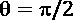
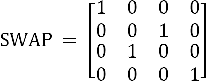

# 第六章：*第六章*：理解 Qiskit® 量子门库

在本章中，我们将探索 Qiskit® 提供的量子门。通过包含一个具有最常见门的量子门库，Qiskit® 使编写电路变得容易。

我们将要探讨的门中包括用于基本量子比特翻转的泡利 X、Y 和 Z 门，用于创建量子比特叠加的 H（或哈达玛）门，以及用于创建量子纠缠的 CX（控制非）门。为了快速复习，请查看 *第四章*，*从 Terra 的基础开始*。

我们还将探讨专门的 S 和 T 门，使用 R 门旋转我们的量子比特，然后展示如何仅使用最小的一组 U1、U2、U3、ID 和 CX 基础门来转换其他门，以便直接在量子计算机上使用。

我们将简要介绍多量子比特门，并最终以对 Qiskit® 程序中我们串出的简单门如何被编译器转换成更复杂的基门集的简要了解来结束我们的参观，这样我们才能在真实的量子计算机上运行它们。

在本章中，我们将涵盖以下内容：

+   可视化量子门

+   使用泡利 X、Y 和 Z 门进行翻转

+   使用 H 门创建叠加态

+   使用相位移位门 S、S†、T 和 T† 进行固定的 Z 旋转

+   使用 Rx、Ry 和 Rz 在轴周围进行自由旋转

+   使用基础门 – U1、U2、U3 和 ID 构建我们的电路

+   在 2 个量子比特上使用门

+   在超过 2 个量子比特上使用门

+   你的量子电路真正看起来是什么样子

在这些菜谱中，你将接触到量子门单位矩阵和量子比特状态向量，这些我们在 *第二章*，*使用 Python 进行量子计算和量子比特*中的“快速介绍量子门”菜谱中从数学上进行了讨论。如有需要，请随时返回并再次测试数学。

# 技术要求

本章中讨论的量子程序可以在以下链接找到：[`github.com/PacktPublishing/Quantum-Computing-in-Practice-with-Qiskit-and-IBM-Quantum-Experience/tree/master/Chapter06`](https://github.com/PacktPublishing/Quantum-Computing-in-Practice-with-Qiskit-and-IBM-Quantum-Experience/tree/master/Chapter06)。

# 可视化量子门

为了帮助我们理解量子门，我们可以使用 `ch6_r1_quantum_gate_ui.py` 示例程序。

这个菜谱与我们所看到的略有不同。到目前为止，我们主要只是在 Python 包装器内使用 Qiskit® 命令，没有进行任何实际的编码。这次，我们首先构建了一个基本的 Python 实现，以创建一个非常基本的 *门探索前后界面*。当你运行程序时，它会提示你选择一个初始量子比特状态和一个要应用于量子比特的门；然后它创建一个可视化来显示门对量子比特的作用。

脚本为您构建电路，然后显示支持门、状态向量和对应于门操作的布洛赫球或 Q 球可视化的基本最小电路。可视化突出显示了门之前量子比特的状态以及门之后状态的变化。

混合经典/量子程序

因此，我们在这里做的是构建一个混合经典/量子程序，其中我们使用 Python 来驱动用户输入控制、通用逻辑和展示，并使用 Qiskit®组件来访问量子相关功能。这就是我们在接下来的章节中将要做的事情。

## 准备工作

在我们进入可视化器之前，让我们花一点时间讨论一些基本的量子比特状态，我们可以用这些状态初始化我们的量子比特。你们很熟悉其中两个（ 和 ），但为了理解我们的量子比特状态向量在布洛赫球上的指向，这里快速介绍一下其余的状态，包括它们的狄拉克矢量描述和布洛赫球参考：

+   ：沿 *z* 轴直接向上

+   ：沿 *z* 轴直接向下

+   ：沿 + *x* 轴向外延伸

+   ：沿 - *x* 轴向内延伸

+   ：沿 + *y* 轴向右延伸

+   ：沿 - *y* 轴向左延伸


图 6.1 – 布洛赫球上映射的初始量子比特状态

在本食谱中，我们将探索几个有趣的 Qiskit®功能：

+   `qiskit.visualization` 类包含各种方法来可视化您的量子比特和电路。在本食谱中，我们将使用以下方法：

    **布洛赫球**：显示单个量子比特作为布洛赫球：

    ```py
    plot_bloch_multivector(state_vector)
    ```

    **Q 球**：在球面上显示 1 个或多个量子比特作为状态概率向量：

    ```py
    plot_state_qsphere(state_vector)
    ```

+   **初始化**：用于将量子比特初始化到特定的初始状态：

    ```py
    circuit.initialize(initial_vector,qubit)
    ```

+   **状态向量模拟器**：一个 **Aer** 量子模拟器，用于计算量子比特的状态向量：

    ```py
    Aer.get_backend('statevector_simulator')
    ```

+   **单元模拟器**：一个 **Aer** 量子模拟器，允许您计算量子电路的单元矩阵。如果您在只包含单个门的电路上使用此模拟器，本质上可以提取该量子门的矩阵表示：

    ```py
    Aer.get_backend('unitary_simulator')
    ```

+   `QuantumCircuit.from_qasm_str(qasm_string)` 方法，我们在*第三章*的“在两个世界之间移动”食谱中进行了探索，*IBM Quantum® 经验 – 拖放量子计算*。

示例程序的代码在此处可用：[`github.com/PacktPublishing/Quantum-Computing-in-Practice-with-Qiskit-and-IBM-Quantum-Experience/blob/master/Chapter06/ch6_r1_quantum_qate_ui.py`](https://github.com/PacktPublishing/Quantum-Computing-in-Practice-with-Qiskit-and-IBM-Quantum-Experience/blob/master/Chapter06/ch6_r1_quantum_qate_ui.py)。

## 如何做到这一点...

示例程序稍微有些复杂，但运行起来很简单。每个步骤都通过选择起始状态和门或简单的 *Hit Enter*（在下一步开始之前）之间的输入步骤来分隔：

1.  在您的 Python 环境中运行 `ch6_r1_quantum_gate_ui.py` 示例文件。

    在第一次提示时，输入您第一个量子比特的起始状态。如果您选择使用超过 1 个量子比特的门，例如 CX 门，则您在此处选择的量子比特状态是用于控制量子比特的。您的选项如下：

    

    ```py
    # List our start states
    start_states=["1","+","-","R","L","r","d"]
    valid_start=["0"]+start_states
    ```

1.  在第二次提示时，输入您想要探索的门，例如 `X`：

    

    ```py
    # List our gates
    rot_gates=["rx","ry","rz"]
    unitary_gates=["u1","u2","u3"]
    single_gates=["id","x","y","z","t","tdg","s","sdg","h"]
        +rot_gates
    oneq_gates=single_gates+unitary_gates
    control_gates=["cx","cy","cz","ch"]
    twoq_gates=control_gates+["swap"]
    all_gates=oneq_gates+twoq_gates+rot_gates+unitary_gates
    ```

    现在程序使用从空白电路上的示例代码中获取的 `get unitary()` 函数来检索并打印您所选门的单位矩阵。

    对于 X 门，输出将类似于以下内容：

    

    图 6.4 – 第一次输出：门的单位矩阵

    将此与我们在 *第二章* 中计算的 X 门的矩阵版本进行比较，*使用 Python 进行量子计算和量子比特*：

    

    我们现在已准备好程序的精华部分。

1.  按 *Enter* 键以创建初始设置。

    程序调用 `qgate(gate,start)` 函数根据您的输入设置电路。它使用 `create_circuit(n_qubits,start)` 与门输入一起设置 1 个量子比特或 2 个量子比特的电路，然后使用 `qgate_out(circuit,start)` 函数显示空电路。在此阶段，电路将仅包括一个设置为所选起始状态的 `initialized` 量子比特，如果输入状态是 ，则我们根本不需要初始化电路。

    `initialize()` 方法接受一个复数振幅向量和目标量子比特作为输入，并添加一个看起来很像门的电路指令。复数振幅必须是归一化的，在程序中，我们使用以下方式创建向量：`[a * complex(1, 0), b * complex(1, 0)]`。

    输出应该类似于以下内容：

    

    

    图 6.5 – 第二次输出：初始电路、状态向量和 Bloch 球

1.  再次按 *Enter* 键以添加您所选的门并显示门应用后的最终结果。

    调用 `qgate(gate,start)` 函数的最终结果是返回完整的电路。我们现在使用 `qgate_out(circuit,start)` 函数来显示在应用门之后的最终结果。

    这是 X 门作用于初始化为  的量子比特的预期输出：


图 6.6 – 第三个输出：门后的电路、状态矢量和布洛赫球体

初始运行的结果是量子比特从  状态开始，指向正上方，然后通过 X 门翻转至 ，指向正下方。

## 它是如何工作的...

在程序中，我们定义了几个运行程序 Qiskit®特定功能的函数：

+   `get_psi(circuit)`: 这是我们之前在*第四章*中介绍的函数，*从 Terra 开始脚踏实地*，略有变化。我们不是用它直接绘制布洛赫矢量，而是设置它返回状态矢量，这样我们就可以在其他地方使用它。该函数接受一个量子电路作为输入，并使用 Qiskit Aer 提供的`statevector_simulator`后端返回该电路的状态矢量：

    ```py
    def get_psi(circuit):
        global psi
        backend = Aer.get_backend('statevector_simulator') 
        result = execute(circuit, backend).result()
        psi = result.get_statevector(circuit)
        return(psi)
    ```

+   `get_unitary(circuit)`: 这个函数接受一个量子电路作为输入，并使用 Aer 后端中的`unitary_simulator`返回该电路的单位矩阵：

    ```py
    def get_unitary(circuit):
        simulator = Aer.get_backend('unitary_simulator')
        result = execute(circuit, simulator).result()
        unitary = result.get_unitary(circuit)  
        return(unitary)  
    ```

+   `create_circuit(n_qubits,start)`: 这个函数创建一个量子电路并将其初始化为所选的起始状态。

    我们首先根据用户输入设置起始向量：`1`，`+`，`-`，`R`，`L`，`r`或`d`：

    ```py
    def create_circuit(n_qubits,start):
        if start=="1":
            initial_vector = [0,complex(1,0)]
        elif start=="+":
            # Create |+> state
            initial_vector = [1/sqrt(2) * complex(1, 0),             1/sqrt(2) * complex(1, 0)]
        elif start=="-":
            # Create |-> state
            initial_vector = [1/sqrt(2) * complex(1, 0),             -1/sqrt(2) * complex(1, 0)]
        elif start=="R":
            # Create  state
            initial_vector = [1/sqrt(2) * complex(1, 0),            1*1.j/sqrt(2) * complex(1, 0)]
        elif start=="L":
            # Create  state
            initial_vector = [1/sqrt(2) * complex(1, 0),            -1*1.j/sqrt(2) * complex(1, 0)]
        elif start=="r":
            # Create random initial vector
            theta=random.random()*pi
            phi=random.random()*2*pi
            a = cos(theta/2)
            b = cmath.exp(phi*1j)*sin(theta/2)
            initial_vector = [a * complex(1, 0),            b * complex(1, 0)]
        elif start=="d":
            a = cos(start_theta/2)
            b = cmath.exp(start_phi*1j)*sin(start_theta/2)
            initial_vector = [a * complex(1, 0),            b * complex(1, 0)]
        else:
            initial_vector = [complex(1,0),0]
        if start!="n":
            print("\nInitial vector for |"+start+"\u232A:")
            print(np.around(initial_vector, decimals = 3))   
    ```

    然后，我们为指定的量子比特数量创建电路，并在起始状态不是  的情况下初始化量子比特：

    ```py
        circuit = QuantumCircuit(n_qubits)
        if start in start_states:
            circuit.initialize(initial_vector,n_qubits-1)
        return(circuit)
    ```

+   `qgate_out(circuit,start)`: 此外，我们还使用`print`功能与一些 Qiskit®方法一起创建和保存我们电路和量子比特的布洛赫球表示的图像：

    ```py
    def qgate_out(circuit,start):
        # Print the circuit
        psi=get_psi(circuit)
        if start!="n":
            print("\nCircuit:")
            print("--------")
            print(circuit)
            print("\nState vector:")
            print("-------------")
            print(np.around(psi, decimals = 3))
            display(plot_bloch_multivector(psi))
            if circuit.num_qubits>1 and gate 
                in control_gates:
                display(plot_state_qsphere(psi))
        return(psi)
    ```

+   `qgate(gate,start)`: 这个函数接受一个门和一个起始状态作为输入，然后从这些输入创建一个量子电路。对于单量子比特门，门被添加到第一个量子比特上，而对于双量子比特门，第二个量子比特是控制量子比特，第一个量子比特是被控制量子比特。

    然后它将输入门与`oneq_gates`列表进行比较，并立即调用`create_circuit()`函数来创建一个 1 量子比特或 2 量子比特电路。在此阶段，我们还创建了正确的 1 量子比特或 2 量子比特 QASM 字符串，我们使用`from_qasm_str()`方法将其附加到电路中，该方法我们在*第三章*的*在两个世界之间移动*食谱中开始探讨，*IBM Quantum Experience® – 量子拖放*。幸运的是，我们门的 QASM 代码与门名一一对应。要添加`x`门，我们使用以下命令：

    ```py
    circuit+=QuantumCircuit.from_qasm_str(qasm_string+gate+"    q[0];")
    ```

    字符串加法在`from_qasm_string()`命令中：

    ```py
    qasm_string+gate+" q[0];" 
    ```

    这转化为以下代码，并将`x`门添加到电路中：

    ```py
    OPENQASM 2.0; include "qelib1.inc"; 
    qreg q[1];
    x q[0];
    ```

    `qgate()`函数然后返回电路，我们可以继续：

    ```py
    def qgate(gate,start): 
        # If the gates require angles, add those to the QASM
        # code
        qasm_angle_gates={"rx":"rx("+str(theta)+") q[0];",        "ry":"ry("+str(theta)+") q[0];",
            "rz":"rz("+str(phi)+") q[0];",        "u1":"u1("+str(phi)+") q[0];",        "u2":"u2("+str(phi)+",
            "+str(lam)+") q[0];", 
            "u3":"u3("+str(theta)+",
            "+str(phi)+","+str(lam)+") q[0];"}
        # Create the circuits and then add the gate using 
        # QASM import 
        if gate in oneq_gates:
            circuit=create_circuit(1,start)
            qasm_string='OPENQASM 2.0; include "qelib1.inc";
                qreg q[1];'
        else: 
            circuit=create_circuit(2,start)
            qasm_string='OPENQASM 2.0; include "qelib1.inc";            qreg q[2];'
        qgate_out(circuit,start)    
        if gate in oneq_gates:
            if gate in rot_gates+unitary_gates:
                circuit+=QuantumCircuit.from_qasm_str(
                    qasm_string+qasm_angle_gates[gate])
            else:
                circuit+=QuantumCircuit.from_qasm_str(
                    qasm_string+gate+" q[0];")
        else:
            circuit+=QuantumCircuit.from_qasm_str(
                qasm_string+gate+" q[1],q[0];")   
        return(circuit)
    ```

因此，现在您拥有了一个小程序，可以设置非常基本的单门电路，研究初始和最终状态向量，查看所选门的单位矩阵，并查看门如何使 Bloch 向量移动，并在**Q-sphere**上可视化，其中**Bloch 球**不再足够。

现在通过完成本章剩余的食谱来尝试这个程序，以探索 Qiskit®提供的量子门的基本集合。

## 参见

要快速直观地查看单量子比特的 Bloch 球表示以及某些门操作对其的影响，请查看 Qiskit 倡导者詹姆斯·韦弗的**grok-bloch**应用程序：[`github.com/JavaFXpert/grok-bloch`](https://github.com/JavaFXpert/grok-bloch)。您可以从自己的 Python 环境中安装并运行它，或者在此处在线运行：[`javafxpert.github.io/grok-bloch/`](https://javafxpert.github.io/grok-bloch/)。

# 使用 Pauli X、Y 和 Z 门翻转

Pauli X、Y 和 Z 门都作用于单个量子比特，并执行类似于经典 NOT 门的作用，翻转经典比特的值。例如，X 门将发送到，反之亦然。

正如我们将要看到的，X 门实际上是在弧度下围绕*x*轴的旋转。对于 Pauli Y 和 Z 门也是如此，但沿着*y*和*z*轴相应地旋转。

从数学上讲，X、Y 和 Z 门可以用以下单位矩阵表示：

  

这个食谱将作为如何使用章节中提供的示例代码的模板。其余的食谱将主要概述更深入的细节。

让我们通过运行量子门 UI 示例程序来查看 Pauli X、Y 和 Z 门。程序首先设置一个简单的量子电路，其中包含一个从您选择的态开始的单一量子比特。然后，将选定的门添加到电路中，然后运行单位模拟器和状态向量模拟器，以显示以量子比特状态向量和门单位矩阵形式的结果。

示例脚本可在以下位置找到：[`github.com/PacktPublishing/Quantum-Computing-in-Practice-with-Qiskit-and-IBM-Quantum-Experience/blob/master/Chapter06/ch6_r1_quantum_qate_ui.py`](https://github.com/PacktPublishing/Quantum-Computing-in-Practice-with-Qiskit-and-IBM-Quantum-Experience/blob/master/Chapter06/ch6_r1_quantum_qate_ui.py)。

## 如何操作...

1.  运行`ch6_r1_quantum_gate_ui.py`示例程序。

1.  选择您的量子比特的起始状态。

    X 和 Y 门与和配合良好，本质上充当 NOT 门。

    在)的情况下，X 门将不执行任何操作，但 Y 和 Z 门将创建一个的相移，创建。

    还要测试和以查看它们的作用。如果您使用**r**（**随机**）或**d**（**定义**）输入，那么您可以更详细地探索门旋转。

1.  当提示时，输入`x`、`y`或`z`以选择要测试的门。

    我们在*可视化量子门*菜谱中测试了 X 门。现在来看看其他的。

    随机起始状态的 Z 门可能会产生以下输出：


图 6.7 – 随机起始状态的 Z 门

## 更多...

Pauli 门不能直接在量子后端上运行，但在你运行程序之前会自动转换为以下单位基门：

```py
x(qubit) = u3(3.141,0,3.141,qubit)
y(qubit) = u3(3.141,1.571,1.571,qubit)
z(qubit) = u1(3.141,qubit)
```

更多信息，请参阅本章中的*使用基本门构建我们的电路 – U1、U2、U3 和 ID*和*你的量子电路真正看起来是什么样子*菜谱。

# 使用 H 门创建叠加

现在，让我们回顾一下我们的老朋友*第四章*，*从 Terra 的起点开始*，**Hadamard**或**H**门。这是一个相当专业的门，我们可以用它来创建一个通用的量子比特叠加。但不仅如此；我们还可以利用 H 门来改变测量轴，从通用的*z*（或计算）轴变为*x*轴，以获得对量子比特行为的更深入了解。更多内容请参阅*更多内容*部分。

H 门可以用以下单位矩阵表示：


除非你非常擅长解释矩阵运算，否则这个门会对你的量子比特做什么可能并不完全清楚。如果我们将其描述为两个量子比特旋转的组合，事情可能会变得清晰起来。当你对你的量子比特应用 Hadamard 门时，你让它经历两个旋转：首先是一个围绕*y*轴的旋转，然后是一个围绕*x*轴的旋转。

对于处于状态的量子比特，这意味着我们从一个北极开始，然后下降到赤道，最终到达布洛赫球上的位置，最后围绕*x*轴旋转。同样，如果您从南极开始，您首先上升到赤道，但在*x*轴的另一端，最终到达。

如果我们对进行矩阵运算，我们得到以下结果：


现在我们可以使用以下狄拉克矢量表示法：


如果我们将*a*和*b*替换为上面的，我们得到和，这对应于。

如果我们将哈达玛门应用于处于纯  和  以外的量子比特状态，我们将量子比特旋转到新的位置。

示例脚本可在以下链接找到：[`github.com/PacktPublishing/Quantum-Computing-in-Practice-with-Qiskit-and-IBM-Quantum-Experience/blob/master/Chapter06/ch6_r1_quantum_qate_ui.py`](https://github.com/PacktPublishing/Quantum-Computing-in-Practice-with-Qiskit-and-IBM-Quantum-Experience/blob/master/Chapter06/ch6_r1_quantum_qate_ui.py)。

## 如何操作...

要探索哈达玛门，我们运行了在 *可视化量子门* 食谱中描述的量子门程序：

1.  运行 `ch6_r1_quantum_gate_ui.py` 示例程序。

1.  为你的量子比特选择一个起始状态。

    H 门与  和  配合良好，将你置于赤道上的等概率叠加状态。使用  和 ，H 门将等概率叠加返回到相应的计算状态， 和 。尝试使用 、、随机或定义输入来更详细地探索门旋转。

1.  当提示时，输入 *h* 选择要测试的门。将 H 门应用于  将产生以下输出：

![图 6.8 – 以 |0> 为起始状态的 H 门]


图 6.8 – 以 |0> 为起始状态的 H 门

## 还有更多...

哈达玛门不能直接在量子后端运行，但在你运行程序之前，会自动编译成以下单位算子基门：

```py
h(qubit)=u2(0,3.141,qubit)
```

如需更多信息，请参阅本章中的 *使用基本门构建我们的电路 – U1、U2、U3 和 ID* 以及 *你的量子电路真正看起来是什么样子* 两个食谱。

哈达玛门通常也用于将你的测量轴从默认（计算）*z* 轴更改为 *x* 轴。通过沿 *x* 轴测量，你可以检测量子比特的相位。

为了确定相位的值，你必须进行一次额外的测量，这次是沿 *y* 轴。为此，你使用哈达玛门与 S dagger 门结合，以将量子比特移动到 Y 轴。

你可以通过想象我们将量子比特旋转以匹配我们想要测量的轴，然后进行标准的 Z 轴测量来可视化测量基的变化。当我们沿 *x* 轴测量时，我们将量子比特旋转到面向  方向，而对于 *y* 轴，则指向  方向。

这里是需要应用于测量三个玻尔球体轴的门的组合：

**沿 z 轴测量（计算基）：**


图 6.9 - 沿 z 轴测量

**沿 x 轴测量：**


图 6.10 - 沿 x 轴测量

**沿 y 轴测量：**


图 6.11 - 沿 y 轴测量

## 参见

有关沿不同轴测量量子比特相位的示例，请参阅 *第九章* 的 *探索量子相位回冲* 菜谱 [*第九章*，*Grover 的搜索算法*]。

# 固定 z 轴旋转与相位移位门 S、![img/Formula_06_0681.png]、T 和 ![img/Formula_06_0691.png]

S、![img/Formula_06_070.png]、T 和 ![img/Formula_06_071.png] 门都在量子比特的 *z* 轴周围进行旋转。这意味着当你测量量子比特时，测量结果为 1 或 0 的概率不会发生变化。发生变化的是量子比特的相位。

S 门和 T 门不是它们自己的逆

由于 S 门和 T 门在 *z* 轴周围进行固定旋转，它们是不可逆的。连续添加两个这样的门不会取消它们。相反，Qiskit 包含 S† 和 T† 门，它们作为逆 S 和 T 门。为了快速回顾，请参阅 *第二章*，*使用 Python 进行量子计算和量子比特* 中的 *快速介绍量子门* 菜谱。

从数学上讲，S 门和 T 门可以表示为以下单位矩阵：

![img/Formula_06_072.png] ![img/Formula_06_073.png] ![img/Formula_06_074.png] ![img/Formula_06_075.png]

示例脚本可在以下位置获取：[`github.com/PacktPublishing/Quantum-Computing-in-Practice-with-Qiskit-and-IBM-Quantum-Experience/blob/master/Chapter06/ch6_r1_quantum_qate_ui.py`](https://github.com/PacktPublishing/Quantum-Computing-in-Practice-with-Qiskit-and-IBM-Quantum-Experience/blob/master/Chapter06/ch6_r1_quantum_qate_ui.py)。

## 如何做到...

要探索相位移位门，我们运行了在 *可视化量子门* 菜谱中描述的量子门 UI 程序：

1.  运行 `ch6_r1_quantum_gate_ui.py` 示例程序。

1.  为您的量子比特选择一个起始状态。

    由于这些相位移位门在 *z* 轴周围进行旋转，因此使用默认的 ![img/Formula_06_0221.png] 或 ![img/Formula_06_023.png] 量子比特几乎没有意义，这些量子比特是无相的。相反，选择一个叠加态量子比特，例如 **+**、**-**、**L**、**R**、**r** 或 **d**。

1.  当提示时，输入 `s`、`sdg`、`t` 或 `tdg` 以选择要测试的门。![img/Formula_06_078.png] 上的 S 门应产生以下输出：

图 6.12 – 具有起始状态 ![img/Formula_06_079.png] 的 S 门

## 更多...

相位移位门不能直接在量子后端上运行，但在你运行程序之前会自动编译成以下单位基门：

```py
s(qubit) = u1(1.570,qubit)
sdg(qubit) = u1(-1.570,qubit)
t(qubit) = u1(0.785,qubit)
tdg(qubit) = u1(-0.785,qubit)
```

更多信息，请参阅本章的 *使用基本门构建我们的电路 – U1、U2、U3 和 ID* 和 *你的量子电路真正看起来是什么样子* 菜谱。

# 在轴周围进行自由旋转的 Rx、Ry 和 Rz

虽然所有相移门都围绕 *z* 轴旋转以改变量子比特的相位，但旋转门在布洛赫球的相应轴周围进行旋转。Rx 和 Ry 在相位角 () 0 和  处旋转量子比特  角度，而 Rz 围绕 Z 旋转，特殊情况为  和 ，对应于 S 和 T 门。

R 门不是它们自己的逆

由于 R 门在 X、Y 或 Z 轴周围执行自由旋转，它们是不可逆的。连续添加两个这样的门不会抵消它们。为了快速回顾，请参阅*第二章*中的*快速介绍量子门*菜谱，*使用 Python 进行量子计算和量子比特*。

从数学上讲，R 门可以用单位矩阵表示：


样本脚本可在以下位置获取：[`github.com/PacktPublishing/Quantum-Computing-in-Practice-with-Qiskit-and-IBM-Quantum-Experience/blob/master/Chapter06/ch6_r1_quantum_qate_ui.py`](https://github.com/PacktPublishing/Quantum-Computing-in-Practice-with-Qiskit-and-IBM-Quantum-Experience/blob/master/Chapter06/ch6_r1_quantum_qate_ui.py)。

## 如何做到...

要探索相移门，我们运行了在*可视化量子门*菜谱中描述的量子门程序：

1.  运行 `ch6_r1_quantum_gate_ui.py` 样本程序。

1.  为你的量子比特选择一个起始状态。

    R 门在相应的轴周围执行任意旋转。

    由于所有这些门都在相应的轴周围进行旋转，请玩转  以获得对旋转位置的感觉。然后使用随机或定义来测试，以探索更多奇特的旋转。

1.  当提示时，输入 `rx`、`ry` 或 `rz` 以选择要测试的门。

1.  输入旋转的角度 ()。设置为  旋转的 Rx 门在  上，应该产生以下输出：

图 6.13 – Rx 门以  角度与  起始状态旋转

现在，再次使用不同的旋转角度进行测试，通过输入以下值来观察  和/或  角度的行为：


## 更多内容...

保罗门不能直接在量子后端上运行，但在你运行程序之前会自动编译成以下单位基门：

```py
rx(,qubit) = u3(,-1.507,1.507,qubit)
ry(,qubit) = u3(,0,0,qubit)
rz(,qubit) = u1(,qubit)
```

更多信息，请参阅本章中的*使用基门构建我们的电路 – U1、U2、U3 和 ID*和*你的量子电路真正看起来是什么样子*菜谱。

# 使用基门构建我们的电路 – U1、U2、U3 和 ID

让我们从探索我们在 *第五章* 中认识的三个门开始，*使用 Qiskit® 探索 IBM Quantum® 硬件*。你不会在你的量子程序中使用这三个基础门，U1、U2 和 U3，但是当你在量子计算机上运行电路时，它们作为所有其他单量子比特门的构建块。实际上，每个其他单量子比特门都可以只用 U3 门来表示。没有明确阻止你使用它们，但我们在后续食谱中将要介绍的门集合涵盖了我们需要的所有内容。

U 门不是它们自己的逆

由于 U 门在 *x*、*y* 和 *z* 轴周围进行自由旋转，它们通常是不可逆的。连续添加两个这样的门不会取消它们，除非旋转的总和是完整的旋转。为了快速回顾，请参阅 *第二章* 中的 *A quick introduction to quantum gates* 食谱，*使用 Python 进行量子计算和量子比特*。

如果你还记得我们在 *第五章* 中探索 IBM Quantum® 后端时的情况，*使用 Qiskit® 探索 IBM Quantum® 硬件*，我们使用以下命令查看硬件后端可用的所谓 **基础门**：

```py
backend.configuration().basis_gates
```

返回的结果如下：

```py
['u1', 'u2', 'u3', 'cx', 'id']
```

CX 和 ID 门是你在程序中使用的普通门，UX（受控非）用于创建纠缠，ID 用于运行一个不改变量子比特状态的门（关于这些内容稍后会有更多介绍）。U1、U2 和 U3 门则有所不同。

记得从 *第二章* 中，*使用 Python 进行量子计算和量子比特*，我们如何将量子门视为在  和  角度周围的旋转。这正是 U 门所做的事情，分别有一个、两个和三个输入。实际上，单量子比特 U 门旋转和 CNOT 门构成了量子计算的通用门集。在这里，Id 门是旋转的特殊情况，完全没有旋转。

基础门的关键在于，你可以直接在硬件上使用它们来编程你的量子比特。所有其他门都会被转换为基础门，然后按照你将在讨论编译器时看到的方式执行。

## U3 门

U3 门实际上是量子门的瑞士军刀。它是量子比特操作的基单位矩阵。可以完成的每个单量子比特操作都可以使用 U3 门来完成，它可以表示为以下单位矩阵：


三个角度如下：

+    = 与状态向量之间的极角 

+    = 从 *x* 轴的纵向角度 ()

+    = 量子比特的总相位角（在 Bloch 球上不可见）

U2 门和 U1 门基本上是 U3 门的专业化，就像其他量子门是 U 门的一般专业化一样。

## U2 门

使用 U2 门，您可以同时操作两个角度。U2 门与具有的 U3 门相同。

U2 门可以用以下单位矩阵表示：


## U1 门

使用 U1 门，您可以在*z*轴周围旋转量子比特的相位。U1 的一个特殊情况是 Rz 门，它具有相同的输入。U1 门与具有和的 U3 门相同。

U1 门可以用以下单位矩阵表示：


使用这三个门，您可以执行所有可能的单量子比特操作。它们在阅读上并不那么用户友好，因此 Qiskit®包括所有相关量子门的翻译，以方便您的编程。然而，当您运行电路时，所有门都被翻译成所选后端支持的基门集合。

Pauli Id 门是一种特殊的门，它使量子比特保持其原始状态。该门可以用以下矩阵表示：

 = .

## 准备工作

示例程序的代码在此处可用：[`github.com/PacktPublishing/Quantum-Computing-in-Practice-with-Qiskit-and-IBM-Quantum-Experience/blob/master/Chapter06/ch6_r2_u_animation.py`](https://github.com/PacktPublishing/Quantum-Computing-in-Practice-with-Qiskit-and-IBM-Quantum-Experience/blob/master/Chapter06/ch6_r2_u_animation.py).

在这个菜谱中，我们使用 Pillow 包来创建、保存和合并图像。有关 Pillow 的更多信息，请参阅[`pypi.org/project/Pillow/`](https://pypi.org/project/Pillow/).

安装 Pillow

如果您需要在环境中安装 Pillow，可以使用以下命令：

`(环境名称) … $ pip install --upgrade pip`

`(环境名称) … $ pip install --upgrade Pillow`

## 如何操作...

在这个菜谱中，我们将可视化 U 门在 Bloch 球上的旋转。如您所知，我们可以使用`plot_bloch_multivector()`和`plot_state_qsphere()`方法来可视化我们的状态矢量的行为以及可能的输出。这两个方法都提供了在某一时刻量子比特和特定角度集的 U 门的静态视图。

在示例程序中，您输入 U 门的角输入，然后程序在 0 和给定分辨率的角度之间进行快照，并生成一个动画 GIF，显示量子比特状态矢量在 Bloch 球上的移动。

注意，这个动画并没有真正展示您应用门时量子比特矢量的移动方式，而是展示了如何使用 U 门将量子比特状态矢量定位到您想要的位置：

1.  首先，在你的 Python 环境中运行 `ch6_r2_u_animation.py` 脚本。

1.  在提示下，输入你想要测试的门类型，然后输入该门所需的输入角度。对于 U3 门，你的输入可能如下所示，对于 ：

    ```py
    Animating the U gates
    ---------------------
    Enter u3, u2, or u3:
    u3
    Enter :
    1.57
    Enter :
    3.14
    Enter :
    0
    Building animation...
    ```

    在后台，我们现在调用 `create_images()` 函数，该函数接收你提供的输入，然后迭代创建一系列电路，这些电路迭代应用你选择的 U 门，输入角度被分成更小的角度，这由 *steps* 参数决定。然后，每个电路通过我们在第一个菜谱“可视化量子门”中创建的 `get_psi()` 函数中的状态向量模拟器运行，并最终使用 `plot_bloch_multivector()` 和 `plot_state_qsphere()` 将其保存为 Bloch 球图像和 Q 球图像。这些图像持续追加到两个列表中，稍后将合并成动画。

    这就是我们构建函数的方法。

    首先，设置输入参数和所有内部函数变量：

    ```py
    def create_images(gate,theta=0.0,phi=0.0,lam=0.0):
        steps=20.0
        theta_steps=theta/steps
        phi_steps=phi/steps
        lam_steps=lam/steps
        n, theta,phi,lam=0,0.0,0.0,0.0
    ```

    然后创建图像和动画工具：

    ```py
        global q_images, b_images, q_filename, b_filename
        b_images=[]
        q_images=[]
        b_filename="animated_qubit"
        q_filename="animated_qsphere"
    ```

    最后，根据输入参数运行图像创建循环：

    ```py
        while n < steps+1:
            qc=QuantumCircuit(1)
            if gate=="u3":
                qc.u3(theta,phi,lam,0)
                title="U3: \u03B8 = "+str(round(theta,2))+"                \u03D5 = "+str(round(phi,2))+" \u03BB =                "+str(round(lam,2))
            elif gate=="u2":
                qc.u2(phi,lam,0)
                title="U2: \u03D5 = "+str(round(phi,2))+"                 \u03BB = "+str(round(lam,2))
            else:
                qc.h(0)
                qc.u1(phi,0)
                title="U1: \u03D5 = "+str(round(phi,2))
            # Get the statevector of the qubit 
            # Create Bloch sphere images
            plot_bloch_multivector(get_psi(qc),title).            savefig('images/bloch'+str(n)+'.png')
            imb = Image.open('images/bloch'+str(n)+'.png')
            b_images.append(imb)
            # Create Q-sphere images
            plot_state_qsphere(psi).savefig(
               'images/qsphere'+str(n)+'.png')
            imq = Image.open('images/qsphere'+str(n)+'.png')
            q_images.append(imq)
            # Rev our loop
            n+=1
            theta+=theta_steps
            phi+=phi_steps
            lam+=lam_steps
    ```

1.  创建并保存动画 GIF。

    最后一步是创建 GIF。在这里，我们使用 `save_gif(gate)` 函数迭代我们创建的图像列表，让 Pillow 使用我们的初始参数构建 GIF。这是我们所做的：

    ```py
    def save_gif(gate):
        duration=100
        b_images[0].save(gate+'_'+b_filename+'.gif',
                   save_all=True,
                   append_images=b_images[1:],
                   duration=duration,
                   loop=0)
        q_images[0].save(gate+'_'+q_filename+'.gif',
                   save_all=True,
                   append_images=q_images[1:],
                   duration=duration,
                   loop=0)
        print("Bloch sphere animation saved as: \n"+os.        getcwd()+"/"+gate+"_"+b_filename+".        gif"+"\nQsphere animation saved as: \n"+os.        getcwd()+"/"+gate+"_"+q_filename+".gif")
    ```

    最终的 Python 输出可能如下所示：

    ```py
    Bloch sphere animation saved as: 
    /<path_to_your_directory>/ch6/Recipes/u3_animated_qubit.gif
    Qsphere animation saved as: 
    /<path_to_your_directory>/ch6/Recipes/u3_animated_qsphere.gif
    ```

1.  最终结果将是两个保存在你运行脚本相同目录下的动画 GIF。

    现在，你可以在图像查看器或网页浏览器中打开 GIF，查看一下：

    

图 6.14 – 动画 GIF 的静态图像，展示 Bloch 球和 Q 球

如果你并排同步查看动画 GIF，Q 球表示法将显示在 U 门应用于其上的量子比特的相对概率和相位角。尝试不同的角度和不同的循环参数，看看你如何使动画为你所用。

如果你将角度设置在 0 到  的范围内，并将你的步骤设置为合理的较高数值，你可以创建出漂亮的平滑循环效果。尽管如此，你完全可以设置非常高的角度，这将导致动画中出现相当混乱的行为。祝您玩得开心！

当你使用脚本测试 U 门时，请记住以下几点：

+   U3 允许你使用两个角度， 和 ，将量子比特向量指向 Bloch 球上的任何位置。第三个角度，，对 Bloch 球表示没有影响。

+   U2 与 U3 相同，但将  设置为  ，这会将量子比特向量放置在赤道上。

+   U1 与 U3 相同，但将  和  都设置为 0。U1 的一个特殊情况是 Rz。

## 更多内容...

嗯，在这种情况下，是少而不是多。本菜谱中的示例脚本将在你的本地环境中工作，但在你的 IBM Quantum Experience® 笔记本环境中效果不佳，因为你无法访问底层文件系统。

# 在 2 个量子位上使用门

双量子位门，如控制门，与普通单量子位门略有不同；它们允许你在量子位之间创建交互。一般来说，这相当于使用一个量子位作为控制量子位，另一个作为作用量子位。从数学上来说，这并不特别复杂，但直观上你可能需要思考一两次才能理解正在发生的事情。

## 准备中

我们将要接触的第一个双量子位门是我们在 *第四章* 中看到的控制非门，*从 Terra 的基态开始*。CX 门通常用于在控制量子位处于叠加态时在量子位之间创建纠缠。

当控制量子位是第二个量子位，受控量子位是第一个量子位时，CX 门可以表示为以下矩阵：


这对应于以下电路：

![图 6.15 – CX 门从 q_1 到 q_0]


图 6.15 – 从 q_1 到 q_0 的 CX 门

解释这个方法的方式是运行第一个或控制量子位通过一个 Id 门，使其保持不变。第二个，或受控，量子位如果第一个量子位是 1，则应用一个 X 门。

这里有两个矩阵计算来演示：


在这里，第一个量子位是 1，第二个是 0。结果是两个量子位都是 1：


在这里，两个量子位都是 1。结果是第一个量子位是 1，第二个是 0。

CX 门是 IBM Quantum® 后端的基本门之一。

其他 CX 矩阵

如果 CX 门的方向相反，第一个量子位作为控制量子位，矩阵将看起来像这样：


为了让你确信，请进行计算。为了快速复习，请参阅 *第二章* 中的 *快速量子门简介* 菜谱，*使用 Python 进行量子计算和量子位*。

样本脚本可在以下网址获取：[`github.com/PacktPublishing/Quantum-Computing-in-Practice-with-Qiskit-and-IBM-Quantum-Experience/blob/master/Chapter06/ch6_r1_quantum_qate_ui.py`](https://github.com/PacktPublishing/Quantum-Computing-in-Practice-with-Qiskit-and-IBM-Quantum-Experience/blob/master/Chapter06/ch6_r1_quantum_qate_ui.py).

## 如何操作...

之前，对于单量子位门，量子门程序设置了一个只有一个量子位处于基态的简单量子电路 。当我们开始使用多量子位门时，程序将以两个量子位都处于  的状态初始化。然后，选定的门将在电路中运行，并以量子位状态向量和门单位矩阵的形式显示结果。

要探索控制门，我们运行了*可视化量子门*配方中描述的量子门程序：

1.  运行`ch6_r1_quantum_gate_ui.py`示例程序。

1.  为你的控制量子比特选择一个起始状态。

    Cn 门使用单个量子比特作为控制量子比特，其他量子比特作为受控量子比特。如果控制量子比特的状态不是，则会在受控量子比特上执行一些操作。

    如果你想的话，可以先使用进行测试——只是为了验证没有执行任何操作，并且 2 量子比特的状态没有改变。然后使用起始状态来创建贝尔态，就像我们在*第四章*中做的那样，*从 Terra 的起点开始*。完成这些后，尝试使用、随机或定义来探索其他控制状态。

1.  当提示时，输入`cx`、`cy`、`cz`或`ch`以选择要测试的门。例如，控制量子比特状态的 CX 门将生成以下输出：

图 6.16 – CX 门与起始状态|+>

在这里，请注意，在应用 CX 门之后，Bloch 球表示没有意义。量子比特现在是纠缠的，我们无法从它们那里获取更多的单个信息。在这种情况下，我们显示 Q 球解释以供说明，其中初始 Q 球表示得到状态和的概率相等，在 X 门之后，得到的概率相等，这是贝尔态所预期的。

## 它是如何工作的...

CX 门只是许多可能的二量子比特控制门之一。在 Qiskit®中内置的其他门还包括 CY 和 CZ 门：


或者为什么不试试受控 Hadamard 门？


另一个实用的 2 量子比特门是 SWAP 门，它交换第一个和第二个量子比特的值。在这种情况下，没有纠缠，单个量子比特保持独立：



## 更多...

双量子比特门也可以写成基门组合的形式。例如，这是如何编码 CY 门的：

```py
qc.u1(-1.507,0)
qc.cx(1,0)
qc.u1(1.507,0)
```

更多信息和测试转换其他 Cn 门，请参阅*你的量子电路真正看起来是什么样子*配方。

## 参见

《量子计算与量子信息》，第 10 周年纪念版，迈克尔·A·尼尔森与艾萨克·L·丘恩，*第 4.3 节受控操作*。

# 使用超过 2 个量子比特的门

除了单量子比特和双量子比特门之外，Qiskit® 还支持 3 个和更多量子比特的门。当我们构建第九章 *“Grover 搜索算法”* 中的 3 量子比特 Grover 搜索算法电路时，我们将使用其中之一，即 Toffoli 门。为了完整性，我们将包括 Fredkin 门，但不会在其他示例中使用它；请随意尝试。

本食谱中的多量子比特门分别使用 2、更多和 1 个控制量子比特：

+   **Toffoli**：受控受控非（**CCX**），它接受 2 个量子比特作为输入，如果两个控制量子比特都被设置，则翻转第三个量子比特。

+   **MCX**：多控制非接受多个量子比特（控制）作为输入，如果所有量子比特都被设置，则翻转受控量子比特。

    （原则上）你使用的控制量子比特的数量没有限制。在 4 个或更多量子比特的 Grover 搜索算法电路中 *第九章*，“Grover 搜索算法”，我们通过使用 **MCX** 门构建了一个 4 量子比特的 **CCCX** **受控受控受控** 门。

+   **Fredkin**：受控交换，(**CSWAP**)，它接受单个量子比特作为输入，如果控制量子比特被设置，则交换其他两个量子比特。

## 如何做到这一点...

在你的量子程序中，使用以下示例代码来实现这些 3 量子比特门。

### Toffoli

Toffoli 或 **CCX** 门由以下单位矩阵表示，其中第二个和第三个量子比特控制第一个量子比特：


以下代码实现了 CCX 门：

```py
from qiskit import QuantumCircuit
qc=QuantumCircuit(3)
qc.ccx(2,1,0)
print(qc)
```

电路看起来是这样的：


](img/Figure_6.17_B14436.jpg)

图 6.17 – Toffoli 门

其他 CCX 矩阵

就像 CX 门一样，矩阵将根据你应该使用哪些量子比特来控制而有所不同。例如，这里是一个 CCX 门，其中第一个和第二个量子比特控制第三个量子比特的矩阵：


为了说服自己，做一下计算。

### MCX

MCX 门用于构建具有一个以上控制门的通用受控非门。Toffoli（CCX）门是一个特殊例子，其中这是一个已经编码的门。对于具有超过 2 个控制量子比特的受控非门，你可以使用 MCX 门。

以下代码实现了 MCX 门作为 CCCX 门，其中第二个、第三个和第四个量子比特控制第一个量子比特：

```py
from qiskit import QuantumCircuit
qc=QuantumCircuit(4)
qc.mcx([1,2,3],0)
print(qc)
```

电路看起来是这样的：


图 6.18 – 3 个控制量子比特的 MCX 门（CCCX）

### Fredkin

Fredkin 或 **CSWAP** 门由以下单位矩阵表示，其中控制第三个量子比特交换第一个和第二个量子比特：


以下代码实现了 CSWAP 门：

```py
from qiskit import QuantumCircuit
qc=QuantumCircuit(3)
qc.cswap(2,1,0)
print(qc)
```

电路看起来是这样的：


](img/Figure_6.19_B14436.jpg)

图 6.19 – Fredkin 门

## 还有更多...

就像我们在本章中查看的其他门一样，Toffoli 和 Fredkin 门包含在 Qiskit® 的基本门集中。然而，它们不是基本门，这意味着它们需要使用一组基本门（如 **u1**、**u2**、**u3**、**id** 和 **cx**）重写。这被称为 **转换**，这是我们将在下一道菜谱“你的量子电路真正看起来是什么样子”中要做的。但在这里我们只是稍微提前了一点，展示了构建这些看似简单的门的复杂性。请尝试在下一道菜谱中尝试它们。

### 由基本门构建的 Toffoli

Toffoli 门可以在 Qiskit® 中作为一个单独的门输入，这让你相信门的执行将对应于 *单个时间步*，就像其他门一样：


图 6.20 – 由 10+ 个基本门构建的单个 Toffoli 门

当我们这样解开 CCX 时，我们看到事实略逊于仅仅一个时间步；单个门被转换成电路深度为 11。

### 由基本门构建的 Fredkin

与 Toffoli 门类似，当在硬件后端执行时，Fredkin 可能会被转换成大量基本门：


图 6.21 – 由 20+ 个基本门构建的单个 Fredkin 门

对于单个 Fredkin 门，电路深度从 1 到 22。在量子计算机上并非所有事情都容易做到。

# 你的量子电路真正看起来是什么样子

在 *第三章*，*IBM Quantum Experience® – Quantum Drag and Drop* 和 *第五章*，*使用 Qiskit® 探索 IBM Quantum® 硬件*，我们提到了 `u1`、`u2`、`u3`、`id` 和 `cx` 的概念。我们在本章前面的菜谱中讨论了这些门，甚至列出了其他门如何作为这些门的实现或组合。

在这道菜谱中，我们将探讨电路转换的其他一些方面，例如以下内容：

+   将常用门简单地转换为基本门

+   为模拟器进行转换

+   如果你的电路与后端物理布局不匹配，则进行电路转换

    单量子比特后端基本门

    大多数 IBM Quantum® 后端都有以下基本门：`u1`、`u2`、`u3`、`id` 和 `cx`。单量子比特后端（如 `ibmq_armonk`）不需要多量子比特门（如 CX），它不包括在内。如果你将后端设置为 `ibmq_armonk` 并运行以下命令，你将得到相应的输出：`>>> backend.configuration().basis_gates Out: ['id', 'u1', 'u2', 'u3']`。

当我们在 IBM 量子计算机上执行量子程序时，我们的代码首先被转换成我们可以在硬件上直接执行的核基本门（`u1`、`u2`、`u3`、`id` 和 `cx`）。

## 准备工作

下面的食谱中所需的文件可以从这里下载：[`github.com/PacktPublishing/Quantum-Computing-in-Practice-with-Qiskit-and-IBM-Quantum-Experience/blob/master/Chapter06/ch6_r3_transpiler.py`](https://github.com/PacktPublishing/Quantum-Computing-in-Practice-with-Qiskit-and-IBM-Quantum-Experience/blob/master/Chapter06/ch6_r3_transpiler.py)。

这就是我们构建 Python 示例的方法：

1.  首先，我们导入所需的类和方法，包括`transpile`：

    ```py
    from qiskit import QuantumCircuit, IBMQ
    from qiskit.compiler import transpile
    from qiskit.providers.ibmq import least_busy
    ```

    我们还加载了我们的账户（如果需要），并使用`5`个量子比特设置了一个后端：

    ```py
    if not IBMQ.active_account():
        IBMQ.load_account()
    provider = IBMQ.get_provider()
    backend = least_busy(provider.backends(n_qubits=5,    operational=True, simulator=False)) 
    ```

1.  让我们看看所选后端的基本门和耦合图。耦合图指定了双量子比特电路可能的量子比特连接：

    ```py
    print("Basis gates for:", backend)
    print(backend.configuration().basis_gates)
    print("Coupling map for:", backend)
    print(backend.configuration().coupling_map)
    ```

    上述代码应该产生类似于以下输出的结果：

    

    图 6.22 – 后端的基本门和 CX 耦合图

    对于单量子比特门的转换，耦合图并不重要。当我们编写使用双量子比特门的量子程序时，情况就不同了。

1.  然后，我们设置`build_circuit()`函数来创建一个基本电路，并根据我们想要探索的电路选择性地添加门：

    ```py
    def build_circuit(choice):
        # Create the circuit 
        qc = QuantumCircuit(5,5)

        if choice=="1":
            # Simple X
            qc.x(0)
        elif choice=="2":
            # H + Barrier
            #'''
            qc.x(0)
            qc.barrier(0)
            qc.h(0)
        elif choice=="3":
            # Controlled Y (CY)
            qc.cy(0,1)
        elif choice=="4":    
            # Non-conforming CX
            qc.cx(0,4)
        else:
            # Multi qubit circuit
            qc.h(0)
            qc.h(3)
            qc.cx(0,4)
            qc.cswap(3,1,2)
        # Show measurement targets
        #qc.barrier([0,1,2,3,4])
        #qc.measure([0,1,2,3,4],[0,1,2,3,4])
        return(qc)
    ```

1.  最后，我们设置了`main()`函数来运行电路。

    主函数提示输入要测试的电路，调用`build_circuit()`函数，使用`transpile()`类转换返回的电路，然后显示结果：

    ```py
    def main(): 
        choice="1"
        while choice !="0": 
            choice=input("Pick a circuit: 1\. Simple, 
                2\. H + Barrier, 3\. Controlled-Y, 
                4\. Non-conforming CX, 5\. Multi\n")
            qc=build_circuit(choice) 
            trans_qc = transpile(qc, backend)
            print("Circuit:")
            display(qc.draw())
            print("Transpiled circuit:")
            display(trans_qc.draw())
            print("Circuit depth:")
            print("---------------")
            print("Circuit:", qc.depth())
            print("Transpiled circuit:", trans_qc.depth())
            print("\nCircuit size:")
            print("---------------")
            print("Circuit:", qc.size())
            print("Transpiled circuit:", trans_qc.size())
    if __name__ == '__main__':
        main()
    ```

## 如何做到这一点...

让我们构建并转换一个简单的 X 电路：

1.  在你的 Python 环境中运行`ch6_r3_transpiler.py`。

1.  当提示时，输入`1`以选择`Simple` `X`电路：

    图 6.23 – 首先，选择 Simple X 电路

1.  这段代码应该产生类似于以下输出的结果：

    图 6.24 – 简单的单 X 门电路的输出

    结果电路看起来相当相似。唯一真正的变化是 X 门现在是一个 U3 门，即基本门之一。

1.  我们还可以通过提取电路及其转换电路的深度和大小来获得数值结果。

    这段代码应该产生以下电路深度和大小：


图 6.25 – 电路深度和大小

在这里，深度指的是量子计算机必须执行的端到端步骤的数量。每一步可能包括一个或多个门，具体取决于电路的布局。大小只是执行的总门数。

对于这个非常简单的电路转换，变化不大。U3 门执行围绕*x*轴所需的旋转，电路的深度和大小保持不变。技术上，你可以在代码中使用 U3 门而不是 X 门，但这样会不太透明。

为模拟器转换？

那么，如果你尝试为模拟后端转换你的电路会发生什么？实际上，模拟器包含的基门比硬件后端要多得多，因此转换会有所不同。为了测试这一点，只需在脚本中取消以下行的注释，将后端设置为模拟器，然后再次运行程序：

`backend = provider.get_backend('ibmq_qasm_simulator')`

`ibmq_qasm_simulator` 支持以下基门：

`['u1', 'u2', 'u3', 'cx', 'cz', 'id', 'x', 'y', 'z', 'h', 's', 'sdg', 't', 'tdg', 'ccx', 'swap', 'unitary', 'initialize', 'kraus']`

话虽如此，你可以在运行转换器时提供额外的参数，例如 `basis_gates` 和 `coupling_map`，以定义你想要使用的基门，并指定量子比特如何连接，以便在转换多量子比特门时使用。我们在这章中不会深入探讨这一点，但可以查看 Qiskit® 帮助以获取更多信息：

`>>> from qiskit.compiler import transpile`

`>>> help(transpile)`

现在看看 *还有更多* 部分，看看事情如何迅速变得更加复杂。

## 还有更多...

这个快速配方快速展示了转换器为非常简单的量子程序做了什么，并说明了转换器如何将你的通用电路转换为可以直接在量子芯片上执行的电路。

以下快速示例说明了如果要求转换器构建与后端物理布局完全不匹配的电路，可能会遇到哪些复杂性。你可以在示例代码中测试这些电路，看看你是否得到类似的结果。

运行示例代码时，测试以下输入：

### 添加 H 和 H + 障碍 – 多个门和障碍电路元件

单个门的转换并不会给转换器留下太多工作要做，但一旦你添加了更多的门，事情会迅速变得更加复杂。记住，量子门通常是围绕三个轴 *x*、*y* 和 *z* 的旋转。如果连续添加两个门，转换器会试图通过将多个门组合成单个基门来简化电路（从而使其更短；更浅）。

在示例代码中，我们在 X 门之后添加了一个 Hadamard 门来扩展量子电路：

```py
# Add H
qc.x(0)
qc.h(0)
```

当你现在运行电路时，你应该能看到类似这样的东西：


图 6.26 – 简化的转换电路

如您所见，编译器将两个门合并为一个，通过预览门组合的结果来简化并缩短电路，并将其编码为 U 门。然而，并不总是希望这种简化。例如，正如我们在*第二章*中“*快速介绍量子门*”配方中看到的，“*使用 Python 进行量子计算和量子比特*”，连续两个相同的量子门可能会有效地相互抵消。在某些情况下，量子电路最终可能由重复的门组成，如果移除这些重复的门，电路将无法按预期工作。

解决方案是`barrier()`电路组件，它阻止编译器通过合并门来简化。通过使用*H + Barrier*选项，我们在 X 门和 H 门之间添加一个障碍，如下所示：

```py
# H + Barrier
qc.x(0)
qc.barrier(0)
qc.h(0)
```

当您使用*H + Barrier*选项时，您应该看到类似以下内容：


图 6.27 – 编译器不会越过障碍

现在门是逐个编译的，电路深度得到了保留。所以，没问题，对吧？嗯，这些门相当简单。当我们稍微复杂化我们的电路时会发生什么？请看下一节。

### 控制 Y

**控制 X 门**（**CX**）是 IBM Quantum®后端的基门，但**控制 Y**（**CY**）不是。为了创建可以在后端运行的 CY 门，编译器添加了一些额外的基门。

通过使用*Controlled-Y*选项，我们添加一个`cy()`门，如下所示：

```py
# Controlled Y (CY)
qc.cy(0,1)
```

为了创建可以在后端运行的 CY 门，编译器添加了一些额外的基门：


图 6.28 – 编译 CY 门

这里编译器做了一个小技巧，在 CX 门中的 X 前后添加 Z 旋转。如果控制量子比特为 0，我们将在 z 轴周围来回旋转。如果控制量子比特为 1，我们得到 Z 轴的负四分之一旋转，X 轴的半转旋转，然后是 Z 轴的四分之一旋转，实际上相当于半转 Y 旋转。当然，Y 旋转可以用`Y(qubit)` `=` `U3(``,` `,` `,` `qubit)``轻松完成，但由于 CX 的控制功能不能附加到 Y 门上，我们不得不进行这种重做。

让我们看看一些其他示例。这些将说明编译器如何将看似简单的量子电路转换为可以在实际 IBM Quantum®硬件上运行的基门电路。

### 不符合规范的 CX

在这个例子中，我们在两个物理上未连接的量子比特之间设置了一个 CX 门。如您所见，CX 是一个基本门，因此这不应该需要任何转换，对吧？但是，在这种情况下，我们迫使转换器尝试在两个未直接连接的量子比特之间构建您的电路。在这种情况下，转换器必须将您的 CX 门映射到几个中间量子比特上，这将增加电路的复杂性。在我们的示例代码中，我们构建了这个电路：

```py
# Non-conforming CX
qc.cx(0,4)
```

使用不符合规定的 CX 输入运行示例代码应该产生类似于以下的结果：


图 6.29 – 在非连接量子比特之间转换 CX 门

注意这个简单的单 CX 电路突然膨胀到包含七个 CX 门。这不是最有效的编码示例。如果你查看我们正在进行转换的量子计算机的耦合图，即 IBM Quantum® Ourense，原因就一目了然。量子比特 4 不能直接与量子比特 0 通信，而必须先通过 3 和 1：


图 6.30 – IBM Quantum® 5 量子比特后端之一的物理布局

对于简单的电路，原始电路和转换电路之间没有太大差异；尝试将 CX 门从量子比特 0 连接到量子比特 1，看看你得到什么。但对于更复杂的电路，电路会迅速分化。

但等等！

对于那些像我自己一样仔细检查电路并思考如果量子比特 0 设置为 1 以触发 CX 会发生什么的挑剔者，您会注意到原始电路的结果应该是代码中的`barrier`和`measure`行，并再次运行：

```py
# Show measurement targets
qc.barrier([0,1,2,3,4])
qc.measure([0,1,2,3,4],[0,1,2,3,4])
```

这应该产生以下输出：


图 6.31 – 转换器也会移动测量指令

如您从新的映射中看到的那样，量子比特 1 和 3 现在被测量为经典比特 0 和 4，正如我们所期望的。最终的测量输出将是正确的。

### 多门 – 结合贝尔和 CSWAP 电路

最后这个例子说明了当你试图实现一个相对简单但路径有限的目标时，会出现的复杂性。我们正在创建量子比特 0 和 4 的贝尔态，并添加一个从量子比特 3 到量子比特 1 和 2 的控制-SWAP 门，以便这些量子比特交换值：

```py
# Multi qubit circuit
qc.h(0)
qc.h(3)
qc.cx(0,4)
qc.cswap(3,1,2)
```

多门输入应该给出以下结果：


图 6.32 – 一个相对简单的贝尔+CSWAP 电路的复杂转换

嗯，尝试这个相对简单的电路很快就变得糟糕起来。它的深度从 2 增加到 32。电路的大小也从最初的 4 个门增加到惊人的 43。看看所有那些 CX 门！


图 6.33 – 多门电路的深度和大小

再次，如果你看一下 *图 6.33*，你就可以看到为什么会发生这种情况。我们简单地连接量子位 0 和 4 在物理上是不可行的，因为量子芯片的布局。相反，这个连接需要通过量子位 1、2 和 3 的中间量子位连接链。这些额外的连接导致了单个门的数量激增。

现在尝试以下电路，看看这如何改变计数。你应该预期深度和大小都会显著缩小，因为你现在正在为可以直接相互通信的量子位编写代码。显然，在这个**噪声中等规模量子（NISQ）**时代，为你要运行的程序编写后端代码仍然很重要：


图 6.34 – 更好的符合要求的 Bell + CSWAP 电路

正如我们在本章中看到的，高质量的编程在量子计算中与在经典计算中一样重要，如果不是更重要。编译器会尽其所能将你的电路翻译到你计划运行的底层。

如果电路变得拥挤，并且你充分利用了所有的量子位，那么电路的重写可能会使执行时间超过 T1 和 T2 时间，即使电路本身构建得非常完美，在今天**NISQ 计算机**上也可能产生垃圾结果。

量子编程绝对是一门艺术！
