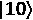
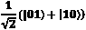
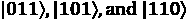
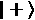

# *第七章*：使用 Aer 模拟量子计算机

到目前为止，我们主要在我们的本地 QASM 模拟器上运行我们的量子程序，它默认模拟了一个**通用纠错量子计算机**——量子计算界期望或至少希望在未来几年内成为现实的机器类型。

但这些令人惊叹的机器目前还不可用，因此在本章中，我们将探索量子模拟器，无论是在本地使用**Qiskit Aer**还是在云端的**IBM Quantum®**模拟器。我们将了解如何在这些模拟的完美后端上运行您的量子电路。

然而，您也可以通过为模拟器设置噪声配置文件来模拟今天的**有噪声的中规模量子**（**NISQ**）计算机，以模拟真实的 IBM Quantum®硬件，包括门错误和噪声。因此，我们也将探讨这一点。

我们还将探讨两种其他本地模拟器类型及其用途：**幺正模拟器**和**状态向量模拟器**。

在本章中，我们将介绍以下食谱：

+   理解量子模拟器的使用

+   比较 Qiskit Aer 模拟器和 IBM 量子计算机

+   将 IBM Quantum®后端的噪声配置文件添加到本地模拟器中

+   通过使用幺正模拟器理解您的电路

+   使用状态向量模拟器进行诊断

本章的目标是让您在开发和测试量子程序时能够使用模拟器，这样您就不必等待您的 IBM Quantum®后端运行测试。我们将首先探索`qasm_simulator`后端，然后查看幺正和状态向量模拟器。

# 技术要求

本章中我们讨论的量子程序可以在这里找到：[`github.com/PacktPublishing/Quantum-Computing-in-Practice-with-Qiskit-and-IBM-Quantum-Experience/tree/master/Chapter07`](https://github.com/PacktPublishing/Quantum-Computing-in-Practice-with-Qiskit-and-IBM-Quantum-Experience/tree/master/Chapter07)。

# 理解量子模拟器的使用

**量子计算机模拟器**是一种软件程序，它模拟真实量子计算机的量子力学行为。模拟器在您在云端的 IBM Quantum®后端运行之前，在本地环境中测试您的量子电路非常有用。您还可以使用基于云的模拟器来测试可能还无法在实际量子计算机上运行或运行时间太长的较大量子电路。

在这个食谱中，我们将快速浏览可用的 Qiskit®模拟器——无论是在本地的**Qiskit Aer**上还是在云端的**IBM Quantum®**上。

## 准备工作

确保您从*第一章*，“准备您的环境”中的一切都正常工作。

这个菜谱的示例代码可以在以下位置找到：[`github.com/PacktPublishing/Quantum-Computing-in-Practice-with-Qiskit-and-IBM-Quantum-Experience/blob/master/Chapter07/ch7_r1_aer.py`](https://github.com/PacktPublishing/Quantum-Computing-in-Practice-with-Qiskit-and-IBM-Quantum-Experience/blob/master/Chapter07/ch7_r1_aer.py)。

## 如何做...

让我们看看代码：

1.  如同往常，我们首先导入所需的类。我们导入`Aer`和`IBMQ`，因为我们将在本地和远程使用模拟器。如果需要，我们也会加载我们的账户并获取我们的提供商：

    ```py
    from qiskit import Aer, IBMQ
    if not IBMQ.active_account():
        IBMQ.load_account()
    provider = IBMQ.get_provider()
    ```

1.  然后，我们使用`backends()`方法查看可用的本地 Qiskit Aer 后端：

    ```py
    backends=Aer.backends()
    print("\nAer backends:\n\n",backends)
    ```

    之前的代码应该给出以下结果：

    

    图 7.1 – 本地 Aer 后端；所有模拟器

1.  我们可以将这些模拟器的配置细节存储在`simulators`列表中，以供进一步处理。使用`backend.configuration()`方法提取这些信息，并遍历可用的后端，将每个的数据添加到列表中：

    ```py
    simulators=[]
    for sim in range(0,len(backends)):
        backend = Aer.get_backend(str(backends[sim]))
        simulators.append(backend.configuration())
    ```

1.  为了完整性，我们将通过将信息附加到列表中为 IBM Quantum®模拟器添加配置细节：

    ```py
    ibmq_simulator=provider.backends(simulator=True)
    simulators.append(provider.get_backend(str(ibmq_simulator[0])). simulator[0])).configuration())
    ```

1.  显示原始模拟器配置细节。让我们遍历`simulators`列表，打印并查看我们模拟器的可用配置细节：

    ```py
    # Display the raw simulator configuration details
    print("\nSimulator configuration details:")
    for sim in range(0,len(simulators)):
        print("\n")
        print(simulators[sim].backend_name)
        print(simulators[sim].to_dict())
    ```

    代码应该类似于每个模拟器的以下输出：

    

    图 7.2 – 模拟器配置细节的堆叠

    这原始的打印输出将产生大量需要处理的信息。在下一步中，我们将整理并显示一些用于比较的常见参数。

1.  比较模拟器。

    因此，每个模拟器都有大量的信息。为了进行比较，让我们抓取一些感兴趣的参数，并为每个模拟器列出它们。就我们的目的而言，以下参数可能很有趣：

    `ibmq_qasm_simulator`的详细信息，你会看到这个非本地的 IBM Quantum®模拟器没有描述：


图 7.3 – ibmq_qasm_simulator 没有描述

在代码中，我们为了完整性，使用`if`/`elif`命令为每个模拟器的`local`属性添加自己的描述，如果`local==False`则添加自己的描述：

```py
# Fish out criteria to compare
print("\n")
print("{0:25} {1:<10} {2:<10} {3:<10}".    format("Name","#Qubits","Max shots.","Description"))
print("{0:25} {1:<10} {2:<10} {3:<10}".    format("----","-------","--------","------------"))
description=[]
for sim in range(0,len(simulators)):
    if simulators[sim].local==True:
        description.append(simulators[sim].description)
    elif simulators[sim].local==False:
        description.append("Non-local IBM Quantum             simulator")
    print("{0:25} {1:<10} {2:<10} {3:<10}".        format(simulators[sim].backend_name, 
        simulators[sim].n_qubits,         simulators[sim].max_shots, description[sim]))
```

之前的示例代码将产生以下类似的结果：


图 7.4 – 选择模拟器属性列表

从这个列表中，我们可以获得模拟器能做什么以及每个的具体标准的概述：

`qasm_simulator`：这个模拟器允许你运行你的量子程序，并返回结果，就像你在一个完美的量子计算机上运行一样，没有错误和噪声，但可以选择添加错误和噪声配置文件来模拟 *NISQ 后端*。这个模拟器是用 C++ 编写的，并在你的本地机器上运行。

`statevector_simulator`：使用这个模拟器，你可以在电路的任何位置模拟你的量子比特的状态向量。这个模拟器是用 C++ 编写的，并在你的本地机器上运行。

`unitary_simulator`：使用这个模拟器，你可以计算电路的单位矩阵。这个模拟器是一个本地 Python 模拟器。

`pulse_simulator`：这是一个基于脉冲的哈密顿模拟器，用于脉冲 Qobj 文件。使用这个模拟器，你可以通过基于脉冲的编程直接与后端量子比特交互进行测试，从而绕过标准门。

`ibmq_qasm_simulator`：这是该组中唯一的非本地模拟器。它的工作方式与本地 `qasm_simulator` 模拟器类似，但性能更高。

我们现在知道了我们可以使用哪些模拟器来工作，我们将在本章中进一步探讨它们。我们将不会触及的唯一模拟器是 `pulse_simulator`，因为使用这个模拟器超出了本书的范围。如果你感兴趣，请查看食谱末尾的 *深入真实量子硬件核心* 链接。

## 还有更多...

查看两个 QASM 模拟器的性能数据——**量子比特数量**和**最大射击次数**。它们都允许你玩大约 *30 个量子比特*，并且每次运行都可以进行数千次射击。那么，它们之间有什么区别呢？

在运行模拟器时需要记住的一点是，它们正在模拟量子计算机——正是我们期望在未来能够解决复杂问题的量子计算机。这本质上意味着在像你的这样的经典计算机上模拟量子计算机，每增加一个量子比特，其复杂性大约会增加两倍。

对于在线的 `ibmq_qasm_simulator` 模拟器，由于它运行在 IBM POWER9™ 服务器上，这是一台相当庞大的硬件设备，因此这并不一定是一个大问题。你可以向它投递规模相当大的量子程序，高达 *32 个量子比特*，而不会有任何问题。

相比之下，你自己的硬件则是另一回事。本地 `qasm_simulator` 模拟器的性能将取决于你运行它的硬件。当你开始感觉到本地机器上的延迟和缓慢时，可能就是时候使用在线的 `ibmq_qasm_simulator` 模拟器了。

## 另请参阅

+   *《一个用于量子电路的开源高性能模拟器，IBM 研究博客》，2018 年 5 月 1 日：[`www.ibm.com/blogs/research/2018/05/quantum-circuits/`](https://www.ibm.com/blogs/research/2018/05/quantum-circuits/)*

+   *《深入真实量子硬件核心，IBM 研究博客》，2019 年 12 月 12 日：[`www.ibm.com/blogs/research/2019/12/qiskit-openpulse/`](https://www.ibm.com/blogs/research/2019/12/qiskit-openpulse/)*

+   *IBM Power 系统*：[`www.ibm.com/it-infrastructure/power`](https://www.ibm.com/it-infrastructure/power)

# 比较 Qiskit Aer 模拟器和 IBM 量子计算机

在这个食谱中，我们将创建一个长的量子电路，*交换*两个量子比特之间的![img/Formula_07_001.png]状态。你会发现电路在你的本地 Qiskit Aer 模拟器上提供了完美的结果，但在实际的 IBM Quantum®机器上并不完全完美。

## 准备工作

本食谱的示例代码可以在以下链接找到：[`github.com/PacktPublishing/Quantum-Computing-in-Practice-with-Qiskit-and-IBM-Quantum-Experience/blob/master/Chapter07/ch7_r2_ootb.py`](https://github.com/PacktPublishing/Quantum-Computing-in-Practice-with-Qiskit-and-IBM-Quantum-Experience/blob/master/Chapter07/ch7_r2_ootb.py).

## 如何做到这一点...

这是代码，存储在`ch7_r2_ootb.py`文件中：

1.  和往常一样，首先导入所需的类和方法，并加载你的账户：

    ```py
    # Import Qiskit
    from qiskit import QuantumCircuit
    from qiskit import Aer, IBMQ, execute
    # Import visualization tools
    from qiskit.tools.visualization import plot_histogram
    from qiskit.tools.monitor import job_monitor
    # Load account
    if not IBMQ.active_account():
        IBMQ.load_account()
    provider = IBMQ.get_provider() 
    ```

1.  选择要包含的 SWAP 门数量：

    ```py
    # Enter number of SWAP gates to include with your circuit # with (default 10)
    user_input = input("Enter number of SWAP gates to use:")
    try:
       n = int(user_input)
    except ValueError:
       n=10
    n_gates=n
    ```

1.  现在我们构建一个包含一排选定数量的 SWAP 门的量子电路：

    ```py
    # Construct quantum circuit
    circ = QuantumCircuit(2, 2)
    circ.x(0)
    while n >0:
        circ.swap(0,1)
        circ.barrier()
        n=n-1
    circ.measure([0,1], [0,1])
    print("Circuit with",n_gates,"SWAP gates.\n",circ)
    ```

1.  在`qasm_simulator`上运行电路并获取结果：

    ```py
    # Select the QasmSimulator from the Aer provider
    simulator = Aer.get_backend('qasm_simulator')
    # Execute and get counts
    result = execute(circ, simulator,     shots=simulator.configuration().max_shots).result()
    counts = result.get_counts(circ)
    print("Simulated SWAP counts:",counts)
    display(plot_histogram(counts, title='Simulated counts     for '+str(n_gates)+' SWAP gates.'))
    ```

结果会显示一个提示，要求在 IBM Quantum®后端上运行相同的电路。在这里休息一下，继续阅读。

## 它是如何工作的...

当你在模拟器上运行这个量子电路时，它会完美模拟，我们得到了预期的完美 100%的结果：

```py
Simulated SWAP counts: {'01': 10000}
```

如果你跟随以下电路，你会看到我们首先使用一个 X 门将量子比特**q0**设置为![img/Formula_02_029.png]，然后我们交换量子比特**q0**和**q1** 10 次。我们期望最终得到的是**q0**在![img/Formula_07_003.png]和**q1**在![img/Formula_07_004.png]，或者用两个量子比特的表示法，![img/Formula_07_005.png]：


图 7.5 – 一个包含 10 个 SWAP 门的量子电路

小贴士

注意这里的*屏障门*。这些是为了指示 Qiskit®编译器不要跨越屏障进行编译，并且不要通过仅仅移除连续的 SWAP 门来简化电路，因为它们会相互抵消。为了快速回顾，请参考*第三章*中的*抛量子硬币*食谱，*IBM Quantum Experience® – 量子拖放*。

当运行 10 个 SWAP 门的程序时，你应该得到以下输出：

```py
Simulated SWAP counts: {'01': 100000}
```

这在数字和以下条形图中都可以看到：


图 7.6 – 在完美的量子计算机上经过 10 个 SWAP 门后的预期结果：01

这意味着程序运行得非常完美，我们将初始的![img/Formula_07_006.png]量子比特来回交换了 10 次，最终使量子比特回到它们开始的位置，在![img/Formula_07_007.png]。没有错误。

在未来的**通用纠错量子计算机**中，您将能够在整个计算过程中使用完全一致的纠错逻辑量子位运行像这样的长量子电路。默认情况下，Qiskit Aer 模拟器模拟一个无错误的通用量子计算机。

然而，当您在今天的**NISQ**硬件上运行相同的程序时，随着您的量子电路规模和执行时间的增长，错误开始累积。为了检查这一点，您现在可以按*Enter*键，并在 IBM Quantum®后端上运行电路。

我们现在导入最不繁忙的后端，具有五个量子位，并在其上运行相同的电路：

```py
# Import the least busy backend
from qiskit.providers.ibmq import least_busy
backend = least_busy(provider.backends(n_qubits=5,     operational=True, simulator=False))
print("Least busy backend:",backend)
# Execute and get counts
job = execute(circ, backend, shots=backend.configuration().    max_shots)
job_monitor(job)
nisq_result=job.result()
nisq_counts=nisq_result.get_counts(circ)
print("NISQ SWAP counts:",nisq_counts)
display(plot_histogram(nisq_counts, title='Counts for     '+str(n_gates)+' SWAP gates on '+str(backend)))
```

之前的代码可能会产生以下结果：

```py
Least busy backend: ibmq_vigo
Job Status: job has successfully run
NISQ SWAP counts: {'00': 1002, '10': 585, '11': 592, '01': 6013}
```

这在数值和随后的条形图中都可以看到：


图 7.7 – 在 10 个 SWAP 门之后，一些错误已经渗透进来；我们得到的结果不是预期的 01

如您所见，QASM 模拟器的清晰结果在运行于 IBM Quantum®机器之一时变得有些模糊。您很可能会仍然得到正确结果（01）的显著峰值，但也会有大量错误结果。

## 更多内容...

您可能会认为 10 个 SWAP 门是一个相当小的量子电路的例子，我们不应该在这么大的电路中看到这样的错误。但是，您必须记住的是，您构建的相对简单的逻辑电路将被转译成一个可以使用后端可用的基础门运行的电路。

使用以下`transpile`示例来打印后端的基础门，并在转译前后检查 SWAP 电路的门深度：

```py
# Comparing the circuit with the transpiled circuit
from qiskit.compiler import transpile
trans_swap = transpile(circ, backend)
print(trans_swap)
print("Basis gates:",backend.configuration().basis_gates)
print("SWAP circuit depth:",circ.depth(),"gates")
print("Transpiled SWAP circuit depth:",    trans_swap.depth(),"gates")
```

之前的代码应该在 IBM Quantum®五量子位机器（如`ibmq_vigo`）上产生以下结果：


图 7.8 – 转译后的 10 个 SWAP 门电路的外观

之前的代码示例应该会产生以下类似的输出：

```py
Basis gates: ['u1', 'u2', 'u3', 'cx', 'id']
SWAP circuit depth: 12 gates
Transpiled SWAP circuit depth: 32 gates
```

当您在真实的量子计算机上运行时，每个门都会引入噪声和门错误。正如您在前面的图中所见，一个单独的 SWAP 门在转译后可能会变成三个连续的 CX 门，而连续添加 10 个这样的门会导致 30 个 CX 门。这可能导致一些潜在的大错误。请注意，转译门的数量取决于所选的后端，可能比本例中的 30 个更多。

## 参见

*量子计算在 NISQ 时代及其之后*，作者为加州理工学院信息与物质研究所和沃尔特·伯克理论物理研究所的约翰·普雷斯科尔，地址：美国加利福尼亚州帕萨迪纳，加州理工学院，91125：[`quantum-journal.org/papers/q-2018-08-06-79/`](https://quantum-journal.org/papers/q-2018-08-06-79/).

# 将 IBM Quantum®后端的噪声配置文件添加到本地模拟器中

在本菜谱中，我们找到 IBM Quantum®后端的噪声数据，以构建一个噪声配置文件，然后在我们运行模拟器时将其添加到模拟器中。这将使模拟器表现得像真实的 NISQ 后端。

## 准备工作

本菜谱的示例代码可以在以下链接找到：[`github.com/PacktPublishing/Quantum-Computing-in-Practice-with-Qiskit-and-IBM-Quantum-Experience/blob/master/Chapter07/ch7_r3_noise.py`](https://github.com/PacktPublishing/Quantum-Computing-in-Practice-with-Qiskit-and-IBM-Quantum-Experience/blob/master/Chapter07/ch7_r3_noise.py)。

## 如何操作...

让我们看看以下代码：

1.  获取可用后端的列表并选择一个进行模拟。

    我们将获取一个 IBM Quantum®后端的噪声配置文件，并将其与我们的模拟器一起使用。首先，我们使用`select_backend()`函数列出后端并做出选择：

    ```py
    def select_backend():
        # Get all available and operational backends.
        available_backends = provider.backends(filters=lambda         b: not b.configuration().simulator and         b.configuration().n_qubits > 1 and         b.status().operational)
        # Fish out criteria to compare
        print("{0:20} {1:<10} {2:<10}".format("Name",        "#Qubits","Pending jobs"))
        print("{0:20} {1:<10} {2:<10}".format("----",        "-------","------------"))        
        for n in range(0, len(available_backends)):
            backend = provider.get_backend(str(            available_backends[n]))
            print("{0:20} {1:<10}".format(backend.name(),            backend.configuration().n_qubits),            backend.status().pending_jobs)
        select_backend=input("Select a backend (        'exit' to end): ")
        if select_backend!="exit":
            backend = provider.get_backend(select_backend)
        else:
            backend=select_backend
        return(backend)
    ```

    上述代码可能会导致以下列表：

    

    图 7.9 – 可用的 IBM Quantum®后端列表

    由于我们还将量子电路运行在后台上，您应该选择一个队列时间相对较短的，以避免等待结果的时间过长。

1.  获取噪声配置文件。可以通过使用`NoiseModel.from_backend(backend)`方法从后端提取噪声模型：

    ```py
    def build_noise_model(backend):
        # Construct the noise model from backend
        noise_model = NoiseModel.from_backend(backend)
        print(noise_model)
        return(noise_model)
    ```

    噪声模型将根据您选择的后端而有所不同。这里展示了一个示例模型：

    

    图 7.10 – IBM Quantum®后端的噪声模型

    我们现在可以使用噪声模型和其他参数运行模拟器，将所选后端的 NISQ 特性应用于模拟器计算，并使其表现得像一个实际的物理后端，而不是一个完美的模拟器。

1.  构建一个 GHZ 状态电路并在四个不同的后端上运行它。

    `execute_circuit()`函数用于在所有后端上运行所有变体。

    在 Python 中，我们首先获取后端的基本门和耦合图：

    ```py
    def execute_circuit(backend, noise_model):
        # Basis gates for the noise model
        basis_gates = noise_model.basis_gates
        # Coupling map
        coupling_map = backend.configuration().coupling_map
        print("Coupling map: ",coupling_map)
    ```

    我们然后构建一个 GHZ 状态量子电路，在模拟器上执行它，并获取计数：

    ```py
        circ = QuantumCircuit(3, 3)
        circ.h(0)
        circ.cx(0, 1)
        circ.cx(0, 2)
        circ.measure([0,1,2], [0,1,2])
        print(circ)
        # Execute on QASM simulator and get counts
        counts = execute(circ, Aer.get_backend(        'qasm_simulator')).result().get_counts(circ)
        display(plot_histogram(counts, title='Ideal counts         for 3-qubit GHZ state on local qasm_simulator'))
    ```

    然后，我们使用噪声模型和耦合图在本地和 IBM Quantum® QASM 模拟器上执行有噪声的模拟，并获取计数：

    ```py
        counts_noise = execute(circ, Aer.get_backend(        'qasm_simulator'), noise_model=noise_model,         coupling_map=coupling_map,         basis_gates=basis_gates).result().get_        counts(circ)
        display(plot_histogram(counts_noise, title="Counts         for 3-qubit GHZ state with noise model on local         qasm simulator"))
        # Execute noisy simulation on the ibmq_qasm_simulator     # and get counts
        counts_noise_ibmq = execute(circ, provider.get_        backend('ibmq_qasm_simulator'),         noise_model=noise_model, coupling_map=coupling_        map, basis_gates=basis_gates).result().get_        counts(circ)
        display(plot_histogram(counts_noise_ibmq,         title="Counts for 3-qubit GHZ state with noise         model on IBMQ qasm simulator"))    
    ```

    最后，我们在 IBM Quantum®后端上执行作业并获取计数：

    ```py
        job = execute(circ, backend)
        job_monitor(job)
        counts_ibmq=job.result().get_counts()  
        title="Counts for 3-qubit GHZ state on IBMQ backend "         + backend.name()
        display(plot_histogram(counts_ibmq, title=title))
    ```

    最后一步是显示所有运行的收集结果：

    ```py
        display(plot_histogram([counts, counts_noise,         counts_noise_ibmq, counts_ibmq], bar_labels=True,         legend=["Baseline","Noise on simulator",         "Noise on IBMQ simulator", "IBM Q backend"],         title="Comparison"))
    ```

在我们遍历这四个 GHZ 电路的执行过程中，我们将看到初始完美的模拟，它只提供输出或，概率约为 50%，是如何被错误*污染*的；我们得到所有可能的状态输出。

在最终输出中，我们比较所有执行与所选后端的最终执行。运行程序时您可能会看到以下一系列截图：

1.  首先，我们在无噪声的模拟器上运行，得到以下输出：

    图 7.11 – 首次在本地模拟器上理想运行

1.  然后，我们添加噪声模型并再次运行：

    图 7.12 – 将噪声模型添加到本地模拟器

    如我们现在所看到的，我们不再得到漂亮、干净、完美的量子计算机结果，而是得到一个结果，这个结果与您在实际上运行电路时得到的结果非常接近。

1.  我们再次通过在在线 IBM Quantum® QASM 模拟器上运行带有噪声模型进行测试：

    图 7.13 – 将噪声模型添加到 IBM Quantum® 模拟器

1.  最后，我们再次运行电路，现在是在我们最初选择的后端上：


图 7.14 – 在 IBM Quantum® 后端运行电路

这次运行的结果应该与我们根据从实际 IBM Quantum® 后端推导出的噪声模型进行的模拟运行相似。

我们现在可以将所有结果合并到一个单独的图表中进行比较：


图 7.15 – 模拟器和 IBM Quantum® 后端之间的输出比较

在最终输出中，您可以看到，添加了噪声模型的模拟器在统计上至少表现得像它们所模拟的 IBM Quantum® 后端。如您所见，对于 **基线** Aer 模拟，我们只得到 GHZ 状态的预期  和  结果，但对于所有其他运行，我们还得到了 *噪声*，如  和  等结果。

## 参见

*Qiskit Backend Specifications for OpenQASM and OpenPulse Experiments*，arXiv，IBM Research 等人，2018 年 9 月 11 日：[`arxiv.org/pdf/1809.03452.pdf`](https://arxiv.org/pdf/1809.03452.pdf)。

# 通过使用单位矩阵模拟器理解您的电路

结果表明，任何仅由门组成的有效量子电路都可以被转换成一个单位矩阵，该矩阵描述了每个可能的状态向量输入的预期结果。正如您在 *第二章* 中所看到的，*使用 Python 进行量子计算和量子比特*，每个量子门本身就是一个 **单位矩阵**，构成完整量子电路的单位矩阵的组合本身也可以描述为 **单位**。

Qiskit® 允许您使用 Qiskit Aer `unitary_simulator` 模拟器返回与您的量子电路相对应的单位矩阵。您运行作业的方式与 `qasm_simulator` 作业相同。

当运行`unitary_simulator`时，您只运行电路一次。然后，我们可以使用返回结果上的`get_unitary(qc)`方法查看电路的单位算符，例如这个使用 Hadamard 门的单量子比特叠加电路：


图 7.16 – 带有一个 Hadamard 门的量子电路

该电路对应以下单位算符：

```py
[[ 0.707+0.j  0.707+0.j]
[ 0.707+0.j -0.707+0.j]]
```

在更清晰的打印输出中，它将如下所示：


您可能认出这是*Hadamard 门*矩阵，这正是它所代表的。就像这样，您可以使用单位算符模拟器返回任何有效量子电路的单位算符矩阵。这正是我们将在这个食谱中探讨的内容。

我们将创建几个简单的量子电路，并通过单位算符模拟器运行它们以获取单位算符矩阵。然后，我们将 Qiskit®单位算符与电路表示的门的组合的理论单位算符进行比较。

最后，我们在`qasm`模拟器上运行电路，并将结果与输入量子比特状态向量的计算进行比较，**[1,0]**（对于单个量子比特）和**[1,0,0,0]**（对于两个量子比特），它们代表所有量子比特从状态开始。

脚本包括一组我们定义的函数，用于控制电路的创建和其他需要完成的计算。

例如，我们使用`circuits()`函数创建三个基本的量子电路，并将它们存储在列表中以供以后使用。

在脚本中，我们还使用了两个我们自己创建的函数来处理单位算符信息：`show_unitary()`和`calc_unitary()`。

输入和函数调用由脚本末尾的`main`循环控制。

## 准备工作

该食谱的示例代码可以在以下位置找到：[`github.com/PacktPublishing/Quantum-Computing-in-Practice-with-Qiskit-and-IBM-Quantum-Experience/blob/master/Chapter07/ch7_r4_unitary.py`](https://github.com/PacktPublishing/Quantum-Computing-in-Practice-with-Qiskit-and-IBM-Quantum-Experience/blob/master/Chapter07/ch7_r4_unitary.py)。

## 如何操作...

1.  在您的 Python 环境中运行`ch7_r4_unitary.py`。

1.  当您首次运行脚本时，您会看到一个输入菜单：

    图 7.17 – 输入菜单

    输入一个数字以选择要运行的电路。脚本中预定义了**1**至**3**选项，而**4**选项允许您从 IBM Quantum Experience®输入 QASM 代码进行测试，就像我们在*第三章*的*在两个世界之间移动*食谱中所做的那样，*IBM Quantum Experience® – 量子拖放*。

    重要：无测量指令

    如果您在量子电路中包含测量指令，您必须在提交为输入之前将其删除。如果代码包含测量电路，模拟器将因 Aer 错误而崩溃。

1.  在你选择了要探索的电路之后，程序会创建我们需要的电路，并将它们作为列表返回：

    ```py
    def circuits():
        circuits=[]
        # Circuit 1 - one qubit in superposition
        circuit1 = QuantumCircuit(1,1)
        circuit1.h(0)
        # Circuit 2 - two qubits in superposition
        circuit2 = QuantumCircuit(2,2)
        circuit2.h([0,1])
        # Circuit 3 - two entangled qubits
        circuit3 = QuantumCircuit(2,2)
        circuit3.h([0])
        circuit3.cx(0,1)
        # Bundle the circuits in a list and return the list
        circuits=[circuit1,circuit2,circuit3]
        return(circuits)
    ```

1.  我们现在将选定的电路发送以打印单位算符。

    在 `show_unitary()` 中，我们将后端设置为 `unitary_simulator` 并运行电路。从执行结果中检索返回的单位算符，并以矩阵形式打印：

    ```py
    # Calculate and display the unitary matrix 
    def show_unitary(circuit):
        global unit
        backend = Aer.get_backend('unitary_simulator') 
        unit=execute(circuit, backend).result().        get_unitary(qc)
        print("Unitary matrix for the circuit:\n-------------        ------------------\n",unit)
    ```

1.  最后，使用单位算符来计算电路的预测结果，并在 `qasm_simulator` 上运行电路以进行比较。

    在 `calc_unitary()` 函数中，我们使用返回的单位算符以及量子电路作为输入。然后我们为电路指定的量子比特数量创建一个状态向量，并使用 `qasm_simulator` 来比较计算结果与模拟结果：

    ```py
    def calc_unitary(circuit,unitary):
        # Set number of shots
        shots=1000
        # Calculate possible number of outcomes, 2^n qubits
        binary=int(pow(2,circuit.width()/2))    
        # Set the binary key for correct binary conversion
        bin_key='0'+str(int(circuit.width()/2))+'b'        
        # Create a qubit vector based on all qubits in the     # ground state  and a results list for all     # possible outcomes.
        vector=[1]
        outcomes=[format(0, bin_key)+":"]
        for q in range (1,binary):
            vector.append(0)
            outcomes.append(format(q, bin_key)+":")
        qubits=np.array(vector)    
        # Calculate the dot product of the unitary matrix and     # the qubits set by the qubits parameter.
        a_thru_d=np.dot(unitary,qubits)    
        # Print the probabilities (counts) of the calculated     # outcome.
        calc_counts={}
        for out in range (0,len(a_thru_d)):
            calc_counts[outcomes[out]]=(int(pow(abs(            a_thru_d[out]),2)*shots))
        print("\nCalculated counts:\n------------------\        n",calc_counts)    
        # Automate creation of measurement gates from number     # of qubits 
        # Run the circuit on the backend
        if circuit.width()==2:
            circuit.measure([0],[0])
        else: 
            circuit.measure([0,1],[0,1])
        backend_count = Aer.get_backend('qasm_simulator') 
        counts=execute(circuit, backend_count,shots=shots).        result().get_counts(qc)    
        # Print the counts of the measured outcome.
        print("\nExecuted counts:\n----------------\        n",counts,"\n") 
    ```

    总的来说，如果我们用输入 **1** 运行脚本，对于 *单量子比特叠加态*，我们将得到一个类似于以下的结果：

    

    图 7.18 – 单量子比特叠加态输出

1.  对于单量子比特叠加态，我们将创建一个仅包含 Hadamard 门的简单量子电路。这个电路的单位算符如下：

1.  计算结果与在 QASM 模拟器上运行电路返回的计数很好地对应。

1.  现在，测试选项 **2** 和 **3**，看看稍微复杂一些的电路的单位算符是什么样的。当你觉得你对正在发生的事情有了很好的把握时，看看下一个菜谱，了解如何将任何电路作为 QASM 字符串导入。

# 使用状态向量模拟器进行诊断

在这个菜谱中，我们将探索状态向量模拟器，看看你如何使用它来对你的电路进行诊断，以了解你的量子比特是如何表现的。状态向量模拟器本身不是一个量子计算机模拟器，而是一个工具，它通过一次运行你的量子电路，并返回结果量子比特状态向量。由于这些是模拟器，你可以实际上使用它们来对你的电路进行诊断测试，而不会干扰它们并破坏量子状态。

你会注意到我们在显示量子比特作为 **布洛赫球** 之前已经使用了状态向量模拟器，但当时我们没有深入探讨。使用布洛赫球可视化在单量子比特或多量子比特可视化中效果很好，当每个量子比特都有一个可以投影到布洛赫球上的简单确定状态时。

有不同的输出——实际上，有几个——我们将涉及到。这些中的每一个都让你能够在测量之前，在电路的特定点上展示你的量子比特的状态。

所以，这是我们将会处理的。状态向量模拟器返回一个状态向量，类似于以下示例：

+   对于处于叠加态的量子比特：`[0.707+0.j 0.707+0.j]`

+   对于贝尔态纠缠的量子比特对：`[0.707+0.j 0\. +0.j 0\. +0.j 0.707+0.j]`

用标准矩阵形式写出来，这些对应于以下：

+   处于叠加态的量子比特：


+   一个纠缠量子比特对：


我们可以尝试使用 `plot_bloch_multivector()` 方法来显示这些。这种可视化让你可以观察随着电路的进行，每个量子比特如何变化：


图 7.19 – 状态  的单量子比特

只要量子比特可以单独表示，这种方法就适用。对于纠缠量子比特，这种可视化方法就不再适用：


图 7.20 – 状态  的纠缠量子比特对

正如你所见，布洛赫球体并不是一个很好的纠缠可视化工具，因为量子比特不能单独描述，只能作为一个整体。对于这些更复杂的可视化，我们可以使用 `plot_state_qsphere()` 方法。Q-球体可视化是 Qiskit® 的独特功能，它将量子状态显示为 Q-球体上的一或多个矢量。

Q-球体显示一个圆（表示单量子比特状态）或一个球体（表示多量子比特状态），其中有一个或多个矢量代表状态。矢量的大小和尖端表示测量指示状态的概率；对于单量子比特 Q-球体，北极代表基态，，南极代表激发态，，颜色表示状态的相位角：


图 7.21 – 状态  的单量子比特，测量 0 的概率为 100%

例如，单量子比特示例表明测量状态  的概率是 1（向上指的矢量），相位角是 0。你可以使用 Q-球体来可视化我们无法用布洛赫球体可视化的纠缠量子比特对：


图 7.22 – 状态  的纠缠量子比特对，测量 0 或 1 的概率各为 50%

在纠缠量子比特示例中，有两种可能的结果，概率相等：（向上指的矢量）和 （向下指的矢量），两者相位角均为 0。

注意，对于双量子比特示例，你也会看到球体的赤道。赤道存在的原因是双量子比特系统有另外两种可能的结果： 和 。在这种情况下，结果占据了赤道上的两个相对节点： 在左端极限处， 在右端：


图 7.23 – 处于  状态的纠缠量子比特对，测量 01 和 10 的概率均为 50%

正如我们将看到的，如果你添加更多的量子比特，Q-球将配备额外的纬度线，就像这些一样，每条纬度线代表具有相等 **汉明** 值的状态，或者处于状态  的量子比特数量。例如，三量子比特 Q-球将有两个纬度线，每个纬度线有三个可能的节点。

单个量子比特叠加的三种类型：

+   三量子比特叠加状态向量：`[0.354+0.j 0.354+0.j 0.354+0.j 0.354+0.j 0.354+0.j 0.354+0.j 0.354+0.j 0.354+0.j]`

+   标准矩阵形式下的三量子比特叠加：


以下结果将在 Q-球上显示：

+   **北极**： 

+   **第一纬度线**： 

+   **第二纬度线**： 

+   **南极**： ：


图 7.24 – 具有等概率（  ，或 12.5%）所有结果节点的三量子比特 Q-球示例

好的，有了这个基础，让我们直接深入。

准备工作

该配方的示例代码可以在以下位置找到：[`github.com/PacktPublishing/Quantum-Computing-in-Practice-with-Qiskit-and-IBM-Quantum-Experience/blob/master/Chapter07/ch7_r5_state_vector.py`](https://github.com/PacktPublishing/Quantum-Computing-in-Practice-with-Qiskit-and-IBM-Quantum-Experience/blob/master/Chapter07/ch7_r5_state_vector.py)。

## 如何操作...

对于这个配方，我们将设置一个量子电路，其中所有量子比特要么是简单的叠加，要么是所有量子比特之间的纠缠。当我们构建电路时，我们将在每个门之后进行状态向量测量，并将结果存储在列表中。然后我们将打印返回的状态向量，并将它们绘制在 Bloch 球和 Q-球上，以说明量子比特在电路执行过程中的移动情况：

1.  设置量子比特的数量。

    在这一步中，我们设置量子比特的数量，然后通过使用 `s` 或 `e` 作为输入来选择构建叠加电路或纠缠电路：

    

    ```py
    def s_vec(circuit):
        backend = Aer.get_backend('statevector_simulator') 
        print(circuit.num_qubits, "qubit quantum         circuit:\n------------------------")
        print(circuit)
        psi=execute(circuit, backend).result().        get_statevector(circuit)
        print("State vector for the",circuit.num_qubits,         "qubit circuit:\n\n",psi)
        print("\nState vector as Bloch sphere:")
        display(plot_bloch_multivector(psi))
        print("\nState vector as Q sphere:")
        display(plot_state_qsphere(psi))
        measure(circuit)
        input("Press enter to continue...\n")
    ```

1.  可以使用以下命令选择状态向量模拟器：

    ```py
    backend = Aer.get_backend('statevector_simulator')
    ```

1.  选择该模拟器后，当你执行一个量子电路时，模拟器会一次性运行整个电路，并返回你的量子比特计算出的状态向量。对于双量子比特电路的结果应该如下所示：

    ```py
    def measure(circuit):
        measure_circuit=QuantumCircuit(circuit.width())
        measure_circuit+=circuit
        measure_circuit.measure_all()
        #print(measure_circuit)
        backend_count = Aer.get_backend('qasm_simulator') 
        counts=execute(measure_circuit,         backend_count,shots=10000).result().        get_counts(measure_circuit)    
        # Print the counts of the measured outcome.
        print("\nOutcome:\n",{k: v / total for total in         (sum(counts.values()),) for k, v in         counts.items()},"\n")
    ```

    如您所见，对于一个空的双量子比特电路，我们期望以 100% 的确定性测量到 00，这可以从状态向量中看出：

    

    你也可以看到两个量子比特都指向，Q 球矢量指向。

1.  接下来，按**Return**键向一个量子比特添加一个 Hadamard 门，并再次运行显示函数：

    图 7.27 – 两个量子比特，其中一个处于叠加状态，作为布洛赫球和 Q 球

    现在，我们看到当第二个量子比特与布洛赫矢量指向状态叠加时，对状态矢量的影响。查看 Q 球，我们现在看到两个可能的结果，每个结果都有相同的概率：和。

1.  最后，再次按**Return**键添加第二个 Hadamard 门，并再次显示：

    图 7.28 – 两个量子比特在叠加状态作为布洛赫球和 Q 球

    我们现在已经一步一步地走过了我们的叠加步骤。

    在最后一步，你可以看到两个量子比特的布洛赫矢量都处于状态，这是一个叠加状态。状态矢量现在如下所示：

    这在最终结果中得到了反映，其中以下状态都具有相同的 25%概率，如 Q 球所示：。

1.  你现在可以用两个量子比特再次运行电路，但选择**e**来选择纠缠，以查看量子比特如何一步一步地表现。

1.  最后，尝试用`sp`或`ep`作为输入运行程序，通过向最后一个量子比特添加 T 门来向你的叠加或纠缠电路添加相位角。正如你从*第六章*，“理解 Qiskit®门库”中回忆的那样，这将向该量子比特引入相位，这将反映在 Q 球输出中：


图 7.29 – 向量子比特 1 添加相位

再次，你可以看到以 25%的确定性预期的测量结果，增加了和状态具有相位的附加变化： 


图 7.30 – 现在的结果具有相位

注意输出计数没有变化；给量子比特添加一个相位不会改变结果的可能性。然而，相位对于其他更复杂的量子算法可能非常有用，正如我们将在*第九章*，“Grover 搜索算法”中看到的。

## 还有更多...

在这个阶段，你可能会有一种似曾相识的感觉；你之前确实见过这个，而且你是对的。翻回到*第三章*中的*使用电路作曲家构建量子分数*配方，*IBM Quantum Experience® – 量子拖放*，看看我们之前讨论的**检查**功能。我们在该配方中讨论的是在 Qiskit®中检查你的电路的相应方法。

这是对 Qiskit®中包含的模拟器的一次快速浏览。我们简要介绍了如何在编写量子程序时使用它们的最基本示例，但只是刚刚触及了所有可用功能的一角。去探索吧，亲自试一试，看看它们如何在开发你的真实量子算法时作为工具使用。
