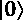
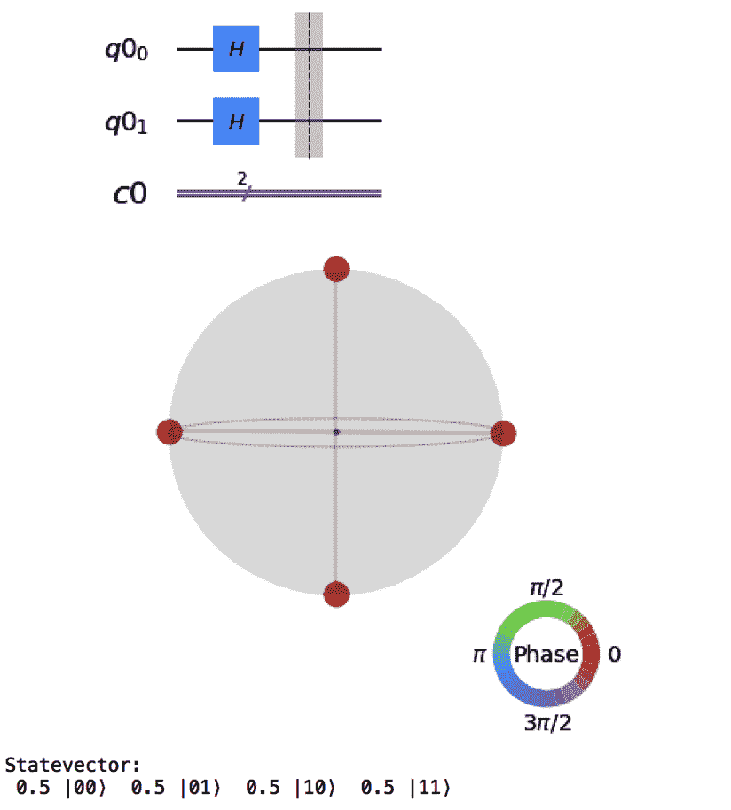
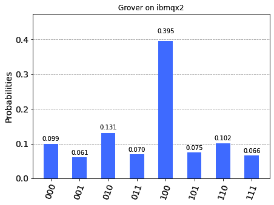

# 第九章：*第九章*: Grover 搜索算法

在本章中，我们将探讨一个相当知名的量子算法：**Grover 搜索算法**。我们将通过构建以下变体的电路来学习如何编码它：2 量子位版本、3 量子位版本以及 4 量子位及以上版本，以了解电路的复杂性如何随着量子位的数量增加而增长。

我们将在本地模拟器和 IBM Quantum®后端上运行我们的算法，并看到算法在相对较短的 2 量子位 Grover 电路上运行得相当好，但在需要更多量子位的更大电路上则不太理想。你的电路中的门数量会依次增加，我们在*第八章*中探讨的各种错误开始占主导地位。

在本章中，我们将介绍以下内容：

+   探索量子相位回弹

+   关于经典搜索的简要介绍

+   构建 Grover 搜索算法

+   使用 3 量子位 Grover 进行搜索

+   向 Grover 搜索添加更多量子位

+   在您的代码中使用 Grover 电路

# 技术要求

本章中我们将讨论的量子程序可以在以下位置找到：[`github.com/PacktPublishing/Quantum-Computing-in-Practice-with-Qiskit-and-IBM-Quantum-Experience/tree/master/Chapter09`](https://github.com/PacktPublishing/Quantum-Computing-in-Practice-with-Qiskit-and-IBM-Quantum-Experience/tree/master/Chapter09)。

就像我们在*第六章*中做的那样，*理解 Qiskit®门库*，我们将创建一个主要的 Python 文件来包含我们将使用的更复杂函数：`ch9_grover_functions.py`。

除了其他函数外，此程序还包括一组核心函数，用于构建 Grover 算法：

+   `create_oracle()`: 此函数构建一个 2-5 量子位的 Oracle，用于正确解决方案。

+   `create_amplifier()`: 此函数构建 Grover 电路的相位放大部分。

+   `create_grover()`: 此函数将各个部分组合在一起，并返回一个可以在模拟器或真实量子计算机上运行的 Grover 电路。

我们将在*构建 Grover 搜索算法*的配方中进一步讨论这些内容。简而言之，这些主要函数是构建 Grover 算法所需的所有内容，而程序中的其余部分都是为了帮助可视化这个过程。

包含在`ch9_grover_functions.py`文件中的其他函数如下：

+   `print_psi()`: 此函数打印出电路的格式化良好的状态向量。

+   `get_psi()`: 此函数返回电路的状态向量，并将其显示为 Q 球体、Bloch 球体或普通向量。

+   `print_unitary()`: 这个函数会打印出电路的单位矩阵。对于这一章，我们预期单位矩阵没有虚部；我们简化了一下，只打印出实值，并使用 BasicAer 的`unitary_simulator`来创建单位矩阵。

+   `display_circuit()`: 这个函数显示电路，以及可选的电路状态向量和电路单位矩阵的 Q 球视图。

最后，我们有一组函数，我们使用这些函数在模拟器、量子计算机和转换器上运行我们的电路：

+   `run_grover()`: 为了完整性，包含一个函数，该函数可以在模拟器或 IBM Quantum®后端上运行你的 Grover 电路。

+   `mitigated_results()`: 回顾上一章，*第八章*，*用 Ignis 清理你的量子行为*，我们使用这个函数在我们的 2 量子位 Grover 上运行错误缓解。正如我们将看到的，在 3 和 4+量子位电路上进行错误缓解不会产生更好的结果。

+   `transpile_circuit()`: 为了提供洞察，我们再次引入了在*第六章*，*理解 Qiskit®门库*中的*你的量子电路真正看起来是什么样子*菜谱中使用的转换功能。

但在我们深入算法之前，我们将先看看许多量子算法（包括 Grover）的构建块之一——所谓的**相位回弹**。

# 探索量子相位回弹

在这个第一个菜谱中，我们将更深入地研究许多量子算法的基本组成部分——量子相位回弹，它被用来让一个或多个量子位拾取第二个量子位的相位角，而不会改变第二个量子位。在*构建 Grover 算法*菜谱中，我们将使用相位回弹来识别搜索的正确解决方案，并放大测量该解决方案的概率。

这个菜谱需要一点数学知识来解释一些相当不直观的过程和结果，但我们会一步步讲解。这对于量子算法令人惊叹的方面是一个非常好的起点。

## 准备工作

这个菜谱的示例代码可以在以下位置找到：[`github.com/PacktPublishing/Quantum-Computing-in-Practice-with-Qiskit-and-IBM-Quantum-Experience/blob/master/Chapter09/ch9_r1_kickback.py`](https://github.com/PacktPublishing/Quantum-Computing-in-Practice-with-Qiskit-and-IBM-Quantum-Experience/blob/master/Chapter09/ch9_r1_kickback.py)。

这个菜谱本身相当简单，由一系列步骤组成，这些步骤将引导你通过相位回弹过程，首先是一个量子位，然后是两个量子位。

在每个步骤中，我们将使用`ch9_grover_functions.py`中的`display_circuit()`函数来显示量子位发生了什么，所以让我们先看看这个函数：

```py
def display_circuit(circuit,psi,unitary):
    disp=True
    if disp:
        display(circuit.draw(output="mpl"))
        if psi:
            get_psi(circuit,"Q")
        if unitary:
            print_unitary(circuit)
```

`display_circuit()`函数是集合中的主要可视化函数，它接受一个量子`circuit`和两个逻辑参数作为输入。如果`psi=True`，我们将调用`get_psi()`函数，该函数将电路显示为 Q 球体，并调用`print_psi()`函数以打印结果的电路状态向量的美观版本。如果`unitary=True`，则调用`print_unitary()`函数以显示电路的单位矩阵。

在这个菜谱中，我们设置`unitary=False`并专注于状态向量可视化。

## 如何做到这一点...

让我们探索如何给量子比特添加相位：

1.  我们首先导入所需的类、方法和`display_circuit()`函数，这将使我们能够显示我们所做的工作：

    ```py
    from qiskit import QuantumCircuit
    from ch9_grover_functions import display_circuit
    ```

1.  现在，让我们创建一个初始化为状态的单量子比特：

    ```py
    qc1 = QuantumCircuit(1)
    display_circuit(qc1,True,False)
    ```

    `display_circuit()`函数显示了我们的量子比特初始化为状态的 Q 球体可视化：

    

    图 9.1 – 单量子比特设置为

    让我们看看背后的数学，正如我们在*第二章*，“使用 Python 进行量子计算和量子比特”中讨论的那样。我们在这里所做的是创建一个可以像这样显示的状态向量：

    

    或者用角度和的形式描述：

    

    对于我们的量子比特，初始化为，状态向量解析为以下内容：

    

1.  设置量子比特处于叠加态：

    ```py
    qc1.h(0)
    display_circuit(qc1,True,False)
    ```

    当量子比特处于叠加态时，Q 球体显示有相等的机会得到和：

    

    图 9.2 – 单量子比特在叠加态

    对于处于叠加态的量子比特，具有，这是我们在这里要处理的，上一步的公式转化为以下形式：

    

    这意味着我们通过角度然后来描述量子比特的相对相位，量子比特的相位是时的相反相位，在这种情况下， = 1。从方程中可以看出，相位角只影响量子比特的部分。这在下一步将非常重要。

1.  现在，让我们使用 Z 门给第二个量子比特添加一个相位。

    从现在开始，我将不再展示`display_circuit(qc1,True,False)`代码；只需假设在每个步骤之后都包含它以显示进度：

    ```py
    qc1.z(0)
    ```

    记住，Q 球体代表量子比特的最终状态，向量尖端的大小代表测量相应结果相对概率的大小，颜色代表结果的相对相位。

    当你测量量子比特时，相位没有影响，只有概率。在这里，你可以看到具有相角 0 的状态  有 50% 的概率给出结果 0，而具有相角  的状态  也有 50% 的机会给出结果 1：

     的单个量子比特叠加

    ](img/Figure__9.3_B14436.jpg)

    Figure 9.3 – 具有相角  的单个量子比特叠加

    在这个方法中，我们将使用 *Z 门*，也称为 **相位门**，将相角  添加到  状态：

    

    使用前面的状态向量命名法，这种转换看起来是这样的：

    具有相角 0（或者具有相角 2）的叠加态量子比特：

    

    具有相角 （通过 Z 门后）的叠加态量子比特：

    

    注意看在  前面的 + 号如何变成 - 号，这标志着状态的翻转。

1.  现在，让我们对 2 个量子比特进行相同的步骤，给每个量子比特添加相角 ：

    ```py
    qc = QuantumCircuit(2)
    qc.h([0,1])
    qc.z(1)
    qc.z(0)
    ```

    跳过中间步骤，前面代码的最终结果，当使用两个 psi 函数打印时，如下所示：

    

    Figure 9.4 – 两个处于叠加态的量子比特，两者都具有相角 

    对于两个处于叠加态的量子比特，对于前面单个量子比特的例子，感觉上有点直观，但对于两个量子比特来说，可能会有些混乱，所以让我们一步一步来做。

    就像在 1 量子比特的例子中一样，每个量子比特可以这样描述：

    

    将量子比特设置在叠加态，可以写成这样：

    

    在我们简化的叠加态视图中，这转化为以下表达式：

     和 

    

    对于两个量子比特，相移变换按照以下步骤进行：

    首先，两个具有 0（或者确切地说，）相角的叠加态量子比特 :

    

    然后，两个处于叠加态的量子比特，第二个 () 具有相角 ：

    

    最后，两个具有相角  的叠加态量子比特：

    

    这个最后的例子代表了前面示例代码的最终结果。Q 球有四个等可能的结果，其中两个被 **标记** 为具有相角 ，即  和 。

    如果你记得只有状态包含相位参数，并且如果两个量子比特都具有相位，组合的指数和为，这将导致没有相位。记住这个结果。它将在下一步出现。

1.  将一个量子比特与一个相位角纠缠。

    到目前为止，这是数学，正如你在第一个菜谱中看到的那样，这是 Qiskit®为你构建的内容。你可以改变一个量子比特的相位，而不影响另一个。真正有趣的部分来自于当你使用 CX 门纠缠量子比特时，从量子比特 0 到量子比特 1：

    

    图 9.5 – 从 0 到 1 的 CX（受控非）门

    该门的单位矩阵版本如下：

    

    对于两个处于叠加态的量子比特，结果并不那么令人兴奋；你最终得到的是你开始时的结果：

    

    但现在给受控量子比特 1，即，添加一个相移，然后从前面进行计算：

    

1.  这就是在示例代码中是如何实现的：

    ```py
    qc = QuantumCircuit(2)
    qc.h([0,1])
    qc.z(1)
    qc.cx(0,1)
    ```

    同样，我们跳过了中间步骤，专注于最终结果。逐步进行，并与前面的计算进行比较：


图 9.6 – 使用相位回弹的两个具有相同相位的纠缠量子比特

看看这个结果。它相当令人惊讶！

让我来解释：我们最初有两个处于叠加态的量子比特，其中一个具有相位角。然后我们使用没有相位角的量子比特作为控制量子比特，具有相位角的量子比特作为受控量子比特来纠缠量子比特。最终我们得到以下结果：


两个处于叠加态的量子比特，都具有相位角，就像我们之前手动构建的例子一样。

这被称为相位回弹，是量子算法中常用的一个技巧。在本章的剩余菜谱中，我们将查看 Grover 算法，该算法使用相位回弹将问题的正确解与相位标记出来，以区别于错误解。

对于 2 量子比特的 Grover 算法，我们将使用 CX 门（受控非）来实现，对于 3 量子比特的 Grover 算法，使用 CCX（受控受控非），最后对于 4 量子比特，使用 CCCX 门（受控受控受控非）。

# 简短地谈谈经典搜索

在我们运行 Grover 算法之前，让我们快速看一下一个标准的经典线性搜索算法。对于一个搜索无序数据库的经典算法，你平均需要查找给定条目的次数是 ** 的量级，其中 **N** 是数据库中的项数。例如，如果你的无序数据库有四个项，你通常需要平均查找两次才能找到你的项。

## 准备工作

该食谱的示例代码可以在以下链接找到：[`github.com/PacktPublishing/Quantum-Computing-in-Practice-with-Qiskit-and-IBM-Quantum-Experience/blob/master/Chapter09/ch9_r2_classic_search.py`](https://github.com/PacktPublishing/Quantum-Computing-in-Practice-with-Qiskit-and-IBM-Quantum-Experience/blob/master/Chapter09/ch9_r2_classic_search.py).

## 如何做到这一点...

让我们在一个包含四个项的小型数据库中搜索特定的两位条目：

1.  首先，我们需要输入我们正在搜索的两个位字符串，然后尝试搜索的次数以获取一些统计数据：

    ```py
    Searching in a scrambled database with 4 entries:
     ('00', '01', '10', '11')
    Enter a two bit string for the two qubit state to search for, such as '10' ('Exit' to stop):
    10
    Number of searches to test:
    20
    ```

    这里的两位格式将在本章的 Grover 食谱中重复使用，并将表示两个量子比特的状态向量，例如，。我们还将使用 3 位和 4 位条目来表示相应数量的量子比特。

1.  现在脚本打乱初始数据库并运行搜索函数：

    ```py
    for m in range(searches):
        database=random.sample(values,len(values))
        result=simple_search(database, oracle)
        average.append(result+1)
        search.append(m+1)
    ```

    `simple_search()` 函数接受一个数据库列表作为输入，然后遍历它直到找到我们正在搜索的条目。返回项的位置，并将其作为 `search` 变量中的搜索次数：

    ```py
    def simple_search(database, oracle):
        for position, post in enumerate(database):
            if post == oracle:
                return position
    ```

1.  最后，使用 `plot_results()` 函数显示收集到的统计数据：

    ```py
    def plot_results(average,search,values):
        import matplotlib.pyplot as plt
        from statistics import mean 
        print("Average searches to find:", mean(average))
        # Plot the search data
        plt.bar(search, average, align='center', alpha=0.5)
        plt.ylabel('Searches')
        plt.title(str(mean(average))+' average searches\nto         find one item among '+str(len(values)))
        plt.axhline(mean(average))
        plt.show()
    ```

    上述代码应该创建出类似以下内容：


图 9.7 – 在四个未排序项中典型经典线性搜索的结果

这个小的搜索示例说明了可以用来在数据库中查找单个项的一个经典算法。在这个例子中，我们统计表明，在四个项的无序数据库中查找单个条目需要大约 *两次搜索* 来实现，这与 *N/2 搜索* 的预测相匹配。

如果你向数据库中添加随机项，那么你可以确信这一点也适用于包含 8 和 16 个项的数据库，这对应于 3 位和 4 位搜索字符串。

在 *Grover 搜索算法* 食谱中，我们将看到如何使用 Grover 量子算法以 ** 搜索的顺序找到项。这是一个平方加速。在四项数据库中差别不大，但如果你的数据库包含数十万甚至数百万项，这就有区别了。

# 构建 Grover 搜索算法

让我们尝一尝 Grover 的搜索算法，这是解决实际问题的更直接的量子算法之一，即在索引但未排序的数据库中查找信息。正如我们在*关于经典搜索的快速插曲*中讨论的那样，Grover 预计将比其经典对应物快平方倍。

在 Qiskit Terra 中，我们可以创建一个使用相位回弹神谕结合另一个巧妙技巧的实现 Grover：**相位放大**。相位放大增加了正确相位偏移答案的幅度，从而在测量你的电路时增加了该结果出现的概率。

首先，我们创建一个所谓的**神谕函数**，它被设计为接受一组初始叠加的量子比特作为输入，并通过切换正确答案的相位，同时保持错误答案的相位不变。神谕电路被称为**黑盒**，它被编码为从一组输入中识别答案。

在我们的例子中，我们明确编码了神谕以识别特定的答案，这感觉像是作弊。如果我们已经知道答案，那么运行 Grover 算法来找到它有什么意义呢？在我们的简单例子中，这是正确的，但神谕黑盒可能是在混合经典/量子计算程序中的任何类型的函数。

你可以这样理解：如果神谕在输入中识别出正确的答案，那么它可以识别正确的答案；它不能计算出正确的答案。

神谕单位矩阵本质上是一个单位矩阵，只有一个负数项表示解，并将对应状态的相位切换。这个单位矩阵可以使用量子电路中的标准门来实现。

在这个菜谱中，我们将构建两个量子比特的 Grover 电路。对于每一步，我们将使用 Q-sphere 和电路的状态向量来显示我们所做的工作。对于两个关键组件——神谕和放大器——我们也显示了它们所代表的单位矩阵。

## 准备工作

这个菜谱的示例代码可以在以下链接找到：[`github.com/PacktPublishing/Quantum-Computing-in-Practice-with-Qiskit-and-IBM-Quantum-Experience/blob/master/Chapter09/ch9_r3_grover_main.py`](https://github.com/PacktPublishing/Quantum-Computing-in-Practice-with-Qiskit-and-IBM-Quantum-Experience/blob/master/Chapter09/ch9_r3_grover_main.py)。

脚本反过来使用三个步骤来创建 Grover 电路。让我们逐一介绍它们，并在下一节中详细介绍两个量子比特 Grover 电路的初始示例。我们在这里实现电路的基本特征与你添加更多量子比特时相同。

构建或然电路、放大电路和最终 Grover 电路的示例代码可以在以下链接找到：[`github.com/PacktPublishing/Quantum-Computing-in-Practice-with-Qiskit-and-IBM-Quantum-Experience/blob/master/Chapter09/ch9_grover_functions.py`](https://github.com/PacktPublishing/Quantum-Computing-in-Practice-with-Qiskit-and-IBM-Quantum-Experience/blob/master/Chapter09/ch9_grover_functions.py).

#### 创建或然电路

我们首先需要的是或然电路。构建或然电路以标记正确答案并引入相移的一个简单方法就是使用类似于我们在*探索量子相移回波*配方中构建的相移回波电路。

例如，让我们设置一个相移回波或然电路，该电路将特定结果（如）的相移回传。这意味着可能的态向量相对于所有其他可能的态向量（在这种情况下，）将相移。

这就是从 Qiskit®打印出来的或然电路的样子：


Figure 9.8 – 一个相移回波或然电路及其对应正确结果的单位矩阵

这是如何工作的？让我们一步步了解电路的每个部分是如何工作的：

1.  在第一个控制量子位上，我们添加一个 X 门以确保该量子位上的翻转成，从而触发 CX 门。

1.  在第二个量子位上，我们首先添加一个 H 门。

    这个电路是做什么的？在这种情况下，我们想要给第二个量子位添加一个相移，这样我们就可以使用 CX 门将相移回传到第一个量子位。这里，如果第二个量子位是一个错误的，应用 H 门会给我们一个相位为 0 的叠加态，没有相移回传，解决方案没有被标记。然而，如果第二个量子位是一个正确的，H 门会给我们，它有一个相位为，然后被 CX 门迅速标记到解决方案上。

1.  最后，在 CX 门之后，我们再添加一个 X 门将第一个量子位翻转回其初始状态，并为第二个量子位添加另一个 H 门以执行相同的操作。

我们所实现的是为或然答案的态向量标记一个相移为。只有那个组合会得到相移；没有其他组合会。

可能通过显示的单位矩阵更容易理解，其中除了正确的解决方案外，所有解决方案的对角线上都表示为 1，而正确的解决方案()表示为-1，这导致结果状态向量的相移。

这就是我们在 Python 示例中是如何做的：

```py
def create_oracle(oracle_type,size):
    from qiskit import QuantumCircuit, ClassicalRegister,        QuantumRegister
    global qr, cr
    qr = QuantumRegister(size)
    cr = ClassicalRegister(size)
    oracleCircuit=QuantumCircuit(qr,cr)
    oracle_type_rev=oracle_type[::-1]
    for n in range(size-1,-1,-1):
        if oracle_type_rev[n] =="0":
            oracleCircuit.x(qr[n])
    oracleCircuit.h(qr[size-1])
    if size==2: 
        oracleCircuit.cx(qr[size-2],qr[size-1]);
    if size==3:
        oracleCircuit.ccx(qr[size-3],qr[size-2],qr[size-1])
    if size==4:
        oracleCircuit.mcx([qr[size-4],qr[size-3],
            qr[size-2]],qr[size-1])
    if size>=5:
        oracleCircuit.mcx([qr[size-5],qr[size-4],
            qr[size-3],qr[size-2]],qr[size-1])
    oracleCircuit.h(qr[size-1])
    for n in range(size-1,-1,-1):
        if oracle_type_rev[n] =="0":
            oracleCircuit.x(qr[n])
    return(oracleCircuit)
```

让我们一步步来看：

1.  `create_oracle()`函数的输入是一个预言机类型和大小，其中类型是一个字符串，指定了我们正在寻找的量子比特组合，例如，对于![公式 _09_068.png]组合，为 10。

1.  接下来，我们以相反的顺序遍历预言机类型，对于字符串中的每个 0 添加一个 X 门，将其翻转成 1，正如前面的讨论所述。

    注意，对于两位字符串的预言机输入，它与 Qiskit®标记量子比特的方式相反，因此我们需要在处理之前将其反转到`oracle_input_rev`。

1.  然后我们在最后一个量子比特上添加一个 H 门。

1.  现在是真正的重点。根据我们构建电路的大小，我们添加一个叠加门来处理相位回弹：

    对于两个量子比特，程序会添加一个 CX 门。

    对于三个量子比特，添加了一个 CCX 门；我们将在*使用 3 量子比特 Grover 搜索*配方中了解更多关于这一点。

    对于 4 和 5 个量子比特，添加了一个 MCX（多控制非）门；我们将在*添加更多量子比特到 Grover 搜索*配方中了解更多关于这一点。

1.  最后，我们以相反的顺序执行 H 门和 X 门步骤，以平衡预言机电路。

我们现在有一个预言机电路，它将标记我们传递给它的预言机类型。

#### 创建放大器电路

不论我们为预言机使用多少量子比特，放大器电路的构建方式都是相同的。它通过将相位改变的概率反射到所有解决方案的平均概率上来放大正确解决方案的概率。

这就是 2 量子比特电路的电路图：


图 9.9 – 一个两量子比特放大器电路及其对应的单位矩阵

再次，如果你看看放大器单位矩阵，可能更容易理解。如果你对相位移位的解决方案进行矩阵乘法，你会看到相位移位解决方案的概率被放大，而没有相位移位的解决方案的概率则没有。结果是，在两个量子比特 Grover 电路的特殊情况下，得到正确解决方案的概率实际上是 100%；你将在四个可能的解决方案中找到正确的解决方案，只需进行一次搜索。这真是太令人惊讶了！

在接下来的矩阵乘法中，我们将放大器矩阵与相位标记的叠加向量相乘，以得到一个只有一个可能结果的解决方案向量，![公式 _09_068.png]，概率为 100%：


在我们的 Python 示例中，它是这样做的：

```py
def create_amplifier(size):
    from qiskit import QuantumCircuit
    # Let's create the amplifier circuit for two qubits.
    amplifierCircuit=QuantumCircuit(qr,cr)
    amplifierCircuit.barrier(qr)
    amplifierCircuit.h(qr)
    amplifierCircuit.x(qr)
    amplifierCircuit.h(qr[size-1])
    if size==2: 
        amplifierCircuit.cx(qr[size-2],qr[size-1]);
    if size==3:
        amplifierCircuit.ccx(qr[size-3],qr[size-2],qr[size-1])
    if size==4:
        amplifierCircuit.mcx([qr[size-4],qr[size-3],
            qr[size-2]],qr[size-1])
    if size>=5:
        amplifierCircuit.mcx([qr[size-5],qr[size-4],
            qr[size-3],qr[size-2]],qr[size-1])
    amplifierCircuit.h(qr[size-1])
    amplifierCircuit.barrier(qr)
    amplifierCircuit.x(qr)
    amplifierCircuit.h(qr)
    return(amplifierCircuit)
```

`create_amplifier()`函数只接受大小作为输入。放大器无论预言机是什么都工作相同。正如你所看到的，它与预言机电路有些相似；它也构建了一个平衡电路：

1.  它从所有量子比特上的 H 门开始。

1.  第二步是在所有量子比特上添加 X 门。

1.  再次强调，根据电路的大小，它会在中间添加一个 CX、CCX 或 MCX 门来实现相位回跳。

1.  就像对于 Oracle 电路一样，我们现在反转初始的 X 和 H 门，以平衡电路。

我们现在有了 Oracle 和放大器；我们唯一需要做的就是将它们放在一起。

#### 创建 Grover 电路

Grover 电路将各个部分组合在一起，在开始时添加 H 门以设置叠加态，并在结束时添加测量门以允许你运行电路。

`create_grover()`函数接受 Oracle 电路和放大器电路作为输入。它还接受一个布尔`showsteps`参数。将此参数设置为`showsteps`为**False**，以仅运行 Grover 电路，不进行额外的可视化。

Python 代码看起来是这样的：

```py
def create_grover(oracleCircuit,amplifierCircuit,showstep):
    from qiskit import QuantumCircuit
    from math import sqrt, pow, pi
    groverCircuit = QuantumCircuit(qr,cr)
    # Initiate the Grover with Hadamards
    if showstep: display_circuit(groverCircuit,True,False)
    groverCircuit.h(qr)
    groverCircuit.barrier(qr)
    if showstep: display_circuit(groverCircuit,True,False)
    # Add the oracle and the inversion
    for n in range(int(pi/4*(sqrt(pow(2,
            oracleCircuit.num_qubits))))):
        groverCircuit+=oracleCircuit
        if showstep: display_circuit(groverCircuit,True,False)
        groverCircuit+=amplifierCircuit
        if showstep: display_circuit(groverCircuit,True,False)
    # Add measurements
    groverCircuit.measure(qr,cr)
    return(groverCircuit)
```

这里是我们刚刚看到的代码的步骤：

1.  我们创建了一个量子电路，其中包含我们在创建 Oracle 时设置的全球量子寄存器和经典寄存器。

1.  接下来，我们在所有量子比特上添加 H 门，并添加一个屏障指令以保持电路在编译时的完整性。这里有很多连续的重复门，我们需要保留所有这些门以确保电路能够工作。

1.  现在是添加 Oracle 和放大器电路的关键步骤。

    为了从 Grover 电路中获得良好的结果，我们需要执行我们之前在*关于经典搜索的快速插曲*中讨论的正确数量的搜索。在量子 Grover 算法中，这表示为对每次搜索运行一次 Oracle 和放大器电路。

    对于大小为 N=2q 的数据库，最佳搜索次数或重复次数由以下公式确定：n。在这种情况下，*q*是我们电路中的量子比特数量。

    如果你做数学计算，你会发现对于一个 2 量子比特的 Grover 电路，只需要进行 1 次搜索就足够了（n=1.57）。对于 3 和 4 量子比特的电路，我们分别通过物理添加 Oracle 和放大器电路来增加 2 和 3 次重复。

    要了解为什么我们使用次重复，请参阅*See also*部分列出的*讲座 22，4 月 11 日星期二：Grover*文章中的*如果我们运行 Grover 算法时间过长会发生什么？*部分。

1.  最后，我们将测量指令添加到电路中，现在电路可以运行了。

这些是我们构建 Grover 电路所需的三种函数。但如果你想的话，坐下来，尝试构建一组 Oracle 并测试它们在模拟器或真实的 IBM Quantum®量子计算机上；看看错误缓解对结果的影响，看看你的 Grover 代码实际上是什么样子，以及它在为 IBM Quantum®后端编译后变得有多大。

## 如何做到这一点...

要创建一个双量子比特的 Grover 电路，请按照以下步骤操作：

1.  在你的 Python 环境中，运行`ch9_r3_grover_main.py`。

1.  当提示时，输入你想要找到的 Oracle 答案，形式为只包含 1 和 0 的两个数字字符串，例如，*10*。

1.  程序现在使用`create_oracle()`函数从`ch9_grover_functions.py`脚本中构建一个双量子位预言机电路，使用您输入的预言机类型，然后显示您创建的内容：

    ```py
    …
    if size==2: 
            amplifierCircuit.cx(qr[size-2],qr[size-1]);
    …
    ```

    对于的双量子位预言机如下所示：

    

    图 9.10 – 为编码的预言机电路，用于

    我们正在构建一个电路，使用 CX 门来处理第二个量子位对第一个量子位的相位回弹。

1.  现在构建两个量子位的放大器电路。

    下一步是使用`create_amplifier()`函数创建放大器电路。这也使用 CX 门进行相位回弹。该函数需要的唯一输入是量子位的数量。

    这是我们同时对所有量子位进行电路操作的地方，使用量子寄存器作为输入。例如，通过使用以下代码，我们在`qr`双量子位量子寄存器中的所有量子位上添加一个 Hadamard 门，即两个量子位：`amplifierCircuit.h(qr)`。

    放大器电路及其相应的单位矩阵对于所有双量子位 Grover 电路都是相同的：

    

    图 9.11 – 双量子位放大器电路

    如果需要，请回到*创建放大器电路*部分进行矩阵乘法的复习：

    

    如您所见，相位移位状态 10 已被放大到`-1`。当我们通过平方输出状态参数来计算结果概率，就像我们在*第二章*中做的那样，即*使用 Python 进行量子计算和量子位*，在*比较比特和量子位*部分，我们得到以下可能的输出。结果 10 = 100%，所有其他结果 = 0%。得到放大正确答案的概率是 100%。

1.  逐步创建 Grover 电路：

    在下一步中，程序创建了一个包含我们的预言机和放大器的 Grover 量子电路，并添加了测量门。我们再次使用`create_grover()`函数来完成此操作。

    使用详细的电路创建显示，我们得到以下快速流程中的输出。让我们逐个查看电路。

    创建一个空白的双量子位电路：

    

    图 9.12 – 一个 100%概率得到结果的空白电路

    将两个量子位设置为叠加状态：

    

    图 9.13 – 具有两个量子位的叠加电路。每个结果的概率都是 25%：，，和

    添加预言机电路：

    ![图 9.14 – 添加 . 仍然有 25%的等概率得到每种结果： ， ， 和 ，但  现在相位移位

    ![img/Figure__9.14_B14436.jpg]

    图 9.14 – 添加 ![img/Formula_09_082.png] 的查询算子。仍然有 25%的等概率得到每种结果：![img/Formula_09_109.png]，![img/Formula_008_013.png]，和![img/Formula_09_110.png]，但![img/Formula_008_013.png]现在相位移位为![img/Formula_09_018.png]

    添加放大器电路：

    ![图 9.15 – 添加放大器电路，该电路放大了相位移位结果的概率。现在有 100%的概率得到

    ![img/Figure__9.15_B14436.jpg]

    图 9.15 – 添加放大器电路，该电路放大了相位移位结果的概率。现在有 100%的概率得到 ![img/Formula_09_083.png]

    添加测量组件以完成电路。最终的电路将看起来像这样：

    ![图 9.16 – 三量子比特 Grover 电路，包含对 ![img/Formula_09_083.png] 的查询算子的一次重复和一个放大器

    ![img/Figure__9.16_B14436.jpg]

    图 9.16 – 三量子比特 Grover 电路，包含对 ![img/Formula_09_083.png] 的查询算子的一次重复和一个放大器

    如您所见，Grover 电路的第一步是使用 H 门将所有量子比特设置在偶数叠加状态。然后是查询算子和放大器电路。最后，我们添加所有量子比特的测量组件，以便我们可以读取最终结果。

1.  现在，让我们运行电路并看看我们得到什么结果：![图 9.17 – 在 Aer 模拟器上对 ![img/Formula_09_083.png] 查询算子的双量子比特 Grover 搜索结果](img/Figure__9.17_B14436.jpg)

    图 9.17 – 在 Aer 模拟器上对 ![img/Formula_09_083.png] 查询算子的双量子比特 Grover 搜索结果

1.  输入`Y`以在最不忙的 5 量子比特 IBM Q 后端运行 Grover 电路：![图 9.18 – 在 IBM Q 后端对 ![img/Formula_09_083.png] 查询算子的双量子比特 Grover 搜索结果

    ![img/Figure__9.18_B14436.jpg]

    图 9.18 – 在 IBM Q 后端对 ![img/Formula_09_083.png] 查询算子的双量子比特 Grover 搜索结果

    那么，这里发生了什么？为什么我们没有得到查询算子和放大器电路承诺的超精确结果？在模拟器中，我们得到正确结果的机会是 100%。现在我们下降到约 91%。我们能否使用误差缓解做得更好？对于双量子比特 Grover 电路，结果证明我们可以。

1.  运行双量子比特 Grover 误差缓解以模拟实际量子计算机的行为。

    在这里，我们添加了在*第八章*“用 Ignis 清理我们的行为”中测试的缓解运行函数，该函数编码为`mitigated_results(backend,circuit,results)`函数：

    ```py
    def mitigated_results(backend,circuit,results,
            results_sim):
        # Import the required classes
        from qiskit.providers.aer.noise import NoiseModel
        from qiskit.ignis.mitigation.measurement import
            (complete_meas_cal,CompleteMeasFitter)
        # Get noise model for backend
        noise_model = NoiseModel.from_backend(backend)
        # Create the measurement fitter
        qr = QuantumRegister(circuit.num_qubits)
        meas_calibs, state_labels = complete_meas_cal(
            qr=qr, circlabel='mcal')
        job = execute(meas_calibs,
            backend=Aer.get_backend('qasm_simulator'), 
            shots=8192, noise_model=noise_model)
        cal_results = job.result()
        meas_fitter = CompleteMeasFitter(cal_results, 
            state_labels, circlabel='mcal')
        print(meas_fitter.cal_matrix)
        # Get the filter object
        meas_filter = meas_fitter.filter
        # Results with mitigation
        mitigated_results = meas_filter.apply(results)
        mitigated_counts = mitigated_results.get_counts(0)
        return(mitigated_counts)
    ```

    显示了缓解后的结果：

    ![图 9.19 – 在 IBM Quantum®后端对 ![img/Formula_09_083.png] 查询算子的双量子比特 Grover 搜索结果的误差缓解结果

    ![img/Figure__9.19_B14436.jpg]

    图 9.19 – 在 IBM Quantum®后端上对或门的两个量子比特 Grover 搜索结果的错误缓解结果

    是的，这样更好；我们现在看到有 95%的几率得到正确的结果！这个电路的错误缓解提高了我们的结果，并减少了错误解决方案的概率。错误缓解之所以有效，是因为我们构建的电路相对较小。

1.  查看最终的转换电路。

    在我们双量子比特 Grover 探索的最终步骤中，我们要查看在量子计算机上运行的转换电路。为此，我们重用了在*第六章*“你的量子电路究竟是什么样子”食谱中介绍的`transpile_circuit(circuit,backend)`函数，*理解 Qiskit®门库*：

    ```py
    def transpile_circuit(circuit,backend):
        from qiskit.compiler import transpile
        trans_circ = transpile(circuit, backend)
        display(trans_circ.draw(output="mpl"))
        print("Circuit data\n\nDepth: ",trans_circ.depth(),"\nWidth: ",trans_circ.width(),"\nSize: ",trans_circ.size())
    ```


图 9.20 – 双量子比特 Grover 电路的最终后端可执行量子电路

下面是我们 Grover 电路的一些统计数据：

```py
Depth:  9 
Width:  7 
Size:  15
```

我们的 Grover 电路从左到右的总深度为 9 次门操作；总共有 15 个单独的门。

对于双量子比特 Grover，我们实际上可以使用 100%的后端基本门，因此我们的转换电路的大小与我们的编码电路大致相同。对于三量子比特、四量子比特以及更多量子比特的 Grover 电路，我们将使用非基本门 CCX 和 MCX。参见“使用三量子比特 Grover 搜索”和“向 Grover 搜索添加更多量子比特”食谱，以查看这些内容。

## 还有更多……

关于我们最初使用的双量子比特 Grover 算法的简要说明。我们构建的双量子比特电路只是接近 Grover 算法的众多不同方法之一。我故意选择这种方法来减少我们使用的量子比特数量，并且在这个过程中，我们看到第二个量子比特扮演了两个角色：它是或门的组成部分，同时也是相位回弹组件的一部分。

构建电路的另一种方法是仅使用辅助量子比特严格进行相位回弹。这保持了或门量子比特的自由，但增加了一个量子比特，并稍微增加了电路的复杂性；我们现在必须使用 CCX 门来进行相位回弹，而不是 CX 门。

一个为编码并使用辅助量子比特构建的 Grover 电路的示例在这里：[`github.com/PacktPublishing/Quantum-Computing-in-Practice-with-Qiskit-and-IBM-Quantum-Experience/blob/master/Chapter09/ch9_grover_ancilla.py`](https://github.com/PacktPublishing/Quantum-Computing-in-Practice-with-Qiskit-and-IBM-Quantum-Experience/blob/master/Chapter09/ch9_grover_ancilla.py)。

下面是如何构建这个 Python 示例的：

1.  我们首先导入所需的类：

    ```py
    from qiskit import QuantumCircuit, Aer, execute
    from IPython.core.display import display
    from qiskit.tools.visualization import plot_histogram
    ```

1.  创建一个包含两个经典比特的三量子比特电路。

    我们将使用第三个，辅助量子比特作为相位回弹控制器：

    ```py
    qc=QuantumCircuit(3,2)
    qc.h([0,1])
    qc.x(2)
    ```

1.  添加或门的代码：

    ```py
    qc.barrier([0,1,2])
    qc.x(0)
    qc.barrier([0,1,2])
    ```

1.  现在我们使用辅助量子位添加相位回弹：

    ```py
    qc.h(2)
    qc.ccx(0,1,2)
    qc.h(2)
    ```

1.  我们完成了或门的编码：

    ```py
    qc.barrier([0,1,2])
    qc.x(0)
    qc.barrier([0,1,2])
    ```

1.  在我们完成之前，我们需要构建放大器：

    ```py
    qc.h([0,1])
    qc.x([0,1])
    qc.h(1)
    qc.cx(0,1)
    qc.h(1)
    qc.barrier([0,1,2])
    qc.x([0,1])
    qc.h([0,1])
    ```

1.  添加前两个量子位的测量。

    由于辅助量子位只是我们在电路内部使用的工具，我们不需要测量它：

    ```py
    qc.measure([0,1],[0,1])
    ```

1.  最后，我们显示电路，在模拟器上执行它，并显示结果：

    ```py
    display(qc.draw('mpl'))
    backend = Aer.get_backend('qasm_simulator')
    job = execute(qc, backend, shots=1)
    result = job.result()
    counts = result.get_counts(qc)
    display(plot_histogram(counts))
    ```

或门电路看起来像这样：

或门 Grover 电路

](img/Figure__9.21_B14436.jpg)

图 9.21 – 使用三个量子位和一个辅助量子位的或门 Grover 电路

注意，为了使用额外的量子位扩展或门，你唯一要做的就是添加新的量子位在顶部，并扩展 CCX 和 CX 门以适应额外的相位回弹要求。

## 参见

要深入了解 Grover 算法，请参阅德克萨斯大学奥斯汀分校计算机科学 David J. Bruton 百周年教授 Scott Aaronson 的讲座系列中的*第 22 讲，4 月 11 日星期二：Grover*：[`www.scottaaronson.com/qclec/22.pdf`](https://www.scottaaronson.com/qclec/22.pdf)。

# 使用三量子位 Grover 进行搜索

三量子位 Grover 算法与我们之前配方中探索的两个量子位实现非常相似。主要区别在于我们如何为三个量子位而不是两个量子位构建或门电路，构建一个相位回弹，将相位添加到两个量子位而不是一个。

要做到这一点，我们必须使用一个受控-NOT 门，它使用两个量子位作为输入来翻转第三个量子位以纠缠量子位，并用相位标记正确答案。这个门是 Toffoli（CCX）门而不是 CX 门。

在以下示例中，两个量子位输入 Toffoli 门（CCX）带有 2 个控制量子位和 1 个受控量子位，作为相位回弹，如果三个量子位的值匹配正确答案，则将状态相位移：


图 9.22 – 一个由 CCX 驱动的或门

我们将使用与*Grover 搜索算法*配方中相同的示例函数。

## 如何做到这一点...

要创建一个三量子位 Grover 电路，请按照以下步骤进行：

1.  在你的 Python 环境中运行`ch9_r3_grover_main.py`。

1.  当提示时，以三位字符串的形式输入你想要找到的或门答案，只包含 1 和 0，例如，`100`。

1.  程序现在将逐步构建你的三量子位 Grover，就像我们在前面的配方中构建的两个量子位 Grover 一样。我们将突出显示重要步骤，但不会深入任何细节。输出应该可以自说自话。

1.  创建 Grover 电路。

    对于三个量子位，我们有总共 N = 8 ()种可能的结果，正如我们在*构建 Grover 搜索算法*配方中讨论的那样。

    对于大小为 N=2q 的数据库，最佳搜索次数或重复次数由以下公式确定：n 。对于 3 个量子比特，我们因此得到 n = 2.22。我们将这个值四舍五入到 2，以便对占卜器和放大器电路进行两次重复。

    最终电路将看起来像这样：

    

    图 9.23 – 用于占卜器的两个重复的三量子比特 Grover 电路 

    如你所见，Grover 电路的第一步是使用 H 门将所有量子比特设置为偶数叠加。然后我们添加两次占卜器和放大器电路的重复。最后，我们添加所有量子比特的测量组件，以便我们可以读取最终结果。

    如果你将布尔 `showsteps` 参数设置为 **True**，你将看到 Grover 电路的各个步骤和临时结果，最终步骤看起来像这样：

    

    图 9.24 – 带有编码为  的占卜器的三量子比特 Grover

    在这一最终步骤中，你可以看到正确答案，，已经被放大，现在有 ~94% 的概率（0.9722），而所有其他结果的概率都在 0.8%（-0.0882）的量级。

1.  现在，让我们运行电路并查看我们得到什么结果：

    图 9.25 – 在模拟器上对  占卜器的三量子比特 Grover 搜索结果

    注意结果如何很好地匹配我们从最终状态矢量预测的结果。

1.  输入 `Y` 以在最不繁忙的五量子比特 IBM Quantum® 后端上运行 Grover 电路：

    图 9.26 – 在 IBM Quantum® 后端上对  占卜器的三量子比特 Grover 搜索结果

    那么，这里发生了什么？为什么我们没有得到占卜器和放大器电路所承诺的超级精确的结果？使用模拟器，我们大约有 94% 的机会得到正确的结果。这里，我们显然下降到 ~40%。我们能使用错误缓解来做得更好吗？

1.  查看最终的、缓解后的结果：

    图 9.27 – 在 IBM Quantum® 后端上对  占卜器的三量子比特 Grover 搜索结果的错误缓解结果

    不行，这并没有解决问题。尽管结果略有改善，但错误缓解并没有解决这个问题。为什么？记住，基本的错误缓解主要关注测量误差，并且不考虑电路中可能出现的门问题。

    解释在于我们最终 Grover 电路的大小。让我们运行程序的最终步骤，它将最终电路转换为汇编代码，并为我们提供实际在后台运行的电路的大小、深度和宽度。

1.  按下*Enter*键以查看最终、转换后的电路：

    图 9.28 – 3 量子比特 Grover 电路的最终后台可执行量子电路

1.  最后，我们得到了答案，电路大小：

    ```py
    Circuit data
    Depth:  49 
    Size:  76
    ```

    我们 Grover 电路的总深度，从左到右，为 49 次门操作；总共有 76 个单独的门。如果你快速查看*第八章*，*用 Ignis 整理我们的行为*，你会记得我们为每个量子比特的基础门提取了门错误率。尽管这些错误很小，在十分之一以下，当你以 100 次左右的顺序运行时，如前面的电路，很可能会出现错误。

    因此，在最终分析中，得到除预期之外的结果的略高概率主要是由于门错误，而不是测量错误。

# 向 Grover 搜索添加更多量子比特

到目前为止，我们在 Grover 编码方面做得相当不错。我们使用独特的 Qiskit®门为我们的电路包含的量子比特数量构建了两个和三个量子比特的电路：CX 和 CCX。对于四个量子比特及以上的 Grover，我们将使用多控制非门，MCX，以动态创建正确的控制输入数量。

## 准备工作

我们将使用与*构建 Grover 搜索算法*配方中相同的示例函数。

对于两个和三个量子比特的 Grover，我们可以使用预制 CX 和 CCX 门来创建我们的预言机和放大器电路。由于我们使用相同的模型来构建四个和更多量子比特的 Grover，而不是使用 CCCX、CCCCX 门等，我们在电路中使用 MCX 门，让 Qiskit®在幕后构建门逻辑。

注意

要理解我们在这里做什么，请回顾*第六章*，*理解 Qiskit®门库*，特别是 CX 和 CCX 门。

这里是 CX 门的单位矩阵，正如在*构建 Grover 搜索算法*配方中看到的那样：


这里是 CCX 门（Toffoli）的单位矩阵，正如在*使用 3 量子比特 Grover 搜索*配方中看到的那样：


这里的魔法在于右下角，其中 1 已经离开了对角线，形成了一个小对角线。这种交换的效果是翻转最后一个量子比特的值。从代数上来说，这是一个简单的初始对角单位矩阵的操作；我们只需要交换最后两行。

控制控制的控制的非门（**CCCX**）的单位矩阵将看起来像这样：


结果表明，仅对几个量子比特构建表示 CCCX 的单位矩阵并不困难，但随着量子比特数量的增加，矩阵的大小会以 2^n 的速度增长。因此，下一个将是相当大的 CCCCX。

这都很不错，但我们现在该如何处理这个辉煌的矩阵呢？答案是让 Qiskit®通过使用 MCX 门将其编码成门。这个门接受一组控制量子比特和一个目标量子比特作为输入。你也可以指定使用**辅助**量子比特来处理相位回跳，但对我们这个电路，我们不会这么做。回顾一下“构建 Grover 搜索算法”配方中的“更多内容”部分的辅助样本。

在 Python 中使用该门看起来是这样的：

```py
quantum_circuit.mcx([control qubits], target qubit)
```

要获取关于 MCX 门的更多帮助，请使用 Python `help`：

```py
>> help(QuantumCircuit.mcx)
```

在处理完 CCCX 门背后的细节后，构建 4+量子比特的 Grover 电路与两个和三个量子比特的 Grover 算法完全一样。

## 如何做到这一点...

在这里，我们将对覆盖和显示所有步骤的要求稍微宽松一些，因为 4 量子比特的 Grover 算法比我们之前使用的算法占用更多的空间。请随时回顾之前的配方以获取详细信息，并将它们应用于我们在这里构建的 Grover 算法。

要创建一个 4 量子比特的 Grover 算法，请按照以下步骤操作：

1.  在你的 Python 环境中，运行`ch9_r3_grover_main.py`。

1.  当提示时，以仅由 1 和 0 组成的 3 位字符串的形式输入你想要找到的 Oracle 答案，例如，`1000`。

1.  让我们构建 Grover 电路。

    程序现在将逐步构建你的三量子比特 Grover 算法，就像我们在之前的配方中构建的两个量子比特 Grover 算法一样。我们将突出显示重要步骤，但不会深入细节。输出应该可以自说自明。

    对于三个量子比特，我们有总共 N = 16（）种可能的结果，正如我们在“构建 Grover 搜索算法”配方中讨论的那样，电路的理想重复次数是![img/Formula_09_108.png]。对于 3 个量子比特，我们因此得到 n = 3.14。我们将它四舍五入到 3，以便 Oracle 和放大电路重复 3 次。

    最终电路将看起来像这样：

    ]

    图 9.29 – 具有三个重复的 4 量子比特 Grover 电路，用于 oracle 

    如果你将布尔参数`showsteps`设置为**True**，你将看到 Grover 电路的各个步骤和临时结果，最终步骤看起来如下：

    ]

    ]

    图 9.30 – 具有已编码 oracle 的 4 量子比特 Grover 

    在这个最终步骤中，你可以看到（经过一些挖掘后），正确的答案![img/Formula_09_103.png]已经被放大（-0.98046875），现在有大约 96%的概率，而所有其他结果都有大约 0.02%的概率。

1.  现在，让我们运行电路并看看我们得到什么结果：

     oracle 进行四量子比特 Grover 搜索的结果

1.  输入 `Y` 以在最不繁忙的五量子比特 IBM Quantum® 后端运行 Grover 电路：

     oracle 进行四量子比特 Grover 搜索的结果

    这次，我们似乎什么都没有得到，只有噪音。当然，在那随机性中没有任何明确的答案。正确的答案根本不在列表的顶部。让我们看看错误缓解后的结果。

    解释再次在于我们最终 Grover 电路的大小。程序的最终步骤将给我们编译后的电路。

1.  按下 *Enter* 键以查看最终、编译后的电路。这次的结果相当令人印象深刻：


 oracle 进行五量子比特 Grover 搜索的结果

在真实量子计算机上运行五量子比特 Grover 电路的最终结果显示：


 oracle 进行五量子比特 Grover 搜索的结果

查看最终、编译后的电路。根据您在哪个 IBM Quantum® 机器上运行电路，您可能会得到不同的大小和深度，这取决于机器拓扑结构。在一个只有五个量子比特的机器上创建一个 CCCCX 门（使用 MCX 门）将需要大量的交换，更不用说重复 oracle 和放大器四次了。

在 `ibmqx2` 五量子比特后端运行时的电路大小示例：

```py
Circuit data
Depth:  830 
Size:  1024
```

这个大小的电路将不得不等待通用量子计算机；它太大，无法在 NISQ 机器上成功运行。

# 在你的代码中使用 Grover 电路

在`ch9_r3_grover_main.py`和`ch9_grover_functions.py`脚本中有很多代码。如果你只是想运行 Grover，例如，想在另一个 Python 程序中利用它，那么交互式主程序是不需要的。

## 准备工作

你需要的示例 Grover 函数代码包含在这里：[`github.com/PacktPublishing/Quantum-Computing-in-Practice-with-Qiskit-and-IBM-Quantum-Experience/blob/master/Chapter09/ch9_grover_functions.py`](https://github.com/PacktPublishing/Quantum-Computing-in-Practice-with-Qiskit-and-IBM-Quantum-Experience/blob/master/Chapter09/ch9_grover_functions.py).

## 如何做到这一点...

1.  技术上，你只需要在你的代码中包含以下简短的代码片段：

    ```py
    from ch9_grover_functions import *
    oracle=create_oracle("01",2)
    amplifier=create_amplifier(2)
    grover=create_grover(oracle,amplifier,False)
    print(grover)
    ```

1.  上一段代码应该得到以下结果：


图 9.36 – 在最小脚本中使用 Grover 函数创建一个 ![img/Formula_09_108.png] Grover 电路

从 Qiskit Terra 电路的角度来看，我们现在已经完成了，你可以将你的`grover`电路与你的混合经典/量子代码一起包含，以获取 Grover 搜索结果。

## 还有更多...

但我们可以做得更好！Qiskit Aqua 实际上包含一个可以直接使用而不需要编写任何代码的`Grover()`函数。更多关于这一点，请参考*第十章*中的*使用 Aqua 了解算法*食谱，*了解 Aqua 算法*。
