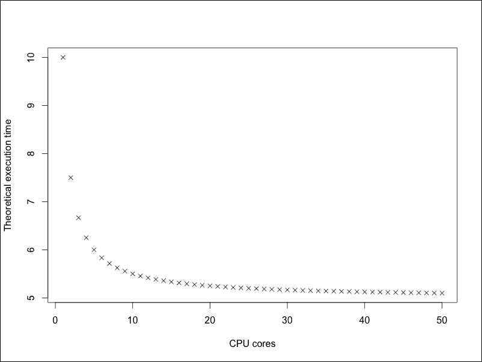
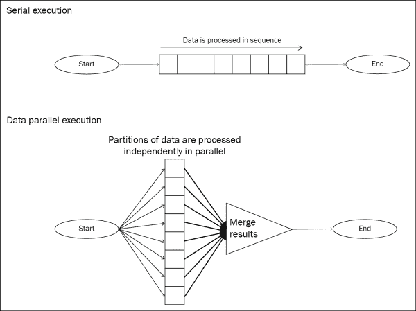
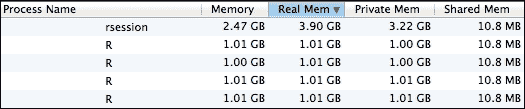
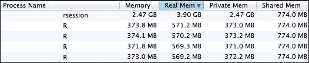

# 第八章. 使用并行计算提高性能

在本章中，我们将学习如何编写和执行并行 R 代码，其中代码的不同部分同时运行。到目前为止，我们已经学习了各种优化串行运行的 R 程序性能的方法，即在单个进程中运行。这并没有充分利用现代 CPU 的多核计算能力。并行计算使我们能够利用所有可用的计算资源，并通过许多倍的速度加快 R 程序的执行。我们将检查不同的并行类型以及如何在 R 中实现它们，并且我们将更详细地查看设计 R 程序并行架构时的几个性能考虑因素。

本章涵盖了以下主题：

+   数据并行与任务并行

+   实现数据并行算法

+   实现任务并行算法

+   在计算机集群上并行执行任务

+   共享内存与分布式内存并行

+   优化并行性能

# 数据并行与任务并行

许多现代软件应用程序被设计为在几乎任何计算机上并行运行计算，以利用今天几乎任何计算机上可用的多个 CPU 核心。许多 R 程序也可以类似地编写以并行运行。然而，可能的并行程度取决于涉及的计算任务。在衡量的一端是**令人尴尬的并行**任务，其中并行子任务之间没有依赖关系；这些任务可以非常容易地并行运行。这种例子之一是在随机森林算法中构建决策树集合——随机决策树可以独立于彼此并行构建，并在数十或数百个 CPU 上并行运行，然后可以组合成随机森林。在衡量的另一端是无法并行化的任务，因为任务的每一步都依赖于前一步的结果。一个这样的例子是树的深度优先搜索，其中每一步要搜索的子树取决于之前步骤中采取的路径。大多数算法在衡量之间，有些步骤必须串行运行，有些可以并行运行。考虑到这一点，在设计正确且高效的并行代码时，必须仔细思考。

通常，R 程序中的一些部分必须串行运行，而其他部分可以并行运行。在努力并行化任何 R 代码之前，估计可能实现的可实现性能增益是有用的。**阿姆达尔定律**提供了一种方法来估计将代码从串行转换为并行执行时可能实现的最佳性能增益。它将计算任务分为其串行和潜在并行部分，并指出并行执行任务所需的时间不会少于以下公式：

*T(n) = T(1)(P + (1-P)/n)*，其中：

+   *T(n)* 是使用 *n* 个并行进程执行任务所需的时间

+   *P* 是整个任务中严格串行的比例

因此，并行算法的理论最佳加速比是：

*S(n) = T(1) / T(n) = 1 / (P + (1-P)/n)*

例如，给定一个在一个处理器上执行需要 10 秒的任务，其中一半的任务可以并行运行，那么在四个处理器上运行的最佳时间是 *T(4) = 10(0.5 + (1-0.5)/4) = 6.25* 秒。

使用四个处理器的并行算法的理论最佳加速比是 *1 / (0.5 + (1-0.5)/4) = 1.6x*。

下图显示了随着 CPU 核心数的增加，理论最佳执行时间如何降低。请注意，执行时间达到一个略高于五秒的限制。这对应于必须串行运行的任务的一半，此时并行化没有帮助。



最佳执行时间与 CPU 核心数的关系

通常，Amdahl 定律意味着任何并行化算法的最快执行时间都受算法串行部分所需时间的限制。请注意，Amdahl 定律仅提供了一个理论估计。它不考虑并行计算的开销（如启动和协调任务），并假设算法的并行部分可以无限扩展。在实践中，这些因素可能会显著限制并行化的性能提升，因此仅使用 Amdahl 定律来获得最大加速比的大致估计。

并行化主要有两类：数据并行化和任务并行化。理解这些概念有助于确定哪些类型的任务可以被修改以并行运行。

在 **数据并行化** 中，数据集被分成多个分区。不同的分区被分配到多个处理器上，并在每个数据分区上执行相同的任务。以例如在向量数据集中找到最大值的任务为例，假设有一个包含十亿个数值数据点的数据集。执行此任务的串行算法如下代码所示，它按顺序遍历数据中的每个元素以搜索最大值。（此代码故意冗长，以说明算法的工作原理；在实践中，R 中的`max()`函数虽然本质上也是串行的，但速度要快得多。）

```py
serialmax <- function(data) {
    max = -Inf
    for (i in data) {
        if (i > max)
            max = i
    }
    return max
}
```

将此算法并行化的一种方法是将数据分成分区。如果我们有一台具有八个 CPU 核心的计算机，我们可以将数据分成八个分区，每个分区包含 1.25 亿个数字。以下是并行执行相同任务的伪代码：

```py
# Run this in parallel across 8 CPU cores
part.results <- run.in.parallel(serialmax(data.part))
# Compute global max
global.max <- serialmax(part.results)
```

此伪代码并行运行了八个`serialmax()`实例——每个数据分区一个，以在每个分区中找到局部最大值。一旦所有分区都已被处理，算法通过在局部最大值中找到最大值来找到全局最大值。这个并行算法之所以有效，是因为数据集的全局最大值必须是所有分区局部最大值中的最大值。

下图以图示方式描述了数据并行。数据并行算法背后的关键是每个数据分区可以独立于其他分区进行处理，并且所有分区的结果可以合并来计算最终结果。这与 Hadoop 的 MapReduce 框架的机制相似。数据并行允许算法随着数据量的增加而轻松扩展——当数据集增加更多数据时，可以将更多计算节点添加到集群中，以处理新的数据分区。



数据并行

其他可以以数据并行方式运行的计算和算法示例包括：

+   **逐元素矩阵运算，如加法和减法**: 矩阵可以被分区，并且操作应用于每一对分区。

+   **均值**: 每个分区中的元素总和和元素数量可以相加，以找到全局总和和元素数量，从而可以计算均值。

+   **K-means 聚类**: 在数据分区之后，K 个质心被分配到所有分区。在分区中并行且独立地执行寻找最近的质心操作。通过首先并行计算各自的成员的总和和计数，然后在一个单一过程中合并它们来更新质心。

+   **使用分区算法进行频繁项集挖掘**: 在第一次遍历中，从每个数据分区中挖掘频繁项集以生成全局候选项集集；在第二次遍历中，从每个分区中汇总候选项集的支持度以过滤掉全局不频繁的项集。

另一类主要的并行性是**任务并行性**，其中任务被分配到不同的处理器上并行执行。每个处理器上的任务可能是相同的或不同的，它们作用的数据也可能是相同的或不同的。任务并行性与数据并行性的关键区别在于数据没有被分成分区。一个任务并行算法的例子是在相同的数据上执行相同任务的随机森林模型的训练。随机森林是一组独立在同一数据上构建的决策树。在特定树的训练过程中，选择数据的一个随机子集作为训练集，并且在每个树的分支上考虑的变量也是随机选择的。因此，尽管使用了相同的数据，但树彼此不同。为了训练一个包含 100 个决策树的随机森林，可以将工作量分配给一个具有 100 个处理器的计算集群，每个处理器构建一棵树。所有处理器都在相同的数据（或数据的精确副本）上执行相同的任务，但数据没有被分区。

并行任务也可以不同。例如，对同一组数据计算一组汇总统计量可以通过任务并行方式完成。每个进程可以分配计算不同的统计量——平均值、标准差、分位数等等。

一个任务并行算法的伪代码可能看起来像这样：

```py
# Run 4 tasks in parallel across 4 cores
for (task in tasks)
    run.in.parallel(task)
# Collect the results of the 4 tasks
results <- collect.parallel.output()
# Continue processing after all 4 tasks are complete
```

# 实现数据并行算法

几个 R 包允许代码并行执行。R 自带的`parallel`包为其他包中的大多数并行计算能力提供了基础。让我们通过一个例子看看它是如何工作的。

这个例子涉及到查找匹配正则表达式的文档。正则表达式匹配是一个相对计算密集型的任务，这取决于正则表达式的复杂性。这个语料库，或文档集合，是来自 `tm` 包的 Reuters-21578 数据集关于公司收购（`acq`）主题的一个样本。因为这个数据集只包含 50 个文档，所以它们被复制了 100,000 次，形成一个包含 500 万个文档的语料库，这样并行化代码将导致执行时间的有意义节省。

```py
library(tm)
data("acq")
textdata <- rep(sapply(content(acq), content), 1e5)
```

任务是找到匹配正则表达式 `\d+(,\d+)? mln dlrs` 的文档，该表达式表示百万美元的货币金额。在这个正则表达式中，`\d+` 匹配一个或多个数字的字符串，而 `(,\d+)?` 可选地匹配一个逗号后跟一个或多个数字。例如，字符串 `12 mln dlrs`、`1,234 mln dlrs` 和 `123,456,789 mln dlrs` 将匹配这个正则表达式。首先，我们将测量使用 `grepl()` 逐个查找这些文档的执行时间：

```py
pattern <- "\\d+(,\\d+)? mln dlrs"
system.time(res1 <- grepl(pattern, textdata))
##   user  system elapsed 
## 65.601   0.114  65.721
```

接下来，我们将修改代码以并行运行，并在具有四个 CPU 核心的计算机上测量执行时间：

```py
library(parallel)
detectCores()
## [1] 4
cl <- makeCluster(detectCores())
part <- clusterSplit(cl, seq_along(textdata))
text.partitioned <- lapply(part, function(p) textdata[p])
system.time(res2 <- unlist(
    parSapply(cl, text.partitioned, grepl, pattern = pattern)
)) 
##  user  system elapsed 
## 3.708   8.007  50.806 
stopCluster(cl)
```

在此代码中，`detectCores()`函数揭示了在执行此代码的机器上可用的 CPU 核心数量。在运行任何并行代码之前，调用`makeCluster()`来创建一个包含所有四个 CPU 核心的本地处理节点集群。然后使用`clusterSplit()`函数将语料库分成四个分区，以确定语料库的理想分割方式，使得每个分区具有大致相同的文档数量。

在语料库的每个分区上实际执行`grepl()`的并行化是由`parSapply()`函数完成的。集群中的每个处理节点都会收到它应该处理的数据分区的副本，以及要执行的代码和其他运行代码所需的变量（在这种情况下，是`pattern`参数）。当所有四个处理节点完成其任务后，结果会以类似于`sapply()`的方式合并。

最后，通过调用`stopCluster()`来销毁集群。

### 小贴士

在生产代码中确保始终调用`stopCluster()`是一个好的实践，即使执行过程中发生错误也是如此。这可以通过以下方式完成：

```py
doSomethingInParallel <- function(...) {
    cl <- makeCluster(...)
    on.exit(stopCluster(cl))
    # do something
}
```

在这个例子中，在四个处理器上并行运行任务导致执行时间减少了 23%。这并不与执行任务所使用的计算资源量成比例；如果有四个 CPU 核心在处理任务，一个完全可并行化的任务可能会体验到高达 75%的运行时间减少。然而，请记住阿姆达尔定律——并行代码的速度受限于串行部分，这包括并行化的开销。在这种情况下，使用默认参数调用`makeCluster()`创建了一个基于套接字的**集群**。当创建这样的集群时，会运行 R 的额外副本作为工作进程。工作进程通过网络套接字与主 R 进程通信，因此得名。工作进程的 R 进程使用已加载的相关包初始化，并将数据分区序列化并发送到每个工作进程。这些开销可能相当大，尤其是在需要将大量数据传输到工作进程的数据并行算法中。

### 注意

除了`parSapply()`之外，`parallel`还提供了`parApply()`和`parLapply()`函数；这些函数分别类似于标准的`sapply()`、`apply()`和`lapply()`函数。此外，`parLapplyLB()`和`parSapplyLB()`函数提供了负载均衡，这在每个并行任务执行时间可变时很有用。最后，`parRapply()`和`parCapply()`是矩阵的并行行和列`apply()`函数。

在非 Windows 系统上，`parallel` 支持另一种类型的集群，这种集群通常产生的开销更少——**分叉集群**。在这些集群中，新的工作进程是从父 R 进程中分叉出来的，并带有数据的副本。然而，除非子进程修改了数据，否则数据实际上并不会在内存中复制。这意味着，与基于套接字的集群相比，初始化子进程更快，内存使用率通常更低。

使用分叉集群的另一个优点是，`parallel` 提供了一种方便且简洁的方式来通过 `mclapply()`、`mcmapply()` 和 `mcMap()` 函数在这些集群上运行任务。 (这些函数以 `mc` 开头，因为它们最初是 `multicore` 包的一部分) 没有必要显式地创建和销毁集群，因为这些函数会自动完成这些操作。我们只需调用 `mclapply()` 并通过 `mc.cores` 参数指定要分叉的工作进程数量：

```py
system.time(res3 <- unlist(
    mclapply(text.partitioned, grepl, pattern = pattern,
             mc.cores = detectCores())
))
##    user  system elapsed 
## 127.012   0.350  33.264
```

这显示了与串行版本相比，执行时间减少了 49%，与基于套接字的集群并行化相比减少了 35%。在这个例子中，分叉集群提供了最佳性能。

### 注意

由于系统配置的不同，当你在自己的环境中尝试本章的示例时，可能会看到非常不同的结果。当你开发并行代码时，在最终运行的环境中类似的环境中测试代码是非常重要的。

# 实现任务并行算法

现在我们来看看如何使用基于套接字和分叉集群两种方式实现任务并行算法。我们将探讨如何在集群的工作进程中运行相同的任务和不同的任务。

## 在集群的工作进程中运行相同的任务

为了演示如何在集群上运行相同的任务，这个例子中的任务是生成 5 亿个泊松随机数。我们将通过使用 L'Ecuyer 的组合多重递归生成器来完成这项工作，这是唯一支持在并行中生成随机数的基 R 随机数生成器。随机数生成器是通过调用 `RNGkind()` 函数选择的。

### 注意

我们不能在并行中使用任何随机的数生成器，因为数据的随机性取决于生成随机数据的算法以及每个并行任务给出的种子值。大多数其他算法都没有设计成在多个并行流中生成随机数，可能会产生多个高度相关的数字流，或者更糟，多个相同的数字流！

首先，我们将测量串行算法的执行时间：

```py
RNGkind("L'Ecuyer-CMRG")
nsamples <- 5e8
lambda <- 10
system.time(random1 <- rpois(nsamples, lambda))
##   user  system elapsed
## 51.905   0.636  52.544
```

要在集群上生成随机数，我们首先将任务均匀地分配给工作者。在下面的代码中，整数向量`samples.per.process`包含每个工作者在四核 CPU 上需要生成的随机数的数量。`seq()`函数产生`ncores+1`个在`0`和`nsamples`之间均匀分布的数字，第一个数字是`0`，接下来的`ncores`个数字表示工作者进程之间的近似累积样本数。`round()`函数将这些数字四舍五入为整数，`diff()`函数计算它们之间的差值，从而给出每个工作者进程应生成的随机数数量。

```py
cores <- detectCores()
cl <- makeCluster(ncores)
samples.per.process <-
    diff(round(seq(0, nsamples, length.out = ncores+1)))
```

在我们能够在集群上生成随机数之前，每个工作者需要不同的种子，以便从中生成随机数流。在运行任务之前需要在所有工作者上设置种子，以确保所有工作者生成不同的随机数。

对于基于套接字的集群，我们可以调用`clusterSetRNGStream()`来设置工作者的种子，然后在集群上运行随机数生成任务。当任务完成后，我们调用`stopCluster()`来关闭集群：

```py
clusterSetRNGStream(cl)
system.time(random2 <- unlist(
    parLapply(cl, samples.per.process, rpois,
               lambda = lambda)
))
##  user  system elapsed 
## 5.006   3.000  27.436
stopCluster(cl)
```

在基于套接字的集群中使用四个并行进程可以将执行时间减少 48%。对于这个例子，这种类型集群的性能优于数据并行示例，因为需要复制到工作者进程中的数据更少——只有一个整数，表示要生成多少个随机数。

接下来，我们在派生集群上运行相同的任务（再次强调，在 Windows 上不支持此操作）。当`mc.set.seed`参数设置为`TRUE`时，`mclapply()`函数可以为我们设置每个工作者的随机数种子，我们不需要调用`clusterSetRNGStream()`。否则，代码与基于套接字的集群类似：

```py
system.time(random3 <- unlist(
    mclapply(samples.per.process, rpois,
             lambda = lambda,
             mc.set.seed = TRUE, mc.cores = ncores)
)) 
##   user  system elapsed 
## 76.283   7.272  25.052
```

在我们的测试机器上，派生集群的执行时间略快，但接近基于套接字的集群，这表明这两种类型集群的此任务开销相似。

## 在集群的工作者上运行不同的任务

到目前为止，我们已经在每个并行进程中执行了相同的任务。*并行*包还允许不同的任务在不同的工作者上执行。在这个例子中，任务不仅是要生成泊松随机数，还要生成均匀、正态和指数随机数。和之前一样，我们首先测量执行此任务串行所需的时间：

```py
RNGkind("L'Ecuyer-CMRG")
nsamples <- 5e7
pois.lambda <- 10
system.time(random1 <- list(pois = rpois(nsamples,
                                          pois.lambda),
                            unif = runif(nsamples),
                            norm = rnorm(nsamples),
                            exp = rexp(nsamples)))
##   user  system elapsed 
## 14.180   0.384  14.570
```

为了在基于套接字的集群的不同工作者上运行不同的任务，必须将函数调用及其相关参数传递给`parLapply()`。这有点繁琐，但遗憾的是`parallel`包没有提供更简单的接口来在基于套接字的集群上运行不同的任务。在下面的代码中，函数调用以列表的形式表示，其中每个子列表的第一个元素是在工作者上运行的函数的名称，第二个元素包含函数参数。使用`do.call()`函数来调用给定参数的函数。

```py
cores <- detectCores()
cl <- makeCluster(cores)
calls <- list(pois = list("rpois", list(n = nsamples,
                                        lambda = pois.lambda)),
              unif = list("runif", list(n = nsamples)),
              norm = list("rnorm", list(n = nsamples)),
              exp = list("rexp", list(n = nsamples)))
clusterSetRNGStream(cl)
system.time(
    random2 <- parLapply(cl, calls,
                         function(call) {
                             do.call(call[[1]], call[[2]])
                         })
)
##  user  system elapsed 
## 2.185   1.629  10.403
stopCluster(cl)
```

在非 Windows 机器上的分叉集群中，`mcparallel()`和`mccollect()`函数提供了更直观的方式来在不同的工作者上运行不同的任务。对于每个任务，`mcparallel()`将给定的任务发送到可用的工作者。一旦所有工作者都分配了任务，`mccollect()`将等待工作者完成任务并从所有工作者收集结果。

```py
mc.reset.stream()
system.time({
    jobs <- list()
    jobs[[1]] <- mcparallel(rpois(nsamples, pois.lambda),
                            "pois", mc.set.seed = TRUE)
    jobs[[2]] <- mcparallel(runif(nsamples),
                            "unif", mc.set.seed = TRUE)
    jobs[[3]] <- mcparallel(rnorm(nsamples),
                            "norm", mc.set.seed = TRUE)
    jobs[[4]] <- mcparallel(rexp(nsamples),
                            "exp", mc.set.seed = TRUE)
    random3 <- mccollect(jobs)
})
##   user  system elapsed 
## 14.535   3.569   7.972
```

注意，我们还需要调用`mc.reset.stream()`来设置每个工作者中随机数生成的种子。当我们使用`mclapply()`时，这并不是必需的，因为`mclapply()`会为我们调用`mc.reset.stream()`。然而，`mcparallel()`不会这样做，因此我们需要自己调用它。

# 在计算机集群上并行执行任务

通过使用`parallel`包，我们不仅限于在单台计算机上运行并行代码；我们还可以在计算机集群上运行。这允许执行更大的计算任务，无论我们使用数据并行还是任务并行。只能使用基于套接字的集群来完成此目的，因为进程不能在不同的计算机上分叉。

有许多方法可以将计算机集群设置为与 R 一起工作。为了简化问题，集群中的所有计算机都应该有相同的 R 配置——相同的 R 版本、安装在同一目录下、使用相同版本的任何所需包，并且运行在相同的操作系统上。本节中的示例已在运行 Ubuntu 14.04 的三个计算机集群上测试过——一个主节点和两个工作者节点。

主节点和工作节点应在同一网络中，并且能够通过 SSH（端口 22）和另一个端口（用于交换数据和代码）相互通信。此通信端口可以通过`R_PARALLEL_PORT`环境变量设置。如果未设置，R 将随机选择 11000 到 11999 范围内的一个端口。

默认情况下，SSH 用于在工作者节点上启动 R。首先，请确保 SSH 服务器已在所有工作者节点上设置并运行。

对于 Windows 工作节点，请从[`www.cygwin.com`](http://www.cygwin.com)下载并安装 Cygwin。当提示安装附加包时，请安装`openssh`包。然后，右键单击**Cygwin**图标并选择**以管理员身份运行**。在打开的终端窗口中，运行以下代码以设置 SSH 服务器。`ssh-host-config`命令使用默认设置配置 SSH 服务器。`chmod 400`命令设置生成的安全密钥的权限，使得只有拥有密钥的用户才能读取它们，而`cygrunsrv -S sshd`命令启动 SSH 服务器。

```py
$ ssh-host-config -y -c "tty ntsec"
$ chmod 400 /etc/ssh_*_key
$ cygrunsrv -S sshd
```

其他操作系统如 Linux 通常自带安装的 SSH 服务器。请查阅您操作系统的文档了解如何设置。

主节点应该能够通过基于密钥的认证连接到工作节点，因为使用基于密码的认证来运行集群可能并不总是有效。请使用以下命令设置基于密钥的认证。Windows 用户应在 Cygwin 终端中运行此命令。

```py
# Run all these commands on the master node
# Generate an RSA key pair without password
$ ssh-keygen -t rsa
$ chmod 400 .ssh/id_rsa
# Copy public key to worker node (run for every worker)
$ ssh-copy-id -i .ssh/id_rsa.pub worker_username@worker_address
# Test connection (run for every worker)
$ ssh worker_username@worker_address
# You should be able to log in without entering a password
```

一旦所有计算机都设置完毕，我们就可以像之前一样在集群上运行并行任务。唯一需要更改的是调用`makeCluster()`的地方，此时必须提供工作节点的 IP 地址或域名，而不是创建本地工作进程的数量。在以下示例中，将 IP 地址替换为您主节点和工作节点的 IP 地址。

```py
workers <- c("192.168.213.225", "192.168.213.226")
nworkers <- length(workers)
cl <- makeCluster(workers, master = "192.168.213.138")
```

### 注意

如果您在使用`makeCluster()`自动启动集群时遇到困难，请在调用`makeCluster()`时添加`manual=TRUE`参数，然后按照给出的说明操作，以在每个工作节点上启动工作进程。

将任务发送给工作进程执行的相关代码与之前相同：

```py
clusterSetRNGStream(cl)
samples.per.process <- c(2.5e8, 2.5e8)
lambda <- 10
random <- unlist(
    parLapply(cl, samples.per.process,
              function(n, lambda) rpois(n, lambda),
              lambda)
)
stopCluster(cl)
```

由于计算机集群必须通过网络进行通信，因此网络连接的带宽和延迟在整个集群的性能中起着至关重要的作用。最好将节点放置在同一位置，通过高速网络连接，以便主节点和工作节点之间可以快速交换数据和代码。

# 共享内存与分布式内存并行处理

在我们迄今为止看到的示例中，数据是从主进程或节点复制到每个工作进程的。这被称为**分布式内存**并行处理，其中每个进程都有自己的内存空间。换句话说，每个进程都需要拥有它需要处理的数据的副本，即使多个进程正在处理相同的数据。这是在计算机集群中分配数据的典型方式，因为集群中的工作进程无法访问彼此的 RAM，因此它们需要自己的数据副本。

然而，当你在单台计算机上的多个进程中运行并行代码时，这可能会导致巨大的冗余。如果一个数据集占用 5 GB 的内存，那么运行四个并行进程可能会导致内存中有五个数据副本——一个用于主进程，四个用于工作进程——总共占用 25 GB。之前我们看到，派生的集群可能不会遇到这个问题，因为大多数操作系统只有在数据被工作进程修改时才会复制内存中的数据。然而，这并不保证。在基于套接字的集群中，因为创建了新的 R 实例，所以每个工作进程都会为数据创建新的副本。

与**共享内存**并行处理进行对比，所有工作进程共享数据的一个副本。这不仅节省了内存，还减少了初始化和关闭集群所需的时间，因为不需要复制数据。

尽管默认情况下`parallel`包不支持共享内存并行处理，但我们可以通过使用合适的数据结构来实现。一个例子是我们在上一章（当时在 Windows 上不可用）中了解到的`big.matrix`，它来自`bigmemory`包。在第七章《使用有限 RAM 处理大型数据集》中，我们使用`big.matrix`的内存映射文件功能；在本章中，我们将利用它作为并行工作者的共享内存对象。除了在磁盘上以内存映射文件的形式存在外，`big.matrix`对象还可以是完全内存对象，其行为与标准 R 矩阵相同。关键区别在于，`big.matrix`对象不是根据我们在第六章《简单调整以减少 RAM 使用》中考察的常规 R 复制对象规则进行复制。相反，只有在调用`deepcopy()`时才会进行复制。让我们看看这在实践中是什么样子。首先，我们将创建一个`big.matrix`对象`a`，然后创建一个新的变量`b`，它指向`a`。

```py
library(bigmemory)
a <- big.matrix(3, 3)
a[, ]
##      [,1] [,2] [,3]
## [1,]   NA   NA   NA
## [2,]   NA   NA   NA
## [3,]   NA   NA   NA
b <- a
b[, ]
##      [,1] [,2] [,3]
## [1,]   NA   NA   NA
## [2,]   NA   NA   NA
## [3,]   NA   NA   NA
```

接下来，我们将修改`b`的内容。根据 R 的正常数据复制规则，数据应该在内存中复制，以便不修改`a`的内容。然而，情况并非如此：

```py
b[, ] <- diag(3)
b[, ]
##      [,1] [,2] [,3]
## [1,]    1    0    0
## [2,]    0    1    0
## [3,]    0    0    1
a[, ]
##      [,1] [,2] [,3]
## [1,]    1    0    0
## [2,]    0    1    0
## [3,]    0    0    1
```

很明显，`a`和`b`是同一个对象。查看它们指向数据指针的内部确认了这一点：

```py
a
## An object of class "big.matrix"
## Slot "address":
## <pointer: 0x7fab5e2b8750>
b
## An object of class "big.matrix"
## Slot "address":
## <pointer: 0x7fab5e2b8750>
```

现在，让我们看看这如何影响并行代码的性能。此示例使用一个包含两个变量和 5000 万个观测值的矩阵以及等效的`big.matrix`：

```py
r <- 5e7
m <- matrix(rnorm(r * 2), r, 2)
bm <- as.big.matrix(m)
```

此处的任务是计算每对数字的绝对差值。首先，我们将使用基于套接字的集群在矩阵上测量执行时间：

```py
cl <- makeCluster(detectCores())
part <- clusterSplit(cl, seq_len(r))
system.time(res <- unlist(
    parLapply(cl, part,
              function(part, data) {
                  abs(data[part, 1] - data[part, 2])
              },
              m)
))
##  user  system elapsed 
## 5.199   1.856  10.590 
stopCluster(cl)
```

在四个 CPU 核心上耗时 10.6 秒，每个线程消耗了 1.01 GB 的 RAM，如下面的截图所示，该截图来自 Mac OS X 的活动监视器：



使用基于套接字的集群使用矩阵数据的内存消耗

现在，让我们使用`big.matrix`来看看速度和内存效率是否有差异。为了将`big.matrix`传递给每个工进程，我们需要使用`describe()`将`big.matrix`的元数据传递给每个进程。在每个进程中，必须调用`attach.big.matrix()`来访问`big.matrix`。注意，在函数内部调用了`library(bigmemory)`。这是必需的，因为每个工进程都是一个新的 R 进程，因此运行任务所需的任何包都必须在工进程中加载。

```py
cl <- makeCluster(detectCores())
system.time(res2 <- unlist(
    parLapply(cl, part,
              function(part, data.desc) {
                  library(bigmemory)
                  data <- attach.big.matrix(data.desc)
                  abs(data[part, 1] - data[part, 2])
              },
              describe(bm))
))
##  user  system elapsed 
## 1.278   0.692   2.956 
stopCluster(cl)
```

这个版本运行得更快，执行时间节省了 72%，因为没有复制矩阵！此外，每个 R 进程仅占用大约 373 MB 的内存，如下图中`Private Mem`列所示。774 MB 的内存是从父进程共享的，其中大部分是`big.matrix`对象。



使用 big.matrix 数据时派生集群的内存消耗。

在这个案例中，共享内存并行工作是因为工进程只从数据中读取，而没有写入。设计写入共享内存的并行算法要复杂得多，超出了本书的范围。必须非常小心，以避免**竞争条件**，这是当从和写入相同内存位置的工进程没有适当协调时出现的冲突和编程错误。这可能导致数据损坏。

# 优化并行性能

在本章的示例中，我们看到了影响并行代码性能的各种因素。

运行并行 R 代码的一个开销是在设置集群时。默认情况下，`makeCluster()`指示工进程在启动时加载`methods`包。这可能会花费相当多的时间，所以如果要运行的任务不需要*methods*，可以通过将`methods=FALSE`传递给`makeCluster()`来禁用此行为。

并行性能的最大障碍之一是主进程和工进程之间数据的复制和传输。当你在计算机集群上运行并行任务时，这个障碍可能会很大，因为许多因素，如有限的网络带宽和数据加密，甚至在没有进行任何计算之前就会减慢数据的传输速度。即使在单台计算机上，内存中不必要的复制数据也会占用宝贵的秒数，随着数据的增长，这些秒数会成倍增加。这种情况也可能反过来发生，例如在随机数生成示例中，输入数据很小，但输出数据很大。

一种减少这些数据通信开销的方法是使用共享内存对象，正如我们在上一节所看到的。在某些情况下，数据压缩也有帮助，前提是压缩和解压缩数据所需的计算时间相对较短。另一种选择是在每个工作节点上存储数据，包括任何中间计算的结果，并将节点间数据通信仅限于协调任务所需的范围。这种方法的例子是 Hadoop 中的 MapReduce，我们将在第十章“第十章。R 和大数据”中探讨。

尽管有方法可以最小化数据通信的成本，但有时这些开销远远超过了并行化的收益，因此我们最好按顺序运行代码。计算并行化代码的性能提升和增加的开销之间的权衡可能很困难。当不确定时，可以像本章所做的那样进行小规模的实验。

# 摘要

在本章中，我们学习了两种并行处理类别：数据并行和任务并行。数据并行适用于可以在数据集的各个分区上并行执行的任务。要处理的数据集被分割成多个分区，每个分区在不同的工作进程中进行处理。另一方面，任务并行将一组相似或不同的任务分配给工作进程。在两种情况下，Amdahl 定律指出，通过并行化代码所能实现的最大速度提升受限于可以并行化的代码比例。

R 使用*parallel*包支持这两种并行处理类型。我们学习了如何使用基于套接字的集群和派生集群实现数据并行和任务并行算法。我们还学习了如何在计算机集群上使用基于套接字的集群并行运行任务。

本章中的示例表明，通过并行化代码所获得的性能提升取决于众多因素——集群的类型、任务是在单台计算机上运行还是在集群上运行、节点间交换的数据量、单个子任务的复杂性等等。虽然像共享内存并行这样的技术可以缓解一些瓶颈，但并行计算是一个复杂的学科，需要丰富的经验和技能才能有效执行。如果使用得当，速度和效率的回报可以非常显著。

要深入了解 R 中的并行计算，请参阅 Q. Ethan McCallum 和 Stephen Weston 合著的《Parallel R》。

在下一章中，我们将超越 R 的边界，利用专门的数据处理平台（如分析数据库）的处理能力。
