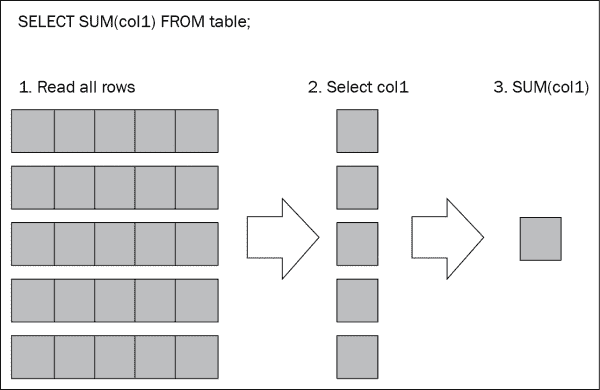
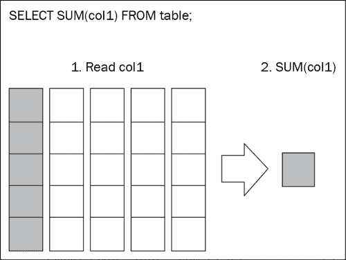

# 第九章：将数据处理任务卸载到数据库系统

我们已经学习了多种优化 R 代码性能的方法，以实现速度和内存效率。但有时仅使用 R 是不够的。也许，一个非常大的数据集存储在数据仓库中。将所有数据提取到 R 中进行处理是不切实际的。我们甚至可能希望利用专门设计的分析数据库的强大功能，这些数据库可以比 R 更高效地执行计算。在本章中，我们将学习如何从 R 内部利用外部数据库系统的功能，并将这种功能与 R 语言的灵活性和易用性相结合。

本章涵盖了以下内容：

+   将数据提取到 R 中与在数据库中处理数据

+   使用 SQL 在关系型数据库中预处理数据

+   将 R 表达式转换为 SQL

+   在数据库中运行统计和机器学习算法

+   使用列式数据库以提高性能

+   使用数组数据库以实现最大的科学计算性能

# 将数据提取到 R 中与在数据库中处理数据

大多数 R 程序员熟悉且非常舒适地使用 R 数据结构和包来操作数据。这需要将所有数据移动到 R 中，无论是在内存中还是在磁盘上，在单台计算机上还是在集群上。在某些情况下，这可能不是高效的，特别是如果数据不断变化且需要经常更新——每次分析时从数据库或数据仓库中提取数据需要大量的时间和计算资源。在某些情况下，可能根本无法将数以兆计的数据从其来源移动到 R 中。

与将数据移动到 R 中不同，另一种方法是将计算任务移动到数据所在的位置。换句话说，我们可以在数据库中处理数据，并将结果仅检索到 R 中，这些结果通常比原始数据小得多。这减少了传输数据所需的网络带宽以及处理 R 中数据所需的本地存储和内存。它还允许 R 程序员利用专为大型数据集上的分析工作负载而设计的强大数据库。

为了在数据库中执行计算和分析，需要一套新的工具。所有数据库工具的基础是 SQL 语言，大多数关系型数据库都支持 SQL。虽然本书不是关于 SQL 的，但了解如何在数据库中运行简单的 SQL 语句可以帮助加快 R 中许多任务的执行速度。其他工具，如`dplyr`，建立在 SQL 的基础上，提供易于使用且熟悉的接口，例如类似数据框的对象，以便在数据库中操作数据。还有其他工具，如 MonetDB.R 和 SciDB，使我们能够利用专为高性能分析工作负载（如列式和数组数据库）而设计的数据库。在接下来的几节中，我们将探讨这些工具。

# 使用 SQL 在关系型数据库中预处理数据

我们将首先学习如何在 R 中运行 SQL 语句，最初的几个示例将展示如何在数据库中处理数据而不是将所有数据移动到 R 中，即使是简单的操作也能带来更快的性能。

要运行本章中的示例，你需要一个 R 支持的数据库服务器。CRAN 包`RJDBC`提供了一个接口，用于大多数数据库附带的 JDBC 驱动程序。或者，在 CRAN 上搜索提供针对每个数据库特定功能和优化的包，如`RPostgreSQL`、`RMySQL`和`ROracle`。

以下示例基于 PostgreSQL 数据库和`RPostgreSQL`包，因为我们将在本章学习`PivotalR`包和 MADlib 软件时需要它们。不过，你可以自由地将代码适配到你使用的数据库。

配置 PostgreSQL 与 R 一起工作涉及设置服务器和客户端。首先，我们需要设置 PostgreSQL 数据库服务器。这可以是在运行 R 的不同计算机上，以模拟从 R 中访问现有数据库；或者它也可以在同一台计算机上以简化操作。在我们的案例中，我们将设置一个 Linux 虚拟机来托管 PostgreSQL 数据库服务器，并使用 Mac OS X 作为客户端。以下是设置数据库服务器的步骤：

1.  从[`www.postgresql.org/download/`](http://www.postgresql.org/download/)下载 PostgreSQL，并遵循你操作系统的安装说明。

1.  通过将以下命令行添加到`pg_hba.conf`（在 PostgreSQL 的`data`文件夹中）来在数据库服务器上启用用户名/密码认证：

    ```py
    host    all    all    0.0.0.0/0    md5
    ```

1.  通过运行以下命令行创建一个用户账户和密码，该账户和密码可以用于从 R 连接到数据库（你可能需要作为`root`或`postgres`用户来运行此命令）：

    ```py
    $ createuser  --pwprompt ruser

    ```

1.  通过运行以下命令行创建用于本章示例的数据库（你可能需要作为`root`或`postgres`用户来运行此命令）：

    ```py
    $ createdb --owner=ruser rdb

    ```

1.  通过将以下行添加到`postgresql.conf`（在 PostgreSQL 的`data`文件夹中）来确保数据库可以通过运行 R 的计算机的网络连接访问：

    ```py
    listen_address = '*'
    port = 5432
    ```

1.  重启 PostgreSQL 服务器以使更改生效（你可能需要作为`root`用户来完成此操作）。

接下来，我们将通过在运行 R 的计算机上安装`RPostgreSQL`包来设置客户端：

1.  非 Windows 系统：安装`libpq`，PostgreSQL 的 C 库，这是安装`RPostgreSQL`所需的。如果你已经在同一台计算机上安装了 PostgreSQL 服务器，那么库已经存在于系统中，因此你可以跳过此步骤。否则，请确保库的版本与 PostgreSQL 服务器的版本相匹配：

    ```py
    # On Mac OS X (using Homebrew)
    $ brew install postgresql 
    # On Debian / Ubuntu
    $ sudo apt-get install libpq-dev
    # On Redhat / CentOS
    $ sudo yum install postgresql-devel
    # On Windows: this step is not needed

    ```

1.  运行 R 并从其源代码安装`RPostgreSQL` CRAN 包：

    ```py
    # On platforms other than Windows
    install.packages("RPostgreSQL", type="source")
    # On Windows
    install.packages("RPostgreSQL")
    ```

1.  通过用你数据库的正确信息替换细节来测试 R 中的数据库连接：

    ```py
    library(RPostgreSQL)
    db.drv <- PostgreSQL()
    db.conn <- dbConnect(db.drv, host = "hostname",
                         port = 5432, dbname = "rdb",
                         user = "ruser",
                         password = "rpassword")
    dbListTables(db.conn)
    ## character(0)
    ```

一旦数据库设置完成，我们将为后续的示例生成一些销售数据。示例数据库有两个表，`sales`和`trans_items`。`sales`表包含关于零售连锁店销售交易的信息，包括交易 ID、客户 ID 和商店 ID。`trans_items`表记录了每个交易中的单个商品以及每个商品的总价格。一旦在 R 中生成了数据，我们将使用`dbWriteTable()`将数据写入数据库中的新表，如下所示：

```py
ntrans <- 1e5
ncust <- 1e4
nstore <- 100
sales <- data.frame(
    trans_id = seq_len(ntrans),
    cust_id = sample.int(ncust, ntrans, TRUE),
    store_id = sample.int(nstore, ntrans, TRUE))
dbWriteTable(db.conn, "sales", sales)
trans.lengths <- rpois(ntrans, 3) + 1L
trans.items <- data.frame(
    trans_id = rep.int(seq_len(ntrans), trans.lengths),
    item_id = unlist(lapply(trans.lengths, sample.int, n = 1000)),
    price = exp(rnorm(sum(trans.lengths))))
dbWriteTable(db.conn, "trans_items", trans.items)

```

第一个任务是计算每个商店的总销售额。让我们比较两种不同的方法。第一种方法是通过连接`sales`和`trans_items`表，提取所有商店 ID 以及与每个商店相关的商品价格。一旦这些数据在 R 中，每个商店的销售额是通过使用`tapply()`对每个商店 ID 的商品价格进行求和来计算的。计算相同数据的第二种方法是使用 SQL 的`GROUP BY`子句和`SUM()`函数在数据库中执行聚合。我们将使用`microbenchmark()`来比较两种方法的执行时间：

```py
library(microbenchmark)
microbenchmark({
    res <- dbGetQuery(
        db.conn,
        'SELECT store_id, price
        FROM sales INNER JOIN trans_items USING (trans_id);')
    res <- tapply(res$price, res$store_id, sum)
}, times = 10)
## Unit: milliseconds
##       min       lq   median       uq      max neval
##  740.7533 745.2563 771.3706 775.3665 780.3819    10
microbenchmark({
    res <- dbGetQuery(
        db.conn,
        'SELECT store_id, SUM(price) as total_sales
        FROM sales INNER JOIN trans_items USING (trans_id)
        GROUP BY store_id;')
}, times = 10)
## Unit: milliseconds
##      min       lq   median       uq      max neval
##  244.779 248.6401 251.1465 255.3652 279.6666    10
```

在这个简单的测试中，在数据库中执行计算只需要用 R 提取数据执行相同操作所需时间的 33%。让我们看看另一个例子。第二个任务是获取花费最多钱的前十位客户的列表，按金额降序排列。同样，我们将比较在 R 中执行计算与在数据库中执行计算的速率：

```py
microbenchmark({
    res <- dbGetQuery(
        db.conn,
        'SELECT cust_id, price
        FROM sales INNER JOIN trans_items USING (trans_id);')
    res <- tapply(res$price, res$cust_id, sum)
    res <- sort(res, decreasing = TRUE)
    res <- head(res, 10L)
}, times = 10)
## Unit: milliseconds
##       min       lq   median       uq      max neval
##  814.2492 828.7774 843.1869 846.4235 952.1318    10
microbenchmark({
    res <- dbGetQuery(
        db.conn,
        'SELECT cust_id, SUM(price) as spending
        FROM sales INNER JOIN trans_items USING (trans_id)
        GROUP BY cust_id
        ORDER BY spending DESC
        LIMIT 10;')
}, times = 10)
## Unit: milliseconds
##       min       lq   median       uq      max neval
##  259.1621 260.5494 260.9566 265.1368 294.1732    10
```

再次，在数据库中而不是在 R 中运行计算导致执行时间减少了 70%。

一旦我们完成，我们需要从数据库断开连接：

```py
dbDisconnect(db.conn)
```

这些测试是在同一台计算机上进行的，数据库服务器运行在虚拟机中。即使在如此小的数据集和非常小的网络（主机计算机和虚拟机之间的虚拟网络）上，性能差异也非常明显。这些测试清楚地表明，最小化从数据库中复制的数据量可以提供巨大的性能提升。在更大的数据集和强大的分析数据库上，性能差异可能更加明显。

# 将 R 表达式转换为 SQL

虽然 SQL 是一种强大且灵活的语言，用于在数据库中操作数据，但并非每个人都能熟练掌握它。幸运的是，R 社区已经开发了一些包，可以将熟悉的 R 语法转换为在数据库上执行的 SQL 语句。我们将探讨其中的两个——`dplyr`和`PivotalR`。

## 使用 dplyr

`dplyr`包是一个方便的包，旨在允许使用标准操作和转换来操作类似表的数据，无论数据存储在哪里——在数据框、数据表或数据库中。它支持 SQLite、PostgreSQL、MySQL、Amazon RedShift、Google BigQuery 和 MonetDB 数据库。

`dplyr` 包提供了一种方法，可以在不实际在数据库服务器上执行计算的情况下指定要执行的一组操作，通过调用 `collect()` 函数来指示 R 执行。通过将几个操作组合在一起（而不是逐个执行），数据库服务器可以优化执行。这反过来有助于最小化服务器的计算负载。让我们通过一个例子看看它是如何工作的。

首先，我们需要与数据库建立连接，就像之前一样。在这里，我们将使用 `dplyr` 提供的 `src_postgres()` 函数。语法与 `RPostgreSQL` 的 `dbConnect()` 略有不同，但参数相似。建立连接后，我们将使用 `tbl()` 函数在数据库中创建对 `sales` 和 `trans_items` 表的引用：

```py
library(dplyr)
db.conn <- src_postgres(dbname = "rdb", host = "hostname",
                        port = 5432, user = "ruser",
                        password = "rpassword")
sales.tb <- tbl(db.conn, "sales")
trans_items.tb <- tbl(db.conn, "trans_items")
```

让我们使用 `dplyr` 重新创建之前的例子：

```py
joined.tb <- inner_join(sales.tb, trans_items.tb, by = "trans_id")
cust.items <- group_by(joined.tb, cust_id)
cust.spending <- summarize(cust.items, spending = sum(price))
cust.spending <- arrange(cust.spending, desc(spending))
cust.spending <- select(cust.spending, cust_id, spending)
```

第一步是使用 `inner_join()` 将 `sales` 和 `trans_items` 表连接起来。然后，`group_by()` 根据客户 ID 对项目进行分组，`summarize()` 对每个客户的总消费进行求和。最后，我们将使用 `arrange()` 按消费金额降序排序客户，并使用 `select()` 选择我们想要的列。

每个这些步骤的输出都是一个 `tbl` 对象：

```py
class(cust.spending)
## [1] "tbl_postgres" "tbl_sql"      "tbl"
```

这些是虚拟表，是迄今为止应用的所有操作的累积。到目前为止，尚未向数据库服务器发送 SQL 语句，也没有在其上执行计算。我们可以通过检索 `tbl` 对象的 `query` 成员来检查在检索结果时将执行的 SQL 查询：

```py
cust.spending$query
## <Query> SELECT "cust_id" AS "cust_id", "spending" AS "spending"
## FROM (SELECT "cust_id", SUM("price") AS "spending"
## FROM (SELECT "row.names" AS "row.names.x", "trans_id" AS
## "trans_id", "cust_id" AS "cust_id", "store_id" AS "store_id"
## FROM "sales") AS "nsthygziij"
##
## INNER JOIN 
##
## (SELECT "row.names" AS "row.names.y", "trans_id" AS "trans_id",
## "item_id" AS "item_id", "price" AS "price"
## FROM "trans_items") AS "cuwpqadrgf"
##
## USING ("trans_id")
## GROUP BY "cust_id") AS "_W8"
## ORDER BY "spending" DESC
## <PostgreSQLConnection:(11726,2)> 
```

通常，`collect()` 函数用于运行 SQL 语句并检索结果：

```py
custs.by.spending <- collect(cust.spending)
```

由于我们只想获取前 10 名客户而不是所有客户，我们可以使用 `head()` 来最小化从数据库传输到 R 的数据：

```py
top.custs <- head(cust.spending, 10L)
```

随着在 `dplyr` 中构建更复杂的数据操作，单个 R 语句和临时变量可能会变得难以管理。`dplyr` 包提供了 `%>%` 操作符来链接操作。前面的结构可以更简洁地重写为：

```py
top.custs <-
    sales.tb %>% inner_join(trans_items.tb, by = "trans_id") %>%
    group_by(cust_id) %>%
    summarize(spending = sum(price)) %>%
    arrange(desc(spending)) %>%
    select(cust_id, spending) %>%
    head(10L)
```

`dplyr` 包提供了其他有用的操作，如 `filter()` 用于过滤行，以及 `mutate()` 用于定义新列作为现有列的函数。这些操作可以以许多创造性和有用的方式组合起来，在将结果检索到 R 之前在数据库中处理数据。

## 使用 PivotalR

`PivotalR` 包提供了与 `dplyr` 类似的特性，但语法不同。因为它是由 Pivotal Software Inc. 开发的，所以它只支持 PostgreSQL 或 Pivotal (Greenplum) 数据库。

如同往常，使用该包的第一步是建立与数据库的连接：

```py
library(PivotalR)
db.conn <- db.connect(host = "hostname", port = 5432,
                      dbname = "rdb", user = "ruser",
                      password = "rpassword")
```

### 注意

如果你还没有在 PostgreSQL 数据库上安装 MADlib（请参阅本章下一节），你可能会收到一个警告，提示“数据库中不存在 MADlib。”在本节中的示例不会遇到这个问题，因为它们不涉及 MADlib 函数。

下一步是使用 `db.data.frame()` 创建对数据库表的引用：

```py
sales.tb <- db.data.frame("sales", db.conn)
trans_items.tb <- db.data.frame("trans_items", db.conn)
```

`db.data.frame` 对象在许多方面与标准的 R 数据框类似，但它们是需要在数据库上执行的 SQL 查询的包装器。许多标准的 R 信息和统计函数都得到了支持。为了执行 SQL 并检索结果，请使用 `lookat()` 函数（或简写 `lk()`）。例如：

```py
dim(sales.tb)
## [1] 1e+05 4e+00
names(sales.tb)
## [1] "row.names" "trans_id"  "cust_id"   "store_id" 
lookat(count(sales.tb$cust_id))
## [1] 1e+05
lookat(min(trans_items.tb$price))
## [1] 0.009554177
lookat(max(trans_items.tb$price))
## [1] 121.3909
```

要查看将在数据库服务器上执行的 SQL 查询，请使用 `content()` 方法：

```py
content(max(trans_items.tb$price))
## [1] "select max(\"price\") as \"price_max\"
## from \"trans_items\""
```

### 注意

如果你收到“无效的 SciDB 对象”错误消息，这可能意味着一些 `PivotalR` 函数被 `SciDB` 包中同名函数遮蔽了，我们将在本章后面讨论这个问题。特别是，这两个包都提供了 `count()` 函数。为了成功运行本节中的示例，请使用 `detach("package:scidb", unload=TRUE)` 卸载 `scidb` 包。

可以通过使用熟悉的 R 语法从现有列计算新列，而不会影响数据库中的数据；相反，转换被转换为在数据库上实时计算新列的 SQL 函数。在以下示例中，我们将计算一个新的列 `foreign_price`，该列返回到 R 的内存中，而不是存储在数据库中：

```py
trans_items.tb$foreign_price <- trans_items.tb$price * 1.25
content(trans_items.tb)
## [1] "select \"row.names\" as \"row.names\", \"trans_id\" as
## \"trans_id\", \"item_id\" as \"item_id\", \"price\" as
## \"price\", (\"price\") * (1.25) as \"foreign_price\" from 
## \"trans_items\""
```

让我们来看一个如何在 `PivotalR` 中构建查询的完整示例。比如说，我们想要计算一些统计信息，以了解交易层面的消费者购买模式。我们必须按交易分组数据，然后再按客户分组，以计算每个客户的统计信息：

```py
trans <- by(trans_items.tb["price"], trans_items.tb$trans_id, sum)
sales.value <- merge(sales.tb[c("trans_id", "cust_id",
                                "store_id")],
                     trans, by = "trans_id")
cust.sales <- by(sales.value, sales.value$cust_id,
                 function(x) {
                     trans_count <- count(x$trans_id)
                     total_spend <- sum(x$price_sum)
                     stores_visited <- count(x$store_id)
                     cbind(trans_count, total_spend,
                           stores_visited)
                 })
names(cust.sales) <- c("cust_id", "trans_count", "total_spend",
                       "stores_visited")
lookat(cust.sales, 5)
##   cust_id trans_count total_spend stores_visited
## 1       1           9    44.73121              9
## 2       2           7    41.90196              7
## 3       3          13    87.37564             13
## 4       4          11    58.34653             11
## 5       5          15    95.09015             15
```

`by()` 的第一次调用将项目级别的销售数据聚合到交易中；计算每个交易的总价值。然后，`merge()` 将 `sales` 表与聚合的交易数据合并，以匹配客户及其花费的金额。然后，我们将再次使用 `by()` 来按客户聚合所有交易。对于每个客户，我们将计算他们进行的交易数量、这些交易的总价值以及他们访问的店铺数量。

除了返回结果外，还可以使用 `as.db.data.frame()` 将它们存储到新的数据库表中。这对于涉及许多中间步骤的长时间计算非常有用。将中间结果存储在数据库中有助于减少 R 和数据库之间传输的数据量。

```py
cust_sales.tb <- as.db.data.frame(cust.sales, "cust_sales")
```

可以从中间数据中计算更多的统计信息，例如客户消费的最小值、最大值、平均值和标准差：

```py
lookat(min(cust_sales.tb$total_spend))
## [1] 0.4961619
lookat(max(cust_sales.tb$total_spend))
## [1] 227.8077
lookat(mean(cust_sales.tb$total_spend))
## [1] 66.16597
lookat(sd(cust_sales.tb$total_spend))
## [1] 26.71887
```

当中间数据不再需要时，可以从数据库中删除它：

```py
delete(cust_sales.tb)
```

`dplyr` 和 `PivotalR` 都提供了灵活且简单的方法，使用 R 函数和语法在数据库中操作数据。它们使我们能够利用高性能数据库的处理能力和速度来查询大型数据集，并将查询结果集成到 R 中的其他分析中。由于它们在功能上相当相似，选择两者之间的区别主要取决于与现有数据库系统的兼容性以及个人对某种语法而非另一种语法的偏好。

# 在数据库中运行统计和机器学习算法

到目前为止，本章中的示例已在数据库中的数据上执行了简单的计算。有时我们需要执行比这更复杂的计算。一些数据库供应商已经开始将高级统计或甚至机器学习功能构建到他们的数据库产品中，允许这些高级算法在数据库中以高度优化的代码运行，以实现最佳性能。在本章中，我们将探讨一个开源项目 MADlib ([`madlib.net/`](http://madlib.net/))，其开发由 Pivotal Inc. 支持，它将高级统计和机器学习功能带给 PostgreSQL 数据库。

MADlib 为 PostgreSQL 添加了大量统计功能，包括描述性统计、假设检验、数组算术、概率函数、降维、线性模型、聚类模型、关联规则和文本分析。新模型和统计方法不断添加到库中，以扩展其功能。

### 注意

目前，MADlib 二进制文件仅适用于 Mac OS X 和 Red Hat/CentOS Linux。对于其他操作系统，[`github.com/madlib/madlib/wiki/Building-MADlib-from-Source`](https://github.com/madlib/madlib/wiki/Building-MADlib-from-Source) 提供了从源代码构建 MADlib 的说明。截至写作时，MADlib 不支持 Windows。

在安装 MADlib 之前，请确保已安装 PostgreSQL 的 `plpython` 模块。在 Redhat/CentOS 上，通过替换与 PostgreSQL 版本匹配的包名来运行此命令：

```py
$ yum install postgresql93-plpython
```

在 Mac OS X 上，检查您的 PostgreSQL 安装方法的文档。例如，使用 Homebrew，以下命令安装带有 `plpython` 支持的 PostgreSQL：

```py
$ brew install postgresql --with-python
```

一旦使用 `plpython` 设置了 PostgreSQL，请按照 [`github.com/madlib/madlib/wiki/Installation-Guide`](https://github.com/madlib/madlib/wiki/Installation-Guide) 中的说明安装 MADlib。用于安装 MADlib 的用户账户需要超级用户权限，这可以通过在 PostgreSQL 中运行 `ALTER ROLE ruser WITH SUPERUSER;` 来授予。

现在，返回 R 并使用 `RPostgreSQL` 包连接到 PostgreSQL：

```py
db.drv <- PostgreSQL()
db.conn <- dbConnect(db.drv, host = "hostname",
                     port = 5432, dbname = "rdb",
                     user = "ruser",
                     password = "rpassword")
```

假设我们想要挖掘我们的销售数据库中的关联规则。正如你从第六章中记得的，《减少内存使用的小技巧》，`arules`包提供了挖掘频繁项集和关联规则的函数。为了使用`arules`包，整个`trans_items`表需要提取到 R 中并转换为`transactions`对象。如果数据集很大，这可能会花费很长时间，或者根本不可能完成。

或者，我们可以使用 MADlib 函数在数据库中挖掘关联规则。数据根本不需要从数据库中复制出来，只要数据库服务器或集群有足够的容量，所有计算都可以在数据库中完成。

运行关联规则挖掘算法就像在 SQL `SELECT`语句中调用`madlib.assoc_rules()`函数一样简单：

```py
dbGetQuery(
    db.conn,
    "SELECT *
    FROM madlib.assoc_rules(
        0.001,         -- support
        0.01,          -- confidence
        'trans_id',    -- tid_col
        'item_id',     -- item_col
        'trans_items', -- input_table
        'public',      -- output_schema
        TRUE           -- verbose
    );")
## INFO:  finished checking parameters
## CONTEXT:  PL/Python function "assoc_rules"
## INFO:  finished removing duplicates
## CONTEXT:  PL/Python function "assoc_rules"
## # Output truncated
## INFO:  6 Total association rules found. Time: 0.00557494163513
## CONTEXT:  PL/Python function "assoc_rules"
##   output_schema output_table total_rules      total_time
## 1        public  assoc_rules           6 00:01:21.860964
```

前面的代码中包含了描述`madlib.assoc_rules()`参数的注释。在这里，算法被要求搜索支持至少为 0.001 和置信度至少为 0.01 的关联规则。指定了输入表和列的名称，以及可以存储结果的模式的名称。在这种情况下，结果将存储在`public`模式中名为`assoc_rules`的表中。

每次函数运行时，`assoc_rules`表将被覆盖；所以如果你想要保留结果的一个副本，你必须复制该表。

让我们检索结果，即满足最小支持和置信度的关联规则：

```py
dbGetQuery(
    db.conn,
    'SELECT * FROM assoc_rules;')
##   ruleid   pre  post support confidence     lift conviction
## 1      1 {353} {656}   1e-04 0.02272727 5.516328   1.019040
## 2      2 {656} {353}   1e-04 0.02427184 5.516328   1.020366
## 3      3 {770} {420}   1e-04 0.02444988 6.022137   1.020901
## 4      4 {420} {770}   1e-04 0.02463054 6.022137   1.021059
## 5      5 {755} {473}   1e-04 0.02469136 6.203859   1.021236
## 6      6 {473} {755}   1e-04 0.02512563 6.203859   1.021619
```

结果表明每个关联规则左右两侧的项目，以及每个规则的统计数据，如支持、置信度、提升和确信度。

大多数其他 MADlib 函数以类似的方式工作——数据以数据库表的形式提供给函数，使用适当的参数调用函数，并将结果写入指定模式的新数据库表。

### 注意

因为 Pivotal, Inc.开发了`PivotalR`包和 MADlib，所以`PivotalR`自然提供了对一些 MADlib 函数的接口，例如线性模型、ARIMA 时间序列模型和决策树。它还提供了从 MADlib 输出中提取信息的有用函数，例如回归系数。不幸的是，`PivotalR`并没有提供所有 MADlib 函数的包装器，例如前面代码中使用的`madlib.assoc_rules()`函数。为了在 MADlib 库中使用最大的灵活性，请使用 SQL 语句调用 MADlib 函数。

像 MADlib 这样的数据库内分析库允许我们利用大型数据库中高级分析的力量，并将算法的结果带入 R 进行进一步分析和处理。

# 使用列式数据库提高性能

大多数关系型数据库使用基于行的数据存储架构——数据按行存储在数据库中。每当数据库执行查询时，它都会在处理查询之前检索查询相关的相关行。这种架构非常适合业务交易用途，其中完整的记录（即包括所有列）一次写入、读取、更新或删除。然而，对于大多数统计或分析用例，通常需要读取多行数据，通常只有少数列。因此，基于行的数据库在分析任务中有时效率不高，因为它们一次读取整个记录，而不管实际分析需要多少列。以下图展示了基于行的数据库如何计算一列的和。



在基于行的数据库中计算一列的和

近年来，对数据分析平台的需求增加导致了使用替代存储架构的数据库的发展，这些架构针对数据分析进行了优化，而不是针对业务交易。这种架构之一是**列式存储**。列式数据库按列存储数据，而不是按行存储。这与 R 数据框非常相似，其中数据框的每一列都存储在内存中的一个连续块中，形式为一个 R 向量。当计算一列的和时，列式数据库只需要读取一列数据，如下面的图所示：



在列式数据库中计算一列的和

列式数据库的一个例子是 MonetDB，可以从[`www.monetdb.org/Downloads`](https://www.monetdb.org/Downloads)下载。按照那里的说明进行安装。安装后，请按照以下步骤初始化并启动数据库。

在 Linux 或 Mac OS X 上，在终端窗口中运行以下命令：

```py
# Create a new database farm
# (Replace the path with a location of your choice)
$ monetdbd create /path/to/mydbfarm
# Start the database server
$ monetdbd start /path/to/mydbfarm
# Create a new database within the farm
$ monetdb create rdb
# Release the new database from administration locks
$ monetdb release rdb
```

在 Windows 上，通过转到**开始** | **程序** | **MonetDB** | **启动服务器**来初始化和启动服务器。

由于 MonetDB 基于 SQL，因此从 R 连接到 MonetDB 并与 MonetDB 一起工作与使用 PostgreSQL 类似。我们可以使用`MonetDB.R` CRAN 包执行 SQL 语句或使用`dplyr`。例如，我们可以使用`MonetDB.R`将相同的产品销售和交易数据加载到 MonetDB 中：

```py
library(MonetDB.R)
db.drv <- MonetDB.R()
db.conn <- dbConnect(db.drv, host = "hostname",
                     port = 50000, dbname = "rdb",
                     user = "monetdb",
                     password = "monetdb")
dbWriteTable(db.conn, "sales", sales)
dbWriteTable(db.conn, "trans_items", trans.items)
```

现在，让我们基准测试一下在`RPostgreSQL`示例中使用的相同 SQL 查询的查询性能：

```py
library(microbenchmark)
microbenchmark({
    res <- dbGetQuery(
        db.conn,
        'SELECT store_id, SUM(price) as total_sales
        FROM sales INNER JOIN trans_items USING (trans_id)
        GROUP BY store_id;')
}, times = 10)
## Unit: milliseconds
##       min       lq   median       uq      max neval
##  112.1666 113.0484 113.9021 114.4349 114.7049    10
microbenchmark({
    res <- dbGetQuery(
        db.conn,
        'SELECT cust_id, SUM(price) as spending
        FROM sales INNER JOIN trans_items USING (trans_id)
        GROUP BY cust_id
        ORDER BY spending DESC
        LIMIT 10;')
}, times = 10)
## Unit: milliseconds
##       min       lq  median       uq      max neval
##  114.2376 115.4617 116.515 117.1967 118.4736    10
```

与 PostgreSQL 相比，MonetDB 在查询（如你之前所记得，PostgreSQL 对前两个查询的中位时间分别为 251.1 毫秒和 260.1 毫秒）上节省了 55% 的时间。当然，这并不是行式数据库和列式数据库之间全面或严格的比较，但它表明，通过选择适合任务的正确数据库架构，可以实现性能的提升。

# 使用数组数据库实现最大科学计算性能

列式数据库为类似于 R 数据框的数据集提供了良好的查询性能，例如，大多数来自商业 IT 系统的数据。这些数据集通常是二维的，可以包含异构的数据类型。另一方面，科学数据有时包含同质的数据类型，但却是多维的。例如，不同时间和空间点的气象读数。对于此类应用，一种称为**数组数据库**的新类型数据库提供了更好的查询和科学计算性能。SciDB 是一个例子，可在 [`www.scidb.org/`](http://www.scidb.org/) 下载。`SciDB` 提供了一个**大规模并行处理**（**MPP**）架构，可以在 PB 级的数组数据上并行执行查询。它支持数据库内线性代数、图操作、线性模型、相关性检验和统计检验。它还通过 CRAN 上的 `SciDB` 软件包提供了一个 R 接口。

要下载和安装 SciDB，请遵循 [`github.com/Paradigm4/deployment`](https://github.com/Paradigm4/deployment) 中的说明。然后，在 SciDB 服务器上安装 `shim` ([`github.com/paradigm4/shim`](https://github.com/paradigm4/shim))，这是 R 与 SciDB 通信所需的。最后，从 CRAN 安装 `scidb` 软件包。

使用 `scidbconnect()` 函数连接到 SciDB 数据库：

```py
library(scidb)
scidbconnect(host = "hostname", port = 8080)
```

然后，我们可以使用 `as.scidb()` 将一些数据加载到数据库中：

```py
A <- as.scidb(matrix(rnorm(1200), 40, 30), name = "A")
B <- as.scidb(matrix(rnorm(1200), 30, 40), name = "B")
```

`scidb` 提供了熟悉的 R 语法来操作 SciDB 矩阵和数组：

```py
# Matrix multiplication
A %*% B
# Transpose and addition / subtraction
A + t(B)
# Scalar operations
A * 1.5
```

我们甚至可以将 SciDB 矩阵/数组与 R 矩阵/数组混合使用：

```py
C <- matrix(rnorm(1200), 30, 40)
A %*% C
```

与其他数据库包一样，操作实际上只有在检索结果时才会执行。在 `SciDB` 的情况下，`[]` 操作符会导致数据库执行计算并返回结果：

```py
# Filter only the positive elements of A, and materialize the
# results into R
(A > 0)[]
```

`SciDB` 支持许多其他常见的数组/矩阵操作，如子集、比较、过滤、应用、连接、聚合和排序。它是处理大型、多维数值数据的有力工具。

# 摘要

在本章中，我们游览了各种数据库系统以及允许我们与之交互的 R 包，并看到了如何在数据库中进行查询和分析可以比将数据复制到 R 中进行相同分析提供更好的性能。这对于无法在 R 中轻松处理的大型数据集来说尤其如此；使用针对查询和分析进行优化的数据库可以帮助避免 R 中的性能问题。随着技术的进步，越来越多的先进分析和算法可以在数据库中运行，为面对高效分析大型数据集挑战的 R 程序员提供更多选择。这些强大的数据处理工具可以很好地补充 R——它们提供了分析大型数据集的计算力量，而 R 提供了易于操作和分析的接口。R 还可以帮助将不同的分析线索汇集在一起，无论使用什么工具，都可以使用数据可视化等工具来呈现一个连贯且引人入胜的数据图。

在下一章和最后一章中，我们将进入大数据的前沿，看看 R 如何与大数据工具一起使用来处理极大规模的数据集。
