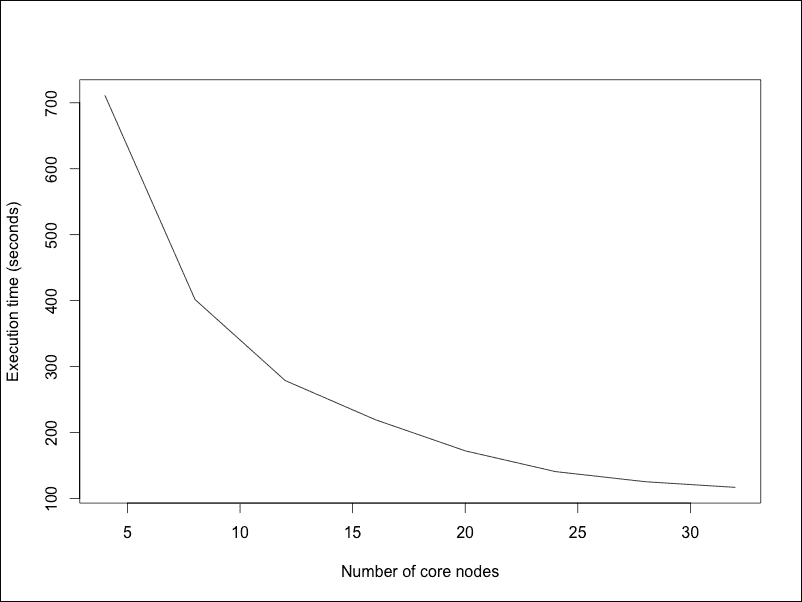

# 第十章：R 与大数据

我们已经来到了这本书的最后一章，我们将深入探讨大规模数据处理。术语*大数据*被用来描述在互联网上不断增长的、速度和种类都在增加的数据量，这些数据在连接的设备和许多其他地方被生成。现在，许多组织拥有测量在皮字节（一个皮字节是 1,048,576 千兆字节）以上的海量数据集，比以往任何时候都要多。对于传统的数据处理工具和数据库架构来说，处理和分析大数据极具挑战性。

2005 年，Yahoo!的 Doug Cutting 和 Mike Cafarella 开发了 Hadoop，基于 Google 之前的工作，以解决这些挑战。他们着手开发一个新的数据平台，以高效地处理、索引和查询数十亿网页。有了 Hadoop，以前需要非常昂贵的超级计算机才能完成的工作现在可以在大量廉价的标准化服务器集群上完成。随着数据量的增长，只需简单地向 Hadoop 集群添加更多服务器即可增加存储容量和计算能力。从那时起，Hadoop 及其工具生态系统已经成为最受欢迎的工具套件之一，用于收集、存储、处理和分析大数据集。在本章中，我们将学习如何从 R 中利用 Hadoop 的力量。

本章涵盖了以下主题：

+   理解 Hadoop

+   在 Amazon Web Services 上设置 Hadoop

+   使用 RHadoop 批量处理大数据集

# 理解 Hadoop

在我们学习如何使用 Hadoop（更多信息请参阅[`hadoop.apache.org/`](http://hadoop.apache.org/))和 R 中的相关工具之前，我们需要了解 Hadoop 的基本知识。就我们的目的而言，了解 Hadoop 包含两个关键组件就足够了：**Hadoop 分布式文件系统（HDFS）**和用于执行数据处理任务的**MapReduce**框架。Hadoop 还包括许多其他组件，用于任务调度、作业管理等，但在这本书中我们不会关注这些。

如其名所示，HDFS 是一个分布在整个服务器集群上的虚拟文件系统。HDFS 以块的形式存储文件，默认块大小为 128 MB。例如，一个 1 GB 的文件会被分割成八个 128 MB 的块，这些块被分布到集群中的不同服务器上。此外，为了防止由于服务器故障导致的数据丢失，这些块会被复制。默认情况下，它们会被复制三次——集群中每个数据块的副本有三个，每个副本存储在不同的服务器上。这样，即使集群中的一些服务器失败，数据也不会丢失，并且可以被重新复制以确保高可用性。

MapReduce 是一个框架，用于以数据并行的方式处理存储在 HDFS 中的数据。注意数据存储的分布式特性如何使 Hadoop 成为适合我们已在 第八章 *通过并行计算提高性能* 中了解到的数据并行算法的理想选择——每个工作节点上存储的数据块会同时并行处理，然后每个节点的结果会被合并以产生最终结果。MapReduce 的工作方式与第八章 *通过并行计算提高性能* 中的数据并行算法非常相似，区别在于数据已经驻留在工作节点上；在运行 R 服务器集群时，每次运行任务都不需要将数据分布，正如 HDFS 和 MapReduce 所做的那样。**Map** 指的是在每个工作节点上对数据进行计算或映射数据到相应的输出的步骤。**Reduce** 指的是将工作节点的结果合并或减少到最终结果的过程。

MapReduce 中的数据表示为键值对。每个 MapReduce 操作本质上是从一组键值对到另一组键值对的转换。例如，一个 **mapper** 可能会从数据库中读取单个客户记录，并生成一个键值对，如 `("Alice", 32)`，其中包含客户的名称（"Alice"）作为键，以及她在给定周收集的奖励点（32）作为相应的值。在 map 步骤之后，所有键值对都会根据键进行排序，具有相同键的键值对会被分配给单个 **reducer**。例如，对于键 `"Alice"` 的所有键值对会有一个 reducer，对于键 `"Bob"` 另一个 reducer，对于 `"Charlie"` 另一个 reducer。reducer 会接受分配给它的所有键值对，对它们进行计算，并以另一个键值对的形式返回结果。

在我们的简单示例中，reducers 可以计算所有客户收集的每周奖励点的平均值。然后 MapReduce 系统收集所有 reducers 的结果作为最终输出，可能类似于 `[("Alice", 26.5), ("Bob", 42.3), ("Charlie", 35.6), ...]`。

虽然 HDFS 和 MapReduce 是 Hadoop 的基础，但它们并不适合所有数据处理任务。一个关键原因是存储在 HDFS 中的数据位于服务器的硬盘上。每次执行 MapReduce 任务时，数据都必须从磁盘读取，计算结果必须写回磁盘。因此，HDFS 和 MapReduce 对于需要超过读取/写入数据和其他运行 Hadoop 集群开销的计算任务时间较大的批量处理任务表现合理。

# 在 Amazon Web Services 上设置 Hadoop

设置 Hadoop 集群的方法有很多。我们可以在伪分布式模式下将 Hadoop 安装在单个服务器上以模拟集群，或者在真实的服务器集群或完全分布式模式下的虚拟机上安装。还有几个 Hadoop 发行版可供选择，从 Apache 基金会提供的纯开源版本到商业发行版，如 Cloudera、Hortonworks 和 MapR。涵盖所有不同的 Hadoop 设置方法超出了本书的范围。我们提供了一种设置 Hadoop 以及本章示例中所需的其他相关工具的说明。如果您正在使用现有的 Hadoop 集群或以不同的方式设置，可能需要修改一些步骤。

### 注意

由于 Hadoop 及其相关工具主要是为基于 Linux/Unix 的操作系统开发的，因此本章中的代码可能在 Windows 上无法运行。如果您是 Windows 用户，请按照本章中的说明在亚马逊网络服务（Amazon Web Services）上设置 Hadoop、R 和所需的软件包。

**亚马逊网络服务**（**AWS**）提供一项名为 **弹性 MapReduce**（**EMR**）的服务，允许我们按小时租用和运行 Hadoop 集群。创建 Hadoop 集群就像指定集群中的服务器数量、每台服务器的规模以及在每个服务器上设置所需工具的说明一样简单。要设置 AWS 账户，请遵循 *前言* 中的说明。在本章中运行 AWS 上的示例将产生一些费用，只要 EMR 集群运行，就会产生费用。查看此链接了解最新的 EMR 价格：[`aws.amazon.com/elasticmapreduce/pricing/`](http://aws.amazon.com/elasticmapreduce/pricing/)。

我们还需要一个脚本，用于在每个服务器上设置所需的工具。将以下脚本保存为 `emr-bootstrap.sh`。此脚本会在 Hadoop 集群中的每个服务器上安装本章所需的 R 软件包，包括 `rhdfs`、`rmr2` 和 `R.utils`。

```py
#!/bin/bash
# Set unix environment variables
cat << EOF >> $HADOOP_HOME/.bashrc
export HADOOP_CMD=$HADOOP_HOME/bin/hadoop
export HADOOP_STREAMING=$HADOOP_HOME/contrib/streaming/hadoop-streaming.jar
EOF
. $HADOOP_HOME/.bashrc
# Fix hadoop tmp permission
sudo chmod 777 -R /mnt/var/lib/hadoop/tmp
# Install dependencies
sudo yum install -y libcurl-devel 
# Install R packages
sudo –E R CMD javareconf
sudo –E R --no-save << EOF
install.packages("R.utils", repos="http://cran.rstudio.com")
EOF
# Install HadoopR dependencies
sudo –E R --no-save << EOF
install.packages(
    c("bitops", "caTools", "digest", "functional", "plyr", "Rcpp",
      "reshape2", "rJava", "RJSONIO", "stringr"),
    repos="http://cran.rstudio.com")
EOF
# Install rhdfs package
wget https://raw.githubusercontent.com/RevolutionAnalytics/rhdfs/master/build/rhdfs_1.0.8.tar.gz
sudo -E R CMD INSTALL rhdfs_1.0.8.tar.gz
# Install rmr2 package
wget https://raw.githubusercontent.com/RevolutionAnalytics/rmr2/master/build/rmr2_3.2.0.tar.gz
sudo –E R CMD INSTALL rmr2_3.2.0.tar.gz
```

将 `emr-bootstrap.sh` 上传到 AWS 简单存储服务（S3），以便 EMR 服务器在首次运行时可以获取它。为此：

1.  前往 AWS 控制台，点击 **S3**。

1.  通过点击 **创建存储桶** 创建一个新的存储桶来存储脚本。

1.  点击刚刚创建的存储桶，然后点击 **上传** 以上传脚本。

接下来，按照以下步骤创建 Hadoop 集群：

1.  前往 AWS 控制台，点击 **EMR**。

1.  点击 **创建集群**。

1.  在 **软件配置** 下，选择亚马逊 Hadoop 发行版（本章中的示例使用的是亚马逊机器镜像（AMI）版本 3.2.1）。

1.  从应用程序列表中删除 Hive 和 Pig，因为它们不是必需的。

1.  在**硬件配置**下，选择 Hadoop 服务器的实例类型。主节点和核心节点的实例类型至少应有 15 GB 的 RAM，例如 `m1.xlarge` 或 `m3.xlarge` 实例类型。输入您希望在集群中使用的节点数量。考虑到默认的 HDFS 复制因子为三，至少应有三个核心节点。任务节点是可选的。

1.  在**安全和访问**下，选择用于登录集群的 EC2 密钥对。

1.  在**引导操作**下，选择**自定义操作**，然后点击**配置和添加**。在**S3 位置**下出现的对话框中，输入或浏览上传 `emr-bootstrap.sh` 的 S3 位置。

1.  (可选) 在**集群配置**下启用日志记录，以便将所有 Hadoop 日志自动存储在 S3 存储桶中。要使用此选项，首先创建一个用于存储日志的 S3 存储桶，并在**日志文件夹 S3 位置**字段中输入存储桶的名称。虽然这是可选的，但存储 Hadoop 日志对于追踪错误和调试很有用，没有日志的话，这些操作可能会很具挑战性，因为执行程序会在 Hadoop 的多个进程和计算机节点上启动。

1.  点击**创建集群**，等待几分钟，直到集群设置完成。

当 EMR 集群准备就绪后，从集群详细信息页面获取主公共 DNS，然后使用您的 AWS EC2 安全密钥从命令行登录到主服务器（将 `hadoop.pem` 替换为您的密钥名称）：

```py
$ ssh –i hadoop.pem root@master-public-dns
```

登录后，运行 R，它是 EMR 集群预安装的：

```py
$ R
```

# 使用 Hadoop 批处理处理大型数据集

批处理是 HDFS 和 MapReduce 可以执行的最基本类型的任务。类似于第八章第八章.通过并行计算提高性能中的数据并行算法，主节点向工作节点发送一组指令，这些节点在其存储的数据块上执行指令。然后，结果被写入 HDFS 的磁盘。

当需要聚合结果时，对数据进行映射和减少步骤。例如，为了计算分布式数据集的平均值，工作节点上的映射器首先计算每个本地数据块中的总和和元素数量。然后，减少器将这些结果相加以计算全局平均值。

在其他时候，如果不需要聚合，则只执行映射步骤。这在数据转换或清理操作中很常见，其中数据只是从一种格式转换到另一种格式。一个例子是从一组文档中提取电子邮件地址。在这种情况下，工作节点上映射器的结果作为新的数据集存储在 HDFS 中，不需要减少器。

R 社区已经开发了几个包来从 R 执行 MapReduce 任务。其中之一是由 Revolution Analytics 开发的 RHadoop 系列包（更多信息请参阅[`github.com/RevolutionAnalytics/RHadoop`](https://github.com/RevolutionAnalytics/RHadoop)）。RHadoop 包括`rhdfs`包，它提供了在 HDFS 中操作文件和目录的功能，以及`rmr2`包，它将 MapReduce 的功能作为 R 函数暴露出来。这些函数使得在不使用 Hadoop Java API 编程的情况下使用 MapReduce 变得容易。相反，`rmr2`在每个工作节点上运行 R 的一个副本，映射器和归约器作为 R 函数编写，以应用于每个数据块。

如果你没有使用前一个部分中的 Hadoop 设置说明，请按照[`github.com/RevolutionAnalytics/RHadoop/wiki`](https://github.com/RevolutionAnalytics/RHadoop/wiki)中的`rhdfs`和`rmr2`的安装说明进行操作。

## 将数据上传到 HDFS

首先要做的是将数据放入 HDFS。对于本章，我们将使用 Google Books Ngrams 数据（更多信息请参阅[`storage.googleapis.com/books/ngrams/books/datasetsv2.html`](http://storage.googleapis.com/books/ngrams/books/datasetsv2.html)）。在这里，n-gram 是文本中连续出现的单词序列，其中*n*代表短语中的单词数量——1-gram 只是一个单词（例如，“Batman”），2-gram 是两个连续的单词（例如，“Darth Vader”），而 6-gram 是六个连续的单词（例如，“Humpty Dumpty sat on a wall”）。我们将使用 1-gram 的数据作为我们的示例。

### 注意

本章的数据集足够大，可以测试 Hadoop 在小集群上的性能，但与许多其他现实世界的数据集相比，它仍然相对较小。例如，`ffdf`（第七章, *使用有限 RAM 处理大型数据集*) 工具可能被用来在单机上处理这个数据集。但当数据量变得很大时，Hadoop 或其他大数据工具可能是处理数据的唯一方式。

以下代码下载 1-gram 数据并将其上传到 HDFS。Google 提供了单独的文件，每个文件包含以字母表中的每个字母开头的单词。在这段代码中，`hdfs.init()`首先初始化到 HDFS 的连接。然后，`hdfs.mkdir()`在 HDFS 中创建用于存储数据的目录`/ngrams/data`。`for`循环中的代码下载每个文件，解压缩它，并使用`hdfs.put()`将其上传到 HDFS：

```py
library(rhdfs)
library(R.utils)
hdfs.init()
hdfs.mkdir("/ngrams/data")
files <- paste0("googlebooks-eng-all-1gram-20120701-", letters)
for (f in files) {
    gzfile <- paste0(f, ".gz")
    url <- paste0("http://storage.googleapis.com/",
                  "books/ngrams/books/",
                  gzfile)
    download.file(url, destfile = gzfile)
    gunzip(gzfile)
    hdfs.put(f, paste0("/ngrams/data/", f))
    file.remove(f)
}
```

我们可以检查所有文件是否已成功上传到 HDFS：

```py
hdfs.ls("/ngrams/data")
## permission  owner      group       size          modtime
## 1  -rw-r--r-- hadoop supergroup 1801526075 2014-10-05 09:59
## 2  -rw-r--r-- hadoop supergroup 1268392934 2014-10-05 10:00
## 3  -rw-r--r-- hadoop supergroup 2090710388 2014-10-05 10:01
## 4  -rw-r--r-- hadoop supergroup 1252213884 2014-10-05 10:01
## 5  -rw-r--r-- hadoop supergroup 1085415448 2014-10-05 10:02
## file
## 1  /ngrams/data/googlebooks-eng-all-1gram-20120701-a
## 2  /ngrams/data/googlebooks-eng-all-1gram-20120701-b
## 3  /ngrams/data/googlebooks-eng-all-1gram-20120701-c
## 4  /ngrams/data/googlebooks-eng-all-1gram-20120701-d
## 5  /ngrams/data/googlebooks-eng-all-1gram-20120701-e
## $ hdfs dfs -du -h /ngrams
# Output truncated
```

## 使用 RHadoop 分析 HDFS 数据

现在数据已加载到 HDFS 中，我们可以使用 MapReduce 来分析数据。比如说，我们想要比较自 1950 年代以来蝙蝠侠与超人的人气。Google Ngrams 数据可能对此提供一些见解。

Ngrams 数据中的每一行都是一个制表符分隔的值列表，以 Ngram 开头，然后是年份，该 Ngram 的出现次数以及该 Ngram 出现在其中的书籍数量。例如，以下命令行表示在 1978 年，单词"mountain"在 Google Books 图书馆的 1,453 本书中出现了 1,435,642 次。

```py
mountain    1978    1435642    1453
```

要比较蝙蝠侠和超人的人气，我们需要找到代表这两个单词从 1950 年及以后的代码行，并整理出现值。

由于数据由制表符分隔的文本文件组成，我们需要指定输入格式，以便`rmr2`函数知道如何读取文件。这可以通过使用`make.input.format()`函数来完成：

```py
library(rmr2)
input.format <- make.input.format(
    format = "csv", sep = "\t",
    col.names = c("ngram", "year", "occurrences", "books"),
    colClasses = c("character", "integer", "integer", "integer"))
```

对于如逗号分隔值或制表符分隔值的分隔文本文件，`make.input.format()`接受与`read.table()`大多数相同的参数。事实上，`rmr2`使用`read.table()`将每个数据块读取到一个数据框中。

除了分隔文本文件外，`rmr2`还可以以原始文本（`format = "text"`）、JSON（`"json"`）、R 的内部数据序列化格式（`"native"`）、Hadoop SequenceFiles（`"sequence.typedbytes"`）、HBase 表（`"hbase"`）和 Hive 或 Pig（`"pig.hive"`）的形式读取/写入数据。有关这些数据类型的参数，请参阅包文档。

我们分析中的地图步骤涉及过滤每行数据以找到相关记录。我们将定义一个`mapper`函数，如下面的代码所示，该函数接受一组键和一组值作为参数。由于 Ngrams 数据不包含键，因此`keys`参数为`NULL`。`values`参数是一个包含数据块的数据框。`mapper`函数查找数据框中包含我们感兴趣的单词的行，对于 1950 年或之后的年份。如果找到任何相关行，则调用`keyval()`函数以返回将传递给 reduce 函数的键值对。在这种情况下，键是单词，值是对应的年份和出现次数：

```py
mapper <- function(keys, values) {
    values$ngram <- tolower(values$ngram)
    superheroes <- values$ngram %in% c("batman", "superman") &
        values$year >= 1950L
    if (any(superheroes)) {
        keyval(values$ngram[superheroes],
               values[superheroes, c("year", "occurrences")])
    }
}
```

### 注意

如果你熟悉 MapReduce，你可能已经注意到`rmr2`允许 mapper 接受和作为列表和表示整个数据块的数据框发出键值对，而不是每次一个记录，就像经典 MapReduce 那样。这可以帮助提高 R 的性能；可以使用向量化 R 操作来处理整个数据块。

下一个步骤发生在幕后，MapReduce 收集所有由 mapper 发出的数据，并按键分组。在这个例子中，它将找到两个组，分别对应于`"batman"`和`"superman"`键。然后 MapReduce 调用 reducer 函数一次处理一组数据。

给定特定超级英雄的数据，reducer 的职责是使用`tapply()`函数按年汇总这位超级英雄名字出现的次数。这是必需的，因为 Ngrams 数据集中的单词是区分大小写的。例如，我们需要将"Batman"、"batman"和"BATMAN"在每个年份出现的次数加起来。然后，reducer 返回超级英雄的名字作为键，以及包含按年汇总的总出现次数的数据框作为值。reducer 的代码如下所示：

```py
reducer <- function(key, values) {
    val <- tapply(values$occurrences, values$year, sum)
    val <- data.frame(year = as.integer(names(val)),
                      occurrences = val)
    keyval(key, val)
}
```

现在我们已经定义了我们的 mapper 和 reducer 函数，我们可以使用`mapreduce()`函数执行 MapReduce 作业。我们将调用此函数，指定输入目录和数据格式，结果输出目录，以及 mapper 和 reducer 函数。

```py
job <- mapreduce(input = "/ngrams/data",
                 input.format = input.format,
                 output = "/ngrams/batmanVsuperman",
                 map = mapper, reduce = reducer)
```

当这个 MapReduce 作业执行时，结果键值对将被写入 HDFS 的`/ngrams/batmanVsuperman`文件夹。我们可以使用`from.dfs()`函数从 HDFS 检索结果到 R 对象。此函数返回一个包含两个组件的列表：`key`和`value`。在这种情况下，`key`是一个字符向量，指定了每行数据的超级英雄名字，而`val`是一个包含相应年份和出现次数的数据框。

```py
results <- from.dfs(job)
batman <- results$val[results$key == "batman", ]
head(batman)
##      year occurrences
## 1950 1950         153
## 1951 1951         105
## 1952 1952         173
## 1953 1953         133
## 1954 1954         359
## 1955 1955         150
superman <- results$val[results$key == "superman", ]
head(superman)
##      year occurrences
## 1950 1950        1270
## 1951 1951        1130
## 1952 1952        1122
## 1953 1953         917
## 1954 1954        1222
## 1955 1955        1087
```

让我们绘制结果，以便比较这两位超级英雄在多年来的受欢迎程度：


根据 Google Books，自 1950 年代以来蝙蝠侠与超人的受欢迎程度对比

虽然这两位超级英雄的受欢迎程度在多年稳步上升，但在 20 世纪 70 年代，关于超人被提及的次数有一个有趣的峰值。这可能是因为 1978 年上映的多届奥斯卡获奖电影《超人》，由克里斯托弗·里夫主演。然而，这种受欢迎程度的激增是短暂的。

完成 MapReduce 算法所需的时间取决于数据的大小、任务的复杂性和集群中的节点数。我们使用`m1.xlarge` AWS 服务器测试了这个示例，每个服务器有 4 个 CPU 和 15 GB 的 RAM，集群大小从 4 到 32 个核心节点（在 EMR 术语中，这些是存储数据并处理数据的节点）。以下图表显示了随着集群中节点数量的增加，执行时间如何减少：



随着集群大小增加的执行时间

由于`rmr2`在每个 Hadoop 节点上启动一个 R 实例来处理数据，因此 MapReduce 任务的效率取决于 mapper 和 reducer 函数的 R 代码效率。本书中许多用于提高串行 R 程序性能的技术也可以在您设计 mapper 和 reducer 函数时应用。此外，每个 MapReduce 作业都会产生启动新作业、从磁盘读取数据以及在集群中协调作业执行的开销。在可能的情况下，将单个任务组合成可以一次性执行的大 MapReduce 任务，通过减少这些开销来提高整体性能。

一旦你完成对 Hadoop 集群的使用，请记住从 AWS EMR 控制台终止集群，以防止意外收费。

## 其他用于 R 的 Hadoop 包

尽管本书的范围仅允许我们介绍一些与 Hadoop 接口的 R 包，但社区已经开发了更多包，以将 Hadoop 的力量带给 R。以下是一些可能有用的更多包：

除了`rhdfs`和`rmr2`之外，RHadoop 还提供了其他包：

+   `plyrmr`：它提供了类似于`plyr`在 MapReduce 上的功能

+   `rhbase`：它提供了与 HBase 数据一起工作的函数

+   `ravro`：它提供了在 Avro 格式中读取/写入数据的功能

另一个名为`RHIPE`（更多信息请参阅[`www.datadr.org/`](http://www.datadr.org/))的包族提供了类似 MapReduce 的功能，但语法略有不同：

+   `RHIPE`：此包提供了核心的 HDFS 和 MapReduce 功能

+   `datadr`：它提供了类似于`plyr`/`dplyr`的数据操作功能

+   `Trelliscope`：它提供了在 HDFS 中可视化大数据集的功能

在撰写本文时，`RHIPE`不支持 YARN 或 MapReduce 2.0。需要使用较旧版本的 Hadoop 才能使用`RHIPE`包，直到这个问题得到解决。

另一个名为`Segue`（更多信息请参阅[`code.google.com/p/segue/`](https://code.google.com/p/segue/))的包采取了不同的方法。它不提供完整的 MapReduce 功能。相反，它将亚马逊的 EMR 视为计算密集型 R 任务的额外计算资源。这与第八章中提到的集群计算类似，即*通过并行计算提高性能*，但使用 EMR 作为计算集群。`Segue`包提供了`emrlapply()`函数，该函数在 EMR 集群上执行并行`lapply`操作；这类似于`parallel`包中的`mclapply()`。

# 摘要

在本章中，我们学习了如何在 Amazon Elastic MapReduce 上设置 Hadoop 集群，以及如何使用 RHadoop 系列包来使用 MapReduce 分析 HDFS 中的数据。我们看到了随着更多服务器被添加到 Hadoop 集群中，MapReduce 任务的性能如何显著提高，但最终由于 Amdahl 定律（第八章，*通过并行计算提高性能*）的限制，性能最终会达到一个极限。

Hadoop 及其工具生态系统正在迅速发展。其他工具正在积极开发中，以使 Hadoop 的性能更加出色。例如，Apache Spark ([`spark.apache.org/`](http://spark.apache.org/)) 提供了弹性分布式数据集 (RDDs)，可以在 Hadoop 集群中存储数据。这使得数据可以从 HDFS 中读取一次，并多次使用，从而显著提高数据探索和梯度下降或 k-means 聚类等迭代任务等交互式任务的性能。另一个例子是 Apache Storm ([`storm.incubator.apache.org/`](http://storm.incubator.apache.org/))，它允许您处理实时数据流。因为这些工具及其相关的 R 接口正在积极开发中，它们在你阅读这本书的时候可能会发生变化，所以我们决定在这里不包含它们。但如果你有内存分析或实时数据处理等特定需求，它们是值得研究的。

我们已经来到了这本书的结尾。回顾过去，我们探索了整个光谱的技术，旨在提高 R 程序的性能，从优化内存利用率和计算速度，到通过并行编程和集群计算来增加计算能力。在这里我们所涵盖的仅仅是基础；关于编写更高效的 R 代码，还有许多东西需要学习。有其他资源会深入探讨比这里更具体的话题。虽然有时有些晦涩难懂，但阅读包文档总是有用的；有时，了解什么可行唯一的方法就是尝试。当然，还有庞大的 R 用户社区，他们在在线论坛、邮件列表和其他地方，总是乐于提供答案和建议。

我们希望您喜欢这本书，并且从中学到了我们撰写它时所学到的东西。感谢您加入我们的这次旅程，并祝愿您在探索 R 高性能计算的世界中一切顺利。
