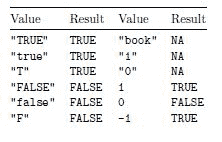

# R 简介

在数据变得越来越重要的世界里，商人和科学家需要工具来高效地分析和处理大量数据。R 是近年来在数据处理、统计分析和数据科学中越来越受欢迎的工具之一，尽管 R 的根源在学术界，但现在它被广泛应用于各个行业和地理区域的组织中。

本章涵盖的一些重要主题如下：

+   R 的历史以及为什么它被设计成这样

+   解释器和控制台是什么以及如何使用它们

+   如何处理 R 的基本数据类型和数据结构

+   如何通过不同的方式使用函数来划分工作

+   如何使用控制结构引入复杂的逻辑

# R 是什么以及它不是什么

当涉及到选择统计计算软件时，很难反对 R。谁会不喜欢一个高质量、跨平台、开源的统计软件产品呢？它有一个交互式控制台用于探索性工作。它可以作为脚本语言运行以复制过程。它内置了许多统计模型，因此你不必重新发明轮子，但当基础工具集不足时，你可以访问丰富的外部包生态系统。而且，它是免费的！难怪 R 在数据时代成为了宠儿。

# R 的灵感来源 – S 语言

R 是由约翰·查普曼在 AT&T 开发的 S 统计语言的灵感来源。S 这个名字是对在 AT&T 同样开发的一个字母命名的编程语言的暗示，那就是著名的 C 语言。R 是由罗斯·伊哈卡和罗伯特·詹宁斯在 1991 年奥克兰大学统计学系创建的。

S 的一般哲学为 R 语言的本身设计奠定了基础，许多来自其他编程语言的程序员可能会觉得它有些奇怪和令人困惑。特别是，重要的是要认识到 S 是为了使数据分析尽可能容易而开发的。

“我们希望用户能够从一个交互式环境中开始，在那里他们不会自觉地考虑编程。然后随着他们的需求变得更加明确，他们的复杂性增加，他们应该能够逐渐过渡到编程，当语言和系统方面变得更加重要时。”

– 约翰·查普曼

这里关键的部分是从分析师到开发者的转变。他们希望构建一种能够轻松服务于这两种类型用户的语言。他们希望构建一种既适合通过命令行进行交互式数据分析，又可用于编程复杂系统（如传统编程语言）的语言。

这本书的结构如此安排并非巧合。我们将首先进行数据分析，然后我们将逐步过渡到开发一个完整且复杂的系统，该系统在顶部有一个网络应用程序用于信息检索。

# R 是一个高质量的统计计算系统

当涉及到编程能力、复杂系统开发、图形制作和社区生态系统时，R 与商业产品相比，往往更具有可比性，甚至更优越。统计学家和机器学习研究人员，以及许多其他与数据相关的学科研究人员，通常会发布 R 包来伴随他们的出版物。这转化为公众可以立即访问最新的统计技术和实现。无论您试图开发什么模型或图形，都有可能有人已经尝试过，如果没有，至少您可以从他们的努力中学习。

# R 是一种灵活的编程语言

正如我们所看到的，除了提供统计工具外，R 还是一种通用编程语言。您可以使用 R 来扩展其自身功能，自动化使用复杂系统的流程，以及许多其他事情。它融合了其他面向对象编程语言的特点，并为函数式编程提供了坚实的基础，这对于解决数据分析中的许多挑战非常合适。R 允许用户编写强大、简洁和描述性的代码。

# R 是自由的，如同自由和如同免费啤酒

在许多方面，一种语言之所以成功，是因为它创建了一个平台，许多人可以通过这个平台创造新事物，而 R 在这方面已经证明是非常成功的。S 语言的一个关键限制是它仅限于商业软件包中，但 R 是自由软件。自由如同自由，也如同免费啤酒。

R 的主要源代码的版权由 R 基金会持有，并发布在 **通用公共许可证**（**GPL**）下。根据自由软件基金会（[`www.fsf.org/`](http://www.fsf.org/)），使用自由软件（自由如同自由）您被授予以下四个自由：

+   **自由 0**：为任何目的运行程序

+   **自由 1**：研究程序的工作方式并将其适应您的需求

+   **自由 2**：重新分发副本，以便您可以帮助您的邻居

+   **自由 3**：改进程序并将您的改进发布给公众

这些自由使得 R 能够发展出强大的多产社区，其中包括世界级的统计学家和程序员以及许多志愿者，他们帮助改进和扩展了该语言。它们还允许 R 在所有流行的操作系统上开发和维护，并使个人和组织能够轻松使用，可能以其他人可以复制其结果的方式分享他们的发现。这就是自由软件的力量。

# R 不擅长的地方

没有编程语言或系统是完美的。R 当然有一些缺点，最常见的是它可能非常慢（如果不正确使用）。记住，R 实质上基于 40 年前的技术，追溯到贝尔实验室开发的原始 S 系统。因此，它的许多不完美之处源于它没有为我们现在所处的数据时代做出预期。当 R 诞生时，磁盘和 RAM 非常昂贵，互联网才刚刚起步。大规模数据分析和高性能计算的概念是罕见的。

快进到现代，硬件成本只是过去的一小部分，计算能力在网上只需几分钱，每个人都对收集和分析大规模数据感兴趣。这种数据分析的激增将 R 的两个基本限制推到了前台，即它是单线程和内存受限的。这两个特性极大地减慢了它的速度。此外，R 是一种解释型动态类型语言，这可能会使其变得更慢。最后，R 有对象不可变性和多种实现面向对象编程的方式，这两者都可能使人们，尤其是那些来自其他语言的人，在不知道如何处理它们的情况下难以编写高质量的代码。你应该知道，本段中提到的所有特性都在第九章，“实现高效的简单移动平均”中得到了解决。

在 R 中，一把双刃剑是，大多数用户并不将自己视为程序员，他们更关心结果而不是过程（这并不一定是个坏事）。这意味着你可以在网上找到的大部分 R 代码都是没有考虑到优雅、速度或可读性的，因为大多数 R 用户不会修订他们的代码来解决这些缺点。这种情况渗透到那些零散且未经严格测试的代码中，进而产生了许多在使用低质量包时必须考虑的边缘情况。你应该牢记这一点。

# 比较 R 与其他软件

我写这一节的目的并不是要全面比较 R 与其他软件，而是简单地指出 R 的一些最显著特性。如果你能的话，我鼓励你自己测试其他软件，以便你能够亲身体验到可能最适合当前工作的最佳工具。

与 SAS、Stata、SPSS 以及甚至 Python 等其他统计软件相比，R 最显著的特点是它拥有大量的可用包。在撰写本文时，**综合 R 档案网络**（**CRAN**）([`cran.r-project.org/`](https://cran.r-project.org/))中已发布近 12,000 个包，而且这还不包括在其他地方发布的包，例如 Git 仓库。这使得 R 拥有一个非常庞大的社区和大量用于数据分析的工具，这些工具涵盖了金融、数学、机器学习、高性能计算等多个领域。

除了 Python 之外，R 在编程能力上比 SAS、Stata、SPSS 都要强，在某些方面甚至比 Python 更强（例如，在 R 中，你可以使用不同的对象模型）。然而，高效且有效地使用 R 需要使用代码，这对一些人来说意味着有一个陡峭的学习曲线，而 Stata 和 SPSS 具有图形用户界面，通过点选向导引导用户完成许多任务。在我看来，这种手把手的教学虽然对初学者很有帮助，但很快就会成为那些想要成为中级或高级用户的人的一个重要限制，这正是编程的优势所在。

R 在所有现有软件中拥有最好的图形系统之一。在 R 中生成图形最流行的包是`ggplot2`包，我们将在本书中广泛使用它，但还有许多其他优秀的绘图包。这个包允许通过其图形语法修改图形的几乎每个方面，并且远远优于我在 SPSS、Stata、SAS 甚至 Python 中看到过的任何东西。

R 是一个伟大的工具，但它并不是适合所有事情的合适工具。如果你想要进行数据分析，但又不想投入时间去学习编程，那么 SAS、Stata 或 SPSS 等软件可能更适合你。如果你想要开发易于集成到更大系统中的分析软件，并且需要连接到各种接口，那么 Python 可能更适合这项工作。然而，如果你想要进行大量的复杂数据分析绘图，并且你将大部分时间都花在这些领域，那么 R 是一个很好的选择。

# 解释器和控制台

正如我之前提到的，R 是一种解释型语言。当你将表达式输入 R 控制台或在操作系统的终端中执行 R 脚本时，一个名为解释器的程序会解析并执行代码。其他解释型语言的例子包括 Lisp、Python 和 JavaScript。与 C、C++和 Java 不同，R 不需要你在执行之前显式地编译你的程序。

所有 R 程序都是由一系列表达式组成的。解释器首先解析每个表达式，在适当的地方用对象替换符号，然后评估它们，最后返回结果对象。我们将在接下来的章节中定义这些概念，但你应该明白，这是所有 R 程序通过的基本过程。

R 控制台是使用 R 的最重要的工具，可以将其视为解释器的一个包装器。控制台是一个允许你直接将表达式输入到 R 中并查看其响应的工具。解释器将读取表达式，如果有错误，则返回结果或错误消息。当你通过控制台执行表达式时，解释器会自动将对象传递给 `print()` 函数，这就是为什么你可以在你的表达式下方看到结果打印出来的原因（我们将在后面更多地介绍函数）。


如果你之前使用过命令行（例如，Linux 或 macOS 中的 bash 或 Windows 中的 cmd.exe）或具有交互式解释器的语言，如 Lisp、Python 或 JavaScript，那么控制台应该看起来很熟悉，因为它只是一个命令行界面。如果不熟悉，不要担心。命令行界面是易于使用的工具。它们是接收代码并返回对象的程序，这些对象的打印表示形式是你执行代码下方看到的。

当你启动 R 时，你会看到一个带有 R 控制台的窗口。在控制台中，你会看到如下所示的消息。此消息显示一些基本信息，包括你正在运行的 R 版本、许可信息、有关如何获取帮助的提示以及命令提示符。

注意，在这种情况下，R 的版本是 3.4.2。本书中开发的代码将假设这个版本。如果你有不同的版本，但如果你遇到一些问题，这可能是一个你可能想要调查的原因。

你应该注意，默认情况下，R 将在控制台最后一行的开头显示一个大于号（>），这表示它已准备好接收命令。由于 R 正在提示你输入内容，这被称为命令提示符。当你看到大于符号时，R 能够接收更多的表达式作为输入。当你看不到时，可能是因为 R 正在处理你发送的内容，你应该等待它完成后再发送其他内容。

```py
Enter key. When you do, you will see a [1] 3 which is the output you received back from R. Go ahead and execute various arithmetic expressions to get a feel for the console:
```

```py
> 1 + 2
[1] 3
```

注意每个返回值旁边伴随的 `[1]`。它在那里是因为结果实际上是一个向量（一个有序集合）。`[1]` 表示显示在该行中的第一个项目的索引是 1（在这种情况下，我们的结果向量中只有一个值）。

最后，您应该知道控制台提供了查看先前命令的工具。您可能会发现上箭头键和下箭头键是最有用的。通过按这些键，您可以滚动查看以前的命令。上箭头键让您查看较早的命令，而下箭头键让您查看较晚的命令。如果您想要对以前的命令进行轻微的修改，或者需要纠正错误，您可以使用这些键轻松地做到这一点。

# 与 R 高效工作的工具

在本节中，我们讨论了在用 R 工作时将帮助我们的工具。

# 选择一个集成开发环境（IDE）或强大的编辑器

为了高效地进行代码开发，您可能想要尝试一个更强大的编辑器或一个**集成开发环境**（**IDE**）。R 最流行的 IDE 是 RStudio（[`www.rstudio.com/`](https://www.rstudio.com/)）。它提供了一套令人印象深刻的特性，使得与 R 的交互变得更加容易。如果您是 R 的新手，并且对编程也较陌生，这可能是您应该采取的方法。如图所示，它将控制台（右侧）包裹在一个更大的应用程序中，该应用程序提供了许多功能，在这种情况下，它显示的是帮助系统（左侧）。此外，RStudio 还提供了标签来导航文件、浏览已安装的包、可视化绘图等功能，以及在上拉菜单下拉选项中提供的大量配置选项。

在本书的整个过程中，我们不会使用 RStudio 提供的任何功能。我将向您展示的是纯 R 功能。我决定这样进行是为了确保本书对任何 R 程序员都有用，包括那些不使用 RStudio 的人。对于 RStudio 用户来说，这意味着可能有一些更简单的方法来完成我将展示的一些任务，而不是编写几行代码，您只需点击一些按钮即可。如果您喜欢这样做，我鼓励您查看 RStudio 网站上提供的优秀 RStudio Essential 网络研讨会，网址为[`www.rstudio.com/resources/webinars/?wvideo=lxel3j2kos`](https://www.rstudio.com/resources/webinars/?wvideo=lxel3j2kos)，以及斯坦福大学的 R 入门，RStudio 版（[`web.stanford.edu/class/stats101/intro/intro-lab01.html`](https://web.stanford.edu/class/stats101/intro/intro-lab01.html)）。

您应该小心避免将 R 称为 RStudio 的常见错误。由于许多人通过 RStudio 接触到了 R，他们认为 RStudio 实际上是 R，但这并不是事实。RStudio 是围绕 R 的一个包装器，用于扩展其功能，在技术上被称为 IDE。

经验丰富的程序员可能更喜欢使用他们已经熟悉并热爱多年且一直在使用的其他工具。例如，在我的情况下，我更喜欢使用 Emacs ([`www.gnu.org/software/emacs/`](https://www.gnu.org/software/emacs/)) 进行任何编程工作。Emacs 是一个非常强大的文本编辑器，你可以通过使用名为**Elisp**的编程语言来编程扩展它，使其以你想要的方式工作，**Elisp**是一种 Lisp 扩展。如果你也使用 Emacs，那么`ess`包就是你真正需要的所有东西。


如果你打算使用 Emacs，我鼓励你查阅`ess`包的文档 ([`ess.r-project.org/Manual/ess.html`](https://ess.r-project.org/Manual/ess.html)) 和 Johnson 的题为《Emacs Has No Learning Curve, University of Kansas, 2015》的演示 ([`pj.freefaculty.org/guides/Rcourse/emacs-ess/emacs-ess.pdf`](http://pj.freefaculty.org/guides/Rcourse/emacs-ess/emacs-ess.pdf))。如果你使用 Vim、Sublime Text、Atom 或其他类似工具，我确信你也能找到有用的包。

# 发送到控制台的功能

基础 R 安装提供了我们在上一节中提到的控制台环境。这个控制台实际上是你与 R 一起工作的全部所需，但它很快就会变得繁琐，需要直接将其中的所有内容都输入进去，它可能不是你的最佳选择。为了高效地使用 R，你需要能够尽可能快地进行实验和迭代。这样做将加速你的学习曲线和生产力。

无论你使用什么工具，你需要的关键功能是能够轻松地将代码片段发送到控制台，而无需自己输入，或者从你的编辑器中复制并粘贴到控制台。在 RStudio 中，你可以通过点击代码编辑面板右上角的运行或源按钮来完成此操作。在 Emacs 中，你可以使用 ess-eval-region 命令。

# 高效的写-执行循环

使用 R 最富有成效的方法之一，尤其是在学习它的时候，是使用*写-执行*循环，该循环利用了上一节中提到的发送到控制台功能。这将允许你完成两个非常重要的事情：通过小而快速的迭代来开发你的代码，这样你可以看到逐步的进度，直到你达到你寻求的行为，并将你达到的行为保存为你的最终结果，该结果可以使用你用于迭代的源代码文件轻松地重现。R 源代码文件使用`.R`扩展名。

假设你有一个准备将表达式发送到控制台的源代码文件，通过写-执行循环的基本步骤如下：

1.  使用代码定义你想要实现的行为。

1.  编写实现你所需行为的最少代码。

1.  使用发送到控制台的功能来验证控制台中的结果是否符合你的预期，如果不符，则识别可能的原因。

1.  如果它不是你所期望的，就回到第二步，目的是修复代码，直到它具有预期的行为。

1.  如果它是你所期望的，就回到第二步，目的是通过添加另一部分行为来扩展代码，直到收敛。

当你开始使用它时，这个编写-执行循环将变得像第二本能一样自然，一旦它做到了，你将成为一个更高效的 R 程序员。它将允许你更快地诊断问题，快速尝试几种实现相同行为的方法，以找到最适合你上下文的方法，一旦你有可工作的代码，它也将允许你清理实现，以保持相同的行为但拥有更好的或更易读的代码。

对于经验丰富的程序员来说，这应该是一个熟悉的过程，并且它与 **测试驱动开发** (**TDD**) 非常相似，但不同的是，你不会使用单元测试来自动测试代码，而是在每个迭代中验证控制台中的输出，并且你没有一组测试来重新测试每个迭代。尽管本书中不会使用 TDD，但你绝对可以在 R 中使用它。

我鼓励你使用这个编写-执行循环来处理本书中提供的示例。有时，我们会逐步展示进度，以便你更好地理解代码，但实际上很难展示我开发过程中所经历的所有的编写-执行循环迭代，而你能够获得的大部分知识都来自于这种方式的重现。

# 在非交互式会话中执行 R 代码

一旦你的代码具有你想要实现的功能，通过交互式会话使用控制台来执行它可能不是最好的方式。在这种情况下，你还有另一个选择，就是告诉你的计算机直接为你执行代码，在一个非交互式会话中。这意味着你将无法在控制台中输入命令，但你将能够配置你的计算机来自动为你执行代码，或者将其集成到更大的系统中，其中 R 只是许多组件之一。这被称为批处理模式。

要在批处理模式下执行代码，你有两种选择：旧的 R `CMD BATCH` 命令，我们不会探讨它，以及较新的 Rscript 命令，我们将探讨这个。**Rscript** 是一个可以在你的计算机终端中执行的命令。它接收源代码文件的名称并执行其内容。

在下面的示例中，我们将使用我们在后续章节中将要解释的各种概念，所以如果你现在感觉还没有准备好理解它，请现在随意跳过，稍后再回来。

假设你有一个名为 greeting.R 的文件中的以下代码。它通过使用 `commandArgs()` 函数创建的 args 对象从命令行获取传递给 Rscript 的参数，将相应的值分配给 greeting 和 name 变量，并最终打印包含这些值的向量。

```py
args     <- commandArgs(TRUE)
greeting <- args[1]
name     <- args[2]

print(c(greeting, name))
```

一旦准备就绪，你可以使用 Rscript 命令从你的终端（而不是 R 控制台）执行它，如下所示。结果显示了传递给它的问候和名称变量值的向量。

当你看到以`$`符号而不是`>`符号开始的命令提示符时，这意味着你应该在你的计算机终端中执行该行，而不是在 R 控制台中。

```py
$ Rscript greeting.R Hi John
[1] "Hi" "John"
```

注意，如果你简单地执行文件而不带任何参数，它们将被作为 NA 值传递，这允许你自定义代码以处理这种情况：

```py
$ Rscript greeting.R
[1] NA NA
```

这是一个非常简单的例子，但同样的机制可以用来执行更复杂的系统，就像我们在本书的最后一章将要构建的那样，从远程服务器持续检索实时价格数据。

最后，如果你想要提供一个更接近 Python 中的机制，你可能需要查看 optparse 包来创建命令行帮助页面以及解析参数。

# 如何使用这本书

为了充分利用这本书，你应该自己重新创建书中展示的示例，并确保你详细理解了每个示例的具体作用。如果在某个时候你感到困惑，在网上进行一些搜索以澄清问题并不太难。然而，我强烈建议你查看以下书籍，这些书籍更详细地介绍了本书中的一些概念和想法，并且被认为是 R 程序员的非常好的参考书籍：

+   *《R 编程艺术》，阿德勒，奥莱利，2010*

+   *《R 编程艺术》，马托夫，No Starch Press，2011*

+   *《高级 R》，威克汉姆，CRC 出版社，2015*

+   *《数据科学中的 R 编程》，彭，LeanPub，2016*

有时，为了澄清某事，你只需要使用 R 的帮助系统。要获取函数的帮助，你可以使用问号符号，如`?function_name`，但如果你想要搜索某个主题的帮助，你可以使用`help.search()`函数，如`help.search` *(回归)*。如果你知道你感兴趣的主题，但记不起你想要使用的实际函数名，这可能会很有帮助。调用此类功能的一种另一种方式是使用双问号符号，如`??`回归。

请记住，本书中的主题是相互关联的，而不是线性排列的，这意味着有时会感觉我们在跳跃。当这种情况发生时，是因为可以从不同的角度看待一个主题。这就是为什么，为了充分利用这本书，你应该尽可能在控制台中实验，并使用前面提到的写-执行循环逐步构建代码。如果你只是完全复制显示的代码，你可能会错过一些通过逐步构建系统可以获得的学到的知识。

最后，你应该知道这本书的目的是通过一些相对真实的例子来展示如何使用 R，因此它不会提供太多关于所讨论主题的技术深度或讨论。此外，由于我的目标是让你快速开始使用真实例子，所以在第一章中，我非常简要地解释了 R 的基础知识，只是为了介绍你接下来几章中需要了解的最少知识。因此，你不应该认为本章中提供的解释就足够你理解 R 的基本结构。如果你在寻找对 R 基础的更深入介绍，你可能想看看我们之前提到的参考资料。

# 使用符号和变量跟踪状态

与大多数编程语言一样，R 允许你给变量赋值并通过名称引用这些对象。在 R 中，你用来引用变量的名称被称为符号。这允许你在需要时保留一些信息。这些变量可以包含 R 中可用的任何类型的对象，甚至在列表中使用时，可以包含它们的组合，正如我们在本章后面的部分将看到的。此外，这些对象是不可变的，但这将是第九章实现高效的简单移动平均的主题。

在 R 中，赋值运算符是 `<-`，它是一个小于符号（`<`）后面跟着一个连字符（`-`）。如果你之前曾与算法伪代码一起工作过，你可能会觉得它很熟悉。你也可以使用单个等号（`=`）进行赋值，类似于许多其他语言，但我更喜欢坚持使用 `<-` 运算符。

表达式 `x <- 1` 的意思是将值 `1` 赋给 `x` 符号，这可以被视为一个变量。你也可以反过来赋值，这意味着使用表达式 `1 -> x` 我们会得到与之前相同的效果。然而，从左到右的赋值很少使用，更多是一种方便的特性，以防你在控制台的一行开头忘记了赋值运算符。

注意，值替换是在将值赋给 `z` 的时候进行的，而不是在 `z` 被评估的时候。如果你将以下代码输入到控制台，你可以看到，当 `z` 第二次被打印时，它仍然具有当它被用来赋值时的 y 的值，而不是之后赋给 y 的值：

```py
x <- 1
y <- 2
z <- c(x, y)
z
#> [1] 1 2

y <- 3
z
#> [1] 1 2
```

使用像 `x`、`y` 和 `z` 这样的变量名很容易，但它们在真实程序中的使用成本很高。当你使用这样的名字时，你可能非常清楚它们将包含什么值以及如何使用。换句话说，它们对你来说意图是清晰的。然而，当你将代码交给别人或长时间后再次回到它时，这些意图可能不再清晰，这就是隐晦名称可能有害的地方。在真实程序中，你的名称应该是自我描述性的，并能立即传达意图。

若想深入了解关于高质量代码的讨论以及许多其他相关话题，请参阅马丁的杰出著作《Clean Code: A Handbook of Agile Software Craftsmanship, Prentice Hall, 2008》。

R 中的标准对象名称应仅包含字母数字字符（数字和 ASCII 字母）、下划线（`_`），以及根据上下文，甚至可以包含点（`.`）。然而，如果你愿意，R 允许你使用非常隐晦的字符串。例如，在下面的代码中，我们展示了如何使用变量 `!A @B #C $D %E ^F` 的名称来包含一个包含三个整数的向量。正如你所见，你甚至可以使用空格。只要你在字符串周围加上反引号（`` ` ``），就可以使用这种非标准名称：

```py
`!A @B #C $D %E ^F` <- c(1, 2, 3)
`!A @B #C $D %E ^F`
#> [1] 1 2 3
```

不言而喻，你应该避免这些名称，但你应该意识到它们的存在，因为在使用 R 的某些更高级功能时，它们可能会派上用场。这类变量名在大多数语言中是不允许的，但 R 在这方面非常灵活。此外，这个例子也展示了 R 编程的一个常见主题：它非常灵活，如果你不小心，你可能会自己给自己挖坑。有人对某些代码感到非常困惑，因为他们假设 R 会以某种方式（例如，在特定条件下引发错误）行为，但没有明确测试这种行为，后来发现它的行为不同。

# 处理数据类型和数据结构

本节总结了 R 中最重要的数据类型和数据结构。在这个简要概述中，我们不会深入讨论它们。我们只会展示几个示例，这将帮助你理解本书中展示的代码。如果你想深入了解它们，你可以查看它们的文档或本章引言中提到的参考文献。

R 中的基本数据类型是数字、文本和布尔值（`TRUE` 或 `FALSE`），R 分别称之为数值、字符和逻辑。严格来说，还有整数、复数和原始数据（字节）的类型，但在这本书中我们不会明确使用它们。R 中的六个基本数据结构是向量、因子、矩阵、数据框和列表，我们将在以下章节中总结。

# 数值计算

R 中的数字的行为几乎与您在数学上期望的相同。例如，操作`2 / 3`执行实数除法，在 R 中结果为`0.6666667`。这种自然的数字行为对于数据分析非常方便，因为您在使用不同类型的数字时不需要过多关注，在其他语言中可能需要特殊处理。此外，运算符的数学优先级同样适用，以及括号的使用。

以下示例展示了如何在操作中使用变量，以及如何处理运算符优先级。如您所见，您可以在执行操作时混合使用变量和值：

```py
x <- 2
y <- 3
z <- 4
(x * y + z) / 5
#> [1] 2
```

模运算可以使用`%%`符号执行，而整数除法可以使用`%/%`符号执行：

```py
7 %% 3
#> [1] 1
7 %/% 3
#> [1] 2
```

# 特殊值

R 中有几个特殊值。NA 值用于表示缺失值，代表不可用。如果一个计算结果为一个太大的数，R 将返回正无穷大 `Inf` 和负无穷大 `-Inf`，分别表示正无穷和负无穷。当数字除以 0 时，这些值也会返回。有时计算会产生一个不太合理的结果。在这些情况下，我们将得到一个 NaN，代表不是一个数字。最后，还有一个空对象，表示为 NULL。符号 NULL 始终指向同一个对象（它本身就是一个数据类型）并且常用于函数中的默认参数，表示没有传递任何值。您应该知道`NA`，`Inf`，`-Inf`，`NaN` 和 `NULL` 不能互相替代。

对于数值、字符和逻辑，存在特定的 NA 值，但我们将坚持使用简单的 NA，它内部被处理为逻辑值。

在以下示例中，您可以看到这些特殊值在 R 中相互使用时的行为。请注意，1 / 0 结果为 `Inf`，`0 / 0`，`Inf - Inf` 和 `Inf / Inf` 结果为未定义，表示为 `NaN`，但 `Inf + Inf`，`0 / Inf` 和 `Inf / 0` 分别结果为 `Inf`，`0` 和 `Inf`。这些结果与数学定义相似并非巧合。此外，请注意，任何包括 `NaN` 或 `NA` 的操作也将分别结果为 `NaN` 和 `NA`：

```py
1 / 0
#> [1] Inf
-1 / 0
#> [1] -Inf
0 / 0
#> [1] NaN
Inf + Inf
#> [1] Inf
Inf - Inf
#> [1] NaN
Inf / Inf
#> [1] NaN
Inf / 0
#> [1] Inf
0 / Inf
#> [1] 0
Inf / NaN
#> [1] NaN
Inf + NA
#> [1] NA
```

# 字符

文本也可以像这样使用，只需记住在它周围使用引号(" ")。以下示例展示了如何将文本“Hi, there!”和“10”保存到两个变量中。请注意，由于“10.5”被引号包围，它被视为文本而不是数值。要找到您实际处理的对象的类型，可以使用`class()`，`typeof()`和`str()`（简称结构）函数来获取有关该对象的元数据。

在这种情况下，由于 y 变量包含文本，我们不能像错误信息中看到的那样将其乘以 2。此外，如果您想了解字符串中的字符数，可以使用`nchar()`函数，如下所示：

```py
x <- "Hi, there!"
y <- "10"
class(y)
#> [1] "character"
typeof(y)
#> [1] "character"
str(y)
#> chr "10"
y * 2
#> Error in y * 2: non-numeric argument to binary operator
nchar(x)
#> [1] 10
nchar(y)
#> [1] 2
```

有时候，你可能既有文本信息，也有你想要合并到单个字符串中的数值信息。在这种情况下，你应该使用`paste()`函数。这个函数接收任意数量的未命名参数，我们将在本章后面的部分中更精确地定义这一点。然后它将每个参数转换为字符，并返回一个包含所有这些参数的单个字符串。以下代码展示了这样的一个例子。注意，y 中的数值 10 被自动转换为字符类型，以便可以将其粘贴到字符串的其余部分中：

```py
x <- "the x variable"
y <- 10
paste("The result for", x, "is", y)
#> [1] "The result for the x variable is 10"
```

有时候，你可能想要替换文本中的某些字符。在这种情况下，你应该使用`gsub()`函数，它代表全局替换。这个函数接受要替换的字符串作为其第一个参数，替换字符串作为其第二个参数，并将返回带有相应替换的文本作为第三个参数：

```py
x <- "The ball is blue"
gsub("blue", "red", x)
#> [1] "The ball is red"
```

另一些时候，你可能想知道一个字符串是否包含子字符串，在这种情况下你应该使用`gprel()`函数。这个函数的名字来源于一个终端命令 grep，它是全局正则表达式打印的缩写（是的，你也可以使用正则表达式来查找匹配）。`grepl()`函数名末尾的 l 来自于结果是一个逻辑值：

```py
x <- "The sky is blue"
grepl("blue", x)
#> [1] TRUE
grepl("red", x)
#> [1] FALSE
```

# 逻辑运算符

逻辑向量包含布尔值，只能为`TRUE`或`FALSE`。当你想要创建具有这些值的逻辑变量时，你必须避免在它们周围使用引号，并记住它们都是大写字母，如下所示。在 R 语言编程中，逻辑值通常用于测试条件，这些条件反过来又用于决定我们应该从复杂的程序中采取哪个分支。我们将在本章后面的部分中查看此类行为的示例：

```py
x <- TRUE
```

在 R 中，你可以使用`as.*()`函数轻松地在不同类型之间转换值，其中`*`用作通配符，可以替换为字符、数值或逻辑，以在这些类型之间进行转换。这些函数通过接收与函数名称指定的类型不同的对象，并在可能的情况下将其解析为指定类型，如果不可能，则返回`NA`。以下示例显示了如何将`TRUE`字符串转换为逻辑值，在这种情况下，不出所料，它变成了逻辑`TRUE`：

```py
as.logical("TRUE")
#> [1] TRUE
```

在 R 中将字符和数值转换为逻辑值不是一件很直观的事情。下表显示了一些这种行为。请注意，尽管`true`字符串（全部小写字母）在去除引号时不是一个有效的逻辑值，但在应用 `as.logical()` 函数时，它会被转换为 `TRUE` 值，这是为了兼容性。还请注意，由于 T 是一个有效的逻辑值，它是 `TRUE` 的快捷方式，所以相应的文本也被接受为表示这样的值。同样的逻辑也适用于 `false` 和 `F`。任何其他字符串都将返回 `NA` 值，这意味着该字符串不能解析为逻辑值。还请注意，0 将被解析为 `FALSE`，但任何其他数值，包括 Inf，都将转换为 `TRUE` 值。最后，请注意，`NA` 和 `NaN` 都将被解析，在两种情况下都返回 NA。

`as.character()` 和 `as.numeric()` 函数的行为不太直观，我将留给你自己探索。当你这样做的时候，尽量测试尽可能多的边缘情况。这样做将帮助你预见在开发自己的程序时可能遇到的问题。



在我们继续之前，你应该知道这些数据结构可以根据它们的维数和是否同质（所有内容必须是同一类型）或异质（内容可以是不同类型）来组织。向量、矩阵和数组是同质数据结构，而列表和数据框是异质。向量和列表具有单一维度，矩阵和数据框具有两个维度，而数组可以具有我们想要的任意多个维度。


当谈到维度时，R 中的数组与许多其他语言中的数组不同，在其他语言中，你需要创建一个数组的数组来产生二维结构，而在 R 中这是不必要的。

# 向量

R 中的基本数据类型是向量，它是有序值集合。你应该知道的第一件事是，与其它语言不同，数字、字符串和逻辑值的单个值是向量的特殊情况（长度为 1 的向量），这意味着在 R 中没有标量的概念。向量是一维数据结构，其所有元素都是相同的数据类型。

创建向量的最简单方法是使用 `c()` 函数，它代表组合，并将所有参数强制转换为单一类型。强制转换将从更简单的类型转换为更复杂的类型。也就是说，如果我们创建一个包含逻辑值、数值和字符的向量，如下例所示，我们的结果向量将只包含字符，因为它们是三种类型中最复杂的。如果我们创建一个包含逻辑值和数值的向量，我们的结果向量将是数值的，因为它是三种类型中最复杂的类型。

向量可以是命名的或未命名的。未命名的向量元素只能通过位置引用来访问，而命名的向量可以通过位置引用以及名称引用来访问。在下面的例子中，y 向量是一个命名的向量，其中每个元素都用字母 A 到 I 命名。这意味着在 x 的情况下，我们只能使用位置（第一个位置被视为 1 而不是其他语言中使用的 0）来访问元素，但在 y 的情况下，我们也可以使用我们分配的名称。

还要注意，我们之前提到的特殊值，即 NA、NULL、NaN 和 Inf，如果它们是更复杂的类型，将会被强制转换为字符，除了 NA，它保持不变。如果强制转换是向数值类型进行，它们都保持不变，因为它们是有效的数值。最后，如果我们想知道向量的长度，只需在它上面调用 `length()` 函数即可：

```py
x <- c(TRUE, FALSE, -1, 0, 1, "A", "B", NA, NULL, NaN, Inf)
x
#> [1] "TRUE" "FALSE" "-1" "0" "1" "A" "B" NA
#> [9] "NaN" "Inf"
x[1]
#> [1] "TRUE"
x[5]
#> [1] "1"
y <- c(A=TRUE, B=FALSE, C=-1, D=0, E=1, F=NA, G=NULL, H=NaN, I=Inf)
y
#> A B  C D E F  H   I
#> 1 0 -1 0 1 NA NaN Inf
y[1]
#> A
#> 1
y["A"]
#> A
#> 1
y[5]
#> E
#> 1
y["E"]
#> E
#> 1
length(x)
#> [1] 10
length(y)
#> [1] 8
```

此外，我们可以使用索引数字的向量来选择或选择元素集合或范围。例如，使用选择器 c(1, 2) 会检索向量的前两个元素，而使用 c(1, 3, 5) 会返回第一个、第三个和第五个元素。: 函数（是的，它是一个函数，尽管我们通常不会使用我们在其他示例中看到的类似函数的语法来调用它），通常用作创建范围选择器的快捷方式。例如，1:5 语法意味着我们想要一个包含元素 1 到 5 的向量，这相当于明确使用 c(1, 2, 3, 4, 5)。此外，如果我们发送一个逻辑向量，它必须与我们要从中检索值的向量的长度相同，每个逻辑值将与我们要从中检索的向量的相应位置相关联，如果相应的逻辑是 `TRUE`，则检索值，但如果它是 `FALSE`，则不会检索。所有这些选择方法都在以下示例中展示：

```py
x[c(1, 2, 3, 4, 5)]
#> [1] "TRUE" "FALSE" "-1" "0" "1"
x[1:5]
#> [1] "TRUE" "FALSE" "-1" "0" "1"
x[c(1, 3, 5)]
#> [1] "TRUE" "-1" "1"
x[c(TRUE, FALSE, TRUE, FALSE, TRUE, FALSE, TRUE, 
    FALSE, TRUE, FALSE, TRUE)]
#> [1] "TRUE" "-1" "1" "B" "NaN" NA
```

接下来我们将讨论向量之间的运算。在数值向量的情况下，我们可以通过简单地使用运算符来逐元素应用操作。在这种情况下，R 将成对匹配两个向量的元素并返回一个向量。以下示例展示了两个向量如何以逐元素的方式相加、相减、相乘和相除。此外，由于我们正在处理长度相同的向量，我们可能想要获取它们的点积（如果你不知道什么是点积，你可以查看[`en.wikipedia.org/wiki/Dot_product`](https://en.wikipedia.org/wiki/Dot_product)），我们可以使用 `%*%` 运算符来完成，它执行类似矩阵的乘法，在这种情况下是向量到向量的乘法：

```py
x <- c(1, 2, 3, 4)
y <- c(5, 6, 7, 8)
x + y
#> [1] 6 8 10 12
x - y
#> [1] -4 -4 -4 -4
x * y
#> [1] 5 12 21 32
x / y
#> [1] 0.2000 0.3333 0.4286 0.5000
x %*% y
#> [,1]
#> [1,] 70
```

如果你想要将多个向量合并成一个，你可以简单地递归地使用 `c()` 函数对它们进行操作，它将自动将它们展平。假设我们想要将 x 和 y 合并成 z，使得 y 的元素先出现。此外，假设我们在合并之后想要对它们进行排序，那么我们对 z 应用 `sort()` 函数：

```py
z <- c(y, x)
z
#> [1] 5 6 7 8 1 2 3 4
sort(z)
#> [1] 1 2 3 4 5 6 7 8
```

混淆的一个常见来源是 R 如何处理不同长度的向量。如果我们应用元素到元素的运算，就像我们之前提到的，但使用不同长度的向量，我们可能会期望 R 抛出一个错误，就像在其他语言中那样。然而，它并没有这样做。相反，它会按顺序重复向量元素，直到它们的长度都相同。以下示例显示了三个不同长度的向量，以及将它们相加的结果。

默认情况下，R 的配置方式实际上会显示一个警告消息，告诉你你操作的向量长度不同，但由于 R 可以配置为避免显示警告，因此你不应该依赖它们：

```py
c(1, 2) + c(3, 4, 5) + c(6, 7, 8, 9)
#> Warning in c(1, 2) + c(3, 4, 5): 
       longer object length is not a multiple of
#> shorter object length
#> Warning in c(1, 2) + c(3, 4, 5) + c(6, 7, 8, 9): 
       longer object length is
#> not a multiple of shorter object length
#> [1] 10 13 14 13
```

第一个可能出现在脑海中的想法是，第一个向量被展开为 `c(1, 2, 1, 2)`，第二个向量被展开为 `c(3, 4, 5, 3)`，而第三个向量保持不变，因为它是最长的。然后如果我们把这些向量加在一起，结果将是 `c(10, 13, 14, 14)`。然而，正如你在示例中看到的，实际的结果实际上是 `c(10, 13, 14, 13)`。那么，我们遗漏了什么呢？混淆的来源是 R 是逐步进行这一步骤的，这意味着它首先执行 `c(1, 2) + c(3, 4, 5)` 的加法，展开后是 `c(1, 2, 1) + c(3, 4, 5)`，结果是 `c(4, 6, 6)`，然后基于这个结果，R 执行的下一步是 `c(4, 6, 6) + c(6, 7, 8, 9)`，展开后是 `c(4, 6, 6, 4) + c(6, 7, 8, 9)`，这就是我们得到的结果来源。一开始可能会感到困惑，但只要记住要想象这些操作是逐步进行的。

最后，我们将简要介绍 R 中一个非常强大的功能，称为向量化。向量化意味着你一次性对一个向量应用一个操作，而不是独立地对它的每个元素进行操作。这是一个你应该相当熟悉的特性。没有它的编程被认为是糟糕的 R 代码，这不仅是因为语法原因，也因为向量化代码利用了 R 中的许多内部优化，这导致了代码运行得更快。我们将在第九章 实现一个有效的简单移动平均中展示不同的向量化代码方法，本章中，我们将看到一个示例，随后在接下来的几节中还将看到更多示例。

尽管短语“向量化代码”一开始可能看起来令人畏惧或神奇，但实际上，R 在某些情况下使其实施变得相当简单。例如，我们可以通过将 x 符号用作单个数字来对 x 向量中的每个元素进行平方。R 足够智能，能够理解我们想要将操作应用于向量中的每个元素。R 中的许多函数都可以使用这种技术进行应用：

```py
x²
#> [1] 1 4 9 16
```

在下一节关于函数的部分，我们将看到更多真正展示向量化如何大放异彩的例子，我们将看到即使在操作依赖于其他参数的情况下，如何应用向量化操作。

# 因子

在分析数据时，遇到分类值是非常常见的。R 提供了一个很好的方法来使用因子表示分类值，这些因子是通过`factor()`函数创建的，是具有每个整数相关标签的整数向量。因子可以取的不同值称为级别。`levels()`函数显示因子的所有级别，`factor()`函数的级别参数可以用来显式定义它们的顺序，如果未显式定义，则按字母顺序排列。

注意，在线性建模中定义显式顺序可能很重要，因为第一个级别被用作`lm()`（线性模型）等函数的基线级别，这些函数我们将在第三章，“使用线性模型预测投票”中使用。

此外，打印因子显示的信息与打印字符向量略有不同。特别是请注意，引号没有显示，并且级别随后按顺序显式打印：

```py
x <- c("Blue", "Red", "Black", "Blue")
y <- factor(c("Blue", "Red", "Black", "Blue"))
z <- factor(c("Blue", "Red", "Black", "Blue"), 
            levels=c("Red", "Black", "Blue"))

x
#> [1] "Blue" "Red" "Black" "Blue"
y
#> [1] Blue Red Black Blue
#> Levels: Black Blue Red
z
#> [1] Blue Red Black Blue
#> Levels: Red Black Blue
levels(y)
#> [1] "Black" "Blue" "Red"
levels(z)
#> [1] "Red" "Black" "Blue"
```

有时因子可能难以处理，因为它们的类型取决于使用什么函数来操作它们。还记得我们之前使用的`class()`和`typeof()`函数吗？当用于因子时，它们可能会产生意外的结果。正如你所看到的，`class()`函数将 x 和 y 分别识别为字符和因子。然而，`typeof()`函数会让我们知道它们分别是字符和整数。这不是很令人困惑吗？这种情况发生是因为，正如我们之前提到的，因子在内部以整数形式存储，并使用类似于查找表的机制来检索与每个整数关联的实际字符串。

从技术上讲，因子存储与它们的整数值关联的字符串的方式是通过属性，这是我们在第八章，“面向对象的系统跟踪加密货币”中将要涉及的一个主题。

```py
class(x)
#> [1] "character"
class(y)
#> [1] "factor"
typeof(x)
#> [1] "character"
typeof(y)
#> [1] "integer"
```

虽然因子看起来和通常的行为像字符向量，正如我们之前提到的，它们实际上是整数向量，所以在将它们当作字符串处理时要小心。一些字符串方法，如`gsub()`和`grepl()`，会将因子强制转换为字符，而其他方法，如`nchar()`，会抛出错误，还有一些方法，如`c()`，会使用其底层的整数值。因此，通常最好显式地将因子转换为所需的 数据类型：

```py
gsub("Black", "White", x)
#> [1] "Blue" "Red" "White" "Blue"
gsub("Black", "White", y)
#> [1] "Blue" "Red" "White" "Blue"
nchar(x)
#> [1] 4 3 5 4
nchar(y)
#> Error in nchar(y): 'nchar()' requires a character vector
c(x)
#> [1] "Blue" "Red" "Black" "Blue"
c(y)
#> [1] 2 3 1 2
```

如果你没有注意到，`nchar()`方法本身应用于 x 因子中的每个元素。字符串`"Blue"`、`"Red"`和`"Black"`分别有 4、3 和 5 个字符。这是我们在向量部分之前提到的向量运算的另一个例子。

# 矩阵

矩阵在数学和统计学中常用，R 的许多功能都来自于你可以对它们执行的各种操作。在 R 中，矩阵是一个具有两个额外属性的向量，即行数和列数。而且，由于矩阵是向量，它们被限制为单一数据类型。

你可以使用`matrix()`函数来创建矩阵。你可以传递一个值向量，以及矩阵应具有的行数和列数。如果你指定了值向量和其中一个维度，另一个维度将自动为你计算，以使向量传递的最低数字有意义。然而，如果你更喜欢同时指定两者，这可能会根据你传递的向量产生不同的行为，如下一个示例所示。

默认情况下，矩阵是按列构建的，这意味着条目可以被认为是从左上角开始并向下运行到列。然而，如果你更喜欢按行构建，你可以发送`byrow = TRUE`参数。此外，请注意，你可以通过指定行数和列数而不传递任何实际数据来创建一个空矩阵或未初始化的矩阵，如果你什么都不指定，将返回一个未初始化的 1x1 矩阵。最后，请注意，在创建矩阵时，我们看到的与向量相同的元素重复机制也适用，所以在以这种方式创建时要小心：

```py
matrix()
#> [,1]
#> [1,] NA

matrix(nrow = 2, ncol = 3)
#> [,1] [,2] [,3]
#> [1,] NA NA NA
#> [2,] NA NA NA

matrix(c(1, 2, 3), nrow = 2)
#> Warning in matrix(c(1, 2, 3), nrow = 2): 
 data length [3] is not a sub-
#> multiple or multiple of the number of rows [2]
#> [,1] [,2]
#> [1,] 1 3
#> [2,] 2 1

matrix(c(1, 2, 3), nrow = 2, ncol = 3)
#> [,1] [,2] [,3]
#> [1,] 1 3 2
#> [2,] 2 1 3

matrix(c(1, 2, 3, 4, 5, 6), nrow = 2, byrow = TRUE)
#> [,1] [,2] [,3]
#> [1,] 1 2 3
#> [2,] 4 5 6
```

矩阵子集可以用各种方式指定。使用类似矩阵的表示法，你可以使用我们之前为向量显示的相同机制来指定行和列的选择，其中你可以使用带有索引的向量或带有逻辑的向量，如果你决定使用带有逻辑的向量，用于子集的向量必须与你要使用的矩阵维度相同长度。由于在这种情况下，我们有两个维度要处理，我们必须通过在它们之间使用逗号（,）来分隔行和列的选择（行选择先进行），R 将返回它们的交集。

例如，`x[1, 2]`告诉 R 获取第一行第二列的元素，`x[1:2, 1]`告诉 R 获取第三行的第一到第二个元素，这相当于使用`x[c(1, 2), 3]`。你也可以使用逻辑向量进行选择。例如，`x[c(TRUE, FALSE), c(TRUE, FALSE, TRUE)]`告诉 R 获取第一行同时避免第二行，并从该行中获取第一和第三列。一个等效的选择是`x[1, c(1, 3)]`。请注意，当你想指定单个行或列时，你可以单独使用一个整数，但如果你想指定两个或更多，则必须使用向量表示法。最后，如果你省略了一个维度规格，R 将解释为获取该维度的所有可能性：

```py
x <- matrix(c(1, 2, 3, 4, 5, 6), nrow = 2, ncol = 3, byrow = TRUE)
x[1, 2]
#> [1] 2
x[1:2, 2]
#> [1] 2 5
x[c(1, 2), 3]
#> [1] 3 6
x[c(TRUE, FALSE), c(TRUE, FALSE, TRUE)]
#> [1] 1 3
x[1, c(1, 3)]
#> [1] 1 3
x[, 1]
#> [1] 1 4
x[1, ]
#> [1] 1 2 3
```

如前所述，矩阵是基本的数学工具，R 在处理矩阵时提供了很多灵活性。最常见的矩阵操作是转置，使用`t()`函数执行，还有矩阵-向量乘法、向量-矩阵乘法和矩阵-矩阵乘法，这些操作使用我们之前用来计算两个向量点积的`%*%`运算符。

注意，与数学符号相同的维度限制同样适用，这意味着如果你尝试执行这些操作之一，而维度在数学上没有意义，R 将抛出错误，如示例的最后部分所示：

```py
A <- matrix(c(1, 2, 3, 4, 5, 6), nrow = 2, byrow = TRUE)
x <- c(7, 8)
y <- c(9, 10, 11)
A
#> [,1] [,2] [,3]
#> [1,] 1 2 3
#> [2,] 4 5 6
x
#> [1] 7 8
y
#> [1] 9 10 11
t(A)
#> [,1] [,2]
#> [1,] 1 4
#> [2,] 2 5
#> [3,] 3 6
t(x)
#> [,1] [,2]
#> [1,] 7 8
t(y)
#> [,1] [,2] [,3]
#> [1,] 9 10 11
x %*% A
#> [,1] [,2] [,3]
#> [1,] 39 54 69
A %*% t(x)
#> Error in A %*% t(x): non-conformable arguments
A %*% y
#> [,1]
#> [1,] 62
#> [2,] 152
t(y) %*% A
#> Error in t(y) %*% A: non-conformable arguments
A %*% t(A)
#> [,1] [,2]
#> [1,] 14 32
#> [2,] 32 77
t(A) %*% A
#> [,1] [,2] [,3]
#> [1,] 17 22 27
#> [2,] 22 29 36
#> [3,] 27 36 45
A %*% x
#> Error in A %*% x: non-conformable arguments
```

# 列表

列表是一个有序的对象集合，类似于向量，但实际上列表可以组合不同类型的对象。列表元素可以包含 R 中存在的任何类型的对象，包括数据框和函数（在以下章节中解释）。由于它们的灵活性和作为数据框、面向对象编程和其他结构的基础，列表在 R 中扮演着核心角色。学会正确使用列表是 R 程序员的基本技能，在这里，我们只是触及了表面，但你绝对应该进一步研究它们。

对于熟悉 Python 的人来说，R 列表类似于 Python 字典。

列表可以使用`list()`函数显式创建，该函数接受任意数量的参数，并且我们可以通过位置和，如果指定了，也可以通过名称来引用这些元素。如果你想通过名称引用列表元素，可以使用`$`符号。

以下示例展示了列表的灵活性。它显示了一个包含数值、字符、逻辑、矩阵甚至其他列表（这些被称为嵌套列表）的列表，正如你所见，我们可以独立提取这些元素来工作。

这是我们第一次展示多行表达式。如您所见，您可以通过这种方式保持可读性并避免在代码中拥有非常长的行。以这种方式排列代码被认为是良好的实践。如果您直接在控制台中输入，每行都会出现加号（+），只要您有一个未完成的表达式，就可以引导您继续。

```py
x <- list(
    A = 1,
    B = "A",
    C = TRUE,
    D = matrix(c(1, 2, 3, 4), nrow = 2),
    E = list(F = 2, G = "B", H = FALSE)
)

x 
#> $A
#> [1] 1
#>
#> $B
#> [1] "A"
#>
#> $C
#> [1] TRUE
#>
#> $D
#> [,1] [,2]
#> [1,] 1 3
#> [2,] 2 4
#>
#> $E
#> $E$F
#> [1] 2
#>
#> $E$G
#> [1] "B"
#>
#> $E$H
#> [1] FALSE 
x[1]
#> $A
#> [1] 1 
x$A
#> [1] 1 
x[2]
#> $B
#> [1] "A" 
x$B
#> [1] "A"
```

当处理列表时，我们可以使用`lapply()`函数将函数应用于列表中的每个元素。在这种情况下，我们想知道我们刚刚创建的列表中每个元素的类和类型：

```py
lapply(x, class)
#> $A
#> [1] "numeric"
#>
#> $B
#> [1] "character"
#>
#> $C
#> [1] "logical"
#>
#> $D
#> [1] "matrix"
#>
#> $E
#> [1] "list" 
lapply(x, typeof)
#> $A
#> [1] "double"
#>
#> $B
#> [1] "character"
#>
#> $C
#> [1] "logical"
#>
#> $D
#> [1] "double"
#>
#> $E
#> [1] "list"
```

# 数据框

现在我们转向数据框，它们与电子表格或数据库表非常相似。在科学环境中，实验由单个观察值（行）组成，每个观察值涉及几个不同的变量（列）。通常，这些变量包含不同的数据类型，由于矩阵必须包含单一数据类型，因此无法在矩阵中存储这些数据。数据框是表示这种异构表格数据的一种自然方式。列中的每个元素必须是同一类型，但行中的不同元素可以是不同类型，这就是为什么我们说数据框是一种异构数据结构。

技术上，数据框是一个元素长度相等的向量列表，这就是为什么它允许异构性。

数据框通常是通过使用`read.table()`、`read.csv()`或其他类似的数据加载函数来创建的。然而，它们也可以通过`data.frame()`函数显式创建，或者可以从列表等其他类型的对象强制转换。要使用`data.frame()`函数创建数据框，请注意，我们将一个向量（我们知道，它必须包含单一类型的元素）发送到我们想要数据框拥有的每个列名，在这种情况下是 A、B 和 C。我们创建的数据框下面有四行（观察值）和三个变量，分别具有数值、字符和逻辑类型。最后，使用我们之前看到的矩阵技术提取数据子集，但您也可以使用$运算符引用列，然后从中提取元素：

```py
x <- data.frame(
    A = c(1, 2, 3, 4),
    B = c("D", "E", "F", "G"),
    C = c(TRUE, FALSE, NA, FALSE)
)
x[1, ]
#> A B C
#> 1 1 D TRUE
x[, 1]
#> [1] 1 2 3 4
x[1:2, 1:2]
#> A B
#> 1 1 D
#> 2 2 E
x$B
#> [1] D E F G
#> Levels: D E F G
x$B[2]
#> [1] E
#> Levels: D E F G
```

根据数据组织方式，数据框可以是宽格式或窄格式（[`en.wikipedia.org/wiki/Wide_and_narrow_data`](https://en.wikipedia.org/wiki/Wide_and_narrow_data)）。最后，如果您只想保留具有完整案例的观察值，这意味着只包含任何变量中没有任何`NA`值的行，那么您应该使用`complete.cases()`函数，它返回一个长度等于行数的逻辑向量，其中包含没有`NA`值的行的`TRUE`值，以及至少有一个此类值的行的`FALSE`值。

注意，当我们创建 x 数据框时，C 列在其第三个值中包含一个`NA`。如果我们对 x 使用`complete.cases()`函数，那么我们将得到该行的`FALSE`值，而对于所有其他行则是`TRUE`值。然后我们可以使用这个逻辑向量来对数据框进行子集化，就像我们之前用矩阵做的那样。这在分析可能不干净的数据时非常有用，并且你只想保留那些具有完整信息的观测值：

```py
x
#> A B C
#> 1 1 D TRUE
#> 2 2 E FALSE
#> 3 3 F NA
#> 4 4 G FALSE

complete.cases(x)
#> [1] TRUE TRUE FALSE TRUE
x[complete.cases(x), ]
#> A B C
#> 1 1 D TRUE
#> 2 2 E FALSE
#> 4 4 G FALSE
```

# 使用函数进行分而治之

函数是 R 的基本构建块。要掌握本书中许多更高级的技术，你需要对它们的工作原理有一个坚实的基础。我们已经在上面使用了一些函数，因为你在 R 中不做这些事情就无法做任何有趣的事情。它们只是你从数学课上学到的，将输入转换为输出的方式。具体来说，在 R 中，一个函数是一个对象，它接受其他对象作为输入，称为参数，并返回一个输出对象。大多数函数具有以下形式`f(argument_1, argument_2, ...)`。其中 f 是函数的名称，而`argument_1`、`argument_2`等是函数的参数。

在我们继续之前，我们应该简要提及大括号({})在 R 中的作用。它们通常用于在函数体中分组一组操作，但它们也可以在其他上下文中使用（正如我们在第十章中将要构建的 Web 应用程序的例子中将会看到，*使用仪表板添加交互性*）。大括号用于评估一系列表达式，这些表达式由换行符或分号分隔，并仅返回最后一个表达式作为结果。例如，以下行仅将 x + y 操作打印到屏幕上，隐藏了 x * y 操作的输出，如果我们将表达式逐个输入，将会打印出来。从这个意义上讲，大括号用于封装一组行为，并且仅从最后一个表达式中提供结果：

```py
{ x <- 1; y <- 2; x * y; x + y }
#> [1] 3
```

我们可以通过使用`function()`构造函数并将其分配给一个符号来创建自己的函数。`function()`构造函数接受任意数量的命名参数，这些参数可以在函数体中使用。未命名的参数也可以使用"..."参数符号传递，但这是一种高级技术，我们在这本书中不会探讨。请随意阅读有关函数的文档以了解更多信息。

在调用函数时，参数可以通过位置或名称传递。位置顺序必须与函数签名中提供的顺序相对应（即带有相应参数的`function()`规范），但当我们使用命名参数时，我们可以按我们喜欢的任何顺序发送它们。以下示例将展示这一点。

在以下示例中，我们创建了一个函数，用于计算两个数值向量之间的**欧几里得距离**([`en.wikipedia.org/wiki/Euclidean_distance`](https://en.wikipedia.org/wiki/Euclidean_distance))，并展示了如果我们使用命名参数，参数的顺序可以如何改变。为了实现这种效果，我们使用`print()`函数确保我们可以在控制台中看到 R 接收到的 x 和 y 向量。在你开发自己的程序时，以类似的方式使用`print()`函数非常有用，可以帮助你理解正在发生的事情。

我们不会使用像`euclidian_distance`这样的函数名，而是使用`l2_norm`，因为它是处理任意数量维度空间时此类操作的通用名称，并且它将使后续示例更容易理解。请注意，尽管在函数调用之外我们的向量被称为 a 和 b，但由于它们被传递到 x 和 y 参数中，我们需要在函数中使用这些名称。如果我们在两个地方都使用了 x 和 y 名称，初学者很容易将这些对象混淆为相同的对象：

```py
l2_norm <- function(x, y) {
    print("x")
    print(x)
    print("y")
    print(y)
    element_to_element_difference <- x - y
    result <- sum(element_to_element_difference²)
    return(result)
}

a <- c(1, 2, 3)
b <- c(4, 5, 6)

l2_norm(a, b)
#> [1] "x"
#> [1] 1 2 3
#> [1] "y"
#> [1] 4 5 6
#> [1] 27

l2_norm(b, a)
#> [1] "x"
#> [1] 4 5 6
#> [1] "y"
#> [1] 1 2 3
#> [1] 27

l2_norm(x = a, y = b)
#> [1] "x"
#> [1] 1 2 3
#> [1] "y"
#> [1] 4 5 6
#> [1] 27

l2_norm(y = b, x = a)
#> [1] "x"
#> [1] 1 2 3
#> [1] "y"
#> [1] 4 5 6
#> [1] 27
```

函数可以使用`return()`函数来指定函数返回的值。然而，R 会简单地返回最后一个评估的表达式作为函数的结果，因此你可能看到没有显式使用`return()`函数的代码。

我们之前的`l2_norm()`函数实现似乎有些杂乱。如果一个函数只有一个表达式，那么我们可以避免使用大括号，这可以通过移除`print()`函数调用和避免创建中间对象来实现，并且由于我们知道它运行良好，我们可以毫不犹豫地这样做。此外，我们避免显式调用`return()`函数，以进一步简化我们的代码。如果我们这样做，我们的函数看起来更接近其数学定义，也更易于理解，不是吗？

```py
l2_norm <- function(x, y) sum((x - y)²)
```

此外，如果你没有注意到，由于我们使用了向量运算，我们可以发送不同长度的向量（维度），只要这两个向量具有相同的长度，函数将像我们预期的那样工作，而不考虑我们正在处理的空间维度。正如我之前提到的，向量运算可以非常强大。在以下示例中，我们使用维度为 1 的向量（在数学上称为标量）以及使用“:”快捷语法创建的维度为 5 的向量来展示这种行为：

```py
l2_norm(1, 2)
#> [1] 1
l2_norm(1:5, 6:10)
#> [1] 125
```

在我们继续之前，我想提到的是，你应该始终努力遵循单一职责原则，该原则指出每个对象（在这个例子中是函数）应该专注于做一件事情，并且做得很好。每次你描述你创建的函数时，如果它被描述为做“*某件事*”和“*另一件事,*”，你很可能是做错了，因为“和”应该让你知道该函数正在做不止一件事情，你应该将其拆分成两个或更多可能相互调用的函数。要了解更多关于良好的软件工程原则的信息，请参阅马丁的杰出著作《敏捷软件开发：原则、模式和实践，Pearson，2002》。

# 可选参数

在创建函数时，你可以为参数指定一个默认值，如果你这样做，那么这个参数就被认为是可选的。如果你没有为参数指定默认值，并且在调用函数时没有指定值，那么如果函数尝试使用该参数，你会得到一个错误。

在下面的例子中，我们展示了如果将单个数值向量作为它目前的样子传递给我们的`l2_norm()`函数，它将引发一个错误，但如果我们重新定义它使其第二个向量成为可选的，那么我们只需简单地返回第一个向量的范数，而不是两个不同向量之间的距离。为了完成这个任务，我们将提供一个长度为 1 的零向量，但由于 R 会重复向量元素，直到所有参与操作的向量都具有相同的长度，正如我们在本章前面看到的，它将自动将我们的零向量扩展到适当的维度：

```py
l2_norm(a)     # Should throw an error because `y` is missing
#> Error in l2_norm(a): argument "y" is missing, with no default

l2_norm <- function(x, y = 0) sum((x - y)²)

l2_norm(a)     # Should work fine, since `y` is optional now
#> [1] 14
l2_norm(a, b)  # Should work just as before
#> [1] 27
```

如你所见，现在我们的函数可以可选地接收`y`向量，但如果没有它也会按预期工作。此外，请注意我们在代码中添加了一些注释。任何在行尾`#`符号之后的内容，R 都会忽略，这允许我们在需要的地方解释我们的代码。我倾向于避免使用注释，因为我倾向于认为代码应该是表达性的，并且能够在不需要注释的情况下传达其意图，但它们实际上时不时地很有用。

# 函数作为参数

有时候当你想要泛化函数时，你可能想要将某种功能插入到一个函数中。你可以用各种方式做到这一点。例如，你可能会使用条件语句，正如我们在本章下一节中将要看到的，根据上下文为它们提供不同的功能。然而，当可能的时候应该避免使用条件语句，因为它们可能会在我们的代码中引入不必要的复杂性。一个更好的解决方案是将一个函数作为参数传递，当需要时会被调用，如果我们想要改变函数的行为，我们可以为特定任务更改传递的函数。

这可能听起来很复杂，但实际上非常简单。让我们先创建一个`l1_norm()`函数，该函数计算两个向量之间的距离，但使用对应坐标的绝对差之和，而不是像我们的`l2_norm()`函数那样使用平方差之和。更多信息，请参阅维基百科上的*Taxicab geometry*文章（[`en.wikipedia.org/wiki/Taxicab_geometry`](https://en.wikipedia.org/wiki/Taxicab_geometry)）。

注意，我们为我们的两个函数使用了相同的*签名*，这意味着它们接收相同的必需以及可选参数，在这种情况下是`x`和`y`。这很重要，因为如果我们想通过切换函数来改变行为，我们必须确保它们能够处理相同的输入，否则我们可能会得到意外的结果或甚至错误：

```py
l1_norm <- function(x, y = 0) sum(abs(x - y))

l1_norm(a)
#> [1] 6
l1_norm(a, b)
#> [1] 9
```

现在我们已经构建了`l2_norm()`和`l1_norm()`函数，以便它们可以相互切换以提供不同的行为，我们将创建一个第三个`distance()`函数，该函数将接受两个向量作为参数，但也将接收一个范数参数，该参数将包含我们想要用来计算距离的函数。

注意，我们指定默认使用`l2_norm()`函数，以防在调用函数时没有进行明确选择，为此我们只需指定包含函数对象的符号，而不需要括号。最后请注意，如果我们想避免发送`y`向量，但想指定应使用哪种范数，那么我们必须通过命名参数传递它，否则 R 会将第二个参数解释为`y`向量，而不是范数函数：

```py
distance <- function(x, y = 0, norm = l2_norm) norm(x, y)

distance(a)
#> [1] 14
distance(a, b)
#> [1] 27
distance(a, b, l2_norm)
#> [1] 27
distance(a, b, l1_norm)
#> [1] 9
distance(a, norm = l1_norm)
#> [1] 6
```

# 运算符是函数

现在你已经对函数的工作原理有了实际的理解。你应该知道，并非所有函数调用都像我们之前展示的那样，即使用函数名后跟包含函数参数的括号。实际上，R 中的所有语句，包括设置变量和算术运算，在后台都是函数，即使我们通常用不同的语法来调用它们。

记住，在本章之前我们提到 R 对象几乎可以用任何字符串来引用，但你应该避免这样做。在这里，我们展示了在特定情况下使用晦涩难懂的名字可能是有用的。以下示例展示了如何通常使用*糖语法*（一个用来描述为了方便使用而存在的语法的术语）来使用赋值、选择和加法运算符，但在后台它们使用的是名为`[<-`、`[`和`+`的函数。

`[<-()` 函数接收三个参数：我们想要修改的向量、在向量中想要修改的位置，以及我们想要在该位置拥有的值。`[()` 函数接收两个参数，即我们想要从中检索值的向量以及我们想要检索的值的位置。最后，`+()` 函数接收我们想要相加的两个值。以下示例展示了语法糖，随后是 R 为我们执行的背景函数调用：

```py
x <- c(1, 2, 3, 4, 5)
x
#> [1] 1 2 3 4 5
x[1] <- 10
x
#> [1] 10 2 3 4 5
`[<-`(x, 1, 20)
#> [1] 20 2 3 4 5
x
#> [1] 10 2 3 4 5
x[1]
#> [1] 10
`[`(x, 1)
#> [1] 10
x[1] + x[2]
#> [1] 12
`+`(x[1], x[2])
#> [1] 12
`+`(`[`(x, 1), `[`(x, 1))
#> [1] 20
```

在实践中，你可能永远不会将这些语句作为显式函数调用编写。语法糖更加直观，更容易阅读。然而，为了使用本书中展示的一些高级技术，了解 R 中的每个操作都是一个函数是有帮助的。

# 强制转换

最后，我们将简要介绍 R 中的强制转换是什么，因为它是新手的困惑主题。当你用一个与预期类型不同的参数调用函数时，R 将尝试强制转换值，以便函数可以工作，如果处理不当，这可能会引入错误。R 将遵循与创建向量时使用的类似机制。

强类型语言（如 Java）会在传递给函数的对象类型错误时引发异常，并尝试不将对象转换为兼容类型。然而，正如我们之前提到的，R 被设计为可以与许多未预见的上下文一起工作，因此引入了强制转换。

在以下示例中，我们展示了如果我们调用我们的 `distance()` 函数并传递逻辑向量而不是数值向量，R 将将逻辑向量强制转换为数值向量，使用 `TRUE` 作为 1 和 `FALSE` 作为 0，然后继续计算。为了避免在你的程序中出现此类问题，你应该使用我们之前提到的 `as.*()` 函数显式地转换数据类型：

```py
x <- c(1, 2, 3)
y <- c(TRUE, FALSE, TRUE)
distance(x, y)
#> [1] 8
```

# 使用控制结构的复杂逻辑

我们应该讨论的最后一个主题是使用控制结构引入复杂逻辑的方法。当我提到引入复杂逻辑时，并不意味着这样做很复杂。复杂逻辑指的是具有多个可能的执行路径的代码，但在现实中，实现它相当简单。

几乎 R 中的每个操作都可以写成函数的形式，并且这些函数可以被传递给其他函数以创建非常复杂的行为。然而，以这种方式实现逻辑并不总是方便，有时使用简单的控制结构可能是一个更好的选择。

我们将要查看的控制结构是 `if... else` 条件语句、`for` 循环和 `while` 循环。还有 `switch` 条件语句，它们与 `if... else` 条件语句非常相似，但我们将不会查看它们，因为我们不会在本书的示例中使用它们。

# If… else 条件语句

如其名称所示，if...else 条件将检查一个条件，如果它评估为 `TRUE` 值，则将采取一条执行路径，但如果条件评估为 `FALSE` 值，则将采取不同的执行路径，并且它们是互斥的。

为了展示 `if... else` 条件的工作方式，我们将编写之前使用的相同的 `distance()` 函数，但不是以函数的形式传递第三个参数，而是传递一个字符串，该字符串将被检查以决定应该使用哪个函数。这样，你可以比较实现相同功能的不同方式。如果我们把 `l2` 字符串传递给 norm 参数，那么将使用 `l2_norm()` 函数，但如果传递任何其他字符串，则将使用 `l1_norm()` 函数。注意，我们使用双等号运算符 (==) 来检查相等性。不要将其与单等号混淆，它表示赋值：

```py
distance <- function(x, y = 0, norm = "l2") {
    if (norm == "l2") {
        return(l2_norm(x, y))
    } else {
        return(l1_norm(x, y))
    }
}

a <- c(1, 2, 3)
b <- c(4, 5, 6)

distance(a, b)
#> 27
distance(a, b, "l2")
#> 27
distance(a, b, "l1")
#> 9
distance(a, b, "l1 will also be used in this case")
#> 9
```

如前一个示例的最后一行所示，以非严谨的方式使用条件可以引入潜在的错误，就像在这个例子中，我们使用了 `l1_norm()` 函数，即使最后一个函数调用中的 norm 参数完全没有任何意义。为了避免这种情况，我们可能需要引入更多的条件来穷尽所有有效可能性，并在 `else` 分支执行时使用 `stop()` 函数抛出错误，这意味着没有提供有效的选项：

```py
distance <- function(x, y = 0, norm = "l2") {
    if (norm == "l2") {
        return(l2_norm(x, y))
    } else if (norm == "l1") {
        return(l1_norm(x, y))
    } else {
        stop("Invalid norm option")
    }
}

distance(a, b, "l1")
#> [1] 9
distance(a, b, "this will produce an error")
#> Error in distance(a, b, "this will produce an error") :
#>   Invalid norm option
```

有时，不需要 `if... else` 条件的 `else` 部分。在这种情况下，你可以简单地避免放入它，如果条件满足，R 将执行 if 分支，如果不满足，则忽略它。

有许多不同的方式可以生成可以在 `if()` 检查中使用的逻辑值。例如，你可以指定一个具有 `NULL` 默认值的可选参数，并通过检查相应的变量在检查时是否仍然包含 `NULL` 对象来检查它是否未在函数调用中发送，使用 `is.null()` 函数。实际的条件可能看起来像 `if(is.null(optional_argument))`。有时你可能得到一个逻辑向量，如果其中任何一个值是 `TRUE`，那么你想要执行一段代码，在这种情况下，你可以使用类似 `if(any(logical_vector))` 作为条件，或者如果你需要逻辑向量中的所有值都是 `TRUE` 才执行一段代码，那么你可以使用类似 `if(all(logical_vector))` 的方式。相同的逻辑可以应用于名为 `is.na()` 和 `is.nan()` 的自描述函数。

生成这些逻辑值的另一种方式是使用比较运算符。这些包括小于(<)，小于等于(<=)，大于(>)，大于等于(>=)，精确等于（我们之前见过的，==），以及不等于(!=)。所有这些都可以用来测试数字以及字符，在这种情况下使用字母数字顺序。此外，逻辑值可以相互组合以提供更复杂的条件。例如，!运算符将否定一个逻辑值，这意味着如果`!TRUE`等于`FALSE`，而`!FALSE`等于`TRUE`。这些类型运算符的其他例子包括 OR 运算符，其中如果任何逻辑值为`TRUE`，则整个表达式评估为`TRUE`，以及 AND 运算符，其中所有逻辑值都必须为`TRUE`才能评估为`TRUE`。尽管我们没有展示最后两段中提到的具体信息示例，但您将在本书其余部分开发的示例中看到它的使用。

最后，请注意，`if... else`条件语句的向量形式可以在`ifelse()`函数下使用。在以下代码中，我们在条件中使用模运算符，这是函数的第一个参数，以识别哪些值是偶数，在这种情况下，我们使用`TRUE`分支（即第二个参数）来指示整数是*偶数*，哪些不是，在这种情况下，我们使用`FALSE`分支（即第三个参数）来指示整数是*奇数*：

```py
ifelse(c(1, 2, 3, 4, 5, 6) %% 2 == 0, "even", "odd")
#> [1] "odd" "even" "odd" "even" "odd" "even"
```

# 对于`for`循环

`for`循环有两个重要属性。首先，除非你明确调用`print()`函数，否则结果不会在循环内部打印。其次，在`for`循环中使用的索引变量将在每次迭代后按顺序更改。此外，要停止迭代，可以使用关键字`break`，要跳到下一个迭代，可以使用`next`命令。

在这个第一个例子中，我们创建了一个名为`words`的字符向量，并使用 for (word in words)语法按顺序遍历其每个元素。这样做会将`words`中的第一个元素赋值给`word`，并通过花括号定义的块中的表达式传递它，在这种情况下是将单词打印到控制台，以及单词中的字符数。当迭代完成时，`word`将更新为下一个单词，循环以此方式重复，直到所有单词都被使用：

```py
words <- c("Hello", "there", "dear", "reader")
for (word in words) {
    print(word)
    print(nchar(word))
}
#> [1] "Hello"
#> [1] 5
#> [1] "there"
#> [1] 5
#> [1] "dear"
#> [1] 4
#> [1] "reader"
#> [1] 6
```

通过使用*嵌套循环*可以实现有趣的行为，这些是嵌套在其他`for`循环中的`for`循环。在这种情况下，当遇到`for`循环时，我们会执行它直到完成。与解释相比，看到这种行为的成果更容易，所以请看看以下代码的行为：

```py
for (i in 1:5) {
    print(i)
    for (j in 1:3) {
        print(paste("   ", j))
    }
}
#> [1] 1
#> [1] " 1"
#> [1] " 2"
#> [1] " 3"
#> [1] 2
#> [1] " 1"
#> [1] " 2"
#> [1] " 3"
#> [1] 3
#> [1] " 1"
#> [1] " 2"
#> [1] " 3"
#> [1] 4
#> [1] " 1"
#> [1] " 2"
#> [1] " 3"
#> [1] 5
#> [1] " 1"
#> [1] " 2"
#> [1] " 3"
```

使用这种嵌套的 `for` 循环是人们在使用不提供向量化操作的语言时执行类似矩阵操作的方式。幸运的是，我们可以使用之前章节中显示的语法来执行这些操作，而无需自己使用嵌套的 for 循环，这在某些时候可能会很棘手。

现在，我们将看到如何使用 `sapply()` 和 `lapply()` 函数将一个函数应用于向量的每个元素。在这种情况下，我们将对之前创建的单词向量中的每个元素使用 `nchar()` 函数。`sapply()` 和 `lapply()` 函数之间的区别在于，前者返回一个向量，而后者返回一个列表。最后，请注意，显式使用这些函数之一是不必要的，因为我们之前在本章中看到，`nchar()` 函数已经为我们进行了向量化：

```py
sapply(words, nchar)
#> Hello there dear reader
#> 5     5     4    6
lapply(words, nchar)
#> [[1]]
#> [1] 5
#>
#> [[2]]
#> [1] 5
#>
#> [[3]]
#> [1] 4
#>
#> [[4]]
#> [1] 6
nchar(words)
#> [1] 5 5 4 6
```

当你有一个尚未向量化的函数，比如我们的 `distance()` 函数。你仍然可以通过使用我们刚才提到的函数以向量化的方式使用它。在这种情况下，我们将将其应用于包含三个不同数值向量的 x 列表。我们将通过传递列表给 `lapply()` 函数，然后是我们要应用于其每个元素的函数（在这种情况下是 `distance()`）。请注意，如果你使用的函数除了从 `x` 中获取的参数外还接收其他参数，你可以将它们在函数名称之后传递，就像我们在这里使用 `c(1, 1, 1)` 和 `l1_norm` 参数一样，这些参数将被 `distance()` 函数作为 `y` 和 `norm` 参数接收，并且对于 `x` 列表的所有元素都是固定的：

```py
x <- list(c(1, 2, 3), c(4, 5, 6), c(7, 8, 9))
lapply(x, distance, c(1, 1, 1), l1_norm)
#> [[1]]
#> [1] 3
#>
#> [[2]]
#> [1] 12
#>
#> [[3]]
#> [1] 21
```

# `while` 循环

最后，我们将探讨使用与 `for` 循环不同的方式循环的 `while` 循环。在 `for` 循环的情况下，我们知道我们用于迭代的对象中的元素数量，因此我们事先知道将要执行多少次迭代。然而，有时在我们开始迭代之前并不知道这个数字，而是基于每次迭代后某个条件为真来迭代。这就是 `while` 循环有用的时候。

`while` 循环的工作方式是，我们指定一个条件，就像 `if…else` 条件一样，如果条件满足，我们就继续迭代。当迭代完成后，我们再次检查条件，如果它继续为真，我们就再次迭代，依此类推。请注意，在这种情况下，如果我们想在某个点停止，我们必须修改用于条件的元素，使得它在某个点评估为 `FALSE`。你还可以在 `while` 循环中使用 break 和 next。

以下示例展示了如何打印从 1 开始的整数，直到 10。请注意，如果我们从 1 开始，就像我们这样做，但每次迭代后不是加 1，而是减 1 或根本不改变`x`，那么我们永远不会停止迭代。这就是为什么在使用`while`循环时需要非常小心，因为迭代的次数可能是无限的：

```py
x <- 1
while (x <= 10) {
    print(x)
    x <- x + 1
}
#> [1] 1
#> [1] 2
#> [1] 3
#> [1] 4
#> [1] 5
#> [1] 6
#> [1] 7
#> [1] 8
#> [1] 9
#> [1] 10
```

如果你想执行一个无限循环，你可以使用带有`TRUE`值的`while`循环来代替条件。如果你没有包含`break`命令，代码将实际上提供一个无限循环，并且会一直重复，直到使用*CTRL* + *C*键盘命令或你使用的 IDE 中的任何其他停止机制来停止。然而，在这种情况下，使用下面所示的方式使用`repeat`构造会更干净。这看起来可能有些反直觉，但有时使用无限循环是有用的。我们将在第八章，*面向对象系统追踪加密货币*中看到这样一个案例，但在这种情况下，你有一个外部机制，基于 R 之外的条件来停止程序。

执行以下示例将使你的 R 会话崩溃：

```py
# DO NOTE EXCEUTE THIS, IT's AN INFINITE LOOP

x <- 1
repeat {
    print(x)
    x <- x + 1
}

#> [1] 1
#> [1] 2
#> [1] 3
#> [1] 4
#> [1] 5
#> [1] 5
...
```

# 本书中的示例

为了结束这一章的介绍，我想向你介绍我们将在本书的其余部分开发的三个示例。第一个是《英国脱欧投票》案例，我们将使用真实的英国脱欧投票数据，并通过描述性统计和线性模型，尝试理解结果背后的群体动态。如果你不熟悉英国脱欧，它是指 2016 年 6 月 23 日举行公投后，英国可能从欧盟撤出的流行术语（[`en.wikipedia.org/wiki/Brexit`](https://en.wikipedia.org/wiki/Brexit)）。本例将通过第二章，*使用描述性统计理解投票*和第三章，*使用线性模型预测投票*来开发。

第二个示例是《食品工厂》案例，在这个案例中，你将学习如何为名为《食品工厂》的假设公司模拟各种类型的数据，以及如何整合来自其他来源的真实数据（在这种情况下是客户评价）来补充我们的模拟。这些数据将被用于开发各种自动更新的可视化、文本分析和演示。本例将通过以下章节开发：第四章，*模拟销售数据和数据库操作*；第五章，*通过可视化沟通销售；*第六章，*通过文本分析理解评价*；以及第七章，*开发自动演示*。

第三个也是最后一个例子是 *加密货币跟踪系统*，在这个例子中，我们将开发一个面向对象的系统，用于从加密货币市场检索实时价格数据以及我们所持有的加密货币资产数量。然后我们将展示如何使用性能优化技术高效地计算简单移动平均，最后我们将展示如何仅使用 R 构建交互式网络应用程序。这个例子将在第八章，*面向对象的加密货币跟踪系统*；第九章，*实现高效的简单移动平均；*以及第十章，*使用仪表板添加交互性*中开发。

# 摘要

在本章中，我们通过提及目标受众以及我们的意图来介绍这本书，我们的意图是提供一些例子，您可以使用这些例子来理解如何使用高质量的代码构建实际的 R 应用程序，以及构建您自己的应用程序时应该做什么和不应该做什么的有用指南。

我们还介绍了 R 的基本结构，并为我们通过本书其余部分开发的例子准备了基础。具体来说，我们探讨了如何与控制台交互，如何创建和使用变量，如何处理 R 的基本数据类型，如数值、字符和逻辑，以及如何处理特殊值，以及如何基本使用数据结构，如向量、因子、矩阵、数据框和列表。最后，我们展示了如何创建我们自己的函数以及如何使用控制结构提供多个执行路径。

我希望这本书对您有用，并且您会喜欢阅读它。
