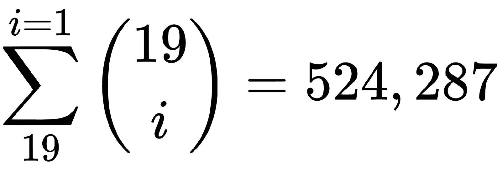

# 第三章：使用线性模型预测投票

本章展示了如何使用 R 进行统计模型的工作。它展示了如何检查数据假设、指定线性模型、进行预测和测量预测准确性。它还展示了如何程序化地找到好的模型，以避免手动分析，这可能会节省大量时间。到本章结束时，我们将使用许多商业和研究领域现在使用的各种定量工具。本章使用的包与上一章相同。

就像在前一章中一样，这里的重点将放在程序化地自动化分析程序上，而不是深入理解章节中使用的统计技术。此外，由于我们在第二章，*使用描述性统计理解投票*中已经看到如何高效地使用函数，我们将在本章直接采用那种方法，这意味着当可能的时候，我们将直接使用用于自动化分析的函数。我们将涵盖以下内容：

+   将数据分为训练集和测试集

+   创建用于预测的线性回归模型

+   使用各种技术检查模型假设

+   测量数值和分类数据的预测准确性

+   程序化地寻找最佳模型

# 必需的包

在本章中，我们将使用以下 R 包，这些包已经在上一章中使用过，所以你应该可以开始了。

| **包** | **原因** |
| --- | --- |
| `ggplot2` | 高质量图表 |
| `corrplot` | 相关性图 |
| `progress` | 显示迭代进度 |

# 设置数据

就像数据分析通常那样，第一步是理解我们将要处理的数据。在这种情况下，数据与第二章，*使用描述性统计理解投票*中相同，并且我们已经理解了它的一些主要特征。主要的是，我们已经理解了年龄、教育和种族对投票倾向有相当大的影响，即对英国离开或留在欧盟的投票倾向。

本章的重点将放在使用线性模型来预测`比例`和`投票`变量上，这两个变量包含支持离开欧盟的投票百分比以及是否该地区有更多的“离开”或“留下”投票。这两个变量具有类似的信息，区别在于一个是介于 0 和 1 之间的数值连续变量（`比例`），另一个是具有两个类别（`投票`类别为“离开”和“留下”）的分类变量。

我们将在`data`对象中保留包含*完整案例*的观察结果，以及在`data_incomplete`对象中对于`比例`和`投票`变量有缺失值的观察结果（我们将在本章的后面部分对这些进行预测）。函数`prepare_data()`、`adjust_data()`和`get_numerical_variables()`来自第二章，《使用描述性统计理解投票》，如果您不清楚它们的功能，可能需要查看。基本上，它们加载了通过压缩与年龄、教育和种族等变量相关的数据分布而创建的调整版本的数据：

```py
data <- adjust_data(prepare_data("./data_brexit_referendum.csv"))

data_incomplete     <- data[!complete.cases(data), ]
data                <- data[ complete.cases(data), ]
numerical_variables <- get_numerical_variable_names(data)
```

# 训练和测试数据集

为了能够衡量我们模型的预测准确性，我们需要使用一些观察结果来验证我们的结果。这意味着我们的数据将被分为三个不同的组：

+   训练数据

+   测试数据

+   预测数据

预测数据是我们没有完整案例的数据，具体来说，是那些`投票`和`比例`变量有`NA`值的地区。我们的最终目标是使用我们从其他地区学到的知识来预测这些地区的`比例`和`投票`变量，这是我们将在本章的末尾完成的事情。

完整案例的数据将被分为两部分，即训练数据和测试数据。训练数据用于提取知识和学习变量之间的关系。测试数据被视为对于“比例”和“投票”变量有`NA`值，我们对这些变量进行预测。然后，将这些预测值与对应观察中的实际值进行比较，这有助于我们以客观的方式了解我们的预测有多好，因为这些观察从未被训练模型看到。

我们在上一节创建了预测数据，并将其命名为`data_incomplete`。为了创建训练和测试数据，我们使用`sample()`函数。它将接受一个数字列表作为输入，从中选择一定数量的值（`size`）。数字列表将从 1 到具有完整案例的数据中的总观察数。我们指定用于训练数据的观察数约为总观察数的 70%，并使用`replace = FALSE`参数指定选中的观察结果可能不会重复（通过避免使用替换的样本）。

测试数据由剩余的 30%的观测值组成。由于`sample`是一个布尔向量，它包含每个观测值的`TRUE`或`FALSE`值，分别指定是否应该包含，我们可以通过在二进制向量前加上负号（`-`）来取数据的另一部分，有效地将每个`TRUE`值变为`FALSE`值，反之亦然。为了理解这一点，让我们看看以下代码：

```py
set.seed(12345)

n          <- nrow(data)
sample     <- sample(1:n, size = round(0.7 * n), replace = FALSE)
data_train <- data[ sample, ]
data_test  <- data[-sample, ]
```

如果我们多次进行这个过程，我们会发现每次我们都会得到不同的训练和测试集样本，这可能会让我们对我们的结果感到困惑。这是因为`sample()`函数是随机的，这意味着它将使用*伪随机数生成器*为我们做出选择（计算机不能生成真正的随机数，它们模拟看起来是随机的数字，尽管它们不是，这就是为什么它被称为**伪随机**）。如果我们希望我们的过程是可重复的，也就是说，每次运行它时都会选择完全相同的样本，那么我们必须在应用此过程之前指定一个初始种子来预置伪随机数生成器。为此，我们需要将一个整数传递给`set.seed()`函数，就像我们在代码片段的开头所做的那样。种子参数必须保持固定，以便重现相同的样本，并且有了它，每次我们生成随机样本时，我们都会得到相同的样本，这样我们的结果就是可重复的。

# 使用线性模型预测选票

在我们能够做出任何预测之前，我们需要指定一个模型，并使用我们的训练数据（`data_train`）对其进行训练，以便它学会如何提供我们想要的预测。这意味着我们将解决一个优化问题，输出某些数字，这些数字将被用作模型预测的参数。R 使我们能够非常容易地完成这样的任务。

在 R 中指定线性回归模型的标准方式是使用`lm()`函数，我们将要构建的模型以公式形式表达，并使用应该使用的数据，将其保存到对象（在这种情况下为`fit`）中，我们可以使用它来详细探索结果。例如，我们可以构建的最简单模型是只有一个回归变量（自变量）的模型，如下所示：

```py
fit <- lm(Proportion ~ Students, data_train)
```

在这个简单的模型中，我们将让 R 知道我们想要运行一个回归，我们试图仅使用数据中的`Students`变量来解释`Proportion`变量。这个模型太简单了，如果我们想要包含第二个变量会怎样呢？嗯，我们可以在其他回归变量后面使用加号（`+`）来添加它。例如（请注意，这将覆盖之前的`fit`对象，并使用新结果，所以如果你想保留它们两个，确保给结果对象不同的名字）：

```py
fit <- lm(Proportion ~ Students + Age_18to44, data_train)
```

由于我们正在处理更多信息，这可能是一种更好地解释`Proportion`变量的方法。然而，请记住共线性问题；学生百分比在街区（`Students`）中越高，相对较年轻的人的百分比（`Age_18to44`）也越高，这意味着我们可能没有向回归中添加独立信息。当然，在大多数情况下，这不是一个二元问题，而是一个程度问题，分析师必须能够处理这种情况。我们将在下一节检查模型假设时进一步讨论这个问题。现在，让我们回到编程，好吗？如果我们想包含数据中的所有变量怎么办？嗯，我们有两个选择，手动包含所有变量或使用 R 的快捷方式来做到这一点：

```py
# Manually
fit <- lm(Proportion ~ ID + RegionName + NVotes + Leave + Residents + Households + White + 
          Owned + OwnedOutright + SocialRent + PrivateRent + Students + Unemp + UnempRate_EA + 
          HigherOccup + Density + Deprived + MultiDepriv + Age_18to44 + Age_45plus + NonWhite + 
          HighEducationLevel + LowEducationLevel, data_train)

# R's shortcut
fit <- lm(Proportion ~ ., data_train)
```

这两个模型完全相同。然而，有几个细微之处我们需要提及。首先，当手动指定模型时，我们必须明确地将`Proportion`变量排除在回归变量（`~`符号之后的变量）之外，这样在运行回归时就不会出现错误（对于 R 允许我们尝试使用相同的`Proportion`变量和其他事物来解释`Proportion`变量来说是没有意义的）。其次，如果我们输入变量名时出现任何拼写错误，我们会得到错误，因为这些名称将不会出现在变量名中（如果巧合下你的错误实际上指的是数据中另一个现有的变量，那么可能是一个难以诊断的错误）。第三，在这两种情况下，回归变量的列表中包含了不应该存在的变量，如`ID`、`RegionName`、`NVotes`、`Leave`和`Vote`。在`of`的情况下

`ID`这个变量包含在分析中是没有意义的，因为它没有任何关于`Proportion`的信息，它只是一个标识符。在`RegionName`的情况下，它是一个分类变量，所以回归将不再是*标准多元线性回归*，R 会自动为我们处理，但如果我们不理解我们在做什么，它可能会产生令人困惑的结果。在这种情况下，我们只想处理数值变量，因此我们可以轻松地从手动情况中将其删除，但在快捷方式的情况下我们无法这样做。最后，在`NVotes`、`Leave`和`Vote`的情况下，这些变量以略微相同的方式表达相同的信息，因此它们不应该被包含，因为我们会有多重共线性问题。

假设我们想要使用的最终模型包括所有有效的数值变量：

```py
fit <- lm(Proportion ~ Residents + Households + White + Owned + OwnedOutright + SocialRent + PrivateRent + Students + Unemp + UnempRate_EA + HigherOccup + Density + Deprived + MultiDepriv + Age_18to44 + Age_45plus + NonWhite + HighEducationLevel + LowEducationLevel, data_train)
```

如果我们想使用快捷方式，我们可以确保数据中不包含有问题的变量（使用我们在第一章，*R 语言简介*）中查看的筛选技术，然后使用快捷方式。

要详细查看结果，我们使用`fit`对象上的`summary()`函数：

```py
summary(fit)
#>
#> Call:
#> lm(formula = Proportion ~ Residents + Households + White + Owned +
#>    OwnedOutright + SocialRent + PrivateRent + Students + Unemp +
#>    UnempRate_EA + HigherOccup + Density + Deprived + MultiDepriv +
#>    Age_18to44 + Age_45plus + NonWhite + HighEducationLevel +
#>    LowEducationLevel, data = data_train)
#>
#> Residuals:
#>      Min       1Q  Median      3Q     Max
#> -0.21606 -0.03189 0.00155 0.03393 0.26753
#>
#> Coefficients:
#>                     Estimate Std. Error  t value  Pr(>|t|)
#> (Intercept)         3.30e-02   3.38e-01  0.10      0.92222
#> Residents           7.17e-07   2.81e-06  0.26      0.79842
#> Households         -4.93e-06   6.75e-06 -0.73      0.46570
#> White               4.27e-03   7.23e-04  5.91      6.1e-09 ***
#> Owned              -2.24e-03   3.40e-03 -0.66      0.51071
#> OwnedOutright      -3.24e-03   1.08e-03 -2.99      0.00293 **
#> SocialRent         -4.08e-03   3.60e-03 -1.13      0.25847
#> PrivateRent        -3.17e-03   3.59e-03 -0.89      0.37629
#> Students           -8.34e-04   8.67e-04 -0.96      0.33673
#> Unemp               5.29e-02   1.06e-02  5.01      7.3e-07 ***
#> UnempRate_EA       -3.13e-02   6.74e-03 -4.65      4.1e-06 ***
#> HigherOccup         5.21e-03   1.24e-03  4.21      2.9e-05 ***
#> Density            -4.84e-04   1.18e-04 -4.11      4.6e-05 ***
#> Deprived            5.10e-03   1.52e-03  3.35      0.00087 ***
#> MultiDepriv        -6.26e-03   1.67e-03 -3.75      0.00019 ***
#> Age_18to44          3.46e-03   1.36e-03  2.55      0.01117 *
#> Age_45plus          4.78e-03   1.27e-03  3.75      0.00019 ***
#> NonWhite            2.59e-03   4.47e-04  5.80      1.1e-08 ***
#> HighEducationLevel -1.14e-02   1.14e-03 -9.93      < 2e-16 ***
#> LowEducationLevel   4.92e-03   1.28e-03  3.85      0.00013 ***
#> ---
#> Signif. codes: 0 '***' 0.001 '**' 0.01 '*' 0.05 '.' 0.1 ' ' 1
#> Residual standard error: 0.0523 on 542 degrees of freedom
#> Multiple R-squared: 0.868, Adjusted R-squared: 0.863
#> F-statistic: 187 on 19 and 542 DF, p-value: <2e-16

```

这些结果告诉我们用于创建我们模型的命令，这在创建各种模型并希望快速了解所查看结果的模型时很有用。它还显示了一些关于残差分布的信息。接下来，它显示了模型中使用的每个变量的回归结果。我们得到变量的名称（`（Intercept）`是模型规范中使用的标准线性回归截距），变量的系数估计，标准误差，*t 统计量*，*p 值*，以及使用星号表示显著性代码的*p 值*的视觉表示。在结果末尾，我们看到与模型相关的其他结果，包括 *R 平方* 和 *F 统计量*。如前所述，我们不会深入探讨这些含义的细节，我们将继续关注编程技术。如果您感兴趣，可以查看 Casella 和 Berger 的 *Statistical Inference, 2002* 或 Rice 的 *Mathematical Statistics and Data Analysis, 1995*。

现在我们已经准备好了`fit`对象中的拟合模型，我们可以用它来进行预测。为此，我们使用`predict()`函数和`fit`对象以及我们想要对其产生预测的数据，在我们的例子中是`data_test`。这会返回一个预测值的向量，我们将其存储在`predictions`对象中。对于`data_test`对象中的每个观测值，我们都会得到一个预测：

```py
predictions <- predict(fit, data_test)
```

我们可以在本章后面的某个部分测量这些预测的准确性。现在，我们知道如何用 R 轻松地生成预测。

# 检查模型假设

与任何类型的模型一样，线性模型要求我们检查其假设以证明其应用的合理性。结果的准确性和可解释性来自于遵守模型的假设。有时这些假设将是严格的，如果它们没有得到严格满足，那么模型就不被认为有效。其他时候，我们将与更灵活的假设一起工作，其中分析师的标准程度将发挥作用。

对于有兴趣的人来说，一篇关于模型假设的精彩文章是 David Robinson 的 *K-means clustering is not free lunch, 2015* ([`varianceexplained.org/r/kmeans-free-lunch/`](http://varianceexplained.org/r/kmeans-free-lunch/))。

对于线性模型，以下是一些核心假设：

+   **线性关系**：变量之间存在线性关系

+   **正态性**：残差呈正态分布

+   **同方差性**：残差具有恒定的方差

+   **无多重共线性**：变量之间不是彼此的线性组合

+   **独立性**：残差是独立的，或者至少不相关

我们将展示如何简要检查其中的四个：线性、正态性、同方差性和无多重共线性。我们应该提到，独立性假设可能是最难测试的假设，您通常可以用常识和对数据收集方式的理解来处理它。我们在这里不会深入探讨这一点，因为它更多地属于统计学的范畴，而我们希望这本书专注于编程技术。对于对统计学感兴趣的读者，我们推荐阅读 Jeffrey M. Wooldridge 的《2013 年入门计量经济学》和 Joshua D. Angrist 以及 Jorn-Steffen Pischke 的《2008 年无害计量经济学》。

# 使用散点图检查线性

检查线性假设的基本方法是在*Y*轴上绘制因变量，在*x*轴上绘制自变量，制作一个散点图。如果关系看起来是线性的，那么假设就得到了验证。在任何有趣的问题中，找到一个非常清晰的线性关系的散点图都是非常困难的，如果确实发生了这种情况，我们应该稍微怀疑并小心对待数据。为了避免重复造轮子，我们将使用我们在第二章，“使用描述性统计理解投票”中创建的`plot_scatterlot()`函数：

```py
plot_scatterplot(
    data = data,
    var_x = "Age_18to44",
    var_y = "Proportion",
    var_color = FALSE,
    regression = TRUE
)
plot_scatterplot(
    data = data,
    var_x = "Students",
    var_y = "Proportion",
    var_color = FALSE,
    regression = TRUE
)
```

如我们所见，左边的散点图显示了明显的线性关系，因为 18 至 44 岁之间的人口比例（`Age_18to44`）增加，支持离开欧盟的人口比例（`Proportion`）减少。在右边，我们看到在初始区域（`Students`在 0 到 20 之间）中，学生比例（`Students`）和`Proportion`之间的关系是明显线性的，之后这种关系似乎也是线性的，但受到了具有非常高学生比例的观察值的污染。然而，我们仍然可以假设`Students`和`Proportion`之间存在线性关系。


当我们在这里进行**多重线性回归**时，应该检查除了我们这里省略的其余变量之外的所有假设，但我们鼓励您这样做。请记住，在所有这些变量中找到一个线性关系是非常困难的，而这个假设主要是变量在回归中的预测能力的指示。只要关系看起来稍微线性，我们就应该没问题。

# 使用直方图和分位数-分位数图检查正态性

我们将使用两种不同的技术来检查正态性，这样我们就可以举例说明一种称为**策略模式**的技术，它是面向对象编程中一系列模式的一部分。我们将在第八章，“面向对象系统**追踪加密货币**”中更深入地探讨这些模式。

目前，你可以将策略模式视为一种技术，它将重用那些否则会被重复的代码，并简单地改变一种称为**策略**的操作方式。在下面的代码中，你可以看到我们创建了一个名为`save_png()`的函数，它包含了将被重复的代码（保存 PNG 文件）且不需要重复。我们将有两种策略，以函数的形式呈现，用于检查数据正态性——直方图和分位数-分位数图。这些将通过名为`functions_to_create_images`的参数方便地传递。正如你所见，这段代码接收一些数据，一个用于图形的变量，图像的文件名，以及一个用于创建图形的函数。这个最后一个参数，即函数，对读者来说应该不会陌生，因为我们已经在第一章，*R 语言入门*中看到过，我们可以将函数作为参数传递，并像在这段代码中一样使用它们，通过在函数内部调用它们的*新名称*，在这个例子中是`function_to_create_image()`：

```py
save_png <- function(data, variable, save_to, function_to_create_image) {
    if (not_empty(save_to)) png(save_to)
    function_to_create_image(data, variable)
    if (not_empty(save_to)) dev.off()
}
```

现在我们展示将利用这个`save_png()`函数并封装每个情况所使用的函数知识的代码。在直方图的例子中，下面代码中显示的`histogram()`函数简单地封装了用于创建图形的`hist()`函数，并使用了一个通用的接口，这个接口也将被其他策略使用（在这个例子中是下面代码中显示的`quantile_quantile()`函数）。这个通用接口允许我们将这些策略用作插件，可以像在相应的`variable_histogram()`和`variable_qqplot()`函数（它们都执行相同的调用，但在每种情况下使用不同的策略）中做的那样轻松替换。正如你所见，不属于通用接口的其他细节（例如，`main`和`xlab`）在每个策略的代码中处理。如果我们想，我们可以将它们作为可选参数添加，但在这个例子中不是必要的：

```py
variable_histogram <- function(data, variable, save_to = "") {
    save_png(data, variable, save_to, histogram)
}

histogram <- function(data, variable) {
    hist(data[, variable], main = "Histogram", xlab = "Proportion")
}

variable_qqplot <- function(data, variable, save_to = "") {
    save_png(data, variable, save_to, quantile_quantile)
}

quantile_quantile <- function(data, variable) {
    qqnorm(data[, variable], main = "Normal QQ-Plot for Proportion")
    qqline(data[, variable])
}
```

下面的代码展示了用于检查比例正态性的图形：


```py
quantile_quantile <- function(data, variable) {
    qqnorm(data[, variable], main = "Normal QQ-Plot for Proportion")
    qqline(data[, variable])
}
```

如果我们想与第三个（或更多）策略共享创建 PNG 图像的代码，那么我们可以简单地为每个新情况添加一个策略包装器，而不用担心重复创建 PNG 图像的代码。这看起来可能不是什么大问题，但想象一下，用于创建 PNG 文件的代码很复杂，你突然发现了一个错误。你需要修复什么错误？嗯，你将不得不去每个重复代码的地方进行修复。这看起来并不高效。现在，如果你不再想保存 PNG 文件，而想保存 JPG 文件会发生什么？嗯，同样，你将不得不去每个重复代码的地方进行更改。这同样效率不高。如您所见，这种编程方式需要前期进行一点投资（创建通用接口和提供包装器），但这样做的好处将通过节省的时间得到回报，即使你只需要更改一次代码，以及更易于理解和更简单的代码。这是一种**依赖管理**的形式，这是你应该学会如何做以成为一个更高效的程序员。

您可能已经注意到，在前面的代码中，我们可以通过让用户直接调用 `save_png()` 函数来避免一个函数调用。然而，这样做要求用户了解两件事，即 `save_png()` 函数用于保存图像，以及 `quantile_quantile()` 或 `histogram()` 函数用于生成图表，具体取决于她试图绘制什么。这种额外的负担虽然看似不问题，但对于不习惯将函数作为参数传递的用户来说，可能会非常混乱，因为他们需要知道两个函数签名，而不是一个。

提供一个签名易于使用的包装器，就像我们使用 `variable_histogram()` 和 `variable_qqplot()` 一样，这使用户更方便，并允许我们根据需要扩展显示图表的方式，如果我们以后想改变它而不需要用户学习新的函数签名。

要实际生成我们想要的图表，我们使用以下代码：

```py
variable_histogram(data = data, variable = "Proportion")
variable_qqplot(data = data, variable = "Proportion")
```

如您所见，直方图显示了一个略微向右偏斜的近似正态分布，但我们很容易接受它为正态分布。相应的分位数-分位数图以略不同的方式显示了相同的信息。它显示的线对应于正态分布的分位数，而点显示了数据中的实际分布。这些点越接近线，变量的分布就越接近正态分布。如您所见，大部分情况下，“比例”是正态分布的，而在极端情况下我们可以看到轻微的偏差，这可能是由于我们的“比例”变量实际上在 0 和 1 处有硬限制。然而，我们也可以接受它为正态分布，并可以安全地继续到下一个假设。

# 使用残差图检查同方差性

**同方差性**简单来说就是我们需要数据中的残差具有恒定的方差。为了检查它，我们可以使用`plot(fit)`函数调用。然而，这将一次显示一个图表，并要求你按键盘上的*Enter*键来显示下一个图表。这种机制对我们正在创建的自动化过程来说并不友好。因此，我们需要做一些调整。我们将使用`par(mfrow = c(2, 2))`调用告诉`plot()`函数同时绘制所有四个图表，并在一个图像中显示。我们将命令包裹在`fit_plot()`函数周围的我们已熟悉的机制中，以便在`fit_plot()`函数周围保存 PNG 图像，这样我们就设置好了：

```py
fit_plot <- function(fit, save_to = "") {
    if (not_empty(save_to)) png(save_to)
    par(mfrow = c(2, 2))
    plot(fit)
    if (not_empty(save_to)) dev.off()
}
```

在`fit_plot()`函数就位的情况下，我们可以使用以下方式展示回归的图形结果：

```py
fit_plot(fit)
```


我们需要的信息在左侧的图表中，其中 x 轴上显示拟合值，y 轴上显示残差。在这些图表中，我们寻找的是残差以随机分布的管状模式，由虚线所示。我们不希望残差呈现出类似扇形或漏斗形或任何形式的曲线模式。正如我们所见，我们看到的模式确实类似于管状模式，因此我们可以说同方差性的假设对于数据是成立的。作为额外信息，你还可以在右上角的分位数-分位数图中看到，残差遵循正态分布，这也是好的。右下角的图表展示了一个统计学概念，我们不会深入探讨，称为库克距离，它用于在回归中找到*有影响力的*观测值。要了解更多关于它的信息，你可以查看 John Fox 的*回归诊断，1991*。

# 检查无共线性与相关系数

要检查无共线性，我们可以使用多种不同的技术。例如，对于那些熟悉线性代数的人来说，条件数是衡量矩阵如何奇异的一个度量，其中奇异性意味着协变量之间有完美的共线性。这个数字可以提供这种共线性的度量。另一种技术是使用*方差膨胀因子*，这是一种更正式的技术，它提供了由于共线性而增加回归方差的程度。另一种，也是更常见的方法，是使用简单的相关系数。是否有任何变量在彼此之间有很强的相关性，以至于它们之间可能存在直接关系？如果是这样，那么我们可能有一个多重共线性问题。为了了解我们的变量之间是如何相关的，我们将使用第二章中展示的相关系数矩阵技术，*使用描述性统计来理解投票*。

以下代码展示了在 R 中相关系数是如何工作的：

```py
library(corrplot)
corrplot(corr = cor(data[, numerical_variables]), tl.col = "black", tl.cex = 0.6)
```

如您所见，强烈的关联（无论是正的还是负的）是在组内而不是组间发生的，这意味着以不同方式衡量同一事物的变量似乎高度相关，而衡量不同事物的变量则似乎不相关。


例如，`Age_18to44` 和 `Age_45plus` 是衡量年龄的变量，我们预计它们之间会有负相关关系，因为一个区域中年轻人的百分比越高，必然导致老年人的百分比越低。同样的关系也可以在住房群体（`Owned`、`OwnedOutright`、`SocialRent` 和 `PrivateRent`）、就业群体（`Unemp`、`UnempRate_EA` 和 `HigherOccup`）、贫困群体（`Deprived` 和 `MultiDepriv`）、种族群体（`White` 和 `NonWhite`）、居住群体（`Residents` 和 `Households`）和教育群体（`LowEducationLevel` 和 `HighEducationLevel`）中看到。如果你选择属于不同群体的变量，强烈的关联数量会显著降低，但仍然存在。例如，`HigherOccup` 与 `HighEducationLevel` 和 `LowEducationLevel` 强烈相关，分别呈正相关和负相关。此外，住房群体中的变量似乎与年龄群体中的变量相关。这些关系是预期和自然的，因为受过高等教育的人很可能有更好的工作，而年轻人可能还买不起房子，所以他们会租房。作为分析师，我们可以假设这些变量实际上是在衡量社会的不同方面，并继续我们的分析。然而，在解释结果时，你仍然可能想要记住这些事情，我们可能还只想在每个群体中包含一个变量，以避免组间共线性，但现在我们将避免这些复杂性，继续我们的分析。

线性回归是那些需要分析师提供接受或拒绝标准的模型类型之一。在我们的具体案例中，似乎我们的模型假设是有效的，我们可以安全地使用它来提供可信的预测，正如我们将在以下章节中所做的那样。

# 使用分数函数测量准确性

现在我们已经检查了模型的假设，我们将转向测量其预测能力。为了测量我们的预测精度，我们将使用两种方法，一种用于数值数据（`Proportion`），另一种用于分类数据（`Vote`）。我们知道 `Vote` 变量是 `Proportion` 变量的转换，这意味着我们以两种不同的方式测量相同的信息。然而，数值数据和分类数据在数据分析中经常遇到，因此我们想在这里展示两种方法。这两个函数，`score_proportions()`（数值）和 `score_votes()`（分类），接收我们用于测试的数据以及测试数据中每个观测的预测，这些预测来自我们在前几节中构建的模型。

在数值情况下，`score_proportions()` 函数使用以下表达式来计算分数：


在这里，`Y_i` 是测试数据中第 *i* 个观测的 *真实响应* 变量值，`Y'_i` 是我们对该相同观测的预测，`SE` 是我们预测的标准误差，`n` 是测试数据中的观测数。这个方程式建立了我们想要最小化的分数是 *学生化残差* 的平均值。你可能知道，学生化残差是将残差除以标准误差的度量。这个公式给我们提供了一个平均度量，即我们相对于观察到的数据范围方差预测观测值正确性的接近程度。如果我们有一个很高的方差（导致高标准误差），我们不想对预测过于严格，但如果我们处于低方差区域，我们想确保我们的预测非常准确：

```py
score_proportions <- function(data_test, predictions) {
    # se := standard errors
    se <- predictions$se.fit
    real <- data_test$Proportion
    predicted <- predictions$fit
    return(sum((real - predicted)² / se²) / nrow(data))
}
```

在分类情况下，`score_votes()` 函数通过简单地计算我们的预测指向正确类别的次数来计算一个分数，这是我们想要最大化的。我们通过首先使用相同的分类机制（如果预测的 `Proportion` 大于 0.5，则将其分类为 `"Leave"` 投票，反之亦然），并比较分类值来实现这一点。我们知道布尔向量的和将等于 `TRUE` 值的数量，这正是我们在 `sum(real == predicted)` 表达式中使用的：

```py
score_votes <- function(data_test, predictions) {
    real <- data_test$Vote
    predicted <- ifelse(predictions$fit > 0.5, "Leave", "Remain")
    return(sum(real == predicted))
}
```

为了测试我们的模型分数，我们执行以下操作：

```py
predictions <- predict(fit, data_test, se.fit = TRUE)

score_proportions(data_test, predictions)
#> [1] 10.66
score_votes(data_test, predictions)
#> [1] 216
nrow(data_test)
#> [1] 241
```

在 `score_votes()` 函数的情况下，这个度量本身告诉我们我们的预测做得如何，因为我们可以将正确预测的数量（函数调用的输出，即 216）除以 `data_test` 对象中的观测数（行数，即 241）。这给我们带来了 89% 的精确度。这意味着如果我们得到了回归者的数据，但我们不知道沃德实际上是如何投票的，那么 89% 的时间，我们会提供一个预测，即他们是否想要离开或留在欧盟，这个预测将是正确的。如果你问我，这相当不错。

在`score_proportions()`函数的情况下，由于我们使用更抽象的度量来了解我们做得如何，我们希望将其与其他模型的分数进行比较，并得到模型预测能力的相对感觉，这正是我们将在以下章节中做的。

# 编程寻找最佳模型

现在我们已经看到了如何产生代表模型预测能力好坏的分数，你可以继续手动指定很多模型，通过改变发送给`lm()`函数的变量组合来改变，计算每个模型的分数，然后选择那些预测能力最高的模型。这可能会花费大量时间，你可能希望将其委托给其他人，因为这是一项繁琐的工作。然而，不用担心。有更好的方法！计算机擅长重复和繁琐的任务，现在我们将看到如何通过一点编程告诉计算机为我们找到最佳模型。

以下章节将提高编程水平，但不用担心，我们会详细解释代码，确保一切都能理解。如果你在任何时候感到困惑，你总是可以将代码的小片段复制粘贴到你的 R 终端中，看看它们各自在做什么，从而逐渐对整个过程有一个整体的感觉。

# 生成模型组合

我们首先需要做的是开发一种获取我们想要测试的回归组合的方法。由于这是一个组合问题，组合的数量与可用选项的数量呈指数级增长。在我们的案例中，有 19 个可用变量，可能的模型数量是我们可以用一个回归器创建的模型数量加上我们可以用两个回归器创建的模型数量，以此类推，直到我们将我们可以用所有 19 个回归器创建的模型数量相加。这就是总和：



当然，计算这么多模型，虽然对计算机来说很容易，但可能需要一段时间，所以我们希望限制组合中允许的最小和最大回归器数量。为此，我们指定了将包含在`min_percentage`和`max_percentage`参数中的回归器的最小和最大百分比。在我们的案例中，如果我们指定`min_percentage = 0.9`和`max_percentage = 1.0`，我们要求包含 17 到 19 个回归器的所有组合，这总共是 191 个模型。想象一下手动生成 191 个模型规范需要多长时间！希望考虑这一点会让你意识到这种技术的强大。

首先，我们创建`generate_combinations_unvectorized()`函数，该函数将输出一个列表，包含所有可能的组合，这些组合由前面提到的`variables`、`min_percentage`和`max_percentage`参数给出。我们首先做的是通过在`variables`向量中将`Proportion`指定为`FALSE`来删除`Proportion`变量（这里的`variables`对象对应于`numerical_variables`对象，但我们已经在这个函数中调整了其名称，使其更易于阅读）。其他不想要的变量（`NVotes`、`Leave`、`Vote`和`RegionName`）在章节开头的`get_numerical_variable_names()`函数中被删除。接下来，我们通过使用`TRUE`值来获取变量的实际名称，这样我们就可以使用字符串而不是布尔值进行操作。然后，我们计算变量的总数`n`，以及我们将包括在组合中的实际变量数量，通过取百分比参数，将它们乘以变量数量，并获取该数字的*floor*或*ceiling*，以确保包括极端值。之后，我们初始化`all_combinations`对象，该对象将包含我们想要的组合列表。接下来是进度条对象，我们不会对其进行解释，因为我们之前已经使用过它。

实际工作是在`for`循环内部完成的。请注意，它从我们想要的组合中的最小变量数到最大变量数。在每次迭代中，我们计算组合的数量，它返回给我们一个矩阵，其中每一列代表一个不同的组合，每一行包含该特定组合的变量索引。这意味着我们需要将每一列添加到我们的总组合列表（`all_combinations`）中，这就是我们在嵌套`for`循环内部所做的事情。最后，由于我们有嵌套列表，我们想要使用`unlist()`函数将它们带到*同一级别*，但我们不想递归地这样做，因为我们最终只会得到一个长的列表，我们无法区分一个组合与另一个组合。

我鼓励您将返回语句更改为避免使用`recursive = FALSE`参数，以及完全避免使用`unlist()`函数。这样做将迅速显示它们对函数输出的影响，以及为什么我们需要它们。

```py
library(progress)

generate_combinations_unvectorized <- function(variables, min_percentage, max_percentage) {
    variables[["Proportion"]] <- FALSE
    variables                 <- names(variables[variables == TRUE])
    n                         <- length(variables)
    n_min                     <- floor(n * min_percentage)
    n_max                     <- ceiling(n * max_percentage)
    all_combinations          <- NULL

    progress_bar <- progress_bar$new(
        format = "Progress [:bar] :percent ETA: :eta",
        total = length(n_min:n_max)
    )

    for (k in n_min:n_max) {
        progress_bar$tick()
        combinations <- combn(variables, k)
        for (column in 1:ncol(combinations)) {
            new_list <- list(combinations[, column])
            all_combinations <- c(all_combinations, list(new_list))
        }
    }
    return(unlist(all_combinations, recursive = FALSE))
}
```

下一个示例显示了`generate_combinations_unvectorized()`函数生成的对象。如您所见，它是一个列表，其中每个元素都是一个向量或类型`character`。创建的第一个组合只包含 17 个变量，这是当变量总数为 19 且请求的最小百分比为 90%时使用的最小变量数。最后一个组合（组合编号 191）包含所有 19 个变量，对应于我们在本章前面手动构建的模型：

```py
combinations <- generate_combinations_unvectorized(
    numerical_variables, 0.9, 1.0
)

combinations
[[1]]
 [1] "Residents"     "Households"    "White"         "Owned"
 [5] "OwnedOutright" "SocialRent"    "PrivateRent"   "Students"
 [9] "Unemp"         "UnempRate_EA"  "HigherOccup"   "Density"
[13] "Deprived"      "MultiDepriv"   "Age_18to44"    "Age_45plus"
[17] "NonWhite"

...

[[191]]
 [1] "Residents"          "Households"         "White"
 [4] "Owned"              "OwnedOutright"      "SocialRent"
 [7] "PrivateRent"        "Students"           "Unemp"
[10] "UnempRate_EA"       "HigherOccup"        "Density"
[13] "Deprived"           "MultiDepriv"        "Age_18to44"
[16] "Age_45plus"         "NonWhite"           "HighEducationLevel"
[19] "LowEducationLevel"
```

只获取包含 90%至 100%变量的组合可能显得有些限制。如果我们想生成所有可能的组合呢？在这种情况下，我们需要将第一个参数更改为 0，但可能不会在合理的时间内完成。原因是我们的`generate_combinations_unvectorized()`函数，正如其名称所暗示的，并没有进行向量化，而且更糟糕的是，它包含了嵌套的`for`循环。这在特定情况下是一个巨大的瓶颈，这也是你在自己的代码中需要留意的地方。一个可能的解决方案是制作函数的*向量化*版本。对于那些感兴趣的人，我们在本书的代码仓库中包含了一个名为`vectorized_vs_unvectorized.R`的文件（[`github.com/PacktPublishing/R-Programming-By-Example`](https://github.com/PacktPublishing/R-Programming-By-Example)），展示了上述实现。我们还包含了一些测试，将展示向量化实现有多快。仅提前透露一下，它可能快数百倍！对于那些向量化和仅依赖于 R 本身的其他方法不够好的情况，你可以尝试将任务委托给一个更快的（编译）语言。我们将在第九章中看到如何做到这一点，*实现高效的简单移动平均*。

回到我们的例子，接下来要做的事情是创建`find_best_fit()`函数，它将遍历生成的每个组合，使用`data_train`数据训练一个具有相应组合的模型，使用`measure`选择（无论是数值的`Proportion`还是分类的`Vote`）来测试其准确性，并将相应的分数保存到`scores`向量中。然后，它将根据我们使用的`measure`选择（`Proportion`要求我们最小化，而`Vote`要求我们最大化）找到最优分数的索引，最后它将重新创建最优模型，打印其信息，并将模型返回给用户。`compute_model_and_fit()`、`compute_score()`和`print_best_model_info()`函数将在我们采用自顶向下的方法时开发：

```py
find_best_fit <- function(measure, data_train, data_test, combinations) {
    n_cases <- length(combinations)
    progress_bar <- progress_bar$new(
        format = "Progress [:bar] :percent ETA: :eta",
        total = n_cases
    )
    scores <- lapply(1:n_cases, function(i) {
        progress_bar$tick()
        results <- compute_model_and_fit(combinations[[i]], data_train)
        score <- compute_score(measure, results[["fit"]], data_test)
        return(score)
    })
    i <- ifelse(measure == "Proportion", which.min(scores), which.max(scores))
    best_results <- compute_model_and_fit(combinations[[i]], data_train)
    best_score <- compute_score(measure, best_results[["fit"]], data_test)
    print_best_model_info(i, best_results[["model"]], best_score, measure)
    return(best_results[["fit"]])
}
```

接下来，我们创建 `compute_model_and_fit()` 函数，该函数简单地生成所选组合的公式，并在 `lm()` 函数中使用它。正如您在 `combinations` 对象中看到的，我们之前从 `generate_combinations_unvectorized()` 函数返回的它是一个包含字符向量的列表，它不是一个可以传递给 `lm()` 函数的公式；这就是为什么我们需要 `generate_model()` 函数，它将接受这些向量之一，并使用 `paste()` 函数和 `collapse = " + "` 参数将它们连接成一个由加号（`+`）分隔的单个字符串，并在其前面添加 `Proportion ~` 字符串。这给我们返回一个由字符串指定的公式对象，如 `Proportion ~ Residents + ... + NonWhite`，其中包含的不是省略号，而是前面代码中显示的第一个组合中的所有变量。然后，我们使用这个字符串在 `lm()` 函数中执行回归，并将 `model` 和 `fit` 都返回在一个列表中，以便在后续步骤中使用：

```py
compute_model_and_fit <- function(combination, data_train) {
    model <- generate_model(combination)
    return(list(model = model, fit = lm(model, data_train)))
}

generate_model <- function(combination) {
    sum <- paste(combination, collapse = " + ")
    return(formula(paste("Proportion", "~", sum)))
}
```

如 `score <- compute_score(measure, results[["fit"]], data_test)` 行所示，`compute_score()` 函数接收一个 `measure` 对象、一个 `fit` 对象（来自 `results` 列表），以及用于测试的数据。它使用之前提到的 *策略模式* 来计算用于检查正态性假设的图表的得分。基本上，根据 `measure` 字符串（选择的策略）的值，它将选择两个具有相同签名的函数之一，并使用该函数来计算最终的预测。我们向之前看到的 `predict()` 函数发送 `se.fit = TRUE` 参数，因为我们希望标准误差也一起发送，以防我们使用需要它们的数值得分。`score_proportions()` 和 `score_votes()` 函数在本章中之前已定义：

```py
compute_score <- function(measure, fit, data_test) {
    if (measure == "Proportion") {
        score <- score_proportions
    } else {
        score <- score_votes
    }
    predictions <- predict(fit, data_test, se.fit = TRUE)
    return(score(data_test, predictions))
}
```

最后，我们创建了一个名为 `print_best_model_info()` 的小型便利函数，该函数将打印找到的最佳模型的结果。它简单地接受最佳模型的索引、模型公式、其得分和度量类型，并将所有这些信息打印给用户。正如您所看到的，由于 `model` 对象不是一个简单的字符串，而是一个 *公式* 对象，我们需要稍微处理一下它，通过将其转换为字符串并使用我们知道的包含加号（`+`）来分割它，以获取我们想要的结果；否则，它将是一个非常长的字符串：

```py
print_best_model_info <- function(i, model, best_score, measure){
    print("*************************************")
    print(paste("Best model number:", i))
    print(paste("Best score:       ", best_score))
    print(paste("Score measure:    ", measure))
    print("Best model:")
    print(strsplit(toString(model), "\\+"))
    print("*************************************")
}
```

我们可以通过调用以下命令来根据 `Proportion` 度量找到最佳模型：

```py
best_lm_fit_by_proportions <- find_best_fit(
    measure = "Proportion",
    data_train = data_train,
    data_test = data_test,
    combinations = combinations
)
#> [1] "*************************************"
#> [1] "Best model number: 3"
#> [1] "Best score:        10.2362983528259"
#> [1] "Score measure:     Proportion"
#> [1] "Best model:"
#> [[1]]
#>  [1] "~, Proportion, Residents " " Households "
#>  [3] " White "                   " Owned "
#>  [5] " OwnedOutright "           " SocialRent "
#>  [7] " PrivateRent "             " Students "
#>  [9] " Unemp "                   " UnempRate_EA "
#> [11] " HigherOccup "             " Density "
#> [13] " Deprived "                " MultiDepriv "
#> [15] " Age_18to44 "              " Age_45plus "
#> [17] " LowEducationLevel"
#> [1] "*************************************"

```

如我们所见，最佳模型是 191 个模型中的第三个，得分为 10.23。我们还可以看到模型中使用的回归变量。如您所见，`NonWhite`和`HighEducationLevel`被优化方法排除在外，这可能是由于它们的对应变量包含了它们各自组所需的所有信息。这不是巧合，这些是数据中最具代表性的变量之一。

要根据`Vote`度量找到最佳模型，我们使用以下代码。请注意，鉴于我们创建此函数时使用的良好技术，我们只需更改`measure`参数的值，就可以使用不同的方法来优化我们的搜索：

```py
best_lm_fit_by_votes <- find_best_fit(
    measure = "Vote",
    data_train = data_train,
    data_test = data_test,
    combinations = combinations
)
#> [1] "*************************************"
#> [1] "Best model number: 7"
#> [1] "Best score:        220"
#> [1] "Score measure:     Vote"
#> [1] "Best model:"
#> [[1]]
#>  [1] "~, Proportion, Residents " " Households "
#>  [3] " White "                   " Owned "
#>  [5] " OwnedOutright "           " SocialRent "
#>  [7] " PrivateRent "             " Students "
#>  [9] " Unemp "                   " UnempRate_EA "
#> [11] " HigherOccup "             " Density "
#> [13] " Deprived "                " MultiDepriv "
#> [15] " Age_45plus "              " NonWhite "104
#> [17] " HighEducationLevel"
#> [1] "*************************************"

```

在这种情况下，最佳模型是 191 个模型中的第七个，有 241 个正确预测中的 220 个，这给我们带来了 91%的准确性，这是一个相对于我们在本章早期计算的准确性的改进。在这种情况下，`LowEducationLevel`和`Age_18to44`被排除在外。再次强调，这不是巧合，这些是数据中最重要变量的一部分。

# 从未知数据的选区预测投票

现在我们知道了如何训练我们的模型并找到最佳的可能模型，我们将使用使用`Vote`度量找到的最佳模型来预测那些我们没有投票数据的选区的预测。为此，我们只需执行以下行：

```py
predictions <- predict(best_lm_fit_by_votes, data_incomplete)

predictions
#>    804    805    806    807    808    809    810    811    812    813
#> 0.6845 0.6238 0.5286 0.4092 0.5236 0.6727 0.6322 0.6723 0.6891 0.6004
#>    814    815    816    817    818    819    820    821    822    823
#> 0.6426 0.5854 0.6966 0.6073 0.4869 0.5974 0.5611 0.4784 0.5534 0.6151
(Truncated output)

```

这将使用我们之前使用`Votes`度量找到的最佳模型，并利用它来生成对`data_incomplete`数据中`Proportion`变量的预测，这些数据包含我们没有任何投票数据的观测值。这是我们目前所能提供的最佳预测，并且我们预计当用于将`Proportion`变量分类到`Vote`变量时，它们将有 91%的准确性。

# 摘要

本章展示了如何使用多重线性回归模型，这是最常用的模型家族之一，来预测数值和分类数据。我们的重点是展示编程技术，这些技术允许分析师在保持代码质量高的同时提高项目效率。我们通过展示如何程序化地创建不同的模型组合、测量预测准确性和选择最佳模型来实现这一点。所使用的技巧可以很容易地用于其他更高级的模型类型，我们鼓励您尝试使用其他模型家族来提高预测准确性。在本书附带的代码（[`github.com/PacktPublishing/R-Programming-By-Example`](https://github.com/PacktPublishing/R-Programming-By-Example)）中，您可以找到一个实现，它还使用了广义线性模型来生成预测。

在下一章中，我们将开始使用一个不同且技术性略低的示例，该示例使用一家假设公司的产品数据来展示如何以多种方式处理操纵性数据，并将其用于多种可视化，包括 3D、交互式和地理空间图。
