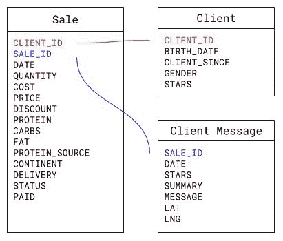
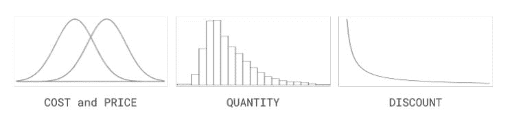
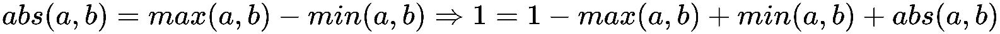

# 模拟销售数据和与数据库一起工作

食品工厂的例子是关于一家虚构的公司，名为**食品工厂**。他们为寻找健康食品的人提供定制餐食。他们允许客户选择他们想要的宏量营养素组合，以及他们的蛋白质来源。宏量营养素是任何饮食的基础，它们由碳水化合物、蛋白质和脂肪组成。客户可以选择每种宏量营养素的百分比，以及他们的蛋白质来源（鱼、鸡肉、牛肉或素食）；然后，食品工厂将提供一份美味的餐食，满足他们的饮食要求。他们通过这种方式找到了一些很好的组合，如果他们继续做得像现在这样好，他们将根据客户最喜欢的添加更多餐食选项以及固定食谱。

食品工厂到目前为止做得很好，他们已经建立了一套系统，可以让他们在其五个门店收集大量数据，同时跟踪客户信息。在这个例子中，我们的工作将是分析数据，以诊断业务的当前状态，并提出改进的方法。为此，我们将使用大量的可视化，在第五章，*用可视化传达销售；*在第六章，*通过文本分析理解评论；*以及在第七章，*开发自动演示*中提供对业务当前状态的自动诊断。听起来不错，对吧？然而，在我们能够做所有这些之前，我们需要掌握数据，但我们还没有。我们将模拟它！本章将向您展示如何设计一个非平凡的数据模拟来生成示例所需的数据。此外，食品工厂以及许多组织并不总是让我们的工作变得容易，他们经常提供 CSV 文件，并且他们通常有我们需要与之合作的数据库。本章还将向您展示如何处理这样的数据库。

本章涵盖的一些重要主题包括：

+   设计和实施非平凡模拟

+   模拟数字、类别、字符串和日期

+   带有参数对象的函数签名

+   在不同上下文中重用函数

+   混合内部和外部数据

+   与关系数据库一起工作

# 所需软件包

仅需本章所需的软件包是`RMySQL`。然而，为了能够完全复制本章末尾所示代码，您需要一个可工作的 MySQL 数据库安装([`www.mysql.com/`](https://www.mysql.com/))。有关 Linux 和 Mac 的具体说明，请参阅附录，*所需软件包*。

| **软件包** | **原因** |
| --- | --- |
| `RMySQL` | MySQL 数据库接口 |

# 设计我们的数据表

在开始编程之前用纸和铅笔设计总是一个好习惯。如果你这样做，你会发现你的代码会更好，因为你会考虑那些如果你直接开始编程可能看不到的场景，而且，你将能够事先设计解决方案，而不是在已经编写的代码中打补丁。这是一个很容易的投资，而且往往能带来回报，所以这就是我们在这个部分要做的，我们将设计我们的数据。

# 基本变量

让我们从最简单的场景开始想象，并尝试找出我们可能遇到的问题。对于每一笔销售，我们希望有以下变量：销售`日期`，生产该类型食品的`成本`，购买的`数量`，该类型食品的`价格`，是否应用了`折扣`，`碳水化合物`（`CARBS`）、`蛋白质`和`脂肪`的宏量营养素百分比，食品的`蛋白质来源`（如果是素食者，则为`FISH`、`CHICKEN`、`BEEF`或`VEGETARIAN`），销售所在的`商店`，`配送`方式（要么是发送到`地点`，要么是在`商店`内配送），销售的`状态`，可以是`待处理`、`已配送`、`已退货`或`已取消`（销售不能同时具有两种状态），是否已`支付`，客户的`出生日期`和`性别`，他们给公司评了多少`星`，客户的`注册日期`，以及他们与订单相关的消息数量，以及每个消息的`日期`、`星数`和实际`消息`。

# 简化假设

我们可以随意复杂化这个例子，但为了保持模拟简单（尽管不是微不足道的），我们事先假设一些事情。首先，我们假设每条销售记录只包含一种类型的食品。如果一个人购买两种或更多不同类型的食品，那么每种类型将产生不同的销售记录。然而，只要食品类型相同（宏量营养素和蛋白质来源的组合），每笔销售可以包含我们想要的任何数量的食品。这是最重要的简化，因为公司的销售订单通常每笔销售包含多种商品，但这将使我们能够专注于编程方面的事情。

其次，我们不会担心食物类型和成本（或价格）在数学意义上的连续性关系。这意味着我们可能会找到一个食物类型，其宏量营养素和蛋白质来源的组合与另一种食物的组合非常相似，但它们的制造成本以及价格却非常不同。同样，我们假设每种食物类型都有其独特的成本和价格，并且这些成本和价格可能因不同的销售而异（同一种食物类型在不同销售中可能有不同的成本和价格）。这个假设并不现实，因为大多数公司都有标准化的产品（包括成本和价格），但我们可以将食品工厂视为一个手工艺品店，每种食物都是独一无二的，这可以产生成本和价格上的差异。如果有什么的话，这只是在分析中增加了复杂性（乐趣）。

第三，我们不会担心销售日期和销售状态之间的关系，或者销售日期和销售是否已付款之间的关系。这意味着我们实际上可能会发现已经交付但尚未付款的旧销售。这在现实生活中确实会发生，因此假设这一点没有问题。

第四，客户与特定销售相关的消息的评分高低，不会影响他们对食品工厂的整体评分。有两个“星级”列，一个用于食品工厂的整体评分，另一个将随每条与订单相关的消息发送。这意味着一个通常喜欢食品工厂的客户可能会有一次不好的体验，但这不会影响他们继续喜欢这家店的程度。相反，一个通常不喜欢食品工厂的客户，不会因为某一天的好体验而开始喜欢它。这个假设对于有固定偏好的个人是成立的，但并不普遍。如果我们愿意，我们可以在模拟中包含考虑这些动态的机制。实际上，我鼓励你尝试自己实现一些这些机制。这将是一个很好的实践。

第五，我们不会担心宏量营养素是否合理，包括与蛋白质来源的组合。常见的饮食中大约包括 50%的蛋白质、35%的碳水化合物和 15%的脂肪，但我们不会担心我们的数字在营养学上是否合理。这意味着，请不要认为这些模拟食品订单是现实的，或者实际上是健康的。

# 潜在的陷阱

现在我们已经了解了数据结构的一般形式，我们需要找到应该避免的潜在陷阱。我们可以将这个数据结构视为一个标准的表格结构（一个数据框或电子表格），其中每一列代表一个变量，每一行代表一个观察值（在我们的案例中是销售记录）。

# 过多的空格问题

假设我们有一个销售记录；如果我们收到客户关于该订单的消息，会发生什么？嗯，我们只需将数据添加到相应的列 `DATE`、`STARS` 和 `MESSAGE`。如果我们收到另一条与同一订单相关的消息，会发生什么？嗯，一个可能的解决方案是为新消息添加一个新的 `DATE`、`STARS` 和 `MESSAGE` 组合，但名称会重叠。

我们如何区分它们？嗯，我们可以在后面附加一个表示实际消息编号的数字。然后，我们就会有第一条消息的 `DATE_1`、`STARS_1` 和 `MESSAGE_1`，以及第二条消息的 `DATE_2`、`STARS_2` 和 `MESSAGE_2`。这样就能解决问题，不是吗？如果我们收到第三条或更多的与订单相关的消息，会发生什么？嗯，我们最终会在数据框中有很多变量。具体来说，我们会根据发送给单个订单的消息的最大数量来组合变量。对于没有这么多消息的订单，单元格的内容会是什么？它们将是空的。这将浪费很多空间！此外，数据的一般结构会感觉很不舒服。一定有更好的方法。

如果你这样想，感觉消息和销售是两回事，它们应该分开保存，不是吗？如果你这样想，你就对了。那么，让我们想象一下，让我们保留一个数据框用于销售订单，另一个用于消息。还有一个问题。你能看到吗？我们如何区分哪些消息属于哪个销售订单？标识符来帮忙！我们可以在销售数据框中添加 `SALE_ID`，它应该是唯一的，我们可以在消息数据框中添加相同的 `SALE_ID`，它将不是唯一的，因为可能有多个消息与同一销售订单相关。这意味着我们有一个一对一的关系。考虑到这一点，销售数据框将包含我们之前提到的所有变量，但不包括消息的 `DATE`、`STARS` 和 `MESSAGE` 变量（不要将销售订单的 `DATE` 与每条消息的 `DATE` 混淆），这三个变量将符合单独的消息数据框。两个数据框都将有一个 `SALE_ID` 变量。太好了；我们解决了这个问题。

# 过多重复数据的问题

在销售数据框中我们还有哪些变量？嗯，为了使问题非常明显，我们仍然有销售变量和客户的变量。那么，问题可能是什么？嗯，每次客户进行新的购买时，我们都会再次保存她的`BIRTH_DATE`、`CLIENT_SINCE`、`GENDER`和`STARS`信息。如果一个常客在食品工厂有 100 次不同的购买呢？嗯，她的信息将会重复 100 次！我们需要解决这个问题。我们该如何做呢？我们做和之前一样的事情，分离不同的事物。没错。我们为客户数据创建一个单独的数据框，并且我们已经知道如何将客户与销售联系起来，因为我们之前在处理前一个问题时就使用了同样的技术，我们在两个数据框中创建标识符。这是一个多对一的关系（从销售数据的角度来看客户的资料）。我相信你能想出哪些变量属于哪个数据框。

通过消除重复数据，我们也消除了意外更改这些重复值并对此感到困惑的可能性。

为了回顾，我们所做的是将一个包含所有信息的巨大初始表分解成三个不同的表，这些表通过标识符相互链接，这样我们可以在每个表中表示不同的事物（销售、客户和客户消息），同时消除很多浪费的空间和重复的值。为了更好地理解这些调整后的组织结构，我们可以查看以下图像，它显示了哪些数据属性属于哪些实体，以及它们之间是如何相互关联的：



模拟的数据实体和属性

这些技术与许多其他技术一起被称为**数据库规范化**，在某些场景中可能很有用。然而，有时我们可能不希望我们的数据完全规范化，因为性能问题，但这些是本书不会涉及的高级案例。对于感兴趣的读者，我建议查阅 Silberschatz、Korth 和 Sudarshan 的《数据库系统概念，2010》以获取高级概念和示例。

最后，请记住，尽管我们在本章中创建了独特的标识符，但在现实世界的应用中，你最好使用一个经过良好建立的工具来完成这样的任务。`uuid`包专门设计用来生成和处理**全球唯一标识符**（**UUIDs**）。你可以在其 CRAN 页面找到更多信息（[`cran.r-project.org/web/packages/uuid/index.html`](https://cran.r-project.org/web/packages/uuid/index.html))。

# 模拟销售数据

足够的概念了；让我们开始编程。为了清楚地了解我们将要走向何方，我们首先初始化我们将要使用的`sales`数据框，目前为零观察值。我们通过定义每个因子变量的可用类别，并定义每个变量所需的数据类型来空值。如您所见，它有`SALE_ID`和`CLIENT_ID`标识符，这将允许我们将这些数据与`clients`和`client_messages`中的数据联系起来。为了理解这一点，让我们看一下以下代码：

```py
status_levels <- c("PENDING", "DELIVERED", "RETURNED", "CANCELLED")
protein_source_levels <- c("BEEF", "FISH", "CHICKEN", "VEGETARIAN")
continent_levels <- c("AMERICA", "EUROPE", "ASIA")
delivery_levels <- c("IN STORE", "TO LOCATION")
paid_levels <- c("YES", "NO")

sales <- data.frame(
    SALE_ID = character(),
    CLIENT_ID = character(),
    DATE = as.Date(character()),
    QUANTITY = integer(),
    COST = numeric(),
    PRICE = numeric(),
    DISCOUNT = numeric(),
    PROTEIN = numeric(),
    CARBS = numeric(),
    FAT = numeric(),
    PROTEIN_SOURCE = factor(levels = protein_source_levels),
    CONTINENT = factor(levels = continent_levels),
    DELIVERY = factor(levels = delivery_levels),
    STATUS = factor(levels = status_levels),
    PAID = factor(levels = paid_levels)
)
```

与你可能在其他地方找到的许多其他方法相比，这种初始化空数据框的方式更安全，因为你从一开始就会拥有正确的列类型。如果你的代码依赖于某些列类型检查（正如我们将要做的那样），它甚至会在零行数据的数据框中工作（正如这里的情况）。

# 根据分布假设模拟数值数据

我们将分别生成每一列的数据，然后用这些数据重新创建数据框。我们想先从简单的部分开始，所以我们将查看`QUANTITY`、`COST`、`PRICE`和`DISCOUNT`的模拟。简单的方法就是随机生成一些数字，并通过相应的乘除确保它们在某个范围内。我们也可以使用`round()`函数确保`QUANTITY`不是分数。然而，如果我们想正确地做这件事，那么我们必须考虑这些数字背后的假设。下面段落中提到的分布的图像如下所示。



COST、PRICE、QUANTITY 和 DISCOUNT 的分布

`COST`和`PRICE`的值遵循正态分布，因为它们是实数。平均而言，`COST`应该低于`PRICE`，因此我们将相应地设置它们的均值参数。请注意，这允许某些食品以低于其生产成本的价格出售，这在公司试图最小化损失时有时会发生。`DISCOUNT`遵循指数分布，因为我们希望大多数折扣为零或低（与价格相比）。这意味着我们不会经常提供折扣，而且当提供时，折扣会很小。`QUANTITY`遵循泊松分布，因为它需要是一个整数。一个很好的资源是 Sean Owen 的*《常见概率分布：数据科学家的便签，2015》*（[`blog.cloudera.com/blog/2015/12/common-probability-distributions-the-data-scientists-crib-sheet/`](https://blog.cloudera.com/blog/2015/12/common-probability-distributions-the-data-scientists-crib-sheet/))。

在这些假设的基础上，我们将创建三个函数。`COST` 和 `PRICE` 通过 `random_values()` 函数进行模拟，而 `QUANTITY` 和 `DISCOUNT` 则有它们自己的函数。`random_values()` 函数使用 `rnorm()` 函数通过正态分布模拟 `n` 个值（其中 `n` 是我们希望在数据框中拥有的行数），具有特定的 `mean` 和标准差（`sqrt(variance)`）。然后我们使用 `round()` 函数将这些值四舍五入到两位小数，如下所示：

```py
random_values <- function(n, mean, variance) {
    return(round(rnorm(n, mean, sqrt(variance)), 2))
}
```

`random_discounts()` 函数使用 `rexp()` 函数通过指数分布模拟 `n` 个值，使用 `lambda` 参数，并且像之前一样，我们使用 `round()` 函数将值四舍五入到两位小数。当我们使用这个函数时，我们会使用一个非常高的 `lambda` 参数（100）来严重偏斜分布到右侧，以便在模拟中获得很多零。然而，这将使我们的值变得非常小（例如，0.021）。如果我们直接使用这些值，我们的折扣将只有几美分，这是不现实的。因此，我们将这些值乘以 100 以获得几美元的折扣。请注意，如果我们先四舍五入然后乘以 100，我们得到的是整美元折扣（例如，$2），但如果我们先乘以 100 再四舍五入，我们得到的折扣将包括分（例如，$2.1），这是我们希望避免的，但它也会同样有效。让我们看一下以下代码来理解这一点：

```py
random_discounts <- function(n, lambda) {
    return(round(rexp(n, lambda), 2) * 100)
}
```

`random_quantities()` 函数使用 `rpois()` 函数通过泊松分布模拟 `n` 个值，使用 `lambda` 参数。在这种情况下，我们不需要四舍五入，因为值将已经是整数。然而，我们给每个值加 `1`，因为我们可能会得到零作为数量，而拥有零食品的销售订单是没有意义的。加 `1` 保证每个销售订单中至少有一件食品：

```py
random_quantities <- function(n, lambda) {
    return(rpois(n, lambda) + 1)
}
```

# 使用因子模拟分类值

`random_levels()` 函数通过有放回地抽样提供的 `levels` 来模拟 `n` 个分类值（由第三个参数控制，发送为 `TRUE`）。你可以把 `levels` 视为一个字符串数组，每个字符串都是模拟的可能值。这些 `levels` 将来自数据框中因子变量定义的类别（`PROTEIN_SOURCE`、`STORE`、`DELIVERY`、`STATUS` 和 `PAID`）。有放回的抽样意味着每次我们从 `levels` 对象中选择一个值时，我们都会返回它，以便我们稍后可以再次选择它。不进行放回的抽样只有在你想得到比可用的总值数量少的样本数量时才有意义，而这在这里不是情况，因为我们想模拟成千上万的行，我们不会有那么多 `levels`。

我们还有一个未提及的第三个参数，即`probabilities`参数。如您所见，默认情况下它设置为`NULL`，但我们确实发送了一个对象到那里；它必须是一个介于 0 和 1 之间的数字向量，它们的和为 1，并且代表选择特定类别的概率。这个`probabilities`对象的顺序必须与`levels`对象中的顺序相同。例如，如果我们有三个可能的级别，并且将`probabilities`对象发送为`c(0.2, 0.3, 0.5)`，则第一个级别将有 20%的概率被选中，而第二个和第三个级别将分别有 30%和 50%的概率。请注意，概率的总和为 1。让我们看看代码：

```py
random_levels <- function(n, levels, probabilities = NULL) {
    return(sample(levels, n, TRUE, probabilities))
}
```

注意，在我们将`probabilities`对象传递给`sample()`函数之前，我们没有检查该对象是否为`NULL`。这是因为`sample()`函数中对应的参数也默认使用`NULL`，并将其解释为对所有值使用相等的概率。您可以在函数的文档中查看这一点。

为了测试概率是否被正确实现，我们可以模拟 100 个值，然后创建一个包含结果的表格，以查看每个类别的生成值的数量。如您所见，如果我们模拟类别`A`、`B`和`C`的`100`个值，其概率分别为 20%、30%和 50%，我们得到的比例分别为 18%、37%和 45%。这些结果与我们的规格足够接近，因此是正确的。请注意，每次重新执行代码时，您都会得到不同的值，并且它们几乎永远不会是您指定的确切值，这在模拟中是自然的。然而，它们应该几乎总是接近规格：

```py
results <- random_levels(100, c("A", "B", "C"), c(0.2, 0.3, 0.5))
table(results)
#> results
#>  A  B  C
#> 18 37 45
```

# 在范围内模拟日期

`random_dates_in_range()`函数使用了我们之前使用的相同的`sample()`函数，但它不会从因子变量接收字符串列表作为类别，而是会接收日期列表。为了生成模拟的有效日期的全集，我们使用`seq()`函数。此函数将根据特定的间隔生成从`start`到`end`的所有值。如果我们想生成 1 到 10 之间的所有奇数，我们将使用`seq(1, 10, 2)`，这意味着它将按顺序将`1`加上`2`，直到达到`10`。在我们的情况下，我们希望增量为一个完整的天，并且方便的是，`seq()`函数在发送日期对象时通过发送增量字符串`"day"`提供了这种能力：

```py
random_dates_in_range <- function(n, start, end, increasing_prob = FALSE) {
    sequence <- seq(start, end, "day")
    if (increasing_prob) {
        probabilities <- seq(1, length(sequence))²
        probabilities <- probabilities / sum(probabilities)
        return(sample(sequence, n, TRUE, probabilities))
    } else {
        return(sample(sequence, n, TRUE))
    }
}
```

注意，这仅在发送*日期*对象时才会起作用。如果您尝试用字符串测试此函数，您将得到一个错误，表明`'from'不能是 NA、NaN 或无穷大`。相反，您应该使用`as.Date()`函数将这些字符串转换为日期：

```py
seq("2017-01-01", "2017-02-01", "day")                    # Error
seq(as.Date("2017-01-01"), as.Date("2017-02-01"), "day")  # Valid
```

# 在共享限制下模拟数字

如您所记得，食品工厂通过接收宏量营养素规格来创建他们的食品。客户可以指定他们想要的每个食品的百分比组合，只要它们的总和为 1。现在我们将模拟这些宏量营养素百分比。这比之前的案例需要更多的工作。

首先，我们创建一个函数，该函数将返回数值三元组，其中每个数字介于 0 和 1 之间，并且它们加起来等于 1。为了实现这一点，我们将使用两个随机数，并将第三个数依赖于前两个数。我们将使用以下数学事实：



这告诉我们取一个数字为*1 - max(a, b)*，另一个为*min(a, b)*，最后一个为*abs(a, b)*；这正是我们在`random_triple()`函数中所做的。从数学上保证我们将得到三个介于 0 和 1 之间的随机数，它们加起来等于 1。请注意，`random_triple()`是我们创建的少数几个不需要任何参数的函数之一，这是有意义的，因为我们不需要*外部*信息来模拟三元组：

```py
random_triple <- function() {
    a <- runif(1, 0, 1)
    b <- runif(1, 0, 1)
    PROTEIN <- 1 - max(a, b)
    CARBS <- abs(a - b)
    FAT <- min(a, b)
    return(c(PROTEIN, CARBS, FAT))
}
```

我们可以通过对结果使用`sum()`来简单地测试它是否工作：

```py
triple <- random_triple()
triple
#> [1] 0.05796599 0.76628032 0.17575370

sum(triple)
#> 1
```

现在，我们想要生成`n`个这样的三元组。为此，我们使用`replicate()`函数来生成`n`个三元组。`TRUE`参数对应于函数的`simplify`参数，它将三元组列表简化为矩阵形式，这在特定情况下更容易处理。当我们测试代码并查看`replicate(n, random_triple(), TRUE)`的结果时，我们会发现结果结构是我们想要的转置，这意味着它有三行和`n`列，其中每一行代表宏量营养素百分比，每一列代表一个观察值。我们想要转置这个结构，以得到宏量营养素百分比作为列，观察值作为行；为此，我们只需使用`t()`函数。之后，我们只需创建一个包含每个宏量营养素对应值的 data frame：

```py
random_composition <- function(n) {
    matrix <- t(replicate(n, random_triple(), TRUE))
    return(data.frame(PROTEIN = matrix[, 1], 
                      CARBS = matrix[, 2], 
                      FAT = matrix[, 3]))
}
```

# 模拟复杂标识符的字符串

是时候模拟最复杂的一部分了，即标识符。我们想要生成`n`个标识符，并且根据我们模拟的标识符类型，我们可能希望它们是唯一的。客户数据中的客户标识符必须是唯一的，因为我们不希望有两个具有相同标识符的不同客户，并且根据设计，我们的客户数据将不会有重复的记录。另一方面，我们不想在销售数据中有唯一的客户标识符，因为我们希望*重复*的客户出现在那里。

我们可以创建两个不同的函数来独立处理这些情况，但通过使用一个指定唯一标识符百分比的`reduction`参数，我们可以很容易地将它们合并成一个函数。如果`reduction`参数设置为 0（默认值），我们假设需要完整的唯一标识符。我们将假设标识符由一组字母后跟一组数字组成，并且每组长度应单独指定。这就是`n_letters`和`n_digits`的作用。我们的实现将通过分别创建字母和数字组，然后组合它们来实现。

首先，我们将通过从`LETTERS`组（一个包含所有大写 ASCII 字母的内部 R 对象）中抽取大小为`n`的样本（我们可能在每个标识符中都有重复的字母）来创建字母组合。然后，我们将对这个样本进行`n_letters`次复制，这是每个标识符中所需的字母数量，我们不会简化结构，这就是为什么我们发送`FALSE`参数。这将返回一个包含`n_letters`个元素的列表，其中每个元素是一个包含`n`个字母的向量。现在我们想要将这些对象粘合在一起。为了做到这一点，我们使用`paste0()`函数（它是`paste()`函数的一个快捷方式，如果只使用`paste()`，你将在字母之间得到空格）。然而，我们不能将我们的构建发送到`paste0()`，因为我们将会得到一些垃圾输出。我们需要使用`do.call()`函数来正确地做到这一点。为了理解正在发生的事情，让我们假设`n_letters`是 5，看看代码是如何表现的。

```py
n_letters <- 5
letters <- do.call(paste0, replicate(
           n_letters, sample(LETTERS, n, TRUE), FALSE))
letters
#> [1] "KXSVT" "HQASE" "DDEOG" "ERIMD" "CQBOY"
```

现在我们将关注数字组合。我们的目标是得到一个介于零和由`n_digits`个九组成的数字之间的数字。例如，如果`n_digits`是 5，我们希望得到 0 到 99,999 之间的数字。这将被分为两个步骤。首先，创建一个由九组成的动态右极端数字。然后，确保它恰好有`n_digit`位数字，即使自然表示数字的方式不是这样。这意味着如果`n_digits`是 5，而我们最终抽取的数字是 123，我们需要使用 00123 作为结果，因为我们需要确保有`n_digit`位数字。

为了完成第一部分，我们使用`replicate()`函数重复字符串**9**`n_digits`次。然后我们使用`paste()`函数，并设置`collapse = ""`来将所有字符串组合在一起，得到一个如**99999**的字符串。然后我们使用`as.numeric()`函数将这个字符串转换为数字。最终我们在`max_number`对象中得到了所需的九位数。

然后我们使用 `sprintf()` 函数来确保在使用数字时具有 `n_digits` 位。为此，我们指定一个带有前导零的 `format`（使用 `"%0"` 语法），这样我们就有 `n_digits` 位（使用 `n_digits` 后跟 `d` 字母表示数字）。我们将这个格式放在 `paste()` 函数中，因为格式字符串将会动态创建。按照之前的例子，如果是 5 位数字，将会是 `"%05d"`。有关如何使用 `sprintf()` 函数的更多信息，请参阅 第一章，*R 语言简介*。这些行结合起来给我们：

```py
max_number <- as.numeric(paste(replicate(n_digits, 9), collapse = ""))
format <- paste("%0", n_digits, "d", sep = "")
digits <- sprintf(format, sample(max_number, n, TRUE))
digits
#> [1] "84150" "88603" "88640" "24548" "06355"
```

现在我们需要再次使用 `paste0()` 函数将 `letters` 和 `digits` 对象粘贴在一起。由于这是一个向量操作，我们最终将得到一个包含 `n` 个标识符的单个数组。请注意，尽管我们没有强制唯一性，但采样程序产生重复标识符的概率极低，所以我们在这里不会担心。

现实世界的问题具有产生这些极低概率情况的惊人能力，使得粗心的代码会失败。如果你正在开发关键应用，请务必明确检查这些情况。

最后，如果 `reduction` 大于零，意味着我们只想使用到目前为止创建的标识符的 `reduction` 百分比来生成总共 `n` 个标识符，我们将使用 `sample()` 函数从第一个 `reduction` 百分比标识符中获取 `n` 个标识符，这被计算为一个从 1 到 `ids` 百分比下限的数组（必须是整数），并且我们将进行有放回的抽样（因此有 `TRUE` 参数）。如果 `reduction` 为零，我们只需发送到目前为止创建的 `ids` 而不进行任何修改：

```py
random_strings <- function(n, n_letters, n_digits, reduction = 0) {
    letters <- do.call(paste0, replicate(
                       n_letters, sample(LETTERS, n, TRUE), FALSE))
    max_number <- as.numeric(paste(replicate(n_digits, 9), 
                                   collapse = ""))
    format <- paste("%0", n_digits, "d", sep = "")
    digits <- sprintf(format, sample(max_number, n, TRUE))
    ids <- paste0(letters, digits)
    if (reduction > 0) {
        ids <- sample(ids[1:floor(reduction * length(ids))], n, TRUE)
    }
    return(ids)
}
```

# 将一切组合起来

现在我们已经完成了创建所有模拟函数的艰苦工作，我们只需将它们组装在一个通用函数中，该函数将使用它们来轻松地为我们模拟数据。我们首先注意到有很多参数需要我们控制，如果我们创建一个包含所有这些参数的显式函数签名，我们将通过具有刚性签名来约束自己，这使得工作变得困难。我们不希望手动处理这些参数，因为这会使代码变得繁琐。如果我们能传递一个会根据我们的需求进行变化的单个参数会怎样？嗯，我们可以做到！参数对象就是为了这个原因而存在的。这是一个简单易懂的概念，提供了很多灵活性。它们是在发送到函数之前打包的列表，并在函数内部解包以供嵌套函数内部按需使用。这是一种 *封装* 的形式。我们将在 第八章，*面向对象系统跟踪加密货币* 中深入了解封装。

接下来，我们注意到，由于这些模拟是随机过程，这意味着每次执行时我们可能会得到不同的结果，我们可能会失去结果的可重复性。为了避免这种情况，我们只需在模拟开始时设置种子，以确保每次都能得到相同的结果，就像我们在第三章“使用线性模型预测选票”中所做的那样。

其余的代码只是调用我们已创建的函数，并使用来自我们开始解包的参数对象的适当参数。有三点值得注意。首先，我们不能直接将`random_composition()`函数用于我们创建的数据框中的变量之一，因为结果对象包含数据框中三个不同变量的数据。因此，我们需要存储一个包含结果的中间对象`composition`，然后使用它来提取每个宏量营养素的信息。其次，我们使用`data.frame()`函数的`stringsAsFactors`参数设置为`FALSE`，以确保`SALE_ID`和`CLIENT_ID`不被视为因子（因为它们是字符串）。当因子内部有多个类别时，处理数据框会变慢，我们可以通过将它们视为简单的字符串来避免这种情况，因为我们会有很多唯一的标识符。第三，由于我们将所有字符串视为非因子，并且在使用`random_levels()`时可能不会在我们的样本中获得所有可能的类别，因子变量可能没有我们之前指定的某些因子被定义。为了确保这种情况不会发生，我们明确地在`factor()`函数内部定义级别，使其与原始销售数据框中的级别相同，该数据框包含我们从初始定义中发送给函数的数据：

```py
random_sales_data <- function(sales, parameters) {
    n <- parameters[["n"]]
    n_letters <- parameters[["n_letters"]]
    n_digits <- parameters[["n_digits"]]
    reduction <- parameters[["reduction"]]
    date_start <- parameters[["date_start"]]
    date_end <- parameters[["date_end"]]
    quantity_lambda <- parameters[["quantity_lambda"]]
    price_mean <- parameters[["price_mean"]]
    price_variance <- parameters[["price_variance"]]
    cost_mean <- parameters[["cost_mean"]]
    cost_variance <- parameters[["cost_variance"]]
    discount_lambda <- parameters[["discount_lambda"]]
    protein_source_pbs <- parameters[["protein_source_probabilities"]]
    continent_pbs <- parameters[["continent_probabilities"]]
    delivery_pbs <- parameters[["deliver_probabilities"]]
    status_pbs <- parameters[["status_probabilities"]]
    paid_pbs <- parameters[["paid_probabilities"]]

    set.seed(12345)

    composition = random_composition(n)

    sales <- data.frame(
        SALE_ID = random_strings(n, n_letters, n_digits),
        CLIENT_ID = random_strings(n, n_letters, n_digits, reduction),
        DATE = random_dates_in_range(n, date_start, date_end),
        QUANTITY = random_quantities(n, quantity_lambda),
        COST = random_values(n, cost_mean, cost_variance),
        PRICE = random_values(n, price_mean, price_variance),
        DISCOUNT = random_discounts(n, discount_lambda),
        PROTEIN = composition$PROTEIN,
        CARBS = composition$CARBS,
        FAT = composition$FAT,
        PROTEIN_SOURCE = factor(
            random_levels(n, 
                          levels(sales$PROTEIN_SOURCE), 
                          protein_source_pbs),
            levels = levels(sales$PROTEIN_SOURCE)
        ),
        CONTINENT = factor(
            random_levels(n, levels(sales$CONTINENT), continent_pbs),
            levels = levels(sales$CONTINENT)
        ),
        DELIVERY = factor(
            random_levels(n, levels(sales$DELIVERY), delivery_pbs),
            levels = levels(sales$DELIVERY)
        ),
        STATUS = factor(
            random_levels(n, levels(sales$STATUS), status_pbs),
            levels = levels(sales$STATUS)
        ),
        PAID = factor(
            random_levels(n, levels(sales$PAID), paid_pbs),
            levels = levels(sales$PAID)
        ),
        stringsAsFactors = FALSE
    )
    sales <- skew_sales_data(sales)
    return(sales)
}
```

最后，为了创建我们的模拟，我们使用必要的`parameters`对象创建`sales`对象，并使用`random_sales_data()`函数更新我们的`sales`对象。在这种情况下，我们将模拟 2015 年 1 月（`date_start`）和今天日期（`date_end`，使用`Sys.Date()`函数生成今天的日期）之间的 10,000 个销售订单。我们需要我们的标识符由五个字母（`n_letters`）后跟五个数字（`n_digits`）组成，并且我们希望`CLIENT_ID`只使用生成的标识符的前 25%以允许重复的客户（`reduction`）。

我们希望每个销售订单平均有五种食品（`quantity_lambda`），生产成本的平均值为 30（`cost_mean`）和方差为 10（`cost_variance`），价格的平均值为 50（`price_mean`）和方差为 10（`price_variance`）。我们还希望折扣在 1 或 2 美元左右（`discount_lambda`；记得我们在相应函数内部所做的转换）。最后，我们希望`PENDING`、`DELIVERED`、`RETURNED`和`CANCELLED`状态的概率分别为 20%、60%、10%和 10%。类似地，我们希望订单付款的概率为 90%：

```py
parameters <- list(
    n = 10000,
    n_letters = 5,
    n_digits = 5,
    reduction = 0.25,
    date_start = as.Date("2015-01-01"),
    date_end = Sys.Date(),
    quantity_lambda = 2,
    cost_mean = 12,
    cost_variance = 1,
    price_mean = 15,
    price_variance = 2,
    discount_lambda = 100,
    protein_source_probabilities = c(0.6, 0.2, 0.1, 0.1),
    continent_probabilities = c(0.5, 0.3, 0.2),
    delivery_probabilities = c(0.7, 0.3),
    status_probabilities = c(0.2, 0.6, 0.1, 0.1),
    paid_probabilities = c(0.9, 0.1)
)
sales <- random_sales_data(sales, parameters)
```

你可以玩转这些参数，并模拟许多不同类型的场景。例如，如果你想模拟一家经营状况不佳、利润微薄甚至亏损的公司，你可以将成本和价格手段结合起来，甚至可能增加它们各自的方差，以确保有很多交叉点，即每笔销售订单的损失。

恭喜！你现在知道如何产生非平凡的数据模拟。有了这些知识，你可以模拟许多种类的数据，享受其中的乐趣。我们鼓励你扩展这个例子，并使用以下章节中的知识来分析它。

# 模拟客户数据

现在我们已经完成了销售数据模拟，并且拥有了必要的基本数据，接下来的数据模拟将会容易得多。此外，我们将使用之前创建的许多函数来模拟客户和客户消息数据，这真是太好了！像这样重用函数非常高效，随着时间的推移，你将养成这样的习惯。你将建立自己的可重用代码库，这将使你在编程时越来越高效。

我们首先定义我们将使用的数据框，就像之前做的那样。在这种情况下，我们将有`CLIENT_ID`、`BIRTH_DATE`、`CLIENT_SINCE`、`GENDER`和`STARS`变量。`STARS`代表一个介于`1`（差）和`5`（优秀）之间的评分：

```py
gender_levels <- c("FEMALE", "MALE")
star_levels <- c("1", "2", "3", "4", "5")

clients <- data.frame(
    CLIENT_ID = character(),
    BIRTH_DATE = as.Date(character()),
    CLIENT_SINCE = as.Date(character()),
    GENDER = factor(levels = gender_levels),
    STARS = factor(levels = star_levels)
)
```

我们首先需要注意的是，不应再次模拟`CLIENT_ID`信息，因为我们将从销售数据中获取与现有不同的客户端标识符。我们希望在销售数据中拥有唯一的客户端标识符，以对应客户端数据中的一个记录，我们通过将它们作为`client_ids`参数发送，并将它们直接分配到`clients`数据框中的`CLIENT_ID`变量来实现这一点。在这种情况下，`n`将对应于我们获得的唯一客户端标识符的数量，我们通过使用`length()`函数来获取这个数量。我们像往常一样使用参数对象提取其他参数。具体来说，我们需要有效日期范围，这些日期对于我们的客户出生日期来说是有效的（他们必须至少 18 岁），以及自他们成为客户以来的有效日期范围（他们不可能在 2015 年 1 月公司开始运营之前成为客户；请参阅销售数据模拟的参数）。代码的其余部分与我们在销售数据模拟中看到的基本相同，因此我们不再解释。为了理解这一点，让我们看一下以下代码：

```py
random_clients_data <- function(clients, client_ids, parameters) {
    n <- length(client_ids)
    bd_start <- parameters[["birth_date_start"]]
    bd_end <- parameters[["birth_date_end"]]
    cs_start <- parameters[["client_since_start"]]
    cs_end <- parameters[["client_since_end"]]
    stars_pbs <- parameters[["stars_probabilities"]]

    set.seed(12345)

    clients <- data.frame(
        CLIENT_ID = client_ids,
        BIRTH_DATE = random_dates_in_range(n, bd_start, bd_end, TRUE),
        CLIENT_SINCE = random_dates_in_range(n, cs_start, cs_end, TRUE),
        GENDER = factor(
            random_levels(n, levels(clients$GENDER)),
            levels = levels(clients$GENDER)
        ),
        STARS = factor(
            random_levels(n, levels(clients$STARS), stars_pbs),
            levels = levels(clients$STARS)
        ),
        stringsAsFactors = FALSE
    )
    return(clients)
}
```

为了模拟客户数据，我们只需在参数对象内部创建相应的参数，并将其发送到`random_clients_data()`函数以更新`clients`数据框：

```py
parameters <- list(
    birth_date_start = as.Date("1950-01-01"),
    birth_date_end = as.Date("1997-01-01"),
    client_since_start = as.Date("2015-01-01"),
    client_since_end = Sys.Date(),
    stars_probabilities = c(0.05, 0.1, 0.15, 0.2, 0.5)
)

clients <- random_clients_data(clients, 
                               unique(sales$CLIENT_ID), 
                               parameters)
```

你注意到这有多简单吗？这是因为我们在上一节中创建了我们的基础，这极大地简化了后续对相同概念的运用。随着你编程技能的提高，这种情况会越来越常见。

# 模拟客户消息数据

模拟有意义的文本消息非常困难，我们在这里不会尝试。相反，我们将利用一个关于亚马逊食品评论的数据集。该数据集作为 McAuley 和 Leskovec 发表的论文的一部分发布，该论文题为《从业余爱好者到鉴赏家：通过在线评论建模用户专业知识的演变，2013 年》。您可以在 Kaggle 上找到该数据集（[`www.kaggle.com/snap/amazon-fine-food-reviews`](https://www.kaggle.com/snap/amazon-fine-food-reviews)）。我们不会展示准备此示例数据的代码，但基本上，它所做的就是重命名我们想要的变量`STARS`、`SUMMARY`和`MESSAGE`，删除其余部分，并将数据框保存到`reviews.csv`文件中。对于感兴趣的读者，完成此任务的代码、原始数据和处理后的数据都包含在此书的代码仓库中（[`github.com/PacktPublishing/R-Programming-By-Example`](https://github.com/PacktPublishing/R-Programming-By-Example)）。

想法是，由于模拟这些数据很困难，我们将利用一个已经存在的包含真实评论的数据集，并从中抽样以获取我们想要的示例中的消息。和之前一样，我们首先定义我们将使用的 `client_messages` 数据框，其中包含 `SALE_ID`、`DATE`、`STARS`、`SUMMARY` 和 `MESSAGE` 变量，如下面的代码所示：

```py
client_messages <- data.frame(
    SALE_ID = character(),
    DATE = as.Date(character()),
    STARS = factor(levels = star_levels),
    SUMMARY = character(),
    MESSAGE = character(),
    LAT = numeric(),
    LNG = numeric()
)
```

如我们之前所做的那样，在我们的 `random_client_messages_data()` 函数中，我们首先解包参数对象并设置种子。下一步是实际检索我们想要的评论样本，我们将使用我们接下来要创建的 `random_reviews()` 函数。假设我们已经准备好了评论数据，我们通过从销售数据中的 `sale_ids` 中随机抽样来创建 `client_messages` 数据框，这样我们就可以在消息和销售订单之间生成联系，并且我们以这种方式做，以便我们可以为单个销售订单生成各种消息，因为我们使用了 `replace` 参数作为 `TRUE`。代码的其他部分与之前我们看到的是相似的。让我们看看下面的代码：

```py
random_client_messages_data <- function(client_messages, sales, parameters) {
    n <- parameters[["n"]]
    date_start <- parameters[["date_start"]]
    date_end <- parameters[["date_end"]]
    reviews_file <- parameters[["reviews_file"]]
    locations <- parameters[["locations"]]

    set.seed(12345)

    reviews <- random_reviews(n, reviews_file)

    client_messages <- data.frame(
        SALE_ID = sample(unique(sales$SALE_ID), n, TRUE),
        DATE = random_dates_in_range(n, date_start, date_end),
        STARS = factor(reviews$STARS, 
                       levels = levels(client_messages$STARS)),
        SUMMARY = reviews$SUMMARY,
        MESSAGE = reviews$MESSAGE,
        LAT = numeric(n),
        LNG = numeric(n),
        stringsAsFactors = FALSE
    )
    client_messages <- add_coordinates(client_messages, 
                                       sales, 
                                       locations)
    return(client_messages)
}
```

`random_reviews()` 函数将 CSV 文件路径作为 `reviews_file` 参数，并使用它将数据加载到 `reviews` 对象中。然后它抽取行索引的样本，但不进行替换，因为我们不希望重复使用相同的评论，而且我们有足够的评论来确保这种情况不会发生（数据中有超过 500,000 条评论）。我们只需简单地将这个数据框的子集返回，以便在最终的 `client_messages` 数据框中使用：

```py
random_reviews <- function(n, reviews_file) {
    reviews <- readRDS(reviews_file)
    return(reviews[sample(1:nrow(reviews), n, FALSE), ])
}
```

最后，我们创建包含必要信息的参数对象，并将其传递给 `random_client_messages_data()`，以使用模拟数据更新 `client_messages` 数据框。确保你将 `reviews_file` 路径更改为适合你设置的路径（`./` 表示它在同一目录中）。让我们看看下面的代码：

```py
parameters <- list(
    n = 1000,
    date_start = as.Date("2015-01-01"),
    date_end = Sys.Date(),
    reviews_file = "./reviews/data/reviews.rds",
    locations = list(
        "AMERICA" = list(
            list(LAT = 35.982915, LNG = -119.028006),
            list(LAT = 29.023053, LNG = -81.762383),
            list(LAT = 41.726658, LNG = -74.731133),
            list(LAT = 19.256493, LNG = -99.292577),
            list(LAT = -22.472499, LNG = -43.348329)
        ),
        "EUROPE" = list(
            list(LAT = 40.436888, LNG = -3.863850),
            list(LAT = 48.716026, LNG = 2.350955),
            list(LAT = 52.348010, LNG = 13.351161),
            list(LAT = 42.025875, LNG = 12.418940),
            list(LAT = 51.504122, LNG = -0.364277)
        ),
        "ASIA" = list(
            list(LAT = 31.074426, LNG = 121.125328),
            list(LAT = 22.535733, LNG = 113.830406),
            list(LAT = 37.618251, LNG = 127.135865),
            list(LAT = 35.713791, LNG = 139.489820),
            list(LAT = 19.134907, LNG = 73.000993)
        )
    )
)
client_messages <- random_client_messages_data(client_messages, sales, parameters)
```

我们完成了！现在我们应该有一个完整的销售数据模拟，以及客户及其对应销售订单的消息数据。并非每个销售订单都会有消息，其中一些可能有多个，这是有意为之。记住，我们用于示例的评论不一定与食物相关，但我们的想法是展示如何使用这些技术来模拟使用现有数据集生成的新数据。

看看我们模拟的三个数据集应该会让我们的脸上露出笑容。请注意，我们省略了 `client_messages` 数据，因为它太大，无法在这里显示，但你应该能在你的电脑上看到它：

```py
head(sales)
#>      SALE_ID  CLIENT_ID       DATE QUANTITY  COST PRICE DISCOUNT    PROTEIN
#> 1 OKRLL75596 EAWPJ80001 2015-01-27        3 27.58 50.79        1 0.12422681
#> 2 ZVTFG64065 WQGVB74605 2015-05-26        7 30.78 51.09        3 0.11387543
#> 3 SPRZD12587 XVRAM64230 2017-01-07        8 33.66 54.46        1 0.54351904
#> 4 YGOLB67346 PDVDC58438 2015-01-12        5 34.85 53.06        1 0.49077566
#> 5 CDQRA43926 VJCXI94728 2017-06-21        9 27.35 50.57        0 0.01026306
#>
#>       CARBS        FAT PROTEIN_SOURCE   STORE    DELIVERY    STATUS PAID
#> 1 0.1548693 0.72090390        CHICKEN STORE 4    IN STORE DELIVERED  YES
#> 2 0.1251422 0.76098233        CHICKEN STORE 3 TO LOCATION DELIVERED  YES
#> 3 0.2901092 0.16637179     VEGETARIAN STORE 1 TO LOCATION   PENDING  YES
#> 4 0.1841289 0.32509539        CHICKEN STORE 2 TO LOCATION DELIVERED  YES
#> 5 0.2620317 0.72770525     VEGETARIAN STORE 1 TO LOCATION DELIVERED  YES
(Truncated output) head(clients) #>    CLIENT_ID BIRTH_DATE CLIENT_SINCE GENDER STARS
#> 1 EAWPJ80001 1974-09-04   2015-05-21   MALE     4
#> 2 WQGVB74605 1987-01-24   2015-12-05 FEMALE     2
#> 3 XVRAM64230 1977-11-18   2017-06-26 FEMALE     2
#> 4 PDVDC58438 1987-11-23   2015-12-20   MALE     2
#> 5 VJCXI94728 1953-07-09   2016-05-03 FEMALE     3
(Truncated output)
```

# 与关系型数据库一起工作

现在我们已经拥有了后续示例所需的数据，我们将学习如何使用数据库来处理这些数据。在本节中，我们将学习如何将我们的数据保存到关系型数据库中，以及如何读取它。我们不会深入探讨高级操作或工作流程。我们只会关注基础知识，如果你对这个主题不感兴趣，可以跳过这一节。了解这些内容对于在后续章节中重现示例不是必需的。

我们必须做的第一件事是安装`RMySQL`包。有各种用于处理数据库的包，它们的工作方式几乎相同。我们选择`RMySQL`包，因为它是为 MySQL 数据库设计的，MySQL 数据库在几乎所有操作系统中都非常流行且易于使用。为了能够重现此代码，你需要在你的电脑上正确设置 MySQL 数据库，我们在这里不会详细介绍如何操作。你可以在网上找到许多优质资源。从现在开始，我们假设你已经准备好了你的数据库：

```py
install.packages("RMySQL")
```

要与数据库一起工作，我们首先需要连接和断开连接。为此，我们使用`dbConnect()`和`dbDisconnect()`函数。`dbConnect()`函数返回一个包含数据库连接的对象，该对象必须在所有后续的数据库操作中使用。我们将称此对象为`db`，以提醒我们它代表我们正在处理的数据库：

```py
db <- dbConnect(MySQL(), user = <YOUR_USER>, password = <YOUR_PASSWORD>, host = "localhost")
dbDisconnect(db)
#> [1] TRUE
```

如果你使用的是不在你使用 R 的同一台计算机上运行的数据库，那么你可以像使用任何 SQL 远程连接一样，在`host`参数中使用相应的 IP 地址。当我们知道我们要连接的数据库的名称时（单个 MySQL 服务器可以包含多个数据库），我们需要使用第五个参数。当你尝试从数据库断开连接后看到`TRUE`值，这意味着一切执行正确。

要将查询发送到数据库服务器，我们再次连接到它后使用`dbSendQuery()`函数。我们通过执行以下命令在我们的 MySQL 服务器上创建新的`sales`数据库（该数据库将包含我们的`sales`、`clients`和`client_messages`表）：

```py
dbSendQuery(db, "DROP DATABASE IF EXISTS sales;")
dbSendQuery(db, "CREATE DATABSE sales;")
```

由于 MySQL 语法要求每个查询的末尾都要有`;`，根据你的设置，如果你没有放入它们，可能会得到一个错误。现在我们将断开并重新连接到服务器，但这次，我们将指定我们想要与之工作的特定数据库（我们刚刚创建的`sales`数据库）：

```py
dbDisconnect(db)
db <- dbConnect(
    MySQL(),
    user = <YOUR_USER>,
    password = <YOUR_PASSWORD>,
    host = "localhost",
    dbname = "sales"
)
```

现在我们将模拟的数据写入 MySQL 服务器。为此，我们使用`dbWriteTable()`函数。第一个参数是数据库连接对象，第二个参数是我们想要存储数据的表名，第三个参数是包含我们想要存储的数据的数据框，第四个参数，正如其名称所暗示的，将覆盖（而不是追加）数据库中已存在的任何数据。

要将整个表从 MySQL 服务器读取到 R 中，我们使用`dbReadTable()`函数。然而，请注意，当我们这样做时，任何关于因子的信息都会丢失，数据框只知道它包含字符串，这是数据在 MySQL 服务器内部存储的方式。为了验证这一点，你可以使用`str()`函数查看从 MySQL 服务器读取的数据的结构。我们不会在这里显示输出以节省空间，但你将发现`sales`确实有因子信息，而`sales_from_db`则没有：

```py
sales_from_db <- dbReadTable(db, "sales")
str(sales)
str(sales_from_db)
```

如果不解决关于因子变量的元数据问题，在下一章创建可视化时会有影响。我们现在可以处理它，或者稍后处理，但既然本章是关于处理数据，我们将在这里展示如何做到这一点。首先，我们将创建一个`read_table()`函数，该函数将包装`dbReadTable()`函数。这个`read_table()`函数将检查正在读取哪个表，并通过调用`add_sales_metadata()`、`add_clients_metadata()`或`add_client_messages_metadata()`来应用适当的元数据。请注意，如果正在读取的表不是这三个之一，我们现在不知道要添加什么元数据，所以我们只需直接返回表即可：

```py
read_table <- function(db, table) {
    data <- dbReadTable(db, table)
    if (table == "sales") {
        return(add_sales_metadata(data))
    } else if (table == "clients") {
        return(add_clients_metadata(data))
    } else if (table == "client_messages") {
        return(add_client_messages_metadata(data))
    } else {
        return(data)
    }
}
```

我们向每个案例添加元数据的方式是重新定义因子变量，就像我们之前做的那样，以及转换日期对象，这些对象也是作为字符串接收的。我们不需要在数据中做任何其他改变：

```py
add_sales_metadata <- function(data) {
    status_levels <- c("PENDING", "DELIVERED", "RETURNED", "CANCELLED")
    protein_source_levels <- c("BEEF", "FISH", "CHICKEN", "VEGETARIAN")
    continent_levels <- c("AMERICA", "EUROPE", "ASIA")
    delivery_levels <- c("IN STORE", "TO LOCATION")
    paid_levels <- c("YES", "NO")
    data$DATE <- as.Date(data$DATE)
    data$PROTEIN_SOURCE <- 
    factor(data$PROTEIN_SOURCE, levels = protein_source_levels)

    data$CONTINENT <- factor(data$CONTINENT, levels = continent_levels)
    data$DELIVERY <- factor(data$DELIVERY, levels = delivery_levels)
    data$STATUS <- factor(data$STATUS, levels = status_levels)
    data$PAID <- factor(data$PAID, levels = paid_levels)
    return(data)
}

add_clients_metadata <- function(data) {
    gender_levels <- c("FEMALE", "MALE")
    star_levels <- c("1", "2", "3", "4", "5")
    data$BIRTH_DATE <- as.Date(data$BIRTH_DATE)
    data$CLIENT_SINCE <- as.Date(data$CLIENT_SINCE)
    data$GENDER <- factor(data$GENDER, levels = gender_levels)
    data$STARS <- factor(data$STARS, levels = star_levels)
    return(data)
}

add_client_messages_metadata <- function(data) {
    star_levels <- c("1", "2", "3", "4", "5")
    data$DATE <- as.Date(data$DATE)
    data$STARS <- factor(data$STARS, levels = star_levels)
    return(data)
}
```

现在我们可以看到`sales`和`sales_from_db`都包含相同的元数据。再次强调，我们不显示输出以节省空间，但你将看到，当从 MySQL 服务器读取时，因子元数据现在被保留：

```py
sales_from_db <- read_table(db, "sales")
str(sales)
str(sales_from_db)
```

由于它们具有相同的数据和元数据，现在在需要处理这些数据时，我们可以安全地从 MySQL 服务器完全读取数据。只需记住，使用`read_table()`函数而不是`dbReadTable()`函数。

使用`dbReadTable()`从 MySQL 服务器读取整个表只有在表不是太大时才是实用的。如果你在一个实际的问题中处理数据库，这通常不是情况。如果你试图读取的数据太大，请使用`dbSendQuery()`和`fetch()`函数的组合。

如果你想知道 MySQL 服务器将使用什么数据类型来存储你发送的数据，你可以使用带有`MySQL()`参数的`dbDataType()`函数，以及你想要找出服务器类型的那个数据类型：

```py
dbDataType(MySQL(), "a")
#> [1] "text"
dbDataType(MySQL(), 1.5)
#> [1] "double"
```

最后，你可以使用`dbListTables()`和`dbListFields()`函数来找出数据库中可用的表和特定表可用的字段。如果你一直跟随这个例子，你应该会看到以下内容：

```py
dbListTables(db)
#> [1] "client_messages" "clients" "sales"

dbListFields(db, "sales")
#>  [1] "row_names"      "SALE_ID"        "CLIENT_ID"      "DATE"
#>  [5] "QUANTITY"       "COST"           "PRICE"          "DISCOUNT"
#>  [9] "PROTEIN"        "CARBS"          "FAT"            "PROTEIN_SOURCE"
#> [13] "STORE"          "DELIVERY"       "STATUS"         "PAID"

dbListFields(db, "clients")
#> [1] "row_names"    "CLIENT_ID"    "BIRTH_DATE"    "CLIENT_SINCE" "GENDER"
#> [6] "STARS"

dbListFields(db, "client_messages")
#> [1] "row_names" "SALE_ID"   "DATE"      "STARS"     "SUMMARY"   "MESSAGE"
```

注意，你看到`row.names`字段是因为它是 MySQL 功能所必需的，但当你实际上从数据库读取数据时，你不会得到这个字段。你将得到所有其他显示的字段（大写字母中的那些）。

这些是使用 R 与 MySQL 服务器协同工作的基础知识。对于感兴趣的读者，一个展示了许多其他`RMySQL`功能的良好、简洁的资源是 Squared Academy 的*《RMySQL 入门教程，2016》幻灯片》（[`www.slideshare.net/RsquaredIn/rmysql-tutorial-for-beginners`](https://www.slideshare.net/RsquaredIn/rmysql-tutorial-for-beginners)）。

# 摘要

在本章中，我们通过展示食品工厂的一般场景，建立了食品销售示例的基本原理：他们做什么，他们想要实现什么，最重要的是，如何模拟我们将在示例的其余部分所需的数据。我们探讨了模拟不同类型数据（如数字、类别、字符串和日期）的各种技术。我们展示的方法足够灵活，允许您以模块化和逐步的方式模拟许多不同类型的数据。我们还展示了如何通过使用参数对象来允许对模拟的不同假设的灵活性，以便轻松实现。我们学习了如何创建适用于不同场景的函数，以及如何将我们的模拟数据与来自外部来源的数据混合。最后，我们学习了如何与外部 MySQL 数据库协同工作。

我们已经准备好承担示例的分析部分。在下一章第五章，*通过可视化沟通销售*中，我们将使用我们刚刚模拟的数据来创建许多可视化，这将使我们能够了解食品工厂的当前状况以及其改进领域。
