# 使用可视化进行销售沟通

在本章中，我们将探讨数据分析的一个重要且实用的方面，即数据可视化。我们将展示如何创建图函数，这些函数封装了创建图形的过程，并输出一个可以查看或保存到磁盘的图形对象。以这种方式处理图形可以提高效率，增加灵活性，并提供可重复的过程。

本章我们将创建的图形类型包括条形图、箱线图、带有边缘分布的散点图、雷达图、3D 交互式散点图、时间序列图、静态和交互式地图，以及一个酷炫的地球可视化。本章将展示您需要创建各种高质量图形的基础知识。

本章涵盖的一些重要主题如下：

+   高效使用图函数和图对象

+   使用重要的绘图包，如 `ggplot2` 和 `leaflet`

+   数据转换以适应不同的可视化

+   通过变量参数化进行图形泛化

+   使用颜色和形状增加显示的维度

+   使用自定义图形类型扩展 `ggplot2`

+   使用交互式图形进行数值数据探索

+   使用交互式地图进行地理数据探索

# 必需包

在本章中，我们将使用以下 R 包。如果您尚未安装它们，可以查阅附录*，*必需包*，了解如何安装。这些包将分为两类：用于创建图形的包和用于处理数据的包。一些用于交互式图形（非静态图形，意味着您可以在屏幕上*移动它们*以查看数据的不同角度）的包将需要系统依赖项才能工作（例如，`rgl` 和 `rgdal`），而其他包将通过您的网络浏览器工作（例如，`threejs`、`leaflet` 和 `plotly`）。它们已使用 Google Chrome 作为网络浏览器进行测试。如果您遇到特定网络浏览器的任何问题，请尝试使用 Google Chrome。*静态*图形将使用 `ggplot2` 和一些扩展它的包（例如，`viridis` 和 `ggExtra`）创建。

| **包** | **原因** |
| --- | --- |
| `ggplot2` |  高质量图形 |
| `viridis`  | 图形颜色调色板 |
| `ggExtra` | 带边缘分布的图形 |
| `threejs`  | 交互式地球仪 |
| `leaflet`  | 交互式高质量地图 |
| `plotly`  | 交互式高质量图形 |
| `rgl`  | 交互式 3D 图形 |
| `rgdal`  | 地理数据操作 |
| `tidyr`  | 数据操作 |

# 使用盈利指标扩展我们的数据

如前所述，我们本章的目标是诊断当前的商业状况并寻找新的机会。首先，我们将从不同的角度查看三个业务指标。这些指标是销售数量、利润和利润率。它们告诉我们食品工厂在数量上卖出了多少，它赚了多少钱（利润），以及它的增长机会在哪里（利润率）。请记住，这并不是一个专业的财务评估，而且，一如既往，重点是编程技术而不是分析的实际结果。

我们需要做的第一件事是为每一笔销售添加其相应的利润和利润率。我们假设我们唯一能够计算利润的方式是如果销售订单已经交付并且已经付款。否则，我们将利润和利润率设为零。如果销售符合利润条件，那么利润的计算公式是*利润 = 价格 - 成本 - 折扣*。请注意，这允许销售不盈利（食品工厂亏损）的情况发生，如果*成本 + 折扣 > 价格*。如果有利润，那么利润率是*利润 / 成本*。我们刚才描述的内容是在`add_profits()`函数中编程实现的：

```py
add_profits <- function(data) {
    unprofitable <- c("RETURNED", "CANCELLED", "PENDING")
    data$PROFIT <- data$PRICE - data$COST - data$DISCOUNT
    data$PROFIT[data$STATUS %in% unprofitable] <- 0
    data$PROFIT[data$PAID == "NO"] <- 0
    data$PROFIT_RATIO <- data$PROFIT / data$COST
    return(data)
}
```

在定义了`add_profit()`函数之后，我们只需将其应用到我们的销售数据上，如下所示：

```py
sales <- add_profits(sales)
```

# 可重用高质量图表的构建块

为了诊断商业状况和寻找新的机会，在本章中，我们将使用各种类型的图表。当涉及到开发静态高质量图表时，使用`ggplot2`包是不会出错的。R 中的标准（内置）图表对于探索性目的来说很好，但与`ggplot2`图表相比，它们不够灵活或美观。由于我们想展示如何创建高质量图表，我们将专注于使用这个包（以及扩展它的其他包）来创建静态图表。然而，由于纯`ggplot2`包仅适用于静态图表，我们将使用其他包来创建高质量交互式图表。

当使用`ggplot2`时，拥有如此多的灵活性有一个缺点，那就是它非常冗长，因此需要大量的代码来创建图表（尤其是与标准 R 内置的绘图函数相比）。如果我们打算创建类似的图表，我们希望避免复制粘贴代码，因此我们将开发可重用的函数，我们可以使用这些函数轻松地创建类似的图表。例如，我们可以做如下操作，而不是重复超过 10 行的`ggplot2`代码来仅进行一些小的修改：

```py
graph_1 <- a_function_that_returns_a_graph_object(
    data_1, other_parameters_1)
print(graph_1)

graph_2 <- a_function_that_returns_a_graph_object(
    data_2, other_parameters_2)
print(graph_2)
```

有时候，人们可能不习惯以这种方式工作，但这些绘图函数与其他任何类型的函数一样。唯一的区别是，只要可能，我们将返回一个图表对象而不是其他数据类型。这些图表对象在处理`ggplot2`时是一个很好的特性，因为它们不能传递给其他函数（并非所有绘图包都是这样设计的）。例如，在编写这本书时，我们使用了以下`save_png()`函数，它接受一个图表对象并将其保存到磁盘。我们只需要在保存时可选地更改图表的尺寸，以确保它是正确的尺寸：

```py
save_png <- function(graph, save_to, width = 480, height = 480) {
    png(save_to, width = width, height = height)
    print(graph)
    dev.off()
}
```

如果您正在处理大量图表，如果在创建其中一个图表时遇到错误并打印它，您可能会看到您之前正在工作的一个图表而感到困惑。为了避免这种困惑，您可以在每次打印或保存函数调用后执行`graph <- NULL`，以确保可以明显地看到错误发生的位置。

现在如果您想创建一个图表并将其保存为 1024x768 像素的图像，您可以使用以下`save_png()`函数：

```py
graph < a_function_that_returns_a_graph_object(data, parameters)
save_png(graph, 1024, 768)
```

开发分析数据的标准方式是一个与科学方法密切相关的迭代过程。然而，在本章中，我们只会关注生成图表的代码。我们将在第七章“开发自动演示”中解释结果。我们认为这有助于在相应的章节中充分关注每个主题。

# 从简单的条形图应用开始

我们将从简单的图表开始，逐步构建到高级图表。我们将创建的第一个图表是条形图。我们将绘制一个频率表，显示我们销售中每个`QUANTITY`数字的销售订单数量。为此，我们使用`ggplot()`函数，将`sales`作为数据，并使用`aes()`函数设置美学，其中`QUANTITY`位于*x*轴（第一个参数）。

在使用`ggplot()`函数创建图基础之后，我们为想要在图中显示的不同对象添加层（例如，条形、线条和点）。在这种情况下，我们使用`geom_bar()`函数添加条形。注意这个层是如何通过在图基础中使用`+`（加号）符号来添加的。之后，我们使用`ggtitle()`函数添加另一个标题层。最后，我们使用`scale_x_continuous()`函数添加一个*x*轴指定，这将允许我们看到图中每个条形的数字。如果你不添加这个层，你的图表可能不会显示每个条形的数字，这可能会有些令人困惑。我们指定它的方式是通过发送一个数字序列，这些数字应作为断点（显示刻度数据的位置）。由于数据中的数字可能因不同的模拟而变化，我们通过使用`seq()`函数从`QUANTITY`变量的最小值到最大值创建一个序列来确保我们使用正确的数字。这将自动显示正确的数字，即使`QUANTITY`变量的范围差异很大。

这些代码看起来可能很多，但构建一个简单的图表。然而，这正是允许我们非常具体地了解我们想要在图中看到的内容的代码量，正如你将在下面的示例中看到的那样。此外，请注意，实际上产生图表所需的只有`ggplot()`（及其相应的`aes()`函数）和`geom_bar()`函数。`ggtitle()`和`scale_x_continuous()`函数只是为了改进图表：

```py
graph <- ggplot(sales, aes(QUANTITY)) +
    geom_bar() +
    ggtitle("QUANTITY Frequency") +
    scale_x_continuous(
        breaks = seq(min(sales[, "QUANTITY"]), 
        max(sales[, "QUANTITY"]))
    )
```

下面的图表显示了前面代码的**QUANTITY 频率**：

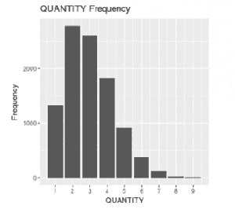

QUANTITY 频率

由于我们将创建大量的条形图，我们希望避免复制粘贴我们刚刚编写的代码，不仅如此，我们还希望使其更加灵活。为了实现这一点，我们将通过参数化我们的代码并考虑我们应该覆盖的不同场景来泛化我们的代码。

那么，我们可能希望我们的自定义`graph_bars()`函数允许我们做什么呢？首先，我们可能希望为我们的*x*轴和*y*轴指定不同的变量。为此，我们需要了解`geom_bar()`函数的内部工作方式。如果你回顾一下代码，我们从未指定*y*轴的变量，`ggplot()`自动使用了`QUANTITY`数字在数据中出现的次数（频率）。

如果我们想使用每次销售的`PROFIT`值作为*y*轴的变量呢？在这种情况下，我们需要意识到，当`QUANTITY`为二或三时，我们可能有超过 2,000 个不同的`PROFIT`值，而在其他情况下则较少。在我们能够在*y*轴中使用`PROFIT`之前，我们需要以某种方式对这些`PROFIT`值进行聚合。

任何可以将`PROFIT`值减少为所有交易的单个值的函数，对于每个`QUANTITY`值，都可以用来聚合数据。然而，最常见的选择是使用平均值或总和。平均值将显示一个图表，我们可以看到每个`QUANTITY`值的平均`PROFIT`。总和将显示每个`QUANTITY`值的总`PROFIT`。如果我们想在*y*轴上使用`PROFIT_RATIO`（或任何其他数值变量），这也适用。最直观的选择是对于`PROFIT`（总利润）使用总和，对于`PROFIT_RATIO`（平均利润比率）使用平均值，因此我们将使用这些。

对于*x*轴，我们可能拥有分类、数值或日期变量。对于这个特定的情况，默认的*x*轴选项对于分类和日期变量来说是合适的，但当我们处理数值变量时，我们仍然希望看到所有数字在刻度上。这意味着我们需要在*x*轴上提供对变量类型的检查，如果它是数值型，那么我们需要进行适当的调整（与之前代码中看到的相同调整）。

我们之前所解释的内容就是我们在`graph_bars()`函数中编程的内容。该函数接收数据和*x*轴以及*y*轴变量作为参数。首先，它会检查我们是否指定了特定的*y*轴变量。我们使用第一章中提到的“NULL 检查”技术，即《R 语言入门》。如果我们没有接收到*y*轴变量，那么我们将创建一个条形图，就像我们之前做的那样（默认使用*x*轴变量的频率），并且使用`paste()`函数创建相应的标题。如果我们确实得到了*y*轴的变量（意味着我们处于`else`块中），那么我们需要找出我们需要进行哪种类型的聚合，我们通过使用我们的`get_aggregation()`函数来完成，如果要求我们在*y*轴上绘制`PROFIT`变量，该函数将返回求和作为聚合方法，而在任何其他情况下返回平均值。然后我们使用这个函数名作为`fun.y`参数的值（它被读作*y*的*函数*），并指定我们正在使用一个汇总函数（当你不需要对变量进行聚合时，你应该将`stat = 'identity'`参数发送到`geom_bar()`函数，并避免将其发送到`fun.y`参数）。然后我们根据需要指定图表的标题。在`if else`块之后，我们检查*x*轴的变量类型是否为数值型，如果是，我们应用区间名称转换：

```py
graph_bars <- function(data, x, y = NULL) {
    if (is.null(y)) {
        graph <- ggplot(data, aes_string(x)) +
            geom_bar() +
            ggtitle(paste(x, "Frequency")) +
            ylab("Frequency")
    } else {
        aggregation <- get_aggregation(y)
            graph <- ggplot(data, aes_string(x, y)) +
            geom_bar(fun.y = aggregation, stat = "summary") + 
            ggtitle(paste(y, "by", x))
   }
   if (class(data[, x]) == "numeric") {
        graph <- graph +
            scale_x_continuous(
                breaks = seq(min(data[, x]), max(data[, x])))
   }
   return(graph)
}
```

当使用这个特殊情况的函数时，我们建议你将特殊情况放在检查的`if`部分，以确保你只捕获我们正在寻找的特殊情况，否则返回通用情况。如果你反过来这样做（首先检查通用情况），你无疑会遇到一些棘手的错误：

```py
get_aggregation <- function(y) {
    if (y == "PROFIT") {
        return("sum")
    }
    return("mean")
}
```

现在我们可以使用我们的自定义`graph_bars()`函数创建更多的条形图：

```py
graph_bars(sales, "CONTINENT")
graph_bars(sales, "CONTINENT", "PROFIT")
graph_bars(sales, "CONTINENT", "PROFIT_RATIO")

graph_bars(sales, "PROTEIN_SOURCE")
graph_bars(sales, "PROTEIN_SOURCE", "PROFIT")
graph_bars(sales, "PROTEIN_SOURCE", "PROFIT_RATIO")
```

所有的以下图表都一起显示，以便更容易可视化并节省空间，但您在执行代码时将逐个获得它们。

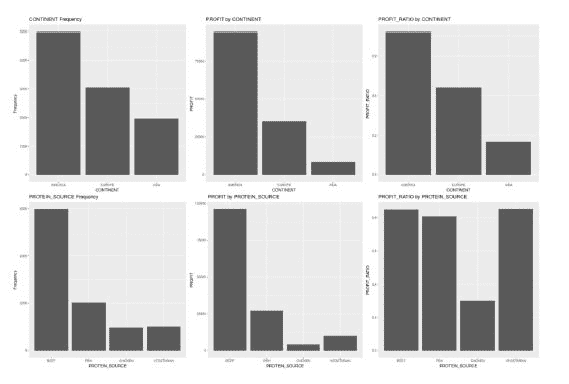

条形图

# 使用颜色添加第三个维度

如常发生的情况，我们想要在已经创建的代码上添加更多功能。在这种情况下，我们想要使用颜色为图表添加第三个维度。我们希望能够指定一个 `color` 变量，该变量将用于进一步划分图表中的数据。

为了实现这一点，我们使用“空值检查”模式在函数签名中添加一个 `color` 参数，并在每个情况中添加相应的参数。在 `aes_string()` 函数中直接添加参数在 `NULL` 的情况下没有问题，因为 `NULL` 值表示我们不想为图表使用填充颜色。

然而，请注意，我们无法使用相同的技巧与 `y` 一起使用。相反，我们检查是否应该发送 `y` 或不发送，并且只有当有非 `NULL` 值时才将其发送到 `ggplot()` 函数。我们还向 `geom_bar()` 函数添加了 `position = "dodge"` 参数，以便得到非堆叠条形图。如果我们不发送此参数，我们会得到堆叠条形图，对于这些特定的图表，我们认为非堆叠版本看起来更好。您可以自由尝试堆叠版本。让我们看看以下代码：

```py
graph_bars <- function(data, x, y = NULL, color = NULL) {
    if (is.null(y)) {
        graph <- ggplot(data, aes_string(x, fill = color)) +
            geom_bar(position = "dodge") +
            ggtitle(paste(x, "Frequency")) +
            ylab("Frequency")
    } else {
        aggregation <- get_aggregation(y)
        graph <- ggplot(data, aes_string(x, y, fill = color)) +
                 geom_bar(
                     fun.y = aggregation, 
                     stat = "summary", position = "dodge") +
                     ggtitle(paste(y, "by", x)
                 )
    }
    if (class(data[, x]) == "numeric") {
        graph <- graph +
            scale_x_continuous(
                breaks = seq(min(data[, x]), 
                max(data[, x]))
            )
    }
    return(graph)
}
```

注意，现在我们有四种可能想要绘制的不同情况，首先，当只指定 `x` 值时，其次，当我们指定 `x` 和 `y` 值时，第三，当我们指定 `x` 和 `color` 值时，第四，当我们指定所有三个值时。由于每个情况的 `ggplot()` 规范都是唯一的，我们不能将它们合并成更少的案例。您还应该注意，我们只在条件块中保留特定检查的特定代码，并将不特定于检查且每次应应用于两个情况的代码移出条件块。这就是我们在外层 `if` 块中使用 `ylab()` 和 `geom_bar()` 函数，在外层 `else` 块中使用 `get_aggregation()` 和 `geom_bar()` 函数所做的事情。否则，我们会不必要地重复代码，这是一种非常不好的做法。

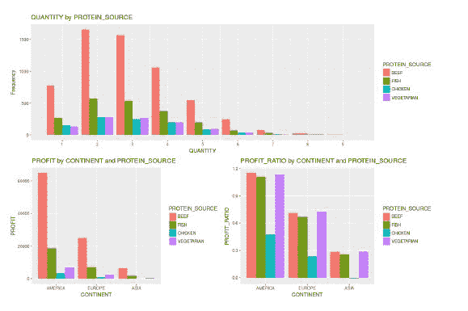

带颜色的条形图

现在我们可以生成可选接收第三个参数 `color`（如上图所示）的条形图，如果发送了该参数，它将用于使用颜色划分数据。请注意，在以下代码的第一行中，我们需要显式发送 `color` 参数。这是因为我们在函数调用中省略了 `y` 参数，如果我们对 `color` 参数不明确，它将被解释为 `x` 参数。您可以在 第一章，*R 语言入门* 中复习函数调用：

```py
graph_bars(sales, "QUANTITY", color = "PROTEIN_SOURCE")
graph_bars(sales, "CONTINENT", "PROFIT", "PROTEIN_SOURCE")
graph_bars(sales, "CONTINENT", "PROFIT_RATIO", "PROTEIN_SOURCE")
```

# 使用条形图绘制顶尖表现者

条形图是世界上使用最广泛的绘图工具之一，本章也不例外。在我们最后的条形图示例中，我们将展示如何按降序排列给定变量的表现最好的几个。我们的目标是绘制`y`轴上的`PROFIT`或`Frequency`，以及`x`轴上的参数化变量。我们希望从左到右按降序显示`x`变量的前`n`个表现最好的，如下面的图表所示。

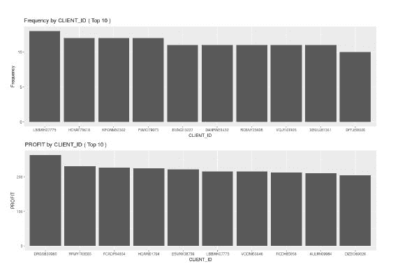

前`n`个条形图

为了实现这一点，我们接收数据（在这种情况下是`sales`）、用于`x`轴的变量`x`、我们想要显示的表现最好的数量`n`，以及我们是否想在`y`轴上使用`PROFIT`（在这种情况下我们将使用`Frequency`），通过使用布尔值`by_profit`。

我们首先检查`by_profit`参数；如果它是`TRUE`，那么我们使用`aggregate()`函数和`sum`运算符对每个`CLIENT_ID`的`PROFIT`数据进行聚合（我们想要的是按客户计算的总利润，而不是按客户计算的平均利润）。然后我们使用`order()`函数对结果进行排序。在`profit_by_client$x`值之前的一横线（`-`）表示我们想要降序排列，而跟在`profit_by_client`之后的`x`是因为`aggregate()`函数的结果是一个包含`Group.1`和`x`列的数据框，分别存储`CLIENT_ID`和`PROFIT`的总和。

由于我们希望在返回我们想要的图时避免代码的不必要重复，我们需要确保`if else`块中的两种情况都使用我们在`ggplot()`函数中将使用的相同变量名。这就是为什么我们明确地将`x`和`y_bar`名称分配给`top_df`数据框。如果你在执行过程中查看`top_df`对象，你会发现在不同的列名下有重复的数据。我们可以通过删除我们不想要的列来解决这个问题，但在这个点上这是不必要的，因为这个对象无论如何都是一次性使用的。然而，在某些情况下，这可能会成为一个我们需要处理的性能问题，但在这个例子中不是。

在`else`块的情况下，从概念上讲，我们做的是同样的事情。然而，在技术上我们实现的方式不同。在这种情况下，我们创建一个表，其中表中的每个条目都是一个唯一的`CLIENT_ID`值，每个条目的值是该`CLIENT_ID`在数据中出现的次数（`Frequency`），我们使用`table()`函数来完成这个操作。然后我们使用`sort()`函数按降序对这些结果进行排序，并取前`n`个结果。然后我们使用这些结果创建一个包含相应列的`top_df`数据框。请注意，我们需要一个辅助名称`aux_name`来为`x`变量命名，因为我们不能通过指定变量名来创建数据框。我们接下来要做的是将`aux_name`列中的数据复制到我们实际需要的名称中（包含在`x`变量中）。

最后，我们创建一个图表并立即返回，而不进行中间存储。到这一点，你应该已经清楚代码中每一行在该部分的作用，所以我们不会再次解释。

现在你可以使用以下代码轻松创建*top n*图表。我们建议你尝试为其他分类变量（例如，`CONTINENT`或`PROTEIN_SOURCE`）创建类似的图表。请注意，每种情况下的`CLIENT_ID`值都不同，这意味着从食品工厂购买最多产品的客户不一定是为其创造最多利润的客户：

```py
graph_top_n_bars(sales, "CLIENT_ID", 10)
graph_top_n_bars(sales, "CLIENT_ID", 10, TRUE)
```

我们希望在接下来的章节中使事情复杂化之前，先从简单开始，展示使用图形函数的基本概念。

# 使用箱线图绘制分解数据

创建条形图在向不熟悉统计学的观众展示结果时很有用，但条形图汇总信息的事实（就像我们在表现最佳者条形图中做的那样）意味着实际上，由于汇总，我们失去了信息。如果你与理解四分位数是什么的人一起工作，那么箱线图可能是一种有用的可视化方式。它们是查看不同变量水平上个体分布的简单方法。

每个箱子代表底部的第一四分位数，顶部的第三四分位数，以及中间线上的中位数。垂直延伸的线延伸到任何在*1.5 * IQR*范围内的观测值，其中**四分位距**（**IQR**）是第一四分位数和第三四分位数之间的距离。任何超过*1.5 * IQR*的观测值被视为异常值，并单独显示。

我们的目的是以分解的方式展示我们根据`PROFIT`创建的针对表现最佳者的条形图。当使用条形图时，困难在于正确汇总数据，但由于我们不需要为箱线图汇总数据，它们的创建非常简单。

我们的`graph_top_n_boxplots()`函数接受`data`值、x 轴和 y 轴的变量、要显示的顶级表现者的数量`n`作为参数，以及可选的线条和填充颜色，分别用`c`和`f`表示。如果没有指定颜色，则使用一系列蓝色。颜色指定必须使用十六进制表示法（[`en.wikipedia.org/wiki/Web_colors#Hex_triplet`](https://en.wikipedia.org/wiki/Web_colors#Hex_triplet)）或 R 颜色名称（[`sape.inf.usi.ch/quick-reference/ggplot2/colour`](http://sape.inf.usi.ch/quick-reference/ggplot2/colour)）。我们简单地使用我们的`filter_n_top()`函数过滤数据，并使用`boxplot()`层以适当的颜色生成箱线图。我们还指定标题为函数接收到的参数的组合：

```py
graph_top_n_boxplots <- 
    function(data, x, y, n, f = "#2196F3", c = "#0D47A1") {
    data <- filter_n_top(sales, n, x)
    return(
        ggplot(data, aes_string(x, y)) +
        geom_boxplot(fill = f, color = c) +
        ggtitle(paste(y, "by", x, "( Top", n, ")"))
    )
}
```

`filter_n_top()`函数接收参数为`data`值，我们想要保留的顶级表现者的数量为`n`，以及表现者的标识符为`by`。首先，我们使用`aggregate()`函数根据选择的标识符（作为列表发送，这是函数所要求的）对`PROFIT`变量进行聚合，并使用`sum`运算符进行聚合以获取每个客户的总`PROFIT`。如果我们使用了`mean`运算符，我们会看到一个每个客户的平均`PROFIT`的图形。然后我们按降序对结果进行排序，这些结果包含在`aggr`对象的第二列中，并从第一列中取出顶部`n`个值，这些值包含标识符（下面的例子中的`CLIENT_ID`值）。最后，我们只保留与`top`对象中顶级标识符对应的数据观测值。

```py
filter_n_top <- function(data, n, by) {
    aggr <- aggregate(data$PROFIT, list(data[, by]), sum)
    top <- aggr[order(-aggr[, 2])[1:n], 1]
    data <- data[data[, by] %in% top, ]
    return(data)
}
```

现在我们可以轻松地复制上一节中创建的条形图，使用箱线图。


顶部 m 个箱线图

如您所见，我们在图中显示了更多信息，但失去了轻松找到每个`CLIENT_ID`的总`PROFIT`值的可能性。选择图形类型取决于您试图传达的信息：

```py
graph_top_n_boxplots(sales, "CLIENT_ID", "PROFIT", 10)
```

# 带有联合和边缘分布的散点图

我们在前面章节中已经看到了如何使用`ggplot()`创建散点图。因此，在本节中，我们将只关注我们之前没有看到的部分。我们的目标是创建不仅显示散点图，而且还通过在两个轴上显示边缘分布来扩展它。这些被称为**边缘图**，对于理解数据如何联合（两个变量）以及边缘（一个变量）分布非常有用。

# 按蛋白质来源和大陆定价和盈利能力

如同往常，我们开始开发我们的绘图函数。我们接收参数为`data`，以及用于*x*轴（`x`）和*y*轴（`y`）的变量，以及在这种情况下，我们预计四种情况，对应于包括或不包括`color`和`shape`变量组合的图形。我们进行标准的检查并创建相应的图形基础。接下来是不同的部分，我们调用`ggExtra`包中的`ggMarginal()`函数，使用我们想要的图形对象（在这种情况下，基础图形加上点层），并指定用于边缘分布的图形类型。您可以选择`density`、`histogram`和`boxplot`。我们选择`histogram`：

```py
graph_marginal_distributions <- 
function(data, x, y, color = NULL, shape = NULL) {
    if (is.null(color)) {
        if (is.null(shape)) {
            graph <- ggplot(data, aes_string(x, y))
        } else {
            graph <- ggplot(data, aes_string(x, y, shape = shape))
        }
    } else {
        if (is.null(shape)) {
            graph <- ggplot(data, aes_string(x, y, color = color))
        } else {
            graph <- ggplot(data, aes_string(x, y, 
                            color = color, 
                            shape = shape))
        }
    }
    return(ggMarginal(graph + geom_point(), type = "histogram"))
}
```

现在我们能够轻松地创建带有边缘分布的散点图。在第一个图形（左侧），我们展示了`PRICE`、`COST`、`PROTEIN_SOURCE`和`CONTINENT`之间的关系。

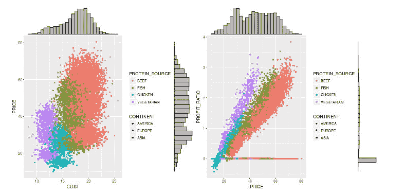

边缘分布

注意，有一些非常明显的群体。在第二个图表（右侧）中，我们展示了`PRICE`、`PROFIT_RATIO`、`PROTEIN_SOURCE`和`CONTINENT`之间的关系。注意，我们发现与我们在 3D 交互散点图中发现的关系相同，即`PRICE`值越高，`PROFIT_RATIO`值越高。然而，这里有两个有趣的发现，我们将在第七章“开发自动演示”中提及。你能说出它们是什么吗？

```py
graph_marginal_distributions(sales, 
       "COST", "PRICE", "PROTEIN_SOURCE", "CONTINENT")
```

如果你使用`graph_marginal_distributions()`函数来绘制`COST`、`PRICE`、`STATUS`和`PAID`的组合图，你应该看不到任何模式出现，因为这些分布是在第四章“模拟销售数据和与数据库协同工作”中随机模拟成正态分布的，并且没有对这些分布应用任何偏斜过程。

# 客户的出生日期、性别和评分

在编程过程中，你可能会遇到的一个问题是，有时你认为足够通用的函数需要以某种方式做出改变。有时，正确的决定是修改现有的函数，但其他时候，正确的决定是创建一个新的函数（可能基于原始函数），这样可以根据需要修改，而不会破坏使用它的旧代码。这种情况发生在函数的假设没有得到满足，并且无法轻易适应时。

在我们的案例中，如果我们想使用`clients`数据来绘制客户的出生日期图，使用*x*轴上的年份、*y*轴上的月份、按性别着色，并通过调整点的尺寸来显示评分，会发生什么？好吧，*x*轴和*y*轴的数据假设可能通过轻微的数据转换就能满足，颜色假设已经满足，但大小假设似乎不符合我们之前的模型。

在我们的`graph_marginal_distributions()`函数中，我们假设我们会使用`shape`作为第四个变量来表示分类变量，但似乎尽管`STARS`变量在技术上是一个因素，但使用大小而不是不同的形状来表示会更好。我们需要在`clients`数据的特殊情况中处理*x*轴、*y*轴和大小假设的事实，这足以决定基于原始函数创建它自己的函数。如果我们想在某个时候将这两个函数合并成一个，我们可以这样做，但在这个阶段没有必要让自己过于复杂化。

在我们的 `graph_marginal_distributions_client_birth_dates()` 函数中，我们只需要接收我们将要处理的数据（在这种情况下是 `clients`）。在这种情况下不需要其他参数，因为所有假设都将硬编码在函数内部，因为我们不打算使代码通用化。为了使代码更易于阅读，我们将使用短变量名来包含我们将用于创建图表规范的字符串。这就是那些 `x`、`y`、`x_noise` 和 `y_noise` 变量的作用。

如前所述，在我们能够生成图表之前，我们需要稍微转换一下数据。首先，我们需要将 `BIRTH_DATE` 分解为 `BD_YEAR` 和 `BD_MONTH`（`BD` 是出生日期的缩写）。然后我们向日期添加噪声，因为如果我们只是保持日期不变，我们会得到一个值网格，而不是一个分布，这是因为年份和月份都是整数值，所以会有很多点堆叠在一起，它们之间会有很多空隙。我们可以看到数据的混合版本，这就是为什么我们需要向其中添加噪声。下面我们可以看到这两个函数是如何在内部工作的。

在我们有了简短的名字并转换了数据之后，我们就准备好创建散点图了，就像我们之前做的那样。这里就是有噪声和无噪声日期之间的区别开始发挥作用的地方。如果我们使用带噪声的日期来显示轴的刻度值，我们会看到像 1953.51、1973.85、1993.23 等年份标签。显然，用这样的值显示年份轴并不直观。同样，对于 *y* 轴，我们会看到像 1.24、4.09、8.53 等月份值。同样的问题。这就是为什么我们需要两种数据版本的原因，一种是有噪声的（实值），用于在图中放置点，另一种是无噪声的（整数值），用于在轴上显示值。最后，我们添加轴标签，并将图表通过 `ggMarginal()` 函数发送出去，就像我们之前做的那样：

```py
graph_marginal_distributions_client_birth_dates <- function(data) {
    x <- "BD_YEAR"
    y <- "BD_MONTH"
    x_noise <- "BD_YEAR_NOISE"
    y_noise <- "BD_MONTH_NOISE"
    data <- disaggregate_dates(data)
    data <- add_dates_noise(data)
    graph <- ggplot(data, aes_string(x_noise, 
                                     y_noise,
                                     size = "STARS",
                                     color = "GENDER")) +
        scale_x_continuous(breaks = seq(min(data[, x]),
                                    max(data[, x]), by = 5)) +
        scale_y_continuous(breaks = seq(min(data[, y]),  
                                    max(data[, y]))) +
                                    geom_point() +
                                    ylab("MONTH") +
                                    xlab("YEAR")
    return(ggMarginal(graph, type = "histogram"))
}
disaggregate_dates <- function(data) {
    data$BD_YEAR <- as.numeric(format(data$BIRTH_DATE, "%Y"))
    data$BD_MONTH <- as.numeric(format(data$BIRTH_DATE, "%m"))
    return(data)
}
```

向数据中添加噪声很简单，我们只需创建新的变量（`BD_YEAR_NOISE` 和 `BD_MONTH_NOISE`），它们具有原始的（整数）值，然后我们添加一个均值为 0、标准差为 0.5 的正态分布的随机数。我们需要一个小的标准差来确保我们的数据不会改变太多：

```py
add_dates_noise <- function(data) {
    year_noise <- rnorm(nrow(data), sd = 0.5)
    month_noise <- rnorm(nrow(data), sd = 0.5)
    data$BD_YEAR_NOISE <- data$BD_YEAR + year_noise
    data$BD_MONTH_NOISE <- data$BD_MONTH + month_noise
    return(data)
}
```

为了分解日期，我们只需创建新的变量（`BD_YEAR` 和 `BD_MONTH`），它们包含使用 R 中的日期格式说明符提取的相应日期值（`%Y` 用于年份和 `%m` 用于数字月份），并将其转换为数字（这样我们就可以向它们添加噪声并绘制它们）。有关日期格式说明符的更多信息，请参阅加州大学伯克利分校的 *R 中的日期和时间* 页面 ([`www.stat.berkeley.edu/~s133/dates.html`](https://www.stat.berkeley.edu/~s133/dates.html))。

让我们借助图表来看看客户的出生日期：

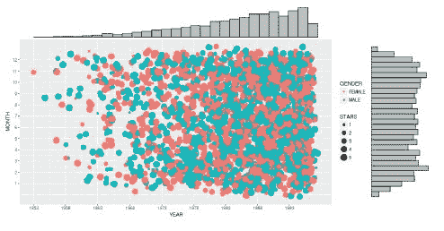

客户出生日期与边缘分布

现在，我们可以轻松地随时创建此图表，而无需担心如何创建它的细节，以下代码即可：

```py
graph_marginal_distributions_client_birth_dates(clients)
```

# 开发我们自己的图表类型——雷达图

本节将把我们的图形函数提升到新的水平，因为我们将在本节中开发自己的自定义图表类型。`ggplot2`包默认没有提供生成雷达图的方法，所以我们将在这个部分中自己开发它。有一些包通过雷达图功能扩展了`ggplot2`（例如，`ggradar`），但我们将展示如何从头开始创建它。阅读本节后，你将能够自己开发复杂的图表。

雷达图是在圆形画布上绘制的，可以同时显示许多变量的值。它们形成一种*雷达状*的形状，如果你想要比较不同实体之间的变量值，它们非常有用。有时，它们被用来直观地了解实体之间相似或不同的程度。如果你不熟悉这种图表类型，以下图片中有一个示例。在我们的例子中，我们将测量食品工厂前五名客户的三个不同宏量营养素，而不是像这个例子那样测量速度、耐用性、舒适性、动力和空间。

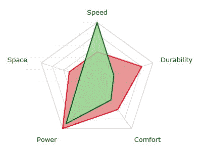

`graph_radar()`函数接收`data`数据框作为参数，以及我们想要显示雷达图的变量（在我们的例子中是`CLIENT_ID`）。首先，它使用`gather()`函数将我们需要的数据从宽格式转换为长格式。然后，它创建将在每个雷达图顶部使用的标签，显示每个`CLIENT_ID`产生的利润。最后，它返回一个图形对象，该对象通过指定宏量营养素和百分比，添加一个按`CLIENT_ID`分组的折线图层、颜色和填充，并调整`alpha`(透明度)和线宽来使其看起来更好。

`facet_wrap()`函数用于对数据中每个`by`变量（在我们的例子中是`CLIENT_ID`）的实例重复相同的绘图。由于它需要一个公式，并且我们希望将其用法通用化，所以我们使用`as.formula()`和`paste()`函数的组合。要回忆这些函数是如何工作的，请参阅第三章，“使用线性模型预测投票”。我们还传递了`nrow = 1`参数，以确保我们得到一个单独的图表行。我们使用`guides()`函数通过发送`"none"`字符串到相应的图例来移除任何图例信息，应用我们的`coord_radar()`函数（下面会详细介绍），并移除轴标签：

```py
graph_radar <- function(data, by) {
    data <- tidyr::gather(
                   data, MACRO, PERCENTAGE, 
                   PROTEIN:FAT, factor_key = TRUE)
    data$CLIENT_ID <- paste(
        data$CLIENT_ID, " ($", data$PROFIT, ")", sep = ""
    )
    return(
        ggplot(data, aes(MACRO, PERCENTAGE)) +
        geom_polygon(
            aes_string(group = by, color = by, fill = by),
            alpha = 0.4,
            size = 2
        ) +
       facet_wrap(as.formula(paste("~", by)), nrow = 1) +
       guides(color = "none", fill = "none") +
       coord_radar() +
       xlab("") +
       ylab("")
   )
}
```

`coord_radar()`函数不是`ggplot2`包中的内置函数，我们需要自己编程实现它。我们将使用的是在互联网上找到的`coord_radar()`的一个略微修改过的版本，最初归功于 Hadley Wickham。它利用`ggproto()`函数继承并修改`ggplot2`中的极坐标层，该层接收参数`theta`（角度）、`r`（半径）、`start`（起始点）、`direction`（是否使用正或负单位）以及一个用于返回由`is_linear`参数所需的函数的 hack，这样其值总是`TRUE`。如果我们没有发送这个最后的 hack，我们就会得到圆形形状，就像我们在尝试绘制直线时使用极坐标所做的那样。前面的代码只是简单地选择适当的轴来表示角度，以便我们得到雷达形状：

```py
coord_radar <- function(theta = "x", start = 0, direction = 1) {
    if (theta == "x") {
        r <- "y"
    } else {
        r <- "x"
    }
    return(ggproto(
        "CordRadar", 
        CoordPolar, 
        theta = theta, 
        r = r, 
        start = start, 
        direction = sign(direction),
        is_linear = function(coord) { return(TRUE) }
    ))
}
```

`ggproto()`函数在`ggplot2`包内用作一个*内部对象系统*，并且是为了在实现分层对象时避免对代码库进行太多修改而开发的。除非绝对必要，否则不建议您使用它。有关对象系统的更多信息，请参阅第八章，*面向对象系统用于跟踪加密货币*。

现在我们已经准备好了我们的图形函数，我们需要确保我们的数据格式正确。为此，我们创建了一个`filter_data()`函数来过滤数据并生成预期的结构。该函数接收我们将使用的`data`、从当前日期回溯要保留的天数作为`n_days`、我们将显示的顶尖表现者的数量作为`n_top`以及我们将聚合的变量作为`aggregate_by`。

首先，我们将数据过滤回`n`天前，然后仅保留根据`aggregate_by`变量排序的`n_top`表现者的观察结果。在这样做的同时，我们相应地更新`data`。然后，我们两次聚合数据，一次按`PROFIT`，另一次按宏量营养素（`PROTEIN`、`CARBS`和`FAT`），并将`CLIENT_ID`名称返回到数据框中。这样做会产生两个数据框，`aggr_profit`和`aggr_macros`，其中每个数据框分别对其各自的变量进行聚合，针对每个唯一的`CLIENT_ID`。请注意，我们将此过程分为两个独立的部分，因为我们想用`mean`来聚合`PROTEIN`、`CARBS`和`FAT`，以得到每个`CLIENT_ID`的平均偏好，但与此同时，我们还想用`sum`来聚合`PROFIT`，以得到每个`CLIENT_ID`的总利润（而不是平均利润）。

最后，我们使用`merge()`函数将数据与我们的`aggregate_by`变量合并，使其成为数据框中数据连接的索引，删除数据框中的残留列，并按`PROFIT`排序：

```py
filter_data <- function(data, n_days, n_top, aggregate_by, static = TRUE) {
    data <- filter_n_days_back(data, n_days)
    data <- filter_n_top(data, n_top, aggregate_by)
    if (static) {
        aggr_profit <- aggregate(
            data[, c("PROFIT", "PROFIT_RATIO")],
            list(data[, aggregate_by]),
            sum
        )
        aggr_profit$CLIENT_ID <- aggr_profit$Group.1
        aggr_macros <- aggregate(
            data[, c("PROTEIN", "CARBS", "FAT")],
            list(data[, aggregate_by]),
            mean
        )
        aggr_macros$CLIENT_ID <- aggr_macros$Group.1
        data <- merge(aggr_profit, aggr_macros, by = aggregate_by)
        drop_columns <- c("Group.1.x", "Group.1.y", "PROFIT_RATIO")
        data <- data[, !(names(data) %in% drop_columns)]
        data <- data[order(-data$PROFIT), ]
    }
    return(data)
}
```

如果你仔细阅读代码，你可能已经注意到了我们没有提到的细节，那就是即使在函数后面没有使用它，我们也使用了 `PROFIT_RATIO` 变量进行聚合。将 `PROFIT_RATIO` 包含在 `aggregate()` 计算中的原因是它产生的副作用。当在 `aggregate()` 函数的数据中指定两个或更多变量时，结果会返回带有实际数据帧列名的结果数据帧 `aggr_profit`。如果我们只指定 `PROFIT` 本身，结果将有一个名为 `x` 的列而不是 `PROFIT`，正如我们在本章前面的代码中看到和使用的。这是一个避免处理变量名更改的简单方法。在我看来，`aggregate()` 函数应该始终返回原始数据帧名称，但它并不这样做，因此我们必须找到解决方案。记住在为他人编程时要考虑这种可用性。

要了解我们实际上是如何过滤日期的，我们可以查看 `filter_n_days_back()` 函数内部。正如你所看到的，我们接收作为参数的 `data` 我们想要过滤的数据和我们要保留的向后天数 `n`。如果 `n` 是 `NULL`，意味着用户不想向后过滤数据，那么我们就简单地返回我们得到相同的 `data`。如果你在 `n` 中收到一个数字，那么我们就用 `Sys.Date() - n` 从当前日期中减去 `n` 天。这个简单的减法操作自动以天为单位完成，这要归功于一种称为 **操作符重载** 的技术。我们将在 第八章 中查看它是如何工作的，*面向对象的系统用于跟踪加密货币*。最后，我们只保留至少是 `n_days_back` 日期的日期（这是另一种使用 *操作符重载* 技术的用法，它允许我们比较日期）。`filter_n_top()` 函数是我们之前为箱线图代码创建的：

```py
filter_n_days_back <- function(data, n) {
    if (is.null(n)) {
        return(data)
    }
    n_days_back <- Sys.Date() - n
    return(data[data[, "DATE"] >= n_days_back, ])
}
```

我们的 `filter_data()` 函数本身非常有用。例如，我们可以通过执行以下命令轻松地显示过去 30 天内前 5 个客户的平均宏量营养素：

```py
filter_data(sales, 30, 5, "CLIENT_ID")
#>    CLIENT_ID PROFIT   PROTEIN     CARBS       FAT
#> 2 BAWHQ69720 74.298 0.3855850 0.3050690 0.3093460
#> 3 CFWSY56410 73.378 0.4732115 0.3460788 0.1807097
#> 4 CQNQB52245 61.468 0.1544217 0.3274938 0.5180846
#> 1 AHTSR81362 58.252 0.3301151 0.3326516 0.3372332
#> 5 VJAQG30905 53.104 0.2056474 0.5909554 0.2033972
```

在创建了相应的图形函数的投资之后，我们现在能够轻松地生成我们自己的雷达图。例如，我们可以通过以下方式轻松地生成我们之前展示的数据的相应雷达图：

```py
graph_radar(filter_data(sales, 30, 5, "CLIENT_ID"), "CLIENT_ID")
```

下面的图像展示了前面的命令：

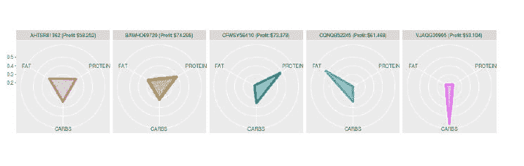

客户的宏量营养素平均雷达图

# 使用交互式 3D 散点图进行探索

在探索数据时，有时查看 3D 散点图很有用。然而，如果散点图是固定的（意味着你不能移动它），可能不容易解释。在这些情况下，有一个交互式图表（你可以移动它）来查看数据的不同角度非常有用。这些图表通常不会进入静态报告，因为它们固定时很难正确解释，但它们在数据探索中非常有用。幸运的是，它们也用`rgl`包中的`plot3d()`函数非常容易创建：

```py
library(rgl)
plot3d(sales$PROTEIN, sales$CARBS, sales$FAT)
plot3d(sales$PROFIT_RATIO, sales$PRICE, sales$QUANTITY)
```

一旦你在电脑上创建了这些图表，记得用鼠标移动它们！第一次这样做时，感觉非常神奇。在这种情况下，你可以看到在`sales`数据中发生的两个现象。首先，宏量营养素百分比必须加起来等于一，由于有三个，所以在左边的图表中你会看到一个三角形形状，这样每个点在其中的坐标之和等于一。其次，右边的图表显示了`PRICE`、`QUANTITY`和`PROFIT_RATIO`之间的关系。它显示我们的销售数据中没有分数量（正如我们设计的那样），有很多订单的`PROFIT_RATIO`为零，因为它们没有完成或付款，而且`PRICE`越高，`PROFIT_RATIO`也越高。

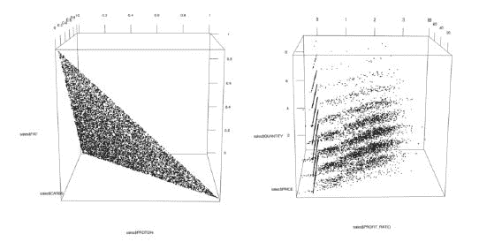

关于这些图表没有太多要解释的。它们创建简单，目的简单，有时非常有用，但你通常不会在书面报告中看到它们。

# 通过时间序列查看动态数据

现在我们将关注另一种非常常见的图表类型：时间序列图。我们的目标是了解过去`n`天内我们的数据是如何表现的，并且，就像我们之前所做的那样，我们希望通过颜色进一步细分，如下面的图表所示：

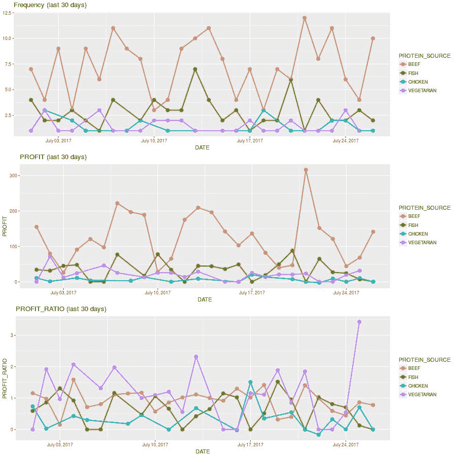

如果你已经阅读了到目前为止的整章内容，你应该能够理解函数的大部分功能。唯一的新函数是`scale_x_date()`。它允许我们指定除了默认之外的其他轴刻度日期格式。在这种情况下，我们想要使用按天划分的间隔（就像我们在之前的某些示例中所做的那样），但我们希望标签的格式类似于**2017 年 7 月 30 日**，例如。为此，我们利用本章前面提到的日期格式，并将所需的字符串结构发送到`date_labels`参数：

```py
graph_last_n_days <- function(data, n, y = NULL, color = NULL) {
    subset <- filter_n_days_back(data, n)
    days_range <- paste("(last ", n, " days)", sep = "")
    date_sequence <- seq(min(subset[, "DATE"]), 
                         max(subset[, "DATE"]), by = "day")
    if (is.null(y)) {
        graph <- 
            ggplot(subset, aes_string(x = "DATE", color = color)) +
            ggtitle(paste("Frequency", days_range))+
            geom_point(stat = "count", size = 3) +
            geom_line(stat = "count", size = 1)
    } else {
        aggregation <- get_aggregation(y)
        graph <- ggplot(subset, aes_string(
                            x = "DATE", 
                            y = y, 
                            color = color)) +
            ggtitle(paste(y, days_range)) +
            geom_point(
                fun.y = aggregation, 
                stat = "summary", size = 3) +
            geom_line(
                fun.y = aggregation, 
                 stat = "summary", size = 1)
    }
    graph <- graph +
        ylab(y) +
        scale_x_date(
        breaks = date_sequence,
        date_labels = "%B %d, %Y"
    )
    return(graph)
}
```

如果你想查看显示过去 30 天频率、`PROFIT`或`PROFIT_RATIO`的简单折线图，你可以使用以下代码。我们不展示这些图像以节省空间：

```py
graph_last_n_days(sales, 30)
graph_last_n_days(sales, 30, "PROFIT")
graph_last_n_days(sales, 30, "PROFIT_RATIO")
```

要查看区分`PROTEIN_SOURCE`的频率、`PROFIT`和`PROFIT_RATIO`的折线图，你可以使用以下代码：

```py
graph_last_n_days(sales, 30, color = "PROTEIN_SOURCE")
graph_last_n_days(sales, 30, "PROFIT", "PROTEIN_SOURCE")
graph_last_n_days(sales, 30, "PROFIT_RATIO", "PROTEIN_SOURCE")
```

你可以使用 `graph_last_n_days()` 函数与其他数据框一起使用。例如，绘制来自 `client_messages` 的过去 30 天的 `STARS` 评分，你需要简单地使用 `as.numeric()` 函数将分类变量 `STARS` 转换为数值变量，以避免类型不匹配的错误，然后调用该函数。

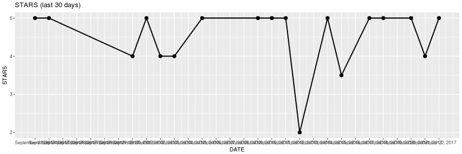

如果你没有指定使用颜色分解的变量，它将默认用黑色绘图：

```py
aux <- client_messages
aux$STARS <- as.numeric(aux$STARS)
graph_last_n_days(aux, 30, "STARS")
```

# 使用静态地图查看地理数据

地图可以是获取地理数据背后直觉的非常有用的工具。在本节中，我们将使用 `ggplot2` 包生成地图。目标是展示我们客户的消息位置，他们购买相关的 `PRICE`，以及相应的 `PROFIT_RATIO`。这个例子将展示我们如何将 `sales` 和 `client_messages` 数据框中的数据连接起来。

我们的 `graph_client_messages_static()` 函数接收 `client_messages` 和 `sales` 数据框作为参数，并且这就是它所需要的，因为我们正在展示未过滤（完整）的数据集。首先，我们需要使用它们共有的标识符 `SALE_ID` 来合并我们的两个数据框。为此，我们使用 `merge()` 函数，并指定我们想要保留 `x` 数据框上的所有观测值，这是第一个数据框（`client_messages`），我们不想保留 `y` 数据框（`sales`）上的观测值，如果它们在第一个数据框中没有相应的标识符。这使我们能够仅保留与客户消息相关联的数据。然后我们使用 `map_data()` 函数（来自 `ggplot2` 包）生成地图地理数据，并过滤掉任何标记为 `"Antarctica"` 的区域。

要实际创建我们想要的图形，我们将使用两个主要图层。第一个是地理数据，它通过 `geom_polygon()` 函数添加，使用 `world_map` 数据，指定坐标和组（组定义国家），并使用一些深色来与我们的点形成对比。第二个图层是消息数据，它通过 `geom_point()` 函数添加，使用合并的 `data` 数据框，相应的坐标，并分别使用 `PRICE` 和 `PROFIT_RATIO` 添加颜色和大小。由于在这个例子中我们使用数值变量来指定颜色，我们将得到一个颜色渐变，而不是像之前例子中的离散颜色。最后，我们使用 `scale_color_viridis()` 函数指定实际的调色板，设置适当的轴标签，并使用 `coord_fixed()` 函数使坐标具有相等的单位。如果我们不使用这个最后一个函数，我们可能会得到变形的地图：

```py
graph_client_messages_static <- function(client_messages, sales) {
    data <- merge(
                  client_messages, sales, 
                  "SALE_ID", all.x = TRUE, 
                  all.y = FALSE
                 )
    world_map <- filter(map_data("world"), region != "Antarctica")
    return(
        ggplot() +
        geom_polygon(
            data = world_map,
            aes(long, lat, group = group),
            color = "grey60",
            fill = "grey50"
        ) +
        geom_point(
            data = data,
            aes(LNG, LAT, color = PRICE, size = PROFIT_RATIO)
        ) +
        scale_color_viridis(option = "inferno") +
        ylab("Latitude") +
        xlab("Longitude") +
        coord_fixed()
    )
}
```

现在，我们可以使用以下函数调用创建我们的地图：

```py
graph_client_messages_static(client_messages, sales)
```

这样做，结果如下图形：

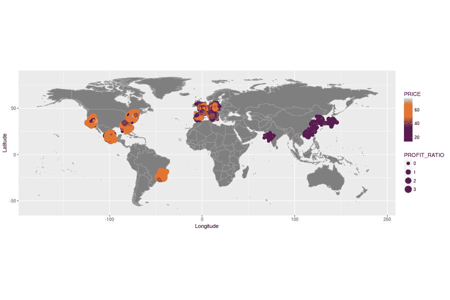

当然，如果你想泛化这个函数，你可以将用于图形指定的某些变量参数化，就像我们在前面的例子中所做的那样。

# 使用交互式地图导航地理数据

我们可以通过交互式地图来导航地理数据，这些交互式地图将在以下章节中解释。

# 可以导航和放大查看的地图

在本节的最后，我们将创建可以导航的交互式地图。这是一个非常强大的工具，可以嵌入到你的 R 项目中，大大增加其价值和对你受众的影响。我们将使用 `leaflet` 包来开发这个地图。我们的目标是显示一个地图，上面有我们从客户那里收到的消息的位置，图标代表我们使用消息的 `STARS` 变量获得的评级类型，以及显示与每个消息对应的购买相关的 `PROFIT` 的工具提示。

我们的 `graph_client_messages_interactive()` 函数接收 `client_messages` 和 `sales` 数据框。与之前的地图一样，我们将显示所有数据而不加任何过滤器，所以这就是我们需要的参数。我们首先做的事情，就像我们之前做的那样，是将数据合并，以便我们只保留与消息相关联的观测值。然后我们向 `data` 数据框添加一个新变量，该变量包含 `leaflet` 将使用的图标规范。为此，我们使用 `awesomeIcons()` 函数（它是 `leaflet` 包的一部分），并指定用于指定图标、标记颜色和函数，我们希望我们的图标是白色的，并且它们应该来自 `ion` 图标库（[`ionicons.com/`](http://ionicons.com/)）。其他可用的图标库有 `glyphicon`（[`glyphicons.com/`](http://glyphicons.com/)）和 `fa`（`fontawesome`，[`fontawesome.io/icons/`](http://fontawesome.io/icons/)）。你可以在参考网站上找到你需要的图标。最后，我们通过使用 `addAwesomeMarkers()` 函数创建标记来返回 *leaflet 图表*，该函数接收一个由 `leaflet()` 函数包装的 *leaflet 对象*，该对象围绕我们的 `data`，经度和纬度的公式，图标的公式以及标签的公式。可选地，我们用 `addProviderTiles()` 包装 *leaflet 图表*，以确保我们在网页浏览器中获取 *瓦片*（地理背景图像）。我们需要这样做，因为在撰写本文时，存在一个错误，在特定情况下不会显示地理数据（只有标记），我们希望避免这个问题，我们可以通过提到的技术轻松做到这一点：

```py
graph_client_messages_interactive <- function(client_messages, sales) {
    data <- merge(
                  client_messages, 
                  sales, 
                  "SALE_ID", 
                  all.x = TRUE, 
                  all.y = FALSE)
    data$ICON <- awesomeIcons(
        markerColor = get_icon_color(data),
        icon = get_icon(data),
        iconColor = 'white',
        library = 'ion'
    )
    return(
        addProviderTiles(addAwesomeMarkers(
            leaflet(data),
           ~LNG, ~LAT,
           icon = ~ICON,
           label = ~paste("Profit:", PROFIT)
        ), providers$OpenStreetMap)
    )
}
```

现在，我们将解释指定图标和标记颜色的函数。`get_icon_color()` 函数将接收我们的 `data` 数据框，并返回一个包含字符串的向量，这些字符串是 `"green"` 或 `"red"`，这取决于相关的 `STARS` 是否高于或等于 4，或者不是。我们使用 `sapply()` 函数这样做。如果您需要这些向量化的函数的复习，请查看第一章，*R 语言入门*：

```py
get_icon_color <- function(data) {
    return(sapply(
        as.numeric(data$STARS),
        function(stars) {
            if (stars >= 4) {
                return("green")
            } else {
                return("red")
            }
        }
    ))
}
```

`get_icon()` 函数非常相似，但它将返回我们想要的图标名称。我们从 `ion` 图标库网站（之前已引用）获取了这些名称：

```py
get_icon <- function(data) {
    return(sapply(
        as.numeric(data$STARS),
        function(stars) {
            if (stars >= 4) {
                return("ion-android-happy")
            } else {
                return("ion-android-sad")
            }
        }
    ))
}
```

现在，我们可以轻松地使用以下代码生成我们客户消息的交互式地图。它将打开一个网络浏览器并显示您可以移动的地图。

```py
graph <- graph_client_messages_interactive(client_messages, sales)
print(graph)
```

地图的初始位置将显示完整的地理数据，如以下图像所示。如您所见，标记包含快乐或悲伤的脸，具体取决于每条消息的评分。此外，标记的颜色是绿色或红色，同样取决于评分。

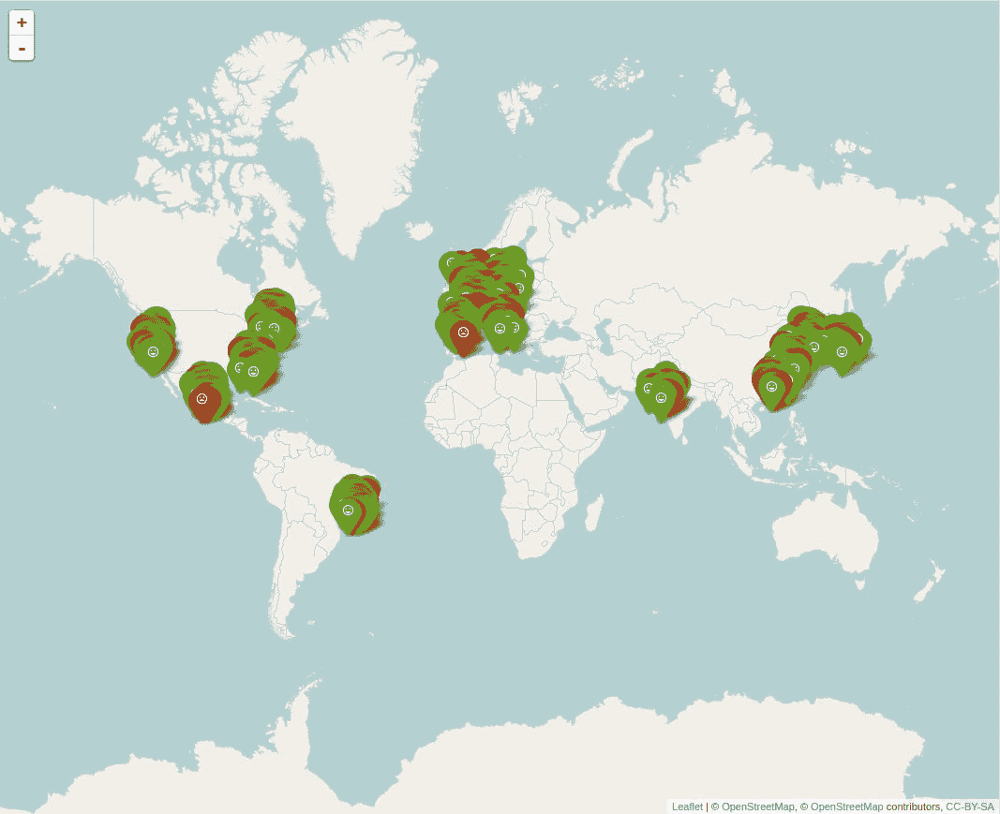

放大后的互动地图可以在以下图像中看到。根据您在 `addProviderTiles()` 函数中选择的提供者，您将获得不同类型的地理图像（您可以在[htt://leaflet-extras.github.io/leaflet-providers/preview/](http://leaflet-extras.github.io/leaflet-providers/preview/)中看到一些实际操作）。

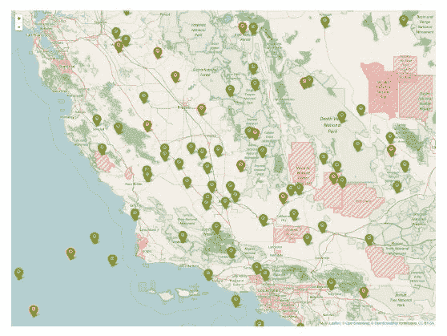

# 高科技地球仪

为了完成这一章，我们将构建一个可以移动并展示给朋友的互动式高科技地球仪。这类可视化通常对分析不是非常有用，但它们很酷！

我们的目标是显示一个地球仪，它将显示来自客户消息的地理数据，以及表示每个销售相关联的 `PROFIT` 的高度条形图和 `PROTEIN_SOURCE` 的颜色。为了实现这一点，我们将使用 `threejs` 包。

如我们之前所做的那样，我们的 `graph_client_message_in_globe()` 函数接收 `client_messages` 和 `sales` 数据，并使用 `setup_globe_data()` 函数进行设置。然后它将使用 `get_world_map_data()` 函数获取世界数据，并使用 `plyr` 包中的 `rbind.fill()` 函数将其附加到 `data` 数据框上。此函数类似于 R 的 `rbind()` 函数，但如果列不匹配，它不会抱怨。相反，它将使用缺失数据指示符填充空值。最后，我们使用 `globejs()` 函数返回一个地球仪对象，该函数接收 `lat` 和 `long` 坐标，`val` 参数下的条形图高度，该参数来自 `PROFIT` 变量，来自在数据设置期间创建的 `COLOR` 变量的 `color`，以及 `atmosphere = TRUE` 参数以显示地球周围的发光效果：

```py
graph_client_messages_in_globe <- function(client_messages, sales) {
    data <- setup_globe_data(client_messages, sales)
    world_map <- get_world_map_data()
    data <- rbind.fill(data, world_map)
    return(globejs(
        lat = data$LAT,
        long = data$LNG,
        val = data$PROFIT¹.2,
        color = data$COLOR,
        pointsize = 1,
        atmosphere = TRUE
    ))
}
```

`setup_globe_data()` 函数执行了我们与所有地图所进行的标准合并，并添加了一个名为 `COLOR` 的新变量，该变量包含用于每个观测值应使用的颜色。在 `ggplot2` 包的情况下，这种颜色分配已经自动为我们完成，但在 `threejs` 包中，我们需要自己完成。它将为 `PROTEIN_SOURCE` 变量中的每个值简单地使用不同的颜色：

```py
setup_globe_data <- function(client_messages, sales) {
    data <- merge(
        client_messages,
        sales,
        "SALE_ID",
        all.x = TRUE,
        all.y = FALSE
    )
    data$COLOR <- NA
    data[data$PROTEIN_SOURCE == "BEEF", "COLOR"] <- "#aaff00"
    data[data$PROTEIN_SOURCE == "FISH", "COLOR"] <- "#00ffaa"
    data[data$PROTEIN_SOURCE == "CHICKEN", "COLOR"] <- "#00aaff"
    data[data$PROTEIN_SOURCE == "VEGETARIAN", "COLOR"] <- "#0055ff"
    return(data)
}
```

`get_world_map_data()` 函数有些复杂。如果您不理解它是如何工作的，不必过于担心，因为您可能不需要自己这样做。我们不能仅仅使用之前用于创建地图的数据来创建我们用 `map_data()` 函数创建的地图，因为所需的数据结构不同。在这种情况下，我们将使用 `tempfile()` 函数创建一个名为 `cache` 的临时文件。然后我们将使用 `url()` 和 `readBin()` 函数读取来自 URL 的二进制文件。该文件是一个 TIFF 文件，我们以 `"raw"` 格式打开它，以保持所有数据原样不变，并避免在 R 中进行任何数据解释。`n` 参数是从数据中读取的最大记录数，在这个例子中是 1 百万。然后我们通过 `writeBin()` 函数发送这些数据，以便将其写入我们之前创建的 `cache` 文件。这种机制是下载一些临时数据的一种方式，以便我们可以将其读入不支持从在线资源读取的功能函数中。

一旦我们准备好了临时文件，我们使用 `rgdal` 包中的 `readGDAL()` 函数读取它，该函数将其作为地理数据读取。这些数据的特定格式包括经度、纬度和一个高度指标。高度指标用于识别没有陆地（海洋）的区域，在这个数据中，其值高于或等于 255。我们继续删除数据中的任何 `NA` 值，并分配默认的 `PROFIT` 和 `COLOR` 值。请注意，我们创建这些 `PROFIT` 和 `COLOR` 值是为了便于稍后合并数据。我们仅为了方便起见使用 `PROFIT` 列名作为高度指标，因为我们希望显示低条形的地理区域，并且我们知道我们将使用 `PROFIT` 生成每个条形的高度：

```py
get_world_map_data <- function() {
    cache <- tempfile()
    writeBin(readBin(url(
"http://illposed.net/nycr2015/MOD13A2_E_NDVI_2014-05-25_rgb_360x180.TIFF",
        open = "rb"), 
        what = "raw", n = 1e6), con = cache)

    world_map <- readGDAL(cache)
    world_map <- as.data.frame(cbind(
                     coordinates(world_map), 
                     world_map@data[,1]))
    names(world_map) <- c("LNG", "LAT", "PROFIT")

    world_map <- world_map[world_map$PROFIT < 255,]
    world_map <- na.exclude(world_map)

    world_map$PROFIT <- 1
    world_map$COLOR <- "#0055ff"

    return(world_map)
}
```

一旦我们投资创建了我们的图形函数，我们就可以创建看起来高科技的地图，显示我们从客户那里收到的消息的位置，以及表示每个消息相关 `PROFIT` 和 `PROTEIN_SOURCE` 的条形和颜色。请随意在您的网络浏览器中移动地球仪：

```py
graph_client_messages_in_globe(client_messages, sales)
```

这效果相当酷，不是吗？

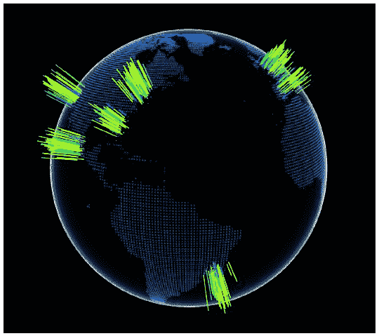

# 摘要

在本章中，你学习了如何创建各种类型的数据可视化以及如何高效地使用图形函数和图形对象。除了基本的图形类型外，你还学习了如何创建交互式图表和地图，以及如何创建我们自己的自定义图形类型。本章展示的基本原理允许你使用如`ggplot2`和`leaflet`等重要且流行的包来创建高质量的视觉呈现。

在下一章，第六章，*通过文本分析理解评论*，我们将分析来自客户消息以及我们从 Twitter 实时获取的文本数据。我们将展示如何根据文本数据生成情感分析，并为我们准备将本章中的图表与下一章中的文本分析一起放入第七章，*开发自动演示*中的自动报告中。
